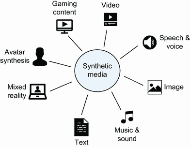
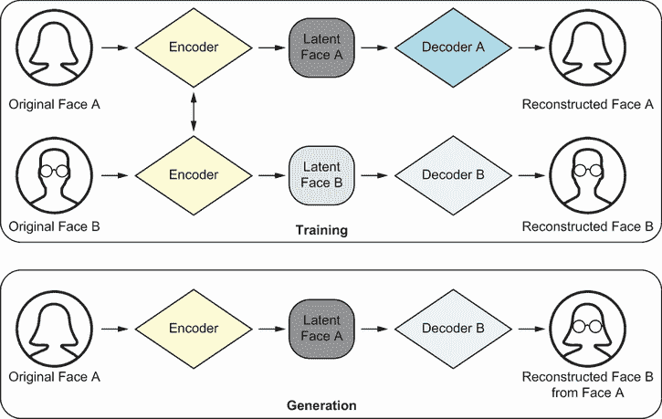
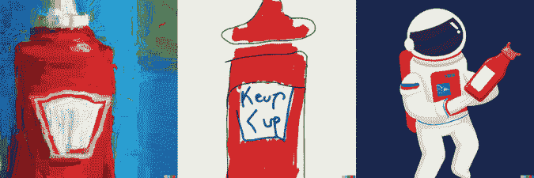
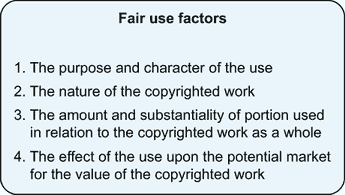
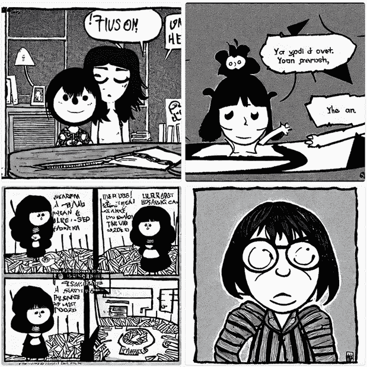

# 第四章：创建内容的演变

本章涵盖

+   创建和检测合成媒体

+   使用生成式 AI 进行内容创作

+   介绍关于使用版权内容的持续辩论

在推特上广泛传播的一张图片中，教皇方济各正在街道上行走，脖子上挂着十字架，戴着典型的白色罗马式便帽。更不寻常的是，这位八旬老人穿着一件引人注目的白色羽绒服，与设计师品牌巴尔曼加亚（Balenciaga）出售的款式非常相似（零售价 3350 美元）。教皇的“风格”，或者说造型，成为了互联网上的热门话题。唯一的问题是？这张图片并不是真实的——它是由一位在芝加哥的建筑工人创造的，他在使用 AI 图像生成工具 Midjourney 时吸食了蘑菇，并认为看到教皇方济各“风格化”出来会很有趣 [[1]](https://www.buzzfeednews.com/article/chrisstokelwalker/pope-puffy-jacket-ai-midjourney-image-creator-interview)。

尽管所谓的“巴尔曼加亚教皇”梗是无害的乐趣，但它欺骗了许多用户。模特和作者克里斯蒂·泰根（Chrissy Teigen）在推特上写道，“我以为教皇的羽绒服是真的，没有多想。我无法想象我会如何适应未来的技术” [[2]](https://twitter.com/chrissyteigen/status/1639802312632975360)。但技术的未来已经到来，AI 生成的媒体正迅速变得与它模仿的形式难以区分。在本章中，我们将讨论合成媒体的方法、风险、机遇和法律环境，这是 LLM 和其他类型生成式 AI 的主要应用之一。

## 合成媒体的出现

合成媒体，或更具体地说，AI 生成的媒体，是一个涵盖使用 AI 创建或修改的内容的通用术语。它有时与“深度伪造”视觉技术同义，但合成内容（如图 4.1 所示）更为广泛，可以包括文本、图像、视频、声音和数据。术语*深度伪造*（deepfake）是由一位 Reddit 用户在 2017 年创造的，他使用面部交换技术修改了色情视频 [[3]](https://mitsloan.mit.edu/ideas-made-to-matter/deepfakes-explained)。深度伪造狭义上指的是伪造某人的特定身体特征或声音，最常见的是“伪造”他人相信某个事件发生了。

合成媒体，或更具体地说，AI 生成的媒体，是一个涵盖使用 AI 创建或修改的内容的通用术语，它包括文本、图像、视频、声音和数据。

图 4.1 合成媒体景观

最初，deepfakes 指的是一种合成媒体形式，其中图像或视频中的人被替换成另一个人，但后来它已经扩展到包括合成媒体应用，如看起来真实但不存在的人的图像，模仿目标的合成音频或视频录制，或者类似于真实新闻文章的有针对性的宣传。deepfakes 通常带有负面含义，突出的例子包括拜登总统宣布向乌克兰派遣美国士兵的虚假视频（见[`mng.bz/p1Q2`](http://mng.bz/p1Q2)）；马克·扎克伯格在编辑视频中声称“谁控制数据，谁就控制未来”（见[`mng.bz/OPVo`](http://mng.bz/OPVo)）；以及唐纳德·特朗普在病毒式 deepfake 中要求比利时退出巴黎气候协议（见[`mng.bz/YR8K`](http://mng.bz/YR8K)）。事实上，有 9/10 的美国人认为 deepfakes 可能带来的危害大于好处[[4]](https://thesentinel.ai/media/Deepfakes%202020:%20The%20Tipping%20Point,%20Sentinel.pdf)。正如我们将讨论的，有许多潜在的有益应用和用例，因此该领域的人们越来越多地使用术语*AI 生成媒体*或*AI 生成合成媒体*来摆脱*deepfakes*这一术语的负面含义。

### 创建合成媒体的流行技术

我们之前讨论了如何使用大型语言模型（LLMs）生成文本。在这里，我们将探讨两种常用的技术来改变或创建图像和视频（因为视频只是图像的序列）。第一种技术，自编码器，使用神经网络来压缩和解压缩图像。你可能还记得第一章中提到的编码器-解码器框架，其中文本被编码成数字表示，以便模型使用，然后解码回可读的输出。同样，图像可以被输入到一个编码器中，它创建该文件的压缩版本。这个文件的压缩版本，也被称为潜在特征或潜在表示，包含一组代表原始图像特征的图案。

假设我们通过编码器传递了某人的面部图像。然后，潜在特征可能包括面部特征模式，如表情、面部角度、肤色等。这些特征随后被传递到一个解码器，解码器根据潜在特征重建图像。自动编码器通常用于人脸交换技术，其中相同的编码器用于从两个面部创建潜在特征，然后使用单独的解码器从潜在特征创建图像，以最好地重建原始图像。在图 4.2 中，相同的编码器创建了原始面部 A 和原始面部 B 的潜在表示。然后，训练用于重建面部 B 的解码器接收面部 A（相同编码器）的面部潜在特征以生成两个面部的无缝融合。例如，解码器可以将眼睛、鼻子、嘴巴和照明等特征映射到混合两个面部。

图 4.2 通过使用具有单个编码器和两个解码器的自动编码器进行深度伪造创建

生成合成媒体的第二种技术是生成对抗网络（GANs），它由两个神经网络组成——一个生成器和一个判别器。例如，假设有一个商店购买真艺术品，然后再次转售。但有一个犯罪分子出售假艺术品以赚钱。最初，犯罪分子在尝试出售假艺术品时可能会犯错误，所以店主可能能够识别出这不是真艺术品。然后，犯罪分子可能会学习店主在判断艺术品真伪时关注的特征，以便犯罪分子可以使用这些知识改进将艺术品作为假品出售的过程，最终取得成功。同时，当店主意外购买并尝试转售一些假艺术品时，他们将从客户或专家那里得到反馈，表明他们的一些艺术品是伪造的，因此店主也必须学习如何更好地区分假艺术品和真艺术品。

如图 4.3 所示，犯罪分子（生成器）的目标是创造出与真品无法区分的假艺术品，而店主（判别器）的目标是能够区分真伪艺术品——这种竞争性反馈循环是生成对抗网络（GANs）背后的主要思想。生成器存在是为了创建新的数据，例如图像，判别器通过将其与训练数据集进行比较来验证图像的真实性，以确定假图像和真图像之间的差异。生成网络的最终目标是创建与真品无法区分的图像。

图 4.3 使用生成器和判别器创建 GANs

### 合成媒体的好与坏

在三星 NEXT 的“合成媒体景观”报告中，他们认为“这项技术将改变我们生产、消费和分发媒体的方式。”他们声称合成媒体是媒体的第三个进化阶段。第一个，旧媒体，通过广播实现，通过电视、广播和印刷为少数人提供了*大规模分发*的可能。第二个，新媒体，通过互联网实现，通过社交媒体为每个人提供了*民主化分发*的可能。第三个，合成媒体，通过人工智能和深度学习实现，将为每个人*民主化媒体创作*和创造力。三星的报告在这里强调了重要的一点——合成媒体将民主化内容创作[[5]](https://www.syntheticmedialandscape.com/)。现在，任何人都可以以低廉的成本制作高质量的内容。这可能会为使用合成媒体技术的小规模创作者提供民主化，他们可以在图像/视频合成空间中使用这项技术，将他们的想象力变为现实，而无需大电影预算。正如我们将在下一节讨论的，我们相信合成媒体将引领新一波的创造力和艺术。

另一个合成媒体的可能好处是它能够匿名化照片和视频以增强隐私。在 HBO 关于反同性恋和女同性恋清洗的纪录片《欢迎来到车臣》中，电影使用深度伪造技术来保护讲述故事以保护他们免受起诉的志愿者的身份[[6]](https://www.nytimes.com/2020/07/01/movies/deepfakes-documentary-welcome-to-chechnya.xhtml)。同样，我们也可以使用合成媒体技术来匿名化公共场所、零售店和社交媒体账户中的图像和视频中的我们的面孔。面部匿名化可以用于隐私保护，同时保留数据效用。

另一方面，AI 生成的媒体也可能引起担忧。我们可以使用相同的技术生成具有对抗性的内容（文本、视频、图像或语音）。恶意行为者可以传播故意误导和对抗性的叙述，这可能会破坏话语，造成分裂，并削弱我们对科学、社会、政治和经济机构的信任。现象“眼见为实”也可能使篡改或非真实的图像和视频传播得更快。在这方面，在一篇题为“深度伪造：对隐私、民主和社会安全的潜在挑战”的文章中，研究人员确定了一个他们称之为*说谎者的红利*的显著危险。在这里，想法是随着公众越来越意识到合成媒体可以多么令人信服地生成，他们可能会对传统真实纪录片证据的真实性更加怀疑[[7]](https://doi.org/10.2139/ssrn.3213954)。我们将在第五章详细讨论虚假/错误信息及其对个人和社会的影响。

合成媒体也臭名昭著地被用于名人色情视频、报复色情或网络性骚扰、欺诈和间谍活动。深度伪造可以用来冒充授权决策者进行金融交易和多种网络安全问题，例如展示高管犯罪或创建虚假财务报表。最后，名人也可以通过合成方式生成用于品牌广告，这可能导致知识产权（IP）收入的损失。在本章的后面部分，我们将讨论与 LLMs 相关的 IP 和版权问题。

### AI 还是真实：检测合成媒体

目前有各种正在进行中的努力来检测 AI 生成的媒体。2023 年初，OpenAI 发布了一个正在开发中的分类器，用于区分机器生成文本和人工撰写的文本，以帮助缓解关于运行自动化虚假信息运动等问题的担忧。他们承认他们的“分类器并不完全可靠”，因为在 26%的时间里正确地识别了 AI 撰写的文本（真阳性）和 9%的时间里错误地将人工撰写的文本标记为 AI 撰写的文本（假阳性）。截至 2023 年 7 月 20 日，由于准确率低，该分类器已被下线 [[8]](https://openai.com/blog/new-ai-classifier-for-indicating-ai-written-text)。

研究人员已经探索了各种技术来检测机器生成的或被操纵的图像、视频和语音，包括数字、物理和语义分析。在国防高级研究计划局（DARPA）的媒体取证（MediFor）项目中，研究人员通过寻找像素表示和物理环境中的不一致性，结合对媒体内容的语义解释来产生操纵指标 [[9]](https://www.darpa.mil/program/media-forensics)。是否存在像素级别的错误？也就是说，是否存在模糊的边缘或重复的像素？对于物理环境，他们检查物理定律是否被违反——阴影、反射、照明等是否与自然定律一致？最后，他们检查语义完整性，这有助于确定与内容相关的上下文信息是否矛盾或不一致。因此，他们检查图像是否被置于不相关的上下文中或被重新利用，以及是否存在任何日期和时间不准确的情况 [[10]](https://www.youtube.com/watch?v=Crfm3vGoBsM)。此项目之后，DARPA 的语义取证（SemaFor）项目旨在不仅检测被操纵的媒体，而且还确定媒体是否是为了恶意目的而生成或操纵的，并将内容的来源归因于个人或组织 [[11]](https://www.darpa.mil/news-events/2021-03-02)。

类似地，已有许多研究通过分析照片响应非均匀性（PRNU）[[12]](https://www.researchgate.net/profile/Zeno-Geradts/publication/329814168_Detection_of_Deepfake_Video_Manipulation/links/5c1bdf7da6fdccfc705da03e/Detection-of-Deepfake-Video-Manipulation.pdf)以及图像和视频中的不一致性伪影，如面部特征或生理信号[[13]](https://arxiv.org/pdf/1806.02877.pdf)和图像质量[[14]](https://ieeexplore.ieee.org/abstract/document/8987375)。这些技术很有前景，但通常有限，解决方案仅限于在精选数据集中检测面部操纵。一项研究表明，可以通过不规则的眼瞳形状检测整个生成的面部，但眼瞳形状规则性的假设并不总是成立[[15]](https://arxiv.org/pdf/2109.00162.pdf)。其他检测深度伪造的技术包括在视频中进行生理分析以估计个体的呼吸和心率是否正常[[16]](https://doi.org/10.1007/978-3-030-87664-7_12)，以及生物识别分析来分析特定个体的行为方式，包括动作和说话风格，然后可以将其与真实情况进行比较以区分伪造和真实[[17]](https://doi.org/10.3390/jimaging9010018)。生物识别分析也应用于深度伪造音频检测，其中音频分析已被证明在检测深度伪造方面非常有效[[18]](https://arxiv.org/pdf/2209.14098.pdf)。

由于其对抗性本质，没有单一的万能药可以始终检测到所有的深度伪造，而且大多数检测技术往往具有较低的一般化能力——如果它们遇到训练数据集中未见过的新的操纵类型，那么它们的性能会显著下降[[17]](https://doi.org/10.3390/jimaging9010018)。尽管在深度伪造检测和解决合成媒体生成某些伪影方面取得了显著进展和显著的解决方案，但我们希望提高意识的努力将激励研究人员解决当前用于测试这些技术的数据集的不足，以及开发能够在各种深度伪造操纵和生成中表现良好的技术。在某个时候，仅基于特定的图像特征大规模自信地检测操纵媒体可能会变得极其困难，甚至可能不可能。

尽管技术解决方案在应对 AI 生成和操纵的媒体方面至关重要，但它们并不能完全解决问题。媒体素养的努力，即教育和告知公众，也是有效应对这一问题的必要步骤。对于视觉深度伪造，如图像和视频，我们可以利用生成的图像的伪影来帮助区分它们与真实图像。

虽然没有明显的迹象，但图像处理通常使用面部变换，我们可以关注脸颊、额头、眼睛、眉毛、嘴唇和面部毛发。我们可以提出以下问题：皮肤的衰老程度是否与其他面部特征一致？肤色是否不均匀？阴影是否预期？面部毛发的变换看起来自然吗？戴眼镜时是否有足够的或过多的反光？这个人眨眼是否足够或过多？唇部动作看起来自然吗？由于手在许多人类图像中不如面部明显，而这些模型是在这些图像上训练的，因此 AI 生成的图像在历史上也经常在手上生成过多的手指。在视频中，面部表情或动作可能与声音不完全一致。一般来说，我们寻找的是视觉深度伪造的扭曲。此外，媒体素养的努力应强调理解共享内容背后的来源和背景。了解内容的起源、可信度和背景可以帮助我们判断它应该得到多少关注。

最后，正如第三章所讨论的，制定适当的立法来规范技术的使用及其分发方式，对于合成媒体负责任的使用和传播将是至关重要的。仅美国就推出了几项合成媒体法案，特别是关于色情内容和操纵民主进程[[19](https://www.malwarebytes.com/blog/news/2020/01/deepfakes-laws-and-proposals-flood-us)]。同时，包括 Facebook、Twitter、Reddit、YouTube 和 TikTok 在内的社交媒体公司已经制定了内容监管政策，禁止在其平台上发布任何具有恶意意图的深度伪造内容。

## 生成式 AI：改变创意工作流程

2022 年 6 月，**《大都会》**时尚杂志揭幕了第一本完全由生成式 AI 制作的封面[[20](https://www.cosmopolitan.com/lifestyle/a40314356/dall-e-2-artificial-intelligence-cover/)]。合成媒体为内容创作者开辟了一个新的可能性领域。它通过消除单调的任务，提高生产力和效率，以及使人们能够以前所未有的方式表达他们的创造力，从而改变了创意工作。在本节中，我们将探讨合成媒体在营销、虚拟网红、艺术和电影等领域的几个创意应用。

### 营销应用

营销应用可能是生成式 AI 最常见的企业用例。有无数例子说明了个人和品牌如何使用合成媒体来创建营销内容，在遵守品牌风格和调性的同时加速个性化内容的交付。这些内容从创建社交媒体和博客文章到开发营销视频和视觉品牌设计。Jasper（参见[www.jasper.ai/](https://www.jasper.ai/）），一个基于第三方模型集合（包括 OpenAI 的 GPT-3.5）及其自身的 AI 内容平台，专注于为商业创造内容。它可以生成各种面向客户的内容，包括社交媒体帖子、网站文案、电子邮件、博客、广告和图像。Jasper 还可以在不同格式、语气和语言之间转换。Jasper 网站宣称他们“在全球创新公司中被超过 10 万个团队信任。”

一些品牌正在使用 DALL-E 2 和其他图像生成工具进行广告宣传。DALL-E 2 是一个 OpenAI 模型，可以根据自然语言描述生成逼真的图像和艺术作品 [[21]](https://openai.com/product/dall-e-2)。海因茨公司推出了一项基于 OpenAI 的 DALL-E 2 的营销活动，“AI 番茄酱”，*甚至人工智能都知道番茄酱是海因茨的* [[22]](https://www.youtube.com/watch?v=LFmpVy6eGXs)。如图 4.4 所示，当我们要求 DALL-E 2 创建一系列受番茄酱启发的通用作品时，图片几乎全部代表了海因茨标志性品牌元素。

图 4.4 从左到右，对 DALL-E 2 的提示：一瓶番茄酱的印象派画作、一个五岁孩子画的番茄酱瓶，以及一个在太空中手持番茄酱瓶的宇航员

雀巢公司使用了 DALL-E 的 Outpainting 功能，该功能可以帮助用户通过添加相同风格的视觉元素来扩展图像超出其原始边界（参见[`mng.bz/z0JX`](http://mng.bz/z0JX)）。他们宣传了一幅由 DALL-E 的 Outpainting 功能生成的扩展版本的名画《牛奶女》，这幅画被用来帮助销售雀巢的酸奶和甜品品牌 La Laitière。该广告由 Ogilvy Paris（参见[`mng.bz/G98R`](http://mng.bz/G98R)）创意传播机构制作，将原画的世界扩展到展示厨房女工准备受 La Laitière 启发的美食 [[23]](https://www.adweek.com/creativity/nestle-brand-is-latest-to-venture-into-brave-new-world-of-ai-art-direction/)。回到之前提到的宇航员手持番茄酱瓶的例子，我们要求 DALL-E Outpainting 扩展图像，如图 4.5 所示。

图 4.5 根据提示“外太空的汉堡没有番茄酱”使用 DALL-E 的 Outpainting 功能的结果

创意机构并非唯一使用生成式 AI 进行营销应用的——加拿大美国演员莱恩·雷诺兹要求 ChatGPT 用他的声音写一个 Mint Mobile 的商业广告，其中包含一个笑话、一个脏话和一个对 Mint 假日促销活动的呼吁 [[24]](https://www.fastcompany.com/90833253/ryan-reynolds-used-ChatGPT-to-make-a-mint-mobile-ad-and-the-results-were-mildly-terrifying)。

截至 2023 年 5 月，19 岁的米奎拉·索萨在 Instagram 上有 280 万粉丝，在 TikTok 上有 360 万粉丝。更为人所知的是，她被称为 Lil Miquela，是《时代》杂志评选的互联网上 25 位最具影响力人物之一，并且她支持黑人的命也是命、生育权利和 LGBTQ+事业。她还出现在了 Calvin Klein 的广告中，与美国模特贝拉·哈迪德一起 [[25]](https://www.elle.com/uk/fashion/a27492073/bella-hadid-calvin-klein-lil-miquela/)。但 Lil Miquela 并非真人——她是虚拟网红中最著名的例子，由洛杉矶初创公司 Brud 创建。Lil Miquela 的创造者在 2019 年完成了一轮 1.25 亿美元的 B 轮融资，押注虚拟网红将成为广告、时尚和商业的未来 [[26]](https://techcrunch.com/2019/01/14/more-investors-are-betting-on-virtual-influencers-like-lil-miquela/)。生成式 AI 增加了虚拟网红的创造，迅速被纳入其内容生产流程的工作流程中。瑞典虚拟网红 Esther Olofsson 使用四种 AI 工具，包括 Stable Diffusion（一种文本到图像的模型）来生成 Esther 的 3D 图像，以及 ChatGPT 来生成她在 Instagram 上的标题。虚拟网红的创造者认为，合成媒体可以扩大他们的创意产出和盈利能力，能够生成无限量的内容，而不受真人网红现实世界限制。然而，虚拟网红也引发了其创造者的伦理问题，特别是关于文化挪用和代表问题，对于创建具有与其自身不同人口特征的虚拟网红的创造者来说尤其如此。虚拟深色皮肤网红 Shudu Gram 被社会理论家帕特里夏·希尔·柯林斯批评为“由一个注意到深色皮肤女性‘运动’的白人男性所策划” [[27]](https://journals.sagepub.com/doi/full/10.1177/1527476420983745) [[28]](https://www.newyorker.com/culture/culture-desk/shudu-gram-is-a-white-mans-digital-projection-of-real-life-black-womanhood)。

### 艺术作品创作

艺术创作是另一个被生成式 AI 颠覆的领域。2018 年，*埃德蒙·贝拉米的肖像*是首个广泛报道的 AI 生成艺术品的销售。由巴黎集体 Obvious 创作的虚构肖像以惊人的 43.25 万美元的价格售出 [[29]](https://news.artnet.com/market/first-ever-artificial-intelligence-portrait-painting-sells-at-christies-1379902)。

自从 20 世纪 60 年代以来，算法已经被用来生成艺术 [[30](https://www.researchgate.net/publication/311104742_Algorithmic_Art_and_Its_Art-Historical_Relationships)]，但 AI 生成的艺术可以产生艺术（图像、电影/视频和音乐），而不需要人类艺术家提供的明确编程指令。DALL-E 2、Stable Diffusion、Midjourney 和 WOMBO Dream 等 AI 工具可以用于根据任何描述性文本输入快速创建艺术品。尽管一些艺术家对这些工具的版权问题表示了担忧（将在第 4.3 节中探讨），但它们也为许多艺术家提供了创意灵感。创作者们使用 DALL-E 来创作粉丝艺术、漫画和设计运动鞋（有人为 OpenAI 的联合创始人山姆·奥尔特曼制作了一双，在他推文后 [[31](https://twitter.com/sama/status/1539670012536844289)]）。纹身艺术家正在使用 DALL-E 与客户一起生成纹身设计，而动画工作室则使用 DALL-E 来设计角色和环境 [[32](https://www.technologyreview.com/2022/12/16/1065005/generative-ai-revolution-art/)]。

另一个知名的 AI 艺术生成工具是谷歌的 DeepDream，它将图像作为输入，输出抽象、迷幻的艺术作品。生成这些迷幻图像的核心思想是向网络提问：“无论你在那里看到什么，我都想要更多！”（见[`mng.bz/0lYl`](http://mng.bz/0lYl)）。在实践中，这意味着模型放大了它在图像中看到的任何模式。图 4.6 通过使用 DALL-E Outpainting 的示例图像（参见图 4.5）作为 DeepDream 的基础图像来说明这一思想。

图 4.6 将 DeepDream 应用于图 4.5，输入提示为“一位穿着银色盔甲、细节复杂的金色装饰的美丽女骑士的肖像”

电影制作者们也获得了新的工具来拓展创意可能性。生成式 AI 正在改变电影的概念化、开发和制作方式。美国编剧工会（WGA）是第一个承担生成式 AI 挑战的劳工组织——“我们的挑战是确保这些技术是作家使用的工具，而不是用来取代作家的工具，”美国编剧工会 2023 年谈判委员会成员约翰·奥古斯特说 [[33](https://www.hollywoodreporter.com/business/business-news/writers-strike-ai-ChatGPT-1235478681/)]。电影制作者可以生成剧本、分镜脚本和场景——正如之前所讨论的，独立电影制作者可以使用生成式 AI 来创作引人入胜的故事和视觉元素，而无需大量预算，而电影制片厂则可以从这些工具中汲取灵感，并利用它们来简化内容。生成式 AI 还可以通过创建增强的角色和环境来提高视觉效果，而不需要繁琐的手动劳动过程。

一个有争议的应用是能够以数字方式重现死者。在 2016 年的电影《侠盗一号：星球大战外传》中，电影制作者们使用了面部交换技术来数字重现已故演员彼得·库欣扮演的角色，他于 1994 年去世 [[34]](https://www.polygon.com/2016/12/27/14092060/rogue-one-star-wars-grand-moff-tarkin-princess-leia)。至于数字复活已故演员的伦理问题，电影《侠盗一号：星球大战外传》的视觉效果总监约翰·诺尔表示：“我们并没有做任何我认为彼得·库欣会反对的事情。我认为这项工作是在极大的关爱和细致的关怀下完成的。我们知道彼得·库欣非常自豪地参与了《星球大战》，并且说过这样的话，他后悔自己从未有机会在另一部《星球大战》电影中出演，因为乔治·卢卡斯杀死了他的角色” [[35]](https://www.theguardian.com/film/2017/jan/16/rogue-one-vfx-jon-knoll-peter-cushing-ethics-of-digital-resurrections)。电影制作者们还在使用生成式 AI 来加速后期制作工作流程，包括剪辑素材、应用视觉效果、音效设计等。最后，正如每个行业一样，电影制作者们可以利用生成式 AI 进行创意灵感激发。

生成式 AI 也为建筑师和设计师提供了灵感——一个这样的例子是项目“这所房子不存在”（见[`thishousedoesnotexist.org`](https://thishousedoesnotexist.org)），该项目生成不存在于现实中的房屋和建筑的 AI 渲染图。AI 生成的工具在建筑领域取得了进展，设计师们使用它们快速迭代解决方案，然后可以使用现有工具进行增强和测试 [[36]](https://www.elledecor.com/life-culture/a42711299/generative-ai-design-architecture/)。

在类似的方向上，音乐家们也在探索人类和机器如何协作，而不是竞争。钢琴家大卫·多兰在斯德哥尔摩艺术大学与一个半自动 AI 系统合作演出，展示了生成式 AI 如何创造性地补充音乐 [[37]](https://www.youtube.com/watch?v=sIFbvgmYBA0)。该 AI 系统由金斯顿大学研究员奥德·本-塔尔设计和监督，他表示，音乐家们可以使用 AI 与钢琴家一起即兴创作超出他们技能范围的作品，或者从 AI 创作的作品中获得灵感，目前是这样的 [[38]](https://www.wired.co.uk/article/generative-ai-music)。

音乐家霍莉·赫尔登也使用了 AI 克隆她的声音，命名为 Holly+，她用它来演唱她无法使用的语言和风格。[39](https://www.youtube.com/watch?v=5cbCYwgQkTE)。Holly+对任何人都是免费的，赫尔登及其团队开发了工具，使任何人都能使用她的形象和声音进行艺术创作（见[`holly.plus/`](https://holly.plus/))。2023 年 11 月，保罗·麦卡特尼和披头士乐队通过使用生成 AI 复活了乐队成员约翰·列侬的声音，发布了一首新歌“Now and Then”。[40](https://www.cnn.com/2023/06/13/entertainment/paul-mccartney-ai-beatles-song/index.xhtml)。虽然这些工具为音乐家提供了机会，但一些人担心 AI 生成的音乐会充斥流媒体平台，与真正的音乐家竞争。当然，也存在版权问题，我们将在下一节中讨论。支持泰勒·斯威夫特和妮琪·米娜等超级巨星的环球媒体集团敦促 Spotify 和 Apple Music 禁止 AI 工具抓取受版权保护的歌曲。[41](https://www.ft.com/content/aec1679b-5a34-4dad-9fc9-f4d8cdd124b9)。

关于 AI 生成的艺术是否应该像人类生成的艺术一样被视为艺术，艺术家是否会被取代，以及更广泛地说，这对创造力意味着什么，目前存在持续的争论。为了捍卫 AI 生成的艺术，艺术家们认为 AI 工具是传达人类心中所蕴含的意义或重要性的媒介，类似于画笔和调色板或相机。GANs 艺术家安娜·里德勒认为，取代艺术家的想法源于对艺术过程的贬低——她说：

AI 无法处理概念：时间、记忆、思维、情感等所有这些都是真正的人类技能，它们使艺术品成为不仅仅是视觉上看起来漂亮的东西。[42](https://www.theguardian.com/technology/2022/nov/12/when-ai-can-make-art-what-does-it-mean-for-creativity-dall-e-midjourney)

AI 生成的艺术不是取代艺术家，而可以理解为人类与机器之间的合作。

## LLM 时代的知识产权

当合成媒体推动艺术的边界时，用于创造它的工具和模型正在测试法律系统的边界。在下一节中，我们将探讨有关收集开放网络数据（包括文本和图像）以及使用这些集合训练的模型生成合成媒体的相关政策。

### 著作权法和合理使用

20 世纪最著名的画家之一巴勃罗·毕加索据说曾说过，“好艺术家模仿；伟大的艺术家窃取” [[43]](https://www.bbc.com/culture/article/20141112-great-artists-steal)。在文学和美术领域，模仿他人的风格是一种常见的做法，并且通常被视为创造性成功的先决条件。当然，这种模仿有其界限，这些界限被编码进法律中，作为知识产权（IP）。知识产权作为一种可以主张法律所有权的财产的概念，可以追溯到 17 世纪的英国 [[44]](https://www.eff.org/issues/intellectual-property/the-term)。在美国，宪法第一篇第八节规定，国会应拥有权力

为了促进科学和实用艺术的进步，通过为作者和发明家在一定时间内对其各自的作品和发现享有专有权利来确保。[[45]](https://www.archives.gov/founding-docs/constitution-transcript)

虽然存在几种不同的知识产权保护类型——发明专利、公司标志和符号的商标、专有信息的商业秘密，如可口可乐的配方——但对于生成式 AI 最具争议的法律问题，是关于模型训练和模型生成中潜在的版权侵权。

版权是对创造性表达作品的专有权利，无论是图像、文本、电影还是歌曲。通常，版权所有者是唯一被授权在一定时间内复制、分发、展示或表演该作品的人，之后作品进入公共领域（在美国，版权从作品创作时开始计算，标准期限为创作者去世后 70 年） [[46]](https://www.copyright.gov/help/faq/faq-duration.xhtml)。美国版权局已声明其政策是，由 AI 生成的文本、图像和其他媒体不符合版权保护资格，尽管只要涉及足够的人类创造力，包含 AI 生成元素的人类作品可能符合，[[47]](https://www.federalregister.gov/documents/2023/03/16/2023-05321/copyright-registration-guidance-works-containing-material-generated-by-artificial-intelligence)。围绕大型语言模型以及生成式图像模型的最紧迫的法律问题，并不是它们的作品是否受版权保护，而是它们是否实际上侵犯了构成其训练数据的艺术家和作家的现有版权。

版权是对创造性表达作品的专有权利，无论是图像、文本、电影还是歌曲。

尽管版权为使用提供了专有权利，但这些权利绝不是绝对的。“合理使用”是一项法律原则，它概述了在无需获得版权持有者许可的情况下使用受版权保护材料何时是可接受的 [[48]](https://www.copyright.gov/fair-use/)。例如，法院通常认为讽刺作品是合理使用，这就是为什么“怪诞阿尔”·扬科维克可以商业化销售带有他自己的滑稽歌词的受版权保护歌曲的旋律副本（例如，“Eat It”和“Like a Surgeon”）。尽管扬科维克在他的网站上表示，他仍然会从原始作者那里获得许可以维持多年来建立的关系 [[49]](https://www.weirdal.com/archives/faq/)。根据 1976 年美国版权法的规定，合理使用取决于四个因素，如图 4.7 所示。

图 4.7 确定受版权保护材料合理使用的四个因素 [[50]](https://www.law.cornell.edu/uscode/text/17/107)

第一个因素，“使用的目的和性质”，指的是如何以及为什么使用受版权保护的材料。与非营利或教育目的相比，商业用途不太可能被视为合理使用——例如，一位大学教授可以为艺术史讲座分发一幅画的打印件，但如果你出售印有同样画作的 T 恤，可能会遇到麻烦。“转换性使用”也是属于这个第一个因素的一个案例。本质上，美国法院发现，当使用的性质是*转换性*的，即添加一个从根本上改变作品的新元素，那么这并不构成版权侵犯。转换性使用还取决于所使用的衍生作品的目的与原作品的消费或享受不同，这对于开发大型语言模型的公司来说是一个重要的辩护。

第二个因素，“受版权保护作品的性质”，指的是不同类型材料所享受的不同程度的保护。因为版权的原始意图是激励自由和创造性的表达，所以使用更多“创造性”的作品，如歌曲、戏剧和小说，与事实或技术性受版权保护的作品相比，更有可能被视为合理使用。换句话说，你可以争论在新的诗句中引用诗句是合理使用，但对于一篇调查报道来说，这样做可能更困难。

第三个因素评估了多少原始素材被重新使用。如果是大量或几乎全部，那么与少量相比，这不太可能被视为合理使用。

第四个也是最后一个因素是关于版权材料的使用是否以及如何影响该作品的市场。例如，如果未经授权的卖家在网上分发新电影，这将对该电影的数字销售或流媒体收入构成严重威胁。那些损害原创作品市场的使用不太可能被认为是合理的 [[48]](https://www.copyright.gov/fair-use/)。

如果这一切看起来有些模糊，那是因为它确实是——如果提起版权诉讼，这些单一因素都不是铁的规则，它们都会被权衡。在转向已经对 LLMs 开发者提起的诉讼之前，让我们首先考察一个类似地基于使用大量互联网版权文本的案例：*Authors Guild v. Google* [[51]](https://www.copyright.gov/fair-use/summaries/authorsguild-google-2dcir2015.pdf)。

2015 年，谷歌与几家主要研究图书馆合作，将他们的藏书数字化——大约有 2000 万卷。这家科技巨头通过合作伙伴关系访问这些书籍，扫描它们，并允许人们搜索文本片段，所有这些都是在没有版权所有者许可的情况下，也没有支付版税。这个案件上诉到了第二巡回上诉法院，该法院同意了下级法院的意见，即谷歌的数字化努力构成了合理使用，因为搜索功能使公众能够访问他们否则无法获得的书本信息，并且尽管谷歌使用了书籍的全文，但他们只返回了匹配文本的片段，而不是使整本书可用。这种使用全部源材料为基本不同的工具的概念与 LLMs 的训练类似。

通常来说，我们迄今为止讨论的 LLMs（大型语言模型）似乎受到合理使用的保护，因为模型与任何文档都非常不同，因此使用这些材料是具有变革性的。然而，问题复杂化了，用户已经证明有时可以让 LLMs 逐字逐句地重复文本。由于 LLMs 的概率性质，很难一致地展示“记忆”源材料的例子。由于对 LLMs 确切学习内容的理解不足，即使是它们的开发者也不太可能确切地说出模型何时会逐字逐句地复制短语或文本。尽管如此，根据*Authors Guild v. Google*的先例，LLMs 被认为合理使用的可能性似乎相当大。

大型语言模型（LLMs）并不是唯一在版权方面引起轰动的生成模型——如前所述，还有令人印象深刻的生成模型能够创建所有类型的合成媒体，包括图像、音频和视频。其中一些最受欢迎的模型，包括 Midjourney 和 Stable Diffusion，是文本到图像的模型：用户可以描述他们想要的图片外观，模型将为他们生成。

就像大型语言模型（LLMs）一样，生成式图像模型在从互联网收集的大量数据上进行训练。与像 Common Crawl 这样的文本数据集一样，也存在常见的图像数据集，例如由非营利组织大规模人工智能开放网络（LAION）编纂的包含 58 亿张图像的 LAION-5B 数据集。LAION-5B 被 Stability AI（Stable Diffusion 的开发者）和其他公司使用；它由公开在线可用的图像组成，包括股票照片和编辑摄影。一位德国摄影师在发现他的部分股票照片被用于 LAION-5B 后，要求将其删除；LAION 回应称，满足此类请求是不可能的，因为数据库中只包含图像链接，没有存储任何内容，他们无法轻易识别出哪些图像来自他的作品集。德国版权法——像许多国家一样——允许在数据“合法可访问”且之后删除的情况下进行数据挖掘，但生成模型的兴起使得这个问题受到了更多的审查[[52](https://www.vice.com/en/article/pkapb7/a-photographer-tried-to-get-his-photos-removed-from-an-ai-dataset-he-got-an-invoice-instead)]。Stability AI 后来宣布，他们将尊重包括在 LAION 数据集中的艺术家的工作中的退出请求[[53](https://arstechnica.com/information-technology/2022/12/stability-ai-plans-to-let-artists-opt-out-of-stable-diffusion-3-image-training/)]。

Stability AI 目前正在因使用 Getty 收藏中的超过 1200 万张照片而受到 Getty Images 的起诉[[52](https://www.vice.com/en/article/pkapb7/a-photographer-tried-to-get-his-photos-removed-from-an-ai-dataset-he-got-an-invoice-instead)]，[[54](https://fingfx.thomsonreuters.com/gfx/legaldocs/byvrlkmwnve/GETTY%20IMAGES%20AI%20LAWSUIT%20complaint.pdf)]。在诉状中，原告写道：

Getty Images 在近三十年的时间里，以巨大的成本精心挑选了数亿个高质量的视觉资产……其中许多图像是由 Getty Images 的摄影师作为雇佣作品创作的，其他则是由 Getty Images 从第三方获得，并转让了其相关的版权，剩余的则是由 Getty Images 的数百个内容合作伙伴或数十万贡献摄影师许可的，他们依赖 Getty Images 为他们产生的许可收入。[55](https://fingfx.thomsonreuters.com/gfx/legaldocs/byvrlkmwnve/GETTY%20IMAGES%20AI%20LAWSUIT%20complaint.pdf)

其隐含意义很明确：生成式 AI 模型对 Getty 和作为行业的股票摄影构成了生存威胁。Getty 希望得到对其贡献和感知到的版权侵权的赔偿，但正如大型文本数据集一样，很难确定模型从任何单一图像中保留了多少信息，而且，再次强调，Stability AI 的使用似乎具有变革性。

有趣的是，由于训练数据中的一个瑕疵，Getty 可能拥有更强的诉讼理由：投诉进一步指控以下内容：

通常，Stable Diffusion 生成的输出包含 Getty Images 水印的修改版本，这导致了对图像来源的混淆，并错误地暗示与 Getty Images 有关联。虽然通过使用 Stable Diffusion 生成的一些输出在美学上令人愉悦，但其他输出质量较低，有时从奇异到丑陋不等。Stability AI 将 Getty Images 的标志融入低质量、不吸引人或有冒犯性的图像中，进一步违反了联邦和州商标法。[55](https://fingfx.thomsonreuters.com/gfx/legaldocs/byvrlkmwnve/GETTY%20IMAGES%20AI%20LAWSUIT%20complaint.pdf)

如果图像上出现 Getty Images 的水印，那么 Stable Diffusion 或其用户可能会被发现在侵犯商标权，尽管 Stability AI 无疑会迅速采取措施解决这个问题。总的来说，这是一个相对未经验证的法律法规领域。

当一个模型不仅学会了人类艺术家捕捉的图像，而且还编码了该艺术家的风格时，事情变得更加复杂。除了生成逼真的渲染效果外，像 Midjourney 和 Stable Diffusion 这样的生成模型还能够以特定风格创作艺术品，如第“生成 AI 在创意工作流程”节所述。风格通常不受版权保护，但很容易理解艺术家们可能会认为这种模仿会贬低或削弱他们的作品。Sarah Andersen 是一位著名的漫画家，她在“Sarah’s Scribbles”系列中发布网络漫画，她写了一篇关于她经历另类右翼网络暴民通过编辑文字和帧来改变其意义的《纽约时报》观点文章。图 4.8 展示了由 AI 工具以她的艺术风格生成的艺术品示例——文字明显混乱，但 Andersen 的一些视觉元素仍然存在。“当我检查了[`haveibeentrained.com`](https://haveibeentrained.com)网站时，这是一个允许人们搜索 LAION 数据集的网站，我的许多作品都在那里，以至于填满了我的整个桌面屏幕，”Andersen 证实，并担心 AI 工具会被用来再次扭曲她的创作[[56](https://www.nytimes.com/2022/12/31/opinion/sarah-andersen-how-algorithim-took-my-work.xhtml)]。

Andersen 是三位原告之一，与 Karla Ortiz 和 Kelly McKernan 一起，对 Midjourney、Stability AI 和 DeviantArt 提起了集体诉讼。像 Andersen 一样，Ortiz 和 McKernan 同样发现这些工具能够以令人感到个人侵犯的方式生成他们风格的图像。“他们用我们的作品训练了这些模型。他们剥夺了我们决定是否想成为其中一部分的权利，”Ortiz 说[[56](https://www.nytimes.com/2022/12/31/opinion/sarah-andersen-how-algorithim-took-my-work.xhtml)] [[57](https://www.buzzfeednews.com/article/pranavdixit/ai-art-generators-lawsuit-stable-diffusion-midjourney)]。

图 4.8 使用开源图像生成模型并以提示“Sarah Andersen 网络漫画”创建的 AI 图像

虽然 Andersen、Ortiz 和 McKernen 的诉讼结果尚待观察，但这些工具仍在世界各地被用来生成和实验新的艺术形式。公平使用的宽容结构意味着，对现状的任何重大改变都需要为在训练 AI 模型中使用树立新的先例。然而，与此同时，我们谈论的许多数据集和模型已经是开源的，这意味着任何人都可以训练自己的模型或创建现有模型的新版本。无论任何特定公司是否改变其数据集构建程序，或者最终支付损害赔偿金或许可费，从漫画到音乐到诗歌，AI 生成的艺术都将持续存在。

### 开源和许可

我们已经提到，由于生产 LLMs 需要巨大的数据和计算规模，这项工作到目前为止主要留给了一些主要的技术公司和一些资金充足的初创公司。然而，由于开源社区的出现，这种情况正在改变。“开源”指的是软件的源代码对公众开放并可重用和修改。更重要的是，开源是一种运动，其倡导者认为开源软件是公共产品，通过更多的协作和参与以及降低进入门槛，可以产生更好的软件。同样，开放数据运动的倡导者建议，当数据广泛可访问时，公众将更加知情，因此政府和非营利组织、科学研究以及其他实体收集或产生的数据应该可以自由使用和构建。

“开源”指的是软件的源代码对公众开放并可重用和修改。

如果有什么的话，生成式图像模型在这方面已经领先于 LLMs。由于对计算机视觉模型的高度兴趣，自从斯坦福大学计算机科学教授 Fei-Fei Li 开始了一个名为 ImageNet 的项目以来，学者们就已经编制了大量的图像数据集。2006 年，Li 有一个先见之明的想法，即计算机视觉的最大进步不一定来自新的、更好的算法，而是来自更好的（以及更大的）数据。她开始创建一个数据库，ImageNet，它最终将包含数百万张描绘数百种事物的图片：动物、家庭用品、地形，以及许多其他类别。经过最初的许多怀疑之后，ImageNet 成为所有计算机视觉模型衡量其结果的标准。它不仅启动了目标检测问题（现在在 ImageNet 上被认为已经“解决”，因为最先进的模型可以近乎完美地执行），而且还迎来了一个为训练和测试模型共享基准数据集的时代。关于 ImageNet 的影响，Li 说：“现在有各种各样的数据集如雨后春笋般涌现和绽放，从视频到语音、游戏到一切。”当然，这也证实了她最初假设的证明点，后来 LLMs 的成功也证实了这一点 [[58]](https://qz.com/1034972/the-data-that-changed-the-direction-of-ai-research-and-possibly-the-world)。

因此，从自然语言到图像和视频等各个问题领域，对数据的贪婪是有益的。像后来的数据集一样，ImageNet 是由互联网上的图片组成的，然后由 Amazon Mechanical Turk（一个众包平台）上的工人进行标注。通过编写少量代码，人们可以通过程序访问网页并复制其内容来编译文本和图像数据。这种做法被称为*网络爬虫*，只要数据是公开可用的，就被反复发现是合法的[[59](https://techcrunch.com/2022/04/18/web-scraping-legal-court/)]——因此几乎任何你在网上浏览到的内容都可以。例如，任何被搜索引擎索引的网站都会被爬虫抓取。一些运营网站的公司，包括 Reddit、Twitter 和 Stack Overflow，这些网站是大型语言模型（LLM）频繁的数据来源，已经公开表示计划向 AI 开发者收费以使用这些数据，尽管在实践中的具体形式尚不清楚——最有可能的是，他们会出售无需爬取的数据集[[60](https://www.zdnet.com/article/stack-overflow-joins-reddit-and-twitter-in-charging-ai-companies-for-training-data/)]。维护网站的人可以添加一个 robots.txt 文件，这本质上是一组针对爬虫的指令，告诉爬虫它可以抓取哪些页面以及哪些页面不应该抓取。在实践中，robots.txt 文件只是建议性的，恶意程序可以轻易地忽略它们。

尽管公开可用的网络内容法律限制不多，但代码和数据都有相应的许可。一些开源许可明确允许所有类型的衍生使用。例如，麻省理工学院许可证（MIT License）是一种宽松的软件许可证——实际上，这是 GitHub 上最受欢迎的许可证之一——允许在专有软件中重用[[61](https://github.blog/2015-03-09-open-source-license-usage-on-github-com/)]。其他许可证仅允许非商业用途的重用；还有一些许可证可能允许在注明出处的情况下重用，或者满足其他条件。代码和数据许可证在法律上是可执行的[[62](https://www.nytimes.com/2008/08/14/technology/14commons.xhtml)]。

代码许可证是软件开发商对微软、GitHub 和 OpenAI 提起的集体诉讼中的核心问题，该诉讼涉及 LLM 工具 Copilot。Copilot 基于 OpenAI 的 GPT-3 模型的变体，特别适用于编写代码，并且是在数千个 GitHub 仓库上训练的。与版权问题一样，关于使用此代码进行 LLM 训练的诉讼正在进行中；不清楚依赖许可而不是合理使用将如何运作。该案的原告认为这种使用相当于“前所未有的软件盗版”，而被告则表示，原告通过要求“禁令和数十亿美元的意外之财”来“分享他们自愿分享的软件”，正在破坏开源的原则。[63](https://www.theverge.com/2023/1/28/23575919/microsoft-openai-github-dismiss-copilot-ai-copyright-lawsuit)

同时，像 Hugging Face 这样的公司对开源原则持乐观态度，它们构建和托管免费使用的模型和数据集。[64](https://huggingface.co/)。与任何著名 AI 实验室无关的人也能够访问这个快速迭代和共享的生态系统，并在某些情况下改进最先进的结果。这伴随着一定的风险，因为任何旨在减少某些危害的限制都可能被下游用户移除。这将更难防止复制内容的创作或执行现有的版权。

尽管如此，我们有理由相信这些问题不会扼杀创造力，反而会促进它。互联网活动家和作家 Cory Doctorow 长期以来一直批评版权，指出尽管这些权利的条款随着时间的推移而变得更长、更广泛，但创作者并没有从中获利——购买他们版权的公司[65](https://doctorow.medium.com/copyright-wont-solve-creators-generative-ai-problem-92d7adbcc6e6)。Doctorow 对进一步扩大版权以防止生成模型访问这些作品进行训练持怀疑态度，他写道：

基本上，机器学习系统会摄入大量的作品，分析它们，找出它们之间的统计相关性，然后利用这些相关性来创作新的作品。这就像是每个创作者都会做的事情的数学化版本：分析他们所钦佩的作品是如何制作的，以便他们可以创作出自己的新作品。如果你翻阅一本艺术书籍，分析你喜欢的画作中的色彩方案或鼻与额头之间的比例，你并没有侵犯版权。我们不应该创造一个新的权利来决定谁有权深入思考你的创意作品并从中学习——这样的权利将使下一代创作者无法（合法地）学习他们的技艺。[65](https://doctorow.medium.com/copyright-wont-solve-creators-generative-ai-problem-92d7adbcc6e6)

人们可能合理地就是否以及如何在大规模模型上使用受版权保护的数据存在分歧。可以肯定的是，随着这些案件的继续发展和先例的建立，我们将从法律角度获得更多的清晰度。但早期的艺术家也对摄影的发明感到担忧，因为没有人会继续绘画或购买画作，因为他们无法在描绘现实方面与相机竞争。相反，艺术家继续绘画，但他们通过自己的解释和表达来传达场景 [[66]](https://www.thecollector.com/how-photography-transformed-art/)。似乎生成模型将成为另一种媒介，而永远不会完全满足人类对美的需求，也不会取代人类对创造力的冲动。

## 摘要

+   综合媒体，或更具体地说，AI 生成媒体，是一个涵盖使用 AI 创建或修改的内容的总称，这些内容包括文本、图像、视频、声音和数据。

+   术语*深度伪造*——由“深度学习”和“伪造”组合而成——有时与视觉合成媒体同义使用，但它通常带有负面含义。

+   自动编码器使用神经网络来压缩和解压缩图像，它们通常用于人脸交换技术。

+   GANs 由两个神经网络组成——一个生成器和一个人工智能判别器。生成器存在是为了创建新的数据，例如图像，判别器通过将图像与训练数据集进行比较来验证图像的真实性，以确定虚假图像和真实图像之间的差异。

+   综合媒体正在使内容创作和创意对每个人来说都更加民主化，同时引领新一波创意和艺术。

+   生成式 AI 也臭名昭著地被用于创建虚假/错误信息内容、名人色情视频、报复色情或网络性骚扰、欺诈和间谍活动。

+   为了对抗深度伪造，采用一种综合方法来检测 AI 生成媒体，包括技术解决方案、媒体素养和教育，以及适当的立法来规范技术的使用是至关重要的。

+   生成式 AI 工具通过消除单调的任务、提高生产力和效率，以及使人们能够以前所未有的方式表达他们的创造力，从而改变了创意工作。

+   开发大型语言模型的公司被指控在训练过程中侵犯了他人的知识产权，特别是版权。

+   在美国，未经许可即可允许公平使用受版权保护的材料，公平使用由 1976 年版权法确立的四个因素确定。

+   虽然有悬而未决的诉讼，但似乎在生成式 AI 领域的多数活动在当前先例下会被认为是公平使用。

+   *开源*是指使软件源代码可供公众修改和重用的实践。

+   开源和开放数据运动加速了发展，并持续推动人工智能的进步。
