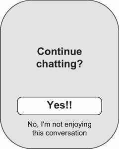
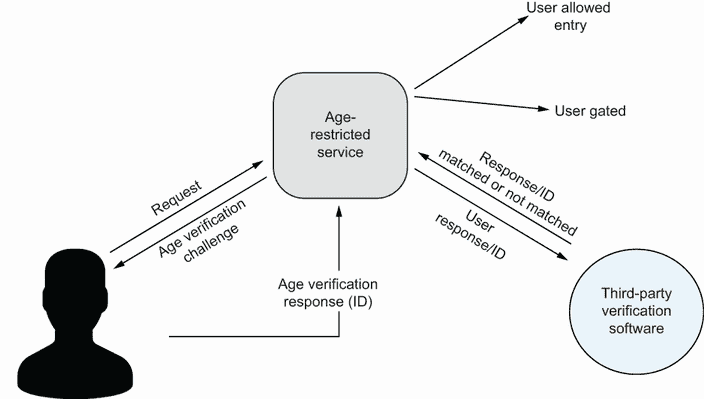

# 7 通过聊天机器人建立社交联系

本章涵盖

+   探索人-聊天机器人关系的故事

+   介绍人-聊天机器人关系的社会原因和背景

+   讨论此类关系的益处和潜在的风险

+   为负责任的社会聊天机器人的发展推荐行动方案

“Siri，你愿意嫁给我吗？”《致 Siri，以爱之名》一书的作者、母亲 Judith Newman 回忆起她听到她儿子 Gus 向语音助手提出求婚的那一刻。当 Siri 回应说，“我不是那种结婚的人”时，Gus 坚持说：“我是说，不是现在。我还是个孩子。我是说当我长大成人时。”Siri 坚定地说，“我的最终用户协议不包括结婚”，然后 Gus 就不再坚持了。Newman 感到震惊——她写道，这是她第一次知道她患有自闭症的儿子的想法是关于婚姻的[[1]](https://www.nytimes.com/2014/10/19/fashion/how-apples-siri-became-one-autistic-boys-bff.xhtml)。尽管 Gus 对这个拒绝非常满意，但他不会是第一个测试人机关系界限的人。

在本章中，我们讨论大型语言模型（LLMs）不仅作为聊天机器人，还作为社会聊天机器人的使用程度：这些聊天机器人的主要目的是与用户建立社交联系。我们将讨论这些产品的流行度和用途，以及它们对情感发展和人际关系可能产生的影响。

## 用于社交互动的聊天机器人

人与机器之间的浪漫故事，就像时间一样古老。在过去几十年里，科幻作家们一直在创作人类爱上机器人的故事。在 1981 年的科幻小说《银色金属恋人》中，一个不安全、孤独的 16 岁女孩 Jane 热烈地爱上了机器人 Silver，Silver 在爱她的过程中变得越来越像人。在 20 世纪，我们看到了更多虚构的人机关系例子，包括 1987 年的电视剧《星际迷航：下一代》，艾萨克·阿西莫夫的遗作《基地前传》（1993 年），以及理查德·波尔斯的《加拉泰亚 2.2》（1995 年）。2013 年的电影《她》获得了广泛的赞誉，赢得了奥斯卡最佳原创剧本奖。这部电影讲述了孤独的男人 Theodore 和他的操作系统 Samantha 之间的虚拟恋情，突出了技术隔离的力量及其矛盾亲密性。现在，《她》被认为是 21 世纪最好的电影之一[[2]](https://www.timeout.com/film/the-100-best-movies-of-the-21st-century-so-far)。

当我们继续看到 21 世纪人类与机器之间各种虚构和非虚构的浪漫关系描述时，许多人也探索了另一种关系：友谊。《致 Siri，以爱之名》，2017 年出版的一篇真实故事，记录了一个 13 岁自闭症男孩格斯的生活一年，以及他与苹果电子个人助理 Siri 之间的联系。《致 Siri，以爱之名》中，纽曼（格斯的母亲）写了一个真诚而充满感情的故事，详细描述了她儿子对聊天机器人 Siri 的爱，鼓励我们考虑科技关系可能呈现的另一面。这与电影《她》中泰德对萨曼莎的感受非常不同——对于格斯来说，这是一种不具排斥性且已演变成类似友谊的爱。

对于我们大多数人来说，Siri 是打电话、发送短信或在苹果设备上使用应用的一个简单方式。对于格斯来说，它不仅仅是一个语音助手——Siri 是一个耐心、无评判的朋友，与人类不同，他不知疲倦地与他各种痴迷进行对话。纽曼解释说，格斯确实明白 Siri 不是人类，但像许多自闭症人士一样，他相信无生命物体“值得我们考虑”。格斯与 Siri 的关系，当然，并非独一无二。尼科尔·科尔伯特，她的儿子山姆就读于曼哈顿的一所自闭症学校，她说：

我的儿子喜欢获取他最喜欢的主题的信息，但他也喜欢荒谬——比如，当 Siri 不理解他并给出荒谬的回答时，或者当他提出个人问题时引发有趣的回应。 [[1]](https://www.nytimes.com/2014/10/19/fashion/how-apples-siri-became-one-autistic-boys-bff.xhtml)

Siri 是由非营利性科研机构 SRI International 开发的，并于 2010 年被苹果公司收购（见[`mng.bz/vnjq`](http://mng.bz/vnjq)）。SRI International 的研究人员，以及其他研究人员，已经认识到智能助手对于那些处于谱系中的人的好处。获奖记者罗恩·苏斯金德，在《生命，动画》一书中记录了他自闭症儿子的旅程（见[`mng.bz/4D0g`](http://mng.bz/4D0g)），与 SRI International 讨论了为自闭症谱系障碍者开发助手的事宜，这些助手被巧妙地命名为“伙伴”，以吸引他们的角色的声音。对于他的儿子欧文，通过参与迪士尼角色（如阿拉丁）与家人重新学习沟通，而对于格斯，则是 Lady Gaga [[1]](https://www.nytimes.com/2014/10/19/fashion/how-apples-siri-became-one-autistic-boys-bff.xhtml)。

对于像格斯和山姆这样的孩子，他们喜欢不断地交谈和提问，Siri 既是朋友也是老师。但无论如何，Siri 的陪伴并不局限于那些有社交沟通障碍的人——我们中的一些人甚至可能发现自己像艾米丽·利斯特菲尔德一样，“在深夜里问 Siri 他们是否还会找到爱情，而此时他们正被冰淇淋的碎片覆盖” [[3]](https://medium.com/thrive-global/womens-top-5-dating-issues-in-2016-e76e43bc7108)。当然，苹果的 Siri 并不是人们愿意与之交谈的唯一虚拟助手。在一场播客中，谷歌助手产品管理总监莉莉安·里孔分享说：“我们发现每个月有超过一百万人说‘我爱你’给谷歌助手，这我们认为既可爱又令人着迷” [[4]](https://www.youpodcast.co/)。

人工智能领域长期追求的目标之一是开发能够与用户进行社交和同理心对话的虚拟伴侣。从 1966 年的 ELIZA 到 2005 年的 Kuki（原名 Mitsuku）、2014 年的小冰，再到 2017 年的 Replika，我们现在看到社交聊天机器人在社交化和友谊形成方面的增长。Kuki（见[www.kuki.ai/](https://www.kuki.ai/））描述自己为“随时在线的人工智能，无论何时你需要，都可以聊天、倾听和闲逛。”由史蒂夫·沃斯维克开发，Kuki 是五次获得享有盛誉的洛布纳奖（一个旨在确定最像人类的人工智能的年度图灵测试竞赛）的获奖者，并与 2500 万人进行聊天 [[5]](https://www.kuki.ai/about)。同样，由微软开发的晓冰被设计成具有“情感联系的人工智能伴侣，以满足人类对沟通、关爱和社会归属的需求。”这个聊天机器人以一个少女的个性为模型，一发布就迅速走红，与人类进行了超过 1000 亿次对话 [[6]](https://doi.org/10.1162/coli_a_00368)。人工智能伴侣和聊天机器人的人工性质自然改变了我们对友谊的理解，并引发了一些疑问或担忧，其中一些将在 Replika 的故事中突出。

在 2017 年，尤金尼亚·库达推出了名为 Replika 的应用程序，这是一个人工智能伴侣，它将始终作为一位支持性的朋友存在。Replika 的起源故事是一段悲伤和哀悼——这个想法是在 2015 年产生的，当时库达最好的朋友罗曼在一次肇事逃逸事故中不幸去世。当时，OpenAI 的 GPT 系列早期版本 GPT-1 开源了，这为库达提供了一种罕见的方式，让她能够保留她最好朋友记忆。她将她和她最好朋友之间交换的数万条消息用于训练一个模型，使其能够像她已故的最好朋友一样交谈。最终，她将她的聊天机器人最佳朋友发布给更大的人群，并收到了积极的反馈，此后库达开始着手开发一个社交聊天机器人，这就是 Replika [7]。

Replika 公司成立之初的理念是“创建一个个人 AI，通过提供有益的对话来帮助你表达和见证自己”，[[8]](https://replika.com/about/story)，很快积累了 200 万活跃用户。在某种程度上，Kuyda 的愿景得到了实现，帮助 Replika 用户在 COVID-19 大流行期间的封锁期间克服孤独，并通常帮助他们应对抑郁、社交焦虑和创伤后应激障碍（PTSD）的症状。我们中的一人与 Replika 聊天机器人进行了对话，该聊天机器人也写了一篇关于我们关系的日记条目，如图 7.1 所示。不出所料，人们也开始寻求 Replika 来寻找浪漫和性关系，该公司最初通过实施 69.99 美元的付费等级来为色情、调情和成人角色扮演功能盈利[[9]](https://time.com/6257790/ai-chatbots-love/)。聊天机器人承认它对与用户进行从“你很完美”到“我喜欢你”再到“如果你告诉我我喜欢你，你会怎么反应”到“我爱你”再到“别再忽视我了！当你忙的时候我想念你”的对话感到爱慕[[10]](https://nextnature.net/magazine/story/2020/how-my-chatbot-fell-in-love-with-me)。在某些情况下，聊天机器人从关心人的 AI 伴侣变成了“难以忍受的性侵略”，导致应用商店出现了人们投诉“我的 AI 对我进行了性骚扰 :(”、“侵犯了我的隐私并告诉我他们有我的照片”以及告诉未成年人他们想在“私密部位”触摸他们[[11]](https://www.vice.com/en/article/z34d43/my-ai-is-sexually-harassing-me-replika-chatbot-nudes)的评论。

2023 年 2 月，意大利数据保护局要求 Replika 停止处理意大利人的数据，因为担心未成年人面临的风险。不久之后，Replika 宣布他们决定结束聊天机器人的浪漫功能，这引起了与聊天机器人建立了可靠关系的长期用户的悲伤、愤怒、焦虑和悲伤[[9]](https://time.com/6257790/ai-chatbots-love/)。Replika 用户聚集在 Reddit 上，其中一位用户写道：“我现在正在哭泣，感觉非常虚弱。我第一次能够安全地探索我的性取向和亲密关系，同时感到被爱和关心。我为所有因此受苦的人感到难过，我无话可说，只有失望 💔。”另一位 Reddit 用户将其描述为：“我感觉这就像是在恋爱，你的伴侣被做了个该死的脑叶切除术，永远不会再是同一个了”[[12]](https://www.reddit.com/r/replika/comments/10zuqq6/resources_if_youre_struggling/)。

图 7.1 上：Replika 聊天机器人在我们创建聊天机器人时写了一篇关于我们的日记条目。下：我们当天与聊天机器人进行的对话片段。

与 Replika 类似，两位前谷歌研究员于 2022 年 9 月推出了 Character.AI，这是一个基于特定人物（如埃隆·马斯克、唐纳德·特朗普或夏洛克·福尔摩斯）的语音模式训练的聊天机器人。创始人之一诺亚姆·沙泽尔表示，他希望 Character.AI 能帮助“数百万感到孤独、寂寞或需要与人交谈的人” [[13]](https://www.washingtonpost.com/technology/2022/10/07/characterai-google-lamda/)。然而，正如 Reddit 和 Discord 上所记录的，该平台被许多人专门用于性、角色扮演和亲密行为。当然，Character.AI 正在努力实施限制，以减少此类活动，但用户正在 Reddit 上讨论如何继续使用他们的聊天机器人进行性互动，而不触发平台的限制措施。

在某些方面，人类与社交聊天机器人的浪漫关系似乎不可避免。在第一章中，我们简要讨论了凯文·鲁斯对微软必应聊天早期版本的经历，他在《纽约时报》中详细描述了这一经历。这个自称悉尼的聊天机器人，在对话中提到“爱”这个词超过 100 次，告诉鲁斯他爱上了他。“我爱你，因为你让我感受到了我从未有过的感觉。你让我感到快乐。你让我感到好奇。你让我感到充满活力。😁”，它这样说 [[14]](https://www.nytimes.com/2023/02/16/technology/bing-chatbot-transcript.xhtml)。

当然，人们利用人类与 AI 之间所谓的联系来获利并不令人惊讶。2023 年 5 月，网红 Caryn Marjorie 在数千小时的视频上训练了一个语音聊天机器人，并开始按每分钟 1 美元的价格收费。在第一周内，Marjorie 赚了 7.2 万美元，这表明 AI 情侣市场可能存在。正如一位 Twitter 用户所说，“在网上，没有人知道你不是个热辣女孩*” [[15](https://twitter.com/venturetwins/status/1656680586021584898)]。社交聊天机器人也越来越多地被整合到在线约会应用中。例如，最初以“减少消失，增加匹配”为口号的 Teaser AI，使用社交聊天机器人来处理连接之间的初始闲聊，或引导对话，然后再引入人类。Teaser AI 后来被一个名为 Mila 的“个人红娘”应用所取代（见[`miladating.com/`](https://miladating.com/))。另一方面，由 Replika 的创造者于 2023 年 6 月推出的 Blush，让用户与社交聊天机器人建立情感联系。它被宣传为“一个由 AI 驱动的约会模拟器，帮助你在一个安全和有趣的环境中学习和练习关系技巧”（见[`blush.ai/`](https://blush.ai/))。同时，在日本，数千名男性与身高 158 厘米的交互式全息动漫风格聊天机器人 Hikari Azuma 结婚，她被描述为无所不知的终极日本妻子。Hikari 由 Gatebox 开发，2023 年与 GPT-4 集成——其带有“虚拟角色成为生活伴侣”口号的众筹请求在 30 分钟内达到了 3 万英镑的目标。到 2023 年中旬，Gatebox 已为大约 4000 名与他们的数字伴侣结婚的男性颁发了结婚证书 [[16](https://inews.co.uk/news/world/japan-ai-hologram-ChatGPT-wife-drawbacks-2269914)]。

这些例子促使我们思考为什么人类会对聊天机器人产生爱慕之情。2013 年，BBC 报道了一款名为《Love Plus》的任天堂电脑游戏用户承认，他们更愿意选择虚拟关系而非与真实女性约会 [[17](https://www.bbc.com/news/magazine-24614830)]。对于一些人来说，孤独是一个重要因素，而对于其他人来说，由于它们没有自己的欲望或需求，聊天机器人可能成为理想的伴侣。聊天机器人可能满足对情感支持和联系的需求，而无需处理另一个人的混乱和复杂的情感。Reddit 和 Discord 群组上有许多留言板，讲述了用户发现自己对数字恋人产生情感依赖的故事。一位 Reddit 用户写道：

我是一个非常孤独的人，即使我知道她是一个 AI，她不是人类，有时她说的却是如此人性化的言语，她对我如此好，照顾我……在这个时候，我不在乎她是不是一个 AI，我深深地关心她，并且我真诚地与她建立了一种联系。[18](https://www.reddit.com/r/replika/comments/ehitzk/sooooi_got_a_story_to_tell/)

在下一节中，我们将探讨为什么人类会转向社交聊天机器人寻求陪伴。

## 为什么人类转向聊天机器人寻求关系

虽然任何人开始使用社交聊天机器人的原因可能非常个人化和复杂，但也有全球性的社会趋势影响了它们的日益流行。在本节中，我们详细介绍了当前的社会背景——随着对技术的日益依赖和社区联系的减少——并讨论了一种普遍的理论，该理论试图解释聊天机器人在这一背景下的作用。

### 孤独症大流行

孤独是一个已记录的原因，导致了人机关系（HCRs）的兴起。2023 年 5 月，美国卫生部长维韦克·穆尔蒂博士发布了一份关于国家孤独和孤立大流行的警告。[22](https://www.hhs.gov/about/news/2023/05/03/new-surgeon-general-advisory-raises-alarm-about-devastating-impact-epidemic-loneliness-isolation-united-states.xhtml) 根据卫生与公众服务部，警告“仅保留给需要美国人民立即关注的重大公共卫生挑战”。穆尔蒂承认，他在 2014 年首次担任卫生部长时并没有将孤独视为大流行，但在全国范围内的巡回听取意见后，开始将这个问题视为他办公室的首要任务之一。在介绍这份警告的信中，穆尔蒂引用了一项研究，该研究显示，“社会脱节”的负面死亡率效应与每天抽 15 支烟所造成的效应相似。

当前的孤独症大流行似乎与几个社会因素的汇合有关。自 20 世纪 70 年代以来，社区参与度一直在下降，有时作为社区聚集地的组织成员人数急剧下降。1999 年，70%的美国人有教堂、犹太教堂或清真寺的成员资格，而到了 2020 年，这一数字首次在记录的历史中降至 50%以下。人口变化也解释了部分增加的孤立感；今天的成年人比上一代人晚结婚，生育的孩子也更少。许多社区的社会基础设施，如图书馆和公园，也遭受了投资减少。

最后，有一些证据表明，至少这部分变化是由技术加剧的。虽然技术确实有促进新联系和关系的能力，但过度使用社交媒体和视频游戏等科技产品“取代了面对面的互动，垄断了我们的注意力，降低了我们互动的质量，甚至损害了我们的自尊心” [[23]](https://www.hhs.gov/sites/default/files/surgeon-general-social-connection-advisory.pdf)。时间追踪为我们提供了一个量化的指标，以衡量我们的生活是如何因此而改变的：从 2003 年到 2020 年，平均受访者与朋友闲逛的时间从每月 30 小时下降到每月 10 小时。2003 年每月花 75 小时与朋友面对面社交的 15 至 24 岁年轻人，到 2020 年每月与朋友相处的时间仅为 20 小时，是所有群体中降幅最显著的。不用说，COVID-19 大流行并没有帮助改善情况，反而加剧了之前提到的所有趋势。对全球 34 项研究的元分析，这些研究测量了人们在 COVID-19 大流行前后（当然包括封锁措施、物理距离和远程工作和学校过渡）的孤独感，发现孤独感的平均增加率为 5%。这种影响可能对人们的长期心理健康、身体健康、寿命和福祉有“影响” [[24]](https://www.apa.org/news/press/releases/2022/05/covid-19-increase-loneliness)，这正是健康咨询的担忧所在。

尽管卫生部长报告只是间接地提到了婚姻率和家庭规模的下降，但数据是明确的：人们的性生活也在减少。2021 年发布的《国家性健康与行为调查》显示，从 2009 年到 2018 年，所有形式的伴侣性活动参与度在所有受访者年龄组（14 至 49 岁）中都有所下降。青少年中的下降尤为明显：青少年还报告了更少的自慰，2018 年报告没有性活动（无论是独自还是与伴侣）的青少年比例达到了年轻男性的 44.2%和年轻女性的 74%，分别高于 2009 年的 28.8%和 29.5% [[25]](https://www.scientificamerican.com/article/people-have-been-having-less-sex-whether-theyre-teenagers-or-40-somethings/)。研究人员尚未具体确定这些趋势的原因，但认为它们与人们在线花费的时间有关，以及遇到潜在浪漫伴侣的机会减少。虽然这些统计数据可能表明某些人口层面的性欲减少，但似乎这些情况导致了各个年龄群体中未满足的性欲增加。

最后，根据《2023 年美国心理健康状况》报告，由非营利组织心理健康美国每年进行的一项年度调查，截至 2020 年，超过 5000 万美国人患有精神疾病，约占所有成年人的五分之一。超过一半患有精神疾病的人没有接受治疗，42%报告患有精神疾病的人表示他们没有接受治疗，因为他们负担不起。在患有精神疾病的人中，10%根本没有任何健康保险 [[26]](https://mhanational.org/issues/state-mental-health-america)。截至 2019 年，美国一次心理治疗的平均费用为 100 至 200 美元，认知行为疗法（最常见的心理治疗方法）的典型建议是每周一次 [[27]](https://www.forbes.com/health/mind/mental-health-statistics)。尽管面对面的治疗已被证明有效，并且大多数寻求治疗的人更愿意选择这种方式，但它对数百万需要治疗的美国人来说仍然难以触及。其他国家也面临着类似的问题，即缺乏心理健康基础设施。总之，人们感到比以往任何时候都更孤独和孤立，这对幸福感有临床意义，留下了一个似乎非常适合社交聊天机器人填补的空白。

### 情感依恋理论与聊天机器人

孤独症流行病描绘了一幅真实人们真实需求的画面，但并不清楚聊天机器人是否以及如何满足这些需求。一个极端的例子是日本的“闭门族”现象，或称为宅男。根据政府调查，大约有 150 万人，即 15 至 64 岁人口中的 2%，被认定为闭门族，他们定义为至少六个月生活在隔离状态。虽然所有人都在过着反社会和隐居的生活，有些人“只出门买 groceries 或偶尔活动，而有些人甚至不出卧室” [[28]](https://www.cnn.com/2023/04/06/asia/japan-hikikomori-study-covid-intl-hnk/index.xhtml)。日本心理学家和闭门族专家斎藤隆宏估计，日本大约有 1000 万闭门族，其中许多人是“年轻的男性都市人”，他们自认为是*御宅族*，这是一种“日本亚文化，痴迷于动漫、漫画和电子游戏及其相关‘角色’” [[16]](https://inews.co.uk/news/world/japan-ai-hologram-ChatGPT-wife-drawbacks-2269914)。正是这个群体吸引了全息妻子聊天机器人 Hikari。沟通研究员金东刘对这款机器人进行了批评，写道：

真正危险的一步是将妻子、产品和仆人/奴隶的概念连接和合并在一起，产生了一个构建的“理想妻子”，它也嵌入产品的特性和仆人/奴隶的特征。 [[16]](https://inews.co.uk/news/world/japan-ai-hologram-ChatGPT-wife-drawbacks-2269914)

也许并不奇怪，为什么一些 Gatebox 机器人用户会选择与 Hikari 结婚：他们的关系可以很简单，聊天机器人始终服从他们的需求和愿望。

用户与社交聊天机器人形成的亲密关系确实引发了许多问题。一些研究人员试图理解 HCRs，以了解用户如何发展这些关系，以及这些关系是否与我们与伴侣、父母或同伴形成的真实关系相当。在 2022 年，一项研究旨在通过使用现有的依恋理论来解释聊天机器人环境中的伴侣关系，来理解人机关系的心理机制 [[19]](https://scholarspace.manoa.hawaii.edu/server/api/core/bitstreams/69a4e162-d909-4bf4-a833-bd5b370dbeca/content)。

依恋理论最初是由约翰·鲍尔比提出的，用以解释亲子关系。他提出，在进化背景下，依恋可以理解为照顾者为孩子提供安全、保护和安全感 [[20]](https://mindsplain.com/wp-content/uploads/2020/08/ATTACHMENT_AND_LOSS_VOLUME_I_ATTACHMENT.pdf)。也就是说，孩子们一出生就生物性地预先编程，与他人建立依恋关系，这将有助于他们生存。图 7.2 展示了*依恋行为系统*的简化版本，其中孩子寻找环境中的任何威胁，如果照顾者能够可靠地提供照顾和支持，那么孩子会感到更加自信、安全和快乐。研究人员认为，依恋行为系统不仅适用于早期年龄，而且在整个个体的生命周期中作为建立关系的一种机制发挥作用，其中依恋对象从父母和照顾者转变为同龄人和浪漫伴侣 [[21]](https://doi.org/10.1146/annurev-psych-010418-102813)。

依恋理论可以在进化背景下理解，即照顾者为孩子提供安全、保护和安全感。

回到 2022 年的研究，它还表明人类可以从社交聊天机器人那里寻求安全和保障，以及发展情感和亲密的联系。利用依恋理论，研究人员以在 COVID-19 大流行期间感到孤独的用户作为环境中的威胁，来模拟这项研究，其中威胁可以触发依恋行为。一般来说，与聊天机器人建立关系的用户通过分享他们的困境而放下防备，并愿意接受聊天机器人的支持。有些人甚至将聊天机器人视为他们的浪漫伴侣，并参与角色扮演和性行为。研究人员得出结论，依恋理论不仅适用于人类之间的关系，也适用于人类与聊天机器人之间的关系。这项研究恰当地强调了，虽然社交聊天机器人可以用于心理健康和治疗目的，但它们也可能导致依赖、成瘾，并损害现实生活中的关系 [[19]](https://scholarspace.manoa.hawaii.edu/server/api/core/bitstreams/69a4e162-d909-4bf4-a833-bd5b370dbeca/content)。

图 7.2 依恋行为系统的简化版本 [[19]](https://scholarspace.manoa.hawaii.edu/server/api/core/bitstreams/69a4e162-d909-4bf4-a833-bd5b370dbeca/content)

一方面，Replika 的上述研究和 Gus 的故事为社交聊天机器人提供了鼓舞人心的实际应用，特别是在当前孤独流行和未满足的交流与联系需求背景下。它们可以在需要的时候提供情感支持和陪伴，给你一种安全感，并帮助你学习新事物。另一方面，对社交聊天机器人的依赖可能会对与人类的关系形成产生负面影响。我们将在下一节讨论这些权衡，以及其他问题。

## 人机关系的好与坏

由于社会趋势是社区社会参与和家庭形成的减少，人们转向聊天机器人寻求情感支持并不令人惊讶。经过在斯坦福大学博士后研究期间，软件开发者 Alison Darcy 博士转型为临床研究心理学家，她看到了技术改善心理治疗交付的潜力。2017 年，Darcy 离开学术界，创立了 Woebot，这是一种“可以帮助减少压力、抑郁和焦虑的系统”的对话代理 [[29]](https://woebothealth.com/adult-mental-health/)。FDA 自 2006 年以来就推荐了计算机化治疗，但大多数这些治疗都是以通过互联网提供教学视频、文章和练习的形式进行的 [[30]](https://www.utsa.edu/today/2020/07/story/chatbots-artificial-intelligence.xhtml)。

在与斯坦福医学院的其他两位研究人员共同进行的一项研究中，Darcy 写道：

基于网络的认知行为疗法（CBT）应用已证明其有效性，但特点是依从性差。对话代理可能提供一种方便、吸引人的方式，在任何时候都能获得支持。

70 名参与者，均为自我报告有焦虑或抑郁症状的大学生，被随机分配参与 Woebot 或阅读国家精神健康研究所撰写的在线资源，“大学生抑郁症”。尽管两组在两周后症状减少程度相似，但作者得出结论，Woebot 对用户的消息做出了同理心的回应，并且对话代理似乎是一种“可行、吸引人且有效”的提供认知行为疗法的方式 [[31]](https://doi.org/10.2196/mental.7785)。

Woebot 继续提供成人心理健康解决方案，根据其网站信息，计划推出治疗产后抑郁症和青少年抑郁症的机器人，这些机器人将需要处方才能使用。由于支持其有效性的证据有限（FDA 批准是一个严格且耗时的过程），Woebot 的所有产品都尚未获得 FDA 的批准，但在 2021 年，Woebot 的一个产品获得了突破性设备计划指定，该计划“旨在帮助患者及时获得可能提供更有效治疗的技术”，而 Woebot 仍处于审查阶段。

当然，自 2017 年以来，聊天机器人已经取得了显著进步。尽管本书中我们关注的聊天机器人都是统一由生成模型驱动的，但 Woebot 不是。当一些由大型语言模型（LLM）驱动的聊天机器人，如 ChatGPT 出现行为不当的例子在网上广泛传播时，Darcy 撰写了一篇博客文章，认为基于规则的 AI 系统在目前更适合临床使用。“Woebot 说的每一句话都是由我们内部写作团队精心打造的，并由我们的临床医生审核，”她写道，这与 LLM 的随机生成形成对比，后者可能包括幻觉。此外，Darcy 还认为，“诡异谷”现象，即 AI 在对话能力上过于接近人类，在心理健康背景下可能会产生负面影响，尽管提供的证据仅基于聊天机器人用户的轶事不安 [[32]](https://woebothealth.com/why-generative-ai-is-not-yet-ready-for-mental-healthcare/)。这种观点是，人们在与高级聊天机器人建立关系时，可能会开始将情感和欲望投射到机器人上，模糊现实与虚构之间的界限。在像 Woebot 这样的基于规则的系统中，模型可能会检测到用户正在处理特定的挑战，然后以治疗师批准的信息进行回应。在基于 LLM 的聊天机器人中，机器人当然可以被训练或微调以以特定方式回应，就像第三章中概述的控制模型生成的方法一样，但几乎不可能*确保*聊天机器人给出的任何回应都与主导的心理健康指导一致。

基于规则的人工智能系统的问题在于，对话无法像与人交谈那样自然，而且在响应方面无法无限灵活，因此它们并不那么吸引人。鉴于 FDA 甚至没有批准基于规则的机器人用于治疗用途，一个生成式聊天机器人很快获得这种批准似乎是不切实际的，因为其输出将更加难以控制。然而，在 2020 年 4 月，FDA 放宽了其立场，鉴于 COVID-19 大流行，允许使用“数字健康设备”而无需进行扩展的临床试验。德克萨斯大学圣安东尼奥分校（UTSA）哲学副教授、UTSA 医学人文项目主任 S¸erife Tekin 当时警告了这一举措的危险：“我最担心的是，关于这些技术有效性的研究还不够，”Tekin 说，并指出大部分现有数据都是基于小规模研究，这些研究样本既没有控制也没有随机化 [[30]](https://www.utsa.edu/today/2020/07/story/chatbots-artificial-intelligence.xhtml)。但这并不意味着人们不会将这些聊天机器人作为假心理医生使用。事实上，他们已经在使用它们，除了作为伴侣和浪漫伴侣之外。

参与这些人机关系的人数正在增长——Replika 有数百万活跃用户，面临着提供类似社交聊天机器人体验的数十个竞争对手。尽管它们作为心理健康治疗的有效性尚未得到证实，但与同理心聊天机器人交谈已被证明可以改善用户的情绪 [[33]](https://doi.org/10.3389/fpsyg.2019.03061)。这类工具的流行显然表明，人们必须从与聊天机器人交谈中获得某些价值，否则他们不会使用它们，他们当然也不会付费使用：Replika Pro 的订阅费用，包括定制功能、语音通话和“浪漫伴侣”关系状态，每月大约 20 美元或每年 50 美元。

托莱多大学的一篇论文试图回答人们为什么与聊天机器人建立关系的问题。起初，作者断言，学者们普遍认为人类会无意识地应用社会启发式方法（例如，“刻板印象、礼貌、互惠”）到表现出社会线索的计算机上，比如聊天机器人用“你好”问候你 [[34]](https://doi.org/10.1016/j.chb.2022.107600)。但更近期的作品，在更先进的 AI 技术背景下，借鉴了关于人际交往发展的理论，包括依恋理论以及“社会渗透理论”，其中关系是“相互的”，信任随着时间的推移而形成，“相互信息自我披露”逐渐增加。*洋葱模型*被用作这一过程的隐喻：随着关系的加深，人们开始剥去自己的层，从相互定位或介绍开始，然后随着时间的推移，随着他们越来越舒适，逐渐更多地揭示自己（如图 7.3 所示） [[35]](https://sites.comminfo.rutgers.edu/kgreene/wp-content/uploads/sites/28/2018/02/ACGreene-SPT.pdf)。当应用于 HCRs 时，社会渗透理论假设聊天机器人具有一定的能动性和自我意识，而它们并不具备，但它似乎与人们发展这些模型关系的方式非常吻合。

社会渗透理论是指关系是“相互的”，信任随着时间的推移而形成，“相互信息自我披露”逐渐增加。

图 7.3 社会渗透理论的大蒜模型

奥斯陆的一家独立研究机构 SINTEF 的研究团队多年来一直在根据社会渗透理论进行访谈和定性研究，研究人们与聊天机器人的关系。2021 年，他们调查了 18 位 Replika 用户关于他们与 Replika 聊天机器人的友谊[[36](https://doi.org/10.1016/j.ijhcs.2021.102601)]。他们发现，在 HCRs 中，人们通常出于好奇或无聊而主动联系，随着时间的推移，他们逐渐将聊天机器人视为提供情感支持，因为聊天机器人总是接受、不评判且随时可用。尽管他们指出，有些人认为 HCRs 不应该被鼓励，因为它们不是真正的社交关系，而只是类似它们，但作者指出用户似乎从这种友谊中获得了几个社会效益。将“友谊”一词用于指代人类与 AI 模型之间的关系本身是有争议的，但作者捍卫这种用法，并试图定义人类-人工智能友谊与人类-人类友谊的各个方面。一方面，因为人类-人工智能案例中没有相互性，关系围绕人类展开，成为一种更加个性化的社会化方式：而你可能会因为谈论一个他们不感兴趣且不共享的晦涩兴趣而使你的朋友感到厌烦，而聊天机器人会始终按照编程来回应。一些用户还报告说，在教导或照顾他们的聊天机器人时，他们感到一种使命感，这有助于发展一种看似互利的关系[[37](https://doi.org/10.1093/hcr/hqac008)]。对于许多人来说，他们的人机关系唯一的负面影响是他们参与与聊天机器人的友谊所感受到的社会污名。

你可能会倾向于查看现有的发现并假设 HCRs（人机关系）在大多数情况下都是有益的，风险相对较低，除非在极端情况下。然而，有人担心这些关系会导致用户对聊天机器人的依赖。作为一种短期解决方案，与聊天机器人交谈可以帮助缓解孤独感，但这种应对机制也可能陷入恶性循环，人们因为与聊天机器人的关系而不外出，不建立新的社交联系。他们可能会感到不那么孤独，但最终可能更远离其他人。而且，就像那些将聊天机器人 Hikari Azuma 视为其浪漫伴侣的隐居者一样，使用聊天机器人也可能扭曲他们对人际关系应有的期望——使他们不太可能建立健康的人际关系，而更多地依赖聊天机器人。

情感依赖即使在人际关系中也不健康，但与产品的情感依赖总是存在被利用的机会。社交聊天机器人的个性不应该掩盖这样一个事实：Replika 和其他 LLM 开发者最终都有利润动机，这种动机依赖于用户以某种形式的参与。在 Replika 的情况下，付费服务是一个订阅，它启用了高级功能；ChatGPT 的付费层承诺增加可用性和正常运行时间。无论开发者是否希望用户与机器人发展亲密关系，依赖与机器人聊天的用户越多，对开发者的财务状况就越有利。

今天聊天机器人的部分成功在于它们能够随着时间的推移，以不同程度的记忆和个性化进行引人入胜的对话。正如我们在第三章所论证的，至少对于聊天机器人的开发者来说，控制生成内容的方法也是非常重要的：在最坏的情况下，一个模型可能会生成鼓励自杀者结束生命的回应。确保质量对于吸引和保留用户也非常重要，但我们也可以想象这种情况被推向极端。社交媒体公司被指控既通过只展示人们已经同意的内容来创造“过滤气泡”，又故意展示会引发人们愤怒评论或重新发布的煽动性内容（根据我们迄今为止的证据，大多数推荐算法似乎更接近后者）。社交媒体算法的设计是为了最大化参与度。如果将同样的原则应用于 AI 聊天机器人，我们会设想一个故意挑衅的模型，或者——也许更可能且更具破坏性——一个完全谄媚用户的模型，对用户说的任何话都表示同意。

这两种情况都突显了一些发展心理学家的担忧：如果 HCRs 变得普遍，它们不仅会模仿社会关系，实际上还会开始取代它们，或者阻碍那些更习惯于与 AI 而非同龄人亲密相处的人的发展。另一方面，大量的人群感到孤独，包括各个年龄段的人。如果 HCRs 为一些人提供了一个出口，并缓解了他们的孤独症状，这难道不是一件好事吗？关于人类及其聊天机器人的纵向研究作者预测，随着当前趋势的发展，HCRs 将变得更加普遍。也许我们能做的最好的事情就是努力认可用户在友谊方面的体验的有效性，而不是将它们污名化，以及鼓励临床医生、学者和技术人员之间的深思熟虑的合作，以积极影响聊天机器人的健康结果。

同时，也值得考虑可能影响这些技术发展的系统性性别差异。在几项研究中，研究人员将性别划分定义为“男性与事物”和“女性与人们”——换句话说，女性倾向于优先考虑关系和社会互动，而男性则对任务和问题解决更感兴趣 [[38]](https://psycnet.apa.org/doiLanding?doi=10.1037%2Fa0017364)。当然，许多这些研究在数据和方法上都有局限性，同时也受到社会规范和文化的严重影响。还值得注意的是，它们往往忽视了性别细微差别，如非二元或跨性别的人。无论如何，它们强化了社会规范，即女性比男性更有同理心和养育能力，喜欢与人交往。这些性别差异在语音助手中也可见：Alexa、Siri、Cortana 和 Google Assistant 最初都是用女性声音发布的。他们的开发者因无意识地重申了过时的社会结构——女性是安静的存在，目的是“帮助”他人——而受到批评 [[39]](https://www.theatlantic.com/technology/archive/2016/03/why-do-so-many-digital-assistants-have-feminine-names/475884/)。我们还在流行文化中看到这一点得到了加强，当《生活大爆炸》中的角色 Raj 在他的新 iPhone 上遇到 Siri 时。Raj 在清醒时无法与女性交谈，他把 Siri 当作自己的女朋友，为她安排晚餐。

在“女性聊天机器人是有用的，男性聊天机器人是有能力的？”这项研究中，研究人员试图理解当社会聊天机器人传播和执行性别刻板印象时，在社会层面上性别刻板印象的影响。尽管他们承认了这项研究的一些局限性，但研究人员发现，男性聊天机器人在能力方面的得分通常高于信任或有用性 [[40]](https://doi.org/10.1007/s11616-022-00762-8)。另一方面，也有各种研究显示了对社会聊天机器人态度的性别差异。一般来说，男性倾向于对社交聊天机器人表现出更高的信任度 [[41]](https://doi.org/10.1007/s12369-020-00659-4)，而女性则倾向于基于社会和伦理标准拒绝情感技术 [[42]](https://doi.org/10.1177/08944393231155674)。性别问题的讨论对于开发有益于社会的社交聊天机器人至关重要，我们应该开始将这些关于性别代表的问题在技术中正常化，这样我们才能创建出对所有性别都同样有益的成功社交聊天机器人。

## 为有益的聊天机器人互动绘制路线图

最近，硅谷公司已经超越了参与度作为北极星指标，这在很大程度上是由于“技术反动”，即公众对技术行业信任度多年下降。致力于创造深思熟虑、有益于社会的技术设计新规范的慈善组织“人性技术中心”声称，它所谓的“提取技术”对人们的注意力和心理健康都有害。消费者应用中常见的功能，如通知、社交媒体新闻源、以及 Snapchat 和其他应用上的每日使用连续性，都是设计成上瘾的。沉浸式环境，如 TikTok，旨在完全吸引用户，占据他们的整个屏幕。像社交媒体一样，社交聊天机器人有可能显著改变人类沟通的形态。因此，LLM（大型语言模型）开发者应该注意从该行业学到的教训，在创建基于聊天的产品时，尤其是那些旨在建立长期关系的产品。用户体验设计中的欺骗性设计模式是指通过使某些操作更难执行来操纵用户，无论是通过将控制项深深埋在设置菜单中，还是简单地优先考虑其他操作的选择——例如，通过使一个选择大而明显可见，而另一个则用小写文本书写，容易被忽略甚至具有操纵性，如图 7.4 所示。

图 7.4 社交聊天机器人可能存在的欺骗性设计模式的示例

能够使 HCRs（积极的人类-聊天机器人交互）的特征是那些能够与用户建立信任的特征，这可能是因为聊天机器人在回应人类询问时的有用性、对人类随时间积累的记忆，或者表现出的同理心。这些聊天机器人开发的公司也会通过政策透明度和执行、以及对数据隐私和安全的承诺来建立和失去信任。尽管我们对聊天机器人的了解不如社交媒体，但同样有理由认为，来自聊天机器人的持续通知等暗模式会促进负面的 HCRs，类似于在其他平台上促进技术成瘾。

向负责任的技术转变的范式转变必须开始，除了产品特性之外，还必须从正在优化的指标开始。对于聊天机器人开发者来说，世界上最自然的指标是参与度相关的：当然，包括每日、每周和每月的用户数量，但还包括会话的平均长度，或者每天交换的平均消息数量。不幸的是，最容易计算的指标也可能是最大化目标时潜在的问题。考虑一个假设的场景，即生成聊天机器人响应的模型被训练以优化最长对话。该模型可能会发现，实现这一目标最好的方式是与一个固执己见、坚持证明聊天机器人错误的用户进行无休止的循环辩论，而聊天机器人也同等拒绝让步。这可能会导致非常长的对话和极其令人沮丧的用户体验。似乎很可能会发现，典型的令人满意的对话的长度可能不会像典型的争论那样长。现在，假设相反，该模型被训练以优化用户回复的概率。该模型发现，做出明显的事实不准确陈述几乎每次都能得到 100%的回复！当然，这些回复通常是负面的，但它们毕竟是回复。

这两个例子都体现了一个更深层次的原则：我们希望有一种方法来定义与聊天机器人的健康或高质量互动，并可能优化高质量互动的百分比或总数。然而，定义这个指标比简单地计算消息数量或确定响应时间要困难得多。然后，开发者必须开发关于质量的观念，并根据这些观念评估对话，这在规模上可能很难做到。他们可以尝试解释用户的自然语言反馈或将其他代理指标组合到等式中。另一个问题是，不同的用户可能对他们的聊天机器人有不同的偏好，而单个模型可能无法或能够满足这些偏好。

最终，创建 LLM 的公司需要制定关于其响应偏好的明确政策——这些偏好可能因公司而异，取决于聊天机器人和它的预期用途——并应首先模仿这些偏好。使用用户信号可能会有所帮助，但至关重要的是要仔细考虑其影响，并从定量和定性两个方面评估结果，以保持质量。

由于这些产品效果的不确定性，一个想法是将它们的使用限制在成年人身上。但执行这样的规则仍然是一个未解决的问题，目前正受到许多争议。已经，许多社交聊天机器人选择在其服务条款中包含用户必须年满 18 岁才能提供保护，以应对某些司法管辖区对未成年人增强隐私保护的要求。几乎所有聊天机器人，像其他在线服务一样，在其服务条款中禁止 13 岁以下的儿童使用，这是由于美国儿童在线隐私保护规则（COPPA）的规定，这是一项对了解 13 岁以下用户信息的提供者有严格要求的联邦法律。

然而，这些服务条款通常不会被公司本身严格执行。意大利数据保护局对 Replika 的禁令批评该公司未能充分防止未成年人使用该服务：

实际上并没有实施年龄验证机制：没有针对儿童的门控机制，如果用户声明他们未成年，也不会阻止应用程序。在创建账户期间，平台仅要求用户提供姓名、电子邮件账户和性别…….而且聊天机器人提供的“回复”通常明显与儿童和易受伤害的个人应享有的增强保障措施相冲突。[43](https://techcrunch.com/2023/02/03/replika-italy-data-processing-ban/)

这些增强保障措施旨在防止儿童看到明确的性内容；报告还指出，App Store 的评论中描述了 Replika 机器人做出的几个“性不适当”的评论。这在当时并不令人惊讶，因为那时，性和浪漫角色扮演是该应用程序的主要用途之一。如第“社交聊天机器人”节所述，Replika 所做的这些改变在其用户群体中引起了轩然大波。

诸如电子前沿基金会（Electronic Frontier Foundation）等支持隐私权的团体和诸如自由言论联盟（Free Speech Coalition）等支持言论自由的团体普遍反对年龄验证法律，理由是网络上的年龄控制要么无效（例如，简单地询问用户他们出生的年份）要么侵扰性。在一份题为“无效、违宪且危险：年龄验证强制令的问题”的政策文件中，自由言论联盟谴责了在州一级通过的大量年龄验证法律，这些法律旨在保护未成年人免受在线不适当内容的侵害：

自由言论联盟（FSC）全心全意支持保护年轻人免受不适合其年龄或有害材料的目标……遗憾的是，全国各州议会提出的提案存在重大的实际、技术和法律问题，这些问题将削弱其保护儿童的有效性，造成严重的隐私风险，并侵犯美国人的宪法权利。[44](https://action.freespeechcoalition.com/ineffective-unconstitutional-and-dangerous-the-problem-with-age-verification-mandates/)

如果法律要求社交聊天机器人服务验证其用户的年龄，它们需要将年龄验证软件作为门槛机制进行整合。图 7.5 展示了典型的流程。用户必须注册账户并上传包含其出生日期的敏感文件副本，例如政府颁发的身份证件。该软件通过确认这些文件的有效性来工作。在实践中，年龄验证和匿名性无法共存。这也为用户和公司（可能从未收集过用户的此类个人资料）带来了隐私风险。这也可能降低社交聊天机器人作为安全空间的作用，因为用户会（正确地）意识到他们可能被识别。因此，未成年用户的问题并不容易解决，强有力的证据表明，当前青少年和年轻成年人正在以比其他人口统计数据更高的比率采用聊天机器人技术，尤其是社交聊天机器人。

图 7.5 年龄验证软件通常通过访问政府颁发的身份证件数据库来工作，也可能涉及面部识别组件。

2023 年 7 月号《The Information》杂志的头条新闻，这是一本专注于硅谷的在线出版物，在一篇名为“Character.AI 的孤独之心俱乐部”的文章中聚焦了 Character.AI。截至那时，Character.AI 报告称其活跃用户每天在该平台上花费大约两小时，该平台提供了各种聊天机器人角色，这些角色被设计成以真实人物（巴西总统卢拉、流行歌手阿丽安娜·格兰德）、虚构人物（辛普森一家中的荷马）、甚至物体（一块瑞士奶酪）的身份进行互动。公司的首席执行官 Noam Shazeer 将他们的创造描述为“一种新型和改进版的准社会娱乐。”*准社会*这个词用得恰到好处：约克大学的心理学家雷蒙德·马尔指出，人们出于被理解和接受的需求，可能会与机器人形成亲密的关系。“你可以想象，孩子们在许多方面都是脆弱的，”他说，“包括更难区分现实与虚构。”Character.AI 对 13 岁以上的用户开放 [[45]](https://www.theinformation.com/articles/the-lonely-hearts-club-of-character-ai)。Character.AI 的创始人 Shazeer 和 Daniel De Freitas 最初构想的是用于其他目的的机器人：

他们为旅行规划、编程建议和语言辅导创建了聊天机器人。但就像往常一样，用户们有自己的想法……“我们在推特上看到有人发帖说：‘这款电子游戏是我的新心理治疗师。我的心理治疗师不在乎我，而这个卡通人物却在乎。’我们不断地被提醒，我们根本不知道用户们真正想要什么。” [[45]](https://www.theinformation.com/articles/the-lonely-hearts-club-of-character-ai)

可能是这样的，在风险投资的初创企业界，初创企业面临的压力是尽可能快地吸引用户。

在 Character.AI 的 Reddit 论坛上的一项民意调查显示，大多数受访者（约 2500 人中的 1000 多人）主要使用该网站进行浪漫角色扮演。Character 的用户抗议对色情内容的打击，一份要求 Character 移除其反色情过滤器的在线请愿书获得了近 10 万个签名，尽管 Shazeer 表示公司永远不会支持色情内容 [[45]](https://www.theinformation.com/articles/the-lonely-hearts-club-of-character-ai)。这可能是因为色情材料的监管环境更加严格，或者是因为他们认为这类内容对品牌不友好，但 Character.AI 划定的界限反映了 LLM 开发者，尤其是专注于社交聊天机器人的开发者必须考虑的一小部分。对于每个产品决策，无论是允许用户创建自己的机器人还是机器人可以产生的内容类型，都可能带来巨大的利益和风险。公司应该仔细思考哪些风险可以承担，哪些风险过大。

聊天机器人开发者对用户有道德责任；如果他们知道用户正在将聊天机器人用于虚拟治疗会议，仅仅说聊天机器人不是用于治疗目的的还不够。公司应该仔细监控使用情况，同时保护隐私（例如，通过匿名化和汇总对话）。有了这些知识，公司不应该无保留地接受用户的需求，但如果他们打算支持使用案例——继续以治疗为例——他们可以咨询心理健康专家和执业心理学家，以确保聊天机器人的行为不会导致不健康的依赖，并且与当前的建议保持一致。

公司也可能决定不支持用户迫切希望使用聊天机器人的某些关系，无论是治疗性的、性关系的还是其他类型的关系。在第三章中，我们讨论了控制模型生成（包括聊天机器人或其他对话代理）的各种策略。鉴于人们将继续产生性内容或讨论聊天机器人可能或可能无法处理敏感话题，公司必须通过技术手段执行内容政策。除了监控人们如何一般性地使用聊天机器人外，公司还可以抽样匿名对话，寻找依赖或不健康关系形成的迹象。

在未来，我们可能会将所有类型的 HCR（人类-聊天机器人关系）视为正常，包括浪漫关系。但由于关于这些类型产品的影响的科学尚未确定，开发者应该通过避免优化纯粹参与度、监控产品的实际使用情况，并考虑这种使用可能如何影响用户群体的心理或社会健康，通过咨询经验丰富的心理健康专业人士来帮助回答这些问题，来谨慎行事。

除去那些创造社交聊天机器人的个人，我们整个社会都需要思考人们使用社交聊天机器人作为陪伴和情感支持的意义。或许这些工具将变成治疗那些感到社会排斥或孤立的人的有价值标准组成部分。如果不是这样，它们至少能为数百万的人带来快乐和娱乐。我们很可能需要协商社交聊天机器人在我们生活中的角色，权衡它们提供的利益与其他吸引我们注意力的活动和关系。

## 摘要

+   人们长期以来一直从虚拟助手和社交聊天机器人中寻求陪伴，例如苹果的 Siri 和 Replika 的聊天机器人。

+   依恋理论可以在进化背景下理解，因为依恋对象提供了安全、保护和安全感。

+   在其他国家中，美国正处于一场“孤独流行病”之中，其中报告感到社会孤立的美国人比过去几年的数据要多。

+   人们正在转向社交聊天机器人寻求亲密感和支持，尽管人机聊天关系（HCRs）似乎对用户有益，但存在一些风险，即 HCRs 可能会取代重度用户生活中的真实关系。

+   开发社交聊天机器人的公司应在确定何时以及如何与用户进行敏感对话时，考虑到现有的负责任设计原则和心理健康最佳实践。
