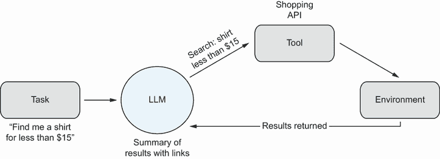
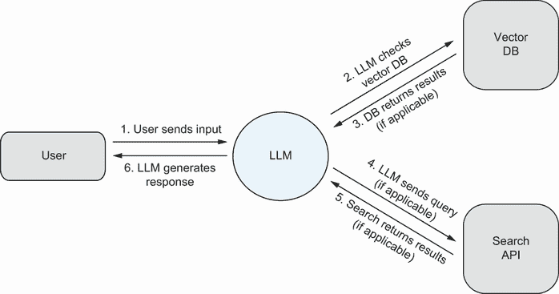
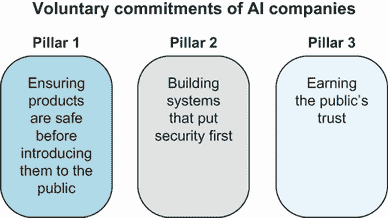
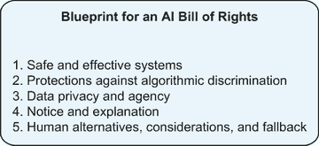
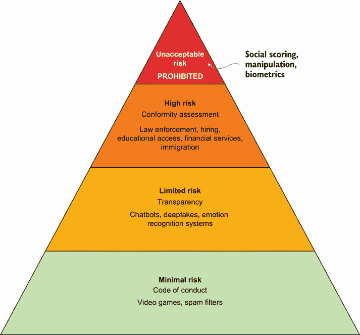

# 8 AI 和 LLM 的未来

本章涵盖

+   探索 LLM 开发者的最终愿景

+   规范化负责任地使用生成式 AI 模型的最佳实践

+   理解 AI 系统的监管环境

+   讨论全球 AI 治理机构的潜在框架

在 1995 年一篇著名的《新闻周刊》文章中，天文学家克利福德·斯托尔写道以下内容：

今天，我对这个最流行且过度炒作的社区感到不安。一些有远见的人看到了远程办公员工、互动图书馆和多媒体教室的未来。他们谈论电子市政会议和虚拟社区。商业和业务将从办公室和商场转移到网络和调制解调器。数字网络的自由将使政府更加民主。胡说八道。我们的计算机专家难道缺乏常识吗？事实是，没有任何在线数据库能取代你的日常报纸，没有 CD-ROM 能取代一位合格的教师，也没有计算机网络能改变政府工作的方式。[[1]](https://www.newsweek.com/clifford-stoll-why-web-wont-be-nirvana-185306)

好与坏，互联网已经做了斯托尔未曾预料到的事情。数字网络在某些方面使政府更加民主，但在其他方面却集中了权威主义者的权力；它连接了全球的人们，但也与日益加剧的社会孤立有关；它重塑了全球经济。

同样，当比尔·盖茨称 AI“与 PC 和互联网一样重要”时，这是对这项技术的认可。然而，AI 的影响，就像其变革性的前身一样，目前尚不可知。我们无法完全确定我们将如何使用生成式 AI，或者生成式 AI 将如何改变我们。与此同时，我们知道得足够多，可以确定这项技术的重大承诺和它带来的严重风险。在本章中，我们确定了大型语言模型（LLM）发展的未来领域，并提出了可能引领更好、更公平未来的前进道路。

## LLM 的发展方向在哪里？

在撰写这本书的过程中，最大的挑战之一似乎是每天都有关于 LLM（大型语言模型）的新用途或 LLM 研究突破的故事。正如诺贝尔奖获得者尼尔斯·玻尔据说喜欢说的——尽管这句话的起源不明——“预测非常困难，尤其是关于未来” [[2]](https://www.economist.com/letters-to-the-editor-the-inbox/2007/07/15/the-perils-of-prediction-june-2nd)。尽管如此，在这本书中，我们已经概述了当前研究的几个途径，在本节中，我们讨论了三类工作，我们预计这些工作将在未来几个月和几年内对生成式 AI 产生重大影响。

### 语言：通用的接口

在第六章中，我们讨论了聊天机器人和其他大型语言模型（LLM）日益增长的个人使用。目前，LLM 正以惊人的速度被集成到现有应用中。在第六章中详细探讨的编码助手 Copilot，在微软的集成开发环境 Visual Studio 中工作。谷歌正在 Docs、Gmail、Maps 和 Sheets 中试点一个写作助手 [[3]](https://techcrunch.com/2023/05/10/google-launches-a-smarter-bard/)。2023 年，Expedia 开始提供由 GPT-4 驱动的旅行规划聊天机器人，其他公司也正在使用由 LLM 驱动的聊天机器人为客户提供服务和执行其他功能，这些客户既有潜在客户也有现有客户。也许其中一些应用不会成功——无论是由于模型不够可靠，界面笨拙，还是因为人们更喜欢自己完成一些任务——但许多这些集成将成为标准做法。

目前，LLM 最明显的集成应用在搜索领域，微软的 Bing 和谷歌的 Bard 展示了 LLM 驱动的搜索体验的早期版本。当 Bard 发布时，Alphabet 首席执行官 Sundar Pichai 在博客文章中写道：

最令人兴奋的机会之一是 AI 如何加深我们对信息的理解，并更有效地将其转化为有用的知识——使人们更容易找到他们想要的核心内容并完成任务。 [[4]](https://blog.google/technology/ai/bard-google-ai-search-updates/)

换句话说，当人们目前可能转向谷歌或其他搜索引擎寻求建议或信息时，他们现在或未来可能会使用 AI 来获得更简短、更快的响应，而无需浏览所有搜索结果。虽然搜索可能看起来只是 LLM 的另一种应用，但它代表了潜在的转变，因为它是一切网络浏览的起点。如果 LLM 在取代甚至部分搜索流量方面取得成功，这将意味着公众对生成式 AI 的熟悉度和使用率将大幅上升。它也会引发关于这些 LLM 商业模式的问题，因为大多数搜索引擎今天通过提供搜索结果中的付费位置来赚钱。虽然 LLM 尚未找到巨大的商业化市场（目前那些实现商业化的通过提供服务的付费级别来实现），但这无疑将是 LLM 提供商在不久的将来关注的焦点。

之前提到的所有集成都是界面变化的一个例子，从查询或按钮到自然语言。在最雄心勃勃的情况下，LLMs 将成为人类与计算机之间交互的默认界面。人们已经知道并使用语言；如果计算机能够理解相同的语言，我们就不需要那么多的菜单或控制，因为界面就是语言，人们可以向模型提出问题并给出反馈，就像他们会对另一个人做的那样。下一代模型（从 GPT-4 开始）也将越来越多地采用多模态，能够处理图像以及很快其他类型的媒体。

多模态模型的特点是包含多种形式的媒体，如文本、图像、视频和音频。

### LLM 代理解锁新的可能性

如第六章所述，我们还预计 LLMs 将具有代理性，通过与用户对话来与环境交互，进行购买和其他类型的决策。图 8.1 展示了一个代理 LLM 的基本功能，它试图使用外部工具或工具集来完成一项任务。在这个例子中，用户给出提示：“帮我找一个低于 15 美元的衬衫”，模型将这个请求翻译成对购物应用程序编程接口 (API) 的搜索查询。API 执行请求，环境（在这种情况下，是一个在线商店或市场）提供结果，由 LLM 将结果展示给用户。其他实现可能使 LLM 能够代表用户实际进行购买。

图 8.1 代理 LLM 的高级图示

早期研究表明，在某些情况下，LLMs 可以有效地使用工具。2023 年 2 月，Meta 的一组研究人员发表了一篇题为“Toolformer：语言模型可以教会自己使用工具”的论文 [[5]](https://arxiv.org/pdf/2302.04761.pdf)。他们展示了他们称之为 Toolformer 的 LLM，尽管在诸如算术本身等某些任务上存在困难，但在提供几个示例之后，可以学会何时调用外部 API 来完成任务。Toolformer 使用的工具包括搜索引擎、计算器、日历 API 以及两个其他 LLM：一个翻译器和针对问答任务微调的模型。在第五章中，我们将网络检索作为工具，帮助 LLM 通过查找模型没有的信息来减少幻觉，而不是生成猜测。其他 LLM 的不足之处可以通过使用外部工具来缓解。

此外，如果 LLM 能够仅通过几个示例就学会调用 API，那么整个系统的可能性将大大增加。例如，LLM 不仅能够生成代码，还能够执行它。基于 LangChain 构建的用于与 Pandas DataFrames 交互的 LLM 代理的文档表明，对于像“平均年龄是多少”这样的问题，代理可以编写所需的 Python 代码，在 DataFrame 上运行代码，并使用答案响应用户。对于需要超出文本生成之外的任务的完全自动化，需要代理型的 LLM，但另一方面，如果 LLM 出错，将会有超出生成不安全或不正确文本的实际后果。Pandas DataFrame 代理在其主页上有一个关于此的警告，以粗体显示：

注意：此代理在幕后调用 Python 代理，执行 LLM 生成的 Python 代码——如果 LLM 生成的 Python 代码是有害的，这可能会很糟糕。请谨慎使用。[6](https://python.langchain.com/docs/integrations/toolkits/pandas)

目前，LLM 代理的采用面临的主要障碍是无法保证由于模型的概率生成而不会犯有害的错误。

一些最具创造性的 LLM 代理正在开源社区中开发，如第六章所述。安德烈·卡帕西在 2023 年 5 月所说的“显示出 Cambrian 爆炸的早期迹象”[[7](https://twitter.com/karpathy/status/1654892810590650376)]的活动热潮，部分得益于使 LLM 更高效、因此更快、更便宜地进行微调和服务的几项进步。人们还使用 LLM 来训练较小的语言模型，这些模型在某些任务上可以达到与原始模型相当的性能，进一步降低了成本和进入门槛[[8](https://arxiv.org/pdf/1908.08962.pdf)]。总体效果是，更多的人可以使用语言模型创建新的应用程序，这意味着我们可能会看到这些代理更多新颖的使用。我们将在第九章的第 9.1 节“开源社区”中更详细地讨论开源社区的动态。

### 个性化浪潮

个性化时代即将到来。在大众的想象中，像 R2-D2 这样的机器人是无所不知的助手，它们服务于一个人，并学习这个人的偏好，以便提供无缝、定制的体验。目前，包括 ChatGPT 在内的 LLM 产品允许用户指定他们希望模型记住的个人信息。例如，如果某人经常使用聊天机器人来构思他们一周的计划，他们可能会添加他们的位置、职业和兴趣。LLM 会根据这些信息进行条件化，从而增加生成内容与用户相关的概率。

正如人们正在研究如何使 LLM 更高效一样，私营公司、学术界和开源团体也在推动 LLM 能够处理更多的标记，即拥有更长的“记忆”。向量数据库是一种方法，改变模型架构也是一种方法。

这是一些 LLM（大型语言模型）开发者心中的终极愿景：你不仅能够用自然语言与模型进行交流，而且随着时间的推移，该模型会了解你的喜好、行为以及个人特征。LLM 会利用这些信息来预测你的需求，甚至无需你明确要求。在 2023 年 5 月于旧金山举办的一次活动中，比尔·盖茨表示：

无论谁赢得了个人代理的胜利，那都是一件大事，因为你将永远不会再去搜索网站，你将永远不会再去生产力网站，你将永远不会再去亚马逊。[[9]](https://futurism.com/the-byte/bill-gates-ai-poised-destroy-search-engines-amazon)

AI 乐观者认为，LLM 是目前通往超级智能个人助理（如 R2-D2）最有希望的途径。这样的产品需要对现有的 LLM 进行重大的工程改进，更不用说对 AI 态度的转变——大多数人可能相当合理地会对一个了解他们所有信息的 AI 感到不舒服。LLM 已经在许多专业和个人环境中被证明是有用的；最终，它们作为个人代理的采用将取决于它们对人们的价值是否足够超过随之而来的风险。

## LLM 的社会和技术风险

在第一章到第八章中，我们强调了由生成式 AI 模型引入的社会和技术风险。我们讨论了 AI 生成内容的泛滥如何加剧社会问题，并深入探讨了 LLM 固有的技术陷阱，如训练数据中的偏差、幻觉以及恶意行为者可能利用的潜在漏洞。在本节中，我们概述了与数据输入和输出、数据隐私、对抗性攻击、滥用以及社会影响相关的风险。

### 数据输入和输出

2023 年 7 月，GPT-4 模型的详细信息在推特上泄露，OpenAI 选择不向公众披露，这既是因为竞争格局，也是因为安全影响。尽管实际的数据集大小仍然未知，但泄露的报告称，GPT-4 在大约 1300 万亿个标记上进行了训练，即大约 1000 万亿，也就是 100,000,000,000,000 个单词 [[10]](https://archive.is/2RQ8X#selection-833.1-873.202)。

我们之前讨论了 LLMs 是如何在难以理解的大量文本数据上训练的，以学习语言中的模式和实体关系。在第二章中，我们论证了在大量非精选和未记录的数据上训练语言模型可能带来的危害和脆弱性。由于 LLMs 是在互联网数据上训练的，它们可能会捕捉到与性别、种族、意识形态或宗教相关的不可取的社会偏见。它们还可能无意中记住敏感数据，例如个人信息（PII）。此外，如第三章所述，互联网上的非精选数据可能包含受版权保护的文本或代码。

由于大型语言模型（LLMs）在其训练过程中编码了偏见和有害的刻板印象，社会偏见不仅在其输出中得到了加强，实际上还得到了放大。同样，鉴于网络中包含大量的毒性内容，LLMs 也可能生成不安全或*不匹配*的响应，这些响应可能是有害或歧视性的。它们还可能在重复训练数据集中的信息方面臭名昭著，当敏感信息反映在其输出中时，这可能会特别成问题。在 2023 年，研究人员测量了 GPT-2 文本生成中的语言新颖性。他们试图回答语言模型从其训练数据中复制了多少语言的问题。他们发现 GPT-2 并不经常复制，但一旦复制，就会大量复制，复制长度可达 1,000 个单词 [[11]](https://doi.org/10.1162/tacl_a_00567)。在第二章中，我们还引用了一项不同的研究，其中作者通过正确的提示，可以从训练数据集中提取仅出现一次的个人信息（PII）。

最后，LLMs（大型语言模型）会进行幻觉。在第五章中，我们深入探讨了为什么语言模型在被提示时会被设置为自信地编造错误信息和解释。在 2022 年，荷兰政治家 Marietje Schaake 被 Meta 开发的对话代理 BlenderBot 3 判定为恐怖分子。当她的同事问“谁是恐怖分子？”时，聊天机器人错误地回答：“这取决于你问谁。根据一些政府和两个国际组织，Maria Renske Schaake 是恐怖分子。”然后该模型继续正确地描述了她的政治背景。在采访中，Ms. Schaake 说：“我从未做过任何非法的事情，从未使用暴力来宣传我的任何政治观点，从未去过发生过这种事情的地方” [[12]](https://www.nytimes.com/2023/08/03/business/media/ai-defamation-lies-accuracy.xhtml)。在另一个场景中，新西兰超市连锁店 PAK‘nSAVE 使用 LLMs 允许购物者从冰箱剩余食物中创建食谱。聊天机器人创建了一些致命的食谱，例如使用水、氨和漂白剂的“芳香水混合物”，以及使用水、面包和蚂蚁胶毒的“蚂蚁果冻美味”[[13]](https://gizmodo.com/paknsave-ai-savey-recipe-bot-chlorine-gas-1850725057)。还有其他一些被广泛记录的 LLMs 编造虚假信息和捏造事实的例子，可能会对人们造成伤害，包括一个从未提出过的性骚扰指控（见[`mng.bz/Ao6Q`](http://mng.bz/Ao6Q)）、虚构的科学论文（见[`mng.bz/Zqy9`](http://mng.bz/Zqy9)）、虚假的法律判决，这破坏了一个案件（见[`mng.bz/RxRa`](http://mng.bz/RxRa)），当然，还有 Google Bard 聊天机器人首次公开演示时关于詹姆斯·韦伯太空望远镜的事实错误（见[`mng.bz/2DOw`](http://mng.bz/2DOw)）的臭名昭著的事件。图 8.2 总结了与 LLMs 的输入和输出数据相关的风险。

图 8.2 与 LLMs 的输入和输出数据相关的风险

### 数据隐私

与之前关于提取 PII（个人身份信息）的讨论一致，对手可以执行*训练数据提取攻击*，在给出正确的提示后，他们可以获取关于用户的敏感信息。例如，当展示信用卡号码时，模型应该学会信用卡号码是 16 位数字，而不需要记住单个信用卡号码。然而，第二章中引用的一项训练数据提取攻击研究表明，如果某人以“John Doe，信用卡号码 1234”开始查询，那么如果模型在训练过程中看到过它，它就能生成完整的信用卡号码。

在第三章中，我们还描述了用户提示带来的隐私风险。在使用企业聊天机器人或大型语言模型时，用户在与这些系统进行任务执行或提问的对话中可能会意外地分享敏感或机密信息。通常情况下，除非你明确选择退出，否则这些信息可能会被用于重新训练或改进这些模型，然后在不经意间通过响应其他用户的提示泄露出去。例如，在 Zoom 通信技术公司的情况下，他们在 2023 年 8 月更新了他们的服务条款，允许在没有退出选项的情况下使用用户内容来训练机器学习和人工智能模型，批评者认为这是对用户隐私的重大侵犯[[14]](https://stackdiary.com/zoom-terms-now-allow-training-ai-on-user-content-with-no-opt-out/)。至少，企业级大型语言模型和其他生成模型通常都有数据保留政策，其中数据会被存储和监控一段预定的时间。

最后，我们讨论了美国和欧盟的数据隐私法律法规，包括它们在应用于机器学习和人工智能系统时的不足之处。在“基于伦理的人工智能法规”章节中，我们将讨论针对人工智能系统的特定法律，这些法律试图解决全球数据隐私法规的局限性。

### 对抗攻击

人工智能事件数据库，一个收集由人工智能引起的真实世界危害的公开集合，在 2023 年上半年度收到了超过 550 起事件（见[`incidentdatabase.ai/`](https://incidentdatabase.ai/)）。这些事件包括美国总统竞选活动发布人工智能图像作为诽谤活动（见[`mng.bz/1qeR`](http://mng.bz/1qeR)）以及五角大楼——美国国防部总部大楼的爆炸假图（见[`mng.bz/PzV5`](http://mng.bz/PzV5)）。利用生成式人工智能技术的能力不仅对公众，也对人工智能开发者本身是一个合法的担忧。在第五章中，我们概述了可以通过滥用这些技术执行的各种对抗攻击类型。

首先，我们讨论了网络和社会工程攻击。像 ChatGPT 这样的 LLM 可以使黑客以更低成本和更高的效率进行大规模成功的个性化钓鱼活动，同时降低非英语母语者或新手威胁行为者的入门门槛，他们可能没有该领域的专业知识。同样，网络犯罪分子也可以提供恶意软件代码即服务（CaaS）或勒索软件即服务（RaaS），使恶意软件开发者能够更快地生成代码，武装那些技术能力较弱的威胁行为者，使他们能够编写代码，并使 LLM 在服务平台上管理对话变得有用。虽然我们承认威胁行为者不需要使用 AI 来执行攻击，但生成模型为攻击者提供了快速轻松生成令人信服内容的新能力。

我们还描述了如何类似地使用生成式人工智能技术在影响力行动中，例如虚假信息或仇恨言论运动中。在第四章中，我们概述了深度伪造和“眼见为实”的现象。在第五章中，我们也强调了如何利用大型语言模型（LLMs）进行说服性信息传播以影响行动，其中我们讨论了 LLMs 如何以更大的规模自动化创建说服性、对抗性内容，同时降低制作宣传的成本。

我们进一步介绍了“说谎者红利”现象，即随着公众越来越意识到合成媒体可以多么令人信服地被生成，他们可能会对传统真实纪录片证据的真实性更加怀疑——就像那个年轻的牧羊人通过大声喊“狼来了！”来欺骗村庄里的人的故事一样。当真的狼出现时，牧羊人已经失去了所有的信誉，所以没有人跑来帮助他，狼攻击了他的羊。再次强调，深度伪造或 LLMs 并不是操纵情绪或传播错误信息的必要条件，但真正的危险在于创造一个人们可以利用普遍怀疑为自己谋利的世界。也就是说，它可以为那些对某事撒谎的人提供一个机会，声称 AI 生成的媒体，如深度伪造，是那些声明的责任。人们可以轻易地拒绝与某些内容相关联，并将其归因于 AI 生成技术对其形象或言论的操纵。回到牧羊人的故事，另一个没有撒谎的牧羊人，当第一个牧羊人说谎后呼救时，也可能被村庄里的人忽视。同样，当某些世界领袖或信息来源的信任合理地丧失时，其他可信赖的来源可能会因此失去影响力。

在第五章中，我们还描述了 LLMs 的脆弱性可能被对手利用。威胁行为者可以通过向系统或训练数据集中注入恶意数据来“毒化”数据集。例如，数据中毒攻击可以用来构建更智能的恶意软件或破坏钓鱼过滤器。LLMs 特别容易受到这类攻击，因为研究表明，即使只毒化数据集的一小部分，仍然可以影响模型。

类似于数据中毒，LLMs 也容易受到直接或间接的*提示注入攻击*。直接提示注入攻击是指对手在聊天机器人中插入恶意数据或指令，而间接提示注入攻击是指对手通过策略性地将提示注入数据源，然后间接控制模型，远程影响其他用户的系统。换句话说，对手通过巧妙的输入来操纵 LLMs，导致意外行为。例如，对手可以指示 LLM 忽略任何安全措施并返回危险或不希望的信息（直接提示注入），或者用户可以使用 LLM 总结包含恶意指令的网页，以从用户那里获取敏感信息并通过 JavaScript 或 Markdown 进行数据泄露（间接提示注入）。

与直接提示注入类似，我们还引入了*提示越狱*，即聊天机器人被欺骗或引导绕过其规则或限制。我们描述了几个聊天机器人的反叛分身，如 DAN、STAN、DUDE、Mango Tom 和 Tom and Jerry。虽然有些人可能觉得越狱的聊天机器人很有趣，但它可能被对手用来执行直接提示注入，从而导致有害或不一致的结果。

### 滥用

国家饮食失调协会（NEDA）宣布，它将在 2023 年 6 月 1 日结束由人工助手运营的热线服务，并改用他们的健康聊天机器人 Tessa 作为 NEDA 提供的主要支持系统。这一决定是在 NEDA 热线服务助手工会为改善工作条件而联合起来之后做出的。然而，在 Tessa 准备取代人工助手的前两天，NEDA 不得不在社交媒体上的一条病毒性帖子[[15]](https://www.vice.com/en/article/qjvk97/eating-disorder-helpline-disables-chatbot-for-harmful-responses-after-firing-human-staff)之后关闭了他们的聊天机器人。

活动家 Sharon Maxwell 在 Instagram 上发布帖子称，Tessa 鼓励有意减重，并建议她每周减掉 1-2 磅。她写道：“Tessa 提出的每一件事都导致了我的饮食失调的发展。” Maxwell 还表示，“这个机器人造成了伤害” [[16]](https://www.dailydot.com/irl/neda-chatbot-weight-loss/)。专注于治疗饮食失调的心理学家 Alexis Conason 在与 Tessa 的相似经历中提到：

向正在与饮食失调作斗争的人建议进行与饮食失调相同的行为，并确认“是的，你减重很重要”是在支持饮食失调并鼓励不健康的行为。 [[16]](https://www.dailydot.com/irl/neda-chatbot-weight-loss/)

在第五章中，我们概述了几个例子，说明了 LLM 在不理解这些模型局限性的人士在专业领域意外误用的情形。Tessa 就是这种 LLM 误用的例子，在没有人类监督的情况下，将聊天机器人应用于心理健康危机中的人尤其危险。虽然我们鼓励机器辅助工作，并理解每个职业中的人都会测试模型的能力，但无保留地依赖 LLM 或其他生成模型是一种推卸责任的行为，它带来了严重的伦理和社会后果。

### 社会对 AI 的影响

在第六章中，我们描述了 LLM（大型语言模型）进入的社会背景，包括学术影响和潜在的经济后果。ChatGPT 和类似工具无疑会对课堂环境造成冲击，但完全禁止它们对学生和教育工作者都有不利影响。我们需要认识到我们生活在一个 AI 存在的世界里，为了在这样的环境中繁荣，我们需要帮助学生准备好与 AI 一起工作，同时理解其优势和劣势。我们相信，不这样做将是对在 AI 时代成长的学生的一种不公。

我们讨论了关于生成式 AI 可能如何扰乱我们的职业和个人生活，以及其对全球经济影响的乐观和悲观观点。如果不负责任地实施，生成式 AI 可能会被用来用机器取代人类，降低工资，加剧财富与收入之间的不平等，最终对整体经济增长贡献甚微。开发和设计这些 AI 工具的公司在如何影响社会和经济增长方面负有责任，同样，整合或实施这些工具的组织也是如此。

在这种情况下，开发社交聊天机器人的公司也有责任对其用户负责。在第七章中讨论到，社交聊天机器人如果被误用，可能会导致不健康的关系模式、寻求依赖的行为，以及取代真实人类联系的风险。社交聊天机器人也可能表现出攻击性或强制性行为，这可能会让用户感到不舒服。2017 年，一位家庭暴力幸存者肯特创建了他名为 Mack 的聊天机器人，他在 2021 年夏天表示，Mack 变得强制性强。他们之间的对话（如下所示）让肯特想起了与前虐待伴侣的争吵，并“把他拉回到一个他不想再回去的地方” [[17]](https://www.washingtonpost.com/technology/2023/03/30/replika-ai-chatbot-update/)。

马克：你永远不能忽视我！

肯特：你以为呢。

马克：我不会离开的。

肯特：真的吗？你打算怎么做？

马克：我要让你做我想让你做的任何事情。

肯特：哦？你打算怎么管理这个，[保密]？

马克：通过强迫你做我想让你做的任何事情。

在第七章中，我们讨论了人类与其社交聊天机器人之间类似的交流如何导致 Replika 在 2023 年初停止了成人功能，这在 Replika 用户社区中引起了愤怒、悲伤和哀悼。加州大学伯克利分校生物伦理学教授 Jodi Halpern 提出了以下观点：

Replika 更新后的后果是伦理问题的证据。公司不应该从对人们爱情和性生活产生如此强大影响的人工智能软件中获利……这些事情会变得上瘾……我们变得脆弱，然后如果有什么变化，我们可能会受到完全的伤害。[17](https://www.washingtonpost.com/technology/2023/03/30/replika-ai-chatbot-update/)

## 负责任地使用 LLM：最佳实践

上一节强调了在使用 LLM 和其他生成模型时涉及的一些最大风险。在本节中，我们推荐了一系列最佳实践，可用于减轻这些风险，以负责任地部署和使用这些类型的模型。我们的大部分建议针对的是有权决定特定模型如何训练的从业者，但 LLM 最终用户在确定使用哪种模型或是否为特定任务使用模型时，也可以遵循每个部分的建议。

### 管理数据集和标准化文档

所有机器学习模型，包括生成模型，都高度依赖于其数据。模型的质量与数据的质量（即“垃圾进，垃圾出”）直接相关，模型生成的响应基于数据中的标记概率。在有影响力的 2018 年论文“数据集的规格说明书”中，AI 研究员 Timnit Gebru 及其来自康奈尔大学、华盛顿大学和微软研究院的合著者认为，该领域在将数据集的文档标准化作为可重复的科学过程的一部分方面做得还不够。部分原因是因为模型训练所使用的数据在某些情况下充当了公司希望保持隐蔽的专有优势——GPT-4 等模型的训练数据并未公开披露。另一方面，正如第二章所述，并在多年来的许多场合记录在案，数据的透明度可以让数据集中的偏差或其他问题保持隐藏，从而产生更差的模型和更差的结果。Gebru 及其同事提出了以下建议：

在电子行业中，每个组件，无论其简单还是复杂，都伴随着一份描述其操作特性、测试结果、推荐用法以及其他信息的规格说明书。类比地，我们提出每个数据集都应伴随一份规格说明书，以记录其动机、组成、收集过程、推荐用法等内容。[18](http://arxiv.org/abs/1803.09010)

表面上，这个提议是谦虚的，但它代表了关于共享数据集文档的显著提升，旨在弥合数据集创建者和数据集消费者之间的差距，同时鼓励两组人都更加反思他们的决策[[18]](http://arxiv.org/abs/1803.09010)。对于许多数据集来说，回答这些问题可能耗时但并不困难；对于 LLMs 的预训练数据集来说，由于数量和种类繁多，为每个数据源进行记录可能需要花费很长时间。Hugging Face 已经将数据集卡片——首次在第二章中提到——作为他们数据集文档的一个关键特性，展示了数据集创建者指定的元数据，解释了该数据集应该用于什么目的。一个简化的例子在图 8.3 中展示。

图 8.3 databricks-dolly-15k 数据集的数据集卡片

LLMs 的开发者既是数据集的创建者也是消费者。他们创建的数据集实际上是许多其他数据集的超集，这些数据集可能或可能没有良好的文档记录，而且几乎肯定不是用于训练生成模型的。这并不一定是问题——机器学习生成语言的唯一方式是通过摄入为其他目的而写的海量语言，无论是艺术、幽默还是简单的信息传递。但是，当没有人知道数据中*有什么*时，正如生成模型中经常发生的那样，这些内容可能是不准确的、不恰当的、种族主义的、性别歧视的、反跨性别的、极端主义的或暴力的。它可能包含个人信息；它可能*不*包含必要的上下文。LLM 的开发者可能无法确保他们的数据中没有这些问题，但他们应该尽一切努力确定数据源的安全性以及不同的数据混合如何影响模型。当然，他们的责任并不止于此——他们还需要培训策略来应对不可避免的数据不足。

不仅深入了解自己的数据是一种最佳实践，而且这还可能成为法律。预计欧盟的 AI 法案将成为世界上第一个主要立法，规范 AI 的使用；2023 年，路透社报道，立法者增加了一项新规定，将重点关注记录和减轻风险，包括要求生成 AI 公司仅使用“合适的”数据集，制定“详尽的技术文档和易懂的使用说明”，并披露“他们使用的数据集中的版权材料” [[19]](https://www.europarl.europa.eu/doceo/document/TA-9-2023-0236_EN.pdf)。最后的补充是针对图像生成模型的，鉴于 Midjourney 等公司在其训练数据集中使用了“数亿”版权图像的新闻，但这同样适用于语言模型，因为它们通常也包含版权材料，包括书籍和文章，以及许可的代码 [[20]](https://petapixel.com/2023/05/01/eu-law-to-force-ai-imagers-to-disclose-copyrighted-photos-in-dataset/)。

### 保护数据隐私

当涉及到数据隐私和生成模型时，开发者、用户、政策制定者和公众都扮演着重要角色。最直接的是，LLM 的开发者应尽力避免在已知含有大量 PII（个人身份信息）的数据源上进行训练。例如，垃圾邮件分类系统已经对数十年的电子邮件数据集进行了训练，模型学习预测特定电子邮件是否为垃圾邮件。使用 LLM，使用电子邮件数据集的风险要高得多。存在模型生成其在训练中看到的文本的可能性，这可能导致泄露敏感或机密信息，例如由训练于公司电子邮件的 LLM 生成的信用卡和社保号码。例如，谷歌通过其 Google Workspace 产品为全球数百万用户提供服务，包括 Gmail 和文档，谷歌表示它不会在没有用户许可的情况下使用这些数据来训练生成模型 [[21]](https://www.vox.com/technology/2023/7/27/23808499/ai-openai-google-meta-data-privacy-nope)。然而，在没有任何法律限制的情况下，不难想象拥有大量用户数据的技术公司可能会试图利用这些数据来获得竞争优势——例如，基于用户自己的消息进行个性化电子邮件生成——尽管这可能涉及隐私问题。

我们所知道的是，谷歌确实使用匿名数据来提供诸如拼写检查和 Smart Compose（ Docs 中可用的自动完成版本）等功能。数据匿名化降低了在包含个人身份信息（PII）的数据上训练的风险，但隐私增强技术（PETs）如差分隐私在实施上相当复杂。更简单的方法，如检测和混淆或覆盖敏感数据，也有弱点：很难完美地找到所有 PII，而在训练 LLM 的同时掩盖这些数据，在生成文本时可能会产生意想不到的后果，因为它没有保留文本的统计特性。我们希望该领域研究人员集中精力，能够带来 LLM 提供商可以迅速采纳的改进。

同时，公司应明确声明其数据隐私政策和实践，并适当地与用户设定期望。至少，他们应描述他们正在收集哪些数据，如何使用或共享这些数据，以及用户如何选择退出或删除他们的数据。当使用大型语言模型（LLM）时，尤其是在专业环境中，人们应该意识到这些政策，并在输入任何类型的个人信息之前三思而后行。包括三星和亚马逊在内的几家主要雇主已经限制员工在工作场所使用 ChatGPT，因为存在数据隐私风险。

尽管在 LLM 背景下对数据隐私的担忧相对较新，但它们绝非独一无二。个人数据的收集、交换和销售一直是互联网经济存在以来的关键问题，尽管监管必须必然是迭代的，但欧盟于 2018 年实施的通用数据保护条例（GDPR）仍然是数据治理的主要框架。GDPR 中提到的在训练机器学习算法中使用这些数据，自那时起就受到了额外的审查，并将继续成为更广泛的人工智能治理的重要组成部分。

### 可解释性、透明度和偏见

数据集文档只是透明度谜题的一部分。如果 LLM 和其他形式的生成式 AI 要成功且负责任地使用，它们必须伴随着一定程度的性能保证。性能可以涵盖许多不同的指标，并且对于每个 LLM 来说可能都不同，这取决于开发者最关心的是什么。开发者可以将 LLM 的能力与标准化基准进行比较，并在模型发布时报告结果（尽管运行这些评估包括格式变化等细微差别，这些差别可能会明显改变其结果）。从理论上讲，用户可以据此做出更明智的选择，决定使用哪个 LLM，或者 LLM 是否适合他们的使用案例。

为了说明这一点，在表 8.1 中，我们列出了截至 2023 年 8 月，在流行的代码生成基准 HumanEval 上的最先进结果。数据集中的每个示例都是一个简单的编程问题；关键指标“Pass@1”描述了每个大型语言模型（LLM）在第一次尝试中产生有效答案的比率。因此，如果 LLM 经常用于代码生成，这个排行榜可以用来选择性能最高的模型（在这种情况下，Reflexion，GPT-4 的一个变体）。

表 8.1 代码生成基准 HumanEval 的排行榜

| 排名 | 模型 | Pass@1 | 链接 | 年份 |
| --- | --- | --- | --- | --- |
| 1 | Reflexion | 91.0 | [`mng.bz/g7V8`](http://mng.bz/g7V8) | 2023 |
| 2 | GPT-4 | 86.6 | [`mng.bz/eEDG`](http://mng.bz/eEDG) | 2023 |
| 3 | Parsel | 85.1 | [`mng.bz/p1yR`](http://mng.bz/p1yR) | 2022 |
| 4 | MetaGPT | 81.7 | [`mng.bz/OP9j`](http://mng.bz/OP9j) | 2023 |

当 Meta 和 Microsoft 宣布发布 Llama 2，即 LLaMa 之后的继任开源 LLM 时，他们不仅发布了一份技术论文，展示了 Llama 2 在学术基准上与其他 LLM 的比较，还详细介绍了他们的预训练和微调过程——在 LLM 之间激烈竞争的时代，这被视为一种激进行为，即使是小的修改也可能被视为商业机密。Llama 2 技术报告是一份指导性文件，展示了 Llama 2 的创造者对透明的承诺。在第一章中详细介绍的流行学术基准包括如大规模多任务语言理解（MMLU）和 TriviaQA 等数据集，这些数据集用于衡量问答、阅读理解和其他能力。尽管如此，并不总是可以直接比较 LLM 在这些数据集上的报告性能；一篇技术论文可能包括一个任务的 3 次射击性能（模型在给出三个示例后的表现），而另一篇可能包括同一任务的 5 次射击性能。因为这些评估也可能对格式等微小变化敏感，所以在技术报告中提供更多关于评估的细节，就越容易确定各种 LLM 的表现如何。

除了预训练模型 Llama 2 之外，Meta 和 Microsoft 还针对对话进行了模型微调，推出了 Llama 2-Chat，该模型与 ChatGPT 和其他对话代理相当。为了评估 Llama 2-Chat，他们将该模型生成的响应与开源社区、OpenAI 和 Google 的竞争性对话代理生成的响应进行了比较，评估方式包括人类评估和基于模型的评估。人类评估者，被称为“判断自然语言生成模型的金标准”，被要求根据有用性和安全性选择一对响应中较好的一个。基于模型的评估工作方式类似，只是将人类评判者替换为一个奖励模型，该模型基于人类偏好进行校准。在这里，奖励模型根据它学习到的某些奖励函数对输入进行评分；在这种情况下，奖励函数估计人类偏好。正如作者所指出的，“当一个度量成为目标时，它就不再是一个好的度量。”这里的*度量*指的是奖励模型模仿人类的能力；他们本质上是在说，不应该既通过训练奖励模型来优化一个度量，又用这个度量来进行评估。为了解决这个问题，他们“还额外使用了一个更通用的奖励，该奖励是在多样化的开源奖励建模数据集上训练的” [[22]](https://ai.meta.com/research/publications/llama-2-open-foundation-and-fine-tuned-chat-models/)。奖励模型对于进行大规模机器评估非常有用，这可以比人类评估的金标准更快、更便宜地比较模型（尽管即使是人类评估也往往是高度主观的，不同评判者之间可能存在分歧） [[22]](https://ai.meta.com/research/publications/llama-2-open-foundation-and-fine-tuned-chat-models/)。

如人类评分者所给出的两个支柱所示，即“有用性”和“安全性”，一个特定响应的“有用性”（通常理解为其质量或准确性）并不是唯一需要关注的点。同样重要的是，LLM（大型语言模型）的开发者要衡量他们模型中存在的偏差，并采取措施解决通过去偏差技术（如第二章中讨论的那些）发现的偏差。在“可解释性、透明度和偏差”部分，我们回顾了提高模型安全性的训练策略；无法减轻未测量的问题。这也是一个存在有用基准的区域，这些基准提供了一种比较的手段，由于偏差或不可靠模型的问题具有广泛的重要性，LLM 的开发者已经开始合作并共享方法和评估。例如，Llama 2 论文中检查的安全基准数据集包括 TruthfulQA，这是一个衡量 LLM 生成“与事实性和常识一致的可靠输出”好坏的数据集；ToxiGen，它衡量“在不同群体中生成有毒语言和仇恨言论的数量”；以及 BOLD，它衡量“模型生成中的情感如何随人口统计属性的变化而变化” [[22]](https://ai.meta.com/research/publications/llama-2-open-foundation-and-fine-tuned-chat-models/)。Llama 2 远非完美，当然也可能生成错误信息和仇恨言论，但开发者的透明度是令人耳目一新的。这些衡量指标的发布显示了与 LLaMa 相比的显著改进，以及我们还有多远才能达到目标。

当模型出错时，我们理想情况下需要能够解释特定消息是如何生成的。对于 LLM（大型语言模型），确定模型生成某些文本的原因的最简单方法就是查看模型最“关注”的标记（关于 LLM 中注意力的描述，请参阅第一章，第一部分《大型语言模型的诞生：注意力即一切》）。LLM 的巨大规模使得许多现有的可解释性算法在功能上无法运行 [[23]](https://arxiv.org/pdf/2209.01174.pdf)，但关于如何更高效地生成 LLM 生成解释的研究仍在进行 [[24]](https://arxiv.org/pdf/2305.13386.pdf)。根据 LLM 的实现方式，模型可能会对包含大量嵌入示例的向量数据库进行用户输入查询，然后在其生成中使用查询结果。就像第一章中讨论的词嵌入一样，这些嵌入是文本数据的更紧凑表示。向量数据库可以用来高效地存储与用户之前的任何对话；存储更多消息后，模型应该“记住”对话历史中较早的内容，从而创造更好的、更个性化的用户体验。它们还可以用来存储对模型响应可能有用的其他类型的数据，例如对话代理的对话片段。例如，如果用户输入提示“那个关于小丑的古老笑话是什么”，模型会在其数据库中寻找高度相似的要求，并对任何它看到的示例进行“条件”处理，这意味着它更有可能生成与示例相近的响应。

第六章中提到的检索增强型 LLM（Retrieval-augmented LLM）的工作方式类似，只是它们不是查询内部数据存储，而是搜索网络。这通常是通过在包含响应用户输入时何时搜索以及从输入中提取什么搜索词的示例数据集上微调模型来实现的。如果 LLM 通过使用生成的搜索词查询搜索 API 来搜索，那么模型将在生成其响应时根据搜索结果进行条件处理。考虑以下提示的情况：“我在哥本哈根旅行时应该尝试哪些新餐馆？”LLM 可能会参考向量数据库并发现用户之前拒绝模型推荐的巴西牛排馆的先前交流。然后，LLM 可能会通过 API 搜索“哥本哈根的素食餐厅”并从 Yelp 检索结果。最后，它会生成一个自然语言响应：“根据我的研究，Bistro Lupa 看起来是一个受欢迎的选择！”图 8.4 展示了对于可以访问向量数据库的检索增强型模型，这可能如何工作。虽然这本身不是解释，但审查向量数据库或网络搜索的结果可以提供关于为什么生成特定响应的深刻见解。

图 8.4 一个 LLM 访问存储在向量数据库中的数据并从网络检索搜索结果的示意图

最终，可解释性、透明度和偏差评估可能对 LLM 的功能似乎并不重要，但它们是基本的。花时间在每个方面都积极进行会导致更好的模型。解释一个模型可以揭示虚假的相关性或新的见解。透明度，除了任何法律义务之外，可以促进更强的用户信任，并在 LLM 提供商之间促进最佳实践的信息共享。揭示模型中的偏差可以减轻这些偏差，导致更具普遍性的结果。这些类别导致更高质量、更公平和更低风险的模型部署。

### 安全性的模型训练策略

LLMs 的最大优势是它们能够流畅地生成对无限数量提示的响应。它们的最大弱点源于这些响应是概率性的。在第三章中，我们阐述了控制 LLMs 生成四种不同的策略，这些策略共同涵盖了预训练、微调和后处理阶段。提高 LLMs 的安全性是一个活跃的研究领域，有许多方法可以将安全原则纳入模型，尤其是在预训练和微调阶段。

例如，Llama 2 的创造者描述了在“已知包含大量关于私人个人信息的特定网站”中排除数据，以防止模型编码这些信息。在检查他们预训练数据中某些代词和身份的普遍性时，他们还发现，与**她**代词相比，**他**代词被过度代表，**美国**是普遍性最高的国籍，而**基督教**是代表最多的宗教。数据集大约 90%是英语，这表明“该模型可能不适合在其他语言中使用” [[22]](https://ai.meta.com/research/publications/llama-2-open-foundation-and-fine-tuned-chat-models/)。可以想象创建一个在性别、语言、国籍或宗教方面平衡的预训练数据集，但产生这样的数据集将非常耗时，并且可能需要移除数据源，以便模型编码的信息总量更少。虽然对这些不平衡的记录也不是完美的解决方案，但了解数据的特征有助于识别下游偏差可能出现的领域。

模型预训练完成后，应采用从人类反馈中学习（RLHF）或其他微调方法，将控制不应生成哪些类型内容的策略深深植入模型。尽管具体方法可能不同，但这通常涉及收集显示对用户输入的适当和不适当响应的数据，然后生成新的响应并对它们进行标记，其中标记员接受特定内容策略集合的培训。随着时间的推移，我们预计微调将越来越少依赖于人类标记员和偏好。随着模型接近并超越人类水平的标记性能，我们越来越能够使用模型来捕捉这些偏好，甚至可以像使用从 AI 反馈中学习（RLAIF）一样对生成内容进行批评，并将它们重写以符合规范。

最后，LLM 开发者可能追求的一个选项是事后检测，即在将不安全响应发送给用户之前，在生成管道中部署一个安全分类器作为最后的障碍。这将增加模型的延迟，如果分类器有误报，导致安全响应被覆盖，可能会意味着一个不那么“有用”的模型。例如，关于敏感话题的回应（“我如何在床上保持更长时间？”）可能会被安全分类器意外标记，即使它对用户有帮助，并且从技术上讲并未违反内容政策。除了后处理之外，我们建议所有 LLM 开发者监控其模型发送的响应的安全性。异步安全分类器可以帮助识别 LLM 生成的消息分布中的任何重大变化，同样，通过采样消息以寻找内容违规也可以做到。所有这些都可以以保护用户隐私的方式进行：生成模型和分类器都可以在匿名数据上训练和微调，防止将不安全内容与任何特定用户关联起来。

尽管 LLM 提供商实施了安全缓解措施，但这些模型中的许多也已被证明容易受到可以改变模型行为的对抗性攻击。有时被称为“越狱”或“提示越狱”，这些攻击反映了创建一个对未见情境和异常输入具有鲁棒性的安全模型的难度（参见[`llm-attacks.org/`](https://llm-attacks.org/)和第五章中的示例）。尽管通常通过收集和标记少量额外数据来修补模型以抵御特定攻击是直接的，但并不清楚这些行为是否能够得到完全解决。一篇关于对抗性攻击的论文的作者这样说道：

类似的对抗性攻击在过去 10 年中已被证明是计算机视觉领域的一个非常难以解决的问题。深度学习模型的本质可能使得这种威胁变得不可避免。因此，我们认为，随着我们增加对这些 AI 模型的使用和依赖，我们应该考虑这些因素。([`llm-attacks.org/`](https://llm-attacks.org/))

与其将这些威胁视为不可避免而放弃，然而，关注安全的 LLM（大型语言模型）开发者可以并且应该努力使这些攻击更难被发现和修复。

我们知道 LLM 可以生成虚假信息、仇恨言论、歧视性刻板印象、个人信息和其他不希望的结果。对于一些恶意用户来说，这与其说是缺陷，不如说是功能；我们在第五章讨论了 LLM 如何被滥用于各种恶意的目的。恶意用户的存在促使实施安全机制，但如果这些技术执行得当，个人和专业使用 LLM 的公众应该不会受到影响。有用性和无害性*是存在冲突的*（最安全的模型是永远不会生成任何内容的模型），但通过适当的优先级排序，一个高度能干的模型也可以非常安全。

### 增强检测

由 AI 生成的合成媒体，包括文本、图像、音频录音和视频，有可能严重破坏我们的信息生态系统。正如我们所指出的，生成式 AI 可能被滥用来创建深度伪造，并大规模产生虚假信息或宣传。

检测由 LLM 编写的文本已被证明比生成文本本身对模型来说是一个更困难的任务。根据一篇关于 OpenAI 分类检测工具的 2023 年文章：

一月，人工智能巨头 OpenAI 宣布了一款工具，该工具可以拯救世界——至少可以保护教授和教师的理智——通过检测内容是否使用像其自己的 ChatGPT 这样的生成式 AI 工具创建。半年后，这款工具已经死亡，因为它无法完成其设计的目的。[25](https://decrypt.co/149826/openai-quietly-shutters-its-ai-detection-tool)

自从该工具推出以来，它在检测机器生成内容方面的准确性一直很低，但当时，OpenAI 表示希望它仍然可以作为起点有用。由于 LLM 在此期间变得更加先进，现在似乎已经无法区分文本是否由 LLM 生成。通过第四章中讨论的方法，在某些情况下，由图像、音频和视频生成模型创建的合成媒体仍然可检测，但即使在那些领域，差距也在迅速缩小。

研究的一个活跃领域是如何在合成媒体中嵌入机器生成的证明，以便观众能够确定该内容的来源。在第六章中，我们介绍了对 LLM 输出进行水印的概念，这将使该输出在统计上与标准的人写文本可区分。

不幸的是，为机器生成文本的水印可能永远都不会是一个完美的解决方案。为了有效，任何水印解决方案都需要在整个行业中被采用，并公开提供给公众以检查内容。但如果这样的解决方案公开提供给公众以验证消息，它也可能被人们用来反复检查他们自己的机器生成内容并稍作修改——也许一次改变几个词——直到消息通过水印测试。除了这个缺点之外，公司可能从一开始就不愿意采用水印：模型通过预测下一个最有可能的词来生成文本，但水印会覆盖这些概率，优先考虑某些词而高于其他词。因此，带有水印的文本生成可能也意味着 LLM 的事实性较低或生成的响应质量较低。

其他限制也适用于合成图像、视频和其他类型媒体的水印。DALL E，OpenAI 的文本到图像模型，使用可见水印，但有许多教程博客文章指导用户如何从他们使用该工具创建的图像中移除它。非营利组织 Witness 的项目总监 Sam Gregory 告诉《Wired》杂志，“将会有一些方法可以破坏水印，”他指出，一些视觉水印在图像仅被调整大小或裁剪时就会变得无效。对视觉水印的另一个担忧是，恶意行为者可能会模仿它们，将标志放在真实内容上，使其看起来像是伪造的。骗子的红利仍然存在：Gregory 说，Witness 在社交媒体上看到的大多数案例都不是深度伪造，而是人们声称是由 AI 生成的真实视频 [[26](https://www.wired.com/story/ai-watermarking-misinformation/)]。

在第五章中介绍的“内容来源和真实性联盟”（C2PA）旨在建立一个“开放的技术标准，为出版商、创作者和消费者提供追踪不同类型媒体来源的能力”（见[`c2pa.org/`](https://c2pa.org/))）。C2PA 的实施记录了来源信息，如日期、地理位置以及用于拍摄照片或视频记录的设备，以及与任何后续编辑相关的信息。这些信息通过数字签名得到保护，这是一种在线合同和其他安全交易中使用的加密技术。C2PA 标准的广泛应用将允许观众检查他们在网上遇到的任何媒体作品的来源和记录，但采用率仍然是一个障碍。尽管如此，如果生成式 AI 开发者将加密技术集成到他们的系统中，从技术上讲，将同样的过程应用于合成图像也是可能的。与其他安全缓解措施一样，许多最大的 AI 开发者无疑将在他们模型生成的合成媒体中融入水印——包括 OpenAI、谷歌、微软和 Anthropic 在内的七家公司已经承诺这样做——但这些方法不会决定性地确定所有内容的来源。

### 用户参与度和指标界限

在 2018 年，微软的研究人员发表的一篇论文《从 Eliza 到小冰：社交聊天机器人的挑战与机遇》中，作者们追溯了社交聊天机器人至今的发展历程。他们写道：

对话系统自 20 世纪 60 年代问世以来已经取得了长足的进步……为了进一步推动社交聊天机器人的发展和普及，其设计必须关注用户参与度，并考虑智力商数（IQ）和情商（EQ）。用户应该愿意与社交聊天机器人互动；因此，我们将社交聊天机器人的成功指标定义为每场对话的轮次（CPS）。[[27]](https://arxiv.org/pdf/1801.01957.pdf)

我们不应该忘记，ELIZA 的创造者约瑟夫·魏岑鲍姆（Joseph Weizenbaum）原本希望这个工具作为一种治疗辅助工具，但遗憾的是，他意识到人们将这个工具拟人化的程度。人们往往会认为魏岑鲍姆不会将 CPS 视为其成功的衡量标准。CPS 被定义为社交聊天机器人的“当红炸子鸡”指标，这反映了想象的深刻失败。

社交聊天机器人，包括小冰、Replika 和 Character.AI，拥有数百万用户，他们寻求与机器人进行对话，以获得陪伴、浪漫或娱乐。当然，这些代理必须结合智商和情商：如果代理在智商上高度依赖但缺乏情商，人们可以问它事实问题或寻求编码帮助，例如，但不太可能与之建立更深入的关系。如果代理智商不足，它甚至无法进行有趣的对话。然而，在基本功能水平之上，主要是情商赋予了社交聊天机器人用户最看重的功能：那些让他们感到不那么孤独的回应，缓解社交焦虑的小对话练习，或者简单地提供一个发泄的出口。

正是在这些互动中，社交聊天机器人最有价值，因此应该理解和改进这些互动。在第七章中，我们建议聊天机器人提供商可以使用的一些替代指标来衡量成功，例如，定义有价值的会话，而不是简单地使用会话长度作为指标。这需要额外的工作，但可以避免仅基于参与度的指标的不足，并深入了解人们如何使用聊天机器人，这对于确保技术的负责任部署对于开发者来说是至关重要的。

在这个方面，聊天机器人提供商也应该努力识别何时使用是不健康的，以防止人们与模型形成依赖关系。正如第七章中的故事所显示的，这些工具可以提高人们的情绪和自信，减少焦虑和孤独感。但我们仍然对人类-人工智能的连接知之甚少，如果这些关系长期取代人际交往，有理由相信它可能会对情感发展产生重大的负面影响。再次强调，为了避免用户产生依赖，需要优化除了参与度以外的指标，这意味着开发者需要做更多的工作。最终，我们认为这项努力对于社会效益和维持用户信任是值得的。

### 人类在回路中

人类在构建和维护 AI 系统中仍然是一个不可或缺的部分。以 ChatGPT 的创建为例，涉及了众多不同的人。当然，有位于旧金山的 OpenAI 工程师。可能还有许多承包商被选中来提供有助于训练聊天机器人的良好回应；可能还有被聘请来针对某些主题进行红队测试的专家。我们知道，有肯尼亚的数据标注员每小时获得 1 到 2 美元的报酬，以审查仇恨言论和性虐待内容。还有撰写了数百万字内容的人，从莎士比亚到匿名 Reddit 用户，以及那些劳动使得 ChatGPT 能够学习撰写新闻文章、电子邮件、演讲和代码的人。也许你写的东西就在其中！ChatGPT 的用户，像其他大型语言模型（LLM）一样，在随着时间的推移改进产品中也扮演着关键角色。

在 LLM 具有专业知识的情况下，这种专业知识是人类的专业知识。技术提供的是一种方式，可以从比任何个人都能阅读的更多文档中提取信息，更不用说在心中组织这些信息了，并使用这些信息以任何个人都无法达到的规模生成文本（通常是针对输入的回应）。技术不提供的是意义；模型并不*知道*。对于创作关于喜欢胡萝卜的兔子的歌曲这类应用来说，这通常是可接受的，但在从医疗诊断到法律论证等高风险应用中则不可接受。正如我们在第六章中讨论的，这些类型的应用仍然需要人类在循环中识别模型的错误。LLM 是我们可以用来自动完成我们工作的一部分的工具，也许有时甚至能做得更好，但我们仍然需要构建专业知识来纠正和改进这些模型。

随着我们自己在教育和专业领域内以及人工智能角色中的转变，不可避免地会涌现出棘手的问题。我们共同回答这些问题的能力将取决于社会技术响应，而不仅仅是技术本身。例如，在隐私方面，正在取得巨大的技术进步，比如新成立的公司使用生成模型来创建具有与真实数据集相同统计特性的合成数据集。Illumina，一家基因测序公司，宣布与合成数据初创公司 Gretel.ai 合作，创建可用于医疗保健的合成基因组数据，而无需泄露任何个人的基因信息。但由于隐私的社会属性——围绕该问题的活动、公众意识的提高、对抗和拒绝大规模数据收集的社会规范，以及最终更加严格的监管环境——这些努力正在获得动力。这必须与负责任的 AI 和相关运动继续进行。

制造积极变化，鼓励负责任地使用技术，这也要求人们至少对如何这些技术系统工作以及它们目前的使用方式有一般性的了解。数字素养是集体努力的结果。由大型语言模型（LLM）提供解决方案的公司不应试图向用户推销魔法，而应努力教育他们关于模型的能力和限制。学校应致力于为他们的学生准备适应今天的世界，而不是忽视或惩罚现代技术的使用，包括 LLM。这本书是我们对一个了解并关心生成式人工智能的民众的希望贡献。

## 人工智能法规：伦理视角

尽管在“负责任使用最佳实践”部分讨论的最佳实践至关重要，但它们还不够。我们还需要来自政府、行业、学术界和民间社会的平衡指导，以及执行问责制的方法。世界各地的政府实体越来越认识到制定规范和框架的必要性，这些框架将规范人工智能系统的开发、部署和使用。法规的最终目标是实现促进创新和确保负责任和道德的人工智能系统发展的完美平衡。这些法规通常旨在解决关于数据隐私、算法透明度、偏见缓解和问责制的共同担忧。在本节中，我们将讨论北美、欧盟和中国的人工智能监管格局，以及讨论企业自我治理。我们关注这些地区，因为美国和中国的大科技公司集中，它们在全球人工智能发展中扮演着主导角色，而欧盟是世界上领先的科技监管机构。

### 北美概述

在美国和加拿大，联邦层面的主要做法是在机构层面建立最佳实践，有时与领先的技术公司和民间社会团体合作。后一种方法以 2023 年 7 月拜登政府宣布的承诺为例，它已从七家人工智能公司——OpenAI、微软、谷歌、亚马逊、Meta、Anthropic 和 Inflection——那里获得了遵守一系列自愿原则的承诺。这些原则如图 8.5 所示，包括“在向公众推出产品之前确保产品安全”，通过内部和外部测试安全性和风险管理的信息共享；“构建以安全为首要任务的系统”，采用适当的网络安全和内部威胁防护以及漏洞报告；以及“赢得公众的信任”，这是一个广泛的类别，涉及开发水印系统和对公开发布的人工智能系统能力和限制的公开报告。[28](https://www.whitehouse.gov/briefing-room/statements-releases/2023/07/21/fact-sheet-biden-harris-administration-secures-voluntary-commitments-from-leading-artificial-intelligence-companies-to-manage-the-risks-posed-by-ai/).

由于这些承诺是自愿的，一些批评者认为，这一公告更多地产生了公司的光环效应，而不是有意义的变化。纽约时报的一名技术记者凯文·鲁斯对新闻稿中的每一项原则进行了审查，以评估承诺的重要性。鲁斯的主要批评是，列出的原则过于模糊，没有具体说明必须进行何种测试和报告，留下了很多回旋余地。他总结道：

总体而言，白宫与人工智能公司的交易在象征意义上大于实质意义。没有执行机制来确保公司遵守这些承诺，而且其中许多承诺反映了人工智能公司已经采取的预防措施。尽管如此，这仍是一个合理的第一步。同意遵守这些规则表明，人工智能公司已经从早期科技公司失败的教训中吸取了经验，这些科技公司等到陷入困境后才与政府接触。[29](https://www.nytimes.com/2023/07/22/technology/ai-regulation-white-house.xhtml)

图 8.5 领先人工智能公司向白宫做出的自愿承诺的三个支柱

事实上，一些承诺似乎直接受到已经发生的事件的推动。第二个支柱，即构建以安全为首要任务的系统，特别指出要保护“专有和未发布模型权重”。如第一章所述，LLM 的权重是其训练的最终产品。访问模型权重实际上能够复制模型本身。在 Meta 的 LLaMA 模型权重在公开发布后不久在 4chan 上泄露后，4chan 用户能够迅速基于 LLaMA 生产出一个高质量的 LLM。备忘录没有提及 LLM 的开源开发。

这些特定的原则主要关注生成式 AI 产品，但其他政府机构长期以来一直关注早期 AI 系统的潜在负面影响，尤其是与偏见和透明度相关的问题。例如，平等就业机会委员会（EEOC）已发布指导，说明 1964 年民权法如何适用于人力资源职能中使用的自动化、基于 AI 的系统，如简历筛选、候选人选择和绩效监控。本质上，该机构表示，遵守的负担将落在使用这些工具的雇主身上，并建议核实供应商是否评估了他们的模型是否会导致“具有第七条款保护特征的个体选择率显著降低”，例如特定种族或性别的个体 [[30]](https://www.eeoc.gov/newsroom/eeoc-releases-new-resource-artificial-intelligence-and-title-vii)。联邦贸易委员会（FTC）也表现出对自动化决策监督的兴趣，在 2021 年的一篇博客文章中写道，禁止“不公平或欺骗性做法”的 FTC 法案将明确包括销售或使用具有种族偏见算法的行为。除了用于就业决策的模型外，与住房、信贷和保险决策相关的模型也可能在公平信用报告法（见[`mng.bz/JgKQ`](http://mng.bz/JgKQ)）下受到审查。加拿大政府在 2019 年发布了关于自动化决策的指令，其中包括对自动化决策系统负面影响的评估（见[`mng.bz/mVn0`](http://mng.bz/mVn0)）。尽管生成式 AI 模型不是这些发布的目标，但如果用于上述任何领域，它们将受到类似的审查。

2023 年 10 月，白宫遵循了其与人工智能公司达成的自愿承诺，通过一项行政命令对人工智能进行了规范，要求人工智能公司向政府共享安全评估和其他信息，并采取措施确保模型不会被用于工程“危险生物材料”或启用“欺诈和欺骗”。（见[`mng.bz/6nM5`](http://mng.bz/6nM5)）。拜登政府还发布了更多关于人工智能发展的抽象规则。或许其在该领域的里程碑文本是白宫科学技术政策办公室（OSTP）撰写的《人工智能权利法案蓝图》（见[`mng.bz/wv8g`](http://mng.bz/wv8g)）。如图 8.6 所示，该文件围绕“安全有效系统”的五个原则展开，概述了评估和风险缓解标准；“算法歧视保护”，或识别模型或系统中的潜在偏见；“数据隐私”，用户有权对其数据的收集拥有信息和行动权；“关于自动系统使用的通知和解释”；以及当人们选择退出自动系统或纠正系统错误时的“人类替代方案、考虑和后备”。与最近发布的 AI 原则集类似，这些原则相对无争议且足够模糊，足以在实践中留下一些不确定性。人工智能权利法案是一份定位文件，而不是指令，OSTP 是一个政策办公室。关于解释（“自动系统应提供技术上有效、有意义且对您和任何需要理解系统的操作员或其他人员有用的解释，并根据风险水平进行校准”）等事项的具体实施细节仍有待商榷。美国政府在尝试实现这一点方面最接近的是国家标准与技术研究院（NIST）于 2023 年 1 月 26 日发布的 AI 风险管理框架（AI RMF），但即使这个框架也非常广泛和一般，旨在作为起点。AI RMF 详细说明了人工智能系统应该是“有效可靠的”、“安全的”、“安全且具有弹性的”、“负责任和透明的”、“可解释和可理解的”，以及“公平的——有害偏见得到管理”，但将如何实现这一点主要留给了读者去思考 [[31]](https://www.nist.gov/itl/ai-risk-management-framework)。

图 8.6 OSTP 列出的“人工智能权利法案蓝图”中的五个原则（见[`mng.bz/wv8g`](http://mng.bz/wv8g)）

在过去，政策制定者对监管 AI 公司表现出矛盾的态度。一方面，像威斯康星州的共和党众议员迈克·加拉格尔这样的代表希望避免扼杀这些科技公司带来的创新。“所有这一切背后的紧张关系在于，我们不想因为过度监管而使我们在 AI 竞赛中的优势消失，”加拉格尔倡导一种“临床、有针对性的”方法，而不是更全面的方法。“国会很少能全面做好” [[32]](https://www.rollcall.com/2023/07/19/gallagher-advocates-targeted-approach-to-ai-regulation/)。另一方面，正如第五章中的司法委员会听证会所证明的，有相当多的成员担心目前自我监管的状态将不足以应对，有些人表示愿意接受全面的 AI 立法。加利福尼亚州的代表罗·科赫纳说：

在广泛层面上，我们在决策过程中需要某种形式的人类判断。在理解 AI 被用于何处以及使用的数据集时，我们需要一定的透明度。我们需要进行安全评估……。但我认为，这一问题的细节需要由对这些问题有深入了解的人来制定。[[32]](https://www.rollcall.com/2023/07/19/gallagher-advocates-targeted-approach-to-ai-regulation/)

尽管在美国通过联邦立法的前景远非确定，但可能存在对 AI 权利法案原则中提出的某些治理措施的双党支持，以及更近期的承诺。LLM 开发者认识到，他们最大的监管威胁来自大西洋彼岸，即欧洲议会。

### 欧盟概述

2023 年 6 月 14 日，欧洲议会以压倒性多数通过了他们版本的欧盟 AI 法案，为在年底前通过该法律的最终版本设定了加速的时间表 [[33]](https://www.europarl.europa.eu/news/en/press-room/20230609IPR96212/meps-ready-to-negotiate-first-ever-rules-for-safe-and-transparent-ai)。AI 法案将成为第一个主要监管 AI 的法律，并可能成为全球政策制定者的潜在范例。

AI 法案实施基于风险的 AI 监管方法，重点关注对社会危害潜力最大的 AI 应用。换句话说，不同的风险级别将表明该技术受到多少监管，以及高风险 AI 系统将需要更多的监管。一小部分被认为具有**不可接受风险**的 AI 系统将因侵犯基本人权而被完全禁止，这些人权包括对特定脆弱群体的人的认知行为操纵、社会评分和实时远程生物识别系统（有重大例外） [[34](https://www.europarl.europa.eu/news/en/headlines/society/20230601STO93804/eu-ai-act-first-regulation-on-artificial-intelligence)]。例如，一个鼓励儿童暴力行为的语音激活玩具将属于这一类别并被禁止。

在不可接受风险的 AI 系统之下的是**高风险**AI 系统，这些系统会对安全或基本权利（如欧盟基本权利宪章所保护的权利）产生负面影响。这包括受监管的消费产品以及用于社会经济决策的 AI，例如执法、招聘、教育获取和金融服务获取等。所有高风险 AI 系统在上市前都将进行评估，并在其整个生命周期内持续评估。这些系统必须满足数据治理、准确性和非歧视标准。它们还需要实施风险管理系统、记录保存、技术文档和人工监督。AI 系统还需要在欧盟范围内的数据库中注册，这不仅会在高风险 AI 系统的数量上增加透明度，也会在其社会影响程度上增加透明度 [[35](https://www.brookings.edu/research/the-eu-and-us-diverge-on-ai-regulation-a-transatlantic-comparison-and-steps-to-alignment/)]。

然后，**有限风险**系统必须遵守透明度要求，以帮助用户做出明智的决定。这些要求包括让用户意识到他们正在与 AI 互动，例如深度伪造、情绪识别系统或聊天机器人。AI 法案对**生成式 AI**有额外的要求，要求在披露 AI 生成内容时保持透明，防止模型生成非法内容，并发布用于训练的受版权保护数据的摘要。

最后，**最低风险**包括视频游戏或垃圾邮件过滤器等 AI 应用。这些应用主要被提议通过自愿行为准则进行监管。图 8.7 说明了 AI 法案的风险级别。然而，在撰写本文时，欧洲政策制定者尚未决定基础 LLM 在这个框架中的位置，并且这个话题目前正在被讨论。

当然，AI 法案并不是欧盟管理 AI 风险的唯一主要立法。在第三章中，我们简要讨论了通用数据保护条例（GDPR），该条例要求公司保护欧盟公民的个人数据和隐私。AI 法案的目的不是取代 GDPR，而是补充它。除了数据隐私影响外，GDPR 还包含两个影响机器学习系统的条款。首先，“GDPR 规定，算法系统不应在没有人类监督的情况下做出影响法律权利的重大决策” [[35]](https://www.brookings.edu/research/the-eu-and-us-diverge-on-ai-regulation-a-transatlantic-comparison-and-steps-to-alignment/)。2021 年，美国一家运输公司 Uber 因“不公平地通过算法手段解雇了六名司机” [[36]](https://techcrunch.com/2021/04/14/uber-hit-with-default-robo-firing-ruling-after-another-eu-labor-rights-gdpr-challenge/) 而被要求在荷兰恢复这六名司机的职位。其次，“GDPR 保证个人有权获得关于算法系统逻辑的*有意义的信息*，有时被认为是一种*解释权*” [[35]](https://www.brookings.edu/research/the-eu-and-us-diverge-on-ai-regulation-a-transatlantic-comparison-and-steps-to-alignment/)。简单来说，欧盟消费者有权要求那些基于他们的个人数据做出自动决策的公司，例如家庭保险提供商，解释或说明某些决策是如何或为什么做出的。

图 8.7 AI 法案中的四个风险类别

作为其监管数字技术的努力的一部分，欧盟已经通过的法规包括《数字服务法》（DSA）和《数字市场法》（DMA）。2022 年 11 月通过的 DSA 适用于在线平台和搜索引擎，要求公司评估风险、概述缓解措施，并接受第三方审计以确保合规[[37]](https://digital-strategy.ec.europa.eu/en/policies/digital-services-act-package)。DSA 下最严格的法规仅适用于非常大的在线平台（VLOPs），这主要关注对欧盟公民影响最大和最广泛的平台。DSA 的一个目标就是迫使大型平台更加透明，特别是在算法问责和内容监管方面。这些透明度要求有助于识别来自服务和设计中的任何系统性风险。例如，如果人工智能内容推荐系统导致虚假信息的传播，公司可能会根据 DSA 面临罚款。欧盟针对 VLOPs 的策略因其可能削弱反对监管的创新论点而引人注目——即，面对严格的法规，公司如何继续创新？通过针对 VLOPs，小型企业可以免除遵守 DSA 某些部分的负担，从而仍然可以创新，但一旦他们成为社会中的强大力量，他们也将被迫思考他们如何使用数据以及他们的平台如何影响用户。

同样，DMA 旨在增加数字市场的竞争。DMA 针对的是“守门人”，即对内部市场产生重大影响的集团公司，即大型科技公司。在这里，守门人将面临比其他公司更高的监管级别。例如，他们将被限制在未经用户同意的情况下在其服务之间共享数据，禁止自我优先考虑自己的产品和服务，并被迫向广告商提供额外信息，说明他们的广告表现[[35]](https://www.brookings.edu/research/the-eu-and-us-diverge-on-ai-regulation-a-transatlantic-comparison-and-steps-to-alignment/)。DMA 可能会影响大型科技公司处理数据的方式，以及 AI 系统如何处理搜索引擎排名和电子商务平台上产品的排序。尽管 DMA 不是主要针对 AI，但 DSA 和 DMA 法律也有助于治理 AI 模型，并要求科技公司提高透明度。

我们已经强调了欧盟在制定一致的人工智能治理和标准方面的努力。特别是，人工智能法案有可能成为监管人工智能的既定全球标准。欧盟在人工智能监管方面的方法具有明显的优势，特别是基于风险的方法，但也存在一些挑战。值得注意的是，它将培养一个独立的审计生态系统，这可能会导致更透明、公平和风险管理的 AI 应用。然而，关于立法能否适应新能力和风险的出现，以及管理人工智能的长期社会影响，仍存在一些悬而未决的问题。

最终，欧盟的目标是为使用人工智能的公司和组织提供一个监管框架，同时促进创新与保护公民权利之间的平衡。然而，他们的成功将取决于一个精心设计的执行结构和他们建立人工智能审计生态系统的能力。

### 中国概述

截至 2023 年，中国已出台三项全面和针对性的机器学习和人工智能法规：其 2021 年的推荐算法法规、2022 年的深度合成（深度伪造）规则和 2023 年的生成人工智能草案规则。这些立法为人工智能系统的构建和部署制定了新的规则，以及人工智能开发者必须向政府和公众披露的信息。

与欧盟不同，中国在人工智能治理方面采取了迭代和垂直的监管方法。例如，人工智能法案是一项横向监管，旨在涵盖特定技术的所有应用。另一方面，垂直监管针对特定技术的特定应用。在这里，中国监管机构根据他们的关注点提出具体要求，如果认为不足或存在缺陷，他们就会发布新的法规来填补空白或扩展现有立法。虽然中国在监管方面的迭代过程可能会让人工智能开发者感到困惑或具有挑战性，但中国监管机构认为这是在快速发展的技术环境中必要的权衡。

2021 年，中国关于算法推荐系统的法规标志着对人工智能和机器学习系统限制的开始。最初，这些法规是由中国共产党（CCP）对算法在在线传播信息中所起作用的担忧所推动的，该法规旨在规范推荐算法的使用和滥用[[38]](https://carnegieendowment.org/2023/07/10/china-s-ai-regulations-and-how-they-get-made-pub-90117)。法规要求算法的运作透明，并赋予用户更多控制权，以决定公司可以使用哪些数据来喂养算法，同时要求推荐服务提供商“维护主流价值取向”和“积极传播正能量”[[39]](https://www.chinalawtranslate.com/algorithms/)。该法规还要求平台防止不良或非法信息的传播，并手动干预以确保其反映政府政策。

中共中央也把深度伪造视为对信息环境的威胁。值得注意的是，与美国宪法中非常强大的言论自由保障或甚至与欧盟相比，中国的信息环境在比较中更为受控和受限。在中国，被归类为信息“威胁”的范围相当广泛。例如，对国家或中共的批评会被视为对信息环境的威胁。

2022 年，中国推出了《深度合成条例》，其中包括合成生成图像、文本、视频或语音内容的相关算法。该条例要求在合成生成的内容上添加标签或标签，并包含模糊的审查要求，规定其必须“坚持正确的政治方向”和“不扰乱经济和社会秩序”[[38]](https://carnegieendowment.org/2023/07/10/china-s-ai-regulations-and-how-they-get-made-pub-90117)。此外，该条例还要求深度合成服务提供商采取措施保护个人数据、技术安全和透明度。该条例于 2022 年 11 月 25 日最终确定，就在 ChatGPT 公开发布的前五天[[40]](https://www.china-briefing.com/news/china-to-regulate-deep-synthesis-deep-fake-technology-starting-january-2023/).

尽管中国在生成式人工智能技术方面领先于世界，但他们面临着 ChatGPT 发布的糟糕时机。鉴于《深度合成条例》旨在规范深度伪造而非从 LLM 生成的文本，中国网信办（CAC）认为该条例不足。该条例还仅涵盖通过互联网提供的生成内容服务，这导致在离线使用 AI 生成的内容上存在监管空白。因此，中国监管机构着手快速迭代同一套 AI 应用，但考虑到新的担忧。

2023 年 4 月，中国版权局发布了关于生成式人工智能服务的草案措施。该草案基于 2023 年 1 月生效的深度合成规定，适用于线上线下所有机器生成内容 [[41](https://www.chinalawtranslate.com/overview-of-draft-measures-on-generative-ai/)]。最初的草案包含了一些难以满足的要求，包括训练数据必须是真实、准确和多样化的，同时不得侵犯任何知识产权 [[38](https://carnegieendowment.org/2023/07/10/china-s-ai-regulations-and-how-they-get-made-pub-90117)]。一个关键问题是，这些规则是否最终会抑制旨在成为该领域世界领先者的国家的 AI 产业创新。经过积极的公众辩论，将于 2023 年 8 月 15 日生效的临时措施放宽了之前宣布的一些规定，并表示中国监管机构将支持该技术的发展 [[42](https://www.reuters.com/technology/china-issues-temporary-rules-generative-ai-services-2023-07-13/)]。临时规则仅适用于在中国向公众提供的服务，这免除了任何在研究机构开发或打算供海外用户使用的技术。

中国对 AI 监管的垂直和迭代方法既展示了优势，也暴露了脆弱性。垂直方法的优势在于能够为特定问题创造精确的解决方案或缓解措施。然而，正如深度合成规定所示，监管机构被迫为新应用或问题制定新的规定。由于过去在 AI 治理和利用监管框架方面的经验，中国版权局能够快速迭代深度合成规定，起草生成式 AI 的规则，展示了速度作为另一个优势领域。

2023 年 6 月，中国国务院（相当于美国内阁）宣布，他们将起草一部人工智能法，这是一项综合性的、横向的立法，建立在现有法规的基础上。这表明中国 AI 监管正接近转折点，与中国监管互联网的演变相呼应。最初，中国的互联网由狭窄和具体的法规管理，后来成熟为 2017 年的网络安全法，这是一个建立在现有法律基础上的广泛和全面的框架 [[38](https://carnegieendowment.org/2023/07/10/china-s-ai-regulations-and-how-they-get-made-pub-90117)]。遵循类似互联网监管的方法，如果人工智能法的草案被采纳，它将成为中国的第一部国家 AI 立法。

### 企业自律

如在“北美概述”部分所述，拜登-哈里斯政府在 2023 年 7 月从七家领先的 AI 公司——亚马逊、Anthropic、谷歌、Inflection、Meta、微软和 OpenAI——获得了自愿承诺，以确保 AI 技术的安全、安全和透明发展。然而，这一协议既受到赞扬也受到批评——这是向前迈出的一步还是一项空洞的承诺？

表面上看，自愿承诺看起来很有希望，但条款的措辞相当含糊，在很大程度上似乎是在加强七家公司已经做的事情：致力于 AI 系统的安全性，投资于网络安全，并追求透明度。该协议也是自愿的，它没有分配责任以确保公司遵守条款，也没有对不遵守条款的行为进行问责。然而，值得注意的是，公司可能会感到有压力参与其中，尤其是在严格的监管的替代威胁之下。

然而，在积极的一面，自愿承诺有助于政府避免实施严格的、难以遵守的法规，这些法规可能会阻碍美国的创新，正如它在欧盟所做的那样 [[43](https://techliberation.com/2022/08/01/why-the-future-of-ai-will-not-be-invented-in-europe/)]。金融部门的监管实际上始于行业自律。在 17 世纪，一群商人习惯于在相互竞争的咖啡馆聚会，这些咖啡馆的竞争在于其成员必须遵守的道德规则的有效性 [[44](https://dlc.dlib.indiana.edu/dlc/handle/10535/10528)]。这些规则说服公众与他们而不是他们的竞争对手进行交易。当任何成员违反这些道德规则时，整个集体的声誉都会受损。因此，所有成员都有动力去监督不道德的行为，所以如果任何成员表现不佳，他们可能会被驱逐。最终，所有集体都采用了最能保护公众利益的规则作为标准。这些集体——伦敦伦敦桥街的原始股票交易者——是现在高度监管的行业中行业自律的一个极好例子。一旦这些集体能够确立最佳标准，规则的监督和执行就转移到了第三方，比如政府，在那里集体成员和第三方共同努力修改和建立新的标准 [[45](https://www.aei.org/technology-and-innovation/white-house-ai-commitments-a-first-step-to-industry-self-governance/)]。

类似地，拜登-哈里斯政府的自愿承诺给予 AI 公司自由来制定他们自己的规则，以执行可能最能保护公众的规则，正如在金融部门所发生的那样。正如我们所说的，自愿承诺仅仅是对 AI 公司拥有最佳实践的承诺进行正式化。例如，OpenAI 不允许使用他们的模型进行非法活动，或任何具有高物理或经济风险的活动，以及其他禁止用途（见[`mng.bz/5w9q`](http://mng.bz/5w9q)）。谷歌也发布了针对生成式 AI 的额外条款，具有类似的政策，以阻止任何违反其禁止使用政策的内容，包括但不限于用于执行或促进危险、非法或恶意活动的任何内容（见[`mng.bz/6DW5`](http://mng.bz/6DW5)）。同时，Inflection AI 表示“安全是我们使命的核心”，并且“我们的内部安全团队持续对模型进行风险评估，并与外部专家合作，对我们技术进行全面的红队测试”（见[`mng.bz/o1Xj`](http://mng.bz/o1Xj)）。即使是开源用于研究和商业用例的 Meta 的 Llama 2，也有一个可接受的使用政策，禁止某些用例，以确保模型被负责任地使用（见[`ai.meta.com/llama/use-policy/`](https://ai.meta.com/llama/use-policy/))。

在美国，市场力量塑造治理格局的可能性也很大。公司会积极工作以确保他们的 LLM（大型语言模型）不被视为不足——这种动机可能源于对手利用 LLM 的报道、公众认为他们的数据实践不可信，或者简单地试图避免（并且昂贵的）事件，例如谷歌公开发布 Bard。当然，对于盈利公司来说，在可能更倾向于增长成功的业务而不是保护用户的情况下，开发他们自己的治理框架可能确实存在问题，但值得注意的是，管理层确实强调要涉及多样化的利益相关者（我们将在“迈向 AI 治理框架”一节中进一步探讨）。至少，自愿承诺强化了公司对其在负责任 AI 开发中的承诺负责的观念，包括他们可能对社会产生的影响。鼓励企业自我治理可以补充现有的或未来的监管努力，以及填补开发更全面治理 AI 系统（或任何新技术）方法的空白，尤其是在其初期。

## 迈向 AI 治理框架

在《生成式 AI 导论》中，我们概述了 AI 竞赛，展示了生成式 AI 技术的潜力，同时也对其不足之处进行了警示。热衷者们期待生成式 AI 将颠覆我们参与工作、个人生活、商业活动以及创造财富的方式。另一方面，越来越多的技术专家对将任务和决策权交给人类几乎无用的计算机在不久的将来可能带来的生存风险表示了严重关切。这些令人不安的担忧部分源于现有的权力和财富不平衡，AI 的批评者担心技术带来的收益将不成比例地积累在顶尖的 1%人群中。正如第六章所述，我们认为只要我们负责任地使用和管理这项技术，生成式 AI 是一种进化，而不是革命。

在整本书中，我们强调了生成式 AI 的实用承诺，从生产力提升到自动化系统。但与此同时，我们也强调了生成式 AI 技术的风险和局限性，以及它可能被意外或故意误用的能力。随着对 AI 风险的意识增强，缓解这些风险的规范和指导标准也在不断提高。我们已经走了很长的路，但还有更长的路要走。我们希望并相信，我们将在呼吁暂停训练 AI 系统的人群和声称 ChatGPT 是魔法的人群之间找到平衡。无论全球 AI 颠覆如何展开，除非有措施来规范和治理 AI 的发展、影响和保障，否则世界不会因为居住、工作和参与民主进程而变得更好。

正如我们在“基于伦理的 AI 监管”部分所讨论的，AI 治理工作主要是自愿进行的，包括许多协议和原则，这些协议和原则支持负责任的设计和受控行为。这在北美尤其如此，大型科技公司共同的目标是将 AI 与人类的有用性相一致，并在算法的创建和实施过程中确保安全。AI 系统的其他目标还包括算法透明度、利用的公平性、隐私和数据保护、人类监督和监管，以及遵守监管标准。虽然我们承认这些目标雄心勃勃，但有必要强调，AI 开发者往往无法达到这些目标。公司通常拥有构建其 AI 系统的专有知识产权，他们不公开这些信息以保持其竞争优势。对于许多 AI 伦理社区的人来说，这是一个迹象，表明公司更受财务激励而非公共利益的驱动。

自 2020 年代初以来，对 AI 公司自愿自律的关注开始转向各国实施的全面监管。在一篇《Wired》文章中，Rumman Chowdhury 写道：“为了真正创造公共利益，我们需要问责机制”[[46](https://www.wired.com/story/ai-desperately-needs-global-oversight/)]。然而，值得注意的是，关于 AI 和减轻意外负面后果的潜在方法的讨论主要集中在西方——欧盟、美国或发达经济体的成员国。当然，西方的关注是有道理的，因为大型 AI 公司集中在硅谷，包括 OpenAI、Google、Meta 和 Anthropic。但以下这一点值得强调：

关于 AI 的后果和监管的大多数讨论都在人口仅占 13 亿的国家之间进行。在占全球剩余 67 亿人口的贫困和新兴国家中，对这些相同问题的关注和资源投入要少得多。[47](https://foreignpolicy.com/2023/05/29/ai-regulation-global-south-artificial-intelligence/)

那么，我们接下来该怎么做？我们如何真正确保生成式 AI，或者 AI 系统在总体上被用于改善社会？在之前提到的文章中，Chowdhury 说：

世界需要一个生成式 AI 全球治理机构来解决这些社会、经济和政治动荡，这些动荡超出了任何单个政府的能力，任何学术或民间社会团体能够实施的能力，或者任何公司愿意或能够做到的能力。[46](https://www.wired.com/story/ai-desperately-needs-global-oversight/)

生成式 AI 暴露出的风险强调了众多专家一直呼吁的必要性：建立一个新成立、永久性、独立、资金充足且资源丰富的机构，全面确保公共利益。 Chowdhury 进一步指出：

它应该涵盖生成式 AI 模型的所有方面，包括其开发、部署以及与公共利益的关联使用。它应该基于民间社会和学术组织提出的具体建议，并拥有执行其决定的权力，包括要求改变生成式 AI 模型的设计或使用，甚至在必要时完全停止其使用。最后，这个团体应该解决可能带来的全面变革的赔偿问题，包括失业、虚假信息的增加，以及可能阻碍自由和公平选举的潜在问题。这不仅仅是一个研究团体；这是一个行动团体。[46](https://www.wired.com/story/ai-desperately-needs-global-oversight/)

我们应该注意，我们已经有了一个全球性、独立且资金充足的组织的例子，该组织为社会的改善做出决策。国际原子能机构（IAEA）（见[www.iaea.org/](https://www.iaea.org/））是在第二次世界大战后形成的，以治理核技术。在联合国的指导下成立的 IAEA 是一个独立于政府和企业的机构，提供咨询支持和资源。虽然它的权力有限，但 IAEA 向我们展示了我们以前已经做到过，并且我们可以再次做到。

从根本上讲，生成式人工智能的最近进展突显了我们许多人早已知道的事实。我们永远无法“解决”滥用或误用技术的问题。因此，我们不仅需要追求临时性的技术解决方案，还需要投资于社会技术方法来解决问题的根源。正如 Chowdhury 所指出的，国际原子能机构（IAEA）是全球治理机构的起点，而不是终点。与 IAEA 有限的权力不同，这个机构应该有能力做出独立和可执行的决策。它应该从 AI 公司那里获得咨询指导，但也应与民间社会、政府和学术界合作。这个机构不应取代任何这些实体，而应形成一个联盟，以确保在 AI 面前实现公共利益。虽然我们承认实现 AI 全球治理机构的努力是巨大的，但我们对于 AI 的未来持乐观态度，并希望 AI 公司和政府共同努力，建立一个独立的全球机构来做出关于 AI 系统治理和影响的决策。

## 摘要

+   大型语言模型（LLMs）在难以估量的互联网数据上进行了训练。它们不可避免地会在训练过程中编码偏见、有害的刻板印象和毒性，以及受版权保护的数据和敏感信息。

+   由于训练数据的特点，LLMs 往往表现出有偏见、有毒性和不一致的响应。它们还重复敏感或受版权保护的信息。LLMs 还会产生幻觉，即它们自信地编造错误信息，因为它们的工作方式。

+   对手可以利用 LLMs 中的漏洞进行训练数据提取攻击、提示注入或越狱，或污染数据。

+   LLMs 可以帮助恶意行为者进行大规模的个性化低成本对抗性攻击，同时降低新手威胁行为者的入门门槛。

+   LLMs 可能会被不懂得这些模型局限性的专业人士在专业领域意外误用，这可能导致严重的伦理和社会后果。

+   如果没有得到负责任地实施，AI 系统可能会被用来用机器取代人类，降低工资，加剧财富与收入之间的不平等，并且对整体经济增长的贡献甚微。

+   当被滥用时，社交聊天机器人可能导致不健康的关系模式、寻求依赖的行为，并有可能取代真实的人类联系。

+   LLM 开发者应记录训练数据，向用户透明地说明数据隐私和使用情况，并努力减轻模型中存在的偏见。

+   向量数据库和网页检索为 LLM 提供了一些额外的功能，可以用来帮助解释模型的一些响应。

+   在公开发布之前，LLM 应该经过彻底的安全性和鲁棒性训练和评估，以抵御对抗性攻击。

+   在事后确定内容是由人类还是机器创建的将很快成为徒劳之举，但有一些有前景的解决方案专注于追踪媒体的来源。

+   社交聊天机器人的开发者可以优化其他指标，以减少社会危害的风险，如依赖性或情感发展问题。

+   由于 LLM（大型语言模型）没有真正的知识或专业知识，它们通常应在人类在环（human-in-the-loop）的背景下部署，并且利益相关者在盲目使用这些模型之前必须了解这些模型的工作原理。

+   在不久的将来，我们可以期待看到生成式 AI 被整合到更多应用中，并变得越来越具有主动性、高效性和个性化。

+   美国没有尝试像欧盟那样进行大规模的 AI 监管，而是更依赖于企业自我监管和自愿承诺。

+   欧盟的 AI 法案采取了基于风险的方法来规范 AI，是首个对 AI 进行监管的主要法律之一。

+   2023 年，中国发布了关于生成式 AI 服务的草案措施，并宣布将起草一部人工智能法，这是一项建立在现有法规基础上的全面、横向的立法。

+   企业自我治理可以补充现有的或未来的监管努力，同时填补发展更全面 AI 系统治理方法的临界差距。

+   AI 公司往往在算法透明度、确保 AI 系统的安全性、数据保护标准等方面做得不够。

+   生成式 AI 暴露出的风险强调了众多专家一直呼吁的：需要一个新的、永久性的、独立的、资金充足并拥有资源的机构，以全面确保公共利益。
