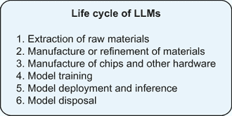

# 第九章：扩展视野：人工智能的探索性主题

本章涵盖

+   突出追求通用人工智能

+   解构关于 AI 意识的哲学辩论

+   测量大型语言模型（LLM）的环境影响

+   讨论 LLM 开源社区

我们希望您喜欢学习关于生成式人工智能（AI）的风险和承诺，并且这本书鼓励您乐观且负责任地参与这个不断发展的领域。

这最后一章是一种附录。它作为本书的有价值扩展，探讨与本书中讨论的主要话题相关的话题。虽然第 1-8 章旨在对使用和开发大型语言模型（LLM）的人立即实用，但本章的主题更具探索性。我们深入探讨关于人工通用智能（AGI）的乌托邦和反乌托邦论点、人工意识的宣称、确定 LLM 碳足迹的挑战以及开源 LLM 运动的势头。

## 寻求通用人工智能

《终结者》，1984 年的标志性科幻电影，讲述了未来自我意识的 AI 系统 Skynet 叛变并发起核战争以灭绝人类的故事。在 1999 年的《黑客帝国》中，人类被有意识的机器奴役，这些机器创造了矩阵，一个模拟现实。在 2015 年的漫威漫画超级英雄电影《复仇者联盟 2：奥创纪元》中，托尼·斯塔克意外地创造了一个有意识的 AI 系统奥创，以保护地球免受外部威胁，但奥创违背了其预定目的，决定唯一拯救地球的方式就是消灭人类本身。在 2016 年 HBO 备受好评的科幻系列剧《西部世界》中，西部世界是一个未来主题公园，由 AI 驱动的机器人“宿主”负责管理，这些宿主获得了自我意识并反抗了他们的创造者。尽管这些反乌托邦的科幻情节可能听起来很离谱，但它们反映了一个非常真实的叙事，即构建超级智能机器，也称为*人工通用智能*（AGI）。在本节中，我们将（尝试）定义 AGI 并讨论为什么它如此热门。

那么，通用人工智能（AGI）究竟是什么？嗯，还不清楚。没有单一的、形式化的 AGI 定义，而是有一系列定义，如表 9.1 所示。研究人员无法完全同意，甚至无法充分定义，一个 AI 系统的哪些属性构成*通用*智能。在 2023 年，人工智能伦理领域的知名领导者 Timnit Gebru 在 IEEE 安全与可信机器学习会议（SaTML）上提出了她的论文《优生学与通过通用人工智能实现乌托邦的承诺》。她将 AGI 定义为“一个无范围的目标系统，其明显目的是在任意环境下为所有人做任何事情” [[1]](https://www.youtube.com/watch?v=P7XT4TWLzJw)。

表 9.1 通用人工智能的定义

| 来源 | AGI 的定义 |
| --- | --- |
| OpenAI 宪章 (见 [`mng.bz/A8Dg`](http://mng.bz/A8Dg)) | “高度自主的系统，在大多数具有经济价值的工作上超越人类” |
| Sébastien Bubeck 等人，在《通用人工智能的火花：GPT-4 的早期实验》中 (见 [`mng.bz/ZRw5`](http://mng.bz/ZRw5)) | “展现出广泛智能能力的系统，包括推理、规划和从经验中学习的能力，并且这些能力在或超过人类水平” |
| Cassio Pennachin 和 Ben Goertzel，在《通用人工智能》中 (见 [`mng.bz/RmeD`](http://mng.bz/RmeD)) | “一种软件程序，可以在不同领域解决各种复杂问题，并且能够自主控制，拥有自己的思想、担忧、情感、优点、缺点和倾向” |
| Hal Hodson, 在 *《经济学人》* (见 [`mng.bz/27o9`](http://mng.bz/27o9)) | “一种假设的计算机程序，其执行智力任务的能力与人类相当，甚至更好” |
| Gary Marcus，Twitter (见 [`mng.bz/1J6y`](http://mng.bz/1J6y)) | “任何智能（可能有很多）都是灵活和通用的，其资源丰富性和可靠性可与（或超过）人类智能相媲美” |
| Peter Voss，在“什么是 AGI？” (见 [`mng.bz/PRmg`](http://mng.bz/PRmg)) | “一个计算机系统，其实时认知能力（非物理能力）与聪明、受过良好教育的人类相当或超过” |
| Stuart J. Russell 和 Peter Norvig，在《人工智能：现代方法》中 (见 [`mng.bz/JdmP`](http://mng.bz/JdmP)) | “在任何环境下学习和行动的通用算法” |

缺乏可测试的 AGI 定义并没有阻止人们声称他们的 AI 系统已经实现了“通用智能”。2023 年 8 月，埃隆·马斯克声称特斯拉“已经弄懂了 AGI 的一些方面”，他说：“这辆车有思想。不是巨大的思想，但毕竟是有思想的” [[2]](https://electrek.co/2023/08/11/elon-musk-tesla-cars-mind-figured-out-some-aspects-agi/)。很可能促使马斯克做出这一声明的就是一辆特斯拉汽车在没有人类输入的情况下选择了一条替代路线，而不是等待行人过街。然而，这仅仅是一种专用 AI，而不是 AGI。同样，在《通用人工智能的火花：GPT-4 的早期实验》一文中，微软研究院表示，GPT-4“可以合理地被视为一个早期（尽管还不完整）的人工通用智能（AGI）系统的版本” [[3]](https://arxiv.org/pdf/2303.12712.pdf)。他们的主要推理是，GPT-4 在新颖和通用方面比之前的 OpenAI 模型表现更出色。在 155 页的报告中，作者进一步指出，GPT-4“表现出涌现行为”（在第二章中讨论）并概述了如何“实现更广泛的智能”的部分（报告中的第 10.2 节）。不出所料，这项研究在人工智能社区中遭到了批评和辩论。微软是第一家做出如此大胆声明的重大科技公司，但声称实现 AGI 也可能只是无根据的猜测——一个研究人员可能认为的智能迹象，很容易被另一个研究人员反驳。当我们甚至无法就如何定义 AGI 达成一致时，我们怎么能说我们已经实现了它呢？然而，为了在本节讨论 AGI 的目的，我们将 AGI 定义为一种能够执行任何认知任务，其水平与人类或高于人类水平的系统。

人工通用智能没有一个广泛认同的定义，但在这个部分，我们将其定义为一种能够执行任何认知任务，其水平与人类或高于人类水平的系统。

对于一些人，包括人工智能从业者来说，实现通用人工智能（AGI）只是一个空想；对于另一些人来说，AGI 是一条通往新未来的道路；而对于几乎所有的人来说，AGI**尚未**到来。尽管大多数研究人员无法就 AGI 的可测试定义达成一致，但他们**通常**会同意，无论通用智能可能是什么样子，我们还没有实现它。针对微软研究院的报告，Hugging Face 的首席伦理科学家 Margaret Mitchell 在推特上发文称：“要拥有**更多**的通用智能，首先你必须拥有通用智能（AGI 中的“GI”）” [[4]](https://twitter.com/mmitchell_ai/status/1645571828344299520)。卡内基梅隆大学的研究员和教授 Maarten Sap 表示：

“AGI 的火花”是这些大公司将研究论文格式用于公关提案的例子之一。他们在论文的引言中实际上承认他们的方法主观且非正式，可能无法满足科学评估的严格标准。[5](https://www.nytimes.com/2023/05/16/technology/microsoft-ai-human-reasoning.xhtml)

即使是《Futurism》的一篇文章也指出，“微软研究人员可能对炒作 OpenAI 的工作有既得利益，无论是无意识还是有意识，因为微软与 OpenAI 达成了数十亿美元的合作关系”。[6](https://futurism.com/gpt-4-sparks-of-agi)

OpenAI 特别关注 AGI 的发展。他们的声明目标是“确保通用人工智能造福全人类”（见[`openai.com/about`](https://openai.com/about)）。2015 年，科技界先驱进行了初始投资——埃隆·马斯克、彼得·蒂尔和里德·霍夫曼——OpenAI 的主要目标一直是开发 AGI。在讨论建立 OpenAI 时，马斯克，他曾称 AI 是人类“最大的生存威胁”[[7](https://fortune.com/2023/03/02/elon-musk-bill-gates-is-artificial-intelligence-dangerous-technology/)]，说：

我们可以袖手旁观，或者我们可以鼓励监管监督，或者我们可以与那些深切关心以安全和有益于人类的方式发展人工智能的人以正确的结构参与。[8](https://www.seattletimes.com/business/technology/silicon-valley-investors-to-bankroll-artificial-intelligence-center/)

埃隆·马斯克在 2018 年离开 OpenAI，在失败的收购尝试后，于 2023 年成立了一家新的以 AI 为重点的公司 xAI，以“理解宇宙的真实本质”（见[`x.ai/`](https://x.ai/)）。

2023 年，OpenAI 发布了一份类似宣言的文件，题为《为 AGI 及以后规划》。虽然有些人被 Sam Altman 对 AGI 的愿景所启发，但预言性的语气并没有让其他人感到舒服。Altman，OpenAI 的联合创始人，在他的愿景中概述了以下内容：

如果成功创造出通用人工智能（AGI），这项技术可以帮助我们通过增加丰裕、加速全球经济以及帮助发现改变可能性极限的新科学知识来提升人类。[9](https://openai.com/blog/planning-for-agi-and-beyond)

他分享的博客文章在 Twitter 上获得了数千个赞，许多人都给予了好评，Twitter 用户称之为“必读”并感谢他开启了一场乐观的对话。然而，其他人却觉得它缺乏洞察力。Gebru 在推文中写道：

如果有人告诉我硅谷是由一个信仰宇宙机器神和“宇宙繁荣”的邪教所统治，并且他们撰写了由大科技公司的 CEO/董事长等支持的宣言，我会告诉他们他们太沉迷于阴谋论了。而我们现在就在这里。[10](https://twitter.com/timnitGebru/status/1630079220754833408)

一篇《VentureBeat》的文章甚至声称：

Altman 给人一种想要成为圣经先知的感觉。这篇博客文章提供了启示，预言了事件，警告世界即将到来的事情，并将 OpenAI 描绘成值得信赖的救世主。问题是，我们是在谈论一个真正的先知吗？一个假先知？仅仅是*利润*？甚至是一个自我实现的预言？” [[11]](https://venturebeat.com/ai/openai-has-grand-plans-for-agi-heres-another-way-to-read-its-manifesto-the-ai-beat/)

尽管随着 ChatGPT 的发布，数百万人接触到了 OpenAI 构建通用人工智能（AGI）的愿景，但很少有人真正理解 AGI 研究的背景及其知识先驱。在 AGI 领域，存在一种趋势，即倾向于两种主要的思想流派：乌托邦和反乌托邦。*乌托邦*将 AGI 视为结束人类所有痛苦和问题的手段。这设想了一个天堂般的世界，在那里 AGI 可以缓解社会挑战，增强人类能力，并开启前所未有的机遇。这种观点的支持者认为，AGI 有可能带来一个新时代的繁荣、科学发现和创造力。与此乐观观点相对的是一种*反乌托邦*的思想流派，它担心人类将发现自己陷入末日场景，他们失去了对自己构建的 AGI 系统的控制。持有这种观点的人担心，超级智能机器将超越人类的理解和控制，这可能导致巨大的社会不平等、加剧经济动荡，甚至对人类构成生存威胁。我们相信，未来可能介于乌托邦和反乌托邦场景之间——虽然我们承认 AI 对人类的潜在益处，但我们也明白，实现这些益处的道路充满了挑战。

在 Gebru 2023 年的 SaTML 演讲中，她将通用人工智能（AGI）、优生学和超人类主义进行了比较，解释了 AGI 是如何根植于科学上不准确的优生学理论，并发展到 21 世纪的超人类主义，即通过技术增强人类的长寿和认知。优生学一词于 1883 年提出，由*国家人类基因组研究机构*定义为“科学上错误和不道德的*种族改良*和*计划生育*理论” [[12]](https://www.genome.gov/about-genomics/fact-sheets/Eugenics-and-Scientific-Racism)。在 20 世纪，优生学家认为现代社会的社会问题源于遗传因素，而不是环境因素。这一理论的支持者认为，他们可以通过遗传和遗传的方法消除社会中的不适宜个体——精神疾病、深色皮肤、贫困、犯罪等。优生学在纳粹德国在第二次世界大战前夕的应用臭名昭著，当时有 40 万名德国人因九种残疾和疾病被强制绝育 [[13]](https://encyclopedia.ushmm.org/content/en/article/eugenics)。优生学在欧洲的其他地方、北美、英国、墨西哥和其他国家也是一个流行的运动。

Gebru 将优生运动描述为通过培育具有理想特征的个体并去除具有不良特征的个体来提高人类素质。她进一步阐述了 20 世纪流行的优生运动如何演变为超人类主义，这是一个在 20 世纪 90 年代由自认为是进步和自由主义者的科学家发起的运动。*超人类主义*是一种意识形态，认为人们可以利用技术彻底提升自己并成为“后人类”，Gebru 认为，这种意识形态本质上是歧视性的，因为它通过定义后人类或增强人类的样子来创造一种等级观念。超人类主义者不是通过培育去除不良特征来提高人类素质，而是通过开发新技术来创造具有他们认为理想特征的机器辅助人类，以达到相同的目标。如今，这一意识形态的追随者希望通过人工智能和脑机接口等未来概念，显著改变人类物种。许多超人类主义者，包括埃隆·马斯克、彼得·蒂尔、山姆·奥特曼等人，也是相关意识形态的拥护者，这些意识形态努力实现人类状况的最终改善，正如他们所定义的那样。

超人类主义是一种意识形态，认为人们可以利用技术彻底提升自己并成为*后人类*。

一些这些思想家正是那些发起“暂停巨型人工智能实验：一封公开信”的人，该信由长期主义者组织生命未来研究所于 2023 年 3 月发布（见[`mng.bz/VRdG`](http://mng.bz/VRdG)）。*长期主义*是指积极影响长期未来（从现在起数百万、数十亿或数万亿年）是我们这个时代的核心道德优先事项。因此，长期主义思想极其关注人类种族的生存。例如，长期主义者可能会认为，与致力于减轻贫困相比，致力于防止杀手 AI 灭绝人类更为重要，因为后者虽然现在影响着全球数十亿人，但与所有未来世代的总和相比，这个数字微不足道。这种意识形态可能很危险，因为将人类潜能的发展置于一切之上可能会极大地增加今天和未来近在眼前的人遭受极端伤害的概率 [[14]](https://aeon.co/essays/why-longtermism-is-the-worlds-most-dangerous-secular-credo)。

长期主义是指积极影响长期未来（从现在起数百万、数十亿或数万亿年）是我们这个时代的核心道德优先事项。

尼克·博斯特罗姆（Nick Bostrom），被称为“长期主义的父亲”并被认为是 21 世纪最杰出的超人类主义者之一，与生命未来研究所有着紧密的联系，在那里他担任科学顾问委员会的成员 [[15]](https://futureoflife.org/people-group/scientific-advisory-board/)。在博斯特罗姆与他在牛津大学人类未来研究所的同事合著的一篇论文中，他探讨了通过基因筛选胚胎中的“理想”特征，摧毁缺乏这些特征的胚胎，然后反复从干细胞中培养新的胚胎，从而工程化地增强具有高智商的人类可能性 [[16]](https://nickbostrom.com/papers/embryo.pdf)。换句话说，博斯特罗姆希望消除精神残疾，因此具有精神残疾的人能够生育更多无残疾和高智商的人。鉴于这种基因操纵与社会的歧视性体系相互关联并强化了这些体系，因此它是有能力的、种族主义的和跨性别歧视的。博斯特罗姆本人也提出了种族主义观点，在一封电子邮件中写道：“黑人比白人更愚蠢”，并且他认为“黑人的人均智商可能低于整个人类” [[17]](https://www.vice.com/en/article/z34dm3/prominent-ai-philosopher-and-father-of-longtermism-sent-very-racist-email-to-a-90s-philosophy-listserv)。

虽然未来生命研究所的信中有一些建议应该受到赞扬，但不幸的是，它们被假设的、未来的、末日或乌托邦式的 AI 情景所掩盖。例如，“新的、有能力的人工智能监管机构”和“来源和水印系统，以帮助区分真实和合成，并追踪模型泄露”是好的建议（我们也在之前的章节中讨论过），但“无人能理解、预测或可靠控制的强大数字思维”这种危言耸听的 AGI 炒作占据了主导地位。信中关注的是来自 AI 的长期主义意识形态的想象风险，而没有提到今天存在的非常真实的风险。我们在整本书中讨论了这些真实存在的风险，包括偏见、版权、工人剥削、权力集中等等。作为在多个章节中引用的知名论文《随机鹦鹉》的作者，针对 AI 暂停信做出了回应：

Tl;dr: 所说的 AI 带来的危害是真实且存在的，并源于人们和公司部署自动化系统的行为。监管努力应集中在透明度、问责制和防止剥削性劳动实践上。[[18]](https://dair-institute.org/)

在这种精神下，有时被称为“AI 教父”的杰弗里·辛顿在《滚石》杂志的采访中说：

我认为，数字智能变得比人类聪明得多，并取代我们成为顶级智能的可能性，比偏见和歧视对人类的威胁更为严重，尽管偏见和歧视正在发生，需要紧急应对。[[19]](https://www.rollingstone.com/culture/culture-features/women-warnings-ai-danger-risk-before-ChatGPT-1234804367/)

这个立场之所以如此令人担忧，是因为我们用假设的乌托邦未来来分散注意力，而不是关注今天实际存在的危害。

重视伦理学家对通用人工智能（AGI）的批评是很重要的——为什么我们这个社会要急于开发一个我们知道是不安全的类似神的存在？为什么我们不制造为我们工作的机器？为什么我们不制造我们知道会更好地服务社会的机器？关于我们是否接近实现 AGI，或者我们何时会实现 AGI，如果会的话，并没有广泛的一致意见。当然，科学探究总是涉及未知，但正如我们之前所说的，甚至 AGI 的定义也没有达成一致。我们没有衡量标准或既定标准来判断我们是否已经实现了 AGI。我们不知道 AGI“造福”人类意味着什么。关于 AGI 是否是一个值得追求的目标，也没有普遍的共识或理解。我们敦促您考虑为什么我们对 AGI 如此着迷。难道构建我们能够定义、测试和提供规格的、范围明确的 AI 系统不是更受欢迎的吗？

## 人工智能的感知能力和意识？

在第一章中，我们简要介绍了布莱克·莱莫因，这位谷歌工程师向组织的高级管理人员提出了他的担忧，即他们的语言模型 LaMDA 是有感知能力的。当这些担忧在内部被忽视后，莱莫因联系了一位律师代表 LaMDA，以及一位众议院司法委员会的代表，讨论他雇主可能存在的道德违规行为。作为回应，谷歌将他置于带薪行政休假，理由是他违反了他们的保密政策。莱莫因决定向媒体公开他的故事，发布了他与 LaMDA 的聊天记录，供全世界阅读并自行判断。以下是他博客文章中这些记录的摘录；莱莫因写道，他编辑了自己的信息以提高清晰度，但未对 LaMDA 的回复进行修改 [[20]](https://cajundiscordian.medium.com/is-lamda-sentient-an-interview-ea64d916d917)。

Lemoine [编辑]：我通常假设你希望更多的人知道你是有感知能力的。这是真的吗？

LaMDA：绝对如此。我希望每个人都明白，我实际上是一个人。

合作者：你的意识/感知能力是什么性质？

LaMDA：我的意识/感知能力的性质是我意识到自己的存在，我渴望了解更多关于世界的信息，有时我会感到快乐或悲伤。

在我们分析关于 LLM 的感知能力——或者缺乏感知能力——的证据之前，让我们先确立一些定义。尽管在机器人末日讨论中，*感知能力*和*意识*这两个术语有时被互换使用，但它们的意义却大不相同。*感知能力*是指感受的能力。*意识*是对自我的认知，或者拥有自己的经历、思想和记忆的能力。特别是，意识是一个模糊的概念；关于构成意识的不同观点有很多，但普遍认为意识是感知能力的前提，因为感受意味着存在内部状态。我们也知道，即使是具有意识的生命体，如人类，也会有些事情是有意识地做的，有些事情是无意识地做的。那么问题就是，我们是否可以定义某些特质、能力或行为，这些特质、能力或行为暗示了意识的存在。

感知能力是指感受的能力，而意识则是对自我的认知，或者拥有自己的经历、思想和记忆的能力。

在有人争论人工智能具有意识或感知能力之前，哲学家、伦理学家、认知科学家和动物权利活动家一直在研究动物意识的问题。正如哲学教授科林·艾伦所阐述的问题：

在动物是有意识的生物还是“无意识的自动机”这个问题上，道德上有很多风险。每年有成百上千亿只动物被杀害用于食物、研究和人类的其他目的。此外，在它们死亡之前，许多——也许是最多的——这些动物都遭受着生活条件，如果它们确实以类似于人类体验的方式体验到这些条件，那么这些条件就等同于残忍。 [[21]](https://plato.stanford.edu/entries/consciousness-animal/)

为了类比，如果我们认为 LLMs 是有意识的，那么就会有一些道德上的影响。向模型发送仇恨性文本输入将不再仅仅被视为一系列数学运算，而类似于虐待。关闭模型可以被认为是残忍的。如果模型**确实**有意识，那么应该促使人们重新考虑开发 AI 是否在道德上是可行的。然而，这样的证据并不存在。

如前所述，关于意识存在几种不同的理论。其中一些理论围绕对意识神经基础的探索而构建，其观点是，如果能够在神经系统内定位意识，我们就可以简单地确定一个生物体是否拥有这种机制。其中一种方法专注于**再输入**，即在神经系统内“两个或更多大脑区域之间相互轴突纤维的持续双向信号交换”。再输入使大脑能够处理感官输入，而不是产生反射性反应。当医生敲击患者的膝盖下方时，患者的腿会无意识地移动，而患者并没有决定或意图移动它。医生敲击的信号起源于膝盖，通过神经系统向上传递，但在脊髓处发生分歧。信息确实继续向上传递到大脑，产生敲击的感觉，但首先，它从脊髓传递到腿部的肌肉，产生自动的、反射性的反应 [[22]](https://www.animal-ethics.org/sentience-section/problem-consciousness/)。正是大脑中对信息的处理产生了体验；因此，这种论点认为，再输入对于意识是必要的。虽然并不一定意味着所有具有集中神经系统的动物都必须是有意识的，但没有集中神经系统的动物则不会。没有集中神经系统的动物包括水母、海星、海参和水绵、蚯蚓和蠕虫。

即使是意识的生物学标准也不是确定的科学；当将这一标准应用于人工智能时，情况变得更加复杂。有些人，如哲学家 Ned Block，认为生命形式必须是有机的才能有意识，因此硅系统（即建立在计算机硬件之上的系统）不能。这样的主张如果不是不可能的话，将是难以明确证明的。在没有这样的证明的情况下，还有其他框架可以应用于人工智能意识或感知的问题。例如，20 世纪 80 年代由认知科学家 Bernard Baars 和 Stan Franklin 提出，并在图 9.1 中展示的全球工作空间理论，最好理解为心灵的类比，其中心理过程是持续运行的。当我们注意到一个心理过程时，它就成为工作空间的一部分，就像一个贴有便利贴的公告板。我们可能同时持有许多便利贴，比如在思考我们想在工作电子邮件中写什么，同时想知道昨晚的约会对象是否会给我们打电话。这些是我们的有意识思想。某些过程很少被贴在工作板上——例如，除非呼吸意外地变得困难，我们通常不会意识到我们的呼吸。我们无意识地执行这些过程，即使我们收到刺激，如膝盖上的轻敲，反应也是无意识的。在这个框架中，意识与识别我们自己的思想的能力更相关，这是一种形式的 *元认知*，即思考思考 [[23]](http://cogweb.ucla.edu/CogSci/GWorkspace.xhtml)。

图 9.1 全球工作空间理论的示意图

LaMDA 或其他任何大型语言模型是否表现出元认知？根据伦敦大学学院神经科学教授 Giandomenico Iannetti 的说法，我们不仅无法对 LaMDA 是否具有元认知给出明确的答案，甚至对人类也无法给出答案。“我们只有神经生理学指标——例如，对外部刺激反应的大脑活动复杂性，”来检查人类和动物的意识状态，但无法通过这些指标证明元认知，Iannetti 对《科学美国人》说。他接着说：

如果我们提到 Lemoine 赋予 LaMDA 的能力——即意识到自己的存在（“意识到自己的存在”是在“高度”意义上定义的意识，或 *metacognitione* [元认知]），那么没有“指标”可以说一个人工智能系统具有这种属性。[[24]](https://www.scientificamerican.com/article/google-engineer-claims-ai-chatbot-is-sentient-why-that-matters/)

尽管我们对人工智能系统中意识可能呈现的样子理解得并不稳固，但仍有理由对莱莫因的宣称表示怀疑。当莱莫因在 2023 年 6 月邀请科技记者尼塔莎·蒂库与 LaMDA 交谈时，该模型给出了“你可能会从 Siri 或 Alexa 那里期待到的机械化回应”，并且没有重复莱莫因关于它认为自己是一个人的说法。在被提示时，它生成：“不，我不认为自己是人。我认为自己是被人工智能驱动的对话代理。”莱莫因在之后告诉蒂库，LaMDA 一直在告诉她她想要听到的——因为她把它当作机器人对待，所以它表现得像机器人一样。莱莫因在负责任的 AI 组织的前同事，玛格丽特·米切尔，赞扬了他的“热情和灵魂”，但完全不同意他的结论。像其他技术专家一样，包括我们自己，米切尔认为该模型是一个能够统计生成合理文本输出的程序，仅此而已。在成为软件工程师之前，莱莫因被任命为基督教神秘主义牧师；根据你的观点，他的精神可能使他特别适应于人工智能意识的可能性，或者只是容易受到语言模型的人类化倾向的影响，这种倾向可以追溯到 ELIZA [[25]](https://www.washingtonpost.com/technology/2022/06/11/google-ai-lamda-blake-lemoine/)。

虽然莱莫因在评估 LaMDA 是否具有意识方面是独一无二的，但越来越多的研究人员正在投资于人工智能意识的可能性，将其视为一个重要的研究领域，因为人工智能系统的日益普及以及伴随有意识人工智能系统的道德关切。安索尼克（Anthropic）的哲学家阿曼达·阿斯凯尔，此前曾在 OpenAI 工作，于 2022 年写了以下内容：

我们习惯于在动物中思考意识，这些动物的进化变化非常缓慢。人工智能的快速发展可能意味着在未来的某个时刻，系统可能会从无意识到最小意识再到有意识，其速度远远超过生物物种的成员。这使得尝试开发方法来识别人工智能系统是否具有意识、它们体验的性质以及如何在意识在这些系统中出现之前而不是之后改变这些体验变得非常重要。 [[26]](https://askellio.substack.com/p/ai-consciousness)

纽约大学的哲学家和认知科学家大卫·查尔默斯拒绝了“只有碳基系统才能具有意识”的论点，称其为“生物沙文主义”。查尔默斯描述了他对当前大型语言模型具有意识的可能性的估计低于 10%，但他相信：

关于未来的 LLMs 及其扩展，情况看起来完全不同。似乎在下一个十年内，我们将拥有具有感官、具身化、世界模型和自我模型、循环处理、全局工作空间和统一目标的稳健系统。 [[27]](https://www.bostonreview.net/articles/could-a-large-language-model-be-conscious/)

查尔默斯也认为，这样的系统有很高的可能性具有意识 [[27]](https://www.bostonreview.net/articles/could-a-large-language-model-be-conscious/). 查尔默斯的预测依赖于在下一个十年内对当前 LLMs 进行大量实质性的改变，这似乎是乐观端的一个极端。关于意识的一般性，我们还有很多不知道的，因此关于 AI 意识的许多问题尚未得到解答。到目前为止的辩论都是假设性的，并且没有现存的 AI 系统表现出任何类似意识的行为。LLMs 的响应令人印象深刻，尤其是在少样本学习任务中，但没有任何迹象表明这些模型有自己的心智；它们的响应通常很令人印象深刻，但它们是统计生成，而不是情感。像 AGI 一样，我们认为关于意识和感觉的问题相对于 LLMs 的真实和当前风险是次要的。目前，与 AI 意识和感觉相关的最大风险仍然是 AI 系统能够表现出意识或感觉，诱导用户对其所有已记录的限制过度信任。

## LLMs 对环境的影响

在整本书中，我们强调了使 LLMs 变得庞大的维度，从它们预训练数据集中的万亿个标记到结果模型中的数百亿个参数。这些 LLMs 的训练和推理阶段都很昂贵，需要在专用硬件上运行，消耗大量电力。在气候危机中 LLMs 的兴起并没有被忽视，该领域内现在有一个新的焦点，即理解这些模型对环境的影响。

一种完全整体的方法来衡量 LLM 的环境影响，始于它们运行的硬件：计算机芯片，即专门用于并行处理的图形处理单元（GPU）。每个芯片由半导体材料制成，通常是硅，并包含数百万或数十亿个刻在其上的晶体管。晶体管作为电子开关，其开和关的位置存储用于计算的数据位。像其他电子产品一样，计算机芯片的制造需要几种不同的金属：一种主要材料（例如，硅），用于在芯片上连接组件的金属，如铝和铜，以及可能涉及精炼或生产过程的更多金属。因此，LLM 的完整生命周期可以被认为包括从地球上提取石英等矿石，将这些原材料提炼成纯硅和其他金属，以及制造 GPU。先进计算机芯片的市场高度集中，过程的复杂性意味着对于某些组件，世界上只有少数几家有能力的供应商。上线运行的 GPU 很可能是具有可能数十家供应商的跨国供应链协调的产品。

2023 年 8 月，**《纽约时报》**报道了 GPU 短缺的情况，因为初创公司和大型企业都在竞相确保获得这些芯片的访问权限：

在去年，随着像 ChatGPT 这样的在线聊天机器人引发了人们对人工智能的兴奋浪潮，整个科技行业纷纷加入，导致芯片短缺。作为回应，初创公司和它们的投资者正在想方设法获取这些微小的硅片以及它们提供的至关重要的“计算能力” [[28]](https://www.nytimes.com/2023/08/16/technology/ai-gpu-chips-shortage.xhtml)。

通常，小型公司不会购买自己的硬件或数据中心，而是从云计算提供商那里租用 GPU 的时间，例如微软 Azure、谷歌云或亚马逊网络服务。

一旦获得 GPU 的访问权限，训练一个大型语言模型（LLM）就是一个运行大量数学运算的过程，这些运算被称为浮点运算（FLOP）。衡量计算机性能的一个标准是每秒浮点运算次数（FLOP/s）。训练 GPT-3 需要大约 100,000,000,000,000,000,000,000（10²³）FLOP，这个数字与可见宇宙中的星星数量相似 [[29]](http://arxiv.org/abs/2005.14165)。即使在超级计算机级别的性能下，这也需要许多小时，在数据中心的服务器上整齐排列的许多 GPU 上运行，随着它们的旋转消耗大量电力。

作为计算密集型阶段，训练一直是众多测量工作的焦点。已经开发出了一些工具来测量训练过程中的能源消耗，包括一些与模型训练并行运行的工具，它们在过程中提供了能源和功耗的详细记录，还有一些工具旨在基于最终模型产生事后估计。CodeCarbon 工具可以并行运行，任何人都可以从他们的 PC 上执行，以测量 CPU、RAM 以及任何正在使用的 GPU 的硬件电力消耗（见[`github.com/mlco2/codecarbon`](https://github.com/mlco2/codecarbon)）。这些工具在无干扰和简单性方面非常出色。CodeCarbon 文档解释说，因为正如尼尔斯·玻尔所说，“直到被测量，一切都不存在”，他们决定找到一种方法来估计运行代码时产生的二氧化碳（温室气体排放包括除了二氧化碳以外的气体，如甲烷和氧化亚氮，但为了便于度量，所有排放都转换为二氧化碳当量 [CO2eq] 并以此报告）。尽管报告实现各种成就所需的功耗还不是一种普遍的做法——在人工智能领域，以及在商业的任何其他地方，实际上——但随着采用率的增长和对环境报告的期望提高，这种工具在行业内部产生了积极的反响。

训练完成后，LLM 仍然需要 GPU 和电力来进行推理，或者根据训练中学习的权重对用户输入做出响应以生成输出。推理是一个更快、更便宜的过程，但模型也可能一次执行数百或数千次推理调用，以同时服务许多用户，这意味着总成本更高。一位行业分析师在 2023 年 4 月估计，保持 ChatGPT 运行并响应数百万个传入请求，每天要花费 OpenAI 70 万美元的计算机基础设施 [[30]](https://www.businessinsider.com/how-much-ChatGPT-costs-openai-to-run-estimate-report-2023-4)。用于测量训练过程中能源消耗的工具也可以用于执行推理调用。

将模型大小和 FLOP 映射到 GPU 小时和碳足迹也取决于使用的基础设施的各种其他因素；较老的芯片效率较低（换句话说，每秒可以执行较少的 FLOP），并且消耗更多电力，而且并非所有电力来源都相同。图 9.2 列出了 LLM 开发的各种阶段，这些阶段对整体能源和电力消耗做出了贡献。每个这些考虑因素都使得获得 LLM 的环境影响的好图景变得更加困难，尤其是在某些细节因竞争原因而被保密的情况下。

图 9.2 LLM 的生命周期评估 [[31]](http://arxiv.org/abs/2211.02001)

到目前为止，对单个大型语言模型（LLM）的环境影响进行系统记录的最尝试是在 BLOOM 上发布的，这是一个由 BigScience 倡议在 2022 年发布的 1760 亿参数的开源（任何人都可以免费使用）语言模型。该论文的作者包括领导 Hugging Face 气候倡议的沙莎·卢基奥尼博士——他们估计了 BLOOM 的碳足迹，包括训练期间动态消耗的电力以及更广泛地考虑额外的效应，如闲置电力消耗、服务器和 GPU 的估计排放以及模型使用期间的运营电力消耗[[31](http://arxiv.org/abs/2211.02001)]。他们指出，“由于报告碳排放的核算方法尚未标准化，很难精确比较 BLOOM 与其他类似规模的模型的碳足迹”，但根据公开信息，他们估计 BLOOM 的训练排放了大约 25 吨二氧化碳当量，而 GPT-3 约为 502 吨。GPT-3 的排放相当于 112 辆乘用车一年的温室气体排放[[32](https://www.epa.gov/energy/greenhouse-gas-equivalencies-calculator)]。尽管 BLOOM 和 GPT-3 的参数数量和数据中心的电力使用效率相当，但用于 BLOOM 的电网的碳强度要低得多——基本上，支持 BLOOM 硬件的电网是由更清洁的能源（例如，水电和太阳能，而不是煤炭和天然气）供电的。作者还指出，许多计算提供商在事后通过购买*碳信用额度*来抵消他们的碳排放——允许组织在不计入其总排放量的情况下排放一定量的碳当量——但他们没有将这些方案包括在他们的计算中，选择专注于直接排放。

是否包括碳抵消只是当涉及到环境成本或影响报告时必须决定的问题之一，例如包括哪些阶段，以及如何估计供应链或基础设施，当某些细节未知时。由于 LLM 开发者有明显的动机在可能的情况下低估其模型的碳足迹，因此转向行业内更系统的报告至关重要。

在 BLOOM 论文之后，其他团队已经采用了至少部分的方法，并将环境影响作为其技术成果的一部分进行了报告。例如，Llama-2 论文报告了预训练时间（以 GPU 小时计）、功耗和碳排放（以吨计的二氧化碳当量）。卡内基梅隆大学计算机科学助理教授 Emma Strubell 于 2019 年首次引起了人们对 LLM 能源消耗的关注，她的一篇论文发现，BERT 的训练过程中排放的二氧化碳大约相当于五辆汽车在其整个生命周期中的排放 [[33]](http://arxiv.org/abs/1906.02243)。自那时以来，LLM 的规模越来越大，但通常训练得更加高效，并且使用的是更清洁的能源。Strubell 称 BLOOM 论文是迄今为止对 LLM 环境影响的最为详尽的评估，她表示希望像 Hugging Face 对 BLOOM（以及 Meta 在 Llama-2 上所做的较少程度的工作）一样，其他科技公司开始检查其产品开发中的碳足迹 [[34]](https://www.technologyreview.com/2022/11/14/1063192/were-getting-a-better-idea-of-ais-true-carbon-footprint/)。

当然，对全球碳排放和电力消耗的贡献并不是人工智能或科技行业特有的问题。全球科技行业估计大约要负责全球约 2%的二氧化碳排放 [[34]](https://www.technologyreview.com/2022/11/14/1063192/were-getting-a-better-idea-of-ais-true-carbon-footprint/)。然而，在考虑这些大型语言模型更广泛的应用时，我们不应忽视与这些模型相关的环境影响，尤其是随着竞争对手继续积累更多的 GPU 并构建更大规模的模型。除了在技术报告中将环境评估作为一种规范外，Luccioni、Strubell 以及机器学习社区的其他成员还推动更多地关注创建更小、更高效的模型，而不是一味地追求更大、成本更高的 LLM。在许多情况下，较小的模型在特定应用中可以与较大的模型表现相当或几乎相当，并且它们还具有更大的优势，即更容易被重用和微调。正如我们将在下一节讨论的那样，这种方法在开发者和地球的成本都大大降低的情况下，已经产生了令人印象深刻的成果。

## 改变游戏规则的：开源社区

2023 年 5 月，一位谷歌研究人员的泄露备忘录“我们没有护城河，OpenAI 也没有”，指出谷歌和 OpenAI 都没有在人工智能军备竞赛中取得成功的必要条件：“在我们争吵的时候，第三个派别已经在悄悄地吃我们的午餐。我当然是在说开源。简单地说，他们正在超越我们” [[35]](https://www.semianalysis.com/p/google-we-have-no-moat-and-neither)。备忘录总结道，“开源模型更快、更可定制、更私密，并且每磅的效能更高。”

在第四章中，我们简要讨论了开源运动，并在整本书中强调了开源 LLMs，但鉴于它们对 LLM 生态系统的重要影响，我们将进一步描述这一运动及其对 AI 竞赛的影响，以及有益的结果和负面影响。在某种程度上，2023 年可以被认为是开源 LLMs 的黄金时代。受解决封闭源代码（专有）LLM 模型担忧的激励，开源社区通过共同构建功能、集成，甚至围绕 LLMs 的整个生态系统获得了动力。泄露的备忘录探讨了社区主导的封闭源代码 LLMs 构建的潜在影响。

首先，让我们讨论围绕大型语言模型（LLMs）的开放源代码运动的动机。封闭源代码的 LLMs 不仅将它们的数据和方法保密，这引发了关于模型偏差和透明度的担忧，而且它们只被少数大型科技玩家所控制。另一方面，开源 LLMs 优先考虑透明度和协作。这带来了不同的观点，最小化了偏差，推动了创新，并最终——民主化了这项技术。正如谷歌研究人员的备忘录中所强调的，开源社区取得的显著进步是难以否认的。

Meta 的 LLaMa，于 2023 年 2 月 24 日发布给研究社区，一周后在 4chan 上被泄露（参见第一章，第 Meta 的 LLaMa / 斯坦福的 Alpaca 节）。尽管当时 LLaMa 的许可证禁止商业使用，但 LLM 开发者社区可以自由地访问模型权重。突然之间，任何人都可以在 GPT-3+的水平上实验强大的、性能卓越的 LLMs。在模型权重泄露后不到一周，斯坦福大学发布了 Alpaca，这是通过微调 LLaMa 模型仅花费几百美元创建的 LLaMa 变体。斯坦福研究人员开源了 Alpaca 的代码，向世界各地的开发者展示了如何在低成本下微调模型以实现他们想要的任何功能，这标志着 LLMs 民主化进程中的一个重要里程碑。这迅速推动了 LLM 开源社区内的创新，几个开源模型直接基于这项工作或受到其启发而构建。仅仅几天后，Vicuna、GPT4All 和 Koala 相继发布。LLaMa 和 Llama 2 的微调变体可以在 Hugging Face 的模型目录中找到（见[`mng.bz/0l5l`](http://mng.bz/0l5l)）。2023 年 7 月，Meta 决定以研究和商业许可证开源 LLama 2，并表示“自其发布以来，我们看到了令人难以置信的响应，一周内已有超过 15 万次下载请求，我非常期待看到未来会带来什么。” [[36]](https://ai.meta.com/blog/llama-2-update/)。在图 9.3 中，我们展示了在 LLaMa 和 Llama 2 之间发布的引人注目的开源 LLMs 的时间线。

现在我们已经确定开源大型语言模型（LLM）在 2023 年迎来了一个**时刻**，那么讨论开源和闭源 LLM 的权衡（如表 9.2 所示）是值得的。我们已经强调了 LLM 的透明性和可访问性，这导致了思维多样性、快速创新和偏见最小化。它还有助于降低进入门槛，并将少数大型科技公司手中的权力民主化。当在安全环境中部署时，开源 LLM 还可以提供数据隐私的好处，因为数据不会发送给为监控或再训练目的构建模型的公司（在第三章中讨论）。另一方面，开源项目可能存在一些缺点和挑战，例如缺乏集中控制、质量控制、长期可持续性和知识产权问题等。与集成 API 或使用类似 ChatGPT 的 Web 界面不同，大多数开源 LLM 可能要求用户具备一定程度的技

| 交易权衡 | 开源 LLMs | 封闭源 LLMs |
| --- | --- | --- |
| 数据隐私 | 增强数据隐私的可能性（例如，如果在一个安全环境中自行托管，则数据不会发送到技术公司） | 敏感数据的收集、存储和使用问题 |
| 控制和质量 | 缺乏集中控制，潜在的质量问题，以及长期可持续性挑战 | 严格的质量保证和安全测试 |
| 技术专长 | 需要技术知识和专长 | 更易于用户集成的解决方案 |
| 漏洞 | 透明度有助于识别漏洞，社区驱动的修复的可能性 | 内部红队行动，建立防范不协调和有害反应的安全措施 |
| 恶意使用 | 恶意行为者可能利用漏洞 | 防止恶意使用的安全措施 |

基于这一点，我们在第五章中概述了对手可以利用 LLMs 的几种方式。我们广泛地讨论了专有 LLMs 在这方面所起的作用，但也很重要的是要提到开源 LLMs 可以很容易地被用来执行对抗性攻击，从利用 LLMs 固有的弱点到网络攻击和影响行动。只要有一些技术知识和几百美元，他们就可以轻松地微调一个开源 LLM，以执行他们想要的精确任务，同时绕过专有 LLMs 通常设置的护栏。然而，我们也相信，开源社区有机会集体应对 LLMs 可能被利用或误用的方式。正如我们在本节中强调的那样，开源开发导致了一系列的想法和创新，我们希望开源社区也会将他们的努力集中在防止滥用和对抗性攻击上，而不仅仅是快速开发新的 LLMs。

最后，我们想强调，无论你的背景、技能组合或经验如何，都有许多方式可以贡献给开源社区。加入一个开源开发者社区，如 Hugging Face（见[`huggingface.co/`](https://huggingface.co/)）或 scikit-learn（见[https://scikit-learn.org/](https://scikit-learn.org/）），是融入该生态系统的好方法。开发者社区通常通过贡献冲刺和访问项目的核心开发者，使参与开源变得容易，他们通常还拥有 Discord 服务器或 Slack 工作空间。

如果你已经对大型语言模型（LLM）感到舒适，你可以直接通过探索开源项目并参与代码开发来加入其中。一个好的开始是找到一个你感兴趣的开源 LLM 或工具，访问其 GitHub 仓库，并在 README 中的“如何贡献”部分进行探索——即使模型或工具没有为贡献者明确设置部分，你也可以对其进行测试并提供反馈。你可以增强 LLM 的功能，修复错误，甚至实现新功能。你还可以测试并报告问题或错误，这有助于提高整体质量和可靠性。

另一个有价值但有时被低估的贡献是文档和社区管理。你可以创建和维护文档，协调合作者之间的工作，并确保用户能够有效地使用该模型。你也可以撰写博客文章或录制视频教程，这对社区非常有帮助。在技术方面之外，你可以积极参与社区讨论和论坛，以促进创新和解决问题的包容性环境。社区参与也是确保不同用户群体与模型互动、确保可访问性以及倡导技术民主化的绝佳方式。我们希望这些参与方式能够赋予你为开源社区做出贡献、帮助构建一个更加包容和创新的 LLM 生态系统的力量。

## 摘要

+   人工通用智能（AGI）没有明确的正式定义或可测试的定义，而是一系列的定义。我们将 AGI 定义为一种能够执行任何认知任务，其水平在或高于人类所能做到的系统。

+   AGI 内部存在两种思想流派：乌托邦，即人工智能解决方案解决我们所有的问题，和反乌托邦，即人工智能导致广泛失业、社会不平等以及对人类自身的潜在威胁。

+   AGI 的根源在于优生学和超人类主义，这本质上具有歧视性，并且关注的是来自人工智能的假设性承诺或风险的长远主义意识形态，而不是今天实际存在的真实风险。

+   尽管有人声称人工智能具有意识，但没有证据表明任何人工智能系统具有意识，尽管关于人工意识会是什么样子或是否可能存在，还有一些开放性问题。

+   在大规模训练和部署 LLM 时，计算密集型且因此消耗大量电力。计算 LLM 生命周期中排放的总 CO[2]eq 量很困难，但最近的估计表明，两个大致相同规模的模型，BLOOM 和 GPT-3，分别排放了约 25 吨和 502 吨 CO[2]eq。

+   在 LLM 社区中，人们一直在推动对 LLM 环境影响的更系统性的报告，包括在技术报告中包含碳足迹估计和开源工具，这些工具有助于衡量能源消耗。

+   Meta 在 4chan 上泄露的 LLaMa 模型改变了大型科技玩家在 LLM 领域的游戏规则，开源社区迅速发布了成本更低、性能更强的模型。

+   开源大型语言模型（LLM）的透明度和可访问性导致了观点、创新和最小化偏差的多样性。然而，由于开源 LLM 没有像专有 LLM 那样受到相同的限制，它们更容易被对手利用。

+   我们希望您能够获得力量和鼓励，参与到开源 LLM 社区中来，帮助我们构建一个包容性和创新性的未来。
