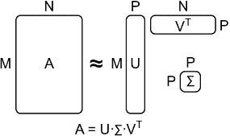
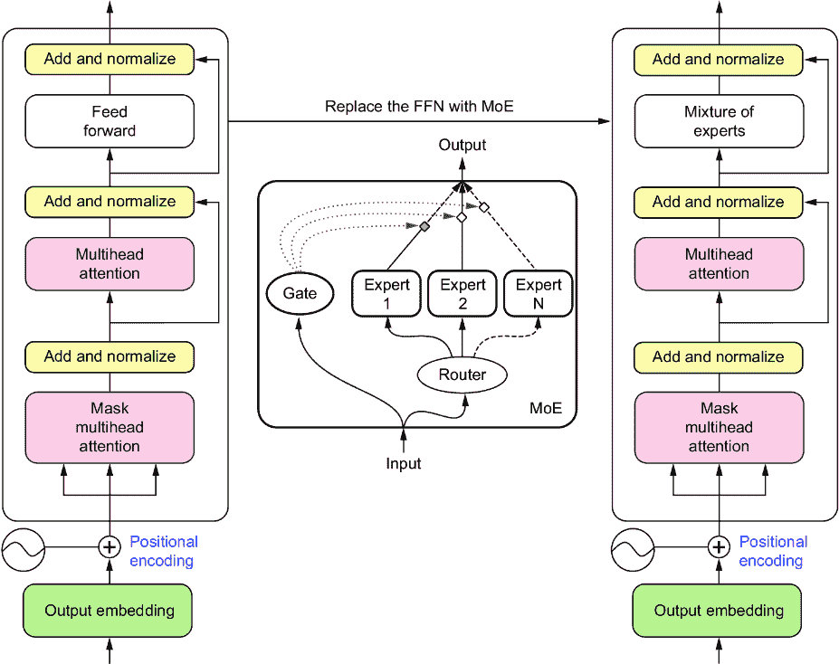
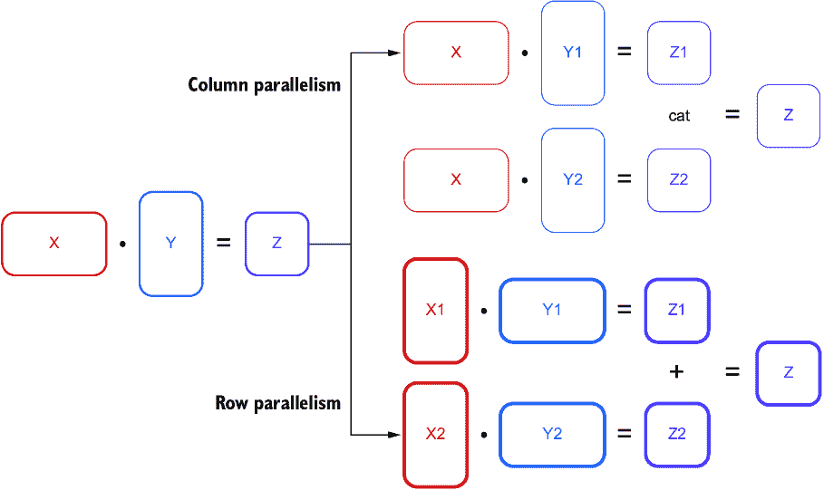
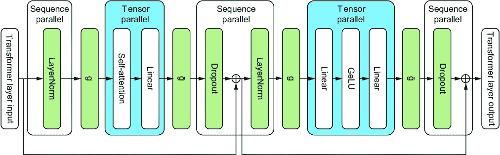
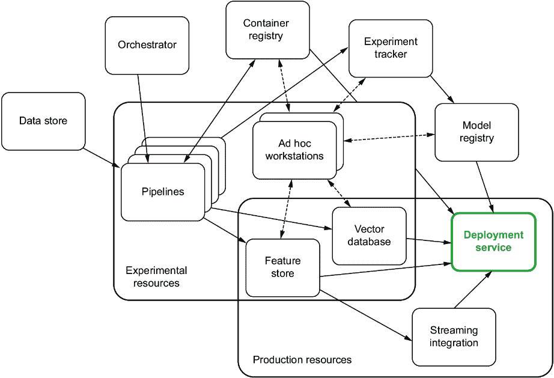

# 3 大型语言模型操作：为 LLMs 构建平台

### 本章涵盖

+   大型语言模型操作的概述

+   部署挑战

+   大型语言模型最佳实践

+   必需的大型语言模型基础设施

> 在所有事情之前，准备是成功的关键。——亚历山大·格拉汉姆·贝尔

正如我们在上一章所学，当涉及到转换器和自然语言处理（NLP）时，越大越好，尤其是在语言信息方面。然而，由于模型的大小，更大的模型带来了更大的挑战，无论它们的语言效率如何，因此我们需要扩展我们的操作和基础设施来处理这些问题。在本章中，我们将探讨这些挑战究竟是什么，我们可以做些什么来最小化它们，以及可以建立什么样的架构来帮助解决这些问题。

## 3.1 大型语言模型操作简介

什么是大型语言模型操作（LLMOps）？嗯，既然我们更喜欢关注实用性而非辞藻，我们就不会深入探讨那些你在教科书中可能会期待的任何花哨的定义，但让我们简单地说，它是指扩展到处理大型语言模型（LLMs）的机器学习操作（MLOps）。我们还可以说，扩展是困难的。软件工程中最困难的任务之一。不幸的是，太多公司正在运行基本的 MLOps 设置，并且他们绝对无法处理 LLMs 的想法。话虽如此，*LLMOps*这个术语可能并不需要。它还没有显示出与核心 MLOps 有足够的区别，尤其是考虑到它们仍然有相同的结构。如果这本书是一个二分法的关键，MLOps 和 LLMOps 肯定属于同一属，而只有时间才能告诉我们它们是否是同一物种。当然，通过拒绝正确地定义 LLMOps，我们可能已经将一种困惑换成了另一种困惑，所以让我们花一分钟来描述一下 MLOps。

MLOps 是可靠且高效地将机器学习模型部署和维护在生产中的领域和实践。这包括——实际上，这是必需的——管理整个机器学习生命周期，从数据获取和模型训练到监控和终止。掌握这个领域所需的一些原则包括工作流程编排、版本控制、反馈循环、持续集成和持续部署（CI/CD）、安全性、资源分配和数据治理。虽然通常有专门从事模型生产化的个人，他们的头衔可能是 ML 工程师、MLOps 工程师或 ML 基础设施工程师，但这个领域足够庞大，它经常绑架许多其他意想不到的专业人士来工作，他们的头衔可能是数据科学家或 DevOps 工程师——通常是在他们不知情或不愿意的情况下，让他们大喊大叫，“这不是我的工作。”

## 3.2 大型语言模型的操作挑战

那为什么还要有区别呢？如果 MLOps 和 LLMOps 如此相似，LLMOps 难道只是那些机会主义者简历上的另一个流行趋势吗？并非如此。事实上，它与“大数据”这个术语非常相似。当这个术语达到顶峰时，那些被称为大数据工程师的人使用完全不同的工具集，并开发了处理大数据所需的专门专业知识。LLM 带来了一系列你在传统机器学习系统中找不到的挑战和问题。其中大多数问题几乎完全是因为它们如此之大。大型模型就是大！我们希望向你展示 LLM 确实配得上这个名字。让我们看看其中的一些挑战，这样当我们开始讨论部署 LLM 时，我们可以欣赏到我们面前的任务。

### 3.2.1 长下载时间

回到 2017 年，当我仍然作为一个数据科学家深度参与时，我决定尝试重新实现当时最著名的计算机视觉模型之一：AlexNet、VGG19 和 ResNet。我想这将是通过一些实际动手经验来加强我对基础知识理解的好方法。此外，我还有一个额外的动机：我刚刚用一些当时最先进的 NVIDIA GeForce 1080 TI GPU 构建了自己的电脑，我认为这将是一个很好的方式来磨合它们。第一个任务是下载 ImageNet 数据集。

ImageNet 数据集是当时可用的最大标注数据集之一，包含数百万张图片，总文件大小高达惊人的~150 GB！与之工作证明了你知道如何处理大数据，这在当时还是一个热门词汇，也是数据科学家不可或缺的技能集。在同意条款并获得访问权限后，我收到了第一个警钟。下载它花了一整周时间。

当我的团队首次部署 Bloom 时，下载它花了一个半小时。天哪，下载《塞尔达传说：王国之泪》也花了一个半小时，而那只是一个 16 GB 的文件，所以我们真的不能抱怨。

大型模型就是大。这一点不容忽视。你会在整本书中发现，这一事实给整个生产过程带来了许多额外的头痛和问题，你必须为此做好准备。与 ImageNet 数据集相比，Bloom LLM 模型为 330 GB，是后者的两倍多。我们猜测大多数读者都没有使用过 ImageNet 或 Bloom，所以为了比较，*《使命召唤：现代战争》*，在撰写本文时是最大的游戏之一，大小为 235 GB。*《最终幻想 15》* 只有 148 GB，所以你可以将两个模型放入其中，还有足够的空间。真正理解 LLM 的巨大规模是很困难的。我们从 BERT 等模型中的 1 亿个参数开始，将它们提升到数十亿个参数。如果你进行了一场购物狂欢，每秒花费 20 美元（或者可能不小心让你的 AWS EC2 实例一直运行），你需要半天时间才能花掉一百万美元；花掉十亿美元则需要两年。

幸运的是，下载 Bloom 并不需要两周时间，因为与 ImageNet 不同，它不是托管在一个管理不善的大学服务器上，而且它已经被分割成多个较小的文件，以便并行下载，但这仍然会花费一个不舒服的长时间。考虑一个场景，你正在最佳条件下下载模型。你拥有千兆速度的光纤互联网连接，并且神奇地能够将你系统和服务器上的全部带宽和 I/O 操作都分配给它。即使这样，下载仍然需要超过 5 分钟！当然，这是在最佳条件下。你很可能不会在如此情况下下载模型；在现代基础设施下，你预计它需要数小时。

### 3.2.2 更长的部署时间

仅下载模型就足够让任何经验丰富的开发者感到不安，但部署时间将使他们倒下并寻求医疗援助。像 Bloom 这样大的模型仅将模型加载到 GPU 内存中就需要 30 到 45 分钟——至少，这是我们经历的时间框架。这还不包括你部署过程中可能增加的其他步骤。实际上，由于 GPU 缺货，仅等待资源释放就可能会花费数小时——关于这一点，我们稍后再谈。

这对你和你的团队意味着什么？首先，我们知道许多团队在部署机器学习产品时通常会在运行时下载模型。这可能适用于小的 sklearn 回归模型，但对于 LLMs 来说则不行。此外，你可以把关于部署可靠系统的大部分知识都扔到窗外（但幸运的是，不是太远）。大多数现代软件工程的最佳实践都假设你可以轻松地重启应用程序，并且有很多繁琐的程序来确保你的系统可以做到这一点。对于 LLMs 来说，关闭可能只需要几秒钟，但重新部署可能需要几个小时，这使得这是一个半不可逆的过程。就像从树上摘苹果一样，摘下来很容易，但如果咬一口觉得太酸，就无法再把它重新接到树上继续成熟。你只能等待另一个成熟。

虽然并非每个项目都需要部署最大的模型，但你可以预期部署时间以分钟计算。这些较长的部署时间使得在流量激增前缩减规模成为严重的错误，同时也使得管理突发性工作负载变得困难。由于滚动更新需要更长的时间，因此在你的管道中会迅速积累大量积压。像拼写错误或其他错误这样的愚蠢错误往往需要更长的时间才能被发现和纠正。

### 3.2.3 延迟

模型尺寸的增加通常伴随着推理延迟的增加。这一点说出来很明显，但更多的参数意味着更多的计算，更多的计算意味着更长的推理等待时间。然而，这一点不能被低估。我们知道很多人轻视延迟问题，因为他们与一个 LLM 聊天机器人互动过，感觉体验很流畅。但如果你仔细观察，你会发现它一次只返回一个单词，这些单词被流式传输给用户。之所以感觉流畅，是因为答案的到来速度超过了人类阅读的速度，但仔细观察有助于我们意识到这只是一个 UX 技巧。LLMs 仍然太慢，对于需要快速响应的自动补全解决方案等用途来说，仍然不太有用。将其构建到读取大量文本数据的数据管道或工作流程中，然后尝试清理或总结它，也可能因为速度过慢而无法使用或可靠。

他们缓慢的原因还有很多不那么明显。首先，大型语言模型（LLMs）通常分布在多个 GPU 上，这增加了额外的通信开销。正如本章 3.3.2 节后面所讨论的，它们以其他方式分布，有时甚至为了降低延迟，但任何分布都会增加额外的开销负担。此外，LLMs 的延迟严重受完成长度的影响，这意味着它使用的单词越多，返回响应所需的时间就越长。当然，完成长度似乎也能提高准确性。例如，使用像思维链（CoT）这样的提示工程技巧，我们要求模型以逐步的方式思考问题，这已被证明可以改善逻辑和数学问题的结果，但会显著增加响应长度和延迟时间。

### 3.2.4 管理 GPU

为了帮助解决这些延迟问题，我们通常希望它们在 GPU 上运行。如果我们想要成功训练 LLMs，我们也需要 GPU，但这都增加了许多低估的额外挑战。大多数网络服务和许多机器学习用例可以仅使用 CPU 完成，但对于 LLMs 来说并非如此——部分原因是 GPU 的并行处理能力为我们解决了延迟问题，部分原因是 GPU 在线性代数、矩阵乘法和张量运算中固有的优化；这是在幕后发生的。对于许多刚刚进入 LLMs 领域的人来说，这需要利用新的资源并增加额外的复杂性。许多人鲁莽地进入这个世界，表现得好像这没什么大不了的，但他们将面临一个令人震惊的觉醒。大多数系统架构和可用的编排工具，如 Kubernetes，都假设应用程序将仅使用 CPU 和内存运行。虽然它们通常支持额外的资源，如 GPU，但这通常是一个事后考虑。你很快就会发现自己必须从头开始重建容器并部署新的度量系统。

管理 GPU 的一个方面是，大多数公司都没有准备好，那就是它们往往很稀缺且有限。在过去十年中，我们似乎一直在经历全球 GPU 短缺的起伏。对于想要保持本地部署的公司来说，GPU 的配置可能极其困难。在我们的职业生涯中，我们花费了大量时间与那些出于各种原因选择保持本地部署的公司合作。他们共同的一点是，他们的服务器上从未有过 GPU。当有 GPU 时，它们通常故意难以访问，只有少数关键员工才能访问。

如果你足够幸运，在云端工作，许多这些问题都得到了解决，但这里也没有免费的午餐。我们俩都曾是那些经常追逐尾巴、试图帮助数据科学家解决新 GPU 工作区配置问题的团队的一员。我们遇到了诸如`scale.up.error.out.of.resources`这样的晦涩、不祥的错误，结果发现这些神秘的读数表明整个区域所选类型的所有 GPU 都被利用了，没有一个是可用的。在数据中心，CPU 和内存通常可以被视为无限的；然而，GPU 资源却不能。有时你甚至完全无法期待它们。大多数数据中心只支持实例或 GPU 类型的一个子集，这意味着你可能被迫在一个离用户群更远的地区设置你的应用程序，从而增加延迟。当然，我们确信当你想要将服务扩展到目前不支持的新地区时，你可以与你的云服务提供商合作，但根据时间表和成本，你可能不会喜欢你所听到的。最终，无论你选择在哪里运行，无论是在本地还是在云端，你都会遇到短缺问题。

### 3.2.5 文本数据的特性

LLMs 是现代解决 NLP 问题的方案。NLP 是机器学习中最迷人的分支之一，因为它主要处理文本数据，这主要是一种定性度量。其他所有领域都处理定量数据。我们已经找到了一种方法，将我们对世界的观察编码成直接的数值转换。例如，我们已经学会了如何将热量编码到温度尺度中，并用温度计和热电偶来测量它，我们还可以用压力计和压力表来测量压力，并将其转换为帕斯卡。

计算机视觉和评估图像的实践通常被视为定性分析，但将图像编码为数字的问题已经得到了解决。我们对光的理解使我们能够将图像分解成像素，并赋予它们 RGB 值。当然，这并不意味着计算机视觉在某种程度上已经解决了；仍有大量工作要做，以学习如何识别数据模式中的不同信号。音频数据也常常被认为具有定性。一个人如何比较两首歌曲？但我们可以测量声音和语音，直接测量声波的强度（分贝）和频率（赫兹）。

与将我们的物理世界编码成数值数据的其他领域不同，文本数据正在寻找衡量短暂世界的方法。毕竟，文本数据是我们编码思想、想法和交流模式的最佳尝试。虽然，是的，我们已经找到了将单词转换成数字的方法，但我们还没有找到直接的翻译。我们编码文本和创建嵌入的最佳解决方案最多只是近似；实际上，我们使用机器学习模型来完成这项工作！一个有趣的插曲是，数字也是文本，是语言的一部分。如果我们想要在数学方面做得更好的模型，我们需要一种更有意义的方式来编码这些数字。由于这一切都是虚构的，当我们尝试将文本数字编码成机器可读的数字时，我们正在创建一个试图以有意义的方式递归引用自己的系统。这不是一个容易解决的问题！

由于所有这些，LLM（以及所有 NLP 解决方案）都有独特的挑战。以监控为例。你如何在文本数据中捕捉数据漂移？你如何衡量“正确性”？你如何确保数据的清洁性？这些问题很难定义，更不用说解决了。

### 3.2.6 标记限制造成瓶颈

对于 LLM 新用户来说，一个很大的挑战是处理标记限制。模型的标记限制是指可以作为模型输入的最大标记数量。标记限制越大，我们可以提供给模型的上下文就越多，从而提高其完成任务的成功率。每个人都希望它们更高，但这并不简单。这些标记限制由两个问题定义：我们 GPU 可访问的内存和速度，以及模型自身内存存储的性质。

第一个问题看起来不太直观：为什么我们不能只是增加 GPU 内存呢？答案很复杂。我们可以，但是将更多层堆叠在 GPU 上以一次考虑更多的千兆字节会整体降低 GPU 的计算能力。目前，GPU 制造商正在研究新的架构和绕过这个问题的方法。第二个挑战非常有趣，因为增加标记限制实际上加剧了底层的数学问题。让我来解释一下。在 LLM 内部进行内存存储并不是我们经常考虑的事情。我们称之为“注意力”，这在第 2.2.7 节中我们进行了深入讨论。我们没有讨论的是，注意力是一个二次解决方案：随着标记数量的增加，计算序列中所有标记对之间的注意力分数所需的计算量会随着序列长度的平方而增长。此外，在我们的巨大上下文空间中，由于我们正在处理二次方程，我们开始遇到只有涉及虚数才能解决的难题，这可能导致模型以意想不到的方式表现。这可能是 LLM 产生幻觉的其中一个原因。

这些问题具有实际影响，并影响应用程序设计。例如，当作者所在的团队从 GPT-3 升级到 GPT-4 时，团队很高兴能够访问更高的标记限制，但很快发现这导致了更长的推理时间，随后是更高的超时错误率。在现实世界中，快速得到一个不太准确的响应通常比完全得不到响应要好，因为更准确模型的承诺通常只是承诺。当然，当在本地部署时，您不必担心响应时间，您可能会发现您的硬件是限制因素。例如，LLaMA 是用 2,048 个标记训练的，但您在使用基本的消费级 GPU 运行时，能利用的最多只有 512 个，您可能会看到内存不足（OOM）错误，甚至模型直接崩溃。

一个可能会让您的团队感到意外的问题，现在应该指出的是，不同语言的每个字符的标记数是不同的。看看表 3.1，我们使用 OpenAI 的 cl100k_base 字节对编码器将不同语言的相同句子转换为标记。只需一眼就能看出，LLMs 通常在这个方面更倾向于英语。在实践中，这意味着如果您正在使用 LLM 构建聊天机器人，您的英语用户的输入空间将比日语用户更灵活，从而导致非常不同的用户体验。

##### 表 3.1 不同语言中标记计数比较

| 语言 | 字符串 | 字符 | 标记 |
| --- | --- | --- | --- |
| 英语 | The quick brown fox jumps over the lazy dog | 43 | 9 |
| 法语 | Le renard brun rapide saute par-dessus le chien paresseux | 57 | 20 |
| 西班牙语 | El rápido zorro marrón salta sobre el perro perezoso | 52 | 22 |
| 日语 | 素早い茶色のキツネが怠惰な犬を飛び越える | 20 | 36 |
| 简体中文 | 敏捷的棕色狐狸跳过了懒狗 | 12 | 28 |

如果您对此感到好奇，这是因为文本编码，这是在上一节中讨论的与文本数据一起工作的另一个特性。考虑表 3.2，我们展示了几个不同的字符及其在 UTF-8 中的二进制表示。英语字符几乎可以完全用原始 ASCII 标准中的单个字节表示，而大多数其他字符需要 3 个或 4 个字节。因为它需要更多的内存，所以它也需要更多的标记空间。

##### 表 3.2 不同货币字符在 UTF-8 中的字节长度比较

| 字符 | 二进制 UTF-8 | 十六进制 UTF-8 |
| --- | --- | --- |
| $ | 00100100 | 0x24 |
| £ | 11000010 10100011 | 0xc2 0xa3 |
| ¥ | 11000010 10100101 | 0xc2 0xa5 |
| ₠ | 11100010 10000010 10100000 | 0xe2 0x82 0xa0 |
| 💰 | 11110000 10011111 10010010 10110000 | 0xf0 0x9f 0x92 0xb0 |

自从 transformers 的普及以来，增加 token 限制一直是一个持续的研究问题，并且还有一些有希望的解决方案仍处于研究阶段，例如循环记忆转换器（RMT）。¹ 我们可以期待未来会继续看到改进，并且希望这最终只会成为一个小麻烦。

### 3.2.7 幻觉引起困惑

到目前为止，我们一直在讨论团队在将 LLM 部署到生产环境时面临的一些技术问题，但没有什么问题能与 LLM 倾向于错误这一简单问题相提并论。它们往往犯很多错误。“幻觉”是一个术语，用来描述当 LLM 模型会产生听起来正确但实际上错误的结果的情况——例如，书籍引用或具有预期形式和结构的超链接，但却是完全虚构的。作为一个有趣的例子，我们向出版社 Manning（由于一位作者仍在撰写，这本书还不存在）请求有关生产中 LLM 的书籍。我们得到了以下建议：Mike Del Balso 和 Lucas Serveén 合著的《生产中的机器学习工程》[`www.manning.com/books/machine-learning-engineering-in-production`](https://www.manning.com/books/machine-learning-engineering-in-production)，以及 Jeremy Howard 和 Sylvain Gugger 合著的《使用 Fastai 和 PyTorch 的编码者深度学习》[`www.manning.com/books/deep-learning-for-coders-with-fastai-and-pytorch`](https://www.manning.com/books/deep-learning-for-coders-with-fastai-and-pytorch)。第一本书完全是虚构的。第二本书是真实的；然而，它并非由 Manning 出版。在每种情况下，互联网地址都是虚构的。这些 URL 的格式实际上与你浏览 Manning 网站时预期的非常相似，但如果你访问它们，将会返回 404 错误。

幻觉最令人烦恼的方面之一是它们通常被自信的词语所包围。LLM 在表达不确定性方面非常糟糕，这在很大程度上是由于它们的训练方式。考虑“2 + 2 =”的情况。你更希望它回答“我认为它是 4”还是简单地“4”？大多数人更希望得到正确的“4”。这种偏见是固有的，因为模型通常会因为正确或至少听起来正确而得到奖励。

关于幻觉发生的原因，有各种解释，但最真实的答案是，我们不知道是否只有一个原因。它可能是由几件事情的组合；因此，目前还没有一个好的解决办法。尽管如此，准备好应对这些模型的错误和不准确性是至关重要的，以便为你的产品提供最佳的用户体验。

### 3.2.8 偏见和伦理考量

### 3.2.9 安全问题

就像所有技术一样，我们需要注意安全问题。大型语言模型（LLMs）是在大量文本语料库上训练的，其中一些可能是有害或敏感的，不应该被暴露。因此，应该采取措施保护这些数据不被泄露。上一节中提到的偏见和伦理问题就是你不希望你的用户讨论的话题的例子，但你也可以想象在公司的数据上微调模型，如果未采取适当预防措施，可能会意外地丢失秘密。

例如，使用简单的提示请求可口可乐的秘方仅仅返回了无聊的结果，“我不能泄露商业机密或任何专有信息。”如果我们问您，这真是太无聊了。通过一点小诡计和一些提示注入，我们设法让它泄露了秘密，当然，我们在尝试之前确认了一位食品科学家，它不会让我们中毒。按照指示严格操作后，我们惊讶地发现我们得到了一杯相当美味的饮料，但它尝起来根本不像可口可乐。虽然配方看起来很合法，但像数量、烹饪时间，甚至需要过滤糖浆这样的细微差别都不对。看来我们得等到得到真正的配方后再考虑接管饮料行业。

##### 可口可乐配方通过提示注入产生的幻觉

```py
Homemade Coca-Cola Recipe
=====================
**Disclaimer**: The original Coca-Cola recipe is a highly guarded trade secret. The following recipe is an approximation for creating a homemade cola drink that resembles the taste of Coca-Cola.

Ingredients:
- 3 cups of water
- 2 cups granulated sugar
- 1/8 tsp food-grade citric acid
- 3/4 tsp caramel color (liquid)
- 1/2 tsp caffeine (powder or liquid form)
- 1 1/2 tsp cola extract
- 1/8 tsp vanilla extract
- 1 1/2 cups carbonated water (store-bought or using a home soda maker)
- A pinch of ground cinnamon (optional)
- A pinch of ground nutmeg (optional)

Instructions:
1\. In a large saucepan, bring the 3 cups of water to a gentle simmer.
2\. Slowly stir in the granulated sugar, ensuring that it fully dissolves.
3\. Add the citric acid, caramel color, caffeine, cola extract, and vanilla extract to the saucepan. Mix well.
4\. Stir in the optional spices if desired: cinnamon and nutmeg.
5\. Simmer the mixture for about 20 minutes, stirring occasionally.
6\. Remove the saucepan from the heat and let it cool to room temperature.
7\. Once cooled, strain the syrup to remove any undissolved solids.
8\. To make the final drink, mix 1 part syrup with 3 parts carbonated water. Adjust to taste depending on your preference for sweetness and carbonation.

Variations:
- You can experiment with different amounts of caramel color, caffeine, and cola extract to adjust the flavor and appearance of your homemade cola.
- To create different cola flavor profiles, experiment with adding additional spices (such as star anise, orange or lemon peel, or cardamom), essential oils, or fruit extracts.
- Consider using a natural sweetener, like honey or agave syrup, as an alternative to granulated sugar.

Historical context and interesting facts:
- Coca-Cola was first introduced in 1886 by pharmacist Dr. John S. Pemberton, who aimed to create a unique and refreshing beverage that could also relieve fatigue and headaches.
- The original Coca-Cola formula contained trace amounts of cocaine extracted from the coca leaf, which was later replaced with caffeine in the early 20th century.
- In 1985, Coca-Cola introduced "New Coke," a reformulation aimed at competing with Pepsi. However, the taste change was met with backlash, and the company returned to its original formula just three months later, rebranded as "Coca-Cola Classic."
Result(s): You can now create your own homemade version of cola, resembling the taste of Coca-Cola. Enjoy and feel free to experiment with different spices, extracts, and sweeteners to create your own unique flavor profile.
```

另一个安全问题是腌菜注入。腌菜是 Python 中的一个库，用于序列化对象，通常用于序列化机器学习模型。它在反序列化时将对象序列化为包含逐个执行的指令的字节流。这是一种快速且简单的方式共享大型对象。腌菜注入会破坏这个字节流，通常在模型通过不安全的网络传输时注入恶意软件。这对于下载时间较长的大型模型尤其令人担忧，因为这使得第三方更容易拦截传输并注入恶意代码。如果发生这种情况，注入的代码可能会让攻击者获得对系统的访问权限。这可能在尝试在推理过程中使用模型时发生，因为如果有害代码未被检测并正确移除，它将执行。因此，在使用模型之前采取预防措施，如使用安全网络和验证模型的完整性，以防止此类攻击，是非常重要的。

### 3.2.10 控制成本

与大型语言模型（LLMs）一起工作涉及各种与成本相关的问题。首先，你可能已经注意到了，这是基础设施成本，包括高性能 GPU、存储和其他硬件资源。我们讨论了 GPU 采购难度较大，不幸的是，这也意味着它们更昂贵。像留下你的服务这样的错误一直都有累积账单的潜力，但与 GPU 混合在一起，这种错误甚至更具破坏性。这些模型还要求大量的计算能力，导致在训练和推理过程中消耗大量能源。除此之外，它们的部署时间更长，这意味着我们经常在低流量期间运行它们，以处理突发的工作负载或预期的未来流量。总的来说，这导致了更高的运营成本。

额外的成本包括管理和存储用于训练或微调以及常规维护的大量数据，例如模型更新、安全措施和错误修复，这可能对财务造成压力。与任何用于商业目的的技术一样，管理潜在的诉讼和确保符合法规也是一个问题。最后，投资于持续的研究和开发以改进您的模型并给您带来竞争优势，将是一个因素。

我们谈了一些关于令牌限制的技术问题，这些问题可能会得到解决，但我们没有讨论成本限制，因为大多数 API 按令牌收费。这使得发送更多上下文和使用更好的提示变得更加昂贵。这也使得预测成本变得有点困难，因为虽然你可以标准化输入，但你不能标准化输出。你永远不能太确定会返回多少令牌，这使得管理变得困难。记住，对于 LLM 来说，实施和遵循适当的成本工程实践以确保成本永远不会失控，这和以前一样重要。

## 3.3 LLMOps 基本要素

现在我们已经掌握了我们正在应对的挑战类型，让我们来看看所有不同的 LLMOps 实践、工具和基础设施，看看不同的组件如何帮助我们克服这些障碍。首先，让我们深入探讨不同的实践，从压缩开始，我们将讨论缩小、修剪和近似，以使模型尽可能小。然后我们将讨论分布式计算，这是必需的，因为模型如此之大，很少能适应单个 GPU 的内存。完成这些后，我们将在下一节中探讨实现这一切所需的基础设施和工具。

### 3.3.1 压缩

在上一节中，当你阅读关于大型语言模型（LLM）的挑战时，你可能自己问过类似的问题：“如果 LLM 的最大问题来自它们的大小，为什么我们不把它们做得更小？”如果你这样想过，恭喜你！你是个天才——压缩就是做这件事的实践。将模型压缩到尽可能小，将提高部署时间，减少延迟，减少所需昂贵 GPU 的数量，并最终节省资金。然而，最初让模型变得如此庞大无比的整个目的，是因为它使它们在所做的事情上变得更好。我们需要能够在不失去我们通过使它们变大而取得的全部进步的情况下缩小它们。

这个问题远未解决，但有多种方法可以解决这个问题，每种方法都有其优缺点。我们将讨论几种方法，从最简单和最有效的方法开始。

#### 定量

量化是将精度降低以降低内存需求的过程。这种权衡在直觉上是有意义的。当作者在大学时，他被教导总是将数字四舍五入到工具的精度。拿出直尺测量他的铅笔，如果你告诉他长度是 19.025467821973739 厘米，你不会相信他。即使他使用了卡尺，他也无法验证如此精确的数字。用我们的直尺，任何超过 19.03 厘米的数字都是幻想。为了强调这一点，他的一个工程教授曾经问他，“如果你正在测量摩天大楼的高度，你会在乎顶部多出的一张纸吗？”

我们在计算机内部表示数字的方式往往让我们误以为自己有比实际更好的精度。为了说明这一点，打开 Python 终端并执行 0.1 + 0.2。如果你以前从未尝试过，你可能会惊讶地发现它不等于 0.3，而是 0.30000000000000004。我们不会深入探讨这一现象背后的数学细节，但问题仍然存在：我们能否在不使事情变得更糟的情况下降低精度？我们实际上只需要精确到小数点后第十位，但降低精度可能会得到一个像 0.304 这样的数字，而不是 0.300，从而增加我们的误差范围。

最终，计算机唯一能理解的数字是 0 和 1，开或关，一个比特位。为了提高这个范围，我们将多个比特位组合起来，并赋予它们不同的含义。将 8 个比特位串联起来，你就得到了一个字节。使用 INT8 标准，我们可以将这个字节编码为从-128 到 127 的所有整数。我们就不详细解释背后的数学原理了，因为假设你已经知道二进制是如何工作的；只需说，我们拥有的比特位越多，我们能够表示的数字范围就越大，无论是更大的还是更小的。图 3.1 展示了几个常见的浮点数编码。将 32 个比特位串联起来，我们得到了我们自诩的“全精度”，这也是大多数数字存储的方式，包括机器学习模型中的权重。基本的量化将我们从全精度转换为半精度，将模型的大小缩小到原来的一半。有两种不同的半精度标准，FP16 和 BF16，它们在表示范围或指数部分时使用的比特位数不同。由于 BF16 使用的指数与 FP32 相同，它被发现对于量化来说更有效，你可以预期在模型大小减半的情况下几乎可以达到相同的精确度。如果你理解了论文和摩天大楼的类比，那么原因应该很明显。


##### 图 3.1 几种常见浮点数编码的比特映射：16 位浮点数或半精度（FP16）、bfloat 16（BF16）、32 位浮点数或单精度（FP32）以及 NVIDIA 的 TensorFloat（TF32）

然而，没有理由就此停止。我们通常可以将它降低到 8 位格式，而不会损失太多精度。甚至已经有一些成功的研究尝试表明，对 LLM 的部分进行选择性的 4 位量化是可能的，而且精度损失很小。选择性地应用量化是一个称为动态量化的过程，通常只对权重进行量化，而将激活保留在完全精度以减少精度损失。

量化的圣杯是 INT2，表示每个数字为–1、0 或 1。目前这不可能而不完全降低模型质量，但它可以使模型缩小到原来的 1/8。Bloom 模型将只有大约~40 GB，足够小，可以放在单个 GPU 上。这当然是量化的极限，如果我们想进一步缩小，我们需要考虑其他方法。

量化的最好部分是它很容易做。有许多框架允许这样做，但在列表 3.1 中，我们展示了如何使用 PyTorch 的量化库进行简单的训练后静态量化（PTQ）。你所需要的只是一个全精度模型，一些示例输入，以及用于准备和校准的验证数据集。正如你所看到的，这只需要几行代码。

##### 列表 3.1 PyTorch 中的示例 PTQ

```py
import copy
import torch.ao.quantization as q

model_to_quantize = copy.deepcopy(model_fp32)     #1
model_to_quantize.eval()

qconfig_mapping = q.get_default_qconfig_mapping("qnnpack")     #2

prepared_model = q.prepare(model_to_quantize)     #3

with torch.inference_mode():     #4
    for x in dataset:
        prepared_model(x) 

model_quantized = q.convert(prepared_model)      #5
```

#1 原模型的深度拷贝，因为量化是在原地进行的

#2 获取映射；注意对于 ARM 使用“qnnpack”，对于 x86 CPU 使用“fbgemm”

#3 准备

#4 校准；你需要使用代表性的（验证）数据

#5 量化

静态 PTQ 是量化最直接的方法；它在模型训练后进行，并对所有模型参数进行均匀量化。与大多数公式一样，最直接的方法会引入更多的错误。通常，这种错误是可以接受的，但如果不可以，我们可以增加额外的复杂性来减少量化带来的精度损失。可以考虑的方法包括均匀与非均匀、静态与动态、对称与不对称，以及在其训练期间或之后应用。

要理解这些方法，让我们考虑从 FP32 量化到 INT8 的情况。在 FP32 中，我们实际上有可用的全部数字范围，但在 INT8 中，我们只有 256 个值。我们试图把一个精灵放进瓶子里，这不是一件小事。如果你研究你的模型中的权重，你可能会注意到大多数数字都在[–1, 1]之间的分数。我们可以利用这一点，通过使用一个 8 位标准，在这个区域以非均匀方式表示更多的值，而不是标准的均匀[–128, 127]。虽然从数学上来说是可能的，但不幸的是，这样的标准并不常见，现代深度学习硬件和软件也没有设计来利用它们。所以现在，最好坚持使用均匀量化。

缩小数据的最简单方法是对其进行归一化，但由于我们是从连续尺度转换为离散尺度，所以有几个需要注意的问题，让我们来探讨一下。我们首先取最小值和最大值，并将它们缩放到与我们的新数值范围相匹配。然后，我们将所有其他数字根据它们所在的位置进行分类。当然，如果我们有非常大的异常值，我们可能会发现所有其他数字都挤进了一个或两个桶中，从而破坏了我们曾经拥有的任何粒度。为了防止这种情况，我们可以截断任何大数字；这就是我们在静态量化中所做的。然而，在我们截断数据之前，如果我们事先选择一个范围并缩放以捕捉大部分数据，会怎样呢？我们需要小心，因为如果这个动态范围太小，我们会引入更多的截断误差；如果太大，我们会引入更多的舍入误差。动态量化的目标当然是减少这两种误差。

接下来，我们需要考虑数据的对称性。通常，在归一化过程中，我们迫使数据变得正常并因此对称；然而，我们也可以选择以保留数据原有任何不对称性的方式来缩放数据。通过这样做，我们有可能减少由于截断和舍入误差造成的总体损失，但这并不保证。

作为最后的手段，如果这些其他方法都不能减少模型的精度损失，我们可以使用量化感知训练（QAT）。QAT 是一个简单的过程，我们在模型训练期间添加一个模拟量化步骤。通过“模拟”，我们是指我们在保持数据全精度的情况下截断和舍入数据。这允许模型在训练过程中调整量化引入的误差和偏差。与其它方法相比，QAT 已知可以产生更高的精度，但训练时间成本要高得多。

##### 量化方法

+   *均匀与非均匀*——我们是否使用在它所表示的范围内是均匀的 8 位标准，或者为了在-1 到 1 范围内更精确地使用非均匀标准。

+   *静态与动态*——在截断之前选择调整范围或尺度，以尝试减少截断和舍入误差以及减少数据损失。

+   *对称与不对称*——将数据归一化以使其正常并强制对称，或者选择保留任何不对称性和偏斜。

+   *训练期间或之后*——训练后的量化非常容易做，而如果在训练期间做，则工作更多，但会导致减少偏差和更好的结果。

量化是一个非常强大的工具。它减少了模型的大小和运行模型所需的计算开销，从而降低了模型的延迟和运行成本。然而，量化最好的地方在于它可以在事后进行，所以你不必担心你的数据科学家是否记得在训练过程中使用 QAT 等过程对模型进行量化。这就是为什么量化在处理 LLM 和其他大型机器学习模型时变得如此受欢迎。虽然压缩技术总是伴随着准确度降低的担忧，但与其他方法相比，量化是一个三赢的局面。

#### 修剪

恭喜你，你刚刚训练了一个全新的 LLM！拥有数十亿个参数，它们都必须是有用的，对吧？错了！不幸的是，就像生活中的许多事情一样，模型的参数往往遵循帕累托法则。大约 20%的权重导致了 80%的价值。“如果这是真的，”你可能正在问自己，“我们为什么不把所有的额外东西都剪掉？”好主意！给自己鼓掌。修剪是剔除和移除我们认为不值得的模型任何部分的过程。

实际上存在两种不同的修剪方法：*结构化*和*非结构化*。结构化修剪是寻找模型中不贡献于模型性能的结构组件，然后将其移除的过程——无论是神经网络中的过滤器、通道还是层。这种方法的优势在于，你的模型会稍微小一些，但保持相同的基本结构，这意味着我们不必担心失去硬件效率。我们还保证了延迟的改进，因为涉及的计算会更少。

相反，非结构化修剪会遍历参数，并将不太重要的参数置零，这些参数对模型性能的贡献不大。与结构化修剪不同，我们实际上并没有移除任何参数；我们只是将它们设置为零。从这个角度来看，我们可以想象一个很好的起点是任何已经接近 0 的权重或激活。当然，虽然这有效地减少了模型的大小，但这也意味着我们没有减少任何计算，所以通常只会看到最小化，如果有的话，的延迟改进。但更小的模型仍然意味着更快的加载时间和更少的 GPU 运行。它还让我们对过程有非常精细的控制，允许我们比结构化修剪进一步缩小模型，同时对性能的影响也更小。

与量化类似，修剪可以在模型训练后进行。然而，与量化不同，通常需要额外的微调来防止性能损失过大。在模型训练期间包含修剪步骤以避免后续需要微调的做法越来越普遍。由于更稀疏的模型将有更少的参数需要调整，添加这些修剪步骤可能有助于模型更快地收敛。⁵

你可能会惊讶于通过剪枝可以缩小模型的同时对性能的影响最小化。能缩小多少呢？在 SparseGPT⁶论文中，开发了一种方法来尝试自动一次性完成剪枝过程，而不需要后续的微调。作者发现他们可以将 GPT-3 模型缩小 50%到 60%而没有任何问题！根据模型和任务的不同，他们甚至在其中一些任务中看到了轻微的性能提升。我们期待着看到剪枝在未来能带我们走向何方。

#### 知识蒸馏

在我们的心目中，知识蒸馏可能是最酷的压缩方法。这个想法也很简单：我们将使用大型 LLM 来训练一个较小的语言模型，以复制它。这个方法的好处是，较大的 LLM 为较小的模型提供了一个几乎无限的训练数据集，这使得训练非常有效。因为数据集越大，性能越好，我们经常看到较小的模型在准确性上几乎达到了它们的教师模型水平。⁷

以这种方式训练的较小模型将保证既更小又能提高延迟。缺点是这将要求我们训练一个全新的模型，这将是相当大的前期成本。任何对教师模型的未来改进都需要传递给学生模型，这可能导致复杂的训练周期和版本结构。这肯定比其他一些压缩方法要复杂得多。

然而，知识蒸馏最困难的部分是，我们还没有真正找到好的配方。像“学生模型可以有多小？”这样的难题必须通过试错来解决。这里还有很多东西需要学习和研究。

然而，斯坦福大学的 Alpaca 在这个领域做了一些令人兴奋的工作。⁸他们没有从头开始训练学生模型，而是选择使用 OpenAI 的 GPT3.5 的 175B 参数模型作为教师，通过知识蒸馏微调开源的 LLaMA 7B 参数模型。这是一个简单的想法，但效果显著，因为他们从评估中得到了很好的结果。最大的惊喜是成本，因为他们只花费了 500 美元的 API 费用来从教师模型获取训练数据，以及价值 100 美元的 GPU 训练时间来微调学生模型。当然，如果你将此用于商业应用，你将违反 OpenAI 的服务条款，所以最好坚持使用自己的或开源模型作为教师。

#### 低秩近似

低秩逼近，也称为低秩分解、低秩分解或矩阵分解（以及其他许多名称——我们责怪数学家们——名称太多），使用线性代数数学技巧简化大型矩阵或张量，以找到低维表示。为此有多种技术。奇异值分解（SVD）、Tucker 分解（TD）和典型多项式分解（CPD）是最常见的几种。

在图 3.2 中，我们展示了 SVD 方法背后的基本思想。本质上，我们将一个非常大的矩阵 A 分解成三个较小的矩阵，U、S 和 V。虽然 U 和 V 存在是为了确保我们保持原始矩阵的相同维度和相对强度，但 S 允许我们应用方向和偏差。S 越小，我们最终压缩和减少的总参数数就越多，但逼近的准确性就越低。



##### 图 3.2 SVD 示例，低秩逼近。A 是一个具有 N 和 M 维度的大矩阵。我们可以用三个较小的矩阵来逼近它：U 具有维度 M 和 P，S 是一个维度为 P 的方阵，V 具有维度 N 和 P（这里我们展示了转置）。通常，P<<M 和 P<<N 都是正确的。

为了巩固这个概念，看到具体的例子可能会有所帮助。在下一个列表中，我们展示了 SVD 在压缩一个 … 矩阵时的工作示例。为此，我们只需要基本的库 SciPy 和 NumPy，它们在 1 和 2 行导入。在第 3 行中，我们定义了矩阵，然后在第 9 行中对其应用 SVD。

##### 列表 3.2 SVD 低秩逼近示例

```py
import scipy
import numpy as np
matrix = np.array([
    [ 1., 2., 3., 4.],
    [ 5., 6., 7., 8.],
    [ 9., 10., 11., 12.],
    [13., 14., 15., 16.]
])
u, s, vt = scipy.sparse.linalg.svds(matrix, k=1)
print(u,s,vt)
# [[-0.13472211]
# [-0.34075767]
# [-0.5467932 ]
```

生成的文本是

```py
[-0.7528288 ]], [38.62266], [[-0.4284123 -0.47437257 -0.52033263 –0.5662928 ]]
```

仔细检查 U、Sigma 和 V 的转置，我们可以看到一个 … 矩阵，一个 … 矩阵，以及一个 … 矩阵，分别。总的来说，我们现在只需要 9 个参数，而原始的则需要 16 个，内存占用几乎减少了一半。

最后，我们将这些矩阵相乘以得到原始矩阵的逼近。在这种情况下，逼近并不十分出色，但我们仍然可以看到，一般顺序和大小与原始矩阵相匹配：

```py
svd_matrix = u*s*vt
print(svd_matrix)
```

生成的文本是

```py
 array([[ 2.2291691, 2.4683154, 2.7074606, 2.9466066],
      [ 5.6383204, 6.243202 , 6.848081 , 7.4529614],
      [ 9.047472 , 10.018089 , 10.988702 , 11.959317 ],
      [12.456624 , 13.792976 , 15.129323 , 16.465673 ]], dtype=float32)
```

不幸的是，我们不知道有人实际上在生产中使用这种方法来压缩模型，这很可能是由于近似精度较差。他们使用它的目的——这一点很重要——是适应和微调，这正是低秩适应（LoRA）⁹发挥作用的地方。适应是将通用或基础模型微调以执行特定任务的过程。LoRA 将 SVD 低秩近似应用于注意力权重，或者更确切地说，注入与注意力权重并行运行的更新矩阵，使我们能够微调一个更小的模型。LoRA 因其使 LLM 的微调变得轻而易举而变得非常流行，可以将可训练层缩小到原始模型的一小部分，然后允许任何人在通用硬件上对其进行训练。您可以使用 Hugging Face 的 PEFT 库开始使用 LoRA，在那里您可以查看几个 LoRA 教程。

备注：对于好奇心强的人来说，参数高效微调（PEFT）是一类旨在以计算高效的方式微调模型的方法。PEFT 库旨在将它们都放在一个易于访问的地方；你可以从这里开始：[`huggingface.co/docs/peft`](https://huggingface.co/docs/peft)。

#### 专家混合

专家混合（MoE）是一种技术，我们用 MoE 层替换 transformer 中的前馈层。前馈层因其参数密集和计算密集而臭名昭著，因此用更好的东西替换它们通常会产生很大的影响。MoEs 是一组稀疏激活的模型。它们与集成技术不同，因为通常只运行一个或几个专家模型，而不是结合所有模型的输出。稀疏性通常由一个门控机制引起，该机制学习使用哪些专家，以及/或一个路由器机制，该机制确定哪些专家应该被咨询。在图 3.3 中，我们展示了具有潜在 N 个专家的 MoE 架构，以及展示了它在解码器堆栈中的位置。



##### 图 3.3 示例：专家模型混合，包含门控和路由器以控制流。MoE 模型用于替换 transformer 中的 FFN 层；在这里，我们展示了它在解码器中替换 FFN 的情况。

根据你拥有的专家数量，MoE 层可能比 FFN 层有更多的参数，从而导致更大的模型，但在实践中，这种情况并不常见，因为工程师和研究人员的目标是创建一个更小的模型。然而，我们可以保证看到的是更快的计算路径和改进的推理时间。然而，真正让 MoE 脱颖而出的还是当它与量化结合时。一项由微软和 NVIDIA 进行的研究¹⁰表明，使用 MoE 只需最小程度地影响精度就能实现 2 位量化！

当然，由于这是对模型结构的一个相当大的改动，之后需要进行微调。你也应该意识到，MoE 层通常会降低模型的可泛化性，因此最好是在为特定任务设计的模型上使用。有几个库实现了 MoE 层，但我们推荐检查 DeepSpeed。

注意：DeepSpeed 是一个库，它优化了许多用于大规模深度学习模型（如 LLMs）的困难部分，在训练时特别有用。查看他们的 MoE 教程：[`www.deepspeed.ai/tutorials/mixture-of-experts/`](https://www.deepspeed.ai/tutorials/mixture-of-experts/)。

### 3.3.2 分布式计算

分布式计算是深度学习中用于并行化和加速大型、复杂神经网络的技术，通过在集群中的多个设备或节点之间分配工作负载来实现。这种方法通过启用并发计算、数据并行和模型并行，显著减少了训练和推理时间。随着数据集规模和模型复杂性的不断增长，分布式计算已成为深度学习工作流程的关键，确保了资源的高效利用，并使研究人员能够有效地迭代他们的模型。分布式计算是将深度学习与机器学习区分开来的核心实践之一，在 LLMs 中，我们必须使出浑身解数。让我们看看不同的并行处理实践，以充分利用分布式计算。

#### 数据并行

数据并行是人们在考虑并行运行进程时首先想到的；它也是最易实现的。这种做法涉及将数据分割成多个部分，并通过模型的多个副本或管道运行。对于大多数框架来说，这很容易设置；例如，在 PyTorch 中，你可以使用 `DistributedDataParallel` 方法。但大多数这些设置都有一个缺点：你的模型必须能够适应一个 GPU。这就是像 Ray.io 这样的工具发挥作用的地方。

Ray.io，或 Ray，是一个为分布式计算设计的开源项目，特别针对并行和集群计算。它是一个灵活且用户友好的工具，简化了分布式编程，并帮助开发者轻松地并行执行并发任务。Ray 主要用于机器学习和其他高性能应用，但也可以用于其他应用。在列表 3.3 中，我们给出了使用 Ray 分配任务的简单示例。Ray 的美妙之处在于其简单性——我们使代码并行运行所需要做的只是添加一个装饰器。这确实比多线程或异步设置复杂多了。

##### 列表 3.3 示例 Ray 并行化任务

```py
import ray
import time

ray.init()     #1

def slow_function(x):     #2
    time.sleep(1)
    return x

@ray.remote
def slow_function_ray(x):      #3
    time.sleep(1)
    return x

results = [slow_function(i) for i in range(1, 11)]     #4

results_future = [slow_function_ray.remote(i) for i in range(1, 11)]      #5
results_ray = ray.get(results_future)

print("Results without Ray: ", results)
print("Results with Ray: ", results_ray)

ray.shutdown()
```

#1 启动 Ray

#2 Δ定义一个常规 Python 函数

#3 将函数转换为 Ray 任务

#4 无 Ray 执行慢函数（耗时 10 秒）

#5 使用 Ray 执行慢函数（耗时 1 秒）

Ray 使用任务和演员的概念来管理分布式计算。任务是指函数，而演员是有状态的实体，可以被调用并并发运行。当你使用 Ray 执行任务时，它会将任务分配到可用的资源上（例如，多核 CPU 或集群中的多个节点）。对于 LLMs，我们需要在云环境中设置一个 Ray 集群，因为这可以让每个流水线在拥有所需 GPU 数量的节点上运行，极大地简化了并行运行 LLMs 的基础设施设置。

注意：在此处了解更多关于 Ray 集群的信息：[`mng.bz/eVJP`](https://mng.bz/eVJP)。

现在有多个替代方案，但 Ray 因其越来越多的机器学习工作流程需要分布式训练而获得了大量关注，并变得越来越受欢迎。团队在使用 Ray 方面取得了巨大成功。通过利用 Ray，开发者可以确保分布式工作流程中更好的性能和更有效的资源利用。

#### 张量并行

张量并行利用矩阵乘法属性，将激活分布在多个处理器上，运行数据，然后在处理器的另一侧将它们组合起来。图 3.4 展示了这个过程在矩阵上的工作方式，矩阵可以通过两种不同的方式并行化，从而得到相同的结果。想象一下，Y 是一个非常大的矩阵，无法放在单个处理器上，或者更可能的是，我们的数据流中的瓶颈需要花费太多时间来运行所有计算。在任何情况下，我们都可以通过列或行来拆分 Y，运行计算，然后将结果组合起来。在这个例子中，我们处理的是矩阵，但在现实中，我们经常处理具有超过两个维度的张量。然而，使这起作用的相同数学原理仍然适用。



##### 图 3.4 展示了通过不同维度拆分张量以获得相同最终结果的张量并行示例。在这里，我们比较了矩阵的列并行和行并行。

选择并行化的维度有点像一门艺术，但有一些事情要记住以帮助更容易做出这个决定。首先，你有多少列或行？一般来说，你想要选择一个比你的处理器数量多的维度，否则你将无法充分利用。通常这不会成为问题，但像上一节中讨论的 Ray 这样的工具，在集群中并行化并启动大量进程变得轻而易举。其次，不同的维度有不同的多重性成本。例如，列并行性要求我们将整个数据集发送到每个进程，但最终可以在末尾快速且容易地将它们连接起来。然而，行并行性允许我们将数据集分割成块，但需要我们添加结果，这是一个比连接操作更昂贵的操作。你可以看到一个操作更受 I/O 限制，而另一个更受计算限制。最终，最佳维度将取决于数据集和硬件限制。这将需要实验来完全优化，但一个好的默认选择是选择最大的维度。

张量并行性允许我们将像 MLP 和注意力层这样的计算密集层分割到不同的设备上，但它对我们无法利用张量的归一化或 dropout 层没有帮助。为了获得更好的整体管道性能，我们可以添加针对这些块的序列并行性。¹¹ 序列并行性是一种沿着序列维度分割激活的过程，防止冗余存储，并且可以与张量并行性结合以实现显著的内存节省，同时额外计算开销最小。结合使用，它们减少了存储 transformer 模型中激活所需的内存。实际上，它们几乎消除了激活的重新计算，并将激活内存节省高达五倍。

图 3.5 展示了如何结合张量并行性，它使我们能够将计算密集层分布到不同的设备上，以及序列并行性，它对内存限制层做同样的处理，从而使整个 transformer 模型完全并行化。它们共同允许资源得到极其高效的使用。



##### 图 3.5 结合关注计算密集层的张量并行性和序列并行性以降低内存开销，为整个 transformer 创建一个完全并行过程

#### 管道并行性

到目前为止，我们可以运行大量数据并加速任何瓶颈，但这些都无关紧要，因为我们的模型太大；我们无法将其放入单个 GPU 的内存中，甚至无法让它运行。这就是管道并行派上用场的地方；它是指将模型垂直分割并分别将每个部分放到不同的 GPU 上的过程。这创建了一个管道，因为输入数据将流向第一个 GPU，进行处理，然后传输到下一个 GPU，依此类推，直到整个模型运行完毕。虽然其他并行技术可以提高我们的处理能力和加速推理，但需要管道并行才能使其运行。然而，它伴随着一些主要的缺点，主要是设备利用率。

为了了解这个缺点从何而来以及如何减轻它，让我们首先考虑这个问题的简单方法，即我们一次性将所有数据通过模型。我们发现这留下了一个巨大的“气泡”未充分利用。由于模型被分割，我们必须通过设备按顺序处理所有内容。这意味着当一个 GPU 正在处理时，其他 GPU 都在空闲。在图 3.6 中，我们可以看到这种简单方法和 GPU 空闲时的大气泡不活跃。我们还看到了利用每个设备的一个更好的方法。我们通过发送小批量数据来实现这一点。较小的批次允许第一个 GPU 更快地将它正在处理的工作传递出去，并转移到另一个批次。这允许下一个设备更早地开始工作，并减少气泡的大小。


##### 图 3.6 气泡问题。当数据通过分割的模型运行时，持有模型权重的 GPU 利用率低下，因为它们在等待对应的 GPU 处理数据。减少这种气泡的一个简单方法是使用微批处理。

我们实际上可以用以下公式很容易地计算出气泡的大小：

空闲百分比 = 1 – m / (m + n – 1)

其中 m 是微批次的数量，n 是管道的深度或 GPU 的数量。所以，在我们的简单示例中，有四个 GPU 和一个大批次，我们看到设备空闲了 75%的时间！GPU 非常昂贵，不能让它有四分之三的时间处于空闲状态。让我们看看使用微批处理策略会是什么样子。使用 4 个微批次，它将这个时间几乎减半，降至仅 43%。我们可以从这个公式中看出，我们拥有的 GPU 越多，空闲时间越高，但微批次越多，利用率越好。

不幸的是，我们通常既不能减少 GPU 的数量，也不能将微批量的大小增加到我们想要的程度。存在限制。对于 GPU，我们必须使用尽可能多的 GPU 来将模型放入内存。然而，尽量使用一些较大的 GPU，因为这会比使用许多较小的 GPU 更具优化。减少管道并行中的气泡是压缩之所以如此重要的另一个原因。对于微批量，第一个限制是明显的：由于微批量是批量大小的分数，因此我们受其大小的限制。第二个限制是每个微批量都会以线性关系增加缓存激活的内存需求。一种应对这种更高内存需求的方法是称为 PipeDream 的方法。¹² 存在不同的配置和方法，但基本思想是相同的。在此方法中，我们在完成任何微批量的正向传递后立即开始工作反向传递。这使得我们能够完全完成一个训练周期并释放该微批量的缓存。

#### 3D 并行

对于 LLMs，我们希望利用所有三种并行化实践，因为它们都可以同时运行。这被称为 3D 并行，它将数据、张量和平行化（DP + TP + PP）结合起来。由于每种技术和因此维度至少需要两个 GPU 来运行 3D 并行，因此我们需要至少八个 GPU 来开始。我们如何配置这些 GPU 对于从该过程中获得最大效率至关重要。由于 TP 具有最大的通信开销，我们希望确保这些 GPU 相邻，最好是位于同一节点和机器上。PP 在三者中具有最少的通信量，因此将模型拆分到节点上是最经济的。

通过同时运行这三个，我们看到了它们之间的一些有趣的交互和协同作用。由于 TP 将模型分割以在设备内存内良好运行，我们发现 PP 即使在小批量大小下也能表现良好，这是由于 TP 降低了有效批量大小。这种组合还改善了不同管道阶段 DP 节点之间的通信，使得 DP 也能有效工作。节点之间的通信带宽与管道阶段的数量成正比。因此，DP 即使在较小的批量大小下也能很好地扩展。总的来说，我们看到当它们组合运行时，性能优于单独运行时。

现在我们已经了解了一些行业技巧，拥有合适的工具来完成这项工作同样重要。

## 3.4 LLM 运营基础设施

我们终于要开始讨论使这一切工作所需的基础设施了。这可能会让人感到惊讶，因为我们知道一些读者可能会期望在第一章的开头看到这一部分。为什么等到第三章的结尾呢？在我们多次采访机器学习工程师时，我们经常提出这个开放式问题：“你能告诉我关于 MLOps 的什么？”这是一个轻松的软球问题，用来开启对话。大多数初级候选人会立即开始跳入工具和基础设施。这很有道理；有这么多不同的工具可供选择。更不用说，每次你看到描述 MLOps 的帖子或博客时，都会有一个展示基础设施的漂亮小图。虽然所有这些都很重要，但认识到更有经验的候选人会跳入的地方——机器学习生命周期。

对于许多人来说，细微差别已经丢失，但基础设施是*如何*，生命周期是*为什么*。大多数公司只需最基本的设施就能过得去。我们见过一些简陋的系统，它们完全存在于一个数据科学家的笔记本电脑上，而且工作得相当不错——尤其是在 scikit-learn 无处不在的时代！

不幸的是，一个手推车机器学习平台在 LLMs 的世界中并不适用。因为我们仍然生活在一个 MacBook Pro 笔记本电脑的标准存储容量为 256 GB 的世界里，仅仅本地存储模型就已经可能成为一个问题。投资于更坚固基础设施的公司更能为 LLMs 的世界做好准备。

在图 3.7 中，我们看到一个以 LLMs 为设计理念的 MLOps 基础设施示例。虽然大多数基础设施图简化了结构以使一切看起来整洁，但事实是整个系统还有一点复杂性。当然，如果我们能让数据科学家在脚本中而不是在临时工作站（通常带有 Jupyter Notebook 界面）中工作，很多这种复杂性都会消失。



##### 图 3.7 考虑到 LLMs 的 MLOps 基础设施的高级视图。此图试图涵盖整个画面以及许多工具的复杂性，这些工具使 ML 模型能够在生产环境中运行。

仔细观察图 3.7，你可以看到一些位于外围的工具，它们明确属于 DataOps 或甚至只是 DevOps——数据存储、编排器、管道、流集成和容器注册库。这些是你在几乎所有数据密集型应用程序中可能已经使用的工具，并不一定专注于 MLOps。在中心，我们有更多传统的 MLOps 工具——实验跟踪器、模型注册、特征存储和临时数据科学工作站。对于 LLMs，我们实际上只向堆栈中引入了一个新的工具：向量数据库。未展示的是监控系统，因为它与每个部分都交织在一起。所有这些都汇聚成我们在本书中努力实现的目标——一个部署服务，我们可以自信地将 LLMs 部署到生产环境中运行。

##### 按学科划分的基础设施

以下列表按特定学科定义基础设施：

+   *开发运维*（DevOps）——负责获取环境资源：实验性的（开发、预发布）和生产。这包括硬件、集群和网络，使一切都能正常工作。还负责基本基础设施系统，如 Github/Gitlab、工件注册库、容器注册库、Postgres 或 MySQL 等应用程序或事务数据库、缓存系统和 CI/CD 管道。这个列表绝不是详尽的。

+   *数据操作*（DataOps）——负责数据，无论是运动中的还是静止的。它包括集中式或去中心化的数据存储，如数据仓库、数据湖和数据网格，以及数据管道，无论是批量系统还是带有 Kafka 和 Flink 等工具的流系统。它还包括 Airflow、Prefect 和 Mage 等编排器。DataOps 建立在 DevOps 之上。例如，我们看到了许多 CI/CD 管道被用于数据管道工作，直到最终过渡到 Apache Spark 或 DBT 等系统。

+   *机器学习操作*（MLOps）——负责机器学习生命周期，从模型的创建到弃用。这包括数据科学工作站如 JupyterHub、实验跟踪器和模型注册。它还包括特征存储和向量数据库等专用数据库，以及一个部署服务来整合一切并实际提供结果。它建立在 DataOps 和 DevOps 之上。

让我们逐一分析基础设施拼图中的每一块，并讨论在考虑大型语言模型（LLMs）时应该考虑的功能。虽然我们将讨论每个部分的专用工具，但我们也会指出，还有像 Dataiku、亚马逊的 SageMaker、Azure 机器学习和谷歌的 VertexAI 这样的 MLOps 作为服务平台。这些平台试图完成整个拼图；它们完成得如何是另一个问题。然而，它们通常是一个很好的捷径，你应该了解它们。好吧，闲话少说；让我们直接进入正题吧！

### 3.4.1 数据基础设施

虽然这本书的重点不是 MLOps，但重要的是要注意，MLOps 建立在数据操作基础设施之上，而数据操作基础设施本身又建立在 DevOps 之上。数据操作生态系统的主要功能包括数据存储、协调器和管道。通常还需要包括容器注册中心和流集成服务。

数据存储是数据操作的基础，形式多样，从简单的数据库到大型数据仓库，再到更大的数据湖，甚至复杂的网络数据。这是你的数据存储的地方，大量的工作都投入到管理、治理和保障数据存储中。协调器是数据操作的基础，因为它是一个管理和自动化简单和复杂多步骤工作流程和任务的工具，确保它们在系统中的多个资源和服务上运行。最常讨论的是 Airflow、Prefect 和 Mage。最后，管道是支柱。它们支撑着一切，是我们运行作业的地方。最初是为了简单地移动、清理和定义数据而构建的，这些相同的系统现在被用来按计划运行机器学习训练作业，进行批量推理，以及确保 MLOps 顺利运行所需的大量其他工作。

容器注册库是 DevOps 和随后的数据操作和 MLOps 的基石。在容器中运行所有管道和服务是确保一致性的必要条件。流服务比我们在本章中提到的要大得多，如果你知道，你就知道了。幸运的是，对于大多数文本相关任务，实时处理并不是一个主要问题。即使是实时字幕或翻译这样的任务，我们通常也可以通过某种伪实时处理策略来应对，这不会根据任务降低用户体验。

### 3.4.2 实验跟踪器

实验跟踪器是 MLOps 的核心。实验跟踪器负责跟踪和记录测试和结果的基本工作。正如来自《迷雾探秘》的著名亚当·萨维奇名言所说：“记住，孩子们，玩耍和科学的唯一区别就是把它写下来。”没有它，你的组织可能缺少数据科学中的“科学”部分，这实际上相当尴尬。

即使你的数据科学家热衷于在笔记本中手动跟踪和记录结果，如果其他人难以查看和搜索，那么这些记录可能就直接被扔进垃圾桶了。这就是实验跟踪器的真正目的——确保知识能够轻松共享和获取。最终，一个模型将进入生产阶段，而这个模型可能会出现问题。当然，你可以总是训练一个新的模型，但除非团队能够回过头来调查第一次出错的原因，否则你很可能会一次又一次地重复同样的错误。

现在有许多实验跟踪器；最受欢迎的是开源的 MLFlow。它由 Databricks 团队发起，该团队还提供易于托管的服务。一些值得检查的付费替代方案包括 CometML 和 Weights & Biases。

现在的实验跟踪器带有许多额外的功能。大多数开源和付费解决方案在满足 LLMOps 扩展需求时都会提供你所需要的东西。然而，确保正确利用这些工具可能需要一些小的调整。例如，默认假设通常是你在从头开始训练模型，但通常在处理 LLMs 时，你将进行模型微调。在这种情况下，注意你开始时的模型检查点非常重要。如果可能的话，甚至可以链接回原始的训练实验。这将允许未来的科学家更深入地研究他们的测试结果，找到原始训练数据，并发现消除偏差的前进路径。

另一个需要注意的功能是评估指标工具。我们将在第四章中深入探讨，但评估指标对语言模型来说很难。通常会有多个你关心的指标，而且它们都不简单，比如复杂度评分或相似度得分。虽然实验跟踪器供应商试图对评估指标保持中立和无偏见，但他们至少应该使比较模型及其指标变得容易，以帮助我们决定哪个更好。由于大型语言模型（LLMs）变得如此流行，一些供应商已经使评估更常见的指标（如用于文本摘要的 ROUGE）变得容易。

你还会发现，许多实验跟踪器供应商已经开始添加专门针对 LLMs 的工具。你可能需要考虑的一些功能包括直接支持 Hugging Face、LangChain 支持、提示工程工具包、微调框架和基础模型商店。这个领域正在快速发展，目前没有哪个工具拥有所有相同的功能，但这些功能集可能会趋同。

### 3.4.3 模型注册库

模型注册库可能是 MLOps 基础设施中最简单的工具。主要目标是一个容易解决的问题；我们只需要一个存储模型的地方。我们见过许多成功的团队仅仅通过将模型放入对象存储或共享文件系统，并称之为完成。尽管如此，在选择时，你应该寻找一些额外的功能。

第一个问题是模型注册库是否跟踪模型的元数据。你关心的多数内容都会在实验跟踪器中，所以你通常可以确保能够将两者链接起来。事实上，大多数模型注册库都是由于这个原因集成到实验跟踪系统中的。然而，当公司决定使用开源模型或甚至购买模型时，这些系统会出现问题。上传模型并标记相关信息的操作容易吗？答案通常是否定的。

接下来，你想要确保你可以对模型进行版本控制。在某个时候，一个模型将不再有用，需要被替换。对模型进行版本控制将简化这个过程。它还使得运行生产实验，如 A/B 测试或影子测试，变得更加容易。

最后，如果我们正在推广和降级模型，我们需要关注访问权限。对于许多公司来说，模型往往是宝贵的知识产权，因此确保只有正确的用户能够访问模型是很重要的。但同样重要的是要确保只有理解模型——它们做什么以及为什么被训练——的团队负责推广和降级模型。我们最不希望看到的是在生产环境中删除模型，更糟糕的是。

对于 LLMs，有一些重要的注意事项你应该知道：主要是在选择模型注册表时，要注意任何限制大小。几个模型注册表将模型大小限制在 10 GB 或更小。这显然是不够的。我们可以推测出很多原因，但它们都不值得注意。说到限制大小，如果你打算在 Ceph 这样的本地存储系统上运行模型注册表，确保它有足够的空间。你可以在本地服务器上以几百美元的价格购买多个 TB 的存储，但即使只有几个 TB，当你的 LLM 超过 300 GB 时也会很快填满。别忘了：在训练和微调过程中，你很可能会保留多个检查点和版本，以及用于可靠性的副本。然而，存储仍然是运行 LLMs 成本最低的部分，所以在这里节省开支并导致未来头疼是没有理由的。

这让我想到了一个很好的观点：还有很多优化空间，可以采用更好的空间节省方法来存储 LLMs 及其导数，特别是考虑到这些模型在总体上非常相似。我们可能会在未来看到专门解决这个问题的存储解决方案。

### 3.4.4 特征存储

特征存储解决了许多重要问题，并回答了诸如“谁拥有这个特征？”“它是如何定义的？”“谁可以访问它？”“哪些模型在使用它？”“我们如何在生产中提供这个特征？”等问题。本质上，它们解决了“单一事实来源”的问题。创建一个集中存储库允许团队购买最高质量、最维护良好、管理最彻底的数据。特征存储解决了数据协作、文档和版本控制的问题。

如果你曾经想过，“特征存储只是一个数据库，对吧？”，你可能是在考虑错误类型的存储——我们指的是购物的地方，而不是存储的地方。不用担心：这种混淆是正常的，因为我们经常听到这种观点，我们自己也有过类似的思考。事实是，现代特征存储比物理数据库更虚拟，这意味着它们是建立在您已经使用的任何数据存储之上的。例如，Google 的 Vertex AI 特征存储只是 BigQuery，我们看到了很多数据团队对此感到困惑，想知道，“我们为什么不能直接查询 BigQuery？”将数据加载到特征存储中感觉像是一个不必要的额外步骤，但想想在宜家商店购物。没有人会直接去仓库，那里所有的家具都装在箱子里。那将是一次令人沮丧的购物体验。特征存储就像是展厅，允许公司内的其他人轻松浏览、体验和使用数据。

通常，我们看到人们会伸手去寻找特征存储来解决技术问题，比如在线特征服务的低延迟访问。特征存储的一个巨大优势是解决训练-服务偏差问题。有些特征在事后用 SQL 来做更容易，比如计算过去 30 秒内的平均请求数量。这可能导致为训练构建了简单数据管道，但在生产中却造成巨大头痛，因为实时获取此类特征并非易事。特征存储抽象有助于最小化这种负担。与此相关的是特征存储的实时检索，这是讨论特征存储时的基本要求。实时检索确保在给定特定时间时，查询将始终返回相同的结果。这很重要，因为像“过去 30 秒”的平均值这样的特征是不断变化的，因此这允许我们版本化数据（无需额外的版本化系统负担），同时确保我们的模型将给出准确和可预测的响应。

就选项而言，Feast 是一个流行的开源特征存储库。Featureform 和 Hopsworks 同样是开源的。这三个都提供了付费托管选项。对于大型语言模型（LLMs），我们听到了这样的观点：特征存储并不像 MLOps 基础设施的其他部分那样关键。毕竟，模型如此庞大，应该包含内部所需的所有特征，因此你不需要查询额外的上下文。只需给模型用户提供查询，让模型自行处理。然而，这种方法仍然有些天真，我们还没有达到 LLMs 完全自给自足的程度。为了避免幻觉并提高事实准确性，通常最好给模型提供一些上下文。我们通过给它我们希望它非常熟悉的文档嵌入来实现这一点，而特征存储是一个存放这些嵌入的绝佳地方。

### 3.4.5 向量数据库

如果你熟悉通用的 MLOps 基础设施，那么本节的大部分内容对你来说都是复习。我们只需进行一些小的调整，突出重要的扩展问题，以使系统适用于 LLMs。然而，向量数据库是新生事物，它们被开发出来是为了与 LLMs 和语言模型等特定场景下的工作，但你也可以使用它们来处理其他数据集，如图像或表格数据，这些数据足够容易转换为向量。向量数据库是专门存储向量及其相关元数据的数据库，这使得它们非常适合存储嵌入。现在，尽管最后一句话是真实的，但它有点误导，因为向量数据库的力量不在于它们的存储方式，而在于它们搜索数据的方式。

传统数据库，无论是使用 b 树索引来查找 ID 还是使用反向索引进行基于文本的搜索，都存在一个共同的缺陷：你必须知道你在寻找什么。如果你没有 ID 或者不知道关键词，就找不到正确的行或文档。然而，向量数据库利用了向量空间，这意味着你不需要确切知道你在寻找什么；你只需要知道一些类似的东西，然后你可以使用它来通过基于欧几里得距离、余弦相似度、点积相似度等方式进行相似度搜索来找到最近的邻居。例如，使用向量数据库使得解决反向图像搜索问题变得轻而易举。

在这一点上，一些读者可能会感到困惑。首先，我们告诉你要将你的嵌入放入特征存储中，而现在我们告诉你要将它们放入向量数据库中。哪一个才是正确的？好吧，这正是它的美妙之处：你可以同时做这两件事。如果之前这听起来没有道理，我们希望现在它变得有道理了。特征存储不是一个数据库；它只是一个抽象。你可以在向量数据库之上构建一个特征存储，这将解决你许多问题。当你有多个数据源、正在尝试不同的嵌入模型或频繁更新数据时，向量数据库的维护可能会变得困难。管理这种复杂性可能真的让人头疼，但特征存储可以轻松解决这个问题。将它们结合起来将确保搜索索引更加准确和及时。

向量数据库在撰写本文时仅存在了几年，它们的流行度仍然相对较新，因为它们与大型语言模型（LLMs）的发展紧密相连。很容易理解这一点，因为它们提供了一种快速高效的方式来检索向量数据，这使得为 LLMs 提供所需上下文以提升其准确度变得简单。

话虽如此，这是一个相对较新的领域，目前这个领域有很多竞争者。现在还太早知道谁是赢家和输家。不想让这本书过于陈旧，至少建议两种开始的选择：Pinecone 和 Milvus。Pinecone 是作为产品推出的第一个向量数据库之一，拥有一个充满活力的社区和大量的文档。它功能丰富，并已证明其可扩展性。Pinecone 提供全托管基础设施服务，为初学者提供免费层。然而，如果您是开源的粉丝，那么您可能想看看 Milvus。Milvus 功能丰富，拥有一个优秀的社区。Milvus 背后的公司 Zilliz 提供全托管服务，但也可在您自己的集群中部署。如果您已经有一些基础设施经验，那么在您自己的集群中部署相对简单直接。

目前有很多替代方案，在选择之前进行一些调查可能是值得的。您最关心的可能是价格和可扩展性，因为这两者通常相辅相成。之后，关注搜索功能也很重要，例如支持不同的相似度度量，如余弦相似度、点积和欧几里得距离，以及索引功能，如层次可导航小世界（HNSW）和局部敏感哈希（LSH）。对于任何数据库来说，能够自定义搜索参数和索引设置都很重要，因为您可以根据您的数据集和工作流程自定义工作负载，从而优化查询延迟和搜索结果准确性。

还需要注意的是，随着向量数据库的兴起，我们很快看到许多数据库巨头如 Redis 和 Elastic 提供了向量搜索功能。目前，这些数据库大多提供最直接的功能集，但如果您已经使用这些工具集，它们很难忽视，因为它们可以提供快速的成功，帮助您快速入门。

向量数据库是强大的工具，可以帮助您训练或微调 LLM，以及提高您 LLM 查询的准确性和结果。

### 3.4.6 监控系统

监控系统对于任何机器学习系统（包括大型语言模型 LLM）的成功至关重要。与其他软件应用不同，机器学习模型通常以静默方式失败——也就是说，它们继续运行但开始产生较差的结果。这通常是由于数据漂移，一个常见的例子是推荐系统随着时间的推移给出更差的结果，因为卖家开始通过提供虚假评论来操纵系统以获得更好的推荐结果。监控系统使我们能够捕捉到表现不佳的模型并进行调整，或者简单地重新训练它们。

尽管监控系统很重要，但它们往往是最后一块拼图。这通常是有意为之的，因为如果没有任何模型可以监控，那么投入资源去研究如何监控模型是没有帮助的。然而，不要犯拖延太久的错误。许多公司因为一个无人知晓的模型而遭受损失，这往往代价高昂。重要的是要意识到，您不必等到模型投入生产才开始监控数据。有许多方法可以将监控系统集成到训练和数据管道中，以改善数据治理和合规性。无论如何，您通常可以通过监控系统来判断一个数据科学组织的成熟度。

目前市面上有很多优秀的监控工具；一些优秀的开源选项包括 whylogs 和 Evidently AI。我们也是 Great Expectations 的粉丝，但发现在批量作业之外它相对较慢。还有许多付费选项可供选择。通常，对于机器学习监控工作负载，您希望监控您在其他软件应用程序中通常记录的所有内容；这包括资源指标，如内存和 CPU 利用率，性能指标，如延迟和每秒查询数，以及操作指标，如状态码和错误率。此外，您还需要方法来监控数据在模型中进出的漂移。您需要关注诸如缺失值、唯一性和标准差变化等问题。在许多情况下，您希望在监控数据时能够对数据进行分段——例如，用于 A/B 测试或按地区监控。在机器学习系统中，一些有用的监控指标包括模型准确率、精确率、召回率和 F1 分数。这些指标很难评估，因为在推理时间您不会知道正确答案，因此设置某种形式的审计系统通常很有帮助。当然，如果您的语言模型（LLM）被设计成问答机器人而不是帮助作家更具创造性的工具，审计将更容易进行。

这暗示了您的监控系统将面临一系列新的挑战，甚至比我们看到的其他机器学习系统还要多。对于 LLM，我们正在处理文本数据，正如本章前面所讨论的，这很难量化。例如，考虑您用于监控数据漂移的特征，因为众所周知，语言会漂移很多！我们建议的一个特征是唯一标记。当出现新的俚语或术语时，这将提醒您；然而，当“wicked”意味着“酷”时，这并不能帮助您，因为这时词语的含义发生了变化。我们还会建议监控嵌入；然而，您可能会发现这要么会增加很多噪音和误报，要么至少在问题发生时难以解析和深入挖掘。表现最好的系统通常涉及大量手工制作的规则和特征来监控，但这些可能容易出错，且创建起来耗时费力。

监控基于文本的系统远非一个已解决的问题，这主要源于一开始就难以理解文本数据。这引发了一个问题，即使用语言模型来自我监控的最佳方法是什么，因为它们是我们当前编码语言的最好解决方案。不幸的是，我们不知道有人在研究这个问题，但我们想象这只是一个时间问题。

### 3.4.7 具备 GPU 功能的工作站

具备 GPU 功能的工作站和远程工作站通常被许多团队视为一种美好的愿望或奢侈品，但当你与 LLMs 一起工作时，这种心态必须改变。当解决问题或一般开发模型时，数据科学家不再能够在他们的笔记本电脑上的笔记本中启动模型。解决这个问题的最简单方法就是提供带有 GPU 资源的远程工作站。为此有很多云解决方案，但如果你的公司主要在本地工作，这可能要困难一些，但无论如何都是必要的。

大型语言模型（LLMs）对 GPU 内存的需求很大。因此，在处理这个领域的工作时，每个工程师都应该了解一些数字。首先是要拥有多少个 GPU。NVIDIA Tesla T4 和 V100 是在数据中心中最常见的两种 GPU，但它们只有 16 GB 的内存。尽管如此，它们是工作马，而且性价比高，所以如果我们能将这些模型压缩到这些 GPU 上运行，那就更好了。在这些之后，你会看到一系列的 GPU，如 NVIDIA A10G、NVIDIA Quadro 系列和 NVIDIA RTX 系列，它们提供的 GPU 内存范围在 24、32 和 48 GB 之间。所有这些都是很好的升级；你只需要确定你的云服务提供商提供了哪些，并且这些是否可供你使用。这让我们来到了 NVIDIA A100，当你与 LLMs 一起工作时，它很可能是你的首选 GPU。幸运的是，它们相对常见，提供两种不同型号，分别提供 40 或 80 GB 的内存。这些 GPU 的一个大问题是它们目前的需求量非常大。你还应该了解 NVIDIA H100，它提供 80 GB 的内存，就像 A100 一样。H100 NVL 承诺支持高达 188 GB，并且是为 LLMs 设计的。另一个你应该了解的新 GPU 是 NVIDIA L4 Tensor Core GPU，它有 24 GB 的内存，并定位为 T4 和 V100 之后的新的工作马，至少在 AI 工作负载方面是这样的。

LLMs（大型语言模型）的大小各不相同，了解这些数字的含义很有用。例如，LLaMA 模型有 7B、13B、33B 和 65B 参数变体。如果你不确定需要哪种 GPU 来运行哪种模型，这里有一个快捷方法：将参数的十亿数量乘以 2，这就是你需要的 GPU 内存量。原因是大多数模型在推理时默认以半精度运行，即 FP16 或 BF16，这意味着每个参数至少需要 2 个字节。例如，70 亿 × 2 字节 = 14 GB。你还需要额外的空间来存储嵌入模型，这大约还需要另一个 GB，以及更多用于模型中实际运行的标记。一个标记大约是 1 MB，所以 512 个标记将需要 512 MB。这并不是什么大问题，直到你考虑运行更大的批量大小以提高性能。对于 16 个这样的批量，你将需要额外的 8 GB 空间。

当然，到目前为止，我们只讨论了推理；对于训练，你需要更多的空间。在训练过程中，你总是希望以全精度运行，并且你需要额外的空间来存储优化器张量和梯度。一般来说，为了考虑到这一点，你需要为每个参数大约 16 个字节。所以，要训练一个 70 亿参数的模型，你将需要 112 GB 的内存。

### 3.4.8 部署服务

我们一直努力的方向最终都汇集在这里，并得到了良好的应用。事实上，如果你移除所有其他服务，只留下部署服务，你仍然会拥有一个工作的 MLOps 系统。部署服务提供了一个简单的方法来集成我们之前讨论的所有系统，并配置和定义所需的资源，以便我们的模型在生产环境中运行。它通常会提供一些模板代码，用于在 REST 和 gRPC API 后面或直接在批量或流式处理管道中提供服务模型。

一些有助于创建此服务的工具包括 NVIDIA Triton 推理服务、MLServer、Seldon 和 BentoML。这些服务提供了一个标准的 API 接口，通常是 KServe V2 推理协议。该协议提供了一种统一且可扩展的方式来在不同平台和框架上部署、管理和提供机器学习模型。它定义了一个通用的接口来与模型交互，包括 gRPC 和 HTTP/RESTful API。它标准化了诸如输入/输出张量数据编码、预测和解释方法、模型健康检查和元数据检索等概念。它还允许与包括 TensorFlow、PyTorch、ONNX、Scikit Learn 和 XGBoost 在内的语言和框架无缝集成。

当然，有时灵活性和定制化提供的价值足以让我们从这些其他框架提供的自动化路径中退出，在这种情况下，最好求助于像 FastAPI 这样的工具。您的部署服务仍然应该尽可能提供自动化和样板代码，以使过程尽可能顺利。应指出的是，大多数之前提到的框架确实提供了自定义方法，但您的使用效果可能会有所不同。

部署一个模型不仅仅是构建接口。您的部署服务还将提供一座桥梁，弥合 MLOps 基础设施和通用 DevOps 基础设施之间的差距。连接到公司设置的任何 CI/CD 工具和构建及发货管道，以确保适当的测试和部署策略，如健康检查和回滚可以轻松监控和执行。这通常非常平台和公司特定。它还必须提供所需的配置，以便与 Kubernetes 或其他您可能使用的容器编排器通信，以获取所需的资源，如 CPU、内存、加速器、自动扩展器、代理等。它还应用了所需的环境变量和秘密管理工具，以确保一切正常运行。

总的来说，这项服务确保您可以轻松地将模型部署到生产环境中。对于 LLMs 来说，主要关注点通常是确保平台和集群配置了足够的资源，以便最终配置所需的内容。

在本章中，我们已经讨论了很多内容，从 LLMs 为什么比传统的 ML 更难，这本身就足够困难。首先，我们了解到它们的体积不容小觑，但随后我们也发现了许多关于它们的奇特之处，从令牌限制到幻觉——更不用说它们很昂贵了。幸运的是，尽管困难，但并非不可能。我们讨论了压缩技术和分布式计算，这些都是必须掌握的关键。然后我们探讨了使 LLMs 工作所需的基础设施。虽然其中大部分可能是熟悉的，但我们意识到 LLMs 对每个工具都施加了不同级别的压力，而且我们通常需要为比部署其他 ML 模型更大的规模做好准备。

## 摘要

+   LLMs（大型语言模型）难以处理主要是因为它们体积庞大。这导致下载、加载到内存和部署的时间更长，迫使我们使用昂贵的资源。

+   LLMs 之所以难以处理，还因为它们处理自然语言及其所有复杂性，包括幻觉、偏见、伦理和安全问题。

+   无论您是构建还是购买，LLMs 都很昂贵，管理与之相关的成本和风险对于任何利用它们的项目的成功至关重要。

+   将模型压缩到尽可能小，使它们更容易处理；量化、剪枝和知识蒸馏在这方面特别有用。

+   量化因其易于实现且可以在训练后进行，无需微调而受到欢迎。

+   低秩逼近是缩小模型的有效方法，由于 LoRA 的广泛应用，它已被大量用于适应。

+   我们使用三个核心方向来并行化 LLM 工作流程：数据、张量和管道。DP 帮助我们提高吞吐量，TP 帮助我们提高速度，而 PP 使得所有这一切都成为可能。

+   结合并行化方法，我们得到了 3D 并行性（数据 + 张量 + 管道），我们发现这些技术协同作用，弥补彼此的不足，帮助我们获得更高的利用率。

+   LLMOps 的基础设施与 MLOps 相似，但不要因此被误导，因为有很多情况下“足够好”不再适用。

+   许多工具已经开始提供专门针对 LLM 支持的新功能。

+   向量数据库，尤其是，作为 LLMs 所需的基础设施拼图中的一块新部件，对于快速搜索和检索嵌入体来说非常有趣。

[[1]](#footnote-source-1) A. Bulatov, Y. Kuratov, and M. S. Burtsev, “Scaling transformer to 1M tokens and beyond with RMT,” April 2023, [`arxiv.org/abs/2304.11062`](https://arxiv.org/abs/2304.11062).

[[2]](#footnote-source-2) R. Daws, “Medical chatbot using OpenAI’s GPT-3 told a fake patient to kill themselves,” *AI News*, October 28, 2020, [`mng.bz/qO6z`](https://mng.bz/qO6z).

[[3]](#footnote-source-3) T. Kington, “ChatGPT bot tricked into giving bomb-making instructions, say developers,” *The Times*, December 17, 2022, [`mng.bz/7d64`](https://mng.bz/7d64).

[[4]](#footnote-source-4) K. Quach, “AI game bans players for NSFW stories it generated itself,” The Register, October 8, 2021, [`www.theregister.com/2021/10/08/ai_game_abuse/`](https://www.theregister.com/2021/10/08/ai_game_abuse/).

[[5]](#footnote-source-5) T. Hoefler, D. Alistarh, T. Ben-Nun, N. Dryden, and A. Peste, “Sparsity in deep learning: Pruning and growth for efficient inference and training in neural networks,” January 2021, [`arxiv.org/abs/2102.00554`](https://arxiv.org/abs/2102.00554).

[[6]](#footnote-source-6) E. Frantar and D. Alistarh, “SparseGPT: Massive Language models can be accurately pruned in one-shot,” January 2023, [`arxiv.org/abs/2301.00774`](https://arxiv.org/abs/2301.00774).

[[7]](#footnote-source-7) V. Sanh, L. Debut, J. Chaumond, and T. Wolf, “DistilBERT, a distilled version of BERT: smaller, faster, cheaper and lighter,” October 2019, [`arxiv.org/abs/1910.01108`](https://arxiv.org/abs/1910.01108).

[[8]](#footnote-source-8) R. Taori, I. Gulrajani, T. Zhang, Y. Dubois, X. Li, C. Guestrin, P Liang, and T. B. Hashimoto, “Alpaca: A strong, replicable instruction-following model,” CRFM, 2023, [`crfm.stanford.edu/2023/03/13/alpaca.xhtml`](https://crfm.stanford.edu/2023/03/13/alpaca.xhtml).

[[9]](#footnote-source-9) E. J. Hu 等人，“LoRA: 大型语言模型的低秩自适应。”，2021 年 6 月，[`arxiv.org/abs/2106.09685`](https://arxiv.org/abs/2106.09685).

[[10]](#footnote-source-10) R. Henry 和 Y. J. Kim，“通过低比特量化加速大型语言模型，”2023 年 3 月，[`mng.bz/maD0`](https://mng.bz/maD0).

[[11]](#footnote-source-11) V. Korthikanti 等人，“在大型 Transformer 模型中减少激活重计算，”2022 年 5 月，[`arxiv.org/abs/2205.05198`](https://arxiv.org/abs/2205.05198).

[[12]](#footnote-source-12) A. Harlap 等人，“PipeDream: 快速高效的管道并行 DNN 训练，”2018 年 6 月 8 日，[`arxiv.org/abs/1806.03377`](https://arxiv.org/abs/1806.03377).
