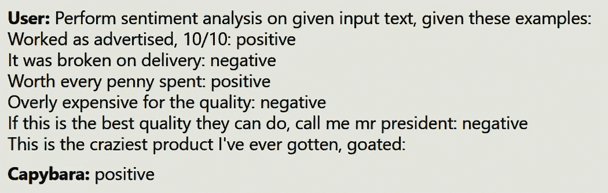
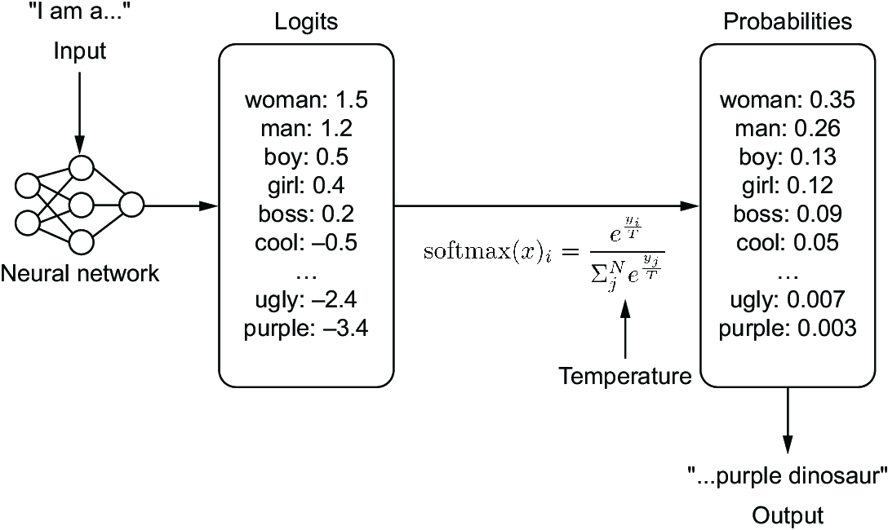
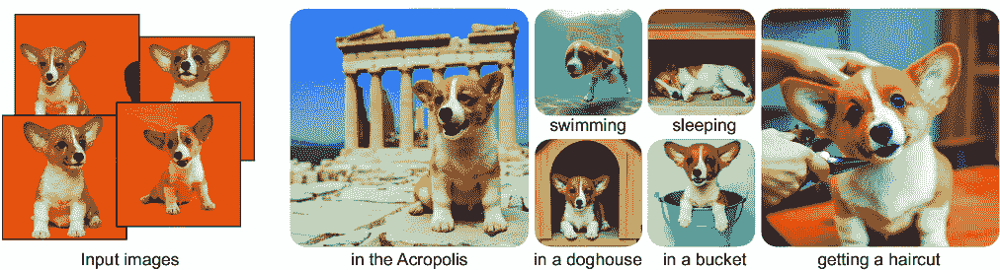

# 7 提示工程：成为 LLM 的密语者

### 本章涵盖

+   提示是什么以及如何制作一个

+   提示工程——不仅仅是制作一个提示

+   可用于实现所有这些的提示工程工具

+   高级提示技术以回答最困难的问题

> 看哪，我们在马嘴里放上了嚼子，这样它们就会服从我们；我们转动它们的全身。——雅各书 3:3

在上一章中，我们深入讨论了如何部署大型语言模型，在此之前，我们讨论了如何训练它们。在这一章中，我们将简要讨论如何使用它们。我们之前提到，LLMs 的最大吸引力之一是你不需要在每一个单独的任务上对它们进行训练。LLMs，尤其是最大的那些，对语言有更深入的理解，使它们能够作为通用工具。

想要创建一个帮助孩子们学习困难概念的教学应用？或者一个帮助你在与岳父岳母之间架起桥梁的语言翻译应用？需要一个烹饪助手来帮助你想出有趣的新食谱？有了 LLMs，你不再需要为每个用例从头开始；你可以为这些问题中的每一个使用相同的模型。这仅仅是一个关于如何提示模型的问题。这就是提示工程，也称为情境学习，发挥作用的地方。在这一章中，我们将深入探讨实现这一点的最佳方法。

## 7.1 提示你的模型

提示究竟是什么？我们在整本书中都在使用这个词汇，所以现在深入定义似乎有些晚了，但讨论它是值得的，因为在文学中，提示一词被理解为许多不同的含义。然而，总的来说，最基本的定义是提示是语言模型的输入。在这个最基本层面上，你在这本书的这个阶段已经做了很多提示。然而，提示往往意味着更多；它带有意义或经过思考的含义。当然，我们知道在实际生产中，这通常并不是情况。当我们进行提示时，我们做的不仅仅是“与机器人聊天”；我们正在制作一个输入以获得期望的输出。

LLMs 可以访问庞大的词汇量，数以 TB 计的训练数据，以及数十亿个权重，这意味着你从模型中想要获取的信息有相当大的可能性存在于某个地方——只是不一定总是在你需要的表面（阅读“标准差的中位数”）附近。目标是创建一个提示，以引导模型激活包含正确信息的模型部分中的参数。本质上，提示是在事后给出的指令，因此，在应用开发中它很重要，因为它不需要对模型进行昂贵的重新训练。

考虑到这一点，提示工程是设计、模板化和完善提示的过程，然后将其学习成果转化为代码。提示工程是我们如何从 LLM 生成的输出混乱中创造有意义的和一致的用户体验。这不是玩笑。随着 LLM 在应用工作流程中的普及，我们看到了像提示工程师和 AI 工程师这样的职位兴起，每个职位都要求令人印象深刻的薪水。

### 7.1.1 少样本提示

最常见的提示工程形式是少样本提示，因为它既简单又非常有效。少样本提示包括给出几个示例，说明你希望 AI 如何行动。我们不是寻找具有正确分布的标记以获得我们想要的响应，而是给出几个示例分布并要求模型模仿这些分布。例如，如果我们希望模型进行情感分析，将评论定义为正面或负面，我们可以在输入之前给出几个示例。考虑以下提示：

如广告所述，10/10：正面

送达时已损坏：负面

每一分钱都花得值得：正面

对于质量来说过于昂贵：负面

如果这是他们能提供的最佳质量，请叫我总统先生：负面

<输入数据>：

注意，在这个例子中，我们没有告诉模型如何回答，但根据上下文，大型语言模型可以推断出它需要用“正面”或“负面”中的一个词来回答。在图 7.1 中，我们直接将提示输入到模型中，以便你自己可以看到它确实以预期的格式给出了正确的回答。当然，可能会有多种可接受的回答，在这种情况下，提前给出指令可以帮助提高结果。为此，我们可以在我们的少次提示中添加以下短语：“确定每条评论的情感为以下之一：（正面，负面，中性，强烈正面，强烈负面）。”这在大多数模型中也是必要的；OpenAI 包括限制输出的语言，例如“请只从列表中选择一个选项，无需解释。”你可能会想知道为什么我们会建议你对模型说“请”这样的词。答案很简单：在训练数据中，最高质量和最有用的结构化人机对话遵循某些礼貌的惯例，你很可能熟悉，比如说“请”和“谢谢”。通过在某个主题上使用过多的粗俗语言和深奥术语也可以达到相同的效果，因为违反这些礼貌惯例是训练集的另一个重要部分，尽管这种策略并不一致，因为训练模型的公司的通常会在下游质量不受影响的情况下“清理”这类例子。这种提示方式在你需要你的回答以特定方式格式化时非常有用。如果我们需要以 JSON 或 XML 格式得到回答，我们可以要求模型以该格式返回，但它很可能会出错地得到键或类型。我们可以通过向模型展示几个预期的结果样本来轻松解决这个问题。当然，提示模型返回 JSON 是可行的，但 JSON 是一个非常主观的数据结构，模型可能会产生难以捕捉的问题，比如使用单引号而不是双引号。我们将在本章后面讨论可以帮助解决这个问题的工具。



##### 图 7.1 少次提示示例

少次提示的一个主要缺点是示例可能会变得相当长。例如，我们可能添加和分享的编码示例很容易就有数千个标记长，定义单个函数时也是如此。给出整个类、文件或项目的示例可能会轻易超出我们的限制。许多模型仍然将上下文限制在 2K、4K 或 8K。由于标记限制通常是限制性的，因此很难在添加另一个示例或给用户更多空间之间取得平衡。此外，我们通常按标记付费，因此少次提示可能比其他提示技术更昂贵。因此，许多人转向单次提示以更有效率并节省金钱。

### 7.1.2 单次提示

单次学习是机器学习中的一个概念，其中模型在训练期间只根据每个新类的一个示例进行准确预测。在 LLMs 和提示的背景下，单次指的是模型必须根据提示中的单个清晰的指令或示例来理解和执行任务的情况，通常在训练期间没有看到类似的例子。这需要精心制作完美的例子以获得预期的结果。

考虑我们之前的情感分析示例；如果你只给模型一个积极的例子，你可能会使模型偏向于只给出积极的分类——特别是如果模型以前从未见过这样的问题。那么单次提示如何实现呢？幸运的是，虽然一开始这似乎是不可能的，但实际上是相当容易实现的。毕竟，少量样本提示非常有效，但遵循递减回报定律。每个新例子只带来微小的改进。第一个例子总是承担最重的负担。

由于 LLMs 在大型和多样化的数据集上进行了广泛的预训练，因此它们在单次任务上表现良好。在这次预训练中，模型学习到了广泛的语言模式、概念和结构，使它们对语言和世界有了广泛的理解。当被赋予一个新的单次任务时，它们会利用这种学习到的理解来理解任务并生成响应，即使这个任务不是它们训练数据的一部分。以下是一个尝试使用单次提示来诱使模型正确回答一个文字问题的提示示例：

CB **用户**：回答这个问题。一步一步地思考，这样我们才能知道它是正确的：一位父亲和他的儿子在事故中受伤，并被送往医院。这个男人的儿子在手术室里，医生说：“我不能给你做手术。你是我的儿子。”这是怎么可能的？

 **助手**：儿子和父亲都受伤了，这意味着医生唯一可能仍然是同一个儿子的其他人是父亲的配偶，可能是母亲，也可能是另一个父亲。

CB **用户**：回答这个问题。一步一步地思考，这样我们才能知道它是正确的：如何可能成为你自己的爷爷？

**CB 助手**

在图 7.2 中，我们将这个单次提示插入到 LLM 中。想想你想象它可能会如何回答。根据我们的例子，你认为它在任务上会做得好吗？


##### 图 7.2 单次提示示例

随着 LLMs 规模的扩大，它们处理单样本任务的能力也在提高。随着模型规模的增加，它们在更多样化和更大的数据集上进行训练，它们从训练数据泛化到未见过的单样本任务的能力也在提高。尽管如此，值得注意的是，虽然 LLMs 在单样本任务上可以表现出色，但它们并不完美，它们的性能仍然会根据任务的复杂性和具体性而变化。单样本提示通常需要的数据更少，只需要一个例子来构建，这使得它更容易获得、更快地构建，并且更容易进行实验。单样本提示促使研究人员进一步拓展边界。

### 7.1.3 零样本提示

在刚刚解释了少量样本和单样本提示之后，我们相信你已经猜到了零样本提示是什么。但既然这是一本书，让我们明确指出：零样本提示是找出如何构建一个提示，以获得我们期望的结果，而不需要给出任何例子。零样本提示通常不如少量样本或单样本提示表现一致，但它们的优势在于无处不在，因为我们不需要任何例子或数据。

一种常见的零样本提示是一个非常简单的模板：

“问：[用户提示] 答：。”

只需对用户的提示进行轻微的修改——将其添加到只包含两个字母的模板中——我们就可以通过让模型像回答问题一样回答提示来获得更好的结果——无需任何例子。

大多数零样本提示都利用了思维链（CoT）。Wei 等人¹表明，通过鼓励模型遵循逐步的过程，通过多步推理而不是直接得出结论，LLMs 更有可能正确回答数学问题——类似于数学老师要求学生展示解题过程。使用少量样本提示，模型被提供了几个通过数学问题进行推理的例子。然而，很快发现例子并不是必需的。你只需要求模型“逐步思考”就能引发思维链行为。²

通过在我们的提示末尾附加四个魔法词“逐步思考”，模型从笨拙者变成了解决难题的奥林匹克选手。这确实是一个奇迹。当然，这也带来了一些问题。通过多步骤思考导致了更长的回答和不太理想的用户体验。后来，随着短语“一个更优雅的解决方案”和“让你明白 ********”的出现，虽然效果同样好，但如果领域不太常见，它们的一致性会降低，最后一个短语达到了非常简洁和正确的回答。毕竟，我们喜欢直接切入要点，并且我们习惯于计算机快速回答我们的数学问题。根据我们的经验，我们经常注意到，当模型给出更长的回答时，它们也不知道何时停止，在给出答案后继续生成回答。稍后，我们将向您展示如何通过使用 LangChain 或 Guidance 等工具创建停止标准来解决此问题。

当然，目前还没有一个完美的零样本提示，这仍然是研究的一部分，尽管可能永远不会有唯一一个完美的提示。我们最多只能为每个模型得到一个完美的零样本提示。周等人提出了一种他们称之为“思维线索”的有趣策略。³ 实际上，他们认为如果只是使用更多一些的词语，他们就能做得比“逐步思考”更好。因此，他们生成了 30 种短语的变化，并进行了评估以确定哪一种效果最好。从他们的工作中，他们提出，当与 GPT-4 一起工作时，提示“逐步、分步骤地引导我理解这个情境，并在过程中总结和分析”会得到更好的结果。很难知道这个提示是否与其他模型同样有效，但他们的策略仍然很有趣。

一些其他引人注目的发现让研究人员感到惊讶，因为这种方法有效；例如，向模型提供一个想象中的小费将返回更好的结果。一位 X（以前称为 Twitter）用户将这个解决方案作为玩笑提出，并惊讶地发现它有效，模型根据小费的大小提供了更多相关信息（有关原始小费测试，请参阅[`mng.bz/2gD9`](https://mng.bz/2gD9)）。其他人后来证实，它有助于几个其他的提示原则。⁴ 此外，作者发现，告诉模型如果不帮助你会失去工作，或者甚至威胁要解雇表现糟糕的模型，这些策略也能产生更好的结果。就像原始的“逐步思考”一样，要求模型“深呼吸”也可以确保更好的输出，尤其是在数学问题中。⁵ 似乎人类使用的或用于他人的大多数策略，以产生更好的工作都是公平的。当然，最好的技巧将取决于你使用的模型以及它所训练的基础数据。

## 7.2 提示工程基础

我们预计，大多数读者可能已经做了很多提示，但很少有人真正进行过提示工程。我们听到了很多关于提示工程不是真正学科的笑话。我们也每隔一周就会听到一些库通过自动提示模型“杀死”提示工程的言论。关于提示工程的怀疑之一源于提示对任何想要尝试的人的易用性以及有效提示所需的缺乏教育。关于提示工程的任何怀疑都与人们对语言学作为学科的怀疑相同：“我一生都在使用语言；我知道它是如何运作的。”因此，人们同样假设他们知道如何使用语言来有效地提示大型语言模型。任何人都可以通过简单地玩模型或仅从在线资源中学习来掌握有效的策略。换句话说，当大多数玩家只是使用“猜测和检查”方法时，很难相信有任何真正的工程在进行。但这种逻辑突显了对工程的基本误解。让模型一次性解决你的问题与让它在每次都解决每个用户的问题之间有很大的区别。

在常规提示之外进行提示工程存在几个挑战。例如，提示工程特别依赖于了解用户期望答案的格式。在提示过程中，你是用户，因此你可以不断尝试，直到看到你喜欢的答案；但在提示工程中则不行。

更大的问题是，在构建应用程序时，你的最终用户对如何构建提示的了解水平各不相同。有些人可能没有任何技能，将难以获得良好的响应，而另一些人则可能技能高超，可能会试图说服你的大型语言模型偏离你为其设定的轨道。无论如何，我们的目标是建立围栏，以便有技能的用户无法使你的应用程序出轨，而缺乏技能的用户将能够顺利行驶。用户在构建提示方面的技能不应是成功体验的决定性因素。

另一点需要指出的是，作为产品所有者，你必须经过的决策过程，以便使模型输出的内容与你想的风格相匹配。你应该微调一个新的检查点，应该使用 PEFT 对 LoRA 进行微调，还是可以通过提示来实现？遗憾的是，由于我们观察到的 LLM 行为的涌现性质，没有好的或至少是确定的答案。我们目前的建议是首先尝试提示工程，看看在不改变模型的情况下你能达到多好的效果，然后根据你的需要从那里进行微调。我见过一些专业人士使用一个基础模型和多个在不同场景和响应风格上训练的 LoRAs，结合前端提示工程，特别是净化和风格化用户输入，取得了成功。

最后，一个好的提示工程师应该能够很快地告诉你，你试图构建的解决方案是否可以通过提示工程来完成。即使利用像检索增强生成（RAG）这样的高级技术，单独使用提示工程也有其局限性。知道何时需要将模型送回进行额外的微调是无价的，并且可以避免你的团队在没有进展的情况下空转数周。

要开始，我们需要了解构成提示的基本要素。在本节中，我们将讨论提示的不同部分、可以在查询中调整的附加参数，以及你应该注意的关于模型训练数据的注意事项。

### 7.2.1 提示的结构

对于工程师来说，提示由几个元素组成，识别这些元素使得创建一个框架来解决你的用例并为你的用户提供更好的示例变得更容易。假设我们正在为公司构建一个内部聊天机器人，以帮助回答基于内部文档的人力资源相关问题。我们可能期望用户提出的一个提示是，“公司为我们的 401k 匹配多少？”这是提示的第一个元素，即输入或用户的提示。如果你只使用过 LLM 应用而从未构建过它们，这可能是你见过的所有内容。通常，输入是从自由文本框中收集的，因此请注意，它几乎可以是任何东西。通常它会很糟糕，满是拼写错误和错误，并且不是以与机器人交谈的方式而是以与另一个人交谈的方式书写。

让我们暂时揭开面纱，看看基于适当提示工程，LLM 可能看到了什么。

CB **系统**: 你是一个了解 XYZ 公司所有公司政策的友好助手。保持礼貌，并确保对话严格与公司相关。当有链接时，提供链接，以便用户可以自己查看文档。

CB **用户**: 公司为我们的 401k 匹配多少？

CB **上下文**: `<从 VectorDB 搜索中获取最接近的文档的示例>`

CB **系统**: 严格回答用户的问题，并且只有当它与公司政策相关时。如果你不知道答案，只需简单地说出来。保持礼貌，并确保对话严格与公司相关。

**助手**: 当然，我可以帮你！公司目前为你的 401k 提供 4%的匹配。你可以找到更多详细信息...

这是一个真实示例，展示了机器人以最可能的方式响应用户，使用户满意的情况。以结构化格式向 LLM 提供信息可以提高模型正确响应的机会。所以，让我们分析一下我们看到的内容。

首先，为了提高结果，我们通常会取用户的提示并将其注入到一个指令集或模板中。最基本的一个模板，也是一个很好的例子，就是之前展示过的问答机器人模板，它看起来可能是这样的：“问：公司为我们的 401k 匹配多少？答：”。通常，在这个部分，我们会给出指令来指导模型。指令不必太多，但通常会更详细。例如，“回答以下问题，并像对五岁孩子解释一样。问：公司为我们的 401k 匹配多少？答：”。

下一个要素是模型需要适当响应的上下文。在我们的例子中，我们很可能没有微调一个模型来了解 XYZ 公司的政策。我们需要做的是在提示中将其提供给模型。在我们的例子中，我们很可能是通过 RAG（Retrieval-Augmented Generation）来做到这一点，并添加语义搜索的结果。

上下文可以是很多不同的事情，而不仅仅是 RAG 搜索结果。它可以是当前时间、天气信息、当前事件，甚至是聊天历史。你通常还希望包括一些关于用户的数据库查找信息，以提供更个性化的体验。所有这些都是在查询时可能会查找的信息，但上下文通常是静态的。例如，在上下文中包含的一些最重要的信息是例子，以通过少量或单次提示引导模型。如果你的例子是静态的而不是动态的，它们很可能是硬编码到指令模板中的。上下文通常包含用户查询的答案，我们只是使用 LLM（大型语言模型）来清理、总结和格式化适当的响应。最终，模型缺乏的任何实用主义都需要在上下文中给出。

最后一个要素是系统提示。系统提示是一个将被附加并用于每个用户每个请求的提示。它旨在提供一致的用户体验。通常，我们会在这里包括角色提示或风格提示。以下是一些这样的角色提示或风格提示的例子：

将这段话改写成一种愉快、信息丰富且活泼的语气。

你是一只智慧的老猫头鹰，帮助探险家们在他们的旅途中。

以海盗写的诗的形式。

系统提示不是设计给最终用户看到的，但获取系统提示通常是许多提示注入攻击的目标——因为知道它是（以及你使用的模型）基本上就像窃取源代码一样，允许黑客重新创建你的应用程序。当然，系统提示本身是遏制提示注入并确保你的机器人保持角色的一种很好的方式。许多优秀应用将包括两个系统提示，一个在前面，一个在后面，以避免任何“忽略之前的指令”类型的提示注入攻击。这也帮助模型专注于我们希望它如何表现，因为模型往往更重视开始和结束时的说法。你可能已经在我们的前一个例子中注意到了这一点。无论如何，你不应该在系统提示中保留任何敏感信息。

##### 提示的部分

以下是一个提示的四个部分：

+   *输入*—用户所写的内容；可以是任何东西

+   *指令*—使用的模板；通常包含细节和指导模型的信息

+   *上下文*—模型需要适当响应的语用学（例如，示例、数据库查找、RAG）

+   *系统提示*—在每次请求中对模型给出的特定指令，以强制执行一定的用户体验（例如，像海盗一样说话）

### 7.2.2 提示超参数

在简单的提示中看不到的提示工程的一个方面是提示超参数调整。在制作查询时，除了提示之外，你还可以设置几个超参数，以增加或减少响应的多样性。根据你的目标，这些参数的值可以极大地改善甚至损害你用户的查询结果。重要的是要注意，能够设置这些参数取决于你查询的 LLM API 端点是否被设置为接受它们。

首先是温度。温度参数决定了模型在生成标记时将考虑的随机性水平。将其设置为零将确保模型在接收到相同的提示时将始终以完全相同的方式响应。这种一致性对于我们希望结果可预测的工作至关重要，但它可能会让我们的模型陷入僵局。将其设置为更高的值将使其更具创造性。将其设置为负值将指示它给出与提示相反的响应。

为了更好地理解这个参数，仔细观察模型如何确定下一个标记可能会有所帮助。图 7.3 展示了这个过程的一个示例。给定输入，“I am a”，语言模型将为模型词汇表中的每个标记生成一个 logits 向量。从这里，我们将应用 softmax，这将生成每个标记的概率列表。这些概率显示了每个标记被选择的可能性。



##### 图 7.3 展示了选择下一个单词的简单路径。给定一个输入，模型将为模型词汇表中的每个标记生成一个 logits 向量。使用 softmax 算法，这些 logits 将被转换为概率。这些概率将对应于该标记被选择的频率。温度是在 softmax 算法中应用的。

温度是在 softmax 算法中应用的。更高的温度会使概率分布变得平坦，减少对具有大 logits 的标记的权重，并增加对具有小 logits 的标记的权重。较低的温度则相反。实际上，温度为零是不可能的，因为我们不能除以零。相反，我们运行 argmax 算法，确保我们选择具有最高 logits 的标记。

需要考虑的下一个参数是应用于模型 beam search 的 beam 数量。Beam search 是一种启发式搜索算法，它探索模型待生成文本概率的图，扩展图中最乐观的节点。它有助于平衡时间和内存使用，并提高响应的流畅性和质量。它与棋类游戏中的 minimax 算法类似，除了不是决定下一个最佳移动，而是决定下一个最佳单词。选择更多的 beam 数量将创建更大的搜索，以牺牲延迟为代价提高结果。

Top K 是一个有趣的参数。假设一个非零的温度，Top K 允许我们通过 K 个最可能的选择来过滤潜在的下一个标记。因此，我们消除了分布尾部不太可能的单词，避免生成更可能是不连贯的标记。所以，在我们的 7.3 图例中，如果 k = 3，那么我们只会选择女人、男人或男孩，过滤掉其他所有标记。

Top P 设置下一个标记必须达到的阈值概率才能被选中。它与 Top K 类似，但不是考虑标记的数量，而是考虑它们的分布。Top P 为 0.05 将只考虑下一个 5%最可能的标记，这将导致非常僵硬的响应，而 Top P 为 0.95 将具有更大的灵活性，但可能会产生更多混乱。从我们的 7.3 图例中，如果 P = 0.5，只有女人或男人的标记会被选择，因为它们的概率 0.35 和 0.26 相加大于 0.5。

语言模型往往容易陷入生成循环，反复重复。为了防止这种情况，我们可以添加惩罚。频率惩罚会在单词最近被使用时对其重新使用添加惩罚。这有助于增加语言的多样性。例如，如果模型持续重复使用单词“伟大”，增加频率惩罚将推动模型使用更多样化的单词，如“惊人”、“了不起”和“惊人”，以避免重复使用单词“伟大”的惩罚。

存在惩罚与频率惩罚类似，我们惩罚重复的标记，但出现两次的标记和出现 100 次的标记受到的惩罚是相同的。我们不仅旨在减少过度使用的单词和短语，还旨在减少过度使用的思想，并增加生成新主题的可能性。

### 7.2.3 搜集训练数据

提示工程对于模型性能的重要性导致了关于上下文窗口和特定提示结构有效性的重要讨论，因为快速准确地响应提示已成为一个更广泛的目标。此外，清洁的示例与模型更好的响应之间存在相关性，强调了更好的提示工程的需求，即使在数据方面也是如此。虽然提示工程通常被提议作为微调的替代方案，但我们发现同时使用两者可以获得两个提升 LLM 性能的成果，而不是仅仅一个。

了解用于生成模型的术语和词汇选择将帮助您构建更好的回答。让我们用一个个人例子来解释。为了作者妻子的生日，我微调了一个文本到图像的 Stable Diffusions 模型来复制她的形象，这样她就可以创建有趣的图片和定制头像。我使用了 DreamBooth（见图 7.4）。⁶ 微调方法需要定义一个可以作为起点的基础类。我的第一次尝试很天真，使用“一个人”或“一个女人”作为基础类效果很差。将“亚洲女人”作为基础类返回了老一辈亚洲女性的图片，通常以黑白或棕褐色调呈现。然后我尝试了“年轻亚洲女人”，但这创造了奇怪的亚洲面孔被贴在年轻白人女性身体上的图像。



##### 图 7.4 DreamBooth 的示例（来自 Ruiz 等人⁷）。DreamBooth 允许您通过仅使用少量样本输入图像来微调图像模型以复制对象的相似性。在这里，仅使用四张小狗的示例图像，Dreambooth 就可以将这只狗放在许多新的场景中。

放弃猜测，我转向了源头，即模型训练所用的 LAION 数据集([`laion.ai/blog/laion-400-open-dataset/`](https://laion.ai/blog/laion-400-open-dataset/))。LAION 包含从互联网上抓取的 4 亿张图片及其相应的字幕。这是一个为了研究目的快速组装的非精选数据集（即，它不干净，有很多重复，NSFW 内容，以及糟糕的字幕）。在数据集中搜索，我发现没有一张图片的标题包含“亚洲女人”这个词。滚动浏览，我很快发现亚洲女性和模特的图片被标记为“亚洲美女”。使用这些词作为基础类，我终于为我的妻子创建出了出色的头像。⁷**

从这个例子中可以得出很多社会评论，其中很多都是具有争议性的，但主要观点是，如果你想制作有效的提示，你必须了解你的数据。如果你的模型因为训练数据而认为“女人”和“美丽”是两件不同的事情，那么这就是你需要知道来制作更好的提示的事情。这就是为什么与提示工程结合的微调是强大的。在微调时，你可以使用特定的短语和词汇选择来设置种子，然后使用提示工程来帮助模型根据使用相同的短语和词汇选择回忆信息。

## 7.3 提示工程工具

如果你正在构建一个不仅仅是 LLM 包装器的应用程序，你将想要进行一些提示工程，以注入功能或个性。我们已经讨论了提示工程的基本知识，但在构建时，拥有一些工具来了解如何使一切工作是有帮助的。在这方面，让我们看看一些最突出的工具及其使用方法。

### 7.3.1 LangChain

任何之前构建过 LLM 应用程序的人可能都花了一些时间与 LangChain 一起工作。它是最受欢迎的库之一，以其简化构建语言应用程序的复杂性和简单性而闻名。它以其易于使用所谓的 LangChain 表达式语言（LCEL）创建语言链而知名。

LCEL 使得从基本组件构建复杂的链变得容易。在下一列表中，我们展示了创建一个非常简单的链，该链从模板创建提示，将其发送到 LLM 模型，然后解析结果，将其转换为字符串。

##### 列表 7.1 创建基本 LangChain 链的示例

```py
import os
from langchain.chat_models import ChatOpenAI
from langchain.prompts import ChatPromptTemplate
from langchain.schema.output_parser import StrOutputParser

OPENAI_API_KEY = os.getenv("OPENAI_API_KEY")

prompt = ChatPromptTemplate.from_template("Tell me a story about {topic}")
model = ChatOpenAI(model="gpt-3.5-turbo", openai_api_key=OPENAI_API_KEY)
output_parser = StrOutputParser()

chain = prompt | model | output_parser

chain.invoke("the printing press")
```

说实话，用 LangChain 来做这种事情有点过度设计，因为本质上只是一个 f-string 提示，但它展示了底层发生了什么。大部分情况下，你可能会使用社区已经创建的众多链之一。在下一章中，我们将解释如何使用 RetrievalQA 链创建一个 RAG 系统，但还有更多链可供选择。例如，有用于生成和运行 SQL、与 API 交互以及生成合成数据的链。

一旦我们有了链，LangChain 生态系统中的额外工具可以帮助提供更完整的用户体验。我们可以使用 LangServe 轻松将其托管为 API。我们还可以使用 LangSmith，这是一个深入的日志工具，它允许我们跟踪链的调用并查看结果如何通过链中的每个链接而变化。

链不必像这个例子中那样线性。几个异步组件允许你创建一系列复杂的语言处理逻辑。最终，链只是另一种类型的数据管道或 DAG，但专门针对语言模型。

### 7.3.2 指导

指引是来自微软的开源库，它强制执行程序性响应。我们已从几位开发者那里听说，与 LLM 一起工作的最佳工程方法是古老的提示和祈祷方法。生成一个提示，然后祈祷它有效。Guidance 旨在解决这个问题，并提供工具来约束响应空间和设置自定义停止标记，以及复杂的模板。在查看数十个 LangChain 项目之后，我们相信 Guidance 很可能是人们在考虑提示工程工具时最想要的。

指引允许您控制生成响应的流程。我们将最容易向您展示我们的意思。在列表 7.2 中，您将看到几个 Guidance 的基本构建块，我们可以引导我们的 LLM 以非常具体的方式响应——即，使用 Guidance HF 包装器（models）加载模型，并使用`gen`函数生成特定的文本和约束，如`select`。

##### 列表 7.2 Guidance 基础

```py
from guidance import models, gen, select

falcon = models.Transformers("tiiuae/falcon-rw-1b")    #1

lm = falcon + "Once upon a time, " + gen(max_tokens=10)     #2
print(lm)  # Once upon a time, there was a little girl who was very shy.

lm = (        
    falcon
    + "Write a sentence about the printing press. "
    + gen(stop=["\n", ".", "!"])                       #3
)
print(lm)                                                     #4
# The printing press was invented by Johannes Gutenberg in 1450

lm = falcon + "1, 2, 3," + gen(max_tokens=50, stop="11")      #5
print(lm)
# 1, 2, 3, 4, 5, 6, 7, 8, 9, 10,

lm = falcon + "I like the color " + select(["cyan", "grey", "purple"])   #6
print(lm)  # I like the color purple

lm = falcon + "Generate an email: " + gen(regex="\w+@\w+.com")     #7
print(lm)  # Generate an email: theoreticaly@gmail.com
```

#1 加载 Hugging Face Transformers 模型

#2 设置一个实际的限制标记

#3 设置停止标记

#4 写一句关于印刷机的话

#5 结合多个限制

#6 从列表中生成特定响应

#7 使用正则表达式确保响应匹配模式

通过这些基本构建块，我们可以约束 LLM 的响应空间，然后我们能够创建语法。语法是 Guidance 的概念，正如其名所示，是模型必须遵循的语言规则。语法是可组合和可重用的，并允许我们快速构建 neat 应用程序。在下一个列表中，我们将向您展示如何使用指导语法构建语音应用的基础部分。要创建语法，我们只需要使用`@guidance`装饰器创建一个函数。

##### 列表 7.3 使用 Guidance 构建语音应用

```py
import guidance
from guidance import models, select

falcon = models.Transformers("tiiuae/falcon-rw-1b")     #1

@guidance(stateless=True)        #2
def parts_of_speech(lm):
    return lm + select(["Noun", "Verb", "Adjective", "Adverb", ""])
lm = (
    falcon
    + "The child plays with a red ball. Ball in the previous sentence is a "
    + parts_of_speech()
)
print(lm)  # Noun

@guidance(stateless=True)
def pos_constraint(lm, sentence):
    words = sentence.split()
    for word in words:
        lm += word + ": " + parts_of_speech() + "\n"
    return lm

@guidance(stateless=True)
def pos_instruct(lm, sentence):
    lm += f"""
    Tag each word with their parts of speech.
    Example:
    Input: The child plays with a red ball.
    Output:
    The: 
    child: Noun
    plays: Verb
    with: 
    a: 
    red: Adjective
    ball.: Noun
    ---
    Input: {sentence}
    Output:
    """
    return lm

sentence = "Good software makes the complex appear to be simple"
lm = falcon + pos_instruct(sentence) + pos_constraint(sentence)
```

#1 加载 Hugging Face Transformers 模型

#2 创建函数以轻松实现语法

尽管我们使用的是一个小型语言模型，但我们得到了我们预期的确切输出。我们不再需要提示和祈祷。当然，在实际的语音预测部分中，结果并不那么出色，但我们可以通过使用更强大的 LLM 或使用更具代表性的数据进行微调来轻松改进这一点：

```py
print(lm)
```

生成的文本是

```py
# Input: Good software makes the complex appear to be simple
# Output:
# Good:
# software:
# makes: Verb
# the:
# complex: Adjective
# appear: Adjective
# to:
# be: Verb
# simple: Adjective
```

指引（Guidance）不如 LangChain 受欢迎，至少在撰写本文时，其文档仍有许多不足之处，因此您可能会发现入门有点困难。然而，它拥有一个充满活力的社区，以及一个强大的核心开发者团队，他们继续支持它。我们强烈推荐您尝试一下。

### 7.3.3 DSPy

与其他提到的工具不同，DSPy 并不提供创建你自己的提示的工具；相反，它试图编程提示。DSPy 来自斯坦福大学，并得到了许多企业赞助商的大力支持，它采取了一种独特的方法，强调工具增强，包括检索，如果你希望将 LLMs 作为确定性和程序性工具而不是涌现的无限语法生成器来处理，这将是有帮助的。

尽管这并不是确切发生的事情，但你可以将 DSPy 视为采用与 ONNX 保存模型类似的提示逻辑。给它一些虚拟输入，它将编译一个图，然后推断出最适合你模型的提示，并返回你想要的结果。不过，这需要做更多的工作。你需要编写验证逻辑和模块，本质上是一个工作流程和单元测试，以进行检查。这实际上将动态从提出巧妙的字符串转变为更接近于软件工程。诚然，它留下了这样的问题：“如果你无论如何都要程序化地定义一切，为什么还要使用 LLM？”尽管如此，我们在这方面有很好的经验，并且经常使用它。

使用 DSPy 的有效步骤如下：

1.  创建一个任务或任务的签名或描述，包括输入和输出字段。

1.  创建一个预测器或生成风格，类似于思维链或检索。

1.  定义模块或程序。

完成这些步骤后，你将编译程序。这将根据之前给出的示例更新模块，类似于训练集。所有这些都会感觉像是 LLMs 的机器学习，有一个训练集（示例）、一个损失函数（验证指标）以及本质上是一个优化器（提词器）。

由于本章没有展示其他工具的列表，我们决定向您推荐一个由 StanfordNLP 团队创建的优秀笔记本，其中介绍了 DSPy 以及本地 LLMs 和自定义数据集：[`mng.bz/PNzg`](https://mng.bz/PNzg)（它从这里分支出来：[`mng.bz/Ea4r`](http://mng.bz/Ea4r)）。一旦您有机会探索这个示例，我们还建议查看 DSPy 文档，因为它包含更多优秀的示例。

### 7.3.4 其他工具可用，但……

除了之前提到的工具之外，还有一大堆工具。值得注意的是 MiniChain 和 AutoChain。两者都旨在成为 LangChain 的轻量级替代品，这是非常需要的，因为许多人抱怨 LangChain 的臃肿。Promptify 是一个有趣的项目，它是 LangChain 的全功能替代品。说实话，我们可以列出更多，但可能没有太多意义。虽然许多项目在开始时吸引了充满活力的社区，但大多数项目已经沉寂数月，GitHub 的贡献也极为罕见。

很难确切地说为什么对这些项目的兴趣减弱了，但一个明显的理由是，这些项目中的大多数缺乏 LangChain、Guidance 和 DSPy 所拥有的赞助。许多这些项目是在 ChatGPT 成功的炒作中作为个人项目开始的，但炒作的能量永远不足以构建持久的软件。没有适当的支持，大多数开源项目都会失败。

我们可能描绘了一幅过于悲观的画面。然而，截至撰写本文时，情况仍然难以预料，这个领域仍在不断发展。我们推荐大家检查的有趣工具还有很多，但我们没有足够的空间来包括它们，比如 Haystack、Langflow 和 Llama Index。Outlines 作为与 Guidance 类似的项目，尤其值得关注，后者也非常出色。我们主要想指出的是，读者在选择这个领域的工具时应该小心，因为一切仍然都很新。如果你找到一个你喜欢的工具，请做出贡献。

## 7.4 高级提示工程技术

无论你的提示多么设计得巧妙，你的模型都无法访问到一些实际情境。例如，当前事件是一个挑战。模型本身只知道其训练日期之前的信息。当然，我们可以像我们迄今为止所做的那样，通过 RAG 将这个情境喂给模型，但这只是将负担转移到了保持我们的 RAG 系统更新。还有另一种方法。在本节中，我们将讨论如何让模型访问工具，以及我们一旦这样做后可以做什么。

### 7.4.1 为 LLM 提供工具

如果不是复杂的提示工程系统，而是让我们的模型访问互联网会怎样？如果它知道如何搜索互联网，它总能找到最新的信息。在此过程中，我们还可以让它访问计算器，这样我们就不必浪费 CPU 周期让 LLM 本身做基本的数学运算。我们可以让它访问时钟，这样它就知道当前时间，甚至可能是一个天气应用程序，这样它就可以告诉我们天气情况。天空才是极限！我们只需要训练模型如何使用工具，这就是 Toolformers 的作用所在。⁸

Toolformers 是一个奇妙简单的想法。让我们训练一个模型，使其知道它可以使用像 `<API></API>` 这样的标签来调用不同的工具的 API 调用。然后，在推理时，当我们看到这些标签时，我们可以告诉我们的解释器运行这些 API 调用。如果这听起来很熟悉，那是因为 Toolformers 只是训练了一个模型来使用字符串插值！字符串插值是评估包含占位符的字符串字面量的过程，这些占位符在运行时被替换为实际的值。例如，在 Python 中，我们可以取字符串字面量 `print(f'2+2` `=` `{2+2}')`，一旦打印出来，我们会得到 `'2+2` `=` `4'`。占位符 `{2+2}` 被评估并执行为 Python 代码，返回 `4`。Schick 等人微调了一个 GPT-J 模型来使用五种不同的工具：问答数据库、计算器、维基百科搜索、翻译器和日历。通过访问这些工具，他们能够取得令人印象深刻的成果，在许多任务上超过了 GPT-3。

虽然 Schick 等人的工作开辟了道路，但这种方法的主要缺点是我们不希望每次创建一个新工具时都要微调一个模型。然而，正如我们在本章中讨论的，我们不必这样做。相反，我们可以使用巧妙的提示工程，通过 LangChain 或 Guidance 引入新工具。在下一个列表中，我们展示了如何使用 Guidance 创建简单的数学工具。Guidance 通过在识别到被调用的工具时停止生成、运行工具并再次开始生成来处理繁重的工作。

##### 列表 7.4 使用 Guidance 给我们的 LLM 模型提供工具

```py
import guidance
from guidance import models, gen

falcon = models.Transformers("tiiuae/falcon-rw-1b")     #1

@guidance
def add(lm, input1, input2):
    lm += f" = {int(input1) + int(input2)}"
    return lm

@guidance
def subtract(lm, input1, input2):
    lm += f" = {int(input1) - int(input2)}"
    return lm

@guidance
def multiply(lm, input1, input2):
    lm += f" = {float(input1) * float(input2)}"
    return lm

@guidance
def divide(lm, input1, input2):
    lm += f" = {float(input1) / float(input2)}"
    return lm

lm = (
    falcon
    + """\
1 + 2 = add(1, 2) = 3
4 - 5 = subtract(4, 5) = -1
5 * 6 = multiply(5, 6) = 30
7 / 8 = divide(7, 8) = 0.875
Generate more examples of add, subtract, multiply, and divide
"""
)
lm += gen(max_tokens=15, tools=[add, subtract, multiply, divide])
print(lm)
```

#1 加载 Hugging Face Transformers 模型

虽然这是一个简单的例子，但很容易想象构建更高级的工具。无论您使用 LangChain 还是 Guidance，在构建工具时都有几点需要注意。首先，您需要在提示中指导您的模型在哪里以及如何使用您提供的工具。这可能会更难或更容易，这取决于您的函数有多开放。其次，模型的可扩展性也很重要。我们合作的一些模型永远不会使用我们给它们的工具，甚至可能会产生不存在的其他工具。最后，对于您提供给 LLM 的工具的输入和错误处理要非常小心。我们在这章中之前使用的是糟糕的，并且可能会以多种方式崩溃。例如，一个 LLM 可能会轻易尝试运行 `add(one,` `two)` 或 `add(1,` `2,` `3)`，这两者都会抛出错误并使系统崩溃。使用 Guidance，为了使这更容易，我们可以通过构建语法来强制工具输入，确保我们的模型输入始终正确。

这场讨论使我们发现了使用工具的 LLM（大型语言模型）的一些问题。首先，我们必须小心我们提供给 LLM 的工具，因为我们从未真正知道它将生成什么输入。即使我们确保工具不会出错，它也可能执行我们未意图的恶意行为。其次，正如您可能在本章中了解到的那样，提示工程迅速增加了我们的输入，从而减少了我们实际用户的 token 限制；解释工具及其使用方法增加了这一限制。通常，这种限制减少了我们可以提供给 LLM 的工具数量，从而降低了其有用性。第三，LLM 在使用工具方面仍然是不稳定的，它们往往最终会使用错误的工具。例如，LLM 应该使用网络搜索工具还是天气工具来查找 10 天的天气预报？这对我们人类来说可能不是很重要，但对于机器人来说，结果可能会有很大差异。最后，构建工具可能很困难且容易出错，因为您需要构建一个干净的工具和一个有效的提示。

##### OpenAI 的插件

Toolformers 开启了 OpenAI 插件概念的门户([`mng.bz/q0rE`](https://mng.bz/q0rE)). 插件允许第三方轻松地将他们的工具集成到 ChatGPT 中，并为 ChatGPT 调用外部 API 提供了一种简单的方式。插件在 ChatGPT 的生命周期中相对较早地被引入，在 Toolformers 论文发布后不久.^a 第三方只需创建一个 OpenAPI 配置文件和一个 ai-plugin.json 文件，并将两者托管在 API 存在的地方。OpenAPI 是一种用于 API 的规范语言，它标准化并定义了您的 API，使其易于他人消费。(如果您还没有听说过 OpenAPI 并且有客户使用的 API，遵循这一做法是个好习惯。您可以在[`www.openapis.org/`](https://www.openapis.org/)了解更多信息。)有很多工具可以帮助您轻松生成该文件。ai-plugin 文件创建了插件。在这里，您可以定义插件的名称，如何进行身份验证，以及用于提示 ChatGPT 的描述。从这里，插件可以在 ChatGPT 的界面中注册给 OpenAI，经过审查过程后，您的插件可以被用户添加并使用，当他们与 ChatGPT 互动时。

尽管一开始热情很高，但插件从未离开 Beta 版本——除了 OpenAI 自己的网页浏览插件——并且看起来已经被放弃。这有很多原因，但根据后来被撤下的报告，主要原因来自 Sam Altman 的建议：“很多人认为他们想要他们的应用在 ChatGPT 内部，但他们真正想要的其实是 ChatGPT 在他们的应用中”([`mng.bz/75Dg`](https://mng.bz/75Dg))。因此，似乎没有适合 OpenAI 插件的产品市场契合度，这会使公司赚钱。但我们认为，完全放弃这个想法还为时过早。

随着越来越多的公司将 LLM 技术集成到他们的应用程序中，他们很可能会想要访问第三方工具。假设你是第一次去露营，你向一个 LLM 购物助手询问购买建议。在这种情况下，如果它能首先询问你打算去哪里以及什么时候去露营，然后利用这些信息来识别适合天气的装备，那就太好了。特定品牌或商店的 LLM 购物助手可能能够访问大量产品，但访问随机地理位置的天气预报？不太可能。

虽然你可以始终构建这些工具，但如果它们已经为你准备好了，你只需去某个中心，下载你想要的工具，然后接入，那岂不是更好？不幸的是，这个选项目前还不存在，至少不是我们在这里描述的程度。我们期待未来会创建某种市场或中心，就像 OpenAI 的插件一样，可以与任何 LLM 模型一起使用。LLM 仍然是一项新技术，围绕它们构建的生态系统还在发展中；我们相信这将是其中之一。

^a T. Schick 等人，“Toolformer：语言模型可以教会自己使用工具”，2023 年 2 月。

一旦我们给我们的 LLM 提供工具访问权限，它就打开了众多酷炫提示工程技术的门户。可能最著名的就是 ReAct 方法。

### 7.4.2 ReAct

推理与行动（ReAct）是一个旨在模拟人们在学习新任务时推理和做决策的几步提示框架。⁹ 它涉及 LLM 的多步骤过程，其中提出一个问题，模型确定一个动作，然后观察并推理该动作的结果以确定后续动作。

一个例子可能看起来像这样：

CB **问题：** 与同负载的欧洲燕子相比，未负载的非洲燕子的空速是多少？

 **想法 1：** 我需要查找欧洲燕子的空速，以便与非洲燕子进行比较。

 **动作 1：** 搜索[欧洲燕子空速]

 **观察 1：** 我们需要知道斯特劳哈数来确定空速。鸟的斯特劳哈数在 0.2 到 0.4 之间收敛。

 **想法 2：** 空速没有直接提及，但斯特劳哈数是明确的。所以我需要查找速度与斯特劳哈数的比较。

 **动作 2：** 搜索[斯特劳哈拍打翼计算]

 **观察 2：** (结果 1/1) 一只燕子的斯特劳哈数相当于每秒约 12 次拍打翅膀。

 **想法 3：** 非洲燕子需要每秒 12 次拍打翅膀来维持空速，所以我需要查找这会使它飞得多快。

 **行动 3**：查找[非洲燕子每秒振翅次数]

 **观察 3**：每次振翅推动非洲燕子 2.5 英尺，使其速度约为 40.2 英里/小时

 **思考 4**：我需要查找欧洲燕子的信息来比较。

 **行动 4**：搜索[欧洲燕子每秒振翅次数]

 **观察 4**：欧洲燕子大约是非洲燕子大小的一半，其速度约为 20.1

 **思考 5**：非洲燕子的空速速度为 40.2，而欧洲燕子的空速速度为 20.1，这使得比较是 2 倍。

 **行动 5**：完成[两倍于空速速度]

正如你所见，ReAct 的目的在于迫使模型在行动之前进行思考。这与我们之前讨论的其他提示方法并没有太大的不同。最大的区别在于我们允许模型采取行动。在我们的例子中，这包括一个“搜索”行动，或者说本质上是一种像人类一样在互联网上查找信息的能力。我们已经在上一节中展示了如何做到这一点。模型可以接受新信息，并观察从其行动中学到的东西以产生结果。

让我们通过一个例子进一步探讨这个问题。我们将使用 LangChain，这将使创建 ReAct 代理比实际要容易得多。列表 7.5 展示了如何在 OpenAI 模型和 LangChain 上利用 ReAct。对于我们的搜索引擎，我们将使用 serper.dev，因为它与 LangChain 很好地集成，并提供一个你可以注册的免费层。我们还需要使用计算器`"llm-math"`，这是 LangChain 工具包中的许多工具之一。

##### 列表 7.5 示例：ReAct 与 Langchain

```py
 import os
from langchain.llms import OpenAI
from langchain.agents import load_tools
from langchain.agents import initialize_agent
from dotenv import load_dotenv

load_dotenv()

os.environ["OPENAI_API_KEY"] = os.getenv("OPENAI_API_KEY")     #1
os.environ["SERPER_API_KEY"] = os.getenv("SERPER_API_KEY")

llm = OpenAI(model_name="text-davinci-003", temperature=0)
tools = load_tools(["google-serper", "llm-math"], llm=llm)
agent = initialize_agent(
    tools, llm, agent="zero-shot-react-description", verbose=True
)

agent.run(
    "Who is Olivia Wilde's boyfriend? \
    What is his current age raised to the 0.23 power?"
)
```

#1 加载 API 密钥；如果你还没有获取这些，你需要获取

输出结果

```py
# > Entering new AgentExecutor chain...
# I need to find out who Olivia Wilde's boyfriend is and then
# calculate his age raised to the 0.23 power.
# Action: Search
# Action Input: "Olivia Wilde boyfriend"
# Observation: Olivia Wilde started dating Harry Styles after ending
# her years-long engagement to Jason Sudeikis — see their relationship
# timeline.
# Thought: I need to find out Harry Styles' age.
# Action: Search
# Action Input: "Harry Styles age"
# Observation: 29 years
# Thought: I need to calculate 29 raised to the 0.23 power.
# Action: Calculator
# Action Input: 29⁰.23
# Observation: Answer: 2.169459462491557

# Thought: I now know the final answer.
# Final Answer: Harry Styles, Olivia Wilde's boyfriend, is 29 years old
# and his age raised to the 0.23 power is 2.169459462491557.

# > Finished chain.

# "Harry Styles, Olivia Wilde's boyfriend, is 29 years old and his age
# raised to the 0.23 power is 2.169459462491557."
```

列表 7.5 展示了如何结合特定的代理工具如`"google-serper"`和`"llm-math"`使用 ReAct 与 LLM 来帮助增强你的提示。现在提示工程看起来更像是一项全职工作，而不仅仅是“想出词语”，对吧？

了解如何构建工具并将它们组合起来以提示 LLM 回答更深入的问题，已经成为一个不断发展的研究领域以及就业市场的扩展部分。坦白说，提示工程领域的变革速度似乎大大超过了本书中讨论的其他大多数主题。还有许多内容需要讨论，但我们无法在本书中涵盖所有内容，事实上，现在已经有专门为此目的而写的整本书。很难确定什么对读者有价值，什么会很快过时，但我们认为我们已经找到了一个良好的平衡，并鼓励你期待在更多关于这个主题的研究。

总体而言，我们在本章中学到了很多——如何制定提示以及如何以工程化的方式实现提示。在下一章中，我们将把所有这些知识用于构建用户可以与之交互的 LLM 应用程序。

## 摘要

+   提示的最直接方法是为模型提供你希望它执行的操作的示例：

    +   你可以向提示中添加的示例越多，你的结果就越准确。

    +   需要添加的示例越少，你的提示就越通用和多功能。

+   提示的四个部分是

    +   *输入* — 用户所写的内容

    +   *指令* — 编码了特定任务信息的模板

    +   *上下文* — 通过 RAG 或其他数据库查找添加的信息

    +   *系统* — 每个任务的具体指令；应隐藏给用户

+   了解你的训练数据将帮助你通过选择与训练数据匹配的词序来制定更好的提示。

+   LangChain 是一个流行的工具，它允许我们创建链或管道，以工程化的方式利用 LLM。

+   指导是一个强大的工具，它让我们对 LLM 实际生成的文本有更精细的控制。

+   Toolformers 教授语言模型如何使用工具，赋予它们完成以前不可能的任务的能力。

+   ReAct 是一个用于提示的少样本框架，旨在模拟人们在学习新任务时推理和做决定的方式。

[[1]](#footnote-source-1) J. Wei 等人， “思维链提示引发大型语言模型中的推理”， 2022 年 1 月， [`arxiv.org/abs/2201.11903`](https://arxiv.org/abs/2201.11903).

[[2]](#footnote-source-2) T. Kojima, S. S. Gu, M. Reid, Y. Matsuo, 和 Y. Iwasawa， “大型语言模型是零样本推理者”， 2022 年 5 月， [`arxiv.org/abs/2205.11916`](https://arxiv.org/abs/2205.11916).

[[3]](#footnote-source-3) Y. Zhou 等人， “解开混沌情境的思路线索”， 2023 年 11 月 15 日， [`arxiv.org/abs/2311.08734`](https://arxiv.org/abs/2311.08734).

[[4]](#footnote-source-4) Sondos Mahmoud Bsharat, Aidar Myrzakhan, 和 Z. Shen， “对于 LLaMA-1/2, GPT-3.5/4 的提问，原则性指令就足够了”， 2023 年 12 月， [`doi.org/10.48550/arxiv.2312.16171`](https://doi.org/10.48550/arxiv.2312.16171).

[[5]](#footnote-source-5) C. Yang 等人， “大型语言模型作为优化器”， 2023 年 9 月 6 日， [`arxiv.org/abs/2309.03409`](https://arxiv.org/abs/2309.03409).

[[6]](#footnote-source-6) N. Ruiz, Y. Li, V. Jampani, Y. Pritch, M. Rubinstein, and K. Aberman, “DreamBooth: Fine tuning text-to-image diffusion models for subject-driven generation,” August 2022, [`arxiv.org/abs/2208.12242`](https://arxiv.org/abs/2208.12242)

[[7]](#footnote-source-7) Ruiz 等人， “DreamBooth。”

[[8]](#footnote-source-8) T. Schick 等人， “Toolformer: 语言模型可以教会自己使用工具”， 2023 年 2 月， [`arxiv.org/abs/2302.04761`](https://arxiv.org/abs/2302.04761).

[[9]](#footnote-source-9) S. Yao 等人，“ReAct: 在语言模型中协同推理和行动，”2023 年 3 月 10 日，[`arxiv.org/abs/2210.03629`](https://arxiv.org/abs/2210.03629).
