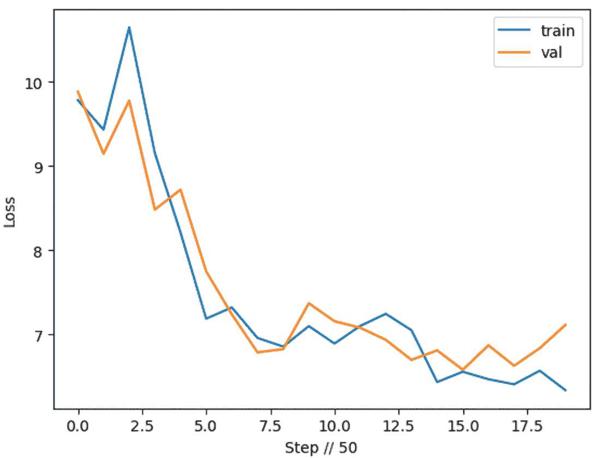

# 第九章：*创建一个 LLM 项目：重新实现 Llama 3*

### 本章涵盖

+   实现 Meta 的 Llama3 模型

+   训练一个简单的 LLM

+   对其进行改进以准备生产

+   将模型服务于一个可以与朋友分享的生产端点

> 我来普林斯顿只是为了研究，而不是教学。教育太多了，尤其是在美国学校。唯一合理的教育方式是树立榜样。——阿尔伯特·爱因斯坦

在本书的第一个主要项目中，我们希望从头开始。我们一直在向您展示如何从头到尾与 LLMs（大型语言模型）一起工作，我们将在本章中将所有内容整合在一起。这个项目包括预训练一个模型，大致遵循研究论文。我们不会深入实际研究；事实上，我们会在这里走一些捷径，因为这不是本书的重点。然而，我们将展示如何训练模型，通过量化准备它以供服务，通过低秩适应（LoRA）针对特定目的或任务进行微调，并将其部署到您可以向朋友展示的生产环境中。

本章将非常密集，但您应该已经做好了迎接挑战的准备，因为这是一个主要面向生产的数据科学家项目。我们选择这个项目是为了让您将本书中学到的所有课程整合到一个地方，并给您留下端到端、动手实践的经验。

## 9.1 实现 Meta 的 Llama

“Touvron 等人撰写的《Llama 2：开放基础和微调聊天模型》¹”是一篇很棒的论文，涵盖了 Llama 2 的开发和发布，这是目前市场上最好的、几乎开源的模型之一。您可能已经看到 Llama 2 作为第一个足够好的开源模型，可以与 OpenAI 的模型相媲美，至少基于当时的指标。现在 Llama 3 已经发布，它几乎完全超越了 Llama 2 的受欢迎程度，这可能是您选择这本书的原因。

Llama 3 有几个令人惊叹的原因——主要是大小和可用性。只有 70B 参数，在 15T 个标记上预训练，并在 10K 个聊天上微调，它不应该在任何方面击败 176B 或 1.7T 参数的模型。不出所料，它通常做不到。但它确实在一件关键的事情上打败了它们：它的可用性。这个特性催生了一个开源软件社区，该社区开发了工具和优化，甚至收集数据以使其更好。Llama 3 是架构不如数据重要的终极展示，它是在干净的数据上训练的。

我们将实现它。

到本章结束时，你将构建一个真实模型并理解其背后的工作。它会是 Meta 的 Llama 3 那么好吗？远非如此，因为我们不会使用足够的数据或 GPU 进行演示。但我们想做的不仅仅是提供另一组在某个排行榜上的权重。我们希望给你一些对所需步骤和可能遇到的问题的直观感受。我们不会从头开始训练一个优秀的模型，这正是现在几十本书正在解决的问题，而是会向你展示如何训练一个低于平均水平的模型并将其投入生产。这种方法不仅能让你学到更多，还能展示出超出你经验水平的专长。

### 9.1.1 分词和配置

到目前为止，你可能已经学会了正确设置问题的重要性。我们希望我们的模型能够打出全垒打，而不是与 MLB 投手对决。考虑到这一点，我们将下载 Llama 使用的相同分词器。如果你想的话，可以在我们从零开始构建时回来尝试这个分词器。例如，尝试使用像 tiktoken 这样的更快分词器——只是要知道你将放弃模型进行数学运算的能力。你还可以训练自己的 SentencePiece 模型版本，这应该能保证在你想扩展的任何数据集上都能得到更好的结果。重点是，这个模型是空的——没有任何预训练的权重。所以，在跟随我们之后，回来做你想做的任何事情。

注意：与其他章节中每个列表都是独立的章节不同，在本章中，每个列表都将成为更大笔记本的一部分。你可以在本书附带的代码仓库中找到这个笔记本。

列表 9.1 展示了我们为这个项目进行的初始设置，包括导入、设备设置和获取我们的分词器。虽然我们只是从 Hugging Face 获取分词器，但请记住，并非所有分词器和模型都使用相同类型的标记。这很重要，因为我们打算以不同于推理分词器设置的方式训练这个模型。为了纠正这种差异，我们需要添加一个填充标记。任何东西都可以，但我们的例子中将使用`"<PAD>"`。一旦我们有了这个，我们就会确保获取词汇表本身（我们稍后会用到它），并创建编码和解码函数以帮助批量处理。因为我们使用的是 Hugging Face 实现，所以这并不是严格必要的，因为它内置了批量分词，以及一个工作得很好的`batch_decode`方法。为了学习的目的，我们仍然会走一遍流程。了解自己在做什么总是好的实践，这些函数有助于锁定这一点。

列表的最后部分提供了最大的灵活性。在这里，我们设置了一个主配置，它最终将决定我们的模型有多少参数，训练多长时间，以及每行数据集将占用多少内存。我们的默认值相当小，旨在无论您的硬件如何，都能为您提供良好的体验，包括如果您在仅 CPU 构建的机器上训练。请随意实验并增加这些数字。

##### 列表 9.1 分词和配置

```py
import torch
from torch import nn
from torch.nn import functional as F
import numpy as np
from numba import jit
from matplotlib import pyplot as plt
import time
from datetime import timedelta
import pandas as pd
from collections import OrderedDict
from itertools import cycle
from transformers import AutoTokenizer
from sentencepiece import SentencePieceProcessor
from datasets import load_dataset

device = "cuda:0" if torch.cuda.is_available() else "cpu"
device_cap = torch.cuda.get_device_capability()
device_type = "cuda" if "cuda" in device else "cpu"
torch.cuda.set_device(device)
torch.manual_seed(8855)
print(torch.__version__)
print(device, device_cap)
# 2.1.0+cu121
# cuda:0 (8,6)

tokenizer = AutoTokenizer.from_pretrained("./llama3/")      #1
tokenizer.add_special_tokens({"pad_token": "<PAD>"})
# tokenizer.pad_token = tokenizer.eos_token           #2

vocab = tokenizer.vocab

def encode(example):
    return tokenizer.encode(example, return_tensors="pt")

def decode(example):
    return tokenizer.batch_decode(
    example,
    skip_special_tokens=False,
    clean_up_tokenization_spaces=True,
    )[0]

print(f"Vocab Size: {len(vocab)}")
decode(
    encode(
    """hello I am a specifically designed long sentence
       to make sure this is working not only adequately,
       but good enough for our batch functions"""
    )
)
# Vocab Size: 32001
#'<s> hello I am a specifically designed long sentence to make sure this is
working not only adequately, but good enough for our batch functions'

MASTER_CONFIG = {
    "vocab_size": len(vocab),
    "batch_size": 16,
    "context_window": 32,
    "d_model": 288,
    "hidden_dim": 768,
    "epochs": 1000,
    "log_interval": 50,
    "n_heads": 6,
    "n_layers": 6,
}
GLOBAL_KEEP_TRACK = []
```

#1 使用 Hugging Face

#2 可选

正如我们在本书中多次重申的那样，您用于分词和嵌入输入的策略最终决定了您的模型在训练和推理过程中能够“看到”的内容。您应该做的不仅仅是选择一个分词器；实际上，我们将在本章后面看到选择 Llama 3 分词器会对我们的推理产生什么影响。

您可以选择在您的数据集上训练一个新的分词器，或者将您数据集中特别重要的标记添加到一个已经非常健壮的分词器中——最好是已经大致符合您想要策略并且在该领域训练过的分词器。如果您对此有任何疑问，任何 LLM 分词器通常都适用——这就是它们被设计的目的。但是，当您选择一个通用分词器并希望执行特定任务时，如果模型表现不佳，请不要感到惊讶。

### 9.1.2 数据集、数据加载、评估和生成

让我们深入了解这个过程中的最重要部分，我们将大部分时间都会略过。在一章中我们只能关注这么多，但我们想重申您的数据集对您的 LLM 成功的重要性。您将需要花费时间收集、评估和清理您的数据集，但为了节省时间，我们将简化这个过程。相反，我们将专注于训练模型所需的步骤——加载、预处理、批处理等等。在阅读这一部分时，请记住，您独特的数据源最终会使您的模型具有前瞻性，因此考虑您能访问到而其他人没有的数据，以及您如何为这次训练设置该数据集。

我们将首先加载一个通常用于创建玩具模型的流行数据集，TinyStories。如果您已经完成了探索数据的工作——我们鼓励您这样做——您会发现这是一个相对较小的 LLM 数据集，包含 3000 万行，每行包含一个段落中的短篇故事。它借鉴了一些经常实施且广泛接受的数据集。虽然对于 LLM 来说是一个较小的数据集，但它可能仍然对许多计算机来说太大，许多读者在尝试一次性将其加载到内存中时可能会遇到内存不足错误。这正是使用流式处理的好时机。在列表 9.2 中，我们向您展示了如何从 Hugging Face Hub 或 `dataset.to_iterable_dataset()`（如果本地工作）中提取数据集。这两种方法都允许进行更高效的内存处理，因为整个数据集不是一次性加载的，这牺牲了一些速度。

##### 列表 9.2 加载和准备数据

```py
dataset = load_dataset(      #1
    "text",
    data_files={
        "train": ["../../data/TinyStoriesv1andv2-train.txt"],
        "val": ["../../data/TinyStoriesv1andv2-valid.txt"],
    },
    streaming=True,
)
```

#1 从本地文件流中获取

一旦你有了你的数据集并且能够检索到一个迭代，我们将进行一些最小（真正）的清理。然后我们将整个内容进行编码，以便我们的训练可以更快地进行。我们将保存分词和注意力掩码作为它们自己的列，然后我们将数据集进行洗牌，并继续进行数据加载。一个总是值得提到的快速提示：在训练任何机器学习模型时，如果你还没有定义你的`train`和`val`拆分，请特别注意洗牌你的数据集，以确保数据不会泄漏到不应该出现的数据拆分中：

```py
clean_dataset = dataset.filter(lambda example: len(example["text"]) > 2)   #1

prompt = "Write a short story. Possible Story: "
tokenized_prompt = tokenizer(prompt, return_tensors="pt").input_ids

encoded_dataset = clean_dataset.map(
    lambda examples: tokenizer(
      [prompt + x for x in examples["text"]],
       padding=True,
       return_tensors="pt",
    ),
    batched=True,
)
train_data = iter(encoded_dataset["train"].shuffle())
val_data = iter(encoded_dataset["val"].shuffle())
train_data = cycle(train_data)
val_data = cycle(val_data)
```

#1 最小处理

如果你忽视了我们的建议进行流式处理，并且有一台可以处理这个数据集的计算机，那么请知道，将整个数据集加载到内存中并进行准备，即使使用硬件加速，也需要超过 30 分钟和超过 5 GB 的内存。所以如果你有额外的 5 GB VRAM，而且这超出了你为模型所需的内存，那么你可以随意加载它。见图 9.1。


##### 图 9.1 虽然这个数据集有超过 3000 万行，对于我们想要做的事情来说可能很小，但在消费级硬件上仍然是相当大的。

我们至少需要一个函数将我们的数据加载到模型可用的格式中，我们选择使用这个函数。我们的`get_batches`函数将接收我们数据的一行，并返回一个模型输入和一个预期的输出，可以与之进行比较以进行自监督学习。不需要标签，因为我们将从随机标记开始，然后抓取直到整个上下文窗口（32）的标记作为输入，并将一个标记向右移动作为预期的输出。对于我们的模型，我们创建了一个类似这样的场景：

CB **输入:** 如果一只土拨鼠能够推木头，它能推多少木头

CB **标签:** 如果一只土拨鼠能够推木头，它能推多少木头？

这个过程允许我们的模型在任务上进行训练：根据前 31 个标记的上下文猜测一个话语中的下一个标记。我们使用这种策略而不是其他策略，如掩码，因为我们的首选输入在输入完成后永远不会包含信息。这样，我们的模型将随着训练数据的更多和更高质量而越来越好。几乎所有的基础模型都是以这种方式预训练的——只是它们训练的时间更长，参数比我们现在使用的要多得多：

```py
# @torch.compile      #1
def get_batches(
    data,
    batch_size,
    context_window,
    config=MASTER_CONFIG,
    debug=False,
):
    x = []
    y = []
    for _ in range(
        batch_size    #2
    ):
        batch_data = next(data)

        ix = torch.randint(         #3
            0, len(batch_data["input_ids"]) - context_window - 1, (2,)
        )
        batch_x = torch.stack(
            [batch_data["input_ids"][i : i + context_window] for i in ix]
        ).long()
        batch_y = torch.stack(
            [
                batch_data["input_ids"][i + 1 : i + context_window + 1]
                     for i in ix
            ]
        ).long()
        x.append(batch_x)
        y.append(batch_y)
    x = torch.cat((x), 0).to(device)
    y = torch.cat((y), 0).to(device)
    return x, y
```

#1 窗口用户请注释

#2 如果内存不足，请调整此值。

#3 选择随机起始点。

一旦我们处理好了数据批处理，我们需要为评估和推理编写函数，以便我们可以在训练过程中了解模型的表现，并且可以在之后使用该模型。对于我们的评估，我们将取一些批次，并计算这些批次之间的平均损失以获得验证损失。这个结果不会给我们模型性能的真实表示，但不会阻止它对我们有用：

```py
@torch.no_grad()
def get_loss(model, lora=False, config=MASTER_CONFIG):
    out = {}
    model.eval()
    for name, split in zip(["train", "val"], [train_data, val_data]):
        losses = []
        for _ in range(10):
                xb, yb = get_batches(
               split,
               config["batch_size"],
                 config["context_window"],
                )
            _, loss = model(xb, yb)
            losses.append(loss.item())
        out[name] = np.mean(losses)
    model.train()
    return out
```

##### 对你的假设进行质疑

当与机器学习模型和其他统计方法一起工作时，了解你的假设如何影响你的结果非常重要。平均值阻碍了数据的表现和理解，因为它们基本上是说：“对于这个比较，我们将取一个虚构的数字，并将该数字用于替代任何真实的数字，因为它感觉是我们分布的中心。”这种方法并不一定不好；虚构的数字往往比真实的数字更有预测性。然而，我们敦促你有意并且非常开放地测试平均值是否是你用户最好的标记。

对于生成，我们将做类似但更好的事情。logits 是我们从模型的前向方法中得到的。我们在对数据集进行标记化时创建了一个提示的标记化版本，所以我们准备多次将这个提示传递给我们的模型并查看结果。我们将从模型中获取给定提示的 logits，然后为下一个标记采样模型分布并解码。

对于采样这个分布，我们将只取模型输出的 logits（logits）作为输入的最后一个部分（我们希望模型生成的未知标记），然后将这些 logits 除以温度设置（更高的温度设置=更小的 logits）。一旦我们有了最后一个时间步的 logits，如果我们使用多项式采样，我们可以使用`top_k`和/或`top_p`进行采样，这些采样是对最高概率标记的采样，直到达到标记总数或概率总和总数。一旦我们有了这些，我们使用 softmax 对采样的标记进行操作，然后使用 argmax 获取下一个标记。如果我们希望输出有更多的探索和创造力，我们可以使用多项式采样。作为一个练习，测试多项式采样与 argmax 之间的`top_k`与`top_p`，以了解哪个效果最好：

```py
@torch.inference_mode()
def generate(
    model,
    config=MASTER_CONFIG,
    temperature=1.0,
    top_k=None,
    max_new_tokens=30,
    lora=False,
):
    idx_list = [tokenized_prompt] * 5
    idx = torch.cat((idx_list), 0).long().to(device)
    for _ in range(max_new_tokens):
        logits = model(idx[:, -config["context_window"] :])     #1
        last_time_step_logits = logits[
            :, -1, :
        ]                      #2

        last_time_step_logits = last_time_step_logits / temperature
        if top_k is not None:
            v, _ = torch.topk(
                last_time_step_logits,
                min(top_k, last_time_step_logits.size(-1)),
            )
            last_time_step_logits[
                last_time_step_logits < v[:, [-1]]
            ] = -float("Inf")
        p = F.softmax(
            last_time_step_logits, dim=-1
        )                                #3
        idx_next = torch.argmax(
            p, dim=-1, keepdims=True
        )                                 #4
        idx = torch.cat([idx, idx_next], dim=-1)  # append to the sequence
    return [tokenizer.decode(x) for x in idx.tolist()]
```

#1 调用模型

#2 所有批次（1）；上一次步骤，所有 logits

#3 使用 Softmax 获取概率

#4 从分布中采样以获取下一个标记

有了这些，我们就完成了设置！我们为模型训练的所有重要部分都提供了实用函数，包括分词、数据加载、评估、推理和数据处理。如果你觉得有任何需要纠正的地方，那太好了！去做吧——这是你的项目。如果你想用多项式分布进行采样而不是 argmax，或者想去掉 softmax 只对 logits 进行 argmax，那太棒了，去做吧。对于那些这是你们第一次尝试的人来说，我们知道这可能会相当快节奏，我们鼓励你们慢慢来，但不要因此失眠。更有可能的是，你不需要自己想出针对你用例应该改变什么，因为你将实现一个已经创建的开源模型。话虽如此，了解幕后和底层发生的事情仍然是一个好主意，这样你知道当事情出错时大致该往哪里找。

### 9.1.3 网络架构

我们现在已经为训练模型做了大量的设置，但还没有创建模型。模型架构和训练已经被反复迭代，所以我们不会过多地讨论它，而是直接进入正题。我们将从一个少于 20M 参数的两层前馈网络开始，然后我们将升级并讨论将模型转变为 Llama 的变化。我们希望清楚地说明它们之间实际发生了什么变化，这样你就能对涉及的各个部分有一个良好的感觉。因为我们不会完全复制 Llama 3，而是近似它，如果你想在我们的数据集上尝试预训练它，这里是有官方架构的链接：[`mng.bz/Dp9A`](https://mng.bz/Dp9A)。

在列表 9.3 中，我们为那个具有 ReLU 激活函数的线性模型创建了一个类，位于两个线性层之间。这里我们将定义我们的实际损失函数（因为在我们的`get_loss`函数中，我们只是将输入发送到模型）。我们将使用交叉熵，因为我们正在比较非结构化序列。而不是深入信息理论来解释为什么交叉熵是非结构化序列的答案，当前行业中的基准是困惑度，它使用交叉熵来确定模型是否在有意义，因此这个损失函数使我们能够与其他行业中的模型竞争。

在我们之前对数据集进行标记化时，你可能已经注意到了一件事：我们在批量中填充而不是截断，这意味着每个批次的长度应该相同。我们完全承认，在预训练时这并没有什么意义；这只是为了加快速度。我们这样做是因为我们的最长长度输入是 997 个标记，我们不想把整个数据集填充到 997 个标记。即使这样，我们数据集中最常见的标记仍然是`"<PAD>"`。如果我们保持原样，模型可能会学会只生成填充标记，这在预测下一个标记时似乎可以最小化损失。然而，由于我们刚刚添加了标记化器词汇表，我们可以告诉损失函数忽略`tokenizer.pad_token_id`的`ignore_index`，这样正确预测填充标记就不会错误地帮助损失下降。

##### 列表 9.3 简单模型和训练循环

```py
class SimpleFeedForwardNN(nn.Module):
    def __init__(self, config=MASTER_CONFIG):
        super().__init__()
        self.config = config

        self.embedding = nn.Embedding(
            config["vocab_size"], config["d_model"]
        )
        self.linear = nn.Sequential(
            nn.Linear(config["d_model"], config["d_model"]),
            nn.ReLU(),
            nn.Linear(config["d_model"], config["vocab_size"]),
        )

        print(
            f"model params: {sum([m.numel() for m in self.parameters()])}"
        )

    def forward(self, idx, targets=None):
        x = self.embedding(idx)
        logits = self.linear(x)

        if targets is not None:
            loss = F.cross_entropy(
                logits.view(-1, self.config["vocab_size"]),
                targets.view(-1),
                ignore_index=tokenizer.pad_token_id,
                # reduction="sum",
            )
            return logits, loss

        else:
            return logits

model = SimpleFeedForwardNN(MASTER_CONFIG).to(device)
opt_model = torch.compile(model)           #1
```

#1 在 Windows 上取消此注释。

现在我们有了我们的模型，我们将编写我们的训练循环。我们运行主配置文件中指定轮次的次数，并得到每次迭代的损失。这里的轮次更像是步骤，我们鼓励你在有时间的情况下在整个数据集上运行轮次。如果你坚持使用我们之前设置的`MASTER_CONFIG`，这个原始模型最终将拥有 18.5M 个参数。你绝对应该将其更改为你的计算机可以处理的参数最大数量。你可以通过更改主配置文件中的`d_model`（如果你训练了一个更大的标记化器，还需要更改`vocab_size`）来找到这个数字：

```py
def train(
    model,
    optimizer,
    scheduler=None,
    data=None,
    config=MASTER_CONFIG,
    lora=False,
    print_logs=False,
):
    losses = []
    start_time = time.time()
    for epoch in range(config["epochs"]):
        try:
            optimizer.zero_grad()

                xs, ys = get_batches(
                    data, config["batch_size"], config["context_window"]
                )
                  for i in range(1, config[‘context_window’]+1):
                          x = xs[:i]
                          y = ys[:i]
                    logits, loss = model(xs, targets=ys)
                    loss.backward()
                    optimizer.step()

                    if scheduler:
                            scheduler.step()

            if epoch % config["log_interval"] == 0:
                batch_time = time.time() - start_time
                x = get_loss(model, lora=lora)
                losses += [x]
                if print_logs:
                    print(
                      f"""Epoch {epoch} |
                         train loss {x['train']:.3f} |
                         val loss {x['val']:.3f} |
                         Time {batch_time:.3f} |
                         ETA: {timedelta(seconds=(batch_time * (config
                            ['epochs'] - epoch)/config['log_interval']))}"""
                    )
                start_time = time.time()

                if scheduler:
                    print("lr: ", scheduler.get_last_lr())
        except StopIteration:
            print(f"Reached end of dataset on step {epoch}")
            break

    GLOBAL_KEEP_TRACK.append(
       f"{type(model).__name__} {sum([m.numel() for m in 
model.parameters()])} Params | Train: {losses[-1]['train']:.3f} | Val: 
{losses[-1]['val']:.3f}"
    )
    print(
        f"training loss {losses[-1]['train']:.3f} | validation loss: 
{losses[-1]['val']:.3f}"
    )
    return pd.DataFrame(losses).plot(xlabel=”Step // 50”, ylabel=”Loss”)

optimizer = torch.optim.AdamW(
    model.parameters(),
)
train(model, optimizer, data=train_data, print_logs=True)
#Epoch 0 | train loss 10.365 | val loss 10.341 | Time 0.122 | ETA:
 0:00:02.431240
#training loss 4.129 | validation loss: 4.458
```

看看，这是图 9.2，它是从列表 9.3 生成的！试着猜猜它将会是什么，然后阅读摘要看看你是否猜对了。



##### 图 9.2 在我们的数据集上训练简单的神经网络以生成文本

看看！这是我们第一次训练时的曲线非常平滑。考虑到我们只从数据集中使用了 1,000 个示例，我们鼓励你尝试几个实际的轮次——比如说，尝试三次遍历整个数据集——看看结果如何。你可能会得到令人惊讶的良好结果；我们就是这样做的。让我们继续检查它在生成文本时创建的内容：

```py
generate(model, config=MASTER_CONFIG)
# '<s> Write a short story. Possible Story: 3 together thisar andze Lily 
said exciteded and smiled. Everything because he wasning loved to the time, 
he did not find like to',

for i in GLOBAL_KEEP_TRACK:
    print(i)
# SimpleFeedForwardNN 18547809 Params | Train: 4.129 | Val: 4.458
```

真的不赖！当然，这些结果并不算出色，但我们并没有期望我们的基础模型和短时间训练能带来惊人的结果。阅读生成的标记，几乎有点道理。我们可以称之为胜利。恭喜！我们使用前馈网络创建了一个可以返回标记的语言模型。现在，让我们深入了解使 Llama 与普通前馈网络不同的变化。

## 9.2 简单的 Llama

如果您检查 Meta 发布的完整权重和层，您可能会注意到我们正在构建的并不完全与发布的内容相同。原因有两点：（1）我们希望确保这次讨论对于第一次与生产相关的科研人员来说仍然非常易懂，（2）我们正在考虑您在阅读这本书时可能能够访问的环境。这里的一切都应该能够在 Kaggle 或 Colab 中无缝运行。在这种情况下，我们将讨论 Llama 3 的架构与我们的差异，以便如果您确实有基础设施和数据来复制论文以用于生产，您也可以做到。²

Llama 在几个方面与前馈网络不同：归一化、注意力、激活和层数。不过，我们不会深入探讨这些内容。归一化有助于稳定训练，注意力有助于支持更大的上下文长度并更有效地使用层间信息，激活有助于更好地表示非线性，而层数的增加使得模型能够表示更多的信息。还有一点需要注意，这次我们增加了一个调度器。这里的调度器负责在训练过程中根据“调度”调整学习率。这一增加有助于我们处理潜在的梯度爆炸问题，并使模型更快地收敛。

让我们将我们的网络改为 Llama 3 的一个更简单的版本。在这里，我们将跳过一些理论和实现细节。但也要查看 GitHub 上的笔记本——我们希望您亲自尝试一下！

##### 列表 9.4 简单的 Llama

```py
class LlamaBlock(nn.Module):
    def __init__(self, config):
        super().__init__()
        self.config = config

        self.rms = RMSNormalization(
            (config["d_model"], config["d_model"])
        )                                                                   #1

        self.attention = RoPEMaskedMultiheadAttention(config).to(device)   #1
        self.feedforward = nn.Sequential(
            nn.Linear(config["d_model"], config["hidden_dim"]),
            SwiGLU(config["hidden_dim"]),                                  #1
            nn.Linear(config["hidden_dim"], config["d_model"]),
        )
```

#1 新增

与原始网络不同，我们为 LlamaBlocks 创建了一个完整的类，或者说是我们更大网络中的较小、自包含的网络。现在我们有 `RMSNormalization`，以及 `RoPEMaskedMultiheadAttention` 和 `SwiGLU` 激活而不是 `ReLU`。我们在笔记本中包含了实现，如果您好奇，可以随时查看。

您会注意到我们的前向函数与原始的前馈函数非常不同。我们现在不再只是嵌入然后从嵌入中获取 logits，而是进行归一化、添加注意力、再次归一化，然后将 logits 添加到输出中。这个过程有助于模型将更多的非线性整合到其对输入和期望输出的整体考虑中：

```py
    def forward(self, x):
        x = self.rms(x)
        x = x + self.attention(x)

        x = self.rms(x)
        x = x + self.feedforward(x)
        return x
```

在这里，我们可以将原始的前馈网络与这个 `SimpleLlama` 类进行比较，以了解整体上发生了哪些变化。首先，我们不再只有一个 `Sequential` 层块，而是根据配置中的 `n_layers`（即 `8`，您将在下面的代码片段中看到）拥有多个 `LlamaBlocks`。除此之外，我们使用 SwiGLU 激活而不是 ReLU。SwiGLU 增加了一些处理负数的能力，并有助于解决梯度爆炸/消失问题。除此之外，它们非常相似：

```py
class SimpleLlama(nn.Module):
    def __init__(self, config):
        super().__init__()
        self.config = config

        self.embedding = nn.Embedding(
            config["vocab_size"], config["d_model"]
        )
        self.llama_blocks = nn.Sequential(
            OrderedDict(
                [
                    (f"llama_{i}", LlamaBlock(config))    #1
                    for i in range(config["n_layers"])
                ]
            )
        )

        self.ffn = nn.Sequential(
            nn.Linear(config["d_model"], config["d_model"]),
            SwiGLU(config["d_model"]),                           #2
            nn.Linear(config["d_model"], config["vocab_size"]),
        )

        print(
            f"model params: {sum([m.numel() for m in self.parameters()])}"
        )

    def forward(self, idx, targets=None):
        x = self.embedding(idx)
        x = self.llama_blocks(x)     #3
        logits = self.ffn(x)

        if targets is None:
            return logits

        else:
            loss = F.cross_entropy(
                logits.view(-1, self.config["vocab_size"]),
                targets.view(-1),
                ignore_index=tokenizer.pad_token_id,
            )
            return logits, loss
```

#1 新增

#2 新增

#3 新增

我们可以通过增加嵌入维度、层数和上下文窗口来对我们的主配置文件进行一些轻微的调整，使模型更大。实际上，你不必做出这个改变就能看到性能差异。如果你有计算能力、数据和时间，你可以训练一个可行的 Llama 3 版本（你可以在图 9.3 中看到这个训练的结果）：

```py
MASTER_CONFIG["epochs"] = 1000
MASTER_CONFIG["batch_size"] = 16
MASTER_CONFIG["d_model"] = 768
MASTER_CONFIG["n_layers"] = 8
MASTER_CONFIG["context_window"] = 128

llama = SimpleLlama(MASTER_CONFIG).to(device)

llama_optimizer = torch.optim.AdamW(
    llama.parameters(),
    betas=(0.9, 0.95),
    weight_decay=1e-1,
    eps=1e-9,
    lr=5e-4,
)
scheduler = torch.optim.lr_scheduler.CosineAnnealingLR(
    llama_optimizer, 1000, eta_min=1e-5
)                                              #1
#Epoch 0 | train loss 10.321 | val loss 10.316 | Time 0.622 | ETA: 
0:00:12.439990
#lr:  [0.0004999987909744553]
#training loss 6.216 | validation loss: 6.046 
generate(
    llama,
    config=MASTER_CONFIG,
    temperature=1.0,
    top_k=25,
    max_new_tokens=50,
)
#'<s> Write a short story. Possible Story: the Story there One.t day. Back
 the, went to: her they Possible|. to and a said saw They:. be the She.. a. 
to They. they. to and to for He was a in with',',

for i in GLOBAL_KEEP_TRACK:
    print(i)
#SimpleFeedForwardNN 18547809 Params | Train: 4.129 | Val: 4.458
#SimpleLlama 187827210 Params | Train: 6.216 | Val: 6.046
```

#1 新


##### 图 9.3 在我们的数据集上训练简单的 Llama 以生成文本

因此，我们已经将参数数量提高了 10 倍，超过了 1.8 亿个。但这真的给了我们我们期望的涌现行为吗？如果你看看生成的文本，它在猜测标点符号方面有所改进，但几乎都没有在正确的位置。损失也更高了，但我们并不特别担心这一点；如果我们改进数据加载，并允许模型将整个数据集遍历两到三次，那么损失应该会降低。最后，如果我们通过增加上下文窗口和层数，以及增加数据集中的标记数量来使模型更大，我们应该能够得到那种涌现行为。对于这个数据集和配置，你需要训练大约 1,900 次才能遍历一次数据集，所以你需要训练大约 6,000 次才能开始充分利用整个数据集。

由于时间和资源的缺乏，我们不会担心我们的模型不在任何排行榜的顶端。实际上，它甚至不够好，无法进入任何一个排行榜。但我们已经创建了一个类似于 Llama 的简单模型，而且是从零开始的。这个练习让我们对过程有了深入了解，你应该对如何改进它有一个概念。考虑到这些，让我们讨论如何将我们创建的模型投入生产。

## 9.3 让它变得更好

现在我们已经有一个模型，并且它通过了我们所有的内部基准测试（我们假装我们有一些），现在是时候部署这个模型并看看它在与客户互动时的表现了。哦不！我们之前的内部测试并不能代表我们的生产环境！我们的第一个问题是模型太大太慢，甚至无法通过生产环境测试。模型本身通常被视为成功的主要成分。相比之下，我们围绕模型构建的系统，包括数据，却被忽视，因为“任何人都可以雇佣一个优秀的 MLE 来制作这些。”不幸的是，这就是一些公司成功而其他公司失败的秘密配方。

我们想感谢那些急于在评论和 GitHub 问题中提出意见的人，因为这个模型不起作用，这不是本章的目的，我们想引导你们去关注像 Abi Aryan、Sebastian Raschka 和其他人，他们正在介绍预训练 LLMs 的数据科学。

注意：如果你想要预训练一个能够生成优质内容的因果语言模型，还有其他一些优秀的资源可供选择。查看以下项目以获取有关预训练你自己的模型的更多信息：Llama 3 ([`mng.bz/BgAw`](https://mng.bz/BgAw))、Megatron LM ([`mng.bz/dZdg`](https://mng.bz/dZdg))、Hugging Face 教程 ([`mng.bz/V2RN`](https://mng.bz/V2RN)) 和 Llama2.c ([`mng.bz/x6j7`](https://mng.bz/x6j7))。

在继续提供以数据科学家为中心的生产建议的精神下，我们现在将介绍如何使你的模型在部署后更容易使用并更有效。一旦数据科学家训练好模型并通过了效验测试，就需要考虑模型的大小。

### 9.3.1 量化

你将肯定面临的首要问题是纯粹的大小。我们的 180M 参数模型在磁盘上超过 700 MB，这比一些公司计划用于任何用例的都要大得多。你如何确保它足够小且足够快，以便在 AWS Lambda 或仅 CPU 实例上运行？压缩是我们帮助解决此问题的方法之一，而量化是 PyTorch 内置的功能！正如我们之前所述，你应该熟悉 BitsandBytes，但让我们看看一个快速实现，使用 `torch` 在训练后对模型进行量化。

在下一个列表中，我们使用我们的模型，并通过 PyTorch 对模型进行 INT8 量化。其余的代码和函数只是简单地比较模型在量化和未量化前后的尺寸。重要的是只有前几行。

##### 列表 9.5 量化

```py
llama.to("cpu")
qconfig_dict = {
    torch.nn.Embedding: torch.quantization.float_qparams_weight_only_qconfig,
    torch.nn.Linear: torch.quantization.default_dynamic_qconfig,
}
dynamic_quantized_llama = torch.quantization.quantize_dynamic(    #1
    llama, qconfig_dict, dtype=torch.qint8
)
#SimpleLlama size: 716.504MB
#SimpleLlama size: 18.000MB
```

#1 训练后动态量化

你可以看到，通过仅进行 INT8 量化，我们的磁盘空间从近 1 GB 减少到 18 MB。我们甚至可以进一步降低，³，这可以帮助你将几乎任何模型适应所选的生产环境；但请记住，随着权重的压缩，困惑度会增加，导致 LLM 的性能不稳定且难以预测，即使有出色的提示工程。

因此，现在模型已经足够小，MLOps 团队将其放入开发环境，所有测试都通过了，所以我们的模型最终进入了生产环境。一切顺利，对吧？

### 9.3.2 LoRA

当一个月后，我们发现模型无法达到其环境标准执行特定任务时，我们该怎么办？我们遇到了数据漂移，由于我们是初创公司，我们没有足够的资金和时间去通过之前训练模型时经历的严格训练过程。还有一个更大的问题：我们没有足够的新数据来展示新的分布，以有效地微调模型。这种情况非常适合训练 LoRA 来调整模型，而不是花费大量时间重新训练。

列表 9.6 展示了如何训练 LoRA 模型以及我们需要对我们 Llama 模型进行的调整。这个列表首先展示了添加 LoRA 后输入如何在模型中移动。`LoRALayer`类由 Sebastian Raschka 和 Lightning.AI 以清晰的 PyTorch 术语展示，并且他们有更深入的研究仓库（见[`github.com/rasbt/dora-from-scratch`](https://github.com/rasbt/dora-from-scratch)和[`mng.bz/Aa8e`](https://mng.bz/Aa8e)）。接下来，它展示了添加 LoRA 后我们的`SimpleLlama`类发生了什么变化。最后，我们将使用新的指令数据集和新的`get_batches`函数进行类似的训练过程。作为备注，我们在整个列表中使用了几个辅助函数来简化它；您可以在本书附带的仓库中找到它们的定义。

##### 列表 9.6 低秩自适应

```py
class LoRALayer(nn.Module):                            #1
    def __init__(self, in_dim, out_dim, rank, alpha):
        super().__init__()
        standard_deviation = 1 / torch.sqrt(torch.tensor(rank).float())
        self.A = nn.Parameter(
            torch.randn(in_dim, rank) * standard_deviation
        )
        self.B = nn.Parameter(torch.zeros(rank, out_dim))
        self.alpha = alpha

    def forward(self, x):
        x = self.alpha * (x @ self.A @ self.B)
        return x

class LinearWithLoRA(nn.Module):
    def __init__(self, linear, rank, alpha):
        super().__init__()
        self.linear = linear
        self.lora = LoRALayer(
            linear.in_features, linear.out_features, rank, alpha
        )
    def forward(self, x):
        return self.linear(x) + self.lora(x)

class LlamaBlock(nn.Module):    #2
    def __init__(self, config):
        super().__init__()
        self.config = config

        self.rms = RMSNormalization(
            (config["d_model"], config["d_model"])
        ).to(device)

        self.attention = RoPEMaskedMultiheadAttention(config).to(device)
        self.feedforward = nn.Sequential(
            LinearWithLoRA(config["d_model"], config["d_model"]),   #3
            SwiGLU(config["d_model"]),
        ).to(device)

    def forward(self, x):
        x = self.rms(x)
        x = x + self.attention(x)

        x = self.rms(x)
        x = x + self.feedforward(x)
        return x

class SimpleLlama(nn.Module):
    def __init__(self, config):
        super().__init__()
        self.config = config

        self.embedding = nn.Embedding(
            config["vocab_size"], config["d_model"]
        )
        self.llama_blocks = nn.Sequential(
            OrderedDict(
                [
                    (f"llama_{i}", LlamaBlock(config))
                    for i in range(config["n_layers"])
                ]
            )
        )

        self.ffn = nn.Sequential(
            LinearWithLoRA(config["d_model"], config["d_model"]),        #4
            SwiGLU(config["d_model"]),
            LinearWithLoRA(config["d_model"], config["vocab_size"]),     #5
        )

        print(
            f"model params: {sum([m.numel() for m in self.parameters()])}"
        )

    def forward(self, idx, targets=None):
        x = self.embedding(idx)
        x = self.llama_blocks(x)
        logits = self.ffn(x)

        if targets is None:
            return logits

        else:
            loss = F.cross_entropy(
                logits.view(-1, self.config["vocab_size"]),
                targets.view(-1),
                ignore_index=tokenizer.pad_token_id,
                reduction="sum",
            )
            return logits, loss

dataset = load_dataset(     #6
    "text",
    data_files={
        "train": ["../../data/Lima-train.csv"],
        "val": ["../../data/Lima-test.csv"],
    },
    streaming=True,
)

encoded_dataset = dataset.map(
    lambda examples: tokenizer(
        examples["text"],
        padding=True,
        max_length=128,
        truncation=True,
       \]] return_tensors="pt",
    ),
    batched=True,
)
train_data = iter(encoded_dataset["train"].shuffle())
val_data = iter(encoded_dataset["val"].shuffle())
train_data = cycle(train_data)
val_data = cycle(val_data)

llama.to("cpu")          #7
add_lora(llama)
llama.to(device)

parameters = [{"params": list(get_lora_params(llama))}]     #8
lora_optimizer = torch.optim.AdamW(parameters, lr=1e-3)     #9

train(      #10
    llama,
    lora_optimizer,
    scheduler,
    data=train_data,
    config=MASTER_CONFIG,
    lora=True,
    print_logs=True,
)

state_dict = llama.state_dict()        #11
lora_state_dict = {k: v for k, v in state_dict.items() if name_is_lora(k)}
torch.save(llama.state_dict(), "./llama.pth")
torch.save(lora_state_dict, "./lora.pth")
```

#1 LoRA 实际上做什么？

#2 展示了块如何变化

#3 新增

#4 新增

#5 新增

#6 新的 LoRA 数据集

#7 步骤 1：将 LoRA 添加到训练好的模型中

#8 步骤 2：获取 LoRA 参数而不是整个模型

#9 步骤 3：使用 LoRA 参数初始化优化器

#10 步骤 4：训练

#11 步骤 5：导出参数

所有这些导致我们有两个单独的状态字典需要保存：模型和 LoRA。您可以为各种特定任务训练 LoRA，对于这些任务，您可能没有足够大的数据集来证明整个微调的合理性。磁盘上的 LoRA 文件通常只有几千字节，即使是对于非常大的模型，这取决于秩的大小（在我们的例子中，是 16）。

您可以使用 LoRA 进行推理，通常有两种方式：您可以选择（1）加载原始模型的状态字典（在我们的例子中，它被加载在`llama`变量中），然后在上面加载 LoRA，然后像平常一样进行推理，或者（2）将所有的 LoRA 层合并到原始 Llama 中，从而本质上创建一个新的模型并正常推理。在这里，我们采用了第二种选项。

**##### 列表 9.7 低秩自适应**

```py
# Loading and Inferencing with LoRA
add_lora(llama)

_ = llama.load_state_dict(lora_state_dict, strict=False)

merge_lora(llama)

generate(llama)
```

生成的文本是

```py
#'<s> off It the played he had cry bird dayt didn pretty Jack. a she moved
day to play was andny curiousTC bandierungism feel But'
```

我们可以看到，文本仍然没有达到我们期望的连贯性；然而，与简单的 Llama 相比，我们可以看到生成文本的明显变化。不再有过于热情的标点符号、“哭泣”和其他不愉快的短故事词汇，而且有更多明显是虚构的词汇。如果您在更明显的集合上训练——比如说莎士比亚——您将能够更清楚地看到差异，而且 LoRA 的好处是您只需简单地调用`remove_lora()`就可以恢复原始功能。

### 9.3.3 完全分片数据并行-量化 LoRA

基于 LoRA，量化 LoRA（QLoRA）允许对大于你 GPU 的模型进行高效的微调。它是通过量化模型，然后在量化模型的冻结版本上训练 LoRA 来实现的。当你考虑到微调全尺寸模型所需的内存量时，这种技术是可取的，即使在半精度下也是如此。正如我们之前讨论的，一个 70B 参数的模型在磁盘上最终会变成 140 GB，并且由于数据集和梯度，微调它将需要超过五倍那么多的内存。使用 QLoRA，我们可以在只有 48 GB 的 VRAM 上训练高达 65B 参数的模型——这是一个非常明显的减少。QLoRA 目前是将一个荒谬大的模型用于生产并实现其用例的最有效方式，而且这个过程还能节省大量资金。

加入完全分片的数据并行（FSDP），你就可以打破消费者与企业的界限。你们中的一些人可能一直在问并行处理一直去哪里了，现在它就在这里。FSDP 允许在整个训练过程中在多个 GPU 上进行数据和模型参数的并行处理，并且当顺序和规模很重要时，它还负责分片以及另一端的重新连接。这是来自维护 PyTorch 的团队的一项惊人的工作。

以前，在 70B 参数模型上使用 QLoRA 需要 48 GB 的内存，这仅适用于像 A100 这样的企业级 GPU。有了 FSDP，你可以充分利用消费级硬件上的并行性，比如两个 3090，以获得相同的结果。FSDP 是 PyTorch 的原生功能！与本章中我们之前的努力不同，我们现在将抽象化由 Jeremy Howard 和 Answer.AI 创建的脚本，这样你就可以在 7B 参数模型的一个单元中运行它。你不需要克隆整个 GitHub 仓库，你可以从 PyPI 安装并导入 `fsdp_qlora`，我们还在 `train_utils` 文件夹中重新创建了可导入的类。此代码将在你拥有的所有 GPU 上执行完全并行的 QLoRA 训练。

##### 列表 9.8 FSDP-QLORA 训练

```py
from train_utils import FSDP_QLORA

trainer = FSDP_QLORA(
    model_name='meta-llama/Llama-2-7b-hf',
    batch_size=2,
    context_length=2048,
    precision='bf16',
    train_type='qlora',
    use_gradient_checkpointing=True,
    dataset='guanaco',
    reentrant_checkpointing=True,
    save_model=True,
    output_dir=”.”
)

trainer.train_qlora()
```

运行结果是一个完全微调的 safetensors 模型文件，使用量化权重和并行性进行训练。与我们的定制预训练版本不同，这个版本是可行的。safetensors 文件包含一个训练模型的 state dict 文件，类似于我们为 `SimpleLlama` 保存的状态 dict。这两个状态 dict 都需要在上传到像 Hugging Face 这样的地方之前转换为完整的模型文件或完整的检查点文件；否则，像 `AutoModel` 或 `LlamaForCausalLM` 这样的类将无法在以后加载你的模型。

## 9.4 部署到 Hugging Face Hub 空间

空间是托管容器，您可以将模型放入其中以允许社区访问，而且它们可以根据您的需求提供更多功能。空间可以是公司部署整个模型的地方，而不是其他云托管选项。空间提供免费层和许多付费层，具体取决于您的特定应用程序的计算密集程度。空间可以无缝集成到最受欢迎的机器学习前端框架中，例如 Streamlit、Gradio 和 FastAPI。

注意：我们不会在这里给出这些机器学习前端框架的示例，因为我们已经在之前的章节中给出了，但我们确实在笔记本中包含了一个本章节的示例应用程序。为了参考，请查看 Gradio ([`www.gradio.app/guides/quickstart`](https://www.gradio.app/guides/quickstart)) 和 Hugging Face ([`huggingface.co/docs/hub/spaces`](https://huggingface.co/docs/hub/spaces)) 的文档。

对于我们的模型，我们需要将它们的权重和目录转换为可以轻松推送到 Hugging Face Hub 的格式。我们有一个易于修改的脚本，您可以使用它来完成此转换。您也可以在之前简单训练的 Llama LoRA 上运行此脚本。

##### 列表 9.9 为 Hugging Face 转换权重

```py
from safetensors import safe_open
import torch
from transformers import LlamaForCausalLM, BitsAndBytesConfig
from peft import get_peft_model, LoraConfig, TaskType

tensors = {}
with safe_open(
    "qlora_output/model_state_dict.safetensors",
    framework="pt",
    device=0
) as f:
    for k in f.keys():
        tensors[k] = f.get_tensor(k)

for k in tensors:
    if 'lora' not in k: tensors[k] = None

bnb_config = BitsAndBytesConfig(
    load_in_4bit=True,
    bnb_4bit_quant_type="nf4",
    bnb_4bit_use_double_quant=False,
    bnb_4bit_compute_dtype=torch.bfloat16
)
model = LlamaForCausalLM.from_pretrained(
    "meta-llama/Llama-2-7b-hf",
    use_cache=False,
    quantization_config=bnb_config
)

for param in model.parameters():
    param.requires_grad = False

peft_config = LoraConfig(
    task_type=TaskType.CAUSAL_LM,
    inference_mode=False,
    r=64,
    lora_alpha=16,
    lora_dropout=0.1,
    target_modules=[
        "k_proj",
        "q_proj",
        "v_proj",
        "up_proj",
        "down_proj",
        "gate_proj"
    ]
)
model = get_peft_model(model, peft_config)

list(model.state_dict().keys())[:10]

new_sd = model.state_dict()
for k in new_sd:
    if 'lora' in k:
        new_sd[k] = tensors[k]

model.load_state_dict(new_sd)

model.save_pretrained("lora_adapters")
```

如果您已经有了仓库并且已登录到您的 Hugging Face 账户，您可以继续运行 `model.push_to_hub()`。如果您的模型尚未存在，这将为您创建一个仓库。您是否将模型推送到 Hub 取决于您是否希望与世界分享您的模型。如果您更愿意有一个空间，其他人可以尝试您的模型（甚至免费），我们将在下一节展示如何做到这一点。

对于空间，需要做出的第一个决定是您的应用程序需要多少计算资源以及您将如何维护空间的代码——使用 Git 或使用 `huggingface-cli`。第一个问题始于是否需要为您的特定用例使用 GPU；对于我们的用例，不需要。然而，当您需要提高速度或规模时，您可能需要 GPU，尤其是在您需要多进程以从空间中获得更多性能时。一旦您有了应用程序并且已经确定了您的内存需求，如果您决定使用 Git，您将在 Hugging Face 上创建您的空间，然后您将以与 GitHub 上相同的方式克隆它：

```py
$ git clone https://huggingface.co/spaces/your-username/your-space
```

添加、提交和推送的操作也是一样的：

```py
$ git add files-you-need
$ git commit -m "Initial Commit"
$ git push
```

如果您不是通过 CLI 来做这件事，以下列表显示了如何操作。

##### 列表 9.10 Hugging Face Space

```py
%pip install huggingface_hub -q

from huggingface_hub import notebook_login, HfApi

notebook_login() #OR huggingface-cli login

api = HfApi()
api.create_repo(         #1
    repo_id="your_username/your_repo", repo_type="space", space_sdk="gradio"
)

stuff_to_save = [
    "llama.pth",# Your model
    "lora.pth",# Optional: Your LoRA
    "special_tokens_map.json",
    "tokenizer_config.json",
    "tokenizer.json",
    "tokenizer.model",
    "gradio_app.py",
]
for thing in stuff_to_save:
    api.upload_file(
        path_or_fileobj=f"./llama2/{thing}",
        path_in_repo=thing,
        repo_id="your_username/your_repo",
        repo_type="space",
    )
```

#1 如果您还没有创建您的仓库

##### Hugging Face Spaces

我们目前拥有的模型需要 GPU 来加载（尤其是量化）和运行。如果您尝试在 HF Spaces 的免费层上运行，它将出错，就像我们遇到的情况一样。您可以通过升级到付费层或 ZeroGPU 来修复此问题。Hugging Face 提供了一个使用其自己的 API 的 Gradio 应用程序版本，仅用于为完成任务所需的时间分配 GPU，并且仅在请求时分配。请参阅 [`mng.bz/XV11`](https://mng.bz/XV11)。

作为一项练习，我们鼓励您思考并构建出您可能如何使用我们的 LLM 创建一个在免费层上运行的 Hugging Face Space，这比我们最初写这篇文章时容易得多，多亏了 ZeroGPU。

由此，我们得到了任何想要使用或训练的模型的完全功能化的托管实例。您可以在 Space 中运行我们训练的两个 Llama 模型中的任何一个，但您可能需要根据您的需求进行一些工程处理。如果您在自己的环境中运行了所有这些代码并完成了第一个项目，那么恭喜您！这是最密集的章节之一，能够通过一个工作示例而感到自豪。Hugging Face 为希望长期使用 Spaces 的企业提供私有解决方案，这是一个完全可行的生产环境。

## 摘要

+   选择合适的分词器和嵌入策略是您在从头创建模型时将做出的第一个关键决策之一，因为它决定了模型将看到什么，因此也决定了模型的能力。

+   您独特的源数据可以为您的模型提供未来保障。

+   Llama 与简单的前馈之间的主要区别在于归一化、注意力、激活层和层数的数量。

+   通常，将 LLM 产业化面临的第一大挑战是其大小：量化技术可以拯救！

+   在生产环境中，您需要更新模型只是时间问题。LoRA 和 QLoRA 是对您的模型进行小幅度调整的完美解决方案。

+   完全分片数据并行使我们能够在消费级硬件上以低成本训练 QLoRA 模型。

+   由于使用简便，Hugging Face Hub Spaces 是部署和分享您的 LLM 项目的一个很好的选择。

[[1]](#footnote-source-1) H. Touvron 等人，“Llama 2：开放基础和微调聊天模型，” arXiv.org，2023 年 7 月 19 日，[`arxiv.org/abs/2307.09288`](https://arxiv.org/abs/2307.09288)。

[[2]](#footnote-source-2) [`ai.meta.com/blog/meta-llama-3/`](https://ai.meta.com/blog/meta-llama-3/), [`arxiv.org/pdf/2307.09288`](https://arxiv.org/pdf/2307.09288), [`arxiv.org/pdf/2302.13971`](https://arxiv.org/pdf/2302.13971).

[[3]](#footnote-source-3) S. Ma 等人，“1 位 LLM 时代：所有大型语言模型都在 1.58 位中，” arXiv.org，2024 年 2 月 27 日，[`arxiv.org/abs/2402.17764`](https://arxiv.org/abs/2402.17764)。**
