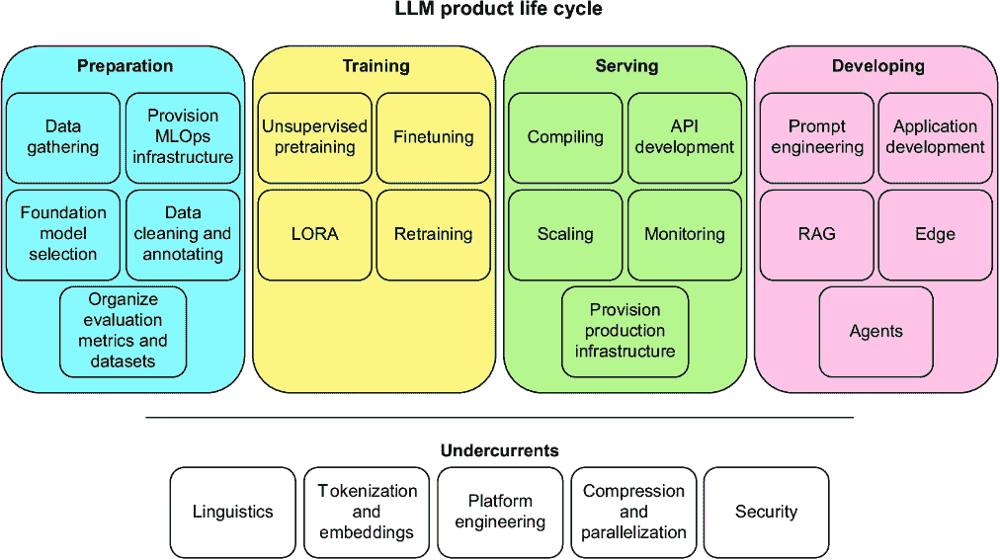
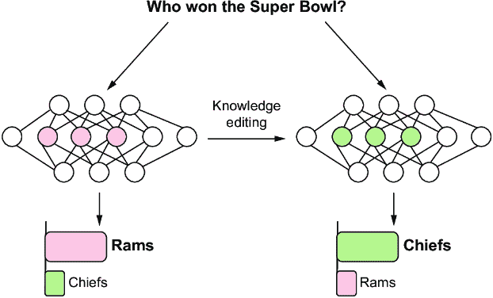

# 第十二章：生产，一个不断变化的景观：一切才刚刚开始

### 本章涵盖

+   LLM 在生产中的简要概述

+   LLMs 作为一项技术和对其进行的几个令人兴奋的研究领域

+   我们的结束语

> 正如我所设想的网络，我们还没有看到它。未来仍然比过去大得多。——蒂姆·伯纳斯-李（www 的发明者）

哇！在这本书中，我们确实覆盖了大量的内容。你的头脑是不是快要爆炸了？因为我们的确实是这样，我们写了这本书。写这本书并不容易，因为行业一直在不断变化——而且变化很快。试图跟上 LLMs 的发展就像在流沙上建造房屋；你完成了一层，似乎在你开始下一层之前它就已经沉下去了。我们知道这本书的部分内容不可避免地会过时，这就是为什么我们尽力坚持核心概念，这些概念就像沙子中的坚固岩石，永远不会改变。

在本章中，我们想退后一步，回顾一些我们希望你能带走的主要收获。我们花了很多时间深入细节，所以让我们暂时反思一下，看看整个画面，回顾我们已经覆盖的内容。之后，我们将花一点时间讨论该领域的未来，以及我们可以期待看到的一些下一个重大突破。最后，我们将留下我们的最终想法。

## 12.1 千米视角

在这本书中，我们讨论了大量的内容——从制作词袋模型到在树莓派上部署 LLM API。如果你读完了整本书，那是一项成就。干得好！我们不会回顾所有内容，但我们都想从树木中看到森林，总结一下我们所学到的很多东西。我们可以将大多数想法分为四个截然不同但非常紧密相关的象限：准备、训练、部署和开发。你可以在图 12.1 中看到这些象限。你会注意到，除了这些部分，还有一个与其他部分不同的第五个部分，我们将其标记为潜流。这些是似乎以不同程度影响所有其他象限的元素，以及你在 LLM 产品生命周期的每个阶段都必须关注的事情。



##### 图 12.1 LLM 产品生命周期。这里列出了书中讨论的所有关键概念，以及它们通常在生产环境中的位置。潜流是生命周期中每个部分的重要元素——例如，语言学在准备阶段提供信息，在训练和部署阶段创建指标，并影响提示和开发。

希望当我们之前在章节中讨论一个概念时，如果还没有讲清楚，现在应该很清楚这个概念在生产生命周期中的位置。你会注意到，我们可能将一些元素放在了你的当前生产环境并不反映的位置——例如，MLOps 基础设施的配置通常并不发生在准备阶段，而是在第一次需要提供服务时随意拼凑。我们理解这一点。但在准备阶段，我们觉得它*应该*在那里。花点时间消化你在阅读这本书时所学到的所有内容，并考虑所有这些部分是如何结合在一起的。

在这个抽象和理想化的生产生命周期版本中，让我们转向目前尚未包括其中的事物。五年后，我们可能需要在我们的开发部分添加什么，特别是在考虑到这个领域现在发展如此迅速的情况下？

## 12.2 LLMs 的未来

当我们撰写这本书时，我们有意专注于你需要的基础知识，以便理解 LLMs 是如何工作的以及如何将它们部署到生产环境中。这些信息至关重要，因为每个用例的生产情况都大不相同。学习如何权衡任何决策的利弊，需要这些基础知识，这样你才有可能做出正确的选择。

与此决定相邻，我们不希望这本书只包含理论。我们希望它是实践性的，有足够的例子，让你作为读者不仅知道事物是如何工作的，而且能感受到它们的感觉——比如感受将一个 70B 模型加载到 GPU 上需要多长时间，如果你在边缘设备上运行该模型，你能感受到用户将会有怎样的体验，以及当你躲在黑暗的山洞里埋头于代码、避开春日温暖的阳光时，你能感受到电脑屏幕柔和的光芒。

在撰写这本书的过程中，我们做出的最艰难的决定之一就是决定专注于当下。我们决定关注那些我们实际上看到人们在今天的生产环境中使用的最佳方法。这个决定之所以艰难，是因为在撰写这本书的过程中，我们遇到了许多令人震惊的研究论文，我们确信这些论文将“改变一切”。然而，由于种种原因，这些研究尚未进入生产阶段。在本节中，我们将打破这一限制，无论行业当前状态如何，都将讨论即将到来的趋势。但不仅仅是研究；公众舆论、诉讼和政治格局也常常塑造着技术的未来。我们将探讨在接下来的几年里，我们认为 LLMs 将走向何方，并提及它们可能采取的一些方向。

### 12.2.1 政府和监管

在本书的开头，我们承诺向您展示如何创建 LLM 产品，而不仅仅是演示。虽然我们相信我们已经做到了这一点，但我们一直忽略了一个重要细节：产品存在于现实世界中。演示只需要在孤立的环境中工作，而产品必须在一般情况下工作。产品是为了出售的，一旦货币交换发生，就会设定期望，声誉就会受到考验，最终，政府将介入。

虽然一个团队不能为可能永远不会到来的未来法规而建造，但了解您构建的产品可能产生的法律后果是很重要的。一场败诉的案件可以设定先例，引发模仿诉讼的浪潮。由于产品存在于现实世界中，我们最好关注那个世界。

我们中的一员有机会参与犹他州 SB-149 人工智能修正法案的立法过程。该法案主要关注引入对使用 LLM 规避州内消费者保护法律的行动者的责任。目前，每个立法机构都在试图弄清楚其在 AI 方面的管辖权从何开始到何结束，以及如何处理其对保护其选民中的公民和公司所承担的日益增加的责任。在犹他州，州政府对 AI 和 LLM 采取了非常严肃和以商业为先的方法。在整个过程中以及法案本身，立法机构不能创建不与“看哪，一个人”第欧根尼风格的例子相冲突的定义，我们将需要每一份善意来导航 LLM 为监管机构带来的新世界。你如何定义 AI？法案如下定义：

> “人工智能”是指一种基于机器的系统，它做出预测、推荐或决策，影响真实或虚拟环境。

这可能包括分段函数到 LLM 代理的任何东西，这意味着您的营销团队不会对您的`if`语句是处于状态中的 AI 的声明负责。话虽如此，该法案包含了对供应商欺诈行为的详尽和深思熟虑的定义，以及制定了一个 AI 分析和研究计划，以帮助州政府从更长期的角度评估风险和政策，这看起来对犹他州来说是新颖且独特的。犹他州立法机构通过与州内的研究人员、专家、C 级高管和企业家进行咨询，能够完善这项法案，我们鼓励读者参与在您所在的社区和政府中制定有价值且有意义的法规。这是确保法院系统长期准备好在应受惩罚的地方实施惩罚的唯一方式。

#### 版权

在法律担忧的前沿是版权侵权问题。在足够的数据上训练的 LLM 可以模仿或复制作者或创作者的风格，甚至直接一字不漏地剽窃。当考虑到构建自己的枪手以帮助你在创作过程中时，这很令人兴奋，但当你意识到竞争对手也能这样做时，这就不那么令人兴奋了。

可能需要关注的最大诉讼是《纽约时报》诉 OpenAI。¹《纽约时报》正在对 OpenAI 提起法律诉讼，称其聊天机器人未经同意就在《时报》的知识产权上进行了训练。它提供了证据，表明聊天机器人给出的逐字逐句的回应与用户通常需要付费才能看到的专有信息相同。因此，人们担心用户访问其网站的人数会减少，从而减少广告收入。本质上，他们窃取了他们的数据，现在正在信息空间中作为竞争对手使用。

对抗这场斗争的旁观者担心，如果《时报》胜诉，可能会严重阻碍 AI 的发展，导致美国在全球 AI 发展竞赛中的领先地位受损。AI 公司面临更大的版权责任风险，从而带来更大的竞争损失，这意味着更少的创新。相反，他们也担心，如果《时报》败诉，将进一步削弱已经陷入困境的新闻业，在那里，找到可以信赖的高质量报道已经很困难了。这对 AI 发展也是一个巨大的打击，AI 发展总是渴望得到好的干净数据。这似乎是 AI 领域的一个双输局面。

无论谁胜谁负，诉讼的结果都很明显，现行的版权法从未考虑过机器人最终会复制我们。我们需要新的法律，而且不清楚我们的立法者是否具备足够的技术能力来应对这一挑战。因此，我们再次鼓励你参与你所在社区内法规的制定过程。

#### AI 检测

一个持续让我们心碎的担忧领域来自于“AI 检测”产品的兴起。让我们一开始就明确：这些产品都是骗人的。没有可靠的方法来确定一段文本是由人类还是机器人所写。到这本书的这一部分，我们期望大多数读者也已经得出了这个结论。原因很简单：如果我们能够可靠地确定哪些是哪些不是生成文本，我们就可以创建一个新的模型来击败检测器。这正是对抗性机器学习的全部意义。

在网上有一个流行的玩笑，任何包含“深入挖掘”这个词的阅读内容都必须是由 LLM 撰写的（例如，[`mng.bz/o0nr`](https://mng.bz/o0nr)）。这个词*深入挖掘*在生成文本中比在人类语言中更可能出现，但这提出了明显的问题：哪个模型？哪个提示？人类自大的想法，认为仅通过寻找特定的单词就能识别生成内容，是可笑的。但当然，如果人们盲目地相信这种明显的错误，那么他们愿意相信一个更复杂或更先进的系统或算法能够做得更好，也就不足为奇了。

尽管如此，这让我们心碎的原因是因为我们读过一篇又一篇关于学生受到惩罚、论文被给予不及格分数、被迫退课以及在成绩单上被标记剽窃的故事。现在，我们不知道每个案例的细节，但作为相关技术的专家，我们更倾向于相信学生而非其他。

将被“AI 检测”系统标记为有高概率由 AI 撰写的论文与剽窃归为同一类别也是荒谬的。现在，我们并不支持作弊，但大型语言模型（LLMs）是一种新工具。它们帮助我们处理语言，就像计算器帮助我们处理数学一样。我们已经找到了在不创建“计算器检测”系统的情况下教授和评估学生进步的方法。我们也可以再次做到这一点。

好吧，识别生成内容并不是不可能的。一项调查发现，通过简单地搜索“作为人工智能语言模型”或“截至我最后一次知识更新”等短语，他们发现了数百篇在科学期刊上发表的、在 LLMs 帮助下撰写的论文。² 一些短语是明显的迹象，但这些只是由于作者们的纯粹懒惰而被识别。

所有这些中最糟糕的部分是，由于这些检测系统是虚假的、糟糕的，并且充满了误报，它们似乎是由教师任意和随机地执行的。很难相信大多数论文没有被标记，那么为什么只有一小部分学生被点名批评呢？这是因为这些系统似乎已经变成了教师手中的权力和歧视武器，他们会利用这些系统来惩罚他们不喜欢的学生——更不用说这种明显的虚伪，因为我们猜测这些教师中的一些人可能就是那些在论文中使用“作为人工智能语言模型”等短语的人。

#### 偏见与伦理

这不是我们第一次讨论 LLMs（大型语言模型）中发现的偏见和伦理问题，但这次，让我们更深入地探讨这次讨论应得的讨论。假设一个人被绑在轨道上，你什么也没做，电车撞上了他们，结束了他们的生命。你是否有责任？这个被称为“电车问题”的思想实验已经被讨论得淋漓尽致；甚至有一个基于已发表论文的电子游戏（Read Graves 的 Trolley Problem Inc.），提出了数十种变化。我们甚至不会尝试回答这个问题，但我们会简要介绍一下你如何自己决定答案。

分析这种问题的方法远不止两种，但我们只会关注其中两种——道德和伦理——并且我们会简化这些概念，因为这不是一本哲学书。在这里，道德帮助你根据对好/不好的信念来判断过错。伦理帮助我们确定在我们所生活的社会中的法律体系内的实际框架中的后果。如果你对轨道上的人的死亡负有道德责任，你相信这是你最终的责任，你的行为是导致他们死亡的原因。这与伦理责任不同，这意味着你因该行为应受到法律和社会的后果。他们可以同意，但不必如此。改变语境可以帮助阐明区别：如果你告诉某人一把刀不锋利，他们在检查时切到了自己，从道德上讲，他们陷入那种情况可能是你的责任，但从伦理上讲，你会避免被控企图谋杀。

算法创造了数千种这样的情况，在这些情况下，我们的道德和伦理可能并不一致。在塔木德中有一个关于道德和伦理责任的古老例子，它决定如果一个人把另一个人推入水中或火中，而被推的人未能逃脱，那么这个人不是杀人犯。³ 根据你的信仰和你在的法律体系下，Meta 在缅甸的种族灭绝（不是开玩笑⁴）中可能是道德上或伦理上有过错的。在那种情况下，Meta 甚至没有把人推入火中；是他们的算法做的。这显然是一个充满争议和残酷的例子，但 LLMs 创造了一个非常真实的情况，其中机器学习从业者需要实际、一致和可辩护的道德和伦理框架，否则他们可能会在他们监管下发生真正的悲剧。显然，我们不是道德的仲裁者，也不会评判你在那里的位置，但你仍然应该考虑你创建的任何系统的更广泛背景。

#### 法律正在到来

我们可以肯定的一件事是，监管将会到来，公司将对它们的 AI 代理的行为负责。加拿大航空通过法院判决得知这一点，法院裁定该公司必须遵守其聊天机器人完全编造的退款政策([`mng.bz/pxvG`](https://mng.bz/pxvG))。该机器人提供了错误的信息。它确实将客户链接到了正确的退款政策；然而，法院正确地质疑了“为什么客户需要在网站的另一部分找到的信息在网站的其他部分再次进行双重检查。”

我们已经看到过类似的案例，用户通过提示工程技巧欺骗了雪佛兰的 LLM 聊天机器人，以 1 美元的价格出售了一辆 2024 年的塔霍车型([`mng.bz/XVmG`](https://mng.bz/XVmG))，DPD 在一位客户让它承认自己是世界上最差的快递公司后，不得不“关闭其 AI 元素”。⁵正如我们之前所说，即使有现有的立法，也很难判断 LLM 在道德上可以做什么。当然，这也引发了一个问题：如果聊天机器人获得了销售汽车的许可并完成了这样的交易，客户的恶意互动是否真的重要，或者公司是否仍然在道德上对维护这样的交易负有责任。

对 LLM 生成的内容负责足以让你三思而后行，考虑你可能考虑使用它的许多应用。风险越高，你应该花更多的时间暂停并考虑潜在的法律后果。我们强烈建议调整你的提示工程系统，设置护栏以保持你的代理在任务上，并且绝对确保保存你的日志并保留客户聊天记录。

### 12.2.2 LLMs 正在变得更大

另一件我们可以确定的事情是，在不久的将来，我们还将继续看到模型变得越来越庞大。由于更大的模型持续表现出涌现行为，公司没有理由停止采取这种方法，因为简单地投入资金似乎能带来更多的收益。更不用说，对于投入最多的公司来说，更大的模型更难复制。正如你可能发现的，小型公司竞争的最佳方式是创建更小、更专业的模型。最终，只要我们有足够大的训练数据集来容纳更多的参数，我们就可以期待看到更多的参数被塞入模型中，但关于我们是否曾经有过足够的数据来证明“通用智能”（如 AGI）的问题，仍然像以往一样模糊不清。

#### 更大的上下文窗口

不仅是大模型。我们非常兴奋地看到上下文长度也在增长。当我们开始编写这本书时，这是一个真正的限制。很少看到上下文长度超过 10K 令牌的模型。当时 ChatGPT 只提供最多 4,096 个令牌的长度。一年后，我们看到 Gemini 1.5 Pro 这样的模型提供了最多 1 百万个令牌的上下文长度，研究人员指出，它在测试案例中可以处理多达 1 千万个令牌([`mng.bz/YV4N`](https://mng.bz/YV4N))。为了更直观地说明，整个七部《哈利·波特》系列共有 1,084,170 个单词（我没有数过；[`wordsrated.com/harry-potter-stats/`](https://wordsrated.com/harry-potter-stats/))，根据你的分词器，这大约相当于 1.5 百万个令牌。在这些长度下，很难相信有任何限制。

显然，挑战仍然存在。这些具有近乎无限上下文窗口的更大模型通常按令牌收费。如果模型不强迫用户发送更小的查询，那么用户的钱包就会受到影响。更不用说，如果你正在阅读这本书，你很可能对可以自己部署的小型开源模型更感兴趣，而这些模型中许多确实仍然有必须与之合作的限制性上下文大小。不过，不用担心；现在和将来，即使是更小的模型也将拥有百万级别的上下文窗口。这个领域正在进行许多有趣的研究。如果你感兴趣，我们建议你查看 RoPE⁶、YaRN⁷和 Hyena⁸。

#### 下一个注意力

当然，更大的上下文窗口是很好的，但它们也有代价。记住，在大型语言模型（LLM）的中心是注意力算法，其复杂度是二次的——这意味着我们投入的数据越多，我们就需要投入更多的计算资源。推动研究社区的一个挑战是找到下一个不遭受这种相同问题的注意力算法。我们能否构建一个仅具有线性复杂度的新算法的 transformers？这正是现在的十亿美元问题。

在这个领域有许多竞争性的创新，我们甚至没有时间讨论我们所有绝对最喜欢的。其中两个最喜欢的分别是 MAMBA，作为 transformers 的替代品，以及 KAN，作为多层感知器（MLPs）的替代品。特别是 MAMBA，它是对状态空间模型（SSMs）的改进，并将其融入了一个无注意力的神经网络架构中。⁹ 单独来看，它并不那么令人印象深刻，因为它需要大量的硬件黑客技术才能使其具有一定的性能。然而，后来出现了 JAMBA，这是一个 MAMBA 风格的模型，它使用了混合 SSM-transformer 层和联合注意力。¹⁰ 这种混合方法似乎为我们提供了两者的最佳结合。

为了让您亲身体验，在列表 12.1 中，我们将对 JAMBA 模型进行微调和运行推理。这个模型是一个专家混合模型，拥有 520 亿个参数，其实现将允许在 80GB GPU 上实现 14 万 K 的上下文长度，这比仅使用注意力模型要好得多。这个例子直接改编自 Hugging Face 模型卡片，所以与所有其他简单的 transformer 实现相比，语法应该非常熟悉，我们对尝试新事物如此容易感到非常感激。

对于训练部分，遗憾的是，即使在半精度下，模型也太大，无法适应单个 80GB GPU，因此您必须使用 Accelerate 在多个 GPU 之间并行化以完成训练。如果您没有现成的计算资源，您可以完成到分词器的导入，然后跳过训练部分，改动非常小。我们并没有做什么特别的事情；我们将用于训练的数据集只是一些从 Goodreads 检索的著名作者的英文名言，包括名言、作者和标签，所以如果您决定跳过微调，请不要觉得自己错过了什么。我们将首先加载分词器、模型和数据集。

##### 列表 12.1 JAMBA 的微调和推理

```py
from trl import SFTTrainer
from peft import LoraConfig
from transformers import (
    AutoTokenizer,
    AutoModelForCausalLM,
    TrainingArguments,
)
from transformers import BitsAndBytesConfig
import torch
from datasets import load_dataset

tokenizer = AutoTokenizer.from_pretrained("ai21labs/Jamba-v0.1")
model = AutoModelForCausalLM.from_pretrained(
    "ai21labs/Jamba-v0.1", device_map="auto"
)

dataset = load_dataset("Abirate/english_quotes", split="train")
```

一旦所有这些都在内存中（如果您的硬件有限，您可以流式传输数据集），我们将创建训练参数和一个 LoRA 配置，以帮助微调在更小的硬件上工作：

```py
training_args = TrainingArguments(
    output_dir="./results",
    num_train_epochs=3,
    per_device_train_batch_size=4,
    logging_dir="./logs",
    logging_steps=10,
    learning_rate=2e-3,
)
lora_config = LoraConfig(
    r=8,
    target_modules=["embed_tokens", "x_proj", "in_proj", "out_proj"],
    task_type="CAUSAL_LM",
    bias="none",
)
```

现在，到了高潮部分，类似于 sklearn 的`model.fit()`，transformers 的`trainer.train()`已经成为一个标志，表明任何人都可以学习如何与最先进的机器学习模型交互。一旦训练完成（对我们来说大约需要不到一个小时），我们将保存分词器和模型的本地版本，并删除内存中的模型：

```py
trainer = SFTTrainer(
    model=model,
    tokenizer=tokenizer,
    args=training_args,
    peft_config=lora_config,
    train_dataset=dataset,
    dataset_text_field="quote",
)

trainer.train()

tokenizer.save_pretrained("./JAMBA/")
model.save_pretrained("./JAMBA/")

del model
```

接下来，我们将以内存高效的方式重新加载模型，用于推理。在 80GB GPU 上，使用 BitsandBytes 配置以 8 位加载，您现在可以在单个 GPU 上拟合模型和大量数据。以 4 位加载允许在 A100 或两个 3090 上实现，类似于 70B 参数的 transformer。使用量化将其降低到 1 位模型，您可以在单个 3090 上拟合这个模型和大量数据。我们将使用以下 8 位推理实现并在其上运行推理：

```py
quantization_config = BitsAndBytesConfig(
    load_in_8bit=True, llm_int8_skip_modules=["mamba"]
)
model = AutoModelForCausalLM.from_pretrained(
    "ai21labs/Jamba-v0.1",
    torch_dtype=torch.bfloat16,
    attn_implementation="flash_attention_2",
    quantization_config=quantization_config,
)
input_ids = tokenizer(
    "In the recent Super Bowl LVIII,", return_tensors="pt"
).to(model.device)["input_ids"]

outputs = model.generate(input_ids, max_new_tokens=216)

print(tokenizer.batch_decode(outputs))
```

到目前为止，我们几乎每个月都会被 LLM 系统各个部分的替代方案所震撼。在这里，我们想将您的注意力引回到 LLM 获得重大突破的地方：“注意力即一切”。¹¹那篇论文表明，你可以使用简单的 MLP 获得惊人的结果，仅使用注意力来弥合差距。我们正进入一个新纪元，我们不再只关注我们需要什么，而是关注为了获得最佳结果我们想要什么。例如，我们想要低于二次方的注意力替代方案，以匹配或超越闪速注意力在速度上的表现。我们想要无注意力的 transformer 和数百万长度的上下文长度，没有“中间丢失”的问题。我们想要没有精度或学习速度下降的密集 MLP 的替代方案。我们正逐步获得所有这些以及更多。

#### 推进压缩的边界

在降至 INT4 之后，有实验性的量化策略可以将模型进一步降至 INT2。INT2 70B 模型仍然表现良好，这让许多人感到惊讶。然后有研究表明，我们可能甚至可以进一步减小到每个权重 1.58 位或使用三进制和其他更小的算子达到 0.68 位。想试试吗？Llama3 70B 已经在 GGUF、GPTQ 和 AWQ 格式中实现了 1 位量化，它只占用 16.6 GB 的内存。尽情尝试吧！

这还有另一个维度，它不涉及压缩模型，而是将模型是一个整体的想法与将模型视为层和参数集合的想法解耦。推测性解码为我们提供了快速访问大型模型的另一种方式。推测性解码不仅需要足够的内存来加载一个大型模型，还需要一个与之并行的较小模型——想想蒸馏模型。目前生产中常用的一个例子是 Whisper-Large-v3 和 Distil-Whisper-Large-V3。Whisper 是一个多模态 LLM，专注于语音到文本问题，但推测性解码可以与任何具有相同架构但大小不同的两个模型一起工作。

这种方法使我们能够更快地（有时是直接的 2 倍速度提升）采样更大的模型，通过并行计算多个标记，并通过一个允许我们同时完成一个步骤并验证该步骤是简单还是困难的近似“助手”模型。基本思路是这样的：使用更小、更快的 Distil-Whisper 模型来生成关于最终结果的猜测，并允许 Whisper 并行评估这些猜测，忽略那些它将执行相同操作的情况，并纠正那些它将改变的情况。这允许我们以较小模型的速度和较大模型的准确性。

在列表 12.2 中，我们展示了在英语音频数据集上进行的推测性解码。我们将加载 Whisper 和 Distil-Whisper，加载数据集，然后向生成关键字参数（`generate_kwargs`）添加一个 `assistant_model`。您可能会问，这个系统如何知道辅助模型只意味着帮助解码，正如其名称所暗示的那样？嗯，我们用 `AutoModelForCausalLM` 而不是语音序列到序列版本加载辅助模型。这样，模型将只帮助并行于较大模型的大解码步骤。完成这些后，我们可以自由测试。

##### 列表 12.2 使用 Whisper 的推测性解码

```py
from transformers import (
    AutoModelForCausalLM,
    AutoModelForSpeechSeq2Seq,
    AutoProcessor,
)
import torch
from datasets import load_dataset

from time import perf_counter
from tqdm import tqdm

from evaluate import load

device = "cuda:0" if torch.cuda.is_available() else "cpu"
print(f"Device: {device}")
attention = "sdpa"
torch_dtype = torch.float16 if torch.cuda.is_available() else torch.float32

model_id = "openai/whisper-large-v3"
assistant_model_id = "distil-whisper/distil-large-v3"
model = AutoModelForSpeechSeq2Seq.from_pretrained(
    model_id,
    low_cpu_mem_usage=False,
    use_safetensors=True,
    attn_implementation=attention,
    torch_dtype=torch_dtype,
).to(device)
processor = AutoProcessor.from_pretrained(model_id)
assistant_model = AutoModelForCausalLM.from_pretrained(
    assistant_model_id,
    low_cpu_mem_usage=False,
    use_safetensors=True,
    attn_implementation=attention,
    torch_dtype=torch_dtype,
).to(device)

dataset = load_dataset(
    "hf-internal-testing/librispeech_asr_dummy",
    "clean",
    split="validation",
    trust_remote_code=True,
)
wer = load("wer")

generate_kwargs_1 = {
    "language": "en",
    "task": "transcribe",
}
generate_kwargs_2 = {
    "language": "en",
    "task": "transcribe",
    "assistant_model": assistant_model,
}

spec_decoding = False
for i, generate_kwargs in enumerate([generate_kwargs_1, generate_kwargs_2]):
    all_time = 0
    predictions = []
    references = []
    for sample in tqdm(dataset):
        audio = sample["audio"]
        inputs = processor(
            audio["array"],
            sampling_rate=audio["sampling_rate"],
            return_tensors="pt",
        )
        inputs = inputs.to(device=device, dtype=torch_dtype)
        start_time = perf_counter()
        output = model.generate(
            **inputs,
            **generate_kwargs,
        )
        gen_time = perf_counter() - start_time
        all_time += gen_time
        predictions.append(
            processor.batch_decode(
                output, skip_special_tokens=True, normalize=True
            )[0]
        )
        references.append(processor.tokenizer.normalize(sample["text"]))
    score = wer.compute(predictions=predictions, references=references)
    if i > 0:
        spec_decoding = True
    print(f"Speculative Decoding: {spec_decoding}")
    print(f"Time: {all_time}")
    print(f"Word Error Rate: {score}")
```

在我们的测试中，我们观察到 Whisper-Large-V3 在使用缩放点积注意力机制的情况下，处理完所有 73 个示例大约需要 42 秒。使用推测性解码后，时间降至 18.7 秒，但精确的词错误率（WER）保持不变。因此，速度提高了近 2 倍，而准确性没有丝毫下降。是的，相当疯狂。

在这一点上，我们想知道，“为什么每个人不总是用这个来做所有事情？”这种方法的一些缺点如下：首先，它在较短的序列中效果最好。对于 LLM 来说，这低于 128 个生成标记或大约 20 秒的音频处理。对于更长的生成，速度提升将微不足道。除此之外，我们并不总是能够访问到完美兼容的大模型和小模型对，比如 BERT 与 DistilBERT。最后一个原因是，真正了解它的人非常少，尽管它的实现很简单。

最终，无论是子比特量化、推测性解码还是其他进步，LLM 们比任何其他技术都更推动研究进入压缩方法，观察新技术如何改变格局是非常有趣的。随着这些方法的发展，我们可以将模型推向更小、更便宜的硬件，使该领域更加易于接触。

### 12.2.3 多模态空间

我们对多模态的潜力感到非常兴奋。回到第二章，多模态是我们尚未看到许多解决方案出现的主要语言特征之一，我们正在看到向尝试解决语音学的转变。然而，人类操作的模式不仅仅是音频。因此，将语音学、语义学和语用学结合起来，在同一个嵌入空间（用于比较）中获得尽可能多的上下文（对于比较）的推动力非常强烈。考虑到这一点，以下是一些值得关注的领域点。

我们首先想引起注意的是 ImageBind 项目，该项目展示了我们不必试图将模型限制在摄入每种类型的数据，相反，我们可以将每种类型的数据压缩到一个模型已经熟悉并能处理的嵌入空间中。您可以在官方演示中查看：[`imagebind.metademolab.com/`](https://imagebind.metademolab.com/)。

ImageBind 建立在多模态投影模型（如 CLIP）已经展示了一段时间的能力之上：创建和处理嵌入的能力是确定性 LLM 系统背后的真正力量。您可以使用这些模型进行非常快速地搜索，包括之前几乎不可能完成的搜索，例如要求找到与上传音频剪辑声音相似的动物图片。

OneLLM 将这种逻辑颠倒过来，使用一个模型和一个多模态编码器来统一和嵌入八个模态，而不是 ImageBind 示例中使用的六个不同编码器来在相同维度中嵌入六个模态。它可以在以下链接找到：[`onellm.csuhan.com/`](https://onellm.csuhan.com/)。OneLLM 的核心思想是使用语言来对齐统一的编码器，这为多模态提供了一种独特的视角，它关注的是编码过程而不是结果。

我们对这个领域的研究感到非常兴奋。这项研究能够帮助弥合模型生态系统中语音学和语用学之间的差距，并允许实现更类似人类的理解和交互，尤其是在搜索领域。

### 12.2.4 数据集

由于 LLMs 的引入，我们在这个行业内看到的一个令人兴奋的变化是，公司终于开始理解管理和治理他们数据的重要性。对于一些人来说，这是推动他们微调自己的 LLMs 并加入激动人心的 AI 产品交付竞赛的动力。对于另一些人来说，这是担心自己变得过时，因为这些系统的能力远远超过了以前的技术；他们发现，只有他们的数据才能提供任何类型的护城河或保护竞争。而对于所有人来说，他们担心会犯他们看到其他公司犯过的同样的错误。

LLMs 不仅仅是推动因素；它们还在帮助团队标注、标记、组织和清理数据。许多公司堆积了大量的数据，却不知道如何处理，但有了 CLIP 等 LLM 模型，图像字幕变得轻而易举。一些公司发现，仅仅创建他们的文本、图像、音频和视频的嵌入空间，就使他们能够为之前无结构的数据集创建有意义的结构。结构化数据更容易操作，为搜索、推荐和其他洞察打开了大门。

目前在行业中我们看到的一个缺失的方面是有价值的开源数据集，尤其是在评估方面。许多目前用于评估模型的基准测试依赖于多项选择题，但这对于试图创建一个 LLM 应用的人来说效率低下。在现实世界中，你的用户何时会以多项选择题的形式向你的模型提问？几乎永远不会。人们在对话和寻求帮助时提出开放式问题，因为他们自己也不知道答案。然而，这些评估数据集已经成为基准，仅仅是因为它们对研究人员来说很容易收集、汇编和评估准确性。

此外，我们相信另一个不可避免的需求是更多语言表示。世界是一个由多种语言和方言构成的织物，每种语言都承载着其独特的文化细微差别和交流微妙之处。然而，许多语言在现有数据集中代表性不足，导致模型偏向于更占主导地位的语言。随着技术的日益全球化，包括更广泛的语言至关重要。添加多种语言不仅促进了包容性，还增强了语言模型在不同国际环境中的准确性和适用性，弥合沟通差距，促进一个更加紧密相连的世界。想象一下，如果你的初创公司不需要支付任何人就能获得有关进入中国、俄罗斯或沙特阿拉伯以扩大市场的准确信息。

### 12.2.5 解决幻觉问题

有大量证据表明，LLM 中包含的信息比它们愿意给出的要多，甚至有更多证据表明，人们在提示时通常要么很糟糕，要么恶意。因此，你会发现，幻觉是试图开发一个始终如一地提供结果的应用的最大的障碍之一。这个问题让许多习惯于确定性计算机算法且很少处理非确定性系统的软件工程团队感到沮丧。对于许多更熟悉这些类型系统的统计学家来说，幻觉被视为一个特性，而不是一个错误。无论你站在哪一方，都有大量研究投入到处理幻觉的最佳方法中，这是你应该关注的领域之一。

#### 更好的提示工程

一个有趣且随着时间的推移显示出巨大改进的领域是提示工程。一个有助于减少幻觉的提示工程工具是 DSPy。我们在第七章中简要介绍了它，但在这里我们将给出一个如何工作的例子，以及为什么它可以是解决你 LLMs 中幻觉的有帮助的一步。我们在整本书中多次讨论了 LLMs 在数学方面特别糟糕的事实，甚至简单的数学，我们也讨论了原因，但我们并没有真正讨论除了改进你的分词之外的其他解决方案。所以，在列表 12.3 中，我们将展示如何通过零分词更改、零微调和没有 LoRAs 或 DoRAs，仅仅优化你的提示来告诉模型如何回答你提出的问题。

我们将使用 dspy-ai Python 包和 Llama3-8B-Instruct 来完成这项工作。我们将首先加载和量化模型，以便在大多数 GPU 和 Grade-School Math 8K 数据集上运行。我们选择这个数据集是因为它是一个数学问题集合，作为一个已经从小学毕业的人，你可能甚至不需要计算器就能解决这些问题。我们将为我们的训练集和测试集（开发集）使用 200 个示例，尽管我们建议你尝试这些数字，以找到最适合你用例的最佳比例，避免数据泄露。

##### 列表 12.3 DSPy for math

```py
from transformers import AutoModelForCausalLM, AutoTokenizer
from transformers import BitsAndBytesConfig
import torch
import dspy
from dspy.datasets.gsm8k import GSM8K, gsm8k_metric
from dsp.modules.lm import LM
from dspy.evaluate import Evaluate
from dspy.teleprompt import BootstrapFewShot

model_name = "meta-llama/Meta-Llama-3-8B-Instruct"
quantization_config = BitsAndBytesConfig(
    load_in_4bit=True,
    bnb_4bit_use_double_quant=True,
    bnb_4bit_quant_type="nf4",
    bnb_4bit_compute_dtype=torch.bfloat16,
)

model = AutoModelForCausalLM.from_pretrained(
    model_name, 
    device_map="auto", 
    quantization_config=quantization_config,
    attn_implementation="sdpa",
)
tokenizer = AutoTokenizer.from_pretrained(model_name, use_fast=True,)

gms8k = GSM8K()
gsm8k_trainset, gsm8k_devset = gms8k.train[:30], gms8k.dev[:100]
```

现在我们已经准备好了导入和加载，我们需要解决的事实是我们使用 transformers 加载了 Llama3，而不是 DSPy。DSPy 期望与使用 OpenAI API 的模型交互，但我们从 Hugging Face 加载了一个本地模型，DSPy 最近为其包添加了 HFModel，现在可以轻松导入，而不是需要定义包装器。首先，我们创建一个简单的函数来映射 API 之间的任何关键字参数差异，比如`max_tokens`与`max_new_tokens`，然后我们创建一个类，它将作为我们的模型生成答案和优化提示的包装器。一旦准备好了，我们将加载 DSPy：

```py
def openai_to_hf(**kwargs):
    hf_kwargs = {}
    for k, v in kwargs.items():
        if k == "n":
            hf_kwargs["num_return_sequences"] = v
        elif k == "frequency_penalty":
            hf_kwargs["repetition_penalty"] = 1.0 - v
        elif k == "presence_penalty":
            hf_kwargs["diversity_penalty"] = v
        elif k == "max_tokens":
            hf_kwargs["max_new_tokens"] = v
        elif k == "model":
            pass
        else:
            hf_kwargs[k] = v

    return hf_kwargs

class HFModel(LM):
    def __init__(
        self,
        model: AutoModelForCausalLM,
        tokenizer: AutoTokenizer,
        **kwargs
    ):
        """wrapper for Hugging Face models
        Args:
            model (AutoModelForCausalLM): HF model identifier to load and use
            tokenizer: AutoTokenizer
        """
        super().__init__(model)
        self.model = model
        self.tokenizer = tokenizer
        self.drop_prompt_from_output = True
        self.history = []
        self.is_client = False
        self.device = model.device
        self.kwargs = {
            "temperature": 0.3,
            "max_new_tokens": 300,
        }

    def basic_request(self, prompt, **kwargs):
        raw_kwargs = kwargs
        kwargs = {**self.kwargs, **kwargs}
        response = self._generate(prompt, **kwargs)

        history = {
            "prompt": prompt,
            "response": response,
            "kwargs": kwargs,
            "raw_kwargs": raw_kwargs,
        }
        self.history.append(history)

        return response

    def _generate(self, prompt, **kwargs):
        kwargs = {**openai_to_hf(**self.kwargs), **openai_to_hf(**kwargs)}
        if isinstance(prompt, dict):
            try:
                prompt = prompt["messages"][0]["content"]
            except (KeyError, IndexError, TypeError):
                print("Failed to extract 'content' from the prompt.")
        inputs = self.tokenizer(prompt, return_tensors="pt").to(self.device)

        outputs = self.model.generate(**inputs, **kwargs)    
        if self.drop_prompt_from_output:
            input_length = inputs.input_ids.shape[1]
            outputs = outputs[:, input_length:]
        completions = [
            {"text": c}
            for c in self.tokenizer.batch_decode(
                outputs, skip_special_tokens=True
            )
        ]
        response = {
            "prompt": prompt,
            "choices": completions,
        }
        return response
    def __call__(
        self, prompt, only_completed=True, return_sorted=False, **kwargs
    ):
        assert only_completed, "for now"
        assert return_sorted is False, "for now"

        if kwargs.get("n", 1) > 1 or kwargs.get("temperature", 0.0) > 0.1:
            kwargs["do_sample"] = True

        response = self.request(prompt, **kwargs)
        return [c["text"] for c in response["choices"]]

print("Model set up!")              #1
llama = HFModel(model, tokenizer)

dspy.settings.configure(lm=llama)     #2
```

#1 Sets up the LM

#2 Sets up ΔSPY to use that LM

现在我们已经准备好使用一个大型语言模型（LLM）来参加我们的数学测试，让我们来测试一下。我们将首先建立一个基线。我们将在`QASignature`类中定义一个简单的思维链（CoT）样式的提示，我们将使用它来定义一个零样本版本，用作基线。这个提示可能非常接近你之前见过的提示，所以希望这将是一个非常相关的任务演示，你可能会在进行的任务。对于评估，我们使用 DSPy 的`gsm8k_metric`，我们在顶部导入以进行评估，但你始终可以创建自己的：

```py
class QASignature(dspy.Signature):         #1
    (
    """You are given a question and answer"""
    """and you must think step by step to answer the question. """
    """Only include the answer as the output."""
    )
    question = dspy.InputField(desc="A math question")
    answer = dspy.OutputField(desc="An answer that is a number")

class ZeroShot(dspy.Module):
    def __init__(self):
    super().__init__()
    self.prog = dspy.Predict(QASignature, max_tokens=1000)

    def forward(self, question):
    return self.prog(question=question)

evaluate = Evaluate(        #2
    devset=gsm8k_devset,
    metric=gsm8k_metric,
    num_threads=4,
    display_progress=True,
    display_table=0,
)

print("Evaluating Zero Shot")      #3
evaluate(ZeroShot())
```

#1 Δefines the QASignature and CoT

#2 Sets up the evaluator, which can be used multiple times

#3 Evaluates how the LLM does with no changes

输出是

```py
29/200 14.5%
```

使用我们简单的零样本 CoT 提示，Llama3 只正确回答了 14.5%的问题。这个结果可能看起来并不理想，但实际上它比仅仅在没有任何提示的情况下运行模型要强得多，后者正确率大约只有 1%到 5%。

在解决了基线问题之后，让我们继续探讨 DSPy 的核心内容，即优化提示以查看它能带我们走到哪里。自从原始论文发表以来，人们对 CoT 提示的看法已经发生了一些变化。在业界，CoT 的含义已经超越了仅仅在提示中添加“逐步思考”这一基本提示工程方法，而允许模型通过少量提示自行获得其最终输出的理由被认为是新的 CoT，这正是 DSPy 框架使用这些术语的方式。有了这个解释，我们将继续使用`dspy.ChainOfThought`函数创建一个`CoT`类，然后像评估我们的`ZeroShot`类一样评估它：

```py
config = dict(max_bootstrapped_demos=2)     #1

class CoT(dspy.Module):
    def __init__(self):
    super().__init__()
    self.prog = dspy.ChainOfThought(QASignature, max_tokens=1000)

    def forward(self, question):
    return self.prog(question=question)

print("Creating Bootstrapped Few Shot Prompt")         #2
teleprompter = BootstrapFewShot(metric=gsm8k_metric, **config)
optimized_cot = teleprompter.compile(
    CoT(), trainset=gsm8k_trainset, valset=gsm8k_devset
)
optimized_cot.save("optimized_llama3_math_cot.json")

print("Evaluating Optimized CoT Prompt")            #3
evaluate(optimized_cot)                  
#149/200 74.5%
```

#1 设置优化器

#2 优化提示

#3 评估我们的“optimized_cot”程序

看看吧！如果仅仅通过改变提示，准确性就从 14.5%跃升至 74.5%，这不会让你感到惊讶——记住我们还没有进行任何微调或训练——我们不知道会发生什么。人们正在猜测提示工程师的时代是否已经结束，但我们认为它才刚刚开始。话虽如此，“提出一个巧妙的字符串而不进行后续跟进”的时代已经结束，而且根本就不应该开始。在这个例子中，我们使用了任意的边界，对数据集的各个部分和数字完全没有思考，并且没有包含任何有助于模型访问以改进的工具或上下文。如果我们这样做，你会发现，在应用了本书中的所有提示工程技巧之后，将模型的能力提升到令人震惊的水平并不困难，即使是在 LLM 通常表现不佳的领域——比如数学。

#### Grounding

如果你正在寻找对抗幻觉的方法，你可能会遇到“grounding”这个术语。Grounding 是指我们在提示中为 LLM 提供必要的上下文。通过提供它所需的信息，我们正在帮助为生成内容提供一个坚实的基础，这样它就很少会凭空想象出幻象。如果这听起来很熟悉，那是因为我们在本书中已经多次使用了一种最常见的 grounding 技术，即 RAG。

术语*RAG*（检索增强生成）在字面上与 grounding 同义，因为我们实际上是根据提示检索适当的上下文，然后使用它来增强 LLM 生成的文本。然而，RAG 已经与使用 VectorDB 进行语义检索的部分同义。技术上，你可以使用任何类型的搜索算法或任何类型的数据库，但如果你告诉业界人士你已设置了一个 RAG 系统，他们会假设前者架构。

通过这个澄清，RAG 应用在回答简单问题方面最为有用。考虑这样一个问题：“Gal Gadot 的丈夫目前做什么工作？”这实际上包含两个问题，“Gal Gadot 的丈夫是谁？”一旦我们知道答案，接下来就是“他做什么？”RAG 单独解决这类多步骤问题相当糟糕，因为相似度向量搜索可能会返回许多关于 Gal Gadot 的文章，但可能没有关于她的丈夫 Jaron Varsano 的文章。

我们可以通过一种我们尚未涉及的重要方式来增强这种方法：使用知识图谱。知识图谱以一种捕捉实体之间关系的结构存储信息。这种结构由代表对象的节点和代表关系的边组成。像 NEO4J 这样的图数据库使得创建和查询知识图谱变得容易。而且，事实证明，知识图谱在回答更复杂的多部分问题方面非常出色，在这些问题中，你需要连接信息片段之间的联系。为什么？因为它们已经为我们连接了这些点。

许多在 RAG 上努力寻求价值但未能成功的团队，一旦从向量数据库过渡到图数据库，就能看到大幅度的改进。但这伴随着两个主要障碍。首先，我们不能再简单地嵌入我们的提示并拉取相似匹配；我们面临着一个更艰巨的任务，那就是想出一个方法，将我们的提示转换为图数据库能够理解的问题。虽然有几个方法可以解决这个问题，但这又是一个 NLP 问题。幸运的是，事实证明，LLM 在这方面非常擅长！其次，可能更大的问题是，将你的文档转换为知识图谱要困难得多。这就是为什么向量数据库变得如此受欢迎——将你的数据转换为嵌入以进行搜索变得容易。将你的数据转换为知识图谱将需要更多的工作和额外的专业知识，但这确实可以为你的未来发展打下坚实的基础。

目前，很少有团队愿意投资额外的数据工程，将他们的数据准备成知识图谱。大多数公司仍在寻找快速的成功，围绕 LLM API 构建简单的包装器。随着行业的成熟，我们相信我们将开始看到组织从他们的专有数据转向构建知识图谱，以从他们的 LLM 应用中获得更好的性能。

#### 知识编辑

另一个有前景的研究领域，用于对抗幻觉，是*知识编辑*。知识编辑是高效调整特定行为的过程。理想情况下，这看起来就像手术，我们精确地进入并改变当我们得到错误响应时激活的确切模型权重，如图 12.2 所示。知识编辑可以用于许多事情，但它通常用于对抗事实退化——随着时间的推移，事实会发生变化，比如谁是当前超级碗的获胜者或任何个别国家的现任总统。我们可以重新训练或微调模型，但这些通常是更重的解决方案，可能会以意想不到的方式改变模型，而我们所想要的只是更新一些事实。



##### 图 12.2 知识编辑是一种技术，本质上是对模型进行手术，以直接插入、更新或删除信息。

知识编辑是一个有趣的研究领域，遗憾的是，我们在这本书中没有足够的空间深入探讨。已经创建了许多算法和技术来实现它，如 ROME、MEND 和 GRACE。对于那些有兴趣使用这些技术中任何一种的人，我们建议首先查看[`github.com/zjunlp/EasyEdit`](https://github.com/zjunlp/EasyEdit)上的 EasyEdit。EasyEdit 是一个实现了最常见知识编辑技术的项目，并提供了一个易于利用它们的框架。它包括示例、教程等，以帮助你开始。

### 12.2.6 新硬件

就像大多数流行的技术一样，大型语言模型（LLMs）已经创造了一个激烈的市场竞争。虽然大多数公司仍在竞争功能和特性，但也有一些明确的动力使它们更快、更便宜。我们已经讨论了许多你可以采用的方法，比如量化编译。我们预计将看到更多围绕硬件的创新。

事实上，OpenAI 的首席执行官 Sam Altman 一直在努力筹集高达 7000 亿美元的基金，用于投资半导体行业。¹² 我们之前已经讨论过全球 GPU 短缺的问题，但没有人像一些最大的玩家那样对此感到烦恼。这笔投资将不仅仅是为了满足需求；它还将加速对像应用特定集成电路（ASICs）这样的更好芯片的开发和研究。

我们在这本书中多次讨论并使用了 GPU，但 GPU 并不是为 AI 设计的；它是为图形设计的。当然，这个事实并没有阻止英伟达短暂地成为世界上最有价值的公司。¹³ ASIC 是为特定任务设计的；一个例子是谷歌的 TPUs 或张量处理单元。专为处理 AI 工作负载设计的 ASIC 是 NPU（神经网络单元），而且可能性很大，你以前从未听说过，或者至少从未见过 NPU 芯片。我们指出这一点是为了表明仍有很大的改进空间，我们很可能会在未来看到从更好的 GPU 到 NPU 以及介于两者之间的大量新加速器。更多信息，请参阅 Cerebras ([`cerebras.ai/product-chip/`](https://cerebras.ai/product-chip/))。

本书的一位作者在英特尔和美光工作了一段时间，负责开发现在已停产的称为 3D XPoint（3DxP）的内存技术。3DxP 的细节对于这次讨论并不重要；它提供的，极快且便宜的内存，才是关键。它以 Optane 品牌销售了几年，甚至赢得了“有史以来最快的 SSD”的美誉。¹⁴ 这种技术证明其速度几乎与 RAM 相当，但生产成本几乎与 NAND 闪存相当，并且可以用来替代任何一种。

想象一个世界，每个处理器都方便地拥有 500 GB 或甚至 1 TB 的内存空间。我们之前讨论的大多数限制都将简单地消失。你可以将整个 GPT-4 大小的 LLM 加载到一个 GPU 上。你不必担心并行化或额外开销带来的利用率问题。我提到过 3DxP 也是非易失性的吗？加载一次模型，就完成了；即使你需要重新启动服务器，也不必重新加载它，这将使自动扩展等任务变得容易得多。

3DxP 是一种已经在市场上证明了自己的技术，它能够胜任，但仍然因为人们认为需求不足而受到影响。消费者不知道如何利用它提供的内存层次结构中的这一新层。就个人而言，随着 LLM 的到来，作者们现在看到了对这种技术的巨大需求。我们只需等待并观察半导体行业是否会决定重新投资。

### 12.2.7 代理将变得有用

最后，我们相信基于 LLM 的代理最终将不仅仅是一个只在演示中起作用的创新。我们看到的许多代理只是魔术般的壮举，或者说应该说是烟雾和镜子，只是在大模型上抛出一些提示工程技巧。它们中的几个甚至能正常工作——即使是在有限的范围内——这也揭示了可能性。

我们已经看到几家公司在追逐圣杯，构建代理来取代软件工程师。实际上，你也会看到他们试图构建代理来取代医生、销售助理或经理。但就像许多公司和 AI 专家曾经承诺我们将在不久的将来拥有自动驾驶汽车一样，那个“不久的将来”一直在逃避我们。请别误会：并不是我们没有自动驾驶汽车，但它们更多的是一种烦恼，而且它们只能作为共享出行车辆在特定地点行驶。以类似的方式，我们并不太担心代理会取代任何职业。

我们更感兴趣的是小型代理——经过训练和微调以执行特定任务但具有更大灵活性进行对话的代理。许多电子游戏 NPC 将受益于这种设置，它们不仅可以使用 LLM 进行随机对话并提供更沉浸式的体验，还可以决定采取塑造独特故事的行为。

我们也可能会看到它们首先做好小任务。例如，LLM 已经可以阅读你的电子邮件并为你的总结，但一个简单的代理会更进一步，为你生成电子邮件回复。也许它实际上不会发送它们，但只是提供选项，而你只需选择你想要的，然后它会为你发送。

但主要的是，我们很兴奋地看到 LLM 代理取代其他机器人。例如，谁没有上传过简历，却发现他们不得不重新输入所有信息？要么是因为简历提取工具工作得不好，要么是因为它甚至不存在。LLM 代理不仅能阅读你的简历并提取信息，还能双重检查其工作并确保其合理。此外，我们还没有提到那些根据关键词自动筛选简历的申请跟踪系统。这些系统往往很容易被操纵，并且很糟糕地无法区分出优秀者。LLM 代理有更大的机会完成这项任务。当然，我们关心确保公平的招聘实践，但这些系统已经自动化，并且在某种程度上存在偏见。更好的模型是减少这种无益偏见的机会。

考虑到这一点，模型可能通过使用缓存嵌入来成为更好的代理。这是一个有趣的想法，你可以用模型做些事情，除了在当地犹他州的聚会中 Will Gaviro Rojas 之外，我们还没有听说任何人谈论过。缓存嵌入允许你减少重复计算多次以并行完成多个任务。这是一个更复杂的例子，我们不会深入探讨，以保持事情简单明了，但这个策略涉及在最后一个隐藏状态之后复制模型的最后几层来完成几个任务，或者创建自定义线性分类器来完成这些任务。在列表 12.4 中，我们深入探讨了围绕缓存嵌入的整个系统，因为我们假设此时已经了解了如何存储嵌入以便稍后访问。

我们首先使用 BitsandBytes 在 INT4 量化中加载 Llama3-ChatQA，以确保它适合较小的消费级 GPU，这一点在本书的结尾应该会变得熟悉。我们为该模型提供了适当的提示结构，并得到了我们的输出。然后我们通过`outputs.last_hidden_states`访问最后一个隐藏状态或嵌入，并展示如何创建相关层的副本以通过该隐藏状态（如果它们被训练来处理这种情况）或者创建一个 PyTorch 中的自定义线性分类器，以便在任意分类任务上完全训练。

##### 列表 12.4 缓存多个较小模型的嵌入

```py
from transformers import (
    AutoModelForCausalLM,
    AutoTokenizer,
    BitsAndBytesConfig,
)
import torch
from time import perf_counter

model_id = "nvidia/Llama3-ChatQA-1.5-8B"
device = "cuda:0" if torch.cuda.is_available() else "cpu"

quantization_config = BitsAndBytesConfig(
    load_in_4bit=True,
    bnb_4bit_use_double_quant=True,
    bnb_4bit_quant_type="nf4",
    bnb_4bit_compute_dtype=torch.bfloat16,
)

tokenizer = AutoTokenizer.from_pretrained(model_id)
tokenizer.pad_token = tokenizer.eos_token
model = AutoModelForCausalLM.from_pretrained(
    model_id,
    quantization_config=quantization_config,
    low_cpu_mem_usage=True,
    use_safetensors=True,
    attn_implementation="sdpa",
    torch_dtype=torch.float16,
)
 system = (                                                                  #1
    "This is a chat between a user and an artificial intelligence "          #1
    "assistant. The assistant gives helpful, detailed, and polite answers "  #1
    "to the user's questions based on the context. The assistant should "    #1
    "also indicate when the answer cannot be found in the context."          #1
)                                                                            #1
question = ( #1
    "Please give a full and complete answer for the question. "
    "Can you help me find a place to eat?"
)
response = (
    "Sure, there are many locations near you that are wonderful "
    "to eat at, have you tried La Dolce Vite?"
)
question_2 = (
    "Please give a full and complete answer for the question. "
    "I'm looking for somewhere near me that serves noodles."
)

prompt = f"""System: {system}

User: {question}

Assistant: {response}

User: {question_2}

Assistant:"""
start = perf_counter()
inputs = tokenizer(tokenizer.bos_token + prompt, return_tensors="pt").to(
    device
)

terminators = [
    tokenizer.eos_token_id,
    tokenizer.convert_tokens_to_ids("<|eot_id|>"),
]
text_outputs = model.generate(
    input_ids=inputs.input_ids,
    attention_mask=inputs.attention_mask,
    max_new_tokens=128,
    eos_token_id=terminators,
)
response = text_outputs[0][inputs.input_ids.shape[-1] :]
end = perf_counter() - start
 print(
    f"\n\nFull Response: {tokenizer.batch_decode(text_outputs)}"
    f"\n\nOnly Answer Response: {tokenizer.decode(response)}"
)
print(f"\nTime to execute: {end}\n")

start = perf_counter()
with torch.no_grad():          
    hidden_outputs = model(         #2
    input_ids=inputs.input_ids,
    attention_mask=inputs.attention_mask,
    output_hidden_states=True,
    )

    embeddings_to_cache = hidden_outputs.hidden_states[-1]

end = perf_counter() - start
print(f"Embeddings: {embeddings_to_cache}")
print(f"\nTime to execute: {end}\n")

for key, module in model._modules.items():
    if key == "lm_head":                         #3
    print(f"This is the layer to pass to by itself:\n{module}")
with torch.no_grad():
    start = perf_counter()
    outputs = model._modules"lm_head"
    end = perf_counter() - start
    print(f"Outputs: {outputs}")
    print(f"\nTime to execute: {end}\n")

class CustomLinearClassifier(torch.nn.Module):        #4
    def __init__(self, num_labels):
        super(CustomLinearClassifier, self).__init__()
        self.num_labels = num_labels
        self.dropout = torch.nn.Dropout(0.1)
        self.ff = torch.nn.Linear(4096, num_labels, dtype=torch.float16)

    def forward(self, input_ids=None, targets=None):
    sequence = self.dropout(input_ids)

    logits = self.ff(sequence[:, 0, :].view(-1, 4096))

    if targets is not None:
            loss = torch.nn.functional.cross_entropy(
                logits.view(-1, self.num_labels), targets.view(-1)
            )
            return logits, loss
    else:
            return logits

custom_LMHead = CustomLinearClassifier(128256).to(device)

with torch.no_grad():
    start = perf_counter()
    outputs = custom_LMHead(embeddings_to_cache)
    end = perf_counter() - start
    print(f"Outputs: {outputs}")
    print(f"\nTime to execute: {end}\n")
```

#1 传统生成

#2 嵌入

#3 找到 LM 头部层

#4 自定义可训练分类器

这种将模型视为连接到其他系统的单一实体的想法的解耦非常符合工程实践，使得一个模型能够围绕一个单一数据点输出数百个分类，这要归功于嵌入。LangChain 提供了一个`CacheBackedEmbeddings`类来帮助在类内部快速方便地缓存向量，我们认为这个名字对于更大的想法来说也非常棒——通过缓存来备份嵌入过程，以便一次性提供给多个线性分类器。这种方法使我们能够检测从不当的用户输入到为真实模型提供嵌入的摘要版本，以便更快、更通用地处理。

## 12.3 最后的想法

我们真心希望您喜欢这本书，并且学到了一些新的、有用的东西。编写一本最高质量的书是一项巨大的努力，有时它更多的是关于我们最终丢弃了什么，而不是我们写了什么。信不信由你，尽管我们尽可能全面，但很多时候我们感觉我们只是触及了大多数主题的表面。感谢您与我们一同踏上这段旅程。

我们对这一行业的发展方向感到非常兴奋。撰写这本书最困难的部分之一是选择关注当前的最佳实践，而忽略了大量看似堆积如山的有希望的研究，尤其是在公司和政府增加对 LLMs 承诺的惊人可能性投资的情况下。我们期待看到多年或数十年的研究应用于 LLMs，并看到新的研究从改进这些结果中产生。我们也期待看到公司发生变化，并找出如何比目前更好地部署和提供 LLMs。在没有显得像是在撒谎的情况下，使用传统方法来营销基于 LLMs 的产品是困难的。人们希望看到产品的工作方式与广告中展示的完全一致，我们希望看到这方面的变化。

这是一个多么激动人心的时代！还有许多更多东西需要学习和探索。因为我们已经在写作过程中见证了行业的进步，所以我们想邀请您向 GitHub 仓库提交 PR，以帮助保持代码和列表对新读者的更新。虽然这本书已经结束，但我们希望这只是您使用 LLMs 旅程的开始。

## 摘要

+   LLMs 正在迅速挑战当前的法律和法规及其解释。

+   LLMs 被用于作弊的恐惧伤害了许多学生，因为引入了不起作用的 AI 检测系统。

+   LLMs 正在变得越来越大，我们将需要像更好的压缩和下一个注意力算法这样的解决方案来补偿。

+   嵌入式技术正在为多模态解决方案铺平道路，例如 ImageBind 和 OneLLM 等有趣的方法。

+   数据很可能是未来改进的最大瓶颈和约束，这很大程度上始于缺乏高质量的评估数据集。

+   对于它们成为问题的情况，幻觉将继续存在，但抑制其影响和发生频率的方法正在变得越来越复杂。

+   由于 GPU 短缺，LLMs 继续受到影响，并将有助于推动研究和创新，以开发更强大的计算系统。

+   LLM 代理并不提供通往 AGI 的途径，但我们将看到它们从玩具成长为工具。

[[1]](#footnote-source-1) M. M. Grynbaum 和 R. Mac，《时代》起诉 OpenAI 和微软侵犯版权作品的使用，《纽约时报》，2023 年 12 月 27 日，[`mng.bz/6Y0D`](https://mng.bz/6Y0D)。

[[2]](#footnote-source-2) E. Maiberg，《科学期刊正在出版由 AI 生成的文本》，404 Media，2024 年 3 月 18 日，[`mng.bz/n0og`](https://mng.bz/n0og)。

[[3]](#footnote-source-3) Sanhedrin 76b:11，[`mng.bz/vJaJ`](https://mng.bz/vJaJ)。

[[4]](#footnote-source-4) “缅甸军队在 Facebook 页面上散布仇恨言论：联合国调查，”RFI，2024 年 3 月 27 日，[`mng.bz/mR0P`](https://mng.bz/mR0P)。

[[5]](#footnote-source-5) A. Guzman, “公司启用 AI 后机器人开始辱骂客户，自称‘世界上最差的快递公司’，”纽约邮报，2024 年 1 月 20 日，[`mng.bz/yoVq`](https://mng.bz/yoVq).

[[6]](#footnote-source-6) emozilla， “动态缩放 RoPE 进一步提高了长上下文 LLaMA 的性能，无需微调，”2023 年 6 月 30 日，[`mng.bz/M1pn`](https://mng.bz/M1pn).

[[7]](#footnote-source-7) B. Peng，J. Quesnelle，H. Fan，E. Shippole，N. Research，和 Eleutherai， “YaRN：大型语言模型的效率上下文窗口扩展。” 可用：[`arxiv.org/pdf/2309.00071`](https://arxiv.org/pdf/2309.00071)

[[8]](#footnote-source-8) M. Poli 等， “鬣狗层次结构：向更大卷积语言模型迈进，”2023 年 2 月，doi: [`doi.org/10.48550/arxiv.2302.10866`](https://doi.org/10.48550/arxiv.2302.10866).

[[9]](#footnote-source-9) A. Gu 和 T. Dao， “Mamba：使用选择性状态空间的线性时间序列建模，”arXiv.org，2023 年 12 月 1 日，[`arxiv.org/abs/2312.00752`](https://arxiv.org/abs/2312.00752).

[[10]](#footnote-source-10) [1]O. Lieber 等， “Jamba：混合 Transformer-Mamba 语言模型，”arXiv.org，2024 年 3 月 28 日，[`arxiv.org/abs/2403.19887`](https://arxiv.org/abs/2403.19887).

[[11]](#footnote-source-11) Vaswani 等， “注意力即一切所需，”2017 年，[`arxiv.org/abs/1706.03762`](https://arxiv.org/abs/1706.03762).

[[12]](#footnote-source-12) K. H.和 A. Fitch， “萨姆·奥特曼寻求数千亿美元重塑芯片和 AI 业务，”华尔街日报，2024 年 2 月 8 日，[`mng.bz/KDrK`](https://mng.bz/KDrK).

[[13]](#footnote-source-13) A. Pequeño IV, “英伟达成为全球最有价值的公司——超越微软和苹果，”福布斯，2024 年 6 月 18 日，[`mng.bz/9ojl`](https://mng.bz/9ojl).

[[14]](#footnote-source-14) S. Webster, “英特尔 Optane SSD DC P5800X 评测：制造过的最快固态硬盘，”Tom’s Hardware，2022 年 8 月 26 日，[`mng.bz/j0Wx`](https://mng.bz/j0Wx).
