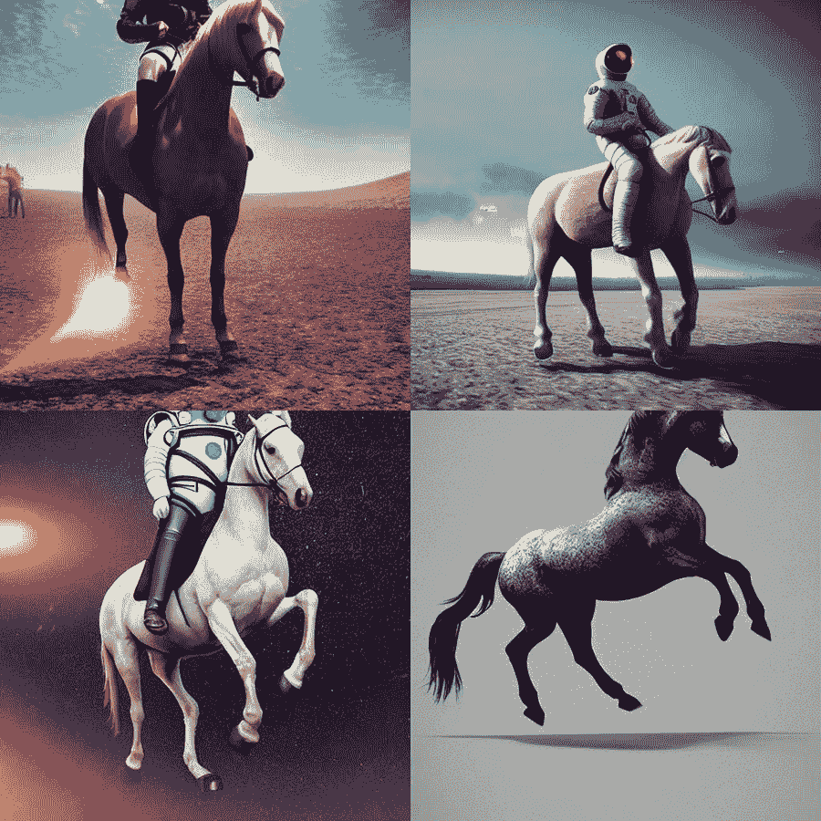
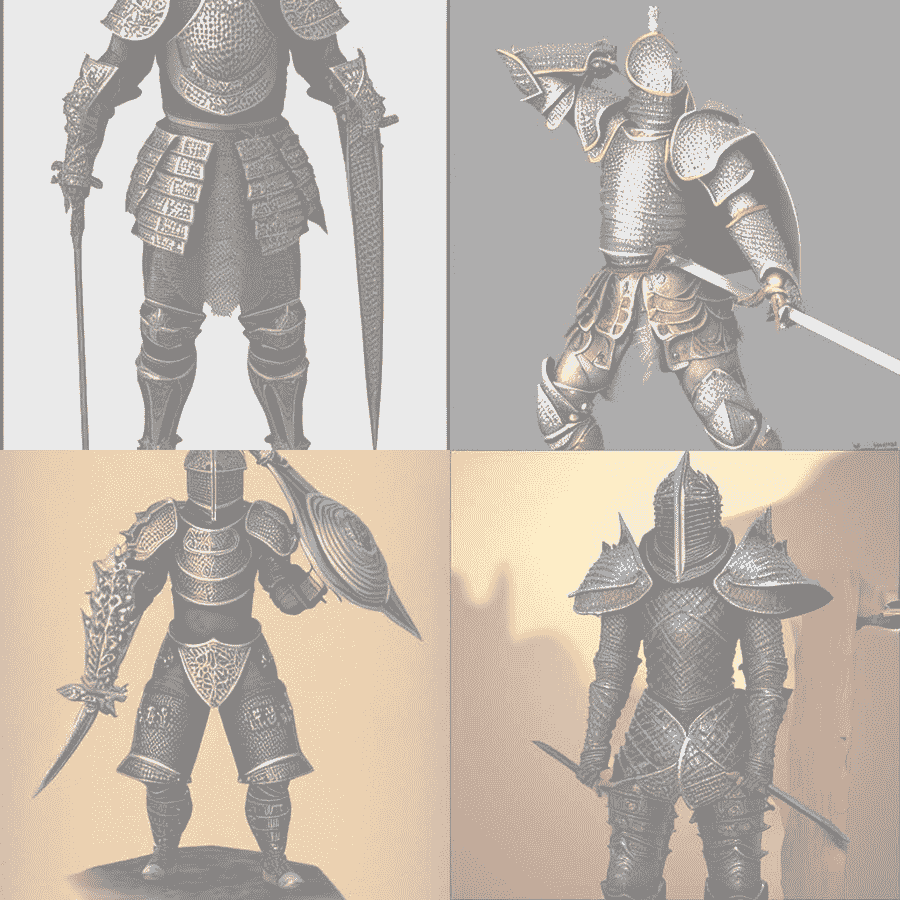

# 附录 C 多模态潜在空间

我们还没有好的机会深入研究多模态潜在空间，但在这里我们想要纠正这一点。一个多模态模型的例子包括稳定扩散，它可以将文本提示转换为图像。扩散指的是比较两种不同模态中的嵌入过程，而这种比较必须通过学习来实现。这个过程的一个有用简化是想象所有的文本嵌入就像一个由数亿个点组成的大云团，类似于我们在第二章（2.3 节）中制作的嵌入可视化，但这里代表的是数亿个单词。有了这个云团，我们可以在不同但相关的模态中（例如图像）创建另一个嵌入云团。

我们需要确保云团之间存在某种实用关系——在我们的案例中，只要文本或图像描述另一个就足够了。它们需要在等效性上相等，即两种模态都代表相同的基本概念。一旦我们有了两个嵌入云团和映射的关系，我们就可以通过比较云团、遮蔽文本并将图像转换为白噪声来训练。然后，通过采样和周期性步骤，模型可以擅长根据基于等效文本描述的白噪声来补全图像。

我们通常不会将这些模型视为语言模型，因为输出不是文本；然而，你能想象尝试使用一个不理解语言的吗？在当前状态下，这些模型特别容易受到歧义的影响，因为等效性问题尚未解决。这里有一个例子：想象你告诉一个扩散模型根据提示“一个宇航员在亚马逊雨林中艰难前行”创建图像，而你得到了一个宇航员在用纸箱制成的电脑上打字的图像。一个更著名的例子是提示“河里的鲑鱼”，返回的图像是漂浮在水面上的煮熟的鲑鱼。（原始来源未知，但你可以在这里找到示例：[`mng.bz/EOrJ`](https://mng.bz/EOrJ)。）这样的例子是为什么在文本 2X 空间中，提示工程爆炸式增长，那里的歧义被加剧，能够确切锁定传递给模型以获得所需结果的标记的价值也随之提高。

训练这些模型的整个理论超出了本书的范围——实际上，我们几乎把它塞进了附录中——但如果你感兴趣，这里有一些值得探讨的事情。文本反转允许你训练一个对特定标记有特定概念的现有模型。这让你可以用非常少的示例图像获得特定的美学或主题。DreamBooth 同样使用少量示例图像训练新模型；然而，它训练模型包含该主题或美学，而不管使用的标记是什么。PEFT 和 LoRA 都包含在这本书中，但在文本到图像和图像到图像领域取得了惊人的成功，它们为文本反转和 DreamBooth 提供了相对较小的替代方案，可以说可以同样有效地完成工作。

在下一个列表中，我们将通过展示扩散工作的示例来更深入地探讨这个问题。我们将从几个导入开始，创建一个图像网格函数来帮助展示事物是如何运作的。

##### 列表 C.1 示例 txt2Img 扩散

```py
from diffusers import (
    StableDiffusionPipeline,
    UNet2DConditionModel,
    AutoencoderKL,
    DDIMScheduler,
)
from torch import autocast
from PIL import Image
from transformers import CLIPTextModel, CLIPTokenizer
import torch
import numpy as np

from tqdm.auto import tqdm

def image_grid(imgs, rows, cols):
    assert len(imgs) == rows * cols

    w, h = imgs[0].size
    grid = Image.new("RGB", size=(cols * w, rows * h))
    for i, img in enumerate(imgs):
        grid.paste(img, box=(i % cols * w, i // cols * h))
    return grid
```

现在，我们将向您展示从 Hugging Face 开始使用 Stable Diffusion 管道的最简单编程方式。这将加载 Stable Diffusion 模型，接收一个提示，然后显示图像。展示完这些后，我们将浅尝辄止，看看这个管道在底层是如何工作的，以及如何利用它做更多的事情。我们意识到这个管道的工作方式与潜在扩散不同，我们将展示这一点，但就我们的目的而言，它们足够相似：

```py
# Simple
pipe = StableDiffusionPipeline.from_pretrained(
    "runwayml/stable-diffusion-v1-5",
).to("cuda")

n_images = 4
prompts = [
    "masterpiece, best quality, a photo of a horse riding an astronaut, "
    "trending on artstation, photorealistic, qhd, rtx on, 8k"
] * n_images
images = pipe(prompts, num_inference_steps=28).images

image_grid(images, rows=2, cols=2)
```

运行这个管道代码后，你应该会看到一组与图 C.1 类似的图像。你会注意到它生成了宇航员骑马，而不是我们请求的马骑宇航员。实际上，要得到任何 txt2img 模型执行逆操作是非常困难的，这显示了理解或未能理解语言对于多模态模型是多么重要。



##### 图 C.1 使用提示“宇航员骑马”生成的 Stable Diffusion 图像

现在我们已经看到了我们正在构建的内容，我们将继续构建一个潜在空间图像管道。我们将从加载几个模型开始：CLIP 的标记器和文本编码器，你现在应该很熟悉了，以及 Stable Diffusion 的变分自动编码器（与文本编码器类似，但用于图像）和它的 UNet 模型。我们还需要一个调度器：

```py
# Detailed
tokenizer = CLIPTokenizer.from_pretrained("openai/clip-vit-large-patch14")
text_encoder = CLIPTextModel.from_pretrained(
    "openai/clip-vit-large-patch14"
).to("cuda")
vae = AutoencoderKL.from_pretrained(
    "runwayml/stable-diffusion-v1-5", subfolder="vae"
).to("cuda")
model = UNet2DConditionModel.from_pretrained(
    "runwayml/stable-diffusion-v1-5", subfolder="unet"
).to("cuda")

scheduler = DDIMScheduler(
    beta_start = .00085, 
    beta_end = .012, 
    beta_schedule = "scaled_linear", 
    clip_sample = False, set_alpha_to_one = False, 
    steps_offset = 1
)
```

接下来，我们将定义我们扩散管道的三个核心组件。首先，我们将创建`get_text_embeds`函数来获取文本提示的嵌入。现在这应该已经很熟悉了：将文本分词为数字，然后将这些标记转换为嵌入。接下来，我们将创建`produce_latents`函数，将这些文本嵌入转换为潜在表示。潜在表示本质上是在图像空间中的嵌入。最后，我们将创建`decode_img_latents`函数，将潜在表示解码为图像。这类似于标记器将标记解码回文本的方式：

```py
def get_text_embeds(prompt):
    text_input = tokenizer(       #1
        prompt,
        padding="max_length",
        max_length=tokenizer.model_max_length,
        truncation=True,
        return_tensors="pt",
    )
    with torch.no_grad():
        text_embeddings = text_encoder(text_input.input_ids.to("cuda"))[0]

    uncond_input = tokenizer(    #2
        [""] * len(prompt),
        padding="max_length",
        max_length=tokenizer.model_max_length,
        return_tensors="pt",
    )
    with torch.no_grad():
        uncond_embeddings = text_encoder(uncond_input.input_ids.to("cuda"))[
            0
        ]

    text_embeddings = torch.cat([uncond_embeddings, text_embeddings])   #3
    return text_embeddings

def produce_latents(
    text_embeddings,
    height=512,
    width=512,
    num_inference_steps=28,
    guidance_scale=11,
    latents=None,
    return_all_latents=False,
):
    if latents is None:
        latents = torch.randn(
            (
                text_embeddings.shape[0] // 2,
                model.in_channels,
                height // 8,
                width // 8,
            )
        )
    latents = latents.to("cuda")

    scheduler.set_timesteps(num_inference_steps)
    latents = latents * scheduler.sigmas[0]

    latent_hist = [latents]
    with autocast("cuda"):
        for i, t in tqdm(enumerate(scheduler.timesteps)):
            latent_model_input = torch.cat([latents] * 2)     #4
            sigma = scheduler.sigmas[i]
            latent_model_input = latent_model_input / (
                (sigma**2 + 1) ** 0.5
            )

            with torch.no_grad():      #5
                noise_pred = model(
                    latent_model_input,
                    t,
                    encoder_hidden_states=text_embeddings,
                )["sample"]

            noise_pred_uncond, noise_pred_text = noise_pred.chunk(2)     #6
            noise_pred = noise_pred_uncond + guidance_scale * (
                noise_pred_text - noise_pred_uncond
            )
            latents = scheduler.step(noise_pred, t, latents)["prev_sample"]  #7
            latent_hist.append(latents)

    if not return_all_latents:
        return latents

    all_latents = torch.cat(latent_hist, dim=0)
    return all_latents

def decode_img_latents(latents):
    latents = 1 / 0.18215 * latents

    with torch.no_grad():
        imgs = vae.decode(latents)["sample"]

    imgs = (imgs / 2 + 0.5).clamp(0, 1)
    imgs = imgs.detach().cpu().permute(0, 2, 3, 1)
    imgs = (imgs) * 127.5
    imgs = imgs.numpy().astype(np.uint8)
    pil_images = [Image.fromarray(image) for image in imgs]
    return pil_images
```

#1 将文本分词并获取嵌入

#2 对无条件嵌入执行相同的操作

#3 为最终嵌入创建猫（Cat）

#4 将潜在表示扩展以避免进行两次正向传递

#5 预测噪声残差

#6 执行引导

#7 计算前一个带噪声的样本 x_t -&gt; x_t-1

现在我们已经创建了所有组件，我们可以创建管道。这将接受一个提示，将其转换为文本嵌入，将这些嵌入转换为潜在表示，然后将这些潜在表示解码为图像：

```py
def prompt_to_img(
    prompts,
    height=512,
    width=512,
    num_inference_steps=28,
    guidance_scale=11,
    latents=None,
):
    if isinstance(prompts, str):
        prompts = [prompts]

    text_embeds = get_text_embeds(prompts)    #1

    latents = produce_latents(     #2
        text_embeds,
        height=height,
        width=width,
        latents=latents,
        num_inference_steps=num_inference_steps,
        guidance_scale=guidance_scale,
    )

    imgs = decode_img_latents(latents)      #3

    return imgs

imgs = prompt_to_img(
    ["Super cool fantasy knight, intricate armor, 8k"] * 4
)

image_grid(imgs, rows=2, cols=2)
```

#1 将提示转换为文本嵌入

#2 将文本嵌入转换为图像潜在表示

#3 将图像潜在表示转换为图像

最后，你应该看到一个类似于图 C.2 的图像网格。



##### 图 C.2 使用提示“幻想骑士，复杂盔甲”从自定义 Stable Diffusion 管道生成的图像。

我们希望你喜欢这个非常快速的教程，作为最后的练习，我们挑战读者找出如何使用`prompt_to_img`函数来扰动现有的图像潜在表示以执行图像到图像的任务。我们承诺这将是一个挑战，以帮助你巩固理解。尽管如此，我们希望你能带走的是语言模型对扩散和当前最先进的视觉模型的重要性。 

由于模态目前是语言模型中最少被探索的部分，这里的内容足以写另一本书，而且谁知道呢？也许我们以后会写。与此同时，如果你对撰写论文、申请专利或只是为推进一个真正有趣的领域做出贡献感兴趣，我们建议你直接深入研究这部分，因为任何在常规语言模型领域产生的东西都可以立即被纳入，以使扩散模型变得更好。
