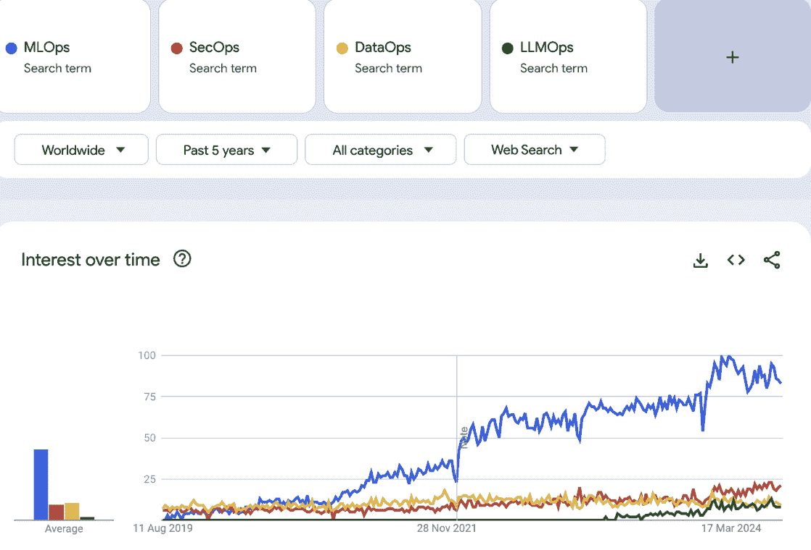

# 第二章：LLMOps 简介

LLM 架构的规模和复杂性使得将这些模型投入生产变得极其困难。“投入生产”不仅意味着部署一个模型，还包括监控它、评估它和优化其性能。

持续出现新的挑战。根据您的应用程序，这些挑战可能包括如何处理数据、如何存储和动态调整提示、如何监控用户交互，以及——最紧迫的是——如何防止模型传播错误信息或记住训练数据（这可能导致其泄露个人信息）。这就是为什么需要将 LLM 操作化，即在生产中日常管理它们，需要一个新框架。

如其名称和原则所暗示的，*LLMOps*是一个将 LLM 应用程序投入生产的操作框架。尽管它的名称和原则受到了其前辈 MLOps 和 DevOps 的启发，但 LLMOps 要复杂得多。LLMOps 框架可以帮助公司减少技术债务，保持合规性，处理 LLM 的动态和实验性，并通过避免常见陷阱来最小化运营和声誉风险。

本章首先讨论 LLMOps 是什么，以及它如何以及在哪里与 MLOps 不同。然后，我们将向您介绍 LLMOps 工程师的角色以及它在现有 ML 团队中的位置。从那里，我们将探讨如何在团队中衡量 LLMOps 的准备工作，评估您组织的 LLMOps 成熟度，并确定衡量成功的关键 KPI。在本章的末尾，我们将概述一些特定于将 LLM 应用程序投入生产的挑战。

# 什么是操作框架？

*操作框架*提供了一种结构化的方法来管理组织内部复杂的工作流程和管道。这些框架整合工具和实践，以自动化和简化组织流程，并确保在整个项目生命周期中保持一致性和质量。

一些最早的操作框架可以追溯到军事战略和工业革命。其中两个最受欢迎的，都是在 1986 年推出的，分别是[丰田精益生产系统](https://oreil.ly/oNheh)，它使丰田领先于大多数同行，以及[六西格玛](https://oreil.ly/GHXWt)，摩托罗拉的数据驱动方法，用于改进流程和减少缺陷。

2008 年，科技行业开始采用现在软件中最受欢迎的操作框架之一：DevOps。（这个术语结合了*软件开发*和*运维*。）2018 年，MLOps，一个用于非生成式机器学习（ML）模型的操作框架，成为了热门话题；从那时起，我们看到了 SecOps（安全运维）、DataSecOps 以及更多。

随着 LLM 在 2023 年的大规模采用，一个新的操作框架开始在构建 LLM 应用程序的公司中流传：LLMOps。LLMOps 仍处于起步阶段，但随着生成模型成为软件产品的核心，其受欢迎程度可能会激增。

图 2-1 展示了 Ops 框架多年来的缓慢增长。LLMOps 的使用随着 2023 年初 LLMs 的广泛应用而开始增加。截至本文撰写时，越来越多的企业意识到他们可以通过基于 LLM 的提供来增加价值和利润，导致 LLMOps 呈上升趋势。事实上，2025 年可能是 LLMOps 框架最好的年份。

部署 LLM 可能像通过 API 将聊天机器人集成到您的网站上一样简单，也可能像从头开始构建自己的 LLM 和前端一样复杂。但是，保持它们的表现（将它们投入生产）——也就是说，保持它们可靠、可扩展、安全、健壮——是一个巨大的挑战。本书，就像 LLMOps 一样，专注于这个问题：在生产中部署您的 LLM 后会发生什么？

###### 图 2-1\. Google Ngram 显示从 2019 年到 2024 年 LLMOps 术语流行度的增长

## 从 MLOps 到 LLMOps：为什么我们需要一个新的框架？

MLOps 和 LLMOps 之间有一些重叠；毕竟，它们都处理 ML 模型的运营生命周期。它们在管理 ML 工作流程方面也共享一些共同原则。然而，这两个框架在主要重点和目标上有所不同。MLOps 处理非生成式模型（包括语言和计算机视觉），而 LLMOps 处理生成式语言模型——因此具有巨大的复杂性。这些模型的复杂性不仅源于它们的规模和架构，还源于数据工程、领域适应性、评估和监控它们所涉及的独特流程。这些关键区别在 LLMs 的预测透明度、延迟、内存和计算需求中显而易见。

可能最大的不同是终端用户消费这些模型的方式的转变。非生成式 ML 模型是用于被动消费的预测工具，例如在仪表板、推荐和数据分析中。相比之下，LLM 应用作为[软件 3.0](https://oreil.ly/g9dn6)在面向消费者的应用中部署，用于主动用户交互。这带来了从软件 1.0（DevOps）回归的几个挑战。事实上，说 LLMOps 与 DevOps 比与 MLOps 有更多相似之处并不过分。

构建自己的生成式 AI 应用需要工具、框架和与这些模型规模和复杂性相匹配的期望，而这远远超出了现有 MLOps 解决方案的范围。为了帮助您理解不同类型的 Ops 框架之间的差异，让我们进行一个思想实验。

想象 MLOps 就像是从头开始建造一个小房子。相比之下，DevOps 处理整个产品生命周期，就像开发一个大型的购物中心。而 LLMOps 呢？它更像是建造迪拜哈利法塔。对于这三个框架，你都在使用相同的建筑材料：木材、钢材、混凝土、砖块、锤子等等。大部分的基本流程也是相同的：你打下地基，铺设管道，最后建造墙壁。但你不会雇佣当地的建筑工人来设计迪拜哈利法塔，对吧？

大多数自然语言建模的 MLOps 都是基于构建较小的、判别性的模型来完成诸如情感分析、主题建模和摘要等任务。对于这些任务，你首先假设理想特征，将你的数据作为这些特征的函数进行建模，然后针对特定任务优化模型。

与之相反，LLMs（大型语言模型）是生成性的、领域无关的、任务无关的。这种基本差异意味着你可以使用同一个模型来进行总结或回答问题，而无需对其进行微调。

LLMs 的最佳用例是在你不知道要优化哪些特征（或者，更好的是，如果特征过于抽象）时，以及当你需要在单个管道内对多模态数据进行建模时。与较小的判别性模型不同，LLMs 不依赖于预定义的特征或特定任务的架构。相反，正如你在第一章中学到的，它们是在大量的文本数据上训练的，以学习语言本身的模式和结构。对于 LLMs，训练过程涉及一个*损失函数*，该函数衡量模型生成的输出与各种任务中预期的输出之间的匹配程度。例如，在训练过程中，模型可能会生成一系列文本；损失函数计算这个生成序列与目标序列之间的差异。

此外，为了进行标准比较，一个 1750 亿参数的 GPT-4 模型的超参数空间可能比标准判别性 BERT 模型（具有 1.1 亿参数）的超参数空间大约大 1500 倍。这使得微调和在 MLOps 中进行典型的迭代训练变得极其昂贵。表 2-1 概述了 MLOps 和 LLMOps 模型生命周期之间的一些关键差异。

表 2-1\. 比较 MLOps 和 LLMOps 模型生命周期

| 生命周期步骤 | 环境 | MLOps | LLMOps |
| --- | --- | --- | --- |
| 数据收集 | 简易程度 | 总是直接。 | 有时——数据组成是一个非常困难的问题。 |

| 数据预处理 | 简易程度 | 修复缺失数据和异常值——非常容易！ | 困难。需要：

+   去重

+   毒性过滤

+   多样性管理

+   数量控制

|

| 模型学习 | 模型大小 | 机器学习模型，如分类器或回归器，通常最大有约 2 亿个参数，并且与 LLM 相比，在实验中通常计算量较小。 | LLM 通常有 1000 亿或甚至万亿个参数，这使得它们比许多非生成模型大得多且复杂得多。它们的巨大规模影响了资源需求、存储和计算效率。 |
| --- | --- | --- | --- |
| 超参数 | 准确性 | 有限的超参数空间使得搜索变得容易，使它们非常适合预测问题。 | 巨大的超参数空间会导致实时搜索延迟。这使得它们非常适合需要创造力的生成和进化任务。准确性可能成为计算瓶颈。 |
| 模型训练时长 | 训练规模和时长 | 资源消耗较少，通常更快。可以轻松部署为云上的笔记本或跨单个节点的容器化解决方案。 | 涉及使用分布式训练在大型 GPU 或 TPU 集群上处理大量数据集，并针对并行处理进行优化。可能需要几天或几周。实施可能需要动态资源扩展，并涉及设计可扩展的基础设施和编排系统以高效处理不同的工作负载。 |

| 领域适应性 | 成本 | 完整微调是必需且负担得起的。 | 完整微调成本过高且相当罕见。相反，流行的技术包括：

+   提示工程

+   RAGs

+   知识图谱

+   参数高效微调

|

| 评估 | 简便 |
| --- | --- |

+   简单

+   区分性

+   明确定义的概率空间

|

+   极其困难的问题

+   生成性且因此难以检测

+   无界概率空间

|

| 坚韧性 | 静态与动态 | 模型在生产中的行为保持不变。 | 模型在生产中的行为基于交互而变化，需要持续监控以保持一致性。 |
| --- | --- | --- | --- |
| 安全性 | 安全 | 高度安全。 |

+   极度脆弱

+   需要一个 DataSecOps 框架

|

## LLMOps 的四个目标

LLMOps 基于一套针对 LLM 特定的设计模式原则来确保您的 LLM 应用实现四个关键目标：安全性、可扩展性、坚韧性和可靠性。让我们更详细地看看这些目标：

安全性

最小化与在生产中部署 LLM 应用相关的监管、声誉和运营风险

可扩展性

构建、存储和维护能够跨数据泛化且按需高效扩展的 LLM 应用，同时优化延迟、吞吐量和成本

坚韧性

在面对数据漂移、模型漂移、第三方更新和其他挑战的情况下，在长时间内保持 LLM 应用的高性能

可靠性

实施严格的推理监控、错误处理和冗余机制，以防止停机和服务中断

LLMOps 团队自动化重复性流程，以更快地大规模优化这些应用程序，并避免那些“LLM-oops！”时刻。LLMOps 框架的另一个关键方面是促进不同跨学科团队之间的连贯性、透明度和协作。这些团队通常包括数据工程师、数据科学家、研究科学家、软件工程师和业务运营团队。

LLMOps 是一个全新的领域，因此，截至 2025 年撰写本文时，可用的成熟工具和资源非常有限。因此，各个组织的 LLMOps 团队正在内部开发他们的工具和流程，基于典型的开源库和工具包。

# LLMOps 团队和角色

今天，有两种类型的公司在使用 LLM 构建产品：专注于 LLM 应用程序的新兴初创公司，以及现在正在构建自己的 GenAI 团队的拥有现有 ML 模型的公司。

在后一类中，由于缺乏熟练的运营专业人员，大多数公司选择从内部招聘 ML 工程师候选人，然后提升他们的 LLMOps 技能，而不是从外部招聘。主要原因是对用例以及预期的工作职责缺乏清晰的了解。因此，目前的规范是从不同部门内部招聘 8 到 10 人，这些部门可能包括产品经理、全栈工程师、系统架构师、数据工程师、数据科学家、ML 工程师、平台工程师、网络安全专业人士和开发者倡导者。许多公司希望找到已经深入了解业务的人，在做出承诺之前测试几个潜在用例和项目的可行性。

然而，较新的初创公司别无选择，只能从头开始组建团队。这些团队可能看起来非常不同，这取决于他们是在开发 LLMOps 基础设施（LLMOps SaaS 公司）还是 LLM 用例，如文案写作、教育或流程优化。图 2-2 提供了一个非常基本的 LLMOps 团队模型，但这些团队在形状和规模上各不相同，具有不同的业务和技术成熟度。（在本章的后面部分，我们将探讨如何评估您公司的 LLMOps 成熟度。）

###### 图 2-2\. LLMOps 团队结构

大多数公司承担不起为应用构建和训练 LLM 的成本。相反，大多数公司选择使用基础模型。这就是 AI 工程师发挥作用的地方：使用 LLMOps 工具快速构建一个概念验证。大多数来自软件工程背景；他们可能知道如何快速构建全栈应用程序，但并不一定深入了解 ML/LLM 模型的内部工作原理或如何优化它们。

一旦概念验证完成，构建、部署和优化用于商业的机器学习（ML）模型的工作就落在了 LLM 工程师、ML 科学家（根据组织名称可互换）和被指定为可靠性工程师的 LLMOps 工程师身上。

如果一个团队选择使用 API 集成部署 LLM 应用，初始部署将会相当直接。LLMOps 工程师与 AI 工程师并肩工作，以扩展模型并提高其性能。理想情况下，每位 AI 工程师都配有一名 LLMOps 工程师；AI 工程师可以专注于调整和微调模型以满足业务需求，而 LLMOps 工程师则负责部署和优化。对于开源模型，部署管理自动由 LLMOps 工程师负责。

随着技术行业从非生成模型转向生成模型，它正逐渐远离特征工程，即创建特征以建模数据和实验不同的超参数以优化性能。生成模型，特别是 LLM，不需要特征工程。今天，核心要求通常是提示工程或构建一个 RAG 管道——这些技能属于 AI 工程师的领域。

另一个重大转变是数据工程管道和监控评估管道变得更加复杂。评估大型语言模型（LLM）远不止于简单的量化评分。一些行业基准存在——例如[BLEU](https://oreil.ly/OxqU2)，这是一个用于评估机器翻译的基准，以及[ROUGE](https://oreil.ly/1y3e4)，这是一个用于评估摘要的基准，但这些与实际应用性能只有松散的相关性。转向得分更高的模型并不能保证更好的用户满意度。标准化分数可能适用于比较 LLM 的一般情况，但最终用户关心的是 LLM 应用是否解决了他们的问题。

此外，由于 LLM 被部署在面向消费者的应用中，感知延迟和吞吐量等指标成为市场竞争中的决定性因素。模型不是唯一的决定因素：部署、评估和监控管道也是性能评估的前沿和中心。

让我们来看看这些管道中涉及的某些角色：

数据工程师

数据工程师是负责设计、构建和维护系统管道的专业人员，这些系统管道能够高效地收集、存储、转换数据以及提供对数据的访问。他们的工作确保数据可用、可靠且组织有序，以便数据科学家和其他工程师能够创建和评估模型以及数据驱动应用。数据检索和移动是数据工程师最基本的能力，但随着他们职业生涯的发展，开发数据架构变得越来越重要。

为大型语言模型进行的数据工程需要专业的理解：如何分块数据，使用什么分词模型等。因此，最好将每个数据工程师与一个机器学习科学家（具有 LLM 工程背景）以及 LLMOps 工程师配对，以在规模上自动化和简化 LLM 系统。

人工智能工程师

人工智能工程师的核心技能集包括全栈工程和开发（React、Node.js、Django）以及熟悉用于部署应用程序的常见 LLMOps 工具和框架，如 LangChain 和 Llama Index。他们需要对端到端 AI 应用程序开发有基础理解，包括提示工程和 RAG 系统。从头开始建立团队的公司通常寻求那些对使用云服务部署和管理 AI 应用程序有深入了解，并且有与外部 API 和向量数据库一起工作的经验的 AI 工程师。

机器学习科学家

机器学习科学家、自然语言处理科学家或大型语言模型工程师的日常工作涉及使用 PyTorch、TensorFlow 和 JAX 等框架研究、设计和优化大型语言模型。这个角色需要深入理解自然语言处理算法和任务，例如分词、命名实体识别（NER）、情感分析和机器翻译。候选人应了解模型架构以及训练和微调过程。

LLMOps 工程师

LLMOps 工程师的目标是确保大型语言模型的应用保持可靠、健壮、安全和可扩展。日常工作中涉及作为项目负责人构建和维护操作性的 LLM 管道。

现在我们更详细地看看 LLMOps 工程师的角色。

## LLMOps 工程师角色

这个角色需要广泛的专业知识，包括在生产环境中部署、监控、微调、训练、扩展和优化 LLM 模型；基础设施和平台工程；数据工程；以及系统可靠性。

建立 LLM 团队的公司通常寻求理解与 LLM 相关的独特挑战，并在权衡成本效率与系统性能方面有经验的 LLMOps 工程师。

要成为这个角色的候选人，你需要精通一系列专业技能的独特组合，并对整个 LLM 生命周期（从数据管理到模型部署和监控）有深入的技术理解。你还需要是一个问题解决者，一个强大的团队玩家，一个有效的沟通者，以及一个细致入微的人。

为了说明这在实际中的含义，让我们看看一个虚构的 LLMOps 工程师典型的工作日。

## 一天的工作

尽管这个角色的具体职责在不同组织之间会有所不同，但核心任务通常包括基础设施管理、协作、优化和合规性的结合。为了快速了解这看起来是什么样子，以下是一个典型的 LLM 工程师工作日可能的样子：

早上 7:30 至 8:30：晨间检查

+   审查监控仪表板，查看任何夜间警报或已部署 LLM 的性能问题；解决任何紧急问题或将它们升级到适当的团队。

+   领导团队每日站立会议，讨论正在进行的项目、阻塞点和当天的优先事项。

8:30 AM–10:00 AM: 基础设施管理和优化

+   将代码模块化以提高可重用性，为提供 GPU、管理存储和网络创建单独的模块。

+   实施批处理机制以处理多个推理请求，减少每个请求的额外开销。

+   实施延迟优化技术，如内核融合、量化动态批处理，以增强模型性能。

10:00 AM–11:30 AM: 协作和项目规划会议

+   与数据科学家、机器学习工程师和红队工程师会面，讨论使用要求、时间表、监控错误和扩展挑战。

11:30 AM–12:30 PM: API 开发和模型部署

+   设计生产中不同模型的推理端点和缓存，确保与整个应用程序的兼容性。

12:30 PM–1:30 PM: 午餐休息

1:30 PM–3:00 PM: 监控和故障排除

+   解决出现的任何问题。例如，假设用户在向推理 API 发出请求时遇到长时间延迟。工程师将通过检查硬件利用率和网络延迟以及审查使用日志来识别延迟的原因。然后，他们会实施解决方案；例如，使用 Pod 自动扩展或缓存频繁请求。

3:00 PM–4:30 PM: 研究和持续学习

+   尝试将新工具、库或框架集成到现有技术堆栈中，以提高效率和性能。

4:30 PM–5:30 PM: 结束一天的工作，回顾和待命准备

+   审查当天的任务，并更新工单，包括已完成的任务和下一步行动。

+   准备任何待命任务，确保所有监控系统配置正确，并准备好应对任何事件。

+   参加任何与跨职能团队的最终会议或同步，以确保对即将到来的优先事项达成一致。

+   完成任何剩余的任务，确保所有系统在当天下班前运行顺畅。

在正常工作时间之外，如果你在待命，你需要保持可用状态，以应对可能出现的任何关键问题。

## 外部招聘 LLMOps 工程师

填充 LLMOps 工程师角色的两种方式：你可以外部招聘，或者内部招聘并提升员工技能，培训机器学习工程师成为 LLMOps 工程师。本节将首先探讨外部招聘，然后讨论如何提升现有员工的技能。

如果你正在招聘这个职位，其他在 LLMOps 工程师职位候选人中要寻找的技能包括在以下方面的经验或熟练度：

+   将模型转换为 PyTorch 或 JAX 等库，或从这些库转换回来

+   理解机器学习指标，如准确率、精确度、召回率和 PR-AUC

+   理解数据漂移和概念漂移

+   运行和基准测试模型以了解计算图表示对神经网络、GPU 和 CPU 性能的影响

+   在 AWS、GCP 和 Azure 等云环境中部署和扩展机器学习模型

+   使用 LLM 推理延迟优化技术，包括内核融合、量化动态批处理

+   使用 Terraform 等工具构建数据工程、部署和基础设施即代码（IaC）的 Ops 流水线，管理矢量数据库，以及为大规模训练数据集执行 ETL 过程

+   理解红队策略、接口和指南

+   使用 Docker 进行容器化，使用 Kubernetes 进行编排，以确保可扩展和一致的部署

+   与包括 LLM 工程师、数据科学家和 ML/NLP 工程师在内的团队协作和管理项目

当然，每家公司都有自己的面试流程。有些公司进行多轮面试；而有些公司则将几轮面试合并为一次现场会议。本节描述了一个相当标准的四轮面试流程，如图 2-3 所示。图 2-3。

###### 图 2-3\. LLMOps 面试的组件

让我们更详细地看看每一轮：

第一轮：初步筛选

在初步筛选阶段的目标是确定申请人具备该职位所需的基本技能和经验。这可以通过简历评估表来评估。您在这里提出的问题非常高级。他们是否有在生产环境中部署 LLM 的经验？他们是否提到了用于管理 LLM 流水线的特定框架和工具，并且这些工具与贵公司使用的是否相同？如果不是，他们能否学习和采用您的技术栈？他们能否展示或讨论任何过去的项目？

第二轮：技术评估

本轮的目标是评估候选人在核心领域（如 LLM 部署、数据工程和基础设施管理）的技术熟练度。您可能会问的问题包括：

+   描述您调整预训练大型语言模型的步骤。您如何确保模型针对特定用例进行了优化？

+   带我了解您参与的一个 LLM 部署过程。您遇到了哪些挑战？您是如何克服它们的？

+   您会如何设置 LLM 训练、微调和部署的 CI/CD 流水线？

+   您如何设计和管理大规模机器学习项目的数据流水线？您使用哪些工具，以及您如何确保数据质量？

+   您如何监控和解决生产中的延迟问题？

+   您如何处理用于训练或微调 LLM 的版本控制和数据集跟踪？

+   您如何确保云基础设施的高可用性和成本效益？

第三轮：系统设计面试

在这一轮中，目标是评估候选人设计可扩展、可靠和可维护的系统以部署和管理 LLM 的能力。这一轮的示例问题可能包括：

+   请告诉我一次你必须为你的 ML 基础设施组件做出构建或购买决策的情况。你考虑了哪些因素？

+   你会如何设计一个 API 来大规模提供 LLM 推理服务？讨论负载均衡、容错和降低延迟的考虑因素。

+   你会如何使用 IaC 工具来管理 LLM 部署的云基础设施？你会采用哪些策略来优化资源使用和成本？你认为在扩展过程中可能会遇到哪些潜在问题？

+   描述你在推理服务中动态批处理的方法。量化混合精度训练等技术如何影响 LLM 的性能和效率？

+   你如何在 CUDA 中管理 LLM 训练时的内存？你使用哪些策略来防止内存不足错误等问题？

+   你如何在优化前后基准测试模型性能？你考虑哪些指标，以及你使用哪些工具？

+   你会如何诊断和解决优化后的性能下降问题？

最后一轮：行为面试

在第四轮中，你已经将候选人缩小到最合格的候选人。现在你需要评估他们的个性：他们是自我驱动的吗？他们能否团队合作，以平和的心态应对挑战，并为协作环境做出贡献？示例问题：

+   你如何保持对 LLM 和机器学习操作最新进展的了解？

+   你如何将数据科学家对部署过程的反馈整合到部署过程中？

+   你会如何与红队工程师合作，以解决 LLM 部署中的潜在安全漏洞？

+   你在值班轮换方面有什么经验？你如何在非工作时间处理关键事件？

你还希望确保候选人符合你组织的价值观，特别是在创新、持续学习和协作等领域。你可以问一些问题，比如：

+   你最喜欢的技术博客或播客是什么？

+   你如何跟上该领域的最新进展？

## 内部招聘：将 MLOps 工程师提升为 LLMOps 工程师

MLOps 工程师和 LLMOps 工程师之间的差距在规模、复杂性和他们角色中涉及的技术挑战方面是显著的。因此，提升现有员工的技能需要集中精力来建立他们的理解。

话虽如此，MLOps 的基础技能——如模型部署、自动化和云管理——提供了一个坚实的基石，可以在此基础上发展。通过专注的学习和实际经验，MLOps 工程师可以有效地过渡到 LLMOps 领域。内部招聘的核心优势在于，候选人已经与组织的价值观和文化保持一致，并且对 KPIs 有深刻的理解。

为了脱颖而出，新的 LLMOps 工程师需要资源和培训来深化他们对大规模模型架构和 Transformer 架构、注意力机制、基础设施管理和 LLM 特定优化技术的理解。他们还需要了解 LLMs 与非生成性 ML 模型的不同之处。我们建议将他们与 LLM 工程师配对，以实验和评估不同的模型。

这个角色不仅仅是构建一个使用 LLMs 的应用程序。LLMOps 工程师还管理成本、云资源和用户体验之间的平衡，并处理大量的非结构化数据集。因此，将他们与数据工程师配对，以帮助他们构建数据处理管道，使他们熟悉可用的数据源，数据在数据库中的结构，不同数据库如何检索信息，公司的延迟期望，以及如何处理数据过滤。允许他们为不同的模型引入多节点设置和分布式系统，同时专注于成本优化和错误处理。让他们基准测试不同的 LLM 模型并调试其性能优化。最后，允许他们展示他们的日志实践和为维护可扩展性和性能而设置的护栏。

大多数 MLOps 工程师已经具备模型版本控制、数据版本控制、管理回滚和 GitHub 操作等技能，因此提升这些专业人士的技能可以成为构建强大 LLMOps 团队的有效策略。

接下来，让我们看看如何确保你的 LLMOps 工程师的目标与你的组织目标保持一致。

# LLMs 和你的组织

你在本章的开头了解到，LLMOps 框架的四个关键目标是安全性、可扩展性、鲁棒性和可靠性。因此，对于 LLMOps 团队来说，下一个重大问题是如何衡量应用程序的性能是否符合这些目标。你将如何知道你正在取得成功？公司的期望应该明确界定，并且始终以定性和定量可衡量的方式存在。

三种类型的指标将允许你衡量你团队的目标绩效：SLOs、SLAs 和 KPIs。这些术语在站点可靠性工程师中普遍使用，现在 LLMOps 团队也在迅速采用它们：

服务级别目标（SLOs）

服务级别目标是由组织设定的具体、可衡量的目标，用于衡量其服务的内部质量。它们定义了组织希望达到的服务水平。例如，对于一家云托管公司，其服务级别目标可能是确保服务器每月至少 99.9%的时间在线。

服务级别协议（SLAs）

服务级别协议（SLA）是服务提供商和客户之间正式的合同，定义了提供商承诺提供的服务水平。它们通常包括具体的绩效目标，并规定如果未达到这些指标，将采取的补救措施。例如，如果互联网提供商的年正常运行时间低于 99.9%，SLA 可能会规定客户在下一次账单周期中将获得 10%的折扣。

关键绩效指标（KPIs）

关键绩效指标衡量特定商业活动的整体成功和绩效。它们提供了洞察力，了解组织如何实现其战略目标。例如，一个应用程序的重要 KPI 可能是其流失率或一定时期内停止使用应用程序的客户百分比。

在 2024 年 8 月，[Gartner Research 的研究报告预测](https://oreil.ly/dIBVc)到 2025 年将有 30%的现有生成式人工智能（GenAI）项目失败。（实际上，Gartner 在 2018 年[发布了类似的研究结果](https://oreil.ly/Rq3K3)，预测到 2022 年将有 85%的机器学习（ML）项目在生产中失败。）2024 年研究中概述的关键失败点值得关注，因为这些是 LLM 开发和部署的操作方面——包括数据质量问题、缺乏强大的评估框架以及在生产中扩展这些模型的高成本。

话虽如此，最明显的问题之一是管理层和工程团队之间的期望不匹配。在过去 10 年中，数据科学家最大的技能差距之一就是将机器学习模型指标转化为组织和产品成功指标。换句话说，当你在衡量抽象目标，如模型安全性、可扩展性、鲁棒性和可靠性时，你如何传达这对业务意味着什么？这正是 SLOs、SLAs 和 KPIs 的作用所在。

使用 SLO-SLA-KPI 框架允许 LLMOps 团队自动化、简化和管理多个利益相关者的期望。SLO 使所有利益相关者都能清楚地了解所追求的服务水平。SLA 确保问责制，使所有参与人员都了解他们的角色和约定的服务级别。这也有助于您跟踪绩效并解决任何与预期标准不符的情况。KPIs 则提供了实时数据的可见性，有助于早期发现潜在问题，从而促进明智的决策。

# LLMOps 的四个目标

让我们更仔细地看看 LLMOps 的目标，看看这些指标是如何转换的。

## 可靠性

如你所知，LLMs 极其复杂，拥有数十亿个参数。它们的行为可能不可预测，并且由于规模和训练数据的复杂性，有时会表现出意外的响应或错误。此外，如果训练数据存在偏差、过时或无法代表某些领域，模型在这些领域的性能可能不可靠。

LLMs 有时也难以理解用户查询背后的上下文、细微差别和意图。这可能导致不正确、不相关或误导性的响应。更重要的是，LLMs 通常不会实时更新。随着语言的发展，如果新信息没有通过定期重新训练整合到训练数据中，模型可能会过时，导致可靠性下降。

所有这些问题都归结为可靠性。基于 LLM 的应用程序的可靠性可以通过系统可用性、错误率和客户满意度来衡量。表 2-2 显示了这些指标作为 SLOs、SLAs 和 KPIs 时的样子。

表 2-2\. SLOs、SLAs 和 KPIs 的示例可靠性比较

|   | SLO | SLA | KPI |
| --- | --- | --- | --- |
| 可用性 | 每月保持 99.9%的在线时间 | 确保系统在 30 天的滚动期间至少对 99.95%的请求可用 | 与系统可用性相关的客户满意度评分（CSAT） |
| 错误率 | 确保所有 API 请求的错误率低于 0.1% | 确保用户交互中少于 1%的结果是错误 | 跟踪错误率趋势并分析主要错误的根本原因 |
| 客户满意度 | CSAT 评分至少为 90% | 确保净推荐值（NPS）保持在 8 以上 | 交互后调查或反馈表；CSAT 评分 |

## 可扩展性

LLMs 往往具有很大的内存占用，通常超过单个机器的容量。在保持性能的同时，将模型分布到多个 GPU 或节点在技术上具有挑战性。高效处理大量数据至关重要。

另一个重大挑战是在不造成瓶颈的情况下扩展数据管道，以便以所需的速度将数据输入模型。这对于像聊天机器人或交互式服务这样的应用尤其困难，在这些应用中，低延迟至关重要。在保持低响应时间的同时进行扩展可能具有挑战性，因为扩展会增加资源竞争和网络开销。因此，平衡性能与成本效益是一个持续关注的问题。

LLMOps 的可扩展性可以通过延迟、吞吐量、响应时间、资源扩展、容量规划和恢复时间目标（RTO）等指标来衡量，如表 2-3 所示。

表 2-3\. SLOs、SLAs 和 KPIs 的示例可扩展性比较

|   | SLO | SLA | KPI |
| --- | --- | --- | --- |
| 延迟 | 在 200 毫秒内服务 95%的请求 | 保持 API 调用的平均响应时间低于 100 毫秒 | 用户交互的平均响应时间 |
| 吞吐量 | 在高峰时段每秒至少处理 1,000 个请求 | 在不降级的情况下处理至少 1 百万个并发连接 | 负载测试期间的峰值吞吐量 |
| 响应时间 | 保持 95%用户的网页加载时间低于 3 秒 | 确保登录过程在 99%的用户中在 500 毫秒内完成 | 与响应时间相关的用户体验指标 |
| 资源扩展 | 在 5 分钟内自动扩展资源以处理流量增加 50% | 确保添加服务器线性增加吞吐量而不影响延迟 | 可扩展性测试结果和扩展解决方案的成本效益 |
| 容量规划 | 在高峰时段保持 CPU 利用率低于 80% | 确保有足够的数据库连接来处理预期峰值负载的两倍 | 资源利用趋势和预测准确性 |
| RTO | 实现关键系统故障的恢复时间目标低于 30 分钟 | 确保系统可以从数据库故障中恢复并在 15 分钟内恢复服务 | 历史 RTO 指标和改进措施 |

## 坚韧性

随着时间的推移，模型训练数据的统计特性可能会发生变化，导致模型性能的漂移。这对于与实时或快速变化的数据交互的模型尤其成问题。这可能导致以过时或不相关响应的形式的性能下降。

持续的训练和微调对于保持坚韧性是必要的，但它们需要大量的计算资源以及谨慎的管理以避免引入新的偏差或错误。您可以通过数据新鲜度、模型评估和一致性等指标来衡量坚韧性，如表 2-4 所示。

表 2-4. SLO、SLA 和 KPI 的坚韧性比较示例

|   | SLO | SLA | KPI |
| --- | --- | --- | --- |
| 数据新鲜度 | 确保仪表板数据每 5 分钟刷新一次 | 保证数据实时更新 | 数据刷新延迟和实时数据更新的准确性 |
| 模型评估 | 在 6 个月内保持性能下降率低于 5% | 保证模型评估指标的定期更新和审查 | 评估指标的准确性、相关性和更新频率 |
| 一致性 | 保证跨所有区域的数据读取和写入的强一致性 | 保持最大传播延迟为 1 秒的最终一致性 | 一致性模型遵守和复制延迟 |

## 安全性

维护 LLM 应用的安全性具有挑战性：这些模型在面临不断演变的威胁时处理敏感数据。LLM 尤其容易受到对抗性攻击、数据中毒和其他形式的利用，这可能会损害其完整性和安全性。

管理和控制对 LLM 及其数据的访问是复杂的，尤其是在多访问或多租户环境中，但对于防止未经授权的访问和滥用至关重要。表 2-5 展示了测量的一些方法。

表 2-5. SLOs、SLAs 和 KPIs 的示例安全比较

|   | SLO | SLA | KPI |
| --- | --- | --- | --- |
| 数据隐私 | 确保所有传输中和静止数据的数据加密 | 确保没有发生违规行为 | 加密合规状态 |
| 模型完整性 | 在 24 小时内检测并解决任何模型篡改 | 保证及时检测和响应未经授权的修改 | 检测到的未经授权修改的数量 |
| 访问控制 | 实现用户身份验证成功率 99.9% | 确保强大的用户身份验证和授权机制 | 未授权访问尝试的比率 |
| 红队行动 | 确保检测到 99.9% 的尝试性对抗攻击 | 确保定期进行安全评估和更新 | 安全评估的频率和识别出的关键漏洞数量 |

当所有团队——无论是参与开发、运营还是管理——都理解了约定的服务级别和性能指标时，他们可以更有效地共同朝着共同目标工作。这种一致性促进了管理项目性能的统一方法。它还有助于做出基于数据的关于资源配置、流程变更和战略调整的决策。最重要的是，它有助于建立信任，确保每个人都对期望和结果保持一致。

总体而言，实施 SLO-SLA-KPI 框架不仅增强了透明度和促进了协作，而且还作为评估和提升您 LLMOps 实践成熟度的基础要素，这也是本章最后部分的主题。

# LLMOps 成熟度模型

LLMOps 成熟度是一种确定组织 LLM 运营与行业最佳实践和标准一致性的方法。评估 LLMOps 成熟度有助于组织识别其优势、改进领域和扩展及增强其 LLM 系统鲁棒性的机会。

几年前，微软发布了一个 [机器学习运营成熟度模型](https://oreil.ly/1Tjgw)，详细说明了衡量 MLOps 生产环境和流程成熟度的逐步要求和阶段。我们在这里提出的 LLMOps 成熟度模型，受微软 MLOps 模型的启发，旨在为 LLMOps 团队做同样的事情。虽然这绝对不是一项全面的审计，但我们希望看到几种变体得到实践。

三种 LLMOps 成熟度级别如下：

Level 0

没有实施 LLMOps 实践。组织缺乏管理和部署其 LLM 系统的正式结构和流程，这阻碍了其有效性。

Level 1

组织应用了 MLOps 实践，但没有针对 LLM 特定的调整。这在形式化和流程方面比 Level 0 有所改进，但仍然缺乏全面 LLM 运营所需的复杂性。

Level 2

达到级别 2 代表成熟的 LLMOps 状态，其特征是先进的文档、稳健的监控和合规措施，以及复杂的编排和人工审查策略的整合。通常，这可以通过询问关于决策策略、模型性能指标和度量是否在团队中得到良好记录的问题来评估。

在 表 2-6 中概述了 LLMOps 成熟度的各种措施。

表 2-6\. LLMOps 成熟度的文档和策略措施

|   | 级别 0：无 LLMOps | 级别 1：MLOps，无 LLMOps | 级别 2：完整 LLMOps |
| --- | --- | --- | --- |
| LLM 项目的业务目标和 KPI 是否已记录并保持最新？ | 未记录 | 有记录，但通常过时 | 完整记录并定期更新；KPI 包括模型性能指标、运营效率和成本效益 |
| LLM 模型风险评估指标是否已记录？ | 没有正式的风险评估 | 对模型准确性和数据安全进行基本风险评估 | 包括偏差、公平性、数据漂移和性能退化在内的全面风险评估，并实施缓解策略 |
| 是否有关于所有参与项目的团队成员及其职责的记录和定期更新？ | 没有记录 | 高级角色有记录，但新角色的职责可能不明确 | 详细团队结构，包括角色、职责和联系信息，定期审查和更新 |
| LLM 的选择是否记录良好，并与其他开源/专有产品进行了成本比较？ | 没有记录或成本分析 | LLM 选择有基本记录，成本比较最少 | 包括选择理由、性能基准和与替代模型成本比较的详细记录 |
| 模型供应商的 API 是否有良好的记录，包括请求和响应结构、数据类型和其他相关细节？ | 没有 API 文档 | 模型内部开发 | 包括请求/响应示例、数据类型、错误代码和版本详情的全面 API 文档 |
| 软件架构是否记录良好并保持最新？ | 没有记录 | 有高级架构概述，但可能过时 | 包括数据流、系统组件和集成点的详细架构图，定期更新 |

记录 表 2-6 中显示的因素在选择和部署任何新模型时可能非常有帮助。例如，考虑到部署 LLM 应用程序相关的显著成本，成本基准分析文档允许公司决定哪个模型投入生产，并估计项目时间表。

部署后，公司还需要评估团队如何记录模型性能指标和度量。这是为了确保团队中的每个人都理解期望，并且全面监控生产中的模型性能。

表 2-7 概述了关于模型性能和评估的 LLMOps 成熟度的三个级别。考虑到这些不同的级别，组织和 LLMOps 团队将更好地准备应对突发事件，并能更好地将项目与业务目标对齐，降低风险，并提高运营效率。

表 2-7\. LLMOps 成熟度的模型性能和评估措施

|   | 级别 0：无 LLMOps | 级别 1：MLOps，无 LLMOps | 级别 2：完整的 LLMOps |
| --- | --- | --- | --- |
| LLM 系统是否在其知识限制内运行，并能够识别其是否超出这些限制？ | 无检测机制 | 基本检测操作限制 | 高级防护栏、限制检测机制，以及使用置信度评分和阈值等技术记录上下文感知警告的文档 |
| LLM 的输入和输出是否自动存储？ | 无自动存储 | 基本存储输入和输出 | 所有输入和输出的自动存储，并带有索引以便于检索和分析 |
| 是否定期进行 A/B 测试？ | 无 A/B 测试 | 有时进行有限的 A/B 测试 | 定期进行全面的 A/B 测试，包括使用 Optimizely 或自定义框架等工具的测试覆盖和分析 |
| 是否记录了所有 API 请求和响应，并监控 API 响应时间和健康状态？ | 无记录或监控 | 基本记录和响应时间监控 | 综合记录，包括详细的请求/响应分析；使用 ELK 堆栈等工具进行实时健康监控 |
| 是否对 LLM 进行毒性偏差监控？ | 无异常检测或偏差监控 | 基本异常检测，并手动审查 | 使用统计方法进行高级自动化毒性和偏差检测管道，定期进行偏差审计，并对低置信度预测进行自动警报 |
| 是否有流程确保 LLM 操作符合 GDPR、HIPAA 和其他相关数据保护法规？ | 没有流程 | 确保 LLM 操作符合 GDPR、HIPAA 或其他相关数据保护法规的流程 | 确保 LLM 操作符合 GDPR、HIPAA 或其他相关数据收集和保护法规以及版权法律的流程 |
| 基于 LLM 的应用程序是否使用匿名化来保护用户身份，同时保持数据对 LLM 的效用？ | 无匿名化 | 应用基本匿名化技术 | 高级自动化匿名化方法，包括数据掩码和聚合 |
| 组织是否对 LLM 基础设施和代码进行定期的安全审查和审计？ | 没有定期审查 | 定期安全审查和审计 | 定期、全面的安全审查和审计，包括第三方评估和漏洞扫描 |

让我们更详细地看看这些级别：

第 0 级：无 LLMOps

机器学习工作通常孤立且实验性，缺乏任何系统性的部署和监控框架。模型可能在孤岛中开发，通常导致不可靠和低效。雪佛兰的[聊天机器人错误](https://oreil.ly/CtHrG)是一个很好的例子；由于缺乏监控和护栏，该应用程序被社区用于代数作业。它还提供了无退货的雪佛兰汽车交易，并推广了特斯拉汽车。

第 1 级：MLOps，无 LLMOps

该组织可能拥有一个强大的模型训练、测试和部署流程，包括自动监控和再训练工作流程。然而，这个设置是为了构建小型模型而设计的，并不完全针对 LLM 的具体挑战进行优化。

第 2 级：全面 LLMOps

在最高成熟度级别，组织已采用 LLMOps 实践，并完全针对 LLM 应用进行优化。其基础设施能够处理大规模 LLM 部署、微调、实时推理、自动扩展和资源管理。成熟的 LLMOps 团队已建立故障转移和回滚机制，如果部署后的更新模型表现不佳，可以迅速采取行动。组织可以提供更可靠的响应，获得良好的投资回报率，并降低运营风险。

# 结论

在本章中，我们讨论了构建 LLM 应用的组织团队结构。我们讨论了各种角色以及如何构建一个高效团队。最后，我们讨论了一个框架，用于将 LLM 性能指标与业务 KPI 相结合。在下一章中，我们将讨论 LLM 如何改变数据工程领域，并展示如何为 LLM 构建高性能数据管道。

# 参考文献

Azure 机器学习。[“机器学习运营成熟度模型”](https://oreil.ly/EebdS)，学习 Azure，访问日期：2025 年 5 月 21 日。

Friedman, Itamar。[“软件 3.0——智能软件开发时代”](https://oreil.ly/AtCSq)，*Medium*，2022 年 5 月 3 日。

Lin, Chin-Yew。[“ROUGE：自动评估摘要的包”](https://oreil.ly/IvSev)，*文本摘要分支*，（计算语言学协会，2024 年）。

Kadambi, Sreedher。[“Shingo 原则：连接精益和丰田生产系统成功”](https://oreil.ly/wCmAE)，Skil Global，2021 年 5 月 28 日。

Mcintyre, Branden。[“雪佛兰聊天机器人失误：LLM 护栏和最佳实践的案例研究”](https://oreil.ly/VQHov)，*Medium*，2023 年 12 月 22 日。

Papineni, Kishore, 等人. [“BLEU: 一种用于机器翻译自动评估的方法”](https://oreil.ly/zyIEO), *ACL '02: 计算语言学协会第 40 届年度会议论文集*，由 Pierre Isabelle，Eugene Charniak 和 Dekang Lin 编辑（计算语言学协会，2002 年）。

# 进一步阅读

Shingo, Shigeo. *零缺陷控制：源头检验和误操作预防系统*，（Routledge，2021 年）。

Tennant, Geoff. *六西格玛：制造业和服务业的统计过程控制（SPC）和全面质量管理（TQM）*，（Routledge，2001 年）。
