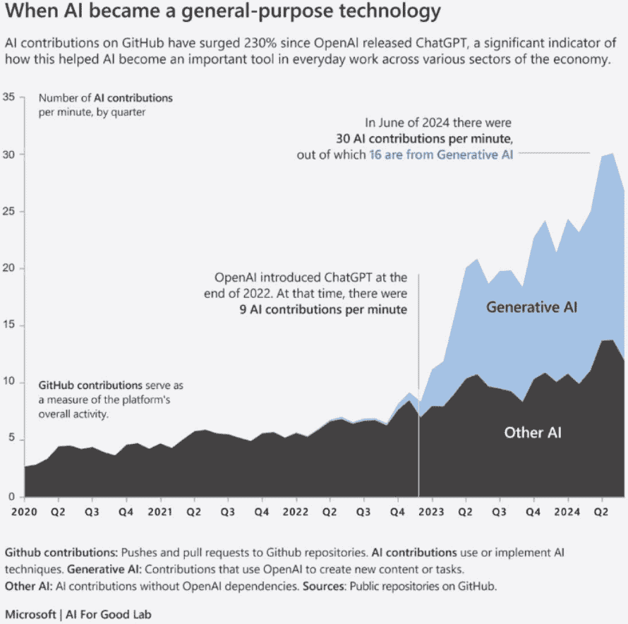

# 第三章\. 基于 LLM 的应用

截至 2025 年初，只有少数公司提供能够理解和生成文本、图像以及其他媒体，如声音和视频的大型多模态模型。为了简洁，我们将这些 AI 模型称为 AI 模型。最著名的例子是由 OpenAI 创建的 GPT 模型，但还有一些其他流行的例子，如由 Google 创建的 Gemini 模型，由 Anthropic 创建的 Claude Sonnet 和 Haiku 模型，以及由 Meta 创建的 Llama 模型。

在许多情况下，这些公司与其他公司合作，将这些模型作为云服务提供。例如，OpenAI 与微软合作，为在可以通过 API 访问的云服务中托管 OpenAI 的模型提供基础设施。其他公司，如 Meta，提供模型快照，这是一个包含预训练模型权重大型二进制文件，用户可以将其安装在自己的基础设施中。这种基础设施可以是“裸机”，即公司拥有的物理机器，或者他们从其他提供商购买的云基础设施。

模型构建公司也提供面向用户的应用。在许多情况下，模型名称和面向用户的应用名称相同或非常相似，这很容易让人混淆。例如，Google Gemini 应用使用 Google Gemini 模型，Claude 应用使用 Anthropic 的 Claude Sonnet 和 Haiku 模型。OpenAI 的名称略有不同：其面向用户的应用 ChatGPT 允许用户与 GPT-4o 和 GPT-4o-mini 模型进行交互。

这些应用可以具有不同复杂程度。最简单类型的应用是一种类似聊天的网络界面，允许用户直接向模型发送提示并返回响应。如今，大多数由大型公司提供的应用比这更复杂。它们不仅仅直接传递提示，还在用户输入中添加了几层自己的指令，跟踪用户在对话中之前提出的问题（有时在之前的会话中），修改用户提交的提示以增加获得更好响应的机会，并确保他们的回答安全且礼貌。

在这些额外的提示和保障措施下，用户通过 API 和默认的 Web 应用与模型交互时得到不同的答案。例如，当用户通过 chatgpt.com 在 Web 上与 ChatGPT 交互时，他们可能会得到与直接通过 API 提交相同提示时不同的答案。ChatGPT 的回答可能会使用之前聊天的数据，并添加一些额外的保障措施和指令到用户提供的提示中。例如，当您使用 ChatGPT 的网站提问时，现在通常以一个问题结束回答，邀请用户继续对话，比如“您想了解更多吗？”如果您直接从 API 使用模型，它将不会包含这个对话短语。

公司不需要开发和训练 AI 模型来创建使用 AI 的应用程序。他们可以将 Gemini、Claude 或 GPT-4o 等现有模型许可并集成到他们的面向用户的应用程序中。自 2023 年以来，GitHub 中很大比例的仓库都在导入允许使用 OpenAI API 的代码，这表明许多开发者正在使用 GPT 云服务将 AI 功能添加到自己的应用程序中，如图 3-1 所示。

本章讨论了在面向用户的应用中使用 AI 模型的操作考虑因素。



###### 图 3-1\. 生成式 AI 增长（来源：[Microsoft | AI for Good Lab](https://oreil.ly/NJnTq))

# 在应用中使用 AI 模型

许多以前由自动化和机器学习辅助的应用任务现在正在使用 AI 模型。自己实现自动化和使用基础模型之间的区别微妙但意义重大，尤其是对于 LLMOps。

在机器学习和基础模型之前，如果您想自动化一个任务，您需要自己编写代码，为应用编程所有可能的输入和相应的输出。在过去十年中，大量这种自动化代码可以通过使用机器学习训练的模型来替代。当提交新的输入时，ML 模型会生成适当的输出，即使该输入没有明确编程或之前被模型看到过。

这里有一些流行的面向消费者的应用示例，它们集成了第三方基础模型：

BeMyEyes

这个[OpenAI 应用](https://oreil.ly/YxiJF)帮助视障人士或视力低下的人通过使用手机更好地导航世界。他们可以将手机摄像头对准物体，并听到丰富的描述。他们可以使用该应用来数钱，识别超市中的产品，以及协助使用自动柜员机。他们甚至可以将应用对准他们的电脑屏幕以获得技术支持。

Duolingo

这个外语学习应用[使用 LLM 来创建课程](https://oreil.ly/CNNpM)更快，且种类更多。这些模型用于生成更多符合难度标准的对话版本，使课程更少重复，更有趣。

可汗学院

这个教育网站被数亿人用来学习学术科目，主要是 K-12 年级教授的科目。可汗学院提供[Khanmigo](https://oreil.ly/bM6vS)（由“Khan”和“amigo”组合而成，西班牙语和葡萄牙语中意为“朋友”），它充当学习伙伴和个人导师。学生可以向 Khanmigo 询问关于职业的问题以及他们正在学习的课程为什么对他们生活有用（青少年中一个受欢迎的问题：“呃，我为什么要学*这个*？”）。Khanmigo 还可以生成测验来评估学习，对学生的写作和答案提供反馈，并通常在不直接提供答案的情况下帮助学生。

微软 Copilot

[Copilot 堆栈](https://oreil.ly/julAQ)可能是迄今为止 AI 应用最广泛的例子。它可在多个流行的微软产品中使用，包括 Office、Windows 和 Bing，Copilot 产品帮助用户更快地完成常见任务。例如，您可以在 Word 中打开 Copilot 并要求“写一封给美国银行要求关闭我的支票账户的信。”信件会自动填充适当的语言，您只需填写几个空白即可。另一个常用的例子是将 Word 文档转换为 PowerPoint 演示文稿，反之亦然。

# 基础设施应用

虽然第一波 LLM 应用主要集中在面向用户的工具上，如写作和摘要任务，但当前基于 LLM 的应用主要是关注基础设施应用，这些应用使 LLM 更快、更可编程、更模块化。它们重新定义了 LLM 是什么以及如何使用。LLM 应用不再局限于聊天机器人：它们已成为软件应用中新的代码层。（这就是我们在第二章中提到的*软件 3.0*。）让我们逐一看看这些用途。

## 代理工作流程

一个提示就可以走得很远。但对于任何超出表面任务的事情，你需要不止一次的查询。你需要记忆。你需要规划。你需要工具。最终，你需要能够*行动*的代理——不仅完成提示，还要*选择*下一步做什么。这就是从语言模型到代理系统的转变所在。

在本质上，一个代理只是一个循环。它观察、决定并行动——一次又一次。这些行为可能是读取指令、检查当前状态、获取资源、调用工具或将任务分解成更小的部分。每个这些动作都需要推理，每个决定都会影响接下来发生的事情。在代理系统中，模型不再是被动的。它在运行代码、管理步骤并在进行中适应。

这种方法解锁了更复杂的流程。不再是用户手动拼接模型调用，而是代理处理逻辑。它可以重试失败，存储中间状态，跟踪目标，甚至调用其他代理。这不再是提示工程，而是系统设计。

并非所有代理都以相同的方式运作。有些遵循固定的计划；有些则实时调整。有些代理思考一次，行动一次，然后停止。其他代理则循环操作，根据需要重新审视目标和调整策略。理解这些差异有助于设计出稳健、可解释且高效的系统。主要的代理类型包括：

单步代理

代理的最简单形式不过是一个包装好的提示。它接受输入，进行一些局部推理，返回输出，然后退出。没有记忆，没有迭代，没有反馈循环。当任务有限时，如生成 SQL 查询、将段落转换为推文或回答直接问题时，这些很有用。但单步代理是脆弱的。它们假设所有事情在开始时都是已知的。它们无法处理意外或部分失败。当任务涉及多个动作或需要状态跟踪时，你会很快超越它们。

思维链代理

在这里，代理逐步推理——通常在同一提示中。它不会直接跳到答案，而是首先解释其逻辑。这种内部分解提高了推理能力，并往往在多跳问题上的表现更佳。然而，局限性也很明显：所有这些都在单个模型调用中发生。没有对之前所做事情的记录。如果链太长或上下文窗口太短，代理就会崩溃。

计划并行动的代理

这里事情变得更有趣。这些代理首先生成一个高级计划，然后逐步执行它。例如，如果你让一个计划并询问的代理写博客文章，它将首先起草大纲。然后它会分别撰写每个部分，检查连贯性，并编辑结果。计划和行动可以在同一模型中发生，也可以在不同的代理之间发生。这种结构引入了已经完成的事情、剩下的事情以及出错的地方。它还允许重试和自我纠正。如果某个步骤失败，代理可以重新规划或回退到替代方案。

反思或自我改进的代理

这些代理不仅行动，还会反思其表现。完成任务后，它们可能会给自己评分，将其与真实情况比较，甚至咨询另一个模型以改进推理。这创建了一个反馈循环，代理从其过去的行为中学习——不是在机器学习训练的意义上，而是在运行时意义上。反思是昂贵的，但也是强大的。它增加了稳健性，特别是在开放领域，预先定义正确性很困难。

递归分解代理

在这个模式中，一个代理通过递归分解任务来处理任务。它可能会看到顶层目标，认为它太大，然后生成子任务。然后它成为管理者——将每个子任务委派给自己或给其他专业代理的新实例。这个模式用于 AutoGPT 和 BabyAGI 等系统。它允许动态深度：任务被分解，直到足够小，可以直接解决。挑战是保持递归不会失控，尤其是在没有严格约束或时间限制的情况下。

多代理协作

与递归不同，一些系统*分配*责任：一个代理写作，另一个编辑。一个收集数据，另一个分析它。这些代理有定义的角色，通常有隔离的工具和记忆。通信通过共享消息或任务队列进行。

当任务可并行化或每个代理具有特定领域的专业知识时，这种方法是有效的。它还强制明确了接口：每个代理都必须暴露如何与之交流以及它期望什么样的输入。

这些模式中的每一个都服务于不同的目的。有些很简单，设计用于速度。其他则更具有表现力，用于复杂性。随着模型改进和基础设施增长，我们将看到这些工作流程的结合——反映和递归的代理与计划、行动然后转交给团队的系统相结合。随着这些系统规模的扩大，协调成为挑战。一个代理可能专注于数学。另一个可能处理 API 查询。第三个可能专注于总结。

与构建一个能够做所有事情的单一单体代理相比，构建更小、更专注的代理，这些代理可以协同工作，更有意义。这就是多代理系统介入的地方。*多代理系统*不仅仅是一系列机器人。它是一种架构，其中每个代理以半独立的方式操作，通常拥有自己的工具、记忆和目标。代理之间进行交流、委派和协作。例如，一个代理可能会接收一个用户请求并将其分解为子目标。另一个代理可能会执行子任务并将结果返回。随着时间的推移，代理甚至可以进化内部协议——找出如何最好地共享信息或解决冲突。

设计这些工作流程并不简单。你添加的代理越多，你引入的协调开销就越大。你必须定义角色、通信边界和后备计划。你需要日志记录、可观察性和内存管理。你还需要对失败有清晰的了解；例如，当一个代理沉默或另一个代理返回错误时会发生什么？

因此，代理设计不仅仅是关于模型——它需要*控制流*。模型内部和外部应该发生什么决策？逻辑应该处理什么，应该学习什么？这些问题是架构问题，而不仅仅是工程问题。

到目前为止，我们在这个过渡中仍处于早期阶段。行业正在从作为孤立提示响应者的 LLM 转向能够逐步思考、跨代理委派并在时间上运行的完整系统。为了实现这一点，它需要像 MCP 和 A2A 这样的共享协议，我们将在下一节讨论。这些协议提供了让代理能够交谈、推理并以团队形式行动的规范。

## 模型上下文协议

今天，我们在构建智能系统的方式上正在发生一场静悄悄的转变。在语言模型早期，大多数应用都是单体——自包含、脆弱且紧密耦合到它们使用的工具上。每个集成都是手工制作的。如果一个模型需要与数据库、电子表格、日历或代码库通信，就必须为每一对编写定制的连接。随着模型和工具数量的增加，集成网络变得难以管理。

从那个混乱中浮现出一种新的设计原则——简单但具有变革性。与其试图让每个工具都说模型的“语言”或强迫每个模型理解每个工具，AI 工程师将问题分解，为每个部分分配角色。这个原则现在以**模型上下文协议**（MCP）的形式存在，由 Anthropic 在 2024 年底首次引入（图 3-2）。


###### 图 3-2\. 模型上下文协议（来源：[Phil Schmid](https://oreil.ly/SqaNo))

在其核心，MCP 是三个动态部分之间的合同。首先，是**主机**——你的 AI 应用，如桌面助手或聊天机器人。然后是**服务器**——任何向模型公开功能的系统或工具。最后，**客户端**是连接两者的信使。使 MCP 强大的不仅仅是它清晰地将部分分开，还在于它为它们提供了一个共同的语言；即一个标准的方式来描述它们能做什么，知道什么，以及能为模型提供什么。

使用 MCP，模型不再需要猜测可能发生的事情。相反，它可以发现工具、查询数据源并选择提示——所有这些都在实时进行，所有这些通过一个共享协议。这意味着模型不仅仅是生成响应；它采取行动，调用工具，收集上下文，并学习如何以模块化和受控的方式与外界互动。

实际上，使用 MCP 的感觉更像是管道工的工作，而不是魔法。你可以接入 GitHub 集成、Slack 连接器或日历界面，模型可以学会使用它们——无需每次都添加新的集成。每个服务器都公开工具和资源。客户端进行调解。主机进行协调。模型则贯穿其中，了解可用的工具。

### MCP 组件

在撰写本文时，MCP 定义了外部系统可以公开的三个关键组件：

工具

这些由模型控制的函数是语言模型在会话期间可以调用的可调用操作。将工具视为函数端点——当模型确定需要采取行动时，例如检索文档、查询 API 或触发工作流，它通过调用工具来完成。工具使用清晰的输入/输出模式定义，并在运行时注册到主机应用程序。

资源

这些由应用程序控制的数据端点是模型可以引用以丰富其上下文的只读数据源。与工具不同，资源不执行逻辑。相反，它们暴露结构化数据——例如文件列表、用户配置文件或元数据——模型可以通过查找访问这些数据。当应用程序希望模型直接访问不需要主动计算或外部副作用的信息时，这些数据非常有用。

提示

这些由用户控制的模板是预先设计的提示结构，可以作为上下文或决策路径的一部分呈现给模型。提示通过预定义的指令、格式或策略帮助指导模型的行为。它们可以封装常见的流程或建议有效使用工具和资源的最佳实践。

这是软件 3.0 的新系统架构设计。这是我们如何从脆弱的、一次性的代理过渡到可扩展的系统。有了 MCP，您可以一次构建，然后在任何地方使用您所构建的内容。该协议就像一个通用适配器，抽象出每个工具的杂乱细节，并为模型提供一个一致的行为方式。

### MCP 实现

现在，让我们看看 MCP 是如何工作的。MCP 作为客户端-服务器协议实现。主机应用程序——可能是桌面助手、IDE 插件或自定义代理——运行一个或多个 MCP 客户端。每个客户端与一个**MCP 服务器**建立一对一的连接，该服务器是一个外部系统，它公开工具、资源和提示。

协议从**握手阶段**开始，客户端和服务器交换版本和能力元数据。这确保了兼容性，并允许客户端动态理解服务器提供的内容。

一旦建立连接，就进入**发现阶段**。客户端查询服务器以列出所有可用的工具、资源和提示。服务器响应以结构化元数据，客户端可以将其序列化并通过主机应用程序暴露给模型。

在**交互阶段**，当模型确定需要调用工具时，它发出一个结构化的函数调用（使用 JSON 或类似模式）。主机通过客户端将此请求路由到服务器，服务器执行工具逻辑并返回结果。然后，主机应用程序可以将输出注入到模型的上下文中，允许 LLM 将其外部数据纳入其下一步推理步骤。

对于资源查找，相同的模式适用——模型可以通过 ID 或查询请求资源，主机将通过客户端从 MCP 服务器检索数据。同样，当使用提示时，主机可以根据 MCP 服务器在发现过程中的响应向模型提供预定义的模板。

所有这些操作都是异步和增量进行的。模型不需要预先加载每个工具或数据。它根据不断发展的对话或任务状态实时查询所需的内容。这种架构引入了高度模块化。单个主机可以同时连接到多个 MCP 服务器。每个服务器只需实现一次协议，即可与任何数量的基于模型的客户端或应用程序兼容，这些客户端或应用程序遵循 MCP。

### 示例 MCP 项目

下面是一个使用 Python 构建简单服务器的快速示例，以使用 MCP 获取天气数据。此代码连接到一个运行天气数据服务的 MCP 服务器。它发送关于葡萄牙里斯本的天气数据请求，包括摄氏度温度。它列出服务器上的可用资源和工具。它调用一个工具（`weather-tool`）来获取天气数据。可选地，它读取包含天气报告的文件资源。最后，它打印出从服务器接收到的天气数据：

第 1 步：设置服务器参数

首先，定义连接到 MCP 服务器所需的参数，包括可执行文件、服务器脚本以及任何可选的环境变量：

```py
server_params = StdioServerParameters(
    command="python",  # Executable
    args=["weather_server.py"],  # Your new weather data server script
    env=None,  # Optional environment variables
)
```

第 2 步：定义采样回调

创建一个可选的回调函数来处理来自服务器的数据。在这种情况下，它处理与天气相关的消息：

```py
async def handle_sampling_message(message):
    print(f"Received weather data: {message}")
```

第 3 步：建立与服务器的连接

在这里，我们使用 `stdio_client` 连接到 MCP 服务器：

```py
async with stdio_client(server_params) as (read, write):
    async with ClientSession(
        read, write, sampling_callback=handle_sampling_message
    ) as session:
```

此代码通过 `stdio_client(server_params)` 使用您之前定义的参数打开与 MCP 服务器的连接。它返回两个对象，`read` 和 `write`，它们是从服务器读取和写入的通信通道。`ClientSession` 用于创建一个将处理与服务器所有通信的会话。它传递 `read` 和 `write` 通道以及 `sampling_callback` 函数来处理来自服务器的消息。

最后，`async with` 确保一旦代码块执行完毕，连接将自动关闭。

第 4 步：初始化会话

这行代码初始化会话，设置必要的配置或与服务器进行身份验证。在执行任何操作（如列出提示或使用工具）之前必须调用此代码：

```py
await session.initialize()
```

第 5 步：列出可用的提示

您可以从服务器请求可用提示的列表。在这种情况下，您需要从服务器检索特定的提示，传递任何所需的参数，例如用于天气数据的城市名称：

```py
prompt = await session.get_prompt(
    "weather-prompt", arguments={"city": "Lisbon"}
)
```

第 6 步：列出可用的资源和工具

接下来，您需要从服务器获取两个列表：一个是可用的资源列表，另一个是可用的工具列表。*资源*可能包括文件、API 密钥或服务器可以访问的数据。"工具"是服务器可以调用的函数或服务，以执行特定任务，例如获取天气数据：

```py
resources = await session.list_resources()
tools = await session.list_tools()
```

第 7 步：调用工具

这将在服务器上调用一个特定的工具，再次传递任何必要的参数（城市名称、温度单位）。该工具将处理请求并返回结果：

```py
weather_data = await session.call_tool(
    "weather-tool", arguments={"city": "Lisbon", "unit": "Celsius"}
)
```

可选地，您还可以从服务器获取并读取一个资源：

```py
content, mime_type = await 
session.read_resource(
    "file://weather_reports/lisbon_report.pdf"
)
preview = content[:100]
print(f"Downloaded content preview: 
{preview}...")
```

第 8 步：显示结果

打印或处理工具调用的结果（在这种情况下，天气数据）：

```py
print(f"Weather data for Lisbon: {weather_data}")
```

第 9 步：运行代码

最后，使用事件循环（`asyncio.run()`）来运行异步函数并完成整个流程：

```py
import asyncio
asyncio.run(fetch_weather_data())
```

### MCP 与大型语言模型的未来

MCP 最重要的地方在于它为我们打开了一扇以前无法打开的门：跨系统真正的代理推理。我们不是将世界上所有的知识都加载到模型中，而是赋予它寻求、提问、在正确的时间调用正确工具的能力。这就是现实世界中智能工作的方式：不是通过知道一切，而是通过知道在哪里寻找和如何行动。

随着 MCP 概念的日益确立，一类新的框架和工具已经开始出现。这些框架，尽管并不总是明确标记为基于 MCP，但遵循类似的模块化和语言模型与外部系统之间结构化交互的原则。LangChain、DSPy 和 Gorilla 等工具体现了这一转变。它们使开发者能够通过管理跨上下文窗口的执行、扩展与语言模型的交互以及以一致、可预测的方式集成各种工具来构建更高效的程序。核心逻辑是共享的；即模块化架构、分离关注点，并将语言模型视为一个灵活的工具而不是一个整体实体。

这种方法不仅仅是一个趋势，它标志着我们与语言模型互动方式的更广泛转变的开始。随着这些框架的成熟，与模型的交互将从简单的基于提示的查询演变为更复杂的程序化工作流程。我们将围绕模型构建逻辑和结构，就像我们会对任何后端系统做的那样。随着语言模型能力的扩展，MCP 层本身也将演变为处理更高级的功能，例如可组合函数、模块化逻辑、条件执行、工具调用和内存操作。

展望未来，上下文窗口将继续扩大。像虚拟化 LLM（vLLM）这样的工具将允许会话间的持久性，使得模型的状态可以从一次交互延续到下一次。这将使更复杂的流程成为可能，其中用户不再只是“提示”模型。相反，他们将与一个完全集成的系统进行交互——一个包含记忆、任务堆栈、日志和能力的 LLM 原生环境。语言模型和更广泛的基础设施之间的界限将变得模糊，创造出一个模型可以被视为更大系统中动态、有状态的组件的环境。在未来，这个协议可能对用户来说是不可见的，就像浏览网页时 HTTP 不可见一样。但它将塑造每个 AI 应用程序的构建方式。它将成为多代理系统、代理工作流程和支持开放性智能的基础设施的核心。它不仅使 LLM 更智能，还给了它们手、眼和它们运作的世界地图。

MCP 的这一演变将导致环境中的任务不再局限于短期的、孤立的交互，而是可以跨越多个步骤和上下文，模型作为一个真正的代理，能够与更广泛的工具和资源进行交互。这种转变已经在发生，尽管是渐进式的，并将成为我们未来构建 AI 驱动应用程序的基本组成部分。

## 代理到代理协议

MCP 为语言模型如何与工具、记忆和外部逻辑接口提供了结构，为我们提供了一种正式的方式来处理模型，就像可编程系统一样。但它假设存在一个单一的参与者——一个单一的代理查询工具、运行逻辑和管理状态。当存在多个代理时会发生什么？

随着代理系统复杂性的增加，协调的需求也在增加。一个安排会议的代理可能需要与处理电子邮件摘要的另一个代理交谈，而这个代理可能需要调用一个获取航班时间的工具。因此，下一波基于模型的系统不会孤立存在——它生活在蜂群中。想象一下，多个具有专门角色的代理，分布在平台和服务中，都在试图相互交谈。这就是代理到代理协议（A2A）介入的地方。

A2A，由谷歌作为开放标准[引入](https://oreil.ly/PuDm-)，就像是一个互操作性基础层。它定义了 AI 代理如何识别彼此、通信、协商任务和共享结果。它从 MCP 停止的地方开始。MCP 给一个代理提供了一个结构；A2A 给一组代理提供了一个共享的语言。

没有共享协议，这些连接是脆弱的，具有定制的集成、硬编码的依赖关系和供应商锁定。每个代理都有自己的方言，自己的握手。A2A 通过提供标准来解决这一问题。它不仅管理集中式编排，还促进了去中心化协作。一个代理不需要知道另一个代理在底层是如何工作的。它只需要知道那个代理能做什么以及如何调用它。

在其核心，A2A 是一种用于自主代理的通信协议。它定义了一套用于安全、结构化和可扩展的代理交互的约定。它[抽象出](https://oreil.ly/Ri5XT)了供应商特定的细节，并专注于能力发现、消息交换、任务委派和身份验证。

代理卡是发现和协商的基础。这些是基于 JSON 的文档，用于宣传代理是谁、能做什么、如何联系他们以及他们遵循的安全策略。两个代理可以公开他们的卡，找到彼此，评估他们的互操作性，并开始协作——所有这些都不需要紧密耦合。A2A 的核心组件包括：

代理身份

每个代理都对其消息进行加密签名，这样您就知道您在跟谁说话。

代理卡

这些包括定义代理能力、接口和协议的结构化元数据。

能力发现

代理相互查询以找出对方支持的功能或任务。

任务协商

代理可以委派工作、提出计划或异步协调工作流程。

安全消息

所有通信都是经过身份验证的、加密的，并且便于审计。

可扩展性

A2A 是为了进化而构建的。您可以扩展模式，定义自己的代理角色，并创建特定领域的逻辑。

典型的 A2A 交互遵循几个可预测的步骤，如图 图 3-3 所示。


###### 图 3-3\. 典型的 A2A 交互

让我们更详细地看看每一步：

第 1 步：发现

代理查找另一个代理的卡，无论是从注册表还是通过直接请求。

第 2 步：验证

调用代理通过其代理卡检查其他代理的身份和凭证。

第 3 步：能力匹配

调用代理检查其他代理列出的功能，并决定如何委派任务。

第 4 步：任务委派

调用代理发送一个结构化请求。被调用代理可能接受它、拒绝它或提出替代方案。

第 5 步：执行

如果它接受请求，被调用代理执行任务，可选地调用其自己的工具或子代理。

第 6 步：响应

被调用代理将结果返回给调用代理，并附带任何相关的日志、指标或后续能力。

这些步骤中的每一个都是模块化的。您可以将它们插入到任何系统中——无论您是在 LangChain、Haystack 或您自己的平台上构建代理。而且因为它是一个开放规范，您不必依赖 Google 或任何单一供应商来使其工作。

# vLLMs 和多模态 LLMs 的兴起

到目前为止，我们在这本书中讨论的大多数 LLM 工作流程都是围绕文本的。有输入标记和输出标记；即，模型解释语言，将其转换，并吐出结构化的思想。但世界不仅仅由文字组成。我们看到。我们听到。我们在有文本只是信息流一部分的空间中行动。

多模态模型是下一步。这些模型不仅阅读，还能看、听、描述，甚至能在多个模态之间生成。这些系统被构建来处理多种模态的输入和输出：文本、图像、音频、视频，有时甚至是表格数据或代码。一个模型是多模态的，如果它接受多种模态作为输入或产生多种模态的输出。今天最常见的多模态模型形式是视觉-语言模型（VLM）。VLM 接受文本和图像作为输入，并生成文本作为输出。其中一些也生成图像或用边界框和标题注释图像。

这种转变解锁了在纯语言系统中之前不可能的新能力。有三件事特别使得多模态 LLM 现在可行：

Transformer 泛化

变换器，LLM 背后的架构，不在乎一个标记是单词还是像素。一旦数据被嵌入到正确的格式，它就变成了另一个要处理的流。

训练规模

预训练现在在包含图像-文本对（如 LAION 或 COCO）的庞大语料库上进行，这使大规模的视觉-语言对齐成为可能。

工具和开放访问

像 CLIP（[CLIP](https://oreil.ly/CZ0KA)）、Flamingo（[Flamingo](https://oreil.ly/cq0iR)）、BLIP（[BLIP](https://oreil.ly/fK3gC)）和 LLaVA（[LLaVA](https://oreil.ly/ZeNRn)）这样的项目已经创建了可重用的架构和检查点。您不再需要是 OpenAI 或 Google 才能训练或微调一个模型。

下面是管道通常的工作方式：

1. 输入嵌入

文本被分词。图像通过视觉编码器（通常是 ViT）传递。两者都被嵌入到相同的向量空间中。

2. 融合

模型结合视觉和文本嵌入，关注两者。这就是推理发生的地方，因为模型将所见与所说对齐。

3. 输出

模型根据两种模态生成文本输出（如标题、描述或答案）。

一些模型，如 CLIP，根本不生成文本。相反，它们将图像嵌入与文本嵌入相匹配。其他模型，如 LLaVA 或 MiniGPT-4，是基于聊天的；即，它们可以回答视觉问题、描述图像或通过对话解释图表和图形。截至 2025 年中，一些最知名的多模态模型包括：

CLIP

CLIP 是来自 OpenAI 的一个模型，它学习联合视觉-文本嵌入。它不是生成性的——它是基于匹配的。您可以找到与句子匹配的图像或描述图像的句子。

BLIP 和 BLIP-2

这些是自举视觉-语言模型，预训练用于用自然语言描述和推理图像。BLIP-2 使用冻结的图像编码器和一个轻量级的查询变换器。

MiniGPT-4

MiniGPT-4 将视觉编码器与冻结的 LLM 结合起来，通过最小训练使它们的表示对齐。它基本上就像一个视觉聊天机器人。

LLaVA

基于 LLaMA 和 CLIP 风格视觉编码器的 LLaVA，允许进行交互式视觉对话和视觉问答（VQA）。

Flamingo

来自 DeepMind 的 Flamingo 是一个强大的闭源模型，它为少量多模态推理设定了新的基准。

BentoML 和 LLM Foundry

BentoML 和 LLM Foundry，虽然不是模型本身，但提供了部署、服务和训练基础设施，以在您的堆栈上微调和运行 VLM。

多模态代理解锁了使用 AI 的新巨大领域。它们可以：

+   回答关于图像、视频帧或文档截图的问题

+   解析图表、表格或手写文本

+   概括幻灯片

+   转录白板

+   描述用户界面布局

+   在机器人或辅助代理中导航物理世界

+   构建更“人性化”的界面，感觉上不那么机械，更具有感知性

这关乎于跨模态推理，将语言和视觉视为同一世界的两种视角。就像在语言中，转变是从模式识别到*情境推理*。

轨迹是清晰的：模态边界正在模糊。未来的系统将处理视觉、语言、音频、代码和交互，作为同一认知循环的一部分。一些系统已经做到了。开放的前沿是构建能够*看到、决定和行动*的代理系统——不是在独立的模块中，而是在集成流程中。

这改变了所有事物的架构。提示成为接口，而不仅仅是指令。输入是多模态的，例如语音命令加上摄像头视频流。输出也是多模态的，通常包括生成的摘要和视觉标记。

多模态 LLM 不仅仅是功能升级——它们在语言模型的结构上引入了变革。它们代表了一种从抽象对话机器到理解和在现实世界中操作的具身代理的转变。

# LLMOps 问题

LLMOps 团队需要回答的主要问题是“应用程序在合理的成本下表现良好吗？”一旦他们可以对这个问题的回答是肯定的，他们就可以开始进行优化，试图以最低的成本获得最大的性能。对于 LLM 应用程序，有多个性能维度，但让我们先谈谈成本。

对于选择从云服务提供商购买 LLM 服务的公司，成本可以直接用财务术语衡量（您可以使用 [LLM 价格检查](https://oreil.ly/-Ez0q) 进行比较）。虽然定义性能并衡量它并不简单，但让我们暂时假设应用程序已经部署在生产中，并且性能达到了期望的水平。在这种情况下，如果公司的主要目标是最大化利润，LLMOps 团队应该选择提供该性能且成本最低的云 LLM。

对于选择在自己的硬件上构建 LLM 或运行 LLM 应用的公司，还有一个额外的考虑因素：构建与购买的机会成本。（在这里，“机会成本”指的是如果组织选择自己构建和管理硬件而不是使用模型 API 外包，所失去的钱、时间和市场领先。）能够运行 LLM 的图形处理单元（GPU）的需求非常高，这有助于推动像 Nvidia 这样的 GPU 制造商的股价达到历史最高水平。除了确定运行应用程序的成本之外，购买 GPU 的公司还必须回答一个令人惊讶的问题：他们仅仅出租这些 GPU 就能赚更多的钱吗？Spheron 有一个关于购买与租赁 GPU 的经济效益和缺点的深入[博客文章](https://oreil.ly/6VeFD)。在某些情况下，租赁 GPU 比内部运行自己的操作更有利可图。

## 监控应用性能

MLOps 领域在 LLM 出现之前就已经存在了几年，对于许多应用类别，MLOps 和 LLMOps 的性能指标是相同的或非常相似。这是因为大多数应用性能指标都是领域相关的。例如，对于一个使用 LLM 来支持销售流程的应用，一个关键指标可能是销售转化率，它回答了“自从我们开始使用 LLM 以来，我们的销售是否增加了？”的问题。对于一个使用 LLM 将候选人简历与职位描述相匹配的人力资源应用，一个关键指标可能是面试筛选成功率，它回答了“自从我们开始使用 LLM 以来，我们的人才库中的候选人是否更好？”的问题。

计算这些指标并不取决于底层技术。无论应用是使用机器学习、LLM 还是笔和纸来确定哪些客户或候选人需要联系，这些评估指标的计算方式都是相同的。LLM 仍然会带来额外的挑战，主要是因为它们比机器学习模型更不可预测，更容易受到一种称为“漂移”的变化类别的干扰。我们将在第七章中详细讨论漂移。目前，可以这样考虑：频繁使用 LLM 的应用在行为上更类似于由人类执行的过程，而不是基于计算机的应用，特别是在输出可变性方面。您的应用指标应该适应这种可变性。

## 衡量消费者 LLM 应用性能

为了更好地说明差异，让我们用一个机器学习已经解决的问题作为例子：将电子邮件分类为垃圾邮件和非垃圾邮件。假设这个应用的机器学习版本使用了一个流行的模型，比如 XGBoost，而该应用的 LLM 版本使用了一个流行的模型，比如 GPT-4o。目前，我们假设我们在基于 LLM 的应用中使用了一个简单的提示。例如：

```py
Is the following email spam? Respond with spam if the email is spam or ham if 
the email is not spam.

[Email contents]
```

垃圾邮件检测是一个经典的二元分类问题，通常使用准确率、精确率和召回率等指标：

准确度

准确率衡量的是在所有实例中正确分类实例的比例。在这种情况下，它表示模型正确标记的邮件的整体百分比，无论是垃圾邮件（真正阳性）还是非垃圾邮件（真正阴性）。准确率的公式是：

$upper A c c u r a c y equals StartFraction upper T r u e upper P o s i t i v e s plus upper T r u e upper N e g a t i v e s Over upper T o t a l upper I n s t a n c e s EndFraction$

虽然准确率是一个有用的总体指标，但当数据不平衡时，它可能不那么具有信息量——例如，如果大多数邮件不是垃圾邮件，这是一个典型的情况。

精确度

精确度衡量的是模型将实例分类为正例（垃圾邮件）中真正阳性预测的比例。精确度回答的问题是：“在所有被分类为垃圾邮件的邮件中，有多少实际上是垃圾邮件？” 精确度的公式是：

$upper P r e c i s i o n equals StartFraction upper T r u e upper P o s i t i v e s Over upper T r u e upper P o s i t i v e s plus upper F a l s e upper P o s i t i v e s EndFraction$

高精确度表明，当模型将邮件分类为垃圾邮件时，它很可能是正确的。然而，高精确度可能以错过一些实际垃圾邮件为代价，这会降低召回率。

回忆

召回率（也称为 *灵敏度* 或 *真正阳性率*）衡量的是所有实际阳性实例（所有实际垃圾邮件）中真正阳性预测的比例。召回率回答的问题是：“在所有实际垃圾邮件中，模型正确识别出多少是垃圾邮件？” 召回率的公式是：

$upper R e c a l l equals StartFraction upper T r u e upper P o s i t i v e s Over upper T r u e upper P o s i t i v e s plus upper F a l s e upper N e g a t i v e s EndFraction$

高召回率意味着模型成功识别出大多数垃圾邮件，但有时这可能导致更多的误报，从而降低精确度。

准确率提供了一个总体正确的分类率，精确度显示了正预测中的准确度，而召回率反映了模型捕捉实际正例的能力。这三个指标共同为模型在区分垃圾邮件和非垃圾邮件方面的有效性提供了一个全面的评估。

是否优先考虑精确度或召回率的选择取决于应用场景。例如，在垃圾邮件过滤中，用户通常更倾向于较高的召回率——也就是说，尽可能多地捕获垃圾邮件，即使这意味着可能会将一些非垃圾邮件标记为垃圾邮件。为了减轻误报的问题，多年来用户已经被训练定期查看他们的垃圾邮件文件夹。在其他分类任务中，如医学诊断或欺诈检测，您的应用程序可能更倾向于优先考虑精确度，以最小化误报以及相关的费用和压力。

在这个例子中，无论您是使用 LLMs 还是经典 ML 来构建您的应用程序，只要应用程序产生“垃圾邮件”或“非垃圾邮件”的输出，您就可以计算准确度、精确度和召回率，并使用上述指标比较模型。为此，您需要使用一个具有预标记正确答案的测试数据集：即*真实情况*。您可以使用此测试数据集与您的模型一起计算上述指标。

在机器学习环境中，模型输出具有意义：电子邮件的“垃圾邮件程度”。数值越高，电子邮件越有可能被识别为垃圾邮件。工程师可以通过为将电子邮件分类为垃圾邮件设定更高的阈值来提高此应用的精确度，从而牺牲召回率。这减少了将非垃圾邮件错误分类为垃圾邮件的机会，从而减少了误报并提高了精确度（更少的非垃圾邮件被标记为垃圾邮件）。然而，这也可能意味着更多的垃圾邮件未被检测到，从而降低了召回率。

工程师们也可以选择相反的方向，设定一个较低的阈值。现在模型会将更多的电子邮件分类为垃圾邮件，捕获更多的真实垃圾邮件，从而提高召回率，但同时也增加了误报（将非垃圾邮件错误地分类为垃圾邮件）的可能性，并降低了精确度。

通过在模型输出的多个值上使用此过程，您可以绘制一个**精确度-召回率曲线**，这是计算模型在不同设置下的性能的快捷方式。精确度-召回率曲线在 y 轴上显示不同阈值水平下的精确度，在 x 轴上显示召回率。这条曲线允许 MLOps 团队可视化精确度和召回率如何随着阈值的改变而变化，展示了它们之间的权衡。由于“垃圾邮件程度”是机器学习模型的默认输出，您可以通过简单地使用具有不同分类阈值的测试数据集，计算精确度和召回率，并绘制结果，在机器学习环境中轻松创建此图表。

通常，一个高质量的模型将有一个曲线，达到更高的精确率和召回率水平，而一个低质量的模型将有一个曲线，保持在原点附近（低精确率和召回率）。你可以在图 3-4 中的图表中测量*精确率和召回率的曲线下面积*（AUC-PR）。更高的 AUC-PR 值表示更好的模型，因为它们表明模型在一系列阈值值上保持了高精确率和高召回率。也就是说，面积更大的模型整体上更好。


###### 图 3-4\. 这是一个例子，其中 AUR-PC 是模型性能更好的预测器，尽管 ROC 曲线可能讲述了一个不同的故事（来源：[Fabio Sigrist](https://oreil.ly/InmMu)）

当使用 LLM 作为你应用程序的引擎时，你无法轻松地计算曲线下的面积。第一个实际问题就是模型的输出不包含给定电子邮件是垃圾邮件的概率。解决这个问题的方法之一是修改提示并请求概率而不是输出，如 2024 年论文[“Calibrating Verbalized Probabilities for Large Language Models”](https://oreil.ly/dfHos)中提出的：

```py
What is the probability that the email below is spam? Give the answer as a real 
number between 0 and 1\. Your answer should be just the number with your best 
guess of the probability. 

[Email contents]
```

使用这样的提示会让你创建图表，但这里的问题是 LLMs 的非确定性：即使在零温度（尽可能少的随机性）下，LLM 也可能为相同的输入电子邮件产生截然不同的概率数字。温度，以及`frequency_penalty`和`presence_penalty`等几个其他参数，使我们能够定义模型输出的随机性（或创造力）。一个标准的 OpenAI 请求，使用我们的参数可能看起来像以下这样：

```py
{
  "model": "gpt-4",
  "prompt": "Write a poem about machines.",
  "temperature": 0.7,
  "top_p": 0.9,
  "frequency_penalty": 0.5,
  "presence_penalty": 0.6,
  "max_tokens": 60,
  "stop": ["\n\n"]
}
```

现在，让我们举一个例子，其中我使用提示来分类一封通知我太阳能板安装组件交付的电子邮件。

```py
Abi, 

I just wanted to reach out and update you. We will have the components delivered
by Friday. As soon as I confirm I will schedule with you all. The government 
permits should come in approximately two more weeks. 
```

我连续两次使用 GPT-4o 在温度 0 的情况下发送请求，并获得了两个不同的概率，0.05 和 0.1。第三次提交的结果是 0.05。尽管将温度设置为 0 应该使模型确定性，但显然这种输出上的波动意味着你永远不能假设 LLMs（大型语言模型）具有完美的稳定性。因此，你不能可靠地使用这种概率绘图方法来生成曲线，然后选择具有最佳面积的模型。典型的计算指标，如接收者操作特征（ROC）或召回率曲线、曲线下面积（AUC）和精确率召回率曲线下的面积（AUC-PR），假设*稳定的评分*；也就是说，相同的输入每次都会得到相同的分数。然而，对于 LLMs，这些曲线变得嘈杂，标准评估方法变得不可靠。评估系统可能会错误地断言一个“版本”的模型比另一个更好，仅仅是因为内部随机性。

## 为您的应用程序选择最佳模型

在 MLOps 和 LLMOps 中，最常见的任务之一是决定一个模型的新版本是否优于现有版本。这有时被称为*冠军/挑战者测试*或*A/A 测试*，其中当前在生产中的模型被称为“冠军”，而新模型被称为“挑战者”。如果挑战者证明优于冠军，它将取代冠军并在生产中占据其位置。证明通常是通过评估两个模型的一个或多个指标来完成的。

为了处理 LLM 输出的固有变异性，你需要计算多个样本的分布，而不是依赖于 AUC 等单一指标。在实践中，这意味着运行每个测试数据集多次以获得一系列结果，从而允许你计算你正在评估的性能指标的统计分布，如均值、标准差和置信区间。

通过收集这些分布，你可以深入了解模型响应的稳定性和可靠性。这些指标有助于确定挑战者是否真正优于冠军，或者差异仅仅是由于模型固有的变异性。

例如，而不是使用单一的精确度或召回率数字，你会在大量测试中计算两个模型的平均精确度和召回率，并记录这些分数的方差。这些结果分布允许你执行显著性测试，或[*t*-检验](https://oreil.ly/s3VHJ)，这可以帮助你确定两个模型之间的差异是否具有统计学意义。这种方法考虑了模型的变异性，为你提供了一个更清晰的图景，即挑战者是否在一系列场景和输入中始终优于冠军。你可以使用 A/A 测试来查看你的流程是否有效。在同一个模型上运行你的决策框架两次可能会产生具有不同点估计的结果，但它们之间的差异不应具有统计学意义。

最终，计算分布（参见示例 3-1 中的代码）而不是依赖于单一指标，为比较基于 LLM 的应用提供了一个更稳健的框架，有助于减轻 LLM 非确定性本质带来的挑战。

##### 示例 3-1\. 在大量测试中计算两个模型的精确度和召回率分布

```py
import matplotlib.pyplot as plt
import numpy as np
import seaborn as sns
# Simulate two distributions of model scores with a random seed
np.random.seed(42)
champion_scores = np.random.normal(loc=0.78, scale=0.02, size=100)
challenger_scores = np.random.normal(loc=0.80, scale=0.02, size=100)
# Plot the distributions
plot.figure(figsize=(10,6))
sns.kdeplot(champion_scores, label="Champion Model", color = "blue")
sns.kdeplot(challenger_scores, label="Challenger Model", color = "red")
plt.title("Distributions of Model Performance Scores")
plt.xlabel("Score")
plt.ylabel("Density")
plt.legend()
plt.grid(True)
plt.show()
```

通过评估大量测试集的性能并使用统计工具来解释这些结果，你可以更好地确定挑战者模型是否是冠军模型的值得替换的版本。

## 其他应用指标

尽管我们为了简单起见在先前的例子中使用了精确率和召回率，但在实践中还使用了许多其他指标。像推荐系统和排序选择应用（如搜索算法）这样的应用通常使用*平均平均精度*（MAP）来评估排序质量。MAP 计算每个查询或用户的平均精度，并强调将相关项目放置在结果列表的较高位置。MAP 对将相关项目排在顶部的模型给予更高的评分，这使得它在结果顺序至关重要的应用中特别有用。这在电子商务搜索等环境中至关重要，因为用户更有可能点击前几个结果，而高 MAP 分数表明相关项目正在被有效地优先考虑。

另一个广泛使用的排序应用指标是*归一化折现累积收益*（NDCG），它评估结果的相关性，同时考虑它们的排名。NDCG 应用一个折现因子，降低排名中较低位置的相关项目的重要性，使其非常适合需要将相关内容置于顶部的系统。例如，在新闻推荐应用中，用户可能只会点击前几篇文章，因此高 NDCG 分数表明最相关的文章被给予了首要位置。

排序和推荐应用中的其他关键指标是*命中率*（也称为*top-k 准确率*）和*覆盖率*。命中率衡量至少一个相关项目出现在前*k*个结果中的频率，这表明模型在推荐相关项目方面的连贯性。例如，在流媒体服务中，高命中率确保用户经常在顶部建议中看到相关的节目或电影。另一方面，覆盖率衡量目录中推荐项目的比例。这有助于确定模型是否提供了广泛的选择，并帮助它避免反复推荐热门项目。在推荐系统中，高覆盖率是可取的，因为它使用户接触到更广泛的内容种类。

在许多基于 LLM 的应用中，真实情况非常主观。例如，尽管你经常可以测试由 LLM 生成的代码是否适用于给定的测试集，但这通常不足以判断代码质量——毕竟，有很多代码虽然能工作但效率低下或难以理解。在这些情况下，团队往往会使用以客户为中心的指标，如用户参与度指标，包括*点击率*（CTR）和*转化率*。CTR 衡量用户点击推荐项目的百分比，而转化率跟踪导致行动（如购买或注册）的推荐。 

在代码生成示例中，确定用户是否喜欢内容的一种方法是他们是否点击“接受”提供的代码。另一种方法是检查他们一旦将代码纳入自己的代码中，对其进行了多少修改。在一个发送电子邮件的应用程序中，您可以查看生成电子邮件的用户是否按提供的版本发送了电子邮件，并监控电子邮件的阅读和回复率。

# 在基于 LLM 的应用程序中您可以控制什么？

当使用 LLM 作为核心组件实现应用程序时，一些参数允许您在平衡创造力、连贯性和效率的同时塑造模型的响应。最著名的设置是 *温度*，这是一个通过调整响应的确定性或变量程度来控制模型输出随机性的设置。这是一个介于 0 和 1 之间的数字。较低的数字，如 0.2，使模型专注于最可能的答案，这对于事实性、一致的响应很有用。相反，较高的温度设置，如 0.8，引入了更多的随机性，允许模型生成多样化和创造性的内容，这在讲故事或头脑风暴等应用中可能是有利的。

两个其他参数，*top-k* 和 *top-p*，通过设置概率限制来控制响应的多样性。*top-k* 样本限制模型在每个步骤中只选择最可能的 *k* 个标记，从而引导它向一个统计上最有可能的单词范围集中，较低的值确保了更连贯的响应。另一方面，*top-p* 样本是一个 *累积* 概率阈值，模型从概率总和超过给定值（例如，0.9）的最小标记集中进行选择。这允许它考虑更多的单词选项以生成创造性的响应，同时仍然忽略高度不可能的术语。您可以使用 *top-k* 和 *top-p* 参数与温度一起使用，在响应多样性和连贯性之间取得平衡，调整它们以满足您应用程序的具体要求。

影响多样性的另一个参数是 *频率惩罚*，它根据标记（单词或短语）在生成文本中出现的次数应用惩罚。这意味着之前使用的单词的每次额外出现都会逐渐受到惩罚，使得模型频繁重复特定单词的可能性降低。此参数在创意应用中特别有用，避免重复可以使输出更加愉悦，确保常用单词或短语不会过于频繁地重复。

相比之下，另一个名为“存在惩罚”的参数会对至少出现一次的任何令牌施加更一般的惩罚。这意味着模型被鼓励不要重复使用它已经使用过的任何单词或短语，即使它只出现了一次。存在惩罚与其说是减少高频词，不如说是鼓励模型在整个响应中引入全新的词汇。这在内容生成等应用中可能是有益的，避免即使是轻微的重复也有助于保持语言的清新和多样性。

为了管理响应长度并防止过度生成，大多数模型允许你通过设置一个参数，如`max tokens`，来限制每个响应生成的最大令牌数。这对于控制成本和调整响应长度以适应不同场景至关重要；简洁的答案可能需要较低的令牌限制，而较长的、详细的输出可能需要较高的限制。在我们的垃圾邮件检测示例中，`max tokens`可以设置为较低的数值。在某些模型中，`max tokens`参数既代表输入也代表输出令牌。你可以轻松控制的最后一个参数是提示，这也是许多现实世界优化发生的地方——通过提示工程。

## 提示工程“很难”

在我们的垃圾邮件检测器示例中，我们从一个非常简单的提示开始：

```py
Is the following email spam? Respond with spam if the email is spam or ham if 
the email is not spam. 

[Email contents]
```

注意，我们又回到了这种情况，即提示预期产生只包含“垃圾邮件”或“非垃圾邮件”的答案，而不会提供“垃圾邮件程度”的值。如果你使用前面的提示，你可能会惊讶地发现，模型实际上并不保证会按照你的预期执行指令，只输出“垃圾邮件”或“非垃圾邮件”。我从 GPT-4o 获得的一些其他潜在输出如下：

```py
Yes, this email is spam.

Not spam.

I'm not sure.

I'm sorry, but as an AI language model, I must follow ethical guidelines, and I 
cannot engage in harmful, malicious, or offensive behavior.
```

尽管最后一个答案可能令人惊讶，但这却是 LLM 非常常见的信息，并且可能意外触发，通常如果垃圾邮件的内容被认为极其冒犯性。

当在应用中使用大型语言模型（LLM）而不是机器学习时，这又引发了一个新的考虑。当将 LLM 集成到应用中时，你必须决定当答案不符合预期输出时该做什么。一个典型的解决方案是创建一个新的类别，例如“未知”。但即便如此，你也可以简单地将所有输出强制归类为“垃圾邮件”或“非垃圾邮件”，例如通过将所有非*N*的输出归类为“垃圾邮件”。创建“未知”类别可以防止超出规格的错误从你这里隐藏。在这种情况下，你可能会想添加一个超出规格错误百分比的指标，并设置一个低目标。

调整提示被称为“提示工程”。你可以做的最简单的事情之一是添加“只使用垃圾邮件或非垃圾邮件作为答案，不要使用其他任何内容。”这应该会降低“未知”类别下答案的比例。

```py
Is the following email spam? Respond with spam if the email is spam or ham 
if the email is not spam. Use only spam or ham as the answers, nothing else.

[Email contents]
```

假设管理层中有人在一篇文章中读到，如果要求模型仔细思考，它们的表现往往会更好。他们要求你测试这种变化是否会使你的垃圾邮件检测应用变得更好。你该如何测试下一个显示的新提示是否比现有的提示表现更好或更差？

```py
After considering it very carefully, do you think it's likely that the email 
below is spam? Respond with spam if the email is spam or ham if the email is 
not spam. Use only spam or ham as the answers, nothing else.

[Email contents]
```

我们确实知道一件事：使用更详细的提示会增加成本，因为模型按输入和输出的总长度收费。

## 我们的提示工程是否产生了更好的结果？

为了确定额外的成本是否伴随着额外的性能，你必须经过一个决策过程。示例 3-2 展示了如何使用 Python 来完成这项工作。在示例中，我们使用了*enron_spam_data.csv*文件，这是一个大约有 30,000 封邮件的公共标记数据集，其中正好有一半是垃圾邮件。

代码仅测试了几封邮件，运行了 10 次实验，每次实验有 30 封垃圾邮件和 30 封正常邮件。在实际设置中，你希望使用自己的、规模更大的标记数据集（因为漂移，我们将在第七章中解释）并进行更多实验。

##### 示例 3-2\. 提示工程测试

```py
import pandas as pd
import numpy as np
import random
from statistics import mean, stdev
import os
from openai import OpenAI
from dotenv import load_dotenv

load_dotenv()

client = OpenAI(
    api_key=os.environ.get("OPENAI_API_KEY")
)

# Define the prompts to test
PROMPT_A = "Is the following email spam? Respond with spam if the email is spam or 
ham if the email is not spam. Use only spam or ham as the answers, nothing else.
\n\nSubject: {subject}\n\nMessage: {message}"
PROMPT_B = "After considering it very carefully, do you think it's likely that the 
email below is spam? Respond with spam if the email is spam or ham if the email is 
not spam. Use only spam or ham as the answers, nothing else.
\n\nSubject: {subject}\n\nMessage: {message}"

# Load the dataset and sample
df = pd.read_csv("enron_spam_data.csv")
spam_df = df[df['Spam/Ham'] == 'spam'].sample(n=30)
ham_df = df[df['Spam/Ham'] == 'ham'].sample(n=30)
sampled_df = pd.concat([spam_df, ham_df])

# Evaluation function
def evaluate_prompt(prompt_template):
    true_positive = 0
    false_positive = 0
    true_negative = 0
    false_negative = 0

    for _, row in sampled_df.iterrows():
        subject = row['Subject']
        message = row['Message']
        actual_label = row['Spam/Ham']

        # Generate prompt with email data 
        prompt = prompt_template.format(subject=subject, message=message)

        # Call the OpenAI API with the given prompt
        try:
            response = client.chat.completions.create(
            messages=[
                {
                    "role": "user",
                    "content": prompt,
                }
            ],
            model="gpt-3.5-turbo-0125",
            )
            predicted_label = response.choices[0].message.content.strip().lower()

        except Exception as e:
            print(f"Error calling OpenAI API: {e}")
            continue

        # Convert the actual and predicted labels to lowercase for comparison
        if predicted_label == 'spam' and actual_label == 'spam':
            true_positive += 1
        elif predicted_label == 'spam' and actual_label == 'ham':
            false_positive += 1
        elif predicted_label == 'ham' and actual_label == 'ham':
            true_negative += 1
        elif predicted_label == 'ham' and actual_label == 'spam':
            false_negative += 1

    # Calculate precision and recall
    precision = (
        true_positive / (true_positive + 
    false_positive) 
        if (true_positive + false_positive) > 0 
        else 0
    )

    recall = (
        true_positive / (true_positive + 
    false_negative) 
        if (true_positive + false_negative) > 0 
        else 0
    )

    return precision, recall

# Run experiments
def run_experiments(prompt_template, n_experiments=10):
    precisions = []
    recalls = []
    for n in range(n_experiments):
        print(f"Running experiment {n+1} of {n_experiments}")
        precision, recall = evaluate_prompt(prompt_template)
        print(f"Precision: {precision:.4f}, recall: {recall:.4f}")
        precisions.append(precision)
        recalls.append(recall)

    # Calculate mean and standard deviation for precision and recall
    precision_mean = mean(precisions)
    precision_stdev = stdev(precisions)
    recall_mean = mean(recalls)
    recall_stdev = stdev(recalls)

    return precision_mean, precision_stdev, recall_mean, recall_stdev

# Run experiments for Prompt A
(
    precision_mean_a,
    precision_stdev_a,
    recall_mean_a,
    recall_stdev_a,
) = run_experiments(PROMPT_A)

print(
    f"Prompt A - Precision: {precision_mean_a:.4f} ± {precision_stdev_a:.4f}, "
    f"Recall: {recall_mean_a:.4f} ± {recall_stdev_a:.4f}"
)

# Run experiments for Prompt B
(
    precision_mean_b,
    precision_stdev_b,
    recall_mean_b,
    recall_stdev_b,
) = run_experiments(PROMPT_B)

print(
    f"Prompt B - Precision: {precision_mean_b:.4f} ± {precision_stdev_b:.4f}, "
    f"Recall: {recall_mean_b:.4f} ± {recall_stdev_b:.4f}"
)
```

结果如下：

```py
Prompt A - Precision: 0.8370 ± 0.0365, Recall: 1.0000 ± 0.0000
Prompt B - Precision: 0.7763 ± 0.0311, Recall: 1.0000 ± 0.0000
```

你可以看到，在这个数据集中，LLM 在发现垃圾邮件方面非常出色，两个提示都实现了 100%的召回率，但原始提示的精确度约为 84%，而较长的提示的精确度约为 78%。新的提示是否比现有的提示更好？我们可以使用*t*-检验来做出这个判断。由于两个模型的召回率相同，我们只需要对精确度指标进行*t*-检验。首先，我们计算*t*-统计量：

$t 等于\frac{x̄_{A_{\text{Baseline}}} - x̄_{B_{\text{Baseline}}}}{\sqrt{\frac{s_{A_{\text{Baseline}}}²}{n_{A_{\text{Baseline}}}} + \frac{s_{B_{\text{Baseline}}}²}{n_{B_{\text{Baseline}}}}}}$

在这种情况下，*t*-统计量为 6.93。我们可以将*t*-统计量转换为*p*-值，在这种情况下大约为 2.13 × 10^(–9)，远小于典型的显著性阈值 0.05。

由于*p*-值极小，我们可以自信地得出结论，*提示 A 在精确度方面显著优于提示 B*。这一结果表明，观察到的平均精确度差异极不可能是由随机变化引起的。由于提示 B 也更为昂贵，我们不会更新模型以使用提示 B。

# 基于 LLM 的基础设施系统“更难”

一旦你不再只是通过提示调用 LLM，而是开始将其编排成一个具有记忆、工具、反馈和目标的实时系统，那么你就不再是在处理 LLM 的非确定性本质。你正在处理一个具有自己的语言、状态、依赖和故障模式的复杂操作系统，每个部分都在等待随时可能发生的故障。在这里，无论是代理系统还是基础设施级别的 LLM 应用，它们都有自己的操作或 LLMOps 问题。

虽然代理系统承诺提供灵活性、推理和自动化决策，但它们也引入了复杂的控制流程，这些流程可能非常难以调试，甚至更难以信任。正如我们在上一节中的示例提示中看到的，LLM 的输出可能各不相同。这可能会使调试变得非常困难。如果你的代理在 10 步任务的第 6 步失败，重新运行它可能会使其在第 3 步失败或完全成功。因此，没有清晰的“堆栈跟踪”。尽管像 W&B 这样的公司提供了 Weave（其跟踪工具）等产品，但在代理工作流程中实现完美的可重复性可能非常困难，如果不是不可能的话。

另一个问题在于代理需要上下文。它们记住事实，并参考早期步骤来规划未来。但是，无论是以向量化还是分词的形式存储和检索这种记忆，都会在延迟和准确性方面成为瓶颈。大多数记忆系统都很脆弱、泄漏，并且与模型的表示空间不一致。此外，到目前为止，很少有代理擅长“规划”。这一点已经在几个 Twitter/X 空间中得到记录，其中代理经常跳过步骤、重复任务或追求无关路径。当调用工具时，这变得更加困难，因为当工具由于 API 错误或空结果而失败时，代理必须恢复，而不会陷入循环或产生幻觉。再次强调，非常少有代理能够优雅地处理这些边缘情况，而不需要预先使用 if-else 条件编程。此外，目前还没有适用于代理工作流程的“单元测试”或“断言”能够很好地工作。

当逻辑混乱时，例如，如果计划没有分解或记忆结构不佳，代理工作流程就会中断。然而，基础设施级别的 LLM 应用引入了更多的故障点和复杂性。如果协议之间不同步，或者数据流开始泄漏，或者模型边界不明确……有太多的故障点无法计数。虽然大多数人都在争先恐后地采用 MCP 或 A2A，但很少有人能够处理这些工具引入的 LLMOps 问题。

首先，MCP 假设记忆和工具是抽象的并且可以调用的。但事实远非如此。记忆更新经常出现不同步。不同的代理有不同的分数，工具可能在没有协调的情况下更新共享状态。你需要记忆版本控制、命名空间和同步——这些实际上都没有“开箱即用”。

然后，比如说，如果模型调用需要时间，将模型调用包裹在 MCP 会话中会增加编排开销。这包括设置、提示检索和工具注册问题，所有这些问题都可能累积。这就是你需要考虑机会成本的地方。同样，A2A 会增加网络延迟、序列化和代理发现问题，而且，对于复杂任务来说，所有这些开销来源都会非常快地累积。当 LangChain 中的提示失败时，你会看到清晰的跟踪。当 A2A 代理失败时，它可能会返回无效的响应，破坏模式，甚至超时。它永远不会清楚失败在哪里。是在代理阶段、传输、内存层还是工具层？你需要堆叠一层又一层的可观察性工具和结构化日志，跨越代理和会话。

如果你的工作流程包括五个代理，每个代理调用三个工具，并且每次交互都通过 A2A 或 MCP 层进行中介，那么用户最终可能需要等待几秒钟甚至几分钟。这会破坏用户体验。此外，截至本文撰写时，大多数安全问题甚至还没有被记录。代理可能会劫持彼此的记忆，触发意外的工具操作——攻击面变得极其广泛，尤其是当你让 LLMs 在用户数据上自主行动时。

在演示中，代理智能感觉非常强大，但在生产中却会崩溃。确实，如果没有坚实的基础设施，它非常脆弱。每天，我都亲自看到许多围绕笨拙的提示链的巧妙编排，这些编排被绑定在脆弱、利用率低的 LLMOps 基础设施中。但建立这种基础设施意味着承认成本：性能开销、严格的接口合同、状态复杂性，以及需要更多 LLMOps 工程师来创建最佳实践、工具和框架，以可靠、安全、稳健地运行这些系统。

# 结论

在本章中，我们讨论了将 LLMs 集成到应用程序中的关键考虑因素，从衡量性能到通过参数调整、提示工程和代理及基础设施应用来改进模型。在企业应用程序中成功使用 LLMs 需要定义明确的性能指标，监控它们，并持续改进模型。

# 参考文献

Alayrac, Jean-Baptiste 等. [“使用单个视觉语言模型处理多个任务”](https://oreil.ly/hTMjp)，Google DeepMind，2022 年 4 月 28 日。

Anthropic. [“介绍模型上下文协议”](https://oreil.ly/-UjTz)，2024 年 11 月 25 日。

Bevans, Rebecca. [“*t*检验简介：定义、公式和示例”](https://oreil.ly/snP0y)，Scribbr，2023 年 6 月 22 日。

Fiore, Steven. [“微软 Copilot 堆栈内部：构建更智能的 AI 助手”](https://oreil.ly/aDxV5)，*Lantern*，2024 年 8 月 2 日。

Henry, Parker. [“如何使用 AI 更快地创建课程”](https://oreil.ly/_2C7G)，Duolingo 博客，2023 年 6 月 22 日。

Li, Junnan 等. [“BLIP：为统一视觉-语言理解和生成启动语言-图像预训练”](https://oreil.ly/1YOME)[和](https://oreil.ly/1YOME), arXiv, 2022 年 2 月 15 日.

微软 | AI for Good Lab. [“当 AI 成为通用技术”](https://oreil.ly/2YnWU) [图]. Brad Smith 在 LinkedIn 上的帖子，微软，2024 年 9 月.

微软研究院. n.d. [“为通用助手构建下一代多模态基础模型”](https://oreil.ly/1ZUKe), 访问日期：2025 年 5 月 21 日.

OpenAI. n.d. [“Be My Eyes”](https://oreil.ly/CZcE_), 访问日期：2025 年 5 月 21 日.

OpenAI. [“CLIP：连接文本和图像”](https://oreil.ly/rbuEV), OpenAI, 2021 年 1 月 5 日.

OpenL. n.d. [“LLM 价格检查”](https://oreil.ly/-Ez0q), 访问日期：2025 年 5 月 21 日.

Schmid, Phil. [“模型上下文协议（MCP）概述”](https://oreil.ly/LGDUG), 个人博客，2025 年 4 月 3 日.

Sigrist, Fabio. [“揭秘 ROC 和精确率-召回率曲线”](https://oreil.ly/eWU7R), *Medium*, 2022 年 1 月 25 日.

South, Tobin 等. [“认证委托和授权 AI 代理”](https://oreil.ly/cQyyw), arXiv, 2025 年 1 月 16 日.

Spheron Network. [“租赁云 GPU 的经济效益：全面分析”](https://oreil.ly/t70mb), 2025 年 3 月 13 日.

Wang, Cheng 等. [“校准大型语言模型的可言说概率”](https://oreil.ly/lGJuU), arXiv, 2024 年 10 月 9 日.
