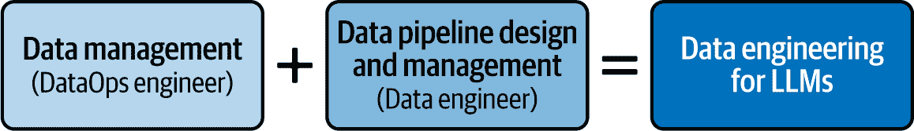

# 第四章：LLMs 的数据工程

在本章中，你将了解数据工程、数据管理实践以及可用的数据库工具和系统。讨论将面向希望成为 LLMOps 工程师或领导其公司数据工程工作的数据、DevOps 和 MLOps 工程师。到本章结束时，你将深刻理解数据工程的基础，以及 LLMs 的最佳实践。

# 数据工程与 LLMs 的兴起

在 20 世纪 60 年代末，英国计算机科学家爱德华·F·科德博士刚刚完成他在自我复制计算机方面的博士学位，当时他在 IBM 工作。科德对数据排列理论产生了浓厚的兴趣，并在 1970 年发表了一篇内部 IBM 论文，题为[“大型共享数据银行的关系数据模型”](https://oreil.ly/JG1bn)，介绍了我们今天所知的*关系数据库*。例如，与包含所有关于产品及其销售给客户的客户信息的销售表不同，关系数据库将这些数据存储在多个相关表中：一个用于客户，一个用于产品，一个用于销售。在关系数据库出现之前，像客户地址变更这样简单的事情就需要更改该客户的全部销售记录，这在主机上是一项昂贵的操作。在关系数据库中，你只需更改客户记录，所有相关的记录都会被更新。

虽然这篇论文一开始并没有引起 IBM 任何人的兴趣，但它却吸引了包括 Oracle 创始人拉里·埃里森在内的几位其他计算机科学家和爱好者的注意，埃里森开发了并销售了第一个与 IBM 主机兼容的关系型数据库。IBM 还开发了一种查询数据库的语言，最初命名为 SEQUEL，但现在称为结构化查询语言（SQL），后来成为了一种标准。1981 年，Codd 在关系型数据库方面的工作为他赢得了图灵奖，这是计算机科学界最负盛名的奖项。鉴于关系型数据库的普及以及管理系统需求的增加，1983 年 IBM 创建了其自己的数据库管理系统，称为 DB2。关系型数据库成为了行业标准，被广泛应用于索引、编目等方面。在 IBM 和 Oracle 管理这些企业系统的人员被称为*数据库管理员*，通常缩写为 DBAs。（数据工程师这一称号在 2010 年代随着云计算的兴起而变得流行。）

Codd 后来与人合著了另一篇论文，[“为用户分析师提供 OLAP：一项 IT 指令，”](https://oreil.ly/gUwKl)，这篇论文提出了*在线分析处理*（OLAP）这一术语，用来指代一种快速处理和查询多维数据的系统。OLAP 是当今大多数数据处理系统的基础。

在 1990 年，蒂姆·伯纳斯-李创建了万维网，这极大地增加了生成和记录的数据量。虽然其中很多数据是有结构的，意味着具有固定最大长度和类型，如邮政编码，但也有很多数据是无结构的，长度和类型可变，如音乐、论文和视频。关系型数据库将信息组织到具有预定义列和强数据类型的表中。由于表中的每一行都必须遵循相同的模式，因此它们在处理高度结构化数据和支持复杂、基于 SQL 的查询方面表现出色，这些查询将多个表连接在一起，并具有一致的 ACID（原子性、一致性、隔离性、持久性）保证。这使得它们成为交易系统（如银行、库存和传统商业应用）的首选选择，在这些系统中需要数据完整性和跨表关系，但不太适合互联网中存在的无结构数据。

*非关系型*（NoSQL）数据库的出现是为了解决关系型系统处理效率较低的工作负载——大量、快速变化或结构松散的数据集。键值存储通过将唯一键与数据配对来实现快速查找。一种特定的键值存储，即文档数据库，将每条记录存储为自包含的 JSON 文档，允许每个文档都有自己的形状。这种灵活性非常适合内容管理系统、产品目录和其他字段在记录之间变化的领域，这在互联网数据中非常常见。键值数据库还可以在*大对象*（blobs）中存储二进制文件，如视频和图像，这使得它们非常适合在新的数据环境中使用。

此外，我们还有向量数据库和图数据库。*图数据库*专注于表示相互关联的实体。它们不存储表或文档，而是存储节点和边，这使得可以进行毫秒级路径查找查询，例如社交网络中的朋友的朋友搜索、供应链影响分析或发现文档之间的关系。

*向量数据库*旨在存储和索引高维嵌入——密集的数值向量，这些向量捕捉了文本、图像、音频或其他内容的语义意义。它们不是寻找精确匹配，而是使用*近似最近邻*（ANN）算法，在多维空间中返回与查询向量最接近的项的向量。这使得它们成为语义搜索、推荐系统、图像或音频相似度匹配以及提供相关上下文以毫秒级速度的*检索增强生成*（RAG）管道背后的引擎。

由于每个模型在访问模式上都有其优势，现代应用通常将它们结合起来：一个关系型存储用于 ACID 兼容的事务；一个文档或键值存储用于灵活的半结构化内容和媒体块；一个图数据库用于关系本身是主要数据的情况；以及一个向量数据库用于任何依赖于“有意义相似性”的东西。大部分数据工程工作包括在这些数据库类型之间选择合适的平衡，并将它们的数据组合成所需的应用。

LLMs 正在推动数据存储和管理领域的另一次革命。在 LLMs 出现之前，数据科学家和分析师依赖于更简单的 NLP 任务技术，例如将文本数据表示为数值特征（这是机器学习算法所需的）。分析文档集合（称为*语料库*）的两种最常用的方法被称为*词袋模型*（BoW）和*词频-逆文档频率*（TF-IDF）。这两种方法都将非结构化文本转换为结构化的、基于矩阵的格式，这些格式可以由传统的机器学习算法处理。BoW 将文本表示为一个稀疏矩阵，其中每一行对应一个文档，每一列对应语料库中的一个单词。每个单元格中的值反映了该单词在文档中出现的次数（称为*词频*，或 TF），忽略单词顺序但保留频率。TF-IDF 在 BoW 的基础上通过使用一个衡量该单词在整个语料库中稀有程度的指标来加权 TF（称为*逆文档频率*，或 IDF）。这种调整减少了像*the*和*and*这样的常见单词的影响，同时强调了在上下文中更有信息量的术语。

这些矩阵表示通常存储在结构化或二进制数据格式中，并使用适合数据大小的工具进行处理。在 LLMs（大型语言模型）成为主流之前，NLP（自然语言处理）工作流程的核心是一套工具，包括 Python 包如 Pandas 和 NumPy，它们提供了高效框架来操作 BoW（词袋模型）和 TF-IDF（词频-逆文档频率）矩阵，以及 Parquet 和 HDF5，用于存储和查询更大的、预处理过的数据集。在生产环境中，PostgreSQL、MongoDB 和 Elasticsearch 等数据库被广泛用于存储、索引和查询 NLP 数据，尤其是对于需要快速检索或搜索能力的应用。这些工具使得搜索引擎、推荐系统、情感分析和文本分类模型等应用的开发成为可能。

LLMs 兴起的主要贡献之一是嵌入（embeddings）的发展。正如你在第一章中学到的，嵌入是将文本数据转换为数值表示——实数向量——的算法，同时也编码了意义。有了嵌入，具有相似意义的单词和短语比具有不同意义的单词和短语“更接近”。这导致了*向量数据库*的引入，这是一种新型数据库，可以存储向量以及其他元数据项，并使用机器学习算法进行查询。正如第二章中提到的，LLMOps 是一个用于创建和维护在生产中可靠、健壮和可扩展的 LLM 应用的框架。然而，正如俗话所说，你的模型只比你的数据好：“垃圾进，垃圾出。”让我们更进一步，说你的 LLMOps 成熟度只与你的数据工程系统相当。

在其早期，数据管理工作主要是关于获取、存储和检索数据。机器学习和 LLMs 增加了新的步骤，如将数据转换为适当的表示，这需要额外的技能。为了获得这些技能，公司有两个选择，正如我们在上一章中讨论的：要么雇佣 LLM 工程师，提升他们的技能，并将他们整合到数据团队中；要么雇佣数据工程师，将他们整合到 LLM 开发团队中，并将他们提升为 LLMOps 工程师。

无论哪种方式，从特定任务到通用机器学习模型的转变只会继续下去。数据市场巨大且在增长，与 LLMs 合作的公司需要熟练的专业人士来管理他们的数据工程系统。

# 数据操作工程师的角色

数据操作工程师通常具有作为数据工程师或数据科学家的先前经验，并具备额外的专业知识，以应对大规模领域组成、数据数量和数据质量等方面的复杂性。他们擅长诸如全局去重和动态数据选择等高级技术，以实现持续的微调。

为大型语言模型（LLMs）进行数据工程涉及设计、开发和管理工作流程和基础设施，以支持这些模型的训练、评估和部署。数据操作工程师（DataOps engineers）实施和优化扩展定律；在质量和数量之间平衡权衡；并管理多样化的、大规模的数据集。然而，他们的角色不仅限于管理数据流程。他们负责 LLMs 的整个数据生命周期，从数据获取到部署，并在高度复杂和不断演变的领域中持续提升模型性能。

这个专业方向标志着从过去的数据工程和管理实践到一次重大的演变，需要数据工程师的日常工作采用更加复杂和有针对性的方法。在 LLM 时代之前，数据工程主要由将定义良好、主要是结构化数据从运营源移动到数据仓库和湖泊以进行报告或分析的数据管道主导。重点在于批量的 ETL/ELT 作业、维度建模、缓慢变化的维度以及将数据质量视为模式符合性、引用完整性和基本去重等治理实践。非结构化文本可能会存档在数据湖中，但它很少被视为一等公民；搜索和分析工作负载仍然围绕行、列和聚合 SQL 进行。

以 LLM 为中心的工作负载改变了所有的一切。现在，原材料是异构的文本、代码、图像、音频和聊天日志，其价值取决于*语义丰富性*——即内容的信息价值——而不是严格的结构。管道必须标记、分块、嵌入和版本化此内容；将其存储在向量索引中进行相似性搜索；并应用过滤以保护个人身份信息、毒性以及许可约束。而不是 ETL 作业，团队运行连续的摄取和重新嵌入循环，以便 RAG 系统保持新鲜，并记录每个提示-响应对，以便可以评估输入和输出并提高该系统的未来性能。在此背景下，数据质量由扎根、事实性和偏见指标来判断——这些属性需要自动化的红队和人工介入（HITL）审查，而不是过去的数据结构违规检查。

因此，现代数据工程堆栈现在将传统的仓库与对象存储、向量数据库和特征存储相结合。Airflow 和 Dagster 等编排框架与 LLMOps 工具共存，治理范围扩展到涵盖模型卡片、数据集营养标签以及每个标记的来源追溯。支持 LLM 将数据工程从“行和列的管道”转变为“成为语言和知识的所有者和守护者”。

数据工程直接影响到机器学习和 LLM 的表现。在训练过程中使用的质量、类型和数量的数据可以决定模型的有效性。这里还有两个额外的复杂性。第一个是，几乎所有用于 LLM 的数据都是非结构化的。第二个是，数据量更多。这两个差异使得一些任务变得更加困难。例如，在传统的机器学习中，你可以检查数据输入是否存在异常值，可能通过丢弃所有将某人年龄列为负数或超过 130 岁的记录。这在使用非结构化数据时要困难得多，使得 LLM 的数据管理比非生成性 ML 模型的数据工程要复杂得多。

# 数据管理

虽然*数据管理*侧重于管理组织的资产数据，*数据工程*涉及设计并构建数据存储、处理和分析的基础设施。一个有效的 LLM 数据工程团队需要一位数据操作工程师，专注于数据管理，以及一位数据工程师，专注于数据管道设计和管理（见图 4-1）。他们共同整合多样化的数据源，帮助 LLM 更好地学习，并帮助避免诸如幻觉和偏差等问题。

###### 图 4-1\. LLM 数据工程的组件

对于 LLM 的数据管理有两种基本方法：静态和动态。*静态数据管理*意味着在整个训练过程中保持数据集不变。这可能导致诸如重复数据不适应模型变化需求等问题。*动态数据管理*涉及在模型训练过程中持续更新和调整数据。这种方法更灵活，但处理起来可能更复杂，因为它需要持续关注数据的质量和相关性。

一些方法在训练过程中动态调整数据集。例如，*动态数据修剪*随着训练的进行移除不那么有用的示例，而*二元分类器*可以根据模型遵循指令的好坏来帮助确定何时提前停止。其他技术包括选择提供最多信息的任务或通过迭代过程细化任务。

## 合成数据

到本文写作时，一些新的模型，如微软 Phi-4 和 DeepSeek-R1，已经通过使用*合成数据*——从现有数据自动创建并保持其统计属性的数据——展示了性能提升。例如，从一个包含 100 名真实篮球运动员的身高、位置和得分记录的数据集中，你可以使用统计技术创建大量与现有运动员相似但不存在运动员的记录，从而增强数据集。为了合成创建用于训练 LLM 的长格式文本，数据操作工程师经常使用老一代的文本生成模型。

如我们之前提到的，在任务组成方面，平衡数量和质量是关键。更大的数据集通常意味着更多样化和高质量的数据，这通常会导致更好的性能，但也需要高效的数据处理管道。为了构建强大的模型，数据操作工程师需要掌握编排：在适当的时候自动应用这些技术。

## LLM 管道

那么，传统机器学习和 LLM 之间有什么不同，为什么我们需要不同的管道？

如前所述，在传统的 ML 中，你通常处理的是**结构化数据**——在表格或电子表格中整齐排列的数字。数据来自数据库、传感器或 API。它是干净的、可管理的、直接的。传统的 ML 在很大程度上依赖于**特征工程**，其中数据工程师将原始数据塑造成有用的形式，制作出数值特征，为模型提供它需要做出预测的信息。这是一个需要动手操作的过程，其中人的触摸真的很重要。

在大多数情况下，你正在处理较小的数据集。你不需要大量的数据，处理可以使用传统的 CPU 或 GPU 完成。这种方法是有效且可控的，当任务明确时，它工作得很好。对于需要明确预测或分类的任务，数据是结构化的，问题有明确的边界，这种方法仍然是首选。

当谈到大型语言模型（LLMs）时，一切都关乎**非结构化数据**——杂乱无章、蔓延开来且无组织的文本，例如文章、代码和社交媒体帖子。数据来源从网络爬虫到文档库和文本 API。这是一场信息洪流，比传统机器学习（ML）中整洁的电子表格要混乱得多。现实世界的数据是非结构化的。例如，想象一下你正在使用新闻网站的数据来训练一个模型（请注意，这种用途需要适当的许可证）。如果你现在就去检查几个新闻网站，你可能会看到许多其他与新闻文章混合的元素：广告、图片、解释某些概念的额外详细说明的框、相关新闻的框、编辑精选列表等等，所有这些都与文章本身交织在一起，并且每个元素都使用不同的格式。此外，新闻网站是庞大的数据集——大量的文本，需要强大的图形处理单元（GPUs）甚至专门的硬件，如张量处理单元（TPUs）来处理。这是大规模的数据，处理能力需要与之匹配。

最后一个区别是，虽然传统的 ML 模型有非常明确的性能指标，如精确度和召回率，但 LLMs 需要生成类似人类的内容，而判断输出是否类似人类通常需要将生成的输出提交给人类。这项任务比处理结构化数据的模型需要更多的实验。例如，对于结构化数据，你可以通过删除异常值或错误示例来轻松提高模型，这意味着某些类别的数据比其他类别更有价值。鉴于当前的研究状况，对于 LLM 训练来说，哪些类别的数据更有价值仍然不清楚；例如，包含错误信息的文本，如果它有良好的句子结构，可能仍然是有帮助的。除了处理非结构化数据和需要更多的计算能力之外，LLMOps 工程师还需要进行实验来改进数据输入并衡量期望的输出。

## 训练 LLM

在高层次上，训练 LLM 有两个步骤：预训练和指令微调(图 4-2)。在*预训练*步骤中，模型学习语言的通用规则和事实——语法、句法、风格、领域知识。这发生在你从未要求它遵循指令或专门针对一项任务之前。预训练步骤通常通过遮挡来完成：获取一块数据，隐藏一个单词，并训练一个机器学习模型来猜测这个单词。你的目标是训练一个最小化猜测单词错误的模型。*微调*通常通过提供一组复杂指令和预期答案来完成。在这一步中，你的目标是训练一个最小化答案错误的模型。正如机器学习传统那样，你拥有的数据越好，你的结果就越好，所以我们将在本章的剩余部分讨论确保数据工程做得好的策略。

###### 图 4-2. LLM 训练管道的示例

### 原始数据工程生命周期

传统上，机器学习团队的*数据工程生命周期*（DEL C）看起来像图 4-3 中的图表。DEL C 包括五个阶段，将原始数据转化为有用的最终产品，供分析师、数据科学家、机器学习工程师和其他人消费。因此，在 LLM 出现之前，数据工程师的角色是开发和维护数据管道，并确保数据质量。

###### 图 4-3. 数据工程生命周期（来源：[数据工程基础](https://learning.oreilly.com/library/view/fundamentals-of-data/9781098108298/)）

当时，DEL C 的五个关键组成部分是：

生成

这涉及到与生成数据的团队和流程合作。例如，如果数据是由 API 或调查生成的，工程师将与构建 API 或调查的团队合作，以确保生成数据的质量高。此组件还包括在需要时创建合成数据。

摄入

这包括收集和将数据传输到适当的数据存储中。

存储

工程师将数据合并到数据湖中，并将其存储在数据库中。

转换

这包括*数据清洗*，即处理异常值、缺失数据和重复数据的过程。

服务

转换后的数据可供最终用户和/或数据科学团队使用。

### 数据工程中的新兴问题

为 LLMOps 创建 DEL C（见图 4-4）需要回答新的问题，其中许多在数据工程文献和实践中都未得到解决。

###### 图 4-4. LLMs 的数据管理管道（基于 Wang 等人 2023 年的图像[王等，2023](https://oreil.ly/o9BYJ)）

本章将通过解决像这些问题来构建一个新的 DEL C：

+   对于您的 LLM 应用，哪种数据组成是理想的？

+   哪个缩放定律适用于您？

+   可以接受多少重复？

+   您应该使用哪些技术进行数据质量过滤？

+   您应该使用哪些模型从数据中删除重复项？

+   您应该如何处理有毒和有偏见的数据？

+   您需要多少数据多样性？

+   在生成合成数据时，您如何制定最佳的提示？

+   您应该如何监控数据老化？

如果您不了解这些术语，那完全没问题；下一节将详细讨论它们。实际上，在本章的后半部分，您将学习如何方法论地思考这些问题。但首先，让我们逐一审视这些新兴的担忧。

## 数据组成

公共可用的训练数据集通常由来自多个领域的多种数据组成。这种多领域方法在 LLM 中很常见。早期的训练语料库由高度多样化的数据组成，包括网页和维基百科等来源，并因其广泛的覆盖面和多样性而受到重视。然而，随着对数据质量的关注增加，需要更多专业化和高质量的内容，如书籍和学术论文。这种转变是由语言模型执行高级任务和展示增强能力的需求所驱动的。

[更近期的研究表明](https://oreil.ly/nXFWr)，在计算机代码和无结构文本上训练的 LLM 在解决无结构任务方面表现得更好。事实证明，当 LLM 在相对结构化的编码数据上训练时，它们学习到的知识也转移到无结构任务中。同时，LLM 生成代码的能力也得到了提高，软件工程师和数据科学家现在广泛使用 GitHub Copilot 等工具。这些创新意味着代码和数学文本等领域的训练数据在最近开始占据更大的比例。

这种趋势表明，随着时间的推移，越来越多的领域被纳入训练数据集中，以向 LLM 提供更多样化和强大的能力。[研究表明](https://oreil.ly/5WJNK)，一个适当混合的多领域训练数据集对于开发具有稳健泛化能力的模型至关重要。

到目前为止，研究人员正在为确定预训练中最佳领域混合比例制定指导原则。早期的努力结合了仔细的实验和直观的推理；[更近期的进展](https://oreil.ly/13j5J)引入了自动方法来分配领域权重，以创建合适的目标分布。

## 缩放定律

即使在 LLM（大型语言模型）广泛采用之前，训练数据集大小与基于 transformer 的语言模型性能之间的关系已经引起了研究者的广泛关注。训练一个模型涉及最小化损失，即模型产生的错误率。例如，如果模型需要猜测短语“I was very thirsty so I drank…”中的下一个单词，猜测“bookshelf”将比猜测“water”导致更大的损失。[Kaplan 等人于 2020 年](https://oreil.ly/h2AGb)表明，语言模型的损失遵循幂律关系，其中一个量与另一个量以固定的指数成正比。例如，球体的体积与其半径的立方成正比。在语言模型中，损失与训练数据集大小或模型大小（参数数量）成正比，前提是这两个因素都不是瓶颈，并且训练计算预算充足。

从数学上讲，这种关系可以表示为：

$损失与左括号开始分数 1 上标 alpha 基准或损失与左括号开始分数 1 上标 beta 右括号结束$

其中：

+   *N* 代表模型大小

+   *D* 代表训练数据集大小

+   α和β是依赖于模型和数据集具体条件的常数

Kaplan 及其合作者得出结论，只要模型大小和训练数据集大小同时扩大，模型损失就会可预测地减少。此外，他们建议，在足够大的计算预算下，为了保持最佳性能，模型和训练数据集的大小应大致以相同的速率增长。

此外，他们分析了在固定计算预算 *C* 的情况下资源的最优分配，并发现最优训练数据集大小和最优模型大小应满足以下关系：

$上标 D Subscript opt 基准与上标 C 上标 0.27 基准成正比，上标 N Subscript opt 基准与上标 C 上标 0.73 成正比$

这表明，在计算预算固定的情况下，为了达到最佳性能，模型大小应比训练数据集大小增长得更快。

随着 LLM 变得更大并被更广泛地采用，从计算预算中提取最佳训练效果变得在经济上更加重要。在 Kaplan 的工作基础上，[Hoffmann 及其合作者](https://oreil.ly/VFC8X)进行了更大语言模型的实验，并提出了一种新的缩放定律，通常被称为*Chinchilla 缩放定律*，它突出了模型大小与训练数据量之间的权衡。该定律表明，许多现有的 LLM，如 GPT-3，相对于其大小而言是*欠训练*的，这意味着它们具有比训练数据所需更多的参数。该定律认为，为了实现最佳性能，应在增加参数数量和增加训练数据量之间取得平衡，如果计算预算固定，则优先考虑缩放数据。

遵循这一原则的模型在训练数据较少的情况下，比大型模型实现了更好的性能，同时需要的计算资源更少。这一洞察使 LLM 研究的重点从简单地使模型越来越大转移到了在模型大小和数据量之间更有效地分配计算资源。

## 数据重复

虽然早期关于缩放定律的研究主要集中在只对一个 epoch 进行唯一数据训练的模型上，但最近的研究已经探索了在训练数据集中*重复*数据的影响。随着模型持续增长，对高质量训练数据的需求增加，引发了关于可能耗尽此类数据供应的担忧。

为了解决这些担忧，一些研究考察了重复预训练对整个数据集多个 epoch 的影响。这些研究引入了重复训练的缩放定律，突出了随着重复次数增加和模型大小增大而出现的递减回报。这种在连续 epoch 中模型性能下降的现象被称为*多 epoch 退化*。这种退化受数据集大小、模型参数和训练目标等因素的影响。正如预期的那样，[研究人员尝试](https://oreil.ly/NWMdx)了经典的数据改进技术，以查看它们是否可以提高现有数据的训练效果。其中大部分证明效果不大，除了称为*dropout*的技术，它显示出一些益处。

## 数据质量

在预训练大型语言模型（LLM）时，使用了各种质量控制技术以确保数据集干净且有效。这些技术包括质量过滤、去重和毒性过滤。对提高 LLM 性能至关重要的数据方面还包括数据多样性和数据年龄。

让我们更仔细地看看这些要点：

质量过滤

公共数据集通常包含可能阻碍大型语言模型训练的低质量数据。例如，Common Crawl 是一个公开可用的网络存档，它通过网络抓取收集了大量的原始数据。它包括各种内容，如博客文章、新闻文章、论坛讨论，甚至垃圾邮件或不相关的网页。虽然这种广度可能很有价值，但其质量参差不齐；Common Crawl 数据集经常包括过时、冗余或格式不佳的文本，以及带有偏见、错误信息或冒犯性材料的内容。

去重

*去重*意味着确保数据集不包含重复或冗余的内容。这个过程有几个重要的原因。首先，它减少了*记忆化*的风险，即模型通过重复学习特定的短语或例子，而不是在数据中泛化模式。其次，它最小化了*训练-测试重叠*，这种情况发生在相同或非常相似的数据同时出现在训练集和评估测试中，可能会使测试数据集的效果降低并夸大性能指标。第三，移除不必要的重复内容使得模型能够专注于多样化和独特的内容，这有助于更好的泛化。去重旨在帮助模型实现低*困惑度*，这是衡量模型预测下一个单词效果好坏的一个指标。

毒性及偏见过滤

*毒性过滤*意味着移除粗鲁、不尊重或不利于产生负面互动的内容。由于原始文本语料库通常包含毒性内容，毒性过滤器有助于防止大型语言模型生成有害的输出。这些过滤器通常使用启发式和基于规则的方法，以及*n*-gram 分类器。虽然毒性过滤在减少生成毒性上下文的风险方面是有效的，但它有时可能会损害模型泛化的能力，以及识别毒性内容的能力。

实际上，适当过滤内容是有难度的。例如，关于边缘化群体的文本经常包含被认为是毒性的术语。在过滤包含毒性术语的文档时，你也可能会过滤掉对边缘化群体有用的文档。这增加了在数据中边缘化少数群体的风险，[提出了一个挑战](https://oreil.ly/B2y3x)，在[构建无偏见的 LLMs](https://oreil.ly/p4sBy)中。

数据多样性

*数据多样性*确保模型从广泛的语篇风格、文化背景和知识领域学习。例如，包括科学文章、创意写作、法律文件、社交媒体和对话文本，有助于模型在不同场景中做出适当的响应。此外，语言多样性——涵盖多种语言、方言和地区表达——确保模型对全球受众来说是可访问和有效的。如果没有足够的多样性，LLM 可能会变得过于专业化或存在偏见，降低其在现实世界应用中的有用性和公平性。

实现数据多样性伴随着重大的挑战。公共数据集往往过度代表某些语言、地区或人口统计，而其他方面则代表性不足。例如，基于网络的公共数据集，如 Common Crawl，通常不成比例地突出英语内容和非正式文本，导致许多语言和正式写作风格代表性不足。

数据时代

近期的大型语言模型（LLM）通常使用较新的数据进行预训练，因为数据中包含的一些知识可能是时效性的。预训练数据和评估数据之间的时间差异可能导致性能估计不准确。这个问题很难通过微调来纠正，尤其是对于较大的模型。这个问题强调了在预训练过程中考虑数据年龄的重要性。

在预训练大型语言模型（LLM）时，在领域组成、数据量和数据质量之间保持平衡是一项挑战，因为存在几个复杂的相互依赖关系。

到目前为止，研究人员已经提出了缩放定律，帮助我们理解不同因素——如数据量、领域组成和数据质量——如何共同影响模型性能。[一项 2024 年的研究](https://oreil.ly/Vp_SB)表明，当数据总量保持不变时，数据质量与模型规模之间存在正相关关系。这些相互作用使得在不影响其他方面的情况下优化一个方面变得困难，因此平衡这些因素通常涉及各种权衡。例如，增加数据量有时会导致数据质量下降，如果额外数据的相关性较低或噪声较多。同样，专注于高质量数据可能会减少可用于训练的整体数据量。当在固定的计算预算内工作时，这些权衡变得更加明显，因为优化一个因素可能需要在其他方面做出妥协。

*全球去重*，它消除了不同领域之间的重叠，增加了另一层复杂性。虽然这对于减少冗余和提高模型效率至关重要，但它也可能无意中删除有价值的信息，尤其是如果重叠部分没有完全识别出来。[另一项研究](https://oreil.ly/x7ovs)表明，高质量和多样化的领域比其他领域更有利于模型性能，进一步复杂化了选择过程。

最后，领域组成、数据量和数据质量之间的关系并非静态。这些因素动态且协同地相互作用，意味着一个领域的变动可能会对其他领域产生不可预测的影响。这种复杂性使得制定一种通用的策略变得具有挑战性。优化 LLM 训练需要根据具体的模型目标和约束进行持续调整和微调。然而，接下来的部分提供了一个通用的预处理流程，你可以根据需要对其进行调整。在章节的后面，你将了解到预处理教学数据集的具体挑战。

# LLM 的通用数据预处理流程

这里提出的流程有 10 个基本步骤。但在开始之前，有一个“步骤 0”：定义你将如何衡量成功。完成所有这些步骤后，你将如何知道这个过程是否成功，以及新版本是否比早期版本有所改进？这些技术将在第七章中详细讨论，但这里有一个基本的测量方法。

首先，建立一个小的核心指标集，你可以在每次流程运行后进行计算。一种快速的方法是准备一组你知道正确答案且可以快速评估的提示，从简单的问题如“2 + 2 等于多少？”和“法国的首都是哪里？”到更复杂的问题如“是或否回答：这是一张鸟的图片吗？”或“是或否回答：汤姆·克鲁斯是玛丽·李·佩弗的儿子的吗？”这些快速计算的答案就像烟雾报警器一样，如果数据收集、去重或加权的改变导致模型出现问题，问题会立即显现。

此外，定期使用传统的基准（如大规模多任务语言理解 MMLU；参见第七章）和你的安全与偏见检查提示（参见第八章）对 LLM 进行评估。上下微小的变化是可以预期的，但在训练过程中，你想要确保整体上是向上的，而不是在某个低点停滞或在你对数据预处理的某个步骤进行更改后急剧下降。

在介绍测量方法之后，让我们来过一遍数据预处理的 10 个步骤。

## 第一步：整理你的数据

在做任何事情之前，你需要明确你实际上需要什么类型的数据。最终目标是什么？模型将如何应用？这些答案应该指导你选择预训练数据。尽早定义你的数据类型、语言、领域和质量标准意味着为自己设定一个明确的目标，这样你就不会只是为了收集数据而收集数据。将你的来源组织成数据库，这样你就可以标记你收集的数据。

## 第二步：检查隐私和合规性

接下来，确保你将遵守数据隐私法律和法律法规。这一步不仅仅是保护自己，更是尊重数据及其可能代表的人。确保你有你想要在数据目录中的数据的适当许可证。在数据库中记录许可证，以便你以后用它来标记你收集的数据。

## 第 3 步：过滤数据

并非所有数据都是平等的，你数据源的质量至关重要。参考各种来源——网站、书籍、学术论文——但确保它们符合你预定义的标准。可靠、准确的数据至关重要。例如，在早期缓解风险的优秀例子中，[CulturaX 语料库](https://oreil.ly/ZJqyL)通过黑名单过滤掉有害内容。专门的过滤器，甚至基于云的解决方案，可以帮助你在开始之前避免低质量的数据源。这里你有选择丢弃不使用的数据或简单地在一个数据库中标记你已过滤掉它的选项。后者策略消耗更多的存储空间，但以后添加和删除过滤器更容易。

## 第 4 步：执行数据去重

你的数据收集成功取决于有一个策略。你的时间框架是什么？你的数据范围有多大？你多久收集一次数据？提前回答这些问题意味着你将能够收集多样化的数据，同时跟上大多数应用实时性的本质。这正是基于云的平台特别有用之处，它们提供可扩展的数据管理。再次强调，你可以丢弃或标记重复的数据。

## 第 5 步：收集数据

这才是真正的工作开始的地方。使用网络爬虫、API 和其他工具从你已识别的来源收集数据（务必检查服务条款，避免任何版权侵犯）。无论你是使用 HTML 解析还是 PDF 文本提取，确保数据是干净和结构化的。一种流行的方式是使用像[Falcon](https://oreil.ly/-5wkX)或[CommonCrawl](https://oreil.ly/TaXZi)这样的精选数据集。CommonCrawl 提供的数据以[WARC (Web ARChive)格式](https://oreil.ly/-kH_a)提供，包含页面的所有原始数据，以及 WET (WARC 封装文本)格式，只包含 WARC 中正文部分的纯文本。即使你在构建自己的数据集时，遵守这些格式也是有帮助的，因为你可以使用 GitHub 上可用的许多工具来处理给定格式的文件。

在收集数据时，添加之前步骤中的元数据。

## 第 6 步：检测编码

确保适当的编码是不可协商的。不正确的文本编码会毁掉你的数据，因为编码错误在表面上看起来可能是正常的，因此很难检测。它们还可以生成乱码——在某些情况下，只是你的文本的几个字符。你可以使用编码检测工具（如开源的[Chardet](https://oreil.ly/V7Ub0)）来确保你正在使用正确的编码处理文本文件。这样，你将能够在看到模型输出之前检测到错误。将编码添加到你在第 5 步收集的数据的元数据中。

## 第 7 步：检测语言

接下来，使用语言检测工具（如[lingua-py](https://oreil.ly/0jVgJ)）识别你数据中的语言。然后根据语言将数据分成子集。了解训练数据的语言通常很有用，你也可以检查你的 LLM 是否为你的用例提供了足够的语言表示。例如，如果你正在生成一个应该讲葡萄牙语的 LLM，你希望有相当数量的葡萄牙语数据用于训练。将语言添加到元数据中。

## 第 8 步：分块

一旦你收集了原始数据并确保你可以用正确的编码和语言读取它，就是时候将其分解成可用的部分了。提取文本元素并将它们解析成可管理的分块。大多数模型都有一个它们可以使用的大文本大小限制。在这一步，将你的输入文本分成小于该大小的分块。

分块有多种方法：

+   固定大小的分块易于编码，但可能会将想法分成单独的分块。

+   基于句子的分块非常适合具有清晰、明确观点的文档。

+   基于段落的分块可以保持更广泛的上下文完整，但它们比基于句子的分块要大。

存在更多高级的文本分块技术。例如，你可以通过使用现有的 LLM（大型语言模型）来评估每个分块的情感并确定分块的主题，为每个分块添加额外的元数据，或者甚至将整个文档提交给现有的 LLM 并要求它返回分块。一种更复杂的方法（[更复杂的方法](https://oreil.ly/ZETMR)），称为代理分块，涉及将每个文档上传到现有的 LLM，创建一个模拟分析师询问文档问题的代理，并记录最常使用的分块。

注意，使用 LLM 进行分块在计算资源方面可能会变得非常昂贵。无论使用哪种方法，分块都应该包含来自之前步骤的所有元数据，例如数据来源、许可证、编码和语言。

## 第 9 步：备份你的数据

虽然听起来很简单，但定期备份是一个至关重要的安全网。数据丢失可能是灾难性的，而常规备份确保你总有东西可以依靠。

## 第 10 步：执行维护和更新

最后，这并不是一个一次性的过程。你的数据收集系统需要维护。通过更新来源或改进策略进行定期更新和改进，确保你的数据保持新鲜和相关性。持续改进是关键。

这些步骤可以用于生成预训练和微调步骤的原始预处理的文本块。第五章详细讨论了 LLM 的训练。为了快速生成微调步骤的数据，了解下一节中讨论的向量化是有帮助的。

# 向量化

*向量化*是将文本数据转换为高维数值表示，或称为*向量*的过程，它捕捉了其基本特征。动词*嵌入*通常与*向量化*互换使用。*嵌入*（作为名词）也可以指代生成的向量本身。

一旦生成了向量，它们可以存储在向量数据库中。向量化在 LLM 出现之前就已经很流行了。例如，ElasticSearch 数据库系统在 2019 年使向量可用，以便用户可以查询与提供的文本相似的其他文本。今天的向量数据库扩展了向量存储和搜索的能力，使其能够处理大规模数据集。

嵌入过程（也称为*嵌入模型*）最期望的特性是它生成的嵌入能够很好地捕捉意义的差异。一个好的嵌入模型会在单词或短语的含义相近时生成彼此接近的嵌入，而在单词和短语的含义不同时生成距离较远的嵌入。

如果你使用前一部分中描述的 10 个步骤生成了你的数据集，那么你就有了一个由你在该过程的第 8 步生成的几个文本块组成的数据集。你可以通过使用模型为每个文本块添加一个嵌入字段来丰富这些数据。

存在许多用于生成嵌入的模型。一种方法是将数据上传到向量数据库（在下一节中更详细地讨论）。另一种方法是使用像 OpenAI 的`text-embedding-3-large`或 BERT 这样的模型自行生成定制嵌入，并将结果存储在向量数据库中。最佳方法取决于你的具体需求。

例如，OpenAI 的算法`text-embedding-3-small`接受多达 8,191 个 token 的输入，并输出一个包含 1,536 个实数的向量，无论输入的大小如何[链接](https://oreil.ly/2rapG)。如果你尝试嵌入一个由两个字符组成的 token，如“no”，输出嵌入将包含 1,536 个实数。如果你尝试嵌入一个包含 8,000 个字符的段落，嵌入也将包含 1,536 个实数。因此，如果步骤 8 中生成的片段最多有 8,000 个字符（平均每个 token 相当于约 4 个字符），这个模型是一个不错的选择，但如果生成的片段非常小，如 100 个字符，那么它可能是一种浪费。在这种情况下，可能一个更小的嵌入模型（如 BERT）在较低的价格下提供相同的性能。

向量化是 LLM（大型语言模型）的一个重要用例：检索增强生成（RAG）。RAG 首先在数据集中搜索与查询相似的片段，然后使用 LLM 将检索到的片段“粘合”在一起，使答案看起来自然。向量数据库可以显著加快检索步骤。我们将在第六章中更多地讨论 RAG 应用，但首先让我们讨论向量数据库。

## 向量数据库

在许多应用中，你需要找到与某些其他文本相似的文字。例如，在亚马逊寻找产品时，你可能希望找到类似的产品。*向量数据库*通过找到具有相似意义的文本来简化这一过程。即使没有任何关键词完全匹配，向量数据库也能将“带有 USB 充电器的笔记本电脑背包”的亚马逊搜索与标记为“技术友好型日背包、17 英寸、内置电源银行”的项目相连接。

对于许多搜索应用，你不需要向量数据库。除非你的数据集非常大（在训练 LLM 或运行全球电子商务网站时，情况通常如此），请记住特斯拉前 AI 总监、OpenAI 创始团队一员的安德烈·卡帕西（Andrej Karpathy）的建议[建议](https://oreil.ly/ez8fn)：在开始一个项目时，你可能需要的只是一个免费的 NumPy Python 库。

向量数据库被设计用来存储嵌入并快速执行与给定嵌入接近的嵌入的搜索。想象一下，你有一堆数据——可能是文本、图像，或者两者的混合。第一步是将这些数据向量化。一旦完成，数据库就可以以易于找到相似数据点的方式存储这些向量。这个过程被称为*索引*。当提交文本查询时，查询也会被向量化，然后数据库通过执行[*最近邻搜索*](https://oreil.ly/oq2Du)来计算提交的查询与存储记录的距离。这意味着你可以在向量空间中找到与给定查询最相似的项目。

向量数据库允许你存储与你的数据和其嵌入向量相关的元数据。你可以在执行向量相似度搜索之前使用它来缩小搜索范围。这可以显著提高查询效率，尤其是在大型数据集上。例如，如果你已经知道你的查询语言，并且你的元数据中有一个语言字段，你可以使用它来提高性能。

当选择向量数据库时，除了成本之外，还需要考虑可扩展性、容错性和索引技术的可用性。这些特性在表 4-1 中详细说明。

表 4-1\. 选择向量数据库

| 特征 | 描述 | 常见指标 | 索引技术（影响） |
| --- | --- | --- | --- |
| 可扩展性 | 处理不断增加的数据量和查询负载的能力 | 吞吐量（每秒查询数）延迟（查询执行时间）存储容量 | 水平扩展能力（影响吞吐量）分片策略（影响查询效率） |
| 容错性 | 在故障期间保持可用性的能力 | 正常运行时间百分比恢复时间（MTTR） | 数据复制（确保数据可用性）高可用性（HA）功能（最小化停机时间） |
| 索引技术 | 在高维向量空间中进行高效搜索的方法 | 搜索精度（检索相关向量）搜索速度 | 度量树（HNSW、VP-Tree）：适用于中等数据和维度 Hashing（LSH）：在近似最近邻搜索中更快（与精度权衡）倒排文件（IVF）：如果你可以使用多个元数据过滤器，可以提高速度 |

## 维护新鲜数据

预处理流程开发的第 10 步是确保数据保持最新。将索引与底层数据的实时变化同步可能会很具挑战性，方法从“当我询问时告诉我是否有任何变化”到“无论何时发生变化都立即告诉我”连续不断。*轮询*是最简单的方法：你定期查询源数据，并将最新的快照与数据库中已有的数据进行比较。这种方法易于理解，当你的数据量或新鲜度要求不高时，它也能正常工作，但它会浪费资源，即使没有任何变化也会反复询问。它还引入了与查询频率相等的延迟。如果你每年刷新一次数据，至少需要一年时间才能检测到变化。

一个更精确的替代方案是*变更数据捕获*（CDC），它直接连接到源的事务或提交日志或有关新鲜度的某些元数据（如文档的最后修改日期）。你不必在整个文档集中寻找差异，而是可以读取已更改的文档列表并仅更新它们。CDC 仍然涉及拉取数据，但它消除了猜测并最小化了检查所花费的带宽，这些检查会导致无意义的更新。

当数据的生产者能够积极推送信息时，你就进入了事件驱动和流式处理的领域。在*事件驱动*更新模型中，数据的所有者发送诸如“产品描述已更改”或“文章已更新”的消息。每个事件都是自包含的，并且可以立即触发数据库中的更新。

## 生成微调数据集

如果你只执行预处理数据部分中描述的 10 个步骤，你将拥有足够的数据来执行你 LLM 的预训练步骤。然而，对于几乎所有实际应用，你都需要你的 LLM 除了猜测隐藏的单词之外还能做其他事情。LLM 最常见的任务是回答问题，为此，你需要提供给它一个问题和预期答案的列表。这被称为*指令数据集*或*微调训练数据集*。

创建微调训练数据集有四种主要方法：

手动整理

这是最实际的方法。你和你的团队自己整理和设计数据集，仔细选择和制作每条指令以满足你的需求。这个过程很慢且劳动密集，但它能让你掌握控制权，当你需要高度特定或针对特定任务定制的数据集时，这种控制权会带来回报。

收集和改进现有的开源数据集

当已经有有价值的数据存在时，为什么还要重新发明轮子呢？你可以从开源数据集中提取，对它们进行精炼和改进，以更好地满足你的需求。这是一个不牺牲质量的捷径，尤其是在与一些战略性的增强相结合时。通过微调现有内容，你正在利用社区的集体工作来加速你自己的进步。

使用 LLM 生成

你可以使用 LLM 生成一个指令调整数据集。为此，你需要将你的数据块存储在向量数据库中。这个过程将在下一节中详细描述。

混合方法

最后，别忘了结合这些方法的力量。你可以将手动创建、开源数据集整理和模型生成结合起来，全面覆盖你的需求。简单来说，就是将所有方法都使用上，将每个数据集附加到另一个数据集上。这种混合方法为你提供了灵活性——让你可以根据手头的任务，充分利用每种方法的优点。

微调数据集通常分为两大类。*通用指令微调数据集*范围广泛，覆盖许多领域的各种任务。它们的目的是提高模型遵循通用指令的能力，使其更加灵活。数据集越广泛，您的模型在理解和执行各种指令方面的能力就越强。另一方面，*特定领域指令微调数据集*则专注于特定领域，为专业领域构建。例如，一个医疗指令数据集将训练模型处理诊断或医疗辅助等任务。通过专注于特定领域，您正在增强模型在该特定领域的专业知识。

## 自动生成指令微调数据集

第 1 步：预处理和向量化

我们推荐使用[LlamaIndex](https://oreil.ly/1uMXc)来处理您的大量文本数据。LlamaIndex 可以执行之前概述的一般流程中的许多预处理步骤，如分词和清理。它还可以为您的语料库中的每个片段生成高质量的向量表示。您可以将这些文档向量存储在不同的数据库中。

第 2 步：构建检索机制

创建一个简单的程序，给定一个问题，从您在第 1 步中创建的向量数据库中检索最相关的关联块。您可以使用 LlamaIndex 的现成`VectorIndexRetriever`功能来完成此操作。

第 3 步：生成问题

将文档（而不是内容块）提交给现有的 LLM，并要求它生成可以由文档回答的问题集。您可能需要将文档分成多个部分，但它们可以比数据库中的内容块大得多。例如，一个内容块通常将有 8,000 个字符（以便为其生成嵌入），而 GPT-4o 可以为包含大约 400,000 个字符的文档生成问题列表。

第 4 步：让现有的 LLM 决定最佳答案

将在第 3 步中生成的每个问题提交到第 2 步中编写的程序。结果将是一个与问题密切相关的内容块列表。将问题和答案列表发送给现有的 LLM，并要求它选择包含最佳答案的块，并使用该块生成一个清晰、完整的答案。您可以要求 LLM 以 JSON 格式的记录形式生成输出，格式为`{"instruction": <question>, "input": "", "output": <answer>}`。重复此循环，直到您获得所需数量的示例。

在生成问题和答案后，进行基本卫生检查：通过计算文本级别的余弦相似度来去重几乎相同的问答对，过滤掉引入了检索段落中不存在的信息的答案，然后手动检查一小部分随机样本，以确保自动过滤器校准正确。如果你想使数据集更丰富，可以提示 LLM 提出更深入的后续问题，或者以有效的 JSON 等约束格式返回答案——这两种策略都教会了微调模型处理更复杂的指令。

当资源稀缺时，整个流程可以缩减。对于一个小型语料库，你可能可以使用 BERT 等轻量级库预先计算嵌入，跳过检索步骤，让 LLM 从一个段落中生成问题和答案，并通过余弦相似度验证答案与源文本保持接近。

# 结论

本章讨论了大型语言模型（LLM）的端到端数据工程流程。虽然 LLM 的数据工程仍是一个新兴领域，但本章提供的提示和指南应该为你提供了每个步骤的良好基础，以便你可以针对特定的用例优化你的流程。

# 参考文献

Chang, Ernie, et al. [“Scaling Parameter-Constrained Language Models with Quality Data”](https://oreil.ly/4v-i1), arXiv, October 2024.

Chardet. n.d. [“Chardet: The Universal Character Encoding Detector”](https://oreil.ly/NU-hl), accessed May 21, 2025.

Codd, E. F. [“A Relational Model of Data for Large Shared Data Banks”](https://oreil.ly/14TGS), *Communications of the ACM*13 (6): 377–87 (1970).

Common Crawl. n.d. [Common Crawl](https://oreil.ly/TaXZi), accessed May 21, 2025.

Dodge, Jesse, et al. [“Documenting Large Webtext Corpora: A Case Study on the Colossal Clean Crawled Corpus”](https://oreil.ly/g1Gek) arXiv, September 2021.

Gao, Yunfan, et al. [“Retrieval-Augmented Generation for Large Language Models: A Survey”](https://oreil.ly/9D0yi), arXiv, March 27, 2024.

Hoffmann, Jordan, et al. [“Training Compute-Optimal Large Language Models”](https://oreil.ly/F2I7y), arXiv, March 2022.

Kaplan, Jared, et al. [“Scaling Laws for Neural Language Models”](https://oreil.ly/IwsIC), arXiv, January 2020.

Lee, Cinoo, et al. [“People Who Share Encounters with Racism Are Silenced Online by Humans and Machines, but a Guideline-Reframing Intervention Holds Promise”](https://oreil.ly/e7va9), *Proceedings of the National Academy of Sciences* 121 (38): e2322764121 (2024).

LlamaIndex. n.d. [“Vector Stores”](https://oreil.ly/05_gK), accessed May 21, 2025.

Ma, Yingwei, et al. [“At Which Training Stage Does Code Data Help LLMs Reasoning?”](https://oreil.ly/ZVMyR), arXiv, September 2023.

Nguyen, Thuat, et al., [“CulturaX: A Cleaned, Enormous, and Multilingual Dataset for Large Language Models in 167 Languages”](https://oreil.ly/Hfb9j), arXiv, September 2023.

OpenAi 平台. 未知日期. [“向量嵌入”](https://oreil.ly/zj-2l), 访问日期：2025 年 5 月 21 日.

Pemistahl. 未知日期. [lingua-py](https://oreil.ly/VIIBH), 访问日期：2025 年 5 月 21 日.

Penedo, Guilherme, 等人. [“Falcon LLM 的 RefinedWeb 数据集：仅使用网页数据就超越精心挑选的语料库”](https://oreil.ly/ZBNxW), arXiv, 2023 年 6 月.

Reis, Joe 和 Matt Housley. [*《数据工程基础》*](https://learning.oreilly.com/library/view/fundamentals-of-data/9781098108298/), O’Reilly, 2022 年.

Salley, C. 等. [“为用户分析师提供 OLAP：一项 IT 命令”](https://oreil.ly/u549E) (1998 年).

Wang, Zige, 等人. [“大型语言模型的数据管理：综述”](https://oreil.ly/JWI_9), arXiv, 2024 年 8 月.

WARC 规范. 未知日期. [“WARC 格式 1.0”](https://oreil.ly/QnaDE), 访问日期：2025 年 5 月 21 日.

Xu, Yipei, 等人. [“源提示：从多个来源的多样化语料库上对语言模型进行协调预训练”](https://oreil.ly/8-tjT), arXiv, 2023 年 11 月.

Xue, Fuzhao, 等人. [“重复与否：在令牌危机下扩展 LLM 的见解”](https://oreil.ly/5AAg5), arXiv, 2023 年 10 月.

Yang, Rui, 等人. [“RAGVA：在实践中构建基于检索增强生成的虚拟助手”](https://oreil.ly/Zv3UP), arXiv, 2025 年 2 月.

# 进一步阅读

Gao, Leo, 等人. [“Pile：用于语言模型的多样化文本数据集，800GB”](https://oreil.ly/H9Ycv), arXiv, 2020 年 12 月.
