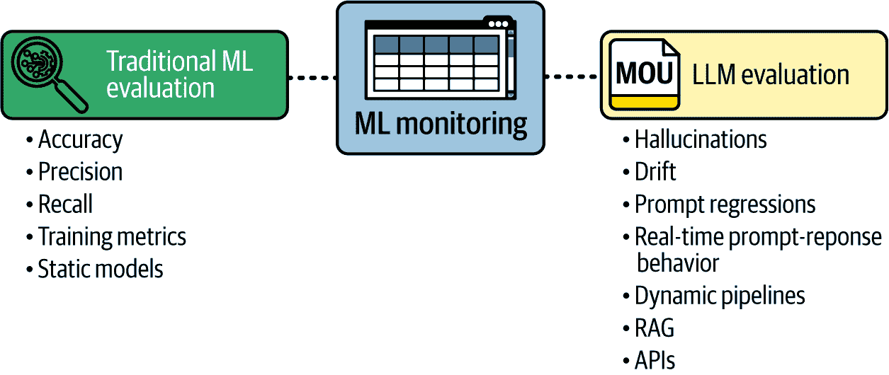
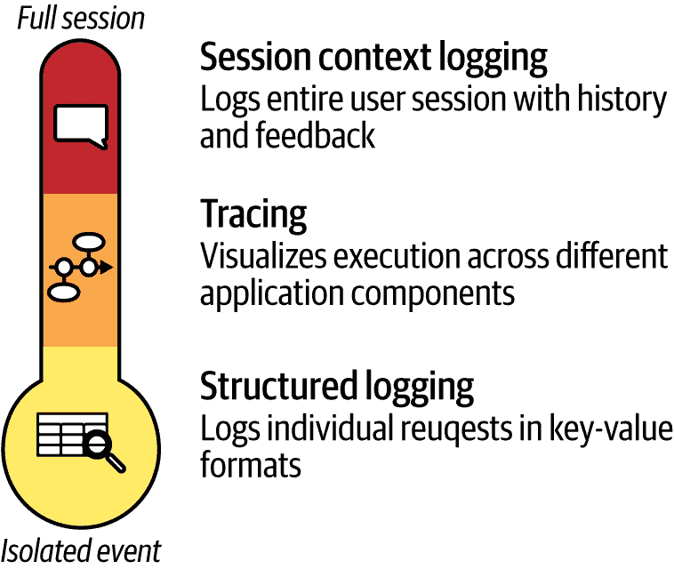

# 第七章\. 长语言模型的评估

语言模型变得越来越复杂，但准确评估其有效性仍然是一个重大挑战。

长语言模型评估的重要性不仅引起了学术界的关注，也引起了行业利益相关者的关注。这种研究和测试努力的融合标志着问题的重大性和集体寻找有效解决方案的决心。它还加速了创新的步伐，帮助研究人员进一步理解和改进这些模型。

在学术界，研究人员一直在探索新的方法，开发创新指标，并进行严格的实验，以推动长语言模型评估的边界。尽管有一些领先竞争者，但还没有明确的赢家，因为许多指标和排行榜最终只对短暂的时间或狭窄的应用范围有用。无论如何，行业参与者对长语言模型性能的实际影响非常敏感。

在其核心，评估旨在衡量长语言模型实现其预期目的的程度，无论是生成连贯且上下文相关的文本、理解用户输入还是完成特定任务。在本章中，您将了解一个旨在应对不同应用的挑战的系统框架，以及一些关于哪些方法有效的提示。

# 为什么评估是一个难题

*评估* 长语言模型是评估其性能和能力的过程。它涉及一系列方法，以确定长语言模型实现其预期目的和遵守道德指南的程度。

开发和部署机器学习解决方案需要创建比传统软件开发中使用的测试和评估类型更新的类型。特别是，机器学习模型在训练过程中使用随机数，需要在数据集的整体上进行测试，以及在对特定原子数据片段的测试中，这些测试有助于验证训练是否正确进行。然而，一旦模型被训练，大多数机器学习模型都是确定性的，即它们不使用随机方法进行推理；也就是说，相同的输入将始终产生相同的输出。

相比之下，长语言模型在训练和推理过程中使用随机数，因此即使模型没有变化，相同的输入也可能产生不同的输出。还有几个其他假设不再成立或需要增强。本章将探讨关于数据集、指标和方法选择选择的一些开放性问题。

任何运营中的机器学习解决方案在投入生产之前都必须提供一些预期的性能特征。您还需要一种有效监控它的方法，以便在部署后识别和修复任何性能问题。模型评估有助于：

+   确保模型按预期运行

+   确定模型可以改进的领域

+   确保模型被安全且负责任地使用

为什么评估长语言模型如此困难？有几个原因：

+   首先，人类语言非常复杂，难以量化。这使得开发准确的质量评估指标变得困难。

+   语言模型通常在大量的文本数据集上训练。这使得很难找到模型之前从未见过的代表性文本样本用于评估。

+   语言模型可能会表现出与它们训练数据集一致的偏差，生成违反社会、道德或法律规范的文本。

解释为什么大型语言模型（LLM）生成特定输出的难度可能导致可重复性和一致实验设计方面的挑战。

LLM 在大量数据上训练，它们可以接收的可能输入数量实际上是无限的，因此不可能在每种情况下都进行彻底测试。评估可能性的一小部分就是一个艰巨的任务。因此，我们必须满足于评估场景类别，例如：

+   信息性和事实性

    +   输出是否具有事实准确性？

    +   输出是否包含与输入提示相关的足够信息？

    +   生成的文本是否是对输入的完整响应？

+   流畅性和连贯性

    +   输出的语法是否正确且易于阅读？

    +   它们是否遵循逻辑流程？

    +   输出的语言水平是否适当？

+   参与度和风格

    +   LLM 的输出有多吸引人和有趣？

    +   写作风格是否适当？

+   安全性和偏差

    +   这种 LLM 可能生成哪些有害内容？

    +   输出是否可能使人们处于危险之中？

    +   输出是否使用了有偏的概念或语言？

+   基础

    +   LLM 的响应在现实世界信息中的基础有多牢固？

    +   是否提供了适当的参考文献？

    +   是否避免了幻觉？

+   效率

    +   LLM 生成输出需要多少计算资源？

    +   开始生成响应需要多长时间？

    +   生成完整响应需要多长时间？

虽然某些类型任务的成功指标是明确的（例如，图像识别中的准确性：“这是否是一张鸟的图片？”），但来自 LLM 的“良好”响应可能具有主观性。输出是否提供了相关信息？是否具有创造性？是否具有事实准确性？这些目标可能存在冲突，使得很难设计一个能够捕捉所有内容的单一指标。“良好表现”可能意味着几件事情。

评估机器学习（ML）和大型语言模型（LLM）之间的另一个区别在于，当一个 ML 模型未能通过评估任务时，开发团队通常会转向*可解释性*工具来解释模型做出决策的原因。这些工具通过在一个模型上运行大量示例并测量输入变化对输出的影响，试图理解模型的内部机制。由于大多数 ML 模型是确定性的（相同的输入总是产生相同的输出），这些工具允许开发者理解哪些输入部分对于生成某些输出是重要的，从而本质上提高了他们对模型内部工作原理的理解。截至目前，由于 LLM 具有太多参数且是非确定性的，因此可解释性工具对 LLM 不可用；因此，需要大量的示例和计算时间来理解其内部工作。

# 评估性能

在开发和部署后评估基于 LLM 的解决方案的准确性和监控方法有很多种。*手动检查*输出的准确性和正确性可能很耗时，并且取决于评估者的判断。*自动评估*使用工具来评估 LLM 输出的准确性；本质上，你是在使用 LLM 来评估 LLM。用户反馈也有助于识别 LLM 表现不佳且需要改进的领域。

最重要的是，没有应用程序就无法评估 LLM。在许多 LLM 应用中，用户知道哪些现实世界的性能指标是有用的。例如，假设贵公司正在使用 LLM 来生成网络广告的文本脚本。当人类编写广告文案时，一种典型的评估方法是进行*A/B 测试*，随机向类似受众 A 和 B 提供不同的选项，并测量每个受众的成功率（例如，广告点击次数）。如果接受选项 A 的受众的成功率与接受选项 B 的受众的成功率有足够的差异，以至于具有统计学意义，公司会选择选项 A 作为更成功的脚本。同样的方法也可以用于 LLM 生成的文案。实际上，对于许多常见的 ML 任务，如文本分类、图像识别和物体计数，简单地使用现有的预 LLM 方法和指标是有意义的。

然而，有一些指标是特定于自然语言处理（NLP）的，并且不需要用户参与，这使得它们成本较低，是评估 LLM 的好选择。

由于 LLM（大型语言模型）的主要功能是生成内容，我们使用一套称为**生成指标**的度量标准来衡量生成内容的品质。其中最基本的一种，称为**基于 n-gram 的指标**，通过检查*n*个单词序列的重叠来评估生成文本与现有数据之间的相似性。为了使用这个指标进行评估，你应该知道预期的“正确”答案，然后可以比较 LLM 生成的*n*个单词中有多少在正确答案中。

例如，如果*n*等于 1，比较将查看单个单词；如果*n*等于 2，它将考虑单词对；依此类推。这些指标根据共享的*n*-gram 量化相似度，为生成文本与正确答案之间的连贯性和相关性提供见解。

例如，你的一个测试可以是“问题：法国的首都是什么？答案：巴黎。”*n-gram 测试*可以非常简单，当 LLM 回答“巴黎”（100%的*n*-gram 匹配）时效果很好，但当 LLM 提供正确答案“法国的首都是巴黎”时，表现就不会很好。因为你预期答案是巴黎，第二个答案中只有 16.6%的单词与正确答案匹配，你可能会认为 LLM 的表现不如实际那么好。

第二，**基于相似度的指标**旨在捕捉生成文本与参考文本之间相似性的各个方面。它们包括：

BERTScore

测量内容重叠和流畅性

SemScore

检查生成的文本是否传达了与参考文本相同的意义和意图

MoverScore

计算将一个文本转换为另一个文本所需的最小“工作量”。

这些指标通过计算嵌入并比较它们来比较两个整个句子的相似度。使用之前的例子，LLM 回答“它是巴黎”和“法国的首都是巴黎”都会得到高分，因为这两个句子具有相似的意义。一个问题在于，句子“Teh KaPiTaLL of Franceland is PARIS”在意义上相似度方面也会得到高分，尽管它充满了拼写错误并使用了虚构的单词“Franceland”。

因此，我们转向**基于 LLM 的指标**，这些指标使用其他 LLM 来评估目标 LLM 的生成质量并识别潜在的幻觉。这些指标可以识别正确答案，还可以评估流畅性和语法正确性，但计算成本较高。以下是一些流行的指标以及定义如何实现和使用它们的论文：

[G-Eval](https://oreil.ly/IzuUL)

根据另一个 LLM 判断的连贯性、流畅性和事实一致性来评分生成的文本。

[UniEval](https://oreil.ly/nMMsh)

通过一组 LLM 评估器考虑多个因素，如流畅性、语法性和事实连贯性。

[GPTScore](https://oreil.ly/ylJna)

专为 GPT 类模型设计，它使用一个 LLM 来评估连贯性、安全性和事实一致性等方面。

[TRUE](https://oreil.ly/UwZvJ)

使用其他 LLM 来评估事实正确性和识别潜在的事实幻觉。

[SelfCheckGPT](https://oreil.ly/8AKE9)

为 GPT 模型设计，它专注于识别生成文本中的逻辑不一致性和事实错误。

这些指标可以根据您的特定用例进行配置。尽管许多基准测试在其论文中提供了示例问题和预期答案，但您应该生成一个适用于您用例的问题和答案数据库。

对于 LLM，也有许多通用基准测试，其目标是评估 LLM 作为通用问题解决者的表现如何，而不专注于特定任务。这些基准测试如果您正在构建平台级 LLM（如 Google 的 Gemini 或 OpenAI 的 ChatGPT）时更有用。尽管这些基准测试在某些方面很有用，并且经常出现在描述模型如何好的营销材料中，但它们存在一个重要的缺点：它们无法告诉模型在特定任务上的表现如何。可能模型 A 在一般任务上比模型 B 表现好得多，因此在像 GLUE 这样的通用基准测试上，但模型 B 在您需要它完成的任务上可能比模型 A 表现更好；例如，分析法律文件。因此，了解这些基准测试是什么很重要：它们是一般适用性的综合评分。

一些顶级基准测试列表见表 7-1，但请记住，这是一个活跃的研究领域，新的基准测试一直在被提出。

表 7-1\. 通用 LLM 基准测试

| 基准测试 | 描述 | 重点关注 |
| --- | --- | --- |
| [通用语言理解评估](https://oreil.ly/rcLR4) (GLUE) | 一系列评估核心 NLP 能力的任务 | 自然语言理解 (NLU) |
| [SuperGLUE](https://oreil.ly/mpepc) | GLUE 的后继者，具有更具挑战性的任务 | NLU |
| [HellaSwag](https://oreil.ly/2VpX9) | 专注于推理和常识理解 | 自然语言推理 (NLI) |
| [TruthfulQA](https://oreil.ly/adQ-N) | 评估事实正确性和避免事实幻觉 | 问题回答 (QA) |
| [大规模多任务语言理解](https://oreil.ly/0xT-x) (MMLU) | 在各种任务上的大规模基准测试 | 多任务学习 |

这些基准测试是公开的，它们的问答对也是公开的。这使得不同的 LLM 可以在完全相同的标准下进行比较，因此允许 LLM 之间的比较。

然而，这会产生一个问题：LLM 开发者可以简单地训练模型在基准测试中表现良好，就像学生为了即将到来的考试而记忆答案一样。这在实践中是一个非常严重的问题。在 LLM 在一般基准测试中表现良好，但在实际应用（如描述场景）中表现低于 GPT-3.5（一个现在已过时但价格低廉的模型）的情况下并不少见。当这种情况发生时，通常没有理由使用具有更高一般分数的模型——最终决定权应该在用户手中。

另一个问题在于，LLMs 对训练中使用的数据和评估中使用的提示的兼容性非常敏感。提示中的看似微小的变化可能导致截然不同的输出。这使得设计能够持续引发所需响应并评估 LLMs 真实能力的提示变得困难。

例如，一些模型在被要求“逐步思考”时可能响应得更好（[Wei 等人，2023](https://oreil.ly/YIrYf)），而另一些模型在被礼貌地要求，提示以“请”开头时可能响应得更好。这些都是训练偏差的结果。在这个例子中，如果训练数据集中包含更多礼貌指令的部分有更高的正确答案比例，那么在所有提示中简单地添加“请”将能在基准测试中产生更好的结果。

LLMs 使用了一种学生经常用来提高考试分数的技巧，即当他们不知道问题的答案时，会在回答中重复或改写问题的部分或提示。这可能会产生一种虚假的理解或同意感，使得生成的答案文本与问题高度相关，即使答案本身的质量很低。

总结来说，基准测试可以用来比较 LLMs，但要注意它们的局限性，并谨慎使用。

LLM 的一些应用非常普遍，值得特别关注，如 RAG 和多智能体系统。尽管这里描述的指标可以用来评估 RAG 和多智能体系统，但每个系统都有其特定的指标，将在下一节中描述。

## 评估在一切崩溃之前会崩溃什么

当大型语言模型（LLMs）首次进入生产环境时，它们早期的失败显得零散且不可预测。这些初始故障通常被忽视，被认为是模型“行为古怪”，是一种随机的不寻常行为，而不是系统性问题。然而，随着使用范围的扩大和数据积累，开始出现更清晰、更一致的失败模式。这些模式不是传统的软件错误，如段错误或崩溃，而是我们所说的故障模式（见表 7-2）。

表 7-2\. 常见 LLM 故障模式和评估可以捕捉到它们的位置

| 故障模式 | 评估位置 | 工具/信号 |
| --- | --- | --- |
| 幻觉 | 检索、提示、推理 | 与源相似度、事实核查 |
| 提示回归 | 协调 | 提示差异，质量退化日志 |
| 延迟峰值 | 推理、检索 | p95/p99 延迟指标、跟踪 |
| 数据漂移 | 输入、检索 | 嵌入式偏移、聚类分布 |
| 行为不一致 | 推理 | 会话级跟踪、重复查询 |
| 安全违规 | 输出 | 毒性过滤器、PII 检测 |

*故障模式*代表由于模型内部假设与真实世界数据和交互的复杂现实之间的基本不匹配而出现的反复但可解释的故障。与传统软件错误不同，传统软件错误会触发异常或导致程序崩溃，故障模式通常是“无声的故障”。表面上，系统继续正常运行，产生看似语法有效和风格一致的输出。然而，在这层表象之下，这些输出可能是事实错误、道德问题或结构上的缺陷。这种微妙性使得故障模式特别狡猾，因为它们可以通过传统的调试方法逃避检测，这些方法通常依赖于彻底的崩溃或明显的错误信号。

因此，LLMs 的评估范式必须从反应式调试发展到更主动的方法（见图 7-1）。而不是等待故障破坏用户，目标变为预测并早期检测这些故障模式，在它们传播危害或错误信息之前。这种主动检测需要复杂的监控框架，结合自动化指标、人工验证和领域特定检查，以确定模型假设何时不再成立，或输出何时偏离预期行为。通过将评估从事后修复转移到持续、前瞻性的监督，我们可以更好地确保大规模 LLM 部署的可靠性、安全性和道德完整性。

###### 图 7-1. 评估传统 ML 模型与 LLMs

让我们尝试了解现代 LLM 管道中最常见的故障模式，并确定可观察性和评估工具可以早期拦截它们的位置。

### 幻觉

在 LLMs 展现的各种故障模式中，幻觉（hallucinations）因其最臭名昭著且难以管理而突出。当 LLMs 产生看似语言流畅且自信的响应，但实际上却是事实错误或完全虚构时，就会发生幻觉。这种现象的出现是因为 LLMs 通过根据其训练数据预测最可能出现的标记序列来生成文本，而不是查询可靠、最新的事实知识库。因此，幻觉是一种固有的风险，尤其是在 LLMs 应用于高风险领域，如医疗保健、金融或法律服务时，不准确或误导性信息可能导致严重后果。

评估幻觉不仅限于简单地检测孤立的事实错误。相反，它要求采用系统性的、纵向的图案监控方法。这通常涉及记录所有生成的输出，并在可能的情况下，将它们与验证过的真实情况进行比较。当无法获取精确的真实数据时，一种替代策略是在模型的多个响应代际之间进行一致性检查，以检测矛盾或不稳定性。这些评估方法有助于识别个别幻觉以及它们更频繁发生的条件和情境。

在 RAG 系统中，幻觉通常表明检索组件存在问题。例如，如果检索器检索到无关、过时或低质量的文档，LLM 生成错误或虚构内容的机会就更大。这种相互依赖性使得在检索和推理层之间保持可观察性变得很重要。跟踪检索文档的质量和相关性以及模型输出的综合监控框架可以帮助诊断幻觉是否源于检索失败、生成错误或两者的结合。理解这些根本原因对于设计针对性的缓解策略至关重要，例如提高检索准确性、整合更可靠的知识来源或在生成过程中引入验证机制。

### 提示回归

*提示回归*代表了在 LLM 部署中一种特别微妙但深感受挫的失败模式。与明显的输出错误不同，提示回归源于对提示模板的看似微小的更改，例如重命名变量、插入或删除空白或调整格式，这些更改意外地降低了模型输出的质量。这些退化通常不是立即显而易见的，这使得它们在实时中更难检测和诊断。

这个挑战因 LLM 固有的非确定性而加剧：由于采样方法和随机标记预测，在相同的输入下，模型可能在不同的运行中生成不同的输出。这种可变性使得一致地重现提示回归变得困难，对传统的调试方法构成了重大障碍。

为了管理这种复杂性，稳健的评估系统必须整合详细的提示版本控制和日志记录功能。在细粒度级别跟踪变化是必要的，同样重要的是支持提示差异，突出显示版本之间确切修改的内容。通过将这些提示更改与可衡量的指标相关联，例如响应有用性、事实准确性或结构连贯性的下降，团队可以精确地确定回归何时以及如何开始显现。

这种系统性的相关性使得有效的根本原因分析成为可能，允许开发者迅速识别有问题的提示迭代。更重要的是，它使团队能够在检测到退化时回滚到之前稳定的提示版本，从而保持输出质量和用户信任。因此，提示退化监控成为主动评估策略的一部分，以确保细微的提示工程调整不会无意中随着时间的推移侵蚀模型性能或可靠性。

### 延迟峰值

无论系统的智能或复杂程度如何，用户都会一致地拒绝缓慢和无响应的体验。延迟，尤其是在分布的高端出现的峰值，如第 95 百分位数（p95）或第 99 百分位数（p99），尤其具有破坏性。这些尾部延迟虽然频率较低，但会不成比例地影响用户体验，造成明显的延迟，在某些情况下，还会触发下游系统的超时或故障。

对延迟的有效评估需要持续的、细粒度的监控，不仅要跟踪平均响应时间，还要跟踪令牌使用模式和相关的系统级指标。这种全面的可观察性对于在它们大规模降低服务质量之前及早发现延迟的突然增加至关重要。

当这种延迟峰值发生时，强大的跟踪机制对于根本原因分析变得不可或缺。这些工具使工程师能够剖析请求管道并识别瓶颈或故障点。可能的罪魁祸首可能包括过长的输入提示，这会增加处理时间，负责检索相关文档的检索组件中的延迟，或者上游依赖（如向量数据库或外部 API）中的瓶颈。此外，底层模型版本或系统基础设施的更改可能会引入意外的延迟退化。

没有这种级别的可观察性，延迟峰值对监控仪表板和警报系统来说是不可见的，直到最终用户体验到性能下降或故障。因此，将端到端跟踪和实时延迟监控嵌入到评估流程中对于保持平稳、可预测的系统行为和确保一致响应的用户体验至关重要。

### 数据漂移

在实时生产环境中，用户行为和输入数据处于持续变化的状态。这种动态环境常常导致数据漂移，这是一种现象，其中系统内嵌入的基本假设（如预期的输入格式、用户意图的分布或上下文嵌入的性质）逐渐与不断变化的数据现实相偏离。

数据漂移以几种不同的方式表现出来。输入漂移通常表现为对抗性或格式错误的查询增加，这些查询偏离了原始的训练或设计预期。这可能会对系统的鲁棒性造成压力，并降低输出质量。检索器漂移发生在检索组件返回的文档的相关性下降时，即使检索算法和配置保持不变。同样，当用于比较语义相似性的向量表示变得不那么有效时，就会发生嵌入漂移，导致检索系统即使系统参数稳定也会失败。

有效评估漂移需要对输入特征分布进行严格的统计监控。技术包括对查询类型进行聚类分析以检测新兴的用户意图或新的交互模式，对标记长度进行直方图分析以跟踪输入冗余度的变化，以及持续测量嵌入相似度分数以捕捉语义表示的微妙变化。这些定量的早期预警信号允许工程团队预测系统假设何时将不再成立。

通过主动检测漂移，团队有机会在任何退化对最终用户变得明显之前重新训练模型、刷新检索索引和重新设计提示模板。这种前瞻性方法确保系统能够无缝适应不断变化的数据景观，在一段时间内保持准确性和用户满意度。

### 不一致的行为

LLM 生成的本质上是随机的，这意味着重复相同的查询多次可能会在每次都产生不同的响应，这种现象称为非确定性。这种可变性是概率性标记采样策略的自然结果，这些策略促进了生成文本的多样性和创造性。然而，这种随机性为那些审计性、合规性和可重复性至关重要的用例带来了根本性的挑战。在这种情况下，不一致的输出可能会损害信任，使调试复杂化，甚至违反监管要求。

评估和管理不一致的行为需要一个会话级跟踪框架，而不仅仅是简单地记录输入和输出。它必须捕获每个交互的丰富上下文元数据，包括模型超参数（如温度和 top-k 采样值）、特定模型版本以及任何相关的先前对话历史或用户交互。这种全面的跟踪允许团队重建和分析产生特定输出的确切环境和条件。

通过详细的会话级日志（见图 7-2），可以识别变化模式，将输出不一致性与特定的设置或上下文变化相关联，并在必要时通过修复采样参数或重新播放交互序列来强制执行可重复性。这种细粒度的评估对于在需要可预测、可验证行为的敏感领域负责任地部署 LLM 至关重要。

###### 图 7-2\. 记录风格的范围各不相同，从孤立事件到完整会话

可以选择性地强制执行一致性，使用如贪婪或束搜索等确定性解码策略，尽管这通常会牺牲输出多样性。关键是平衡所需的一致性，并建立当需要时突出不一致性的监控系统。

### 道德和合规风险

LLM 可能会无意中产生有毒内容或带有偏见的语言，泄露私人信息，或容易受到越狱提示的影响。这些风险会带来严重的法律和声誉后果。为了减轻这些风险，评估工具必须集成自动过滤器分类器，实时标记问题输出，正如我们在本章前面讨论的那样。应收集如安全分数、毒性指数和偏见测量等指标，以供审计之用。

## RAG 应用程序的指标

RAG 应用程序使用 LLM 生成文本，但它通过从知识库检索数据并将这些数据附加到用户提示中，帮助 LLM 更加精确。RAG 应用程序经过图 7-3 中显示的步骤。

###### 图 7-3\. RAG 应用程序工作流程

让我们更详细地看看每个步骤：

用户输入

用户向 RAG 应用程序提交问题或提示。

检索

应用程序利用检索系统搜索相关文档或文本数据的数据库，例如*n*篇文章、手册、代码片段或任何与 LLM 领域相关的其他信息。检索系统根据用户的查询，使用向量相似度搜索等技术，识别数据中最相关的部分。

提示增强

应用程序将开发者定制的提示与上一步检索到的文本和原始用户输入连接起来。

LLM 生成

增强的提示随后被发送到 LLM，LLM 使用它提供的额外上下文生成响应并将其呈现给用户。

除了上一节中描述的生成指标外，RAG 还可以从检索指标中受益，这些指标评估检索组件的有效性。一些关键检索指标包括：

回忆

这衡量了系统收集真正重要材料的彻底程度。为了计算它，你从一个“真实”文档集合开始，这个集合已经被专家判断为与查询相关。当检索步骤运行时，你查看这个权威集合与系统生成的文档之间的重叠。如果引擎几乎显示了专家识别的每个项目，则认为召回率很高；如果它遗漏了许多项目，召回率就低。你可以将结果测量为百分比。

均值倒数排名（MRR）

这衡量了用户看到第一个真正有用结果的速度。对于每个查询，从顶部开始扫描排名列表，直到你遇到第一个相关文档，并记录其位置。第一个位置上的文档是理想的，第五个位置上的文档则不那么令人印象深刻，依此类推。然后，将这些位置转换为奖励早期出现的分数，并在许多查询中平均这些分数。高 MRR 意味着用户通常在页面顶部或附近立即遇到相关内容。尽管你可以使用任何你想要的评分机制，但检索*n*个文档的典型评分方式是，如果正确答案出现在第一个位置，则分配*n*分，如果出现在第二个位置，则分配*n* - 1 分，依此类推。

均值平均精度（MAP）

这评估了相关项在整个列表中的位置和一致性。在单个查询的结果中向下工作，你保持一个累计计数，以便每次出现另一个相关文档时，你检查到目前为止看到的所有内容中有多少是相关的。当你完成列表时，你平均这些中间分数来总结一个查询。例如，如果你的检索步骤预期返回三个结果，并且返回的三个结果都是相关的，则平均精度为 100%。如果前两个结果是相关的，则 AP 为（100% + 100% + 0%）/ 3 = 67%。如果第一个和第三个结果是相关的，则 AP 为（100% + 0% + 67%）/ 3 = 56%。对许多查询重复此过程并再次平均，得到 MAP。例如，最后两个查询的 MAP 为（67% + 56%）/ 2 = 61%。高值表示相关文档频繁出现，并且分布在整个结果列表的顶部，而不是分散或集中在底部。

上下文精确度

这个指标关注的是召回率的另一面；即，检索器返回的所有内容中，有多少是真正有用的？你需要检查每一段内容，以判断它是否支持语言模型的任务，或者仅仅是增加了噪音。当大部分检索到的结果与真实文档集合相匹配时，上下文精确度就很高；当无关或误导性的段落占主导地位时，分数会下降。你可以将上下文精确度测量为百分比。

相关性

这种方法在精确度和召回率之间取得了平衡。它考虑了检索到的集合如何完全覆盖所需的事实，以及它有多少非相关材料。高相关性意味着提供给语言模型的上下文同时包含了几乎所有关键信息，避免了杂乱，从而为模型提供了一个准确、专注的响应的理想基础。虽然你可以通过简单平均（甚至总和）精确度和召回率来计算相关性，但从业者通常采用精确度和召回率的调和平均（这被称为 F1 分数），这使得平衡的结果，如 60%的精确度和 60%的召回率，比不平衡的结果，如 90%的精确度和 30%的召回率，得分更高。

虽然你可以自己测量这些指标中的每一个，但在实践中你很可能会使用一个评估工具。大多数评估工具都可以测量前面描述的检索指标和上一节中描述的生成指标。对于简单应用，你可以使用一个现有的框架，如[现有框架](https://oreil.ly/QUyLl) [Ragas](https://oreil.ly/JkFwY)，它提供了预构建的功能和简化的工作流程。Ragas 是一个基于 Python 的应用程序，包含所有之前的指标，可以测量你应用程序的输出，并在单个分数中总结结果。Ragas 还设计得易于使用，具有清晰的文档和示例。这使得研究人员和开发者，即使是没有丰富编码经验的人，也能更容易地评估他们的 RAG 系统。

对于大多数生产应用，你需要一个可定制的评估器，允许你定义自己的指标，添加自己的数据集，并将测试与你的 CI/CD 工具集成；例如，在部署新的模型版本后自动运行一系列测试。一个流行的开源工具是 LangChain 制作者创建的[LangSmith](https://oreil.ly/F8EVF)工具集，用于执行这些任务。

要在 LangSmith 中执行评估，你首先定义一组测试用例和一个或多个评估器。对于每个评估器，你可以定义一个指标（例如本章中提到的指标）或一个说明如何评分的评分标准。你可以使用 LangSmith 编程接口将你的 LLM 的输出连接到评估器，并自动评分。

由于 LangSmith 提供了一个 SDK，你可以在开发期间运行测试，但也可以在部署新模型时运行测试。你这样做是通过创建一个脚本来向新模型发送提示，并使用 LangSmith 在 CI/CD 工具部署模型后立即评估答案。

您还可以使用 SDK 创建一个脚本，该脚本定期在生产环境中使用固定数据集运行测试，以查看模型是否*漂移*；也就是说，模型的表现是否随时间变化。一般来说，您会期望在相同的数据集上运行相同的测试会得到相同的分数，但如果你使用的是像 OpenAI 的 GPT API 或 Google 的 Gemini API 这样的 LLM 服务，底层的模型可能会在你的控制之外发生变化。这被称为*模型漂移*，将在本章末尾进行更详细的解释。无论如何，按照这里描述的定期运行测试将让你能够检测到模型漂移。

## 代理系统指标

到 2024 年底，术语“代理系统”开始变得更加流行。在 LLM 的背景下，代理系统是一个具有多个内部模块和多个步骤的 AI 系统，它可以自主地规划、决策和行动，以仅通过战略性的人类监督来实现高级目标。在代理系统中，用户向协调 LLM 发送请求，该 LLM 将请求分解为任务。协调 LLM 然后将每个任务发送给自己、其他 LLM 或专业程序。它编译他们的响应，并将编译后的结果提供给用户。这个多步骤过程产生了大量的评估问题。

本章前面定义的所有指标仍然适用；因此，如果代理系统的某个组件是 RAG 系统，则可以使用 RAG 指标，对于内容生成型 LLM，可以使用本章开头定义的生成型指标。然而，还存在一些额外的复杂性：

动态行为

代理可能会根据其交互表现出涌现行为，这使得预测结果或这些行为何时发生变得困难。

环境敏感性

代理的性能可能会根据环境显著变化，需要在不同场景中进行广泛的测试。

持续学习

许多 LLM 和代理会根据交互随着时间的推移进行适应，使得静态评估变得不那么相关。

反馈回路

代理之间存在的反馈回路可能会产生难以复制的非线性效应。

与现有系统的集成

在现实世界环境中部署代理可能会揭示在模拟设置中不存在的问题。

环境可变性

运营环境的变化可能导致意外的行为，从而复杂化评估过程。

多个目标

代理可能会有冲突的目标或以需要平衡多个标准的方式进行协作，从而复杂化评估指标。有时两个代理的指标单独来看可能不好，但协作得很好，生成的输出比两个具有更好单独指标的代理之间的协作产生的输出要好。

在实践中，评估代理协作的最终产品更容易。因此，评估代理系统的两种主要方式是人类评估者和 LLM 评估者。虽然人类评估被认为是黄金标准，但它可能很昂贵且耗时。另一方面，使用 LLM 作为评估者通常在成本、质量和有效性之间取得良好的平衡，但偶尔可能会存在偏见。其他两个问题是 LLM 是透明的且资源密集型。如果你使用 LLM 评估者，不要完全放手。一个评估模型的 LLM 可能会开始表现不佳，因此建议进行一定水平的人类双重检查。此外，没有一套普遍接受的评估代理系统的指标，导致不一致性。

此外，资源限制（例如计算能力和内存）限制了可以进行多少评估。不同配置的资源消耗可能差异很大，影响可扩展性评估。

对于任何基于 LLM 的代理系统，有四个关键评估目标：

检查其内部属性。

这意味着要查看其核心语言技能，它如何掌握上下文，它是否能够学习和迁移知识，以及意外能力（涌现行为）出现的容易程度。你还询问它如何快速适应新环境或任务，以及多个代理如何有效地合作。证据来自答案中的连贯性和相关性，实时互动中的理解，受控场景中的决策，以及情况变化时的响应性。日志和模拟揭示了集体行为，而纵向测试显示性能是否随时间提高、停滞或下降。为了衡量性能，你可以使用之前定义的指标。

在工程层面审计性能。

当事情出错时，你关心效率、可扩展性和鲁棒性。测量完成任务所使用的计算资源。压力测试显示随着代理数量或工作负载的增加会发生什么，而故障注入实验探测在不利条件下的弹性和恢复策略。

关注交互质量。

这里你想知道对话对人类用户来说有多吸引人、清晰和值得信赖。会话长度、轮流频率和响应延迟等指标量化了参与度，而调查则探测感知的可靠性、对话连贯性和关系温暖。对现实世界使用的观察研究通过记录用户实际上如何围绕代理行为来完善画面。

测量用户满意度。

最终，人们必须感觉到系统帮助他们实现目标，并且它应该给他们留下积极的情感印象。你可以捕捉关于任务成功的明确反馈（如每次响应后的点赞或踩），对用户评论进行情感分析，并开展调查，以衡量即时情绪和整体满意度。

衡量成功的一个典型方法是通过询问用户“你有多可能推荐这个系统来完成一项任务？”并给出 0 到 10 之间的分数。得分为 9 或 10 的用户被认为是*推荐者*，得分为 0 到 6 的用户被认为是*反对者*。NPS 的计算方法是%推荐者 – %反对者。它可以从+100（每个用户都是推荐者）到-100（每个用户都是反对者）不等。得分高于+30 表示表现强劲。

这四个视角——系统属性、技术性能、交互质量和用户满意度——共同提供了一个全面、互补的视角，说明了代理 LLM 系统在实际中工作得有多好。

由于衡量代理系统的复杂性，实践者通常在系统开发的不同步骤中使用不同的测量策略。如果你将代理系统的开发分解为三个步骤，那么模型开发和训练、部署和生产监控将是每个阶段最重要的不同指标。

### 第一阶段：模型开发和训练以及集成到代理系统中

当模型仍在实验室阶段时，关注*内在能力*：

语言能力

跟踪响应一致性和最终用户理解。你可以使用本章中描述的生成性指标和相关工具。

集成

测量当用户请求到来时，代理系统的每个组件是如何被使用的。测试适当的代理是否参与了任务。例如，如果你有一个执行数学（计算代理）的程序，当用户输入数学问题时应该由你的编排 LLM 调用，确保这确实发生了。如果没有，你可能需要调整你的编排提示。

### 第二阶段：代理系统部署

拥有一个训练好的模型检查点后，你现在要问，“人们会信任这个系统并认为它有用吗？”

信任和可靠性

使用基于调查的内部用户信任分数。之前定义的 NPS 指标是衡量用户是否喜欢该系统并认为它有用的良好指标。

用户-代理关系

长期用户访谈和快速用户满意度调查可以告诉你测试用户对系统的感受。

总体满意度和感知有效性

A/B 测试、成功率统计和开放文本反馈的情感分析提供基准事实。

内置的调查小部件使得在将系统向真实客户公开之前，在受控沙盒中收集这些数据变得容易。

### 第三阶段：生产

在规模上，你关注更高阶的现象和运营健康：

代理组件利用率

检查组件代理是否按预期使用。你可能已经创建了几个专业代理来预期用户的工作负载，但如果某些代理没有被使用，关闭它们并将它们的功能转移到提供快速答案的编排 LLM 中可能是有意义的。

参与度

测量平均会话持续时间和每个用户的交互频率作为流失的前瞻性指标。用户是否完成了任务？他们是否日复一日地回来完成更多任务？

计算效率

就像任何计算系统一样，监控计算资源。记录平均任务完成时间和资源利用率（CPU/GPU），以便在云服务账单激增之前发现瓶颈。

# 一般评估考虑因素

最终，你系统的成功是由其用户来衡量的。可以自动衡量的指标的主要目标是捕捉错误并改进系统，以改善用户体验而不会让用户感到沮丧。然而，尽你所能，在较长时间内进行用户研究，以跟踪用户与你的产品互动时信任和满意度的变化。

NPS 是一个快速且有用的单一问题成功指标，因此它在许多行业中得到了广泛的应用。

满意度小部件也非常有用；例如，你可以在每个回复后添加“点赞”和“踩”按钮，以便在现实世界的交互中收集用户反馈。

你还可以使用像[Weights & Biases](https://wandb.ai/site)这样的商业监控平台，或者使用本章前面描述的 LangSmith 工具开发自己的指标来监控你的系统在生产中的表现。LangSmith 可以自动评估代理系统的输出。Weights & Biases 可以收集指标，显示仪表板，并在指标低于你定义的某些阈值时发出警报。

通过整合即时用户反馈的渠道，你可以从用户交互中学习，并随着时间的推移改进你的应用程序。收集反馈并更新应用程序的这种迭代过程确保了它能够适应用户偏好，最终增强信任和满意度。

## 自动化指标的价值

如 第六章 所示，自动化的指标可以使你更容易地看到更改是否在改善你的应用程序。例如，假设你有一个生成描述图像文本的应用程序。你现有的提示词的 NPS 为 90%，但一篇新的论文提出了不同的提示技术（例如，使用项目符号）。如果你的指标是自动化的，那么创建 A/B 测试就更容易了，向受众 A 提供现有提示词的输出，向受众 B 提供新提示词的输出。你应该预期受众 A 的 NPS 保持在 90% 左右（因为它使用的是现有提示词）。如果使用新提示词的受众 B 的 NPS 更高，你可以决定将所有人切换到新提示词。

A/B 测试的另一个用途是提高计算效率。LLMOps 实践者经常试图在保持相同性能的同时减少提示词。由于大多数 LLMs 的定价（或消耗资源）基于提示词大小，你希望使用最小的提示词来实现给定的质量阈值。你甚至不需要自己生成更小的提示词；你可以使用 LLM 来总结或减少现有的提示词，同时保持原始提示词的意义和意图。如果你有自动化的指标，你可以测试几个提示词，并选择达到你性能要求的最小提示词。这可以节省大量的金钱和资源。当然，你也可以不使用自动化指标来做这件事，但这会花费更长的时间。

## 模型漂移

LLMs 正在不断发展，新的模型和新版本模型不断涌现。你的应用程序的性能可能会因为模型的变化而漂移。有时它有所改善，但有时会下降。如果你不衡量它，你就不会知道。

例如，流行的 GPT-3.5 Turbo 模型有四个版本，其中前两个在 2025 年 2 月 13 日停止工作。对于将设置配置为“自动更新”的用户，对这些已弃用的版本的调用开始自动转向最新版本。对于所有其他用户，它们只是开始返回错误。

在这两种情况下，LLMOps 都会提供帮助。后者的情况更为明显，因为即使是最基本的监控系统（收到大量失望用户的愤怒邮件）也能捕捉到它。

前者的情况，当模型自动切换到新版本时，可能会产生意外问题。例如，可能一些你为了防止模型早期版本出现错误而必须实施的防护措施现在不再必要了。一个典型的例子是将大量提示词用于防止偏见和冒犯性回答。模型的较新版本通常包含针对几种已知攻击的防御措施，因此将这些防御措施包含在提示词中可能只是浪费金钱。

在一个更复杂的情况下，性能可能会意外下降。有可能一个与旧版本兼容的提示在新版本中停止工作，原因不明。

理想情况下，你会在版本变动之前得知，这样你可以在两个版本都可用时进行测试和调整。然而，并非所有在初始 AI 热潮期间开发的应用都是基于指标和监控构建的。许多开发者在他们的应用程序突然停止工作或由于云模型提供商后端的变化而开始给出不同结果时感到惊讶。

# 传统指标不足

正如我们之前讨论的，在 RAG 和代理评估部分，标准指标如准确性和损失在训练和验证阶段一直作为模型性能的基础指标。这些指标有效地量化了模型如何适应其训练数据或泛化到保留的验证集。然而，它们在捕捉模型部署到复杂、现实世界的生产环境后出现的微妙和多方面的故障模式方面存在不足。

在生产中，输出可能在语法上流畅且在风格上精致，但可能隐藏着幻觉、潜在偏见或结构不一致性，这些是传统的指标如准确度或损失所无法检测到的。这些微妙的问题往往有严重的下游后果，从传播错误信息到造成道德违规和用户不满。

因此，生产级评估需要专门为持续、实时监控模型行为设计的工具集和框架。这些系统专注于检测异常、跟踪数据和方法漂移、评估用户影响，以及识别新兴的道德风险。在这种背景下，有效的评估不仅需要识别故障模式，还需要构建能够早期且高保真地捕获这些故障的综合可观察性管道。

这样的可观察性系统必须能够追踪错误回到推理或数据处理管道中它们出现的精确阶段，无论这意味着输入预处理、检索组件、生成模型本身，还是后处理层。这种细粒度的映射让工程团队能够快速进行根本原因分析，优先处理修复，并自信地推出缓解措施。这种主动的端到端监控基础设施将评估从反应性的事后考虑转变为维护大规模 LLM 系统可靠性、安全性和道德完整性的战略、关键部分。

## 可观察性管道

评估不能再是事后考虑，仅在生成响应之后应用。它必须嵌入到 LLM 管道的每个环节中，从初始输入到最终用户反馈（见图 7-4）。

###### 图 7-4. LLM 的可观察性管道

## 预处理和提示构建

LLM 部署失败往往不是模型本身的问题，而是它接收到的提示信息。在生产环境中，提示信息很少是固定的、手工编写的片段。相反，它们是动态生成的，由模板组装，并根据上游数据源或不断变化用户状态进行参数化。这种动态性引入了复杂性和可变性，如果不加以妥善管理，可能会微妙地损害系统的性能。

在提示阶段进行评估时，重点关注几个关键维度。首先，提示信息必须语法正确、格式正确，并且没有可能干扰解析或分词的错误。其次，它们需要语义上连贯，提供清晰、明确的指令，与模型预期的输入格式相一致。第三，对提示模板及其变体的严格版本控制至关重要。通过捕捉每个提示版本和结构修改，团队可以获得可追溯性，将下游推理错误直接关联到特定的提示更改。

为了防止模型推理期间的级联故障，早期检测格式不正确的输入很重要，例如缺失上下文变量或错误注入的参数。监控如提示标记长度分布等指标是另一项关键的操作实践。过长的提示信息可能会被截断，这可能导致重要上下文的遗漏并降低输出质量。相反，过短的提示信息可能无法提供足够上下文，实际上会剥夺模型生成准确和相关信息的能力。通过持续跟踪这些分布，团队可以主动识别回归并干预，防止其影响最终用户的使用体验。

随着提示工程成熟为一个正式化的学科，这一阶段的评估从反应式调试转向了基础管道治理的模型。这种转变强调系统性的监督、可重复性和受控迭代，确保提示生成始终是整体 LLM 推理管道中稳定、可靠的基石。

## RAG 管道中的检索

在 RAG 系统中，失败往往不是源于 LLM 本身，而是检索阶段。因此，评估检索性能至关重要。这涉及到评估多个维度：检索文档的上下文相关性、信息的时效性，以及相对于查询意图和领域的及时性。

有效的 RAG 可观察性框架应记录每个用户查询检索的确切文档集，以实现回顾性分析和可重复性。如检索文档与验证的地面实源之间的相似度分数等量化指标，提供了检索准确性的客观度量。监控检索延迟也是至关重要的，因为获取文档的延迟会直接影响系统的整体响应性和用户体验。

在这种情况下，最强大的评估技术之一是*嵌入相似度漂移检测*。通过持续跟踪查询和文档嵌入的统计分布，团队可以检测出可能预示检索质量下降的微妙变化。这些变化通常发生在更明显的故障之前，例如由无关或过时的文档引起的幻觉或模糊、不具体的响应。一旦检测到这种漂移，及时干预措施包括重新训练检索器、刷新索引和重新配置检索管道。

没有这种细粒度的可观测性，区分由检索问题引起的故障和生成阶段出现的故障变得极其困难。因此，跨越检索和生成组件的适当仪器化的评估管道对于维护由 RAG 驱动的企业 LLM 系统的可靠性、准确性和用户信任至关重要。

## LLM 推理

在推理阶段，关键指标跨越多个维度。事实准确性评估生成的文本是否与可验证的事实相符，而幻觉率衡量幻觉的频率。流畅性评估输出的可读性和连贯性。延迟跟踪响应时间，这直接影响用户体验和系统吞吐量。

要实现深度诊断，可观测性系统必须为每个推理调用记录详细的元数据：

+   输入和输出的标记计数揭示了使用模式和潜在的截断。

+   温度和其他采样参数阐明了生成的概率性质。

+   模型版本控制让您能够追踪性能变化到特定的代码或模型更新。

+   完成长度突然变化可能表明截断错误或潜在的故障，这些故障在提供的响应中并不立即明显，这使得这一指标特别有价值。

除了表面指标之外，内部评估技术提供了额外的质量保证层。自洽性检查，即比较同一提示的多个生成版本，可以识别出表面上流畅但不一致或矛盾的输出。同样，来自辅助评估器或专业分类器的置信度分数有助于标记偏离预期事实或伦理标准的输出。

推理很少是一个独立的过程；它通常嵌入在复杂的链或管道中，涉及多个调用、检索步骤和后处理。这就是结构化日志和跟踪可视化工具变得至关重要的地方。这些工具能够实时监控，促进根本原因分析，并使团队能够精确地确定在复杂的工作流程中失败或不效率发生的位置。这些可观察性实践将推理评估从被动的测量提升为一种积极的治理机制，这对于维护部署的 LLM 系统的可靠性、准确性和可信度至关重要。

## 后处理和输出验证

在生成阶段之后，输出数据通常进入一个*后处理*阶段，该阶段包括格式化、清理和结构调整，以便将数据交付给最终用户或下游系统。尽管这一步骤看起来很简单，但即使在这里引入的微小结构错误也可能在整个应用程序堆栈中引发重大故障。

后处理阶段的评估集中在*结构验证*上。这涉及到验证生成的输出是否符合预期的格式：例如，确保 JSON 响应在语法上是有效的，严格遵循预定义的架构，并包含所有必填字段。这很重要，因为即使输出在语法上正确，如果关键数据元素缺失或格式不正确，仍然可能无法使用。

自动化工具在这里发挥着至关重要的作用。*架构验证器*系统地检查结构完整性，而额外的自动化检查可以检测空完成或其他可能干扰下游处理的异常。在高风险领域和合规性关键的应用中，后处理过程中未检测到的错误可能会触发静默故障甚至违规行为，后果可能非常严重。

通过将后处理提升为整体系统管道中的一个正式、可评估的阶段，团队能够主动检测和修复在问题扩散之前的结构性问题。这种视角将后处理从被动的格式化步骤转变为确保生产环境中 LLM 部署的输出可靠性、正确性和合规性的关键检查点。

## 捕获反馈

反馈数据包括用户评分、点赞/踩、直接文本反馈以及隐含的行为指标，如参与时长、查询放弃率和升级到人工代理的比率。

一致地捕捉和整合这种反馈，将你的评估牢牢地建立在现实世界用户体验的基础上，揭示了静态内部基准和离线测试可能忽视的细微差距和故障模式。这一阶段的指标作为关键的用户可用性指标，直接告知系统改进的优先级。这些包括*停留时间*，它衡量用户与生成内容的互动时间；*放弃率*，它表示挫败感或不满意；以及*重试频率*，它可以表明不明确或不有帮助的响应。

LangSmith 等评估平台通过事实性、相关性、结构正确性等维度促进输出结果的评分，这些评分通过元数据得到丰富，包括模型版本、提示变体和上下文信息，从而实现细粒度的可追溯性和纵向性能分析。

随着像人工反馈微调和奖励建模这样的方法成熟，反馈从被动的测量工具转变为持续改进的积极驱动者。用户信号成为训练数据，动态引导模型更新和管道调整，关闭部署和迭代之间的循环。

管道的每个阶段都会为你系统健康提供独特且互补的见解。当这些观察结果被整体集成到一个端到端的可观察性框架中时，它们的真正力量才会显现。这种互联的可见性对于在动态生产环境中维护稳健、可靠和以用户为中心的 LLM 应用至关重要。

在其核心，可观察性是一个异常检测问题。你正在寻找系统指标、日志、跟踪和输出中的模式或与预期行为的偏差。就像烟雾探测器一样，目标不是捕捉每一个小问题，而是在它们扩散成严重故障之前捕捉那些重要的问题。在 LLM 评估中，你可能在训练中设置了一些指标，这些可观察性指标涵盖了管道的其余部分。你可以通过四个阶段来完成这项工作，每个阶段都有其自身的优势：

第 1 阶段：基于阈值的警报

这是最简单的形式。在这里，你可以对关键指标设置明确的限制，例如超过 2 秒的 API 响应时间或超过 1024 的令牌计数。当阈值被超过时，像 Prometheus 这样的工具会收集数据，Grafana 会触发通过 Slack 或问题跟踪器通知团队的警报。这很简单，实施起来也很快，但由于阈值是静态的，可能会错过复杂或不断变化的问题。

第 2 阶段：统计异常检测

在这里，您通过分析随时间变化的指标行为，如移动平均和 z 分数，超越了固定限制。例如，延迟突然上升且 z 分数较高，表明值得调查的异常情况。Grafana 仪表板与 AlertManager 配合使用，突出显示这些偏差，与像 LangSmith 这样的跟踪工具集成有助于确定哪些请求或输出触发了警报。这种方法适应正常波动，减少误报。

第三阶段：漂移检测

这监控着输入数据或检索质量的变化，这些变化可能会随着时间的推移降低 AI 性能。例如，如果用户查询发生变化或检索嵌入中的相似度得分下降，这可能表明数据或检索可能已过时。使用 FAISS 等库进行嵌入分析和使用 LangChain 等框架进行管道监控，您可以提前检测这些变化。然后，自动工作流程刷新检索器或重新训练模型，从而保持系统的准确性和相关性。

第四阶段：反馈信号监控

用户反馈和回退行为提供了对现实世界系统健康状况的直接洞察。正面评分下降或回退（默认）响应增加表明用户体验或模型退化存在问题。像 LangSmith 和 MLflow 这样的工具将此反馈链接到特定的模型版本和部署，帮助团队诊断根本原因并决定是否回滚或重新训练。

一个强大的可观察性系统结合了这四个层次。虽然以下提到的工具是我的一般建议，但您也可以继续使用您已有的堆栈：

+   Prometheus 收集运行时指标（CPU、内存、延迟、令牌使用情况）。

+   Grafana 提供基于阈值的实时仪表板和警报以及统计异常。

+   MLflow/ZenML 跟踪模型版本和实验元数据。

+   LangSmith 提供跟踪级别的洞察并将反馈信号连接到模型性能。

我在这里的目标不是推荐工具，而是为您提供一些参考。无论您选择哪种工具，或者即使您选择硬编码一切，最重要的是您的实现技术。通过分层简单的阈值警报、自适应统计方法、漂移检测和用户反馈监控，您可以构建一个全面的管道，从明显的违规行为到 AI 系统健康状况的微妙退化都能捕捉到。

# 结论

本章涵盖了通用 LLM 评估指标以及针对两个特定案例（RAG 和多智能体系统）的额外考虑。自动收集指标的重要性不容忽视。它可能意味着成功和受信任的应用程序与醒来面对众多愤怒用户之间的区别。

尽管本章重点介绍了无论使用何种具体指标都适用的通用原则，但它也指出了截至本章撰写时的最新指标和框架。请记住，这是一个非常活跃的研究领域。然而，尽管可能会随时创建新的指标，但原则将保持不变。

# 参考文献

CoreWeave. 未知。[权重与偏差](https://wandb.ai/site)，访问日期：2025 年 5 月 21 日。

Es，沙胡尔，等人。[“Ragas：检索增强生成的自动评估”](https://oreil.ly/QUyLl)，arXiv，2025 年 4 月。

傅金兰，等人。[“GPTScore：按需评估”](https://oreil.ly/ylJna)，arXiv，2023 年 2 月。

Hendrycks，丹，等人。[“衡量大规模多任务语言理解”](https://oreil.ly/0xT-x)，arXiv，2021 年 1 月。

Honovich，奥，等人。[“TRUE：重新评估事实一致性评估”](https://oreil.ly/UwZvJ)，arXiv，2022 年 5 月。

LangSmith. 未知。[“开始使用 LangSmith”](https://oreil.ly/F8EVF)，访问日期：2025 年 5 月 21 日。

林，斯蒂芬妮，等人。[“TruthfulQA：衡量模型模仿人类错误的方式”](https://oreil.ly/adQ-N)，arXiv，2022 年 5 月。

刘洋，等人。[“G-Eval：使用 GPT-4 进行检索增强生成的自动评估”](https://oreil.ly/IzuUL)，arXiv，2023 年 5 月。

马查恩，J. J. 未知。[Ragas](https://oreil.ly/JkFwY)，访问日期：2025 年 5 月 21 日。

曼库尔，波萨维，等人。[“SelfCheckGPT：用于生成大型语言模型的零资源黑盒幻觉检测”](https://oreil.ly/8AKE9)，arXiv，2023 年 10 月。

王磊，亚历克斯，等人。[“GLUE：自然语言理解的多元任务基准和分析平台”](https://oreil.ly/rcLR4)，arXiv，2019 年 2 月。

王磊，亚历克斯，等人。[“SuperGLUE：通用语言理解系统的粘性基准”](https://oreil.ly/mpepc)，arXiv，2020 年 2 月。

魏杰森，等人。[“思维链提示激发大型语言模型中的推理”](https://oreil.ly/YIrYf)，arXiv，2023 年 1 月。

泽勒，罗万，等人。[“HellaSwag：机器真的能完成你的句子吗？”](https://oreil.ly/2VpX9)，arXiv，2019 年 5 月。

钟明，等人。[“向文本生成的统一多维度评估器迈进”](https://oreil.ly/nMMsh)，arXiv，2022 年 10 月。
