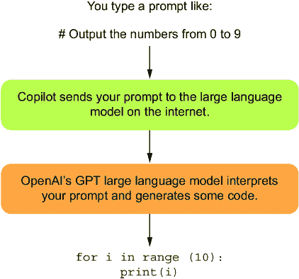

# 第一章：使用 GitHub Copilot 介绍 AI 辅助编程

### 本章涵盖

+   AI 助手如何改变新程序员的学习方式

+   为什么编程永远不会一成不变

+   如何使用 GitHub Copilot 等 AI 助手工作

+   AI 辅助编程的可能风险

计算机编程长期以来一直是受过特殊培训并拥有高级技能的专业人士的领域。毕竟，你希望运行银行、电话、汽车等应用的程序每次都能完全正确地运行！正如曾经占据房间大小的计算机，堆满纸卡片和数英里长的磁带被现代设备所取代一样，编程语言和工具也变得更容易使用。现在，像 ChatGPT 这样的 AI 工具让计算机编程几乎对每个人来说都触手可及。我们希望帮助你打开这扇门！

学习如何编程，你将能够承担工作中的新任务，创建自己的电脑游戏，并在工作中让电脑为你工作。在这本书中，我们将向你展示如何使用 ChatGPT 和 GitHub Copilot 编写自己的计算机程序。在这个过程中，你将学习一些 Python 编程语言中的技能，Python 是最受欢迎的编程语言之一。

## 1.1 改善我们与计算机的交流方式

让我们先请计算机从 0 数到 9。几十年前，一本关于编程的书会要求你学习如何阅读和理解以下代码（基于[`mng.bz/EOdO`](https://mng.bz/EOdO)）：

```py
section .text 
global _start 
_start: 
    mov ecx, 10 
    mov eax, '0' 
    l1: 
    mov [num], eax 
    mov eax, 4 
    mov ebx, 1 
    push ecx 
    mov ecx, num 
    mov edx, 1 
    int 0x80 
    mov eax, [num] 
    inc eax 
    pop ecx 
    loop l1 
    mov eax, 1 
    int 0x80 
section .bss 
    num resb 1
```

我们很高兴我们不再是这样编程的。那个怪物是用汇编语言编写的，汇编语言是一种低级编程语言。正如你所见，低级编程语言并不是人类可以轻松阅读和编写的语言。它们是为计算机设计的，而不是为人类设计的。

没有人想编写那样的程序，但，特别是在过去，有时这是必要的。程序员可以使用它来精确定义他们希望计算机执行的操作，甚至到单个指令。这种程度的控制是必要的，以便从性能不足的计算机中榨取每一丝性能。例如，90 年代最速度关键的电脑游戏，如 Doom 和 Quake，就是用汇编语言编写的，就像之前的代码示例一样。否则，制作那些游戏是不可能的。

### 1.1.1 让它变得稍微容易一些

好的，让我们继续前进。这是一个更现代的计算机程序，它也会打印数字。

```py
for num in range(0, 9): 
     print(num)
```

这段代码是用 Python 语言编写的，这是许多程序员现在使用的语言。与低级语言汇编语言不同，Python 被认为是一种高级语言，因为它与自然语言更加接近。即使你还不了解 Python 代码，你也可能猜出这个程序试图做什么。第一行看起来像是在处理从 0 到 9 的数字范围。第二行是在打印某些内容。相信这个程序，就像汇编语言的怪物一样，旨在打印从 0 到 9 的数字并不困难。不幸的是，出了点问题，它只打印了 0 到 8 的数字。

虽然这段代码更接近英语，但它并不是英语。它是一种像汇编语言一样的编程语言，具有特定的规则。就像之前的代码一样，误解这些规则的细节可能会导致程序出错。如果你好奇，误解的规则是`range`函数在第二个数字之前停止，所以它不包括数字 9。如果你想从 0 到 9，你需要说`range(0,10)`。

与计算机进行交流的圣杯是使用像英语这样的自然语言。在过去 80 年里，我们使用各种编程语言与计算机交谈，并不是因为我们想这么做，而是因为我们不得不这么做。计算机的运算能力不足以处理像英语这样的语言的复杂性和特殊性。我们的编程语言从符号汤汇编语言发展到例如 Python，但它们仍然是计算机语言，而不是自然语言。这种状况正在改变。

### 1.1.2 使其变得更加容易

使用人工智能助手，我们现在可以用英语提出我们想要的内容，并让计算机为我们编写相应的代码。为了得到一个正确打印从 0 到 9 的 Python 程序，我们可以用正常的英语语言向我们的 AI 助手（Copilot）提出如下请求：

```py
# Output the numbers from 0 to 9
```

Copilot 可能会对此提示做出如下回应：

```py
for i in range(10):
    print(i)
```

与我们之前展示的例子不同，这段 Python 代码实际上是可以运行的！

人工智能编码助手可以帮助人们编写代码。在这本书中，我们将学习如何使用 Copilot 为我们编写代码。我们可以用英语提出我们想要的内容，然后得到 Python 代码的回应。

不仅如此，我们还将能够将 Copilot 作为工作流程中无缝的一部分来使用。如果没有像 Copilot 这样的工具，程序员通常会打开两个窗口：一个用于编写代码，另一个用于询问 Google 如何编写代码。第二个窗口包含 Google 搜索结果、Python 文档或程序员论坛，他们讨论如何编写代码来解决特定问题。他们经常将这些结果中的代码粘贴到他们的代码中，然后根据他们的上下文稍作修改，尝试其他替代方案等等。这已经成为程序员的一种生活方式，但你可以想象这里的低效。据估计，高达 35%的程序员时间用于搜索代码[1]，而且找到的代码往往不易使用。Copilot 通过帮助我们编写代码，极大地改善了这种体验。

## 1.2 关于技术

本书我们将使用两种主要技术：Python 和 GitHub Copilot。Python 是我们将使用的编程语言，GitHub Copilot 是我们的人工智能助手，它将帮助我们与 Python 代码一起工作。

### 1.2.1 Python，你的编程语言

如前所述，Python 是一种编程语言，它是与计算机进行交流的方式。人们用它编写各种程序，执行有用的任务，如数据分析、游戏、交互式网站、可视化、文件组织应用、自动化常规任务等等。

还有其他编程语言，例如 Java、C++、Rust 以及许多其他语言。Copilot 也可以与这些语言配合使用，但截至本书编写时，它与 Python 配合得非常好。与许多其他语言（尤其是汇编语言）相比，Python 代码编写起来要容易得多。更重要的是，Python 易于*阅读*。毕竟，我们不会是编写 Python 代码的人——我们的 AI 助手会！

计算机不知道如何读取和运行 Python 代码。计算机唯一能理解的是一种称为*机器码*的东西，它看起来甚至比汇编码还要荒谬，因为它实际上是汇编码的二进制表示（是的，只是一堆 0 和 1！）。在幕后，你的计算机将你提供的任何 Python 代码转换为机器码，然后再运行，如图 1.1 所示。


##### 图 1.1 你的 Python 程序在你在屏幕上看到输出之前要经过几个步骤。

所以，现在没有人再从零开始用计算机的机器码语言编写代码了。程序员们都会选择当时对他们特定任务最方便的语言，并使用软件来帮助他们编写、运行和调试（即修复）代码，这种软件被称为集成开发环境（IDE）。在本书中，我们将使用 Visual Studio Code（VS Code）作为我们的 IDE，因为它与 GitHub Copilot 配合得非常好。

### 1.2.2 GitHub Copilot，你的 AI 助手

什么是 AI 助手？AI 助手是一种 AI 代理，它帮助你完成工作。也许你家里有 Amazon Alexa 设备或者一部带有 Siri 的 iPhone——这些是 AI 助手。它们帮助你订购杂货，了解天气，或者确定，是的，在 *哈利·波特* 电影中扮演贝拉特里克斯的女演员真的在 *斗士俱乐部* 中出现过。AI 助手只是一个能够对典型的人类输入，如语音和文本，以类似人类的回答进行响应的计算机程序。

Copilot 是一个具有特定任务的 AI 助手：它将英语转换为计算机程序（以及更多，我们很快就会看到）。还有其他像 Copilot 一样的 AI 助手，包括 Amazon Q Developer、Tabnine 和 Ghostwriter。我们选择 Copilot 来编写这本书，是基于我们能够产生的代码质量、稳定性（它从未崩溃过！）以及我们自己的个人偏好。我们鼓励你在感到舒适的时候也去检查其他工具。

### 1.2.3 Copilot 在幕后是如何工作的——30 秒内了解

你可以把 Copilot 看作是你和你要编写的计算机程序之间的一个层。你不需要直接编写 Python，你只需用文字描述你想要的程序——这被称为 *提示*——然后 Copilot 就会为你生成程序。

Copilot 背后的“大脑”是一个名为 *大型语言模型*（LLM）的复杂计算机程序。LLM 存储关于词语之间关系的信息，包括哪些词语在特定上下文中是有意义的，并使用这些信息来预测对提示的最佳词语序列。

想象一下，我们问你这句话的下一个词应该是什么：“这个人打开了 ________。”这里可以填入很多词，比如“门”、“盒子”或“对话”，但也有许多词不适合这里，比如“the”、“it”或“open”。LLM 会考虑到词语的当前上下文来生成下一个词，并且它会一直这样做，直到完成任务。它以 *非确定性* 的方式做这件事，这意味着它的决策是有些随机的，也就是说，如果你要求它填入那个词，有时它会给你“门”这个词，有时它会给你“盒子”这个词。这意味着如果你要求 Copilot 给你代码，它可能会每次给出不同的答案。

此外，我们并没有说 Copilot 理解它在做什么。它只是使用当前上下文来继续编写代码。在整个过程中请记住这一点：只有我们知道生成的代码是否是我们想要它做的。通常它确实做到了，但无论如何，你都应该保持健康的怀疑态度。图 1.2 展示了 Copilot 从提示到程序的过程。



##### 图 1.2 使用 Copilot 从提示到程序的过程

你可能会想知道为什么 Copilot 为我们编写 Python 代码而不是直接编写机器代码。Python 现在不是可替代的中间步骤吗？嗯，不是的，原因在于 Copilot 会犯错误。而且如果它要犯我们需要修复的错误，用 Python 来做比用机器代码要容易得多。

事实上，几乎没有人检查从 Python 生成的机器代码是否正确。这部分原因是因为 Python 语言规范的确定性。我们可以想象一个未来，Copilot 的对话如此精确，以至于检查 Python 代码变得没有必要，但我们离那个未来还有很长的路要走。

## 1.3 Copilot 如何改变我们学习编程的方式

在过去学习如何编程时，学习者通常花费大部分时间与程序的语法和基本结构打交道。当我们提到 *语法* 时，我们指的是在给定语言中有效的符号和单词。程序员需要从头开始（一个字符一个字符，一行一行）编写程序的所有语法。学习编程的人过去常常需要花费数周或数月才能达到能够编写甚至基本程序的水平。现在，Copilot 可以立即编写这些相同的基本程序，并提供的代码几乎总是语法和结构上正确的。正如你将在本书的其余部分看到的那样，我们仍然需要验证这些代码是否正确，因为 Copilot 可能会出错。然而，我们不再需要从头编写它。我们相信 Copilot 和类似工具标志着人们学习编程的旧方式的终结。

你作为一个对学习编程感兴趣的人，根本不需要与语法作斗争，理解如何准确调用给定的 Python 函数，以及编写代码时所需的其他 Python 概念。当然，我们将在本书中学习这些概念，但不是为了让你通过从头编写 Copilot 可以轻松生成的代码来展示你的理解。不，我们学习这些概念仅仅是因为它们帮助我们解决有意义的问题，并与 Copilot 有效地互动。相反，你将能够更快地学习如何编写更大、更有意义的软件，因为 AI 助手从根本上改变了学习编程所需掌握的技能。

## 1.4 Copilot 还能为我们做些什么？

正如我们所看到的，我们可以使用 Copilot 根据我们想要的英文描述来为我们编写 Python 代码。因此，我们可以这样说，Copilot 接收英文语法的描述，并以 Python 语法的代码返回。这是一个巨大的进步，因为学习编程语法在历史上一直是新程序员的一个主要障碍。我应该在这里使用哪种括号——[、( 或 {]？我需要在这里缩进吗？我们应该按照什么顺序编写这些内容：x 然后是 y，还是 y 然后是 x？

这样的问题层出不穷，而且——让我们说实话——这并不有趣。当我们只想编写一个程序让某事发生时，谁会在乎这些呢？Copilot 可以帮助我们摆脱语法上的枯燥。我们认为这是帮助更多人成功编写程序的重要一步，我们期待着有一天这个人工障碍被完全消除。目前，我们仍然需要 Python 语法，但至少 Copilot 在这方面帮助我们。

但 Copilot 能做的不仅仅是这些。以下是一些相关且同样重要的任务，Copilot 可以帮助我们完成：

+   *解释代码* — 当 Copilot 为我们生成 Python 代码时，我们需要确定该代码是否满足我们的需求。同样，正如我们之前所说的，Copilot 可能会犯错误。尽管我们并不想教你 Python 工作的每一个细节（那是旧的编程模式），但我们会教你如何阅读 Python 代码，以获得对其功能的整体理解。我们还会使用 Copilot 的代码解释功能，用英语向你解释代码。当你完成这本书和我们的解释后，你仍然可以使用 Copilot 来帮助你理解它给出的下一部分复杂的代码。

+   *使代码更容易理解* — 有不同的方式来编写代码以完成同一任务。有些可能比其他更容易理解。你可以要求 Copilot 重新组织你的代码，使其更容易使用。易于阅读的代码在需要时通常更容易增强或修复。

+   *修复错误* — 一个 *错误* 是在编写程序时犯下的错误，可能会导致程序执行错误。有时，你的 Python 代码几乎可以工作，或者几乎总是可以工作，但在一种特定情况下却不行。如果你听过程序员的谈话，你可能听说过这样一个常见的例子：程序员可能花费数小时，最终只移除了一个导致程序失败的等号符号。那可不是几个小时的乐趣！在这些情况下，你可以尝试 Copilot 的功能，该功能可以帮助自动找到并修复程序中的错误。

+   *解释错误* — 如果你的代码没有正确工作，你通常会从 Python 运行时环境得到一个错误报告。有时，这些错误可能相当晦涩难懂，但 Copilot 可以帮助你解释错误，并指导你如何修复它。

+   *寻找 Python 库* — Python 是一种成熟的编程语言，拥有许多模块（库）可以帮助完成特定任务，例如数据分析、编写游戏、处理不同的图像文件格式等等。与 Copilot 进行一次简短的对话通常可以帮助你找到使你的工作变得更轻松的模块，并为你提供一些入门示例。

## 1.5 使用 Copilot 的风险和挑战

现在我们都对让 Copilot 为我们编写代码感到兴奋，我们需要谈谈使用 AI 助手固有的危险（参见参考文献[2]和[3]，以详细说明这些观点的一些内容）：

+   *版权*—Copilot 通过使用人类编写的代码来学习编程。（当人们谈论像 Copilot 这样的 AI 工具时，你会听到他们使用“训练”这个词。在这个上下文中，训练是学习的另一个词。）更具体地说，它是通过使用包含开源代码的数百万个 GitHub 仓库进行训练的。一个担忧是 Copilot 会“窃取”那段代码并给我们。根据我们的经验，Copilot 很少建议大量他人的代码，但这种可能性是存在的。即使 Copilot 给出的代码是各种他人代码片段的融合和转换，也可能存在许可问题。例如，Copilot 产生的代码归谁所有？目前还没有关于这个问题的共识。Copilot 团队正在添加功能来帮助；例如，Copilot 可以告诉你它产生的代码是否与现有的代码相似以及该代码的许可情况[4]。自学和实验是很好的，我们鼓励这样做——但如果你打算将此代码用于家庭以外的目的，请务必小心。我们故意说得比较含糊，因为法律可能需要一段时间才能赶上这种新技术。在这些社会辩论进行时，最安全的做法是谨慎行事。

+   *教育*—作为入门级编程课程的讲师，我们亲眼见证了 Copilot 在我们过去给学生布置的作业类型上的出色表现。在一项研究中[5]，Copilot 被要求解决 166 个常见的入门级编程任务。它做得怎么样？在第一次尝试中，它解决了近 50%的问题。给 Copilot 更多的信息，这个数字会上升到 80%。鉴于像 Copilot 这样的工具，教育需要改变，目前讲师们正在讨论这些变化可能的样子。在一些学校，学生被允许使用 Copilot 来辅助他们的学习和作业。在其他学校，Copilot 在某些情况下（例如，考试）或对某些学生（计算机科学专业学生）是不被允许的。在许多学校，LLMs 被允许作为学生的辅导老师。在某些情况下，LLM 辅导老师只是像 Copilot 或 ChatGPT 这样的常规 LLM，但在其他情况下，LLM 界面已被改变以限制学生收到的答案类型。目前还太早知道 LLMs 将如何影响计算机教育，但这样的趋势已经初露端倪。

+   *代码质量*—我们需要小心不要信任 Copilot，特别是对于敏感代码或需要安全的代码。例如，为医疗设备编写的代码或处理敏感用户数据的代码必须始终彻底理解。向 Copilot 请求代码，对它产生的代码感到惊奇，并未经审查就接受这些代码是很诱人的。但在本书中，我们将处理不会大规模部署的代码，因此，虽然我们将关注获取正确的代码，但我们不会担心使用此代码的更广泛用途的影响。我们还将建立你需要的独立确定代码是否正确的基础。

+   *代码安全*—与代码质量一样，当我们从 Copilot 获取代码时，代码的安全性绝对不能得到保证。例如，如果我们正在处理用户数据，仅仅从 Copilot 获取代码是不够的。我们需要进行安全审计，并拥有专业知识来确定代码的安全性。然而，尽管如此，我们不会在实际场景中使用 Copilot 的代码，因此我们不会关注安全问题。

+   *非专家*—成为专家的一个标志是意识到自己知道什么，同样重要的是，知道自己不知道什么。专家通常也能表达他们对回答的信心程度，如果他们不够自信，他们会进一步学习，直到他们确信自己知道。Copilot 和更广泛的 LLMs 则不具备这种能力。你问他们一个问题，他们就会直接回答，就是这样。如果需要，他们会编造：他们会将真实信息与垃圾信息混合，形成一个听起来合理但实际上毫无意义的回答。例如，我们见过 LLMs 为活着的人编造讣告，这显然是没有意义的，但这些“讣告”确实包含了一些关于人们生活的真实信息。当被问及算盘为什么能比电脑更快地完成数学运算时，我们见过 LLMs 给出听起来自信的回答——包括关于算盘是机械的，因此必然是最快的说法。LLMs 在这个领域正在进行工作，以便能够说，“抱歉，不，我不知道这个。”但我们还没有达到那个阶段。他们不知道自己不知道什么，这意味着他们需要监督。

+   *偏见*——LLMs 会复制它们在训练数据中存在的相同偏见。如果你要求 Copilot 生成一个名字列表，它将主要生成英语名字。如果你要求一个图表，它可能产生的图表没有考虑人类之间的感知差异。而且，如果你要求代码，它可能产生一种特定群体编写代码风格的代码。（毕竟，在计算机科学中，人口群体得到了很好的代表，Copilot 就是在这些代码上训练的。）计算机科学和软件工程长期以来一直遭受着缺乏多样性的困扰。我们无法进一步压制多样性，我们需要扭转这一趋势。我们需要让更多的人加入，并允许他们以自己的方式表达自己。如何使用像 Copilot 这样的工具来处理这个问题目前正在被解决，这对编程的未来至关重要。然而，我们相信 Copilot 有潜力通过降低进入该领域的门槛来提高多样性。

## 1.6 我们需要的技能

如果 Copilot 可以编写我们的代码、解释它并修复其中的错误，我们是不是就完成了？我们是不是只需要告诉 Copilot 要做什么，然后庆祝我们的纯粹厉害？

不。首先，Copilot 可能会犯错误。它给出的代码可能在语法上是正确的，但有时它并不做我们想要它做的事情。我们需要保持警惕，以便在 Copilot 犯这些错误时能够捕捉到。其次，尽管程序员依赖的一些技能（例如，编写正确的语法）的重要性可能会降低，但其他技能仍然至关重要。例如，你不能把一个巨大的任务扔给 Copilot，比如，“制作一个视频游戏。哦，还要让它有趣。”Copilot 会失败的。相反，我们需要将这样一个大问题分解成 Copilot 可以帮助我们的小任务。我们如何那样分解问题？实际上并不容易。当与像 Copilot 这样的工具进行对话时，人类需要发展这种关键技能，我们在整本书中都在教授这种技能。

无论如何，其他技能在 Copilot 的帮助下可能会变得更加重要。测试代码在创建高质量代码中一直是一项关键任务。我们了解人类编写的代码的测试，因为我们知道在哪里寻找典型问题。我们知道人类经常在值的边界处犯编程错误。例如，如果我们编写了一个乘以两个数的程序，我们可能会得到大多数值正确，但可能不会在其中一个值为 0 时正确。那么，AI 编写的代码呢？20 行无瑕疵的代码可能隐藏着一行如此荒谬的代码，我们可能不会期望它在那里。我们没有这方面的经验。我们需要比以前更加仔细地测试。

我们还需要知道如何在代码出错时修复错误。这个过程被称为*调试*，并且仍然非常重要，尤其是当 Copilot 给你接近正确但还不够准确的代码时。

最后，一些必需的技能完全是新的。其中最主要的是被称为*提示工程*的技能，它涉及如何告诉 Copilot 要做什么。如前所述，当我们要求 Copilot 编写一些代码时，我们使用提示来发出请求。虽然我们可以用英语来编写这个提示并要求我们想要的东西，但这还不够。如果我们想让 Copilot 有做对事情的机会，我们需要非常精确。即使我们很精确，Copilot 仍然可能做错事情。在这种情况下，我们首先需要确定 Copilot 确实犯了一个错误。然后，我们可以尝试调整我们的描述，希望将其引导到正确的方向。根据我们的经验，对提示的看似微小的改变可能会对 Copilot 产生的结果产生不成比例的影响。在这本书中，我们将教你所有这些技能。

## 1.7 对像 Copilot 这样的 AI 代码助手的社会担忧

目前社会对像 Copilot 这样的 AI 代码助手存在不确定性。我们认为应该以几个问题和我们的当前答案结束本章。也许你自己也在思考这些问题！我们的答案可能最终会显得荒谬错误，但它们确实捕捉了我们作为两位致力于编程教学的教授和研究者的当前想法：

> *Q:* 现在我们有了 Copilot，技术编程工作会减少吗？
> 
> *A:* 很可能不是。我们预期会改变的是这些工作的性质。例如，我们认为 Copilot 可以帮助完成许多通常与初级编程工作相关的任务。这并不意味着初级编程工作会消失，只是随着程序员能够利用越来越复杂的工具完成更多工作，这些工作会发生变化。
> 
> *Q:* Copilot 会扼杀人类的创造力吗？它会不会只是不断循环和重复人类已经编写过的代码，限制新想法的引入？
> 
> *A:* 我们怀疑不是。Copilot 帮助我们以更高的层次工作，远离底层机器代码、汇编代码或 Python 代码。计算机科学家使用术语*抽象*来指代我们与计算机底层细节断开连接的程度。抽象自计算机科学诞生以来一直在发生，我们似乎并未因此遭受损失。相反，它使我们能够忽略已经解决的问题，并专注于解决越来越广泛的问题。事实上，更好的编程语言的诞生促进了更好的软件的发展——当只有汇编语言时，Google 搜索、Amazon 购物车和 macOS 等软件都没有被编写（很可能也无法编写）！
> 
> *Q:* 我经常听到关于 ChatGPT 的消息。那是什么？它和 Copilot 一样吗？
> 
> *A:* 它与 Copilot 不同，但建立在相同的技术之上。然而，ChatGPT 并不是专注于代码，而是关注一般性的知识。因此，它已经渗透到比 Copilot 更广泛的各种任务中。例如，它可以回答问题，撰写文章，甚至在沃顿商学院的 MBA 考试中表现出色[6]。因此，教育将需要改变：我们不能让人们通过 ChatGPT 的方式获得 MBA！我们花费时间的有价值的方式可能会改变。人类是否会继续写书，如果是的话，会以什么方式？人们是否愿意阅读那些部分或全部由 AI 撰写的书籍？这将在包括金融、医疗保健和出版在内的各个行业产生影响[7]。同时，目前存在无节制的炒作，因此很难区分真相与虚构。这个问题由于一个简单的事实而加剧，即没有人知道长期会发生什么。罗伊·阿玛拉（被称为阿玛拉定律）提出了一句古老的谚语说：“我们往往高估了技术在短期内的影响，而低估了在长期的影响。”因此，我们需要尽我们所能关注讨论，以便我们可以相应地适应。

在下一章中，我们将指导您在电脑上开始使用 Copilot，以便您可以开始编写软件。

## 摘要

+   Copilot 是一个 AI 助手，它是一种 AI 代理，可以帮助您完成工作。

+   Copilot 改变了人类与计算机的互动方式，以及我们编写程序的方式。

+   Copilot 改变了我们需要磨练的技能的焦点（减少对语法的关注，更多关注问题分解和测试）。

+   Copilot 是非确定性的；有时它会产生正确的代码，有时则不会。我们需要保持警惕。

+   关于代码版权、教育和职业培训以及 Copilot 结果中的偏见等问题仍需要解决。
