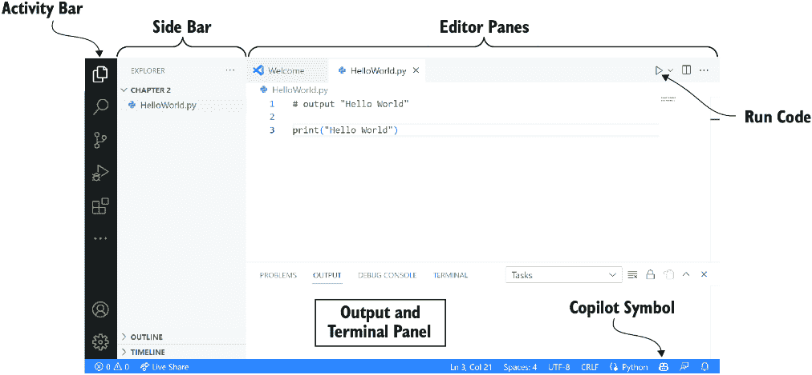
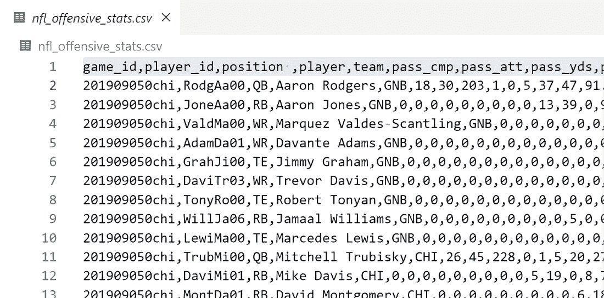

# 第二章：使用 Copilot 开始

### 本章涵盖了

+   在你的系统上设置 Python、Visual Studio Code 和 Copilot

+   介绍 Copilot 的设计过程

+   理解 Copilot 在数据处理任务中的价值

我们希望你能从一开始就能自己创建软件。为此，我们将引导你设置你的机器上的 Visual Studio Code（VS Code）、Python 和 Copilot，并让你熟悉如何与这些工具交互。在你设置好工具后，你将能够跟随我们的示例，并开始自己创建软件。实践是检验真理的唯一标准，我们相信你可以在我们这本书的剩余部分边学边实践。

一旦你设置了 Copilot，我们将通过一个展示 Copilot 在解决标准任务中强大功能的有趣示例来引导你。你会看到如何与 Copilot 交互，并学习你如何在不实际编写任何代码的情况下编写软件。记住，Copilot 并不完美，你需要能够阅读并理解一点 Python 才能得到你想要的结果，但它给了你一个很大的起点。让我们开始创建你的第一个计算机程序。

## 2.1 设置你的电脑开始学习

学习如何编写软件需要你超越仅仅阅读它，并实际执行编写软件的任务。如果这是一本关于如何弹吉他的书，你会不尝试弹吉他就继续阅读吗？我们认为你不会。不跟随并亲自尝试，就阅读这本书，就像看着马拉松运动员完成比赛，然后认为你准备好自己跑一场一样。我们将停止使用类比，但说真的，在我们继续前进之前，你需要安装并运行你的软件。

目前最让我们感到害怕的是，我们刚刚到达了一个新手们，甚至那些渴望学习编程的新手们往往会失败的最常见点，我们**真的**希望看到你成功。现在，你可能正在想，“等等，真的吗？我们才刚刚开始。”是的，这正是关键所在。在 Leo 在 Coursera 上关于学习 Java 编程的流行课程[1]中，你能猜到大多数新学习者离开的点是什么吗？是课程末尾的挑战性作业，涉及在实时地球上绘制地震标记吗？不是的。实际上，是热身作业，学习者必须设置他们的编程环境。因此，我们理解这可能对你来说是一个障碍。我们希望，通过这个不太明显的推动，我们可以帮助你实现你购买这本书时心中所设定的所有目标。一切从安装软件开始。

## 2.2 我们将使用的软件

为了轻松设置和使用 Copilot，我们将安装新手和软件工程师都会使用的软件编辑工具。你将使用的工具是 Python、VS Code、GitHub 和 Copilot。当然，如果你已经安装了所有这些工具，请跳转到 2.6.1 节。

### 2.2.1 Python

任何编程语言都可以用于这本书，但我们选择了 Python，因为它是世界上最受欢迎的编程语言之一，也是我们在大学入门课程中教授的语言。正如我们在第一章中提到的，与其它语言相比，Python 更易于阅读、理解和编写。对于这本书，Copilot 将主要生成代码，而不是你。然而，你将想要阅读并理解 Copilot 生成的代码，Python 在这方面做得很好。

### 2.2.2 Visual Studio Code

你可以使用任何文本编辑器来编程。然而，如果你想有一个良好的编程环境，可以编写代码，轻松地从 Copilot 获得建议，并运行你的代码，VS Code 是我们的首选工具。VS Code 被学习软件的初学者使用，并且受到学生的喜爱[2]。它也被全球的专业软件工程师广泛使用，这意味着在完成这本书后，你可以在使用这个环境的同时工作和学习。为了让 VS Code 适用于这本书，你需要安装一些扩展，以便使用 Python 和 Copilot，但 VS Code 的一个优点是安装这些扩展很容易。

### 2.2.3 GitHub 账户

GitHub 是开发、维护和存储软件的行业标准工具。然而，在这本书中，我们不会使用 GitHub。我们注册 GitHub 仅仅是因为你需要一个账户来访问 Copilot。注册 GitHub 账户是免费的，但截至写作时，他们为 Copilot 收费。如果你是学生，他们将免除这项费用。如果你不是学生，截至写作时，你可以获得 30 天的免费试用。

你可能会问为什么他们要收费，有一个很好的答案。构建 GPT 模型（想象有成千上万的计算机运行一年来构建模型）的成本很高，GitHub 通过提供模型预测来承担成本（许多机器接收你的输入，将其通过模型运行，并生成你的输出）。如果你还没有准备好使用 Copilot，你可以在注册后的大约 25 天内做一个日历提醒，如果你在那个时间没有使用 Copilot，只需取消即可。另一方面，如果你已经成功地学会了如何使用 Copilot 编写软件，并且正在用它来提高工作效率或作为爱好，那么保留它可能是有意义的。

在本章的整个过程中，我们将安装所有这些工具，但我们将其分为两部分进行。第一部分，将在下一节中介绍，将帮助你设置自己的环境以编写和运行代码，让你熟悉这个过程。第二部分将帮助你设置使用 Copilot 来辅助编写代码的环境。

## 2.3 设置你的系统：第一部分

在我们安装指南的第一部分，我们将安装 Python 和 VS Code。为了简化这一部分，我们只是概述了你应该遵循的主要步骤。然而，更详细的说明可以在以下位置找到：

+   VS Code 在 [`mng.bz/znjQ`](https://mng.bz/znjQ) 提供了入门编写 Python 代码的教程。

+   本书网站 ([`mng.bz/0M46`](https://mng.bz/0M46)) 提供了设置 PC 和 macOS 系统的详细说明。由于这些工具的网站可能会在我们写这本书之后发生变化，我们鼓励您结合使用 GitHub 链接和本书网站。

+   在在线书籍论坛 ([`mng.bz/NBK1`](https://mng.bz/NBK1)) 中，您可以寻求帮助并查看常见问题的答案列表。

您需要完成的步骤主要包括以下几步：

1.  安装 Python：

    +   访问 [www.python.org/downloads/](http://www.python.org/downloads/)。

    +   下载并安装 Python 的最新版本（写作时为 3.12.3）。

1.  安装 VS Code:

    +   访问 [`code.visualstudio.com/download`](https://code.visualstudio.com/download)，并选择适合您操作系统的主下载版本（例如，Windows 或 Mac）。

    +   下载并安装 VS Code 的最新版本。

1.  安装 VS Code 扩展程序：（详情请见 [`mng.bz/9o01`](https://mng.bz/9o01)）。

    +   *Python (by Microsoft)*—按照 [`mng.bz/j0gP`](https://mng.bz/j0gP) 中的说明正确设置 Python 扩展程序（特别是选择正确的解释器）。

虽然这里的说明很简短，但我们知道在现实中它们可能需要一些时间。如果您遇到任何问题，请参考前面提到的资源以获取更详细的设置说明。

## 2.4 在 Visual Studio Code 中使用 Python

现在您的系统已经设置好了，让我们熟悉图 2.1 所示的 VS Code 界面。（您可能需要点击左上中的资源管理器图标以获得相同的视图。）图 2.1 中标识了以下区域：

+   *活动栏*—在左侧远端是活动栏，我们可以在此打开文件文件夹（也称为目录）或安装扩展程序（就像您在上一节中安装 Python 扩展程序那样）。

+   *侧边栏*—侧边栏显示活动栏中当前打开的内容。在图 2.1 中，活动栏显示了选中的资源管理器，因此侧边栏显示了当前文件夹中的文件。

+   *编辑器面板*—这是我们创建软件的主要区域。编辑器面板中的编辑器类似于任何其他文本编辑器，您可以使用剪贴板编写、编辑、复制和粘贴文本。然而，编辑器是专门为与代码良好协作而设计的。在此阶段，我们将在此窗口中编写代码，但在此章的后面，您将主要通过请求 Copilot 生成代码并在该窗口中测试代码来工作。


##### 图 2.1 VS Code 界面 [3]

+   *输出和终端面板*在这个界面区域，你将看到你的代码输出或任何在以下标签中发生的错误：问题、输出、调试控制台和终端。我们将主要使用问题标签，我们可以看到我们代码中的潜在错误，以及终端标签，它允许我们与 Python 交互并看到代码的输出。

VS Code 有许多不同的配色方案，所以你可以使用你喜欢的任何配色方案，因为功能是相同的。

### 2.4.1 设置你的工作文件夹

在 VS Code 左侧的活动栏顶部，你会找到作为顶部图标的资源管理器。点击资源管理器后，你应该会看到一个“未打开文件夹”的消息。点击按钮打开一个文件夹，并在你的电脑上选择一个文件夹（或者创建一个新的——我们喜欢命名为 fun_with_Copilot 的文件夹）。一旦你打开了这个文件夹，你的工作区将是你打开的文件夹，这意味着你应该在这个文件夹中拥有你的代码和任何数据文件，比如我们将在本章后面使用的那个文件。

##### 文件未找到或文件缺失错误

如果你收到一个错误消息说缺少文件，不要灰心：这些是每个人都会犯的错误。在编写软件时，这些错误可能会非常令人烦恼。也许你只是没有把文件放在你的工作文件夹里——这种情况可能发生——但是通过复制或移动文件到正确的文件夹就可以轻松修复。然而，有时你会在文件夹中看到文件，但当你用 VS Code 运行你的代码时，Python 似乎找不到它。如果你遇到这种情况（在我们编写这本书的时候也遇到了这种情况！），请确保使用 VS Code 中的资源管理器（如图 2.1 中的侧边栏所示）打开包含代码和所需文件的文件夹。

### 2.4.2 检查你的设置是否正常工作

让我们检查我们是否正确设置了所有内容。为此，我们首先创建一个新的文件来存放我们的程序。你可以通过转到文件 > 新建文件（如图 2.2 所示），然后选择 Python 文件（如图 2.3 所示）来完成此操作。


##### 图 2.2 如何在 VS Code 中创建新文件

创建文件后，我们喜欢确保我们已经保存了文件。转到文件 > 另存为，并将此文件命名为 first_program.py。接下来，在文本编辑器中，准确地输入以下内容，就像这里显示的那样：

```py
print("Hello World")
```

你可能已经猜到了当我们运行这个程序时会发生什么。它应该在屏幕上打印“Hello World”。让我们运行它看看！首先，你需要保存你的文件，方法是转到文件 > 保存。


##### 图 2.3 选择 Python 文件以创建新的 Python 文件。

警告：在运行文件之前务必保存！我们很不好意思地承认，我们曾经花费了大量时间试图修复那些正确但未保存的代码。

要运行你的程序，转到文本编辑器的右上角，并点击之前在图 2.1 中显示的运行代码图标。点击图标后，在底部的终端部分，你应该会看到类似以下的内容：

```py
> & C:/Users/<YOUR_NAME>/AppData/Local/Programs/Python/Python312/python.exe 
↪ c:/Users/<YOUR_NAME>/Copilot/first_program.py
Hello World
```

以>开头的第一行是计算机运行你代码的命令，它只是告诉使用 Python 运行 first_program.py。第二行是运行命令的输出，显示“Hello World”，这是我们希望看到的。

恭喜！你已经编写了你的第一个程序！现在我们知道你的编程环境已经设置正确。让我们开始编写几段更小的代码，以便熟悉这个工作流程，然后我们将转向与 Copilot 一起的工作流程。

## 2.5 编写和运行一些小程序

你刚刚完成了安装 Python 和 VS Code 以及使其工作的大步骤。在我们开始使用我们的 AI 助手 Copilot 之前，让我们编写几个小程序，这样你就可以对输入和运行代码有所体会。

让我们从编写一个涉及加法的小程序开始。请删除你写的打印 Hello World 的行，并用以下代码替换：

```py
a = 10
b = 20
print(a + b)
```

你认为这段代码会打印什么？它会打印“a + b”，还是会打印 30？请运行它看看结果。

计算机计算了 10 和 20 的和，并打印了 30。这很酷，对吧？我们使用计算机进行了一些小计算。如果你改变`a`或`b`的值，你认为会发生什么？你可以自己尝试一下。

我们将在本书的后面花更多的时间讨论如何阅读代码的细节，但如果你好奇，以下是阅读该代码的方法：

```py
a = 10     #1
b = 20           #2
print(a + b)   #3
```

#1 创建一个名为“a”的变量并将其值设为 10

#2 创建一个名为“b”的变量并将其值设为 20

#3 将“a”和“b”相加，然后将结果打印到屏幕上

当前关键的是让你习惯在编辑器窗格中输入代码并使用运行按钮来运行它。

让我们再举一个简单的例子。假设你想计算一个正方形的面积。回忆一下我们关于形状的公式，边长为*s*的正方形的面积如下：

面积 = *s*²

让我们从定义一个边长并打印面积开始：

```py
side = 5
area = side * side
print("Side length:", side, " Square area is:", area)
```

我们鼓励你输入并运行这段代码。当你运行它时，你应该得到以下结果：

```py
Side length: 5 Square area is: 25
```

你在输入这段代码时遇到任何问题吗？我们怀疑很多人会遇到。如果你漏掉了引号、逗号或括号，当你运行代码时，你可能会得到一些不愉快的错误，比如（这里，如果你忘了逗号）：

```py
File "c:\Users\Leo\Copilot\first_program.py", line 7
    print("Side length:" side, " Square area is:", area)
          ^^^^^^^^^^^^^^^^^^
SyntaxError: invalid syntax. Perhaps you forgot a comma?
```

在传统的编程学习方法中，你需要花费大量时间确保你理解了编写编程语言 Python 所需的精确字符。我们将再次强调好消息：有了像 Copilot 这样的 AI 助手，语法变得不再那么重要。让我们安装 Copilot，这样你就可以学习如何使用这个工具了。

## 2.6 设置系统：第二部分

现在，我们已经准备好安装指南的第二部分。这里有一些新的步骤，超出了你之前所做的工作。再次提醒，你可以自由地参考以下资源以获取更多关于安装过程的详细信息：

+   访问 GitHub 的文档 [`mng.bz/WVP1`](https://mng.bz/WVP1)。

+   该书的网站 ([`mng.bz/0M46`](https://mng.bz/0M46)) 提供了设置 PC 和 macOS 系统的详细说明。由于这些工具的网站可能会在我们写这本书之后发生变化，我们鼓励您结合使用 GitHub 链接和本书网站。

+   在在线书籍论坛 ([`mng.bz/NBK1`](https://mng.bz/NBK1)) 中，你可以寻求帮助并查看常见问题的答案。

这次你需要完成的主要步骤如下：

1.  设置您的 GitHub 账户，并注册 Copilot：

    +   访问 [`github.com/signup`](https://github.com/signup)，并注册一个 GitHub 账户。

    +   进入 GitHub 的设置并启用 Copilot。这是你需要验证你是学生或注册 30 天免费试用（在撰写本文时可用）的地方。

1.  安装以下 VS Code 扩展程序（详细信息请参阅 [`mng.bz/9o01`](https://mng.bz/9o01))：

    +   *GitHub Copilot（由 GitHub 提供）*——在撰写本文时，安装 GitHub Copilot 会自动安装 GitHub Copilot Chat。请检查 GitHub Copilot Chat（由 GitHub 提供）是否也已安装，你可以通过检查已安装的扩展来确认。如果没有安装，你需要添加此扩展。

我们知道这里的步骤很简短。如果你遇到任何问题，我们鼓励你参考前面提到的资源以获取更详细的设置说明。

### 2.6.1 检查 Copilot 是否正常工作

如果你的安装工作正常，你应该在 VS Code 界面的右下角看到 Copilot 图标（如图 2.4 所示）。



##### 图 2.4 运行 Copilot 的 VS Code 界面

让我们检查 Copilot 是否正常工作，通过编辑 first_program.py 文件。你可以自由地删除当前文件中的任何代码并从头开始，或者创建一个新的 .py 文件——由你决定。在文本编辑器中，输入以下内容：

```py
# output "Hello Copilot" to the screen
```

我们编写的提示和代码将以粗体显示，以帮助我们区分我们编写的内容，以及 Copilot 可能给出的代码和注释。起始处的 # 符号很重要（你应该将其包含在你输入的内容中）。这意味着你编写的内容是一个注释（根据你的 VS Code 颜色方案，它可能与我们即将生成的代码颜色不同）。注释不是代码：计算机执行代码，不执行注释。程序员使用注释来提供代码对其他软件工程师可读的摘要，以帮助阅读代码。今天，它的用途已经扩展到也可以提示 Copilot。在编写注释（有时甚至在编写注释时），Copilot 将尝试给我们提供建议。你可以将其视为一种更复杂的自动完成功能，就像你在搜索引擎中键入“New York T”时，它会自动完成为“New York Times”。

要触发 Copilot 开始提供代码（或更多注释），请在行尾按 Enter 键，然后你会处于新行的开始处。暂停片刻，你应该会看到一些东西出现。直到被接受，Copilot 的建议将以浅灰色斜体显示。如果你还没有收到建议，你可能需要再次按 Enter 键来触发 Copilot 提供代码。以下是我们遇到的情况：

```py
# output "Hello Copilot" to the screen
*`*print("Hello Copilot")*`*
```

如果你仍然没有看到 Copilot 的建议，尝试按 Ctrl-Enter（按住 Ctrl 键的同时按 Enter 键）。当你按 Ctrl-Enter 时，一个新窗口将在你的编辑器窗口右侧出现，该程序称为 GitHub Copilot 建议。如果该窗口没有出现，可能你的设置有问题，我们鼓励你访问书籍网站，检查你是否正确地遵循了所有步骤，或者寻找（或请求）帮助。

如果你看到了 Copilot 的建议，按 Tab 键接受 Copilot 的建议。一旦这样做，之前以浅灰色斜体显示的建议现在应该以标准字体显示：

```py
# output "Hello Copilot" to the screen       #1
print("Hello Copilot")     #2
```

#1 我们编写的提示

#2 Copilot 生成的代码

如果你看到与此不同的代码，那是因为我们之前提到的原因：Copilot 是非确定性的，所以你可能看到的代码与我们不同。我们提到这一点是因为有时 Copilot 在这里的代码中会犯一些小错误，可能会给你提供类似这样的代码：

```py
print "Hello Copilot"
```

你可能会认为这个细微的差异（`"Hello"`和`"Copilot"`之间没有括号）不会影响什么，但实际上它会影响。在 Python 3 之前，这是打印语句的正确语法，而当 Python 3 被引入时，它切换到了带括号的代码。因为我们正在运行 Python 3，所以你需要有括号才能使代码工作。你可能会问为什么 Copilot 会出错。问题在于 Copilot 在训练过程中使用了部分旧的 Python 代码。如果这让你感到烦恼，我们表示同意。但这又是新手程序员在 Copilot 出现之前所经历的挫折的另一个提示。Copilot 建议的大部分内容在语法上是正确的。但如果你是一个从头开始编写代码的新手，遗漏括号或某处缺少冒号可能会让你浪费很多时间。现在我们有了正确的代码，

```py
# output "Hello Copilot" to the screen
print("Hello Copilot")
```

这与我们在之前手动编写的“Hello World”代码类似。我们希望看到 Copilot 能生成这样的代码能让你感到鼓舞！

现在，让我们看看它在确定上节中正方形面积的例子中的表现。请输入以下代码（再次，以粗体显示）：

```py
side = 5
area = side * side
# Print the side length is *** and the area is ***
```

我们从 Copilot 那里收到了以下回应：

```py
print("The side length is", side, "and the area is", area)
```

注意 Copilot 如何处理这段代码。对于人类来说，尤其是编程新手，犯错很容易，但 Copilot 很少出错。我们希望 Copilot 给了你类似的回应。如果你想要更熟悉界面，不妨随意用 Copilot 试一试。

现在我们知道你的编程环境和 Copilot 都设置正确了，所以我们可以进入一个更大的编程任务。但在我们这样做之前，我们想回顾一下我们在与 Copilot 一起工作时遇到的常见问题的处理技巧，这样你就可以在处理下一个例子时使用这些技巧。

## 2.7 解决常见的 Copilot 挑战

现在讨论 Copilot 的常见挑战可能似乎还为时尚早，但你可能在编写第一个程序时就已经遇到了挑战。当你处理我们接下来的例子和下一章的内容时，你肯定会遇到一些这些挑战，所以我们现在就想把这些信息提供给你。

在我们与 Copilot 一起工作的这段时间里，我们遇到了一些常见的挑战。随着 Copilot 的改进，这些挑战可能会减少，但它们在撰写本文时仍然是问题。尽管表 2.1 中的挑战不是你可能会遇到的唯一挑战，但我们希望我们关于如何解决这些常见挑战的建议能帮助你快速上手。我们将在我们书籍的网站上保持一个持续更新的列表，所以如果你觉得我们遗漏了什么，请随时在论坛上联系我们。

##### 表 2.1 与 Copilot 一起工作的常见挑战

| 挑战 | 描述 | 解决方案 |
| --- | --- | --- |

| 只有注释 | 如果你使用注释符号（#）给 Copilot 一个提示，并在新的一行开始时，它只想给你更多的注释而不是代码。例如：**`# output "Hello Copilot" to the screen`**

`# print "Hello world" to the screen`

我们看到 Copilot 生成了一行又一行的注释，有时甚至重复自己！当这种情况发生时，右侧列中的 3 号补救措施（使用 docstrings）有时是最有效的。

| 1. 在你的注释和 Copilot 的建议之间添加一个换行符（按 Enter 键），以帮助它从注释切换到代码。2. 如果换行符不起作用，你可以输入一两个字母的代码（没有注释符号）。通常，你的提示中的关键词的一两个字母会起作用。例如：

`# output "Hello Copilot" to the screen`

`pr`

关键词的一两个字母通常会导致 Copilot 提供代码建议。

3. 将使用 # 注释切换到类似这样的 docstring 注释：

`""`

`output "Hello Copilot" to the screen`

`""`

4. 使用 Ctrl-Enter 查看是否 Copilot 会给你代码而不是注释的建议。

|

| 错误的代码 | 有时 Copilot 从一开始就给你显然错误的代码。（你将在本书中学习如何识别错误的代码！）此外，有时 Copilot 似乎陷入了错误的道路。例如，它可能看起来在试图解决与你要求它解决的问题不同的另一个问题。（特别是补救措施 3 可以帮助 Copilot 走上一条新的道路。）

| 本书的大部分内容是关于如何解决这个问题，但这里有一些快速提示来帮助 Copilot：1. 改变你的提示，看看你是否能更好地描述你需要的内容。 

2. 尝试使用 Ctrl-Enter 来找到 Copilot 提供的正确代码建议。

3. 关闭 VS Code 程序，稍等片刻，然后重新启动。这有助于清除 Copilot 缓存以获取新的建议。

4. 尝试将问题分解成更小的步骤（更多细节见第七章）。

5. 调试代码（见第八章）。

6. 尝试向 ChatGPT 请求代码，并将它的建议粘贴到 VS Code 中。不同的大型语言模型（LLM）有时会给出有助于其他 LLM 解锁的建议。

|

| Copilot 给你 `# YOUR CODE HERE` | 我们看到 Copilot 似乎在提示我们编写自己的代码，通过在提示后生成此文本（或类似文本）来实现：`# YOUR CODE HERE`

| 我们认为这是当我们要求 Copilot 解决一个过去由教师分配给学生解决的问题时发生的。为什么？好吧，当我们为学生编写作业时，我们（作为教师）通常会编写一些代码，然后告诉学生通过编写 `# YOUR CODE HERE` 来编写其余部分

我们希望学生在那里编写他们的代码。学生往往会将此注释留在他们的解决方案代码中，这意味着 Copilot 被训练成认为这个注释是解决方案的一个重要部分（其实不是）。通常，我们能够通过使用 Ctrl-Enter 在 Copilot 的建议中找到合理的解决方案来解决这个问题，但如果这不起作用，请参阅关于错误代码的补救措施。

|

| 缺少模块 | Copilot 为你提供了代码，但由于缺少模块，它将无法工作。（*模块*是可添加到 Python 中以提供预构建功能的其他库。） | 在 2.8.2 节中，查看“Python 模块”侧边栏以了解模块的描述，并在第五章中查看如何使用模块的说明。 |
| --- | --- | --- |

## 2.8 我们的前进道路

您已经看到 Copilot 可以为您生成代码。那么，我们能否让 Copilot 为我们解决任务呢？我们担心不能。我们仍然需要学习一些基本技能，以便能够有效地与 Copilot 合作并设计对我们有意义的软件。

为了帮助您欣赏您需要学习的技能，并让您对您将要去往的方向感到兴奋，我们将提供一个更大的示例，代表我们希望您在阅读和完成这本书的过程中大约一半的时候能够独立完成的事情。

### 2.8.1 我们将在整本书中如何与 Copilot 合作

我们将在后面的章节中扩展这个工作流程，但核心元素将是相同的：

1.  使用注释（`#`）或文档字符串（`"""`）向 Copilot 编写提示。

1.  让 Copilot 为您生成代码。

1.  通过阅读和测试来检查代码是否正确：

    +   如果它起作用，请转到步骤 1 以进行您想要它执行的下一步。

    +   如果不起作用，请从 Copilot 中删除代码，回到步骤 1，并修改提示（并查看之前在表 2.1 中显示的补救措施）。

### 2.8.2 展示 Copilot 在数据处理任务中的价值

对于这个更大的示例，我们希望您关注我们与工具的交互以及我们需要的技能。我们不期望您在本书的较晚部分理解代码。我们提供代码仅是为了让您看到 Copilot 为我们提供了什么，但您不需要在本章中尝试理解代码。

您可以跟随我们完成这个示例，或者只是阅读它。我们还没有给您提供在遇到困难时继续前进的技能，所以您可以等到稍后的章节再尝试完成这样的示例。我们假设在本节的其余部分，您只是会阅读。

我们希望从一些数据处理开始，因为这是你们很多人在个人或职业生活中可能做过的事情。为了找到一个数据集，我们访问了一个叫做 Kaggle [4] 的优秀网站，它提供了大量免费的数据集供使用。其中许多包含重要的数据，如不同国家的健康统计数据、帮助追踪疾病传播的信息等等。我们不会使用这些数据，因为我们希望我们的第一个程序更轻量。由于我们两个都是美式足球迷，我们将使用国家橄榄球联盟（NFL）的进攻统计数据数据库。如果你想自己查看数据集，这里有一个链接：[`mng.bz/86pw`](https://mng.bz/86pw)。这个数据集包含了 2019 年至 2022 年的 NFL 信息（见图 2.5）。



##### 图 2.5 nfl_offensive_stats.csv 数据集的前几列和行

#### 第 1 步：了解我们的数据集

nfl_offensive_stats.csv 文件是一个逗号分隔值（CSV）文本文件（参见图 2.5 中的文件部分）。这是存储数据的标准格式。它顶部有一行标题，解释了每一列的内容。我们（或计算机）知道列之间的边界是通过在单元格之间使用逗号来确定的。注意，每一行都放在自己的行上。好消息是：Python 有很多读取 CSV 文件的工具。

让我们先探索一下这个文件中存储了什么内容。为了预览文件的内容，你可以在 Kaggle 网页上的“详情”部分查看它，或者下载并使用 VS Code 或 Microsoft Excel 等电子表格软件打开它。不用担心现在就下载和使用这个文件，那将在本书的后面部分进行。然而，如果你下载并打开它，这里就是标题（顶部）行的开始（如图 2.5 所示）：

```py
game_id,player_id,position ,player,team,pass_cmp,pass_att,pass_yds,…
```

有更多的列，但对我们第一个任务来说，这些已经足够了。我们想知道在这段时间内哪个四分卫的表现最好。

#### 第 2 步：在这段时间内，所有四分卫的表现如何？

如果你不懂美式足球，那没关系。你不需要了解这项运动就能跟上。四分卫负责传球。因此，我们将从查看他们在那个时间段内传了多少码开始。我们只想与其他四分卫进行比较，因为他们是负责传球球的球员。当然，一名跑卫可能一季只会传球一次，当他们这样做时通常很有趣，但这并不是他们的本职工作。为了只包括四分卫，我们需要告诉 Copilot 将我们的结果限制在那些*位置*（第三列）是*QB*（代表四分卫）的球员。为了解决这个问题，我们创建了一个名为 nfl_stats.py 的新 Python 文件，并与 Copilot 进行了对话，你可以看到在列表 2.1 中。

##### 列表 2.1 Copilot 分析顶级四分卫的代码

```py
"""                                                        #1
**open the csv file called "nfl_offensive_stats.csv" and** 
**read in the csv data from the file** 
**"""** 

# import the csv module      #2
import csv

# open the csv file
with open('nfl_offensive_stats.csv', 'r') as f:
    # read the csv data
    data = list(csv.reader(f))

**"""                                                        ** #3
**the 3rd column in data is player position, the fourth      ** #3
**column is the player, and the 8th column is the            ** #3
**passing yards. For each player whose position in           ** #3
**column 3 is "QB", determine the sum of yards from          ** #3
**column 8                                                   ** #3
**"""                                                        ** #3

# create a dictionary to hold the player name and passing yards
passing_yards = {}
# loop through the data
for row in data:
    # check if the player is a quarterback
    if row[2] == 'QB':
        # check if the player is already in the dictionary
        if row[3] in passing_yards:
            # add the passing yards to the existing value
            passing_yards[row[3]] += int(row[7])
        else:
            # add the player to the dictionary
            passing_yards[row[3]] = int(row[7])

**"""                                                 ** #4
**print the sum of the passing yards sorted by sum    ** #4
**of passing yards in descending order                ** #4
**"""                                                 ** #4
for player in sorted(passing_yards, key=passing_yards.get, reverse=True):
    print(player, passing_yards[player])
```

#1 首次读取数据的提示

#2 Copilot 的响应有时会包含注释。我们从 Copilot 那里得到的注释不会加粗，与加粗的提示不同。

#3 我们的第二个提示是分析数据

#4 我们的第三个提示是打印结果

注意到我们给了 Copilot 三个提示。第一个是处理输入数据，第二个是处理数据，第三个是输出响应。这种输入数据、处理数据和输出数据的循环在编程任务中非常常见。

如果你选择跟随我们，并将这些提示给 Copilot，你可能会得到不同的代码。这没关系，因为 Copilot 是非确定性的，所以它不会总是给出相同的结果。然而，如果你得到了不同的代码，我们还没有提供工具让你知道它是否正确。因此，如果你愿意跟随，请随意使用我们的代码。

##### 提醒：Copilot 是非确定性的

正如第一章和本章所述，Copilot 是非确定性的，所以 Copilot 给你提供的内容可能与我们的不同。这将是本书剩余部分的一个挑战：当我们得到正确结果时，如果你得到错误结果，你会怎么做？我们相当有信心 Copilot 会在这里给你一个正确的答案，但如果你从 Copilot 那里得到一个*错误答案*，请继续阅读本节的剩余部分，而不是在 VS Code 中与 Copilot 一起工作。当 Copilot 给你一个错误答案时，我们绝对会给你所有需要的工具来修复代码，但这项技能将在本书的剩余部分教授，所以我们不希望你现在就卡在这里。

看着 Copilot 的结果，我们不得不说这相当令人印象深刻。你目前不需要担心代码，但请注意，从头开始编写这段代码对许多新学习者来说可能很困难。好消息是，任何人都可以使用这个强大的工具来做很多没有它不可能做到的事情。

#### 第 3 步：使用 Copilot 修改代码以排除一个玩家

我们不仅可以用 Copilot 生成新代码，还可以修改它。如果我们从 2.1 列表中的数据集运行该代码，以下是输出中的前五行：

```py
Patrick Mahomes 16132
Tom Brady 15876
Aaron Rodgers 13852
Josh Allen 13758
Derek Carr 13271
```

如果你关注足球，这些结果对你来说可能不会感到惊讶。为了看看 Copilot 能多好地适应我们的愿望，让我们尝试进行一个小的修改。假设因为汤姆·布雷迪已经被公认为有史以来最优秀的四分卫之一，你更愿意从这次比较中省略他。

为了进行这个更改，我们只需修改底部的提示。我们到了代码中写着以下内容的地方：

```py
"""
print the sum of the passing yards sorted by sum
of passing yards in descending order 
"""
for player in sorted(passing_yards, key=passing_yards.get, reverse=True):
    print(player, passing_yards[player])
```

我们删除了代码，只留下注释，并在文档字符串中添加了另一行：

```py
"""
print the sum of the passing yards sorted by sum
of passing yards in descending order 
Do not include Tom Brady because he wins too much
"""
```

Copilot 随后向我们建议了以下内容：

```py
for player in sorted(passing_yards, key=passing_yards.get, reverse=True):
    if player != "Tom Brady":                  #1
        print(player, passing_yards[player])
```

#1 从数据中排除汤姆·布雷迪的代码

这正是我们希望在代码中看到的变化。（感谢汤姆·布雷迪在这个例子中表现得如此好。）代码在打印结果时排除了所有关于汤姆·布雷迪的数据。当我们保存文件并再次运行时，前五行现在看起来像这样：

```py
Patrick Mahomes 16132
Aaron Rodgers 13852
Josh Allen 13758
Derek Carr 13271
Matt Ryan 13015
```

#### 反思这个例子和我们需要用 Copilot 编写代码的技能

尽管我们没有自己编写任何代码，但我们能够解决一个大型现实世界任务。然而，你仍然需要学习一些基本的编程技能。我们将在接下来的章节中通过解决各种任务来教你这些技能。到第七章结束时，你将能够解决这样的大型任务。我们希望你能从这个例子中吸取以下内容：

+   *Copilot 是一个强大的工具。* 我们没有自己编写任何代码，但能够让 Copilot 生成执行一些初步数据分析所需的代码。如果你使用过电子表格，你可能会想到使用像 Microsoft Excel 这样的电子表格应用程序来完成这项任务，但这可能不像编写这样的代码那样容易。即使你以前没有使用过电子表格，你也必须承认，编写基本、可读的提示能够生成这样的正确代码和输出是令人惊讶的。

+   *将问题分解成小任务是重要的。* 对于这个例子，我们尝试通过一个单一的较大提示（未显示）或将其分解成更小的任务来编写这段代码。我们发现，当给 Copilot 一个较大的任务而不是多个较小的任务时，Copilot 更容易出错。一般来说，将问题分解成更小的任务会显著增加 Copilot 生成正确代码的可能性。你将在本书的剩余部分看到如何将较大的问题分解成较小的任务，因为这是你需要掌握的最重要技能之一。实际上，即将到来的第三章将帮助你开始理解哪些任务被认为是合理的 Copilot 任务，而第七章将完全致力于学习如何将较大的程序分解成较小的部分。

+   *我们仍然需要在某种程度上理解代码。* 这有几个原因。其中一个原因是编写好的提示需要基本了解计算机知道什么以及不知道什么。我们不能只是给 Copilot 一个提示说，“给我汤姆·布雷迪的传球码数。”Copilot 可能无法弄清楚数据存储在哪里，数据的格式是什么，哪些列对应球员和传球码数，或者汤姆·布雷迪是一名球员。我们必须将这些细节详细地告诉 Copilot，以便它能够成功。另一个原因与确定 Copilot 生成的代码是否合理有关。当我们两个人阅读 Copilot 的响应时，我们能确定代码在做什么，因为我们知道如何阅读代码。你需要在某种程度上能够做到这一点，这就是为什么第四章和第五章专门用于阅读代码。

+   *测试很重要。* 我们需要知道 Copilot 给出的代码是否正确！当程序员谈论测试时，他们指的是确保他们的代码在可能的情况下正确工作的实践。我们在这个方面没有花太多时间，除了检查 Copilot 的答案是否合理，仅使用一个数据集的估计，但总的来说，我们需要在测试上花费更多的时间，因为这是代码编写过程中的一个关键部分。可能不用说，但代码中的错误从尴尬（如果你告诉你的 NFL 铁杆粉丝朋友一个球员的错误传球码数）到危险（如果汽车中的软件表现不当）再到昂贵（如果企业基于错误的分析做出决策）。在你学会阅读代码之后，我们亲身体验到，即使代码看起来是正确的，它可能也不是！为了解决这个问题，我们必须测试 Copilot 创建的每一块代码，以确保它按预期工作。你将在后面的章节中学习如何严格测试 Copilot 的代码，特别是第六章，该章节专门介绍这项技能。

+   *Python 非常强大。* 如果你错过了这一点，也没关系，但在列表 2.1 中，代码从 Python 库中导入了一个模块（`import` `csv`）。Python 有许多内置工具（称为库）来帮助人们完成任务。在这种情况下，它是导入一个库来使读取和修改 CSV 文件变得更加容易。我们将在后面的章节中利用更多的这些库。

##### Python 模块

Python 模块扩展了编程语言的功能。Python 中有许多模块，它们可以帮助你从数据分析到创建网站再到编写视频游戏做任何事情。你可以通过代码中的`import`语句来识别代码想要使用 Python 模块。一些模块是 Python 内置的，但还有数千个不是，如果你想要使用它们，你需要手动安装。第五章将向你展示如何使用模块。

在本章中，我们取得了巨大的成就！如果你已经完成了编程环境的设置，并开始使用 Copilot 编写代码，你应该感到自豪。你朝着编写软件迈出了巨大的一步！除了设置环境的细节之外，通过一起工作，你已经看到了我们的方向。

在本章的示例中，Copilot 为我们提供了我们想要的代码，而无需我们更改提示或调试代码来找出为什么它不能正常工作。这是一种展示使用 AI 助手编程力量的好方法，但你会发现，你经常需要测试代码，更改提示，有时甚至试图理解代码为什么是错误的。这是你将在接下来的章节中了解更多内容的 AI 助手编程过程。

## 摘要

+   你已经安装了 Python 和 VS Code，并设置了 Copilot，这样你就可以与本书一起工作，并开始自己编写代码。

+   VS Code 界面包含文件管理、代码编辑和运行代码的区域，这些功能将在整本书中使用。

+   提示是我们告诉 Copilot 生成代码的方式，如果编写得仔细，可以是一种创建软件的高效方法。

+   数据分析是常见的编程任务，使用 CSV 文件是存储计算机要处理的数据的常见方式。

+   Copilot 是一个强大的工具，在适当的人类监督下可以生成复杂的代码。
