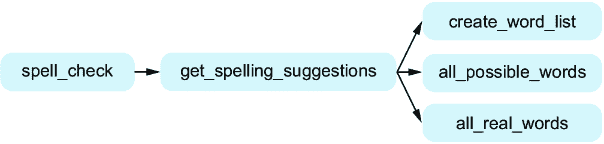
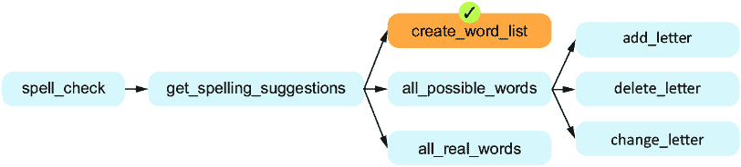
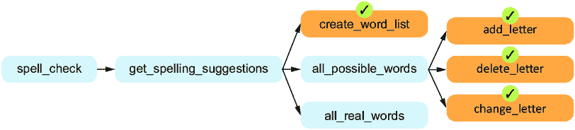
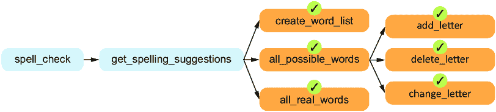
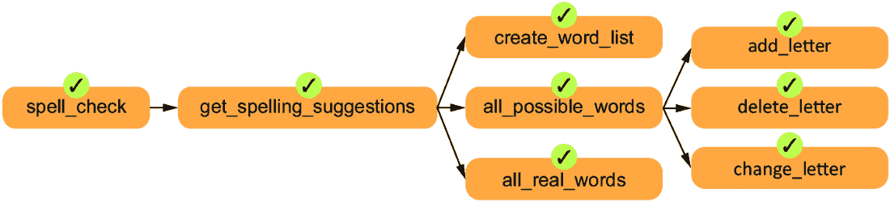

# 7 问题分解

### 本章涵盖

+   理解问题分解及其必要性

+   使用自顶向下的设计进行问题分解和编写程序

+   使用自顶向下的设计编写拼写建议程序

在第三章中，我们讨论了为什么我们不应该要求 Copilot 解决大问题。想象一下，如果我们要求 Copilot“设计一个两人策略游戏”，会发生什么。

在最坏的情况下，Copilot 可能不会做任何有用的事情。我们有时会观察到 Copilot 反复给出评论，但从未提供真正的代码。

在最佳情况下，我们会得到一个预制的程序，其中所有决策都为我们做好了。这个程序可能不符合我们的需求。作为程序员的力量之一就是定制我们正在创建的内容。即使我们不想定制任何内容，如果 Copilot 的程序有缺陷，我们该怎么办？如果我们不理解一个大型程序，那么修复它将非常困难。

为了得到一个能够实现我们想要的功能的程序，我们需要向 Copilot 提供小的子问题，并将这些解决方案组装成我们自己的程序。本章的重点是学习如何将大问题分解成更小的子问题，这对于解决我们想要解决的大问题至关重要。

## 7.1 问题分解

问题分解涉及从一个可能没有完全定义的大问题开始，将其分解成更小的子问题，每个子问题都定义明确且对我们解决整体问题有用。我们的目标是编写一个函数来解决这些子问题。我们可能能够用一定量的代码解决一些子问题，但其他子问题可能仍然太大，无法用合理大小的函数来捕捉。 (在第三章中，我们提到我们希望保持函数简短——大约 12-20 行——以增加从 Copilot 获得良好代码、测试该代码以及在必要时修复代码中的错误的机会。) 如果一个子问题仍然太大，无法在一个函数中实现，那么我们将进一步将这个子问题分解成更小的子子问题。希望现在每个子子问题都足够小，但如果不是的话，我们也会继续分解它们！我们这样做的主要原因是管理复杂性。每个函数都应该足够简单，以至于我们可以理解其目的，并且 Copilot 可以很好地解决它。如果出了问题，我们不会有很多代码需要检查以找到问题。当我们编写极其复杂的代码时，我们很可能会犯错误。Copilot 也是如此！而且，当我们有长而复杂的代码中的错误时，它们并不容易找到和修复。问题分解对于编写高质量代码的重要性不容小觑。

从一个大的问题开始，并将其分解的过程被称为*问题分解*。我们在这里所做的方式与被称为*自上而下设计*的软件工程技术同义。它被称为自上而下设计，因为我们是从我们想要完成的大任务开始的，并将其分解成更小的任务。一旦我们完成了自上而下的设计，我们就可以在代码中实现产生的函数。我们将有一个用于整体问题的函数，它将调用每个子问题的函数。每个子问题函数将根据需要进一步调用它们自己的函数，以解决任何子子问题，依此类推。

正如我们在第三章中讨论的那样，我们希望最终得到每个函数都在我们的整体程序中扮演一个小角色，并且其行为是明确定义的。我们需要这些函数，以便我们可以调用它们来降低其他函数的复杂性。为了提高清晰度和易于理解，我们寻求设计具有少量参数并返回少量高度有用信息的函数。

## 7.2 自上而下设计的小例子

我们很快将跳入一个更真实的例子，展示自上而下设计是如何工作的，但首先我们想要使用我们之前的一些例子来设定场景。让我们思考一下我们在第三章中编写的函数的设计：`get_strong_password`。它反复提示用户输入密码，直到他们输入一个强密码。不要回去看那段代码——我们想要从这里开始。

假设我们想要使用自上而下设计来解决这个问题。如果它是一个小而明确的任务，我们可以直接将其实现为一个单独的函数。然而，对于这个任务，我们确实看到了一个子任务；也就是说，什么是强密码？围绕这个问题的规则是什么？对我们来说，这听起来像是一个我们可以尝试从这个函数中分离出来的子任务，以使其更简单。确实，在第三章中，当我们编写这个函数时，我们确实调用了我们之前的`is_strong_password`函数，它对密码是否强大做出了真/假的判断。

我们可以将这种自上而下的设计描绘如图 7.1 所示。为了便于在章节后面展示最终可能变得很大的图，我们将一致地从左到右展示设计，而不是从上到下，但同样的基本原理仍然适用。


##### 图 7.1 `get_strong_password`函数的函数图。`get_strong_password`调用`is_strong_password`。

此图表明，我们的目标是让`get_strong_password`调用`is_strong_password`来完成其部分工作。

现在，让我们来看第二个例子。回想一下第三章，我们也编写了一个`best_word`函数，它接受一个单词列表作为参数并返回得分最高的单词。再次强调，不要回去看那段代码——我们想要在这里再次解决这个问题。让我们思考一下这个任务的代码可能是什么样子。它可能会使用一个循环来考虑每个单词，并在那个循环中需要跟踪迄今为止我们看到的最佳单词。对于每个单词，我们需要通过累加其每个字母的分数来确定它值多少分。记住，*a*值 1 分，*b*值 3 分，*c*值 3 分，*d*值 2 分，*e*值 1 分，以此类推。

哇，我们真的要深入探讨这个“每个字母值多少分”的问题。这听起来像是一个子任务。如果我们有一个可以调用的函数来告诉我们每个单词值多少分，我们就不需要在`best_word`函数中担心这个分数问题了。在第三章中，我们编写了一个名为`num_points`的函数，它正好执行这个子任务：接受一个单词作为参数并返回其总分数。我们可以从`best_word`中调用`num_points`，如图 7.2 所示。再次强调，这使我们的`best_word`任务变得更简单。


##### 图 7.2 `best_word`函数的功能图

在第三章中，我们恰好是从子任务到任务，从叶函数到父函数来编写这些函数的。我们将在本章继续这样做，但我们将首先进行自顶向下的设计，以确定我们需要哪些函数。

我们刚才在第三章中讨论的两个例子都很小，你确实可能能够通过一个函数快速编写它们的代码。但是，对于大型例子，问题分解是唯一控制复杂性的方法。

接下来，我们将深入探讨一个更大的自顶向下设计的例子。我们希望你在本章中掌握的关键技能是如何将一个大问题分解成更小的子问题。我们鼓励你多次阅读即将到来的例子。在你第一次阅读时，目标是了解各个部分如何组合起来解决整体问题。在你第二次阅读时，你可以自由地深入了解每个函数是如何独立工作的。

## 7.3 拼写建议

在本章的剩余部分，我们将使用自顶向下的设计方法从头到尾解决一个问题。我们希望你在自己解决问题时使用这种方法能够成功，所以你将在本书的其余部分看到自顶向下设计方法的重复出现。

哎呀——我们那里有误拼吗？*Sucessful*？那应该是*successful*。有时候英语单词的拼写可能很棘手！你可能遇到过很多这样的单词。是 thorough 还是 thourough？Acceptable 还是 acceptible？Receive 还是 recieve？我们将编写一个程序，该程序接受一个可能拼写错误的单词，并为此拼写错误提供可能的更正。这是一个针对单个单词的基本拼写检查器！

我们该如何想出这些可能的更正呢？好吧，让我们看看我们刚刚提供的单词对，并讨论它们所体现的错误类型。

我们在单词*sucessful*中犯的错误是漏掉了一个字母——我们需要在那里添加一个*c*来得到正确的单词*successful*。所以，总的来说，考虑向拼写错误的单词中添加一个字母似乎是个好主意，因为这可能是修复它的确切方法。我们将考虑在可能的任何位置添加任何可能的字母，而不仅仅是添加已经存在的字母的副本。这将帮助我们修复像*acknowlege*（缺少一个*d*）这样的拼写错误。

我们还需要考虑其他类型的错误。例如，在单词*thourough*中的错误并不是我们漏掉了一个字母，而是我们多了一个字母——我们需要删除第一个*u*来得到正确的单词*thorough*。因此，我们将考虑从任何拼写错误的单词中删除任何单个字母，看看是否可以修复它。

我们还能修复哪些错误？好吧，那个误拼的单词*acceptible*是一个新的错误类型：没有缺少或多余的字母，但有一个字母应该被改为另一个字母。也就是说，如果我们把*i*改为*a*，我们就能得到正确拼写的单词*acceptable*。为此，我们可以尝试将每个字母都改为字母表中的每个字母，看看是否可以修复误拼。

除了我们刚刚给出的三种方法之外，还有许多方法可以修复拼写错误。但我们将在这里停止，因为我们认为修复三种类型的错误对于我们的目的——展示自顶向下的设计——是足够的。这意味着我们的程序将无法纠正拼写错误的单词*recieve*到*receive*，因为我们不会修复两个字母顺序错误的错误。我们也将无法纠正拼写错误的单词*camoflague*到*camouflage*，因为我们只会修复拼写错误中的一个错误（*camoflague*有两个不同的错误，一个是缺少*u*，另一个是添加了*u*）。一旦你完成这一章，我们鼓励你在愿意更进一步的情况下继续改进你的程序，并学习更多关于纠正拼写错误的知识。

## 7.4 使用自顶向下的设计进行拼写建议

我们的任务是“编写一个程序，该程序接受一个可能拼写错误的单词，并为此拼写错误提供可能的更正。”这是一个很大的任务，我们绝对不希望将其强行塞入一个单独的函数中。

许多程序——无论是分析数据、提供拼写建议还是猜测未知文本的作者——都有三个不同的任务要执行。首先，是输入任务：我们需要获取程序运行所需的数据。其次，是处理任务，程序用这些数据做它应该做的事情。然而，数据处理得再好，如果用户不知道程序通过处理发现了什么，那么它也是无用的。这就是第三步，输出步骤，我们在这里向用户传达信息。表 7.1 总结了这一过程。

##### 表 7.1 输入、处理数据和输出任务的总结

| 阶段 | 角色 | 拼写建议示例 |
| --- | --- | --- |
| 输入 | 作为输入，提供函数所需的信息。 | 提供拼写错误的单词*sucessful*和一组真实单词（正确拼写的单词）。 |
| 处理数据 | 在该数据上执行函数指定的操作。 | 考虑可能使单词拼写正确的更改，例如，在*sucessful*中的*c*之前或之后添加一个字母*c*会产生正确的单词*successful*。许多其他错误的单词（例如，通过在*u*之前添加字母*c*得到的*scucessful*）也可能被尝试，但结果中只应包含真实单词。 |
| 输出 | 返回数据处理的结果。 | 返回建议“成功”。 |

你可以在第二章的数据处理示例中看到这个输入-处理-输出模型是如何工作的。我们需要从 CSV 文件中读取数据（这是输入步骤），确定每个四分卫的传球码数（这是处理步骤），然后输出四分卫及其传球码数（这是输出步骤）。

我们可以用类似的方式思考我们的拼写建议问题。这里令人惊讶的是，输入-处理-输出模型为我们提供了我们将在自顶向下设计中想要解决的三个子问题。我们的意思如下（也请参见表 7.1 中的示例）：

+   对于输入步骤，我们需要询问用户他们想要获取拼写建议的单词。

+   对于处理步骤，我们需要找出用户单词的所有可能建议。

+   对于输出步骤，我们需要告诉用户我们在处理步骤中找到的所有拼写建议。

注意，我们最初有一个大问题要解决（即整体的拼写建议问题），而现在我们有三个更小的问题要解决。我们主要或顶级函数最终将调用由此问题分解产生的任何函数。我们将把这个主要函数命名为`spell_check`。

我们通常需要为每个识别出的子问题创建一个单独的函数，但这并不是绝对的。再次看看输入步骤。我们需要要求用户输入一个单词。虽然我们可以为这个子任务分离出一个单独的函数，但这将是过度设计。为什么？这是因为 Python 已经有一个内置的函数可以用来获取用户的输入！这个函数叫做`input`，我们在第三章第 3.3.7 节中看到它在工作，当时我们要求用户输入密码。

我们是否需要为输出步骤分离出一个单独的函数？不，再次不是！输出步骤只是将内容输出给用户。我们知道我们可以使用 Python 已经存在的`print`函数来做这件事。再次强调，为这个步骤分离出一个函数并不是一个错误，如果你自己进行这个问题分解，你可能已经这样做了。不过，你会注意到，这个函数会非常短，可能只是调用了一次`print`——在这个时候，你可能又会考虑是否真的需要将其作为一个单独的函数。

与之相比，这个过程步骤将涉及更多的工作。在确定所有可能的拼写建议时，需要做很多事情！我们必须支持删除字母、插入字母、将一个字母更改为另一个字母等等，这远远超出了在我们的主`spell_check`函数中保留所有这些操作的范围。我们需要一个单独的函数来处理这个过程步骤。这正是我们接下来需要努力的地方。

## 7.5 分解过程子问题

我们需要一个名字来命名实现过程步骤的函数。我们将称之为`get_spelling_suggestions`，因为它将负责返回用户输入的拼写建议。它当然需要将用户拼错的单词作为参数，否则它将无法访问它！

但是，在这里暂停一下：你认为这个函数需要任何额外的参数吗？答案：是的！这个函数必须以某种方式知道哪些字符串是英语中的真实单词。例如，它必须知道关于单词*successful*、*thorough*、*acceptable*以及成千上万的其它英语单词。我们可以通过几种方式来做这件事：我们可以传递一个包含真实单词列表或（Python）字典的参数，或者我们可以传递一个包含所有真实单词的文件的名称作为参数。当你设计你的函数时，你需要做出类似的决策，专注于函数完成其工作所需的输入以及完成时我们需要的返回值。

除了拼错的单词外，我们的函数还将接受一个参数，给出包含有效单词列表的文件的名称。这个文件中的每一行将有一个有效单词。在这本书的资源中，我们包括了一个名为 wordlist.txt 的样本单词列表文件，你可以使用它。（我们通过简单的网络搜索找到了一个免费的词典单词列表。）

我们需要对这个过程步骤做什么？我们可以将其视为四个子任务。这是更多的问题分解！这些子任务如下：

+   *从单词列表文件中获取单词列表。* 单词文件是一个好的开始，但将单词放在 Python 列表中更方便。这样，我们可以轻松地确定一个字符串是否是有效单词。我们将把这个函数命名为 `create_word_list`。

+   *生成用户字符串中所有可能的单词列表。* 我们需要删除一个字母，插入一个字母，或者将一个字母改为另一个字母。这将生成许多字符串，其中一些是真实单词，而另一些则不是。例如，从字符串 `sucessful` 中，它会生成真实单词 *successful*，但也会生成字符串 `xsuccesful`、`sucxcesful` 和 `succesfrl`，这些显然不是真实单词。但没关系。目前，我们只想生成所有可能的单词，以免遗漏任何。我们将把这个函数命名为 `all_possible_words`。

+   *使用所有可能的单词列表，生成仅包含真实单词的列表。* 这是修剪我们潜在单词完整列表到实际存在于英语中的单词的步骤。我们将把这个函数命名为 `all_real_words`。

+   *返回唯一单词的列表。* 为什么是唯一的？我们不希望返回相同的拼写建议两次，即使可能有两种或更多种从用户字符串到达那个拼写建议的方法。例如，为了修复单词 *sucessful*，有两种方法：我们可以在已有的 *c* 前面添加缺失的 *c*，或者我们可以在 *e* 前面添加 *c*。两者都导致正确拼写的单词 *successful*，但我们只想保留那个单词一次。

如果我们将那个最终子任务——获取唯一单词列表——分解成它自己的函数，我们可以将其命名为 `unique_words` 或 `only_unique_words`。虽然我们可以将其分解出来，你这样做也是合理的，但我们决定将其保留为 `get_spelling_suggestions` 函数的一部分。原因是，在 Python 中，从列表中删除重复项只需要一行代码。为了方便，我们现在告诉你这个，但再次强调，如果你自己进行自上而下的设计，这也会是一个非常好的子任务。

##### 多种分解问题的方法

没有一种单一的正确方法来进行自上而下的设计，也没有一种单一的正确方法将问题分解为子问题。例如，你可能对我们的决定感到惊讶，即首先生成所有可能的单词（包括实际上不是英语单词的假单词），然后将其修剪成实际存在的英语单词列表。为什么不先检查每个可能的单词，只有当它是真实单词时才将其添加到我们的列表中呢？我们当然也可以那样做！如果你已经有了这种替代分解的想法，或者我们激起了你的好奇心，我们鼓励你在完成本章后自己尝试这种替代设计。

在尝试自顶向下的设计并且如果设计不成功就放弃它，这并不是什么丢人的事情。设计不成功可能意味着什么？好吧，也许你发现很难将大函数分解成不同的子问题。或者也许你得到了几十个微小的函数，开始担心你的函数太具体，没有解决一般问题。或者也许你需要传递许多参数，其中一些可能只是为了传递得更远，直到最终一个函数需要它们。或者也许你只是想尝试一个不同的自顶向下的设计，看看结果如何！

我们鼓励你在确定代码的最终设计之前，在设计阶段进行实验。在这个实验中，你会尝试不同的可能函数以及函数的不同输入/输出。例如，我们之前讨论过`get_spelling_suggestions`函数是否应该接受包含真实单词的文件名或包含真实单词的列表（或字典）。在设计阶段，这两个选项都值得考虑。

这就剩下三个子任务我们需要解决。我们很快将对这些子任务进行自顶向下的设计。但首先，让我们看看我们现在处于什么位置（见图 7.3）。



##### 图 7.3 展示了`get_spelling_suggestions`的三个子任务的功能图

### 7.5.1 从单词列表文件获取单词列表

这个任务的函数是`create_word_list`。它将接受一个参数，即单词列表文件的名称，并将返回该文件中的单词列表。

我们是否需要对这个函数进行进一步的自顶向下的设计？让我们假设我们认为答案是肯定的。我们可以分解出哪些子任务？我们可以想象打开文件、读取其内容以及关闭文件的任务。但是，正如我们在第五章第 5.1.4 节中学到的，打开文件只需调用 Python 的`open`函数。同样，关闭文件只需调用 Python 的`close`函数。那么从文件中读取单词呢？这听起来并不比第五章第 5.1.4 节中读取 CSV 文件的行复杂多少。所以我们觉得有理由保留这个函数不变，不进行任何进一步的子任务分解。

### 7.5.2 生成所有可能单词的列表

这个任务的函数是`all_possible_words`，它将接受一个参数，即我们想要提供拼写建议的字符串。它将返回通过添加一个字母、删除一个字母或更改一个字母可以获得的所有可能单词的列表。

添加一个字母、删除一个字母和更改一个字母是三种不同的任务类型。而且，它们在我们看来并不特别简单：它们将涉及到对用户字符串中的字母进行某种形式的循环。啊！看起来我们在这个任务上需要进一步的自顶向下的设计。特别是，我们将从这个函数中分解出三个子任务：

+   `add_letter`—此函数将接受一个字符串参数，并返回所有可以通过在单词的任何位置添加一个字母而获得的所有字符串。

+   `delete_letter`—此函数将接受一个字符串参数，并返回所有可以通过删除一个字母而获得的所有字符串。

+   `change_letter`—此函数将接受一个字符串参数，并返回所有可以通过更改一个字母而获得的所有字符串。

表 7.2 提供了我们期望每个函数对两个不同输入字符串将返回的内容。对于`add_letter`和`change_letter`，返回了大量的字符串，因为它们将考虑在输入字符串的每个位置添加或更改英语中的每个字母。

##### 表 7.2 `add_letter`、`delete_letter`和`change_letter`函数的示例

| 输入字符串 | `add_letter` 返回的字符串 | `delete_letter` 返回的字符串 | `change_letter` 返回的字符串 |
| --- | --- | --- | --- |
| `cu` | `acu, bcu, ccu, …, zcu cau, cbu, ccu, …, czu cua, cub, cuc, …, cuz` | `u, c` | `au, bu, du, …, zu, ca, cb, cc, …, cz` |
| `cad` | `acad, bcad, ccad, …, zcad caad, cbad, ccad, …, czad caad, cabd, cacd, …, cazd cada, cadb, cadc, …, cadz` | `ad, cd, ca` | `aad, bad, dad, …, za cbd, ccd, cdd, …, czd caa, cab, cac, …, caz` |

与往常一样，思考是否需要从这三个函数中进一步分解出子任务是很重要的。然而，鉴于我们期望看到的是仅通过字母的循环，我们在这里可以推进，如果我们的假设被证明是错误的，我们再回头审视我们的自顶向下的设计。现在，我们可以告诉你，我们不需要进一步分解也能做得很好。

##### 知道何时停止分解成子任务

通常情况下，知道何时停止将任务分解成更小的子任务，更多的是一种艺术而非科学。这需要通过设计程序来获得关于何时停止的直觉。许多经验丰富的开发者通常会为每个子任务暂停一下，考虑编程的复杂程度，并在心中勾勒出函数的步骤。如果解决方案不是直截了当的，他们通常会选择将其分解成更多步骤。但我们不期望你能够做到这一点。一些公司发布指南，通过建议允许的行数上限（例如，不超过 12 行）来鼓励简单的函数，但许多人认为限制应该更多地在于复杂性，尽管长度和复杂性当然是有关系的。

当你刚开始时，一个合理的代理方法是限制每个函数的行数在 12-20 行左右。如果你后来发现一个函数最终只有一行，它仍然是一个子任务，但可能不值得拥有自己的函数。（有时，如果它被不同的函数多次调用或有助于简化调用函数，保留一个短函数也是可以的。）

在最初练习时犯错是可以接受的；我们确实犯过。有时候一个子任务看起来会形成一个简单的函数，但最终却比预期的要困难得多。在这种情况下，您知道只需进一步细分它。同样，我们也有一些只有一行代码的函数，如果它们被频繁使用或使调用函数更容易理解，我们就保留那行代码作为一个函数。

### 7.5.3 生成所有真实单词的列表

这个任务的函数是`all_real_words`。它将接受两个参数：真实单词列表和所有可能的单词列表。它将返回一个仅包含完整可能单词列表中真实单词的列表。这个函数的代码将涉及遍历可能单词列表，并检查每个单词是否出现在真实单词列表中。由于这个任务是一个小而定义良好的任务，不会产生很多代码，所以我们很放心地保留这个函数，不做任何进一步的拆分。

## 7.6 自顶向下设计的总结

我们已经完成了自顶向下的设计过程。您可以在图 7.4 中看到我们的最终自顶向下设计。


##### 图 7.4 添加了`all_possible_words`三个子任务的函数图

在这里，我们不要因为树木而忽略了森林。如果我们退一步看，我们所做的是将原始的大问题分解成几个更小的问题，我们将每个问题都作为函数来实现。我们的原始`spell_check`问题可能感觉令人望而生畏。不过，没关系，因为我们将其分解为`get_spelling_suggestions`的一个主要子任务。`get_spelling_suggestions`函数本身也是一个大问题，但我们能够通过相同的过程来解决它：我们将其分解为三个子任务。其中两个子任务`create_word_list`和`all_real_words`似乎可以作为一个函数解决，但另一个任务`all_possible_words`足够复杂，我们觉得它需要三个额外的子任务（`add_letter`、`delete_letter`和`change_letter`）。我们希望您从中学到的重要一点是，我们在每个步骤都使用了相同的问题分解技术，将最初令人畏惧的任务变成了一组可解决的子任务，这些子任务将成为函数。

我们下一步是从设计转向实施。我们知道现在需要哪些函数来解决我们的问题。是时候编写代码了！

## 7.7 实现我们的函数

当你进行自顶向下的设计时，就像我们刚才做的那样，你从整体问题开始，将其分解为子问题。这就是为什么我们从`spell_check`（我们的整体问题）开始，最终达到了像`add_letter`这样的函数，这些函数不需要进一步分解。但是当我们要求 Copilot 实现这些函数时，我们不会按照相同的顺序工作。相反，我们将以相反的顺序工作，首先做最小的子问题，然后转向依赖于这些子问题的函数。这对应于在如图 7.4 所示的图中从右到左移动。

我们以这种方式以相反的顺序实现函数，这样 Copilot 在我们想要实现较大函数的时候就会了解较小的函数。这样，Copilot 更有可能按照我们的期望调用我们的子任务函数。

我们希望在这里完全专注于问题分解，为此我们已经做出了一些决定。首先，虽然我们将在文档字符串中包含一些测试，但在这个例子中，我们不会像在第六章中那样追求完整的测试。我们鼓励您使用 doctest 运行我们提供的测试，并添加您自己的测试以增加对代码的信心。其次，我们没有过多关注我们的提示工程，而是专注于产生良好结果的提示。在下一章中，我们将专注于调试，那时我们将回到提示工程。第三，我们不是专注于全面阅读和理解代码。话虽如此，我们包含了一些注释来解释代码正在做什么以及它是如何工作的。

### 7.7.1 create_word_list

我们将从我们的`create_word_list`函数开始。正如第三章中所述，我们编写函数头（`def`行）和文档字符串，Copilot 填写代码。这就是我们将让 Copilot 编写本章中所有函数代码的方式。

我们已经知道我们的`create_word_list`函数应该做什么：从单词列表文件中读取单词，并以 Python 单词列表的形式返回它们。我们仔细地在文档字符串中写下我们想要的内容，如列表 7.1 所示。

##### 列表 7.1 读取单词列表的函数

```py
def create_word_list(filename):   #1
 **'''** #2
 **filename is the name of a file that has one English word per line.**

 **Return a list of the words in the file.**
    '''
    file = open(filename)        #3
    words = []
    for line in file:              #4
        words.append(line.strip())    #5
    file.close()
    return words
```

#1 我们自己编写的头

#2 我们自己编写的文档字符串

#3 打开文件

#4 遍历文件的每一行

#5 将每个单词添加到我们的单词列表中

我们使用了一个描述性的参数名称，`filename`，这为参数的目的提供了一个很好的提示。我们还小心地在这个文档字符串中使用这个参数名称。我们的文档字符串还明确指出，我们希望*返回*列表（而不是，比如说，打印它）。

我们没有在函数的文档字符串中包含测试，这是因为我们不希望分散实现我们每个函数的整体目标。尽管如此，如果你想要测试，你知道如何做！具体来说，我们在第六章中这样做，在那里我们创建了一个小文件用于测试目的。在这里，你可以创建一个包含每行一个单词但只有几个英语单词的小文件，然后测试从文件中读取的单词列表是否与放入文件中的单词匹配。我们的 `create_word_list` 函数已经完成，所以我们可以像图 7.5 中那样将其标记为完成。



##### 图 7.5 完整函数图，`create_word_list` 已完成

为了节省空间，我们在实现每个函数后不会展示更新后的图形，但我们会偶尔展示。

### 7.7.2 添加字母

现在我们将处理 `all_possible_words` 所需要的函数，从 `add_letter` 函数开始。`add_letter` 函数接受一个字符串作为参数，并返回通过向该字符串添加一个字母可以形成的潜在单词列表。让我们简要思考一下这个函数的预期输出，通过一个快速示例。如果我们给这个函数字符串 `cu`（如表 7.2 所示），它将生成一个列表，其中包含每个字母添加到每个可能位置的字词。这意味着它应该包括在 `cu` 前添加 `a` 以形成 `acu`，在 `cu` 前添加 `b` 以形成 `bcu`，以及对于 `cu` 前面的字符，直到 `zcu`。该函数还应包括 `c` 和 `u` 之间的每个字母，以形成 `cau`、`cbu`、`ccu`…，直到 `czu`。最后（因为有三个可能的位置可以添加字母），我们期望该函数在 `cu` 之后添加每个可能的字母以形成 `cua`、`cub`、`cuc`…，直到 `cuz`。我们的 Copilot 提示和 Copilot 生成的代码显示在列表 7.2 中。

##### 列表 7.2 添加任何可能字母的函数

```py
def add_letter(word):
 '''
 word is a string with at least one letter.

 Return a list of all the strings that can be obtained by
 adding one letter to word.
 '''
    words = []
    for i in range(len(word) + 1):         #1
        for c in 'abcdefghijklmnopqrstuvwxyz':  #2
            new_word = word[:i] + c + word[i:]    #3
            words.append(new_word)       #4
    return words
```

#1 遍历每个索引，从 0 到最后一个字符之后

#2 遍历每个小写字母

#3 通过在索引 i 处放置字符 c 来形成新单词

#4 将这个新单词添加到我们的单词列表中

这里的代码相当微妙，需要仔细测试。例如，注意外循环使用 `len(word) + 1`，而不是更标准的 `len(word)`。如果没有 `+ 1`，我们将在单词字符串的每个现有索引处添加字符。但实际上，我们会错过我们还想能够在现有字母之后添加字母的事实！`+ 1` 添加了一个额外的迭代，在这个迭代中我们在字符串的末尾添加了一个字符。

对于外循环的每个索引，我们在内循环中考虑每个可能的 lowercase 字母。代码行 `new_word = word[:i] + c + word[i:]` 使用了字符串切片技术，即通过两个索引从字符串中提取字母，以将当前内循环字符添加到当前外循环位置。

虽然我们在本章中花费在测试上的时间不多，因为重点是问题分解，但你仍然想通过给这个函数一个单个的拼写错误单词（即 *cu*）来测试它，然后打印返回的单词并确保它包括诸如 `acu`（在开头添加），`cau`（在中间添加），和 `cua`（在末尾添加）这样的字符串，以及可能的真实单词如 *cup* 和 *cut*。

注意，我们不想在文档字符串中包含确切的测试，因为这个函数返回的列表非常大！例如，尝试在 Python 提示符中输入以下内容：

```py
>>> add_letter('cu')
```

你会得到一个包含 78 个字符串的列表！这是针对我们微小的 `'cu'` 字符串。随着参数字符串中字符数量的增加，列表中返回的字符串数量会显著增加。

### 7.7.3 delete_letter

与 `add_letter` 类似，`delete_letter` 函数接受一个字符串作为参数并返回一个潜在单词的列表。不同之处在于，`delete_letter` 不是添加一个字母，而是从字符串中删除每个可能的字母以到达新的可能单词。让我们思考我们期望这个函数做什么。如果我们给它字符串 “carf”，它应该尝试删除每个字母以产生字符串 “arf”（通过删除 “c”），“crf”（通过删除 “a”），“caf”（通过删除 “r”），和 “car”（通过删除 “f”）。同样，我们为这个函数提供了提示，如列表 7.3 所示。

##### 列表 7.3 删除任何字母的函数

```py
def delete_letter(word):
 '''
 word is a string with at least one letter.

 Return a list of all the strings that can be obtained by
 deleting one letter from word.

 >>> delete_letter('carf')
 ['arf', 'crf', 'caf', 'car']
 >>> delete_letter('a')
 ['']
 '''
    words = []
    for i in range(len(word)):        #1
            new_word = word[:i] + word[i + 1:]      #2
            words.append(new_word)     #3
    return words
```

#1 遍历每个索引，从 0 到最后一个字符

#2 通过删除索引 i 处的字符形成新词

#3 将这个新词添加到我们的单词列表中

这段代码与我们的 `add_letter` 函数代码类似。一个不同之处在于，这次我们只有一个循环，而不是两个。原因是，我们不需要内循环来遍历字母 *a*、*b*、*c*、*d* 等等。那是因为我们是在删除单词中已经存在的字母，而不是确定要添加哪个字母。

### 7.7.4 change_letter

现在，是我们 `all_possible_words` 的第三个也是最后一个子任务 `change_letter` 的时候了！这个函数负责生成将字符串中的一个字母更改为其他字母的单词。在思考我们希望在这里看到什么时，让我们再次考虑字符串 `cu`（如表 7.2 所示）。我们希望这个函数将字母 *c* 替换为所有可能的字母以创建字符串 `au`、`bu`、`du`… . ，以及将字母 *u* 替换为所有可能的字母以创建字符串 `ca`、`cb`、`cc`… . ，`cz`。 （注意，我们省略了尝试 `cu`，因为那是初始字符串，我们只考虑字母的变化。）请参阅列表 7.4 中的提示和 Copilot 的代码。

##### 列表 7.4 修改任何字母的函数

```py
def change_letter(word):
 '''
 word is a string with at least one letter.

 Return a list of all the strings that can be obtained by
 changing one letter to another letter in word.
 '''
    words = []
    for i in range(len(word)):          #1
        for c in 'abcdefghijklmnopqrstuvwxyz':       #2
            if c != word[i]:                             #3
                new_word = word[:i] + c + word[i + 1:]    #4
                words.append(new_word)    #5
    return words
```

#1 遍历每个索引，从 0 到最后一个字符

#2 遍历每个小写字母

#3 如果 c 与索引 i 处的字母不同

#4 通过将索引 i 处的字符更改为字符 c 形成新词

#5 将这个新词添加到我们的单词列表中

这段代码与我们`add_letter`的代码非常相似！主要区别在于我们使用字符串切片不是添加新字符，而是更改现有字符。

到目前为止，我们已经完成了实现`all_possible_words`所需的三个函数。查看图 7.6，我们标记了我们所取得的重大进展！接下来，我们将处理`all_possible_words`。



##### 图 7.6 完整的功能图，`all_possible_words`辅助函数已完成

### 7.7.5 all_possible_words

我们现在能够实现`all_possible_words`的原因是我们已经实现了`all_possible_words`完成其工作所需的三个子任务函数。当我们要求 Copilot 编写这段代码时，我们期望看到对`add_letter`、`delete_letter`和`change_letter`的调用。查看列表 7.5，你会发现 Copilot 确实按照我们给出的提示做了这件事。

##### 列表 7.5 生成所有可能单词的函数

```py
def all_possible_words(word):
 '''
 word is a string with at least one letter.

 Return a list of all the strings that can be obtained by
 adding one letter to word, deleting one letter from word,
 or changing one letter in word.
 '''
    return add_letter(word) + delete_letter(word) \    #1
             + change_letter(word)    #2
```

#1 调用辅助函数来添加字母和删除字母

#2 调用辅助函数来更改字母

生成所有可能的单词并非易事。然而，我们在这里用一行 Python 代码就做到了！它只是调用了三个辅助函数，就是这样。这正是我们进行自顶向下设计的原因：通过将大部分复杂性转移到辅助函数，使复杂函数的实现变得更加容易。

### 7.7.6 all_real_words

我们接近能够实现`get_spelling_suggestions`，但还不是完全接近，因为我们首先需要实现它的子任务函数`all_real_words`。`all_real_words`函数接受两个参数。第一个参数是英语单词列表（这将从英语单词列表文件中获取）。第二个参数是可能的单词列表（这将从`all_possible_words`中获取）。该函数返回可能的单词列表，这些单词是真实单词。让我们来做这件事！

##### 列表 7.6 生成所有真实单词的函数

```py
def all_real_words(word_list, possible_words):
 '''
 word_list is a list of English words.
 possible_words is a list of possible words.

 Return a list of words from possible_words that are in word_list.
 >>> english_words = ['scarf', 'cat', 'card', 'cafe']
 >>> possible_words = ['carfe', 'card', 'cat', 'cafe']
 >>> all_real_words(english_words, possible_words)
 ['card', 'cat', 'cafe']
 '''
    real_words = []
    for word in possible_words:       #1
        if word in word_list:           #2
            real_words.append(word)    #3
    return real_words
```

#1 遍历可能的单词

#2 这个单词是真实单词吗？

#3 是的：将单词添加到我们将返回的真实单词列表中

文档字符串中的测试是一个很好的例子，说明了这个函数是如何工作的。它使用`english_words`列表作为第一个参数，`possible_words`列表作为第二个参数。函数将返回`possible_words`中也在`english_words`中的那些单词。我们使用这个非常小的测试案例，而不是使用成千上万的英语单词，因为这使我们能够更容易地手动确定正确的返回值！

让我们检查一下图 7.7 中我们的进度如何。我们接近完成了——只剩下两个函数需要完成！



##### 图 7.7 完整的功能图，`all_possible_words`和`all_real_words`已完成

### 7.7.7 get_spelling_suggestions

我们已经实现了`create_word_list`、`all_possible_words`和`all_real_words`，这些是`get_spelling_suggestions`需要的唯一三个子任务函数。这意味着是我们实现`get_spelling_suggestions`的时候了！

这个函数接受两个参数：包含真实单词的文件名（每行一个单词）以及我们想要提供建议的字符串。它返回唯一建议的列表。像往常一样，当审查 Copilot 的非叶函数代码时，你想要检查它是否调用了你期望它调用的辅助函数，如列表 7.7 所示。在你继续之前，请确保它调用了它应该调用的所有辅助函数。

##### 列表 7.7 返回拼写建议的函数

```py
def get_spelling_suggestions(word_file, possible_word):
 '''
 word_file is the name of a file that has one English word per line.
 possible_word is a string that may or may not be a real word.

 Return the list of all possible unique corrections 
 for possible_word.
 '''
    word_list = create_word_list(word_file)        #1
    possible_words = all_possible_words(possible_word)        #2
    real_words = all_real_words(word_list, possible_words)    #3
    return list(set(real_words))    #4
```

#1 获取英语单词列表

#2 获取可能的单词列表

#3 确定哪些可能的单词是拼写建议

#4 返回唯一的拼写建议列表

那最后一行有点棘手。显然，它确保我们只返回唯一的单词——但是如何做到的呢？让我们问问 Copilot 来解释！当我们使用`/explain`命令询问 Copilot 时，我们得到了以下解释：

Copilot 这行 Python 代码执行了两个操作：

1.  `set(real_words)`：这是从`real_words`列表创建一个集合。在 Python 中，集合是一个无序的唯一元素集合。因此，这个操作是从`real_words`列表中删除任何重复的元素。

1.  `list(set(real_words))`：这是将集合转换回列表。结果是所有元素都是唯一的列表。

因此，总结来说，这一行代码是从`real_words`列表中删除任何重复的单词。

### 7.7.8 spell_check

我们已经到达了我们的最终功能，`spell_check`！它接受一个参数：一个表示单词列表文件名称的字符串。它会要求用户输入一个字符串，然后显示该字符串的所有拼写修正。

##### 列表 7.8 与用户交互的主要函数

```py
def spell_check(word_file):
 '''
 word_file is the name of a file that has one English word per line.
 Ask user for a word.
 Print all possible corrections for the word, one per line.
 '''
    word = input('Enter a word: ')                          #1
    suggestions = get_spelling_suggestions(word_file, word)    #2
    for suggestion in suggestions:     #3
        print(suggestion)    #4
```

#1 要求用户输入一个字符串

#2 获取用户的拼写建议

#3 遍历拼写建议

#4 在单独的一行上打印每个拼写建议

请参考图 7.8，以确认我们已经实现了所有我们的函数！



##### 图 7.8 完整功能图，所有功能均已完整！

你需要在你的 Python 程序底部添加一行代码来实际调用这个函数。否则，你的程序将不会做任何事情，因为没有函数被调用！所以，在底部添加这一行：

```py
spell_check('wordlist.txt')
```

现在，假设你已经在你的目录中有了 wordlist.txt 文件以及你的 Python 程序，你可以运行它！它会要求你输入一个单词。尝试输入拼写错误的单词*sucessful*（这一切的起点！），你应该看到程序提供拼写建议*successful*，如下所示：

```py
Enter a word: sucessful
successful
```

也尝试其他拼写错误的单词，例如 *thourough* 和 *acceptible*。到目前为止，由于只有一个真正的单词与我们要尝试的单词只有一个编辑距离，我们的程序只回复了一个拼写建议。我们鼓励你尝试输入单词 *carf*，看看我们的程序能否提供许多可能的拼写建议。

恭喜！你已经完成了你的第一个真正的自上而下的设计。你的程序为单词提供拼写建议，就像拼写检查器一样。我们通过一些前期设计工作，将原始问题分解成更小的子问题，使得问题实现起来变得容易得多。

许多计算机科学家认为问题分解是编写良好软件所需的最关键技能[1]。我们在本章中看到了问题分解的价值：它通过将其分解成更小的步骤，直到每个步骤都更容易解决，使得大问题变得可解。我们通过本章使用自上而下的设计（从大任务开始，将其分解成更小的任务）来应用这项技能。当使用 Copilot 和 ChatGPT 等工具时，这项技能仍然至关重要，因为它们在解决小而定义明确的问题时表现更好，而不是大问题。如本章开头所述，问题分解更多的是一种艺术，而不是科学，而且需要练习才能做得正确。我们将在接下来的章节中进行更多的问题分解，以帮助你更好地理解如何自己处理它。

## 7.8 练习

1.  使用之前讨论过的 `get_strong_password` 和 `best_word` 的例子，让我们将自上而下的设计方法应用到新的问题上。假设我们想要编写一个名为 `find_highest_scoring_word` 的函数，它接受一个句子列表作为参数，并返回所有句子中得分最高的单词。每个单词的得分计算方式与 `best_word` 函数中的方式相同：

    1.  确定解决此问题所需的子任务。你会设计哪些单独的函数来将任务分解成更小、更易管理的部分？

    1.  绘制一个类似于图 7.1 和 7.2 的功能图，描述这些函数如何相互调用以解决整体问题。

1.  我们讨论了有时一个任务足够简单，可以保持原样，即不分解成更小的任务。针对以下任务，决定你是否会将其分解成更小的子任务。如果是，列出子任务并解释原因。如果不是，解释为什么任务足够简单，可以保持为一个单独的函数。

    1.  读取文件并打印其内容

    1.  计算学生成绩列表的平均成绩

    1.  在数字列表中找到最大值

    1.  处理在线商店的订单，包括验证订单、计算总价、应用折扣和生成发票

1.  为什么我们选择将`create_word_list`函数作为一个单独的函数来创建？这个任务能否作为更大函数的一部分保留？请解释你的理由。

1.  假设你需要改变拼写检查器的工作方式。具体来说，你想要修改`add_letter`函数，以排除某些字母（例如，*q*，*x*，*z*）的添加。你将如何修改我们编写的程序？

1.  以下函数处理订单列表，计算含税的总价，如果适用则应用折扣，并生成总结报告。

```py
def process_orders(orders):
    total_price = 0
    for order in orders:
        price = order['price']
        quantity = order['quantity']
        total_price += price * quantity
    tax = total_price * 0.08
    total_price_with_tax = total_price + tax
    report = f"Total price: ${total_price:.2f}\n"
    report += f"Tax: ${tax:.2f}\n"
    if total_price_with_tax > 100:
        discount = total_price_with_tax * 0.1
        total_price_with_tax -= discount
        report += f"Discount: ${discount:.2f}\n"
    report += f"Total price with tax: ${total_price_with_tax:.2f}\n"
    print(report)

a = {'price': 20, 'quantity': 5}
lst = [a]
process_orders(lst)
```

通过将其分解成更小的子问题来重构（重新设计）`process_orders`函数。将每个子问题实现为一个单独的函数，并确保整体行为保持不变。

1.  6. 在这个练习中，你已经给出了一个代码片段，它已经被分解成两个函数：一个主函数和一个辅助函数。当我们使用以下代码中的测试用例 2 调用函数时，我们得到一个`ZeroDivisionError`错误。你的任务是根据提供的错误信息识别并修复错误。

```py
def calculate_average(numbers):
    total = sum(numbers)
    count = len(numbers)
    return total / count

def process_numbers(data):
    valid_numbers = [n for n in data if isinstance(n, int)]
    average = calculate_average(valid_numbers)
    print(f"The average of the valid numbers is: {average}")

# Test Case 1
data = [10, 20, 'a', 30, 'b', 40]
process_numbers(data)

# Test Case 2
data = ['a', 'b']
process_numbers(data)
```

## 摘要

+   我们需要将一个大型的编程问题分解成更小的子问题，然后才能有效地实现它。这被称为问题分解。

+   自顶向下设计是一种将问题分解成小任务函数的系统技术。

+   在自顶向下设计中，我们寻求解决定义明确的任务的小函数，并且这些函数可以被一个或多个其他函数使用。

+   当我们准备实现从自顶向下设计产生的函数时，我们是从下往上实现的；也就是说，我们首先实现叶函数，然后是实现依赖于这些叶函数的函数，依此类推，直到我们实现了最顶层的函数。
