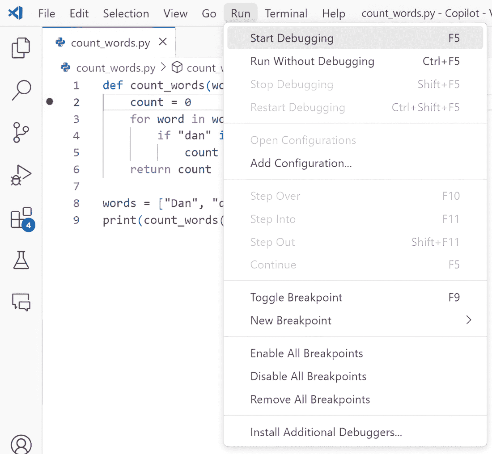
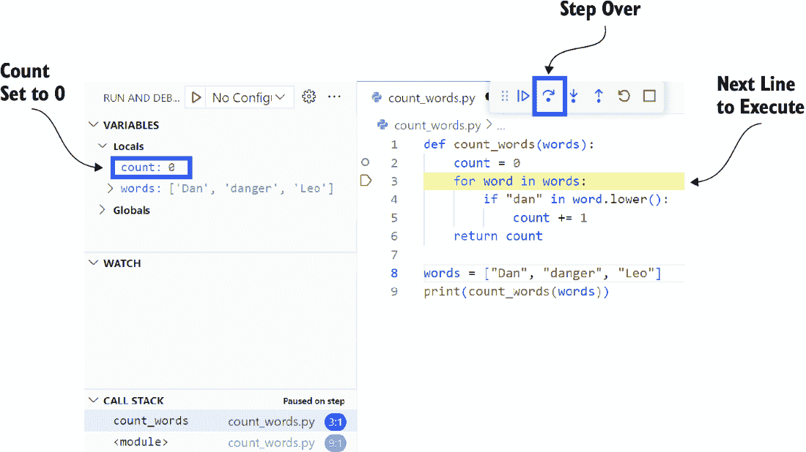
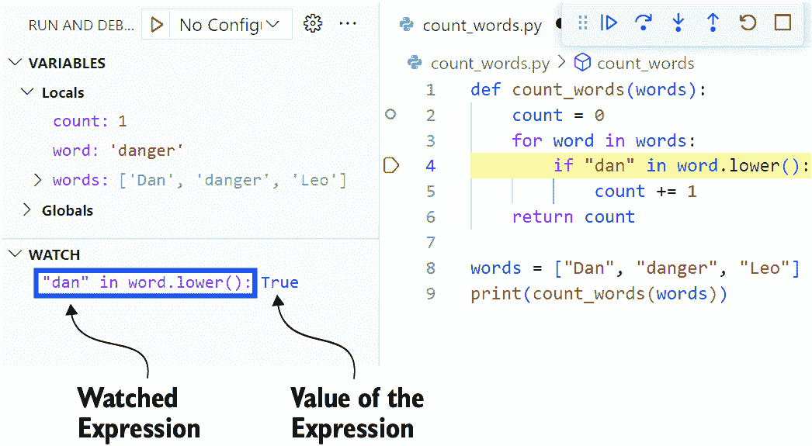
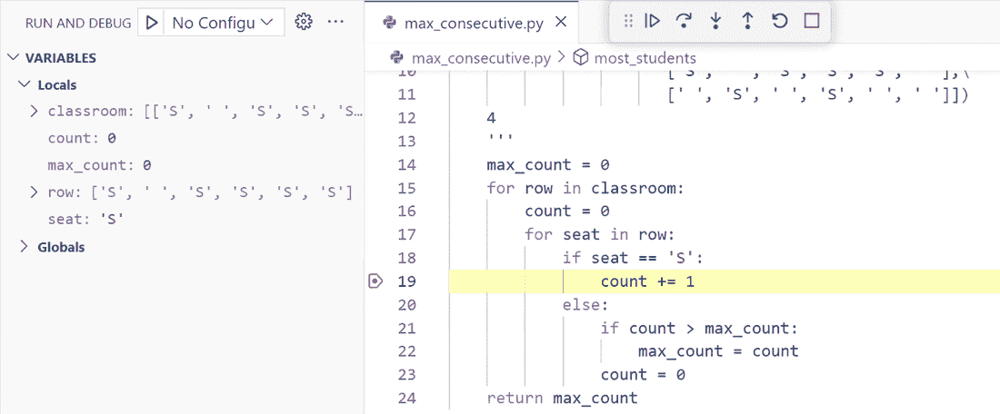
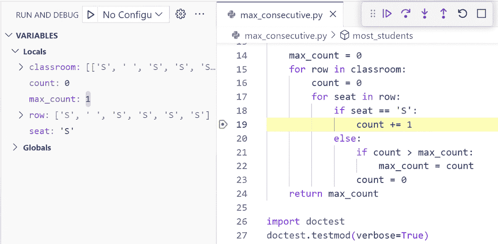

# 8 调试和更好地理解你的代码

### 本章涵盖

+   确定错误（bug）的来源

+   使用 Copilot 技巧修复错误

+   使用 Copilot 调试代码

+   使用 VS Code 调试器查看代码如何运行

在每位程序员的职业生涯中，都会有一个时刻，他们的代码无法按照预期执行。这很可能已经发生在你身上了，请放心，这是学习编程的正常部分。我们如何修复代码？有时候，改变提示或像在前面章节中学到的那样更好地分解问题，就足以解决问题。但当你无法让 Copilot 提供不同或更好的代码，也无法弄清楚为什么你给出的代码无法正常工作时，你该怎么办？

本章有两个目的。主要目标是学习如何找到代码中的错误（称为 bug）并修复它们。为了找到这些 bug，你需要实现第二个目标，即在运行代码时更深入地理解代码的工作原理。

好消息是，代码中存在错误对程序员来说如此普遍，以至于编程环境，如 Visual Studio Code（VS Code），都有工具帮助我们揭示出了什么问题。我们将在本章学习如何使用这个工具，即调试器。

就像过去几章我们从小的例子开始一样，我们将通过一些小例子学习查找和修复错误的概念，然后我们将通过深入研究一个更大的例子来更真实地展示这个过程，这个例子与你未来可能编写的代码类似。

## 8.1 什么原因导致错误（bug）？

首先，是一个快速术语课程。许多年前，计算机使用继电器或真空管而不是晶体管。据说，Grace Hopper 博士在编程这些早期计算机之一时，遇到了由继电器中的实际虫子（蛾）引起的错误。今天，我们使用“bug”一词来指代程序中的错误，尽管我们不再处理真正的虫子了。现在，bug 是由程序员的错误造成的；当我们调试代码时，我们正在努力移除这些 bug。（Python 的实现或计算机硬件中也可能存在 bug，但它们非常罕见，可以安全地假设代码中的错误是因为你的代码。）

如果程序员真正试图解决问题，他们不会故意在代码中引入 bug。那么，bug 为什么会发生呢？好吧，软件工程师和 Copilot 会犯错误。你可能会问，什么样的错误？bug 主要有两大类：

+   ***语法错误*—这些错误发生在代码不符合 Python 语法要求时。例如，忘记在 `for` 循环的第一行末尾写上 `:` 就是一个语法错误。当你运行 Python 时，因为它正在尝试根据你的程序描述生成机器代码，所以会遇到错误，不知道该怎么办，并给出错误。有时，这些错误信息比其他错误信息更易读。当人们以传统方式学习编程，没有 Copilot 的帮助时，这些错误真的很常见。学习所有 Python 规则并使这些规则成为习惯需要一段时间。即使我们两个都写了数十年的代码，有时还是会犯语法错误。好消息是，使用 Copilot 编写代码几乎完全消除了这个问题！坏消息是，在两种类型的错误中，语法错误更容易找到和修复。**

***   ***逻辑错误*—这些错误发生在程序中存在逻辑错误时。例如，也许代码的意图是计算一个单词列表中“Dan”这个单词出现的次数，但实际上代码计算的是列表中包含“dan”（忽略大小写）的单词数量。这段代码会在两个方面出错：它会将像 *dan* 和 *DAN* 这样的单词视为匹配项，尽管我们不想将它们视为匹配项，并且它会将 *dan* 视为一个单词的任何部分而不是整个单词。也就是说，它会计算像 *Daniel*、*danger* 和 *dan* 这样的单词，尽管我们不想计算这些单词中的任何一个！某个地方，代码没有做它应该做的事情，我们必须找出在哪里以及为什么。通常，找到逻辑错误是最困难的部分。一旦我们知道错误在哪里，我们就必须修复它，修复这些错误可能从更改单个字符到完全重写代码。逻辑错误可能发生在提示描述不佳或由于各种原因 Copilot 生成了错误的代码时。****

****## 8.2 如何找到错误

找到错误可能具有挑战性。从根本上讲，无论你或 Copilot 编写了代码，你在编写代码时都认为或 Copilot “认为”代码是正确的。这就是为什么通常更容易让同事而不是作者在代码中找到错误。作者看不到错误，因为他们创造了它！

在这本书中，错误对我们来说并不陌生，因为我们已经看到了代码中的错误，并且我们是通过阅读代码和/或测试来发现这些错误的。在前几章中，我们通过阅读代码找到了错误的来源。在这一章中，我们将解决你在测试中发现的错误，但似乎无法弄清楚代码为什么是错误的。通常，你可以通过尝试其他 Copilot 建议、使用新的提示来修复错误或要求 Copilot 为你修复错误来绕过找出代码错误的原因的过程，但根据我们的经验，这些技术并不总是有效。那么，我们需要更多的工具来帮助我们找出代码中的错误在哪里。

### 8.2.1 使用打印语句了解代码行为

从根本上讲，逻辑错误意味着作者认为代码会做什么和代码实际做什么之间存在不匹配。识别这种不匹配的常见方法是通过使用`print`语句来深入了解程序的行为，因为它们会告诉你计算机实际上在做什么。一个有用的做法是在不同的时间点打印变量，以查看这些变量在这些点的值。让我们尝试一下我们刚才给出的在单词列表中查找*Dan*的例子。以下是错误的代码。

##### 列表 8.1 计算匹配单词的错误函数

```py
def count_words(words):
    count = 0
    for word in words:
        if "dan" in word.lower():    #1
            count += 1
    return count
```

#1 将单词全部转换为小写字母的方法。

你可能已经看到了代码中的问题，但让我们假设我们不知道发生了什么，我们正在试图找出代码出错的地方。假设我们通过运行以下测试用例发现我们的代码是错误的：

```py
>>> words = ["Dan", "danger", "Leo"]   
>>> count_words(words)
2
```

我们期望得到 1 的结果，但得到了 2。值得注意的是，将*danger*包含在这个测试用例中帮助我们发现了代码中的错误。代码中的问题出在哪里？为了找出这一点，我们可以添加`print`语句。当你想这样做时，你需要阅读代码以确定在哪里放置它们。查看这段代码，在函数开始时打印列表可能不是一个坏主意，取决于我们看到的错误，但这里的错误似乎与计数有关，而不是与单词列表具体有关。在`for`循环的第一行打印列表中的每个单词可能有所帮助，这样我们就可以检查代码是否正在处理每个单词。我们可能在返回之前打印`count`，但我们已经对返回的值有了很好的了解。这些都是合理的想法，可以帮助你更接近错误，但不是我们从哪里开始的。为了清楚起见，如果我们从这些其他想法中的一个开始，我们不会错；可能只需要再走几步就能找到错误。

因为错误在于将过多的单词计为*Dan*单词，所以我们会在`count`增加的地方的`if`语句内放置`print`语句，如下所示。

##### 列表 8.2 查找错误的打印语句示例

```py
def count_words(words):
    count = 0
    for word in words:
        if "dan" in word.lower():
            print(word,"is being counted")    #1
            count += 1
    return count
```

#1 用于显示哪些单词正在被计数的打印语句

使用相同的测试用例重新运行我们的代码，现在打印出来的结果是：

```py
>>> words = ["Dan", "danger", "Leo"]   
>>> count_words(words) 
Dan is being counted
danger is being counted
2
```

哎！这会告诉我们，当程序不应该计数时，它却在计数单词*危险*。然后我们可以给 Copilot 一个新的提示，结合我们刚刚学到的东西，希望 Copilot 能修复这个问题。以下是我们在编辑器中添加的提示，以及 Copilot 在以下列表中修复的代码。

##### 列表 8.3 使用提示修复已知的错误

```py
def count_words(words):
    count = 0
    for word in words:
        # only count words that are exactly "Dan"    #1
        if word == "Dan":    #2
            count += 1       #2
    return count             #2
```

#1 导致 Copilot 生成正确代码的提示

#2 Copilot 根据提示添加的代码

一旦我们知道了这个错误，告诉 Copilot 如何修复它就变得容易多了。当然，这是一个基本的例子，但这个想法适用于更复杂的代码。这个过程通常是迭代的。你要求代码打印一些内容，然后打印的内容与你认为它应该执行的操作相符。然后你要求代码打印其他内容，并检查它是否符合你的预期。你继续这样做，直到有一个点，代码打印的内容与你想要它执行的操作不匹配。那时你就找到了错误，可以给 Copilot 一个提示来帮助它给你更好的代码，或者如果修复很简单，你可以直接更改代码。

根据代码的复杂性，使用`print`语句通常是调试的有效方法。我们通常将其作为调试的第一步。

##### 调试：一门艺术而非科学

调试过程中的迭代是必要的，因为我们真的不清楚代码在做什么，以及为什么它不符合我们的预期。添加一大堆只告诉你最初认为发生了什么的`print`语句是可以的，因为每个这样的`print`语句都告诉你哪里*不是*要找错误的地方，这是一种有效的排除过程。找出哪里找错误需要时间和实践，所以当你刚开始时，如果你发现自己花了很多时间在上面，不要担心。

### 8.2.2 使用 VS Code 的调试器了解代码行为

VS Code 被新手和专业人士 alike 使用，因此它有工具可以帮助调试过程。因为它被专业人士使用，所以调试工具具有大量功能。为了本书的目的，我们将关注一些最常用的功能，但如果你对使用 VS Code 调试器感兴趣，可以查看更多资源（[`code.visualstudio.com/docs/editor/debugging`](https://code.visualstudio.com/docs/editor/debugging)）。

为了展示这些工具，我们将通过几种方式调试上一个例子中的同一个函数（参考列表 8.1）。列表 8.4 提供了我们将在这个部分中使用的代码。请注意，我们已经将`count_words`函数的测试添加到了程序中。

##### 列表 8.4 用于调试的错误的`count_words`函数

```py
def count_words(words): 
    count = 0 
    for word in words: 
        if "dan" in word.lower(): 
            count += 1 
    return count 

words = ["Dan", "danger", "Leo"]     #1
print(count_words(words))            #1
```

#1 直接调用`count_words`函数的代码

#### 开始使用调试器和设置断点

要使用调试器，我们需要设置一个**断点**并启动调试器。设置断点告诉调试器在程序执行时你想开始调试程序的时间。一旦达到断点，你将能够检查变量值并逐行执行程序。断点非常有用。对于大型程序，你不想逐行执行整个程序，因为这可能需要大量时间。相反，使用断点，你可以只执行与你最相关的代码行。

要设置断点，将鼠标光标悬停在代码左侧，你会看到一个点出现。如图 8.1 所示，点击那个点，你就可以设置一个断点。对于你的项目，你可能想从在函数执行开始处创建一个断点开始，然后逐行执行。


##### 图 8.1 在 VS Code 中通过点击代码左侧创建断点

如果你将鼠标移开后，在断点左侧看到一个红色点，如图 8.2 所示，这意味着它已经正确设置。


##### 图 8.2 在 VS Code 中 count_words.py 文件第 2 行设置断点

你可以有多个断点，但在这个例子中，我们只保留第 2 行的单个断点。（注意，你可以通过再次点击那个红色点来移除断点。）接下来，我们将启动调试器并看看它是如何与断点一起工作的。

#### 如何逐行执行代码

要启动调试器，选择运行>开始调试，如图 8.3 所示。



##### 图 8.3 在 VS Code 中启动调试器

调试器启动后，你应该看到一个类似于图 8.4 的屏幕。（如果你是第一次使用调试器，它可能会要求你选择调试配置，在这种情况下，你应该选择 Python。）


##### 图 8.4 VS Code 中的调试视图

VS Code 调试器有几个组件[1]。在左侧，调试侧边栏包含变量部分、监视部分和调用堆栈部分。让我们简要地检查每个部分：

+   **变量部分**包含在当前作用域内声明的变量（例如，在`count_words`内）及其当前值。例如，`words`参数被定义为包含`['Dan',` `'danger',` `'Leo']`的列表。你可以点击`words`左侧的箭头（>）来查看该变量的更多详细信息。这个部分非常有用，因为你可以检查每个变量的值。

+   **监视部分**包含你想要特别监视的表达式。例如，你可能会将表达式`"dan"` `in` `word.lower()`添加到监视表达式中，并且你可以看到对于每个不同的`word`值，它是否为`True`或`False`。要添加一个表达式，将鼠标悬停在监视部分上并点击加号（+）。 

+   *调用堆栈部分* 包含导致执行此代码行的已调用函数。在这里，主函数（由 VS Code 称为 `<module>`）在第 9 行调用了 `count_words` 函数。在 `count_words` 函数内部，我们目前在第 2 行。您可以通过查看当前突出显示为第 2 行的代码来验证这一点，如图 8.4 所示。

说到这里，在右侧，显示的是我们的代码编辑器，我们可以看到行 `count` `=` `0` 被突出显示。这是当前尚未执行的代码行。该行尚未执行的原因是我们在这里设置了断点，由带有点的箭头表示，在代码的这一行。当我们启动调试器时，它运行代码直到即将执行 `count` `=` `0` 之前。

调试工具栏（图 8.5）在开始调试后至关重要，因为它驱动了整个过程：您可以前进一个指令、重新启动调试或停止调试。


##### 图 8.5 调试工具栏

工具栏上的按钮，从左到右依次是

+   ***继续（F5）—*此按钮将执行到下一个断点执行时。在我们的示例中，`count_words` 的第 2 行永远不会再次执行，因此点击继续将导致程序和调试会话运行到结束。**

***   ***单步执行（F10）—*此按钮将跳到当前函数中的下一行代码。单步执行意味着如果该函数中的某行代码调用了另一个函数（例如，当第 4 行上的 `word.lower()` 被调用时），调试器将保持在 `count_words` 函数中，并仅运行被调用的函数（例如，`word.lower()`）直到其完成。*****   ***进入（F11）—*此按钮将跳到下一行代码，包括进入被调用的任何函数。与单步执行不同，当您使用进入时，调试器将进入当前函数调用的任何函数。例如，如果您在调用另一个函数的代码行上使用进入，它将进入该函数并从该函数内部继续调试（逐行）。默认情况下，它不会进入库函数调用（例如，`word.lower()` 是 Python 标准库的一部分），但会进入您编写的函数。*****   ***退出（Shift + F11）—*此按钮将执行代码直到当前函数结束，然后从该函数的退出之后继续调试。*****   ***重新启动—*此按钮重新启动调试过程。它将重新启动程序，程序将执行到其第一个断点。*****   ***停止—*此按钮停止调试过程。************

******#### 逐行执行代码

现在我们已经掌握了调试器的使用方法，让我们通过使用“单步执行”按钮继续我们的示例。让我们点击一次“单步执行”按钮，看看我们的视图如何变化（图 8.6）。单步执行跳到了下一行代码，即第 3 行。这意味着它执行了

```py
count = 0
```

并且即将准备执行

```py
for word in words:
```



##### 图 8.6 点击一次“单步执行”后的调试器。下一行（第 3 行）现在被突出显示。

我们可以从界面的各种线索中看到，执行了`count` `=` `0`这一行。首先，在右侧的编辑器中，我们可以看到`for`循环被突出显示，左侧的箭头指向这一行代码。在左侧的调用栈部分，我们可以看到它现在位于`count_words`的第三行（如`count_words`被突出显示，右侧椭圆中的数字读作 3:1）。也许最重要的是，在左侧的变量部分，我们现在可以看到变量`count`已被添加到局部变量中，其值为`0`。这一点非常令人惊讶，因为如果你试图逐行阅读代码并跟踪正在发生的事情，第 2 行的`count` `=` `0`意味着创建了一个名为`count`的变量，并赋予了一个值为`0`。这正是 VS Code 调试器告诉我们的事情。我们希望你现在开始看到这个工具是多么强大。

让我们再次点击“单步执行”。现在我们在该行之前停止。

```py
if "dan" in word.lower():
```

我们可以看到现在有一个新的变量`word`，其值被赋为`"Dan"`，这正是我们所期望的：`word`被赋予了列表`words`中的第一个元素的值。这是一个很好的地方来指出，除了能够在变量部分读取变量的值之外，你还可以将鼠标悬停在已经声明的任何变量上，以查看其值。真是太棒了，不是吗？

让我们再次点击“单步执行”并看到`if`语句中的条件`"dan"` `in` `word.lower()`评估为`True`，因此我们将执行该行

```py
count += 1
```

现在我们已经掌握了这个技巧，让我们继续点击几次“单步执行”。第一次点击“单步执行”，它将回到`for`循环，你可以看到`count`已经增加到`1`。第二次点击“单步执行”，它将停在`if`语句处，你可以看到单词现在是`"danger"`。我们可以在这里停止并添加一个观察表达式来查看这个`if`语句会做什么。要添加观察表达式，将鼠标悬停在“观察”部分，然后点击出现在“观察”右侧的加号箭头。这将允许你输入任何你想要的内容。我们输入了`"dan"` `in` `word.lower()`并按 Enter 键添加了这个观察表达式，如图 8.7 的调试侧边栏所示。



##### 图 8.7 添加观察表达式后的调试器视图

如果我们在这章的早期没有找到错误，那么这就是我们会找到错误的地方。表达式`"dan"` `in` `word.lower()`评估为`True`，这意味着`count`将再次增加。但我们只想精确匹配单词`"Dan"`，不希望`"danger"`被计算在内！

这是一种完全合理的调试函数的方法。正如我们之前提到的，在函数执行的开始处放置断点，然后逐个步骤地执行，通常是调试的一个很好的起点。你可能只有在`for`循环运行了数千个值之后才犯错误时，才会发现这种方法有难度。为了解决这类挑战，我们可能会在特定的位置放置断点，以避免在调试器中花费大量时间。让我们停止调试器（在调试工具栏中点击停止），从第 2 行（点击行左侧的红点）移除断点，并尝试不同的断点。

#### 使用断点进行选择性调试

这次，让我们在代码中我们想要更密切监控的点放置断点。根据我们的测试用例显示，当我们期望只有一个单词“counted”时，列表中的两个单词“counted”，我们应该尝试在`count`增加的行放置断点，就像我们在图 8.8 中所做的那样。


##### 图 8.8 在第 5 行放置我们的新断点后的代码视图

一旦我们开始调试器，代码将运行直到第一次`if`语句评估为`True`并且`count` `+=` `1`行准备执行。图 8.9 展示了启动调试器后的调试器视图。


##### 图 8.9 调试器遇到断点（第 5 行）第一次时的视图

我们在`count`增加的地方放置断点，因为我们想看看列表中的哪个项目导致了`count`的增加。检查我们的局部变量，我们可以看到`word`是`'Dan'`，这是我们想要`count`变量增加的时候。鉴于这是我们想要发生的事情，我们还没有找到我们的错误。

现在是我们真正可以利用断点放置的优势的时候了。我们希望代码执行直到再次遇到断点。要做到这一点，就是在调试工具栏中点击继续（参见图 8.5）。点击继续后，调试器应该像图 8.10 所示那样出现。


##### 图 8.10 调试器遇到断点（第 5 行）第二次时的视图

在变量部分，注意`count`和`word`的值被突出显示。这是为了告诉你，因为你点击了继续，这两个值已经改变。在找到单词`'Dan'`后，`count`中的值如预期地增加到`1`。`word`中的值更新为`'danger'`。尽管`'danger'`是单词列表中的下一个值，但我们不应该期望代码会为单词`'danger'`增加`count`。在这个时候，我们已经找到了我们的错误。注意，通过良好的断点放置，找到错误可以变得多么快。但我们警告说，知道放置断点的最佳位置就像知道调试时最佳打印变量一样——这需要时间和实践来学会如何做得好。

在本节中，我们看到了在 VS Code 中调试器是多么强大。设置断点并开始调试会话非常简单。当调试器监控函数中的变量时，你可以在代码执行时在调试侧边栏中检查这些变量。

## 8.3 如何修复 bug（一旦找到）

在传统的编程学习方法中，这将是简短的一节，告诉你自己修复 bug。尽管这仍然是一个选择，但现在我们有更多的选择与 Copilot 一起使用。这些选择包括请求 Copilot 修复它，为整个函数提供一个新的提示，以更好地描述问题并避免 bug，为 Copilot 提供一个有针对性的提示来修复你发现的代码中的错误部分，如果这是一个小修复，你自己进行修复。让我们看看我们如何做每一件事。

### 8.3.1 通过 Copilot Chat 请求 Copilot 修复你的 bug

*在下面的例子中，我们将与 Copilot Chat 功能进行交互。Copilot Chat 功能允许你以类似于 ChatGPT 的方式与 Copilot 进行交互，但仅限于与编程相关的问题。如果你愿意，也可以像我们在本节中与 Copilot 交互一样，通过[`openai.com`](https://openai.com)（在撰写本文时提供免费等级）以相同的方式与 ChatGPT 进行交互。我们更倾向于 Copilot Chat，只是因为它的界面内置在 VS Code 的最新版本和 Copilot 扩展中。*

*在之前的章节中，我们主要只是向 Copilot Chat 请求单个答案，而在这个章节以及之后的章节中，我们将使用 Copilot Chat 与工具进行对话。当我们与工具进行对话时，我们将努力区分我们写的部分（“Human”）和 Copilot 的响应（“GitHub Copilot”）。使用 Copilot Chat 功能，让我们看看 Copilot 能否在这里帮助我们：*

LPHuman 我有一个函数，如下所示，该函数本应计算单词“Dan”在参数列表“words”中出现的次数。然而，它似乎是在计算列表中“dan”字符出现的次数。你能帮我修复这个问题吗？

```py
*`*def count_words(words):*`* 
 *`*count = 0*`* 
 *`*for word in words:*`* 
 *`*if "dan" in word.lower():*`* 
 *`*count += 1*`* 
 *`*return count*`*
```

GitHub Copilot 当然可以！要计算单词“Dan”在列表中出现的次数，你可以修改`if`语句，检查整个单词是否等于“Dan”（不区分大小写）。以下是修改后的代码：

```py
*`*def count_words(words):*`* 
 *`*count = 0*`* 
 *`*for word in words:*`* 
 *`*if word.lower() == "dan":*`* 
 *`*count += 1*`* 
 *`*return count*`*
```

这段代码将计算单词“Dan”（不区分大小写）在列表中出现的次数。

Copilot Chat 的回应改变了以下行

```py
if "dan" in word.lower():
```

为

```py
if word.lower() == "dan":
```

虽然这个变化看起来很小，但它有很大的影响。原始的代码行在`word`（在单词通过`.lower()`方法转换为全小写字母后）中搜索字符串`"dan"`的任何位置。新的代码行检查`word`（同样，通过`.lower()`方法转换为全小写字母）是否与字符串`"dan"`完全匹配。

Copilot 的此答案更接近正确解决方案，因为它只会匹配整个单词，而不是在单词的任何地方寻找`dan`的出现。然而，调用`.lower()`使其不区分大小写，因此它也会匹配`dan`，而不是我们之前（列表 8.3）的解决方案那样区分大小写（它必须正好是`Dan`）。我们希望区分大小写，因此我们可以继续使用 Copilot Chat，让 Copilot 为我们修复这个问题。

LPHuman 你能给我相同的代码，但只计算单词“Dan”（区分大小写）吗？

GitHub Copilot 当然！这是修改后的代码，它只计算单词“Dan”（区分大小写）：

```py
*`*def count_words(words):*`* 
 *`*count = 0*`* 
 *`*for word in words:*`* 
 *`*if word == "Dan":*`* 
 *`*count += 1*`* 
 *`*return count*`* 
```

此代码将计算单词“Dan”（区分大小写）在列表中出现的次数。

在这种情况下，当我们知道代码是如何出错的时候，Copilot Chat 能够为我们解决问题。我们没有明确指出哪一行代码是错误的，但如果你知道这一点，你也可以将这一点传达给 Copilot Chat。像我们这里这样知道哪一行是错误的优点之一是，我们可以确保 Copilot 的修复更改了错误的行。让我们继续，并检查其他修复错误的选项。

### 8.3.2 为整个函数提供 Copilot 的新提示

你已经在这本书中多次看到我们重写函数的提示了。这仅仅涉及重写函数提示，看看 Copilot 是否能做得更好，有时使用 Ctrl-Enter 来探索 Copilot 的解决方案。我们在这里不会重复，因为你已经多次看到过（例如，在第六章的第 6.5.2 节）。

### 8.3.3 为函数的一部分提供 Copilot 的针对性提示

我们在章节 8.3 中较早使用了这种技术。我们将其作为列表 8.5 重现。

##### 列表 8.5 使用提示修复已知错误（重新列出）

```py
def count_words(words):
    count = 0
    for word in words:
        # only count words that are exactly "Dan"     #1
        if word == "Dan":
            count += 1
    return count
```

#1 导致 Copilot 生成正确代码的提示

这里，我们已经确定上一行

```py
if "dan" in word.lower():
```

没有做我们想要的事情。因此，我们移除了错误的代码，并特别添加了一个提示，明确指出我们想要 Copilot 做什么，并且它能够生成正确的代码。

### 8.3.4 修改代码以自行修复错误

这种修复错误代码的方法在本章中是新的。到目前为止，你在本书中已经看到了足够的代码，你很可能可以通过直接修改它来修复一些代码。例如，假设我们编写了以下代码。

##### 列表 8.6 计算列表中指定数字的函数

```py
def count_between(numbers, x, y):
    count = 0
    for number in numbers:
        if number >= x and number <= y:
            count += 1
    return count
```

我们在本书的早期部分已经看到过类似这样的函数。它遍历数字列表中的所有数字，并检查每个数字是否大于或等于`x`且小于或等于`y`。如果一个数字在`x`和`y`之间，它会增加`count`。函数结束时，它返回`count`。如果目标是计算列表中在`x`和`y`之间（包括`x`和`y`）的数字，这里的代码并没有错误。

然而，“之间”这个术语可能有点含糊不清。你是想包括 x 和 y，还是只包括它们之间的值（不包括它们）？假设当你想象这个函数时，你想要不包括 x 和 y。例如，如果列表是 2、4、8，而你提供了 3 和 8 作为 x 和 y 的值，你希望计数为 1（包括 4，但不包括 8）。你可能已经看到了函数在这个目标上的错误以及如何修复它，但让我们假装你还没有意识到代码并不符合你的要求。

就像任何由 Copilot 或我们创建的函数一样，我们应该测试这个函数。幸运的是，在编写第一个测试用例时，我们在测试用例（`numbers`）中包含了一个等于 x（下限）和等于 y（上限）的值：

```py
>>> numbers = [1, 2, 3, 4, 5, 6, 7, 8, 9]
>>> print(count_between(numbers, 3, 7))
5
```

在提示符下测试代码，我们发现我们的函数返回 5 作为答案，但我们认为答案应该是 3。根据我们对“之间”的定义，我们觉得只有数字 4、5 和 6 在 3 和 7 之间，所以答案应该是 3，即 3 和 7 之间有三个数字。相反，代码给出了 5 的答案。因此，我们知道它没有正确工作，多亏了我们的测试用例。无论我们是通过检查代码还是使用本章中的调试技术来继续寻找错误，我们都会意识到

```py
if number >= x and number <= y:
```

是罪魁祸首。在这里，完整的修复需要我们将`if`语句从

```py
if number >= x and number <= y:
```

to

```py
if number > x and number < y:
```

这是一个我们可以直接做出的更改，无需请求 Copilot 的帮助（尽管 Copilot 可能也能在这里帮助我们）。列表 8.7 在更改后有修正后的函数。

##### 列表 8.7 计算指定数字的函数（已修正）

```py
def count_between(numbers, x, y):
    count = 0
    for number in numbers:
        if number > x and number < y:    #1
            count += 1
    return count
```

#1 手动将>=改为>和<=改为<

## 8.4 根据我们的新技能修改我们的工作流程

现在我们知道了如何更刻意地寻找和修复错误，让我们回顾一下我们在第六章中最后访问的工作流程。请注意，这个工作流程是关于如何设计一个单一函数的，所以它假设你已经完成了第七章中描述的功能分解，以确定适当的函数。新的工作流程出现在图 8.11 中。


##### 图 8.11 使用 Copilot 增强的功能设计周期，包括调试

虽然这个图开始变得有点复杂，但大部分都是你在第六章中看到的内容。这里唯一的改变是包括了调试。具体来说，如果你已经尝试修改提示，但仍然无法得到可以工作的代码，那么是时候尝试显式地进行调试了。凭借你在本章中获得的技术，你可能会成功地找到一些错误，但不是所有可能的错误。如果你找到了错误，并觉得你已经成功地修复了它，流程图会把你送回测试，以确保你的修复是有效的（并且没有破坏其他测试用例）。万一你无法通过新的提示使代码工作，而且似乎无法调试它，我们发现问题分解通常是下一步的最佳选择。换句话说，如果你无论多么努力都无法使一个函数工作，那么这个函数可能应该被分解成多个函数，你更有可能成功地编写这些较小的函数。

## 8.5 将我们的调试技能应用于新问题

在我们掌握新技能和新的工作流程之后，让我们尝试解决一个更具挑战性的调试问题。记得在第六章中我们试图确定教室中给定行中最大的空座位数吗？我们在这里将解决一个类似的问题。

我们不是在寻找空座位，而是假设我们想要计算一排中连续坐下的最多学生人数，因为你试图在考试前更好地分配空间。你也可以想象如果他们想要更多的个人空间或者有流行病时，也可以使用这个方法来更好地分配空间。我们编写了提示和一个基本的 doctest，Copilot 生成了解决方案。代码如下所示。

##### 列表 8.8 第一次尝试计算一排中连续学生的数量

```py
def most_students(classroom):                                 #1
 **'''** 
 **classroom is a list of lists** 
 **Each ' ' is an empty seat** 
 **Each 'S' is a student** 

 **Find the most students seated consecutively in a row** 

 **>>> most_students([['S', ' ', 'S', ' ', 'S', 'S'],\** #2
 **['S', ' ', 'S', 'S', 'S', ' '],\** #2
 **[' ', 'S', ' ', 'S', ' ', ' ']])** #2
 **3** #2
 **'''**
    max_count = 0                          #3
    for row in classroom:                  #3
        count = 0                          #3
        for seat in row:                   #3
            if seat == 'S':                #3
                count += 1                 #3
            else:                          #3
                if count > max_count:      #3
                    max_count = count      #3
                count = 0                  #3
    return max_count                       #3

import doctest                     #4
doctest.testmod(verbose=True)      #4
```

#1 我们给 Copilot 的提示

#2 第一个测试用例

#3 Copilot 的代码

#4 运行我们添加的 doctest 的代码

由于本章是关于调试的，你可能猜到代码可能没有正确工作。我们在阅读 Copilot 给出的代码时发现了这个错误，但它是一个微妙的错误，我们怀疑可能会被轻易忽略。如果你已经看到了它，做得好，但请假装你没有看到本章的其余部分。如果你还没有看到它，本章的其余部分对你来说将更有价值。

让我们假设我们刚刚写下了这个提示和测试用例。我们阅读了代码，看起来它可能是在跟踪连续最多的学生人数。只要它看到有学生在座位上，它就会增加计数。当座位上没有学生时，它会检查计数是否比之前看到的任何计数都大，并重置计数。看起来它至少是在正确的轨道上。我们包含了一个测试用例，所以运行了代码，测试用例通过了。我们对代码感到相当满意，但知道我们需要做更多的测试用例，特别是那些用来捕捉边缘情况的测试用例（记住边缘情况是不常见的，可能会破坏代码）。

我们知道当我们处理列表时，检查代码在列表的开始和结束处是否正确执行是很好的。为了测试列表的末尾，让我们添加一个测试用例，其中最大的连续学生组包括最后一个座位，然后重新运行代码。以下是我们要添加到文档字符串中的新测试用例：

```py
>>> most_students([['S', ' ', 'S', 'S', 'S', 'S'],\    #1
                  ['S', ' ', 'S', 'S', 'S', ' '],\
                  [' ', 'S', ' ', 'S', ' ', ' ']])
4
```

#1 最长的连续学生组是 4。

我们再次运行代码，并对测试用例失败感到惊讶。这是它告诉我们的（我们重新格式化输出以提高可读性）：

```py
Trying:
    most_students([['S', ' ', 'S', 'S', 'S', 'S'],
                   ['S', ' ', 'S', 'S', 'S', ' '],                
                   [' ', 'S’, ' ', 'S’, ' ', ' ']])
Expecting:
    4
**********************************************************************
File "c:\Copilot\max_consecutive.py", 
line 12, in __main__.most_students

Failed example:
    most_students([['S', ' ', 'S', 'S', 'S', 'S'],
                   ['S', ' ', 'S', 'S', 'S', ' '],                
                   [' ', 'S', ' ', 'S', ' ', ' ']])
Expected:
    4
Got:
    3
```

这很奇怪——代码看起来工作得很好。这个边缘情况揭示了一个错误。在这个时候，我们想要生成一些关于代码为什么没有正确工作的假设，以帮助指导我们的调试工作。（如果你真的陷入了困境，你可以采取在函数的第一行代码处设置断点并逐步执行的方法，而不是试图创建一个假设。）以下是两个想到的假设：

+   `count` 的更新跳过了列表中的最后一个元素。

+   `max_count` 的更新缺少列表中的最后一个元素。

为了简化调试过程，我们移除了通过测试（只是将其放在一边稍后恢复）并只运行失败的测试。以下列表显示了我们在开始调试过程之前的完整代码。

##### 列表 8.9 我们将调试的代码以计算连续学生数

```py
def most_students(classroom): 
 '''
 classroom is a list of lists
 Each ' ' is an empty seat
 Each 'S' is a student

 Find the most students seated consecutively in a row

 >>> most_students([['S', ' ', 'S', 'S', 'S', 'S'],\ #1
 **['S', ' ', 'S', 'S', 'S', ' '],\** #1
 **[' ', 'S', ' ', 'S', ' ', ' ']])** #1
 **4**
 **'''**
    max_count = 0
    for row in classroom:
        count = 0
        for seat in row:
            if seat == 'S':
                count += 1
            else:
                if count > max_count:
                    max_count = count
                count = 0
    return max_count

import doctest
doctest.testmod(verbose=True)
```

#1 失败的测试用例

我们将从第一个假设开始，即 `count` 在列表末尾没有正确更新，并在 `count` 的更新处设置一个断点。图 8.12 显示了调试器启动后第一次暂停的情况。



##### 图 8.12 调试器在 `count` 第一次更新前停止

从调试器中，我们可以看到 `count` 仍然是 `0`，所以它还没有被更新。我们处于第一个测试用例的第一行，因为 `row` 是 `['S',` `'` `',` `'S',` `'S',` `'S',` `'S']`。我们正在查看的座位是 `'S'`，这就是为什么计数在增加。让我们在调试工具栏中点击继续，以查看 `count` 的下一个更新。点击继续后调试器的状态如图 8.13 所示。



##### 图 8.13 调试器在 `count` 第二次更新前停止

从上次更新 `count` 以来，似乎发生了很多事情，因为 `max_count` 现在是 `1`。这一定是在处理空位时发生的，因为 `max_count` 被设置为 `1`，而 `count` 被重置回 `0`。此时，我们处于行中的第三个座位，那里有一个学生，`count` 准备更新。我们希望检查 `count` 是否会随着每个新学生的到来而更新。我们点击了“继续”，`count` 增加到 `1`。我们再次点击“继续”，`count` 增加到 `2`。我们再次点击“继续”，`count` 增加到 `3`。此时，我们处于行中的最后一个学生，我们希望检查 `count` 是否增加到 `4`。为了检查这一点，我们点击了一次“单步执行”，`count` 确实更新到 `4`。您可以在图 8.14 中看到此时调试器的状态。


##### 图 8.14 调试器在 `count` 连续更新四次后立即停止

好吧，此时我们有好消息和坏消息。好消息是 `count` 正确更新了。坏消息是我们的第一个假设是错误的，我们还没有找到我们的错误。我们可以将断点移动到更新 `max_count` 的行（第 22 行），然后点击“重启”并重新开始我们的第二个假设的调试过程，但鉴于我们的调试器中 `count` 现在是 `4`，让我们继续跟踪代码，确保 `max_count` 被更新。或者更确切地说，我们知道它不会更新，所以我们要看看为什么。

在点击“单步执行”之前，调试器中已经存在一个线索。这个线索来自于即将执行的下一行代码是 `for seat in row`。但刚刚看到的那个学生是 `row` 中的最后一个学生。这意味着这个 `for` 循环即将结束（这意味着我们不会再次执行循环体，这意味着 `max_count` 无法更新）。让我们通过点击“单步执行”来查看这是否会发生。调试器的状态如图 8.15 所示。


##### 图 8.15 调试器在完成第一行后停止

我们刚刚处理完第一行，但从未更新 `max_count`。下一行代码将选择下一行 `row`，然后下一行将 `count` 设置为 `0`。我们在遍历行时没有更新 `max_count`，尽管我们找到了一个比当前 `max_count` 更大的 `count`。如果您还没有看到这个错误，我们鼓励您单步执行，直到下一次 `max_count` 更新，那时它可能更明显。

代码中的错误在于它只在遇到空座位时更新 `max_count`。这意味着如果一行以学生结束，检查 `max_count` 是否应该更新的代码将永远不会为那一行运行。更仔细地检查代码，检查 `max_count` 是否应该更新以及更新 `max_count` 都应该在 `if-else` 语句之外或 `count` 更新之后发生。

这是我们可能只需手动修复的修复，因为我们只需要将两行代码移动到更好的位置。列表 8.10 中的代码是修正后的函数（不包括测试或提示）。

##### 列表 8.10 修正后的函数，用于计算连续的学生人数

```py
def most_students(classroom):
    max_count = 0
    for row in classroom:
        count = 0
        for seat in row:
            if seat == 'S':
                count += 1
                if count > max_count:    #1
                    max_count = count    #1
            else:
                count = 0
    return max_count
```

#1 将对 count 与 max_count 的测试移至更新 count 之后

这段新代码通过了旧代码和原始测试中失败的测试。在添加另一个确保当最长连续学生组出现在行首时代码能够正常工作的测试之后，我们更有信心代码现在正在正确工作。

## 8.6 使用调试器更好地理解代码

我们怀疑你已经对调试器印象深刻了。我们也是。当学生以传统方式学习编程时，花费大量时间确保学生能够像调试器一样跟踪代码，绘制所有变量的状态，并随着每条新执行行的更新而更新它们。确实，网络上甚至有一个名为 Python Tutor [2] 的免费工具，它可以创建内存状态的图表，比调试器更容易阅读，仅此帮助新程序员学习代码的执行方式。

无论你是否喜欢使用调试器，还是想使用像 Python Tutor 这样的工具，我们都鼓励你玩一玩书中前面章节中编写的一些代码。在我们个人与学习编程的人合作的经验中，逐行遍历程序并观察变量状态的变化可以是一次真正启发性的体验，我们希望你也同样欣赏。

## 8.7 关于调试的注意事项

从与学生的合作中，我们还看到调试对于新学习者来说可能是一个非常令人沮丧的经历 [3]。在学习如何编程时，每个人都希望他们的代码能够工作，而找到并修复错误是在事情不工作时的耗时。有一些方法可以帮助克服这种挫折。首先，问题分解可以大大帮助你从 Copilot 获取正确的代码，而无需进行大量的调试。其次，记住，每个人的代码有时都会出问题，包括我们的。这只是编程过程中的一个自然部分，也是需要一些练习的部分。最后，始终如一，我们真的意味着始终，测试你写的每一个函数。很多时候，当我们的学生在调试时遇到困难，那通常是因为没有测试每个函数，导致多个函数相互作用产生了错误。当这种情况发生时，找到和修复错误特别困难。调试相互作用的错误如此令人沮丧，以至于避免这种经历是我们两个都虔诚地测试我们写的每一个函数的主要原因。

好消息是，如果你测试你写的每一个函数，并且勤奋地将问题分解成小而可管理的步骤，你不应该经常遇到调试问题。而且，如果你确实遇到了，你将调试一个函数中的错误，这正是地球上几乎每一个程序员都在做的事情。经过一些练习，你会掌握它的。

## 8.8 练习

1.  你被提供了一个 Python 函数，该函数本应计算列表中所有偶数的总和。然而，这个函数没有正确工作。当你用列表`[1, 2, 3, 4]`调用该函数时，它返回`4`而不是`6`：

```py
def sum_even_numbers(numbers):
    total = 0
    for number in numbers:
        if number % 2 == 0:
            total += number
        else:
            total = 0
    return total
```

识别`sum_even_numbers`函数中的错误，并解释如何修复它。修改代码以纠正错误，并使用提供的测试用例验证你的解决方案。

1.  2. 你被提供了一个 Python 函数，该函数本应找出一个数字列表中的最大值。然而，这个函数没有按预期工作。你的任务是确定为什么这个函数工作不正确，以及你可以如何修复它（提示：考虑输入列表中可能的整数值）：

```py
def find_max(numbers): 
    max_number = 0 
    for i in range(0, len(numbers)): 
        if numbers[i] > max_number: 
            max_number = numbers[i] 
   return max_number
```

1.  3. 你被提供了一个 Python 函数，该函数本应检查一个字符串是否是有效的密码。一个有效的密码必须满足以下标准：

    1.  它必须至少有 8 个字符长。

    1.  它必须至少包含一个大小写字母。

    1.  它必须至少包含一个小写字母。

    1.  它必须至少包含一个数字。

然而，这个函数没有正确工作。确定这个函数有什么问题，并修复它：

```py
def is_valid_password(password):
    if len(password) <= 8:
        if any(char.isupper() for char in password):
            if any(char.islower() for char in password):
                if any(char.isdigit() for char in password):
                    return True
            return False
        return False
    return False
```

1.  4. 你正在编写一个 Python 函数，根据一天中的时间问候用户。该函数接受一个小时（介于 0 到 23 之间的整数）作为输入，并返回一个问候消息（“早上好”、“下午好”或“晚上好”）：

```py
def greet_user(hour):
  # This code has an error!
  if hour < 12:
    greeting = "Good morning"
  else:
    greeting = "Good evening"
  return greeting
```

你正在考虑使用这个提示来请求 Copilot 帮助你修复 bug：“我有一个基于一天中时间的问候用户的函数，但它似乎把中午分类为‘晚上好’。你能帮我修复这个逻辑吗？”这个提示提到了问题，但没有指出具体的错误。看看你是否可以编辑提供的提示，使其更加具体，并引导 Copilot 提出正确的修复方案。

## 摘要

+   调试是一个重要的技能，包括在代码中查找错误，然后纠正它们。

+   `打印`语句可以是一种了解你的代码中正在发生什么的有效方式。

+   VS Code 调试器是另一种了解你的代码中正在发生什么的方法，它提供了强大的功能来监控变量在代码执行过程中的变化。

+   一旦发现错误，有几种方法可以帮助 Copilot 为你修复错误，但如果那失败了，你通常可以直接修复代码。

+   我们设计函数的工作流程现在包括调试，而调试技能将使你更有可能编写你想要的软件。

+   除了调试之外，VS Code 调试器还可以是一个强大的工具，用于更深入地了解代码的工作方式。
