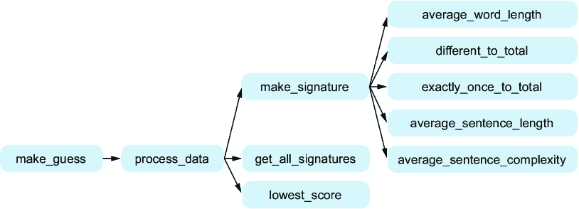
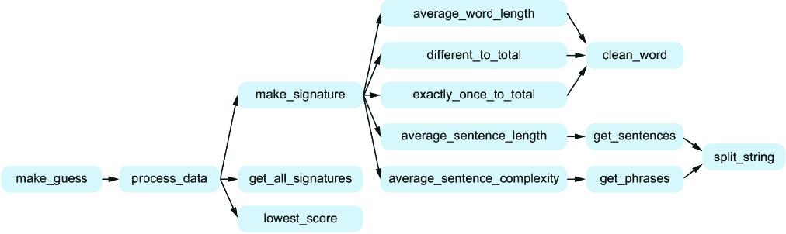
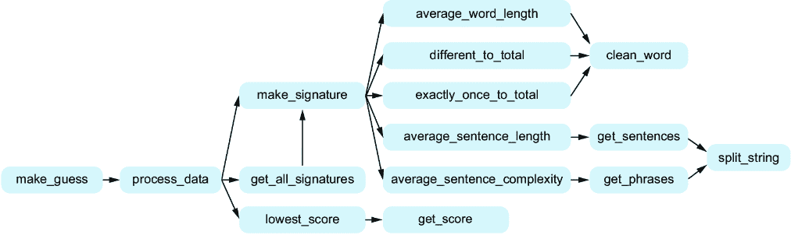
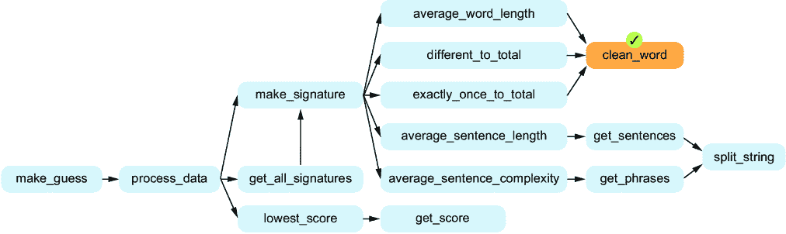
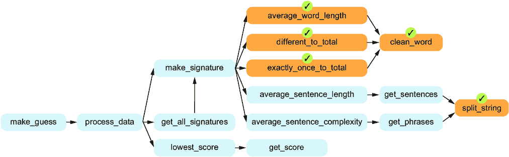
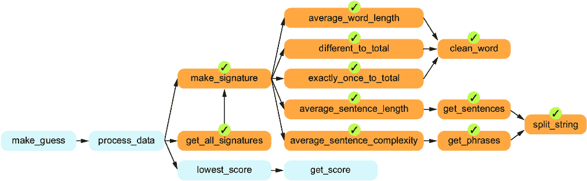

# 11 创建一个作者身份识别程序

### 本章节涵盖

+   使用自顶向下设计编写作者身份识别程序

+   了解代码重构以及为什么你会这样做

在第七章中，我们在编写拼写建议程序时学习了问题分解和自顶向下的设计。在这里，我们将把自顶向下的设计提升到下一个层次，解决一个更大的问题。我们仍然在做第七章中同样的工作：将问题分解为子问题，并在需要时进一步将那些子问题分解为更小的子子问题。而且，就像之前一样，我们希望设计出具有少量参数且能返回对调用者有意义的和有用的结果的函数。如果我们能够设计出被多个其他函数调用的函数，那也是一个好兆头——这有助于减少代码重复！

我们包括这一章节，是因为我们希望提供一个比第七章中解决的拼写建议问题更真实的例子。我们希望这里的例子能够激励人心，感觉像是一个你可能会想要解决的问题。

在本章中，我们将编写一个尝试识别神秘书籍未知作者的程序。这将是使用人工智能（AI）进行预测的程序的一个例子。我们无法抗拒在关于编程与 AI 的书籍中包含一个 AI 例子的机会！

## 11.1 作者身份识别

这个问题基于我们同事米歇尔·克雷格[1]创建的作业。让我们先看看这两段书籍摘录：

+   *摘录 1*——我还没有向你描述最独特的一部分。大约六年前——确切地说，是在 1882 年 5 月 4 日——泰晤士报上出现了一则广告，要求提供玛丽·莫斯坦小姐的地址，并表示她出面将对她有利。广告中没有附上姓名或地址。当时我刚刚以家庭教师身份加入了塞西尔·福雷斯特夫人的家庭。在她的建议下，我在广告栏中发布了我的地址。同一天，通过邮局寄来一个小纸板箱，上面写着我收，我发现里面装有一颗非常大的、光泽的珍珠。里面没有附上任何文字。从那时起，每年的同一天，总会出现类似的箱子，里面装着类似的珍珠，没有任何关于发送者的线索。专家们认为这些珍珠是罕见品种，价值不菲。你们自己可以看到，它们非常漂亮。

+   *摘录 2*——那是 11 月底的一个周五夜晚，多佛路就在与这个历史有关的第一批人之前。对于他来说，多佛路位于多佛邮件之外，因为邮件车笨拙地爬上射手山。他和其他乘客一样沿着邮件车旁边的泥泞小路上山；并不是因为他们在这种情况下对步行锻炼有丝毫的兴趣，而是因为山丘、马具、泥泞和邮件车都如此沉重，以至于马匹已经三次停下来，而且一次还把马车拉到路上，意图把它拉回布莱克希思。然而，缰绳、鞭子、车夫和守卫联合起来，读到了那条禁止有强烈支持论点的文章，即某些动物被赋予了理性；于是马队屈服了，并返回了它们的职责。

假设我们问你这两段摘录是否可能是由同一作者写的。你可能做出的一个合理假设是，不同的作者有不同的写作风格，这些差异会在我们可以计算其文本的指标中体现出来。

例如，与第二段摘录相比，似乎撰写第一段摘录的人使用了相当多的短句。我们在第一段摘录中发现了像“没有附上名字或地址”和“没有附上任何文字”这样的短句；这些句子在第二段中不存在。同样，第一段摘录中的句子似乎比第二段中的句子简单；看看第二段中所有的逗号和分号。

这种分析可能会让你认为这些文本是由不同的作者写的，确实如此。第一段是由亚瑟·柯南·道尔爵士写的，第二段是由查尔斯·狄更斯写的。

公平地说，我们绝对是有选择性地挑选了这两段摘录。道尔确实使用了一些长而复杂的句子。狄更斯确实使用了一些简短的句子。但是，至少对于我们从中摘录这两段摘录的两本书来说，道尔的句子平均来说比狄更斯的短。更普遍地说，如果我们比较两位不同作者所写的两本书，我们可能会期望在平均意义上找到一些可以量化的差异。

假设我们有一系列我们知道作者的书。我们有一本道尔写的，一本狄更斯写的，等等。然后，出现了一本神秘的书。哦不！我们不知道是谁写的！这是道尔的失落《福尔摩斯探案故事》？狄更斯的失落《雾都孤儿》续集？我们想知道这位未知作者是谁，为了做到这一点，我们将转向一种基本的 AI 技术。

我们的策略将是为每位作者找到一个 *签名*，使用我们知道他们写过的其中一本书。我们将把这些签名称为 *已知签名*。每个这样的签名都将捕捉关于书籍文本的指标，例如每句话的平均单词数和平均句子复杂度。然后，我们将为未知作者的神秘书籍找到一个签名。我们将称之为 *未知签名*。我们将查看所有已知签名，将每个签名与我们的未知签名进行比较。我们将使用最接近的一个作为我们对未知作者的猜测。

当然，我们并不知道这个未知的作者是否真的是我们拥有的签名作者之一。它可能是一个全新的作者，例如。即使这个未知的作者*确实是*我们拥有的签名作者之一，我们仍然可能猜错。毕竟，也许同一个作者以不同的风格写作书籍（给他们的书籍带来非常不同的签名），或者我们未能捕捉到我们每位作者写作中最显著的特点。实际上，在本章中，我们并不是追求一个行业级的作者识别程序。尽管如此，考虑到这个任务的难度，我们认为我们将向您展示的方法效果非常好。

##### 机器学习

正如我们在这里所做的那样，作者识别是一个 *机器学习*(ML) 任务。机器学习是人工智能的一个分支，旨在帮助计算机“学习”数据以便做出预测。机器学习有多种形式；我们在这里使用的是监督学习。在监督学习中，我们可以访问训练数据，它由对象及其已知的类别（或标签）组成。在我们的案例中，我们的对象是书籍文本，每本书的类别是写这本书的作者。我们可以通过计算每本书的特征（例如，每句话的平均单词数、平均句子复杂度等）来在训练集上训练（即学习）。后来，当我们得到一本我们不知道作者的书时，我们可以使用我们在训练中学到的知识来做出预测（或猜测）。

## 11.2 使用自顶向下设计进行作者识别

好的，我们想要“编写一个程序来确定一本书的作者。”这似乎是一个艰巨的任务，如果我们试图一次性完成，使用一个单独的函数，确实会是这样。但就像在第七章中我们的拼写建议示例中做的那样，我们不会这么做。我们将系统地把这个问题分解成我们可以解决的子问题。

在第七章中，我们通过读取输入、处理输入并产生输出结果的方式来解决拼写建议问题。我们可以把我们的作者识别程序看作也是遵循这个模型：

+   *输入步骤* — 对于输入步骤，我们需要询问用户神秘书籍的文件名。

+   *过程步骤* — 对于过程步骤，我们需要确定神秘书籍的签名（这是未知签名），以及我们知道作者每本书的签名（这些是已知签名）。为每本书创建签名通常被称为机器学习中的训练阶段。我们还需要将未知签名与每个已知签名进行比较，以确定哪个已知签名最接近。这些比较是机器学习中的预测阶段。

+   *输出步骤* — 对于输出步骤，我们需要向用户报告最接近已知签名的未知签名。

也就是说，为了解决我们的整体作者识别问题，我们需要解决这三个子问题。我们开始自顶向下的设计！

我们将顶层函数命名为`make_guess`。在其中，我们将解决我们确定的三个子问题。

对于输入步骤，我们只是要求用户输入一个文件名。这可以通过少量代码完成，所以我们可能不需要为这个步骤创建一个单独的函数。输出步骤看起来类似：假设我们已经知道哪个已知签名最接近，我们可以直接向用户报告。相比之下，过程步骤看起来需要做很多工作，我们当然希望进一步分解这个子问题。这就是我们接下来要做的。

## 11.3 分解过程子问题

我们将整体过程函数命名为`process_data`。它将接受神秘书籍的文件名和已知作者书籍目录的名称作为参数，并返回最接近的已知签名的名称。

观察我们对该过程步骤的描述，似乎我们在这里有三个子问题需要解决：

+   *确定神秘书籍的签名*。这是我们未知的签名。我们将这个函数命名为`make_signature`。

+   *确定已知作者每本书的签名*。这些是我们的已知签名。我们将这个函数命名为`get_all_signatures`。

+   *将未知签名与每个已知签名进行比较，以确定哪个已知签名最接近*。因为接近的签名会有小的差异，我们将这个函数命名为`lowest_score`。

我们将依次为这些子问题制定自顶向下的设计方案。图 11.1 展示了我们目前的设计图。


##### 图 11.1 `process_data`的三个子任务函数图

### 11.3.1 确定神秘书籍的签名

这个任务的函数`make_signature`将接受我们书籍的文本作为参数，并返回书籍的签名。在这个阶段，我们需要决定我们将使用哪些特征来确定每本书的签名。让我们通过回顾之前的例子段落来分析这个问题。我们注意到，根据句子的复杂性和长度，作者之间的段落存在差异。你可能也怀疑过，作者在使用的单词长度和用词方式上可能存在差异（例如，一些作者可能比其他作者更重复）。因此，我们希望有一些特征基于作者句子的结构，而其他特征基于作者使用的单词。我们将详细探讨这些特征。

#### 与作者句子结构相关的特征

在我们之前的道尔对狄更斯例子中，我们讨论了使用每句话的平均单词数作为一个特征。我们可以通过将总单词数除以总句子数来计算这个值。例如，考虑以下文本：

> 就在同一天，通过邮局寄来一个小纸板箱，上面写着我的名字，我发现里面有一个非常巨大而光亮的珍珠。没有附上任何字条。

如果你计算单词和句子，你应该会发现有 32 个单词（纸板算作一个单词）和两个句子，因此我们将计算每句话的平均单词数为 32/2 = 16。这将是我们所说的*每句话的平均单词数*特征。

我们还注意到，句子的复杂度可能在作者之间有所不同（即，一些作者的句子比其他作者有更多的逗号和分号），因此将其作为另一个特征是有意义的。更复杂的句子有更多的短语，这些短语是连贯的句子片段。将一个句子分解为其组成部分短语是一项艰巨的挑战，尽管我们可以尝试做得更准确，但在这里我们将采用一个更简单的经验法则。也就是说，我们将说一个短语是通过逗号、分号或冒号与其他短语分开的。再次查看之前的文本，我们发现有三个短语。第一个句子有两个短语：“The same day there arrived through the post a small card-board box addressed to me”和“which I found to contain a very large and lustrous pearl.”第二个句子没有逗号、分号或冒号，所以只有一个短语。由于有三个短语和两个句子，我们会说这个文本的句子复杂度为 3/2 = 1.5。这将是我们所说的*平均句子复杂度*特征。

我们希望这些句子级别的特征直观上是有意义的，可以作为区分作者写作风格的东西。接下来，让我们开始探讨作者在用词上可能存在的差异。

#### 与作者词汇选择相关的特征

你可能可以想到自己的单词级特征指标，但我们将使用三个在我们经验中效果很好的指标。首先，可能有些作者的平均单词长度比其他作者短。为此，我们将使用平均单词长度，这仅仅是每个单词的平均字母数。让我们考虑我们创建的这个样本文本：

> 一颗珍珠！珍珠！光泽的珍珠！稀有。多么好的发现。

如果你数一下字母和单词，你应该会发现有 41 个字母和 10 个单词。（在这里不要把标点符号算作字母。）所以，我们将计算平均单词长度为 41/10 = 4.1。这将是*平均单词长度*的特征。

第二，可能有些作者比其他作者更频繁地使用相同的单词。为了捕捉这一点，我们将使用作者使用的不同单词的数量除以总单词数。对于我们之前的样本文本，只有七个不同的单词被使用：*一个*，*珍珠*，*光泽的*，*稀有的*，*什么*，*好的*，和*找到的*。总共有十个单词，所以这个指标的计算结果是 7/10 = 0.7。这将是*不同单词除以总单词数*的特征。

第三，可能有些作者倾向于一次性使用很多单词，而其他作者则倾向于多次使用相同的单词。为了计算这个指标，我们将使用一次的单词数量除以总单词数。对于我们的样本文本，有五个单词是只使用了一次：*光泽的*，*稀有的*，*什么*，*好的*，和*找到的*。总共有十个单词，所以这个指标的计算结果是 5/10 = 0.5。这将是*使用一次的单词数除以总单词数*的特征。

总的来说，我们有五个特征将构成每个签名。我们需要将这些数字存储在一个单独的值中，所以我们将为每个签名使用五个数字的列表。

让我们深入了解我们将如何实现每个特征，从单词级特征开始，然后到句子级特征。我们将按以下顺序进行：

+   平均单词长度

+   不同单词除以总单词数

+   使用一次的单词数除以总单词数

+   每句平均单词数

+   平均句子复杂度

对于每一个，我们最终将编写一个函数。我们有一个更新后的图，其中包含每个这五个新函数的函数名，这将帮助我们实现图 11.2 中的`make_signature`。我们需要进一步分解这些问题，还是它们就这样可以？让我们看看！



##### 图 11.2 函数图，包含`make_signature`的额外五个子任务

#### 平均单词长度

用于此任务的函数`average_word_length`将接受书籍的文本作为参数，并返回平均单词长度。我们可能通过在文本上使用 split 方法来开始解决这个问题。提醒一下，split 方法用于将字符串分割成其各个片段的列表。默认情况下，split 会在空格周围分割。书籍文本是一个字符串，如果我们围绕空格分割，我们就会得到其单词！这正是我们需要的。然后我们可以遍历这个单词列表，计算字母数和单词数。

这是个不错的开始，但我们需要更加小心，因为我们不希望最终将非字母字符计为字母。例如，“pearl”有五个字母。但“pearl.”、“pearl!!”或“(pearl)”也是如此。啊哈——这听起来像是我们的一项子任务！具体来说，我们可以将清理单词的子任务划分为一个单独的函数，用于`average_word_length`。我们将称这个清理函数为`clean_word`。

我们的`clean_word`函数还有一个好处，那就是帮助我们识别一个“单词”实际上不是一个单词的情况。例如，假设我们的文本中的一个“单词”是……当我们将其传递给`clean_word`时，我们会得到一个空字符串。这表示这实际上根本不是一个单词，所以我们不会将其计为一个单词。

#### 不同单词与总单词的比例

用于此任务的函数`different_to_total`将接受书籍的文本作为参数，并将不同单词的数量除以总单词数。

与`average_word_length`一样，我们需要小心只计算字母，而不是标点符号。但是等等——我们刚刚讨论了`clean_word`函数，我们需要的`average_word_length`。我们也可以在这里使用该函数！实际上，我们将在我们五个特征任务中的大多数任务中使用`clean_word`。这是有用的一般用途函数的标志！我们的自顶向下的设计进展顺利。我们可以看到`clean_word`函数如何在图 11.3 中更新的功能图中被两个函数调用。


##### 图 11.3 包含两个函数的功能图，这两个函数都使用了我们的`clean_word`函数来帮助

然而，这里有一个额外的复杂性，涉及到像*pearl*、*Pearl*和*PEARL*这样的单词。我们希望将这些视为相同的单词，但如果我们简单地使用字符串比较，它们将被视为不同的单词。这里的解决方案之一是将这个子问题分离出来，将其转换为全小写的字符串。我们也可以将其视为清理单词的另一个部分，与去除标点符号一样。我们将选择第二个选项。那么，我们将使我们的`clean_word`函数不仅去除标点符号，还将单词转换为小写。

你可能会想知道我们是否需要在这里拆分另一个子任务，一个确定不同单词数量的子任务。你可以这样做，这样做并不错误。然而，如果我们坚持不这样做，我们会发现函数在没有这个额外子任务的情况下仍然相当易于管理。随着时间的推移，实践和经验将帮助你预测何时需要进一步分解任务。

#### 一次使用的单词数除以总单词数

这个任务的函数`exactly_once_to_total`将接受书籍的文本作为参数，并返回一次使用的单词数除以总单词数。我们还需要在这里使用`clean_word`函数，原因与我们在前两个任务中需要它的原因类似：确保我们只处理字母，而不是标点符号。同样，虽然我们可以拆分一个子任务来确定一次使用的单词数量，但我们会发现用 Python 代码做这件事并不需要太多，所以我们不会进一步拆分这个任务。

#### 每句的平均单词数

这个任务的函数`average_sentence_length`将接受书籍的文本作为参数，并返回每句的平均单词数。为了将我们的文本拆分为单词以进行前三个任务，我们可以使用字符串拆分方法。我们如何将文本拆分为句子？有没有一个字符串方法可以做到这一点？

很遗憾，没有。因此，将任务拆分为将文本字符串拆分成句子的任务将是有帮助的。我们将为这个子任务命名函数为`get_sentences`。`get_sentences`函数将接受书籍的文本作为参数，并从文本中返回一个句子列表。

什么是句子？我们将句子定义为由句号（.）、问号（?）或感叹号（!）分隔的文本。这个规则虽然方便且简单，但会犯错误。例如，这个文本中有多少个句子？

> 在那时，我只是以家庭教师的身份加入了塞西尔·福雷斯特夫人的家庭。

答案是一。然而，我们的程序将提取两个句子，而不是一个。它会被单词*Mrs.*欺骗，该单词在结尾处有一个句号。如果你继续在本章之后进行作者识别，你可以尝试使你的规则更加健壮，或者使用复杂的高级自然语言处理（NLP）软件来做得更好。然而，对于我们来说，我们将满足于这个有时会出错但大多数时候会正确的规则。如果我们偶尔出错，这些错误对我们的指标的影响将不会很大。

#### 每句的平均复杂度

我们将为这个任务命名的函数是`average_sentence_complexity`。它将接受句子的文本作为参数，并返回句子复杂度的度量。

正如我们之前讨论的，我们感兴趣的是使用句子中的短语数量来量化句子复杂性。就像我们使用标点符号来分隔句子一样，我们将使用不同的标点符号来分隔短语。具体来说，我们将说短语是由逗号（,）、分号（;）或冒号（:）分隔的。

有一个子任务来将句子分解成短语，就像我们有一个子任务来将文本分解成句子一样，那会很棒！我们将把这个子任务命名为 `get_phrases`。`get_phrases` 函数将接受一本书的句子作为参数，并返回句子中的短语列表。

让我们暂停一下，思考一下我们正在用 `get_sentences` 和 `get_phrases` 函数做什么。回想起来，它们非常相似。它们之间的区别仅在于它们用来进行分割的字符。`get_sentences` 关注的是句号、问号和感叹号，而 `get_phrases` 关注的是逗号、分号和冒号。我们看到一个机会，可以创建一个父任务来简化这两个任务！

也就是说，想象一下我们有一个名为 `split_string` 的函数，它接受两个参数，即文本和分隔符字符的字符串，并返回由任何分隔符分隔的文本片段列表。然后我们可以用 `'.?!'` 来分割成句子，用 `',;:'` 来分割成短语。这将使 `get_sentences` 和 `get_phrases` 的实现更加容易，并减少代码重复。这是一个胜利！

到目前为止，我们已经完全实现了支持高级函数 `make_signature` 所需的所有函数，如图 11.4 所示。接下来，我们将转向 `get_all_signatures` 函数。



##### 图 11.4 函数图，其中包含 `make_signature` 函数的所有支持函数已全部完成

#### 确定每个已知签名

我们刚刚努力将 `make_signature` 函数分解为五个主要任务，每个任务对应于我们签名的一个特性。我们设计该函数是为了确定未知签名——即试图识别的神秘文本的签名。

我们接下来的任务是确定我们已知作者的所有书籍的签名。在这本书的资源中，在 ch11 文件夹下，你会找到一个名为 `known_authors` 的目录。在那里，你会找到几个文件，每个文件都按作者命名。每个文件都包含那位作者所写的书籍。例如，如果你打开 Arthur_Conan_Doyle.txt，你会找到亚瑟·柯南·道尔的书籍《血字的研究》的文本。我们需要确定这些文件中每个文件的签名。

令人惊讶的是，我们解决这个问题的实际工作量远小于表面上看起来那么多。这是因为我们可以使用那个相同的 `make_signature` 函数，即我们为确定神秘书籍的签名而设计的函数，来同样确定任何已知书籍的签名！

我们将把这个任务的函数命名为`get_all_signatures`。这个函数接受一本书的文本作为参数是没有意义的，因为它应该能够获取我们所有已知书籍的签名。相反，它将接受一个已知书籍的目录作为参数。它的行为将是遍历该目录中的文件，计算每个文件的签名。

我们需要一个函数来告诉我们哪个签名对应哪本书。换句话说，我们需要它将每本书与其对应的签名关联起来。这种关联正是 Python 有字典的原因！因此，我们将让这个函数返回一个字典，其中键是文件名，值是对应的签名。我们的函数图不需要任何新的函数来支持`get_all_signatures`函数，所以图 11.5 中更新的图只显示了`get_all_signatures`如何调用`make_signature`。


##### 图 11.5 `get_all_signatures`调用`make_signature`的函数图更新

#### 寻找最接近的已知签名

让我们回顾一下到目前为止我们设计的：

+   我们已经设计了`make_signature`函数来为我们获取神秘书籍的未知签名。

+   我们已经设计了`get_all_signatures`函数来获取我们所有的已知签名。

现在，我们需要设计一个函数来告诉我们那些已知的签名中哪一个是最合适的；也就是说，哪一个已知的签名与我们的未知签名最接近。我们的每个签名都将是一个包含五个数字的列表，表示我们五个特征的量。这些数字的顺序将与之前使用的顺序相同：平均单词长度、不同单词数除以总单词数、仅使用一次的单词数除以总单词数、每句话的平均单词数和平均句子复杂性。

假设我们有两个签名。第一个是`[4.6, 0.1, 0.05, 10, 2]`，这意味着这本书的平均单词长度是 4.6，不同单词数除以总单词数是 0.1，等等。第二个签名是`[4.3, 0.1, 0.04, 16, 4]`。

有许多方法可以得到一个总分，表示签名之间的差异。我们将使用的方法将为每个特征提供一个差异分数，然后我们将把这些分数加起来得到总分。

让我们看看第一个特征每个签名的值：4.6 和 4.3。如果我们减去这些值，我们得到差值 4.6 – 4.3 = 0.3。我们可以用 0.3 作为这个特征的答案，但结果证明如果我们使用不同的权重来*加权*每个差值，效果会更好。每个权重都表示该特征的重要性。我们将使用一些经验证明效果良好的权重（`[11,` `33,` `50,` `0.4,` `4]`）。你可能想知道这些权重从何而来。但请注意，它们并没有什么神奇之处：在多年的学生工作中，我们发现这些权重似乎效果不错。这将是更强大的作者识别程序的一个起点。在进行这类研究时，人们通常会*调整*他们的训练，这意味着调整权重以获得更好的结果。

当我们说我们使用权重 `[11,` `33,` `50,` `0.4,` `4]` 时，这意味着我们将第一个特征的差值乘以 11，第二个特征的差值乘以 33，依此类推。因此，对于第一个特征，我们不会得到 0.3 的差值，而是得到 0.3 × 11 = 3.3。

我们需要小心处理第四个这样的特征，其中差值是负数。我们不希望从 10 – 16 = –6 开始，因为这是一个负数，这会*抵消*其他特征的一些正差值。相反，我们首先需要使这个数字为正，然后乘以它的权重。从一个数字中移除负号称为取绝对值，绝对值表示为 `abs`。因此，这个第四个特征的完整计算是 abs(10 – 16) × 0.4 = 2.4。

表 11.1 给出了每个特征的计算方法。如果我们把所有五个分数加起来，我们得到一个总分 14.2。

##### 表 11.1 计算两个签名之间的差异

| 特征编号 | 签名 1 中特征值 | 签名 2 中特征值 | 特征权重 | 特征贡献 |
| --- | --- | --- | --- | --- |
| 1  | 4.6  | 4.3  | 11  | abs(4.6 – 4.3) × 11 = 3.3  |
| 2  | 0.1  | 0.1  | 33  | abs(0.1 – 0.1) × 33 = 0  |
| 3  | 0.05  | 0.04  | 50  | abs(0.05 – 0.04) × 50 = .5  |
| 4  | 10  | 16  | 0.4  | abs(10 – 16) × 0.4 = 2.4  |
| 5  | 2  | 4  | 4  | abs(2 – 4) × 4 = 8  |
| Sum  |  |  |  | 14.2  |

记住我们在自顶向下的设计中的位置：我们需要一个函数来告诉我们哪个已知签名是最好的。现在我们知道如何比较两个签名并得到该比较的分数。我们希望将未知签名与每个已知签名进行比较，以确定哪个已知签名最好。分数越低，签名越接近；分数越高，签名越不同。因此，我们最终会选择比较分数最低的签名。

我们将为这个任务命名的函数为`lowest_score`。它将接受三个参数：一个将作者名字映射到他们已知签名的字典、一个未知签名和权重列表。该函数将返回与我们的未知签名比较分数最低的签名。

考虑这个函数需要完成的工作。它需要遍历已知的签名。我们可以用`for`循环来完成这个任务——不需要子任务。它需要将未知签名与当前已知签名进行比较。哦！那是一个子任务，体现了我们在表 11.1 中概述的评分机制。我们将为这个子任务命名的函数为`get_score`。我们的`get_score`函数将接受两个要比较的签名和权重列表，并返回这两个签名之间的比较分数。

## 11.4 我们自顶向下设计的总结

我们做到了！我们已经将原始的大问题分解成几个更小的问题，这些问题可以作为一个函数来实现。

图 11.6 展示了我们在分解问题的过程中所做的工作。记住，我们从一个`make_guess`函数开始，这个函数将解决整体问题。为了帮助`make_guess`，我们创建了一个`process_data`函数，它将为`make_guess`做一些工作。为了帮助`process_data`，我们又创建了三个更多函数，`make_signature`、`get_all_signatures`和`lowest_score`，每个函数都有自己的辅助函数，等等。在勾勒出解决我们问题的所需函数后，我们的下一步将是实现它们。



##### 图 11.6 `make_guess`的完整函数图

## 11.5 实现我们的函数

现在我们已经准备好让 Copilot 实现我们需要的每个函数。我们设计函数的方式是从上到下——从最大的问题开始，逐步细化到更小的问题。但请记住，从第七章我们知道这不是实现函数的顺序；相反，我们是从下到上（或如图 11.6 所示从右到左）实现函数的。

正如我们在第七章的例子中一样，我们不会过多关注测试、提示工程、调试或代码阅读。我们鼓励你运行我们提供的文档字符串测试的 doctest，并进一步鼓励你为每个函数添加额外的测试。

### 11.5.1 clean_word

我们将从`clean_word`函数开始。像往常一样，我们提供函数头（`def`行）和文档字符串，并让 Copilot 填写代码。我们还提供了一些注释，简要说明代码的工作原理。

记住，我们希望`clean_word`函数能够移除可能出现在单词周围的标点符号，并将单词转换为小写。但我们不希望干扰单词中间的标点符号，比如*card-board*中的“-”。我们已经编写了文档字符串来清楚地说明我们的需求。

##### 列表 11.1 分析用的清洁单词

```py
def clean_word(word):
 '''
 word is a string.

 Return a version of word in which all letters have been
 converted to lowercase, and punctuation characters have been
 stripped from both ends. Inner punctuation is left untouched.

 >>> clean_word('Pearl!')
 'pearl'
 >>> clean_word('card-board')
 'card-board'
 '''
    word = word.lower()                #1
    word = word.strip(string.punctuation)   #2
    return word
```

#1 将单词转换为小写

#2 使用字符串模块从两端去除标点符号

当我们在第三章处理密码函数时，我们看到了 Copilot 使用字符串模块，在这里我们又看到了 Copilot 在这样做。我们知道从第三章的工作中，除非我们首先导入字符串，否则这不会起作用，所以添加

```py
import string
```

上述函数如以下列表所示。

##### 列表 11.2 分析用的清洁单词，已完成

```py
import string
def clean_word(word):
 '''
 word is a string.

 Return a version of word in which all letters have been
 converted to lowercase, and punctuation characters have 
 been stripped from both ends. Inner punctuation is left
 untouched.

 >>> clean_word('Pearl!')
 'pearl'
 >>> clean_word('card-board')
 'card-board'
 '''
    word = word.lower() 
    word = word.strip(string.punctuation) 
    return word
```

这完成了 `clean_word` 函数，因此我们可以在图 11.7 的函数图中标记为完成。



##### 图 11.7 完整的函数图，`clean_word` 现已完成

### 11.5.2 average_word_length

现在我们来处理我们五个标志性功能函数中的第一个：`average_word_length`。它需要确定每个单词的平均字母数，但我们不想将周围的标点符号算作字母，也不包括没有字母的单词。我们想在这里使用 `clean_word` 函数，如以下列表所示。和往常一样，我们编写了文档字符串，希望它能指导 Copilot 做出这些决定。

##### 列表 11.3 平均单词长度

```py
def average_word_length(text):
 '''
 text is a string of text.

 Return the average word length of the words in text.
 Do not count empty words as words.
 Do not include surrounding punctuation.

 >>> average_word_length('A pearl! Pearl! Lustrous pearl! \
Rare. What a nice find.')
 4.1
 '''
    words = text.split()        #1
    total = 0                      #2
    count = 0                #3
    for word in words:        #4
        word = clean_word(word)       #5
        if word != '':              #6
            total += len(word)     #7
            count += 1            #8
    return total / count        #9
```

#1 将字符串拆分为其单词

#2 总计将计算所有单词中的字母总数。

#3 count 将计算单词的数量。

#4 遍历每个单词

#5 协作者调用 clean_word 为我们服务！

#6 仅考虑不为空的单词

#7 添加单词中的字母数

#8 将 1 添加到计数以记录这个单词

#9 返回字母数与单词数的比例

你会注意到在这个 doctest 中，我们将字符串分成了两行，第一行以 \ 字符结束。我们这样做的原因是，如果不这样做，字符串将无法在书的一行中显示。我们还需要保持第二行没有任何缩进；否则，doctest 会将那个缩进作为字符串中的空格。在你的电脑上，你可以将字符串放在一行中输入，不必担心 \ 或缩进。

现在，我们可以在更新的图（图 11.8）中标记 `average_word_length` 为完成。尽管令人满意，但一个接一个地在图中标记这些可能会有些过于嘈杂，所以我们将定期回顾这个图。


##### 图 11.8 完整的函数图，`average_word_length` 现已完成

### 11.5.3 different_to_total

这是我们的第二个标志性功能。我们需要这个功能来计算不同单词的使用次数与总单词数的比例。同样，我们不想包括周围的标点符号或空单词。

##### 列表 11.4 不同单词与总单词数的比例

```py
def different_to_total(text):
 '''
 text is a string of text.

 Return the number of unique words in text
 divided by the total number of words in text.
 Do not count empty words as words.
 Do not include surrounding punctuation.
 >>> different_to_total('A pearl! Pearl! Lustrous pearl! \
Rare. What a nice find.')
 0.7
 '''
    words = text.split()     #1
    total = 0                     #2
    unique = set()               #3
    for word in words:
        word = clean_word(word)     #4
        if word != '':
            total += 1
            unique.add(word)      #5
    return len(unique) / total      #6
```

#1 将字符串拆分为其单词

#2 总计将计算非空单词的总数。

#3 找到的一组唯一单词

#4 协作者再次为我们调用 clean_word！

#5 集合就像列表，但不接受重复项。

#6 如果这个单词不为空，则考虑这个单词

这段代码使用 Python 集合而不是 Python 列表来存储它找到的唯一单词。集合与列表类似，但不会接受重复项，所以如果你尝试多次添加相同的单词，它只会保留一个单词的副本。这就是为什么我们可以在返回语句中使用`len(unique)`来获取唯一单词的总数。

在这里我们不需要了解更多的 Python 集合知识。但如果你有兴趣了解更多，可以向 Copilot 请求代码解释，或者通过 Google 搜索 Python 集合的相关信息。

### 11.5.4 exactly_once_to_total

我们准备实现第三个签名功能。这个功能计算使用一次的单词数与总单词数的比值，如下所示。我们向 Copilot 提供了提示，并收到了以下函数。

##### 列表 11.5 使用一次的单词占比：尝试 1

```py
def exactly_once_to_total(text):
 '''
 text is a string of text.

 Return the number of words that show up exactly once in text
 divided by the total number of words in text.
 Do not count empty words as words.
 Do not include surrounding punctuation.

 >>> exactly_once_to_total('A pearl! Pearl! Lustrous pearl! \
Rare. What a nice find.')
 0.5
 '''
    words = text.split()
    unique = set()
    total = 0
    for word in words:
        word = clean_word(word)
        if word != '':
            if word not in unique:
                unique.add(word)
            else:
                unique.remove(word)   #1
            total += 1
    return len(unique) / total
```

#1 从唯一集合中移除单词？

当我们浏览这段代码时，看起来`unique`是一个记录唯一单词的集合。最后，我们将唯一单词的数量除以总单词数。

然而，使用 doctest 运行我们的测试用例，你会发现我们的代码没有通过测试。我们需要的结果是 0.5，但遗憾的是，我们的代码给出了 0.6。我们的代码是错误的。我们需要保持警惕！

让我们回顾一下代码，看看为什么它是错误的。想象一下一个单词在文本中使用了三次。第一次我们的代码找到它时，代码会将其添加到`unique`中。第二次，它会从`unique`中*移除*它。到目前为止一切正常，因为这个词不再只使用一次了，所以它不应该在那里。但是第三次，它会将这个词再次添加到`unique`中！所以，我们的代码将会把一些单词计为只使用了一次，而实际上它们被使用了多次。我们查看了按下 Ctrl-Enter 时出现的列表，并找到了这个替代版本，如下所示，它是正确的。

##### 列表 11.6 使用一次的单词占比：尝试 2

```py
def exactly_once_to_total(text):
 '''
 text is a string of text.

 Return the number of words that show up exactly once in text
 divided by the total number of words in text.
 Do not count empty words as words.
 Do not include surrounding punctuation.

 >>> exactly_once_to_total('A pearl! Pearl! Lustrous pearl! \
Rare. What a nice find.')
 0.5
 '''
    words = text.split()
    total = 0
    unique = set()             #1
    once = set()             #2
    for word in words:
        word = clean_word(word)
        if word != '':
            total += 1
            if word in unique:     #3
                once.discard(word)     #4
            else:
                unique.add(word)     #5
                once.add(word)        #6
    return len(once) / total        #7
```

#1 跟踪我们看到的所有单词

#2 跟踪使用一次的单词——这是我们最终关心的

#3 我们再次看到了这个单词。

#4 所以这个单词必须从`once`中移除。

#5 我们现在已经看到了这个单词。

#6 到目前为止，这个单词只使用了一次。

#7 返回使用一次的单词数与总单词数的比值

这段代码有点棘手！要理解它，首先关注`else`代码。这是第一次看到每个单词时运行的代码。那个单词会被添加到`unique`和`once`集合中。`once`集合将为我们跟踪使用一次的单词。

现在想象一下，我们第二次看到一个单词。当单词已经在`unique`中时（我们第一次看到这个单词时添加到那里），`if`代码将会运行。现在，因为我们已经看到了这个单词多次，我们需要从`once`集合中移除它。这正是`if`代码所做的：它使用`once.discard(word)`从`once`中移除单词。

总结来说，当我们第一次看到某个单词时，它会添加到`once`中。当我们再次看到它时，它会从`once`中移除，并且永远无法再次添加到`once`中。`once`集合正确地跟踪了只使用过一次的单词。

### 11.5.5 split_string

我们已经完成了三个单词级别的签名特征函数。在我们能够继续到两个句子级别的签名特征函数之前，我们需要编写`get_sentences`。但为了编写`get_sentences`，我们首先需要`split_string`，这正是我们现在要工作的。

我们的`split_string`函数应该能够根据任意数量的分隔符分割字符串。它本质上与句子或短语无关。我们包含了一个 docstring 测试来强调这一点：尽管我们将使用它来分割句子和短语，但它比这更通用。看看下面的列表。

##### 列表 11.7 分割字符串周围的分隔符

```py
def split_string(text, separators):
 '''
 text is a string of text.
 separators is a string of separator characters.

 Split the text into a list using any of the one-character
 separators and return the result.
 Remove spaces from beginning and end
 of a string before adding it to the list.
 Do not include empty strings in the list.

 >>> split_string('one*two[three', '*[')
 ['one', 'two', 'three']
 >>> split_string('A pearl! Pearl! Lustrous pearl! Rare. \
What a nice find.', '.?!') 
 ['A pearl', 'Pearl', 'Lustrous pearl', 'Rare', \
'What a nice find']
 '''
    words = []        #1
    word = ''             **#2
    for char in text:
        if char in separators:    #3
            word = word.strip()      #4
            if word != '':          #5
                words.append(word)      #6
            word = ''                 #7
        else:
            word += char           #8
    word = word.strip()      #9
    if word != '':          **
        words.append(word)  ** #9
    return words #9******
```

******#1 更好的变量名应该是 all_strings。

#2 更好的变量名应该是 current_string。

#3 当前字符串在这里结束。

#4 从当前字符串的开始和结束处移除任何空格

#5 如果当前字符串不为空 . . .

#6 . . . 将其保存为分割字符串之一。

#7 清除当前字符串，为下一个字符串做准备

#8 向当前字符串添加内容（尚未分割）

#9 处理最终的分割字符串，如果它不为空******  ******您可能对`for`循环之后和`return`语句之前的代码感到好奇。它似乎在复制`for`循环内部的某些代码，那么它在那里做什么呢？这段代码之所以存在，是因为当循环找到分隔符字符时，它才会将分割字符串添加到我们的字符串列表中。如果文本不以分隔符字符结尾，循环就不会添加最终的分割字符串。循环下面的代码确保这个最终的分割字符串不会丢失。

自从我们更新了包含我们已完成函数的图表以来已经有一段时间了。是时候更新了！这也提醒我们，我们是从底部向上（在图表中从右到左）完成函数的。因此，图 11.9 显示了到目前为止我们已完成的函数。



##### 图 11.9 完整函数图更新了`different_to_total`、`exactly_once_to_total`和`split_string`现在已完成

### 11.5.6 get_sentences

在我们的自顶向下设计中，我们将`get_sentences`的大部分工作委托给了`split_string`函数。因此，我们希望 Copilot 通过调用`split_string`来实施`get_sentences`。

我们不希望我们的句子开头或结尾有任何空格，也不希望有任何空句子。我们最初在文档字符串中提出了这些要求，但即使没有它们，Copilot 也能正确地调用`split_string`函数，并且该函数无论如何都会处理这些边缘情况。

##### 列表 11.8 从文本中返回句子列表

```py
def get_sentences(text):
 '''
 text is a string of text.

 Return a list of the sentences from text.
 Sentences are separated by a '.', '?' or '!'.

 >>> get_sentences('A pearl! Pearl! Lustrous pearl! Rare. \
What a nice find.')
 ['A pearl', 'Pearl', 'Lustrous pearl', 'Rare', \
'What a nice find']
 '''
    return split_string(text, '.?!')     #1
```

#1 使用句子分隔符调用 split_string

### 11.5.7 平均句子长度

现在我们有了`get_sentences`函数，我们可以继续进行`average_sentence_length`，这是我们第四个签名特征。这个特征计算每个句子的平均单词数。我们向 Copilot 提供了提示，并收到了以下列表中显示的函数。

##### 列表 11.9 每个句子的平均单词数

```py
def average_sentence_length(text):
 '''
 text is a string of text.

 Return the average number of words per sentence in text.
 Do not count empty words as words.

 >>> average_sentence_length('A pearl! Pearl! Lustrous pearl! \
Rare. What a nice find.')
 2.0
 '''
    sentences = get_sentences(text)    #1
    total = 0
    for sentence in sentences:        #2
        words = sentence.split()     #3
        for word in words:       #4
            if word != '':
                total += 1
    return total / len(sentences)     #5
```

#1 获取句子列表

#2 遍历句子

#3 将当前句子分解为其单词

#4 遍历句子的单词

#5 返回单词数除以句子数

### 11.5.8 获取短语

就像我们需要`get_sentences`函数才能实现`average_sentence_length`一样，我们需要`get_phrases`函数才能实现`average_sentence_complexity`。

与`get_sentences`函数一样，我们期望 Copilot 调用`split_string`来获取短语。这正是它为我们所做的事情，如下列所示。

##### 列表 11.10 从句子中返回短语列表

```py
def get_phrases(sentence):
 '''
 sentence is a sentence string.

 Return a list of the phrases from sentence.
 Phrases are separated by a ',', ';' or ':'.

 >>> get_phrases('Lustrous pearl, Rare, What a nice find')
 ['Lustrous pearl', 'Rare', 'What a nice find']
 '''
    return split_string(sentence, ',;:')    #1
```

#1 使用短语分隔符调用 split_string

### 11.5.9 平均句子复杂度

在完成`get_phrases`后，我们现在可以提示实现`average_sentence_complexity`。代码如下列所示。

##### 列表 11.11 每个句子的平均短语数

```py
def average_sentence_complexity(text):
 '''
 text is a string of text.

 Return the average number of phrases per sentence in text.

 >>> average_sentence_complexity('A pearl! Pearl! Lustrous \
pearl! Rare. What a nice find.')
 1.0
 >>> average_sentence_complexity('A pearl! Pearl! Lustrous \
pearl! Rare, what a nice find.')
 1.25 **#1
 **'''**
    sentences = get_sentences(text)     #2
    total = 0
    for sentence in sentences:               #3
        phrases = get_phrases(sentence)       #4
        total += len(phrases)             #5
    return total / len(sentences)      #6**
```

**#1 我们将一个句号改为逗号，使其成为 5/4 = 1.25。

#2 获取句子列表

#3 遍历句子

#4 获取当前句子的短语列表

#5 添加当前句子的短语数

#6 返回短语数除以句子数**  **我们现在真的在进步！我们已经完成了创建`make_signature`所需的所有函数，如图 11.10 所示。


##### 图 11.10 完整函数图已更新，显示我们现在可以编写`make_signature`

### 11.5.10 创建签名

到目前为止，我们已经编写了九个函数，虽然它们都很重要，但我们现在可能感到有点不满意，因为我们甚至还没有处理文本签名。我们有一些函数可以清理单词，以各种方式分割字符串，并计算签名的单个特征，但没有一个函数可以创建完整的签名。

现在情况有所改变，因为我们终于准备实现`make_signature`来为我们提供文本的签名。这个函数将接受一本书的文本，并返回一个包含五个数字的列表，每个数字都是调用我们五个特征函数之一的结果。

##### 列表 11.12 文本的数字签名

```py
def make_signature(text):
 '''
 The signature for text is a list of five elements:
 average word length, different words divided by total words, 
 words used exactly once divided by total words,
 average sentence length, and average sentence complexity.

 Return the signature for text. 

 >>> make_signature('A pearl! Pearl! Lustrous pearl! \
Rare, what a nice find.')
 [4.1, 0.7, 0.5, 2.5, 1.25]
 '''
    return [average_word_length(text),            #1
            different_to_total(text),            ** #1
            exactly_once_to_total(text),         ** #1
            average_sentence_length(text),        #1
            average_sentence_complexity(text)]   ** #1******
```

******#1 我们五个特征函数都被调用了。******  ******请注意，这个函数可以简单地通过调用我们五个特征函数来实现。现在停下来思考一下，如果没有先进行良好的自顶向下的设计，这个函数会多么混乱。我们在这里调用的所有五个函数的代码都必须在一个函数中，它们各自的变量和计算混合在一起，形成了一团糟。幸运的是，我们使用了自顶向下的设计！因此，我们的函数更容易阅读，也更容易让我们相信自己正在做正确的事情。

### 11.5.11 get_all_signatures

我们的`process_data`函数有三个子任务需要我们实现。我们刚刚完成了第一个（`make_signature`），所以现在我们将继续进行其第二个子任务，即我们的`get_all_signatures`函数。

从现在起，我们假设你的工作目录包含你的代码，并且它还包含我们提供的书籍子目录。我们需要这个函数为我们目录中的每个已知作者文件返回签名。我们希望 Copilot 在这里调用`make_signature`，使这个函数比其他方式简单得多。

Copilot 确实为我们做了这件事，但我们得到的代码仍然有两个问题。我们的初始代码如下所示。

##### 列表 11.13 从已知作者处获取所有签名：尝试 1

```py
def get_all_signatures(known_dir):
 '''
 known_dir is the name of a directory of books.
 For each file in directory known_dir, determine its signature.

 Return a dictionary where each key is
 the name of a file, and the value is its signature.
 '''
    signatures = {}                                 #1
    for filename in os.listdir(known_dir):             #2
        with open(os.path.join(known_dir,           #3
                               filename)) as f:    ** #3
            text = f.read()                            #4
            signatures[filename] = make_signature(text)   #5
    return signatures**
```

**#1 我们最初为空的字典将文件名映射到签名。**

#2 遍历已知作者目录中的每个文件

#3 打开当前文件

#4 读取文件中的所有文本

#5 为文本创建签名并将其存储在字典中**  **尝试从 Python 提示符运行此函数作为

```py
>>> get_all_signatures('known_authors')
```

你会得到以下错误：

```py
Traceback (most recent call last):
  File "<stdin>", line 1, in <module>
  File "C:\repos\book_code\ch11\authorship.py", line 207, 
  in get_all_signatures
    for filename in os.listdir(known_dir):
                    ^^
NameError: name 'os' is not defined
```

错误告诉我们，该函数试图使用名为 os 的模块，但我们没有这个模块。这个模块是 Python 内置的，我们知道在这种情况下要做什么：导入它！也就是说，我们需要添加

```py
import os
```

在此函数上方。之后，我们仍然得到一个错误：

```py
>>> get_all_signatures('known_authors')
Traceback (most recent call last):
  File "<stdin>", line 1, in <module>
  File "C:\repos\book_code\ch11\authorship.py", line 209, 
  in get_all_signatures
    text = f.read()
           ^^^^^^^^
  File "…\Lib\encodings\cp1252.py", line 23, in decode
    return codecs.charmap_decode(input,self.errors,decoding_table)[0]
           ^^^^^^^^^^^^^^^^^^^^^^^^^^^^^^^^^^^^^^^^^^^^^^^^^^^^^^^
UnicodeDecodeError: 'charmap' codec can't decode byte 0x9d in 
position 2913: character maps to <undefined>
```

你可能想知道`UnicodeDecodeError`是什么。如果你对技术解释感兴趣，可以谷歌搜索或向 ChatGPT 提问。我们需要知道的是，我们打开的每个文件都是用特定的方式编码的，而 Python 选择了错误的编码来尝试读取这个文件。

然而，我们可以通过在函数顶部附近添加注释来指导 Copilot 修复它。（当你遇到这些错误时，你可以在生成的错误代码上方直接放置一个注释。然后，一旦你删除了错误的代码，Copilot 通常可以生成新的正确代码。）一旦我们这样做，一切都会好起来，如下所示。

##### 列表 11.14 从已知作者处获取所有签名：尝试 2

```py
import os

def get_all_signatures(known_dir):
 '''
 known_dir is the name of a directory of books.
 For each file in directory known_dir, determine its signature.

 Return a dictionary where each key is
 the name of a file, and the value is its signature.
 '''
    signatures = {}
 # Fix UnicodeDecodeError **#1
    for filename in os.listdir(known_dir):
        with open(os.path.join(known_dir, filename), 
                  encoding='utf-8') as f:
            text = f.read()
            signatures[filename] = make_signature(text)
    return signatures**
```

**#1 这个提示告诉 Copilot 修复我们之前看到的错误。** **现在，如果你运行这个函数，你应该会看到一个作者和他们的签名的字典，如下所示：**

```py
>>> get_all_signatures('known_authors')
{'Arthur_Conan_Doyle.txt': [4.3745884086670195, 
0.1547122890234636, 0.09005503235165442, 
15.48943661971831, 2.082394366197183], 
'Charles_Dickens.txt': [4.229579999566339, 
0.0796743207788547, 0.041821158307855766, 
17.286386709736963, 2.698477157360406], 
'Frances_Hodgson_Burnett.txt': [4.230464334694739, 
0.08356818832607418, 0.04201769324672584, 
13.881251286272896, 1.9267338958633464], 
'Jane_Austen.txt': [4.492473405509028, 
0.06848572461149259, 0.03249477538065084, 
17.507478923035084, 2.607560511286375], 
'Mark_Twain.txt': [4.372851190055795, 
0.1350377851543188, 0.07780210466840878, 
14.395167731629392, 2.16194089456869]}
```

为了简单起见，我们没有在这个函数的文档字符串中添加测试。如果我们这样做，我们会创建一个假的、小的书籍，类似于我们在第六章第二个示例中所做的。不过，我们在这里想继续我们的函数分解的整体目的，所以如果你愿意继续这个练习，我们可以留给你。如图 11.11 所示，我们已经完成了两个 `process_data` 子任务。让我们继续前进！



##### 图 11.11 完整函数图更新以显示 `make_signature` 和 `get_all_signatures` 已完成

### 11.5.12 获取分数

让我们实现 `get_score`，我们需要编码比较签名的方式。记得我们之前在每个特征上找到差异，乘以权重，然后将所有这些加在一起得到一个总分？这正是我们希望 `get_score` 做的。

在文档字符串中解释这个公式将是一个挑战。我们甚至不确定它是否应该放在那里：文档字符串应该解释如何使用你的函数，而不是它内部的工作方式。而且，可以说，我们的函数用户不会关心这个特定的公式。我们可以做的是使用一个通用的文档字符串，不包含我们的特定公式，看看 Copilot 会如何处理它。以下是在以下列表中的内容。

##### 列表 11.15 比较两个签名

```py
def get_score(signature1, signature2, weights):
 '''
 signature1 and signature2 are signatures.
 weights is a list of five weights.

 Return the score for signature1 and signature2.

 >>> get_score([4.6, 0.1, 0.05, 10, 2],\
 [4.3, 0.1, 0.04, 16, 4],\
 [11, 33, 50, 0.4, 4]) **#1
 **14.2**
 **'''**
    score = 0
    for i in range(len(signature1)):                #2
        score += abs(signature1[i] - signature2[i]) \   #3
                 * weights[i]                           #3
    return score**
```

**#1 这些权重 [11, 33, 50, 0.4, 4] 对我们来说效果很好。

#2 遍历每个签名索引

#3 将加权差异加到分数**  **Copilot 实现了我们想要的公式。现在，在我们开始认为 Copilot 与我们心灵相通或类似的事情之前，记住我们在这里使用的公式是用于比较签名的非常常见的指标。多年来，许多学生和其他程序员都使用这个公式实现了作者识别。Copilot 只是将其反馈给我们，因为它在训练数据中非常常见。如果 Copilot 碰巧给了我们一个不同的公式，我们可以尝试在注释中描述我们想要的，或者如果失败了，我们可以自己更改代码以得到我们想要的结果。

### 11.5.13 最低分

我们的 `lowest_score` 函数最终将汇总我们实现 `process_data` 所需要的一切。我们刚刚实现的 `get_score` 函数为我们提供了任何两个签名之间的分数。我们的 `lowest_score` 函数将针对每个已知签名调用一次 `get_score`，将未知签名与每个已知签名进行比较。然后，它将返回与未知签名分数最低的已知签名，如下所示。

##### 列表 11.16 最接近的已知签名

```py
def lowest_score(signatures_dict, unknown_signature, weights):
 '''
 signatures_dict is a dictionary mapping keys to signatures.
 unknown_signature is a signature.
 weights is a list of five weights.
 Return the key whose signature value has the lowest 
 score with unknown_signature.

 >>> d = {'Dan': [1, 1, 1, 1, 1],\ **#1
 **'Leo': [3, 3, 3, 3, 3]}** #1
 **>>> unknown = [1, 0.8, 0.9, 1.3, 1.4]**
 **>>> weights = [11, 33, 50, 0.4, 4]**
 **>>> lowest_score(d, unknown, weights)** **#2
 **'Dan'**
 **'''**
    lowest = None
    for key in signatures_dict:           **#3
        score = get_score(signatures_dict[key],           #4
                          unknown_signature, weights) 
        if lowest is None or score < lowest[1]:      #5
            lowest = (key, score)       #6
    return lowest[0]   #7******
```

****#1 在 doctest 中使用变量以使测试本身更容易阅读

#2 这一行更容易阅读，因为我们使用了我们的变量。

#3 遍历每个作者名称

#4 获取将此已知签名与未知签名进行比较的分数

#5 如果这是第一次比较，或者我们已经找到了一个更低的分数...

#6 . . . 这个存储了该键的最佳键和分数。

#7 lowest[0]是最佳键。****  ****第一个参数`signatures_dict`是一个将作者名称映射到其已知签名的字典。这最终将来自`get_all_signatures`函数。第二个参数`unknown_signature`最终将来自在神秘书籍上调用`make_signature`的结果。第三个参数`weights`将是我们调用此函数时硬编码的。

### 11.5.14 process_data

只剩下两个函数了！其中一个是`process_data`——它感觉我们花了很长时间，但我们终于准备好了。

我们在下面的列表中`process_data`函数将接受两个参数：神秘书籍的文件名和已知作者书籍的目录。它将返回我们认为写了神秘书籍的作者。

##### 列表 11.17 最接近神秘作者的特征

```py
def process_data(mystery_filename, known_dir):
 '''
 mystery_filename is the filename of a mystery book whose 
 author we want to know.
 known_dir is the name of a directory of books.

 Return the name of the signature closest to 
 the signature of the text of mystery_filename.
 '''
    signatures = get_all_signatures(known_dir)           #1
    with open(mystery_filename, encoding='utf-8') as f:    #2
        text = f.read()                                #3
        unknown_signature = make_signature(text)         #4
    return lowest_score(signatures, unknown_signature,    #5
                        [11, 33, 50, 0.4, 4])             #5
```

#1 获取所有已知签名

#2 Copilot 使用我们之前的工作来正确地获取编码。

#3 读取神秘书籍的文本

#4 获取未知签名

#5 返回具有最低比较分数的特征

再次注意我们有多么依赖我们之前的功能。这个极其有用的`process_data`函数现在实际上不过是一个精心编排的函数调用列表。

在本章的书籍资源中，我们包括了一些未知作者文件，例如 unknown1.txt 和 unknown2.txt。这些文件应该与你的代码（以及已知作者文件的子目录）一起位于你的当前工作目录中。

让我们调用`process_data`来猜测谁写了`'unknown1.txt'`：

```py
>>> process_data('unknown1.txt', 'known_authors')
'Arthur_Conan_Doyle.txt'
```

我们的程序猜测亚瑟·柯南·道尔写了 unknown1.txt。如果你通过打开文件查看 unknown1.txt 的文本，你会发现我们的猜测是正确的。这本书叫做《四个签名》，是亚瑟·柯南·道尔的一本知名作品。

### 11.5.15 make_guess

要猜测一本书的作者，我们目前需要输入 Python 代码来运行`process_data`。这对用户来说不是很友好；如果我们能运行程序并让它询问我们想要处理哪个神秘书籍文件，那就太好了。

我们将通过实现`make_guess`，我们最高级别的函数，来给我们的程序添加最后一笔！这个函数将询问用户神秘书籍的文件名，使用`process_data`获取最佳猜测，并告诉用户关于这个猜测的信息，如下所示。

##### 列表 11.18 与用户交互并猜测文本的作者

```py
def make_guess(known_dir):
 '''
 Ask user for a filename.
 Get all known signatures from known_dir,
 and print the name of the one that has the lowest score 
 with the user's filename.
 '''
    filename = input('Enter filename: ')       #1
    print(process_data(filename, known_dir))     #2
```

#1 询问用户神秘书籍的文件名

#2 调用 process_data 来完成所有工作并报告我们的猜测

这完成了我们图中的所有函数！图 11.12 显示我们已经从底部到顶部检查了图中的每个函数。


##### 图 11.12 `make_guess`所需的所有功能现在都已完整！

如果你将所有代码都放在你的 Python 文件中，你将在文件底部添加以下代码行后能够运行它来猜测神秘书籍的作者：

```py
make_guess('known_authors')
```

例如，当我们运行程序并输入`unknown1.txt`作为未知书籍时，会发生以下情况：

```py
Enter filename: unknown1.txt       
Arthur_Conan_Doyle.txt
```

它正确地告诉我们 unknown1.txt 是由亚瑟·柯南·道尔写的！尝试为我们提供的其他每个未知书籍文件运行它。有多少个它猜对了？哪些猜错了？

恭喜！你已经完成了你的第一个真实世界的自顶向下设计。看看我们取得了什么成就——一个任何初学者程序员都应该为之自豪的作者识别程序。你的程序使用 AI 通过使用训练数据中的书籍文本来学习个别作者是如何写作的（他们平均使用较短或较长的单词，平均使用较短或较长的句子等？）。然后，它将这种学习应用到对神秘书籍的预测中，通过确定神秘书籍最接近哪个作者来做出预测——非常酷！我们解决了一个非常困难的问题，我们通过分解问题并让 Copilot 为每个子问题编写代码来做到了这一点。

## 11.6 进一步探索

在人们完成自顶向下的设计之后，他们通常会看到重构代码的机会，这意味着在不改变其行为的前提下，使代码更加整洁或更有组织性。我们可以以几种方式重构我们的程序。例如，你可能会注意到我们许多签名功能函数将字符串拆分成单词，然后忽略空单词。这个任务（从字符串中返回非空单词列表）可以拆分成一个独立的子任务函数，这将进一步简化任何调用它的函数。

我们还可能决定应该将权重传递给`process_data`函数，而不是在该函数中硬编码权重。然后，权重将在`make_guess`函数中硬编码，将决策提升到函数层次结构中的更高位置，因此如果需要的话，更容易找到和更改。

还有可能在程序的功能或效率方面进行改进。就功能而言，目前我们的程序只是简单地打印出对神秘书籍作者的最好猜测。但我们对那个猜测一无所知。是否有另一个作者与猜测的作者非常接近？如果是这样，我们可能想知道这一点。更普遍地说，我们可能想知道前几个猜测，而不仅仅是最好的猜测。这样，即使最好的猜测是错误的，我们也有关于作者可能是谁的有用信息。这些都是我们可以添加到程序中的额外功能。

为了提高效率，让我们再次思考那个`get_all_signatures`函数。这个函数做了很多工作！如果我们已知目录中有五本书，那么它将读取这五个文件并计算每个签名。这有什么大不了的？只有五个文件，而计算机真的很快。但想象一下，如果我们有 100 个文件或 10,000 个文件。可能一次只做所有这些工作是可以接受的，但我们的程序并不是这样做的。实际上，每次我们运行程序来猜测神秘书籍的作者时，它都会运行那个`get_all_signatures`函数，这意味着每次都要重新创建那些签名。这是一大笔浪费的努力；如果我们可以将这些签名存储在某个地方，以后再也不用计算它们，那将很棒。确实，如果我们为了效率而重新设计代码，第一步就是确保已知文本的签名只计算一次，之后可以重复使用。

这正是像 Copilot 这样的工具所做的事情！OpenAI 只对大量代码语料库训练了 GitHub Copilot 一次。这需要成千上万或数百万的计算机小时。但现在训练完成之后，它可以为我们的代码编写提供帮助，而无需每次都从头开始训练。一次训练然后使用该训练进行许多后续预测的想法是机器学习中的常见范式。

## 11.7 练习

1.  以下哪一项不是本章描述的基于 AI 的作者识别过程中的步骤？

    1.  计算神秘书籍的平均词长

    1.  将神秘书籍的签名与已知签名进行比较

    1.  询问用户神秘书籍的文件名

    1.  查找神秘书籍的总页数

1.  建立一个可以根据邮件内容区分垃圾邮件和非垃圾邮件（ham）的分类器。使用诸如词频、某些关键词的存在以及邮件长度等特征。以下是你需要采取的步骤：

    1.  收集垃圾邮件和非垃圾邮件的数据集。你可以在网上找到公开可用的数据集，例如 Enron 垃圾邮件数据集。

    1.  预处理邮件（移除停用词、标点符号等）。

    1.  提取特征（例如，词数、某些单词的存在）。

    1.  使用我们的标记数据（监督学习）训练一个分类器。一个简单而有效的分类器选择是朴素贝叶斯分类器（你可以自由使用 Python 库来帮助你）。

    1.  使用单独的邮件集测试分类器以检查其准确性。

1.  在这个练习中，你将创建一个简单的基于 n-gram 的文本生成程序。n-gram 是从给定文本或语音样本中连续的*n*个项的序列。你将使用这些 n-gram 来生成模仿输入文本风格的新的文本。关键思想是构建一个模型，该模型经过训练，知道哪些词通常跟在哪些词后面（例如，“猫吃”是有意义的，“纸巾吃”则没有意义），然后，在可能的选项中随机选择下一个词。如有需要，可以查阅 n-gram 以获取更多信息。以下是你需要采取的步骤：

    1.  选择可以加载到 Python 中的输入文本。你可以使用类似“简·奥斯汀的《傲慢与偏见》”的东西。

    1.  通过将其转换为小写并删除标点符号来预处理文本。

    1.  从输入文本中创建 n-gram。n-gram 是从给定文本中连续的*n*个项的序列。为了简单起见，在这个例子中我们将使用二元组（*n* = 2）。

    1.  使用生成的 n-gram 来生成新的文本。从一个随机的 n-gram 开始，根据 n-gram 模型不断添加新词，直到达到所需的长度。

## 摘要

+   随着我们程序复杂性的增加，自顶向下的设计变得越来越重要。

+   作者识别是猜测神秘书籍作者的过程。

+   我们可以使用关于单词（例如，平均单词长度）和句子（例如，每句平均单词数）的特征来描述每个已知作者是如何写作的。

+   机器学习是计算机科学的一个重要领域，研究机器如何从数据中学习并做出预测。

+   在监督学习中，我们有某些以对象（例如，书籍）及其类别（谁写了每本书）形式存在的训练数据。我们可以从这些数据中学习，以对新对象做出预测。

+   签名由一系列特征组成，每个对象一个签名。

+   代码重构意味着改进代码的设计（例如，通过减少代码重复）。************************
