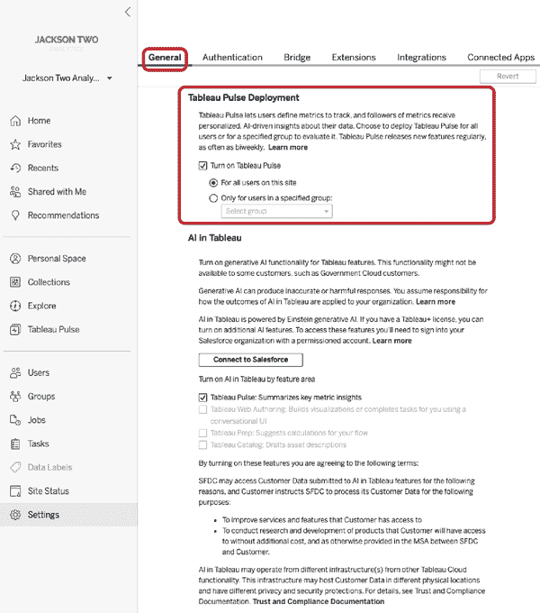
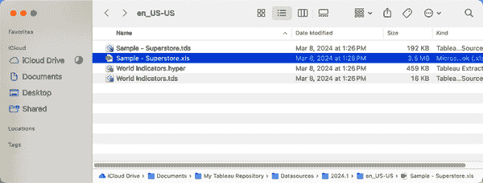
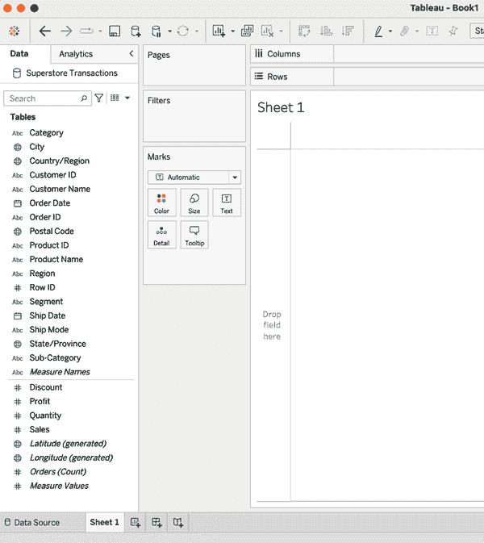
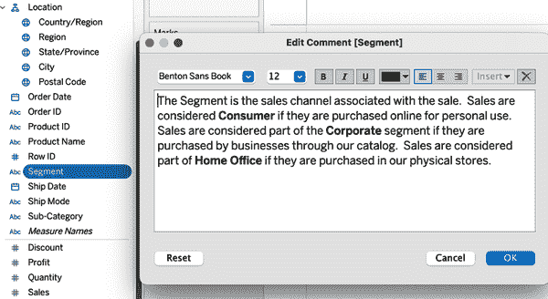
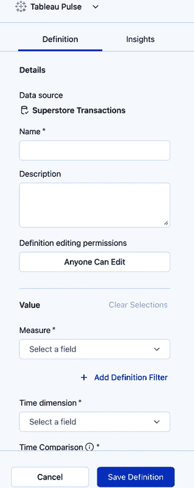
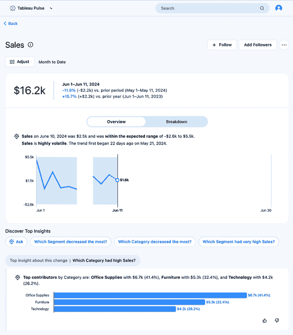
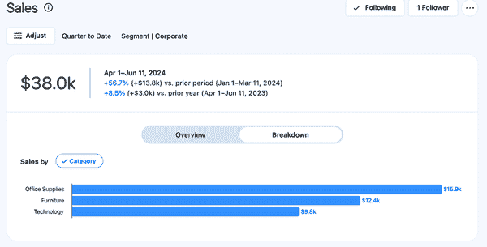
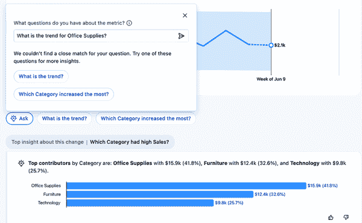
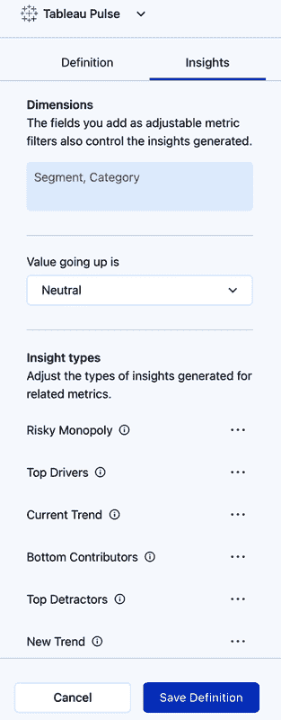

# 第二章：Tableau Pulse 入门

现在您已经了解了 Tableau 和数据分析中 AI 的历史课程，是时候深入体验 Tableau Pulse 了。在本章中，我将一步一步地引导您了解您需要知道的一切，以便准备好您的第一个脉冲指标。我将向您介绍关键概念和定义，并展示详细的图片来帮助您导航平台。

# 目的和关键定义

我最近看到了一个关于 Tableau Pulse 目的性的演示。演讲者表示，Pulse 是为了回答用户 80% 的时间会问的 20% 的问题而设计的。这是数据分析中常见的帕累托法则，有助于理解 Pulse 如何融入 Tableau 生态系统。为了进一步解释这个 80/20 原则，演讲者提出了一个观点，即最终用户大多数时间（80%）倾向于询问相同的小部分问题（20%）。作为一名分析专业人士，您可能会觉得这有点令人震惊，但退一步想，这里确实有一定的真实性。想象一下一位社交媒体经理正在追踪 Instagram 上的活动。她可能想通过查看关键指标来开始她的一天，以了解活动的表现。同样，当您第一次上车时，您可能会检查油表，看看发动机故障灯是否亮着，并监控轮胎压力。这就是您可以这样想象 Pulse 的方式，尽管我没有找到任何文档来证实，但我必须想象它的名字是基于短语 *保持你的手指在脉搏上*。

## 先决条件

如前言所述，Pulse 目前仅在 Tableau Cloud 中可用。Tableau Cloud 是 Tableau Server 的软件即服务（SaaS）解决方案，Tableau Server 是一个网络应用程序，用于组织、存储和提供 Tableau 内容。根据 Pulse 的功能架构（参见 图 2-1），我想象这种限制是由于需要从 Tableau 获取信息并通过一个完全独立且与 Tableau 软件无关的 LLM（大型语言模型）传递信息的必要性。同样，提示的审计跟踪需要将信息写入 Salesforce 数据云，这将要求 Tableau 环境在互联网上可用（而不仅仅是企业内部网络）。

默认情况下，每个 Tableau Cloud 网站都禁用了脉冲功能。要启用脉冲，请转到网站设置。在常规部分，您可以选择为网站内的所有用户或单个指定的用户组启用脉冲。此配置部分包含有关脉冲功能的一些信息，并解释了它目前正在频繁（每两周）更新。图 2-1 展示了如何启用脉冲。

###### 注意

要访问 Tableau Cloud 中的设置部分，你必须拥有站点管理员权限。这意味着你的许可证角色必须是站点管理员创建者或站点管理员探索者。

除了在你的网站上启用 Pulse 之外，你还必须至少有一个已发布的数据源来生成指标。一个*已发布数据源*是 Tableau 中的一个独立对象，代表特定分析的数据集。包括在已发布数据源中的有以下组件：

数据连接

凭据、连接信息以及数据集中使用的数据表之间的关系（连接）。所有这些信息都打包在一起，以便每个后续用户都不必重复这项工作。

字段自定义和默认值

数据集中的字段可以细化以具有友好的字段名称（与源系统中的名称相比）、数字格式、默认颜色、默认聚合和定义。不必要的字段可以隐藏给最终用户，使他们无法用于分析。所有这些都定义了字段在构建可视化时的默认行为。

添加分析字段

可以基于底层数据构建新的计算（想象一下拥有销售额和商品成本—利润将是这两个数值之间的数学差）。此外，还可以包括新的维度和分析工具，如区间、集合和参数。

数据新鲜度

关于数据源是否实时连接到源系统或按特定计划提取和刷新的规范。一个*提取*是源系统数据的快照，可以为系统设置一个频率以检索新/更新数据。

描述和认证

这包括对数据集中包含内容的用户友好描述；典型的描述包括源系统以及数据源如何用于分析。还可以应用一个*认证*徽章，该徽章链接到认证数据的用户名，以及一个可选的消息，其中包含有关认证状态的信息。

权限

由于它是一个独立对象，因此必须设置可以访问、修改和删除已发布数据源的人员权限。

已发布数据源的目的在于成为特定分析范围的*单一事实来源*。其关键优势是知道每个后续的分析、可视化和指标都是基于相同的基础数据。此外，已发布数据源最小化了数据源的扩散以及与源系统中相同数据的非必要重复连接。在一个非常成熟的 Tableau 环境中，你可以想象一个已发布的数据源可以为一个完整的分析内容（多个仪表板、即席分析和指标）提供动力。

###### 警告

所有 Pulse 指标都必须由已发布数据源中的字段构建。嵌入在工作簿中的数据源将无法用于创建指标。

###### 图 2-1\. Tableau Cloud 中的常规设置部分（查看此图的大版本[在线](https://oreil.ly/lait0201)）

## 指标定义和指标

到目前为止，我一直把用于在脉冲中跟踪的测量值称为 *指标*。虽然这是真的，但实际上，指标有两个子概念，我想详细解释一下。首先是 *指标定义*，这是为指标指定的元数据，包括以下内容：

名称

分配给指标的友好名称，例如 *销售额*

度量和聚合

用于生成指标的数值字段以及应用于该字段的聚合（如总和/最小值/最大值）

时间维度

每个指标都需要一个日期或日期时间维度，以便进行时间相关的比较，数据集中另一个字段

与之相比

时间比较的时间间隔配置，例如前年、月份或周

可调整的指标筛选器

这些是可以添加为筛选器以限制最终用户指标结果的（可能是分类的）维度字段

数字格式

如何表示数值，例如货币或百分比

值上升表示

关于值增加是有利还是不利的说明

你，作为分析专业人士，将负责指定指标定义。根据你所在组织的规模或你角色的范围，你可能会创建一个发布的数据源，该数据源为定义提供数据。

###### 警告

在 Tableau Pulse 中，所有指标定义都必须是唯一的。如果用户尝试从同一数据源创建一个相同的指标定义，当尝试保存定义时会出现错误。错误信息中包含一个链接到现有的相同指标定义。

第二个子概念是指标本身。这是指标定义的视觉表示，可以包括在定义中实例化的应用筛选器和时间比较。例如，如果你构建一个允许最终用户按地区筛选并设置显示时间范围的销售额指标，那么如果你的数据中有四个地区，你可以想象可能会有四个指标迭代，每个地区一个。同样，也可以为不同的时间间隔选择指标（如今年、这个月）。

# 您的第一个脉冲指标

让我们从零开始创建一个指标。我将指导你通过生成发布的数据源、指标定义以及使用随 Tableau 一起打包的 Sample - Superstore 数据集生成的后续指标。在完成创建过程后，我将深入探讨沿途看到的窗口、菜单和配置。

###### 注意

Sample - Superstore 数据集是什么？它是来自一家虚构零售店的样本数据，该零售店销售各种产品，主要是您在办公室中可能会找到的东西。Superstore 数据集中的每一行数据都代表收据上的一个项目。想象一下，您购买了两个活页夹、三个鼠标垫和一瓶水。您的交易将有三条记录（行），每一条记录代表一个独特的产品，包括每种产品的数量。您还会看到这三个记录中的订单号重复，因为它们都是在同一笔交易中购买的。

## 构建已发布数据源

要构建一个已发布的数据源，您必须首先连接到数据。已发布的数据源可以在 Tableau Desktop、Tableau Prep Builder 和 Tableau Cloud 中创建。以下是您如何在 Tableau Desktop 中构建一个已发布数据源的方法。首先连接到包含 Sample - Superstore 数据的 Excel 文件。对于默认的 Tableau 安装，此文件可以找到在您的文档文件夹中找到的 My Tableau Repository 文件夹的子文件夹中。图 2-2 显示了它在我的 Mac 上的位置。

###### 图 2-2\. Sample - Superstore 数据在 My Tableau Repository 中的位置

选择*Sample - Superstore.xls*文件后，您将自动转到数据源屏幕，以预览数据并构建其他数据源或包含在表中的表之间的关系。Superstore 有三个与之相关的表：订单、人员和退货。为了简化，您可以跳过关联表，而是仅与订单表一起工作。图 2-3 显示了将订单表拖入中心后的数据源屏幕。

###### 图 2-3\. Tableau Desktop 中正在使用中的订单表的数据源区域（查看此图的大版本[在线](https://oreil.ly/lait0203)）

从这里，导航到工作表 1。这将使您能够访问数据面板，这是画布左侧显示数据集中所有字段的区域。数据面板还包括一些预构建的字段，用斜体表示，Tableau 为了便于使用而包括在内。您可以在图 2-4 中看到这一点。

###### 图 2-4\. 一个空白工作表，左侧有可用于分析的可用字段

在这一点上，你可以开始准备你的数据集以进行分析。记住，这个过程的目标是创建一个可以供多种类型分析使用的数据源。你想要构建一个允许其他用户快速理解每个字段并能用于他们自己的分析的东西。为了协助这个过程，你可以进行以下修改和添加：

1.  折扣的默认聚合和数字格式。折扣字段表示一个百分比值，这是对商品标价折扣的百分比。右键单击此字段并导航到默认属性部分，将字段的默认数字格式设置为带有两位小数的百分比。将聚合设置为平均值，因为你不希望用户对折扣百分比点进行求和。你可以在图 2-5 中看到此菜单。

    

    ###### 图 2-5\. 折扣字段的默认属性菜单（查看此图的大版本[在线](https://oreil.ly/lait0205)）

1.  接下来，为数据集中包含的地理数据创建一个*层次结构*，这是一种将维度组织成父子关系的方法。为此，在数据面板中将一个字段拖放到另一个字段上方，并从最细粒度的地理字段（国家/地区）组织到最细粒度（邮政编码）。你还可以包括区域字段，这是组织分配的值。

1.  与定义字段的默认属性类似，你可以为区域字段分配地理角色。这是通过选择“从创建”选项并选择州/省字段来完成的。

1.  将利润和销售额的默认数字格式设置为货币（标准）。

1.  隐藏行 ID 字段的使用。这是一个由 Superstore 数据库生成的内部字段，在分析中未使用。

1.  最后，你可以为几个字段添加描述——特别是段、类别、订单日期和发货日期。这些字段在组织内部经常被混淆，因此添加一个描述（称为注释）将有助于指导任何与数据集一起工作的人。图 2-6 显示了我为段添加的描述。

###### 图 2-6\. 添加到段字段中的描述

现在你已经自定义和精炼了数据源，是时候将其发布到 Tableau Cloud 了。有许多方法可以做到这一点，但我会带你走过我首选的方法。在数据面板中右键单击数据源名称。从这里，选择发布到服务器。随后会弹出一个窗口，如图 2-7 所示，你可以自定义发布的源数据。

###### 图 2-7\. 数据源的发布到服务器窗口（查看此图的大版本[在线](https://oreil.ly/lait0207)）

一旦数据源发布，您的网络浏览器中将打开一个新窗口，显示 Tableau Cloud 环境中已发布数据源的位置，如图 图 2-8 所示。您还可以通过点击数据源名称旁边的“信息”图标来验证数据源、修改描述和添加标签。

您现在可以访问此数据源以构建 Pulse 指标定义。它也可以被任何有权访问它的人用于他们的工作簿或临时分析。

###### 图 2-8\. 最终发布的数据源

## 构建指标定义

要开始创建 Pulse 指标，请点击左侧导航中的 Tableau Pulse（在“探索”之下），如图 图 2-8 所示。这将带您到一个新屏幕，在撰写本文时，它看起来与 Tableau Cloud 环境中的其他部分有显著不同，如图 图 2-9 所示。

您可以立即点击“新建指标定义”按钮开始操作。一旦点击，将打开一个窗口以选择数据源。请记住，这仅包括已发布的数据源。窗口包含一个搜索功能，可以轻松找到您正在寻找的数据源，并且包含有关数据源本身的关键信息。图 2-10 展示了选择窗口。

###### 图 2-9\. Tableau Cloud 中的 Pulse 部分

###### 图 2-10\. Tableau Pulse 中的选择数据源窗口

您现在正处于构建第一个指标定义的核心部分，并呈现另一个窗口，其中包含左侧的可配置选项菜单。右侧将更改并更新，以包括定义指标时的预览。 展示了可用的配置选项。

###### 图 2-11\. 指标定义配置选项

第一个指标定义将是 Superstore 的销售额或收入，使用订单日期进行趋势和时间比较。要立即查看 Pulse 将创建的指标预览，首先在下拉框中指定度量值为销售额，聚合为求和。您还必须指定一个“时间维度”（订单日期）。图 2-12 展示了指定这些配置后创建的预览。

###### 警告

如果您正在跟随操作，您的指标预览可能与图像不同。不用担心，这是预期的，因为 Pulse 严重依赖时间，并将默认基于日期进行洞察锚定。

###### 图 2-12。选择度量、聚合和时间维度后的脉冲度量预览（查看此图的更大版本[在线](https://oreil.ly/lait0212)）

继续向下浏览定义菜单到选项部分。在这里，您可以添加“可调整的度量过滤器”，这些是最终用户可以选择以过滤度量的维度字段。作为度量过滤器包含的字段也将用于确定度量的洞察。开始时添加两个字段：部分和类别。将“数字格式”设置为货币，以强调度量值是以美元表示的。度量预览现在也更新了靠近顶部的时间段旁边的两个新过滤器；值现在也显示为美元符号。图 2-13 显示了应用了过滤器和格式的完成度量定义。

![assets/lait_0213.png]

###### 图 2-13。应用了过滤器和格式的完成度量定义（查看此图的更大版本[在线](https://oreil.ly/lait0213)）

点击“保存定义”后，屏幕将切换以显示基于在度量定义中定义的元数据生成的数据构建的新度量，如图图 2-14 所示。

从这个新创建的度量中，最终用户可以自定义并保存额外的度量以保持关注。

###### 图 2-14。基于度量定义的度量（查看此图的更大版本[在线](https://oreil.ly/lait0214)）

## 构建附加度量

现在您将通过为“企业总监”部分构建一个度量来完成此示例。在 Superstore 中，每个销售渠道都由独立的垂直部门管理，因此“企业销售总监”对 Superstore 中的其他两个部分不感兴趣。为此，点击度量名称直接下方的“调整”按钮（见图图 2-14），以选择度量的时间范围并过滤度量以仅显示企业部分。您可以从下拉菜单中将时间范围设置为“截至本季度”，以显示更长的销售趋势，如图图 2-15 所示。别忘了点击蓝色勾选标记以保存您的选择。

###### 图 2-15。在调整菜单中可用的自定义销售度量的选项

你可以点击“添加关注者”按钮来选择谁应该关注这个指标。图 2-16 说明了选择用户组（例如，为了示例，称为企业细分用户）。一旦用户被添加为关注者，该指标将出现在他们的脉搏源中。你可以点击“关注”按钮来在你的脉搏摘要中查看新创建的指标。第三章更深入地探讨了度量指标的权限并提供最佳实践指南。

###### 图 2-16\. 为度量指标选择一组关注者

## 访问度量指标

现在这个自定义的企业细分度量指标已经创建好了，返回 Tableau 脉搏的主区域。由于你关注了这个指标，它现在出现在“关注”部分，如图图 2-17 所示。

###### 图 2-17\. 包含企业细分销售度量指标的脉搏摘要（查看此图的大版本[在线](https://oreil.ly/lait0217))

从这个“关注”部分，点击度量指标卡返回度量指标的详细视图。图 2-18 显示了企业细分度量指标的详细视图。

###### 图 2-18\. 企业细分度量指标的详细视图（查看此图的大版本[在线](https://oreil.ly/lait0218))

## 与度量指标交互

我现在将遍历度量指标内用户可以交互的各个部分。首先，有概述和分解部分。概述部分正是如此，一个显示特定时间周期内指标汇总的可视化，与其他时间周期的比较，以及销售折线图（参见图图 2-18)。如果你点击分解，可视化将变为显示按每个类别分开销售的柱状图，如图图 2-19 所示。这直接对应于在指标定义中配置的可调整度量指标过滤器。

###### 图 2-19\. 企业细分销售度量指标的分解（查看此图的大版本[在线](https://oreil.ly/lait0219))

除了上面的部分之外，还有一个底部部分，标记为“发现顶级洞察”。在这里，您可以查看一些可能对跟踪度量的人常见或有趣的 AI 生成问题。还有与度量相关的顶级洞察的可视化。此度量显示一个类似于分解图的条形图，但包含总结性的洞察简短描述和每个类别销售分布的百分比值。您可以通过点击点赞或踩图标来提供反馈，说明洞察对您是否有帮助，如图 2-20 所示。

###### 图 2-20。与公司部门销售度量相关的顶级洞察部分（查看此图的大版本[在线](https://oreil.ly/lait0220)）

点击显示的其他预生成问题（如“趋势是什么？”）会导致显示附加的带有总结的可视化。点击“询问”按钮允许您输入问题并查看是否会出现未列出的洞察。在输入问题后，您将收到新的可视化或建议的问题列表，如果问题无法解决。图 2-21 显示了询问特定类别（办公用品）趋势时发生的情况。

###### 图 2-21。询问窗口解释问题并建议替代问题（查看此图的大版本[在线](https://oreil.ly/lait0221)）

您现在已经看到了已发布数据源、度量定义和度量的基本构建。但如您所注意到的，可以在过程中进行更深入的定制和配置。因此，下一节将离开特定的度量，并更详细地描述度量定义中可用的每个配置选项。本章未涵盖的配置将在第三章中讨论，因为那些是更高级的功能。

# 拆解度量定义

您已经在图 2-11 中看到了度量定义配置窗口的外观，但现在我将真正拆解每个部分，并转到窗口的“洞察”标签页，您可能之前已经注意到了。沿着定义菜单的左侧向下，您将看到以下内容：

数据源

这是度量定义连接到的数据源名称。

名称

这是您为度量定义提供的名称。理想情况下，这解释了核心定义试图测量的内容。每个配置选项旁边的红色星号表示它是必填字段。

描述

这是一个可选字段，用于包含度量定义的描述。这将传播到从该定义创建的每个后续度量。

当你构建第一个度量时，你访问了值部分中的大多数配置。以下是一个完整的列表，包括那些你尚未访问的配置：

度量

记住，这是用于定义的字段。它可以任何字段类型，并且只有在指定了聚合之后才完整。

聚合

根据所选的字段类型（即数值或非数值），您将获得不同的选项。表 2-1 显示了完整的分解。

表 2-1\. 根据字段类型可用的聚合

| 字段类型 | 可用的聚合 |
| --- | --- |
| 数字（整数和浮点数） | 总和，平均值，中位数，最大值，最小值 |
| 文本（字符串）和地理 | 计数，唯一计数 |
| 日期 | 计数，唯一计数 |

以日期显示 sparkline 值

这是一个配置，用于确定数值是否应在某些可视化中以累积总量的形式显示，或以非累积的形式显示。对于计数和唯一计数聚合，此选项不可用，并设置为非累积。

定义过滤器

这些是应用于度量定义及其后续每个度量的过滤器。与之前构建的可调整度量过滤器不同，最终用户无法与之交互，并且它们是预设的。这些过滤器最好的理解方式是度量定义的默认范围。对于前面的示例，你可以包括一个国家过滤器，仅显示美国的销售额。

时间维度

这是一个必填字段，用于指定用于趋势和度量可视化中日期轴的日期字段。

与之比较

这些是应用于度量定义的预构建的时间限制比较。可以将它们拖动并重新排序以指定它们在度量中显示的优先级和顺序。

创建高级定义

这将打开一个新窗口，根据更复杂的要求集定义一个度量。第三章（Chapter 3）详细介绍了这一点。

最后是选项部分，包括以下内容：

可调整的度量过滤器

这些是可以添加到度量定义中的字段，允许最终用户将它们用作交互式过滤器。目前这仅限于文本字段。

数字格式

这允许你指定与度量相关的格式。表 2-2 显示了选项和行为。

表 2-2\. Tableau Pulse 如何显示度量定义的数字格式

| 数字格式 | 格式化选项和行为 |
| --- | --- |
| 数字 | 在数值后附加单数和复数单位（例如：1 个部件，2 个部件）。 |
| 货币 | 没有选项，自动包括货币符号，并以小数形式显示数字。对于大数字，它会将数字浓缩为带有千位（k）、百万位（M）和十亿位（B）指示符的小数。 |
| 百分比 | 将小数数字作为带有%符号附加到值上的百分比返回。 |

如您在之前的示例指标中看到的，可以通过配置这些字段来构建指标定义。此外，您还可以导航到洞察选项卡，以指定对 Pulse 在指标中呈现的重要信息类型。

洞察窗口，如图图 2-22 所示，有三个部分：

###### 图 2-22\. 指标定义的洞察选项卡

维度

此部分不可编辑，但会自动列出在定义菜单中添加为可调整指标的 所有字段。

增加的值是

对于指标定义，您可以定义数值增加是有利、中性还是不利。这些会改变生成的摘要洞察中使用的语言。默认选择中性，它使用增加和减少语言来解释摘要中的指标变化。有利和不利的选项将根据指定的上升行为替换增加和减少。根据此选择，图表中还将出现红色和绿色作为额外的视觉编码。

洞察类型

这些是扫描指标定义的方式，它们决定了它将呈现的洞察类型。默认情况下，所有类型都处于开启状态，但可以使用洞察类型右侧的三点操作菜单将其关闭。一些洞察类型始终开启。表 2-3 列出了洞察类型的完整列表及其描述，以及它们是否可以开启或关闭。

表 2-3\. Tableau Pulse 中使用的洞察类型

| 洞察类型 | 切换使用 | 摘要目的 | 解释行为 |
| --- | --- | --- | --- |
| 记录级异常值 | 是 | 显示具有极高或极低指标值的记录的行级信息。 | 当触发时，将在洞察部分显示包含已识别记录的表格。这种洞察对于识别不良数据值或检测异常很有用。 |
| 期间变化 | 否 | 显示指标在两个时间段之间的变化情况。这种洞察作为每个指标的组成部分显示。 | 这是洞察摘要的默认部分，将当前指标值与前一时期进行比较。这种洞察有助于量化并跟踪指标随时间的变化。 |
| 顶级贡献者 | 否 | 显示指标在其时间范围内维度中的最高值。 | 这是指标分解的默认部分。它显示对指标价值贡献最高的维度成员的值。这种洞察力有助于用户关注驱动指标性能的高影响区域。 |
| 底部贡献者 | 是 | 显示指标在其时间范围内维度中的最低值。 | 当触发时，显示对指标贡献最低的维度成员的值。这种洞察力有助于在尝试识别改进指标的机会时使用。 |
| 集中贡献警报（风险性垄断） | 是 | 显示当少数维度成员贡献了指标 50%或更多时的情况。 | 当触发时，显示对指标价值贡献最大的维度成员。这种洞察力有助于识别对一小部分贡献者的过度依赖相关的商业风险。 |
| 顶级驱动因素 | 是 | 显示哪些维度值对于指标的观察变化在相同方向上变化最大。 | 当触发时，显示在指标观察变化相同方向上变化最大的维度成员的值。这种洞察力有助于在尝试识别对指标变化贡献最大的正面或负面驱动因素时使用。 |
| 顶级负面因素 | 是 | 显示哪些维度值对于指标的观察变化在相反方向上变化最大。 | 当触发时，显示在指标观察变化相反方向上变化最大的维度成员的值。这种洞察力有助于在尝试识别对指标变化贡献最大的正面或负面驱动因素时使用。 |
| 非常变化 | 否 | 显示在给定时间范围内，指标的值高于或低于基于历史观察的预期范围。 | 这是指标洞察力摘要的默认部分。这种洞察力有助于提醒用户指标可能影响性能的意外变化。 |
| 当前趋势 | 是 | 通过传达指标值的改变率、方向和波动来显示指标的当前趋势。 | 描述指标的当前观察趋势。这种洞察力有助于用户关注指标持续的发展和变化。 |
| 趋势变化警报 | 是 | 显示观察到的趋势与现有（当前）趋势显著不同时发出警报。 | 当触发时，通知用户指标观察趋势的变化。这有助于快速识别指标性能的意外变化。 |

除了对指标定义活跃的不同洞察之外，Tableau Pulse 还采用了一种评分系统来对最具有统计影响力的洞察进行排名和展示，以便在用户的摘要中向最终用户展示。当用户跟踪多个指标并收到所有跟踪指标的摘要以及针对指标的个别洞察时，这一点变得更加明显。此外，这种评分系统还受到用户对出现的更深入洞察的点赞/踩下反馈的影响。

# 摘要

您现在已经学到了创建第一个脉冲指标所需的一切，并对可用的配置选项有了深入的了解。以下是几个关键要点：

+   构建脉冲指标需要使用已发布的源数据。

+   已发布的源数据是 Tableau 中的一个独立对象，它包含有关数据集分析的关键信息。它包括源系统连接信息、凭证、默认设置（如格式化和描述）以及为分析添加的附加字段。

+   指标定义包括度量字段名称、聚合、时间维度、可筛选维度以及所有后续指标可用的洞察。

+   指标是基于指标定义的交互式可视化和摘要。

+   用户可以根据可用的可筛选维度和偏好的时间范围自定义指标。每个配置都会保存为一个额外的指标，然后可以跟踪。

+   指标可以被用户或用户组跟踪，并显示在每个用户的脉冲摘要中。

+   可以将许多洞察类型应用于指标定义。大多数都可以根据创建者的偏好开启或关闭。

第三章 更详细地探讨了脉冲中的高级选项。您将学习如何添加定义过滤器、对时间进行高级更改以及创建高级指标定义。它还解释了如何在使用指标定义中使用计算字段。最后，您将学习如何在 Tableau 平台上管理权限和指标。
