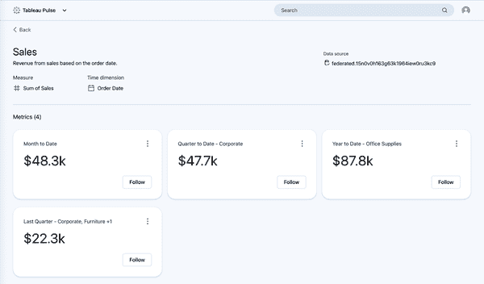
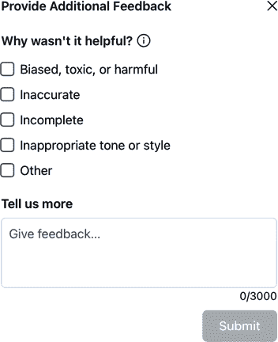
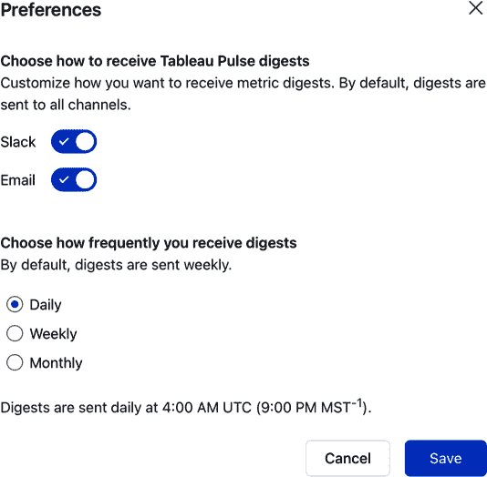

# 第四章\. Tableau Pulse 面向最终用户

在前面的章节中，你学习了如何启用 Tableau Pulse 并构建基本和高级度量指标定义。现在，是时候从受众的角度了解它们是如何被消费的了。在本章中，你将了解你创建的度量指标是如何显示给最终用户的，当用户关注多个度量指标时会发生什么，以及他们如何接收 AI 洞察的摘要。

# Pulse 首页

正如你在第二章中看到的那样，在从 Tableau Cloud 导航到 Tableau Pulse 后，最终用户会看到一个摘要页面，显示他们已经关注的指标以及可供关注的指标。然而，记住他们只能看到与已发布的、他们具有查看和连接权限的数据源相关的指标。图 4-1 展示了具有访问先前示例中使用的已发布数据源（Superstore Transactions）的查看者角色的可用度量指标定义。

从这个屏幕，用户将访问所有度量指标定义和现有度量指标，并开始构建他们自己的度量指标。通过点击右侧的三点操作菜单，他们可以访问两个后续区域：

洞察探索

度量指标定义的摘要和细分屏幕

查看所有度量指标

一个包含基于度量指标定义的所有现有度量指标的屏幕

他们还可以点击度量指标定义来导航到包含所有度量指标的屏幕。


###### 图 4-1\. 观看者角色的可用度量指标定义

这一切都应该看起来很熟悉，因为可用的操作是第三章中看到的操作的一个子集。然而，对于查看者来说，他们可以查看（因此得名），但不能修改或删除他们可以访问的任何度量指标定义。

###### 注意

尽管图中没有显示，如果你的 Tableau Cloud 站点启用了数据目录，应用于数据资产的数据质量警告将显示在浏览度量指标部分。它们也会出现在关注指标底部。最后，当查看概览或细分时，它们会出现在度量指标名称下方。

图 4-2 展示了基于第二章中构建的销售度量指标定义的可用的度量指标。你会注意到查看者无法看到每个指标的粉丝数量，并且正如预期的那样，他们无法编辑度量指标定义。

###### 警告

尽管度量指标的查看者无法删除或修改它们，但他们能够管理关注者。他们可以查看现有的关注者，也可以从给定的指标中添加和移除他们。



###### 图 4-2\. 可用于销售指标定义的指标（查看此图的大版本[在线](https://oreil.ly/lait0402)）

## 创建新指标

最终用户创建指标的流程与您在第二章中看到的是相同的。要构建一个指标，用户可以通过使用洞察力探索部分访问指标定义，或者更有可能的是，他们可以从点击一个他们可能想要进一步定制的特定指标开始。重要的是要注意，他们创建的任何新指标在离开屏幕之前都需要至少分配一个跟随者。这将确保指标被创建并对其他人可访问。

要了解 AI 生成的洞察力摘要如何传播给最终用户，您可以创建自己的指标或使用以下侧边栏中概述的指标：

+   截止到本年度利润比率

+   截止到本年度平均折扣

+   截止到本年度客户数量

+   截止到本年度已售商品数量

+   截止到本年度利润

+   截止到本年度平均发货时间

+   截止到本年度每订单平均产品数量

+   截止到本年度平均利润

+   截止到本年度已发货订单数量

图 4-3 展示了在跟随它们之后侧边栏中的九个指标。跟随的指标按时间顺序组织。记住，脉搏（Pulse）高度依赖于今天的日期，因此生成的摘要和洞察力在你的环境中可能会有很大差异。

###### 小贴士

拥有 Tableau+ 许可证的 Tableau Cloud 用户可以根据数据源名称、指标定义或最近跟随的顺序对指标进行升序或降序排序。可以应用静态目标值到具有期间至日期时间范围的指标。目标将显示在大型数字下方，带有进度条，并在折线图中作为参考线，如果将 Sparkline 值设置为显示为运行总数。您可以在第七章中了解更多关于 Tableau+ 的信息。


###### 图 4-3\. 跟随指标后的脉搏摘要（查看此图的大版本[在线](https://oreil.ly/lait0403)）

根据跟随指标时发生的情况，脉搏（Pulse）将开始构建一个更大的洞察力摘要，该摘要结合了用户跟随指标中最有趣的洞察力。这些摘要每 24 小时构建一次，并且可能需要至少一天时间才能最初出现在最终用户面前。以下是从图 4-3 中读取的 AI 摘要。此摘要中的指标以粗体和下划线显示，用户可以点击它们直接导航到指标的详细视图：

```py
Annual **Profit** soared by 37.7% compared to last year. Similarly, **Orders Shipped** increased by 27.7% over the same period. **Items Sold** remained stable, with a 26.3% higher performance than last year. Overall, 6 of 9 metrics changed: 3 favorably, 1 unfavorably.
```

## 理解生成的洞察力

如第二章中所述，Tableau Pulse 依赖于为可调整过滤器指定的维度字段来生成洞察。幕后，会生成洞察类型（参见表 2-3），然后进行评分和排名以确定哪些是最有统计意义的。这些洞察既出现在后续的分解图表中，也出现在自动生成的洞察摘要中。

最终用户可以通过在每个生成的洞察旁边点击点赞或踩按钮来提供对每个洞察有用性的反馈。当洞察摘要被标记为*有用*时，用户可以提供最多 3,000 个字符的描述。同样，如图 4-4 所示，用户可以将洞察摘要标记为*无用*，选择原因，并提供反馈。此类反馈的选项如下：

偏见、有毒或有害

输出的语言在某些方面是冒犯性的。

不准确

输出中生成的数值是事实错误的。

不完整

输出并没有得出结论。

不适当的语气或风格

输出的语言不够专业或过于花哨。

其他

这是针对生成输出中所有其他问题的。



###### 图 4-4\. 可以为洞察摘要选择的反馈类型

这种反馈机制不会对生成的洞察产生任何即时改变。相反，它被传递给负责生成摘要的 LLM（可能通过提示指令的方式）。

###### 警告

目前尚无方法可以*撤销*将生成的洞察或图表标记为有用或无用。由于这可能会影响后续行为，我建议在分配反馈时要谨慎。

# 指标摘要

除了关注指标的脉冲主屏幕外，用户还可以接收其关注指标的摘要。这些摘要的默认设置是每周的电子邮件和 Slack 消息，但频率可以调整为每日，用户可以指定他们希望接收摘要的通信渠道。图 4-5 显示了可用的选项，通过点击脉冲主屏幕右上角的用户图标并选择偏好设置来访问。Slack 必须首先由管理员在 Tableau Cloud 站点内配置，才能作为渠道选项可用。您将在第六章中了解到如何配置 Tableau Cloud 和 Slack。



###### 图 4-5\. 最终用户可以为 Pulse 摘要设置的偏好

这些摘要与生成的 AI 摘要的更新相一致，并且不能配置到特定时间。根据观察，每日洞察摘要似乎在协调世界时（UTC）凌晨 3 点到 4 点之间构建，然后随后发送摘要。

## 邮件摘要

在邮件摘要中，您将看到相同的指标生成的摘要，说明哪些指标经历了最有趣的变化。在全局摘要下方是缩略图、特定指标的摘要以及查看每个指标详细信息的超链接。这些格式化的指标按字母顺序显示。图 4-6 显示了每日电子邮件摘要的片段。


###### 图 4-6. 邮件摘要片段（查看此图的大版本 [在线](https://oreil.ly/lait0406)）

邮件还包含脚部链接，供电子邮件收件人管理他们跟踪的指标或调整摘要频率设置。

## Slack 摘要

用户还可以启用 Slack 摘要，这允许他们在通信平台中直接查看相同的 Pulse 洞察。一旦 Tableau Cloud 管理员通过 Tableau for Slack 应用程序启用 Slack 和 Tableau Cloud 之间的集成，每个用户都必须将 Tableau 应用程序添加到他们的 Slack 环境中，并授权两个应用程序之间的连接。

您可以通过在 Slack 工作空间侧边栏中点击“添加应用程序”来添加 Tableau 应用程序，如图 图 4-7 所示。


###### 图 4-7. Slack 工作空间侧边栏中突出显示的“添加应用程序”选项

然后，用户将能够从可用应用程序列表中选择 Tableau 应用程序，并开始使用 Tableau Cloud 进行授权流程。授权需要用户登录到 Tableau Cloud 并允许 Slack 代表用户在 Tableau Cloud 中执行操作。图 4-8 显示了 Slack 将被授予的明确信息和操作列表。


###### 图 4-8. 添加 Tableau 应用程序时授予 Slack 的授权列表

###### 小贴士

如果 Tableau 应用程序尚未在您的 Slack 工作空间中提供给用户，并且您没有权限添加它，您可以按照尝试添加应用程序的相同流程向 Slack 管理员发起请求。您将进入一个带有包含更多请求信息的选项的审批请求屏幕。一旦您的请求被管理员审查，Slackbot 将通过私信（DM）通知您。

一旦 Tableau 应用程序为用户启用，他们就会开始以他们希望的频率接收 Pulse 摘要。这些摘要以 Slack 中 Tableau 应用程序的 DM 形式出现。这些摘要反映了电子邮件摘要中看到的内容，从所有关注指标的总体摘要开始。每个关注指标都会用其当前值、比较值（s）、Sparkline 和洞察力重新创建。与电子邮件摘要类似，这里的指标按字母顺序显示。如果用户关注的指标很多（超过四个），Tableau 应用程序将在线程回复中包含剩余的指标。图 4-9 展示了一个示例摘要。


###### 图 4-9\. Slack 中的 Tableau Pulse 摘要（查看此图的大版本[在线](https://oreil.ly/lait0409)）

这些摘要中的指标有超链接，可以直接导航到洞察力探索屏幕。管理按钮与消息底部电子邮件摘要选项相同，允许用户管理他们的指标或摘要首选项。

# Tableau 移动

用户还可以通过使用 Tableau 移动应用程序访问 Pulse 指标和摘要。此应用程序在 Android 和 iOS 上免费提供，使用户能够随时随地访问他们的 Tableau 内容。图 4-10 展示了从 iPhone 观看 Tableau Pulse 的样子。

在 Tableau 移动应用程序中，用户可以垂直滚动查看他们关注的指标（这些指标按时间顺序显示，类似于 Tableau Cloud）。在这方面，移动版本与摘要相同。用户还可以与指标的详细视图进行交互，并询问和访问顶级洞察。如果已配置通知，用户可以收到检查他们的 Pulse 洞察力的提醒。用户还可以在打开应用程序时将 Pulse 设置为起始页面。


###### 图 4-10\. Tableau 移动应用程序中的 Tableau Pulse 摘要（查看此图的大版本[在线](https://oreil.ly/lait0410)）

重要的一点是，与浏览器体验不同，用户无法在手机上创建新的指标。此外，他们除了时间范围之外，无法访问与每个指标相关的可调整的过滤器。

比较访问摘要的不同方法，移动应用程序体验提供了最丰富且最易于使用的体验。用户可以在其关注的指标的摘要和详细视图之间无缝切换，指标本身更大且更容易阅读，所有可视化都是交互式的。对于忙碌的行政人员来说，这是在同一个地方访问所有指标的最简单方式。

# 摘要

本章深入探讨了最终用户在使用 Tableau Pulse 时的体验。以下是一些关于您所学内容的要点：

+   拥有查看许可证的用户只能根据预制的指标定义构建指标。

+   所有用户，无论许可证类型如何，都可以管理和修改指标的跟踪者。

+   用户可以将洞察标记为“有用”或“无用”并提供反馈。

+   用户可以通过可配置的时间表（每日、每周或每月）通过电子邮件或 Slack 接收摘要。

+   电子邮件和 Slack 摘要都包含超链接，用于访问和管理跟踪的指标。

+   用户必须启用 Slack 上的 Tableau 应用程序，并授权 Slack 开始接收摘要。

+   Tableau 移动应用程序包括 Tableau Pulse，并提供访问跟踪指标的最简单和最沉浸式的体验。

+   用户无法在移动应用程序中创建新的指标或访问可调整的过滤器。

在第五章中，您将看到各种行业如何从使用 Tableau Pulse 中受益。本章将讨论几个指标示例，并让您接触多种数据源。您还将看到可以从第三章中提到的管理洞察数据源创建的指标，这将为您提供监控 Pulse 在您的 Tableau 网站上的使用和采用情况的工具。
