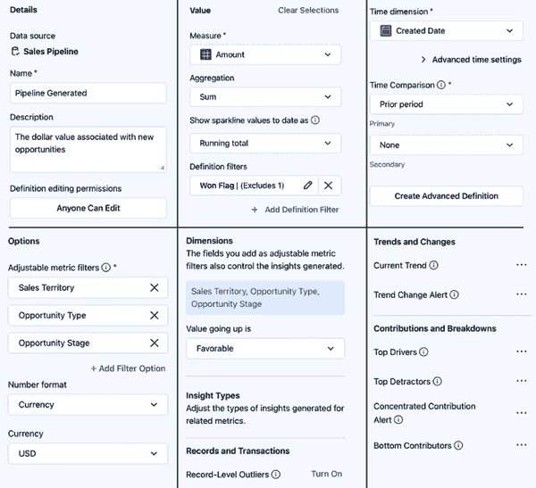
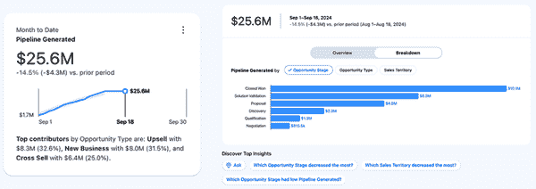
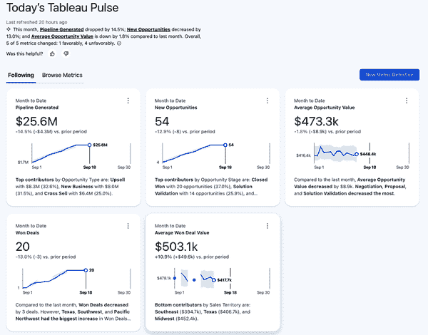
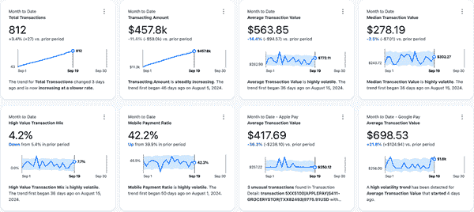
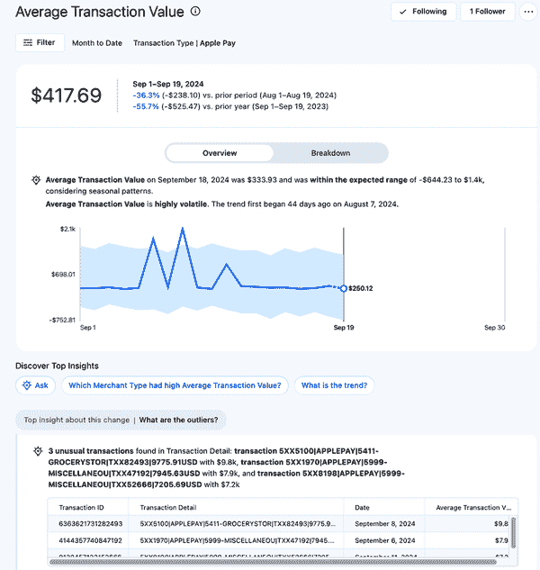
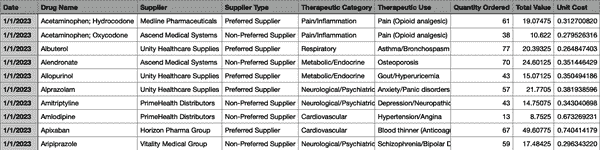
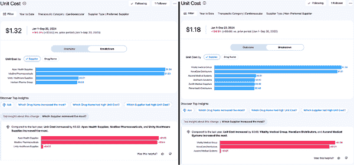
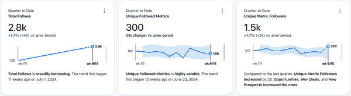

# 第五章。使用 Tableau Pulse 的用例

在前面的章节中，你已经看到了构建 Tableau Pulse 中度量指标所需的所有构建块。现在，是时候看看不同行业中的度量指标在实际操作中的样子了。在本章中，我将分享销售、财务、医疗保健以及管理 Tableau Pulse 本身的使用案例。我的目标是让你从本章中受到启发，了解如何将 Tableau Pulse 集成到你的分析环境中，以及你的最终用户如何从 Pulse 中受益。除了给你一些启发外，我还会带你了解如何最大化并自定义 Pulse 度量指标的洞察部分。

# 用例：销售

销售数据是你可能需要处理的最流行的数据集之一。很少有公司没有向客户提供某种类型的产品。因此，在这个第一个用例中，我想向你展示如何使用 Pulse 重新创建一个现有的 Tableau 仪表板，该仪表板专注于软件公司的销售机会管道。如果你负责过渡现有内容或需要决定是否从 Pulse 开始或构建整个仪表板，这项练习可能会有所帮助。它还将帮助说明自动生成的洞察类型与你的最终用户可能需要自行确定的内容之间的区别。

图 5-1 显示了一个仪表板，最终用户可以查看几个关键绩效指标（KPI），并使用右上角的下拉菜单在三个时间段之间切换：月度、季度和年度。此外，用户可以点击两个底部图表中的任何一个，以交互式方式根据机会类型、机会所处的阶段以及管理机会的领域进行筛选。

###### 图 5-1。软件销售管道仪表板（查看此图的大版本[在线](https://oreil.ly/lait0501))

图 5-1 中的仪表板布局在 BI 领域非常受欢迎。它包括高级 KPI 以及更改月末/季度/年度报告时间段的选项。此外，它还在下半部分提供了一些细节，快速显示机会按重要类别的分布。包含与先前时间段的比较提供了最终用户渴望的上下文，以确定他们是否在朝着实现目标的方向前进。

现在，让我们开始拆解并重新创建这个仪表板在 Pulse 中的版本。首先，我将解决一个关键绩效指标（KPI）：在 Tableau Desktop 中是如何制作的，以及在 Pulse 中是如何制作的。图 5-2 显示了 KPI 的工作表，其中突出显示了驱动可视化的关键区域。

驱动此可视化的三个关键部分是：

标记卡

在 Marks 卡片上突出显示，已经构建了三个计算来生成所选时间段的价值管道。这些动态计算基于用户选择而变化。

时间段（图下方）

在 Marks 卡片下方，这里有一个下拉选择设置为“月度至今”。这是允许用户选择时间段的控制器。

过滤器面板（图上方）

在 Marks 卡片上方，这里显示了三个过滤器。有两个动作过滤器，根据销售区域和机会阶段/机会类型过滤工作表。这些对应于图 5-1 底部的两个图表。图 5-1。还有一个简单的排除过滤器（赢得标志：假）以移除任何丢失的机会，因为它们不会对管道做出贡献。

###### 图 5-2\. KPI 的工作表

参数和计算是使这个 KPI 工作的秘密成分，但对于 Tableau 世界的新手来说，它们并不容易或直观地制作。即使是经验丰富的专业人士，它们也非常计算密集，需要为每个可视化的 KPI 进行三个计算（以及更多依赖于这些计算的额外计算）。

下面是计算中实际发生的情况：

+   六个布尔计算将隔离不同的时间段，包括当前的 *时间段* 和 *前期* 时间段。它们依赖于今天的日期来确定机会是否在任一时间段内，并将用于后续计算中的数据过滤。

+   有两个情况语句计算，每个时间段一个，以确定用于过滤计算的布尔值。

+   有四个计算，每个时间段值一个，一个百分比差异，以及当前和前期值之间的差异（delta）。

图 5-3 显示了为 KPI 构建的所有计算。

###### 图 5-3\. 构建 KPI 所需的计算（查看此图的更大版本[在线](https://oreil.ly/lait0503)）

现在你已经看到了在 Tableau Desktop 中创建看似简单的 KPI 所需的内容，我将重新创建它作为一个脉冲指标。到现在为止，你已经是一个在脉冲中创建指标的专家，所以这应该不会让你感到惊讶。步骤很简单；我定义以下内容：

+   使用的度量是金额，聚合为总和。

+   “定义过滤器”下拉菜单设置为排除赢得标志的假值。

+   “时间维度”是创建日期。

+   时间比较只选择了“前期”；次要比较设置为无。

+   在“选项”中，为了允许与交互式过滤相同的过滤体验，增加了三个字段作为“可调整度量过滤器”：销售区域、机会类型和机会阶段。

+   “数字格式”设置为货币 > 美元。

+   对于维度中的洞察类型，“值上升是”设置为有利，并且关闭了记录级异常。

图 5-4 展示了所有度量定义配置，实际上截图比在下拉菜单中选择花费的时间更长。

立刻您应该能看到脉冲为涉及比较时间段的可视化带来的好处。无需为每个要比较的唯一时间段构建计算，这是自动完成的，而且仪表板没有展示的更多有价值的比较时间。同样，构建百分比差异和价值差异的必要性也不再需要，取而代之的是这些差异会自动构建。

现在让我们深入实际度量，花些时间评估自动生成和总结的洞察。这将帮助您了解那些消费脉冲度量将接触到的信息类型。图 5-5 展示了基于之前指定的配置创建的度量。

在度量卡上，有一个总结列表，列出了按机会类型列出的顶级贡献者，这是所选的可调整度量过滤器之一。这是一个有价值的简短信息，包括百分比和实际值增加了对分布的理解。在分解中，您可以在三个类别之间切换，以快速比较机会的分布。

###### 图 5-4\. Pulse 中管道生成 KPI 的配置（查看此图的大版本[在线](https://oreil.ly/lait0504)）

###### 图 5-5\. 度量卡和分解（查看此图的大版本[在线](https://oreil.ly/lait0505)）

此外，在“发现顶级洞察”部分中，有 12 个预生成的疑问，每个疑问都有其自己的伴随条形图和总结声明。以下是 12 个问题：

+   哪个销售区域增长最多？

+   哪个销售区域下降最多？

+   哪个销售区域产生的管道较低？

+   哪个销售区域产生的管道较高？

+   哪个机会类型增长最多？

+   哪个机会类型下降最多？

+   哪个机会类型产生的管道较高？

+   哪个机会阶段产生的管道较高？

+   哪个机会阶段产生了非常高的管道生成？

+   哪个机会阶段产生的管道较低？

+   哪个机会阶段增长最多？

+   哪个机会阶段下降最多？

在生成的所有问题中，针对高、低管道生成的问题在指标分解部分和基于该指标的仪表板中都是立即可见的。然而，剩余的问题及其答案在仪表板中更难以呈现，但确实提供了有趣的信息。例如，图 5-6 展示了第一个问题的图表和洞察，旨在展示哪个销售区域在特定时间段内增加了最多的管道，这项任务在仪表板中需要多次点击才能发现相同的信息。自动提供总结语句和伴随图表完全展示了用户通过 Pulse 可能获得的时间节省。

###### 图 5-6。Pulse 生成的顶级洞察

同样，您会注意到生成的所有洞察都没有包含可用于筛选或选择的字段（销售区域、机会类型、机会阶段）的组合或混合。因此，像“哪些机会阶段的新业务机会最多？”这样的潜在洞察，它关联了机会阶段和机会类型，在 Pulse 中并不立即可见，与仪表板上的热图不同。要达到这一层次的洞察，需要从现有的指标定义中添加一个额外的子指标，将机会类型设置为“新业务”，如图 5-7 所示。图 5-7。

###### 图 5-7。一个带有机会类型筛选的子指标（查看此图的大版本[在线](https://oreil.ly/lait0507)）

了解生成的洞察的类型和深度可以帮助您判断 Pulse 是否适合您的受众。它还提供了关于需要构建多少个子指标来回答更具体问题的方向。

最后，图 5-8 展示了跟随仪表板中展示的五项指标的 Pulse 起始页面，完全展示了 Pulse 体验将是什么样的。当然，简短、总结性的洞察显然提供了与仪表板的自助和交互式发现体验不同的体验。

###### 图 5-8。仪表板中的 KPI 作为 Pulse 指标（查看此图的大版本[在线](https://oreil.ly/lait0508)）

# 用例：财务

使用 Tableau Pulse，构建见解的速度比在仪表板内构建复杂的计算提供了显著的优势。Pulse 能够快速实现数据探索的能力可能是一个游戏规则的改变者，尤其是在自动化的见解类型被定制化时。在这个用例中，我将向您展示一个简单的信用卡交易数据集如何快速增加价值，并能够实时进行异常检测。

为了给这个用例增加一些背景，想象一下这个项目是为一个小型地区性信用合作社而设计的，该合作社提供高水平的客户服务。信用合作社吸引着富裕的客户，他们也是忙碌的专业人士。作为该组织正在进行的数字化转型的一部分，移动支付的产品经理希望了解客户习惯并留意任何风险行为。

图 5-9 展示了交易数据集的一个片段。目前产品经理可以访问一个报告系统，她可以导出交易信息，但她没有实时分析或跟踪她感兴趣信息的方法。让我们探讨 Tableau Pulse 如何支持她获取信息的需求。

###### 图 5-9。信用卡交易的一个子集

首先，值得提到的是，这个数据集和当前的任务是 Tableau Pulse 的理想候选者。数据本身干净且结构良好，对理解客户行为和实时评估风险的请求非常适合 Pulse 生成的最新见解。

图 5-10 展示了为帮助产品经理构建的各种 Pulse 指标。我将从高层次上解开它们，然后专注于一个特定的指标以及它是如何被定制以应对她识别任何风险行为的请求。

###### 图 5-10。基于信用卡交易的 Pulse 指标（查看此图的更大版本[在线](https://oreil.ly/lait0510))

产品经理现在可以访问的指标包括分析范围的组合。最上面一行包含运营指标，提供了对信用合作社整体趋势和行为的洞察。最下面一行包括与她理解风险和移动支付行为需求更具体的指标。这种指标的组合提供了一个很好的起点，使她能够在关注领域的同时，了解组织的整体客户行为。通过比较客户的平均交易价值与特定于 Apple Pay 和 Google Pay 的客户，可以立即获得价值。同样，她可以使用移动支付比率来了解她的团队是否在增加移动支付方式的使用。

除了她快速获得的洞察之外，你还可以看到在仅包括 Apple Pay 交易的“平均交易价值”指标中发生了一些有趣的事情。如图 图 5-11 所示，似乎存在三种这种支付类型的异常交易。让我们分析这个指标的细节，看看它不仅发现了什么，而且是如何调整指标以发现这些异常交易的。

###### 图 5-11\. Apple Pay 的平均交易价值全尺寸版本（[在线查看此图更大版本](https://oreil.ly/lait0511))

指标的上半部分与您已经看到的类似，显示了您在 Pulse 中已经熟悉的基于时间的趋势和比较。但下半部分，即“发现顶级洞察”所在的位置，揭示了一些新内容：在信用合作社一个月内 Apple Pay 交易的统计正常值之外的外部交易。

传统上，在数据集中实现这种类型的异常或离群值检测通常需要大量的代码和算法创建，但 Pulse 使得这变得简单。除了消除定义异常是什么的需要之外，您还可以自定义指标的设置，以确保这是产品经理将收到的唯一类型的洞察。

图 5-12 展示了洞察是如何定制的，主要依赖于记录级异常功能。这包括定义“记录标识符”和“记录标识符名称”，并填写单数和复数名词来描述记录。此外，由于它们与当前任务无关，所有在“贡献”和“分解”部分中的洞察都已关闭。

###### 图 5-12\. 平均交易价值的洞察配置

这种调整水平使得异常检测功能得以发挥，并在生成的指标摘要中突出显示洞察。正如你在 图 5-10 中所看到的，实际的交易数据以小型数据表的形式显示，允许立即访问理解异常所需的所有关键信息。尽管这种异常检测不太可能取代信用合作社使用的欺诈检测应用程序，但至少产品经理可以实时获取可以快速聚焦于任何非典型情况的信息。

###### 小贴士

Pulse 允许你指定唯一的记录标识符和标识名称。这两项信息将在“发现顶级见解”部分中的异常数据表中显示。你可以通过在发布的数据源中构建一个包含所有相关信息的连接字段（如交易详情）来利用这一点，以包含所有异常信息。

# 用例：医疗保健

到目前为止，你已经看到了 Tableau Pulse 如何生成见解并指导用户关注他们已经跟踪的指标。然而，在这个用例中，你将看到在 Pulse 的初步见解之后创建新指标如何提供更有价值的跟踪和警报。你还将看到另一个例子，说明为你的受众配置特定见解如何帮助他们满足需求。

此用例适用于大型长期护理设施网络中的药房采购经理。由于该组织正在管理患者的持续护理，因此监测药物成本和供应的波动至关重要，尤其是在最近的供应链中断导致药物价格不稳定的情况下。过去，这些成本每年都会审查一次，与供应商合同续签保持一致，但药房采购经理正在寻找一种更主动的方式来评估风险，希望组织在合同续签季节能有更大的谈判能力和替代供应商选择。

图 5-13 展示了数据集的一个片段，包括各种药物的购买历史。还包括其他关键字段，如药物的治疗类别和用药信息、供应商名称以及供应商是否为首选供应商。这些关键字段将作为可调整的过滤器包含在指标中。

###### 图 5-13\. 药品购买历史的一个子集

为了帮助识别价格波动风险或可用供应商的变化，经理已经跟踪了三个指标，如图 图 5-14 所示：总成本、订购单位和单位成本。这些将作为进一步调查的起点。

###### 图 5-14\. 药房采购经理跟踪的 Pulse 指标（查看此图的大版本 [在线](https://oreil.ly/lait0514)）

专注于订购单位指标，其见解仅限于那些有助于识别最大风险区域和发现供应商可能对订购药品价格有过多影响力的情况。图 5-15 展示了自定义设置。总成本和单位成本指标也进行了类似的配置，并开启了一个额外的见解：当前趋势。

###### 图 5-15\. 单元排序的洞察配置

在配置了特定的见解后，变得清楚经理应该立即关注的地方：心血管药物，这是在每个度量摘要中提到的治疗类别。为了确定这真的是一个问题，她可以使用可调节的过滤器将每个度量设置为仅包括心血管药物。图 5-16 显示了她限制“订购单元”度量后出现的情况，揭示了公司正在从非首选供应商那里订购更多的心血管药物。此外，54.1%的这些药物是从仅三家供应商那里采购的，代表着供应链中潜在的供应商集中风险。

###### 图 5-16\. 心血管单元排序的度量分解（查看此图的大版本[在线](https://oreil.ly/lait0516)）

带着关于供应商的新信息，她现在可以构建更具体的指标，以查看单元成本是如何受到这一发现的影响的。图 5-17 显示了她创建的指标，使她能够分别跟踪首选和非首选供应商的心血管药物的单位成本。

###### 图 5-17\. 每种供应商类型的心血管单元成本度量（查看此图的大版本[在线](https://oreil.ly/lait0517)）

最后，她可以深入了解每个指标的细节，看看这种成本增加是否在所有供应商中均匀分布，代表着市场不可避免的转变，或者它是一个可以缓解的与供应商相关的问题。图 5-18 显示了每个指标的分解。

###### 图 5-18\. 每种供应商类型的单元成本度量分解（查看此图的大版本[在线](https://oreil.ly/lait0518)）

只需几点击，她就深入挖掘并找到了可操作见解。心血管药物成本上升似乎仅限于少数几家供应商，包括首选和非首选供应商。了解这一点后，她不仅可以跟踪这些特定供应商的价格波动，还可以将此信息反馈给公司的药品采购人员，以便立即改变他们的采购策略。她还跟踪了所有这些指标，确保它们在问题解决前得到密切跟踪。

# 用例：脉冲利用率

总结本章内容，您将了解如何使用 Tableau Pulse 来监控自身。回想一下第三章，在 Admin Insights 项目中包含多个数据集，可以帮助您了解最终用户如何使用 Pulse。您可以参考该章节来刷新您对可用字段及其定义的记忆。

## 站点内容数据源

使用 Admin Insights 中可用的站点内容数据源，图 5-19 展示了您可以创建以开始使用的五个度量定义。当您开始在您的 Tableau 环境中实施 Pulse 时，这些定义将帮助您了解用户采用情况。它们还将通过识别有多少数据源在使用以及从定义中创建了多少子度量来为您提供关于 Pulse 环境成熟度的见解。如何构建这些度量的说明请参阅表 5-1。

###### 小贴士

由于这些度量基于创建日期，您可能希望为聚合指定更长的时段。

###### 图 5-19\. 显示 Pulse 利用率的度量（查看此图的更大版本[在线](https://oreil.ly/lait0519))

表 5-1\. 监控 Pulse 采用情况的度量定义

| 名称和描述 | 配置 |
| --- | --- |

| Pulse 度量统计在给定时间段内创建的唯一 Pulse 度量数量 | 度量与聚合：*项目 LUID 的计数* 定义过滤器：*项目类型 = 度量*

时间维度：*创建时间（本地时区）*

可调节过滤器：*所有者电子邮件* |

| Pulse 定义统计在给定时间段内创建的唯一 Pulse 度量定义数量 | 度量与聚合：*项目 LUID 的计数* 定义过滤器：*项目类型 = 度量定义*

时间维度：*创建时间（本地时区）*

可调节过滤器：*所有者电子邮件* |

| 创建定义的用户统计在给定时间段内创建度量定义的唯一用户数量 | 度量与聚合：*所有者电子邮件的唯一计数* 定义过滤器：*项目类型 = 度量定义*

时间维度：*创建时间（本地时区）*

可调节过滤器：*所有者电子邮件* |

| 创建度量的用户统计在给定时间段内创建度量(unique)的用户数量 | 度量与聚合：*所有者电子邮件的唯一计数* 定义过滤器：*项目类型 = 度量*

时间维度：*创建时间（本地时区）*

可调节过滤器：*所有者电子邮件* |

| 带有度量指标的数据源统计在给定时间段内具有度量指标的唯一数据源数量 | 度量与聚合：*度量定义数据源 ID 的唯一计数* 时间维度：*创建时间（本地时区）*

可调节过滤器：*所有者电子邮件* |

我建议关闭 Record-Level Outliers、Top Detractors 和 Bottom Contributors 的洞察，因为它们对理解 Pulse 在您的 Tableau 环境中的增长并没有增加太多价值。

###### 小贴士

为了对 Pulse 的使用进行更丰富的分析，您可以通过使用 Prep Builder 将 Admin Insights 中可用的其他数据源结合起来。例如，您可以将 Site Content 数据源与 TS Users 数据源连接，以包括用户的站点角色和许可证类型。同样，您可以通过连接到 Groups 数据源来包括用户所属的组。

## Subscriptions 数据源

您可以使用 Subscriptions 数据源来了解与用户和指标相关的关注活动。图 5-20 展示了您可以使用来了解用户活动的三个指标。这种活动跟踪对于了解是否有任何指标突然引起了高度关注非常有用。表 5-2 提供了构建这些指标的操作说明。

###### 图 5-20\. 显示 Pulse 活动的指标（查看此图的更大版本 [在线](https://oreil.ly/lait0520))

表 5-2\. 用于测量 Pulse 关注活动的指标定义

| Name and description | Configurations |
| --- | --- |

| Total Follows Measures the total number of follows for Pulse metrics created within a given time period | Measure and Aggregation: *Count of Subscriber Email* Definition Filters: *Item Type = Metric*

时间维度：*Created At (Local)*

可调整的过滤器：*Item Name* |

| Unique Followed Metrics Measures the number of unique Pulse metrics followed within a given time period | Measure and Aggregation: *Distinct Count of Item LUID* Definition Filters: *Item Type = Metric*

时间维度：*Created At (Local)*

可调整的过滤器：*Subscriber Email* |

| Unique Metric Followers Measures the number of unique users following Pulse metrics within a given time period | Measure and Aggregation: *Distinct Count of Subscriber Email* Definition Filters: *Item Type = Metric*

时间维度：*Created At (Local)*

可调整的过滤器：*Item Name* |

与从 Site Content 创建的指标类似，我建议关闭 Record-Level Outliers、Top Detractors 和 Bottom Contributors 的洞察。

###### 警告

由于从 Subscriptions 中使用的时维是创建日期，您将看到的是特定时间点的活动，而不是实际值。例如，表 5-2 中描述的 Total Follows 指标提供了在指标时间周期内的总关注数，但不是环境中活跃的总关注数。

# 摘要

你现在已经看到了 Tableau Pulse 的四个不同用例。在销售示例中，你看到了如何将现有的仪表板重新构想为 Pulse 指标。随着示例的深入探讨，你看到了 Pulse 指标如何提供与仪表板中提供的自助服务和探索相比非常直接的洞察体验。在财务和医疗保健示例中，你看到了如何通过微调生成的洞察类型来分别用于异常检测和集中风险检测。此外，在医疗保健示例中，你跟随药品采购经理一起经历了新指标的创作过程，最终为买家提供了可操作的情报。最后，你看到了可以从 Admin Insights 中创建的各种指标，这些指标可以立即帮助你了解随着你的组织使用 Pulse 时的用户采用率和活动情况。

第六章 改变了方向，从开发者的角度探讨了 Pulse。你将学习如何将 Pulse 与 Slack 集成，在 Salesforce 或自定义网络应用程序中嵌入 Pulse 指标，以及了解支持你的开发工作的关键 API 详细信息。
