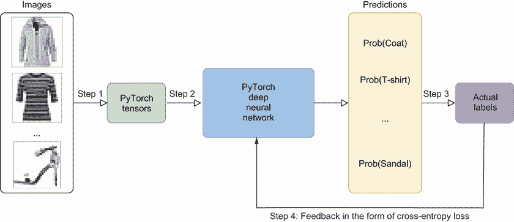
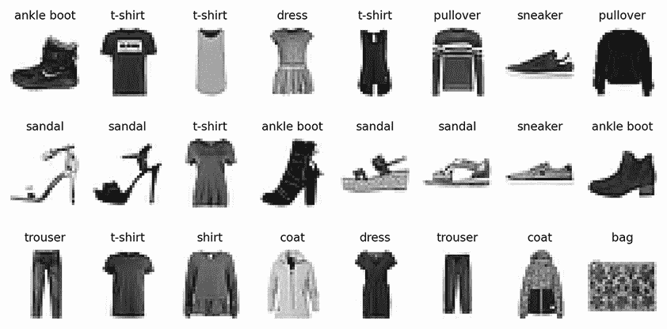
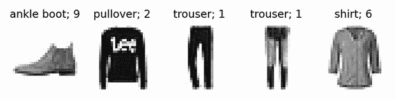

# 第二章：使用 PyTorch 进行深度学习

本章涵盖

+   PyTorch 张量和基本操作

+   为 PyTorch 中的深度学习准备数据

+   使用 PyTorch 构建和训练深度神经网络

+   使用深度学习进行二进制和多类别分类

+   创建验证集以决定训练停止点

在本书中，我们将使用深度神经网络生成各种内容，包括文本、图像、形状、音乐等。我假设你已经对机器学习（ML）有一个基础的了解，特别是人工神经网络。在本章中，我将回顾一些基本概念，如损失函数、激活函数、优化器和学习率，这些对于开发和管理深度神经网络至关重要。如果你在这些主题的理解上存在任何空白，我强烈建议你在继续本书的项目之前解决这些问题。附录 B 提供了所需的基本技能和概念的总结，包括人工神经网络的架构和训练。

注意：市面上有很多优秀的机器学习书籍供你选择。例如，包括《动手学习 Scikit-Learn、Keras 和 TensorFlow》（2019 年，O'Reilly）和《机器学习，动画》（2023 年，CRC 出版社）。这两本书都使用 TensorFlow 创建神经网络。如果你更喜欢使用 PyTorch 的书籍，我推荐《使用 PyTorch 的深度学习》（2020 年，Manning Publications）。

生成式 AI 模型经常面临二进制或多类别分类的任务。例如，在生成对抗网络（GANs）中，判别器扮演着二进制分类器的关键角色，其目的是区分生成器创建的假样本和训练集中的真实样本。同样，在文本生成模型的背景下，无论是循环神经网络还是 Transformer，其总体目标都是从大量可能性中预测下一个字符或单词（本质上是一个多类别分类任务）。

在本章中，你将学习如何使用 PyTorch 创建深度神经网络以执行二进制和多类别分类，以便你精通深度学习和分类任务。

具体来说，你将参与一个端到端的 PyTorch 深度学习项目，目标是将服装物品的灰度图像分类到不同的类别，如外套、包、运动鞋、衬衫等。目的是为你准备创建能够执行 PyTorch 中二进制和多类别分类任务的深度神经网络。这将使你为即将到来的章节做好准备，在这些章节中，你将使用 PyTorch 中的深度神经网络来创建各种生成模型。

为了训练生成式 AI 模型，我们利用各种数据格式，如原始文本、音频文件、图像像素和数字数组。在 PyTorch 中创建的深度神经网络不能直接以这些形式的数据作为输入。相反，我们必须首先将它们转换为神经网络理解和接受的形式。具体来说，你将把各种原始数据形式转换为 PyTorch 张量（用于表示和操作数据的基本数据结构），然后再将它们提供给生成式 AI 模型。因此，在本章中，你还将学习数据类型的基础知识、如何创建各种形式的 PyTorch 张量以及如何在深度学习中使用它们。

了解如何执行分类任务在我们的社会中有许多实际应用。分类在医疗保健中广泛用于诊断目的，例如确定患者是否患有特定疾病（例如，基于医学影像或测试结果，对特定癌症的阳性或阴性）。它们在许多商业任务中扮演着至关重要的角色（如股票推荐、信用卡欺诈检测等）。分类任务也是我们日常使用的许多系统和服务的核心，例如垃圾邮件检测和面部识别。

## 2.1 PyTorch 中的数据类型

本书将使用来自广泛来源和格式的数据集，深度学习的第一步是将输入转换为数字数组。

在本节中，你将了解 PyTorch 如何将不同格式的数据转换为称为 *张量* 的代数结构。张量可以表示为多维数字数组，类似于 NumPy 数组，但有几个关键区别，其中最重要的是能够进行 GPU 加速训练。根据其最终用途，存在不同类型的张量，你将学习如何创建不同类型的张量以及何时使用每种类型。我们将通过使用 46 位美国总统的高度作为示例来讨论 PyTorch 中的数据结构。

请参阅附录 A 中的说明，在计算机上创建虚拟环境并安装 PyTorch 和 Jupyter Notebook。在虚拟环境中打开 Jupyter Notebook 应用程序，并在新单元格中运行以下代码行：

```py
!pip install matplotlib
```

此命令将在你的计算机上安装 Matplotlib 库，使你能够在 Python 中绘制图像。

### 2.1.1 创建 PyTorch 张量

在训练深度神经网络时，我们以数字数组的形式向模型提供输入。根据生成模型试图创建的内容，这些数字有不同的类型。例如，在生成图像时，输入是介于 0 和 255 之间的整数形式的原始像素，但我们将它们转换为介于 –1 和 1 之间的浮点数；在生成文本时，有一个类似于字典的“词汇表”，输入是一个整数序列，告诉你单词对应字典中的哪个条目。

注意：本章代码以及本书其他章节的代码可在本书的 GitHub 仓库中找到：[`github.com/markhliu/DGAI`](https://github.com/markhliu/DGAI)。

假设您想使用 PyTorch 计算美国 46 位总统的平均身高。我们首先收集 46 位美国总统的身高（以厘米为单位），并将它们存储在一个 Python 列表中：

```py
heights = [189, 170, 189, 163, 183, 171, 185,
           168, 173, 183, 173, 173, 175, 178,
           183, 193, 178, 173, 174, 183, 183,
           180, 168, 180, 170, 178, 182, 180,
           183, 178, 182, 188, 175, 179, 183,
           193, 182, 183, 177, 185, 188, 188,
           182, 185, 191, 183]
```

这些数字按时间顺序排列：列表中的第一个值 189 表示美国第一任总统乔治·华盛顿身高 189 厘米。最后一个值显示乔·拜登的身高为 183 厘米。我们可以通过使用 PyTorch 中的 `tensor()` 方法将 Python 列表转换为 PyTorch 张量：

```py
import torch
heights_tensor = torch.tensor(heights,      ①
           dtype=torch.float64)             ②
```

① 将 Python 列表转换为 PyTorch 张量

② 在 PyTorch 张量中指定数据类型

我们在 `tensor()` 方法中使用 `dtype` 参数指定数据类型。PyTorch 张量的默认数据类型是 `float32`，即 32 位浮点数。在前面的代码单元中，我们将数据类型转换为 `float64`，双精度浮点数。`float64` 提供比 `float32` 更精确的结果，但计算时间更长。精度和计算成本之间存在权衡。使用哪种数据类型取决于手头的任务。

表 2.1 列出了不同的数据类型以及相应的 PyTorch 张量类型。这些包括具有不同精度的整数和浮点数。整数也可以是有符号或无符号的。

表 2.1 PyTorch 中的数据和张量类型

| PyTorch 张量类型 | `tensor()` 方法中的 dtype 参数 | 数据类型 |
| --- | --- | --- |
| `FloatTensor` | `torch.float32 or torch.float` | 32 位浮点数 |
| `HalfTensor` | `torch.float16 or torch.half` | 16 位浮点数 |
| `DoubleTensor` | `torch.float64 or torch.double` | 64 位浮点数 |
| `CharTensor` | `torch.int8` | 8 位整数（有符号） |
| `ByteTensor` | `torch.uint8` | 8 位整数（无符号） |
| `ShortTensor` | `torch.int16 or torch.short` | 16 位整数（有符号） |
| `IntTensor` | `torch.int32 or torch.int` | 32 位整数（有符号） |
| `LongTensor` | `torch.int64 or torch.long` | 64 位整数（有符号） |

您可以通过两种方式之一创建具有特定数据类型的张量。第一种方式是使用表 2.1 的第一列中指定的 PyTorch 类。第二种方式是使用 `torch.tensor()` 方法，并通过 `dtype` 参数指定数据类型（该参数的值列在表 2.1 的第二列中）。例如，要将 Python 列表 `[1, 2, 3]` 转换为包含 32 位整数的 PyTorch 张量，您可以在以下列表中的两种方法中选择一种。

列表 2.1 指定张量类型的两种方法

```py
t1=torch.IntTensor([1, 2, 3])    ①
t2=torch.tensor([1, 2, 3],
             dtype=torch.int)    ②
print(t1)
print(t2)
```

① 使用 torch.IntTensor() 指定张量类型

② 使用 dtype=torch.int 指定张量类型

这导致以下输出：

```py
tensor([1, 2, 3], dtype=torch.int32)
tensor([1, 2, 3], dtype=torch.int32)
```

练习 2.1

使用两种不同的方法将 Python 列表`[5, 8, 10]`转换为包含 64 位浮点数的 PyTorch 张量。请参考表 2.1 的第三行来回答这个问题。

许多时候，你需要创建一个所有值都为 0 的 PyTorch 张量。例如，在生成对抗网络（GANs）中，我们创建一个全零张量作为伪造样本的标签，正如你在第三章中将会看到的。PyTorch 中的`zeros()`方法可以生成具有特定形状的全零张量。在 PyTorch 中，张量是一个 n 维数组，其形状是一个元组，表示其每个维度的尺寸。以下代码行生成一个具有两行三列的全零张量：

```py
tensor1 = torch.zeros(2, 3)
print(tensor1)
```

输出结果如下

```py
tensor([[0., 0., 0.],
        [0., 0., 0.]])
```

该张量的形状为（2，3），这意味着该张量是一个 2D 数组；第一维有两个元素，第二维有三个元素。在这里，我们没有指定数据类型，输出默认数据类型为`float32`*

不时地，你需要创建一个所有值都为 1 的 PyTorch 张量。例如，在 GANs 中，我们创建一个全 1 张量作为真实样本的标签。在这里，我们使用`ones()`方法创建一个所有值都为 1 的 3D 张量：

```py
tensor2 = torch.ones(1,4,5)
print(tensor2)
```

输出结果如下

```py
tensor([[[1., 1., 1., 1., 1.],
         [1., 1., 1., 1., 1.],
         [1., 1., 1., 1., 1.],
         [1., 1., 1., 1., 1.]]])
```

我们已经生成了一个 3D PyTorch 张量。张量的形状为（1，4，5）。

练习 2.2

创建一个所有值为 0 的 3D PyTorch 张量。张量的形状为（2，3，4）。

你也可以在张量构造函数中使用 NumPy 数组代替 Python 列表：

```py
import numpy as np

nparr=np.array(range(10))
pt_tensor=torch.tensor(nparr, dtype=torch.int)
print(pt_tensor)
```

输出结果如下

```py
tensor([0, 1, 2, 3, 4, 5, 6, 7, 8, 9], dtype=torch.int32)
```

### 2.1.2 索引和切片 PyTorch 张量

我们使用方括号（`[ ]`）来索引和切片 PyTorch 张量，就像我们使用 Python 列表一样。索引和切片使我们能够对一个或多个张量元素进行操作，而不是对所有元素进行操作。为了继续我们关于 46 位美国总统身高的例子，如果我们想评估第三位总统托马斯·杰斐逊的身高，我们可以这样做：

```py
height = heights_tensor[2]
print(height)
```

这导致输出结果如下

```py
tensor(189., dtype=torch.float64)
```

输出结果显示，托马斯·杰斐逊的身高为 189 厘米。

我们可以使用负索引从张量的后端进行计数。例如，为了找到列表中倒数第二位总统唐纳德·特朗普的身高，我们使用索引-2：

```py
height = heights_tensor[-2]
print(height)
```

输出结果如下

```py
tensor(191., dtype=torch.float64)
```

输出结果显示，特朗普的身高为 191 厘米。

如果我们想知道`heights_tensor`张量中最近五位总统的身高怎么办？我们可以获取张量的一部分：

```py
five_heights = heights_tensor[-5:]
print(five_heights)
```

冒号（`:`）用于分隔起始和结束索引。如果没有提供起始索引，则默认为 0；如果没有提供结束索引，则包括张量中的最后一个元素（正如我们在前面的代码单元中所做的那样）。负索引意味着从后向前计数。输出结果如下

```py
tensor([188., 182., 185., 191., 183.], dtype=torch.float64)
```

结果显示，张量中的五位最近总统（克林顿、布什、奥巴马、特朗普和拜登）的身高分别为 188、182、185、191 和 183 厘米。

练习 2.3

使用切片从`heights_tensor`张量中获取前五位美国总统的身高。

### 2.1.3 PyTorch 张量形状

PyTorch 张量有一个名为*shape*的属性，它告诉我们张量的维度。了解 PyTorch 张量的形状非常重要，因为不匹配的形状会导致我们在操作它们时出错。例如，如果我们想找出张量`heights_tensor`的形状，我们可以这样做：

```py
print(heights_tensor.shape)
```

输出如下

```py
torch.Size([46])
```

这告诉我们`heights_tensor`是一个包含 46 个值的 1D 张量。

您还可以更改 PyTorch 张量的形状。要了解如何操作，让我们首先将高度从厘米转换为英尺。由于一英尺大约是 30.48 厘米，我们可以通过将张量除以 30.48 来完成此操作：

```py
heights_in_feet = heights_tensor / 30.48
print(heights_in_feet)
```

这导致以下输出（为了节省空间，我省略了一些值；完整的输出在本书的 GitHub 仓库中）：

```py
tensor([6.2008, 5.5774, 6.2008, 5.3478, 6.0039, 5.6102, 6.0696, …
        6.0039], dtype=torch.float64)
```

新的张量`heights_in_feet`用于存储以英尺为单位的高度。例如，张量中的最后一个值显示乔·拜登身高为 6.0039 英尺。

我们可以使用 PyTorch 中的`cat()`方法连接两个张量：

```py
heights_2_measures = torch.cat(
    [heights_tensor,heights_in_feet], dim=0)
print(heights_2_measures.shape)
```

`dim`参数在多种张量操作中用于指定要执行操作的维度。在前面的代码单元格中，`dim=0`表示我们沿着第一个维度连接两个张量。这导致以下输出：

```py
torch.Size([92])
```

结果张量是 1D 的，包含 92 个值，其中一些值以厘米为单位，其他以英尺为单位。因此，我们需要将其重塑为两行 46 列，以便第一行表示厘米单位的高度，第二行表示英尺单位的高度：

```py
heights_reshaped = heights_2_measures.reshape(2, 46)
```

新的张量`heights_reshaped`是 2D 的，形状为(2, 46)。我们可以使用方括号索引和切片多维张量。例如，为了打印出特朗普的身高（以英尺为单位），我们可以这样做：

```py
print(heights_reshaped[1,-2])
```

这导致以下结果

```py
tensor(6.2664, dtype=torch.float64)
```

命令`heights_reshaped[1,-2]`告诉 Python 查找第二行和倒数第二列的值，这返回了特朗普的身高，6.2664 英尺。

提示：引用张量内标量值所需的索引数量与张量的维度性相同。这就是为什么我们在 1D 张量`heights_tensor`中只使用一个索引来定位值，但在 2D 张量`heights_reshaped`中使用了两个索引来定位值。

练习 2.4

使用索引从张量`heights_reshaped`中获取乔·拜登的身高（以厘米为单位）。

### 2.1.4 PyTorch 张量上的数学运算

我们可以通过使用不同的方法如`mean()`、`median()`、`sum()`、`max()`等在 PyTorch 张量上执行数学运算。例如，为了找到 46 位总统的中位身高（以厘米为单位），我们可以这样做：

```py
print(torch.median(heights_reshaped[0,:]))
```

代码片段`heights_reshaped[0,:]`返回张量`heights_reshaped`的第一行和所有列。前面的代码行返回第一行中的中位值，这导致以下输出

```py
tensor(182., dtype=torch.float64)
```

这意味着美国总统的中位身高为 182 厘米。

要找到两行中的平均身高，我们可以在`mean()`方法中使用`dim=1`参数：

```py
print(torch.mean(heights_reshaped,dim=1))
```

`dim=1` 参数表示通过折叠列（索引为 1 的维度），实际上是在索引为 0 的维度（行）上计算平均值。输出是

```py
tensor([180.0652,   5.9077], dtype=torch.float64)
```

结果显示，两行中的平均值分别是 180.0652 厘米和 5.9077 英尺。

要找出最高的总统，我们可以这样做：

```py
values, indices = torch.max(heights_reshaped, dim=1)
print(values)
print(indices)
```

输出是

```py
tensor([193.0000,   6.3320], dtype=torch.float64)
tensor([15, 15])
```

`torch.max()`方法返回两个张量：一个包含最高总统身高的张量`values`（以厘米和英尺为单位），以及一个包含身高最高的总统索引的张量`indices`。结果显示，第 16 任总统（林肯）是最高的，身高为 193 厘米，或 6.332 英尺。

练习 2.5

使用`torch.min()`方法找出最矮的美国总统的索引和身高。

## 2.2 使用 PyTorch 的端到端深度学习项目

在接下来的几节中，你将通过 PyTorch 完成一个深度学习项目的示例，学习将服装物品的灰度图像分类为 10 种类型中的 1 种。在本节中，我们将首先提供一个涉及步骤的高级概述。然后，我们将讨论如何获取这个项目的训练数据以及如何预处理数据。

### 2.2.1 PyTorch 中的深度学习：高级概述

在这个项目中，我们的任务是创建并训练一个 PyTorch 深度神经网络，以对服装物品的灰度图像进行分类。图 2.1 提供了涉及步骤的示意图。



图 2.1 深度学习模型训练涉及的步骤

首先，我们将获取如图 2.1 左侧所示的灰度服装图像数据集。图像是原始像素，我们将它们转换为浮点数形式的 PyTorch 张量（步骤 1）。每张图像都附有标签。

然后，我们将在 PyTorch 中创建一个深度神经网络，如图 2.1 中心的所示。本书中的一些神经网络涉及卷积神经网络（CNNs）。对于这个简单的分类问题，我们目前只使用密集层。

我们将为多类别分类选择一个损失函数，交叉熵损失通常用于这项任务。交叉熵损失衡量预测概率分布与标签真实分布之间的差异。我们将在训练过程中使用 Adam 优化器（梯度下降算法的一种变体）来更新网络的权重。我们将学习率设置为 0.001。学习率控制模型权重在训练过程中相对于损失梯度的调整程度。

机器学习中的优化器

机器学习中的优化器是算法，根据梯度信息更新模型参数以最小化损失函数。随机梯度下降（SGD）是最基本的优化器，它使用基于损失梯度的简单更新。Adam 是最受欢迎的优化器，以其效率和即插即用的性能而闻名，因为它结合了自适应梯度算法（AdaGrad）和根均方传播（RMSProp）的优点。尽管它们有所不同，但所有优化器都旨在迭代调整参数以最小化损失函数，每个优化器都创建一条独特的优化路径以达到这一目标。

我们将把训练数据分成训练集和验证集。在机器学习中，我们通常使用验证集来提供模型的无偏评估，并选择最佳超参数，如学习率、训练 epoch 数等。验证集还可以用来避免模型过拟合，即模型在训练集中表现良好，但在未见过的数据上表现不佳。一个 epoch 是指所有训练数据被用来训练模型一次且仅一次。

在训练过程中，您将遍历训练数据。在正向传播过程中，您将图像通过网络以获得预测（步骤 2）并计算损失，通过比较预测标签与实际标签（步骤 3；见图 2.1 右侧）。然后，您将通过网络反向传播梯度以更新权重。这就是学习发生的地方（步骤 4），如图 2.1 底部所示。

您将使用验证集来确定何时停止训练。我们在验证集中计算损失。如果模型在固定数量的 epoch 后停止改进，我们认为模型已训练完成。然后，我们在测试集上评估训练好的模型，以评估其在将图像分类到不同标签方面的性能。

现在您已经对 PyTorch 中的深度学习有了高级概述，让我们深入到端到端项目吧！

### 2.2.2 数据预处理

在这个项目中，我们将使用 Fashion Modified National Institute of Standards and Technology (MNIST)数据集。在这个过程中，您将学习如何使用 Torchvision 库中的`datasets`和`transforms`包，以及 PyTorch 中的`Dataloader`包，这些包将帮助您在本书的其余部分。您将使用这些工具在本书中预处理数据。Torchvision 库提供了图像处理工具，包括流行的数据集、模型架构和深度学习应用中的常见图像转换。

我们首先导入所需的库并在`transforms`包中实例化一个`Compose()`类，以将原始图像转换为 PyTorch 张量。

列表 2.2 将原始图像数据转换为 PyTorch 张量

```py
import torch
import torch.nn as nn
import torchvision
import torchvision.transforms as T

torch.manual_seed(42)
transform=T.Compose([             ①
    T.ToTensor(),                 ②
    T.Normalize([0.5],[0.5])])    ③
```

① 将多个转换组合在一起

② 将图像像素转换为 PyTorch 张量

③ 将值归一化到范围[–1, 1]

我们使用 PyTorch 中的 `manual_seed()` 方法来固定随机状态，以便结果可重现。Torchvision 中的 *transforms* 包可以帮助创建一系列转换以预处理图像。`ToTensor()` 类将图像数据（无论是 Python Imaging Library (PIL) 图像格式还是 NumPy 数组）转换为 PyTorch 张量。特别是，图像数据是介于 0 到 255 之间的整数，而 `ToTensor()` 类将它们转换为介于 0.0 和 1.0 范围内的浮点张量。

`Normalize()` 类使用 *n* 个通道的平均值和标准差对张量图像进行归一化。Fashion MNIST 数据是服装项目的灰度图像，因此只有一个颜色通道。在本书的后面部分，我们将处理具有三个不同颜色通道（红色、绿色和蓝色）的图像。在先前的代码单元中，`Normalize([0.5],[0.5])` 表示从数据中减去 0.5，并将差值除以 0.5。结果图像数据范围从 –1 到 1。将输入数据归一化到 [–1, 1] 范围允许梯度下降在维度上保持更均匀的步长，这有助于在训练过程中更快地收敛。您将在本书中经常这样做。

注意：列表 2.2 中的代码仅定义了数据转换过程。它不执行实际的转换，这将在下一个代码单元中发生。

接下来，我们使用 Torchvision 中的 *datasets* 包将数据集下载到您的计算机上的一个文件夹，并执行转换：

```py
train_set=torchvision.datasets.FashionMNIST(    ①
    root=".",                                   ②
    train=True,                                 ③
    download=True,                              ④
    transform=transform)                        ⑤
test_set=torchvision.datasets.FashionMNIST(root=".",
    train=False,download=True,transform=transform)
```

① 下载哪个数据集

② 数据保存的位置

③ 训练或测试数据集

④ 是否将数据下载到您的计算机上

⑤ 执行数据转换

您可以打印出训练集中的第一个样本：

```py
print(train_set[0])
```

第一个样本包含一个具有 784 个值的张量和标签 9。784 个数字代表一个 28×28 的灰度图像（28 × 28 = 784），标签 9 表示这是一双短靴。您可能想知道：您如何知道标签 9 表示短靴？数据集中有 10 种不同的服装项目。数据集中的标签从 0 到 9 编号。您可以在网上搜索并找到 10 个类别的文本标签（例如，我在这里找到了文本标签 [`github.com/pranay414/Fashion-MNIST-Pytorch`](https://github.com/pranay414/Fashion-MNIST-Pytorch)）。`text_labels` 列表包含与数值标签 0 到 9 对应的 10 个文本标签。例如，如果数据集中的项目具有数值标签 0，则相应的文本标签是“T 恤”。`text_labels` 列表定义如下：

```py
text_labels=['t-shirt', 'trouser', 'pullover', 'dress', 'coat',
             'sandal', 'shirt', 'sneaker', 'bag', 'ankle boot']
```

我们可以绘制数据以可视化数据集中的服装项目。

列表 2.3 可视化服装项目

```py
!pip install matplotlib
import matplotlib.pyplot as plt

plt.figure(dpi=300,figsize=(8,4))
for i in range(24):
    ax=plt.subplot(3, 8, i + 1)                 ①
    img=train_set[i][0]                         ②
    img=img/2+0.5                               ③
    img=img.reshape(28, 28)                     ④
    plt.imshow(img,
               cmap="binary")
    plt.axis('off')
    plt.title(text_labels[train_set[i][1]],     ⑤
        fontsize=8)
plt.show()
```

① 图像放置的位置

② 从训练数据中获取第 i 个图像

③ 将值从 [–1,1] 转换为 [0,1]

④ 将图像重塑为 28×28

⑤ 为每张图像添加文本标签

图 2.2 中的图表显示了 24 种服装项目，如大衣、套头衫、凉鞋等。



图 2.2 Fashion MNIST 数据集中服装项目的灰度图像。

在接下来的两节中，你将学习如何使用 PyTorch 创建深度神经网络，以执行二进制和多类别分类问题。

## 2.3 二进制分类

在本节中，我们将首先为训练创建数据批次。然后，我们使用 PyTorch 构建一个深度神经网络用于此目的，并使用数据训练模型。最后，我们将使用训练好的模型进行预测并测试预测的准确性。二进制和多类别分类涉及到的步骤相似，但有几个显著的例外，我将在后面强调。

### 2.3.1 创建批次

我们将创建一个只包含两种服装类型（T 恤和踝靴）的训练集和测试集。（在本章后面讨论多类别分类时，你还将学习如何创建验证集以确定何时停止训练。）以下代码单元实现了该目标：

```py
binary_train_set=[x for x in train_set if x[1] in [0,9]]
binary_test_set=[x for x in test_set if x[1] in [0,9]]
```

我们只保留标签为 0 和 9 的样本，以创建一个具有平衡训练集的二进制分类问题。接下来，我们为训练深度神经网络创建批次。

列表 2.4 创建训练和测试的批次

```py
batch_size=64
binary_train_loader=torch.utils.data.DataLoader(
    binary_train_set,                                ①
    batch_size=batch_size,                           ②
    shuffle=True)                                    ③
binary_test_loader=torch.utils.data.DataLoader(
    binary_test_set,                                 ④
    batch_size=batch_size,shuffle=True)
```

① 为二进制训练集创建批次

② 每个批次中的样本数量

③ 在批量处理时打乱观察值

④ 为二进制测试集创建批次

PyTorch *utils* 包中的 `DataLoader` 类帮助批量创建数据迭代器。我们将批大小设置为 64。在列表 2.4 中，我们创建了两个数据加载器：用于二进制分类的训练集和测试集。在创建批次时，我们随机打乱观察值，以避免原始数据集中的相关性：如果数据加载器中的标签分布均匀，则训练将更加稳定。

### 2.3.2 构建和训练二进制分类模型

我们首先创建一个二进制分类模型。然后，我们使用 T 恤和踝靴的图像来训练模型。一旦训练完成，我们将看看模型能否区分 T 恤和踝靴。我们使用 PyTorch 的 `nn.Sequential` 类（在后面的章节中，你还将学习如何使用 `nn.Module` 类来创建 PyTorch 神经网络）创建以下神经网络。

列表 2.5 创建二进制分类模型

```py
import torch.nn as nn

device="cuda" if torch.cuda.is_available() else "cpu"  ①

binary_model=nn.Sequential(                            ②
    nn.Linear(28*28,256),                              ③
    nn.ReLU(),                                         ④
    nn.Linear(256,128),
    nn.ReLU(),
    nn.Linear(128,32),
    nn.ReLU(),
    nn.Linear(32,1),
    nn.Dropout(p=0.25),
    nn.Sigmoid()).to(device)                           ⑤
```

① PyTorch 自动检测是否有可用的 CUDA 启用 GPU。

② 在 PyTorch 中创建一个顺序神经网络

③ 线性层中的输入和输出神经元数量

④ 对层的输出应用 ReLU 激活函数

⑤ 应用 sigmoid 激活函数并将模型移动到可用的 GPU 上

PyTorch 中的`Linear()`类创建了对传入数据的线性变换。这实际上在神经网络中创建了一个密集层。输入形状是 784，因为我们稍后将 2D 图像展平成一个包含 28 × 28 = 784 个值的 1D 向量。我们将 2D 图像展平成一个 1D 张量，因为密集层只接受 1D 输入。在后面的章节中，你会看到当你使用卷积层时，不需要展平图像。网络中有三个隐藏层，分别包含 256、128 和 32 个神经元。256、128 和 32 这些数字的选择是相当随意的：将它们改为，比如说，300、200 和 50，不会影响训练过程。我们在三个隐藏层上应用了 ReLU 激活函数。ReLU 激活函数根据加权的总和决定是否激活神经元。这些函数向神经元的输出引入非线性，从而使网络能够学习输入和输出之间的非线性关系。ReLU 是除了极少数例外情况外你首选的激活函数，你将在后面的章节中遇到一些其他的激活函数。

模型的最后一层的输出包含一个单一值，我们使用 sigmoid 激活函数将数值压缩到[0, 1]的范围内，这样它可以被解释为该物体是踝靴的概率。通过互补概率，该物体是 T 恤。

在这里，我们设置学习率并定义优化器和损失函数：

```py
lr=0.001
optimizer=torch.optim.Adam(binary_model.parameters(),lr=lr)
loss_fn=nn.BCELoss()
```

我们将学习率设置为 0.001。设置学习率是一个经验问题，答案来自于经验。它也可以通过使用验证集进行超参数调整来确定。PyTorch 中的大多数优化器使用默认的学习率 0.001。Adam 优化器是梯度下降算法的一种变体，用于确定在每一步训练中应调整多少模型参数。Adam 优化器首次由 Diederik Kingma 和 Jimmy Ba 于 2014 年提出。1 在传统的梯度下降算法中，只考虑当前迭代的梯度。相比之下，Adam 优化器还考虑了之前迭代的梯度。

我们使用`nn.BCELoss()`，这是二元交叉熵损失函数。损失函数衡量 ML 模型的表现。模型的训练涉及调整参数以最小化损失函数。二元交叉熵损失函数在 ML 中广泛使用，尤其是在二元分类问题中。它衡量的是输出为 0 到 1 之间概率值的分类模型的表现。当预测概率偏离实际标签时，交叉熵损失会增加。

我们按照以下列表训练我们刚刚创建的神经网络。

列表 2.6 训练二元分类模型

```py
for i in range(50):                                    ①
    tloss=0
    for imgs,labels in binary_train_loader:            ②
        imgs=imgs.reshape(-1,28*28)                    ③
        imgs=imgs.to(device)
        labels=torch.FloatTensor(\
          [x if x==0 else 1 for x in labels])          ④
        labels=labels.reshape(-1,1).to(device)
        preds=binary_model(imgs)    
        loss=loss_fn(preds,labels)                     ⑤
        optimizer.zero_grad()
        loss.backward()                                ⑥
        optimizer.step()
        tloss+=loss.detach()
    tloss=tloss/n
    print(f"at epoch {i}, loss is {tloss}")
```

① 训练 50 个 epoch

② 遍历所有批次

③ 在将张量移动到 GPU 之前将图像展平

④ 将标签转换为 0 和 1

⑤ 计算损失

⑥ 反向传播

在 PyTorch 中训练深度学习模型时，`loss.backward()`计算损失相对于每个模型参数的梯度，从而实现反向传播，而`optimizer.step()`根据这些计算的梯度更新模型参数以最小化损失。为了简单起见，我们训练模型 50 个 epoch（一个 epoch 是指使用训练数据训练模型一次）。在下一节中，你将使用验证集和提前停止类来确定训练的 epoch 数。在二分类中，我们将目标标签标记为 0 和 1。由于我们只保留了标签为 0 和 9 的 T 恤和踝靴，我们在列表 2.6 中将它们转换为 0 和 1。因此，两种服装类别的标签分别为 0 和 1。

如果你使用 GPU 进行训练，这个过程可能需要几分钟。如果你使用 CPU 进行训练，则所需时间更长，但训练时间应该不到一小时。

### 2.3.3 测试二分类模型

训练好的二分类模型的预测结果是一个介于 0 和 1 之间的数字。我们将使用`torch.where()`方法将预测结果转换为 0 和 1：如果预测概率小于 0.5，我们将预测结果标记为 0；否则，我们将预测结果标记为 1。然后我们将这些预测结果与实际标签进行比较，以计算预测的准确率。在下面的列表中，我们使用训练好的模型对测试数据集进行预测。

列表 2.7 计算预测的准确率

```py
import numpy as np
results=[]
for imgs,labels in binary_test_loader:                     ①
    imgs=imgs.reshape(-1,28*28).to(device)
    labels=(labels/9).reshape(-1,1).to(device)
    preds=binary_model(imgs)
    pred10=torch.where(preds>0.5,1,0)                      ②
    correct=(pred10==labels)                               ③
    results.append(correct.detach().cpu()\
      .numpy().mean())                                     ④
accuracy=np.array(results).mean()                          ⑤
print(f"the accuracy of the predictions is {accuracy}")
```

① 遍历测试集中的所有批次

② 使用训练好的模型进行预测

③ 将预测与标签进行比较

④ 在批次中计算准确率

⑤ 在测试集中计算准确率

我们遍历测试集中所有批次的数据。训练好的模型会输出一个概率，表示图像是否为踝靴。然后我们根据 0.5 的截止值，使用`torch.where()`方法将概率转换为 0 或 1。转换后，预测结果要么是 0（即 T 恤），要么是 1（踝靴）。我们将预测结果与实际标签进行比较，看模型正确预测的次数。结果显示，在测试集中预测的准确率为 87.84%。

## 2.4 多分类分类

在本节中，我们将使用 PyTorch 构建一个深度神经网络来将服装项目分类到 10 个类别之一。然后我们将使用 Fashion MNIST 数据集训练模型。最后，我们将使用训练好的模型进行预测，并查看其准确率。我们首先创建一个验证集并定义一个提前停止类，以便我们可以确定何时停止训练。

### 2.4.1 验证集和提前停止

当我们构建和训练一个深度神经网络时，有许多超参数可以选择（例如学习率和训练的 epoch 数）。这些超参数影响模型的性能。为了找到最佳超参数，我们可以创建一个验证集来测试不同超参数下模型的性能。

为了给您一个例子，我们将在多类别分类中创建一个验证集，以确定训练的最佳 epoch 数。我们之所以在验证集而不是在训练集中这样做，是为了避免过拟合，即模型在训练集中表现良好，但在样本外测试（即未见过的数据）中表现不佳。

在这里，我们将训练数据集的 60,000 个观测值分为一个训练集和一个验证集：

```py
train_set,val_set=torch.utils.data.random_split(\
    train_set,[50000,10000])
```

原始训练集现在变成了两个集合：包含 50,000 个观测值的新训练集和包含剩余 10,000 个观测值的验证集。

我们使用 PyTorch *utils*包中的`DataLoader`类将训练集、验证集和测试集转换为三个数据迭代器，以批量形式：

```py
train_loader=torch.utils.data.DataLoader(
    train_set,    
    batch_size=batch_size,   
    shuffle=True)   
val_loader=torch.utils.data.DataLoader(
    val_set,    
    batch_size=batch_size,   
    shuffle=True)
test_loader=torch.utils.data.DataLoader(
    test_set,    
    batch_size=batch_size,   
    shuffle=True)
```

接下来，我们定义一个`EarlyStop()`类并创建该类的实例。

列表 2.8 `EarlyStop()`类用于确定何时停止训练

```py
class EarlyStop:
    def __init__(self, patience=10):         ①
        self.patience = patience
        self.steps = 0
        self.min_loss = float('inf')
    def stop(self, val_loss):                ②
        if val_loss < self.min_loss:         ③
            self.min_loss = val_loss
            self.steps = 0
        elif val_loss >= self.min_loss:      ④
            self.steps += 1
        if self.steps >= self.patience:
            return True
        else:
            return False
stopper=EarlyStop()
```

① 将 patience 的默认值设置为 10

② 定义了 stop()方法

③ 如果达到新的最小损失，则更新 min_loss 的值

④ 计算自上次最小损失以来的 epoch 数

`EarlyStop()`类用于确定验证集中的损失在最后`patience=10`个 epoch 中是否停止了改进。我们将`patience`参数的默认值设置为 10，但您在实例化类时可以选择不同的值。`patience`的值衡量了自上次模型达到最小损失以来您希望训练的 epoch 数。`stop()`方法记录最小损失和自最小损失以来的 epoch 数，并将该数字与`patience`的值进行比较。如果自最小损失以来的 epoch 数大于`patience`的值，则该方法返回`True`。

### 2.4.2 构建和训练一个多类别分类模型

Fashion MNIST 数据集包含 10 种不同的服装类别。因此，我们创建一个多类别分类模型来对它们进行分类。接下来，您将学习如何创建这样的模型并对其进行训练。您还将学习如何使用训练好的模型进行预测并评估预测的准确性。在下面的列表中，我们使用 PyTorch 创建多类别分类的神经网络。

列表 2.9 创建一个多类别分类模型

```py
model=nn.Sequential(
    nn.Linear(28*28,256),
    nn.ReLU(),
    nn.Linear(256,128),
    nn.ReLU(),
    nn.Linear(128,64),
    nn.ReLU(),
    nn.Linear(64,10)                         ①
    ).to(device)                             ②
```

① 输出层有 10 个神经元。

② 输出层不应用 softmax 激活

与上一节中我们创建的二分类模型相比，这里做了一些修改。首先，输出现在有 10 个值，代表数据集中 10 种不同的服装类型。其次，我们将最后一隐藏层的神经元数量从 32 改为 64。创建深度神经网络的一个经验法则是从一层到下一层逐渐增加或减少神经元数量。由于输出神经元的数量从二分类中的 1 增加到多类别分类中的 10，我们将第二到最后一层的神经元数量从 32 改为 64 以匹配增加。然而，64 这个数字并没有什么特殊之处：如果你在第二到最后一层使用，比如说，100 个神经元，你将得到相似的结果。

我们将使用 PyTorch 的`nn.CrossEntropyLoss()`类作为我们的损失函数，该函数将`nn.LogSoftmax()`和`nn.NLLLoss()`合并到一个单独的类中。有关详细信息，请参阅此处文档：[`mng.bz/pxd2`](https://mng.bz/pxd2)。特别是，文档中提到，“此标准计算输入 logits 和目标之间的交叉熵损失。”这解释了为什么我们在前面的列表中没有应用 softmax 激活。在本书的 GitHub 仓库中，我演示了如果我们使用`nn.LogSoftmax()`在模型中，并使用`nn.NLLLoss()`作为损失函数，我们将获得相同的结果。

因此，`nn.CrossEntropyLoss()`类将在对输出应用 softmax 激活函数之前，将 10 个数字压缩到[0, 1]的范围内进行对数运算。在二分类中，输出上首选的激活函数是 sigmoid，而在多类别分类中是 softmax。此外，softmax 激活后的 10 个数字加起来等于 1，这可以解释为对应于 10 种不同服装项目的概率。我们将使用与上一节二分类中相同的学习率和优化器。

```py
lr=0.001
optimizer=torch.optim.Adam(model.parameters(),lr=lr)
loss_fn=nn.CrossEntropyLoss()
```

我们定义`train_epoch()`如下：

```py
def train_epoch():
    tloss=0
    for n,(imgs,labels) in enumerate(train_loader):    
        imgs=imgs.reshape(-1,28*28).to(device)
        labels=labels.reshape(-1,).to(device)
        preds=model(imgs)    
        loss=loss_fn(preds,labels)
        optimizer.zero_grad()
        loss.backward()    
        optimizer.step()
        tloss+=loss.detach()
    return tloss/n
```

该函数用于训练模型一个 epoch。代码与我们之前在二分类中看到的是相似的，只是标签从 0 到 9，而不是两个数字（0 和 1）。

我们还定义了一个`val_epoch()`函数：

```py
def val_epoch():
    vloss=0
    for n,(imgs,labels) in enumerate(val_loader):    
        imgs=imgs.reshape(-1,28*28).to(device)
        labels=labels.reshape(-1,).to(device)
        preds=model(imgs)    
        loss=loss_fn(preds,labels)    
        vloss+=loss.detach()
    return vloss/n
```

该函数使用模型对验证集中的图像进行预测，并计算数据批次平均损失。

我们现在训练多类别分类器：

```py
for i in range(1,101):    
    tloss=train_epoch()
    vloss=val_epoch()
    print(f"at epoch {i}, tloss is {tloss}, vloss is {vloss}")
    if stopper.stop(vloss)==True:             
        break  
```

我们最多训练 100 个 epoch。在每个 epoch 中，我们首先使用训练集来训练模型。然后我们计算验证集中每个批次的平均损失。我们使用`EarlyStop()`类通过查看验证集中的损失来确定是否应该停止训练。如果损失在最后 10 个 epoch 中没有改善，则停止训练。经过 19 个 epoch 后，训练停止。

如果你使用 GPU 进行训练，训练大约需要 5 分钟，这比二分类中的训练过程要长，因为我们现在训练集中的观察结果更多（10 种服装而不是只有 2 种）。

模型的输出是一个包含 10 个数字的向量。我们使用`torch.argmax()`根据最高概率为每个观察结果分配一个标签。然后，我们将预测标签与实际标签进行比较。为了说明预测是如何工作的，让我们看看测试集中前五张图像的预测结果。

列表 2.10 在五张图像上测试训练好的模型

```py
plt.figure(dpi=300,figsize=(5,1))
for i in range(5):                                          ①
    ax=plt.subplot(1,5, i + 1)
    img=test_set[i][0]    
    label=test_set[i][1]
    img=img/2+0.5    
    img=img.reshape(28, 28)    
    plt.imshow(img, cmap="binary")
    plt.axis('off')
    plt.title(text_labels[label]+f"; {label}", fontsize=8)
plt.show()
for i in range(5):
    img,label = test_set[i]                                 ②
    img=img.reshape(-1,28*28).to(device)
    pred=model(img)                                         ③
    index_pred=torch.argmax(pred,dim=1)                     ④
    idx=index_pred.item()
    print(f"the label is {label}; the prediction is {idx}") ⑤ 
```

① 在测试集中绘制前五张图像及其标签

② 获取测试集中的第 i 张图像和标签

③ 使用训练好的模型进行预测

④ 使用 torch.argmax()方法获取预测标签

⑤ 打印出实际标签和预测标签

我们以 1 × 5 的网格形式绘制测试集中的前五种服装。然后，我们使用训练好的模型对每种服装进行预测。预测结果是一个包含 10 个值的张量。`torch.argmax()`方法返回张量中最高概率的位置，我们将其用作预测标签。最后，我们打印出实际标签和预测标签以进行比较，看看预测是否正确。运行前面的代码列表后，你应该会看到图 2.3 中的图像。



图 2.3 测试数据集中的前五种服装及其相应的标签。每种服装都有一个文本标签和一个介于 0 到 9 之间的数字标签。

图 2.3 显示了测试集中的前五种服装分别是踝靴、套头衫、裤子、裤子和外套，分别对应数字标签 9、2、1、1 和 6。

运行列表 2.10 中的代码后的输出如下：

```py
the label is 9; the prediction is 9
the label is 2; the prediction is 2
the label is 1; the prediction is 1
the label is 1; the prediction is 1
the label is 6; the prediction is 6
```

前面的输出显示，模型对所有五种服装都做出了正确的预测。

在 PyTorch 中固定随机状态

`torch.manual_seed()`方法固定随机状态，以便当你重新运行程序时结果相同。然而，即使你使用相同的随机种子，你也可能得到与本章中报告的不同结果。这是因为不同的硬件和不同的 PyTorch 版本在处理浮点运算时略有不同。例如，请参阅[`mng.bz/RNva`](https://mng.bz/RNva)中的解释。尽管如此，这种差异通常很小，因此无需惊慌。

接下来，我们计算在整个测试数据集上的预测准确率。

列表 2.11 测试训练好的多类别分类模型

```py
results=[]

for imgs,labels in test_loader:                             ①
    imgs=imgs.reshape(-1,28*28).to(device)
    labels=(labels).reshape(-1,).to(device)
    preds=model(imgs)                                       ②
    pred10=torch.argmax(preds,dim=1)                        ③
    correct=(pred10==labels)                                ④
    results.append(correct.detach().cpu().numpy().mean())

accuracy=np.array(results).mean()                           ⑤
print(f"the accuracy of the predictions is {accuracy}") 
```

① 遍历测试集中的所有批次

② 使用训练好的模型进行预测

③ 将概率转换为预测标签

④ 将预测标签与实际标签进行比较

⑤ 计算测试集中的准确率

输出是

```py
the accuracy of the predictions is 0.8819665605095541
```

我们遍历测试集中的所有服装项目，并使用训练好的模型进行预测。然后我们将预测结果与实际标签进行比较。在样本外测试中的准确率约为 88%。考虑到随机猜测的准确率约为 10%，88%的准确率相当高。这表明我们在 PyTorch 中构建并训练了两个成功的深度学习模型！你将在本书后面的内容中经常使用这些技能。例如，在第三章中，你将构建的判别网络本质上是一个二元分类模型，类似于本章中你创建的模型。

## 摘要

+   在 PyTorch 中，我们使用张量来存储各种形式的输入数据，以便我们可以将它们输入到深度学习模型中。

+   你可以对 PyTorch 张量进行索引和切片，重塑它们，并在它们上执行数学运算。

+   深度学习是一种使用深度人工神经网络来学习输入和输出数据之间关系的机器学习方法。

+   ReLU 激活函数根据加权总和决定是否应该激活神经元。它为神经元的输出引入了非线性。

+   损失函数衡量机器学习模型的性能。模型的训练涉及调整参数以最小化损失函数。

+   二元分类是一种将观察结果分类到两个类别之一的机器学习模型。

+   多类别分类是一种将观察结果分类到多个类别之一的机器学习模型。

* * *

^(1) 迪德里克·金卡马和吉米·巴，2014 年，“Adam：一种随机优化的方法。” [`arxiv.org/abs/1412.6980`](https://arxiv.org/abs/1412.6980).
