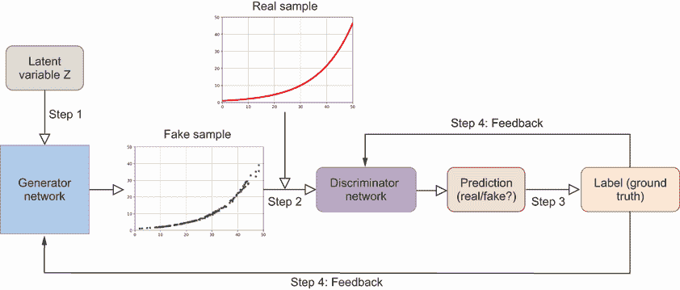
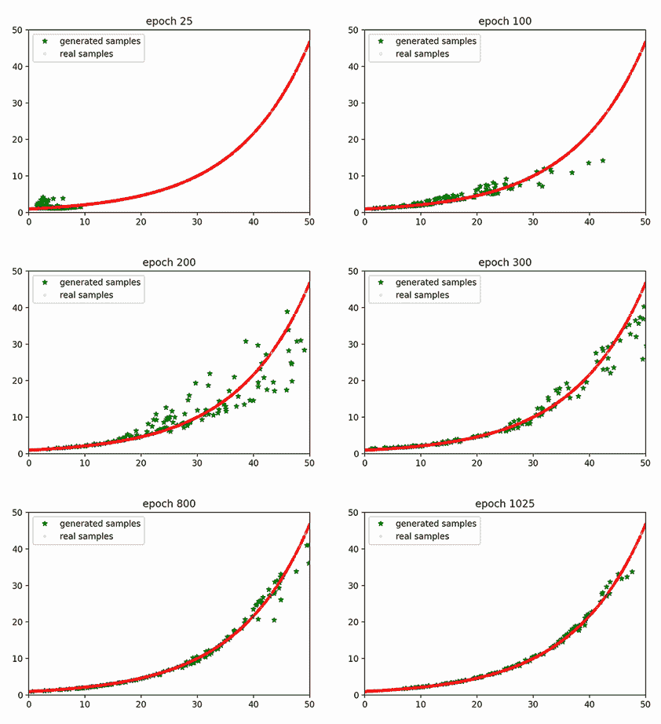

# 第三章：生成对抗网络：形状和数量生成

本章涵盖

+   从头开始构建生成对抗网络中的生成网络和判别网络

+   使用 GAN 生成数据点以形成形状（例如，指数增长曲线）

+   生成所有都是 5 的倍数的整数序列

+   训练、保存、加载和使用 GANs

+   评估 GAN 性能和确定训练停止点

本书近一半的生成模型属于一种称为生成对抗网络（GANs）的类别。这种方法最初由 Ian Goodfellow 及其合著者在 2014 年提出。1 GANs 因其易于实现和多功能性而备受赞誉，使那些连深度学习基础知识都相当有限的人也能从头开始构建自己的模型。GAN 中的“对抗”一词指的是两个神经网络在零和博弈框架中相互竞争的事实。生成网络试图创建与真实样本不可区分的数据实例。相比之下，判别网络试图从真实样本中识别出生成的样本。这些多才多艺的模型可以生成各种内容格式，从几何形状和数字序列到高分辨率彩色图像，甚至逼真的音乐作品。

在本章中，我们将简要回顾 GANs 背后的理论。然后，我将向您展示如何将这一知识应用于 PyTorch。您将学习从头开始构建您的第一个 GAN，以便所有细节都变得不再神秘。为了使示例更具相关性，想象您将 1 美元存入年利率为 8%的储蓄账户。您想根据您投资了多少年找出账户中的余额。真实的关系是一个指数增长曲线。您将学习如何使用 GAN 生成数据样本——形成这种指数增长曲线的值对（x, y），其数学关系为 y = 1.08^x。掌握这项技能后，您将能够生成模拟任何形状的数据：正弦、余弦、二次等。

在本章的第二个项目中，您将学习如何使用 GAN 生成一系列都是 5 的倍数的数字。但您可以将模式更改为 2、3、7 或其他模式。在这个过程中，您将学习如何从头开始创建生成网络和判别网络。您将学习如何训练、保存和使用 GAN。此外，您还将学习如何通过可视化生成网络生成的样本或通过测量生成样本分布与真实数据分布之间的差异来评估 GAN 的性能。

想象一下，你需要数据来训练一个机器学习（ML）模型以预测一对值（x，y）之间的关系。然而，准备训练数据集既昂贵又耗时。在这种情况下，生成对抗网络（GANs）非常适合生成数据：虽然 x 和 y 的生成值通常符合数学关系，但生成的数据中也有噪声。当使用生成的数据来训练 ML 模型时，噪声可以有助于防止过拟合。

本章的主要目标不一定是为了生成具有最实用用途的新颖内容。相反，我的目标是教你如何从头开始训练和使用 GANs 创建各种格式的内 容。在这个过程中，你将获得对 GANs 内部运作的坚实基础。这个基础将使我们能够在后续章节中集中精力在其他更高级的 GANs 方面，例如生成高分辨率图像或听起来逼真的音乐（例如，卷积神经网络或如何将音乐表示为多维对象）。

## 3.1 训练 GANs 所涉及的步骤

在第一章中，你获得了 GANs 背后理论的概览。在本节中，我将总结训练 GANs 的步骤，特别是创建数据点以形成指数增长曲线的步骤。

让我们回到先前的例子：你计划投资一个年利率为 8% 的储蓄账户。你今天将 $1 存入账户，并想知道未来账户中会有多少钱。

未来你账户中的金额，y，取决于你投资储蓄账户的时间长短。让我们用 x 表示你投资年数，它可以是介于 0 到 50 之间的数字。例如，如果你投资 1 年，余额是 $1.08；如果你投资 2 年，余额是 1.08² = $1.17。为了概括，x 和 y 之间的关系是 y = 1.08^x。这个函数描绘了一个指数增长曲线。请注意，x 可以是整数，如 1 或 2，也可以是小数，如 1.14 或 2.35，公式仍然适用。

训练 GANs 生成符合特定数学关系的数据点，如前面的例子，是一个多步骤的过程。在你的情况下，你想要生成数据点（x，y），使得 y = 1.08^x。图 3.1 提供了 GANs 架构和生成指数增长曲线的步骤图。当你生成其他内容，如整数序列、图像或音乐时，你将遵循类似的步骤，正如你将在本章的第二项目中看到的那样，以及在本书中稍后其他 GAN 模型中。



图 3.1 训练 GAN 生成指数增长曲线的步骤以及 GAN 中的双网络架构。生成器从潜在空间（左上角）获取一个随机噪声向量 Z，以创建一个假样本并将其展示给判别器（中间）。判别器将样本分类为真实（来自训练集）或假（由生成器创建）。预测结果与真实值进行比较，判别器和生成器都会从预测结果中学习。经过多次训练迭代后，生成器学会创建与真实样本难以区分的形状。

在开始之前，我们需要获得一个训练数据集来训练 GAN。在我们的示例中，我们将使用数学关系 y = 1.08^x 生成一个(x, y)对的集合。我们使用储蓄账户的例子，以便数字更容易理解。本章中你学到的技术可以应用于其他形状：正弦、余弦、U 形等。你可以选择一个 x 值的范围（比如，0 到 50）并计算相应的 y 值。由于我们通常在深度学习中以数据批次的形式训练模型，因此训练数据集中的观测数通常设置为批次大小的倍数。一个真实样本位于图 3.1 的顶部，具有指数增长曲线的形状。

一旦准备好了训练集，你需要在 GAN 中创建两个网络：一个生成器和判别器。生成器位于图 3.1 的左下角，它以一个随机噪声向量 Z 作为输入并生成数据点（我们训练循环的第 1 步）。生成器使用的随机噪声向量 Z 来自潜在空间，这代表了 GAN 可以产生的可能输出范围，并且对于 GAN 生成多样化的数据样本的能力至关重要。在第五章中，我们将探索潜在空间以选择生成器创建的内容的属性。判别器位于图 3.1 的中心，它评估给定的数据点(x, y)是真实（来自训练数据集）还是假（由生成器创建）；这是我们训练循环的第 2 步。

潜在空间的意义

GAN 中的潜在空间是一个概念空间，其中每个点都可以通过生成器转换成一个真实的数据实例。这个空间代表了 GAN 可以产生的可能输出范围，并且对于 GAN 生成多样化和复杂数据的能力至关重要。潜在空间只有在与生成模型结合使用时才具有其重要性。在这个背景下，可以在潜在空间中的点之间进行插值，以影响输出的属性，我们将在第五章中讨论这一点。

要知道如何调整模型参数，我们必须选择正确的损失函数。我们需要为生成器和判别器定义损失函数。损失函数鼓励生成器生成类似于训练数据集数据点的数据点，使判别器将它们分类为真实。损失函数鼓励判别器正确分类真实和生成数据点。

在训练循环的每一次迭代中，我们交替训练判别器和生成器。在每次训练迭代中，我们从训练数据集中采样一批真实的数据点（x, y）和一批由生成器生成的虚假数据点。当训练判别器时，我们比较判别模型（它是一个样本来自训练集的概率）的预测与真实值，真实值为 1（如果样本是真实的）和 0（如果样本是虚假的）（如图 3.1 右侧所示）；这构成了训练循环中的第 3 步的一半。我们稍微调整判别器网络中的权重，以便在下一个迭代中，预测概率更接近真实值（这是我们的训练循环中第 4 步的一半）。

当训练生成器时，我们将虚假样本输入到判别模型中，并获得样本是真实的概率（第 3 步的另一半）。然后我们稍微调整生成器网络中的权重，以便在下一个迭代中，预测概率更接近 1（因为生成器想要创建样本来欺骗判别器，使其认为它们是真实的）；这构成了第 4 步的另一半。我们重复这个过程多次迭代，使生成器网络创建更真实的数据点。

一个自然的问题是何时停止训练 GANs。为此，你通过生成一组合成数据点并将其与训练数据集中的真实数据点进行比较来评估 GAN 的性能。在大多数情况下，我们使用可视化技术来评估生成的数据与所需关系的一致性。然而，在我们的运行示例中，由于我们知道训练数据的分布，我们可以计算生成数据与真实数据分布之间的均方误差（MSE）。当在固定数量的训练轮次后，生成的样本停止提高其质量时，我们停止训练 GANs。

到这一点，模型被认为是训练好的。然后我们丢弃判别器，保留生成器。为了创建指数增长曲线，我们将随机噪声向量 Z 输入到训练好的生成器中，并获取(x, y)对以形成所需的形状。

## 3.2 准备训练数据

在本节中，你将创建训练数据集，以便你可以使用它来训练本章后面的 GAN 模型。具体来说，你将创建符合指数增长形状的数据点对(x, y)。你将将它们放入批次中，以便它们可以准备好输入到深度神经网络中。

注意：本章以及本书其他章节的代码可在本书的 GitHub 仓库中找到：[`github.com/markhliu/DGAI`](https://github.com/markhliu/DGAI)。

### 3.2.1 形成指数增长曲线的训练数据集

我们将创建一个包含许多数据对观察结果的数据集，即 (x, y)，其中 x 在区间 [0, 50] 内均匀分布，y 根据公式 y = 1.08^x 与 x 相关，如下所示。

列表 3.1 创建训练数据以形成指数增长形状

```py
import torch

torch.manual_seed(0)                                ①

observations = 2048

train_data = torch.zeros((observations, 2))         ②

train_data[:,0]=50*torch.rand(observations)         ③

train_data[:,1]=1.08**train_data[:,0]               ④
```

① 固定随机状态以确保结果可重现

② 创建一个具有 2,048 行和 2 列的张量

③ 生成 0 到 50 之间的 x 的值

④ 根据关系 y = 1.08^x 生成 y 的值

首先，我们使用 `torch.rand()` 方法创建 0 到 50 之间 2,048 个 x 的值。我们使用 PyTorch 中的 `manual_seed()` 方法固定随机状态，以确保所有结果都是可重现的。我们首先创建一个具有 2,048 行和 2 列的 PyTorch 张量 `train_data`。x 的值放置在张量 `train_data` 的第一列中。PyTorch 中的 `rand()` 方法生成介于 0.0 和 1.0 之间的随机值。通过将值乘以 50，得到的 x 的值介于 0.0 和 50.0 之间。然后，我们将 y = 1.08^x 的值填充到 `train_data` 的第二列中。

练习 3.1

将列表 3.1 修改为使用 `torch.sin()` 函数，使 x 和 y 之间的关系为 y = sin(x)。通过以下代码行设置 x 的值为 -5 到 5：`train_data[:,0]=10*(torch.rand(observations)-0.5)`。

我们使用 Matplotlib 库绘制 x 和 y 之间的关系。

列表 3.2 可视化 x 和 y 之间的关系

```py
import matplotlib.pyplot as plt

fig=plt.figure(dpi=100,figsize=(8,6))
plt.plot(train_data[:,0],train_data[:,1],".",c="r")    ①
plt.xlabel("values of x",fontsize=15)
plt.ylabel("values of $y=1.08^x$",fontsize=15)         ②
plt.title("An exponential growth shape",fontsize=20)   ③
plt.show()
```

① 绘制 x 和 y 之间的关系

② 标记 y 轴

③ 为图表创建标题

运行列表 3.2 后，您将看到一个指数增长曲线形状，类似于图 3.1 中的顶部图表。

练习 3.2

根据练习 3.1 中的更改，修改列表 3.2 以根据 x 和 y = sin(x) 的关系绘制图表。确保您更改图表中的 y 轴标签和标题，以反映您所做的更改。

### 3.2.2 准备训练数据集

我们将把您刚刚创建的数据样本放入批次中，以便我们可以将它们输入到判别网络中。我们使用 PyTorch 中的 `DataLoader()` 类将可迭代对象包装在训练数据集周围，这样我们就可以在训练过程中轻松访问样本，如下所示：

```py
from torch.utils.data import DataLoader

batch_size=128
train_loader=DataLoader(
    train_data,
    batch_size=batch_size,
    shuffle=True)
```

确保您选择观察总数和批量大小，以便所有批次中的样本数量相同。我们选择了 2,048 个观察结果和 128 的批量大小。因此，我们有 2,048/128 = 16 个批次。`DataLoader()` 中的 `shuffle=True` 参数在将观察结果分成批次之前随机打乱观察结果。

注意：打乱数据确保数据样本均匀分布，并且批次内的观察结果不相关，这反过来又稳定了训练。在这个特定示例中，打乱确保 x 的值在 0 到 50 之间随机分布，而不是聚集在某个范围内，比如 0 到 5 之间。

你可以通过使用`next()`和`iter()`方法来访问一批数据，如下所示：

```py
batch0=next(iter(train_loader))
print(batch0)
```

你将看到 128 对数字（x, y），其中 x 的值在 0 到 50 之间随机分布。此外，每对中的 x 和 y 的值符合关系 y = 1.08^x。

## 3.3 创建 GANs

现在训练数据集已经准备好了，我们将创建一个判别网络和一个生成网络。判别网络是一个二元分类器，这与我们在第二章中创建和训练的服装物品二元分类器非常相似。在这里，判别网络的职责是将样本分类为真实或伪造。另一方面，生成网络试图创建与训练集中那些不可区分的数据点（x, y），以便判别器将它们分类为真实。

### 3.3.1 判别网络

我们使用 PyTorch 创建判别神经网络。我们将使用带有`ReLU`激活的全连接（密集）层。我们还将使用 dropout 层来防止过拟合。我们在 PyTorch 中创建一个顺序深度神经网络来表示判别器，如下所示。

列表 3.3 创建判别网络

```py
import torch.nn as nn

device="cuda" if torch.cuda.is_available() else "cpu"    ①

D=nn.Sequential(
    nn.Linear(2,256),                                    ②
    nn.ReLU(),
    nn.Dropout(0.3),                                     ③
    nn.Linear(256,128),
    nn.ReLU(),
    nn.Dropout(0.3),
    nn.Linear(128,64),
    nn.ReLU(),
    nn.Dropout(0.3),
    nn.Linear(64,1),                                     ④
    nn.Sigmoid()).to(device)
```

① 自动检查 CUDA 启用 GPU 是否可用。

② 第一层的输入特征数是 2，与每个数据实例中的元素数量相匹配，每个数据实例有两个值，x 和 y。

③ dropout 层可以防止过拟合。

④ 最后层的输出特征数是 1，这样我们就可以将其压缩到 0 到 1 之间的值。

确保在第一层中，输入形状是 2，因为在我们这个示例中，每个数据实例中包含两个值：x 和 y。第一层的输入数量应始终与输入数据的大小相匹配。同时，确保最后一层的输出特征数是 1：判别网络的输出是一个单一值。我们使用 sigmoid 激活函数将输出压缩到[0, 1]的范围内，以便它可以被解释为样本是真实的概率，p。使用互补概率 1 – p，样本是伪造的。这与我们在第二章中做的非常相似，当时二元分类器试图识别一件服装物品是长靴还是 T 恤。

隐藏层分别包含 256、128 和 64 个神经元。这些数字并没有什么神奇之处，只要在合理的范围内，你可以轻松地更改它们，并得到相似的结果。如果隐藏层中的神经元数量过多，可能会导致模型过拟合；如果数量过少，可能会导致模型欠拟合。可以通过使用验证集和超参数调整来单独优化神经元数量。

Dropout 层随机地使应用到的层中的某些神经元失效（或“丢弃”）。这意味着这些神经元在训练过程中不参与正向或反向传播。当模型不仅学习到训练数据中的潜在模式，还学习到噪声和随机波动时，就会发生过拟合，导致在未见过的数据上表现不佳。Dropout 层是防止过拟合的有效方法.^(2)

### 3.3.2 生成器网络

生成器的任务是创建一对数字（x，y），以便它可以通过判别器的筛选。也就是说，生成器试图创建一对数字，以最大化判别器认为这些数字来自训练数据集（即，它们符合关系 y = 1.08^x）的概率。我们以下列表中的神经网络来表示生成器。

列表 3.4 创建生成器网络

```py
G=nn.Sequential(
    nn.Linear(2,16),               ①
    nn.ReLU(),
    nn.Linear(16,32),
    nn.ReLU(),
    nn.Linear(32,2)).to(device)    ②
```

① 第一层的输入特征数量为 2，与来自潜在空间的随机噪声向量的维度相同。

② 最后层的输出特征数量为 2，与数据样本的维度相同，包含两个值（x，y）。

我们将来自二维潜在空间（z[1]，z[2]）的随机噪声向量输入到生成器中。然后，生成器根据潜在空间的输入生成一对值（x，y）。在这里，我们使用二维潜在空间，但将维度更改为其他数字，如 5 或 10，不会影响我们的结果。

### 3.3.3 损失函数、优化器和早停

由于判别器网络本质上执行的是二元分类任务（识别数据样本为真实或假），因此我们为判别器网络使用二元交叉熵损失函数，这是二元分类中首选的损失函数。判别器试图最大化二元分类的准确性：将真实样本识别为真实，将假样本识别为假。判别器网络中的权重根据损失函数相对于权重的梯度进行更新。

生成器试图最小化假样本被识别为假样本的概率。因此，我们也将使用二元交叉熵损失函数来训练生成器网络：生成器更新其网络权重，使得生成的样本在二元分类问题中被判别器分类为真实样本。

正如我们在第二章中所做的那样，我们使用 Adam 优化器作为梯度下降算法。我们将学习率设置为 0.0005。让我们通过使用 PyTorch 来实现这些步骤：

```py
loss_fn=nn.BCELoss()
lr=0.0005
optimD=torch.optim.Adam(D.parameters(),lr=lr)
optimG=torch.optim.Adam(G.parameters(),lr=lr)
```

在我们进行实际训练之前，还有一个问题：我们应该训练多少个 epoch？我们如何知道模型已经很好地训练，以至于生成器可以创建可以模仿指数增长曲线形状的样本？如果你还记得，在第二章中，我们将训练集进一步分为训练集和验证集。然后我们使用验证集中的损失来确定参数是否收敛，以便我们可以停止训练。然而，GANs 的训练方法与传统监督学习模型（如你在第二章中看到的分类模型）不同。由于生成样本的质量在整个训练过程中都在提高，判别器的任务变得越来越困难（在某种程度上，GANs 中的判别器是在对一个移动目标进行预测）。判别器网络的损失并不是模型质量的良好指标。

测量 GANs 性能的一种常见方法是通过视觉检查。人类可以通过简单地查看它们来评估生成数据实例的质量和真实性。这是一种定性方法，但可以提供非常有价值的信息。但在我们的简单案例中，因为我们知道训练数据集的确切分布，我们将查看生成样本相对于训练集中样本的均方误差（MSE），并将其用作生成器性能的衡量标准。让我们用代码来实现这一点：

```py
mse=nn.MSELoss()                              ①

def performance(fake_samples):
    real=1.08**fake_samples[:,0]              ②
    mseloss=mse(fake_samples[:,1],real)       ③
    return mseloss
```

① 使用 MSE 作为衡量性能的标准

② 找出真实分布

③ 将生成的分布与真实分布进行比较，并计算 MSE

如果生成器的性能在 1,000 个 epoch 内没有提高，我们将停止训练模型。因此，我们定义了一个早期停止类，就像我们在第二章中所做的那样，以决定何时停止训练模型。

列表 3.5 一个早期停止类，用于决定何时停止训练

```py
class EarlyStop:
    def __init__(self, patience=1000):       ①
        self.patience = patience
        self.steps = 0
        self.min_gdif = float('inf')
    def stop(self, gdif):                    ②
        if gdif < self.min_gdif:             ③
            self.min_gdif = gdif
            self.steps = 0
        elif gdif >= self.min_gdif:
            self.steps += 1
        if self.steps >= self.patience:      ④
            return True
        else:
            return False

stopper=EarlyStop()
```

① 将耐心（patience）的默认值设置为 1000

② 定义 stop() 方法

③ 当达到生成分布和真实分布之间新的最小差异时，更新 min_gdif 的值。

④ 如果模型在 1,000 个 epoch 内停止改进，则停止训练

这样，我们就拥有了训练我们的 GANs 所需的所有组件，我们将在下一节中进行训练。 

## 3.4 使用 GANs 进行形状生成训练和利用

现在我们有了训练数据和两个网络，我们将训练模型。之后，我们将丢弃判别器，并使用生成器生成数据点以形成指数增长曲线形状。

### 3.4.1 GANs 的训练

我们首先为真实样本和假样本分别创建标签。具体来说，我们将所有真实样本标记为 1，所有假样本标记为 0。在训练过程中，判别器将其自己的预测与标签进行比较，以获得反馈，以便它可以调整模型参数，在下一个迭代中做出更好的预测。

在这里，我们定义了两个张量，`real_labels` 和 `fake_labels`：

```py
real_labels=torch.ones((batch_size,1))
real_labels=real_labels.to(device)

fake_labels=torch.zeros((batch_size,1))
fake_labels=fake_labels.to(device)
```

张量 `real_labels` 是一个形状为 `(batch_size, 1)` 的二维张量——即 128 行和 1 列。我们使用 128 行，因为我们将会向判别网络提供 128 个真实样本以获得 128 个预测。同样，张量 `fake_labels` 也是一个形状为 `(batch_size, 1)` 的二维张量。我们将向判别网络提供 128 个假样本以获得 128 个预测，并将它们与真实标签：128 个 0 进行比较。如果你的计算机具有启用 CUDA 的 GPU，我们将这两个张量移动到 GPU 上以实现快速训练。

为了训练 GANs，我们定义了一些函数，以便训练循环看起来更有组织。第一个函数 `train_D_on_real()` 使用一批真实样本来训练判别网络。

列表 3.6 定义 `train_D_on_real()` 函数

```py
def train_D_on_real(real_samples):
    real_samples=real_samples.to(device)
    optimD.zero_grad()
    out_D=D(real_samples)                    ①
    loss_D=loss_fn(out_D,real_labels)        ②
    loss_D.backward()
    optimD.step()                            ③
    return loss_D
```

① 对真实样本进行预测

② 计算损失

③ 反向传播（即更新判别网络中的模型权重，以便在下一个迭代中做出更准确的预测）

函数 `train_D_on_real()` 首先将真实样本移动到 GPU 上，如果计算机具有启用 CUDA 的 GPU。判别网络 D 对样本批次进行预测。然后模型将判别器的预测 `out_D` 与真实标签 `real_labels` 进行比较，并相应地计算预测的损失。`backward()` 方法计算损失函数相对于模型参数的梯度。`step()` 方法调整模型参数（即反向传播）。`zero_grad()` 方法表示我们在反向传播之前显式地将梯度设置为 0。否则，在每次 `backward()` 调用中都会使用累积的梯度而不是增量梯度。

TIP 在训练每个数据批次时更新模型权重之前，我们调用 `zero_grad()` 方法。我们在反向传播之前显式地将梯度设置为 0，以使用增量梯度而不是在每次 `backward()` 调用中累积的梯度。

第二个函数 `train_D_on_fake()` 使用一批假样本来训练判别网络。

列表 3.7 定义 `train_D_on_fake()` 函数

```py
def train_D_on_fake():
    noise=torch.randn((batch_size,2))
    noise=noise.to(device)
    fake_samples=G(noise)                    ①
    optimD.zero_grad()
    out_D=D(fake_samples)                    ②
    loss_D=loss_fn(out_D,fake_labels)        ③
    loss_D.backward()
    optimD.step()                            ④
    return loss_D
```

① 生成一批假样本

② 对假样本进行预测

③ 计算损失

④ 反向传播

函数`train_D_on_fake()`首先将来自潜在空间的一批随机噪声向量输入到生成器中，以获得一批假样本。然后，该函数将假样本展示给判别器以获取预测结果。该函数将判别器的预测结果`out_D`与真实标签`fake_labels`进行比较，并相应地计算预测的损失。最后，它根据损失函数相对于模型权重的梯度调整模型参数。

注意：我们互换使用术语*权重*和*参数*。严格来说，模型参数还包括偏置项，但我们使用术语*模型权重*来松散地包括模型偏置。同样，我们互换使用术语*调整权重*、*调整参数*和*反向传播*。

第三个函数`train_G()`使用一批假样本训练生成器网络。

列表 3.8 定义`train_G()`函数

```py
def train_G(): 
    noise=torch.randn((batch_size,2))
    noise=noise.to(device)
    optimG.zero_grad()
    fake_samples=G(noise)                     ①
    out_G=D(fake_samples)                     ②
    loss_G=loss_fn(out_G,real_labels)         ③
    loss_G.backward()
    optimG.step()                             ④
    return loss_G, fake_samples 
```

① 创建一批假样本

② 向判别器展示假样本以获取预测结果

③ 根据 G 是否成功计算损失

④ 反向传播（即更新生成器网络中的权重，以便在下一迭代中生成的样本更加逼真）

为了训练生成器，我们首先将来自潜在空间的一批随机噪声向量输入到生成器中，以获得一批假样本。然后，我们将这些假样本展示给判别器网络以获取一批预测结果。我们比较判别器的预测结果与`real_labels`（一个全为 1 的张量）进行比较，并计算损失。使用全为 1 的张量而不是全为 0 的张量作为标签非常重要，因为生成器的目标是欺骗判别器，使其认为假样本是真实的。最后，我们根据损失函数相对于模型权重的梯度调整模型参数，以便在下一迭代中，生成器可以创建更加逼真的样本。

注意：在计算损失和评估生成器网络时，我们使用`real_labels`（一个全为 1 的张量）而不是`fake_labels`（一个全为 0 的张量），因为生成器希望判别器将假样本预测为真实样本。

最后，我们定义了一个函数`test_epoch()`，该函数定期打印出判别器和生成器的损失。此外，它绘制了生成器生成的数据点，并将它们与训练集中的数据点进行比较。`test_epoch()`函数的代码如下所示。

列表 3.9 定义`test_epoch()`函数

```py
import os
os.makedirs("files", exist_ok=True)                           ①

def test_epoch(epoch,gloss,dloss,n,fake_samples):
    if epoch==0 or (epoch+1)%25==0:
        g=gloss.item()/n
        d=dloss.item()/n
        print(f"at epoch {epoch+1}, G loss: {g}, D loss {d}") ②
        fake=fake_samples.detach().cpu().numpy()
        plt.figure(dpi=200)
        plt.plot(fake[:,0],fake[:,1],"*",c="g",
            label="generated samples")                        ③
        plt.plot(train_data[:,0],train_data[:,1],".",c="r",
            alpha=0.1,label="real samples")                   ④
        plt.title(f"epoch {epoch+1}")
        plt.xlim(0,50)
        plt.ylim(0,50)
        plt.legend()
        plt.savefig(f"files/p{epoch+1}.png")
        plt.show()
```

① 创建一个文件夹来存放文件

② 定期打印出损失

③ 将生成的点以星号（*）的形式绘制出来

④ 将训练数据以点（.）的形式绘制出来

每过 25 个周期，函数会在该周期打印出生成器和判别器的平均损失。此外，它还会绘制生成器生成的一批假数据点（用星号表示）并与训练集中的数据点（用点表示）进行比较。该图被保存为图像保存在你的本地文件夹 /files/ 中。

现在我们已经准备好训练模型了。我们遍历训练数据集中的所有批次。对于每一批数据，我们首先使用真实样本来训练判别器。之后，生成器创建一批假样本，我们再次使用这些样本来训练判别器。最后，我们让生成器再次创建一批假样本，但这次，我们使用它们来训练生成器。我们训练模型直到满足早期停止条件，如下所示。

列表 3.10 训练生成指数增长曲线的 GAN

```py
for epoch in range(10000):                                  ①
    gloss=0
    dloss=0
    for n, real_samples in enumerate(train_loader):         ②
        loss_D=train_D_on_real(real_samples)
        dloss+=loss_D
        loss_D=train_D_on_fake()
        dloss+=loss_D
        loss_G,fake_samples=train_G()
        gloss+=loss_G
    test_epoch(epoch,gloss,dloss,n,fake_samples)            ③
    gdif=performance(fake_samples).item()
    if stopper.stop(gdif)==True:                            ④
        break
```

① 开始训练循环

② 遍历训练数据集中的所有批次

③ 定期展示生成的样本

④ 确定是否停止训练

如果你使用 GPU 训练，训练可能需要几分钟。否则，可能需要 20 到 30 分钟，具体取决于你电脑的硬件配置。或者，你可以从本书的 GitHub 仓库下载训练好的模型：[`github.com/markhliu/DGAI`](https://github.com/markhliu/DGAI)。

经过 25 个训练周期后，生成的数据点围绕点 (0,0) 散布，并没有形成任何有意义的形状（一个周期是指所有训练数据被用于训练一次）。经过 200 个训练周期后，数据点开始形成指数增长曲线的形状，尽管许多点远离由训练集点形成的虚线曲线。经过 1,025 个训练周期后，生成的点与指数增长曲线非常吻合。图 3.2 提供了六个不同周期的输出子图。我们的 GAN 工作得非常好：生成器能够生成形成所需形状的数据点。



图 3.2 训练过程中不同阶段的生成形状（图中星号所示）与真实指数增长曲线形状（图中点所示）的比较子图。在第 25 个周期，生成的样本没有形成任何有意义的形状。在第 200 个周期，样本开始看起来像指数增长曲线的形状。在第 1,025 个周期，生成的样本与指数增长曲线非常吻合。

### 3.4.2 保存和使用训练好的生成器

既然 GAN 已经训练完成，我们将丢弃判别器网络，就像在 GAN 中我们通常所做的那样，并将训练好的生成器网络保存在本地文件夹中，如下所示：

```py
import os
os.makedirs("files", exist_ok=True)
scripted = torch.jit.script(G) 
scripted.save('files/exponential.pt') 
```

`torch.jit.script()` 方法使用 TorchScript 编译器将函数或 `nn.Module` 类脚本化为 TorchScript 代码。我们使用此方法将训练好的生成器网络脚本化，并将其保存为文件 `exponential.pt` 在你的电脑上。

要使用生成器，我们甚至不需要定义模型。我们只需加载保存的文件，并使用它来生成数据点，如下所示：

```py
new_G=torch.jit.load('files/exponential.pt',
                     map_location=device)
new_G.eval()
```

训练好的生成器现在已加载到你的设备上，这取决于你是否在电脑上安装了 CUDA 支持的 GPU，它可能是`CPU`或`CUDA`。`torch.jit.load()`中的`map_location=device`参数指定了加载生成器的位置。现在我们可以使用训练好的生成器生成一批数据点：

```py
noise=torch.randn((batch_size,2)).to(device)
new_data=new_G(noise) 
```

在这里，我们首先从潜在空间中获取一批随机噪声向量。然后，我们将它们输入到生成器中以生成假数据。我们可以绘制生成的数据：

```py
fig=plt.figure(dpi=100)
plt.plot(new_data.detach().cpu().numpy()[:,0],
  new_data.detach().cpu().numpy()[:,1],"*",c="g",
        label="generated samples")                    ①
plt.plot(train_data[:,0],train_data[:,1],".",c="r",
         alpha=0.1,label="real samples")              ②
plt.title("Inverted-U Shape Generated by GANs")
plt.xlim(0,50)
plt.ylim(0,50)
plt.legend()
plt.show()
```

① 以星号形式绘制生成的数据样本

② 以点形式绘制训练数据

你应该看到一个类似于图 3.2 中最后一个子图的图表：生成的数据样本非常接近指数增长曲线。

恭喜！你已经创建并训练了你的第一个 GAN。掌握了这项技能，你可以轻松地修改代码，使生成的数据匹配其他形状，如正弦、余弦、U 形等。

练习 3.3

修改第一个项目中的程序，使生成器生成在 x = –5 和 x = 5 之间形成正弦形状的数据样本。当你绘制数据样本时，将 y 的值设置为–1.2 到 1.2 之间。

## 3.5 使用模式生成数字

在这个第二个项目中，你将构建和训练 GANs 以生成 0 到 99 之间所有都是 5 的倍数的 10 个整数的序列。涉及的主要步骤与生成指数增长曲线的步骤类似，只是训练集不是具有两个值（x, y）的数据点。相反，训练数据集是 0 到 99 之间所有都是 5 的倍数的整数序列。

在本节中，你将首先学习将训练数据转换为神经网络可以理解的格式：独热变量。进一步，你将把独热变量转换回 0 到 99 之间的整数，这样人类就可以更容易理解。因此，你实际上是在将数据在人类可读格式和模型准备格式之间进行转换。之后，你将创建一个判别器和生成器，并训练 GANs。你还将使用早期停止来确定何时结束训练。然后，你将丢弃判别器，并使用训练好的生成器创建一个具有你想要的模式的整数序列。

### 3.5.1 什么是独热变量？

独热编码是机器学习和数据预处理中用于将分类数据表示为二进制向量的技术。分类数据由类别或标签组成，如颜色、动物类型或城市，它们本身不是数值。机器学习算法通常处理数值数据，因此将分类数据转换为数值格式是必要的。

想象一下，你正在处理一个分类特征——例如，房屋的颜色，它可以取“红色”、“绿色”和“蓝色”等值。使用 one-hot 编码，每个类别都表示为一个二进制向量。你将创建三个二进制列，每个类别一个。颜色“红色”被 one-hot 编码为[1, 0, 0]，“绿色”为[0, 1, 0]，而“蓝色”为[0, 0, 1]。这样做可以保留分类信息，而不在类别之间引入任何顺序关系。每个类别都被视为独立的。

在这里，我们定义了一个`onehot_encoder()`函数，用于将整数转换为 one-hot 变量：

```py
import torch
def onehot_encoder(position,depth):
    onehot=torch.zeros((depth,))
    onehot[position]=1
    return onehot
```

该函数接受两个参数：第一个参数`position`是值被打开为 1 的索引，第二个参数`depth`是 one-hot 变量的长度。例如，如果我们打印出`onehot_encoder(1,5)`的值，它将看起来像这样：

```py
print(onehot_encoder(1,5))
```

结果是

```py
tensor([0., 1., 0., 0., 0.])
```

结果显示一个五值张量，第二个位置（其索引值为 1）被打开为 1，其余位置被关闭为 0。

现在你已经了解了 one-hot 编码的工作原理，你可以将 0 到 99 之间的任何整数转换为 one-hot 变量：

```py
def int_to_onehot(number):
    onehot=onehot_encoder(number,100)
    return onehot
```

让我们使用该函数将数字 75 转换为 100 值张量：

```py
onehot75=int_to_onehot(75)
print(onehot75)
```

输出是

```py
tensor([0., 0., 0., 0., 0., 0., 0., 0., 0., 0., 0., 0., 0., 0., 0., 0., 0.,
0., 0., 0., 0., 0., 0., 0., 0., 0., 0., 0., 0., 0., 0., 0., 0., 0., 0., 0.,
0., 0., 0., 0., 0., 0., 0., 0., 0., 0., 0., 0., 0., 0., 0., 0., 0., 0., 0.,
0., 0., 0., 0., 0., 0., 0., 0., 0., 0., 0., 0., 0., 0., 0., 0., 0., 0.,
0., 0., 1., 0., 0., 0., 0., 0., 0., 0., 0., 0., 0., 0., 0., 0., 0., 0.,
0., 0., 0., 0., 0., 0., 0., 0., 0.])
```

结果是一个 100 值张量，第 76 位（其索引值为 75）被打开为 1，其余位置被关闭为 0。

函数`int_to_onehot()`将整数转换为 one-hot 变量。从某种意义上说，该函数是将人类可读语言转换为模型准备语言。

接下来，我们希望将模型准备语言翻译回人类可读语言。假设我们有一个 one-hot 变量：我们如何将其转换为人类可理解的整数？以下函数`onehot_to_int()`实现了这一目标：

```py
def onehot_to_int(onehot):
    num=torch.argmax(onehot)
    return num.item()
```

函数`onehot_to_int()`接受`onehot`参数，并根据哪个位置具有最高值将其转换为整数。

让我们测试一下函数，看看如果我们使用刚刚创建的`onehot75`张量作为输入会发生什么：

```py
print(onehot_to_int(onehot75))
```

输出是

```py
75
```

结果显示，该函数将 one-hot 变量转换为整数 75，这是正确答案。因此，我们知道这些函数已正确定义。

接下来，我们将构建和训练 GAN 以生成 5 的倍数。

### 3.5.2 使用 GAN 生成具有模式的数字

我们的目标是构建和训练一个模型，以便生成器可以生成一个由 10 个整数组成的序列，它们都是 5 的倍数。我们首先准备训练数据，然后将它们分批转换为模型准备好的数字。最后，我们使用训练好的生成器生成我们想要的模式。

为了简单起见，我们将生成 0 到 99 之间的 10 个整数序列。然后，我们将该序列转换为 10 个模型准备好的数字。

以下函数生成一个由 10 个整数组成的序列，它们都是 5 的倍数：

```py
def gen_sequence():
    indices = torch.randint(0, 20, (10,))
    values = indices*5
    return values   
```

我们首先使用 PyTorch 中的`randint()`方法生成 0 到 19 之间的 10 个数字。然后我们将它们乘以 5 并转换为 PyTorch 张量。这创建了 10 个都是 5 的倍数的整数。

让我们尝试生成一个训练数据序列：

```py
sequence=gen_sequence()
print(sequence)
```

输出如下

```py
tensor([60, 95, 50, 55, 25, 40, 70,  5,  0, 55])
```

前面的输出中的所有值都是 5 的倍数。

接下来，我们将每个数字转换为独热变量，以便我们可以在以后将其输入到神经网络中：

```py
import numpy as np

def gen_batch():
    sequence=gen_sequence()                            ①
    batch=[int_to_onehot(i).numpy() for i in sequence] ②
    batch=np.array(batch)
    return torch.tensor(batch)
batch=gen_batch()
```

① 创建一个由 10 个数字组成的序列，这些数字都是 5 的倍数

② 将每个整数转换为 100 值的独热变量

前面的函数`gen_batch()`创建了一组数据，以便我们可以将其输入到神经网络进行训练。

我们还定义了一个函数`data_to_num()`，用于将独热变量转换为一系列整数，以便人类可以理解输出：

```py
def data_to_num(data):
    num=torch.argmax(data,dim=-1)                      ①
    return num
numbers=data_to_num(batch)                             ②
```

① 根据 100 值向量中的最大值将向量转换为整数

② 在一个示例上应用该函数

`torch.argmax()`函数中的`dim=-1`参数意味着我们试图找到最后一个维度（即索引）中最大值的位（即位置）：即在 100 值的独热向量中，哪个位置具有最高值。

接下来，我们将创建两个神经网络：一个用于判别器 D，另一个用于生成器 G。我们将构建 GAN 来生成所需的数字模式。类似于本章前面所做的那样，我们创建了一个判别器网络，它是一个二元分类器，用于区分假样本和真实样本。我们还创建了一个生成器网络来生成一系列 10 个数字。以下是判别器神经网络：

```py
from torch import nn
D=nn.Sequential(
    nn.Linear(100,1),
    nn.Sigmoid()).to(device)
```

由于我们将整数转换为 100 值的独热变量，我们在模型的第一层`Linear`中使用 100 作为输入大小。最后一层`Linear`只有一个输出特征，我们使用 sigmoid 激活函数将输出挤压到[0, 1]的范围内，以便它可以被解释为样本是真实的概率，p。使用互补概率 1 – p，样本是假的。

生成器的任务是创建一个数字序列，以便它们可以通过判别器 D。也就是说，G 试图创建一个数字序列，以最大化 D 认为这些数字来自训练数据集的概率。

我们创建了以下神经网络来表示生成器 G：

```py
G=nn.Sequential(
    nn.Linear(100,100),
    nn.ReLU()).to(device)
```

我们将向生成器输入来自 100 维潜在空间的随机噪声向量。生成器随后根据输入创建一个包含 100 个值的张量。注意，在这里我们使用`ReLU`激活函数在最后一层，以确保输出为非负值。由于我们试图生成 100 个 0 或 1 的值，非负值在这里是合适的。

如同第一个项目一样，我们使用 Adam 优化器对判别器和生成器进行优化，学习率为 0.0005：

```py
loss_fn=nn.BCELoss()
lr=0.0005
optimD=torch.optim.Adam(D.parameters(),lr=lr)
optimG=torch.optim.Adam(G.parameters(),lr=lr)
```

现在我们有了训练数据和两个网络，我们将训练模型。之后，我们将丢弃判别器并使用生成器生成一个 10 个整数的序列。

### 3.5.3 训练 GAN 生成具有模式的数字

本项目的训练过程与我们第一个项目中生成指数增长形状的项目非常相似。

我们定义了一个函数`train_D_G()`，它是我们为第一个项目定义的三个函数`train_D_on_real()`、`train_D_on_fake()`和`train_G()`的组合。函数`train_D_G()`在本书 GitHub 仓库的该章节 Jupyter Notebook 中：[`github.com/markhliu/DGAI`](https://github.com/markhliu/DGAI)。查看函数`train_D_G()`，你可以看到我们与第一个项目定义的三个函数相比做了哪些细微的修改。

我们使用与第一个项目定义相同的早期停止类，这样我们就可以知道何时停止训练。然而，当我们实例化类时，我们将`patience`参数修改为 800，如以下列表所示。

列表 3.11 训练 GAN 生成 5 的倍数

```py
stopper=EarlyStop(800)                                  ①

mse=nn.MSELoss()
real_labels=torch.ones((10,1)).to(device)
fake_labels=torch.zeros((10,1)).to(device)
def distance(generated_data):                           ②
    nums=data_to_num(generated_data)
    remainders=nums%5
    ten_zeros=torch.zeros((10,1)).to(device)
    mseloss=mse(remainders,ten_zeros)
    return mseloss

for i in range(10000):
    gloss=0
    dloss=0
    generated_data=train_D_G(D,G,loss_fn,optimD,optimG) ③
    dis=distance(generated_data)
    if stopper.stop(dis)==True:
        break   
    if i % 50 == 0:
        print(data_to_num(generated_data))              ④
```

① 创建早期停止类的实例

② 定义一个 distance()函数来计算生成数字中的损失

③ 训练 GAN 进行一个 epoch 的训练

④ 每过 50 个 epoch 打印出生成的整数序列

我们还定义了一个`distance()`函数来衡量训练集和生成数据样本之间的差异：它计算每个生成的数字除以 5 的余数的均方误差。当所有生成的数字都是 5 的倍数时，该度量值为 0。

如果你运行前面的代码单元，你会看到以下输出：

```py
tensor([14, 34, 19, 89, 44,  5, 58,  6, 41, 87], device='cuda:0')
… 
tensor([ 0, 80, 65,  0,  0, 10, 80, 75, 75, 75], device='cuda:0')
tensor([25, 30,  0,  0, 65, 20, 80, 20, 80, 20], device='cuda:0')
tensor([65, 95, 10, 65, 75, 20, 20, 20, 65, 75], device='cuda:0')
```

在每次迭代中，我们生成一批 10 个数字。我们首先使用真实样本训练判别器 D。然后，生成器创建一批假样本，我们再次使用它们来训练判别器 D。最后，我们让生成器再次创建一批假样本，但这次我们使用它们来训练生成器 G。如果生成器网络在达到最小损失后的 800 个 epoch 内停止改进，我们将停止训练。每过 50 个 epoch，我们打印出由生成器创建的 10 个数字序列，这样你就可以判断它们是否确实是 5 的倍数。

训练过程中的输出如图所示。在前几百个 epoch 中，生成器仍然产生不是 5 的倍数的数字。但在 900 个 epoch 之后，所有生成的数字都是 5 的倍数。使用 GPU 训练时，训练过程只需一分钟左右。如果你使用 CPU 训练，则不到 10 分钟。或者，你可以从书籍的 GitHub 仓库下载训练好的模型：[`github.com/markhliu/DGAI`](https://github.com/markhliu/DGAI)。

### 3.5.4 保存和使用训练好的模型

我们将丢弃判别器并将训练好的生成器保存在本地文件夹中：

```py
import os
os.makedirs("files", exist_ok=True)
scripted = torch.jit.script(G) 
scripted.save('files/num_gen.pt') 
```

我们现在已经将生成器保存到了本地文件夹。要使用生成器，我们只需加载模型并使用它来生成一系列整数：

```py
new_G=torch.jit.load('files/num_gen.pt',
                     map_location=device)             ①
new_G.eval()
noise=torch.randn((10,100)).to(device)                ②
new_data=new_G(noise)                                 ③
print(data_to_num(new_data))
```

① 加载保存的生成器

② 获取随机噪声向量

③ 将随机噪声向量输入到训练好的模型中以生成一系列整数

输出如下：

```py
tensor([40, 25, 65, 25, 20, 25, 95, 10, 10, 65], device='cuda:0')
```

生成的数字都是 5 的倍数。

你可以轻松地更改代码以生成其他模式，例如奇数、偶数、3 的倍数等等。

练习 3.4

修改第二个项目的程序，使生成器生成一个由所有都是 3 的倍数的十个整数组成的序列。

现在你已经了解了 GANs 的工作原理，你将在后面的章节中能够将 GANs 的理念扩展到其他格式，包括高分辨率图像和听起来逼真的音乐。

## 摘要

+   GANs 由两个网络组成：一个用于区分伪造样本和真实样本的判别器，以及一个用于创建与训练集中样本不可区分的样本的生成器。

+   GANs 的步骤包括准备训练数据、创建判别器和生成器、训练模型并决定何时停止训练，最后，丢弃判别器并使用训练好的生成器来创建新的样本。

+   GANs 生成的内容取决于训练数据。当训练数据集包含形成指数增长曲线的数据对 (x, y) 时，生成的样本也是模仿这种形状的数据对。当训练数据集包含所有都是 5 的倍数的数字序列时，生成的样本也是包含 5 的倍数的数字序列。

+   GANs 是多才多艺的，能够生成许多不同格式的内 容。

* * *

^(1)  Goodfellow 等人，2014 年，“Generative Adversarial Nets.” [`arxiv.org/abs/1406.2661`](https://arxiv.org/abs/1406.2661).

^(2)  尼提什·斯里瓦斯塔瓦（Nitish Srivastava）、杰弗里·辛顿（Geoffrey Hinton）、亚历克斯·克里泽夫斯基（Alex Krizhevsky）、伊利亚·苏茨克维（Ilya Sutskever）和鲁斯兰·萨拉胡丁诺夫（Ruslan Salakhutdinov），2014 年，“Dropout: A Simple Way to Prevent Neural Networks from Overfitting.” *《机器学习研究杂志》* 15 (56): 1929−1958.
