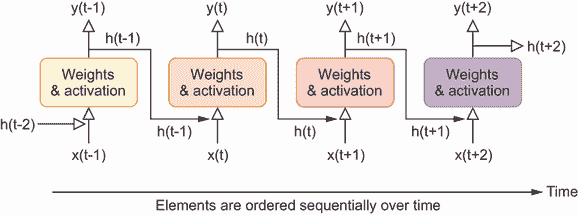
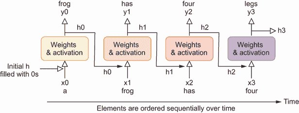

# 8 使用循环神经网络进行文本生成

本章涵盖

+   RNN 背后的理念以及为什么它们可以处理序列数据

+   字符标记化、单词标记化和子词标记化

+   词嵌入的工作原理

+   构建和训练 RNN 以生成文本

+   使用温度和 top-K 采样来控制文本生成的创造性

到目前为止，在这本书中，我们已经讨论了如何生成形状、数字和图像。从本章开始，我们将主要关注文本生成。生成文本通常被认为是生成式 AI 的圣杯，有以下几个令人信服的原因。人类语言极其复杂和微妙。它不仅涉及理解语法和词汇，还包括上下文、语气和文化参考。成功生成连贯且上下文适当的文本是一个重大的挑战，需要深入理解和处理语言。

作为人类，我们主要通过语言进行沟通。能够生成类似人类文本的 AI 可以更自然地与用户互动，使技术更加易于访问和用户友好。文本生成有许多应用，从自动化客户服务响应到创建完整的文章、游戏和电影的脚本，帮助创意写作，甚至构建个人助理。其对各个行业的潜在影响是巨大的。

在本章中，我们将尝试构建和训练模型以生成文本。你将学习如何应对文本生成中的三个主要挑战。首先，文本是序列数据，由按特定顺序组织的数据点组成，其中每个点按顺序排列以反映数据内部固有的顺序和相互依赖关系。由于序列的敏感顺序，预测序列的结果具有挑战性。改变元素的顺序会改变其含义。其次，文本表现出长距离依赖性：文本的某个部分的意义取决于文本中较早出现（例如，100 个词之前）的元素。理解和建模这些长距离依赖关系对于生成连贯的文本至关重要。最后，人类语言是模糊和上下文相关的。训练一个模型来理解细微差别、讽刺、习语和文化参考以生成上下文准确的文本具有挑战性。

你将探索一种专门设计用于处理顺序数据（如文本或时间序列）的特定神经网络：循环神经网络（RNN）。传统的神经网络，如前馈神经网络或全连接网络，独立地处理每个输入。这意味着网络分别处理每个输入，不考虑不同输入之间的任何关系或顺序。相比之下，RNNs 是专门设计来处理顺序数据的。在 RNN 中，给定时间步的输出不仅取决于当前输入，还取决于之前的输入。这允许 RNNs 保持一种记忆形式，从之前的时间步捕获信息以影响当前输入的处理。

这种顺序处理使得循环神经网络（RNNs）适用于那些输入顺序很重要的任务，例如语言建模，其目标是根据前面的单词预测句子中的下一个单词。我们将重点关注 RNN 的一种变体，即长短期记忆（LSTM）网络，它可以在文本等顺序数据中识别短期和长期数据模式。LSTM 模型使用一个隐藏状态来捕捉之前时间步的信息。因此，一个训练好的 LSTM 模型可以根据上下文生成连贯的文本。

生成的文本风格取决于训练数据。此外，由于我们计划从头开始训练一个用于文本生成的模型，训练文本的长度是一个关键因素。它需要足够广泛，以便模型能够有效地学习和模仿特定的写作风格，同时又要足够简洁，以避免在训练期间产生过度的计算需求。因此，我们将使用小说《安娜·卡列尼娜》中的文本进行训练，这似乎符合我们的目的，用于训练 LSTM 模型。由于像 LSTM 这样的神经网络不能直接接受文本作为输入，你将学习如何将文本分解成标记（在本章中是单个单词，但在后面的章节中可以是单词的一部分），这个过程称为*标记化*。然后，你将创建一个字典，将每个唯一的标记映射到一个整数（即索引）。基于这个字典，你将把文本转换成一个长序列的整数，以便输入到神经网络中。

你将使用一定长度的索引序列作为训练 LSTM 模型的输入。你将输入序列向右移动一个标记，并使用它作为输出：你实际上是在训练模型预测句子中的下一个标记。这是自然语言处理（NLP）中所谓的*序列到序列*预测问题，你将在后面的章节中再次看到它。

一旦 LSTM（长短期记忆网络）被训练，你将用它一次生成一个标记的文本，基于序列中的前一个标记，如下所示：你将一个提示（如“Anna and the”句子的一部分）输入到训练好的模型中。然后模型预测最可能的下一个标记，并将选定的标记附加到提示上。更新后的提示再次作为输入，模型再次被用来预测下一个标记。这个过程迭代进行，直到提示达到一定的长度。这种方法类似于更高级的生成模型（如 ChatGPT）所采用的机制（尽管 ChatGPT 不是一个 LSTM）。你将见证训练好的 LSTM 模型生成语法正确且连贯的文本，其风格与原始小说相匹配。

最后，你还将学习如何通过温度和 top-K 采样来控制生成文本的创造性。温度控制训练模型的预测随机性。高温度使得生成的文本更具创造性，而低温度则使文本更加自信和可预测。top-K 采样是一种方法，其中你从最可能的 K 个标记中选择下一个标记，而不是从整个词汇表中选择。K 值较小会导致在每一步选择高度可能的标记，这反过来又使得生成的文本不那么具有创造性，而更加连贯。

本章的主要目标并不是生成尽可能连贯的文本，正如之前提到的，这提出了巨大的挑战。相反，我们的目标是展示 RNNs 的局限性，从而为后续章节中介绍 Transformers 做准备。更重要的是，本章建立了文本生成的基本原则，包括标记化、词嵌入、序列预测、温度设置和 top-K 采样。因此，在后续章节中，你将牢固地理解 NLP 的基础知识。这个基础将使我们能够专注于 NLP 的其他更高级方面，例如注意力机制的工作原理和 Transformers 的架构。

## 8.1 RNNs 简介

在本章的开头，我们提到了生成文本所涉及的复杂性，尤其是在追求连贯性和上下文相关性时。本节将进一步深入探讨这些挑战，并探讨 RNNs 的架构。我们将解释为什么 RNNs 适合这项任务以及它们的局限性（这是它们被 Transformers 取代的原因）。

RNNs（循环神经网络）是专门设计来处理序列数据的，这使得它们能够胜任文本生成任务，这项任务在本质上具有序列性。它们利用一种称为隐藏状态的记忆形式，来捕捉和保留序列早期部分的信息。这种能力对于保持上下文和随着序列的进展理解依赖关系至关重要。

在本章中，我们将特别使用 LSTM 网络，这是 RNNs 的高级版本，用于文本生成，利用其高级功能来应对这项任务中的挑战。

### 8.1.1 文本生成的挑战

文本代表了典型的**序列数据**，它被定义为任何数据集，其中元素的顺序至关重要。这种结构意味着各个元素之间的相对位置具有重大意义，通常传达了理解数据所必需的重要信息。序列数据的例子包括时间序列（如股价）、文本内容（如句子）和音乐作品（音符的连续序列）。

本书主要关注文本生成，尽管在第十三章和第十四章中也涉及音乐生成。文本生成的过程充满了复杂性。一个主要的挑战在于对句子中单词序列的建模，改变顺序可能会极大地改变句子的含义。例如，在句子“肯塔基在昨晚的足球比赛中击败了范德比尔特”中，将“肯塔基”和“范德比尔特”完全互换位置，尽管使用了相同的单词，却完全颠倒了句子的含义。此外，正如引言中提到的，文本生成在处理长距离依赖关系和解决歧义问题上也面临着挑战。

在本章中，我们将探讨解决这些挑战的一种方法——即使用 RNNs（循环神经网络）。虽然这种方法并不完美，但它为你在后续章节中遇到的更高级技术奠定了基础。这种方法将帮助你了解如何管理词序、解决长距离依赖关系，以及处理文本中的固有歧义，为你提供文本生成的基本技能。通过本章的学习，你将为书中更复杂的方法和深入的理解打下坚实的基础。在这个过程中，你将获得许多在自然语言处理（NLP）领域非常有价值的技术，例如文本分词、词嵌入和序列到序列的预测。

### 8.1.2 RNNs 是如何工作的？

RNNs 是一种专门的人工神经网络形式，旨在识别数据序列中的模式，如文本、音乐或股价。与处理输入独立的传统神经网络不同，RNNs 内部有循环，允许信息持续存在。

在生成文本的挑战之一是如何根据所有前面的单词预测下一个单词，以便预测能够捕捉到长距离依赖关系和上下文意义。RNNs 的输入不仅是一个独立的项，而是一个序列（例如句子中的单词）。在每一个时间步，预测不仅基于当前输入，还基于通过隐藏状态总结的所有先前输入。以短语“一只青蛙有四条腿”为例。在第一个时间步，我们使用单词“一个”来预测第二个单词“青蛙”。在第二个时间步，我们使用“一个”和“青蛙”来预测下一个单词。当我们预测最后一个单词时，我们需要使用所有四个先前单词“一个青蛙有四条”。

RNNs 的一个关键特性是所谓的隐藏状态，它捕捉了序列中所有先前元素的信息。这一特性对于网络有效处理和生成序列数据至关重要。RNNs 的功能和这种序列处理在图 8.1 中得到了展示，该图说明了循环神经元层是如何随时间展开的。



图 8.1 展示了通过时间展开的循环神经元层。当一个循环神经网络对序列数据进行预测时，它从上一个时间步的隐藏状态 h(t – 1)以及当前时间步的输入 x(t)中获取信息，并生成输出 y(t)以及更新的隐藏状态 h(t)。时间步 t 的隐藏状态捕捉了所有先前时间步的信息，x(0)，x(1)，…，x(t)。

RNNs 中的隐藏状态在捕捉所有时间步的信息方面发挥着关键作用。这使得 RNNs 能够做出不仅由当前输入 x(t)而且由所有先前输入的累积知识 x(0)，x(1)，…，x(t – 1)所指导的预测。这一属性使 RNNs 能够理解时间依赖关系。它们能够从输入序列中把握上下文，这对于语言建模等任务至关重要，在这些任务中，句子中的前一个单词为预测下一个单词设定了场景。

然而，RNNs 并非没有缺点。尽管标准 RNNs 能够处理短期依赖关系，但在文本中的长距离依赖关系上却显得力不从心。这种困难源于梯度消失问题，在长序列中，梯度（对于训练网络至关重要）会减小，阻碍模型学习长距离关系的能力。为了减轻这一问题，已经开发出了 RNNs 的高级版本，例如 LSTM 网络。

LSTM 网络是由 Hochreiter 和 Schmidhuber 在 1997 年提出的.^(1) LSTM 网络由 LSTM 单元（或细胞）组成，每个单元的结构都比标准 RNN 神经元更复杂。细胞状态是 LSTM 的关键创新：它充当一种传送带，沿着整个 LSTM 单元链直接运行。它具有在网络中携带相关信息的能力。向细胞状态添加或删除信息的能力使 LSTM 能够捕捉长期依赖关系并长时间记住信息。这使得它们在语言建模和文本生成等任务上更加有效。在本章中，我们将利用 LSTM 模型进行文本生成项目，旨在模仿小说 *安娜·卡列尼娜* 的风格。

然而，值得注意的是，即使是像 LSTM 这样的高级 RNN 变体在捕捉序列数据中的极长距离依赖关系时也会遇到障碍。我们将在下一章讨论这些挑战并提供解决方案，继续探索用于有效序列数据处理和生成的复杂模型。

### 8.1.3 训练 LSTM 模型的步骤

接下来，我们将讨论训练 LSTM 模型生成文本所涉及的步骤。这个概述旨在在开始项目之前，提供一个对训练过程的坚实基础理解。

训练文本的选择取决于期望的输出。一部篇幅较长的小说是一个良好的起点。其丰富的内容使模型能够有效地学习和复制特定的写作风格。大量的文本数据增强了模型在此风格上的熟练度。同时，小说通常不会过长，这有助于管理训练时间。对于我们 LSTM 模型的训练，我们将利用来自 *安娜·卡列尼娜* 的文本，符合我们之前概述的训练数据标准。

与其他深度神经网络类似，LSTM 模型不能直接处理原始文本。相反，我们将文本转换为数值形式。这始于将文本分解成更小的片段，这个过程称为分词，其中每个片段都是一个标记。标记可以是完整的单词、标点符号（如感叹号或逗号），或特殊字符（如 & 或 %）。在本章中，这些元素都将被视为单独的标记。尽管这种分词方法可能不是最有效的，但它易于实现，因为我们只需要将单词映射到标记。在后续章节中，我们将使用子词分词，其中一些不常见的单词被分解成更小的片段，如音节。在分词之后，我们为每个标记分配一个唯一的整数，创建文本的数值表示，即整数序列。

为了准备训练数据，我们将这个长序列划分为长度相等的更短序列。在我们的项目中，我们将使用由 100 个整数组成的序列。这些序列构成了我们模型的特征（即*x*变量）。然后，我们通过将输入序列向右移动一个标记来生成输出*y*。这种设置使得 LSTM 模型能够根据序列中的先前标记预测下一个标记。输入和输出的配对作为训练数据。我们的模型包括 LSTM 层来理解文本中的长期模式，以及一个嵌入层来把握语义含义。

让我们回顾一下之前提到的预测句子“a frog has four legs”的例子。图 8.2 展示了 LSTM 模型训练的工作原理。



图 8.2 展示了如何训练 LSTM 模型的一个示例。我们首先将训练文本分解为标记，并为每个标记分配一个唯一的整数，从而将文本作为索引序列的数值表示。然后，我们将这个长序列划分为长度相等的更短序列。这些序列构成了我们模型的特征（即 x 变量）。然后，我们通过将输入序列向右移动一个标记来生成输出 y。这种设置使得 LSTM 模型能够根据序列中的先前标记预测下一个标记。

在第一个时间步，模型使用单词“a”来预测单词“frog”。由于“a”没有前面的单词，我们用零初始化隐藏状态。LSTM 模型接收“a”的索引和这个初始隐藏状态作为输入，并输出预测的下一个单词以及更新的隐藏状态 h0。在随后的时间步，使用单词“frog”和更新的状态 h0 来预测“has”并生成新的隐藏状态 h1。预测下一个单词和更新隐藏状态的这一序列持续进行，直到模型预测出句子中的最后一个单词，“legs”。

然后，将预测结果与句子中的实际下一个单词进行比较。由于模型实际上是在预测词汇表中所有可能的标记中的下一个标记，因此存在一个多类别分类问题。我们在每次迭代中调整模型参数，以最小化交叉熵损失，从而使模型在下一个迭代中的预测结果更接近训练数据中的实际输出。

模型训练完成后，生成文本的过程从将种子序列输入模型开始。模型预测下一个标记，然后将该标记附加到序列中。这种预测和序列更新的迭代过程重复进行，直到生成所需的文本长度。

## 8.2 自然语言处理基础

深度学习模型，包括我们之前讨论的 LSTM 模型以及你将在后续章节中学习的 Transformer，不能直接处理原始文本，因为它们被设计成与数值数据一起工作，通常是向量或矩阵的形式。神经网络的处理和学习能力基于数学运算，如加法、乘法和激活函数，这些运算需要数值输入。因此，首先将文本分解成更小、更易于管理的元素，即标记，是至关重要的。这些标记可以是从单个字符和单词到子词单元。

NLP 任务中的下一个关键步骤是将这些标记转换为数值表示。这种转换对于将它们输入深度神经网络是必要的，这是训练我们模型的基本部分。

在本节中，我们将讨论不同的分词方法，以及它们的优缺点。此外，你还将深入了解将标记转换为密集向量表示的过程——这种方法称为词嵌入。这项技术对于捕捉语言的意义，使其以深度学习模型能够有效利用的格式至关重要。

### 8.2.1 不同的分词方法

分词涉及将文本划分为更小的部分，称为标记（tokens），这些标记可以是单词、字符、符号或其他有意义的单元。分词的主要目标是简化文本数据分析和处理的过程。

从广义上讲，分词有三种方法。第一种是字符分词，其中文本被划分为其构成字符。这种方法用于具有复杂形态结构的语言，如土耳其语或芬兰语，在这些语言中，单词的意义可能会因字符的微小变化而显著改变。以英语短语“它好得令人难以置信！”为例；它被分解为以下单个字符：`['I', 't', ' ', 'i', 's', ' ', 'u', 'n', 'b', 'e', 'l', 'i', 'e', 'v', 'a', 'b', 'l', 'y', ' ', 'g', 'o', 'o', 'd', '!']`。字符分词的一个关键优势是唯一标记的数量有限。这种限制显著减少了深度学习模型中的参数数量，从而实现了更快、更有效的训练。然而，主要的缺点是单个字符通常缺乏显著的意义，这使得机器学习模型难以从字符序列中提取有意义的见解。

练习 8.1

使用字符分词将短语“Hi, there!”划分为单个标记。

第二种方法是词元化，其中文本被分割成单个单词和标点符号。它常用于唯一单词数量不是太多的情况下。例如，同样的短语“它好得令人难以置信！”变成了五个标记：`['It', 'is', 'unbelievably', 'good', '!']`。这种方法的主要优点是每个单词本身携带语义意义，这使得模型更容易解释文本。然而，缺点是独特标记的数量大幅增加，这增加了深度学习模型中的参数数量。这种增加可能导致训练过程变慢和效率降低。

练习 8.2

使用词元化将短语“Hi, how are you?”分解成单个标记。

第三种方法是子词元化。这种方法是 NLP 中的一个关键概念，将文本分解成更小、更有意义的组件，称为子词。例如，短语“它好得令人难以置信！”将被分解成如`['It', 'is', 'un', 'believ', 'ably', 'good', '!']`这样的标记。大多数高级语言模型，包括 ChatGPT，都使用子词元化，你将在接下来的几章中使用这种方法。子词元化在更传统的词元化技术之间取得了平衡，这些技术通常将文本分割成单个单词或字符。基于单词的词元化虽然能捕捉更多意义，但会导致词汇量巨大。相反，基于字符的词元化会导致词汇量较小，但每个标记的语义价值较低。

子词元化通过在词汇表中保留常用单词的完整性，同时将不太常见或更复杂的单词分解成子组件，有效地缓解了这些问题。这种技术在词汇量大的语言或表现出高度词形变化的语言中特别有利。通过采用子词元化，整体词汇量大幅减少。这种减少提高了语言处理任务的效率和有效性，尤其是在处理广泛的语结构时。

在本章中，我们将重点关注词元化，因为它为初学者提供了一个直接的起点。随着我们进入后面的章节，我们的注意力将转向子词元化，使用已经通过这种技术训练过的模型。这种方法使我们能够专注于更高级的主题，例如理解 Transformer 架构和探索注意力机制的内部工作原理。

### 8.2.2 词嵌入

词嵌入是一种将标记转换为紧凑的向量表示的方法，捕捉它们的语义信息和相互关系。这项技术在 NLP 中至关重要，尤其是在深度神经网络，包括 LSTM 和 Transformer 等模型，需要数值输入的情况下。

Traditionally, tokens are converted into numbers using one-hot encoding before being fed into NLP models. In one-hot encoding, each token is represented by a vector where only one element is ‘1’, and the rest are ‘0’s. For example, in this chapter, there are 12,778 unique word-based tokens in the text for the novel *Anna Karenina*. Each token is represented by a vector of 12,778 dimensions. Consequently, a phrase like “happy families are all alike” is represented as a 5 × 12,778 matrix, where 5 represents the number of tokens. This representation, however, is highly inefficient due to its large dimensionality, leading to an increased number of parameters, which can hinder training speed and efficiency.

LSTMs, Transformers, and other advanced NLP models address this inefficiency through word embedding. Instead of bulky one-hot vectors, word embedding uses continuous, lower-dimensional vectors (e.g., 128-value vectors we use in this chapter). As a result, the phrase “happy families are all alike” is represented by a more compact 5 × 128 matrix after word embedding. This streamlined representation drastically reduces the model’s complexity and enhances training efficiency.

Word embedding not only reduces word complexity by condensing it into a lower-dimensional space but also effectively captures the context and the nuanced semantic relationships between words, a feature that simpler representations like one-hot encoding lack, for the following reasons. In one-hot encoding, all tokens have the same distance from each other in vector space. However, in word embeddings, tokens with similar meanings are represented by vectors close to each other in the embedding space. Word embeddings are learned from the text in the training data; the resulting vectors capture contextual information. Tokens that appear in similar contexts will have similar embeddings, even if they are not explicitly related.

Word embedding in NLP

Word embeddings are a powerful method for representing tokens in NLP that offer significant advantages over traditional one-hot encoding in capturing context and semantic relationships between words.

One-hot encoding represents tokens as sparse vectors with a dimension equal to the size of the vocabulary, where each token is represented by a vector with all zeros except for a single one at the index corresponding to the token. In contrast, word embeddings represent tokens as dense vectors with much lower dimensions (e.g., 128 dimensions in this chapter and 256 dimensions in chapter 12). This dense representation is more efficient and can capture more information.

具体来说，在一维编码中，所有标记在向量空间中彼此距离相同，这意味着标记之间没有相似性的概念。然而，在词嵌入中，相似的标记由在嵌入空间中彼此靠近的向量表示。例如，“king”（国王）和“queen”（王后）会有相似的嵌入，反映了它们语义上的关系。

词嵌入是从训练数据中的文本学习得到的。嵌入过程使用标记出现的上下文来学习它们的嵌入，这意味着生成的向量捕捉了上下文信息。出现在相似上下文中的标记将具有相似的嵌入，即使它们没有明确的相关性。

总体而言，词嵌入提供了对词语更细腻和高效的表示，它捕捉了语义关系和上下文信息，这使得它们比一维编码更适合自然语言处理任务。

在实际应用中，尤其是在 PyTorch 等框架中，词嵌入是通过通过一个线性层传递索引来实现的，它将这些索引压缩到一个低维空间。也就是说，当你向 `nn.Embedding()` 层传递一个索引时，它会查找嵌入矩阵中对应的行，并返回该索引的嵌入向量，从而避免了创建可能非常大的一个热向量。这个嵌入层的权重不是预先定义的，而是在训练过程中学习的。这一学习特性使得模型能够根据训练数据细化其对词义的理解，从而在神经网络中实现更细腻和上下文感知的语言表示。这种方法显著提高了模型处理和解释语言数据的有效性和意义。

## 8.3 准备数据以训练 LSTM 模型

在本节中，我们将处理文本数据并为其训练做好准备。我们首先将文本分解成单个标记。接下来的步骤是创建一个字典，将每个标记分配一个索引，本质上是将它们映射到整数。完成这些设置后，我们将这些标记组织成训练数据的批次，这对于在下一节训练 LSTM 模型至关重要。

我们将以详细、分步骤的方式介绍标记化过程，确保你彻底理解标记化是如何工作的。我们将使用词标记化，因为它在将文本分割成单词方面简单，而不是更复杂的子词标记化，后者需要细微地掌握语言结构。在后面的章节中，我们将使用更复杂的方法来使用预训练的子词标记化器。这将使我们能够专注于高级主题，如注意力机制和 Transformer 架构，而不会在文本处理的初始阶段陷入困境。

### 8.3.1 下载和清理文本

我们将使用小说《安娜·卡列尼娜》的文本来训练我们的模型。请访问[`mng.bz/znmX`](https://mng.bz/znmX)下载文本文件，并将其保存为电脑上文件夹/files/中的 anna.txt。之后，打开文件并删除第 39888 行之后的所有内容，该行内容为`"END OF THIS PROJECT GUTENBERG EBOOK ANNA KARENINA`.`"`。或者，您可以直接从书籍的 GitHub 仓库下载 anna.txt 文件：[`github.com/markhliu/DGAI`](https://github.com/markhliu/DGAI)。

首先，我们加载数据并打印出一些段落，以了解数据集：

```py
with open("files/anna.txt","r") as f:
    text=f.read()    
words=text.split(" ")    
print(words[:20]) 
```

输出结果为

```py
['Chapter', '1\n\n\nHappy', 'families', 'are', 'all', 'alike;', 'every',
 'unhappy', 'family', 'is', 'unhappy', 'in', 'its',
'own\nway.\n\nEverything', 'was', 'in', 'confusion', 'in', 'the',
"Oblonskys'"]
```

如您所见，行断（用\n 表示）被视为文本的一部分。因此，我们应该将这些行断替换为空格，这样它们就不会出现在词汇表中。此外，将所有单词转换为小写在我们的设置中很有帮助，因为它确保像“The”和“the”这样的单词被视为相同的标记。这一步对于减少独特标记的多样性至关重要，从而使得训练过程更加高效。此外，标点符号应与它们后面的单词保持一定的距离。如果没有这种分隔，像“way.”和“way”这样的组合会被错误地视为不同的标记。为了解决这些问题，我们将清理文本：

```py
clean_text=text.lower().replace("\n", " ")               ①
clean_text=clean_text.replace("-", " ")                  ②
for x in ",.:;?!$()/_&%*@'`":
    clean_text=clean_text.replace(f"{x}", f" {x} ")
clean_text=clean_text.replace('"', ' " ')                ③
text=clean_text.split()
```

① 替换行断为空格

② 替换连字符为空格

③ 在标点符号和特殊字符周围添加空格

接下来，我们获取独特标记：

```py
from collections import Counter   
word_counts = Counter(text)    
words=sorted(word_counts, key=word_counts.get,
                      reverse=True)
print(words[:10])
```

列表`words`包含文本中所有的独特标记，最频繁出现的标记排在第一位，最不频繁的标记排在最后。前一个代码块输出的结果是

```py
[',', '.', 'the', '"', 'and', 'to', 'of', 'he', "'", 'a']
```

前面的输出显示了最频繁的 10 个标记。逗号（`,`）是最频繁的标记，句号（`.`）是第二频繁的标记。单词“the”是第三频繁的标记，以此类推。

现在，我们创建两个字典：一个将标记映射到索引，另一个将索引映射到标记。

列表 8.1 将标记映射到索引和索引映射到标记的字典

```py
text_length=len(text)                                      ①
num_unique_words=len(words)                                ②
print(f"the text contains {text_length} words")
print(f"there are {num_unique_words} unique tokens")
word_to_int={v:k for k,v in enumerate(words)}              ③
int_to_word={k:v for k,v in enumerate(words)}              ④
print({k:v for k,v in word_to_int.items() if k in words[:10]})
print({k:v for k,v in int_to_word.items() if v in words[:10]})
```

① 文本长度（文本中有多少个标记）

② 独特标记的长度

③ 将标记映射到索引

④ 将索引映射到标记

前一个代码块输出的结果是

```py
the text contains 437098 words
there are 12778 unique tokens
{',': 0, '.': 1, 'the': 2, '"': 3, 'and': 4, 'to': 5, 'of': 6, 'he': 7,
"'": 8, 'a': 9}
{0: ',', 1: '.', 2: 'the', 3: '"', 4: 'and', 5: 'to', 6: 'of', 7: 'he',
 8: "'", 9: 'a'}
```

小说《安娜·卡列尼娜》的文本总共有 437,098 个标记。其中，有 12,778 个独特的标记。字典`word_to_int`为每个独特的标记分配一个索引。例如，逗号（`,`）被分配了索引 0，而句号（`.`）被分配了索引 1。字典`int_to_word`将索引转换回标记。例如，索引 2 转换回标记“`the`”。索引 4 转换回标记“`and`”，以此类推。

最后，我们将整个文本转换为索引：

```py
print(text[0:20])
wordidx=[word_to_int[w] for w in text]  
print([word_to_int[w] for w in text[0:20]])  
```

输出结果为

```py
['chapter', '1', 'happy', 'families', 'are', 'all', 'alike', ';', 'every',
 'unhappy', 'family', 'is', 'unhappy', 'in', 'its', 'own', 'way', '.',
 'everything', 'was']
[208, 670, 283, 3024, 82, 31, 2461, 35, 202, 690, 365, 38, 690, 10, 234,
 147, 166, 1, 149, 12]
```

我们将文本中的所有标记转换为相应的索引，并将它们保存在列表`wordidx`中。前一个输出显示了文本中的前 20 个标记以及相应的索引。例如，文本中的第一个标记是`chapter`，其索引值为 208。

练习 8.3

查找字典`word_to_int`中标记`anna`的索引值。

### 8.3.2 创建训练数据批次

接下来，我们创建用于训练的(x, y)对。每个 x 是一个包含 100 个索引的序列。100 这个数字并没有什么神奇之处，你可以轻松地将其更改为 90 或 110，并得到相似的结果。设置数字太大可能会减慢训练速度，而设置数字太小可能会导致模型无法捕捉到长距离依赖关系。然后我们将窗口向右滑动一个标记，并将其用作目标 y。在序列生成期间，将序列向右移动一个标记并用作输出是训练语言模型（包括 Transformers）中的常见技术。以下列表中的代码块创建了训练数据。

列表 8.2 创建训练数据

```py
import torch
seq_len=100                                             ①
xys=[]
for n in range(0, len(wordidx)-seq_len-1):              ②
    x = wordidx[n:n+seq_len]                            ③
    y = wordidx[n+1:n+seq_len+1]                        ④
    xys.append((torch.tensor(x),(torch.tensor(y))))
```

① 每个输入包含 100 个索引。

② 从文本的第一个标记开始，每次向右滑动一个标记

③ 定义输入 x

④ 将输入 x 向右移动一个标记，并将其用作输出 y

通过将序列向右移动一个标记并将其用作输出，模型被训练来根据前面的标记预测下一个标记。例如，如果输入序列是 `"how are you"`，则移动后的序列将是 `"are you today"`。在训练过程中，模型学会在看到 `'how'` 后预测 `'are'`，在看到 `'are'` 后预测 `'you'`，依此类推。这有助于模型学习序列中下一个标记的概率分布。你将在本书后面的内容中再次看到这种做法。

我们将为训练创建数据批次，每个批次包含 32 对(x, y)。

```py
from torch.utils.data import DataLoader

torch.manual_seed(42)
batch_size=32
loader = DataLoader(xys, batch_size=batch_size, shuffle=True)
```

我们现在有了训练数据集。接下来，我们将创建一个 LSTM 模型，并使用我们刚刚处理的数据来训练它。

## 8.4 构建和训练 LSTM 模型

在本节中，你将开始使用 PyTorch 的内置 LSTM 层构建一个 LSTM 模型。这个模型将从词嵌入层开始，将每个索引转换为一个 128 维的密集向量。你的训练数据将通过这个嵌入层，然后输入到 LSTM 层。这个 LSTM 层被设计成按顺序处理序列的元素。在 LSTM 层之后，数据将进入一个线性层，其输出大小与你的词汇表大小相匹配。LSTM 模型生成的输出本质上是 logits，作为 softmax 函数的输入来计算概率。

一旦你构建了 LSTM 模型，下一步将涉及使用你的训练数据来训练这个模型。这个训练阶段对于提高模型理解和生成与提供的数据一致的模式的能力至关重要。

### 8.4.1 构建 LSTM 模型

在列表 8.3 中，我们定义了一个`WordLSTM()`类，作为我们的 LSTM 模型，用于训练以生成《安娜·卡列尼娜》风格的文本。该类定义如下所示。

列表 8.3 定义`WordLSTM()`类

```py
from torch import nn
device="cuda" if torch.cuda.is_available() else "cpu"
class WordLSTM(nn.Module):
    def __init__(self, input_size=128, n_embed=128,
             n_layers=3, drop_prob=0.2):
        super().__init__()
        self.input_size=input_size
        self.drop_prob = drop_prob
        self.n_layers = n_layers
        self.n_embed = n_embed
        vocab_size=len(word_to_int)
        self.embedding=nn.Embedding(vocab_size,n_embed)    ①
        self.lstm = nn.LSTM(input_size=self.input_size,
            hidden_size=self.n_embed,
            num_layers=self.n_layers,
            dropout=self.drop_prob,batch_first=True)       ②
        self.fc = nn.Linear(input_size, vocab_size)    

    def forward(self, x, hc):
        embed=self.embedding(x)
        x, hc = self.lstm(embed, hc)                       ③
        x = self.fc(x)
        return x, hc      

    def init_hidden(self, n_seqs):                         ④
        weight = next(self.parameters()).data
        return (weight.new(self.n_layers,
                           n_seqs, self.n_embed).zero_(),
                weight.new(self.n_layers,
                           n_seqs, self.n_embed).zero_())  
```

① 训练数据首先通过嵌入层。

② 使用 PyTorch LSTM() 类创建一个 LSTM 层

③ 在每个时间步中，LSTM 层使用前一个标记和隐藏状态来预测下一个标记和下一个隐藏状态。

④ 初始化输入序列中第一个标记的隐藏状态

之前定义的 `WordLSTM()` 类有三个层：词嵌入层、LSTM 层和最终的线性层。我们将 `n_layers` 参数的值设置为 3，这意味着 LSTM 层将三个 LSTM 堆叠在一起形成一个堆叠的 LSTM，最后两个 LSTM 将前一个 LSTM 的输出作为输入。`init_hidden()` 方法在模型使用序列的第一个元素进行预测时将隐藏状态填充为零。在每个时间步中，输入是当前标记和前一个隐藏状态，输出是下一个标记和下一个隐藏状态。

`torch.nn.Embedding()` 类的工作原理

PyTorch 中的 `torch.nn.Embedding()` 类用于在神经网络中创建嵌入层。嵌入层是一个可训练的查找表，它将整数索引映射到密集的、连续的向量表示（嵌入）。

当你创建 `torch.nn.Embedding()` 的实例时，你需要指定两个主要参数：num_embeddings，词汇表的大小（唯一标记的总数），以及 embedding_dim，每个嵌入向量的大小（输出嵌入的维度性）。

在内部，该类创建一个形状为 (num_embeddings, embedding_dim) 的矩阵（或查找表），其中每一行对应于特定索引的嵌入向量。最初，这些嵌入是随机初始化的，但在训练过程中通过反向传播进行学习和更新。

当你将索引张量传递给嵌入层（在网络的前向传递过程中）时，它会在查找表中查找相应的嵌入向量并返回它们。关于该类的更多信息可在 PyTorch [`mng.bz/n0Zd`](https://mng.bz/n0Zd) 获取。

我们创建 `WordLSTM()` 类的实例，并将其用作我们的 LSTM 模型，如下所示：

```py
model=WordLSTM().to(device)
```

当创建 LSTM 模型时，权重是随机初始化的。当我们使用 (x, y) 对来训练模型时，LSTM 通过调整模型参数学习根据序列中的所有先前标记预测下一个标记。正如我们在图 8.2 中所展示的，LSTM 学习根据当前标记和当前隐藏状态预测下一个标记和下一个隐藏状态，这是所有先前标记信息的总结。

我们使用学习率为 0.0001 的 Adam 优化器。损失函数是交叉熵损失，因为这是一个多类别分类问题：模型试图从包含 12,778 个选择的字典中预测下一个标记：

```py
lr=0.0001
optimizer = torch.optim.Adam(model.parameters(), lr=lr)
loss_func = nn.CrossEntropyLoss()
```

现在 LSTM 模型已经构建，我们将使用之前准备好的训练数据批次来训练模型。

### 8.4.2 训练 LSTM 模型

在每个训练周期中，我们遍历训练集中的所有数据批次(x, y)。LSTM 模型接收输入序列 x，并生成一个预测输出序列 *ŷ*。这个预测与实际输出序列 y 进行比较，以计算交叉熵损失，因为我们实际上在这里进行多类别分类。然后我们调整模型的参数以减少这个损失，就像我们在第二章中分类服装物品时做的那样。

虽然我们可以将我们的数据分为训练集和验证集，直到在验证集上不再看到进一步的改进（就像我们在第二章中所做的那样）来训练模型，但我们的主要目标是掌握 LSTM 模型的工作原理，而不一定是实现最佳参数调整。因此，我们将模型训练 50 个周期。

列表 8.4 训练 LSTM 模型以生成文本

```py
model.train()

for epoch in range(50):
    tloss=0
    sh,sc = model.init_hidden(batch_size)
    for i, (x,y) in enumerate(loader):                      ①
        if x.shape[0]==batch_size:
            inputs, targets = x.to(device), y.to(device)
            optimizer.zero_grad()
            output, (sh,sc) = model(inputs, (sh,sc))        ②
            loss = loss_func(output.transpose(1,2),targets) ③ 
            sh,sc=sh.detach(),sc.detach()
            loss.backward()
            nn.utils.clip_grad_norm_(model.parameters(), 5)
            optimizer.step()                                ④
            tloss+=loss.item()
        if (i+1)%1000==0:
            print(f"at epoch {epoch} iteration {i+1}\
            average loss = {tloss/(i+1)}")
```

① 遍历训练数据中的所有(x,y)批次

② 使用模型来预测输出序列

③ 将预测结果与实际输出进行比较，并计算损失

④ 调整模型参数以最小化损失

在前面的代码列表中，`sh` 和 `sc` 一起构成了隐藏状态。特别是，细胞状态 `sc` 作为传送带，在许多时间步中携带信息，每个时间步都会添加或删除信息。`sh` 是 LSTM 单元在给定时间步的输出。它包含有关当前输入的信息，并用于将信息传递给序列中的下一个 LSTM 单元。

如果您有 CUDA 支持的 GPU，这次训练大约需要 6 个小时。如果您只使用 CPU，可能需要一两天，具体取决于您的硬件。或者您可以从我的网站下载预训练的权重：[`mng.bz/vJZa`](https://mng.bz/vJZa)。

接下来，我们将训练好的模型权重保存在本地文件夹中：

```py
import pickle

torch.save(model.state_dict(),"files/wordLSTM.pth")
with open("files/word_to_int.p","wb") as fb:
    pickle.dump(word_to_int, fb)
```

字典 `word_to_int` 也保存在您的计算机上，这是一个实用的步骤，确保您可以在不重复分词过程的情况下，使用训练好的模型生成文本。

## 8.5 使用训练好的 LSTM 模型生成文本

现在您已经有一个训练好的 LSTM 模型，您将在这个部分学习如何使用它来生成文本。目标是查看训练好的模型是否可以通过迭代预测下一个标记来生成语法正确且连贯的文本。您还将学习如何使用温度和 top-K 采样来控制生成文本的创造性。

在使用训练好的 LSTM 模型生成文本时，我们以提示作为模型的初始输入。我们使用训练好的模型来预测最可能的下一个标记。将下一个标记附加到提示后，我们将新的序列输入到训练好的模型中，再次预测下一个标记。我们重复这个过程，直到序列达到一定的长度。

### 8.5.1 通过预测下一个标记来生成文本

首先，我们从本地文件夹中加载训练好的模型权重和字典 `word_to_int`：

```py
model.load_state_dict(torch.load("files/wordLSTM.pth",
                                    map_location=device))
with open("files/word_to_int.p","rb") as fb:
    word_to_int = pickle.load(fb)
int_to_word={v:k for k,v in word_to_int.items()}
```

书籍的 GitHub 仓库中也提供了`word_to_int.p`文件。我们将字典`word_to_int`中的键和值的顺序进行交换，以创建字典`int_to_word`。

要使用训练好的 LSTM 模型生成文本，我们需要一个提示作为生成文本的起点。我们将默认提示设置为“Anna and the”。一个简单的方法是限制生成的文本长度，例如 200 个标记：一旦达到所需长度，我们就要求模型停止生成。

下面的列表定义了一个`sample()`函数，用于根据提示生成文本。

列表 8.5：用于生成文本的`sample()`函数

```py
import numpy as np
def sample(model, prompt, length=200):
    model.eval()
    text = prompt.lower().split(' ')
    hc = model.init_hidden(1)
    length = length - len(text)                              ①
    for i in range(0, length):
        if len(text)<= seq_len:
            x = torch.tensor([[word_to_int[w] for w in text]])
        else:
            x = torch.tensor([[word_to_int[w] for w \
in text[-seq_len:]]])                                        ②
        inputs = x.to(device)
        output, hc = model(inputs, hc)                       ③
        logits = output[0][-1]
        p = nn.functional.softmax(logits, dim=0).detach().cpu().numpy()
        idx = np.random.choice(len(logits), p=p)             ④
        text.append(int_to_word[idx])                        ⑤
    text=" ".join(text)
    for m in ",.:;?!$()/_&%*@'`":
        text=text.replace(f" {m}", f"{m} ")
    text=text.replace('"  ', '"')
    text=text.replace("'  ", "'")
    text=text.replace('" ', '"')
    text=text.replace("' ", "'")
    return text  
```

① 确定需要生成多少个标记

② 输入是当前序列；如果它超过 100 个标记，则对其进行修剪

③ 使用训练模型进行预测

④ 根据预测概率选择下一个标记

⑤ 将预测的下一个标记添加到序列中并重复

`sample()`函数接受三个参数。第一个是您将要使用的训练好的 LSTM 模型。第二个是文本生成的起始提示，可以是任何长度的短语，用引号括起来。第三个参数指定要生成的文本长度，以标记为单位，默认值为 200 个标记。

在函数内部，我们首先从总期望长度中减去提示中的标记数量，以确定需要生成的标记数量。在生成下一个标记时，我们考虑当前序列的长度。如果它少于 100 个标记，我们将整个序列输入到模型中；如果它超过 100 个标记，则只使用序列的最后 100 个标记作为输入。然后将这个输入送入训练好的 LSTM 模型来预测下一个标记，我们将这个预测的标记添加到当前序列中。我们继续这个过程，直到序列达到所需长度。

当生成下一个标记时，模型使用 NumPy 中的 random.choice(len(logits), p = p)方法。在这里，该方法的第一参数表示选择范围，在这个例子中是 len(logits) = 12778。这意味着模型将随机选择一个从 0 到 12,777 的整数，每个整数对应词汇表中的一个不同标记。第二个参数 p 是一个包含 12,778 个元素的数组，其中每个元素表示从词汇表中选择相应标记的概率。在这个数组中，概率较高的标记更有可能被选中。

让我们使用“Anna and the prince”作为提示（确保在使用自己的提示时在标点符号前加上空格）来生成一段文本：

```py
torch.manual_seed(42)
np.random.seed(42)
print(sample(model, prompt='Anna and the prince'))  
```

在这里，我将 PyTorch 和 NumPy 中的随机种子数固定为 42，以防你想要重现结果。生成的段落是

```py
anna and the prince did not forget what he had not spoken. when the softening barrier was not so long as he had talked to his brother,  all the hopelessness of the impression. "official tail,  a man who had tried him,  though he had been able to get across his charge and locked close,  and the light round the snow was in the light of the altar villa. the article in law levin was first more precious than it was to him so that if it was most easy as it would be as the same. this was now perfectly interested. when he had got up close out into the sledge,  but it was locked in the light window with their one grass,  and in the band of the leaves of his projects,  and all the same stupid woman,  and really,  and i swung his arms round that thinking of bed. a little box with the two boys were with the point of a gleam of filling the boy,  noiselessly signed the bottom of his mouth,  and answering them took the red
```

你可能已经注意到生成的文本完全是小写的。这是因为，在文本处理阶段，我们将所有大写字母转换为小写，以最小化唯一标记的数量。

经过 6 小时的训练生成的文本相当令人印象深刻！大多数句子都遵循语法规范。虽然它可能无法与 ChatGPT 等高级系统生成的文本的复杂程度相媲美，但这仍然是一个重大的成就。通过在这个练习中获得的能力，你将准备好在后面的章节中训练更高级的文本生成模型。

### 8.5.2 文本生成中的温度和 top-K 采样

可以通过使用温度和 top-K 采样等技术来控制生成文本的创造力。

温度调整在选择下一个标记之前分配给每个潜在标记的概率分布。它通过温度的值有效地缩放 logits，即计算这些概率的 softmax 函数的输入。logits 是应用 softmax 函数之前的 LSTM 模型的输出。

在我们刚刚定义的`sample()`函数中，我们没有调整 logits，这意味着默认温度为 1。较低的温度（低于 1；例如，0.8）会导致更少的变体，使模型更加确定性和保守，更倾向于更可能的选择。相反，较高的温度（高于 1；例如，1.5）使得在文本生成中选择不可能的单词的可能性更大，导致更加多样化和有创造性的输出。然而，这也可能使文本变得不那么连贯或相关，因为模型可能会选择不太可能的单词。

Top-K 采样是另一种影响输出的方法。这种方法涉及从模型预测的前 K 个最可能选项中选择下一个单词。概率分布被截断，只包括前 K 个单词。当 K 值较小时，例如 5，模型的选项仅限于几个高度可能的单词，导致输出更加可预测和连贯，但可能不那么多样化和有趣。在我们之前定义的`sample()`函数中，我们没有应用 top-K 采样，因此 K 的值实际上是词汇表的大小（在我们的例子中为 12,778）。

接下来，我们介绍一个新的函数`generate()`，用于文本生成。这个函数与`sample()`函数类似，但包括两个额外的参数：`temperature`和`top_k`，允许对生成文本的创造性和随机性有更多的控制。`generate()`函数的定义如下所示。

列表 8.6 使用温度和 top-K 采样生成文本

```py
def generate(model, prompt , top_k=None, 
             length=200, temperature=1):
    model.eval()
    text = prompt.lower().split(' ')
    hc = model.init_hidden(1)
    length = length - len(text)    
    for i in range(0, length):
        if len(text)<= seq_len:
            x = torch.tensor([[word_to_int[w] for w in text]])
        else:
            x = torch.tensor([[word_to_int[w] for w in text[-seq_len:]]])
        inputs = x.to(device)
        output, hc = model(inputs, hc)
        logits = output[0][-1]
        logits = logits/temperature                             ①
        p = nn.functional.softmax(logits, dim=0).detach().cpu()    
        if top_k is None:
            idx = np.random.choice(len(logits), p=p.numpy())
        else:
            ps, tops = p.topk(top_k)                            ②
            ps=ps/ps.sum()
            idx = np.random.choice(tops, p=ps.numpy())          ③
        text.append(int_to_word[idx])

    text=" ".join(text)
    for m in ",.:;?!$()/_&%*@'`":
        text=text.replace(f" {m}", f"{m} ")
    text=text.replace('"  ', '"')   
    text=text.replace("'  ", "'")  
    text=text.replace('" ', '"')   
    text=text.replace("' ", "'")     
    return text  
```

① 使用温度缩放 logits

② 仅保留 K 个最可能的候选词

③ 从前 K 个候选词中选择下一个标记

与`sample()`函数相比，新的函数`generate()`有两个额外的可选参数：`top_k`和`temperature`。默认情况下，`top_k`设置为`None`，而`temperature`设置为 1。因此，如果你在调用`generate()`函数时没有指定这两个参数，输出将与从`sample()`函数获得的输出相同。

让我们通过关注单个标记的创建来展示生成文本的变化。为此，我们将使用“我不打算去看”作为提示（注意撇号前的空格，就像我们在本章中之前所做的那样）。我们调用`generate()`函数 10 次，将其长度参数设置为比提示长度多一个。这种方法确保函数只向提示添加一个额外的标记：

```py
prompt="I ' m not going to see"
torch.manual_seed(42)
np.random.seed(42)
for _ in range(10):
    print(generate(model, prompt, top_k=None, 
         length=len(prompt.split(" "))+1, temperature=1))
```

输出结果为

```py
i'm not going to see you
i'm not going to see those
i'm not going to see me
i'm not going to see you
i'm not going to see her
i'm not going to see her
i'm not going to see the
i'm not going to see my
i'm not going to see you
i'm not going to see me
```

在默认的`top_k = None`和`temperature = 1`设置下，输出中存在一定程度的重复。例如，“you”这个词重复了三次。总共有六个独特的标记。

然而，当你调整这两个参数时，`generate()`函数的功能会扩展。例如，设置一个低的温度，如 0.5，以及一个小的`top_k`值，例如 3，会导致生成的文本更可预测且更缺乏创意。

让我们重复单个标记的示例。这次，我们将温度设置为 0.5，`top_k`值设置为 3：

```py
prompt="I ' m not going to see"
torch.manual_seed(42)
np.random.seed(42)
for _ in range(10):
    print(generate(model, prompt, top_k=3, 
         length=len(prompt.split(" "))+1, temperature=0.5))
```

输出结果为

```py
i'm not going to see you
i'm not going to see the
i'm not going to see her
i'm not going to see you
i'm not going to see you
i'm not going to see you
i'm not going to see you
i'm not going to see her
i'm not going to see you
i'm not going to see her
```

输出的变化较少：在 10 次尝试中，只有 3 个独特的标记，“you”、“the”和“her”。

让我们通过将“安娜和王子”作为起始提示，在设置温度为 0.5 和`top_k`值为 3 时来观察这一效果：

```py
torch.manual_seed(42)
np.random.seed(42)
print(generate(model, prompt='Anna and the prince',
               top_k=3,
               temperature=0.5))
```

输出结果为

```py
anna and the prince had no milk. but,  "answered levin,  and he stopped. "i've been skating to look at you all the harrows,  and i'm glad. . .  ""no,  i'm going to the country. ""no,  it's not a nice fellow. ""yes,  sir. ""well,  what do you think about it? ""why,  what's the matter? ""yes,  yes,  "answered levin,  smiling,  and he went into the hall. "yes,  i'll come for him and go away,  "he said,  looking at the crumpled front of his shirt. "i have not come to see him,  "she said,  and she went out. "i'm very glad,  "she said,  with a slight bow to the ambassador's hand. "i'll go to the door. "she looked at her watch,  and she did not know what to say 
```

练习 8.4

通过设置温度为 0.6 和`top_k`为 10，并使用“安娜和护士”作为起始提示来生成文本。在 PyTorch 和 NumPy 中都设置随机种子数为 0。

相反，选择一个更高的`温度`值，例如 1.5，以及一个更高的`top_k`值，例如`None`（允许从 12,778 个标记的全集中进行选择），会导致更富有创造性和更不可预测的输出。这将在下面的单个标记示例中演示。这次，我们将温度设置为 2，`top_k`值设置为`None`：

```py
prompt="I ' m not going to see"
torch.manual_seed(42)
np.random.seed(42)
for _ in range(10):
    print(generate(model, prompt, top_k=None, 
         length=len(prompt.split(" "))+1, temperature=2))
```

输出结果为

```py
i'm not going to see them
i'm not going to see scarlatina
i'm not going to see behind
i'm not going to see us
i'm not going to see it
i'm not going to see it
i'm not going to see a
i'm not going to see misery
i'm not going to see another
i'm not going to see seryozha
```

输出几乎没有重复：在 10 次尝试中有 9 个独特的标记；只有“it”这个词重复了。

让我们再次使用“安娜和王子”作为初始提示，但将温度设置为 2，`top_k`值设置为`None`，看看会发生什么：

```py
torch.manual_seed(42)
np.random.seed(42)
print(generate(model, prompt='Anna and the prince',
               top_k=None,
               temperature=2))
```

生成的文本是

```py
anna and the prince took sheaves covered suddenly people. "pyotr marya borissovna,  propped mihail though her son will seen how much evening her husband;  if tomorrow she liked great time too. "adopted heavens details for it women from this terrible,  admitting this touching all everything ill with flirtation shame consolation altogether:  ivan only all the circle with her honorable carriage in its house dress,  beethoven ashamed had the conversations raised mihailov stay of close i taste work? "on new farming show ivan nothing. hat yesterday if interested understand every hundred of two with six thousand roubles according to women living over a thousand:  snetkov possibly try disagreeable schools with stake old glory mysterious one have people some moral conclusion,  got down and then their wreath. darya alexandrovna thought inwardly peaceful with varenka out of the listen from and understand presented she was impossible anguish. simply satisfied with staying after presence came where he pushed up his hand as marya her pretty hands into their quarters. waltz was about the rider gathered;  sviazhsky further alone have an hand paused riding towards an exquisite
```

生成的文本没有重复，尽管在许多地方缺乏连贯性。

练习 8.5

通过设置温度为 2 和`top_k`为 10000，并使用“安娜和护士”作为起始提示来生成文本。在 PyTorch 和 NumPy 中都设置随机种子数为 0。

在本章中，你已经掌握了 NLP 的基础技能，包括词级分词、词嵌入和序列预测。通过这些练习，你学会了基于词级分词构建语言模型，并使用 LSTM 进行文本生成训练。接下来，接下来的几章将向你介绍训练 Transformers，这是 ChatGPT 等系统中使用的模型类型。这将为你提供更深入的高级文本生成技术理解。

## 摘要

+   RNNs（循环神经网络）是一种专门的人工神经网络形式，旨在识别数据序列中的模式，如文本、音乐或股价。与传统神经网络不同，后者独立处理输入，RNNs 在其内部有循环，允许信息持续存在。LSTM 网络是 RNNs 的改进版本。

+   有三种分词方法。第一种是字符分词，将文本分割成其构成字符。第二种方法是词分词，将文本分割成单个单词。第三种方法是子词分词，它将单词分解成更小的、有意义的组件，称为子词。

+   词嵌入是一种将单词转换成紧凑向量表示的方法，捕捉其语义信息和相互关系。这项技术在 NLP 中至关重要，尤其是在深度神经网络，包括 LSTM 和 Transformers 等模型，需要数值输入的情况下。

+   温度是影响文本生成模型行为的一个参数。它通过在应用 softmax 之前缩放 logits（概率计算的 softmax 函数的输入）来控制预测的随机性。低温使模型在预测上更加保守但也更加重复。在较高温度下，模型变得不那么重复，更具创新性，增加了生成文本的多样性。

+   Top-K 采样是另一种影响文本生成模型行为的方法。它涉及从模型确定的 K 个最可能的候选词中选择下一个词。概率分布被截断，只保留前 K 个词。K 的值较小会使输出更加可预测和连贯，但可能不那么多样化和有趣。

* * *

^(1)  Sepp Hochreiter 和 Jurgen Schmidhuber，1997 年，“长短期记忆”，*神经计算* 9(8)：1735-1780。
