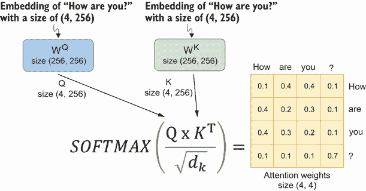
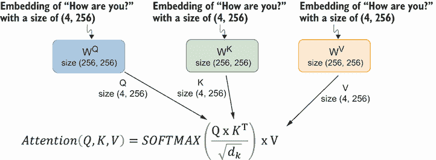
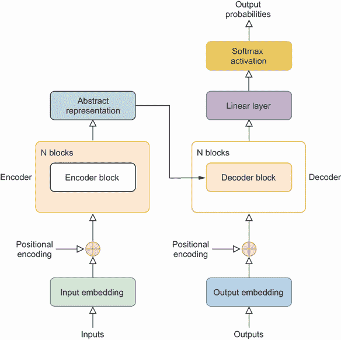
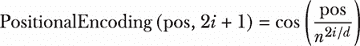
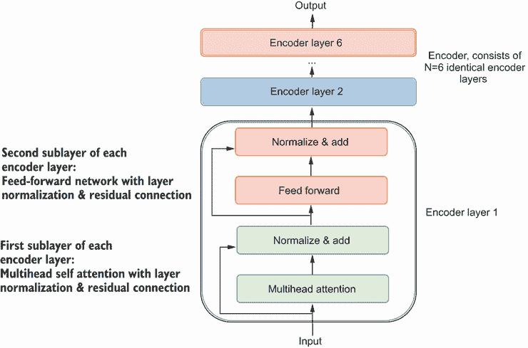
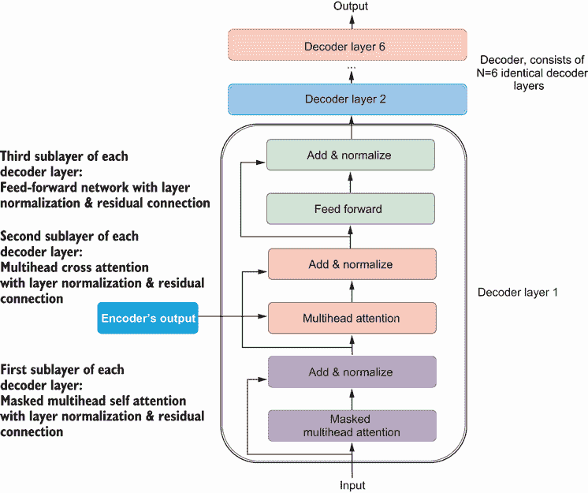
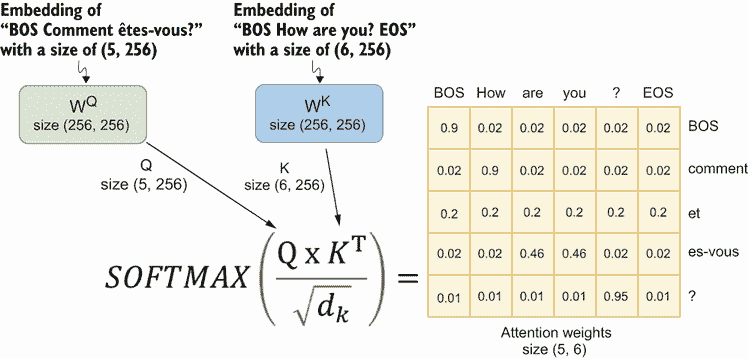
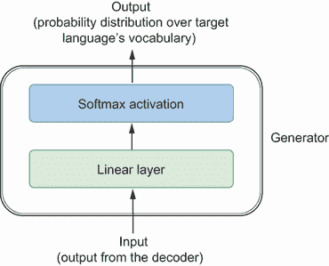

# 第九章：注意力和 Transformer 的逐行实现

本章节涵盖

+   Transformer 中编码器和解码器的架构和功能

+   注意力机制如何使用查询、键和值来为序列中的元素分配权重

+   不同类型的 Transformer

+   从零开始构建用于语言翻译的 Transformer

Transformers 是先进的深度学习模型，在处理序列到序列预测挑战方面表现出色，优于旧模型如循环神经网络（RNNs）和卷积神经网络（CNNs）。它们的优势在于有效地理解输入和输出序列中元素之间的关系，尤其是在文本中相隔较远的两个单词。与 RNNs 不同，Transformers 能够进行并行训练，显著缩短训练时间，并能够处理大量数据集。这种变革性的架构在大型语言模型（LLMs）如 ChatGPT、BERT 和 T5 的开发中发挥了关键作用，标志着人工智能进步的重要里程碑。

在 2017 年一篇开创性的论文“Attention Is All You Need”中，由一组谷歌研究人员提出之前（^(1))，自然语言处理（NLP）和类似任务主要依赖于循环神经网络（RNNs），包括长短期记忆（LSTM）模型。然而，RNNs 按顺序处理信息，由于无法并行训练以及难以保持序列早期部分的信息，因此限制了它们的速度，并且无法捕捉长期依赖关系。

Transformer 架构的革命性方面是其注意力机制。该机制通过分配权重来评估序列中单词之间的关系，根据训练数据确定单词之间在意义上的相关程度。这使得模型如 ChatGPT 能够理解单词之间的关系，从而更有效地理解人类语言。输入的非顺序处理允许并行训练，减少训练时间，并促进大量数据集的使用，从而推动了知识型 LLMs 的兴起和当前人工智能进步的激增。

在本章中，我们将逐行实现从零开始创建 Transformer 的过程，基于论文“Attention Is All You Need.”。一旦训练完成，Transformer 可以处理任何两种语言之间的翻译（例如德语到英语或英语到中文）。在下一章中，我们将专注于训练本章开发的 Transformer 以执行英语到法语翻译。

要从头开始构建 Transformer，我们将探索自注意力机制的内部工作原理，包括查询、键和值向量的作用，以及缩放点积注意力（SDPA）的计算。我们将通过将层归一化和残差连接集成到多头注意力层中，并将其与前馈层结合来构建编码器层。然后，我们将堆叠六个这样的编码器层来形成编码器。同样，我们将在 Transformer 中开发一个解码器，它能够一次生成一个翻译标记，基于之前的翻译标记和编码器的输出。

这个基础将使你能够训练 Transformer 进行任何两种语言之间的翻译。在下一章中，你将学习如何使用包含超过 47,000 个英法翻译数据集来训练 Transformer。你将见证训练好的模型将常见的英语短语翻译成法语，其准确度与使用谷歌翻译相当。

## 9.1 注意力和 Transformer 简介

要掌握机器学习中 Transformer 的概念，首先理解注意力机制是至关重要的。这种机制使 Transformer 能够识别序列元素之间的长距离依赖关系，这是它们与早期的序列预测模型（如 RNNs）的区别之一。有了这个机制，Transformer 可以同时关注序列中的每个元素，理解每个单词的上下文。

以“bank”这个词为例，说明注意力机制如何根据上下文来解释单词。在句子“我昨天在河边钓鱼，整个下午都待在河岸附近”中，“bank”与“fishing”相关联，因为它指的是河流旁边的区域。在这里，Transformer 将“bank”理解为河流地形的一部分。

相比之下，在“Kate 昨天下班后去了银行，并在那里存了一张支票”这句话中，“bank”与“check”相关联，导致 Transformer 将“bank”识别为金融机构。这个例子展示了 Transformer 如何根据其周围的上下文来辨别单词的含义。

在本节中，你将更深入地了解注意力机制，探索它是如何工作的。这个过程对于确定句子中各个单词的重要性或权重至关重要。之后，我们将检查不同 Transformer 模型的结构，包括一种能够翻译任何两种语言之间的模型。

### 9.1.1 注意力机制

注意力机制是一种用于确定序列中元素之间相互连接的方法。它计算分数来指示一个元素与序列中其他元素的关系，分数越高表示关系越强。在 NLP 中，这种机制对于在句子中有意义地连接单词至关重要。本章将指导你实现用于语言翻译的注意力机制。

为了这个目的，我们将构建一个由编码器和解码器组成的 Transformer。然后，在下一章中，我们将训练这个 Transformer 将英语翻译成法语。编码器将一个英语句子，例如“你好吗？”，转换成捕捉其意义的向量表示。然后解码器使用这些向量表示来生成法语翻译。

为了将短语“你好吗？”转换成向量表示，模型首先将其分解成标记`[how, are, you, ?]`，这个过程与你在第八章中做过的类似。这些标记每个都由一个 256 维的向量表示，称为词嵌入，它捕捉每个标记的意义。编码器还采用了位置编码，这是一种确定标记在序列中位置的方法。这种位置编码被添加到词嵌入中，以创建输入嵌入，然后用于计算自注意力。短语“你好吗？”的输入嵌入形成一个维度为(4, 256)的张量，其中 4 代表标记的数量，256 是每个嵌入的维度性。

尽管计算注意力的方法有很多种，但我们将使用最常见的方法，即 SDPA。这种机制也被称为自注意力，因为算法计算一个词如何关注序列中的所有词，包括它自己。图 9.1 展示了如何计算 SDPA 的示意图。


图 9.1 自注意力机制的示意图。为了计算注意力，首先将输入嵌入 X 通过三个带有权重 W^Q、W^K 和 W^V 的神经网络层。输出是查询 Q、键 K 和值 V。缩放后的注意力分数是 Q 和 K 的乘积除以 K 的维度的平方根，d[k]。我们对缩放后的注意力分数应用 softmax 函数以获得注意力权重。注意力是注意力权重和值 V 的乘积。

在计算注意力时使用查询、键和值的方法受到了检索系统的启发。考虑访问一个公共图书馆来寻找一本书。如果你在图书馆的搜索引擎中搜索“金融中的机器学习”，这个短语就变成了你的查询。图书馆中的书籍标题和描述作为键。根据你的查询与这些键之间的相似性，图书馆的检索系统会建议一系列书籍（值）。标题或描述中包含“机器学习”、“金融”或两者之一的书籍可能会排名更高。相比之下，与这些术语无关的书籍将具有较低的匹配分数，因此不太可能被推荐。

要计算 SDPA，输入嵌入 X 通过三个不同的神经网络层进行处理。这些层的相应权重是 W^Q、W^K 和 W^V；每个的维度为 256 × 256。这些权重在训练阶段从数据中学习。因此，我们可以计算查询 Q、键 K 和值 V，Q = X * W^Q，K = X * Q^K，V = X * W^V。Q、K 和 V 的维度与输入嵌入 X 的维度相匹配，即 4 × 256。

与我们之前提到的检索系统示例类似，在注意力机制中，我们使用 SDPA 方法来评估查询向量和键向量之间的相似性。SDPA 包括计算查询（Q）和键（K）向量的点积。高点积表示两个向量之间有很强的相似性，反之亦然。例如，在句子“你怎么样？”中，缩放后的注意力分数计算如下：

|


| (9.1) |
| --- |

其中 d[k]表示键向量 K 的维度，在我们的情况下是 256。我们将 Q 和 K 的点积乘以 d[k]的平方根以稳定训练。这种缩放是为了防止点积的幅度过大。当这些向量的维度（即嵌入的深度）很高时，查询和键向量之间的点积可以变得非常大。这是因为查询向量的每个元素都与键向量的每个元素相乘，然后这些乘积相加。

下一步是将 softmax 函数应用于这些注意力分数，将它们转换为注意力权重。这确保了单词对句子中所有单词的总注意力加起来为 100%。



图 9.2 计算注意力权重的步骤。输入嵌入通过两个神经网络传递以获得查询 Q 和键 K。缩放后的注意力分数是 Q 和 K 的点积除以 K 的维度平方根。最后，我们对缩放后的注意力分数应用 softmax 函数以获得注意力权重，这些权重展示了序列中每个元素与其他所有元素的关系。

图 9.2 展示了这一过程。对于句子“你怎么样？”，注意力权重形成一个 4 × 4 矩阵，显示了`["How", "are," "you," "?"]`中的每个标记如何与其他所有标记（包括自身）相关。图 9.2 中的数字是为了说明这一点而编造的。例如，注意力权重的第一行显示标记`"How"`将其 10%的注意力分配给自己，将 40%、40%和 10%分别分配给其他三个标记。

最终的注意力是这些注意力权重与值向量 V（如图 9.3 所示）的点积：

|


| (9.2) |
| --- |



图 9.3 使用注意力权重和价值向量计算注意力向量。输入嵌入通过神经网络传递以获得价值 V。最终的注意力是我们之前计算的注意力权重与价值向量 V 的点积。

这个输出也保持了一个 4 × 256 的维度，与我们的输入维度一致。

总结来说，这个过程从句子“你好吗？”的输入嵌入 X 开始，其维度为 4 × 256。这个嵌入捕捉了四个单独标记的含义，但缺乏上下文理解。注意力机制以输出`attention(Q,K,V)`结束，其维度保持为 4 × 256。这个输出可以看作是原始四个标记的上下文丰富组合。原始标记的权重根据每个标记的上下文相关性而变化，赋予句子上下文中更重要的单词更多的意义。通过这一过程，注意力机制将代表孤立标记的向量转化为充满上下文意义的向量，从而从句子中提取更丰富、更细腻的理解。

此外，Transformer 模型不是使用一套查询、键和值向量，而是使用一个称为多头注意力的概念。例如，256 维度的查询、键和值向量可以被分成，比如说，8 个头，每个头有一组查询、键和值向量，其维度为 32（因为 256/8 = 32）。每个头关注输入的不同部分或方面，使模型能够捕捉更广泛的信息，并形成对输入数据的更详细和上下文化的理解。多头注意力在句子中一个单词有多个意义时特别有用，比如在双关语中。让我们继续我们之前提到的“银行”例子。考虑这个双关语笑话，“为什么河流这么富饶？因为它有两个河岸。”在下一章将英语翻译成法语的项目中，你将亲自动手将 Q、K 和 V 分割成多个头，在每个头中计算注意力，然后再将它们连接成一个单一的注意力向量。

### 9.1.2 Transformer 架构

注意力机制的这一概念是由巴哈纳乌、乔和本吉奥在 2014 年提出的.^(2) 在开创性的论文“注意力即一切”发表后，它得到了广泛的应用，该论文专注于为机器语言翻译创建一个模型。这个模型的结构，被称为 Transformer，在图 9.4 中展示。它具有一个编码器-解码器结构，该结构高度依赖于注意力机制。在本章中，你将从头开始构建这个模型，逐行编码，目的是训练它进行任何两种语言之间的翻译。



图 9.4 Transformer 架构。Transformer 中的编码器（图左侧），由 N 个相同的编码器层组成，学习输入序列的意义并将其转换为表示其意义的向量。然后，它将这些向量传递给解码器（图右侧），解码器由 N 个相同的解码器层组成。解码器通过预测序列中的每个标记，并根据序列中的先前标记和解码器从编码器获得的向量表示来构建输出（例如，英语短语的法语翻译）。右上角的生成器是连接到解码器输出的头部，以便输出是目标语言中所有标记的概率分布（例如，法语词汇）。

让我们以英语到法语的翻译为例。Transformer 的编码器将英语句子“我不说法语”转换成存储其意义的向量表示。然后，Transformer 的解码器处理这些表示以生成法语翻译“Je ne parle pas français”。编码器的角色是捕捉原始英语句子的本质。例如，如果编码器有效，它应该将“我不说法语”和“我并不说法语”翻译成相似的向量表示。因此，解码器将解释这些向量并生成相似的翻译。有趣的是，当使用 ChatGPT 时，这两个英语短语确实产生了相同的法语翻译。

Transformer 中的编码器通过首先对英语和法语句子进行标记化来处理任务。这与第八章中描述的过程类似，但有一个关键的区别：它采用子词标记化。子词标记化是 NLP 中用于将单词分解成更小的组成部分或子词的技术，这使得处理更加高效和细致。例如，正如你将在下一章中看到的，英语短语“我不说法语”被分为六个标记：（`i, do, not, speak, fr, ench`）。同样，其法语对应短语“Je ne parle pas français”被标记化为六个部分：（`je, ne, parle, pas, franc, ais`）。这种标记化方法增强了 Transformer 处理语言变化和复杂性的能力。

深度学习模型，包括 Transformer，不能直接处理文本，因此在输入模型之前，需要对标记进行索引。这些标记通常首先使用我们第八章讨论的一热编码表示。然后，我们将它们通过词嵌入层传递，以将它们压缩成具有连续值的更小向量，例如长度为 256 的向量。因此，在应用词嵌入后，“我不说法语”这个句子被表示为一个 6×256 的矩阵。

与处理数据序列的 RNN 不同，Transformers 并行处理输入数据，如句子。这种并行性提高了它们的效率，但并不固有地允许它们识别输入序列的顺序。为了解决这个问题，Transformers 将位置编码添加到输入嵌入中。这些位置编码是分配给输入序列中每个位置的独特向量，并且与输入嵌入在维度上对齐。向量值由一个特定的位置函数确定，特别是涉及不同频率的正弦和余弦函数，定义为

|


| |
| --- |

|



| (9.3) |
| --- |

在这些方程中，向量使用正弦函数计算偶数索引，使用余弦函数计算奇数索引。参数*pos*和*i*分别代表序列中标记的位置和向量中的索引。作为一个例子，考虑短语“我不会说法语”的位置编码。这被表示为一个 6 × 256 的矩阵，与句子的词嵌入大小相同。在这里，*pos*的范围从 0 到 5，索引 2i 和 2i + 1 共同涵盖了 256 个不同的值（从 0 到 255）。这种位置编码方法的一个有益方面是，所有值都被限制在-1 到 1 的范围内。

需要注意的是，每个标记位置都由一个 256 维向量唯一标识，并且这些向量值在整个训练过程中保持不变。在输入到注意力层之前，这些位置编码被添加到序列的词嵌入中。以句子“我不会说法语”为例，编码器在将它们组合成一个单一的 6 × 256 维表示之前，生成了词嵌入和位置编码，每个都有 6 × 256 的维度。随后，编码器应用注意力机制来细化这个嵌入，形成更复杂的向量表示，以捕捉短语的整体意义，然后再将它们传递给解码器。

如图 9.5 所示，Transformer 的编码器由六个相同的层（N = 6）组成。这些层中的每一层都包含两个不同的子层。第一个子层是一个多头自注意力层，类似于之前讨论过的。第二个子层是一个基本的、位置性的、全连接的前馈网络。这个网络独立地处理序列中的每个位置，而不是将其作为序列元素。在模型的架构中，每个子层都包含层归一化和残差连接。层归一化将观察值规范化为零均值和单位标准差。这种归一化有助于稳定训练过程。在归一化层之后，我们执行残差连接。这意味着每个子层的输入被添加到其输出中，增强了网络中信息流的流动。



图 9.5 Transformer 中编码器的结构。编码器由 N = 6 个相同的编码器层组成。每个编码器层包含两个子层。第一个子层是一个多头自注意力层，第二个子层是一个前馈网络。每个子层都使用层归一化和残差连接。

如图 9.6 所示，Transformer 模型的解码器由六个相同的解码器层（N = 6）组成。这些解码器层中的每一个都包含三个子层：一个多头自注意力子层，一个在第一个子层输出和编码器输出之间执行多头交叉注意力的子层，以及一个前馈子层。请注意，每个子层的输入是前一个子层的输出。此外，解码器层中的第二个子层还接受编码器的输出作为输入。这种设计对于整合编码器中的信息至关重要：这就是解码器如何根据编码器的输出生成翻译。



图 9.6 Transformer 中解码器的结构。解码器由 N = 6 个相同的解码器层组成。每个解码器层包含三个子层。第一个子层是一个带掩码的多头自注意力层。第二个子层是一个多头交叉注意力层，用于计算第一个子层输出和编码器输出之间的交叉注意力。第三个子层是一个前馈网络。每个子层都使用层归一化和残差连接。

解码器自注意力子层的一个关键方面是掩码机制。这个掩码防止模型访问序列中的未来位置，确保特定位置的预测只能依赖于之前已知的元素。这种序列依赖性对于语言翻译或文本生成等任务至关重要。

解码过程从解码器接收一个法语输入短语开始。解码器将法语标记转换为词嵌入和位置编码，然后将它们组合成一个单一的嵌入。这一步骤确保模型不仅理解短语的语义内容，而且保持序列上下文，这对于准确的翻译或生成任务至关重要。

解码器以自回归的方式运行，一次生成一个标记的输出序列。在第一次时间步，它从 `"BOS"` 标记开始，这表示句子的开始。使用这个起始标记作为其初始输入，解码器检查英语短语 “I do not speak French” 的向量表示，并尝试预测 `"BOS"` 后的第一个标记。假设解码器的第一个预测是 `"Je"`。在下一个时间步，它然后使用序列 `"BOS Je"` 作为其新的输入来预测下一个标记。这个过程以迭代方式继续，解码器将每个新预测的标记添加到其输入序列中，以便进行后续预测。

翻译过程被设计为在解码器预测 `"EOS"` 标记时结束，这标志着句子的结束。在准备训练数据时，我们在每个短语的末尾添加 EOS，这样模型就学会了这意味着句子的结束。当达到这个标记时，解码器识别到翻译任务的完成并停止其操作。这种自回归方法确保解码过程中的每一步都由之前预测的所有标记提供信息，从而实现连贯和上下文适当的翻译。

### 9.1.3 不同类型的 Transformer

有三种类型的 Transformer：仅编码器 Transformer、仅解码器 Transformer 和编码器-解码器 Transformer。我们在这章和下一章中使用的是编码器-解码器 Transformer，但你将在本书的后面有机会亲自探索仅解码器 Transformer。

仅包含编码器的 Transformer 由图 9.4 左侧所示的 N 个相同的编码器层组成，并且能够将序列转换为抽象的连续向量表示。例如，BERT 就是一个仅包含 12 个编码器层的编码器-only Transformer。仅包含编码器的 Transformer 可以用于文本分类，例如。如果两个句子具有相似的向量表示，我们可以将这两个句子分类到同一类别。另一方面，如果两个序列具有非常不同的向量表示，我们可以将它们放入不同的类别中。

仅解码器 Transformer 也由 N 个相同的层组成，每个层都是图 9.4 右侧所示的解码器层。例如，ChatGPT 是一个包含许多解码器层的仅解码器 Transformer。仅解码器 Transformer 可以根据提示生成文本，例如。它提取提示中单词的语义含义并预测最可能的下一个标记。然后它将标记添加到提示的末尾并重复此过程，直到文本达到一定长度。

我们之前讨论的机器翻译 Transformer 是编码器-解码器 Transformer 的一个例子。它们对于处理复杂任务（如文本到图像生成或语音识别）是必需的。编码器-解码器 Transformer 结合了编码器和解码器的优点。编码器在处理和理解输入数据方面效率高，而解码器在生成输出方面表现卓越。这种组合使模型能够有效地理解复杂的输入（如文本或语音）并生成复杂的输出（如图像或转录文本）。

## 9.2 构建编码器

我们将开发并训练一个针对机器语言翻译设计的编码器-解码器 Transformer。本项目中的编码来自 Chris Cui 的将中文翻译成英文的工作([`mng.bz/9o1o`](https://mng.bz/9o1o))和 Alexander Rush 的德语到英语翻译项目([`mng.bz/j0mp`](https://mng.bz/j0mp))。

本节讨论了如何在 Transformer 中构建编码器。具体来说，我们将深入探讨构建每个编码器层内各种子层的过程以及实现多头自注意力机制。

### 9.2.1 注意力机制

尽管存在不同的注意力机制，但我们将使用 SDPA，因为它被广泛使用且有效。SDPA 注意力机制使用查询、键和值来计算序列中元素之间的关系。它分配分数以显示一个元素与序列中所有元素（包括该元素本身）的关系。

与使用一组查询、键和值向量不同，Transformer 模型使用了一个称为多头注意力的概念。我们的 256 维查询、键和值向量被分成 8 个头，每个头都有一组查询、键和值向量，维度为 32（因为 256/8 = 32）。每个头关注输入的不同部分或方面，使模型能够捕捉更广泛的信息，并对输入数据形成更详细和上下文化的理解。例如，多头注意力允许模型捕捉双关语笑话中“bank”一词的多种含义，“为什么这条河这么富饶？因为它有两个河岸。”

为了实现这一点，我们在本地模块 ch09util 中定义了一个 `attention()` 函数。从本书的 GitHub 仓库([`github.com/markhliu/DGAI`](https://github.com/markhliu/DGAI))下载文件 ch09util.py 并将其存储在您计算机的 /utils/ 目录中。`attention()` 函数的定义如下所示。

列表 9.1 基于查询、键和值计算注意力

```py
def attention(query, key, value, mask=None, dropout=None):
    d_k = query.size(-1)
    scores = torch.matmul(query, 
              key.transpose(-2, -1)) / math.sqrt(d_k)       ①
    if mask is not None:
        scores = scores.masked_fill(mask == 0, -1e9)        ②
    p_attn = nn.functional.softmax(scores, dim=-1)          ③
    if dropout is not None:
        p_attn = dropout(p_attn)
    return torch.matmul(p_attn, value), p_attn              ④
```

① 缩放后的注意力分数是查询和键的点积，乘以 d[k] 的平方根。

② 如果有掩码，则隐藏序列中的未来元素

③ 计算注意力权重

④ 返回注意力和注意力权重

`attention()`函数接受查询、键和值作为输入，并计算注意力和注意力权重，正如我们在本章前面讨论的那样。缩放后的注意力分数是查询和键的点积，乘以键的维度的平方根*d[k]*。我们应用 softmax 函数到缩放后的注意力分数以获得注意力权重。最后，注意力是注意力权重和值的点积。

让我们使用我们的运行示例来展示多头注意力的工作原理（见图 9.7）。"你好吗？"的嵌入是一个大小为(1, 6, 256)的张量，正如我们在上一节中解释的（在我们将位置编码添加到词嵌入之后）。请注意，1 表示批处理中有一个句子，句子中有六个标记而不是四个，因为我们向序列的开始和结束添加了 BOS 和 EOS。这个嵌入通过三个线性层传递，以获得查询 Q、键 K 和值 V，每个的大小相同（1, 6, 256）。这些被分成八个头，现在每个头的大小为(1, 6, 256/8 = 32)。根据前面定义的注意力函数，将这些集合中的每个都应用注意力函数，产生八个注意力输出，每个的大小也是(1, 6, 32)。然后，我们将八个注意力输出连接成一个单一的注意力，结果是大小为(1, 6, 32 × 8 = 256)的张量。最后，这个组合注意力通过另一个大小为 256 × 256 的线性层，导致`MultiHeadAttention()`类的输出。这个输出保持了原始输入的维度，即(1, 6, 256)。


图 9.7 多头注意力的一个示例。此图以短语“你好吗？”的多头自注意力计算为例。我们首先将嵌入通过三个神经网络传递，以获得查询 Q、键 K 和值 V，每个的大小为(1, 6, 256)。我们将它们分成八个头，每个头都有一组 Q、k 和 V，大小为(1, 6, 32)。我们在每个头中计算注意力。然后，将八个头的注意力向量合并回一个单一的注意力向量，大小为(1, 6, 256)。

这在以下本地模块的代码列表中实现。

列表 9.2 计算多头注意力

```py
from copy import deepcopy
class MultiHeadedAttention(nn.Module):
    def __init__(self, h, d_model, dropout=0.1):
        super().__init__()
        assert d_model % h == 0
        self.d_k = d_model // h
        self.h = h
        self.linears = nn.ModuleList([deepcopy(
            nn.Linear(d_model, d_model)) for i in range(4)])
        self.attn = None
        self.dropout = nn.Dropout(p=dropout)

    def forward(self, query, key, value, mask=None):
        if mask is not None:
            mask = mask.unsqueeze(1)
        nbatches = query.size(0)  
        query, key, value = [l(x).view(nbatches, -1, self.h,
           self.d_k).transpose(1, 2)    
         for l, x in zip(self.linears, (query, key, value))]    ①
        x, self.attn = attention(
            query, key, value, mask=mask, dropout=self.dropout) ②
        x = x.transpose(1, 2).contiguous().view(
            nbatches, -1, self.h * self.d_k)                    ③
        output = self.linears-1                            ④
        return output
```

① 将输入通过三个线性层传递以获得 Q、K、V，并将它们分成多头

② 计算每个头的注意力和注意力权重

③ 将多头注意力向量连接成一个单一的注意力向量

④ 将输出通过一个线性层

每个编码器层和解码器层也包含一个前馈子层，这是一个两层全连接神经网络，其目的是增强模型在训练数据集中捕获和学习的复杂特征的能力。此外，神经网络独立处理每个嵌入。它不将嵌入序列视为单个向量。因此，我们通常称其为位置感知的前馈网络（或一维卷积网络）。为此，我们在本地模块中定义了一个`PositionwiseFeedForward()`类，如下所示：

```py
class PositionwiseFeedForward(nn.Module):
    def __init__(self, d_model, d_ff, dropout=0.1):
        super().__init__()
        self.w_1 = nn.Linear(d_model, d_ff)
        self.w_2 = nn.Linear(d_ff, d_model)
        self.dropout = nn.Dropout(dropout)
    def forward(self, x):
        h1 = self.w_1(x)
        h2 = self.dropout(h1)
        return self.w_2(h2) 
```

`PositionwiseFeedForward()`类使用两个关键参数定义：`d_ff`，表示前馈层的维度，和`d_model`，表示模型的维度大小。通常，`d_ff`被选择为`d_model`的四倍。在我们的例子中，`d_model`是 256，因此我们将`d_ff`设置为 256 * 4 = 1024。与模型大小相比扩大隐藏层的方法是 Transformer 架构中的标准做法。这增强了网络在训练数据集中捕获和学习的复杂特征的能力。

### 9.2.2 创建编码器

要创建一个编码器层，我们首先定义以下`EncoderLayer()`类和`SublayerConnection()`类。

列表 9.3 定义编码器层的类

```py
class EncoderLayer(nn.Module):
    def __init__(self, size, self_attn, feed_forward, dropout):
        super().__init__()
        self.self_attn = self_attn
        self.feed_forward = feed_forward
        self.sublayer = nn.ModuleList([deepcopy(
        SublayerConnection(size, dropout)) for i in range(2)])
        self.size = size  
    def forward(self, x, mask):
        x = self.sublayer0)     ①
        output = self.sublayer1     ②
        return output
class SublayerConnection(nn.Module):
    def __init__(self, size, dropout):
        super().__init__()
        self.norm = LayerNorm(size)
        self.dropout = nn.Dropout(dropout)
    def forward(self, x, sublayer):
        output = x + self.dropout(sublayer(self.norm(x)))   ③
        return output  
```

① 每个编码器层中的第一个子层是一个多头自注意力网络。

② 每个编码器层中的第二个子层是一个前馈网络。

③ 每个子层都经过残差连接和层归一化。

每个编码器层由两个不同的子层组成：一个是`MultiHeadAttention()`类中概述的多头自注意力层，另一个是`PositionwiseFeedForward()`类中指定的简单、位置感知的全连接前馈网络。此外，这两个子层都包含层归一化和残差连接。正如第六章所述，残差连接涉及通过一系列变换（在此上下文中是注意力或前馈层）传递输入，然后将输入添加到这些变换的输出中。残差连接的方法被用来对抗梯度消失问题，这是非常深的网络中常见的挑战。在 Transformers 中，残差连接的另一个好处是提供一个通道，将位置编码（仅在第一层之前计算）传递到后续层。

层归一化与我们在第四章中实现的批归一化有些类似。它将层中的观察值标准化为零均值和单位标准差。为了在本地模块中实现这一点，我们定义了`LayerNorm()`类，该类执行层归一化如下：

```py
class LayerNorm(nn.Module):
    def __init__(self, features, eps=1e-6):
        super().__init__()
        self.a_2 = nn.Parameter(torch.ones(features))
        self.b_2 = nn.Parameter(torch.zeros(features))
        self.eps = eps
    def forward(self, x):
        mean = x.mean(-1, keepdim=True) 
        std = x.std(-1, keepdim=True)
        x_zscore = (x - mean) / torch.sqrt(std ** 2 + self.eps)
        output = self.a_2*x_zscore+self.b_2
        return output 
```

在前面的`LayerNorm()`类中的`mean`和`std`值是每个层中输入的均值和标准差。`LayerNorm()`类中的`a_2`和`b_2`层将`x_zscore`扩展回输入`x`的形状。

现在我们可以通过堆叠六个编码器层来创建一个编码器。为此，我们在本地模块中定义了`Encoder()`类：

```py
from copy import deepcopy
class Encoder(nn.Module):
    def __init__(self, layer, N):
        super().__init__()
        self.layers = nn.ModuleList(
            [deepcopy(layer) for i in range(N)])
        self.norm = LayerNorm(layer.size)
    def forward(self, x, mask):
        for layer in self.layers:
            x = layer(x, mask)
            output = self.norm(x)
        return output
```

在这里，`Encoder()`类使用两个参数定义：`layer`，它是一个编码器层，如列表 9.3 中定义的`EncoderLayer()`类中的编码器层，以及`N`，编码器中编码器层的数量。`Encoder()`类接受输入`x`（例如，一批英语短语）和掩码（以屏蔽序列填充，如我在第十章中解释的）以生成输出（捕获英语短语意义的向量表示）。

这样，你就创建了一个编码器。接下来，你将学习如何创建一个解码器。

## 9.3 构建编码器-解码器 Transformer

现在你已经了解了如何在 Transformer 中创建编码器，让我们继续到解码器。在本节中，你将首先学习如何创建解码器层。然后，你将堆叠 N = 6 个相同的解码器层来形成一个解码器。

然后，我们创建了一个包含五个组件的编码器-解码器 Transformer：`encoder`、`decoder`、`src_embed`、`tgt_embed`和`generator`，我将在本节中解释这些。

### 9.3.1 创建解码器层

每个解码器层由三个子层组成：（1）一个多头自注意力层，（2）第一个子层的输出与编码器输出的交叉注意力，以及（3）一个前馈网络。这三个子层都包含一个层归一化和残差连接，类似于我们在编码器层中做的。此外，解码器堆叠的多头自注意力子层被掩码，以防止位置关注后续位置。掩码迫使模型使用序列中的先前元素来预测后续元素。我将在稍后解释掩码多头自注意力是如何工作的。为了实现这一点，我们在本地模块中定义了`DecoderLayer()`类。

列表 9.4 创建解码器层

```py
class DecoderLayer(nn.Module):
    def __init__(self, size, self_attn, src_attn,
                 feed_forward, dropout):
        super().__init__()
        self.size = size
        self.self_attn = self_attn
        self.src_attn = src_attn
        self.feed_forward = feed_forward
        self.sublayer = nn.ModuleList([deepcopy(
        SublayerConnection(size, dropout)) for i in range(3)])
    def forward(self, x, memory, src_mask, tgt_mask):
        x = self.sublayer0)             ①
        x = self.sublayer1)    ②
        output = self.sublayer2         ③
        return output
```

① 第一个子层是一个掩码多头自注意力层。

② 第二个子层是在目标语言和源语言之间的交叉注意力层。

③ 第三个子层是一个前馈网络。

为了说明解码器层的操作，让我们考虑我们正在进行的例子。解码器接收标记`['BOS', 'comment', 'et', 'es-vous', '?']`以及编码器的输出（在前面代码块中称为`memory`），来预测序列`['comment', 'et', 'es-vous', '?', 'EOS']`。`['BOS', 'comment', 'et', 'es-vous', '?']`的嵌入是一个大小为（1，5，256）的张量：1 是批次中的序列数量，5 是序列中的标记数量，256 表示每个标记由一个 256 值的向量表示。我们把这个嵌入通过第一个子层，一个带掩码的多头自注意力层。这个过程与您在编码器层中看到的早期多头自注意力计算类似。然而，这个过程利用了一个掩码，在前面代码块中指定为`tgt_mask`，它是一个 5 × 5 的张量，在当前例子中的值如下：

```py
tensor([[ True, False, False, False, False],
        [ True,  True, False, False, False],
        [ True,  True,  True, False, False],
        [ True,  True,  True,  True, False],
        [ True,  True,  True,  True,  True]], device='cuda:0')
```

如您可能已经注意到的，掩码的下半部分（张量中低于主对角线的值）被设置为`True`，而上半部分（主对角线以上的值）被设置为`False`。当这个掩码应用于注意力分数时，它会导致在第一次时间步中第一个标记只关注自身。在第二次时间步中，注意力分数仅计算在第一个和第二个标记之间。随着过程的继续，例如，在第三次时间步中，解码器使用标记`['BOS', 'comment', 'et']`来预测标记`'es-vous'`，并且注意力分数仅在这三个标记之间计算，有效地隐藏了未来的标记`['es-vous', '?']`

按照这个流程，从第一个子层生成的输出，它是一个大小为（1，5，256）的张量，与输入的大小相匹配。这个输出，我们可以称之为 x，然后被输入到第二个子层。在这里，x 和编码器堆栈的输出（在前面代码块中称为`memory`）之间计算交叉注意力。您可能还记得，`memory`的维度是（1，6，256），因为英语短语“你好吗？”被转换成六个标记`['BOS', 'how', 'are', 'you', '?', 'EOS']`。

图 9.8 展示了如何计算交叉注意力权重。为了计算 x 和 `memory` 之间的交叉注意力，我们首先将 x 通过一个神经网络来获得查询，其维度为 (1, 5, 256)。然后我们将 `memory` 通过两个神经网络来获得键和值，每个的维度为 (1, 6, 256)。使用方程 9.1 中指定的公式计算缩放后的注意力分数。这个缩放后的注意力分数的维度为 (1, 5, 6)：查询 Q 的维度为 (1, 5, 256)，转置后的键 K 的维度为 (1, 256, 6)。因此，缩放后的注意力分数，即这两个向量的点积，并乘以 √*d[k]*，其大小为 (1, 5, 6)。在将缩放后的注意力分数应用 softmax 函数后，我们获得注意力权重，这是一个 5 × 6 的矩阵。这个矩阵告诉我们，在法语输入 `['BOS', 'comment', 'et', 'es-vous', '?']` 中的五个标记如何关注英语短语 `['BOS', 'how', 'are', 'you', '?', 'EOS']` 中的六个标记。这就是解码器在翻译时如何捕捉英语短语的含义。



图 9.8 展示了解码器输入和编码器输出之间如何计算交叉注意力权重的一个例子。解码器的输入通过一个神经网络来获得查询 Q。编码器的输出通过一个不同的神经网络来获得键 K。缩放后的交叉注意力分数是通过 Q 和 K 的点积除以 K 的维度平方根来计算的。最后，我们对缩放后的交叉注意力分数应用 softmax 函数，以获得交叉注意力权重，这显示了 Q 中的每个元素与 K 中的所有元素之间的关系。

第二个子层中的最终交叉注意力是通过注意力权重和值向量 V 的点积来计算的。注意力权重的维度为 (1, 5, 6)，值向量的维度为 (1, 6, 256)，因此最终的交叉注意力，即这两个向量的点积，其大小为 (1, 5, 256)。因此，第二个子层的输入和输出具有相同的维度 (1, 5, 256)。经过这个第二个子层的处理之后，输出随后通过第三个子层，这是一个前馈网络。

### 9.3.2 创建编码器-解码器 Transformer

解码器由 N = 6 个相同的解码器层组成。

`Decoder()` 类在本地模块中的定义如下：

```py
class Decoder(nn.Module):
    def __init__(self, layer, N):
        super().__init__()
        self.layers = nn.ModuleList(
            [deepcopy(layer) for i in range(N)])
        self.norm = LayerNorm(layer.size)
    def forward(self, x, memory, src_mask, tgt_mask):
        for layer in self.layers:
            x = layer(x, memory, src_mask, tgt_mask)
        output = self.norm(x)
        return output
```

要创建一个编码器-解码器 Transformer，我们首先在本地模块中定义一个 `Transformer()` 类。打开文件 ch09util.py，你会看到类的定义如下所示。

列表 9.5 表示编码器-解码器 Transformer 的类

```py
class Transformer(nn.Module):
    def __init__(self, encoder, decoder,
                 src_embed, tgt_embed, generator):
        super().__init__()
        self.encoder = encoder                                ①
        self.decoder = decoder                                ②
        self.src_embed = src_embed
        self.tgt_embed = tgt_embed
        self.generator = generator
    def encode(self, src, src_mask):
        return self.encoder(self.src_embed(src), src_mask)
    def decode(self, memory, src_mask, tgt, tgt_mask):
        return self.decoder(self.tgt_embed(tgt), 
                            memory, src_mask, tgt_mask)
    def forward(self, src, tgt, src_mask, tgt_mask):
        memory = self.encode(src, src_mask)                   ③
        output = self.decode(memory, src_mask, tgt, tgt_mask) ④
        return output
```

① 在 Transformer 中定义编码器

② 在 Transformer 中定义解码器

③ 源语言被编码成抽象向量表示。

④ 解码器使用这些向量表示来生成目标语言的翻译。

`Transformer()`类由五个关键组件构成：`encoder`、`decoder`、`src_embed`、`tgt_embed`和`generator`。编码器和解码器由之前定义的`Encoder()`和`Decoder()`类表示。在下一章中，你将学习生成源语言嵌入：我们将使用词嵌入和位置编码处理英语短语的数值表示，将结果组合形成`src_embed`组件。同样，对于目标语言，我们以相同的方式处理法语短语的数值表示，将组合输出作为`tgt_embed`组件。生成器为与目标语言中的标记相对应的每个索引生成预测概率。我们将在下一节定义一个`Generator()`类来完成此目的。

## 9.4 将所有部件组合在一起

在本节中，我们将把所有部件组合起来，创建一个可以翻译任何两种语言的模型。

### 9.4.1 定义生成器

首先，我们在本地模块中定义一个`Generator()`类来生成下一个标记的概率分布（见图 9.9）。想法是为解码器附加一个头部以用于下游任务。在我们下一章的例子中，下游任务是预测法语翻译中的下一个标记。



图 9.9 Transformer 中生成器的结构。生成器将解码器堆栈的输出转换为目标语言词汇表上的概率分布，以便 Transformer 可以使用该分布来预测英语短语的法语翻译中的下一个标记。生成器包含一个线性层，因此输出数量与法语词汇表中的标记数量相同。生成器还对输出应用 softmax 激活，以便输出是一个概率分布。

该类定义如下：

```py
class Generator(nn.Module):
    def __init__(self, d_model, vocab):
        super().__init__()
        self.proj = nn.Linear(d_model, vocab)

    def forward(self, x):
        out = self.proj(x)
        probs = nn.functional.log_softmax(out, dim=-1)
        return probs  
```

`Generator()`类为与目标语言中的标记相对应的每个索引生成预测概率。这使得模型能够以自回归的方式顺序预测标记，利用先前生成的标记和解码器的输出。

### 9.4.2 创建用于两种语言之间翻译的模型

现在我们已经准备好创建一个 Transformer 模型，用于翻译任何两种语言（例如，英语到法语或中文到英语）。在本地模块中定义的`create_model()`函数实现了这一点。

列表 9.6 创建用于两种语言之间翻译的 Transformer

```py
def create_model(src_vocab, tgt_vocab, N, d_model,
                 d_ff, h, dropout=0.1):
    attn=MultiHeadedAttention(h, d_model).to(DEVICE)
    ff=PositionwiseFeedForward(d_model, d_ff, dropout).to(DEVICE)
    pos=PositionalEncoding(d_model, dropout).to(DEVICE)
    model = Transformer(
        Encoder(EncoderLayer(d_model,deepcopy(attn),deepcopy(ff),
                             dropout).to(DEVICE),N).to(DEVICE),  ①
        Decoder(DecoderLayer(d_model,deepcopy(attn),
             deepcopy(attn),deepcopy(ff), dropout).to(DEVICE),
                N).to(DEVICE),                                   ②
        nn.Sequential(Embeddings(d_model, src_vocab).to(DEVICE),
                      deepcopy(pos)),                            ③
        nn.Sequential(Embeddings(d_model, tgt_vocab).to(DEVICE),
                      deepcopy(pos)),                            ④
        Generator(d_model, tgt_vocab)).to(DEVICE)                ⑤
    for p in model.parameters():
        if p.dim() > 1:
            nn.init.xavier_uniform_(p)    
    return model.to(DEVICE)
```

① 通过实例化 Encoder()类创建编码器

② 通过实例化 Decoder()类创建解码器

③ 通过将源语言通过词嵌入和位置编码传递来创建 src_embed

④ 通过将目标语言通过词嵌入和位置编码传递来创建 tgt_embed

⑤ 通过实例化 Generator()类创建生成器

`create_model()`函数的主要元素是之前定义的`Transformer()`类。回想一下，`Transformer()`类由五个基本元素组成：`encoder`、`decoder`、`src_embed`、`tgt_embed`和`generator`。在`create_model()`函数中，我们依次构建这五个组件，使用最近定义的`Encoder()`、`Decoder()`和`Generator()`类。在下一章中，我们将详细讨论如何生成源语言和目标语言嵌入`src_embed`和`tgt_embed`。

在下一章中，你将应用在这里创建的 Transformer 进行英语到法语翻译。你将使用超过 47,000 对英语到法语的翻译对来训练模型。然后，你将使用训练好的模型将常见的英语短语翻译成法语。

## 摘要

+   Transformer 是先进的深度学习模型，擅长处理序列到序列预测挑战。它们的优势在于能够有效地理解输入和输出序列中元素之间的长距离关系。

+   Transformer 架构的革命性方面是其注意力机制。该机制通过分配权重来评估序列中单词之间的关系，根据训练数据确定单词之间关系的紧密程度。这使得像 ChatGPT 这样的 Transformer 模型能够理解单词之间的关系，从而更有效地理解人类语言。

+   要计算 SDPA，输入嵌入 X 通过三个不同的神经网络层进行处理，查询（Q）、键（K）和值（V）。这些层的相应权重分别是 W^Q、W^K 和 W^V。我们可以计算 Q、K 和 V 如下：Q = X * W^Q，K = X * Q^K，V = X * W^V。SDPA 的计算如下：

    

其中 d[k]表示键向量 K 的维度。softmax 函数应用于注意力分数，将它们转换为注意力权重。这确保了单词对句子中所有单词的总注意力加起来为 100%。最终的注意力是这些注意力权重与值向量 V 的点积。

+   与使用一组查询、键和值向量不同，Transformer 模型使用一个称为多头注意力的概念。查询、键和值向量被分成多个头。每个头关注输入的不同部分或方面，使模型能够捕捉更广泛的信息，并对输入数据形成更详细和情境化的理解。多头注意力在句子中一个单词有多个意义时特别有用。

* * *

^(1) Vaswani 等人，2017 年，“Attention Is All You Need.” [`arxiv.org/abs/1706.03762`](https://arxiv.org/abs/1706.03762)。

^(2)  德米特里·巴汉诺夫（Dzmitry Bahdanau）、金亨勋（Kyunghyun Cho）和约舒亚·本吉奥（Yoshua Bengio），2014 年，“通过联合学习对齐和翻译进行神经机器翻译。” h[ttps://arxiv.org/abs/1409.0473](https://arxiv.org/abs/1409.0473).
