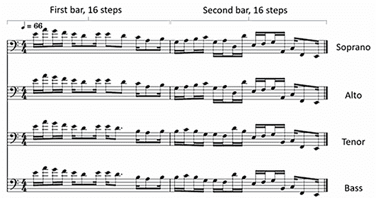
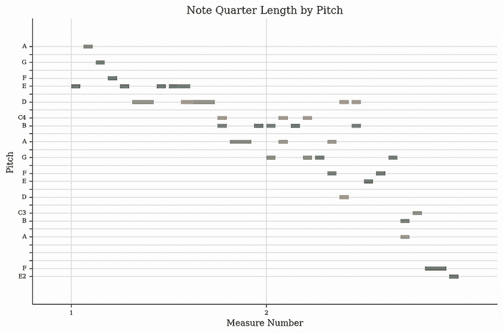
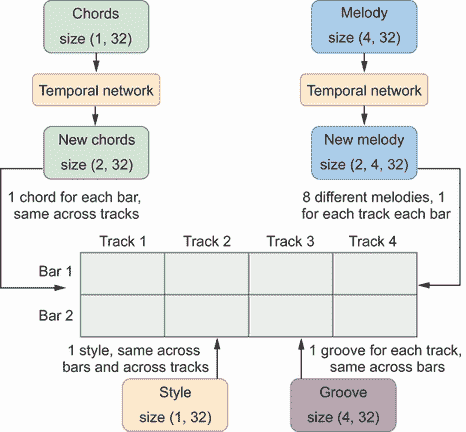
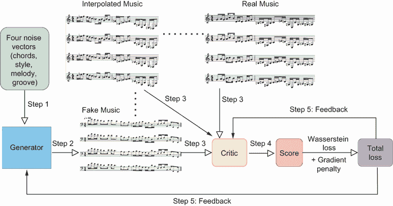

# 13 使用 MuseGAN 进行音乐生成

本章涵盖

+   使用乐器数字接口进行音乐表示

+   将音乐生成视为与图像生成类似的对象创建问题

+   构建和训练生成对抗网络以生成音乐

+   使用训练好的 MuseGAN 模型生成音乐

到目前为止，我们已经成功生成了形状、数字、图像和文本。在本章和下一章中，我们将探讨两种不同的生成逼真音乐的方法。本章将应用图像 GANs 的技术，将音乐视为类似于图像的多维对象。生成器将生成一首完整的音乐作品并将其提交给评论家（作为判别器，因为我们使用 Wasserstein 距离和梯度惩罚，如第五章所述）进行评估。然后，生成器将根据评论家的反馈修改音乐，直到它与训练数据集中的真实音乐非常相似。在下一章中，我们将音乐视为一系列音乐事件，采用自然语言处理（NLP）技术。我们将使用 GPT 风格的 Transformer 来根据先前的事件预测序列中最可能的音乐事件。这个 Transformer 将生成一系列音乐事件，这些事件可以转换为听起来逼真的音乐。

使用人工智能进行音乐生成的领域已经引起了广泛关注；MuseGAN 是一个突出的模型，由 Dong、Hsiao、Yang 和 Yang 在 2017 年提出。1 MuseGAN 是一个深度神经网络，利用生成对抗网络（GANs）来创建多轨音乐，其中的“Muse”一词象征着音乐背后的创造性灵感。该模型擅长理解代表不同乐器或不同声音的不同轨道之间的复杂交互（这在我们的训练数据中是这种情况）。因此，MuseGAN 可以生成和谐且统一的乐曲。

与其他 GAN 模型类似，MuseGAN 由两个主要组件组成：生成器和评论家（评论家提供对样本真实性的连续度量，而不是将样本分类为真实或虚假）。生成器的任务是生成音乐，而评论家评估音乐的质量并向生成器提供反馈。这种对抗性交互使得生成器能够逐步改进，从而创造出更真实、更具吸引力的音乐。

假设你是一位热衷于约翰·塞巴斯蒂安·巴赫的粉丝，并且已经听过他所有的作品。你可能想知道是否可以使用 MuseGAN 创建模仿他风格的合成音乐。答案是肯定的，你将在本章中学习如何做到这一点。

具体来说，你将首先探索如何将一段多轨音乐表示为一个多维对象。一个轨道本质上是一行音乐或声音，可以是不同的乐器，如钢琴、贝斯或鼓，或者不同的声音，如女高音、女低音、男高音或男低音。在创作电子音乐中的轨道时，你通常将其组织成小节（时间段），然后将每个小节细分为步骤以更好地控制节奏，接着为每个步骤分配一个特定的音符来创作旋律和节奏。因此，我们训练集中的每首音乐都是以（4，2，16，84）的形状结构化的：这意味着有四个音乐轨道，每个轨道由 2 个小节组成，每个小节包含 16 个步骤，每个步骤可以播放 84 种不同音符中的任意一种。

我们生成的 MuseGAN 音乐的风格将受到训练数据的影响。由于你对巴赫的作品感兴趣，你将使用《JSB 圣歌集》数据集来训练 MuseGAN，这是一个由巴赫创作的圣歌集合，为四个轨道编排。这些圣歌已被转换为钢琴卷表示，这是一种用于可视化和编码音乐的方法，特别是用于数字处理目的。你将学习如何将形状为（4，2，16，84）的音乐作品转换为音乐乐器数字接口（MIDI）文件，然后可以在你的电脑上播放。

虽然在前面章节中，生成器仅使用来自潜在空间的一个单一噪声向量来生成不同格式的内容，如形状、数字和图像，但 MuseGAN 中的生成器在生成音乐时会使用四个噪声向量。使用四个独立的噪声向量（和弦、风格、旋律和节奏，我将在本章后面详细解释）是设计选择，它允许在音乐生成过程中有更大的控制和多样性。这些噪声向量中的每一个都代表音乐的不同方面，通过单独操纵它们，模型可以生成更复杂和细腻的作品。

一旦模型被训练，我们将丢弃批评网络，这是 GAN 模型中的常见做法。然后，我们将利用训练好的生成器，通过输入来自潜在空间的四个噪声向量来生成音乐作品。以这种方式生成的音乐与巴赫的风格非常相似。

## 13.1 数字音乐表示

我们的目标是掌握从头开始构建和训练用于音乐生成的 GAN 模型的艺术。为了实现这一目标，我们需要从音乐理论的基础知识开始，包括理解音符、八度和音高数字。随后，我们将深入研究数字音乐的内部工作原理，特别是关注 MIDI 文件。

根据我们用于音乐生成的机器学习模型的类型，音乐作品的数字表示可能会有所不同。例如，在本章中，我们将音乐表示为一个多维对象，而在下一章中，我们将使用不同的格式：一系列索引。

在本节中，我们将介绍基本的音乐理论，然后转向使用钢琴卷来数字化表示音乐。你将学习如何在电脑上加载和播放一个示例 MIDI 文件。我们还将介绍 music21 Python 库，你将安装并使用它来可视化与音乐作品相关的乐谱音符。最后，你将学习将一首音乐作品表示为一个具有形状（4，2，16，84）的多维对象。

### 13.1.1 音乐音符、八度和音高

在本章中，我们将处理一个表示音乐作品为 4D 对象的训练数据集。要理解训练数据中的音乐作品的意义，首先熟悉音乐理论中的某些基本概念是至关重要的，例如音乐音符、八度和音高。这些概念相互关联，对于理解数据集至关重要。

图 13.1 说明了这些概念之间的关系。


图 13.1 音乐音符、八度和音高的关系（也称为音符编号）。第一列显示了 11 个八度（范围从-1 到 9），代表不同的音乐声音级别。每个八度被细分为 12 个半音，这些半音列在图的最上面一行：C、C#、D、D#、...、B。在每个八度内，每个音符都被分配一个特定的音高编号，范围从 0 到 127，如图所示。

音乐音符是代表音乐中特定声音的符号。这些音符是音乐的基础元素，用于创作旋律、和弦和节奏。每个音符都被分配一个名称（如 A、B、C、D、E、F、G）并对应一个特定的频率，这决定了它的音高：音符听起来是高还是低。例如，中 C（C4）通常的频率约为 262 赫兹，这意味着其声波每秒振动 262 次。

你可能想知道“中 C（C4）”这个术语的含义。C4 中的数字 4 指的是八度，它是从一个音乐音高级别到下一个级别的距离。在图 13.1 中，最左边的列显示了 11 个八度级别，范围从-1 到 9。当你从一个八度级别移动到下一个时，声音的频率会翻倍。例如，A4 音符通常调校为 440 赫兹，而比 A4 高一个八度的 A5，则调校为 880 赫兹。

在西方音乐中，一个八度被分为 12 个半音，每个半音对应一个特定的音符。图 13.1 的顶部行列出了这 12 个半音：C、C#、D、D#、...、B。上下移动 12 个半音会到达相同的音符名称，但处于更高的或更低的八度。如前所述，A5 比 A4 高一个八度。

每个特定八度内的音符被分配一个音高数字，范围从 0 到 127，如图 13.1 所示。例如，C4 音符的音高数字为 60，而 F3 的音高数字为 53。音高数字是表示音乐音符的一种更有效的方式，因为它指定了八度水平和半音。你将在本章中使用的训练数据就是用音高数字编码的，正是出于这个原因。

### 13.1.2 多轨音乐简介

首先，让我们谈谈多轨音乐是如何工作的以及它是如何以数字形式表示的。在电子音乐制作中，“轨”通常指的是音乐的一个单独的层次或组成部分，例如鼓轨、贝斯轨或旋律轨。在古典音乐中，轨可能代表不同的声乐部分，如女高音、女低音、男高音和男低音。例如，我们在这章中使用的训练数据集，JSB Chorales 数据集，包含四个轨，对应四个声乐部分。在音乐制作中，每个轨都可以在数字音频工作站（DAW）中单独编辑和处理。这些轨由各种音乐元素组成，包括小节、步骤和音符。

小节（或度量）是由特定数量的拍子定义的时间段，每个拍子有特定的音符持续时间。在许多流行的音乐流派中，小节通常包含四个拍子，尽管这可以根据作品的拍号而变化。一个轨中的小节数量由轨的长度和结构决定。例如，在我们的训练数据集中，每个轨由两个小节组成。

在步骤序列的上下文中，这是一种在电子音乐中编程节奏和旋律的常用技术，一个“步骤”代表一小节的一个细分。在一个标准的 4/4 拍（一小节有四个拍子，每个拍子有四个步骤）中，你可能会发现每小节有 16 个步骤，每个步骤对应一小节的十六分之一。

最后，每个步骤包含一个音符。在我们的数据集中，我们限制范围为最常用的 84 个音符（音高数字从 0 到 83）。因此，步骤中的音符被编码为一个包含 84 个值的 one-hot 向量。

为了用实际例子说明这些概念，请从本书的 GitHub 仓库[`github.com/markhliu/DGAI`](https://github.com/markhliu/DGAI)下载文件 example.midi，并将其保存在你电脑的/files/目录下。具有.midi 扩展名的文件是 MIDI 文件。MIDI 是一种技术标准，概述了协议、数字接口和连接器，以使电子乐器、计算机和其他相关设备能够相互连接和通信。

MIDI 文件可以在您计算机上的大多数音乐播放器上播放。为了了解我们训练数据中的音乐类型，请使用您计算机上的音乐播放器打开您刚刚下载的文件 example.midi。它应该听起来像我在我的网站上放置的这个音乐文件：[`mng.bz/lrJB`](https://mng.bz/lrJB)。文件 example.midi 是从本章训练数据集中的某个音乐作品转换而来的。稍后您将学习如何将形状为(4, 2, 16, 84)的音乐作品转换为可以在您计算机上播放的 MIDI 文件。

我们将使用 music21 Python 库，这是一个专为音乐分析、创作和操作设计的强大且全面的工具包，来可视化各种音乐概念是如何工作的。因此，请在您的计算机上的 Jupyter Notebook 应用程序的新单元中运行以下代码行：

```py
!pip install music21
```

music21 库允许您将音乐以乐谱形式可视化，以便更好地理解轨道、小节、音级和音符。为了实现这一点，您必须首先在您的计算机上安装 MuseScore 应用程序。访问[`musescore.org/en/download`](https://musescore.org/en/download)并下载适用于您操作系统的最新版本的 MuseScore 应用程序。截至本文撰写时，最新版本是 MuseScore 4，我们将以此为例。确保您知道 MuseScore 应用程序在您计算机上的文件路径。例如，在 Windows 上，路径是 C:\Program Files\MuseScore 4\bin\MuseScore4.exe。运行以下列表中的代码单元以可视化文件 example.midi 的乐谱。

列表 13.1 使用 music21 库可视化乐谱

```py
%matplotlib inline                                          ①
from music21 import midi, environment

mf = midi.MidiFile()    
mf.open("files/example.midi")                               ②
mf.read()
mf.close()
stream = midi.translate.midiFileToStream(mf)
us = environment.Environment() 
path = r'C:\Program Files\MuseScore 4\bin\MuseScore4.exe'
us['musescoreDirectPNGPath'] = path                         ③
stream.show()                                               ④
```

① 在 Jupyter 笔记本中显示图像，而不是在原始应用程序中

② 打开 MIDI 文件

③ 定义 MuseScore 应用程序的路径

④ 显示乐谱

对于 macOS 操作系统的用户，将前面代码单元中的路径更改为/Applications/MuseScore 4.app/Contents/MacOS/mscore。对于 Linux 用户，将路径更改为/home/[用户名]/.local/bin/mscore4portable，将[用户名]替换为您实际的用户名。例如，我的用户名是`mark`，所以路径是/home/mark/.local/bin/mscore4portable。

执行前面的代码单元将显示类似于图 13.2 所示的乐谱。请注意，图中的注释是我添加的，所以您将只看到乐谱而没有任何注释。



图 13.2 JSB Chorales 数据集中一首音乐作品的乐谱。音乐有四个轨道，代表合唱中的四个声部：女高音、女低音、男高音和男低音。乐谱结构为每个轨道两个小节，左右两侧分别代表第一和第二小节。每个小节由 16 个步骤组成，与 4/4 拍号相匹配，其中一小节包含四个节拍，每个节拍细分为四个十六分音符。总共可能有 84 个不同的音高，每个音符都表示为一个包含 84 个值的 one-hot 向量。

JSB Chorales 数据集，由约翰·塞巴斯蒂安·巴赫的合唱作品组成，常用于音乐生成任务中训练机器学习模型。数据集中每首音乐作品的形状（4, 2, 16, 84）可以这样解释。数字 4 代表合唱中的四个声部：女高音、女低音、男高音和男低音。每个声部在数据集中被视为一个单独的轨道。每首作品分为两个小节（也称为乐句）。数据集以这种方式格式化，以便标准化音乐作品的长度，用于训练目的。数字 16 代表每个小节中的步骤数（或细分）。最后，音符以 84 个值进行 one-hot 编码，表示每个步骤中可以演奏的可能音高（或音符）的数量。

### 13.1.3 数字化音乐表示：钢琴卷轴

钢琴卷轴是音乐的一种视觉表示，常用于 MIDI 编曲软件和 DAWs 中。它以传统钢琴卷轴命名，这种卷轴在自动演奏钢琴中使用，其中包含带有孔的物理卷纸，以表示音符。在数字环境中，钢琴卷轴发挥着类似的功能，但以虚拟格式存在。

钢琴卷轴以网格形式显示，时间水平表示（从左到右），音高垂直表示（从下到上）。每一行对应一个特定的音符，高音在顶部，低音在底部，类似于钢琴键盘的布局。

音符以网格上的条形或块表示。音符块沿垂直轴的位置表示其音高，而沿水平轴的位置表示其在音乐中的时间。音符块的长度表示音符的持续时间。

让我们使用 music21 库来展示钢琴卷轴的样子。在您的 Jupyter Notebook 应用的新单元格中运行以下代码行：

```py
stream.plot()
```

输出结果如图 13.3 所示。

music21 库还允许您查看与前面钢琴卷轴对应的量化音符：

```py
for n in stream.recurse().notes:
    print(n.offset, n.pitches)
```

输出结果

```py
0.0 (<music21.pitch.Pitch E4>,)
0.25 (<music21.pitch.Pitch A4>,)
0.5 (<music21.pitch.Pitch G4>,)
0.75 (<music21.pitch.Pitch F4>,)
1.0 (<music21.pitch.Pitch E4>,)
1.25 (<music21.pitch.Pitch D4>,)
1.75 (<music21.pitch.Pitch E4>,)
2.0 (<music21.pitch.Pitch E4>,)
2.5 (<music21.pitch.Pitch D4>,)
3.0 (<music21.pitch.Pitch C4>,)
3.25 (<music21.pitch.Pitch A3>,)
3.75 (<music21.pitch.Pitch B3>,)
0.0 (<music21.pitch.Pitch G3>,)
0.25 (<music21.pitch.Pitch A3>,)
0.5 (<music21.pitch.Pitch B3>,)
…
3.25 (<music21.pitch.Pitch F2>,)
3.75 (<music21.pitch.Pitch E2>,)
```



图 13.3 一段音乐的钢琴卷。钢琴卷是音乐作品的图形表示，以网格形式呈现，时间从左到右水平进展，音高从下到上垂直表示。网格上的每一行对应一个独特的音乐音符，排列方式类似于钢琴键盘，高音符位于顶部，低音符位于底部。这首特定的音乐由两个小节组成，因此在图中可以看到两个不同的部分。音符块的垂直位置表示其音高，而其水平位置表示音符在作品中的演奏时间。此外，音符块的长度反映了音符持续的时长。

我省略了大部分输出。前一个输出中每行的第一个值代表时间。在大多数情况下，每行之后时间增加 0.25 秒。如果下一行的时间增加超过 0.25 秒，这意味着音符持续的时间超过 0.25 秒。正如你所见，起始音符是 E4。0.25 秒后，音符变为 A4，然后是 G4，以此类推。这解释了图 13.3 中（最左侧）的前三个块，它们分别具有 E、A 和 G 的值。

你可能好奇如何将音乐音符序列转换成形状为（4, 2, 16, 84）的对象。为了理解这一点，让我们检查音乐音符中每个时间步的音高数字：

```py
for n in stream.recurse().notes:
    print(n.offset,n.pitches[0].midi)
```

输出结果为

```py
0.0 64
0.25 69
0.5 67
0.75 65
1.0 64
1.25 62
1.75 64
2.0 64
2.5 62
3.0 60
3.25 57
3.75 59
0.0 55
0.25 57
0.5 59
…
3.25 41
3.75 40
```

前面的代码块已将每个时间步的音乐音符转换为基于图 13.1 中使用的映射的音高数字，范围在 0 到 83 之间。然后，每个音高数字被转换为具有 84 个值的 one-hot 变量，其中所有值均为-1，只有一个位置为 1。我们使用-1 和 1 而不是 0 和 1 进行 one-hot 编码，因为将值放置在-1 和 1 之间可以将数据围绕 0 中心化，这可以使训练更加稳定和快速。许多激活函数和权重初始化方法都假设输入数据围绕 0 中心化。图 13.4 说明了如何将一段 MIDI 音乐编码成形状为（4, 2, 16, 84）的对象。


图 13.4 如何使用 4D 对象表示一段音乐。在我们的训练数据中，每段音乐都由形状为（4, 2, 16, 84）的 4D 对象表示。第一个维度代表四个音乐轨道，即音乐中的四个声部（女高音、女低音、男高音和男低音）。每个音乐轨道分为两个小节。每个小节有四个节拍，每个节拍有四个音符；因此，每个小节有 16 个音符。最后，每个音符由一个具有 84 个值的 one-hot 变量表示，其中所有值均为-1，只有一个位置为 1。

图 13.4 解释了音乐对象形状的维度（4, 2, 16, 84）。本质上，每首音乐作品包含四个轨道，每个轨道包含两个小节。每个小节被细分为 16 个音符。鉴于我们的训练集中音高数字从 0 到 83，每个音符由一个包含 84 个值的 one-hot 向量表示。

在后续关于准备训练数据的讨论中，我们将探讨如何将形状为（4, 2, 16, 84）的对象转换回 MIDI 格式的音乐作品，以便在计算机上播放。

## 13.2 音乐生成的蓝图

在创作音乐时，我们需要融入更详细的输入以增强控制和多样性。与仅从潜在空间中利用单个噪声向量来生成形状、数字和图像的方法不同，我们在音乐生成过程中将使用四个不同的噪声向量。由于每首音乐作品包含四个轨道和两个小节，我们将使用四个向量来管理这种结构。我们将使用一个向量来控制所有轨道和小节，另一个向量来控制所有轨道中的每个小节，第三个向量来监督所有轨道跨越小节，第四个向量来管理每个轨道中的每个单独小节。本节将向您介绍和弦、风格、旋律和节奏的概念，并解释它们如何影响音乐生成的各个方面。之后，我们将讨论构建和训练 MuseGAN 模型所涉及的步骤。

### 13.2.1 使用和弦、风格、旋律和节奏构建音乐

在音乐生成阶段稍后，我们从潜在空间中获取四个噪声向量（和弦、风格、旋律和节奏），并将它们输入到生成器中，以创建一首音乐作品。你可能想知道这四条信息的含义。在音乐中，和弦、风格、旋律和节奏是构成作品整体声音和感觉的关键元素。接下来，我将简要解释每个元素。

风格指的是音乐创作、表演和体验的特征方式。它包括音乐类型（如爵士、古典、摇滚等）、音乐创作的时代以及作曲家或表演者的独特方法。风格受文化、历史和个人因素的影响，有助于定义音乐的个性。

节奏感是音乐中的节奏感或摇摆，尤其是在放克、爵士和灵魂乐等风格中。这是让你想要脚打拍子或跳舞的原因。节奏感是通过强调模式、节奏部分（如鼓、贝斯等）之间的互动和速度来创造的。它是赋予音乐运动感和流畅感的关键元素。

和弦是由两个或更多音符同时演奏的组合。它们为音乐提供了和声基础。和弦建立在音阶之上，用于创建音乐的结构和情感深度。不同的和弦类型（大调、小调、减调、增调等）及其编排可以唤起听众的各种情绪和感受。

最后，旋律是音乐作品中最容易识别的音符序列。它是你可能吹口哨或跟着唱的部分。旋律通常由音阶构成，以音高、节奏和轮廓（音高的上升和下降模式）为特征。一首好的旋律易于记忆且富有表现力，传达作品的主要音乐和情感主题。

这些元素共同协作，和谐地创造出音乐作品的整体声音和体验。每个元素都有其作用，但它们都相互影响，共同产生最终的音乐作品。具体来说，一首音乐作品由四个轨道组成，每个轨道有两个小节，从而产生八个小节/轨道组合。我们将使用一个噪声向量用于风格，应用于所有八个小节。我们将使用八个不同的噪声向量用于旋律，每个向量用于一个独特的小节。有四个噪声向量用于节奏，每个向量应用于不同的轨道，两个小节都保持相同。两个噪声向量将用于和弦，每个小节一个。图 13.5 展示了这四个元素如何共同贡献于完整音乐作品的创作。



图 13.5 使用和弦、风格、旋律和节奏生成音乐。每一首音乐作品由四个轨道组成，跨越两个小节。为此，我们将从潜在空间中提取四个噪声向量。第一个向量，代表和弦，其维度为（1，32）。这个向量将通过一个时间网络进行处理，将和弦扩展为两个（1，32）向量，对应两个小节，所有轨道上的值都相同。第二个向量，表示风格，其维度也为（1，32），在所有轨道和小节中保持不变。第三个向量，旋律，形状为（4，32）。它将通过一个时间网络拉伸成两个（4，32）向量，从而产生八个（1，32）向量，每个向量代表一个独特的轨道和小节组合。最后，第四个向量，节奏，其维度为（4，32），将应用于四个轨道，两个小节都保持相同的值。

生成器通过一次生成一个轨道的一小节来创建音乐作品。为此，它需要四个形状为（1, 32）的噪声向量作为输入。这些向量代表和弦、风格、旋律和节奏，每个都控制音乐的一个独特方面，如前所述。由于音乐作品由四个轨道组成，每个轨道有两个小节，因此总共有八个轨道/小节组合。因此，我们需要八组和弦、风格、旋律和节奏来生成音乐作品的全部部分。

我们将从潜在空间中获取四个与和弦、风格、旋律和节奏对应的噪声向量。我们还将后来引入一个时间网络，其作用是沿着小节维度扩展输入。对于两个小节，这意味着输入大小的加倍。音乐本质上是时间的，具有随时间展开的模式和结构。MuseGAN 中的时间网络旨在捕捉这些时间依赖关系，确保生成的音乐具有连贯和逻辑的进展。

和弦的噪声向量形状为（1, 32）。在通过时间网络处理后，我们获得两个（1, 32）大小的向量。第一个向量用于第一小节中的所有四个轨道，而第二个向量用于第二小节中的所有四个轨道。

风格的噪声向量，同样形状为（1, 32），被均匀地应用于所有八个轨道/小节组合。请注意，我们不会将风格向量通过时间网络传递，因为风格向量被设计为在小节间保持相同。

旋律的噪声向量形状为（4, 32）。当通过时间网络传递时，它会产生两个（4, 32）大小的向量，这些向量进一步分解为八个（1, 32）大小的向量。每个向量都用于独特的轨道/小节组合。

最后，节奏的噪声向量形状为（4, 32），其应用方式是每个（1, 32）大小的向量应用于不同的轨道，在小节间保持不变。我们不会将节奏向量通过时间网络传递，因为节奏向量被设计为在小节间保持相同。

在为八个轨道/小节组合中的每个组合生成一小节音乐后，我们将它们合并以创建一个完整的音乐作品，由四个不同的轨道组成，每个轨道包含两个独特的小节。

### 13.2.2 训练 MuseGAN 的蓝图

第一章提供了 GANs 背后基础概念的概述。在第三章到第五章中，你探索了用于生成形状、数字和图像的 GANs 的创建和训练。本小节将总结构建和训练 MuseGAN 的步骤，突出与之前章节的不同之处。

MuseGAN 生成的音乐风格受训练数据风格的影响。因此，你应该首先收集一个适合训练的巴赫作品数据集。接下来，你将创建一个 MuseGAN 模型，该模型由一个生成器和评论家组成。生成器网络接收四个随机噪声向量作为输入（和弦、风格、旋律和节奏），并输出一首音乐。评论家网络评估一首音乐并分配一个评分，对真实音乐（来自训练集）给予高评分，对由生成器产生的假音乐给予低评分。生成器和评论家网络都利用深度卷积层来捕捉输入的空间特征。



图 13.6 展示了训练 MuseGAN 生成音乐的步骤图。生成器通过从潜在空间中抽取四个随机噪声向量（图的上左角）来生成假音乐作品，并将其展示给评论家（中间）。评论家评估作品并分配一个评分。高评分表明该作品很可能是来自训练数据集的，而低评分则表明该作品很可能是假的（由生成器生成的）。此外，还向评论家展示了一个由真实和假样本混合而成的插值音乐作品（图的上左角）。训练过程结合了基于评论家对这一插值作品评分的梯度惩罚，并将其添加到总损失中。然后将评分与真实值进行比较，使评论家和生成器都能从这些评估中学习。经过多次训练迭代后，生成器变得擅长生成与真实样本几乎无法区分的音乐作品。

图 13.6 展示了 MuseGAN 的训练过程。生成器（图的下左角）接收四个随机噪声向量（和弦、风格、旋律和节奏）作为输入，并生成假音乐作品（图 13.6 中的步骤 1）。这些噪声向量来自潜在空间，它代表了 GAN 可以生成的潜在输出范围，从而能够创建多样化的数据样本。然后，这些假音乐作品（右上角来自训练集的真实音乐作品）被评论家（步骤 3）评估。评论家（图的底部中央）对所有音乐作品进行评分，目的是给予真实音乐高评分，而给予假音乐低评分（步骤 4）。

为了指导模型参数的调整，必须为生成器和批评家选择适当的损失函数。生成器的损失函数旨在鼓励生成与训练数据集中的数据点非常相似的数据点。具体来说，生成器的损失函数是批评家评分的负值。通过最小化这个损失函数，生成器努力创建能够从批评家那里获得高评分的音乐作品。另一方面，批评家的损失函数被制定为鼓励对真实和生成数据点进行准确评估。因此，如果音乐作品来自训练集，批评家的损失函数是评分本身；如果它是生成器生成的，则是评分的负值。本质上，批评家的目标是给真实音乐作品赋予高评分，给假音乐作品赋予低评分。

此外，我们像第五章中那样，将 Wasserstein 距离和梯度惩罚纳入损失函数，以增强 GAN 模型的训练稳定性和性能。为此，一个混合了真实和假音乐的插值音乐作品（如图 13.6 左上角所示）由批评家进行评估。然后，基于批评家对这一插值作品的评分，梯度惩罚在训练过程中被添加到总损失中。

在整个训练循环中，我们在训练批评家和生成器之间交替。在每个训练迭代中，我们从训练集中采样一批真实音乐作品和一批由生成器生成的假音乐作品。我们通过比较批评家的评分（即分数）与真实值（音乐作品是真是假）来计算总损失。然后，我们稍微调整生成器和批评家网络中的权重，以便在后续迭代中，生成器产生更逼真的音乐作品，批评家对真实音乐赋予更高的分数，对假音乐赋予更低的分数。

一旦 MuseGAN 完全训练完成，可以通过输入四个随机噪声向量到训练好的生成器来创建音乐。

## 13.3 准备 MuseGAN 的训练数据

我们将使用约翰·塞巴斯蒂安·巴赫的合唱作品作为我们的训练数据集，期望生成的音乐类似于巴赫的风格。如果你更喜欢其他音乐家的风格，你可以使用他们的作品作为训练数据。在本节中，我们将首先下载训练数据，并将其组织成批次以供后续训练。

此外，我们还了解到训练集中的音乐作品将被表示为 4D 对象。在本节中，你还将学习如何将这些多维对象转换为计算机上可播放的音乐作品。这种转换是必不可少的，因为 MuseGAN 生成的多维对象与训练集中的类似。在本章的后面部分，我们将 MuseGAN 产生的多维对象转换为 MIDI 文件，使你能够在计算机上收听生成的音乐。

### 13.3.1 下载训练数据

我们将使用 JSB Chorales 钢琴卷数据集作为我们的训练集。访问 Cheng-Zhi Anna Huang 的 GitHub 仓库 ([`github.com/czhuang/JSB-Chorales-dataset`](https://github.com/czhuang/JSB-Chorales-dataset)) 并下载音乐文件 Jsb16thSeparated.npz。将文件保存在您电脑上的 /files/ 目录中。

然后，从本书的 GitHub 仓库 ([`github.com/markhliu/DGAI`](https://github.com/markhliu/DGAI)) 下载两个实用模块 midi_util.py 和 MuseGAN_util.py，并将它们保存在您电脑上的 /utils/ 目录中。本章中的代码改编自 Azamat Kanametov 的优秀 GitHub 仓库 ([`github.com/akanametov/musegan`](https://github.com/akanametov/musegan))。有了这些文件，我们现在可以加载音乐文件并将它们组织成批次以进行处理：

```py
from torch.utils.data import DataLoader
from utils.midi_util import MidiDataset

dataset = MidiDataset('files/Jsb16thSeparated.npz')
first_song=dataset[0]
print(first_song.shape)
loader = DataLoader(dataset, batch_size=64, 
                        shuffle=True, drop_last=True)
```

我们将您刚刚下载的数据集加载到 Python 中，然后提取第一首歌曲并将其命名为 `first_song`。由于歌曲表示为多维对象，我们打印出第一首歌曲的形状。最后，我们将训练数据放入 64 个批次的批次中，以便在章节的后续部分使用。

前一个代码块的输出是

```py
torch.Size([4, 2, 16, 84])
```

数据集中的每首歌曲的形状为 (4, 2, 16, 84)，如前一个输出所示。这表明每首歌曲由四个曲目组成，每个曲目有两小节。每小节包含 16 个时间步，在每个时间步，音符由一个包含 84 个值的独热向量表示。在每个独热向量中，所有值都设置为 -1，除了一个位置，其值设置为 1，表示音符的存在。您可以如下验证数据集中的值范围：

```py
flat=first_song.reshape(-1,)
print(set(flat.tolist()))
```

输出是

```py
{1.0, -1.0}
```

前一个输出显示，每个音乐作品中的值要么是 -1，要么是 1。

### 13.3.2 将多维对象转换为音乐作品

目前，歌曲格式为 PyTorch 张量，并准备好输入到 MuseGAN 模型中。然而，在我们继续之前，了解如何将这些多维对象转换为电脑上可播放的音乐作品非常重要。这将帮助我们稍后把生成的音乐作品转换为可播放的文件。

首先，我们将所有 84 个值的独热变量转换为介于 0 到 83 之间的音高数：

```py
import numpy as np
from music21 import note, stream, duration, tempo

parts = stream.Score()
parts.append(tempo.MetronomeMark(number=66))
max_pitches = np.argmax(first_song, axis=-1)                ①
midi_note_score = max_pitches.reshape([2 * 16, 4])          ②
print(midi_note_score)
```

① 将 84 个值的独热向量转换为介于 0 到 83 之间的数字

② 将结果重塑为 (32, 4)

输出是

```py
tensor([[74, 74, 74, 74],
…
        [70, 70, 69, 69],
        [67, 67, 69, 69],
        [70, 70, 70, 70],
        [69, 69, 69, 69],
        [69, 69, 69, 69],
        [65, 65, 65, 65],
        [58, 58, 60, 60],
…
        [53, 53, 53, 53]])
```

在这里显示的输出中，每一列代表一个音乐曲目，数值范围从 0 到 83。这些数字对应于音高数，正如您在图 13.1 中之前看到的。

现在，我们将把前一个代码块中的张量 `midi_note_score` 转换为实际的 MIDI 文件，让您可以在电脑上播放它。

列表 13.2 将音高数转换为 MIDI 文件

```py
for i in range(4):                                         ①
    last_x = int(midi_note_score[:, i][0])
    s = stream.Part()
    dur = 0
    for idx, x in enumerate(midi_note_score[:, i]):        ②
        x = int(x)
        if (x != last_x or idx % 4 == 0) and idx > 0:
            n = note.Note(last_x)
            n.duration = duration.Duration(dur)
            s.append(n)
            dur = 0
        last_x = x
        dur = dur + 0.25                                   ③
    n = note.Note(last_x)
    n.duration = duration.Duration(dur)
    s.append(n)                                            ④
    parts.append(s)  
parts.write("midi","files/first_song.midi")
```

① 遍历四个音乐曲目

② 遍历每个曲目中的所有音符

③ 将 0.25 秒添加到每个时间步

④ 将音符添加到音乐流中

运行前面的代码单元后，您将在电脑上看到一个 MIDI 文件，`first_song.midi`。使用您电脑上的音乐播放器播放它，以了解我们用来训练 MuseGAN 的音乐类型。

练习 13.1

将训练数据集中的第二首歌曲转换为 MIDI 文件。将其保存为`second_song.midi`，并使用您电脑上的音乐播放器播放。

## 13.4 构建 MuseGAN

实质上，我们将音乐作品视为一个具有多个维度的对象。利用第四章至第六章中的技术，我们将使用深度卷积神经网络来处理这项任务，因为它们能够有效地从多维对象中提取空间特征。在 MuseGAN 中，我们将构建一个生成器和评判器，类似于图像创建中的生成器根据评判器的反馈来细化图像。生成器将生成一个作为 4D 对象的音乐作品。

我们将真实音乐（来自我们的训练集）和生成器生成的假音乐都展示给评判器。评判器将对每首作品从负无穷大到正无穷大进行评分，分数越高表示音乐更可能是真实的。评判器的目标是给真实音乐高分数，给假音乐低分数。相反，生成器的目标是生成与真实音乐难以区分的音乐，从而从评判器那里获得高分数。

在本节中，我们将构建一个 MuseGAN 模型，该模型包括一个生成网络和一个评判网络。评判网络使用深度卷积层从多维对象中提取独特特征，从而增强其评估音乐作品的能力。另一方面，生成网络利用深度转置卷积层生成旨在生成逼真音乐作品的特征图。稍后，我们将使用训练集中的音乐作品来训练 MuseGAN 模型。

### 13.4.1 MuseGAN 中的评判器

如第五章所述，将 Wasserstein 距离纳入损失函数可以帮助稳定训练。因此，在 MuseGAN 中，我们采用类似的方法，并使用评判器而不是判别器。评判器不是一个二元分类器；相反，它评估生成器的输出（在这种情况下，是一首音乐作品），并分配一个从-∞到∞的分数。更高的分数表示音乐更可能是真实的（即来自训练集）。

我们构建了一个如以下列表所示的音乐评判神经网络，其定义可以在您之前下载的文件 MuseGAN_util.py 中找到。

列表 13.3 MuseGAN 中的评判器网络

```py
class MuseCritic(nn.Module):
    def __init__(self,hid_channels=128,hid_features=1024,
        out_features=1,n_tracks=4,n_bars=2,n_steps_per_bar=16,
        n_pitches=84):
        super().__init__()
        self.n_tracks = n_tracks
        self.n_bars = n_bars
        self.n_steps_per_bar = n_steps_per_bar
        self.n_pitches = n_pitches
        in_features = 4 * hid_channels if n_bars == 2\
            else 12 * hid_channels
        self.seq = nn.Sequential(
            nn.Conv3d(self.n_tracks, hid_channels, 
                      (2, 1, 1), (1, 1, 1), padding=0),      ①
            nn.LeakyReLU(0.3, inplace=True),
            nn.Conv3d(hid_channels, hid_channels, 
              (self.n_bars - 1, 1, 1), (1, 1, 1), padding=0),
            nn.LeakyReLU(0.3, inplace=True),
            nn.Conv3d(hid_channels, hid_channels, 
                      (1, 1, 12), (1, 1, 12), padding=0),
            nn.LeakyReLU(0.3, inplace=True),
            nn.Conv3d(hid_channels, hid_channels, 
                      (1, 1, 7), (1, 1, 7), padding=0),
            nn.LeakyReLU(0.3, inplace=True),
            nn.Conv3d(hid_channels, hid_channels, 
                      (1, 2, 1), (1, 2, 1), padding=0),
            nn.LeakyReLU(0.3, inplace=True),
            nn.Conv3d(hid_channels, hid_channels, 
                      (1, 2, 1), (1, 2, 1), padding=0),
            nn.LeakyReLU(0.3, inplace=True),
            nn.Conv3d(hid_channels, 2 * hid_channels, 
                      (1, 4, 1), (1, 2, 1), padding=(0, 1, 0)),
            nn.LeakyReLU(0.3, inplace=True),
            nn.Conv3d(2 * hid_channels, 4 * hid_channels,     
                      (1, 3, 1), (1, 2, 1), padding=(0, 1, 0)),
            nn.LeakyReLU(0.3, inplace=True),
            nn.Flatten(),                                     ②
            nn.Linear(in_features, hid_features),
            nn.LeakyReLU(0.3, inplace=True),
            nn.Linear(hid_features, out_features))            ③
    def forward(self, x):  
        return self.seq(x)
```

① 将输入通过几个 Conv3d 层

② 将输出扁平化

③ 将输出通过两个线性层

评论网络的输入是一个维度为（4，2，16，84）的音乐作品。该网络主要由几个 Conv3d 层组成。这些层将音乐作品中的每个轨道视为一个 3D 对象，并应用过滤器来提取空间特征。Conv3d 层的操作与前面章节中讨论的用于图像生成的 Conv2d 层类似。

需要注意的是，评论模型的最后一层是线性的，我们没有对其输出应用任何激活函数。因此，评论模型的输出是一个从-∞到∞的值，这可以解释为评论家对音乐作品的评价。

### 13.4.2 MuseGAN 中的生成器

如本章前面所述，生成器将一次生成一段音乐，然后我们将这八段音乐组合成一首完整的乐曲。

MuseGAN 中的生成器不是只使用一个噪声向量，而是使用四个独立的噪声向量作为输入来控制生成的音乐的各个方面。其中两个向量将通过时间网络进行处理，以扩展它们在小节维度上的长度。而风格和节奏向量被设计为在小节间保持不变，和弦和旋律向量被设计为在小节间变化。因此，我们首先建立一个时间网络来扩展和弦和旋律向量跨越两个小节，确保生成的音乐在时间上有连贯和逻辑的进展。

在您之前下载的本地模块`MuseGAN_util`中，我们定义了`TemporalNetwork()`类如下：

```py
class TemporalNetwork(nn.Module):
    def __init__(self,z_dimension=32,hid_channels=1024,n_bars=2):
        super().__init__()
        self.n_bars = n_bars
        self.net = nn.Sequential(
            Reshape(shape=[z_dimension, 1, 1]),                ①
            nn.ConvTranspose2d(z_dimension,hid_channels,
                kernel_size=(2, 1),stride=(1, 1),padding=0,),
            nn.BatchNorm2d(hid_channels),
            nn.ReLU(inplace=True),
            nn.ConvTranspose2d(hid_channels,z_dimension,
                kernel_size=(self.n_bars - 1, 1),stride=(1, 1),
                padding=0,),
            nn.BatchNorm2d(z_dimension),
            nn.ReLU(inplace=True),
            Reshape(shape=[z_dimension, self.n_bars]),)        ②
    def forward(self, x):
        return self.net(x)
```

① TemporalNetwork()类的输入维度是（1，32）。

② 输出维度是（2，32）。

这里描述的`TemporalNetwork()`类使用两个 ConvTranspose2d 层将单个噪声向量扩展为两个不同的噪声向量，每个向量对应两个小节中的一个。正如我们在第四章中提到的，转置卷积层用于上采样和生成特征图。在这种情况下，它们被用来在不同的小节间扩展噪声向量。

我们不会一次性生成所有轨道的所有小节，而是逐个小节地生成音乐。这样做可以让 MuseGAN 在计算效率、灵活性和音乐连贯性之间取得平衡，从而产生更有结构和吸引力的音乐作品。因此，我们继续构建一个负责生成乐曲片段的生成器：轨道中的一小节。我们在本地的`MuseGAN_util`模块中引入了`BarGenerator()`类：

```py
class BarGenerator(nn.Module):
    def __init__(self,z_dimension=32,hid_features=1024,hid_channels=512,
        out_channels=1,n_steps_per_bar=16,n_pitches=84):
        super().__init__()
        self.n_steps_per_bar = n_steps_per_bar
        self.n_pitches = n_pitches
        self.net = nn.Sequential(
            nn.Linear(4 * z_dimension, hid_features),              ①
            nn.BatchNorm1d(hid_features),
            nn.ReLU(inplace=True),
            Reshape(shape=[hid_channels,hid_features//hid_channels,1]),    
            nn.ConvTranspose2d(hid_channels,hid_channels,
               kernel_size=(2, 1),stride=(2, 1),padding=0),        ②
            nn.BatchNorm2d(hid_channels),
            nn.ReLU(inplace=True),
            nn.ConvTranspose2d(hid_channels,hid_channels // 2,
                kernel_size=(2, 1),stride=(2, 1),padding=0),
            nn.BatchNorm2d(hid_channels // 2),
            nn.ReLU(inplace=True),
            nn.ConvTranspose2d(hid_channels // 2,hid_channels // 2,
                kernel_size=(2, 1),stride=(2, 1),padding=0),
            nn.BatchNorm2d(hid_channels // 2),
            nn.ReLU(inplace=True),
            nn.ConvTranspose2d(hid_channels // 2,hid_channels // 2,
                kernel_size=(1, 7),stride=(1, 7),padding=0),
            nn.BatchNorm2d(hid_channels // 2),
            nn.ReLU(inplace=True),
            nn.ConvTranspose2d(hid_channels // 2,out_channels,
                kernel_size=(1, 12),stride=(1, 12),padding=0),
            Reshape([1, 1, self.n_steps_per_bar, self.n_pitches])) ③
    def forward(self, x):
        return self.net(x)
```

① 我们将和弦、风格、旋律和节奏合并成一个向量，大小为 4 * 32。

② 然后将输入重塑为二维，我们使用几个 ConvTranspose2d 层进行上采样和音乐特征生成。

③ 输出的形状为（1，1，16，84）：1 个轨道，1 个小节，16 个音符，每个音符由一个 84 值的向量表示。

`BarGenerator()`类接受四个噪声向量作为输入，每个向量代表不同轨道中特定节拍的和弦、风格、旋律和节奏，所有这些向量的形状都是（1，32）。这些向量在输入到`BarGenerator()`类之前被连接成一个单一的 128 值向量。`BarGenerator()`类的输出是一个音乐节拍，维度为（1，1，16，84），表示 1 个轨道，1 个节拍，16 个音符，每个音符由一个 84 值的向量表示。

最后，我们将使用`MuseGenerator()`类生成一个完整的音乐作品，包含四个轨道，每个轨道有两个节拍。每个节拍都是使用之前定义的`BarGenerator()`类构建的。为了实现这一点，我们在本地`MuseGAN_util`模块中定义了`MuseGenerator()`类。

列表 13.4 MuseGAN 中的音乐生成器

```py
class MuseGenerator(nn.Module):
    def __init__(self,z_dimension=32,hid_channels=1024,
        hid_features=1024,out_channels=1,n_tracks=4,
        n_bars=2,n_steps_per_bar=16,n_pitches=84):
        super().__init__()
        self.n_tracks = n_tracks
        self.n_bars = n_bars
        self.n_steps_per_bar = n_steps_per_bar
        self.n_pitches = n_pitches
        self.chords_network=TemporalNetwork(z_dimension, 
                            hid_channels, n_bars=n_bars)
        self.melody_networks = nn.ModuleDict({})
        for n in range(self.n_tracks):
            self.melody_networks.add_module(
                "melodygen_" + str(n),
                TemporalNetwork(z_dimension, 
                 hid_channels, n_bars=n_bars))
        self.bar_generators = nn.ModuleDict({})
        for n in range(self.n_tracks):
            self.bar_generators.add_module(
                „bargen_" + str(n),BarGenerator(z_dimension,
            hid_features,hid_channels // 2,out_channels,
            n_steps_per_bar=n_steps_per_bar,n_pitches=n_pitches))
    def forward(self,chords,style,melody,groove):
        chord_outs = self.chords_network(chords)
        bar_outs = []
        for bar in range(self.n_bars):                           ①
            track_outs = []
            chord_out = chord_outs[:, :, bar]
            style_out = style
            for track in range(self.n_tracks):                   ②
                melody_in = melody[:, track, :]
                melody_out = self.melody_networks"melodygen_"\
                          + str(track)[:, :, bar]
                groove_out = groove[:, track, :]
                z = torch.cat([chord_out, style_out, melody_out,\
                               groove_out], dim=1)               ③
                track_outs.append(self.bar_generators"bargen_"\
                                          + str(track))      ④
            track_out = torch.cat(track_outs, dim=1)
            bar_outs.append(track_out)
        out = torch.cat(bar_outs, dim=2)                         ⑤
        return out
```

① 遍历两个节拍

② 遍历四个轨道

③ 将和弦、风格、旋律和节奏合并为一个输入

④ 使用轨道生成器生成一个节拍

⑤ 将八个节拍合并成一个完整的音乐作品

生成器接受四个噪声向量作为输入。它遍历四个轨道和两个节拍。在每次迭代中，它使用轨道生成器创建一个音乐节拍。完成所有迭代后，`MuseGenerator()`类将八个节拍合并成一个连贯的音乐作品，其维度为（4，2，16，84）。

### 13.4.3 优化器和损失函数

我们基于本地模块中的`MuseGenerator()`和`MuseCritic()`类创建一个生成器和批评家：

```py
import torch
from utils.MuseGAN_util import (init_weights, MuseGenerator, MuseCritic)

device = "cuda" if torch.cuda.is_available() else "cpu"
generator = MuseGenerator(z_dimension=32, hid_channels=1024, 
              hid_features=1024, out_channels=1).to(device)
critic = MuseCritic(hid_channels=128,
                    hid_features=1024,
                    out_features=1).to(device)
generator = generator.apply(init_weights)
critic = critic.apply(init_weights) 
```

正如我们在第五章中讨论的，批评家生成一个评分而不是分类，因此损失函数定义为预测和目标之间的乘积的负平均值。因此，我们在本地模块`MuseGAN_util`中定义以下`loss_fn()`函数：

```py
def loss_fn(pred, target):
    return -torch.mean(pred*target)
```

在训练过程中，对于生成器，我们将`loss_fn()`函数中的目标参数赋值为 1。这种设置旨在引导生成器产生能够获得最高评分（即`loss_fn()`函数中的变量 pred）的音乐。对于批评家，我们在损失函数中将目标设置为 1 用于真实音乐，-1 用于假音乐。这种设置引导批评家对真实音乐给予高评分，对假音乐给予低评分。

与第五章中的方法类似，我们将 Wasserstein 距离和梯度惩罚结合到批评家的损失函数中，以确保训练稳定性。梯度惩罚在`MuseGAN_util.py`文件中定义如下：

```py
class GradientPenalty(nn.Module):
    def __init__(self):
        super().__init__()
    def forward(self, inputs, outputs):
        grad = torch.autograd.grad(
            inputs=inputs,
            outputs=outputs,
            grad_outputs=torch.ones_like(outputs),
            create_graph=True,
            retain_graph=True,
        )[0]
        grad_=torch.norm(grad.view(grad.size(0),-1),p=2,dim=1)
        penalty = torch.mean((1\. - grad_) ** 2)
        return penalty
```

`GradientPenalty()` 类需要两个输入：插值音乐，这是真实和假音乐的结合，以及批评家网络分配给这种插值音乐的评分。该类计算批评家评分关于插值音乐的梯度。然后，梯度惩罚被计算为这些梯度的范数的平方差与目标值 1 之间的平方差，这与我们在第五章中采取的方法类似。

如往常一样，我们将使用 Adam 优化器来训练批评家和生成器：

```py
lr = 0.001
g_optimizer = torch.optim.Adam(generator.parameters(),
                               lr=lr, betas=(0.5, 0.9))
c_optimizer = torch.optim.Adam(critic.parameters(),
                               lr=lr, betas=(0.5, 0.9))
```

有了这些，我们已经成功构建了一个 MuseGAN，现在可以使用本章前面准备的数据进行训练。

## 13.5 训练 MuseGAN 以生成音乐

现在我们已经有了 MuseGAN 模型和训练数据，我们将继续在本节中训练模型。

与第三章和第四章中的方法类似，在训练 GAN 时，我们将交替训练批评家和生成器。在每个训练迭代中，我们将从训练数据集中采样一批真实音乐和从生成器中生成的一批音乐，并将它们呈现给批评家进行评估。在批评家训练期间，我们将批评家的评分与真实值进行比较，并稍微调整批评家网络的权重，以便在下一个迭代中，评分对真实音乐尽可能高，对生成音乐尽可能低。在生成器训练期间，我们将生成音乐输入到批评模型中，以获得评分，然后稍微调整生成器网络的权重，以便在下一个迭代中，评分更高（因为生成器旨在创建能够欺骗批评家的音乐作品）。我们重复这个过程多次迭代，逐渐使生成器网络能够创建更逼真的音乐作品。

一旦模型训练完成，我们将丢弃批评家网络，并使用训练好的生成器通过输入四个噪声向量（和弦、风格、旋律和节奏）来创建音乐作品。

### 13.5.1 训练 MuseGAN

在我们开始训练 MuseGAN 模型的训练循环之前，我们首先定义了一些超参数和辅助函数。超参数 `repeat` 控制我们在每次迭代中训练批评家的次数，`display_step` 指定我们显示输出的频率，而 `epochs` 是我们训练模型的时代数。

列表 13.5 超参数和辅助函数

```py
from utils.MuseGAN_util import loss_fn, GradientPenalty

batch_size=64
repeat=5
display_step=10
epochs=500                                                         ①
alpha=torch.rand((batch_size,1,1,1,1)).requires_grad_().to(device) ②
gp=GradientPenalty()                                               ③

def noise():                                                       ④
    chords = torch.randn(batch_size, 32).to(device)
    style = torch.randn(batch_size, 32).to(device)
    melody = torch.randn(batch_size, 4, 32).to(device)
    groove = torch.randn(batch_size, 4, 32).to(device)
    return chords,style,melody,groove
```

① 定义了一些超参数

② 定义了 alpha 以创建插值音乐

③ 定义了一个 gp() 函数来计算梯度惩罚

④ 定义了一个 noise() 函数来检索四个随机噪声向量

批处理大小设置为 64，这有助于我们确定需要检索多少组随机噪声向量来创建一个假音乐批次。我们将在每个训练循环中训练批评家五次，生成器只训练一次，因为一个有效的批评家对于训练生成器至关重要。我们将在每个 10 个 epoch 后显示训练损失。我们将对模型进行 500 个 epoch 的训练。

我们在本地模块中实例化`GradientPenalty()`类，以创建一个`gp()`函数来计算梯度惩罚。我们还定义了一个`noise()`函数来生成四个随机噪声向量，以输入到生成器中。

接下来，我们定义以下函数，`train_epoch()`，用于训练模型一个 epoch。

列表 13.6 在一个 epoch 中训练 MuseGAN 模型

```py
def train_epoch():
    e_gloss = 0
    e_closs = 0
    for real in loader:                                            ①
        real = real.to(device)
        for _ in range(repeat):                                    ②
            chords,style,melody,groove=noise()
            c_optimizer.zero_grad()
            with torch.no_grad():
                fake = generator(chords, style, melody,groove).detach()
            realfake = alpha * real + (1 - alpha) * fake
            fake_pred = critic(fake)
            real_pred = critic(real)
            realfake_pred = critic(realfake)
            fake_loss =  loss_fn(fake_pred,-torch.ones_like(fake_pred))
            real_loss = loss_fn(real_pred,torch.ones_like(real_pred))
            penalty = gp(realfake, realfake_pred)
            closs = fake_loss + real_loss + 10 * penalty           ③
            closs.backward(retain_graph=True)
            c_optimizer.step()
            e_closs += closs.item() / (repeat*len(loader))
        g_optimizer.zero_grad()
        chords,style,melody,groove=noise()
        fake = generator(chords, style, melody, groove)
        fake_pred = critic(fake)
        gloss = loss_fn(fake_pred, torch.ones_like(fake_pred))     ④
        gloss.backward()
        g_optimizer.step()
        e_gloss += gloss.item() / len(loader)
    return e_gloss, e_closs 
```

① 遍历所有批次

② 在每个迭代中训练批评家五次

③ 批评家的总损失有三个组成部分：评估真实音乐的损失、评估假音乐的损失以及梯度惩罚损失。

④ 训练生成器

训练过程与我们第五章训练带有梯度惩罚的条件 GAN 时使用的非常相似。

我们现在对模型进行 500 个 epoch 的训练：

```py
for epoch in range(1,epochs+1):
    e_gloss, e_closs = train_epoch()
    if epoch % display_step == 0:
        print(f"Epoch {epoch}, G loss {e_gloss} C loss {e_closs}")
```

如果你使用 GPU 进行训练，大约需要一个小时。否则，可能需要几个小时。一旦完成，你可以按照以下方式将训练好的生成器保存到本地文件夹：

```py
torch.save(generator.state_dict(),'files/MuseGAN_G.pth')
```

或者，你可以从我的网站上下载训练好的生成器：[`mng.bz/Bglr`](https://mng.bz/Bglr)。

接下来，我们将丢弃批评家网络，并使用训练好的生成器来创建模仿巴赫风格的音乐。

### 13.5.2 使用训练好的 MuseGAN 生成音乐

要使用训练好的生成器生成音乐，我们将从潜在空间中提取四个噪声向量输入到生成器中。请注意，我们可以在同一时间生成多个音乐对象并将它们一起解码，形成一个连续的音乐作品。你将在本小节中学习如何做到这一点。

我们首先加载生成器中的训练权重：

```py
generator.load_state_dict(torch.load('files/MuseGAN_G.pth',
    map_location=device))
```

我们不仅能够生成一个 4D 音乐对象，还可以同时生成多个 4D 音乐对象，并在之后将它们转换成一个连续的音乐作品。例如，如果我们旨在创建五个音乐对象，我们首先从潜在空间中采样五组噪声向量。每组包含四个向量：和弦、风格、旋律和节奏，如下所示：

```py
num_pieces = 5
chords = torch.rand(num_pieces, 32).to(device)
style = torch.rand(num_pieces, 32).to(device)
melody = torch.rand(num_pieces, 4, 32).to(device)
groove = torch.rand(num_pieces, 4, 32).to(device)
```

每个生成的音乐对象可以转换成一个大约持续 8 秒的音乐作品。在这种情况下，我们选择生成五个音乐对象，并在之后将它们解码成一个单一的音乐作品，结果持续大约 40 秒。你可以根据你的喜好调整变量`num_pieces`的值，以适应你希望的音乐作品长度。

接下来，我们向生成器提供五组潜在变量，以生成一组音乐对象：

```py
preds = generator(chords, style, melody, groove).detach()
```

输出，`preds`，包含五个音乐对象。接下来，我们将这些对象解码成一个单一的音乐作品，表示为一个 MIDI 文件：

```py
from utils.midi_util import convert_to_midi

music_data = convert_to_midi(preds.cpu().numpy())
music_data.write('midi', 'files/MuseGAN_song.midi')
```

我们从本地模块 `midi_util` 中导入 `convert_to_midi()` 函数。打开你之前下载的文件 `midi_util.py` 并回顾 `convert_to_midi()` 函数的定义。这个过程与我们本章前面将训练集中的第一个音乐对象转换为文件 `first_song.midi` 时所做的是类似的。由于 MIDI 文件表示随时间变化的音符序列，我们只需将对应于五个音乐对象的五个音乐片段连接成一个扩展的音符序列。然后将这个组合序列保存为 `MuseGAN_song.midi` 到你的电脑上。

在你的电脑上找到生成的音乐片段 `MuseGAN_song.midi`。用你选择的音乐播放器打开它并聆听，看它是否与训练集中的音乐片段相似。为了比较，你可以在我网站上听一听由训练模型生成的音乐片段，网址是 [`mng.bz/dZJv`](https://mng.bz/dZJv)。请注意，由于生成器的输入，即噪声向量，是从潜在空间中随机抽取的，因此你生成的音乐片段听起来会有所不同。

练习 13.2

从潜在空间中获得三组随机的噪声向量（每组应包含和弦、风格、旋律和节奏）。将它们输入到训练好的生成器中，以获得三个音乐对象。将它们解码成一首单独的音乐，以 MIDI 文件的形式。将其保存为 `generated_song.midi` 到你的电脑上，并使用音乐播放器播放。

在本章中，你学习了如何构建和训练 MuseGAN 以生成巴赫风格的音乐。具体来说，你将一首音乐视为一个 4D 对象，并应用了第四章中关于深度卷积层的技巧来开发 GAN 模型。在下一章中，你将探索生成音乐的不同方式：将一首音乐视为一系列索引，并利用 NLP 技术通过逐个预测一个索引来生成音乐片段。

## 摘要

+   MuseGAN 将一首音乐视为一个类似于图像的多维对象。生成器生成一首音乐并将其提交，连同训练集中的真实音乐片段一起，供评论家评估。然后根据评论家的反馈修改音乐，直到它与训练数据集中的真实音乐非常相似。

+   音乐音符、八度和音高是音乐理论中的基本概念。八度代表不同的音乐声音水平。每个八度分为 12 个半音：C、C#、D、D#、E、F、F#、G、G#、A、A#、B。在八度内，一个音符被分配一个特定的音高数字。

+   在电子音乐制作中，一个轨道通常指的是音乐的一个单独的层或组件。每个轨道包含多个小节（或度量）。小节进一步分为多个步骤。

+   为了将一段音乐表示为一个多维对象，我们用(4, 2, 16, 84)的形状来结构化它：4 个音乐轨道，每个轨道包含 2 个小节，每个小节包含 16 个步骤，每个步骤可以演奏 84 种不同音符中的任意一种。

+   在音乐创作中，为了实现更大的控制和多样性，引入更详细的输入是至关重要的。与之前章节中用来自潜在空间的单个噪声向量生成形状、数字和图像不同，我们在音乐生成过程中使用了四个不同的噪声向量。鉴于每首音乐作品由四个轨道和两个小节组成，我们使用这四个向量来有效地管理这种结构。一个向量控制所有轨道和小节，另一个控制所有轨道中的每个小节，第三个监督所有轨道跨越小节的情况，第四个管理每个轨道中的每个小节。

* * *

^(1)  邓浩文，萧文仪，杨立嘉，杨宜璇，2017，“MuseGAN：用于符号音乐生成和伴奏的多轨道序列生成对抗网络。” [`arxiv.org/abs/1709.06298`](https://arxiv.org/abs/1709.06298).
