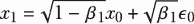
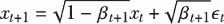
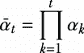
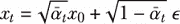
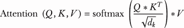
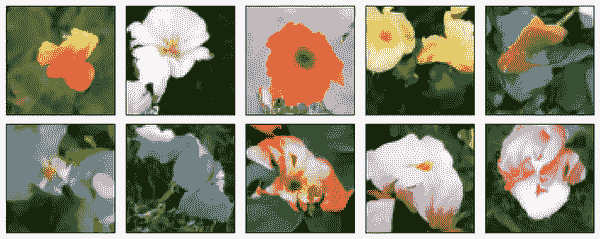
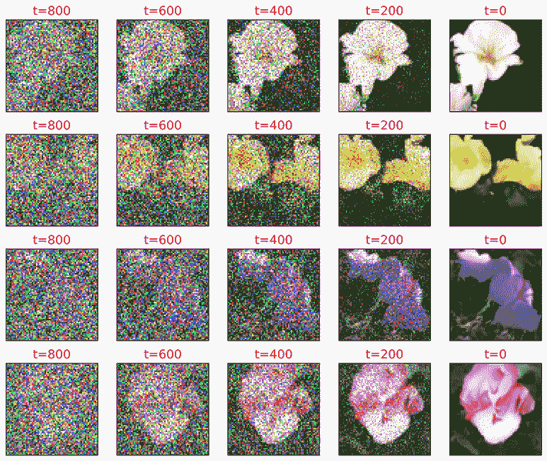
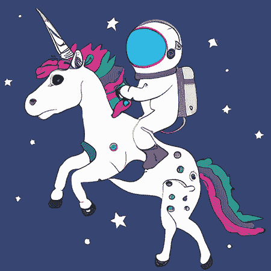

# 15 种扩散模型和文本到图像 Transformer

本章涵盖

+   前向扩散和反向扩散是如何工作的

+   如何构建和训练去噪 U-Net 模型

+   使用训练好的 U-Net 生成花卉图像

+   文本到图像 Transformer 背后的概念

+   编写 Python 程序通过 DALL-E 2 使用文本生成图像

近年来，多模态大型语言模型（LLMs）因其处理各种内容格式的能力而受到广泛关注，例如文本、图像、视频、音频和代码。这一领域的显著例子包括 OpenAI 的 DALL-E 2、Google 的 Imagen 和 Stability AI 的 Stable Diffusion 等文本到图像 Transformer。这些模型能够根据文本描述生成高质量的图像。

这些文本到图像模型包括三个基本组件：一个文本编码器，它将文本压缩成潜在表示；一种将文本信息融入图像生成过程的方法；以及一种扩散机制，用于逐步细化图像以产生逼真的输出。理解扩散机制对于理解文本到图像 Transformer 尤其关键，因为扩散模型构成了所有领先文本到图像 Transformer 的基础。因此，你将首先在本章中构建和训练一个扩散模型来生成花卉图像。这将帮助你深入理解前向扩散过程，其中噪声逐步添加到图像中，直到它们变成随机噪声。随后，你将训练一个模型通过逐步从图像中移除噪声来逆转扩散过程，直到模型可以从随机噪声中生成一个新、干净的图像，类似于训练数据集中的图像。

扩散模型已成为生成高分辨率图像的首选选择。扩散模型的成功在于它们能够模拟和逆转复杂的噪声添加过程，这模仿了对图像结构和如何从抽象模式中构建图像的深入理解。这种方法不仅确保了高质量，而且在生成的图像中保持了多样性和准确性的平衡。

之后，我们将解释文本到图像 Transformer 在概念上的工作方式。我们将重点关注由 OpenAI 开发的对比语言-图像预训练（CLIP）模型，该模型旨在理解和关联视觉和文本信息。CLIP 处理两种类型的输入：图像和文本（通常是标题或描述的形式）。这些输入通过模型中的两个编码器分别处理。

CLIP 的图像分支使用视觉 Transformer (ViT)将图像编码到高维向量空间中，在这个过程中提取视觉特征。同时，文本分支使用基于 Transformer 的语言模型将文本描述编码到相同的向量空间中，从文本中捕获语义特征。CLIP 已经在许多匹配图像和文本描述的配对上进行了训练，以使向量空间中匹配对的表示紧密对齐。

OpenAI 的文本到图像的 Transformers，如 DALL-E 2，将 CLIP 作为一个核心组件。在本章中，你将学习如何获取 OpenAI API 密钥，并编写一个 Python 程序，根据文本描述使用 DALL-E 2 生成图像。

## 15.1 去噪扩散模型简介

使用以下示例可以说明基于扩散的模型的概念。考虑使用基于扩散的模型生成高分辨率花卉图像的目标。为此，你首先需要获取一组高质量的花卉图像用于训练。然后，指导模型逐步将这些图像中引入少量随机噪声，这个过程被称为正向扩散。经过多次添加噪声的步骤后，训练图像最终变成随机噪声。下一阶段涉及训练模型逆转这个过程，从纯噪声图像开始，逐步减少噪声，直到图像与原始训练集中的图像无法区分。

一旦训练完成，模型将得到随机噪声图像进行处理。它通过多次迭代系统地消除图像中的噪声，直到生成一个与训练集中相似的、高分辨率的花卉图像。这就是基于扩散模型的底层原理。1

在本节中，你将首先探索基于扩散的模型的数学基础。然后，你将深入了解 U-Nets 的架构，这是一种用于去噪图像和生成高分辨率花卉图像的模型类型。具体来说，U-Net 采用缩放点积注意力（SDPA）机制，类似于你在第九章到第十二章中看到的 Transformer 模型。最后，你将学习基于扩散的模型的训练过程以及训练模型的图像生成过程。

### 15.1.1 正向扩散过程

几篇论文提出了具有类似底层机制的基于扩散的模型。2 让我们以花卉图像作为一个具体的例子来解释去噪扩散模型背后的思想。图 15.1 展示了正向扩散过程的工作原理。


图 15.1 正向扩散过程的示意图。我们从训练集中的干净图像*x*[0]开始，向其添加噪声є[0]，形成噪声图像*x*[1] = √(1 – *β*[1])*x*[0] + √(*β*[1])є[0]。我们重复这个过程 1000 次，直到图像*x*[1000]变成随机噪声。

假设花朵图像 *x*[0]（如图 15.1 左侧图像所示）遵循 q(x) 分布。在正向扩散过程中，我们将向每个 T = 1,000 步中的图像添加少量噪声。噪声张量是正态分布的，其形状与花朵图像相同：(3, 64, 64)，表示三个颜色通道，高度和宽度为 64 像素。

扩散模型中的时间步

在扩散模型中，时间步指的是在逐渐向数据添加噪声并随后逆转此过程以生成样本的过程中所经历的离散阶段。扩散模型的前向阶段在一系列时间步中逐步添加噪声，将数据从其原始、干净的状态转换为噪声分布。在反向阶段，模型在类似的一系列时间步中操作，但顺序相反。它系统地从数据中去除噪声以重建原始数据或生成新的、高保真度的样本。在此反向过程的每个时间步中，都涉及预测在相应的正向步骤中添加的噪声并将其减去，从而逐渐去除数据直到达到干净状态。

在时间步 1 中，我们将噪声 є[0] 添加到图像 *x*[0]，从而获得一个噪声图像 *x*[1]：

|



| (15.1) |
| --- |

即，*x*[1] 是 *x*[0] 和 є[0] 的加权求和，其中 *β*[1] 衡量了噪声的权重。*β* 的值在不同时间步中会变化——因此 *β*[1] 中的下标。如果我们假设 *x*[0] 和 є[0] 之间相互独立，并且遵循标准正态分布（即，均值为 0，方差为 1），则噪声图像 *x*[1] 也将遵循标准正态分布。这很容易证明，因为


和


我们可以在接下来的 T-1 个时间步中继续向图像添加噪声，以便

|



| (15.2) |
| --- |

我们可以使用重新参数化技巧并定义 *α[t]* = 1 − *β[t]* 和



以便我们可以在任意时间步 t 对 *x[t]* 进行采样，其中 t 可以取 [1, 2, . . ., T−1, T] 中的任何值。然后我们有

|



| (15.3) |
| --- |

其中 є 是 є[0]、є[1]、...、є*[t]*[–1] 的组合，利用我们可以将两个正态分布相加以获得一个新的正态分布这一事实。例如，请参阅 Lilian Weng 的博客 [`mng.bz/Aalg`](https://mng.bz/Aalg) 以获取证明。

图 15.1 的左侧显示了来自训练集的干净花朵 *x*[0]。在第一步中，我们向其注入噪声 є[0]，以形成噪声图像 *x*[1]（图 15.1 中的第二个图像）。我们重复此过程 1,000 个时间步，直到图像变成随机噪声（最右侧的图像）。

### 15.1.2 使用 U-Net 模型进行图像去噪

现在你已经理解了正向扩散过程，让我们来讨论反向扩散过程（即去噪过程）。如果我们能够训练一个模型来逆转正向扩散过程，我们可以向模型输入随机噪声并要求它生成一个带噪声的花朵图像。然后我们可以将这个带噪声的图像再次输入到训练好的模型中，生成一个更清晰、但仍然带噪声的图像。我们可以迭代重复这个过程多次，直到我们获得一个干净的图像，与训练集中的图像无法区分。在反向扩散过程中使用多个推理步骤，而不是仅仅一个步骤，对于逐渐从噪声分布中重建高质量数据至关重要。它允许更可控、稳定且高质量地生成数据。

为了达到这个目的，我们将创建一个去噪 U-Net 模型。U-Net 架构最初是为生物医学图像分割设计的，其特点是具有对称形状，包括收缩路径（编码器）和扩展路径（解码器），通过瓶颈层连接。在去噪的背景下，U-Net 模型被调整为从图像中去除噪声，同时保留重要细节。U-Net 在去噪任务中优于简单的卷积网络，因为它们能够有效地捕捉图像中的局部和全局特征。

图 15.2 是本章中使用的去噪 U-Net 结构图。

该模型以一个带噪声的图像和带噪声图像的时间步长（*x[t]* 和方程 15.3 中的 t）作为输入，并预测图像中的噪声（即 є）。由于带噪声的图像是原始干净图像和噪声的加权总和（参见方程 15.3），了解噪声使我们能够推断并重建原始图像。

收缩路径（即编码器；图 15.2 的左侧）由多个卷积层和池化层组成。它逐步下采样图像，在不同抽象级别提取和编码特征。这一部分网络学会识别与去噪相关的模式和特征。

瓶颈层（图 15.2 的底部）连接编码器和解码器路径。它由卷积层组成，负责捕捉图像的最抽象表示。

扩展路径（即解码器；图 15.2 的右侧）由上采样层和卷积层组成。它逐步上采样特征图，在通过跳跃连接结合编码器特征的同时重建图像。跳跃连接（图 15.2 中用虚线表示）在 U-Net 模型中至关重要，因为它们允许模型通过结合低级和高级特征来保留输入图像的精细细节。接下来，我将简要解释跳跃连接是如何工作的。


图 15.2 去噪 U-Net 模型架构。U-Net 架构以其对称形状为特征，包括收缩路径（编码器）和扩展路径（解码器），通过瓶颈层连接。该模型旨在去除图像中的噪声，同时保留重要细节。模型的输入是一个噪声图像，以及图像所在的时间步，输出是图像中的预测噪声。

在 U-Net 模型中，跳过连接是通过将编码路径的特征图与解码路径中的相应特征图连接起来实现的。这些特征图通常具有相同的空间维度，但由于它们经过的路径不同，可能已经以不同的方式处理过。在编码过程中，输入图像逐渐下采样，一些空间信息（如边缘和纹理）可能会丢失。跳过连接通过直接从编码器传递特征图到解码器，绕过信息瓶颈，帮助保留这些信息。

例如，图 15.2 顶部的虚线表示模型将编码器中的 Conv2D 层的输出（形状为（128，64，64））与解码器中的 Conv2D 层的输入（形状也为（128，64，64））连接起来。因此，解码器中 Conv2D 层的最终输入形状为（256，64，64）。

通过将解码器中的高级、抽象特征与编码器中的低级、详细特征相结合，跳过连接使模型能够更好地重建去噪图像中的细微细节。这在去噪任务中尤为重要，因为保留细微的图像细节至关重要。

在我们的去噪 U-Net 模型中，缩放点积注意力（SDPA）机制在收缩路径的最后一个块和扩展路径的最后一个块中实现，伴随着层归一化和残差连接（如图 15.2 中标记为 Attn/Norm/Add）。这个 SDPA 机制本质上与我们第九章中开发的相同；关键区别在于它应用于图像像素而不是文本标记。

跳过连接的使用和模型的大小导致我们的去噪 U-Net 中存在冗余的特征提取，确保在去噪过程中不会丢失任何重要特征。然而，模型的大尺寸也使得识别相关特征变得复杂，就像在干草堆里找针一样。注意力机制赋予模型强调显著特征并忽略不相关特征的能力，从而增强了学习过程的有效性。

### 15.1.3 训练去噪 U-Net 模型的蓝图

去噪 U-Net 的输出是注入到噪声图像中的噪声。该模型经过训练以最小化输出（预测噪声）与真实噪声之间的差异。

去噪 U-Net 模型利用 U-Net 架构捕捉局部和全局上下文的能力，使其在去除噪声的同时保留重要细节（如边缘和纹理）变得有效。这些模型在各种应用中得到了广泛应用，包括医学图像去噪、摄影图像恢复等。图 15.3 展示了我们去噪 U-Net 模型的训练过程。


图 15.3 去噪 U-Net 模型的训练过程。我们首先获取干净的花卉图像作为我们的训练集。我们向干净的花卉图像添加噪声，并将其呈现给 U-Net 模型。模型预测噪声图像中的噪声。我们将预测的噪声与注入花卉图像的实际噪声进行比较，并调整模型权重以最小化平均绝对误差。

第一步是收集花卉图像数据集。我们将使用牛津 102 花卉数据集作为我们的训练集。我们将所有图像调整到 64 × 64 像素的固定分辨率，并将像素值归一化到范围[–1, 1]。对于去噪，我们需要成对的干净和噪声图像。我们将根据方程 15.3 中指定的公式，对干净的花卉图像添加噪声，以创建噪声对应图像（图 15.3 中的步骤 2）。

然后，我们将根据图 15.2 中概述的结构构建一个去噪 U-Net 模型。在训练的每个 epoch 中，我们以批处理的方式遍历数据集。我们向花卉图像添加噪声，并将噪声图像及其在噪声图像中的时间步长 t 呈现给 U-Net 模型（步骤 3）。U-Net 模型根据模型中的当前参数预测噪声图像中的噪声（步骤 4）。

我们将预测的噪声与实际噪声进行比较，并在像素级别计算 L1 损失（即平均绝对误差）（步骤 5）。在这种情况下，L1 损失通常比 L2 损失（均方误差）对异常值更不敏感，因此更受欢迎。然后，我们调整模型参数以最小化 L1 损失（步骤 6），以便在下一轮迭代中，模型能做出更好的预测。我们将重复此过程多次，直到模型参数收敛。

## 15.2 准备训练数据

我们将使用牛津 102 花卉数据集，该数据集可在 Hugging Face 上免费获取，作为我们的训练数据。该数据集包含大约 8,000 张花卉图像，您可以使用之前安装的*datasets*库直接下载。

为了节省空间，我们将大多数辅助函数和类放在两个本地模块中，ch15util.py 和 unet_util.py。从本书的 GitHub 仓库（[`github.com/markhliu/DGAI`](https://github.com/markhliu/DGAI)）下载这两个文件，并将它们放在您计算机上的/utils/文件夹中。本章中的 Python 程序是从 Hugging Face 的 GitHub 仓库（[`github.com/huggingface/diffusers`](https://github.com/huggingface/diffusers)）和 Filip Basara 的 GitHub 仓库（[`github.com/filipbasara0/simple-diffusion`](https://github.com/filipbasara0/simple-diffusion)）改编的。

您将使用 Python 将数据集下载到您的计算机上。之后，我们将通过逐渐向训练数据集中的干净图像添加噪声，直到它们变成随机噪声，来演示前向扩散过程。最后，您将批量放置训练数据，以便我们可以在本章后面使用它们来训练去噪 U-Net 模型。

您在本章中将使用以下 Python 库：datasets、einops、diffusers 和 openai。要安装这些库，请在您的计算机上的 Jupyter Notebook 应用程序的新单元格中执行以下代码行：

```py
!pip install datasets einops diffusers openai
```

按照屏幕上的说明完成安装。

### 15.2.1 将花卉图像作为训练数据

您之前安装的*datasets*库中的`load_dataset()`方法允许您直接从 Hugging Face 下载牛津 102 花卉数据集。然后我们将使用*matplotlib*库显示数据集中的某些花卉图像，以便我们了解训练数据集中的图像是什么样的。

在 Jupyter Notebook 的单元格中运行以下列表中的代码行。

列表 15.1 下载和可视化花卉图像

```py
from datasets import load_dataset
from utils.ch15util import transforms

dataset = load_dataset("huggan/flowers-102-categories",
    split="train",)                                      ①
dataset.set_transform(transforms)

import matplotlib.pyplot as plt
from torchvision.utils import make_grid

# Plot all the images of the 1st batch in grid
grid = make_grid(dataset[:16]["input"], 8, 2)            ②
plt.figure(figsize=(8,2),dpi=300)
plt.imshow(grid.numpy().transpose((1,2,0)))
plt.axis("off")
plt.show()
```

① 从 Hugging Face 下载图像

② 绘制前 16 张图像

在运行前面的代码列表后，您将看到数据集中的前 16 张花卉图像，如图 15.4 所示。这些是各种类型花卉的高分辨率彩色图像。我们已经将每张图像的大小标准化为（3，64，64）。


图 15.4 来自牛津 102 花卉数据集的前 16 张图像。

我们将数据集分成每批 4 个，以便我们可以在本章后面使用它们来训练去噪 U-Net 模型。我们选择批大小为 4，以保持内存大小足够小，以便在训练过程中适合 GPU。如果您的 GPU 内存较小，请将批大小调整为 2 甚至 1：

```py
import torch
resolution=64
batch_size=4
train_dataloader=torch.utils.data.DataLoader(
    dataset, batch_size=batch_size, shuffle=True)
```

接下来，我们将编写代码并可视化前向扩散过程。

### 15.2.2 可视化前向扩散过程

我们在本地模块 ch15util.py 中定义了一个 `DDIMScheduler()` 类，您刚刚下载。请查看该文件中的类；我们将使用它向图像添加噪声。我们还将使用该类来生成干净的图像，以及训练好的去噪 U-Net 模型。`DDIMScheduler()` 类管理步长大小和去噪步骤的顺序，通过去噪过程实现确定性推理，从而可以生成高质量的样本。

我们首先从训练集中选择四张干净图像，并生成与这些图像形状相同的噪声张量：

```py
clean_images=next(iter(train_dataloader))["input"]*2-1    ①
print(clean_images.shape)
nums=clean_images.shape[0]
noise=torch.randn(clean_images.shape)                     ②
print(noise.shape)
```

① 获取四张干净图像

② 生成一个与干净图像形状相同的张量，噪声；噪声中的每个值都遵循独立的标准正态分布。

前一个代码块输出的结果是

```py
torch.Size([4, 3, 64, 64])
torch.Size([4, 3, 64, 64])
```

图像和噪声张量的形状都是 (4, 3, 64, 64)，这意味着批处理中有 4 张图像，每张图像有 3 个颜色通道，图像的高度和宽度为 64 像素。

在正向扩散过程中，在干净图像 (*x*[0] 如我们在第一部分中解释的) 和随机噪声 (*x[T]*) 之间有 999 个过渡噪声图像。过渡噪声图像是干净图像和噪声的加权总和。随着 *t* 从 0 到 1,000 的变化，干净图像的权重逐渐降低，噪声的权重逐渐增加，如方程式 15.3 所述。

接下来，我们生成并可视化一些过渡噪声图像。

列表 15.2 可视化正向扩散过程

```py
from utils.ch15util import DDIMScheduler

noise_scheduler=DDIMScheduler(num_train_timesteps=1000)    ①
allimgs=clean_images
for step in range(200,1001,200):                           ②
    timesteps=torch.tensor([step-1]*4).long()
    noisy_images=noise_scheduler.add_noise(clean_images,
                 noise, timesteps)                         ③
    allimgs=torch.cat((allimgs,noisy_images))              ④

import torchvision
imgs=torchvision.utils.make_grid(allimgs,4,6)
fig = plt.figure(dpi=300)
plt.imshow((imgs.permute(2,1,0)+1)/2)                      ⑤
plt.axis("off")
plt.show()
```

① 使用 1,000 个时间步创建 DDIMScheduler() 类实例

② 查看时间步 200、400、600、800 和 1,000

③ 在这些时间步创建噪声图像

④ 将噪声图像与干净图像连接

⑤ 显示所有图像

`DDIMScheduler()` 类中的 `add_noise()` 方法接受三个参数：`clean_images`、`noise` 和 `timesteps`。它产生干净图像和噪声的加权总和，即噪声图像。此外，权重是时间步 t 的函数。随着时间步 t 从 0 到 1,000 的变化，干净图像的权重逐渐降低，噪声的权重逐渐增加。如果您运行前面的代码列表，您将看到类似于图 15.5 的图像。


图 15.5 正向扩散过程。第一列中的四张图像是训练数据集中的干净图像。然后我们从时间步 1 到时间步 1,000 逐渐向这些图像添加噪声。随着时间步的增加，图像中注入的噪声越来越多。第二列中的四张图像是在 200 个时间步之后的图像。第三列包含 400 个时间步之后的图像，它们的噪声比第二列中的图像更多。最后一列包含 1,000 个时间步之后的图像，它们是 100% 的随机噪声。

第一列包含没有噪声的四个干净图像。随着向右移动，我们逐渐向图像添加越来越多的噪声。最后一列包含纯随机噪声。

## 15.3 构建噪声去除 U-Net 模型

在本章的早期部分，我们讨论了噪声去除 U-Net 模型的架构。在本节中，我将指导您使用 Python 和 PyTorch 来实现它。

我们将要构建的 U-Net 模型相当大，包含超过 1.33 亿个参数，反映了其预期任务的复杂性。它通过下采样和上采样输入来捕捉图像中的局部和全局特征。该模型使用多个通过跳跃连接相互连接的卷积层，这些层结合了网络不同级别的特征。这种架构有助于保持空间信息，从而促进更有效的学习。

由于噪声去除 U-Net 模型规模庞大且特征提取冗余，我们采用了 SDPA 注意力机制，使模型能够专注于当前任务中最相关的输入方面。为了计算 SDPA 注意力，我们将图像展平并将像素视为一个序列。然后我们将使用 SDPA 以类似于在第九章中学习文本中不同标记之间依赖关系的方式，学习图像中不同像素之间的依赖关系。

### 15.3.1 噪声去除 U-Net 模型中的注意力机制

为了实现注意力机制，我们在本地模块 ch15util.py 中定义了一个`Attention()`类，如下面的代码列表所示。

列表 15.3 噪声去除 U-Net 模型中的注意力机制

```py
import torch
from torch import nn, einsum
from einops import rearrange

class Attention(nn.Module):
    def __init__(self, dim, heads=4, dim_head=32):
        super().__init__()
        self.scale = dim_head**-0.5
        self.heads = heads
        hidden_dim = dim_head * heads
        self.to_qkv = nn.Conv2d(dim, hidden_dim * 3, 1, bias=False)
        self.to_out = nn.Conv2d(hidden_dim, dim, 1)
    def forward(self, x):
        b, c, h, w = x.shape
        qkv = self.to_qkv(x).chunk(3, dim=1)                      ①
        q, k, v = map(
        lambda t: rearrange(t, 'b (h c) x y -> b h c (x y)', h=self.heads),
        qkv)                                                      ②
        q = q * self.scale    
        sim = einsum('b h d i, b h d j -> b h i j', q, k)
        attn = sim.softmax(dim=-1)                                ③
        out = einsum('b h i j, b h d j -> b h i d', attn, v)      ④
        out = rearrange(out, 'b h (x y) d -> b (h d) x y', x=h, y=w)
        return self.to_out(out)                                   ⑤
attn=Attention(128)
x=torch.rand(1,128,64,64)
out=attn(x)
print(out.shape)
```

① 将输入通过三个线性层传递以获得查询、键和值

② 将查询、键和值分成四个头

③ 计算注意力权重

④ 计算每个头中的注意力向量

⑤ 将四个注意力向量连接成一个

运行上述代码列表后的输出是

```py
torch.Size([1, 128, 64, 64])
```

这里使用的注意力机制 SDPA 与我们在第九章中使用的相同，当时我们将 SDPA 应用于表示文本中标记的索引序列。在这里，我们将它应用于图像中的像素。我们将图像的展平像素视为一个序列，并使用 SDPA 提取输入图像不同区域之间的依赖关系，从而提高去噪过程的效率。

列表 15.3 展示了 SDPA 在我们上下文中的操作方式。为了给您一个具体的例子，我们创建了一个假设的图像，x，其维度为（1，128，64，64），表示批次中的一个图像，128 个特征通道，每个通道的大小为 64 × 64 像素。然后输入 x 通过注意力层进行处理。具体来说，图像中的每个特征通道被展平成一个 64 × 64 = 4,096 像素的序列。然后这个序列通过三个不同的神经网络层传递，以产生查询 Q、键 K 和值 V，随后将它们分成四个头。每个头中的注意力向量计算如下：



其中 *d[k]* 代表关键向量 K 的维度。来自四个头的注意力向量被连接回一个单独的注意力向量。

### 15.3.2 去噪 U-Net 模型

在您刚刚下载的本地模块 unet_util.py 中，我们定义了一个 `UNet()` 类来表示去噪 U-Net 模型。请查看文件中的定义，稍后我会简要解释其工作原理。以下代码列表展示了 `UNet()` 类的一部分。

列表 15.4 定义 `UNet()` 类

```py
class UNet(nn.Module):
… 
    def forward(self, sample, timesteps):                         ①
        if not torch.is_tensor(timesteps):
            timesteps = torch.tensor([timesteps],
                                     dtype=torch.long,
                                     device=sample.device)
        timesteps = torch.flatten(timesteps)
        timesteps = timesteps.broadcast_to(sample.shape[0])
        t_emb = sinusoidal_embedding(timesteps, self.hidden_dims[0])
        t_emb = self.time_embedding(t_emb)                        ②
        x = self.init_conv(sample)
        r = x.clone()
        skips = []
        for block1, block2, attn, downsample in self.down_blocks: ③
            x = block1(x, t_emb)
            skips.append(x)
            x = block2(x, t_emb)
            x = attn(x)
            skips.append(x)
            x = downsample(x)
        x = self.mid_block1(x, t_emb)
        x = self.mid_attn(x)
        x = self.mid_block2(x, t_emb)                             ④
        for block1, block2, attn, upsample in self.up_blocks:    
            x = torch.cat((x, skips.pop()), dim=1)                ⑤
            x = block1(x, t_emb)
            x = torch.cat((x, skips.pop()), dim=1)
            x = block2(x, t_emb)
            x = attn(x)
            x = upsample(x)
        x = self.out_block(torch.cat((x, r), dim=1), t_emb)
        out = self.conv_out(x)
        return {"sample": out}                                    ⑥
```

① 模型接受一批噪声图像和时间步长作为输入。

② 将嵌入的时间步长作为输入添加到图像的各个阶段。

③ 将输入通过收缩路径传递

④ 通过瓶颈路径传递输入

⑤ 通过具有跳跃连接的扩张路径传递输入

⑥ 输出是输入图像中预测的噪声。

去噪 U-Net 的任务是根据这些图像所在的时间步长预测输入图像中的噪声。如方程 15.3 所述，任何时间步长 t 的噪声图像 *x[t]* 可以表示为干净图像 *x*[o] 和标准正态分布的随机噪声 є 的加权总和。分配给干净图像的权重随时间步长 t 从 0 到 T 的进展而减少，分配给随机噪声的权重增加。因此，为了推断噪声图像中的噪声，去噪 U-Net 需要知道噪声图像所在的时间步长。

时间步长使用类似于 Transformer（在第九章和第十章中讨论）中的位置编码的正弦和余弦函数进行嵌入，结果得到一个 128 值的向量。然后这些嵌入被扩展以匹配模型中各个层级的图像特征维度。例如，在第一个下采样块中，时间嵌入被广播到形状为（128，64，64），然后添加到图像特征中，这些特征也有（128，64，64）的维度。

接下来，我们通过在本地模块中实例化 `UNet()` 类来创建一个去噪 U-Net 模型：

```py
from utils.unet_util import UNet

device="cuda" if torch.cuda.is_available() else "cpu"
resolution=64
model=UNet(3,hidden_dims=[128,256,512,1024],
           image_size=resolution).to(device)
num=sum(p.numel() for p in model.parameters())
print("number of parameters: %.2fM" % (num/1e6,))
print(model) 
```

输出是

```py
number of parameters: 133.42M
```

模型有超过 1.33 亿个参数，您可以从之前的输出中看到。鉴于参数数量庞大，本章中的训练过程将耗时，大约需要 3 到 4 小时的 GPU 训练时间。然而，对于那些无法访问 GPU 训练的人，训练好的权重也存在于我的网站上。这些权重的链接将在下一节提供。

## 15.4 训练和使用去噪 U-Net 模型

现在我们已经拥有了训练数据和去噪 U-Net 模型，我们可以准备使用训练数据来训练模型了。

在每个训练周期中，我们将遍历训练数据中的所有批次。对于每张图像，我们将随机选择一个时间步长，并根据这个时间步长值在训练数据中的干净图像上添加噪声，从而得到一个噪声图像。然后，我们将这些噪声图像及其对应的时间步长值输入到去噪 U-Net 模型中，以预测每张图像中的噪声。我们将预测的噪声与真实值（实际添加到图像中的噪声）进行比较，并调整模型参数以最小化预测噪声与实际噪声之间的平均绝对误差。

训练完成后，我们将使用训练好的模型生成花朵图像。我们将通过 50 次推理步骤（即，我们将时间步长值设置为 980、960、……、20 和 0）来完成这一生成。从随机噪声开始，我们将将其输入到训练好的模型中，以获得一个噪声图像。然后，我们将这个噪声图像反馈到训练好的模型中，以对其进行去噪。我们将重复这个过程 50 次推理步骤，最终得到一个与训练集中花朵不可区分的图像。

### 15.4.1 训练去噪 U-Net 模型

接下来，我们首先定义训练过程中的优化器和学习率调度器。

我们将使用 AdamW 优化器，这是我们在整本书中一直在使用的 Adam 优化器的一个变体。AdamW 优化器最初由 Ilya Loshchilov 和 Frank Hutter 提出，它将权重衰减（一种正则化形式）从优化步骤中分离出来.^(3) AdamW 优化器不是直接将权重衰减应用于梯度，而是在优化步骤之后直接将权重衰减应用于参数（权重）。这种修改有助于通过防止衰减率与学习率一起调整来实现更好的泛化性能。感兴趣的读者可以在 Loshchilov 和 Hutter 的原始论文中了解更多关于 AdamW 优化器的内容。

我们还将使用 diffusers 库中的学习率调度器来调整训练过程中的学习率。最初使用较高的学习率可以帮助模型逃离局部最小值，而在训练的后期阶段逐渐降低学习率可以帮助模型更稳定、更准确地收敛到全局最小值。学习率调度器定义如下所示。

列表 15.5 在训练中选择优化器和学习率

```py
from diffusers.optimization import get_scheduler

num_epochs=100                                             ①
optimizer=torch.optim.AdamW(model.parameters(),lr=0.0001,
    betas=(0.95,0.999),weight_decay=0.00001,eps=1e-8)      ②
lr_scheduler=get_scheduler(                                ③
    "cosine",
    optimizer=optimizer,
    num_warmup_steps=300,
    num_training_steps=(len(train_dataloader) * num_epochs))
```

① 将训练模型 100 个周期

② 使用 AdamW 优化器

③ 使用 diffusers 库中的学习率调度器来控制学习率

`get_scheduler()` 函数的精确定义由 Hugging Face 在 GitHub 上定义：[`mng.bz/ZVo5`](https://mng.bz/ZVo5)。在前 300 个训练步骤（预热步骤）中，学习率从 0 线性增加到 0.0001（我们在 AdamW 优化器中设置的学习率）。在 300 步之后，学习率按照 0.0001 和 0 之间的余弦函数值递减。在下面的列表中，我们训练模型 100 个周期。

列表 15.6 训练去噪 U-Net 模型

```py
for epoch in range(num_epochs):
    model.train()
    tloss = 0
    print(f"start epoch {epoch}")
    for step, batch in enumerate(train_dataloader):
        clean_images = batch["input"].to(device)*2-1
        nums = clean_images.shape[0]
        noise = torch.randn(clean_images.shape).to(device)
        timesteps = torch.randint(0,
                noise_scheduler.num_train_timesteps,
                (nums, ),
                device=device).long()
        noisy_images = noise_scheduler.add_noise(clean_images,
                     noise, timesteps)                         ①

noise_pred = model(noisy_images, 
                       timesteps)["sample"]                    ②
        loss=torch.nn.functional.l1_loss(noise_pred, noise)    ③
        loss.backward()
        optimizer.step()                                       ④
        lr_scheduler.step()
        optimizer.zero_grad()
        tloss += loss.detach().item()
        if step%100==0:
            print(f"step {step}, average loss {tloss/(step+1)}")
torch.save(model.state_dict(),'files/diffusion.pth')
```

① 在训练集中向干净图像添加噪声

② 使用去噪 U-Net 预测噪声图像中的噪声

③ 将预测的噪声与实际噪声进行比较以计算损失

④ 调整模型参数以最小化平均绝对误差

在每个周期中，我们遍历训练集中所有干净的花朵图像的批次。我们向这些干净的图像添加噪声，并将它们输入到去噪 U-Net 中以预测这些图像中的噪声。然后我们将预测的噪声与实际噪声进行比较，并调整模型参数以最小化两者之间的平均绝对误差（像素级）。

这里描述的训练过程需要几个小时，使用 GPU 训练。训练后，训练好的模型权重将保存在您的计算机上。或者，您可以从我的网站 [`mng.bz/RNlD`](https://mng.bz/RNlD) 下载训练好的权重。下载后请解压文件。

### 15.4.2 使用训练好的模型生成花朵图像

为了生成花朵图像，我们将使用 50 个推理步骤。这意味着我们将查看 t = 0 和 t = T 之间等间隔的 50 个时间步，在我们的情况下 T = 1,000。因此，50 个推理时间步是 t = 980, 960, 940, . . . , 20, 和 0。我们将从纯随机噪声开始，这对应于 t = 1000 的图像。我们使用训练好的去噪 U-Net 模型对其进行去噪，并在 t = 980 创建一个噪声图像。然后我们将 t = 980 的噪声图像呈现给训练好的模型进行去噪，以获得 t = 960 的噪声图像。我们重复这个过程多次，直到获得 t = 0 的图像，这是一个干净的图像。这个过程通过在本地模块 ch15util.py 中的 `DDIMScheduler()` 类的 `generate()` 方法实现。

列表 15.7 在 `DDIMScheduler()` 类中定义 `generate()` 方法

```py
    @torch.no_grad()
    def generate(self,model,device,batch_size=1,generator=None,
         eta=1.0,use_clipped_model_output=True,num_inference_steps=50):
        imgs=[]
        image=torch.randn((batch_size,model.in_channels,model.sample_size,

model.sample_size),
            generator=generator).to(device)              ①

        self.set_timesteps(num_inference_steps)
        for t in tqdm(self.timesteps):                   ②
            model_output = model(image, t)["sample"]     ③
            image = self.step(model_output,t,image,eta,
                  use_clipped_model_output=\
                  use_clipped_model_output)              ④
            img = unnormalize_to_zero_to_one(image)
            img = img.cpu().permute(0, 2, 3, 1).numpy()
            imgs.append(img)                             ⑤
        image = unnormalize_to_zero_to_one(image)
        image = image.cpu().permute(0, 2, 3, 1).numpy()
        return {"sample": image}, imgs 
```

① 使用随机噪声作为起点（即 t = 1,000 的图像）

② 使用 50 个推理时间步（t = 980, 960, 940, . . , 20, 0）

③ 使用训练好的去噪 U-Net 模型来预测噪声

④ 根据预测的噪声创建图像

⑤ 将中间图像保存在列表，imgs 中

在这个 `generate()` 方法中，我们同样创建了一个列表，imgs，用于存储所有在时间步 t = 980, 960,. . . , 20, 和 0 时的中间图像。我们将使用它们来可视化去噪过程。`generate()` 方法返回一个包含生成的图像和列表，imgs 的字典。

接下来，我们将使用之前的 `generate()` 方法创建 10 张干净的图像。

列表 15.8 使用训练好的去噪 U-Net 模型生成图像

```py
sd=torch.load('files/diffusion.pth',map_location=device)
model.load_state_dict(sd)
with torch.no_grad():
    generator = torch.manual_seed(1)                     ①
    generated_images,imgs = noise_scheduler.generate(
        model,device,
        num_inference_steps=50,
        generator=generator,
        eta=1.0,
        use_clipped_model_output=True,
        batch_size=10)                                   ②
imgnp=generated_images["sample"]    
import matplotlib.pyplot as plt
plt.figure(figsize=(10,4),dpi=300)
for i in range(10):                                      ③
    ax = plt.subplot(2,5, i + 1)
    plt.imshow(imgnp[i])
    plt.xticks([])
    plt.yticks([])
    plt.tight_layout()
plt.show()  
```

① 设置随机种子为 1，以便结果可重复

② 使用定义的 generate()方法创建 10 张干净的图像

③ 绘制生成的图像

我们将随机种子设置为 1。因此，如果您使用我网站上的训练模型，您将得到与图 15.6 中显示的相同的结果。我们使用之前定义的`generate()`方法，使用 50 次推理步骤创建 10 张干净的图像。然后我们将这 10 张图像以 2×5 的网格形式绘制出来，如图 15.6 所示。



图 15.6 由训练好的去噪 U-Net 模型创建的花朵图像。

如您从图 15.6 中看到的那样，生成的花朵图像看起来很真实，类似于训练数据集中的图像。

练习 15.1

修改代码列表 15.8 并将随机种子改为 2。保持其余代码不变。重新运行代码列表，看看生成的图像是什么样子。

`generate()`方法还返回一个包含 50 个中间步骤中所有图像的列表 imgs。我们将使用它们来可视化去噪过程。

列表 15.9 可视化去噪过程

```py
steps=imgs[9::10]                                ①
imgs20=[]
for j in [1,3,6,9]:
    for i in range(5):
        imgs20.append(steps[i][j])               ②
plt.figure(figsize=(10,8),dpi=300)
for i in range(20):                              ③
    k=i%5
    ax = plt.subplot(4,5, i + 1)
    plt.imshow(imgs20[i])
    plt.xticks([])
    plt.yticks([])
    plt.tight_layout()
    plt.title(f't={800-200*k}',fontsize=15,c="r")
plt.show()
```

① 保持时间步 800、600、400、200 和 0

② 从 10 组花朵中选择 4 组

③ 以 4×5 的网格绘制 20 张图像

列表中的 imgs 包含所有 50 个推理步骤中的 10 组图像，t = 980, 960, ...，20, 0。因此，列表中共有 500 张图像。我们选择了五个时间步（t = 800, 600, 400, 200 和 0）用于四种不同的花朵（图 15.6 中的第 2、4、7 和 10 张图像）。然后我们将这 20 张图像以 4×5 的网格形式绘制出来，如图 15.7 所示。



图 15.7 训练好的去噪 U-Net 模型如何逐步将随机噪声转换为干净的鲜花图像。我们将随机噪声输入到训练好的模型中，以获得时间步 980 的图像。然后我们将 t = 980 的噪声图像输入到模型中，以获得 t = 960 的图像。我们重复这个过程 50 次推理步骤，直到我们获得 t = 0 的图像。该图的第一列显示了 t = 800 时的四个花朵；第二列显示了相同的四个花朵在 t = 600 时...；最后一列显示了 t = 0（即干净的鲜花图像）的四个花朵。

图 15.7 的第一列显示了 t = 800 时的四个花朵图像。它们接近随机噪声。第二列显示了 t = 600 时的花朵，它们开始看起来像花朵。随着我们向右移动，图像变得越来越清晰。最右边的一列显示了 t = 0 时的四个干净花朵图像。

现在您已经了解了扩散模型的工作原理，我们将讨论文本到图像的生成。文本到图像的 Transformers，如 DALL-E 2、Imagen 和 Stable Diffusion 的图像生成过程与我们在本章前面讨论的逆向扩散过程非常相似，只是在生成图像时，模型将文本嵌入作为条件信号。

## 15.5 文本到图像的 Transformers

如 OpenAI 的 DALL-E 2、Google 的 Imagen 和 Stability AI 的 Stable Diffusion 这样的文本到图像 Transformer 使用扩散模型从文本描述生成图像。这些文本到图像 Transformer 的一个重要组成部分是扩散模型。文本到图像生成的过程涉及将文本输入编码成一个潜在表示，然后将其用作扩散模型的条件信号。这些 Transformer 通过迭代地去除随机噪声向量来学习生成与文本描述相对应的逼真图像，这个过程由编码的文本引导。

所有这些文本到图像的 Transformer 的关键在于一个能够理解不同模态内容的模型。在这种情况下，该模型必须理解文本描述并将它们与图像以及反之联系起来。

在本节中，我们将以 OpenAI 的 CLIP 模型为例。CLIP 是 DALL-E 2 的关键组件。我们将讨论 CLIP 是如何被训练来理解文本描述和图像之间的联系的。然后，我们使用一个简短的 Python 程序，通过使用 OpenAI 的 DALL-E 2，从文本提示中生成图像。

### 15.5.1 CLIP：一个多模态 Transformer

近年来，计算机视觉和自然语言处理（NLP）的交叉领域取得了显著进展，其中之一是 OpenAI 创建的 CLIP 模型。这个创新模型旨在理解并解释自然语言环境中的图像，这一能力在图像生成和图像分类等众多应用中具有巨大的潜力。

CLIP 模型是一个多模态 Transformer，它弥合了视觉数据和文本数据之间的差距。它通过将图像与相应的文本描述关联起来来训练理解图像。与需要显式标记图像的传统模型不同，CLIP 使用大量图像及其自然语言描述的数据集来学习视觉概念的更一般化表示。


图 15.8 OpenAI 的 CLIP 模型是如何训练的。收集了一个大规模的文本-图像对训练数据集。模型的文本编码器将文本描述压缩成 D 值文本嵌入。图像编码器将相应的图像转换成具有 D 值的图像嵌入。在训练过程中，一批 N 个文本-图像对被转换成 N 个文本嵌入和 N 个图像嵌入。CLIP 使用对比学习方法来最大化配对嵌入之间的相似性（图中对角线值的总和）同时最小化来自不匹配文本-图像对的嵌入之间的相似性（图中非对角线值的总和）。

CLIP 模型的训练，如图 15.8 所示，始于收集包含图像及其相关文本描述的大规模数据集。OpenAI 利用了多样化的来源，包括公开可用的数据集和网页爬取的数据，以确保有广泛的视觉和文本内容。然后对数据集进行预处理，以标准化图像，使它们都具有相同的形状，并对文本进行分词，为输入模型做准备。

CLIP 采用双编码器架构，包括图像编码器和文本编码器。图像编码器处理输入图像，而文本编码器处理相应的文本描述。这些编码器将图像和文本投影到一个共享的嵌入空间中，在那里它们可以被比较和对齐。

CLIP 训练的核心在于其对比学习方法。对于数据集中每个包含 N 个图像-文本对的批次，模型旨在最大化配对嵌入之间的相似性（如图 15.8 中对角线值的总和），同时最小化来自不匹配的文本-图像对嵌入之间的相似性（非对角线值的总和）。图 15.9 展示了如何基于文本提示生成逼真图像的文本到图像 Transformer，如 DALL-E 2。


图 15.9 展示了如何基于文本提示创建图像的文本到图像 Transformer，如 DALL-E 2。在训练好的文本到图像 Transformer 中，文本编码器首先将提示中的文本描述转换为文本嵌入。文本嵌入被输入到 CLIP 模型中，以获得一个表示潜在空间中图像的先验向量。文本嵌入和先验被连接成一个条件向量。为了生成图像，U-Net 降噪器首先以一个随机噪声向量为输入，使用条件向量生成一个带噪声的图像。然后它以带噪声的图像和条件向量为输入，生成另一个图像，该图像噪声更少。这个过程重复多次，直到最终输出一个干净的图像。

文本到图像 Transformer 的图像生成过程与我们本章 earlier 讨论的逆向扩散过程类似。以 DALL-E 2 为例，它是由 OpenAI 研究人员在 2022 年提出的.^(4) 模型中的文本编码器首先将提示中的文本描述转换为文本嵌入。文本嵌入被输入到 CLIP 模型中，以获得一个表示潜在空间中图像的先验向量。文本嵌入和先验被连接成一个条件向量。在第一次迭代中，我们将一个随机噪声向量输入到模型中的 U-Net 降噪器，并要求它根据条件向量生成一个噪声图像。在第二次迭代中，我们将前一次迭代中的噪声图像输入到 U-Net 降噪器，并要求它根据条件向量生成另一个噪声图像。我们重复这个过程多次，最终输出是一个干净的图像。

### 15.5.2 使用 DALL-E 2 进行文本到图像生成

现在你已经了解了文本到图像 Transformer 的工作原理，让我们编写一个 Python 程序来与 DALL-E 2 交互，根据文本提示创建图像。

首先，你需要申请一个 OpenAI API 密钥。OpenAI 提供各种定价层，这些定价层根据处理的令牌数量和使用的模型类型而有所不同。访问[`chat.openai.com/auth/login`](https://chat.openai.com/auth/login)并点击“注册”按钮创建账户。之后，登录你的账户，并访问[`platform.openai.com/api-keys`](https://platform.openai.com/api-keys)以查看你的 API 密钥。将其保存在安全的地方以备后用。我们可以使用 OpenAI 的 DALL-E 2 生成图像。

列表 15.10 使用 DALL-E 2 生成图像

```py
from openai import OpenAI

openai_api_key=your actual OpenAI API key here, in quotes   ①
client=OpenAI(api_key=openai_api_key)                       ②

response = client.images.generate(
  model="dall-e-2",
  prompt="an astronaut in a space suit riding a unicorn",
  size="512x512",
  quality="standard",
  n=1,
)                                                           ③
image_url = response.data[0].url
print(image_url)                                            ④
```

① 确保你在这里提供实际的 OpenAI API 密钥，并用引号括起来

② 实例化 OpenAI()类以创建代理

③ 使用 images.generate()方法根据文本提示生成图像

④ 打印出图像 URL

你应该将之前获得的 OpenAI API 密钥放置在列表 15.10 中。我们通过实例化`OpenAI()`类来创建一个代理。要生成图像，我们需要指定模型、文本提示和图像的大小。我们使用了“一个穿着太空服的宇航员骑独角兽”作为提示，代码列表提供了我们可视化和下载图像的 URL。该 URL 在 1 小时内过期，生成的图像如图 15.10 所示。



图 15.10 DALL-E 2 根据文本提示“一个穿着太空服的宇航员骑独角兽”生成的图像

运行列表 15.10 并查看 DALLE-2 为你生成的图像。请注意，你的结果将不同，因为 DALLE-2（以及所有 LLM）的输出是随机的，而不是确定的。

练习 15.2

申请 OpenAI API 密钥。然后修改代码列表 15.10 以使用文本提示“穿着西装的猫在电脑上工作”生成图像。

在本章中，你学习了基于扩散的模型的工作原理及其在文本到图像 Transformer 中的重要性，例如 OpenAI 的 CLIP 模型。你还发现了如何获取你的 OpenAI API 密钥，并使用一个简短的 Python 脚本来生成由 DALL-E 2 创建的图像，该模型集成了 CLIP。

在下一章中，你将继续使用之前获得的 OpenAI API 密钥，使用预训练的 LLM 生成各种内容，包括文本、音频和图像。此外，你将集成 LangChain Python 库与其他 API，使你能够创建一个无所不知的个人助理。

## 摘要

+   在正向扩散中，我们逐渐向干净图像添加少量随机噪声，直到它们转变为纯噪声。相反，在反向扩散中，我们从随机噪声开始，并使用降噪模型逐步从图像中消除噪声，将噪声转换回干净图像。

+   U-Net 架构最初是为生物医学图像分割设计的，它具有对称的形状，包括一个收缩的编码器路径和一个扩张的解码器路径，两者通过一个瓶颈层相连。在降噪过程中，U-Nets 被调整为去除噪声同时保留细节。跳跃连接将相同空间维度的编码器和解码器特征图连接起来，有助于保留在编码过程中可能丢失的边缘和纹理等空间信息。

+   将注意力机制引入降噪 U-Net 模型，使其能够专注于重要特征并忽略不相关的特征。通过将图像像素视为一个序列，注意力机制学习像素依赖关系，类似于它在自然语言处理中学习标记依赖关系的方式。这增强了模型有效识别相关特征的能力。

+   类似于 OpenAI 的 DALL-E 2、Google 的 Imagen 和 Stability AI 的 Stable Diffusion 这样的文本到图像 Transformer 使用扩散模型从文本描述中创建图像。它们将文本编码为条件扩散模型的潜在表示，然后迭代地去除由编码文本引导的随机噪声向量，以生成符合文本描述的逼真图像。

* * *

^(1)  Jascha Sohl-Dickstein, Eric A. Weiss, Niru Maheswaranathan, and Surya Ganguli, 2015, “Deep Unsupervised Learning Using Nonequilibrium Thermodynamics.” International Conference on Machine Learning, [`arxiv.org/abs/1503.03585`](http://arxiv.org/abs/1503.03585).

^(2)  Sohl-Dickstein et al., 2015, “Deep Unsupervised Learning Using Nonequilibrium Thermodynamics,” h[ttps://arxiv.org/abs/1503.03585](https://arxiv.org/abs/1503.03585). 杨松和斯蒂法诺·埃尔蒙，2019, “通过估计数据分布的梯度进行生成建模。” [`arxiv.org/abs/1907.05600`](https://arxiv.org/abs/1907.05600). 乔纳森·霍，阿贾伊·贾因和皮埃特·阿贝尔，2020, “去噪扩散概率模型，” [`arxiv.org/abs/2006.11239`](https://arxiv.org/abs/2006.11239).

^(3)  伊利亚·洛希奇洛夫和弗兰克·胡特，2017, “解耦权重衰减正则化。” [`arxiv.org/abs/1711.05101`](https://arxiv.org/abs/1711.05101).

^(4)  阿迪亚·拉梅斯，普拉夫拉·达里瓦尔，亚历克斯·尼科尔，凯西·丘和马克·陈，2022, “使用 CLIP 潜力的分层文本条件图像生成。” [`arxiv.org/abs/2204.06125`](https://arxiv.org/abs/2204.06125).
