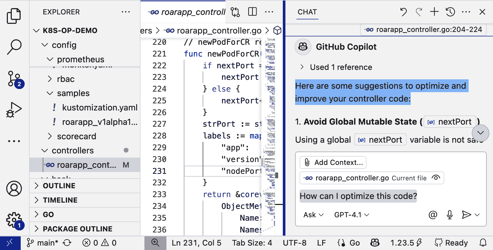
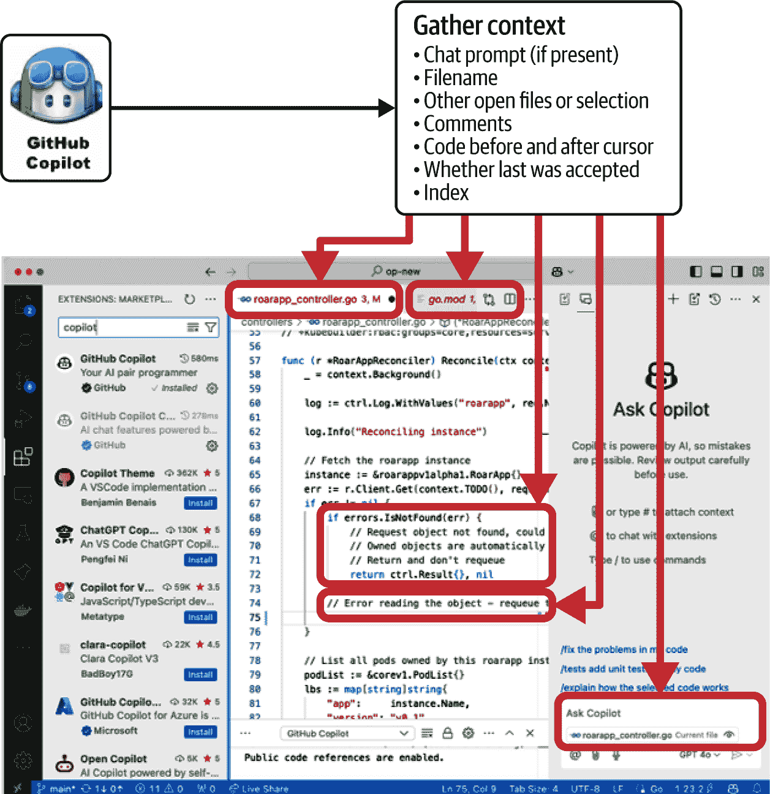
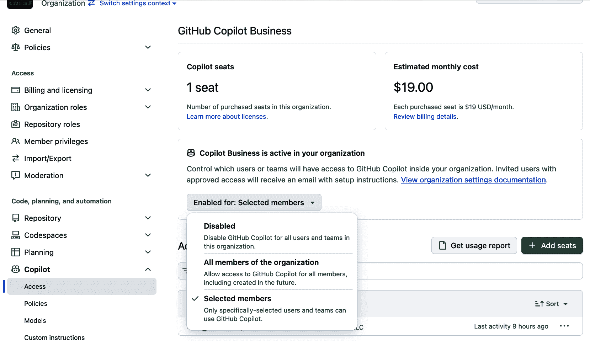

# 第一章. 基础

欢迎来到 *学习 GitHub Copilot*！我很高兴你正在阅读这本书，希望它能对你有所帮助。像 ChatGPT 和 AI 代理这样的 AI 工具已经改变了，并将继续改变我们与软件应用程序的交互方式。GitHub Copilot 和类似工具已经改变了，并将继续改变程序员创建软件应用程序的方式。通过从现有代码或自然语言提示中提取上下文的能力，GitHub Copilot 提供了比我们之前所见任何都更丰富、更强大的代码生成能力。

在这本书中，我将帮助你了解如何使用 GitHub Copilot 的功能——从执行代码生成和补全、形成测试、翻译和解释代码，到直接在 GitHub 中处理仓库、拉取请求和问题。你将看到跨多个领域和编程语言使用 Copilot 的示例。你将学会如何利用它并构建提示以获得最佳结果。你甚至将学习如何向其中添加自己的自定义功能。你还将了解它是如何工作的，包括为什么它有时不会提供你预期的结果——以及如何减轻这些情况。

开始之前需要一些基础知识。这就是本章的目的。我将首先从高层次上解释 GitHub Copilot。然后我们将探讨关键的基础技术、整体流程、一些使用注意事项、它与像 ChatGPT 这样的工具的不同之处，以及你需要了解的获取和安装它的信息。那么，让我们开始吧。

# Copilot 概括

在我们开始这次讨论之前，请注意，“copilot”是用于指代收集信息、形成提示并返回答案和建议的 AI 应用程序的流行术语。例如，微软有一个 [Office 365 Copilot](https://oreil.ly/DaSLT)，它为微软 Office 应用程序执行此操作。它分析来自 Word、Teams、Outlook 等的上下文，并提供总结、建议回复和其他有价值的交互。

在这本书中，我使用 *Copilot* 来指代 *GitHub Copilot*。只有在我提到使用相同单词的另一个系统时，才会有例外。在这种情况下，我会明确地用它们的正式名称来标识它们，例如 *Office 365 Copilot*。

# 什么是 GitHub Copilot？

GitHub Copilot 是一个基于云的生成式人工智能（AI）工具。让我们来分解这些术语。我们可以泛泛地定义 AI 为 *计算机执行那些以前认为只有人类才能完成的任务，因为这些任务需要推理和技能*。最近，这还包含了通过自然语言处理（NLP）、聊天界面以及 AI 代理的自动处理和决策来以自然和人类似的方式与人类互动的方面。

*基于云的* 指的是 Copilot 返回建议和生成答案的路径。它指的是由 GitHub 管理的云环境，该环境便于与 AI 模型交互。*生成性* 表达了 AI 从其接收到的上下文中生成新结果的能力。Copilot 可以根据用户环境的上下文和提示为软件开发提供回应和建议。它在这方面做得如何取决于我们将在下一节讨论的几个因素。但作为一个快速示例，图 1-1 展示了如何使用 Copilot 基于在 Visual Studio (VS) Code 中的项目来提出优化建议。

###### 图 1-1\. 在 VS Code 中的项目上使用 Copilot

# 默认 IDE

由于本书中无法表示所有集成开发环境 (IDE)，在我们的示例中，如果涉及到 IDE，我们将使用 VS Code 或 GitHub Codespace。如果您使用不同的 IDE，请查阅 Copilot 文档以了解使用、控制等方面的任何差异。

# Copilot 的工作原理是怎样的？

要理解 Copilot 的工作原理，我们需要了解支撑其功能以及类似 AI 工具的一些基础组件。这些细节包括它从哪里获取信息来基于这些信息做出回应，以及其整体流程。

Copilot 和大多数 AI 应用程序从在大量数据集上训练的大型语言模型 (LLMs) 获取数据。如果您对 LLM 这个术语不熟悉，以下部分提供了一个简要的解释。

## 大型语言模型

在今天讨论 AI 工具时，不提及大型语言模型 (LLMs) 是有挑战性的。LLMs 是在大量现有数据上训练的 AI 模型，用于预测给定一些输入（一个*提示*）的下一个单词或其他类型的内容（例如，*标记*）。这些内容与输入相匹配。

LLMs 与可以处理格式化数据或响应数学问题的传统计算机模型不同，因为 LLMs 是被训练来理解上下文、语法和结构的。这是通过考虑大量参数的算法来完成的，以确定哪些单词或标记最有可能接下来出现。以这种方式，模型根据输入的呈现方式而不是输入本身来统计性地构建回应。

模型的预测能力是通过从大量现有内容中学习并调整得来的。在这个训练过程中，模型映射了任何给定领域中的各种信息之间的关系。技术上讲，给定一个作为查询的标记序列，LLMs 可以评估输入的语法和结构，根据模型的训练数据推断上下文，并预测可能接下来出现的标记序列。简单来说，LLMs 可以根据他们所消化的所有数据推断出什么听起来是正确的，并继续对话。

要理解与传统处理方式的区别，可以想象学习一门语言并与说这门语言作为母语的人进行对话。你可以学习词汇和单个单词及短语。但在与说这种语言的人的对话中，你还需要收集和理解对方说话的上下文。这样你才能选择合适的单词或短语来回应。你还需要能够在一个能让对方理解上下文中构建你的回应。语言有语法和结构，但对话的上下文是我们确保语法和结构有意义并传达意义的方式。大型语言模型可以从输入中评估上下文，并在其输出中提供相关的上下文。

回到 Copilot，它默认使用由[OpenAI](https://openai.com)开发和管理的 LLM，该公司也是[ChatGPT](https://chat.openai.com)背后的公司。与 OpenAI 合作，GitHub 在过去的几年里开发了 Copilot。最近，他们增加了使用其他几个模型系列的选择，包括来自 Anthropic 的 Claude 和 Google 的 Gemini。在各个模型中，Copilot 的共同特点是专注于创建软件，其对话语言是代码。

## 代码和生成式 AI

根据定义，编程语言具有特定、必需的语法和语义，每种语言都不同。在 Python 和 Go 之间编码时，你使用不同的标记和结构来创建程序。然而，你使用的标记和结构都有规则。它们是明确定义的，并形成一个封闭集。Copilot 的能力旨在提供与语法和结构相匹配的编码建议和相关信息。但真正的增值在于提供与编码者正在创建或提示的内容相关的回应。输入到 Copilot 中的上下文可以来自多个来源，包括以下这些：

+   在开发环境中编辑器中编写的代码集

+   通过直接的自然语言提示或查询与模型交互，也就是所谓的*聊天模型*

+   GitHub 本身中的典型开发活动，例如拉取请求

我将在本书的后续部分更详细地讨论这些交互。但无论接口如何，上下文（代码、指令/输入或你工作的 GitHub 元素）都会被转换成*提示*——你期望 AI 回应的对话的一部分。处理这些提示并根据上下文以及模型训练和能力来决定回应是 Copilot 的*生成式 AI*功能中的*生成*部分。回应可以是建议的代码、对问题的回答或逐步指示。这是 AI 认为可以完成代码、满足提示或回答查询的内容。

你可以将这个过程想象成在 Zoom 通话中向医生描述一系列症状，以便他们可以根据多年的培训尝试做出诊断。或者，你可以向汽车修理工打电话描述你在车辆上看到的问题，以便他们可以提出解决方案。在这些情况下，你提供的沟通和上下文，加上专业人士的培训，对结果至关重要。这种交互可能导致提出解决问题的建议（其中一些可能不适用），或者表明专业人士没有足够的上下文或理解来提供帮助。生成式 AI 的行为方式相同。

当 Copilot 在你编码时提供建议时，你的编码环境中的项目提供了上下文，为 AI 模型创建一个提示。Copilot 可以产生遵循你正在工作的项目中的文件所使用的编码风格的建议。这既有好的一面，也有不好的一面。

如果 Copilot 的建议通常与用户的现有编码风格相似，并且这些编码风格反映了最佳实践，那么这可能是好的。如果 Copilot 有时过于偏向现有代码中的不良实践，那么这可能是坏的。后一种情况可能导致强化有限和低效的编码实践，或者你可能需要浏览更广泛的建议集来找到适合的建议。Copilot 从你的环境和自己的训练中可以借鉴的示例的质量和数量会影响其响应。

最终，与 Copilot 一起使用的生成式 AI 可以非常有用。然而，请注意，编码建议将受到上下文和 Copilot 必须与之一起工作的训练的影响。你可以利用这一点，为 Copilot 提供更多它应该返回的建议风格的示例。然而，如果 Copilot 必须与之一起工作的上下文有限，这种偏差也可能是一个缺点。我们将在整本书中讨论如何帮助 Copilot 返回最佳结果。

让我们简要地看看 Copilot 的高层次流程，以了解它是如何与上下文交互以回应你的。

## 高层次流程

要从高层次了解 Copilot 的工作原理，我们可以从在支持的 IDE 之一中工作的角度追踪基本工作流程。目前，Copilot 支持的 IDE 包括 Visual Studio、VS Code、NeoVim、JetBrains 家族的任何 IDE 以及其他一些 IDE。Copilot 还在选定的其他环境中工作，例如[GitHub Codespaces](https://oreil.ly/QyEks)。

GitHub 还发布了[Copilot 语言服务器 SDK](https://oreil.ly/6rDHq)，它可以用于将 GitHub Copilot 集成到任何编辑器或 IDE 中。因此，预计未来将看到更多与 Copilot 集成的应用程序。

# 关于 Codespaces

GitHub Codespaces 利用在云中运行的虚拟机（VM），为 GitHub 用户提供了一个功能齐全且可定制的开发环境。它们的界面类似于 VS Code；它们可以通过在浏览器中使用与 VS Code 相同的扩展来定制，或者连接到几个 IDE。GitHub 将它们作为一个可选服务提供。

当在编辑器中编写代码并使用 Copilot 建议代码补全时，会自动扫描几项信息以收集关于你正在处理的内容的上下文：

当前文件

当前用户正在编辑的文件是 Copilot 获取上下文的关键来源之一。

当前活动文件的名称

当以描述性命名时，这可以为 Copilot 提供关于代码意图的线索，例如*TestConfig.go*。

当前光标位置前后内容

Copilot 可以从文件中光标前后立即的代码和注释中提取上下文。这可以帮助它决定要填写的内容，并/或理解代码中的空白。

注释

类似于人类结对程序员或审阅者，Copilot 可以使用注释来理解代码正在做什么以及尚未编写的代码的意图。这是为 Copilot 提供上下文的主要方法之一——注释越精确、越详细，Copilot 建议的代码就越有可能相关。

编辑器中打开的其他文件

Copilot 使用任何打开文件中正在开发的代码作为上下文。这是收集关于当前任务信息并增强模型信息的关键。例如，处理存储在 LLM 中的已弃用功能的一种策略是在编辑器中打开一个文件，其中包含已弃用功能的替代方法。从这个例子中，Copilot 可以解释编码的首选替代方案，而不是依赖于训练 LLM 时使用的已弃用方法。

本地索引

Copilot 自动解析在 VS Code 等 IDE 中打开的项目中的大多数文件，并为项目构建一个高级本地*索引*。(有关更多信息，请参阅以下侧边栏。)

如果你正在使用聊天界面，它通常会根据你最近的工作内容预先填充一个文件、选择或终端命令作为上下文。然而，在提交提示之前，你可以明确地更改它。(有关更多信息，请参阅第三章。)

因此，当你使用安装并激活了 Copilot 的一个界面时，Copilot 会在你输入代码时从这些来源收集上下文(图 1-2)。

###### 图 1-2. 从 IDE 环境中收集上下文

该上下文被处理并最终发送到 GitHub，合成为一个提示(图 1-3)。

###### 图 1-3. 合成提示

提示随后通过 GitHub 传递到 LLM，并返回可能的完成或答案。一旦从提示到 LLM 生成结果，GitHub 的 Copilot 系统会对结果进行额外的处理（关于这一点稍后讨论）。然后，响应返回到 IDE，你可以评估它并选择如何继续。参见图 1-4 了解代码补全的流程。

这个过程会随着用户/Copilot 的交互继续和重复。这样，Copilot 作为一个助手，可以帮助你处理你正在工作的任何用例，无论是编写样板代码、搜索复杂的算法、生成数据或查询、编写单元测试，还是学习一门新的编程语言。

###### 图 1-4. 从提示到建议的流程

当我们讨论如何在接下来的章节中使用 Copilot 时，你会看到更多关于流程是如何发生的。但在这个阶段，了解使用 Copilot 来帮助你生成软件时的一些使用注意事项是值得的。

# **使用注意事项**

现在你已经了解了 Copilot 是什么以及它是如何工作的，这里有一个关键点需要理解：Copilot，就像任何 AI 一样，可能会给出不正确或不完整的答案。它可能会出错，或者给出你意料之外的结果。这并不常见，但当你使用它时，你应该记住一些重要的事情，以便保持警觉。在本节中，我们将探讨以下注意事项：

+   **及时性**

+   **相关性**

+   **完整性**

+   **准确性**

+   **隐私**

+   **安全性**

顺便说一下，这些并不局限于 Copilot。它们可以适用于任何当前帮助你完成任务的人工智能工具。

## **及时性**

这里的 *及时性* 指的是 Copilot 建议的时效性。这看起来可能是一个奇怪的选择，但它可以与其他所有因素相交。

Copilot 依赖于在某个时间点最初训练的模型，因此其数据基于那个时间点训练数据中的当前内容。例如，如果 Copilot 使用的模型是在两年前训练的，那么它并不一定了解那之后的变化。

你日常使用 Copilot 可能会产生过时的建议和答案。结果可能包含不再与你的编译器或解释器兼容的弃用代码。你可能会得到一个引用已知漏洞的依赖项版本的建议，或者可能包含过时方法的响应。

你可能会在 Copilot 的聊天界面上问，“*X* 是否已弃用？”并得到一个回答，说 *X* 是 *未* 弃用的，但实际上它是。Copilot 是在它所使用的模型训练的那个时间点回答的。或者你可能问，“*X* 的当前版本是什么？”并得到两年前的结果。我相信你可以看到这可能会造成问题。结果也可能根据你选择的模型（从 Copilot 支持的模型中选择）而有很大差异。

第七章 讨论了为 Copilot 提供更多最新环境上下文的技术，以增加返回更更新颖响应的可能性。

## 相关性

Copilot 的建议和聊天响应基于在大量代码上训练的 LLM。如果你使用的是默认的 OpenAI 模型，那么这个代码库就是 GitHub 上托管的开源代码。GitHub 可以说是拥有最全面的开放源代码仓库集合。这包括用当今最流行的编程语言编写的代码，如 Python、Go 和 JavaScript。

考虑到训练，可以合理地认为，当你在一个用于训练的代码库（用于 OpenAI 模型的 GitHub 仓库）中工作，并且该语言或框架在集合中（GitHub 仓库）有更多代表时，Copilot 将最为有效。一个语言或框架在该集合中的代表越多，Copilot 可以从中学习的参考就越多。想象一下你在学校花更多时间学习的科目——那些是你最熟悉的。

如果你在一个不太有代表性的语言或框架中工作，建议可能不那么有用。这并不意味着你不能得到相关性的建议和答案，但你可能会发现它们在回答你的具体查询时不太有帮助。

超出 Copilot 控制的关键因素是它必须处理的上下文数量。例如，如果你的代码包含一个名为`ParseData`的函数，或者你提供了一个没有额外上下文的通用或模糊的提示，例如“创建一个解析数据的函数”，那么 Copilot 返回的结果可能也是通用的。

## 完整性

生成式 AI 有时会返回不完整或不实用的建议。这种情况在聊天界面中很少发生，但 Copilot 的代码补全返回一组仅部分解决方案的建议并不罕见。

在上一节关于相关性的讨论中提到的相同注意事项也适用于此处。如果你的代码或查询是通用的或模糊的，Copilot 可能没有足够的上下文来引用，从而返回完整的结果。

在其他情况下，你可能为 Copilot 提供了特定的上下文，但它只建议一个注释或函数的第一行。这通常发生在通过 IDE 中的建议过程而不是在聊天界面中。你可能需要提供额外的提示或为 Copilot 提供更多上下文。有时，你可以通过给出一个提示（例如输入一个关键字）来“推动”Copilot，这样它就会返回一个更完整的建议。在其他时候，Copilot 可能会简单地响应一个空白行，接受这个响应可能会导致它继续生成代码。

如果立即的建议不适合，Copilot 确实提供了获取更多建议的选项，但这些可能作用有限。我将在第二章中深入探讨这些方法的细节。

## 准确性

除了最简单的情况外，你不能假设 Copilot 的任何响应都是完全正确或最佳答案。你应该始终仔细审查 Copilot 的响应。在其他领域，AI 的结果进入官方记录，但引用的内容并不存在的故事并不难找到。例如，有报道称提交的法庭简报引用了未曾发生过的先例。我知道有人试图使用 AI 来规划假期行程，并收到了一个有希望的日程安排——但酒店并不存在。

同样，Copilot 可能会返回一个语法上有效但引用了代码中不存在的构造或变量的响应。这是一种编码形式的 AI*幻觉*：AI 呈现的信息是不正确的、虚构的，或者以其他方式没有基于现实作为有效解决方案或建议。这种情况很少见，但仍然可能发生。有时这可能是因为 Copilot 需要围绕尚不存在的内容元素创建建议。例如，如果你要求 Copilot 说明如何打开并写入一个文件，但没有指定文件名，它可能会在其示例中使用一个在你代码中没有意义的文件名。

无论情况如何，用户始终负责审查 Copilot 的响应以确保准确性。这应该与审查人类对代码的贡献没有区别；你希望确保它们是正确的，并且不会造成损害。

# 提示和准确性

通过为 AI 开发更好的提示，Copilot 的结果通常可以得到改善。我们将在本书中详细介绍提示的相关内容。

## 隐私

与 Copilot 一起工作的另一个方面是数据隐私。如前所述，几个信息来源（包括打开的文件和当前文件）被读取，信息被收集并通过 Copilot 传输以纳入 LLM 的提示。这意味着一些数据正在互联网上传输，并且在没有您控制的情况下进行处理。这看起来可能是一个潜在的安全风险。然而，Copilot 在注册时提供了选项，允许您指定是否希望 GitHub 将您的上下文信息作为其数据的一部分，以帮助 Copilot 变得更好。（见图 1-5 的底部部分。）如果您不这样做，虽然信息将被收集，但不会保留。它将被收集来构建提示，然后丢弃。

# Copilot 信任中心

GitHub 有一个[信任中心](https://oreil.ly/0GM3-)，可以帮助处理任何与隐私相关的内容问题或担忧。

###### 图 1-5\. 注册时数据隐私选项

Copilot 在三个领域与用户数据相交：用户参与度、提示和建议。以下是总结：

用户参与度

这是关于您如何与 Copilot 互动的使用数据（遥测数据）。它可以包括您是否接受或拒绝 Copilot 的建议，您如何与聊天 UI 互动，以及诸如延迟和错误消息之类的指标。

提示

如前所述，从你的环境或传回 GitHub 的聊天查询中获取的上下文信息。

建议

Copilot 返回的代码补全建议和/或对聊天查询的响应。

用户参与数据默认会进行跟踪，可能包括匿名数据，尽管具体取决于你使用的特定 Copilot 计划。（有关更多信息，请参阅[信任中心](https://oreil.ly/rC8Rm)文档。）存在机制可以加密传输中和静止中的数据。GitHub 有控制措施，严格限制谁可以访问其侧的数据。

# GitHub 仓库和法律问题

在公众舆论和法庭上，使用 GitHub 上的*公共*仓库来训练某些 LLM 的合法性受到了质疑。我们将把这些考虑留给其他人去解决，我们不会关注或评论本书中初始训练过程的这些方面。

当使用在许可仓库上训练的模型时，关于 Copilot 的一个其他担忧经常被提出：Copilot 可能会生成与该代码库内容非常接近的建议。这意味着用户可能会无意中违反许可条款和知识产权，因为复制的代码包含在他们的工作中。Copilot 为个人和管理员提供了一个选项，如果这些匹配是 AI 过程的一部分生成，则可以阻止公共代码匹配。（见图 1-5 的顶部部分。）如果选择了该选项，Copilot 将提醒你这种情况，并过滤掉来自公共代码库的匹配。

## 安全性

最后一项但绝对重要的是 Copilot 返回的结果中的安全问题。在当今使用的任何产品或应用程序中，安全性都是一个始终存在的担忧。解决这一担忧从安全的编码实践开始。

我之前提到，一旦 Copilot 从 LLM 收到潜在结果，GitHub 会对这些结果进行一些额外的处理。这包括运行算法以快速查找可能存在的漏洞。GitHub 不会对结果运行安全扫描应用程序，因为这会花费太长时间。相反，它会快速扫描表明漏洞和/或编码实践不安全的模式。如果确定了这些模式，则提出的建议会被标记。

即使有了这些措施，也不能保证没有东西被遗漏。由于处理过程与使用专注于寻找漏洞的应用程序进行完整扫描不同，Copilot 的结果仍然应该受到你为任何代码使用的任何其他安全检查。

*在使用生成式 AI 时，一个清晰且始终存在的需求是，你必须始终审查和评估它返回的任何建议。你不应该假设它完全且正确地理解了上下文。而且，在所有非简单情况下，你不能假设结果是完美的。*

以另一种方式来说，虽然 Copilot 经常被称为*AI 配对程序员*，但它并不具备像实际的人类配对程序员那样对你的代码的理解和熟悉程度。相反，最好将 Copilot 视为一个对项目不太熟悉但技艺高超的程序员。处于这种位置的程序员可以根据他们所能观察到的以及与他们分享的内容创建有用的代码，但他们无法拥有所有更大的背景、项目历史或背景故事。因此，你必须勤奋地确保他们产生的代码是准确、安全且适合合并的。Copilot 的答案和建议也应同样对待。

就像与团队中的新程序员合作一样，你提供的细节越多（无论是用作背景的代码还是具体的指示），通常结果会越好。为 Copilot 提供更多的编码示例，并在聊天中提供更具体的提示，可以大大提高从 AI 获得更好的结果。

当你开始使用或考虑使用像 Copilot 这样的助手时，可能会出现另一个考虑因素：为什么不直接使用 ChatGPT 或类似的聊天机器人来生成代码呢？答案是，你当然可以。然而，这两种方法和界面有关键的区别。以下部分提供了一个快速比较，使用 ChatGPT 代表其他可以创建代码的通用 AI 应用。

# Copilot 与 ChatGPT 对比

你可能会想知道，鉴于两者都可能使用相同的底层模型来生成响应，Copilot 或类似的编码助手与 ChatGPT 或类似的聊天机器人有何不同。一般的区别是，Copilot 仅关注编码领域，并提供专门帮助该领域的功能。另一方面，ChatGPT 的目标更广泛，覆盖任何领域，并且不提供相同级别的集成。表 1-1 突出了在几个更具体的类别中的差异。

表 1-1\. Copilot 与 ChatGPT 的比较

| 类别 | GitHub Copilot | ChatGPT |
| --- | --- | --- |
| 主要功能 | 理解和生成代码或与代码相关的提示 | 理解和生成任何自然语言 |
| 主要用户界面 | 代码编辑器，聊天 | 聊天 |
| 开发者 | GitHub with OpenAI | OpenAI |
| 主要用例 | 编写和增强代码及代码文档 | 文本生成的对话式响应 |
| 定价模式 | 预付费模式，并跟踪高级模型的使用情况 | 基于使用情况和预付费模式 |
| 训练数据 | 代码库，文档 | 多样化、广泛的多文本内容 |
| 公共 API | 限于遥测、监控和许可证管理 | 广泛的 API 界面用于交互 |

通常，你可以将 Copilot 视为一种非常特定领域的生成式 AI 实现。这与 ChatGPT 和其他通用聊天工具更广泛的（无领域）实现和功能形成对比。ChatGPT 当然可以用于生成代码，但它缺乏与开发环境、编码重点、GitHub 支持和功能集成的 Copilot 所具有的特性。

尽管我们一直在讨论 Copilot 作为一个单一的应用程序，但实际上它有五种配置。让我们通过帮助解释您可以选择的计划来结束这一章的介绍。

# Copilot 计划

在撰写本文时，Copilot 提供五种计划：*免费*、*专业*、*专业+*、*商业*和*企业*。要了解它们之间的区别，你需要了解一些常见术语：

代码补全

在您的 IDE 中正在工作的代码中完成代码的 AI 建议。

聊天请求

一个提示，可以是方向或问题，通过聊天界面传递给 Copilot。

代理模式

Copilot 中的一个选项，允许它通过独立规划、执行和迭代文件来对提示做出反应，以建议完成任务所需的更改。

代理模式请求

在代理模式下向 Copilot 提出的完成任务请求。

模型访问

Copilot 允许从所有它工作的 LLM 集中访问的 LLM；当前可用的模型列表包含在[Copilot 文档](https://oreil.ly/icFQK)中。

优先请求

使用 Copilot Chat、代理模式、代码审查或扩展等操作的高级 AI 模型交互。这些操作消耗更多计算资源，并单独计算于标准代码补全之外。

考虑到这些术语，表 1-2 解释了可用的计划以及它们之间的关键区别。

表 1-2。GitHub Copilot 计划的比较

|   | 免费版 | 专业版 | 专业+版 | 商业版 | 企业版 |
| --- | --- | --- | --- | --- | --- |
| 目标用户 | 寻求探索 Copilot 的个人开发者 | 想要无限制访问 Copilot 但不需要使用所有模型的个人开发者 | 想要最大灵活性和访问所有模型的个人开发者 | 需要无限制访问核心 Copilot 功能和企业管理功能但不需要所有模型的组织或企业 | 需要无限制访问核心 Copilot 功能和企业管理功能，具有最大灵活性和访问所有模型的组织或企业 |
| 编码补全、聊天请求和代理模式请求 | 每月 50 个聊天请求或代理模式请求（计为高级）每月 2,000 个代码补全请求 | 无限制 | 无限制 | 无限制 | 无限制 |
| 模型访问 | 访问一小部分模型 | 访问更多模型 | 访问所有模型 | 访问更多模型 | 访问所有模型 |
| 付费请求 | 50 个付费请求/每月 | 300 个付费请求/每月 | 1,500 个付费请求/每月 | 300 个付费请求/每月 | 1,000 个付费请求/每月 |
| 额外功能 | VS Code 中选择的代码审查有限 |

+   代码审查

+   拉取请求摘要

|

+   代码审查

+   拉取请求摘要

|

+   代码审查

+   拉取请求摘要

+   用户管理和指标

+   数据隐私

+   IP 赔偿

|

+   代码审查

+   拉取请求摘要

+   用户管理和指标

+   数据隐私

+   IP 赔偿

|

| 管理 | 个人 | 个人 | 个人 | 企业 | 企业 |
| --- | --- | --- | --- | --- | --- |
| 成本 | 免费 | 每月 10 美元或每年 100 美元（提供 30 天免费试用） | 每月 39 美元或每年 390 美元 | 每用户每月 19 美元 | 每用户每月 39 美元 |

# 最新信息

表 1-2 中的信息在撰写本文时是准确的。有关最新信息，请参阅[Copilot 功能页面](https://oreil.ly/ptoVy)。

当然，成本是一个重要因素。如果您是仅限于在 IDE 中使用 Copilot 的个人用户，并且不需要额外功能，那么免费计划可能是有意义的。如果您是希望定期使用 Copilot 并可以从额外功能中受益的个人用户，那么 Pro 或 Pro+计划可以提供良好的匹配。

在企业或社区层面，如果您需要或想要轻松地为多个用户分配和管理许可证以及额外的管理监督，则商务订阅可以提供这些功能。如果您作为企业或社区希望充分利用高级功能并最大限度地访问模型，那么企业计划是您的最佳选择。

# 混合计划

在组织层面，企业内部可以混合计划类型。请参阅[文档](https://oreil.ly/BZ1p6)。

无论您选择哪种计划，步骤都是相似的：

+   注册并注册许可证。

+   建立支付流程。

+   通过扩展或您在 IDE 中添加功能所使用的任何过程安装 Copilot。

在组织层面，一旦计划设置完成，组织管理员可以添加用户并管理许可证，如图 1-6 所示图 1-6。

###### 图 1-6\. 管理 Copilot 商业计划

一旦您获得 Copilot 订阅的访问权限，您就可以将其安装到您使用的任何 IDE 中。[GitHub Copilot 文档](https://oreil.ly/kF4rn)提供了在您选择的 IDE 中安装 GitHub Copilot 扩展的链接。截至本文撰写时，目前支持以下 IDE：

+   [Azure Data Studio](https://oreil.ly/uUNGn)

+   [Eclipse](https://oreil.ly/Mqdq2)

+   [JetBrains IDEs](https://oreil.ly/dlYdh)

+   [Vim/Neovim](https://oreil.ly/rA6oI)

+   [Visual Studio](https://oreil.ly/qYbh_)

+   [Visual Studio Code](https://oreil.ly/GYc9X)

+   [Xcode](https://oreil.ly/MGeCb)

# GitHub Copilot 语言服务器

GitHub 还提供了 [Copilot 语言服务器 SDK](https://oreil.ly/008MF)。此 SDK 允许将 Copilot 集成到任何可以使用语言服务器协议（LSP）标准的编辑器或 IDE 中。因此，预计将看到更多集成开发。

# 结论

希望你开始对 GitHub Copilot 有更好的了解，以及它可能如何被使用。我也希望你对学习和了解它感到好奇。

在本章中，我概述了 Copilot 是什么，它是如何工作的，使用它时需要考虑的一些关键因素，以及如何理解它提供的计划。这描绘了 Copilot 如何与当前 AI 在特定领域的应用和潜力相结合。在这种情况下，该领域是创建软件，更普遍地说，是编码。

从本文中可以提取几个关键点。一是 AI 可以极大地简化并支持你作为编码者的努力。二是当帮助 Copilot 提供最佳结果时，上下文至关重要。第三点，也许是最重要的一点，你仍然有最终责任来审查和评估来自 AI 的任何建议和答案。Copilot 在其领域内做得很好，但它的好坏取决于我们提供的上下文以及它所使用的模型的能力和训练数据。就像人类编码者一样，这些变量会影响结果的完整性、相关性以及准确性（或不准确性）。

有多种标准方式可以利用 Copilot 完成代码。在下一章中，你将了解如何在编码的 IDE 界面中使用和操作 Copilot 代码补全。理解这些将帮助你达到使用该工具的更高层次，完成本书其余部分所需的基础，并充分利用 Copilot。
