# 第三章\. 在 IDE 中与 Copilot 聊天

在像 ChatGPT 这样的流行 AI 平台上，聊天界面是您与大型语言模型（LLM）互动的入口。就像与人交谈一样，与 AI 进行对话感觉更自然。它还允许进行更深入的对话，以更彻底地探讨主题。

Copilot 包含的聊天界面提供了相同的优势，但针对的是编码领域。在第二章中讨论的先前内联功能提供了来自 Copilot 的直接、快速、有针对性的代码建议。这些代码补全基于您正在处理的内容。但是，与同事讨论编码挑战或想法一样，关于编码的互动、自由形式的讨论可能非常有价值。事实上，很快就会很难想象不使用 Copilot 的聊天功能来使用它。

在本章中，我们将探讨如何使用和交互 Copilot 的聊天功能（Copilot Chat）。我们将涵盖 Chat 的基本和高级方面。

我们将首先帮助您了解如何访问 Chat 的主要界面，如何解析其输出，以及如何管理多个 Chat 会话。

在此之后，我们将简要探讨如何最好地针对 Chat 界面进行提示，然后探索各种 Chat 界面本身。为了确保您能够适当地针对界面中的提示，我们将调查 Copilot 中内置的各种快捷键和修饰符，包括参与者和变量。我们还将探讨如何在 IDE 的终端中使用 Chat。

最后，我们将向您展示如何为 Chat 创建自定义指令以生成响应，并探讨如何最好地处理 Chat 的幻觉和不良响应。

让我们从了解如何快速开始与 Copilot 进行对话开始。

# 访问 Chat 的主界面

当您将 Copilot 安装到您的 IDE 中时，它将捆绑提供 Copilot Chat。Chat 的主要界面是右侧的一个专用面板，与您的编辑器分开(图 3-1)。聊天界面还提供了更多屏幕空间用于输入、输出和对话。

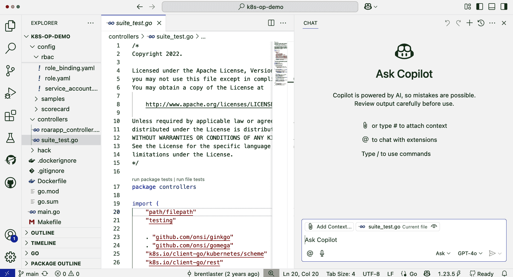

###### 图 3-1\. Copilot 聊天界面，在右侧

# GitHub 中的 Chat 界面

在本章中，我们将探讨如何在 VS Code 中使用聊天界面。Copilot 的聊天界面在 [GitHub](https://github.com/copilot) 中也得到了广泛使用。我们将在第九章中详细介绍该界面的工作原理。

Copilot Chat 提供了多种与 AI 互动的模式。默认模式允许您进行对话式交互，称为 *Ask* 模式。Copilot 中的聊天界面也是通过 Copilot Edits 进行高级编辑和通过 Copilot Agent 模式实现一些自主开发功能的入口。您可以根据图 3-2 所示进行模式切换。

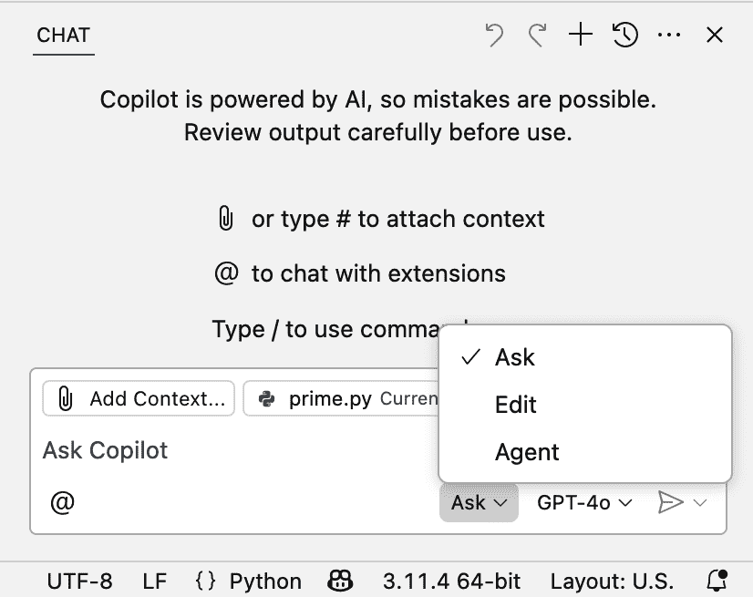

###### 图 3-2\. 聊天模式选项

本章重点介绍在 Ask 模式中使用聊天的基础知识。第四章讨论了如何使用编辑和代理模式。

在 IDE 集成中，顶部行包含一个 Copilot 图标。点击它可以在 IDE 中打开各种聊天界面。这包括打开/重新打开主聊天界面（如果不可见），列表中的顶部选项，如图图 3-3 所示。


###### 图 3-3\. 打开聊天控制

# 可能的 AI 错误

当使用聊天界面开始新的对话时，你会看到这条消息：“Copilot 由 AI 驱动，因此可能存在错误。在使用前仔细检查输出。”

关于 Copilot AI 可能不准确性的警告应适用于 Copilot 返回的所有响应，而不仅仅是聊天界面。如第一章中所述，你应该对所有 Copilot 返回的响应进行审查。

编辑器内联聊天和快速聊天界面的选项将在本章后面进行解释。

在主聊天界面中，你可以在标记为“询问 Copilot”的文本窗口中输入你的查询或提示。假设你已经从第二章的示例中突出显示了`is_prime`代码，并希望 Copilot 解释它是如何工作的。这是一个简单的查询示例：

```py
How does this code work?
```

处理查询后，Copilot 会做出响应；图 3-4 显示了示例。

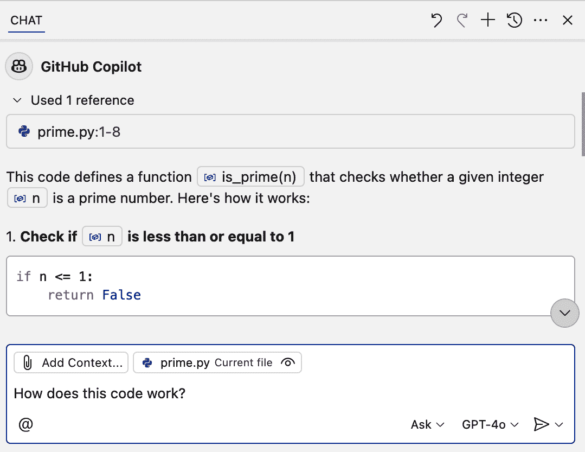

###### 图 3-4\. 聊天查询的结果

注意到响应是以更对话式的风格呈现的。它包含完整的句子，即使你不熟悉 Python 编程，也可以阅读和理解。响应还包括支持解释的任何相关代码示例。

# 解释用例

虽然 Copilot 解释你创建的代码可能看起来并不重要，但想象一下能够解释你未编写且尚未理解的其他代码。一个例子可能是用你不熟悉的语言编写的代码。你还可以使用 Copilot 的解释来解释一个复杂的算法。这种解释甚至可以成为进一步改进的伪代码的基础。

此界面的聊天响应提供了大量信息，包括一些并非直接属于解释但与之相关的内容。让我们花点时间更仔细地查看输出中的全部信息集。

# 理解聊天输出

除了 Chat 的文本之外，输出中还有一些其他值得注意的项目。我们可以使用前几节中的示例来探索这些。

首先，就在 GitHub Copilot 标题下方，Copilot 告诉我们它“使用了 1 个引用”。在这种情况下，“引用”意味着 Copilot 确定与项目相关的内容，用于创建响应。最常见的是，这将是编辑器中当前活动的文件，但也可能包括其他文件、依赖项、自定义设置或其他类型的非文件内容。（例如，如果使用引用终端的提示，它可能包括命令。）

查看图 3-4，在 GitHub Copilot 标志下方，我已扩展了参考文献部分以查看在生成响应时考虑的内容。在这种情况下，引用是来自唯一活动文件 *prime.py* 的代码。这是默认上下文，也显示在文本输入区域的顶部。在那里，文件被标识为“当前文件”（因此是默认上下文）。我们将在“有效使用提示对话框”中讨论更多关于提示上下文的内容。

在参考文献部分之后是 Copilot 在互动时提供的完整响应文本（以 Markdown 格式）。提醒一下，由于我们使用的是生成式 AI，即使提示完全相同，你也可能会得到不同的答案：

```py
This code defines a function `is_prime(n)` that checks whether a 
given integer `n` is a prime number. Here's how it works:

### 1\. **Check if `n` is less than or equal to 1**
```python

if n <= 1:

return False

```py
- Numbers less than or equal to 1 are not prime, so the function 
immediately returns `False`.

### 2\. **Iterate through potential divisors**
```python

for i in range(2, int(n**0.5) + 1):

if n % i == 0:

return False

```py
- The function loops through integers `i` starting from 2 up to the 
square root of `n` (inclusive). The square root is calculated using 
`n**0.5`, and `int(n**0.5) + 1` ensures the range includes the 
integer part of the square root.
- If `n` is divisible by any `i` in this range (`n % i == 0`), it is
 not a prime number, and the function returns `False`.

### 3\. **Return `True` if no divisors are found**
```python

return True

```py
- If the loop completes without finding any divisors, the function 
concludes that `n` is a prime number and returns `True`.

### **Key Points**
- **Optimization**: The loop only checks divisors up to the square
 root of `n`, which reduces the number of iterations compared to
checking all numbers up to `n-1`.
- **Prime Definition**: A prime number is greater than 1 and
 divisible only by 1 and itself. This function implements that
 definition efficiently.

### Example
- Input: `is_prime(7)`
  - The loop checks divisors 2 and 3 (since `int(7**0.5) + 1 = 3`).
  - Since 7 is not divisible by 2 or 3, the function returns `True`.
- Input: `is_prime(9)`
  - The loop checks divisors 2 and 3.
  - Since 9 is divisible by 3, the function returns `False`.
```

响应提供了对代码动作的详细、逐步解释，以散文形式（写成好像在和你说话的完整句子）以及从文件中摘录的代码片段。这是与聊天界面一起工作的一个关键优势：对话文本与实际代码结合在一起。文本和代码共同构成一个完整的对话，就像你与同事分享的那样。

在聊天中继续对话很容易。例如，通过引用你的代码，你可以询问 Copilot 是否有更高效实现这个逻辑的方法。图 3-5 显示了 Copilot 对代码优化版本的响应。再次注意，代码示例旁边的文本说明。


###### 图 3-5. 询问 Copilot 是否有更高效实现我们代码的方法

在聊天界面中，此输出为只读。但是，如果你悬停在代码块上，Copilot 会提供一个带有不同方式将代码从窗口传输到你的 IDE 编辑器的弹出栏。图 3-6 显示了弹出栏及其扩展选项。

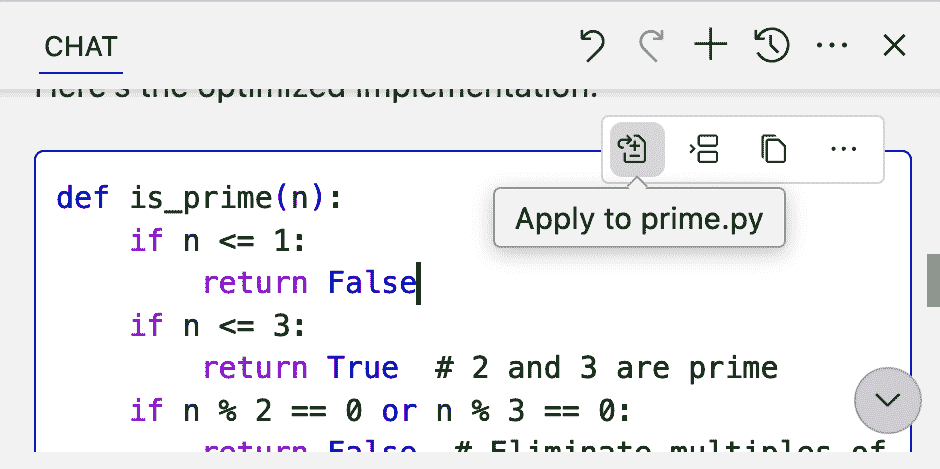

###### 图 3-6. “悬停”图标将代码从聊天界面传输到编辑器

从左到右，图标允许你执行以下操作：

+   将更改应用到当前活动文件以供审查

+   将文本插入到当前活动文件的光标位置

+   将文本复制到剪贴板

+   将文本插入到新文件中（通过更多操作图标 [...] 可访问）

+   将文本插入到终端（通过更多操作图标 [...] 访问）

# 自定义悬停菜单

默认情况下，要访问列表中的最后两个选项（插入到新文件和插入到终端），您需要将鼠标悬停在弹出窗口的 ... 选择上，选择更多操作，然后选择所需的选项。

然而，如果您将鼠标悬停在其中一个图标上并右键单击，您将访问一个菜单，您可以在其中选择在您悬停时显示哪些图标。通过勾选列表中的所有条目，您将在悬停栏中拥有所有图标，并且不需要使用 ... 界面。

虽然大多数选项都是不言自明的，但“应用”选项需要额外的解释。当您点击此选项时，Copilot 会将更改应用到编辑器中的文件，显示建议的更改并允许您保留或撤销每组更改(图 3-7)。


###### 图 3-7\. 从聊天中应用更改

选择“在光标处插入”选项将用窗口中的代码替换编辑器会话中任何突出显示的代码。例如，假设您已经突出显示了之前的代码并选择了该选项，那么您对`is_prime`函数的先前实现将被聊天中的实现覆盖。

除了在聊天面板中悬停时弹出的控件外，还有各种其他控件始终在聊天面板的顶部和文本输入区域本身可用。让我们花点时间来谈谈这些控件是什么以及它们允许您做什么，从帮助您管理聊天会话的控件开始。

# 管理聊天会话

在聊天面板的顶部行有几个控件，您可以使用它们来管理您的聊天会话(图 3-8)。


###### 图 3-8\. 聊天界面中的顶部图标

在右侧，左右箭头允许您分别向前和向后移动会话。大加号允许您开始一个新的聊天会话而不是继续当前的会话。如果您想讨论一个新主题并且不想让 Copilot 从现有的聊天中假设上下文，开始一个新的会话是有用的。

在单个聊天会话中，Copilot 会跟踪对话历史，包括一系列提示。例如，在图 3-9 中，我们要求 Copilot 为我们中的一个文件创建测试。


###### 图 3-9\. 为文件创建测试

之后，我们向 Copilot 提出了一个更通用的关于应考虑哪些其他用例的问题，并得到了一个与之前问题的上下文/后续相关的答案(图 3-10)。


###### 图 3-10\. 后续问题

点击“显示聊天”图标（看起来像圆形箭头内的时钟）会在对话框中显示你一直在工作的聊天集（图 3-11）。你可以点击一个条目来切换到那个聊天。


###### 图 3-11\. 显示聊天集

“视图和更多操作”控制（看起来像三个点的那个）提供了几个选项。它允许你在编辑会话或分离的窗口中打开当前的聊天。它还允许你向 Copilot 提供关于聊天功能的反馈，以及轻松获取最新的发布说明。

聊天窗口右上角的“X”可以完全关闭聊天视图。或者，你可以通过悬停在聊天区域上并点击单个聊天右上角的“X”来删除单个聊天（图 3-12）。这里的提示措辞有些奇怪，被称为*撤销请求*，但它目前的作用是删除聊天。有时删除聊天可以用来移除不再相关的讨论。


###### 图 3-12\. 删除聊天

最后，值得注意的是，你可以导出或保存聊天会话的内容。我们将在第六章中介绍这一点。

这些控制帮助你管理你的聊天会话。由于我们在聊天中与 Copilot 的交互是通过提示进行的，让我们花点时间讨论如何最好地构建我们的提示。

# Copilot 的**提示工程**

为 GitHub Copilot Chat 进行**提示工程**是指精心设计清晰、有针对性的指令，以引导 AI 生成有用且准确的响应。在与 Copilot Chat 交互时，你的提示可以是一个问题、一个快捷命令（本章稍后讨论），或者与你的项目相关的 Copilot 特定指令。Copilot 不仅仅依赖于你的提示，它还会从你的打开文件和当前的聊天历史中获取上下文，以提供相关的答案。

如果你正在从事一项较大的工作，一个好的方法是先从对目标的广泛描述开始，为你要实现的目标设定场景。例如，你可能从“编写一个检查数字是否为素数的函数”开始。一旦你指定了一般目的，你可以通过具体的要求或约束进行迭代，例如，“该函数应该对素数返回 true，如果输入不是正整数则抛出错误。”这种从一般到具体的进展有助于 Copilot 理解整体任务和细节，从而得到更精确的响应。

提供示例是另一种有效的技术。包括样本输入和预期输出，甚至单元测试，可以帮助 Copilot 更好地推断你的意图。例如，如果你想有一个函数从字符串中提取日期，分享一个样本字符串和预期的日期数组将引导 Copilot 生成符合你需求的代码。

Copilot Chat 还支持高级功能，如引用特定文件、使用聊天变量以及与参与者扩展进行特定任务集成。（聊天变量和参与者将在本章后面讨论。Copilot 扩展将在第十章中讨论。）你可以突出显示代码、使用关键词或将文件拖入聊天中，为 Copilot 提供更多上下文。迭代是关键：如果初始响应不够准确，请完善你的提示或上下文，直到得到期望的结果。

通过将提示工程视为交互式对话，你可以利用 Copilot Chat 高效地编写代码、调试错误、生成测试和回答项目特定问题。你传达的意图越清晰，Copilot 就越能帮助你提高开发工作流程的效率。

# 更多信息

你可以在[Copilot 文档](https://oreil.ly/QnqjI)中找到更多关于提示工程的文档。

当你输入提示时，文本输入区域有额外的控件，让你可以自定义提示的环境和目标。

# 有效使用提示对话框

在提交提示或查询时，聊天对话框中提供了多个控件可供使用。这些控件在图 3-13 中显示。


###### 图 3-13. 提示对话框控件

这些控件用于以下功能：

+   添加上下文元素

+   选择聊天参与者以帮助处理提示

+   选择你的提示提交后 Copilot 的行为

+   选择你的 AI 模型

+   选择你是在询问、编辑还是代理模式中使用聊天界面

如前所述，本章我们专注于聊天中的询问模式，并在第四章中介绍编辑和代理模式，因此我们不会对最后一项进行更详细的说明。但其他内容在本节中都有涉及。

## 添加上下文元素

*上下文*在这里指的是你的项目中 Copilot 可以参考以理解和制定响应的相关项目。在最简单的情况下，如果你在编辑器中打开了活动文件，它将被用作当前上下文。在图 3-13 中，这显示为“prime.py 当前文件”。如果你想要排除此文件作为当前上下文，你可以激活不同的文件或点击类似眼睛的图标来取消该文件作为上下文。

要手动将项目中的其他类型元素添加为上下文，请点击带有“添加上下文”的纸夹图标。这将显示一系列可选项目，你可以将其包含为上下文。这些项目包括编辑器中的内容、单个文件、符号、终端中的文本，甚至截图。还有几个选项可以搜索其他内容，如网页或查找函数、变量和符号的使用。图 3-14 显示了在调用控件时可用项目的一部分列表。

要在列表中查找特定项目，您可以滚动或输入搜索栏中的字符。这包括您项目中的文件。您还可以滚动到列表底部查看最近打开的文件。

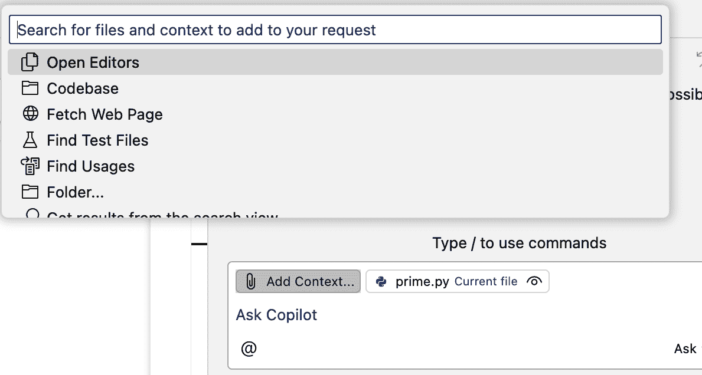

###### 图 3-14\. 添加附加上下文

当您完成添加所需的上下文元素后，您可以输入提示并提交它。您添加的上下文项将在 Copilot 准备响应时被咨询。图 3-15 显示了添加几个上下文项后运行提示的输出示例。

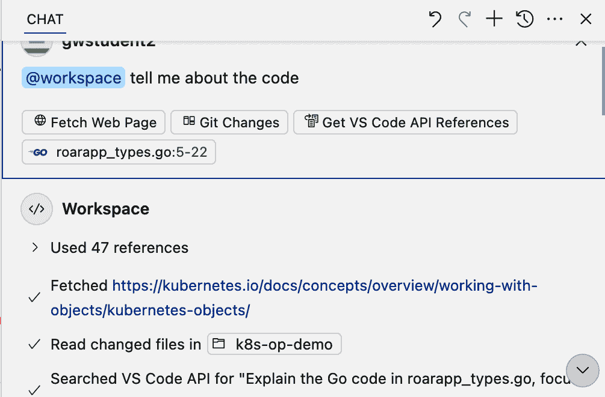

###### 图 3-15\. 使用多种上下文运行提示

# 仓库索引

在上下文这个话题上，提醒一下，GitHub 会自动构建一个*工作区索引*，以帮助您快速准确地搜索项目中的相关代码片段。这个索引可以用作另一个支持元素，帮助在代码库中搜索更广泛的内容，并更好地回答相关问题。

## 添加参与者

@控制符允许您调用聊天参与者。*聊天参与者*为提示或查询设置应用的范围，例如整个工作区、终端和 VS Code。在 IDE 中，有几个内置的聊天参与者可供使用，例如`@workspace`和`@terminal`。

当您安装 GitHub Copilot Extensions 时，它们也可以提供额外的参与者。*Copilot Extensions*是自定义集成，将其他工具（如 Docker）或 API 集成到您的 IDE 聊天界面中。聊天参与者将在本章后面详细讨论。Copilot Extensions 在第十章中介绍。图 3-16 显示了您可以从中选择的内置聊天参与者列表。

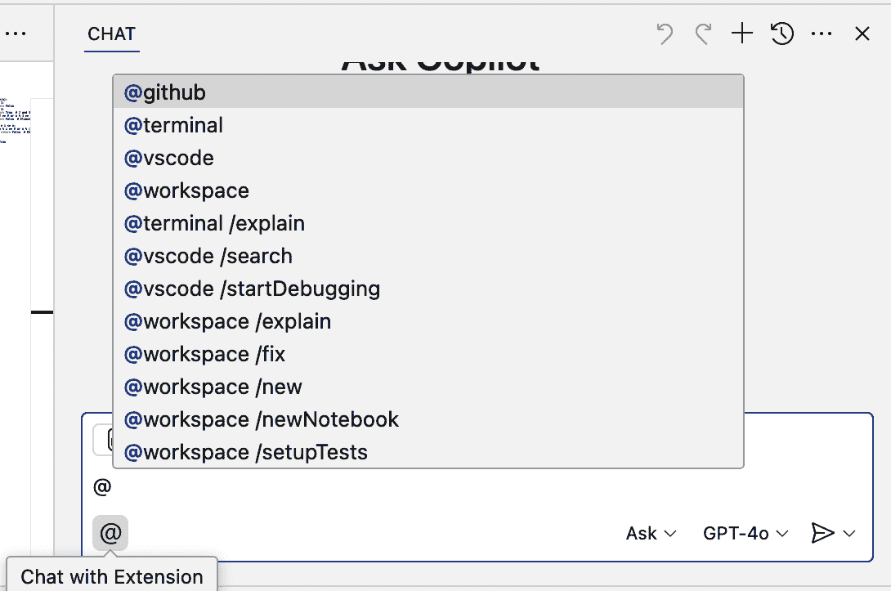

###### 图 3-16\. 调用参与者或扩展

接下来是右侧的发送按钮。点击此按钮会将您的提示或查询提交给 AI，但您可以通过多种方式提交提示。

## 理解提交您的提示的选项

提示区域右侧的箭头控制被称为*发送按钮*。它具有默认行为以及几个其他选项。图 3-17 中显示的各种发送选项都将您的提示或查询提交给 Copilot，但有一些关键的区别。让我们分析每个选项的含义。

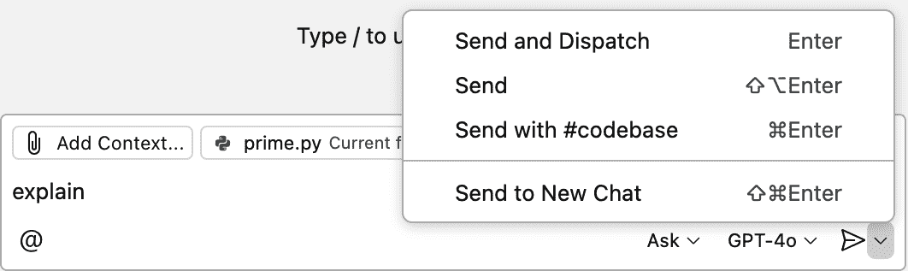

###### 图 3-17\. 发送选项

默认情况下，Copilot Chat 会尝试将您的提示或查询引导到合适的操作或工具（如聊天参与者），如果可能的话。这是您点击箭头时的标准发送和调度行为。

当路由到操作或工具时，你可能会在输出顶部看到一个“不带重新运行”的链接选项。在图 3-18 中，提示仅仅是“创建测试用例”。但请注意，Copilot 添加了`workspace`参与者和一个`/tests`快捷命令。(我们将在本章后面讨论这类命令。)“不带重新运行”的链接将运行查询而不包括`/tests`命令。

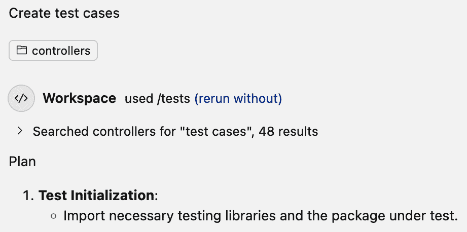

###### 图 3-18\. Copilot 自动添加示例提示

如果自动选择的操作或工具不适合你的问题，你可以选择链接将你的问题重新发送给 Copilot，而不包括参与者。这是在下拉列表中选择“发送”选项时的行为。图 3-19 展示了此选项的样式。

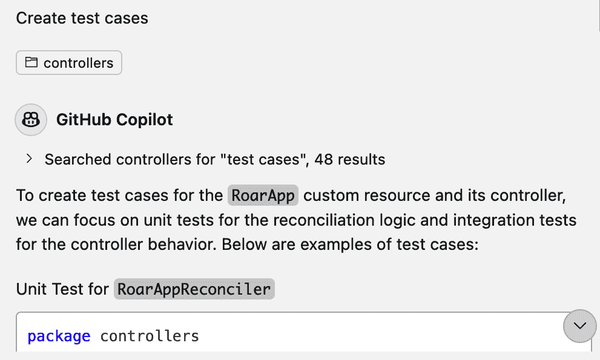

###### 图 3-19\. 使用发送选项的示例提示

对于第三个选项“带#codebase 发送”，`#codebase`是一个聊天变量。聊天变量将在本章后面讨论，但基本上这告诉 Copilot 考虑它关于你整个代码集的所有信息。如果项目中的其他内容可能需要在响应中考虑，但你不知道（或不想）指定单个项目作为上下文，这可能会很有用。在我们的测试生成示例中，使用此选项可能允许 AI 确定是否已经存在测试用例，并/或为整个项目生成更全面的测试建议。

最后一个选项“发送到新聊天”是显而易见的。你刚刚输入的提示将在新聊天中作为第一个提示打开。当你想要从正在进行中的对话中隔离特定的查询或任务以获得清晰或专注时，这很有用。

对话框中剩余的控制是一个选项，用于选择 Copilot 在后台想要使用的 LLM。这让你在选择可能更适合你特定任务的 LLM 时具有灵活性。目前，有一大批 LLM 可供通过下拉列表(图 3-20)选择。当新的 LLM 可用时，它们将作为*预览*使用一段时间。你可能会被要求“为所有客户端启用访问”作为使用不同模型的一部分。


###### 图 3-20\. 选择不同的模型

# 管理模型

你可能已经注意到了图 3-20 中模型列表底部的“管理模型”链接。此链接允许你输入可能需要访问其他模型的数据，例如自定义模型 ID 或 API 密钥。

既然你已经看到了主要 Chat 对话框的工作方式，让我们看看在编辑器中与代码内联使用 Chat 的快捷方式。

# 使用编辑器内联聊天界面

Copilot 集成在编辑器中提供了一个简化、快速访问的 Chat 界面。该界面可以通过使用*Meta*-I 组合(图 3-21)在任何位置调用。


###### 图 3-21\. 内联聊天界面

这个对话框是聊天对话框的小版本。它设计用于在代码编辑器内联使用，而不会占用太多的屏幕空间。除了添加上下文之外，它具有相同的控件，你可以提供与主聊天窗口中相同的提示或查询。例如，你可以突出显示代码并询问本章早期提出的问题：

```py
How does this code work?
```

Copilot 将尽可能多地返回在有限窗口中显示的响应（图 3-22）。你可以滚动或展开对话框以查看更多输出。然而，由于有限的屏幕空间，你可能仍然无法看到完整的响应。要查看完整的响应在主聊天界面中，请点击“查看聊天”按钮。

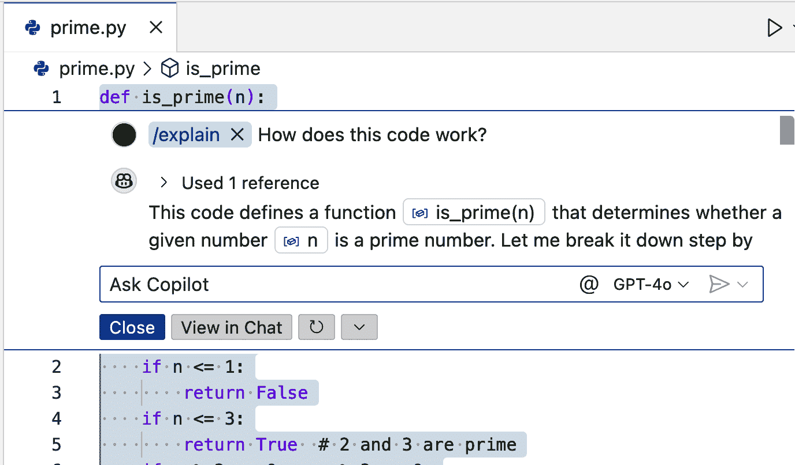

###### 图 3-22\. 交互式聊天中的提示

# 重新生成选项

你可能已经注意到在“聊天中的查看”按钮旁边有一个圆形箭头。每次当你看到这个符号时，它都是请求 Copilot 重新生成答案并查看是否提供了另一个，可能更好的响应的方式。

点击“聊天中的查看”按钮将在主聊天窗口中显示响应的完整文本（图 3-23）。你可以滚动查看响应并进行后续提示，选择代码，以及复制/插入代码示例。


###### 图 3-23\. “查看聊天”选项的输出

从内联对话框发起的其他操作可能会在编辑器中内联更新代码。例如，如果你要求 Copilot

```py
document the selected code
```

然后，如图 图 3-24 所示，Copilot 将为选定的代码生成内联文档。

因此，如果提示要求 Copilot 更改编辑器实际代码的某个方面，结果将直接内联应用，以便你进行审查并决定是否接受。如果提示要求 Copilot 提供替代 IDE 中代码的响应，例如将此代码翻译为 Go 或优化此代码，输出可以出现在交互式聊天窗口（如果足够简洁）或聊天的主要输出区域。

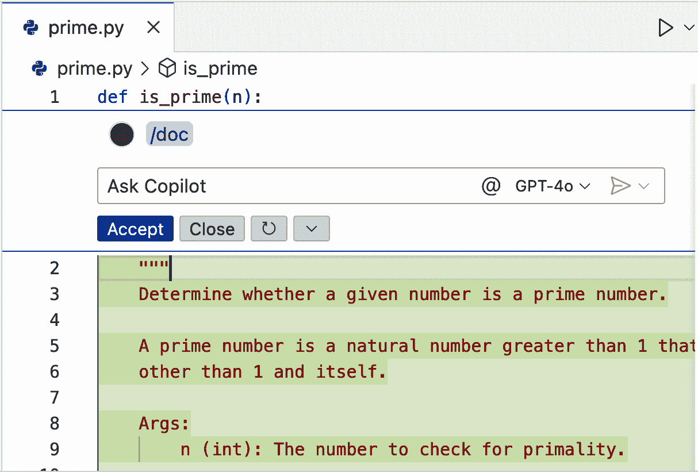

###### 图 3-24\. 文档建议的更改

虽然主聊天面板和内联编辑器聊天功能涵盖了大多数用例，但还有另一个快速参与聊天的方式，恰当地称为“快速聊天”。

# 使用快速聊天界面

有时你可能想快速向 Chat 提问或发送一个不是关于当前编辑器中代码的提示，也不需要切换到完整的聊天面板。为了帮助这一点，Copilot 包括一个名为“快速聊天”的功能，它会在 IDE 顶部弹出一个简单的聊天对话框。图 3-25 展示了一个示例。


###### 图 3-25\. 快速聊天

对话框本身就像内联编辑器中的对话框，但不在编辑器中定位。此选项允许您通过提示与 Copilot 交互，然后返回您正在做的事情。通过快捷键或通过 VS Code 界面顶部的 Copilot 图标调用快速聊天。点击该图标（如图 3-26 所示）显示打开主聊天面板、打开快速聊天对话框和打开编辑器内联聊天的选项。

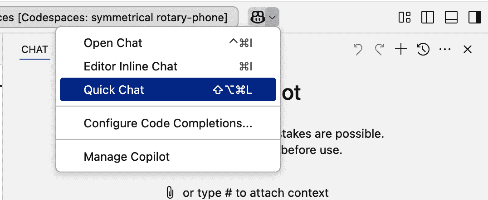

###### 图 3-26\. 标题栏中 Copilot 菜单中的聊天选项

正如我们可以拥有更简洁的聊天界面一样，我们也可以通过使用 Copilot 的快捷键来简化典型请求的提示。其中有一些，我们将在下一节中探讨。

# 聊天快捷键

GitHub Copilot Chat 支持多种常见交互类型的快捷键。这些快捷键被称为 *斜杠命令*，因为它们以斜杠字符 (/) 开头。斜杠命令可以从主聊天窗口或内联聊天 (*Meta*-I) 界面启动。并非所有命令在每个 IDE 中都可用，但 表 3-1 显示了在撰写本文时可用命令的超集。

表 3-1\. Copilot 斜杠命令

| 命令 | 目的 |
| --- | --- |
| `/clear` | 清除当前对话 |
| `/doc` | 为选定的或指定的代码添加注释 |
| `/edit` | 编辑您活动编辑器中选定的代码 |
| `/explain` | 生成代码工作原理的解释 |
| `/fix` | 提出解决问题的方案 |
| `/fixTestFailure` | 提出修复失败的测试的方案 |
| `/generate` | 生成针对特定请求的代码 |
| `/help` | 获取 Copilot 的帮助 |
| `/new` | 为新工作区生成代码 |
| `/newNotebook` | 创建新的 Jupyter 笔记本 |
| `/search` | 使用 VS Code 搜索内容 |
| `/startDebugging` | 生成 VS Code 的启动配置并开始调试 |
| `/tests` | 为代码创建单元测试 |

# 有限的功能兼容性

不同的 IDE 可能只有这些斜杠命令的子集，甚至可能没有列出的命令。当前实施和支持的斜杠命令可能会频繁更改，因此请始终查阅您特定 IDE 的 Copilot 文档，以了解哪些命令可用。

访问这些命令很简单。只需在聊天界面中输入斜杠字符，Copilot 将显示一个可供选择的命令列表（见图 3-27）。请注意，并非所有快捷键命令在内联聊天界面中都可用。

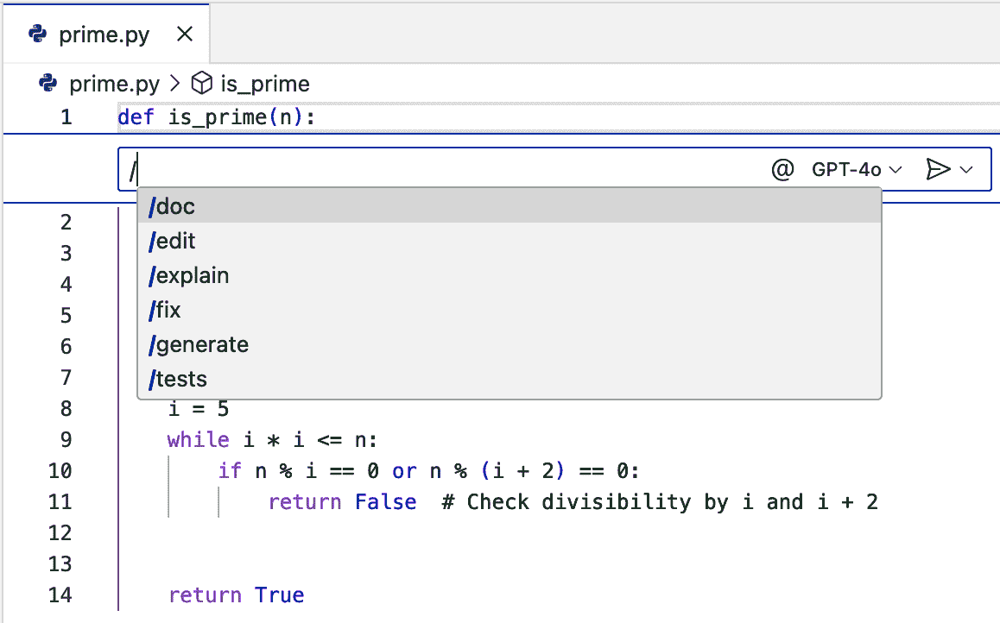

###### 图 3-27\. 在交互式聊天中列出斜杠命令

您可以在主聊天面板中使用相同的方法，如图 3-28 所示。


###### 图 3-28\. 主聊天面板中的斜杠命令列表

这只是对斜杠命令的简要介绍，但它们可能非常有用。随着我们通过本书的进展，我们将更详细地探讨一些特定的命令。

###### 备注

使用 Copilot 解释代码的功能在安装了你所使用语言相关扩展的 IDE 中效果最佳。截至本文写作时，这关系到以下 VS Code 扩展：

+   TypeScript/JavaScript

+   Python

+   Java

+   C#

+   C++

+   Go

+   Ruby

在 图 3-28 中的斜杠命令同一行包含以 `@` 字符开头的术语。如前所述，这些被称为 *参与者*，有助于识别可以使用快捷键的 *范围* 和 *领域*。我将在下一节中解释更多关于这些内容。

# 聊天参与者

在 GitHub Copilot 中，*聊天参与者* 实际上是某些领域的指针。通过在聊天界面的提示中引用它们，你实际上是在告诉 AI 将提示范围限定在特定领域，并使用该领域参与者的知识来生成相关响应。

要引用这些聊天参与者之一，你需要在提示中输入 `@` 符号以及你想要使用的参与者的名称。截至本文写作时，根据 [GitHub 文档](https://oreil.ly/v0714)，以下参与者可用：

`@workspace`

了解你工作区中的代码。当需要 Copilot 考虑你的项目结构、代码不同部分之间的交互或项目中的设计模式时，使用 `@workspace`。

`@vscode`

了解 VS Code 命令和功能。当需要帮助时使用 `@vscode`。

`@terminal`

了解 VS Code 终端外壳及其内容。当需要帮助创建或调试终端命令时使用 `@terminal`。

`@vision`

允许你附加图像文件以帮助 Copilot 理解问题。（在预览中。）

`@github`

允许你针对你仓库中的问题、拉取请求等进行提示。（并非所有界面都可用。）

`@project`

（适用于 JetBrains IDE）与 `@workspace` 类似，了解你的项目中的代码。

# 安装其他聊天参与者

除了 GitHub 提供的内置聊天参与者之外，Copilot 还允许安装 Copilot 扩展，这些扩展可以提供额外的自定义聊天参与者。我们将在第十章 Chapter 10 中详细介绍这些内容以及如何扩展 Copilot。

让我们更深入地探讨一些常见的参与者。

## @workspace

当您明确希望 Copilot 考虑工作空间中的所有代码作为聊天响应的潜在来源时，`@workspace` 聊天参与者非常有用。这并不意味着所有代码都会被使用并作为创建响应的一部分发送。Copilot 扩展将考虑工作空间中的所有文件，以确定哪些文件（或其部分）可能对上下文有用。我们之前提到的自动索引使这变得更加简单。

假设我们通过 `@workspace` 询问 Copilot 哪些文件使用了 `import`。Copilot 将首先收集有关工作空间的信息以确定相关内容。完成后，聊天界面将显示它最终决定值得考虑的引用列表。这将位于响应的开头。正如我们之前看到的，我们可以通过展开“已使用引用”行来查看所选引用的列表。因为我们使用了 `@workspace` 参与者，所以我们这次可能会有更多的 *命中*。使用 `@workspace` 的提示产生的更广泛的引用集在 图 3-29 中展示。


###### 图 3-29\. 通过 `@workspace` 询问使用导入的文件

当在提示中使用 `@workspace` 聊天参与者时，我们得到一个跨越工作空间并列出多个文件的响应。

# 确保更改被考虑用于 @workspace

`@workspace` 功能正在引用代码库中保存的内容，因此在执行提示之前，保存任何您希望聊天参与者考虑的更改或新内容是很重要的。

使用 `@workspace`，我们可以就一组代码提出更一般的问题。这在我们不熟悉的内容上查找信息时特别有利。例如，我们可以提出如下通用问题：

+   这个项目中使用了哪种后端？

+   我该如何运行这段代码？

+   我在哪里使用 *X*？

+   我该使用哪种服务来做 *Y*？

+   正在使用哪些框架？

图 3-30 展示了使用最后一个查询来收集信息的示例。


###### 图 3-30\. 使用 `@workspace` 参与者的另一个示例

# 添加 @workspace 的快捷方式

如果您在聊天中提交查询时使用 *Meta*-Enter（而不是只是 Enter），它将自动将 `@workspace` 参与者添加到您的提示中。

虽然 `@workspace` 为我们的代码集提供了上下文，但聊天参与者 `@vscode` 可以帮助解决与使用 VS Code 相关的任何问题或提示。

## @vscode

`@vscode` 聊天参与者（特定于 VS Code IDE）在 VS Code 命令和自定义方面充当领域专家。通过在 Copilot 聊天界面中使用它，您可以通过自然语言提出关于 VS Code 的问题。根据实现，它有权访问应用程序的所有设置和命令索引。使用这个参与者，您可以在 GitHub Copilot 聊天界面中提出如下问题：

+   我该如何在 VS Code 中打开一个项目？

+   我如何在 VS Code 中安装扩展？

+   我如何在 VS Code 中创建新文件？

+   我如何在 VS Code 中更改主题？

图 3-31 展示了使用`@vscode`聊天参与者来查找如何更改 VS Code 默认设置的示例。

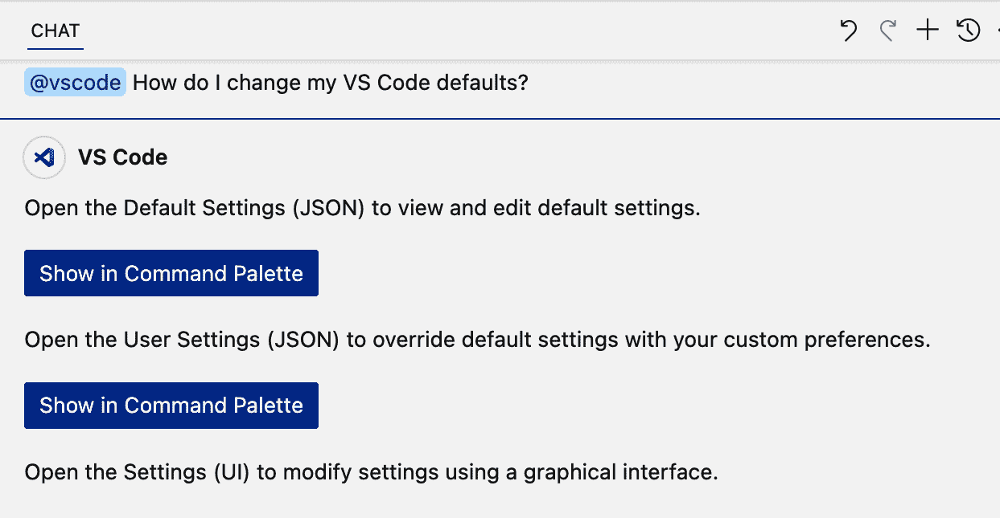

###### 图 3-31\. 在聊天中使用`@vscode`

在此图像中，你还可以看到 Copilot 包含了一个链接，以获取不同的界面——命令面板——作为访问功能的快捷方式。点击聊天输出中的该按钮将打开如图顶部所示的条目。

作为使用此参与者的另一个例子，你可能想了解如何使用你的 IDE 进行调试的更多内容。因此，你可以输入以下查询：

```py
@vscode how do I debug
```

我们将要介绍的最后一个参与者是`@terminal`，正如其名称所暗示的，它对于终端交互非常有用。

## @terminal

`@terminal`参与者允许你查询 Copilot 关于集成终端 shell、其缓冲区和终端中的当前选择。这有助于了解在终端中做了什么，帮助澄清任何问题，并想出你需要执行的命令。你可以使用以下问题/提示的示例包括以下内容：

+   上一个命令做了什么？

+   解释命令

+   我该如何...？

图 3-32 展示了使用聊天参与者询问如何在终端中使用命令执行任务的简单示例。如果你悬停在输出命令上，你将在右侧获得一个弹出控制，可以直接在终端中插入响应。

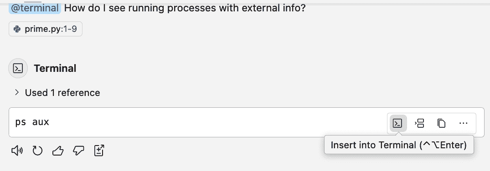

###### 图 3-32\. `@terminal`聊天参与者

你也可以使用此参与者向 Copilot 请求在终端中执行常见工作流程的帮助。例如，你可能使用终端参与者来询问如何通过命令行使用 Git 提交你的代码。

大多数斜杠命令默认将一个聊天参与者作为运行命令的域。例如，相对于之前的 VS Code 调试示例，`@vscode`参与者与斜杠命令`/startDebugging`相关联（图 3-33）。因此，如果你在聊天查询框中输入`/startDebugging`，`@vscode`将自动添加到它前面（图 3-34）。这意味着`/startDebugging`命令目前仅在引用 VS Code 时相关。


###### 图 3-33\. 参与者及其关联的斜杠命令


###### 图 3-34\. 选择`/startDebugging`时自动插入`@vscode`

表 3-2 展示了快捷命令与参与者之间的映射以及每个参与者的预期功能。

表 3-2\. Copilot 中的斜杠命令和上下文

| 命令 | 参与者 | Copilot 的功能 |
| --- | --- | --- |
| `/explain` | `@terminal` | 解释在终端中发生的事情 |
| `/search` | `@vscode` | 为搜索视图生成查询参数 |
| `/startDebugging` | `@vscode` | 在 VS Code 中生成启动配置并开始调试（实验性） |
| `/explain` | `@workspace` | 解释活动代码的工作方式 |
| `/fix` | `@workspace` | 为您的代码中的错误提出修复方案 |
| `/fixTestFailure` | `@workspace` | 为失败的测试提出修复方案 |
| `/new` | `@workspace` | 为新的工作区或新文件搭建代码框架 |
| `/newNotebook` | `@workspace` | 通过自然语言搭建新的 Jupyter 笔记本 |
| `/setupTests` | `@workspace` | 在您的项目中设置测试（实验性） |
| `/tests` | `@workspace` | 为代码生成单元测试 |
| `/help` |   | 获取有关使用 GitHub Copilot 的帮助信息 |
| `/clear` |   | 开始新的聊天会话 |

参与者可以在较广泛的层面上细化上下文。然而，有时您可能需要更具体地针对 Copilot 指定上下文。在这种情况下，您可以使用标识符来指定文件、编辑器中的内容、选择等。这些标识符被称为*聊天变量*。

# 聊天变量

聊天变量提供了一种在提示文本本身中进一步细化上下文的方法。它们可以针对编辑器中的项目、特定文件、您的 Git 仓库、终端命令等。要在聊天界面的提示中引用聊天变量，您可以使用`#`符号来指示。例如，`#terminalSelection`会拉入活动终端的选择。

表 3-3 列出了在撰写本文时可供使用的聊天变量。（有关最新信息，请参阅[VS Code 文档](https://oreil.ly/0s5TM)。描述列列出了从项目中添加的内容，作为您提示的上下文。）

表 3-3\. 聊天变量

| 聊天变量 | 描述 |
| --- | --- |
| `#changes` | 源代码控制变更列表 |
| `#codebase` | 在您的工作区中找到的相关内容 |
| `#fetch` | 通过提供其 URL 从网页获取内容 |
| `#file` | 您从工作区中选择或指定的指定文件 |
| `#*<filename>*` | 提供一个文件列表（匹配您在`#`之后输入的字符）以供选择 |
| `#folder` | 指定的文件夹及其中的所有文件 |
| `#problems` | 来自问题面板的工作区问题和问题；作为调试或修复代码的上下文很有用 |
| `#searchResults` | 在您的工作区中执行搜索查询的结果 |
| `#selection` | 编辑器中当前选中的文本——将作为 *`<filename:lines>`* 添加 |
| `#sym` | 当前符号 |
| `#*<symbol>*` | 提供一个符号列表（匹配您在`#`之后输入的字符）以供选择 |
| `#terminalLastCom⁠mand` | 活动终端的最后一次运行命令 |
| `#terminalSelection` | 活动终端的选择 |
| `#testFailure` | 添加有关测试失败的信息，以帮助诊断和修复测试 |
| `#usages` | 结合查找所有引用、查找实现和转到定义 |
| `#vscodeAPI` | 将 VS Code API 添加到回答有关 VS Code 扩展开发的问题 |

你可以通过在提示中简单地输入`#`来轻松访问聊天变量。当你这样做时，Copilot 会弹出一个可用变量的列表（图 3-35）。

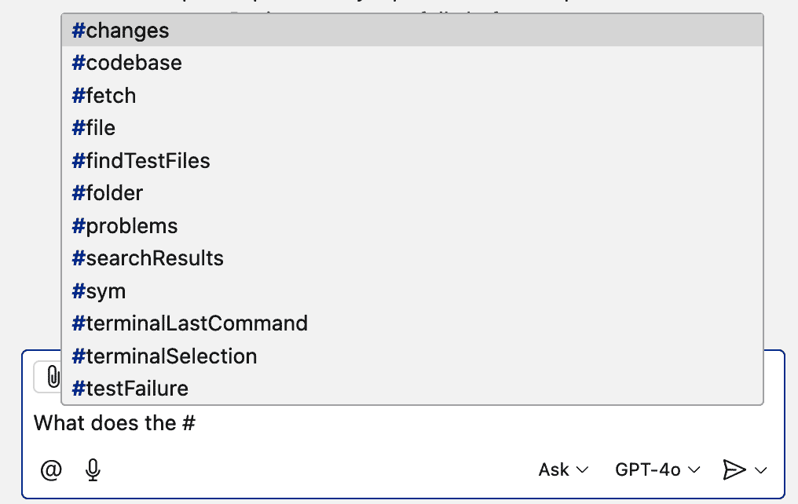

###### 图 3-35\. 聊天变量

之后，你可以从提供的列表中选择一个相关项目（例如文件）（图 3-36）。

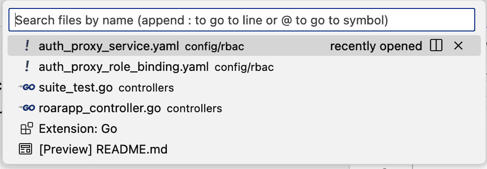

###### 图 3-36\. 从填充的列表中选择文件

你也可以在提示中将参与者、快捷命令和变量组合在一起。图 3-38 展示了请求 Copilot 解释文件中选择的示例。注意，它自动填充了`@workspace`参与者，因此提示变成了`@workspace /explain #selection`。这展示了使用聊天参与者、快捷命令和聊天变量的组合示例。

如果你查看使用的参考，Copilot 最终关注了选择和文件中的另一部分，它需要生成响应。然后，Copilot 根据请求为更具体的环境（选定的文本）生成了解释。

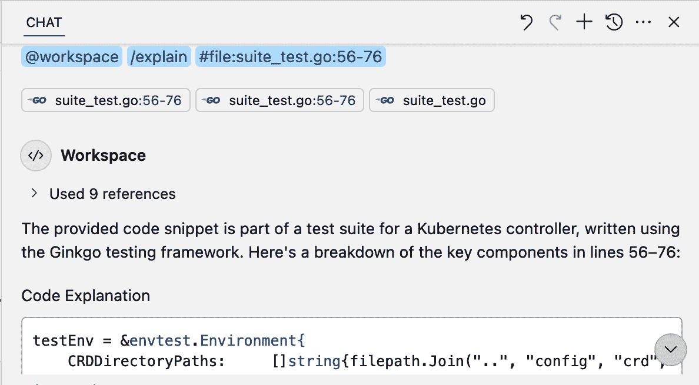

###### 图 3-38\. 使用聊天参与者和聊天变量来帮助指定上下文

确保 Copilot 考虑到了你想要的环境有时可能具有挑战性。关键是查看 Copilot 的响应，看看：

+   Copilot 使用了你预期的参考（s）

+   Copilot 提供的响应是*通用的*建议，或者特定于你的工作空间中的结构或内容

这两个响应属性将帮助你快速判断 Copilot 是否针对你想要的内容，或者你是否需要使用本节中概述的方法来更精确地引导它。

在与 Copilot 交互时，你还可以使用另一个聊天界面。这个界面针对你在终端中执行的操作。

# 终端中的聊天

Copilot 提供了针对终端的专用聊天功能。当你处于终端中，例如在 VS Code 中，使用相同的*Meta*-I 快捷键会弹出一个快捷对话框，用于输入指向终端的提示。图 3-39 展示了在这种情况下出现的快捷对话框。

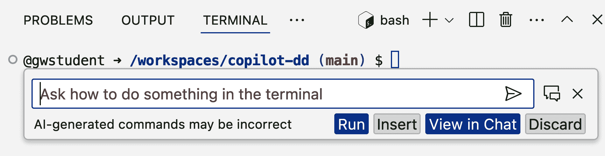

###### 图 3-39\. 终端查询对话框

你可以输入一个提示，例如“我如何使用 Git 提交我的更改？”然后查看在终端中需要运行的命令。此外，你还有选项运行它们，在聊天中查看输出，等等（见图 3-40）。

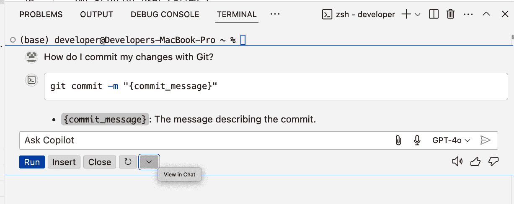

###### 图 3-40\. 在终端中查看聊天

# 创建自定义代码生成指令

在第二章中，我提到你可以为 Copilot 代码审查创建自定义指令。你还可以创建自定义指令来指导 Copilot 如何生成代码响应。请注意，然而，这些自定义指令不适用于编辑器中的内联代码建议。

与自定义审查指令一样，你可以通过三种方式完成这项任务。

首先，你可以编辑*settings.json*文件，并在`git⁠hub.​copilot.chat.codeGeneration.instructions`下添加自定义指令。以下是你可以添加的规则示例：

```py
"github.copilot.chat.codeGeneration.instructions": [
    {
        "text": "Always add comments to generated code describing 
its purpose."
    },
    {
        "text": "Use underscores for private field names in
 TypeScript."
     }
]
```

在用户设置文件中添加规则后，你可以告诉 Copilot 再次审查相同的代码。这次，它会标记设置文件中指定的条件，如图图 2-24 所示。

其次，你可以在你的仓库或项目中创建一个名为*.github/copilot-instructions.md*的 Markdown 文件，并指定具体的路径和名称。

这里是一个示例，展示了使用相同规则的这个文件可能的样子：

```py
# Custom Instructions for Code Generation

- Always add comments to generated code describing its purpose.
- Use underscores for private field names in TypeScript.
```

如果你更喜欢使用不同的路径或名称来命名 Markdown 文件，你可以创建它，然后在*settings.json*文件中使用`file:`键引用它。例如，如果你将其命名为*.docs/code-style.md*，你可以在设置文件中使用以下条目指向 Copilot：

```py
 "github.copilot.chat.reviewSelection.instructions": [
    {
       "file": ".docs/code-style.md"
    }
 ]
```

让我们看看一个没有自定义代码生成指令的例子。假设你提示 Copilot 创建一个包含私有变量的最小 TypeScript 类(图 3-41)。

假设你通过刚刚概述的方法之一添加了自定义指令。有了这些，如果你执行相同的提示，你会得到如图图 3-42 所示的结果。

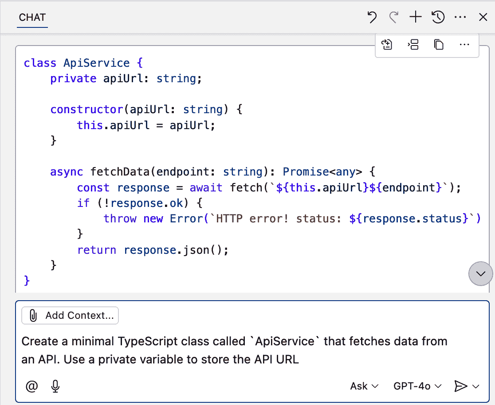

###### 图 3-41\. 没有自定义代码生成指令的最小 TypeScript 类


###### 图 3-42\. 带有自定义代码生成指令的最小 TypeScript 类

注意在这个版本中，代码被注释，私有变量名称以下划线开头，这是根据我们为自定义代码生成指令设定的方向。

最后，在我们离开这一章之前，值得说几句关于处理 Copilot 使用的 AI 模型可能返回的幻觉和错误答案。

# 处理幻觉和错误答案

尽管我们可能向 Copilot 提供所有这些上下文，但底层的 AI 模型仍然可能包含幻觉并在其响应中产生错误答案。在聊天中识别这些需要敏锐的观察和一些系统性的检查。

当 Copilot 生成看似合理但实际上错误、无依据或完全虚构的代码、解释或事实时，就会发生幻觉。常见的迹象包括对不存在的函数、API 或字段的引用，以及无法编译或与你的项目内容不一致的代码。有时 Copilot 可能会发明关于你的代码库的细节或误解你的要求，导致输出在初次看起来正确，但在仔细检查时失败。

为了识别这些问题，首先仔细审查 Copilot 的回复在技术准确性和与你的代码库的一致性方面。如果 Copilot 建议一个你不知道的函数或字段，检查你的项目文件或文档以确认它实际上是否存在。对于解释过于自信或代码看起来过于通用或不相关于你的上下文的结果要小心。

测试生成的代码至关重要：尝试运行它，添加单元测试，或检查它是否与现有的代码顺利集成。（使用 Copilot 进行测试的内容在第五章中介绍。）如果你注意到静默失败或模糊的响应，这也是一个警告标志，表明 Copilot 可能难以提供基于事实的答案。

当你怀疑出现幻觉或不良答案时，以下是一些处理方法：

+   在使用之前，验证所有由 AI 生成的内容。

+   将 Copilot 的建议与受信任的文档或可靠来源进行交叉引用。

+   如果需要更多的验证，使用事实核查工具或插件，这些工具或插件可以将信息与外部数据库或网络来源进行验证。

为了减少最初遇到这些问题的可能性，考虑以下策略：

+   如果可能，将复杂的提示分解成更小、更易于管理的部分，以减少歧义并帮助 Copilot 专注于特定任务。

+   根据你收到的回复，迭代地完善你的提示。

+   对于看起来可疑的输出，不要犹豫，将其丢弃或修改。

最终，将 Copilot 视为一个有用的助手，而不是一个不可犯错的权威。通过结合仔细审查、测试和外部验证，你可以最大限度地减少幻觉的影响，并确保代码和文档的质量和可靠性。

# 结论

如你所见，Copilot 的聊天界面在对话输入和输出方面提供了比内联代码补全功能更大的灵活性。聊天界面通过牺牲更冗长的内容来处理，以及分析更多内容以获取上下文和生成更广泛的建议，从而带来更长的响应时间。

如果你专注于在编辑器中内联编写代码，并且不需要与 Copilot 进行对话，而是只想看到它的即时编码建议，你不需要访问聊天界面。

另一方面，如果你需要向 Copilot 提问或者需要比内联交互提供的更多结果，那么 Chat（聊天）是一个强大的工具。这尤其适用于当你结合聊天参与者和聊天参考的额外功能，以将 Copilot 的焦点集中在你最感兴趣的部分时。

现在你已经对 Copilot 是什么以及如何与之交互有了核心理解，我们可以继续探讨它在 IDE 中使用时提供的某些高级功能，这些功能可以节省你的时间和精力，并实现一些令人印象深刻的自动化。
