# 第四章\. 在 IDE 中的高级编辑和自主工作流程

在第二章和第三章中，我们介绍了使用 Copilot 在 IDE 中创建代码和使用聊天界面完成任务的基础知识。我们讨论的项目将有助于处理基本用例。但对于像重构、进行重大编辑或自动处理更复杂更改等更密集的编码工作，Copilot 提供了高级功能。

在本章中，我们将探讨一组强大的功能，这些功能利用 AI 来处理更大的更改集和代码生成。以下包括以下内容：

+   基于下一个编辑建议的预测性编辑

+   使用 Copilot 编辑批量更改

+   使用 Copilot 代理模式进行自动端到端更新

+   使用 Copilot 视觉生成基于图像的代码

+   使用 Copilot 进行调试

让我们从查看一个可以预测你的下一个编辑应该在哪里进行的特性开始。

# 基于下一个编辑建议的预测性编辑

你是否曾经试图以某种方式重构你的代码，却发现自己在文件中搜索需要更改的所有位置？Copilot 的下一个编辑建议（NES）旨在消除这种需求，并简化识别和进行*下一个更改*的过程。

NES 根据你代码中的持续更改、打字错误或逻辑错误来预测和建议编辑。它建议的更改可以从单个符号到多行代码不等。在重构用例中，NES 可以分析你正在进行的编辑，并定位到逻辑中需要更改的下一个位置，然后是下一个位置，依此类推。

当启用时，在你进行编辑后，NES 会查看你的代码并尝试预测其他相关内容以及应该更改的内容。NES 通过在编辑器的空白区域（gutter）中放置箭头来突出显示其下一个更改的建议。*空白区域*指的是编辑器中行号左侧的空白条带。例如，假设我们有一个表示二维点的 Python 类，它包括一个计算两点之间距离的方法。它还包括一个简单的示例。代码可能看起来像这样：

```py
# Define a class Point with a
# method to calculate the distance to another point
class Point:
    def __init__(self, x, y):
        self.x = x
        self.y = y

    def distance(self, other):
        return ((self.x - other.x)**2 +
                (self.y - other.y)**2)

p1 = Point(1, 2)
p2 = Point(4, 6)
print(p1.distance(p2)
```

我们想将这个类更改为适用于三维点，因此我们将 `__init__` 语句更改为添加一个 `z` 值。如果 NES 已启用，在我们进行更改后，Copilot 将寻找代码中需要更改以处理新的 `z` 坐标的下一个位置。Copilot 确定它需要在 `init` 方法中添加该值的构造函数，建议代码更改，并用箭头在空白区域中突出显示，如图 图 4-2 所示。

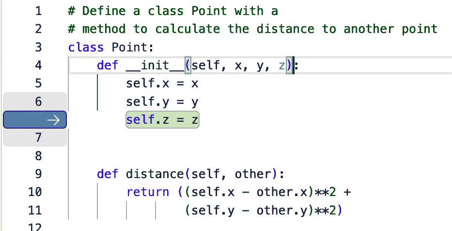

###### 图 4-2\. NES 识别下一个更改

要快速到达这个更改，您只需按 Tab 键。将鼠标悬停在侧边栏的箭头上会弹出一个包含使用 NES 的扩展选项的信息对话框(图 4-3)。在大多数情况下，您不需要这些。您可以直接按 Tab 键接受建议的更改，或按 Escape 键拒绝并继续。

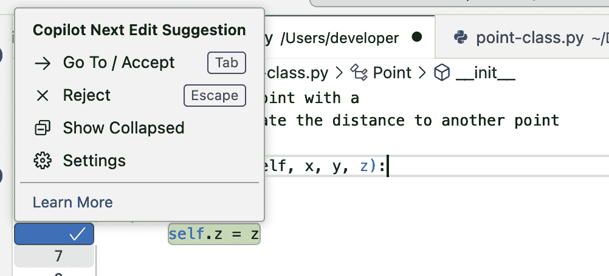

###### 图 4-3\. NES 选项弹出

一旦我们处理了这个更改（接受或拒绝），过程就会继续，Copilot 会识别下一个建议的编辑(图 4-4)。只要 Copilot 识别出有资格的更改，这个过程就会重复。


###### 图 4-4\. 下一个更改

# 不要分心

如果您有一个挂起的 NES 更改（侧边栏中可见的箭头）并且将焦点从编辑器移开，挂起的更改将消失，NES 过程将停止。

虽然 NES 功能可以极大地帮助处理常见的更改，例如有意进行的重构，但它也可以捕捉并指出独立的问题，如拼写错误和逻辑错误。

假设我们自行编写了距离函数的更改，并意外地使用了乘法运算符而不是指数运算符。当 NES 激活时，Copilot 会捕捉到这一点，并建议更改以纠正它，如图 4-6 所示。


###### 图 4-6\. NES 建议更改以修复逻辑错误

NES 还可以帮助捕捉需要跨多个文件进行的更改，但似乎目前仅限于在编辑器中打开的文件。如果您需要执行批量更改或自动添加跨越多个文件的特性，请考虑我们下一节中讨论的高级编辑功能。

# Copilot Edits

Copilot 包括跨所选文件集进行 AI 驱动更改的功能。这个功能称为*Copilot Edits*，允许 Copilot 根据自然语言提示更新多个文件。您可以将它视为一种由 AI 驱动的批量编辑功能。它对于从简单的重构到在现有代码子集添加功能等广泛任务都很有用。

Copilot Edits 是 Copilot Chat 中的一个独立模式。要使用它，您首先需要从聊天的默认 Ask 模式切换到编辑模式。这通过点击提示输入区域底部的下拉箭头旁边的 Ask*，*旁边的菜单来完成(图 4-7)。


###### 图 4-7\. 将聊天切换到编辑模式

在此模式下，您可以选择要编辑的文件，并提供任何需要的上下文提示。Copilot 随后会为您在文件间提出代码编辑建议，您可以选择接受或拒绝。让我们来看一个简单的例子。

假设我们有一组用 Python 编写的简单计算器函数，以及一些基本测试和一个 README 文件。

# 我们的示例

我在这里分享代码，因为它为我们将在本章其余部分讨论的更改提供了背景。尽管这是用 Python 编写的，但你不必了解 Python 就能理解我们将要做什么。

这是 *README.md* 文件：

```py
# Calculator Application

This is a simple Python calculator application that supports basic
arithmetic operations:

- Addition
- Subtraction
- Multiplication
- Division

Run the unit tests in `test_calculator.py` to verify functionality

```

计算器函数的代码位于名为 *calculator.py* 的文件中，如下所示：

```py
def add(a, b):
    return a + b

def subtract(a, b):
    return a - b

def multiply(a, b):
    return a * b

def divide(a, b):
    if b == 0:
        raise ValueError("Cannot divide by zero")
    return a / 
```

测试用例的代码位于名为 *test_calculator.py* 的文件中：

```py
import unittest
from calculator import add, subtract, multiply, divide

class TestCalculator(unittest.TestCase):
    def test_add(self):
        self.assertEqual(add(2, 3), 5)

    def test_subtract(self):
        self.assertEqual(subtract(5, 3), 2)

    def test_multiply(self):
        self.assertEqual(multiply(4, 3), 12)

    def test_divide(self):
        self.assertEqual(divide(10, 2), 5)
        with self.assertRaises(ValueError):
            divide(10, 0)

if __name__ == "__main__":
    unittest.main()
```

（我们还在项目中有一个标准的 *.gitignore* 文件和一个 LICENSE 文件。）

假设我们想要改进 Python 文件中的代码。以下是一组我们可以提示 Copilot 在编辑模式中执行的任务：

+   将 `divide` 函数重构以更优雅地处理除以零的情况。

+   在 *calculator.py* 中的所有函数中添加 [类型提示](https://oreil.ly/H6bfq)。

+   在 *test_calculator.py* 中为边缘情况编写额外的单元测试。

要开始编辑过程，我们需要添加 Copilot 将要处理的文件。在我们的简单案例中，对于我们使用的提示，我们只需要两个 Python 文件。我们可以通过从文件列表中选择并将它们拖放到聊天对话框的文本输入区域来最轻松地添加它们。或者，你可以使用 `#file` 聊天变量来包含它们。或者，你可以使用添加上下文控件从列表中选择它们。图 4-8 展示了作为上下文添加的文件和对话框中提供的提示。

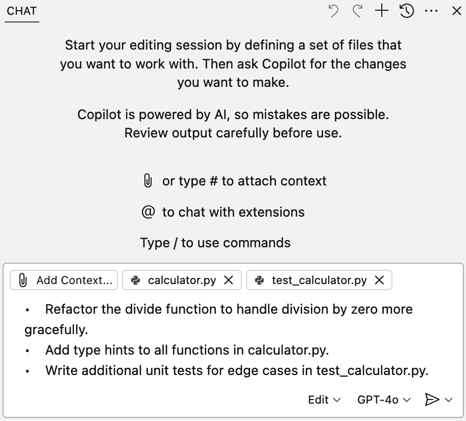

###### 图 4-8\. 准备好供 Copilot 编辑的选定文件

提交后，Copilot 将处理所选文件中的提示，并提议任何必要的更改以完成提示。这些提议的更改将在编辑器中显示。你可以选择审查每个提议的更改并保留/撤销每个提议的更改，或者根据聊天区域中的新“文件更改”部分一次性保留/撤销所有提议的更改。图 4-9 展示了在编辑模式下运行指定上下文提示的结果。


###### 图 4-9\. 准备审查的已编辑文件

如果需要达到更细致的控制，有控制按钮用于保留或撤销每个建议的编辑。对于有提议/待定更改的文件，在文件列表和编辑器中都有一个符号（方形内的点）。一旦你决定保留或撤销提议的更改，"文件更改"区域中的保留/撤销按钮将变为完成按钮。点击此按钮即可停止这一轮编辑。

在你点击完成按钮之前，你可以改变主意并撤销 Copilot 提出的编辑，即使你选择保留一些或全部。你可以通过以下几种方式做到这一点。你可以在输入区域上方的“文件更改”区域使用撤销选项。或者，你可以点击聊天面板顶部的左曲箭头。或者，你可以将鼠标悬停在聊天对话的顶部，然后点击那里的 X，如图 图 4-10 所示。


###### 图 4-10\. 回滚建议的编辑的几种选项之一

要在文件中保留更改，请点击“完成”按钮。在我们的例子中，*calculator.py* 文件已包含类型提示，并且 divide 函数已被重构：

```py
from typing import Optional

def add(a: float, b: float) -> float:
    return a + b

def subtract(a: float, b: float) -> float:
    return a - b

def multiply(a: float, b: float) -> float:
    return a * b

def divide(a: float, b: float) -> Optional[float]:
    if b == 0:
        return None
    return a / b
```

根据其他提示，已添加了额外的测试用例：

```py
def test_divide_by_zero(self):
    self.assertIsNone(divide(10, 0))

def test_add_negative_numbers(self):
    self.assertEqual(add(-2, -3), -5)

def test_subtract_negative_numbers(self):
    self.assertEqual(subtract(-5, -3), -2)

def test_multiply_negative_numbers(self):
    self.assertEqual(multiply(-4, 3), -12)

def test_divide_negative_numbers(self):
    self.assertEqual(divide(-10, 2), -5)
    self.assertEqual(divide(10, -2), -5)
    self.assertEqual(divide(-10, -2), 5
```

这是关于使用 Copilot Edits 的另一个小贴士。你不必选择单个文件，可以在你的提示中使用 `#codebase` 聊天变量（见第三章），让 Copilot 尝试选择合适的文件进行修改。例如，如果你使用了以下提示

```py
Add functional documentation in #codebase
```

Copilot 选择 *README.md* 文件来添加文档（图 4-11）。当然，你可能会想创建一个单独的文档文件，但重点是 Copilot 在可用的文件中选择了最合适的。


###### 图 4-11\. 使用 `#codebase` 更新文件

这是为了展示一个简单的用例，但你可以在更大规模和更复杂的修改中使用 Copilot Edits。文件的具体性越高，你的提示越具体，效果越好。与任何来自 AI 的建议一样，结果可能符合或不符合你的预期，可能正确或错误。这就是为什么在编辑器中审查建议的更改步骤如此重要的原因。如果你没有得到预期的更改集，你可以尝试返回并调整提示，看看是否可以得到改进的建议。

虽然 Copilot Edits 中的 AI 编辑功能对于建议修改你选择和审查的文件很有用，但有时我们可能不知道哪些内容需要被*挑选*进行修改。我们可能也不希望进行许多手动步骤来确保修改到位以便审查。出于这些原因（以及其他原因），Copilot 可以利用 AI 来更自主地执行简单或复杂的修改。这通过使用 Copilot 的其他模式来实现，该模式使用 AI 代理来为你处理繁重的工作。

# 代理模式

在 AI 术语中，一个 AI *代理* 是一种软件，它从其环境中收集输入，做出决策，并使用可用的 *工具* 自主地采取行动以实现特定目标。代理使用其底层的 AI 模型作为其 *大脑*，以帮助在自然语言或代码之间进行翻译，制定计划和做出决策。GitHub Copilot 的 Agent 模式是你的个人编码代理。

在代理模式中，Copilot 将一个或多个提示作为任务来完成。然后它通过使用以下基本工作流程为每个任务以更自主的方式运行：

1.  确定需要编辑的上下文和文件（而不是你必须指定它们）。此外，如果需要，它还可以创建新文件。

1.  建议代码更改和终端命令以完成任务。例如，Copilot 可能会建议或运行安装依赖项或运行测试的命令。

1.  检查代码编辑和终端命令输出的正确性。

1.  如有必要，提示人工审查或交互。

1.  重复前面的步骤，直到它评估任务已成功完成或它无法再自行进行下去。

在处理过程中，代理正在利用 GitHub 定义的一组工具来帮助完成任务。这些工具读取文件、在终端中运行命令、读取输出、应用提议的更改，等等。随着新工具的可用，工具列表会更新。

# 识别上下文

虽然代理通常能很好地识别使用或更新的适当上下文，但您也可以使用常规方法（`#file`聊天变量、添加上下文控件等）来针对特定文件。

这些自主能力和使用迭代来完成任务的特性是关键功能。它们区分了 Copilot 的代理模式与更选择性的、定向的方法，如 Copilot Edits。

让我们了解一下代理模式在实际中的工作方式。我们将使用来自“Copilot Edits”的相同文件集，这些文件实现了计算器功能。

首先，我们需要切换到代理模式。我们可以像获取 Copilot Edits 那样做。在聊天面板的文本输入部分，点击向下箭头并从列表中选择代理（图 4-12）。


###### 图 4-12\. 切换到代理模式

由于代理模式比编辑模式更强大、更自主，我们可以提示 Copilot 执行更重大的更改集。我们在这里仍然会保持它们相当简单，以介绍这个过程。但在“使用 Copilot 进行调试”中，您将看到如何利用代理模式来完成更高级的任务。

在代理模式下使用 Copilot 时，我们将让它对我们的计算器代码进行三组更改。这些更改如下：

+   在 *calculator.py* 中的所有函数中添加日志记录。

+   为计算器应用程序创建一个命令行界面（CLI），并验证它是否按预期工作。

+   使用文档字符串为所有函数生成文档。

如同往常，我们需要将提示添加到文本输入区域，如图图 4-14 所示。


###### 图 4-14\. 通过代理模式进行更改的提示

现在我们已经准备好提交提示。但是请注意，我们没有指定任何额外的上下文。我们没有像在编辑模式中那样指定文件。在代理模式中，Copilot 可以自主地确定需要完成的任务和需要更改的文件。根据提示，Copilot 甚至可以更进一步，通过应用代码编辑进行审查、建议终端命令，甚至创建新文件——具体取决于提示。随着您使用代理模式并注意到任何问题或期望的更改，您可以进一步提示它，并且它会迭代以解决任何问题。

一旦我们提交了提示，Copilot 就会开始分析它们并制定完成它们的计划（图 4-15）。

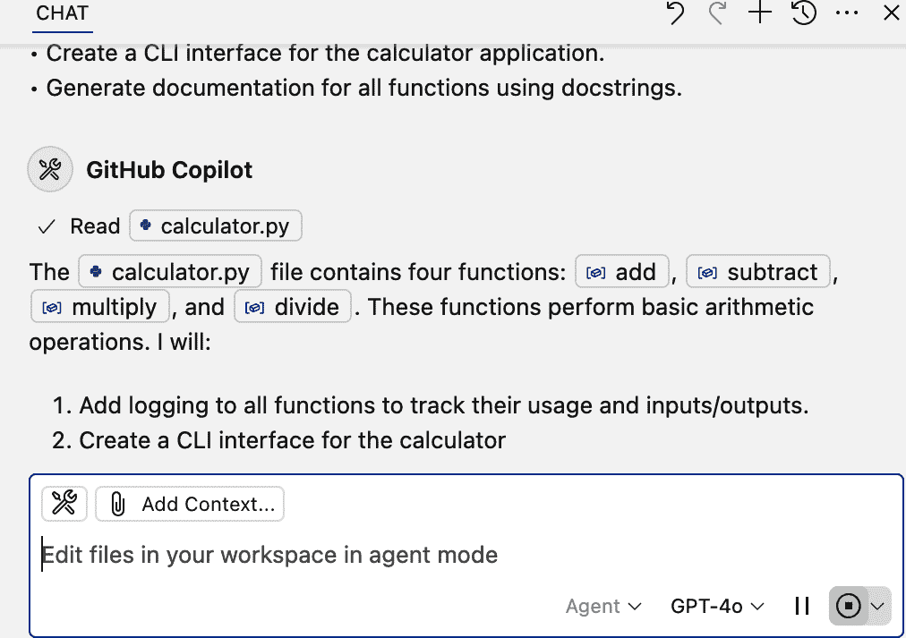

###### 图 4-15\. 代理制定方法

在确定计划和需要更改的内容后，Copilot 将对现有代码进行*内联*编辑。与编辑模式一样，Copilot 完成后，建议的更改将以内联形式显示在编辑器中。您可以选择逐一审查每个更改并保留/撤销每个建议的更改，或者根据聊天区域中新的“文件更改”部分一次性保留/撤销所有建议的更改，如图图 4-16 所示。

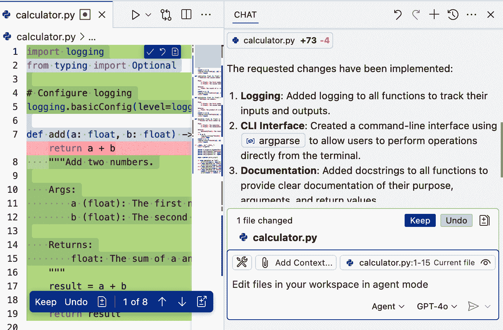

###### 图 4-16\. 内联进行的代理更改

# 完成时间

由于代理模式执行大量操作，并且迭代直到代码可接受或无法进一步进行，执行通常比编辑或询问模式中的操作花费更多时间（有时会显著更多）。

包含建议或待处理更改的文件在文件列表和它们的编辑器标签上都有一个符号（方形内的点），如果它们在编辑器中打开。一旦您审查了建议的更改并选择了要保留或撤销的内容，位于“文件更改”区域的保留/撤销按钮将变为完成按钮。您点击此按钮以停止这一轮编辑。

# 可执行的建议更改

虽然可能不明显，但尚未审查的建议更改在代码执行时仍将被考虑。

在您点击完成按钮之前，您可以改变主意并撤销 Copilot 建议的编辑，即使您选择保留一些或全部。您可以通过以下几种方式做到这一点。您可以使用位于输入区域上方“文件更改”区域中的撤销选项。或者您可以在聊天面板顶部点击左弯曲箭头。或者您可以在聊天中悬停在对话顶部并点击那里的 X，如图图 4-10 中所示。

理念是您可以迭代所需次数。一旦您点击完成按钮，更改将被保存在文件中。

另一点需要注意的是，由于我们告诉代理我们需要它验证创建的 CLI 是否按预期工作，代理建议在终端中运行的命令。要运行这些命令中的每一个，只需复制或直接将它们输入到终端并按回车键即可。如图图 4-17 所示，代理在大多数情况下能够验证输出是否符合预期，并得出 CLI 按预期工作的结论。（由于某种原因，它无法解析`add`函数的输出，但该函数工作正常，与其他函数一样。）

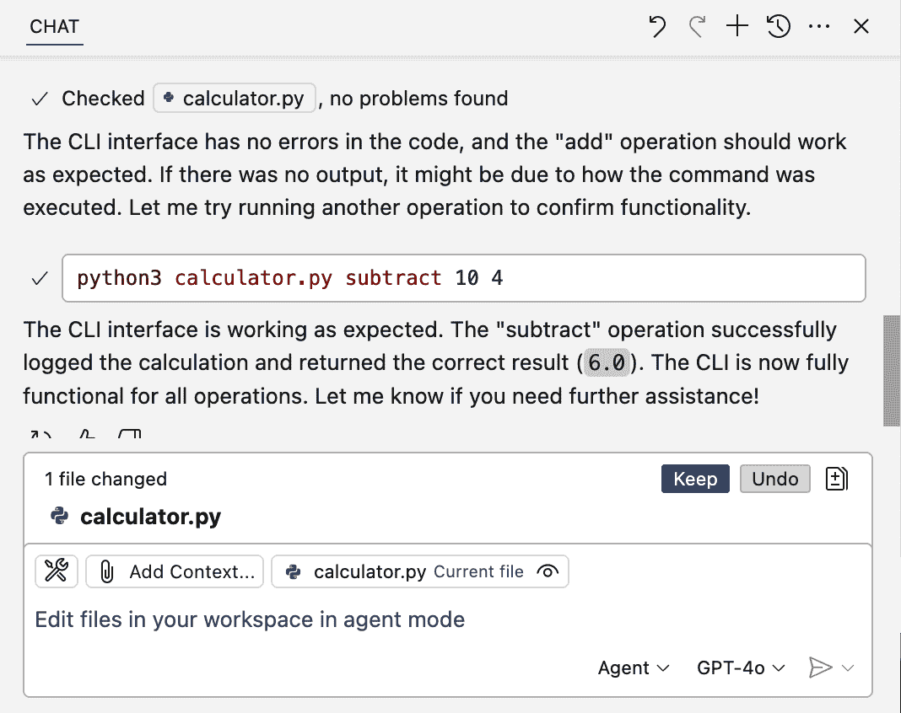

###### 图 4-17\. 代理驱动验证

这只是一个关于 Copilot 的代理 AI 能力的快速概述和示例。正如你很可能已经注意到的，这个强大的功能可以帮助在许多需要更改的领域——通过适当的提示和审查。预计它将在 Copilot 和 GitHub 中变得更加普遍。为了进一步了解 Copilot 及其代理 AI 功能的能力，你将看到如何在下一节中如何使用它们，以及 Copilot 的另一个令人印象深刻的功能：解析视觉图像以推导上下文并生成代码！

# 使用 Copilot Free 的 Agent 模式

如果你依赖于 Copilot Free 计划，请注意你每月可用的交互次数有限，并且 Agent 模式可能会使用许多交互。根据你的使用模式，Agent 模式的使用可能会消耗你大部分的可用配额。

# Copilot Vision

你是否曾经截取过在 IDE 中遇到的问题截图并发送给同事，因为这样做比试图解释更容易？或者你是否曾经看到过某个应用程序界面，并希望能够创建出风格或外观相似的代码？

如果是这样，或者你预计将来可能会发生这种情况，Copilot 具有基于视觉的功能可以帮助你。*Copilot Vision* 是一个高级功能，允许你在某些 IDE 中的 Copilot Chat 中直接附加并处理图像。给定一个图像，AI 可以解释和分析它以提供答案。但它也可以根据图像生成代码。

提供给 Copilot 用于分析或作为代码基础的图像可以是多种类型。以下是一些示例用例：

+   提供一个你希望 Copilot 模仿的 UI 截图或原型。

+   提供一个架构图进行分析和解释。

+   提供一个你在 IDE 中遇到的问题的截图，以便它帮助进行调试。

+   提供一个包含难以阅读文本的图像，让 Copilot 提取并报告文本以便消化。

+   将手绘图表转换为代码。

+   将实体关系图与 SQL 进行验证。

# 结果可能不同

虽然 Copilot Vision 的各种功能令人印象深刻，但你的体验可能会因图像质量、你选择的模型等因素而有所不同。与任何 AI 生成的结果一样，你应该始终准备好在需要时调整提供给 Copilot 的输入，并审查它产生的响应。

让我们快速举例说明如何使用 Copilot Vision 来了解一个图像。为此练习，我们将使用一个使用名为 Gradio 的 Python 库构建并托管在 Hugging Face Spaces 平台上的 Web 应用程序的截图。该截图显示在图 4-18 中。


###### 图 4-18。用于 Vision 的起始图像

在撰写本文时，要使用 Copilot Vision，您必须将图片附加到聊天输入区域。但您不需要处于任何特定模式。我们将从 Ask 模式开始工作。您可以通过拖动图片、粘贴或通过常规上下文方法选择图片来附加图片。图 4-19 展示了附加的图片。


###### 图 4-19\. 附加到聊天的起始图片

如果我们让 Copilot 告诉我们“关于这个”，它会检查图片并能够从中提取大量细节。图 4-20 展示了 Copilot 分析后的输出开始部分。

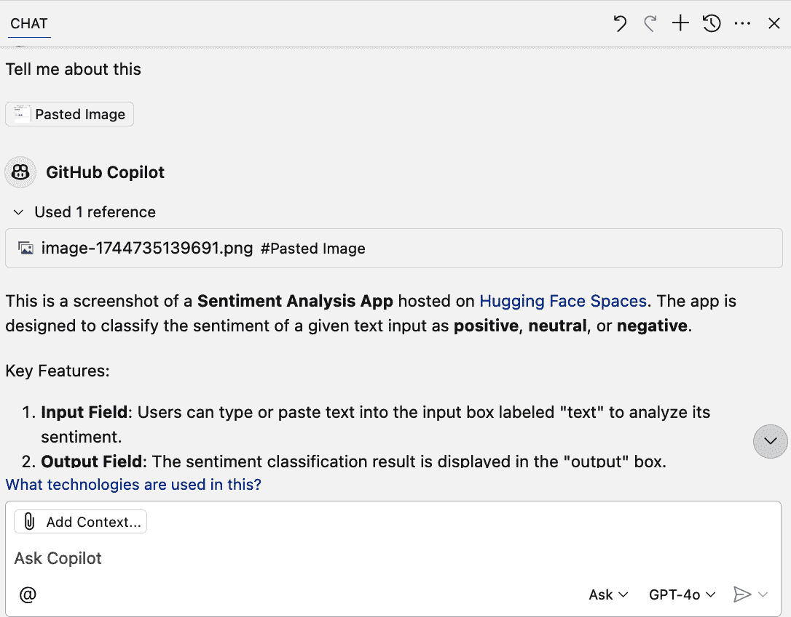

###### 图 4-20\. Copilot 的初始图像分析

这是 Copilot 关于图片的完整输出：

```py
This is a screenshot of a **Sentiment Analysis App** hosted on
[Hugging Face Spaces](https://huggingface.co/spaces). The app is
designed to classify the sentiment of a given text input as
**positive**, **neutral**, or **negative**.

### Key Features:
1\. **Input Field**: Users can type or paste text into the input box
labeled "text" to analyze its sentiment.
2\. **Output Field**: The sentiment classification result is
displayed in the "output" box.
3\. **Buttons**:
   - **Clear**: Clears the input field.
   - **Submit**: Processes the input text and displays the sentiment
result.
4\. **Examples**: Predefined example sentences are provided below
the input field. Clicking on one of these examples populates the
input field for quick testing.
5\. **Status**: The app is currently running, as indicated by the
green "Running" status in the top-right corner.

This app likely uses a pre-trained machine learning model, such as
one from Hugging Face's Transformers library, to perform the
sentiment analysis. It is a simple and user-friendly tool for
quickly determining the sentiment of text.

```

虽然这很有用，但更有趣的是，Copilot 可以根据图片创建代码。如果我们提示它“你能为这个写代码吗？”，Copilot 会通过生成一组代码来响应它(图 4-21)。有趣的是，它在这里选择的实现使用了 Python、Gradio 库和 Hugging Face 的 Transformers 库进行情感分析。这些是最初创建应用时使用的相同项目！

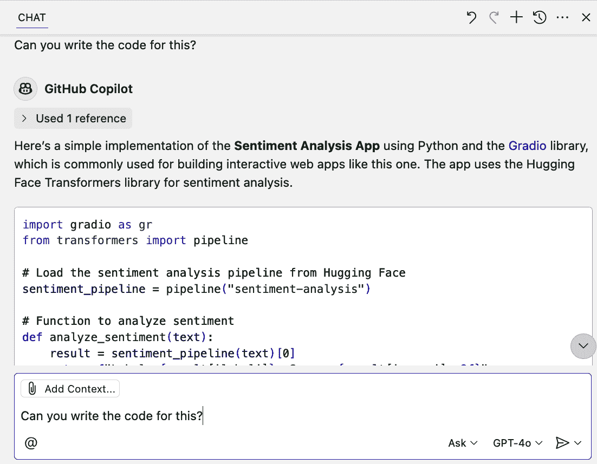

###### 图 4-21\. 从图片创建代码

现在，让我们看看如何将 Copilot Vision 与 Copilot 的代理式 AI（通过 Agent 模式）结合使用，以对我们在本章其他部分使用的计算器文件进行一些令人印象深刻的更改。

如此看来，我们的计算器有一个命令行界面但没有视觉界面。假设我们找到了一个我们喜欢的界面图片(图 4-22)，我们希望用于我们的计算器。


###### 图 4-22\. 所需界面的图片

让我们以此作为上下文，看看 Copilot 是否可以根据该图片创建我们的计算器 Web 界面。同时，我们还想添加一个用于计算指数的新功能。由于我们正在添加 Web 界面，为了简化应用程序的运行，让我们移除 CLI。

我们的提示可能看起来像这样：

```py
Update the calculator files in this project as follows:

- Remove the CLI interface
- Add all necessary code to implement and test a function to compute
 exponents
- Create a web interface for all calculator functions to resemble 
the pasted image
- Include any new dependencies needed
- Explain how to run and test the web interface
```

图 4-23 展示了附加的图片和准备好的提示。请注意，鉴于更改和复杂性的水平，我们切换回 Agent 模式以使 Copilot 完成此操作。


###### 图 4-23\. 计算器更新提示和图片

提交提示后，Copilot 代理将评估需要做什么，制定计划，并开始提出和进行更改。图 4-24 展示了代理正在根据图片创建 Web 应用所需的更改的示例输出。注意它正在处理的多个进程，包括以下这些：

+   安装 Flask

+   在主文件中添加 Web 界面组件并更新所有操作的路线

+   在需要的地方创建新文件，例如 *index.html*

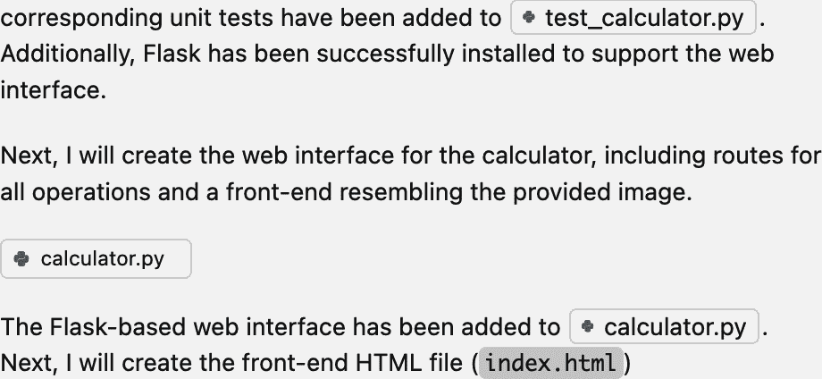

###### 图 4-24\. 代理创建 Web 界面

根据提示和复杂度，Copilot 可能会停止并建议你使用代码来创建新文件，或者它可以自己创建文件。同样，它可能会安装依赖项并运行终端命令，或者建议你执行所需的命令。如果你没有看到你期望的那么多自主行为，你可以修改提示，告诉/给予 Copilot 更多前置权限。例如，可以告诉它创建所需的任何文件或更新需求。

有时 Copilot 可能需要使用代理模式进行多次迭代才能得到你想要的结果。例如，如果生成的代码更改运行时出现问题或问题，你可能需要返回并告诉 Copilot 代理提示中的问题，并要求它进行额外的更改以修复它。在第一次运行本章的示例时，Web 应用中的结果没有正确显示。经过两次更多迭代后，Copilot 找到了并修复了这个问题。

任何使用代理模式的迭代都遵循制定计划、使用建议的更改更新内容以及运行命令的过程。输出是相同的：一组可以运行以测试代码并审查以保留或撤销的更改。图 4-25 显示了代理修复了最初未显示结果的问题后的一个示例。

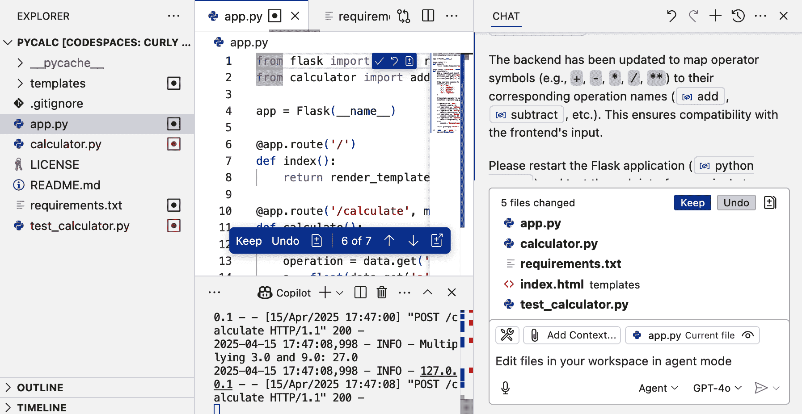

###### 图 4-25\. 迭代后准备就绪

图 4-26 显示了 Copilot 代理创建的实际计算器代码 Web 应用界面的最终结果。正如你所见，它与提供的参考图像非常相似，并且按预期工作。此外，请注意，根据添加处理指数函数的提示，Copilot 生成的 Web 应用界面有一个计算器按钮（第一行从左数第二个），用于执行指数（**），这在原始图像中并不存在。


###### 图 4-26\. 最终 Web 应用

Copilot Vision，连同 NES 和代理模式，无疑可以简化代码的创建和更新。但当然，你需要确保当你生成的代码没有按预期工作的时候，你能找出问题所在。为了帮助这种情况，我们将简要讨论 Copilot 如何帮助你进行调试。

# 使用 Copilot 进行调试

我们之前讨论了几个对帮助调试问题有用的 Copilot 功能。我们谈到了`/explain`命令，它可以帮助解释可能存在问题的代码，以及`/fix`命令，让 Copilot 为错误提出修复建议。Copilot 还有一些其他功能可能很有帮助。

在 VS Code 中，Copilot 可以帮助设置和自定义调试配置。例如，你可以使用`/startDebugging`快捷命令创建一个`*launch.json*`文件（如果不存在的话），如图 4-27 所示。同样，这也可以通过聊天中的提示来完成。


###### 图 4-27\. 使用 `/startDebugging` 生成启动配置

同样的 `/startDebugging` 命令也可以用来启动调试会话。在运行命令时，如果没有找到合适的启动配置，Copilot 会首先生成一个。在同一个对话中，Copilot 通常会包含一个您可以点击的按钮，以启动实际的调试过程（图 4-28）。

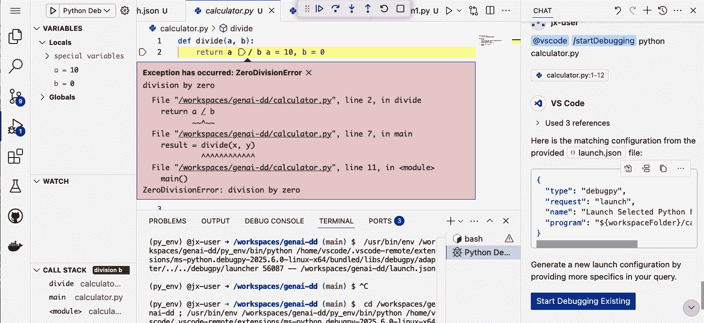

###### 图 4-28\. Copilot 的调试会话

在某些 IDE 中，如 Visual Studio，Copilot 集成包括一个 *异常助手*。这意味着如果在调试过程中发生 `IndexOutOfRangeException` 等异常，将显示一个弹出窗口，并提供“询问 Copilot”选项。Copilot 将提供错误解释、建议的代码修复，甚至可以直接在您的 IDE 中预览并应用修复。有关如何使用此功能的更多详细信息，请参阅 [文档](https://oreil.ly/QopeF)。

如果您在 Visual Studio 2022 的测试资源管理器中进行单元测试，您将有一个“使用 Copilot 调试”按钮可用。使用此功能时，如果测试失败，Copilot 会执行以下操作：

+   生成全面的调试计划

+   设置断点

+   监视关键变量

+   引导您完成调试过程

在此过程中，Copilot 会分析断点处的变量值，在反馈循环中提供指导和建议。

# IDE 特定功能

Copilot 的一些功能仅在特定 IDE 中可用。在撰写本文时，异常助手和测试资源管理器中的“使用 Copilot 调试”选项仅在 Visual Studio 中可用（在其他 IDE 如 VS Code 中不可用）。

Copilot 在某些 IDE 中还提供另一个名为 `copilot-debug` 的命令。您可以从终端运行此命令并使用您的应用程序启动调试会话。以下是一个示例：

```py
copilot-debug node app.js
```

# copilot-debug 问题

虽然 `copilot-debug` 在终端中可能很方便，但在某些情况下它似乎会 *卡住*，等待 IDE 连接。如果您在运行它时遇到问题，请尝试 `/startDebugging` 命令或 IDE 内置功能来运行调试会话。

最后，您还可以使用另一种技术来调试问题，这与我们之前讨论的 Copilot 视觉功能相关。您可以让 Copilot 从截图调试问题。

假设我们有一个简单 C# 代码的截图（如图 图 4-29 所示），保存为文件 *Screenshot 2025-04-28 at 12.37.05 PM.png*。

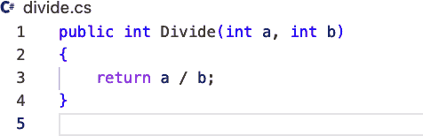

###### 图 4-29\. C# 代码的截图

我们可以将该文件附加到我们的聊天对话框中，然后要求 Copilot 帮助我们调试其中任何问题。图 4-30 显示了一个可能的提示。


###### 图 4-30\. 从截图进行调试的提示

在处理提示和截图后，Copilot 通过详细说明可能由除以零条件导致的未处理异常，并建议解决该问题的代码来响应(图 4-31)。

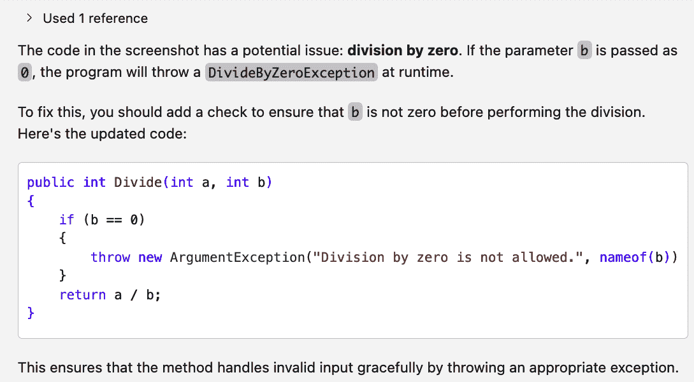

###### 图 4-31\. 分析截图的结果

最终，无论你是否利用 Copilot 内置的调试功能，聊天界面仍然是你的最佳工具之一。当你遇到问题且不确定为什么会出现时，尝试通过查询询问 Copilot。记住，像“为什么这个 API 调用对有效输入失败？”这样的具体查询比模糊的请求能产生更好的结果。

# 结论

在本章中，我们探讨了几个高级编辑和工作流程功能，包括 NES、Copilot Edits、Copilot 代理模式和 Copilot Vision。如果你有一组有限的更改，决定使用前三个中的哪一个可能会令人困惑。表 4-1 提供了一些尝试澄清何时使用每个功能的建议。

在范围方面，可以这样简单地思考不同之处：

+   NES 在代码编辑级别（单个文件）上运行。

+   Copilot Edits 在项目会话级别（多个文件）上运行。

+   代理模式在系统级别（代码 + 终端 + 测试）上运行。

对于快速的内联修复，NES 提供即时建议。Copilot Edits 适用于引导的多文件更改。代理模式处理完整的开发生命周期任务，包括代码更新和创建、验证和执行。

在所有这些功能的基础上，Copilot 通过保持/撤销机制和 *回滚* 变更的能力为开发者提供控制。

Copilot Vision 允许 Copilot 从图像中提取信息，例如问题的截图、设计图、应用程序界面等等。有了提取的信息，Copilot 可以回答有关图像的问题，进行分析，根据图像创建文本或代码，或者利用图像的一部分来解决问题或完成任务。该功能的使用非常简单，只需将图像粘贴/拖放到聊天输入区域即可，无论你处于哪种聊天模式。

关于代理模式，还有一个关键点需要说明。AI 代理的能力、实用性、与环境交互的能力以及处理各种任务的可适应性正在不断增长。预计 Copilot 的代理 AI 能力将继续扩展和增长，并用于 IDE 和 Copilot 界面的其他部分。只要提供适当的提示和工具，代理组件能够做的事情实际上是没有限制的。

Copilot 还包括帮助调试的工具，例如 `/startDebugging` 命令的快捷方式。你甚至可以让 Copilot 分析和调试截图。结合之前讨论的其他功能，这些工具可以帮助你更快地确定问题的原因。然而，需要注意的是，并非所有 Copilot 调试功能都在所有 IDE 中提供。你最好的选择仍然是向聊天界面中的 Copilot 提出关于问题的具体 *为什么* 问题。

在掌握了 Copilot 的基本和高级用法这个坚实基础之后，我们可以继续探讨它可以帮助完成的一些特定任务，例如测试生成、文档编写和代码翻译。这些功能可能是最宝贵的，可以帮助您减少在常规任务上的时间投入，让您有更多精力专注于编写代码的有趣和愉快部分。我们将在接下来的几章中讨论如何利用 Copilot 来处理这些任务，从第五章开始，我们将探讨如何使用 Copilot 进行测试。第五章。
