# 第六章：使用 Copilot 文档和解释代码

作为开发者，我们都知道，拥有良好的代码文档对于我们的代码至关重要。代码库中的文档使得代码在长期内更容易理解、审查和维护。代码中的文档是代码整体质量以及由代码构建的产品质量的关键贡献者。

然而，我们也知道，花费时间和精力来创建良好的文档可能会显得繁琐，并且可能感觉比编写代码本身更有优先级。因此，继续探讨 Copilot 如何在你需要编码建议和回答问题的主题之外提供帮助，让我们看看它如何帮助自动化这项任务。

在本章中，我们将探讨使用 Copilot 文档功能的一些方面，包括通过编辑器和聊天界面生成文档。但我们还将向您展示如何利用 Copilot 为可能未考虑过的用例生成内容，例如 API 的外部文档、功能文档等。

我们还将探讨如何使用 Copilot 解释代码。虽然这是 Copilot 经常被忽视的功能，但它对于帮助所有级别的工程师理解代码和算法具有巨大的潜力。一些有益的用例包括解释来自不熟悉语言或框架的代码、通过解释检查代码的逻辑，以及利用 Copilot 解释终端中发生的命令。

让我们深入探讨并开始了解如何在整个开发周期中利用 Copilot 的文档功能。

# 记录内容

许多开发者知道他们可以使用 Copilot 的文档功能来生成代码中的头部文档和注释。但实现这一点的确切机制可能会令人困惑。你可以使用快捷函数，但这些功能有限。在本节的第一个部分，我们将重点介绍如何最简单地通过 Copilot 的聊天界面生成程序文档。

除了基本的“文档化我的代码”功能之外，Copilot 还可以用于多种更广泛的文档任务。它可以生成特定框架的文档（如 Swagger），面向开发者的 API 文档，甚至功能文档。在本节的下半部分，我们将介绍那些可以让你利用 Copilot 的更多功能进行不同类型文档的扩展用例。但让我们从基础开始。

## 在行内生成文档

这里是一个函数的代码示例（用 Go 语言编写），该函数为自定义资源创建一个新的 Kubernetes 服务：

```py
func newServiceForPod(cr *roarappv1alpha1.RoarApp) *corev1.Service {

    strPort := strconv.Itoa(nextPort)
    labels := map[string]string{
        "app": cr.Name,
    }

    return &corev1.Service{
        ObjectMeta: metav1.ObjectMeta{
            Name:      cr.Name + "-service-" + strPort,
            Namespace: cr.Namespace,
        },
        Spec: corev1.ServiceSpec{
            Selector: labels,
            Ports: []corev1.ServicePort{{
                Protocol:   corev1.ProtocolTCP,
                Port:       8089,
                TargetPort: intstr.FromInt(8080),
                NodePort:   int32(nextPort),
            }},
            Type: corev1.ServiceTypeNodePort,
        },
    }
}

```

为此函数生成行内文档的最直接/最短路径是通过*Meta*-I 键组合调用行内聊天界面，并使用快捷命令`/doc`，如图 6-1 所示。


###### 图 6-1：使用快捷键`/doc`命令

然后，Copilot 将为该函数生成基本的文档。这很可能只包括函数上方的注释，如以下列表和 图 6-2 中所示：

```py
// newServiceForPod creates a new Kubernetes Service resource for a 
given RoarApp custom resource.
// The Service is configured as a NodePort service, exposing a 
specific port for external access.
//
// Parameters:
//   - cr: A pointer to a RoarApp custom resource instance.
//
// Returns:
//   - A pointer to a corev1.Service object configured with the 
specified labels, ports, and namespace.

```


###### 图 6-2\. 生成的文档结果

这在它所达到的范围内是有用的——添加了关于函数目的、参数和返回值的注释。所缺少的是函数 *主体* 中的任何附加注释或文档。即使我们提供了更广泛的命令，如 `add doc to my code`，Copilot 也会默认使用 `/doc` 命令，我们将会得到类似的结果。目前，这适用于我们使用的任何聊天界面。

回想一下，当直接在编辑器中工作时，Copilot 旨在提供最小化、快速的回应，这些回应不会打断工作流程，并且可以轻松地审查、接受或丢弃。

通常情况下，如果我们希望或需要从 Copilot 获得更实质性的回应，我们可以使用独立的、专门的聊天界面。这同样适用于生成文档，正如你将在下一节中看到的。

## 通过聊天生成文档

如果我们切换到独立的聊天界面，并给 Copilot 同样的指示来添加我们的代码文档，我们会得到更广泛和详细的回应（图 6-4）。

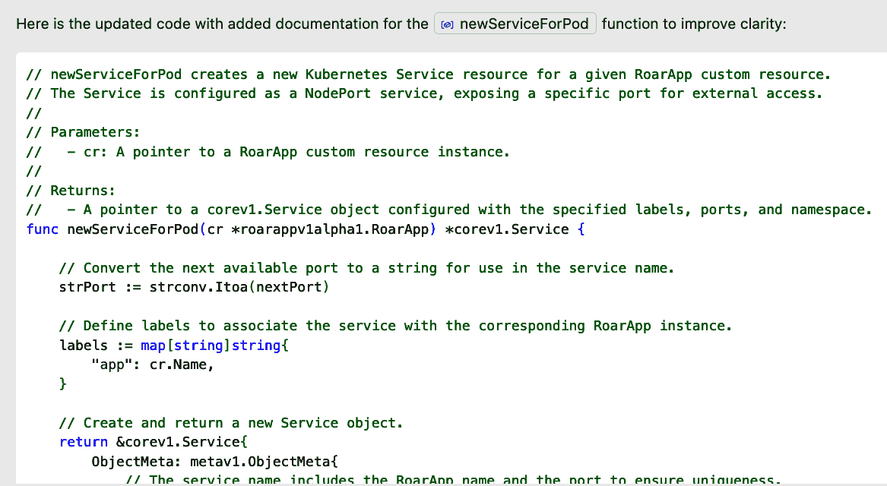

###### 图 6-4\. 在主聊天中告诉 Copilot 添加代码文档

带有注释的完整列表可在 [本书的 GitHub 仓库](https://oreil.ly/zHnkm) 中找到。下一列表中分享了一些摘录。你可以看到，Copilot 不仅插入了大量头部注释，还在函数体中添加了多个注释：

```py
// newServiceForPod creates a new Kubernetes Service resource for a
 given RoarApp custom resource.
// The Service is configured as a NodePort service, exposing a 
specific port for external access.
//
// Parameters:
//   - cr: A pointer to a RoarApp custom resource instance.
//
// Returns:
//   - A pointer to a corev1.Service object configured with the 
specified labels, ports, and namespace.
func newServiceForPod(cr *roarappv1alpha1.RoarApp) *corev1.Service {

    // Convert the next available port to a string for use in the 
service name.
    strPort := strconv.Itoa(nextPort)

    // Define labels to associate the service with the corresponding
 RoarApp instance.
    labels := map[string]string{
        "app": cr.Name,
    }

    // Create and return a new Service object.
 ...

```

让我们更进一步。由于 Copilot 聊天可以理解自然语言，我们可以提交一个提示来生成文档，以帮助阅读代码的任何人。我们可以在聊天中告诉 Copilot：“详细注释所选函数，以便任何人都能理解它在做什么。”从原始（未注释）函数中产生的变化可以在 [GitHub 仓库](https://oreil.ly/jTDZV) 中看到。除了一些措辞上的变化外，主要的不同之处在于每个主要部分都增加了额外的注释行，讨论了这些部分的使用或管理方式。还有一些注释被添加到可能需要更好地理解标识符的行尾。图 6-5 展示了这些变化的摘录。


###### 图 6-5\. 执行详细注释命令后的更新行

这是一个改进。如果我们想要更多，我们可以具体针对函数体中的每一行。以下是我们可以用作此目的的提示：“详细注释函数体，以便任何人都能轻松理解每一行在做什么。”

使用这个提示，我们得到了一个更详细的函数体注释集，其中对几个元素有更详细的注释。完整的列表可在[网上](https://oreil.ly/rZBRV)找到，但图 6-6 展示了差异的摘录。


###### 图 6-6\. 更详细的注释

# 注释与文档

你可能已经注意到，我们正在告诉 Copilot 对我们的代码进行**注释**而不是**文档化**。由于代码中的文档是通过注释完成的，因此在这种情况下，这两个术语都可以用于提示。严格来说，当我们要求 Copilot 提供文档时，它可能会默认只在方法/函数的开始处创建一个注释块，就像我们之前看到的那样。

最终，你可以将之前的提示合并为一个，以完成所有修改。以下是一个似乎效果很好的示例：

```py
verbosely document the function header and body so that anyone can easily
understand what the overall function and each line is doing
```

Copilot 文档功能的一个其他优点是它可以识别代码中是否有可以与其一起使用的文档框架。

## 生成与框架兼容的文档

不同的编程语言有自己的文档风格。例如，C# 有 XMLDoc，Python 有 pydoc，JavaScript 有 JSDoc。如果 Copilot 识别出代码是在与标准文档工具关联的语言中，它将默认创建为该工具准备的注释。这对于与开发环境和其他工具的集成非常有用，并且通常比普通注释更受欢迎。

例如，考虑一个包含单个方法的 Java 类定义，其开始部分如下所示：

```py
package com.demo.util;

import org.codehaus.jettison.json.JSONArray;
import org.codehaus.jettison.json.JSONObject;
import java.sql.ResultSet;
import org.owasp.esapi.ESAPI;

public class ToJSON {

    public JSONArray toJSONArray(ResultSet rs) throws Exception {

            JSONArray json = new JSONArray(); //JSON array that will
 be returned
            String temp = null;

            try {

                 //we will need the column names, this will save the
 table meta-data like column names.
                 java.sql.ResultSetMetaData rsmd = rs.getMetaData();

```

如果我们告诉 Copilot “文档化这个类”，它将添加一个广泛的注释集。完整的列表可在[网上](https://oreil.ly/LCxOH)找到，但以下是一些摘录：

```py
package com.demo.util;

// Importing necessary libraries for JSON processing and SQL result
 handling
...
import java.sql.ResultSet;
// Importing ESAPI for security purposes, though it's not used in
 the provided snippet
import org.owasp.esapi.ESAPI;

/**
* The ToJSON class provides a method to convert a ResultSet from a 
database query
* into a JSONArray. This is useful for creating JSON APIs that 
interact with relational databases.
...
*/
public class ToJSON {

    /**
     * Converts a given ResultSet into a JSONArray.
     * Each row in the ResultSet will be converted into a JSONObject,
     * and each column in the row will be added to the JSONObject 
...
     *
     * @param rs The ResultSet to be converted. This ResultSet is 
typically obtained from executing
     *           a SQL query against a database.
     * @return JSONArray containing the data from the ResultSet. 
Each element in the JSONArray
     *         corresponds to a row in the ResultSet, represented as
 a JSONObject.
     * @throws Exception If there is an error during the conversion 
process. This could be due to
...
     */
    public JSONArray toJSONArray(ResultSet rs) throws Exception {
        JSONArray json = new JSONArray(); // Initializes the JSON 
array that will be populated and returned
        String temp = null; // Temporary string to hold data, not 
used in the provided snippet
...

```

类定义上方的头部注释以及其开始部分是以与 Javadoc 工具处理兼容的形式生成的。`/**` 和 `@param`、`@return` 以及 `@throw` 这些部分都是 Javadoc 会使用来为类生成 HTML 文档的格式化元素。图 6-7 展示了由 Copilot 添加的注释生成的示例 Javadoc。

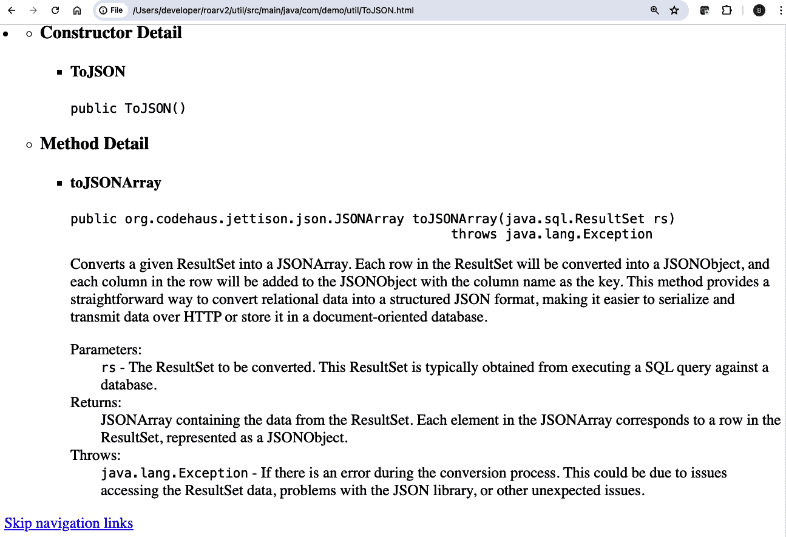

###### 图 6-7\. 从 Copilot 注释生成的 Javadoc

除了生成基本文档框架的文档之外，我们还可以使用 Copilot 来满足另一个常见需求：文档化 API。

## 生成 API 文档

如果你的项目配置了像 [Swagger](https://swagger.io) 这样的 API 文档框架，你可以让 Copilot 为你的 API 生成相应的 Swagger 文档。让我们看看一个例子。

假设我们有一个简单的应用程序，用于管理一家公司的员工目录。该应用程序是用 Java 编写的，并且已经配置了 Swagger。我们可以告诉 Copilot 为 API 生成可打印的 Swagger 文档，并引用特定的文件，提示为“create print-ready Swagger documentation for the APIS in #file:EmployeeController.java。”

# `print-ready`

我们在提示中使用术语*print-ready*以确保 Copilot 生成实际的文档格式，而不是尝试重新生成代码注释。我们也可以使用诸如*publish-ready*或*publishable*之类的术语。

Copilot 的响应如图 6-8 所示，完整输出可在本书的[GitHub 仓库](https://oreil.ly/Kj8Lj)中找到。

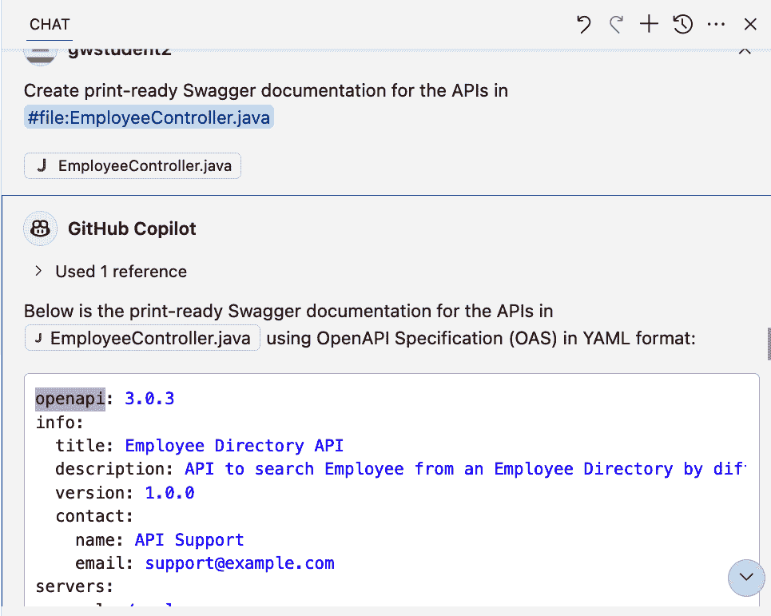

###### 图 6-8. 从代码生成的 Swagger 文档

使其工作（除了`print-ready`描述符之外）的关键是，通过`#file`选择器（或多个选择器，如果您需要引用多个文件）指定您指向 Copilot 的文件。简单地将 Copilot 指向整个工作空间并使用类似的提示（例如，“@workspace create Swagger documentation for the APIs”）通常会导致 Copilot 解释如何在您的项目中创建 Swagger 文档，而不是将其输出。

## 创建功能文档

Copilot 还能够创建面向外部用户的功能性文档。例如，我们可以利用前面章节中使用的相同 API 代码。在这种情况下，我们的提示可能看起来像这样：“create functional documentation explaining the various public APIs in #file:EmployeeCon⁠troller.java。”

图 6-9 显示了从提示中生成的实际功能 API 文档的开始。请注意，输出包括一些散文风格，以易于阅读的格式呈现，但详细说明了 API 结构。这里没有显示，但 Copilot 还概述了它将遵循的一组步骤，包括*识别公共 API*、*方法签名*和*端点映射*。完整输出可在本书的[GitHub 仓库](https://oreil.ly/lV7jV)中查看。

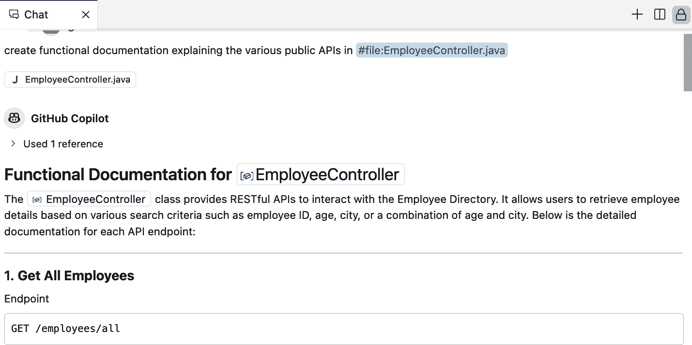

###### 图 6-9. 生成的功能文档

通常，生成此类文档的注意事项与上一节生成 API 文档时的注意事项相同：在提示中指定特定文件以供操作，而不是尝试让 Copilot 针对整个工作空间操作。然而，我们可以通过使用`@workspace`来提出一些一般性问题，并获得良好的总结性文档。例如，如果我们询问“@workspace what are the API’s parameters and what does it return?”，我们会得到有用的总结。完整列表可在[在线](https://oreil.ly/sXKOv)找到，并在图 6-10 中展示了摘录。

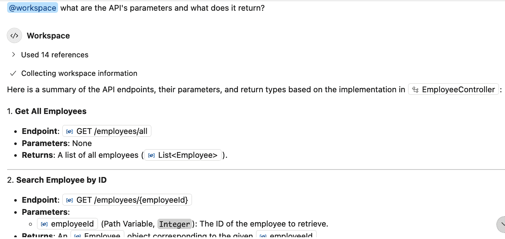

###### 图 6-10. 查询 API 参数

## 从代码中提取摘要文档

Copilot 还可以用于从某些类型的项目中提取关键文档的高级摘要。这对于快速理解项目代码库的重要细节非常有用。参考前述章节中的 Java Swagger 项目，我们可以通过提示“@workspace extract the key documentation from the code”从中收集关键信息。

在我们的案例中，Copilot 从*pom.xml*文件、*README.md*文件以及相关的**.java**文件中提取数据。然后 Copilot 提供了关于项目结构、依赖关系、Swagger 配置和测试的关键高级细节。图 6-11 展示了摘录内容，完整列表可以在[GitHub](https://oreil.ly/wSmbs)上查看。

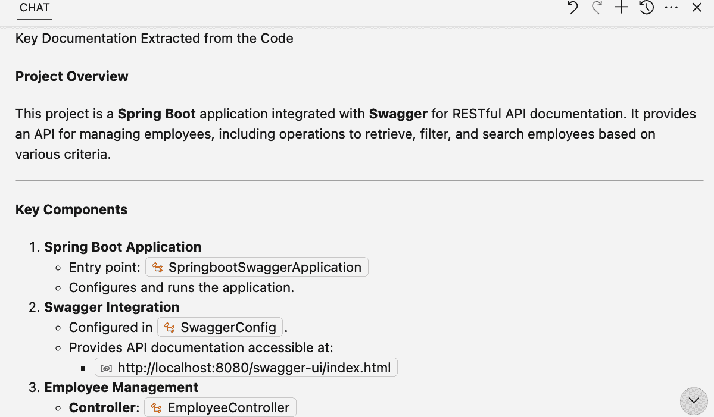

###### 图 6-11\. 从代码中提取的关键文档

这就完成了我们对 Copilot 在生成文档方面各种帮助方式的调查。让我们转向 Copilot 提供的另一个类似但可能更为重要的功能：解释内容。

# 解释内容

除了提供代码功能的文档外，Copilot 还能提供它所处理和生成的内容的解释。这个功能在多个用例中可能非常有用：

+   理解你新接触到的编程语言中的代码

+   理解生成的代码和约定

+   总结代码逻辑

+   解释代码中可能出错的地方

+   解释在终端中做了什么

+   解释如何在终端中做某事

我们将在本节中简要探讨这些领域的每一个。以下是一些适用于所有这些领域的常见点：

+   提示是关键。正确地获取提示并使用它清楚地表达你的需求，是 Copilot 能够很好地解释某事的最重要先决条件。

+   虽然我们通常会在提示中使用“解释”作为关键词，但这并不是必需的。你也可以根据需要询问“为什么”、“如何”或其他类型的问题。

## 理解你新接触到的编程语言中的代码

假设你是一名 Python 程序员，但你刚刚被分配了一个用 Go 语言实现新项目的任务。Copilot 可以帮助你创建代码，以及理解使用 Go 语言的关键点。例如，你可以给 Copilot 一个提示，比如：“我是一个 Python 程序员。我需要了解哪些最重要的内容来编写 Go 代码？”

当我在写这一章时被问到这个问题时，Copilot 提供了以下 12 个领域的信息：

+   静态类型

+   编译

+   语法差异

+   包和导入

+   函数

+   错误处理

+   并发

+   结构体和方法

+   指针

+   标准库

+   工具

+   接口

在某些情况下，Copilot 还展示了简短的代码片段来阐述观点，并以“理解这些关键差异将帮助你更顺利地从 Python 过渡到 Go”结束解释。你可以在 GitHub 上查看整个聊天输出[链接](https://oreil.ly/roJZB)。

你还可以选择代码的特定部分，并使用`/explain`快捷命令让 Copilot 解释它们是如何工作的。你甚至可以告诉 Copilot 将现有代码翻译成新语言。然而，一如既往，你应该验证 Copilot 提供的任何建议或回应是否准确且适用于你的情况。

Copilot 不仅有助于理解新语言的基础，还能突出该语言使用的约定以及该语言中自动生成代码的目的。

## 理解生成的代码和约定

假设你是 Kubernetes 和 Go 的新手，需要创建一个 Kubernetes 操作员来管理自定义资源。你可能会用[Operator SDK](https://oreil.ly/Lfz8O)来生成 Go 项目中起始结构。

SDK 自动生成实用文件，包括像*zz_generated.deepcopy.go*这样的神秘命名的文件。你可能首先想知道这个生成的文件是用于什么目的。为了得到答案，你可以简单地询问 Copilot，“#file:api/v1alpha1/zz_generated.deepcopy 中的代码是用于什么的？”Copilot 的回应（如图 6-12 所示的部分摘录）提供了一个介绍，然后对其目的进行了分解。整个回应可以在 GitHub 上找到[链接](https://oreil.ly/I0-3j)。


###### 图 6-12. Copilot 解释代码的用途

在这类回答中，Copilot 通常会在输出的末尾提供一个总结，这有助于快速抓住回答的要点。在这种情况下，Copilot 指出，“总之，zz_generated.deepcopy.go 是一个自动生成的文件，为 Kubernetes 中的自定义资源类型提供必要的深度复制函数，确保对这些资源的适当处理和操作。”

你可能也会好奇代码为什么会被命名为这种方式。我们可以用类似“为什么这个文件以 zz_ 开头命名？”这样的提示来询问 Copilot 关于命名约定。Copilot 会提供一个包含原因列表的帮助性、对话式的回答，如图 6-13 所示。

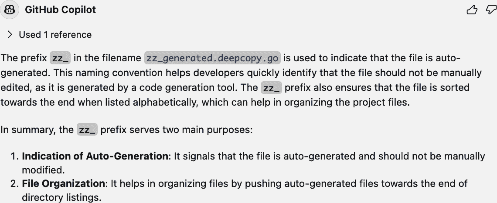

###### 图 6-13. Copilot 对 zz_ 命名约定的解释

除了理解一种语言的一般约定和主要主题外，Copilot 还可以帮助解释一组代码的整体逻辑。

## 解释代码某部分所使用的逻辑

总结代码逻辑在多种用例中可能很有帮助，包括以下这些：

+   快速掌握你继承或必须维护的代码

+   了解你新接触的语言或框架编写的代码

+   通过审查代码来检查你的理解

+   为代码审查、拉取请求等提供另一种解释代码的方法。

目标是让 Copilot 以一种非语言特定的方式概述一般逻辑和相关部分，例如使用的主要组件。我们希望 Copilot 的解释以对话的语气呈现，就像我们与另一位开发者互动一样。

实际上，你使用的提示可能会有所不同，但以下是一个针对我们一直在引用的相同控制器文件的示例：“@workspace: summarize the logic in #file:controllers/roarapp_controller.go。”

从这个提示中，Copilot 提供了输出，首先是对代码预期功能的整体解释：“在 Kubernetes 集群中协调...自定义资源的状态。”

然后，Copilot 提供了文件中关键组件的总结以及每个组件的作用。这包括数据结构、注解和函数。图 6-14 展示了输出摘录，完整的输出可以在[GitHub](https://oreil.ly/5oG3v)上查看。

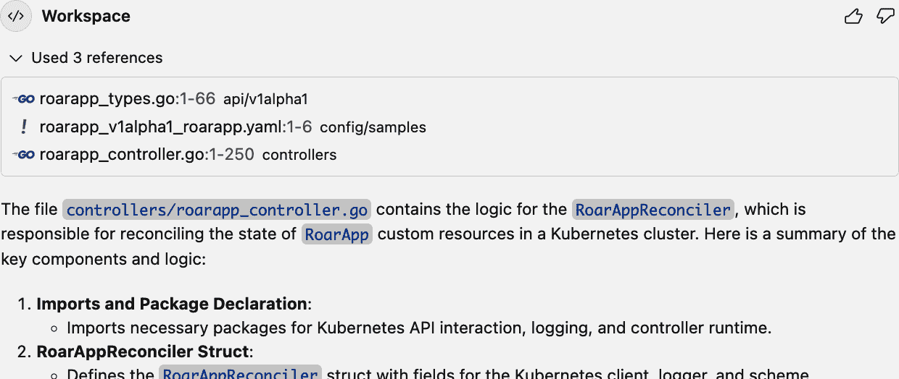

###### [图 6-14]。Copilot 总结文件中使用的逻辑

另一个值得考虑的好提示是简单地用*逻辑*替换关键字*工作流程*，例如：“@workspace: summarize the workflow in #file:controllers/roarapp_controller.go。”这应该会产生一个稍微简单一点的响应，但包含关于各种组件的类似信息。

另一种有趣的学习和理解代码的方法是反转传统的*解释*用例。我们不是要求 Copilot 解释代码是如何或做什么的，而是可以询问代码可能存在的问题。

## 解释一组代码可能出什么问题

当让 Copilot 解释代码时，另一种方法是让它识别代码中任何潜在的问题。这可以用于你编写的代码、正在调查的代码或继承的代码等。

回到我们在本章中使用的 Kubernetes 自定义资源示例，我们可以选择询问 Copilot 在编辑器中实现自定义控制器时，代码可能出什么问题。我们使用的提示是：“@workspace: explain what might go wrong with the code in #file:controllers/roarapp_​controller.go。”

# 使用@workspace 和#file

记住，我们可以在提示字符串中使用变量如`#selection`或`#file`来让 Copilot 关注它响应时想要考虑的上下文。但在某些情况下，我们也可能需要使用`@workspace`标识符来确保 Copilot 查看相关部分，并考虑可能影响此代码的全面情况。

然后，Copilot 提供了一个详细的答案，列出了几个需要关注的区域，包括以下内容：

+   错误处理

+   资源冲突

+   重试逻辑

+   资源清理

+   并发问题

+   记录日志

+   验证

+   RBAC 权限

可以在[GitHub 仓库文件](https://oreil.ly/v7I75)中查看完整的输出。

现在我们已经了解了 Copilot 可以以不同方式解释代码中发生的事情的不同方法，让我们通过查看 Copilot 如何帮助在另一个领域——终端中解释事物来结束。

## 解释终端中的项目

Copilot 能够通过`#terminalLastCommand`关键字访问终端来解释关于最后一个命令的详细信息。例如，假设我们运行了如图所示的`ps`命令作为我们最近的命令：

```py
@techupskills ➜ /workspaces/op-new (main) $ ps -aux
USER         PID %CPU %MEM    VSZ   RSS TTY      STAT START   TIME 
COMMAND
codespa+       1  0.0  0.0   1136   640 ?        Ss   14:30   0:00 
 /sbin/docker-init
codespa+       8  0.0  0.0   7236  1920 ?        S    14:30   0:00
 sleep infinity
root          23  0.0  0.0  12196  3484 ?        Ss   14:30   0:00
 sshd: /usr/sbin/s
codespa+     338  0.0  0.0   2616  1536 ?        Ss   14:30   0:00
 /bin/sh
```

如果我们想要更多关于此命令正在做什么的详细信息，我们可以用类似“解释#terminalLastCommand”的提示查询 Copilot。如您在图 6-15 中看到的，Copilot 识别了最后一个命令，并提供了关于该命令、其选项及其输出的解释。

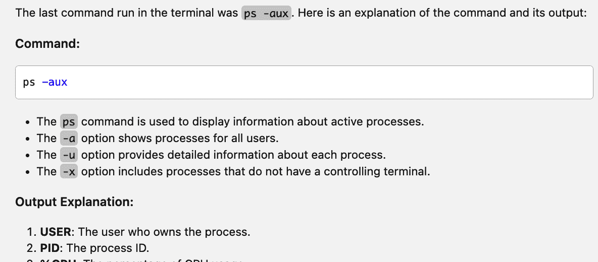

###### 图 6-15\. Copilot 解释最后一个终端命令

完整输出可以在[GitHub](https://oreil.ly/yCMOO)中查看。

Copilot 也可以解释终端中选定的内容。例如，如果我们之前运行了`git status`命令，我们可以突出显示它，并要求 Copilot 使用提示“解释#terminalSelection 中的命令”来解释它。Copilot 将提供相关信息，如图图 6-16 所示。


###### 图 6-16\. 解释终端中选择的命令

您不必选择一个命令来解释。您也可以选择终端中显示的任何文本，例如命令的输出。假设我们在`git status`命令的输出中选择了文本“您的分支与‘origin/main’保持最新”。由于标识符已经引用了终端中选定的任何内容，我们可以将提示缩短为“解释#terminalSelection”。

然后，Copilot 将解释所选短语的含义。图 6-17 显示了此提示的输出摘录。


###### 图 6-17\. 解释在终端中选择的`git status`命令

您也可以让 Copilot 解释如何通过终端做某事。这是我们本章最后部分的主题。

## 解释如何在终端中做某事

Copilot 可以提供在终端中执行操作的流程和命令。例如，我们可以询问 Copilot 如何在我们的 GitHub 仓库中创建一个新的分支。我们可以利用`@terminal`上下文，并提示 Copilot：“@terminal 我如何为我的 GitHub 仓库创建一个新的分支？”

作为回应，Copilot 提供了通常的对话流程描述以及您可以在终端中运行的实际命令。图 6-18 显示了输出的一部分，您可以在[GitHub](https://oreil.ly/0t1il)中查看完整内容。

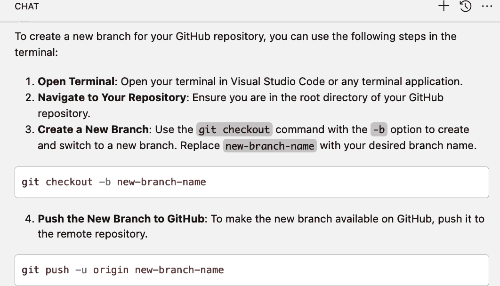

###### 图 6-18\. 解释如何通过终端创建新分支

# 类似的结果

您也可以使用引用“命令行”的提示来获得类似的结果，例如“我如何使用命令行在我的 GitHub 仓库中创建一个新的分支？”

当你可能不知道要使用哪个命令时，同样的技术也适用。例如，如果我们给 Copilot 查询“@terminal 我如何查看运行中的进程列表？”，它会响应多个可以从终端使用的方案，如图 6-19 所示。

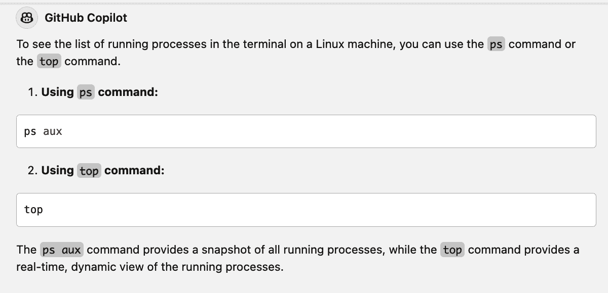

###### 图 6-19\. 如何通过终端查看运行中的进程

# 结论

在本章中，我们探讨了 Copilot 如何帮助您进行文档和解释。在基本层面上，Copilot 可以通过在源代码中插入注释来记录您的代码。通常，`/doc` 命令提供标题文档。您可以通过包含特定指示的提示来告诉 Copilot 生成更广泛的注释，例如“详细注释”。这说明了 Copilot 的一个有用的工作技巧：如果您没有得到期望或需要的结果，尝试使用更详细、更冗长的提示。如果您不希望看到建议的更改，可以拒绝并继续迭代您的提示。

除了基本的注释外，Copilot 还可以为特定用例生成更广泛的文档。例如，它可以生成适合（经过审查后）与他人分享的 API 文档和功能文档。这可以显著节省在更少自动化的方式下创建此类文档所需的时间。

与其文档功能类似，Copilot 还可以解释代码库的许多方面。此功能可用于解释使用新语言或框架所需的一般概念和原则，并提供对您可能不熟悉的约定的解释。

但，最重要的是，Copilot 可以解释和总结一组代码的逻辑和处理的运作方式。如果您试图学习或必须维护您不熟悉的代码，这会特别有用。

解释功能的较少见用途可以用来解释一组代码可能出错的情况。这是一种让 Copilot 事实上 *审查* 代码并寻找潜在差距和问题的简单方法。如果您试图评估代码的弱点并确保易受攻击的部分得到处理，这会非常有用。

最后，我们探讨了使用 Copilot 的解释功能与终端结合的能力。这可以分为两个类别。第一类是选择一些输出或使用特殊标识符引用最后一个终端命令，让 Copilot 解释其含义。第二类是询问 Copilot 在终端中如何做某事，并让它提供对话式的解释，以及完成该任务在终端中运行的精确命令。

虽然我们已经看到了 Copilot 的功能和范围是多么有价值，但重要的是要记住，它可能会不准确，并作为结果提供过时信息。这是因为 Copilot 的知识库仅与用于训练其底层模型的训练数据的最新程度相匹配。

在下一章中，我们将探讨如何处理基于过时信息的 Copilot 建议和响应，以及如何应对这些情况。
