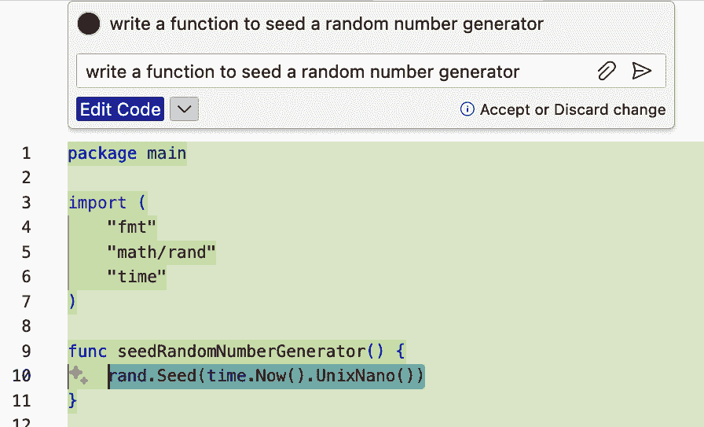
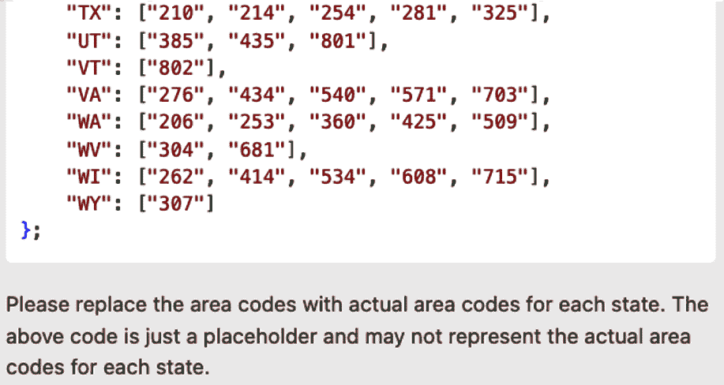
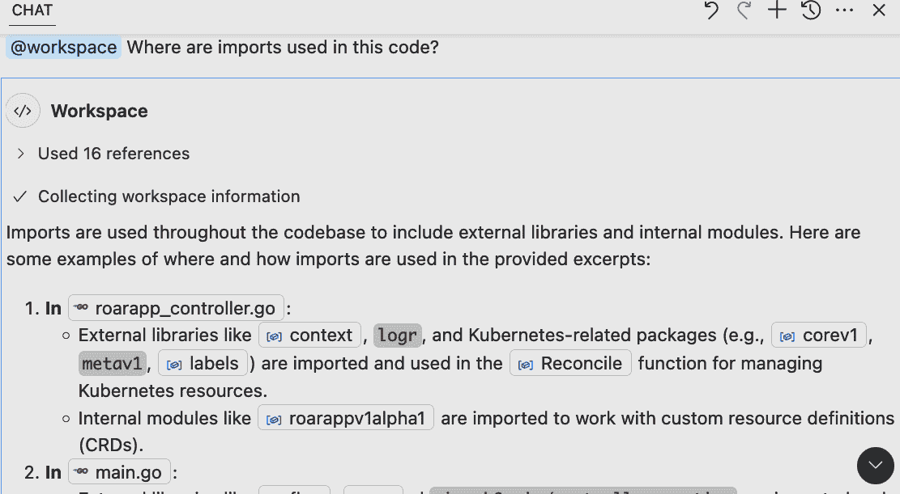
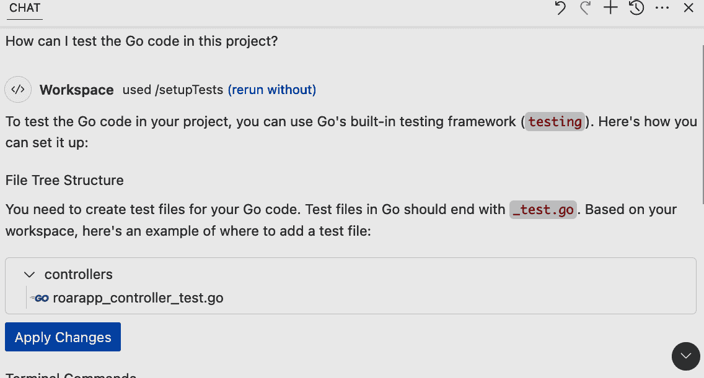
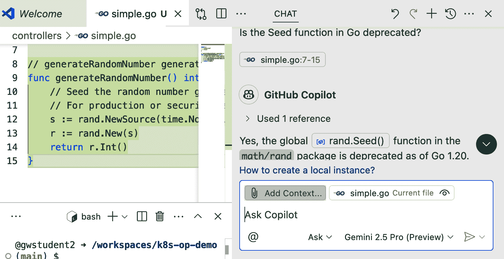
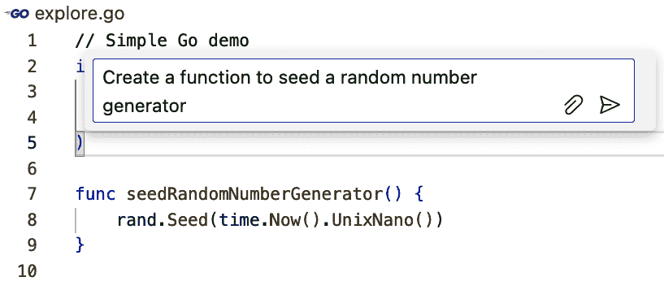
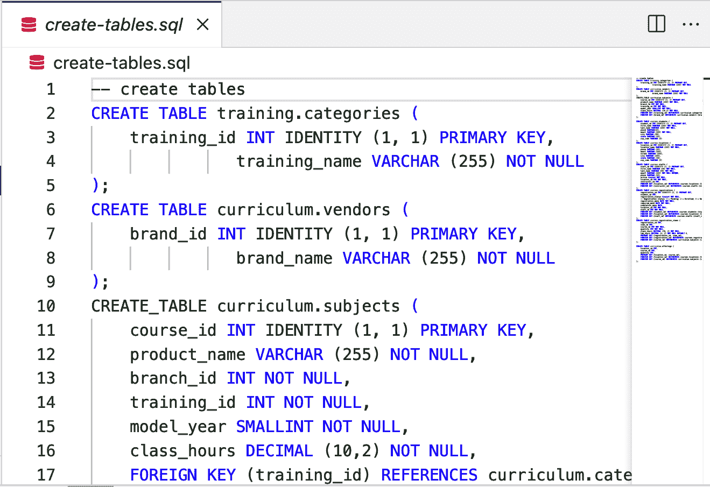

# 第七章：保持 Copilot 及时和相关性

GitHub Copilot 提供的功能范围和交互性真正令人印象深刻。然而，如果它们不及时且不相关，它生成的响应有时可能不那么令人印象深刻（也不那么有用）。尽管 AI 可能很好，但有时您可能需要采取额外步骤来*引导*它。

例如，在某些情况下，您可能需要指示 Copilot 关注您内容中的特定部分以获得针对性的答案。或者您可能需要增强其训练以获得与您的代码库更相关的响应。您可能还需要特别注意，以便在 Copilot 建议的代码可能过时或引用不再受支持的特性时能够意识到。

在本章中，我们将探讨如何在这些情况下管理与 Copilot 的交互。您可以利用某些策略和功能来帮助确保与 Copilot 的交互具有相关性和及时性。某些方法可以在 Copilot 可能没有意识到最近的变化或引用正确的来源时进行补偿。

所有这些旨在帮助 Copilot 拥有最可用的上下文集，以便为我们所请求的提供最有用的响应。在接下来的几页中，我们将探讨与 Copilot 使用上下文相关的以下领域：

+   上下文起源

+   及时性和相关性可能受到的影响

+   基于用户的应对策略

+   添加上下文以使代码更具相关性

根据其定义，*生成性*意味着在部分基于收集和处理上下文的基础上生成新内容。因此，让我们先回顾一下 Copilot 使用的上下文来源。

# 上下文起源

正如我们在前面的章节中讨论的那样，在 IDE 中，Copilot 从您的即时工作环境中获取上下文——具体来说，是从您工作区中的文件及其相关内容中获取。这包括典型的项目，如文件名、其中的注释以及光标前后方的代码。但 Copilot 还可以从更动态的交互中获取信息，例如您是否接受了它最后的代码建议。通过自动创建您的仓库索引，Copilot 可以更深入地理解您的项目。Copilot 还可以被指示考虑其他内容。

对于在 IDE/编辑器中快速生成编码建议，针对您打开的文件是一种 Copilot 使用的有用策略。这种关注使它能够快速获得一个良好的感觉，了解哪些内容可能是最重要的（因为您可以轻松访问这些文件）。

在此*内联*模式下，Copilot 使用多种策略来确保快速响应。客户端（安装在您界面中的扩展）向模型请求非常少的建议（一到三个）。Copilot 在缓存结果方面非常积极，并在您继续输入时调整建议。它还有一些内置的检查，例如，如果您在行中输入时，它会阻止发送请求，除非光标右侧有空格。然后，我们讨论的索引会根据变化进行更新。

在此模式下，评分还会决定要发送给模型的提示是否甚至值得（值得调用模型）。此决定基于诸如对建议的先前响应等因素。这种方法有助于排除重复的提示或已在代码中存在的提示。

当您切换到聊天界面时，大多数这些策略都不需要。在此界面中，Copilot 有更多时间来生成响应，因此客户端可以请求更多的完成建议。在处理此界面时收集上下文时，您还可以更具体地指示从哪里获取上下文。Copilot 包括聊天变量和聊天参与者（如第三章和其他章节中所述）等方法，以使 Copilot 专注于特定项目。

不论用户在何处工作，客户端都会收集上下文，将其处理成提示，并发送到您选择的模型。在快速验证模型返回的内容并生成所需的一系列响应后，这些响应将显示给用户。如果有多项完成建议可用，响应可以在 IDE 中包括多个选项。

正如刚才提到的快速验证，它涉及快速查找响应中的重复模式或可能表明安全问题（如硬编码凭据）的模式。这些检查是有益的，但它们不能防止可能导致相关性和及时性偏差的其他因素。接下来，让我们看看这些其他因素。

# 及时性和相关性可能受到影响的方式

当您首次打开 Copilot 的聊天界面时，您会收到一个通知：

```py
I'm powered by AI, so surprises and mistakes are possible. Make 
sure to verify any generated code or suggestions, and share 
feedback so that we can learn and improve.

```

此免责声明是对生成式 AI 可能不准确和存在问题的提醒。最终，确保生成的内容正确且相关的是用户的责任。（这也是为什么您应该始终使用标准验证方法，如测试和代码审查，来检查任何使用 AI 辅助生成的内容的理由。）

免责声明是必要的，因为多种挑战可能会影响 Copilot 的建议和响应的及时性和相关性。以下是一些可能的影响因素：

+   训练截止日期

+   幻觉

+   缺乏实时验证

+   错误的上下文

让我们更详细地看看这些。

## 训练截止日期

LLMs 是在训练发生时数据最新的情况下进行训练的。在此日期之后，模型对其训练领域发生的任何变化都没有*内置*知识。您使用该工具的时间距离训练截止日期越远，某些响应和建议过时的可能性就越大。这可能导致 Copilot 生成已弃用的代码或适用于框架或语言旧版本的代码。当然，结果将取决于您选择使用哪个模型。

# 训练频率

如果您想知道为什么这些模型没有保持更及时更新，重要的是要理解它们拥有数十亿个参数和巨大的数据集需要处理以进行任何训练。这需要大量的计算成本和时间来完成。因此，对更广泛的基础训练的更新在多个方面都是昂贵的。

让我们看看一个简单的例子，说明训练截止日期可能带来的挑战（如本写作时 Copilot 表现出的）。我们将请求 Copilot 编写一个在 Go 中为随机数生成器设置种子的函数（图 7-1）。



###### 图 7-1\. 请求 Copilot 在 Go 中创建一个随机数生成器

虽然看起来没问题，并且语法正确，但存在一个问题。`Seed` 函数自 1.20 版本起在 Go 中已被[弃用](https://oreil.ly/D2hpj)。让我们看看 Copilot 是否理解这一点。我们可以在聊天界面中询问它：“Go 中的 `Seed` 函数是否已弃用？” 响应，如图 7-2 所示，显示基于模型的训练，它没有关于该函数已弃用的信息。


###### 图 7-2\. 询问 Copilot `Seed` 函数是否已弃用

虽然该函数不再打算使用，但 Copilot 并未意识到这一点。这说明了关于训练截止日期的观点。我们将在本章后面探讨一些处理这类挑战的方法。

过时的结果代表一类问题；结果曾经是有效的，但现在已经不再有效。当结果看起来在当前上下文中有效，但可能不反映真实数据或引用时，就会出现另一类问题。这些被称为*幻觉*。

## 幻觉

LLMs 易于创建看似合法但实际上并非如此的数据响应。这些被称为*幻觉*。在一般聊天界面中，这可以表现为引用不存在的项目或陈述为事实的事情实际上并不真实。在更关键的系统中，例如威胁检测，AI 模型可能会将某些内容标记为威胁，而实际上并非如此。

在编码的上下文中，幻觉可以采取几种形式：

+   可能引用不存在标识符（名称、变量、常量等）或相关代码的建议

+   可能不准确生成的数据

+   不存在的函数或方法

+   错误的库或 API 使用（或使用根本不存在的库或 API）

+   编造的类型或类

+   可能但错误的业务逻辑

+   对周围代码的糟糕假设

+   实际上没有测试预期行为的测试

尽管第一类中的幻觉在 Copilot 早期可能仍然会出现在输出中，但由于底层模型的改进，它们现在似乎比 Copilot 早期更为少见。这类幻觉（引用不存在标识符或代码）通常更为明显，并且通常可以通过用户审查迅速捕捉到。如果这些幻觉最终被接受并忽略，编译器、代码检查器或其他检查语法的工具可能会在某个时候标记它们。

第二种类型的幻觉（涉及生成数据）更为微妙。部分原因是由于没有对生成数据进行实时自动验证。

## 缺乏实时验证

Copilot 返回的生成数据可能不准确。Copilot 本身有时会提醒您这一点，如图图 7-4 所示。在这种情况下，我们要求 Copilot 生成一个区号到州的映射。完成任务后，Copilot 添加了声明：“上述代码仅作为占位符，可能不代表每个州的实际区号。”



###### 图 7-4\. 关于生成数据准确性的 Copilot 声明

为什么会是这种情况？请记住以下四点：

+   Copilot 在可能包含或不包含准确、实际值的数据上进行了训练。

+   Copilot 正在生成结果以匹配语法和结构。

+   Copilot 不会运行它生成的代码，也不会验证逻辑。

+   Copilot 没有查找和检查数据以查看其是否准确或最新的机制。

前三项是显而易见的。第四项表明 Copilot 没有机制将其生成的结果与其他来源（如网络）进行交叉检查。虽然一些 AI 技术可以利用工具来做这件事，但它们并没有与 Copilot 集成以验证模型的响应。数据可能是正确的，但没有保证。简而言之，Copilot 没有办法知道某件事是真是假。

因此，在使用 Copilot 生成的信息时，您不应假设其正确性。从 Copilot 生成数据更适合需要正确形式但不一定需要正确值的内容，例如测试场景。

# Copilot 扩展

您可以创建 Copilot 扩展，以调用 API 或其他工具来获取针对特定用例的更相关、更及时的信息。您可以选择找到一个现有的扩展，该扩展已经解决了您想要解决的问题，或者自己构建一个。Copilot 扩展在第十章中有详细说明。

您可能遇到的另一个挑战是 Copilot 使用您未打算让它参考的上下文来生成回答。

## 上下文错误

大多数时候，当你通过 IDE 的聊天界面与 Copilot 聊天时，你会在编辑器中有一个活动文件。你也许还选中了文件的一部分。在这些情况下，Copilot 假设这是任何开放性问题（例如“我该如何测试这个？”）所指的主要上下文。

使用 Copilot 那个特定内容可能正是你想要的。或者你可能希望 Copilot 根据不同的文件或活动文件的不同部分来响应。如果 Copilot 假设了不同的上下文，Copilot 的答案可能不是你想要的。

想象你在一个项目中使用多种语言或框架，并且上下文设置与你的提示不匹配。这种项目在 图 7-5 中展示。在这个项目中，我们有一个 Python 文件（*fibonacci.py*）和一个用 Go 编写的文件（*prime.go*），如 IDE 上方左图所示。

在选中 Python 文件（因此用作上下文）的情况下，我们询问 Copilot，“我该如何测试这里的 Go 代码？”Copilot 通过告诉我们上下文与提示之间的不匹配来响应。然后它提供了关于如何进行 Python 测试以与活动文件保持一致的信息。


###### 图 7-5\. 提示中指示错误的上下文

当没有暗示上下文时，可能会出现另一种类型的问题。

## 缺少上下文

如果我们提示 Copilot，且工作区中没有打开的文件，也没有其他内容供其参考，Copilot 通常会提供一个更通用的响应。例如，假设我们有一个包含 Go 代码以实现 Kubernetes 操作符的工作区，我们没有打开任何文件，也没有选中任何内容。现在，我们在聊天中提示 Copilot，“我该如何测试这里的 Go 代码？”

由于没有指明上下文，Copilot 要么会告诉你选择上下文，要么会提供一个关于如何一般性地回答问题的响应。图 7-6 展示了我们刚刚讨论的案例的示例响应。在这里，Copilot 提供了如何一般性地测试 Go 代码的指导。


###### 图 7-6\. 缺少上下文时的通用建议

这种类型的响应也适用于其他类型的查询，例如尝试确定代码库中导入的使用位置（图 7-7）。


###### 图 7-7\. 通用响应的另一个示例

核心问题是，如果没有足够的隐含上下文（打开的文件）或显含上下文（在提示中提供的引用），Copilot 将默认提供通用答案。

当你开始长时间使用 Copilot 时，你将遇到这些问题类别。影响将根据你的具体情况而变化。幸运的是，当你作为用户遇到这些情况时，你可以采取一些策略。

# 基于用户的应对策略

通常，我们有三种策略可以帮助当 Copilot 的响应不如我们需要的那么准确或及时时：

+   明确告诉 Copilot 使用什么作为上下文

+   更改模型

+   增强 Copilot 可用于上下文的可用数据

让我们逐一查看这些内容。

## 告诉 Copilot 用于上下文的内容

如我们在本章前面概述的，如果没有更明确的指示，Copilot 会尝试从编辑器中正在积极使用的内容中收集上下文。如果我们直接在编辑器中工作，这可能在大多数情况下是正确的。然而，当我们使用聊天界面工作时，我们可能希望 Copilot 关注项目的其他部分或回答一个通用问题，例如“X 在哪里使用？”

由于我们处理的是聊天界面，我们可以利用 Copilot 内置的聊天参与者和聊天变量功能。这些功能在第三章中已有详细说明。在这里，我们将提供如何使用它们的简单提醒，以帮助处理这类情况。

聊天参与者了解 Copilot 可能需要与之交互的不同领域，包括整体工作空间、终端和 VS Code。当我们在一个查询中使用参与者时，它将 Copilot 引导到使用该领域作为提示的上下文。

在早期部分，当我们查看项目时，我们询问 Copilot，“在此代码中导入在哪里使用？”我们得到了一个通用响应，告诉我们如何为任何 Go 项目找到导入步骤，而不是为我们自己的项目。对于“我如何测试这里的 Go 代码？”提示也是如此。Copilot 以如何自行确定信息的通用说明进行了回应。

然而，如果我们明确在提示中使用 `@workspace` 参与者，Copilot 会提供作为工作空间一部分的文件信息（见图 7-8）。提示是“@workspace 在此代码中哪里使用了导入？”这与原始意图相匹配。



###### 图 7-8\. 使用 `@workspace` 的上下文

您也可以隐式指导 Copilot 使用 `@workspace`。您的提示中的某些关键词或短语可以触发 Copilot 将 `@workspace` 添加到提示中。例如，我们可以修改我们之前的测试提示为“我如何测试这个项目中的 Go 代码？”对“项目”的提及足以让 Copilot 理解我们的意图是指更大的上下文。然后它自动通过使用 `@workspace` 和快捷命令 `/setupTests` 来运行我们的提示，如图 7-9 所示。



###### 图 7-9\. 根据提示文本隐式使用 `@workspace`

如果我们需要进一步聚焦于内容，我们可以在提示中包含一个聊天变量来指定上下文，例如 `#file` 或 `#selection`。例如，我们可以通过使用 `#file` 聊天变量（见图 7-10）来具体询问 Copilot 如何测试我们项目中的文件代码。


###### 图 7-10\. 使用 `#file` 聊天变量测试 Go

# 指定聊天变量和参数

直接在聊天变量和参数中键入并不总是有效。始终有效的是开始键入聊天变量（#），然后使用箭头键移动（如果需要），并使用 Enter 键选择一个。你应该确保从弹出的列表中选择任何预期的文件。

注意，通过使用`#file`聊天变量，我们不需要在编辑器中实际打开或激活文件。这种机制为你提供了一种指导 Copilot 指向项目中的相关内容以获取上下文的方法。这覆盖了 Copilot 确定你想要的内容的默认机制。

即使在有指导性的上下文中，Copilot 也可能仍然会返回过时的代码或信息，这取决于模型的训练时间。或者它返回的响应可能不如你希望的那样相关或全面。但既然 Copilot 提供了多个模型可供选择，可能有一种简单的方法来处理这种情况。

## 更改模型

Copilot 允许你从多个 AI 模型中选择代码建议和聊天响应。每个模型都有自己的优缺点。例如，一些模型可能在代码生成方面表现更好。此外，每个模型都是在不同的时间点进行训练的，因此较新的模型将更更新，并且比旧模型更不可能生成已弃用的代码。

作为提醒，在聊天界面中更改模型非常简单。你只需从你正在使用的聊天界面的下拉列表中选择你想要使用的模型名称。参见图 7-11 以获取示例。


###### 图 7-11\. 在聊天界面中切换模型

在本章的早期部分，我们展示了 Copilot 通过使用已弃用的方法生成随机数函数的示例（图 7-1）。这是使用 GPT-4o 模型生成的。

如果我们改用更近期的模型，例如 Gemini 2.5 Pro，并发出相同的提示，Copilot 将使用较新的标准`rand.NewSource`函数来生成代码，而不是尝试使用已弃用的`rand.Seed`函数。此外，如果我们向 Copilot 询问在主聊天区域中`Seed`函数是否已弃用，它将正确地回应说`rand.Seed`函数自 Go 1.20 起已弃用。图 7-12 展示了使用较新模型的响应。



###### 图 7-12\. 使用较新模型导致生成正确的代码和响应

如果你选择不同的模型，你如何知道它是否会更更新？通常，当有新模型可用时，模型列表将会更新——通常在一段时间内标记为*预览*。但你也可以在网络上或使用类似[Hugging Face](http://huggingface.co)的网站进行一些简单的搜索，以找到哪些模型更新。

您也可以尝试通过 Copilot 查询模型本身，以了解更多关于在模型训练时某个版本的当前情况。

## 查询模型以确定当前版本

仍然在查看 Copilot 生成已弃用代码的示例，让我们看看我们还能找到哪些其他细节来帮助。由于 Copilot 没有识别出该函数已被弃用，了解 Copilot 认为的当前 Go 版本将是有用的。我们可以在聊天界面中通过简单的提示“截至您上次训练日期，当前的 Go 版本是什么？”来询问它，如图 7-13 所示。


###### 图 7-13\. 询问 Copilot 当前的 Go 版本

# 适当提问

我们向 Copilot 提出的问题是以“截至您上次训练日期....”的形式提出的。这是故意的。如果我们简单地问 Copilot，“当前的 Go 版本是什么？”，它可能会告诉我们如何自己找到关于本地 Go 安装的信息。

在 Copilot 中活跃的模型回应说，其最后的训练更新是在 2023 年 10 月——并且截至该日期，Go 的最新稳定版本是 1.21.1。

一个明显的问题是，如果 Copilot 知道 1.21.1 是最新版本，为什么它仍然没有识别出在 1.20 中有什么被弃用。请记住，我们问 Copilot 的问题是模型上次训练时的当前版本，而不是训练时在仓库中使用的版本。实际上，如果您通过编辑器中的注释多次以类似的方式询问 Copilot，您可能会得到不同的答案（参见图 7-14）。差异的原因是编辑器中返回的答案是基于训练数据中的版本引用。


###### 图 7-14\. 在编辑器中询问 Copilot 当前的 Go 版本

因此，假设聊天查询返回的答案是模型所知的最新版本，但模型是在各种其他版本上训练的，这能给您带来什么？

聊天中返回的版本信息告诉您的是模型训练数据中可以表示的最新版本。因此，任何严格从模型训练数据生成的代码将不会包含任何弃用项，也不会使用任何新功能或特定版本的更改。

# 查询结果可能不同

并非所有模型都可能对“最新版本”问题返回离散答案。一些模型可能只是回应他们无法访问该信息，或者建议您查找最新版本。

我们可以将 Copilot 扩展到具有查找语言或平台最新版本信息的能力。第十章以查找 Go 最新版本为例，指导您实现一个扩展。

当您有这种意识时，您可以通过切换到不同的模型或通过我们在下一节中讨论的方法来采取措施帮助 Copilot 理解更新。

# 付费请求

虽然切换模型可能是解决某些问题的好方法，但请记住，使用一些高级模型算作*付费请求*。使用这些模型可能会更快地消耗配额，并在某些计划上产生额外的费用。

如果您因为受限于特定模型或因为您使用的模型没有对新功能进行训练而无法避免 AI 生成弃用或不完整的代码，您可以采用另一种方法来让 Copilot 根据您需要的上下文生成您想要的代码类型。

## 通过示例引导 Copilot

再次审视我们的弃用示例，Copilot 通过使用已弃用的方法创建了一个用于初始化随机数生成器的函数（图 7-15）。



###### 图 7-15. 使用已弃用方法创建的函数

如果我们想让 Copilot 生成使用弃用替换的代码，我们可以通过示例来教会它。我们可以从[Go 文档](https://oreil.ly/4vDIl)中获取更新的代码片段，并将其临时粘贴到我们工作区中的同一文件中。（或者，如果我们使用的是聊天界面，我们也可以将其粘贴到提示中。）

之后，如果我们重复我们的提示，Copilot 将根据我们包含的代码片段生成更新后的代码（图 7-16）。


###### 图 7-16. 使用代码示例更新生成的代码

显然，这是一个非常简单的例子。在这种情况下，Copilot 基本上是逐字复制了代码。但是，无论如何，最终结果仍然是我们需要的结果。在得到期望的结果后，示例代码可以被移除。

# 使更新后的代码可用

在某些情况下，为了让 Copilot 能够引用独立的内容，可能只需要将内容放入另一个在您的 IDE 中打开的文件中。在其他情况下，可能需要在您正在工作的文件中直接放入内容。如果是这种情况，您可以在代码生成正确后添加内容并移除它。

本节中的示例主要关注处理 Copilot 已生成内容的疑问和挑战的方法。然而，您也可以在 Copilot 生成结果之前采用类似的策略，以获得更好的初始结果。我们将在本章的最后部分更详细地探讨这一点。

# 添加上下文以使代码更具相关性

除了补偿弃用和缺失的新功能外，您提供给 Copilot 的额外内容还可以以另一种方式帮助。当您提供更多与项目相关的定义或编码示例的详细上下文时，Copilot 可以利用这些内容生成更全面、更丰富、更相关的编码建议。

以一个例子来说明，让我们看看如何使用 Copilot 创建一些 SQL 内容。回顾先前的例子，假设我们正在实施一个管理系统，用于管理大学课程、学生、讲师、注册等。在没有其他上下文的情况下，让我们让 Copilot 创建一个通用的`SELECT`语句来获取选修某门课程的学生。我们可以在编辑器中简单地添加一个 SQL 注释来实现这一点：`**-- 定义一个 SELECT 语句以获取所有选修某门课程的学生**`。

给定这个通用指令和没有其他上下文，Copilot 将生成一个合理的、通用的查询，如下所示：

```py
SELECT * FROM students WHERE course_id = 1;
```

这个查询没有问题。考虑到我们为 Copilot 提供的有限上下文，它是完全有效的。假设我们在我们的模式中有相应的表和字段名称，这将运行良好。

然而，假设我们已经在系统中建立了一个更广泛的数据库集合（包括适当的表、数据等）。我们真的希望 Copilot 生成与这些相关的建议，并使用我们已定义的元素。我们如何实现这一点？

实现这一点的机制与我们在上一节中为弃用示例所做的类似，为 Copilot 在工作区中提供更多上下文。在这种情况下，虽然我们没有让 Copilot 动态检查我们的数据存储、索引或存储过程的方法，但我们可以通过模式定义提供它们的静态表示。我们可以使用原始的 SQL 定义（如果有的话）或现有内容的模式转储。我们可能使用的文件部分如图 7-17 所示图 7-17。



###### 图 7-17\. 用于上下文的示例扩展模式定义

此文件为我们在其中工作的领域定义了特定的表，以及相关的字段、键等。

让我们将此文件添加到我们的工作区，使其成为我们项目的一部分，并在编辑器中打开它。现在，Copilot 有了这个额外的上下文可供参考。我们可以回到之前以注释形式提供的相同指令：`-- 定义一个 SELECT 语句以获取所有选修某门课程的学生`。这一次，Copilot 生成了以下响应：

```py
SELECT students.first_name, students.last_name, students.email,
 students.phone, students.city, students.state, students.zip_code
FROM courses.students
JOIN courses.registrations
ON students.student_id = registrations.student_id
JOIN courses.registration_items
ON registrations.registration_id = 
registration_items.registration_id
WHERE registration_items.course_id = 1;

```

注意，现在，由于工作区中其他文件提供的附加上下文，Copilot 生成了一个更丰富、更详细、更相关的查询。它还使用了其他文件中提供的特定表和字段名称。

关键在于，Copilot 优先考虑你在 IDE 中使用的上下文来决定如何生成代码。利用这种方法的策略是获取比仅依赖模型训练数据更多可用和相关的编码建议和答案的有用且简单策略。

# 将附加文件作为上下文添加

在这里展示的 SQL 示例中，我们将文件作为工作空间中的附加文件添加，并在 IDE 中打开它。我们没有像在弃用示例中那样将文件内容复制并粘贴到活动文件中。虽然我们可以这样做，但在这里并不必要。

根据用例，您可能会发现这两种方法（直接将内容插入活动文件或以 *同伴* 文件的形式打开内容）中的一种更适合您。您始终可以从将内容作为同伴文件打开并尝试开始。如果您没有得到预期的结果，然后您可以直接将内容添加到活动文件中。

另一个选项是将相关示例直接粘贴到 Copilot Chat 中，以便它从中工作——如果示例的范围适合这样做的话。

如果您正在将内容添加到 IDE 中，无论是作为新文件还是现有文件的补充，在查询或提示 Copilot 之前，请确保保存更改。Copilot 依赖于工作空间中持久化（已保存）的内容来提取上下文。

重点是，为 Copilot 提供更丰富的上下文可以产生改进的结果，形式为建议或补全。在某些情况下，生成像我们这里使用的模式文件这样的文件可能需要更多时间，但权衡是减少时间和精力来修复 Copilot 的建议，以获得您需要的详细信息。

# 结论

在本章中，我们讨论了 Copilot 确定代码建议和响应上下文的各个方面，为什么这些可能不是最新的或准确的，以及一些可以帮助处理这些情况的方法。

Copilot 的核心上下文来自其使用的底层模型的训练。由于这些模型只更新到它们最后一次训练的时间点，因此它们缺少任何未包含在训练中的语言和框架的更新或变化。此外，它们训练的内容将使用工具的较旧版本。因此，从这些生成的建议或响应可能严重过时。这是需要注意并警惕的关键方面。一个可能的快速修复方法是如果可用，切换到更新的模型。

幸运的是，Copilot 也会从您正在使用的编辑器和工作空间中可用的内容中提取上下文。由于这反映了您当前正在做什么和使用什么，因此这种上下文优先于训练数据。正因为如此，您可以向 Copilot 提供更多最新和更相关的上下文来参考。您可以通过在 IDE 和工作空间中包含自己的相关内容来实现这一点。在大多数情况下，这可以通过在 IDE 中打开包含相关信息的文件来完成。为了更明确地指导，相关信息可以添加到当前文件中，直到 Copilot 需要从中提取信息为止。

GitHub Copilot 还包括了一些方法来聚焦 AI 在特定的内容上。聊天参与者可以为 Copilot 定义整体上下文区域，以便回答问题和做出回应。当前的参与者包括 VS Code、活动终端和你的工作空间。

在更详细的层面上，你可以通过聊天变量来引导 Copilot 的上下文到工作空间中的特定项目。例如，包括编辑器中的当前选择、编辑器中打开的内容、终端中的最后一条命令等等。

在本章中，你学习了如何在处理 SQL 时为 GitHub Copilot 提供更多上下文。这是一个非典型语言/框架的例子，你同样可以使用 Copilot。下一章将探讨更多关于如何在这些非典型领域使用 Copilot 的例子。
