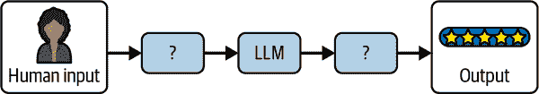

# 第一章. 使用 LangChain 的 LLM 基础

前言让你领略了 LLM 提示的力量，我们亲眼目睹了不同的提示技术如何影响从 LLM 中获得的结果，尤其是在谨慎结合时。实际上，构建好的 LLM 应用程序的挑战在于如何有效地构建发送给模型的提示，并处理模型的预测以返回准确的结果（参见图 1-1）。



###### 图 1-1. 将 LLM 建成应用程序有用部分的挑战

如果你能够解决这个问题，那么你已经走上了构建简单和复杂 LLM 应用程序的道路。在本章中，你将了解 LangChain 的构建块如何映射到 LLM 概念，以及当它们有效结合时，如何使你能够构建 LLM 应用程序。但首先，侧边栏“为什么选择 LangChain？”是对为什么我们认为使用 LangChain 构建 LLM 应用程序有用的简要介绍。

# 使用 LangChain 进行设置

为了跟随本章的其余部分以及后续章节，我们建议首先在你的计算机上设置 LangChain。

请参阅有关设置 OpenAI 账户的说明前言，如果你还没有完成这些操作，请完成它们。如果你更喜欢使用不同的 LLM 提供商，请参阅“为什么选择 LangChain？”以获取替代方案。

然后，转到 OpenAI 网站的[API 密钥页面](https://oreil.ly/BKrtV)（登录你的 OpenAI 账户后），创建一个 API 密钥，并保存它——你很快就会需要它。

###### 注意

在本书中，我们将以 Python 和 JavaScript (JS) 两种语言展示代码示例。LangChain 在这两种语言中都提供相同的功能，所以只需选择你最熟悉的一种，并遵循全书中的相应代码片段（每种语言的代码示例是等效的）。

首先，为使用 Python 的读者提供一些设置说明：

1.  确保你已经安装了 Python。请参阅[你操作系统的说明](https://oreil.ly/20K9l)。

1.  如果你想在笔记本环境中运行示例，请安装 Jupyter。你可以在终端中运行 `pip install notebook` 来完成此操作。

1.  通过在终端中运行以下命令来安装 LangChain 库：

    ```py
    pip install langchain langchain-openai langchain-community 
    pip install langchain-text-splitters langchain-postgres
    ```

1.  将本节开头生成的 OpenAI API 密钥在你的终端环境中使其可用。你可以通过运行以下命令来完成此操作：

    ```py
    export OPENAI_API_KEY=your-key
    ```

1.  不要忘记将 `your-key` 替换为你之前生成的 API 密钥。

1.  通过运行此命令打开 Jupyter 笔记本：

    ```py
    jupyter notebook
    ```

现在，你已经准备好跟随 Python 代码示例了。

这里是为使用 JavaScript 的读者提供的说明：

1.  将本节开头生成的 OpenAI API 密钥在你的终端环境中使其可用。你可以通过运行以下命令来完成此操作：

    ```py
    export OPENAI_API_KEY=your-key
    ```

1.  不要忘记将 `your-key` 替换为你之前生成的 API 密钥。

1.  如果您想将示例作为 Node.js 脚本运行，请按照 [说明](https://oreil.ly/5gjiO) 安装 Node。

1.  在您的终端中运行以下命令来安装 LangChain 库：

    ```py
    npm install langchain @langchain/openai @langchain/community
    npm install @langchain/core pg
    ```

1.  将每个示例保存为 *.js* 文件，并使用 `node ./file.js` 运行它。

# 在 LangChain 中使用 LLM

总结一下，LLM 是大多数生成式 AI 应用程序背后的驱动引擎。LangChain 提供了两个简单的接口来与任何 LLM API 提供商交互：

+   聊天模型

+   LLM

LLM 接口简单地接受一个字符串提示作为输入，将输入发送给模型提供商，然后返回模型预测作为输出。

让我们导入 LangChain 的 OpenAI LLM 包装器来使用简单的提示 `invoke` 模型预测：

*Python*

```py
from langchain_openai.llms import OpenAI

model = OpenAI(model="gpt-3.5-turbo")

model.invoke("The sky is")
```

*JavaScript*

```py
import { OpenAI } from "@langchain/openai";

const model = new OpenAI({ model: "gpt-3.5-turbo" });

await model.invoke("The sky is");
```

*输出结果：*

```py
Blue!
```

###### 小贴士

注意传递给 `OpenAI` 的参数 `model`。这是在使用大型语言模型或聊天模型时最常配置的参数，它指定了要使用的底层模型，因为大多数提供商都提供具有不同能力和成本折衷的多个模型（通常较大的模型功能更强，但成本更高且速度更慢）。请参阅他们提供的模型概述 [OpenAI](https://oreil.ly/dM886)。

其他有用的配置参数包括以下内容，大多数提供商都提供。

`temperature`

这控制了生成输出时使用的采样算法。较低的值会产生更可预测的输出（例如，0.1），而较高的值会产生更具创造性或意外的结果（例如，0.9）。不同的任务需要不同的参数值。例如，生成结构化输出通常从较低的温度中受益，而创意写作任务则更适合使用较高的值：

`max_tokens`

这限制了输出的大小（和成本）。较低的值可能导致 LLM 在达到自然结束之前停止生成输出，因此可能看起来被截断。

除了这些，每个提供商都公开了一组不同的参数。我们建议查看您选择的提供商的文档。例如，请参阅 [OpenAI 的平台](https://oreil.ly/5O1RW)。

或者，聊天模型界面允许用户和模型之间进行双向对话。之所以它是独立的界面，是因为流行的 LLM 提供商，如 OpenAI，将发送给和从模型的消息区分成 *用户*、*助手* 和 *系统* 角色（这里的 *角色* 表示消息包含的内容类型）：

系统角色

用于模型回答用户问题时应使用的说明

用户角色

用于用户的查询和用户产生的任何其他内容

助理角色

用于模型生成的内容

聊天模型界面使得在您的 AI 聊天机器人应用程序中配置和管理转换变得更加容易。以下是一个使用 LangChain 的 ChatOpenAI 模型的示例：

*Python*

```py
from langchain_openai.chat_models import ChatOpenAI
from langchain_core.messages import HumanMessage

model = ChatOpenAI()
prompt = [HumanMessage("What is the capital of France?")]

model.invoke(prompt)
```

*JavaScript*

```py
import { ChatOpenAI } from '@langchain/openai'
import { HumanMessage } from '@langchain/core/messages'

const model = new ChatOpenAI()
const prompt = [new HumanMessage('What is the capital of France?')]

await model.invoke(prompt)
```

*输出结果：*

```py
AIMessage(content='The capital of France is Paris.')
```

与单个提示字符串不同，聊天模型利用与之前提到的每个角色相关联的不同类型的聊天消息接口。以下是一些包括的内容：

`HumanMessage`

从人类的角度发送的消息，具有用户角色

`AIMessage`

从人类与 AI 交互的角度发送的消息，具有助手角色

`SystemMessage`

设置 AI 应遵循的指令的消息，具有系统角色

`ChatMessage`

允许任意设置角色的消息

让我们在我们的例子中包含一个`SystemMessage`指令：

*Python*

```py
from langchain_core.messages import HumanMessage, SystemMessage
from langchain_openai.chat_models import ChatOpenAI

model = ChatOpenAI()
system_msg = SystemMessage(
    '''You are a helpful assistant that responds to questions with three 
 exclamation marks.'''
)
human_msg = HumanMessage('What is the capital of France?')

model.invoke([system_msg, human_msg])
```

*JavaScript*

```py
import { ChatOpenAI } from "@langchain/openai";
import { HumanMessage, SystemMessage } from "@langchain/core/messages";

const model = new ChatOpenAI();
const prompt = [
  new SystemMessage(
    `You are a helpful assistant that responds to questions with three 
 exclamation marks.`,
  ),
  new HumanMessage("What is the capital of France?"),
];

await model.invoke(prompt);
```

*输出：*

```py
AIMessage('Paris!!!')
```

如您所见，即使`SystemMessage`中没有出现在用户的提问中，模型也遵循了提供的指令。这使得您可以根据用户的输入预先配置您的 AI 应用程序，以相对可预测的方式做出响应。

# 使 LLM 提示可重用

前一节展示了`prompt`指令如何显著影响模型的输出。提示有助于模型理解上下文并生成针对查询的相关答案。

这里是一个详细提示的例子：

```py
Answer the question based on the context below. If the question cannot be
answered using the information provided, answer with "I don't know".

Context: The most recent advancements in NLP are being driven by Large Language 
Models (LLMs). These models outperform their smaller counterparts and have
become invaluable for developers who are creating applications with NLP 
capabilities. Developers can tap into these models through Hugging Face's
`transformers` library, or by utilizing OpenAI and Cohere's offerings through
the `openai` and `cohere` libraries, respectively.

Question: Which model providers offer LLMs?

Answer:
```

尽管提示看起来像是一个简单的字符串，但挑战在于确定文本应包含什么内容，以及它应如何根据用户的输入而变化。在这个例子中，上下文和问题值是硬编码的，但如果我们想动态地传递这些值怎么办呢？

幸运的是，LangChain 提供了提示模板接口，这使得构建具有动态输入的提示变得容易：

*Python*

```py
from langchain_core.prompts import PromptTemplate

template = PromptTemplate.from_template("""Answer the question based on the
 context below. If the question cannot be answered using the information 
 provided, answer with "I don't know".

Context: {context} `Question:` `{question}` ``` `Answer: """``)`  `template``.``invoke``({`     `"context"``:` `"""The most recent advancements in NLP are being driven by Large`   `Language Models (LLMs). These models outperform their smaller`   `counterparts and have become invaluable for developers who are creating`   `applications with NLP capabilities. Developers can tap into these`   ``models through Hugging Face's `transformers` library, or by utilizing``   `` OpenAI and Cohere's offerings through the `openai` and `cohere` ``   `libraries, respectively."""``,`     `"question"``:` `"Which model providers offer LLMs?"` `})` ```py
```

```py```` ```py``` *JavaScript*    ``` import { PromptTemplate } from '@langchain/core/prompts'  const template = PromptTemplate.fromTemplate(`Answer the question based on the   context below. If the question cannot be answered using the information   provided, answer with "I don't know".  Context: {context}  Question: {question}  Answer: `)  await template.invoke({   context: `The most recent advancements in NLP are being driven by Large   Language Models (LLMs). These models outperform their smaller   counterparts and have become invaluable for developers who are creating   applications with NLP capabilities. Developers can tap into these models   through Hugging Face's \`transformers\` library, or by utilizing OpenAI   and Cohere's offerings through the \`openai\` and \`cohere\` libraries,   respectively.`,   question: "Which model providers offer LLMs?" }) ```py    *输出:*    ``` StringPromptValue(text='Answer the question based on the context below. If the      question cannot be answered using the information provided, answer with "I     don\'t know".\n\nContext: The most recent advancements in NLP are being      driven by Large Language Models (LLMs). These models outperform their      smaller counterparts and have become invaluable for developers who are      creating applications with NLP capabilities. Developers can tap into these      models through Hugging Face\'s `transformers` library, or by utilizing      OpenAI and Cohere\'s offerings through the `openai` and `cohere` libraries,      respectively.\n\nQuestion: Which model providers offer LLMs?\n\nAnswer: ') ```py    本例从上一个块中获取静态提示并将其动态化。`template` 包含最终提示的结构以及动态输入将被插入的位置的定义。    因此，模板可以用作构建多个静态、特定提示的配方。当你用一些特定值格式化提示——在这种情况下，`context` 和 `question`——你将得到一个准备好的静态提示，可以传递给 LLM。    正如你所见，`question` 参数是通过 `invoke` 函数动态传递的。默认情况下，LangChain 提示遵循 Python 的 `f-string` 语法来定义动态参数——任何被大括号包围的单词，如 `{question}`，都是运行时传入值的占位符。在先前的例子中，`{question}` 被替换为 ``"Which model providers offer LLMs?"``    让我们看看如何使用 LangChain 将其输入到 LLM OpenAI 模型中：    *Python*    ``` from langchain_openai.llms import OpenAI from langchain_core.prompts import PromptTemplate  # both `template` and `model` can be reused many times  template = PromptTemplate.from_template("""Answer the question based on the   context below. If the question cannot be answered using the information   provided, answer with "I don't know".  Context: {context} `Question:` `{question}` ```py `答案: """``)`  `model` `=` `OpenAI``()`  ``# `prompt` 和 `completion` 是使用模板和模型一次的结果``  `prompt` `=` `template``.``invoke``({`     `"context"``:` `"""The most recent advancements in NLP are being driven by Large`  `Language Models (LLMs). These models outperform their smaller`   `counterparts and have become invaluable for developers who are creating`   ``applications with NLP capabilities. Developers can tap into these`   ``models through Hugging Face's `transformers` library, or by utilizing``   `` OpenAI and Cohere's offerings through the `openai` and `cohere` ``   `libraries, respectively."""``,`     `"question"``:` `"Which model providers offer LLMs?"` `})`  `completion` `=` `model``.``invoke``(``prompt``)` ``` ```py   ````` ```py` *JavaScript*    ``` import { PromptTemplate } from '@langchain/core/prompts' import { OpenAI } from '@langchain/openai'  const model = new OpenAI() const template = PromptTemplate.fromTemplate(`Answer the question based on the   context below. If the question cannot be answered using the information   provided, answer with "I don't know".  Context: {context}  Question: {question}  Answer: `)  const prompt = await template.invoke({   context: `The most recent advancements in NLP are being driven by Large   Language Models (LLMs). These models outperform their smaller   counterparts and have become invaluable for developers who are creating   applications with NLP capabilities. Developers can tap into these models   through Hugging Face's \`transformers\` library, or by utilizing OpenAI   and Cohere's offerings through the \`openai\` and \`cohere\` libraries,   respectively.`,   question: "Which model providers offer LLMs?" })  await model.invoke(prompt) ```py    *The output:*    ``` Hugging Face's `transformers` library, OpenAI using the `openai` library, and  Cohere using the `cohere` library offer LLMs. ```py    If you’re looking to build an AI chat application, the `ChatPromptTemplate` can be used instead to provide dynamic inputs based on the role of the chat message:    *Python*    ``` from langchain_core.prompts import ChatPromptTemplate template = ChatPromptTemplate.from_messages([     ('system', '''Answer the question based on the context below. If the   question cannot be answered using the information provided, answer with   "I don\'t know".'''),     ('human', 'Context: {context}'),     ('human', 'Question: {question}'), ])  template.invoke({     "context": """The most recent advancements in NLP are being driven by Large   Language Models (LLMs). These models outperform their smaller   counterparts and have become invaluable for developers who are creating   applications with NLP capabilities. Developers can tap into these   models through Hugging Face's `transformers` library, or by utilizing   OpenAI and Cohere's offerings through the `openai` and `cohere`   libraries, respectively.""",     "question": "Which model providers offer LLMs?" }) ```py    *JavaScript*    ``` import { ChatPromptTemplate } from '@langchain/core/prompts'  const template = ChatPromptTemplate.fromMessages([   ['system', `Answer the question based on the context below. If the question   cannot be answered using the information provided, answer with "I   don\'t know".`],   ['human', 'Context: {context}'],   ['human', 'Question: {question}'], ])  await template.invoke({   context: `The most recent advancements in NLP are being driven by Large   Language Models (LLMs). These models outperform their smaller   counterparts and have become invaluable for developers who are creating   applications with NLP capabilities. Developers can tap into these models   through Hugging Face's \`transformers\` library, or by utilizing OpenAI   and Cohere's offerings through the \`openai\` and \`cohere\` libraries,   respectively.`,   question: "Which model providers offer LLMs?" }) ```py    *The output:*    ``` ChatPromptValue(messages=[SystemMessage(content='Answer the question based on      the context below. If the question cannot be answered using the information      provided, answer with "I don\'t know".'), HumanMessage(content="Context:      The most recent advancements in NLP are being driven by Large Language      Models (LLMs). These models outperform their smaller counterparts and have      become invaluable for developers who are creating applications with NLP      capabilities. Developers can tap into these models through Hugging Face\'s      `transformers` library, or by utilizing OpenAI and Cohere\'s offerings      through the `openai` and `cohere` libraries, respectively."), HumanMessage     (content='Question: Which model providers offer LLMs?')]) ```py    Notice how the prompt contains instructions in a `SystemMessage` and two instances of `HumanMessage` that contain dynamic `context` and `question` variables. You can still format the template in the same way and get back a static prompt that you can pass to a large language model for a prediction output:    *Python*    ``` from langchain_openai.chat_models import ChatOpenAI from langchain_core.prompts import ChatPromptTemplate  # both `template` and `model` can be reused many times  template = ChatPromptTemplate.from_messages([     ('system', '''Answer the question based on the context below. If the   question cannot be answered using the information provided, answer  with "I don\'t know".'''),     ('human', 'Context: {context}'),     ('human', 'Question: {question}'), ])  model = ChatOpenAI()  # `prompt` and `completion` are the results of using template and model once  prompt = template.invoke({     "context": """The most recent advancements in NLP are being driven by   Large Language Models (LLMs). These models outperform their smaller   counterparts and have become invaluable for developers who are creating   applications with NLP capabilities. Developers can tap into these   models through Hugging Face's `transformers` library, or by utilizing   OpenAI and Cohere's offerings through the `openai` and `cohere`   libraries, respectively.""",     "question": "Which model providers offer LLMs?" })  model.invoke(prompt) ```py    *JavaScript*    ``` import { ChatPromptTemplate } from '@langchain/core/prompts' import { ChatOpenAI } from '@langchain/openai'  const model = new ChatOpenAI() const template = ChatPromptTemplate.fromMessages([   ['system', `Answer the question based on the context below. If the question   cannot be answered using the information provided, answer with "I   don\'t know".`],   ['human', 'Context: {context}'],   ['human', 'Question: {question}'], ])  const prompt = await template.invoke({   context: `The most recent advancements in NLP are being driven by Large   Language Models (LLMs). These models outperform their smaller   counterparts and have become invaluable for developers who are creating   applications with NLP capabilities. Developers can tap into these models   through Hugging Face's \`transformers\` library, or by utilizing OpenAI   and Cohere's offerings through the \`openai\` and \`cohere\` libraries,   respectively.`,   question: "Which model providers offer LLMs?" })  await model.invoke(prompt) ```py    *The output:*    ``` AIMessage(content="Hugging Face's `transformers` library, OpenAI using the      `openai` library, and Cohere using the `cohere` library offer LLMs.") ```py ```` ```py`` ``````py ``````py`  ````` ```py`# Getting Specific Formats out of LLMs    Plain text outputs are useful, but there may be use cases where you need the LLM to generate a *structured* output—that is, output in a machine-readable format, such as JSON, XML, CSV, or even in a programming language such as Python or JavaScript. This is very useful when you intend to hand that output off to some other piece of code, making an LLM play a part in your larger application.    ## JSON Output    The most common format to generate with LLMs is JSON. JSON outputs can (for example) be sent over the wire to your frontend code or be saved to a database.    When generating JSON, the first task is to define the schema you want the LLM to respect when producing the output. Then, you should include that schema in the prompt, along with the text you want to use as the source. Let’s see an example:    *Python*    ``` 从 langchain_openai 导入 ChatOpenAI 从 langchain_core.pydantic_v1 导入 BaseModel  class AnswerWithJustification(BaseModel):     '''对用户问题的答案及其答案的依据'''     answer: str     '''用户问题的答案'''     justification: str     '''答案的依据'''  llm = ChatOpenAI(model="gpt-3.5-turbo", temperature=0) structured_llm = llm.with_structured_output(AnswerWithJustification)  structured_llm.invoke("""What weighs more, a pound of bricks or a pound of feathers""") ```py    *JavaScript*    ``` 导入 { ChatOpenAI } 从 '@langchain/openai' 导入 { z } 从 "zod"  const answerSchema = z   .object({     answer: z.string().describe("用户问题的答案"),     justification: z.string().describe(`答案的依据`),   })   .describe(`对用户问题的答案及其答案的依据.`);  const model = new ChatOpenAI({   model: "gpt-3.5-turbo",   temperature: 0, }).withStructuredOutput(answerSchema) await model.invoke("What weighs more, a pound of bricks or a pound of feathers") ```py    *The output:*    ``` {   answer: "They weigh the same",   justification: "Both a pound of bricks and a pound of feathers weigh one pound.      The weight is the same, but the volu"... 42 more characters } ```py    So, first define a schema. In Python, this is easiest to do with Pydantic (a library used for validating data against schemas). In JS, this is easiest to do with Zod (an equivalent library). The method `with_structured_output` will use that schema for two things:    *   The schema will be converted to a `JSONSchema` object (a JSON format used to describe the shape [types, names, descriptions] of JSON data), which will be sent to the LLM. For each LLM, LangChain picks the best method to do this, usually function calling or prompting.           *   The schema will also be used to validate the output returned by the LLM before returning it; this ensures the output produced respects the schema you passed in exactly.              ## Other Machine-Readable Formats with Output Parsers    You can also use an LLM or chat model to produce output in other formats, such as CSV or XML. This is where output parsers come in handy. *Output parsers* are classes that help you structure large language model responses. They serve two functions:    Providing format instructions      Output parsers can be used to inject some additional instructions in the prompt that will help guide the LLM to output text in the format it knows how to parse.      Validating and parsing output      The main function is to take the textual output of the LLM or chat model and render it to a more structured format, such as a list, XML, or other format. This can include removing extraneous information, correcting incomplete output, and validating the parsed values.      Here’s an example of how an output parser works:    *Python*    ``` 从 langchain_core.output_parsers 导入 CommaSeparatedListOutputParser parser = CommaSeparatedListOutputParser() items = parser.invoke("apple, banana, cherry") ```py    *JavaScript*    ``` 从 '@langchain/core/output_parsers' 导入 { CommaSeparatedListOutputParser } const parser = new CommaSeparatedListOutputParser()  await parser.invoke("apple, banana, cherry") ```py    *The output:*    ``` ['apple', 'banana', 'cherry'] ```py    LangChain provides a variety of output parsers for various use cases, including CSV, XML, and more. We’ll see how to combine output parsers with models and prompts in the next section.    # Assembling the Many Pieces of an LLM Application    The key components you’ve learned about so far are essential building blocks of the LangChain framework. Which brings us to the critical question: How do you combine them effectively to build your LLM application?    ## Using the Runnable Interface    As you may have noticed, all the code examples used so far utilize a similar interface and the `invoke()` method to generate outputs from the model (or prompt template, or output parser). All components have the following:    *   There is a common interface with these methods:               *   `invoke`: transforms a single input into an output                       *   `batch`: efficiently transforms multiple inputs into multiple outputs                       *   `stream`: streams output from a single input as it’s produced                   *   There are built-in utilities for retries, fallbacks, schemas, and runtime configurability.           *   In Python, each of the three methods have `asyncio` equivalents.              As such, all components behave the same way, and the interface learned for one of them applies to all:    *Python*    ``` 从 langchain_openai.llms 导入 ChatOpenAI  model = ChatOpenAI()  completion = model.invoke('Hi there!')  # Hi!  completions = model.batch(['Hi there!', 'Bye!']) # ['Hi!', 'See you!']  for token in model.stream('Bye!'):     print(token)     # Good     # bye     # ! ```py    *JavaScript*    ``` 从 '@langchain/openai' 导入 { ChatOpenAI } const model = new ChatOpenAI()  const completion = await model.invoke('Hi there!')  // Hi!  const completions = await model.batch(['Hi there!', 'Bye!']) // ['Hi!', 'See you!']  for await (const token of await model.stream('Bye!')) {   console.log(token)   // Good   // bye   // ! } ```py    In this example, you see how the three main methods work:    *   `invoke()` takes a single input and returns a single output.           *   `batch()` takes a list of outputs and returns a list of outputs.           *   `stream()` takes a single input and returns an iterator of parts of the output as they become available.              In some cases, where the underlying component doesn’t support iterative output, there will be a single part containing all output.    You can combine these components in two ways:    Imperative      Call your components directly, for example, with `model.invoke(...)`      Declarative      Use LangChain Expression Language (LCEL), as covered in an upcoming section      Table 1-1 summarizes their differences, and we’ll see each in action next.      Table 1-1\. The main differences between imperative and declarative composition.   |   | Imperative | Declarative | | --- | --- | --- | | Syntax | All of Python or JavaScript | LCEL | | Parallel execution | Python: with threads or coroutinesJavaScript: with `Promise.all` | Automatic | | Streaming | With yield keyword | Automatic | | Async execution | With async functions | Automatic |    ## Imperative Composition    *Imperative composition* is just a fancy name for writing the code you’re used to writing, composing these components into functions and classes. Here’s an example combining prompts, models, and output parsers:    *Python*    ``` 从 langchain_openai.chat_models 导入 ChatOpenAI 从 langchain_core.prompts 导入 ChatPromptTemplate 从 langchain_core.runnables 导入 chain  # 构建块  template = ChatPromptTemplate.from_messages([     ('system', 'You are a helpful assistant.'),     ('human', '{question}'), ])  model = ChatOpenAI()  # 结合它们到一个函数中  # @chain 装饰器为任何你写的函数添加相同的 Runnable 接口  @chain def chatbot(values):     prompt = template.invoke(values)     return model.invoke(prompt)  # 使用它  chatbot.invoke({"question": "Which model providers offer LLMs?"}) ```py    *JavaScript*    ``` 从 '@langchain/openai' 导入 {ChatOpenAI} 从 '@langchain/core/prompts' 导入 {ChatPromptTemplate} 从 '@langchain/core/runnables' 导入 {RunnableLambda}  // 构建块  const template = ChatPromptTemplate.fromMessages([   ['system', 'You are a helpful assistant.'],   ['human', '{question}'], ])  const model = new ChatOpenAI()  // 结合它们到一个函数中  // RunnableLambda 为任何你写的函数添加相同的 Runnable 接口  const chatbot = RunnableLambda.from(async values => {   const prompt = await template.invoke(values)   return await model.invoke(prompt) })  // 使用它  await chatbot.invoke({   "question": "Which model providers offer LLMs?" }) ```py    *The output:*    ``` AIMessage(content="Hugging Face's `transformers` library, OpenAI using the      `openai` library, and Cohere using the `cohere` library offer LLMs.") ```py    The preceding is a complete example of a chatbot, using a prompt and chat model. As you can see, it uses familiar Python syntax and supports any custom logic you might want to add in that function.    On the other hand, if you want to enable streaming or async support, you’d have to modify your function to support it. For example, streaming support can be added as follows:    *Python*    ``` @chain def chatbot(values):     prompt = template.invoke(values)     for token in model.stream(prompt):         yield token  for part in chatbot.stream({     "question": "Which model providers offer LLMs?" }):     print(part) ```py    *JavaScript*    ``` const chatbot = RunnableLambda.from(async function* (values) {   const prompt = await template.invoke(values)   for await (const token of await model.stream(prompt)) {     yield token   } })  for await (const token of await chatbot.stream({   "question": "Which model providers offer LLMs?" })) {   console.log(token) } ```py    *The output:*    ``` AIMessageChunk(content="Hugging") AIMessageChunk(content=" Face's") AIMessageChunk(content=" `transformers`") ... ```py    So, either in JS or Python, you can enable streaming for your custom function by yielding the values you want to stream and then calling it with `stream`.    For asynchronous execution, you’d rewrite your function like this:    *Python*    ``` @chain async def chatbot(values):     prompt = await template.ainvoke(values)     return await model.ainvoke(prompt)  await chatbot.ainvoke({"question": "Which model providers offer LLMs?"}) # > AIMessage(content="""Hugging Face's `transformers` library, OpenAI using     the `openai` library, and Cohere using the `cohere` library offer LLMs.""") ```py    This one applies to Python only, as asynchronous execution is the only option in JavaScript.    ## Declarative Composition    LCEL is a *declarative language* for composing LangChain components. LangChain compiles LCEL compositions to an *optimized execution plan*, with automatic parallelization, streaming, tracing, and async support.    Let’s see the same example using LCEL:    *Python*    ``` 从 langchain_openai.chat_models 导入 ChatOpenAI 从 langchain_core.prompts 导入 ChatPromptTemplate  # 构建块  template = ChatPromptTemplate.from_messages([     ('system', 'You are a helpful assistant.'),     ('human', '{question}'), ])  model = ChatOpenAI()  # 结合它们用 | 操作符  chatbot = template | model  # 使用它  chatbot.invoke({"question": "Which model providers offer LLMs?"}) ```py    *JavaScript*    ``` 从 '@langchain/openai' 导入 { ChatOpenAI } 从 '@langchain/core/prompts' 导入 { ChatPromptTemplate } 从 '@langchain/core/runnables' 导入 { RunnableLambda }  // 构建块  const template = ChatPromptTemplate.fromMessages([   ['system', 'You are a helpful assistant.'],   ['human', '{question}'], ])  const model = new ChatOpenAI()  // 结合它们到一个函数中  const chatbot = template.pipe(model)  // 使用它  await chatbot.invoke({   "question": "Which model providers offer LLMs?" }) ```py    *The output:*    ``` AIMessage(content="Hugging Face's `transformers` library, OpenAI using the      `openai` library, and Cohere using the `cohere` library offer LLMs.") ```py    Crucially, the last line is the same between the two examples—that is, you use the function and the LCEL sequence in the same way, with `invoke/stream/batch`. And in this version, you don’t need to do anything else to use streaming:    *Python*    ``` chatbot = template | model  for part in chatbot.stream({     "question": "Which model providers offer LLMs?" }):     print(part)     # > AIMessageChunk(content="Hugging")     # > AIMessageChunk(content=" Face's")     # > AIMessageChunk(content=" `transformers`")     # ... ```py    *JavaScript*    ``` const chatbot = template.pipe(model)  for await (const token of await chatbot.stream({   "question": "Which model providers offer LLMs?" })) {   console.log(token) } ```py    And, for Python only, it’s the same for using asynchronous methods:    *Python*    ``` chatbot = template | model  await chatbot.ainvoke({     "question": "Which model providers offer LLMs?" }) ```py    # Summary    In this chapter, you’ve learned about the building blocks and key components necessary to build LLM applications using LangChain. LLM applications are essentially a chain consisting of the large language model to make predictions, the prompt instruction(s) to guide the model toward a desired output, and an optional output parser to transform the format of the model’s output.    All LangChain components share the same interface with `invoke`, `stream`, and `batch` methods to handle various inputs and outputs. They can either be combined and executed imperatively by calling them directly or declaratively using LCEL.    The imperative approach is useful if you intend to write a lot of custom logic, whereas the declarative approach is useful for simply assembling existing components with limited customization.    In Chapter 2, you’ll learn how to provide external data to your AI chatbot as *context* so that you can build an LLM application that enables you to “chat” with your data.````
