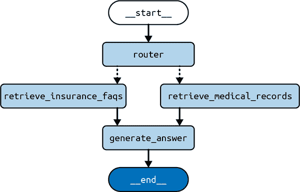

# 第五章\. 基于 LangGraph 的认知架构

到目前为止，我们已经探讨了 LLM 应用程序最常见的特点：

+   序言和第一章中的提示技术

+   第二章和第三章中的 RAG

+   第四章中的记忆

接下来的问题应该是：我们如何将这些组件组合成一个连贯的应用程序，以实现我们设定的目标？为了与砖石世界做一个类比，游泳池和一层的房子是由相同的材料建造的，但显然服务于非常不同的目的。使它们各自适合其不同目的的是这些材料组合的计划——即它们的架构。在构建 LLM 应用程序时也是如此。你必须做出的最重要的决定是如何将你拥有的不同组件（如 RAG、提示技术、记忆）组装成实现你目的的东西。

在我们查看具体架构之前，让我们通过一个例子来了解一下。你可能会构建的任何 LLM 应用程序都将从一个目的开始：应用程序被设计来做什么。假设你想构建一个电子邮件助手——一个在你看邮件之前阅读你的邮件的 LLM 应用程序，目的是减少你需要查看的邮件数量。应用程序可能通过存档一些不感兴趣的邮件，直接回复一些，并将其他标记为需要你稍后注意的邮件来实现这一点。

你可能还希望应用程序在行动上受到一些约束。列出这些约束非常有帮助，因为它们将有助于指导对正确架构的搜索。第八章更详细地介绍了这些约束以及如何处理它们。对于这个假设的电子邮件助手，假设我们希望它做以下事情：

+   最小化它打扰你的次数（毕竟，整个目的就是节省时间）。

+   避免让你的电子邮件联系人收到你永远不会自己发送的回复。

这暗示了在构建 LLM 应用程序时经常面临的关键权衡：在 *自主性*（或自主行动的能力）和 *可靠性*（或你可以信任其输出的程度）之间的权衡。直观地讲，如果电子邮件助手在没有你介入的情况下采取更多行动，它将更有用，但如果你做得太过分，它不可避免地会发送你希望它没有发送的电子邮件。

描述一个 LLM 应用程序的自主程度的一种方法是通过评估应用程序的行为中有多少是由 LLM（而不是代码）决定的：

+   让 LLM 决定一个步骤的输出（例如，为电子邮件写一个草稿回复）。

+   让 LLM 决定下一步要采取的行动（例如，对于一封新邮件，决定它可以在邮件上执行的三种操作：存档、回复或标记为审阅）。

+   让 LLM 决定可以采取哪些步骤（例如，让 LLM 编写执行你未预先编程到应用程序中的动态操作的代码）。

我们可以根据它们在这条自主性谱系中的位置来对构建 LLM 应用的许多流行**食谱**进行分类，也就是说，三个提到的任务中哪些是由 LLM 处理的，哪些仍然掌握在开发者或用户手中。这些食谱可以被称为**认知架构**。在人工智能领域，**认知架构**这个术语长期以来一直被用来表示人类推理模型（及其在计算机中的实现）。一个 LLM 认知架构（据我们所知，这个术语首次应用于 LLM，是在一篇论文中提出的）可以被定义为 LLM 应用要采取的步骤的**食谱**（参见图 5-1）。例如，一个**步骤**可以是检索相关文档（RAG），或者使用思维链提示调用 LLM。


###### 图 5-1\. LLM 应用的认知架构

现在让我们看看在构建您的应用时可以使用的主要架构或**食谱**（如图图 5-1 所示）：

0: 代码

这不是一个 LLM 认知架构（因此我们将其编号为**0**），因为它根本不使用 LLM。你可以把它想象成你习惯编写的常规软件。对于这本书来说，第一个有趣的架构实际上是下一个。

1: LLM 调用

这是我们到目前为止在书中看到的绝大多数例子，只有一个 LLM 调用。这主要在它是更大应用的一部分时有用，该应用使用 LLM 来完成特定任务，例如翻译或总结一段文本。

2: 链接

更高级别的是，使用预定义序列中的多个 LLM 调用。例如，一个文本到 SQL 应用（它从用户那里接收对数据库中某些计算的自然语言描述作为输入）可以连续使用两个 LLM 调用：

一个 LLM 调用，从用户提供的自然语言查询和开发者提供的数据库内容描述中生成 SQL 查询。

另一个 LLM 调用是编写一个适合非技术用户的查询解释，基于前一个调用中生成的查询。然后可以使用这个解释来使用户检查生成的查询是否与他的请求匹配。

3: 路由器

下一个步骤来自使用 LLM 来定义要采取的步骤序列。也就是说，链式架构总是执行由开发者确定的静态步骤序列（无论多少），而路由架构的特点是使用 LLM 在某些预定义步骤之间进行选择。一个例子是一个 RAG 应用程序，它包含来自不同领域的多个文档索引，以下步骤：

1.  根据用户提供的查询和开发者提供的索引描述，LLM 调用来选择使用哪个可用的索引。

1.  一个检索步骤，查询所选索引以获取用户查询的最相关文档。

1.  另一次 LLM 调用来生成答案，给定用户提供的查询和从索引中检索到的相关文档列表。

这就是本章我们将要讨论的内容。我们将依次讨论这些架构。下一章将讨论代理架构，这些架构会更多地使用 LLM。但首先，让我们谈谈一些更好的工具，以帮助我们在这个旅程中。

# 架构 #1：LLM 调用

作为 LLM 调用架构的例子，我们将回到我们在第四章中创建的聊天机器人。这个聊天机器人将直接响应用户的消息。

首先，创建一个 `StateGraph`，我们将向其中添加一个节点来表示 LLM 调用：

*Python*

```py
from typing import Annotated, TypedDict

from langgraph.graph import StateGraph, START, END
from langgraph.graph.message import add_messages
from langchain_openai import ChatOpenAI

model = ChatOpenAI()

class State(TypedDict):
    # Messages have the type "list". The `add_messages` 
    # function in the annotation defines how this state should 
    # be updated (in this case, it appends new messages to the 
    # list, rather than replacing the previous messages)
    messages: Annotated[list, add_messages]

def chatbot(state: State):
    answer = model.invoke(state["messages"])
    return {"messages": [answer]}

builder = StateGraph(State)
builder.add_node("chatbot", chatbot)
builder.add_edge(START, 'chatbot')
builder.add_edge('chatbot', END)

graph = builder.compile()
```

*JavaScript*

```py
import {
  StateGraph,
  Annotation,
  messagesStateReducer,
  START, END
} from '@langchain/langgraph'
import {ChatOpenAI} from '@langchain/openai'

const model = new ChatOpenAI()

const State = {
  /**
 * The State defines three things:
 * 1\. The structure of the graph's state (which "channels" are available to 
 * read/write)
 * 2\. The default values for the state's channels
 * 3\. The reducers for the state's channels. Reducers are functions that 
 * determine how to apply updates to the state. Below, new messages are 
 * appended to the messages array.
 */
  messages: Annotation({
    reducer: messagesStateReducer,
    default: () => []
  }),
}

async function chatbot(state) {
  const answer = await model.invoke(state.messages)
  return {"messages": answer}
}

const builder = new StateGraph(State)
  .addNode('chatbot', chatbot)
  .addEdge(START, 'chatbot')
  .addEdge('chatbot', END)

const graph = builder.compile()
```

我们还可以绘制一个图形的视觉表示：

*Python*

```py
graph.get_graph().draw_mermaid_png()
```

*JavaScript*

```py
await graph.getGraph().drawMermaidPng()
```

我们刚才创建的图形看起来像图 5-2。


###### 图 5-2\. LLM 调用架构

你可以用在前面章节中看到的熟悉的 `stream()` 方法来运行它：

*Python*

```py
input = {"messages": [HumanMessage('hi!)]}
for chunk in graph.stream(input):
    print(chunk)
```

*JavaScript*

```py
const input = {messages: [new HumanMessage('hi!)]}
for await (const chunk of await graph.stream(input)) {
  console.log(chunk)
}
```

*输出：*

```py
{ "chatbot": { "messages": [AIMessage("How can I help you?")] } }
```

注意到图形的输入与我们在前面定义的 `State` 对象的形状相同；也就是说，我们发送了一个字典中 `messages` 键的消息列表。

这是使用 LLM 的最简单架构，但这并不意味着它永远不会被使用。以下是一些例子，说明你可能在许多流行的产品中看到它在行动：

+   由 AI 驱动的功能，如摘要和翻译（例如在流行的写作软件 Notion 中可以找到的），可以通过一次 LLM 调用来实现。

+   简单的 SQL 查询生成可以通过一次 LLM 调用实现，具体取决于开发者心中所想的 UX 和目标用户。

# 架构 #2：链式

这个架构通过使用多个 LLM 调用，按照预定义的顺序（即，不同的应用程序调用执行相同的 LLM 调用序列，尽管输入和结果不同）来扩展所有这些内容。

以一个文本到 SQL 应用程序为例，该程序接收用户输入的自然语言描述，用于对数据库进行某些计算。我们之前提到，这可以通过一次 LLM 调用来实现，生成一个 SQL 查询，但我们可以通过按顺序使用多个 LLM 调用创建一个更复杂的应用程序。一些作者称这种架构为*流程工程*。2

首先让我们用文字描述一下流程：

1.  使用一次 LLM 调用，从用户提供的自然语言查询和开发者提供的数据库内容描述中生成 SQL 查询。

1.  使用另一个 LLM 调用，根据前一个调用生成的查询，为非技术用户编写查询的解释。这可以用来让用户检查生成的查询是否符合他的要求。

你还可以进一步扩展（但在这里我们不会这么做）在前面两个步骤之后采取的额外步骤：

1.  在数据库上执行查询，返回一个二维表。

1.  使用第三次 LLM 调用将查询结果总结为对原始用户问题的文本答案。

现在让我们用 LangGraph 来实现这个架构：

*Python*

```py
from typing import Annotated, TypedDict

from langchain_core.messages import HumanMessage, SystemMessage
from langchain_openai import ChatOpenAI

from langgraph.graph import END, START, StateGraph
from langgraph.graph.message import add_messages

# useful to generate SQL query
model_low_temp = ChatOpenAI(temperature=0.1)
# useful to generate natural language outputs
model_high_temp = ChatOpenAI(temperature=0.7)

class State(TypedDict):
    # to track conversation history
    messages: Annotated[list, add_messages]
    # input
    user_query: str
    # output
    sql_query: str
    sql_explanation: str

class Input(TypedDict):
    user_query: str

class Output(TypedDict):
    sql_query: str
    sql_explanation: str

generate_prompt = SystemMessage(
    """You are a helpful data analyst who generates SQL queries for users based 
 on their questions."""
)

def generate_sql(state: State) -> State:
    user_message = HumanMessage(state["user_query"])
    messages = [generate_prompt, *state["messages"], user_message]
    res = model_low_temp.invoke(messages)
    return {
        "sql_query": res.content,
        # update conversation history
        "messages": [user_message, res],
    }

explain_prompt = SystemMessage(
    "You are a helpful data analyst who explains SQL queries to users."
)

def explain_sql(state: State) -> State:
    messages = [
        explain_prompt,
        # contains user's query and SQL query from prev step
        *state["messages"],
    ]
    res = model_high_temp.invoke(messages)
    return {
        "sql_explanation": res.content,
        # update conversation history
        "messages": res,
    }

builder = StateGraph(State, input=Input, output=Output)
builder.add_node("generate_sql", generate_sql)
builder.add_node("explain_sql", explain_sql)
builder.add_edge(START, "generate_sql")
builder.add_edge("generate_sql", "explain_sql")
builder.add_edge("explain_sql", END)

graph = builder.compile()
```

*JavaScript*

```py
import {
  HumanMessage,
  SystemMessage
} from "@langchain/core/messages";
import { ChatOpenAI } from "@langchain/openai";
import {
  StateGraph,
  Annotation,
  messagesStateReducer,
  START,
  END,
} from "@langchain/langgraph";

// useful to generate SQL query
const modelLowTemp = new ChatOpenAI({ temperature: 0.1 });
// useful to generate natural language outputs
const modelHighTemp = new ChatOpenAI({ temperature: 0.7 });

const annotation = Annotation.Root({
  messages: Annotation({ reducer: messagesStateReducer, default: () => [] }),
  user_query: Annotation(),
  sql_query: Annotation(),
  sql_explanation: Annotation(),
});

const generatePrompt = new SystemMessage(
  `You are a helpful data analyst who generates SQL queries for users based on 
 their questions.`
);

async function generateSql(state) {
  const userMessage = new HumanMessage(state.user_query);
  const messages = [generatePrompt, ...state.messages, userMessage];
  const res = await modelLowTemp.invoke(messages);
  return {
    sql_query: res.content as string,
    // update conversation history
    messages: [userMessage, res],
  };
}

const explainPrompt = new SystemMessage(
  "You are a helpful data analyst who explains SQL queries to users."
);

async function explainSql(state) {
  const messages = [explainPrompt, ...state.messages];
  const res = await modelHighTemp.invoke(messages);
  return {
    sql_explanation: res.content as string,
    // update conversation history
    messages: res,
  };
}

const builder = new StateGraph(annotation)
  .addNode("generate_sql", generateSql)
  .addNode("explain_sql", explainSql)
  .addEdge(START, "generate_sql")
  .addEdge("generate_sql", "explain_sql")
  .addEdge("explain_sql", END);

const graph = builder.compile();
```

图的视觉表示如图图 5-3 所示。


###### 图 5-3. 链式架构

这里是一个输入和输出的例子：

*Python*

```py
graph.invoke({
  "user_query": "What is the total sales for each product?"
})
```

*JavaScript*

```py
await graph.invoke({
  user_query: "What is the total sales for each product?"
})
```

*输出：*

```py
{
  "sql_query": "SELECT product_name, SUM(sales_amount) AS total_sales\nFROM 
      sales\nGROUP BY product_name;",
  "sql_explanation": "This query will retrieve the total sales for each product 
      by summing up the sales_amount column for each product and grouping the
      results by product_name.",
}
```

首先，执行`generate_sql`节点，填充状态中的`sql_query`键（这将是最终输出的一部分）并更新`messages`键以包含新消息。然后运行`explain_sql`节点，使用前一步生成的 SQL 查询填充状态中的`sql_explanation`键。此时，图运行完成，输出返回给调用者。

注意在创建`StateGraph`时也使用了单独的输入和输出模式。这允许你自定义哪些状态部分被接受为用户的输入，哪些作为最终输出返回。剩余的状态键由图节点内部用于保持中间状态，并作为`stream()`产生的流式输出的一部分提供给用户。

# 架构 #3: 路由器

这种架构通过将我们之前概述的下一个责任分配给 LLM 来提高自主性等级：决定下一步要采取的行动。也就是说，链式架构始终执行一系列静态步骤（无论多少），而路由器架构的特点是使用 LLM 在预定义的步骤之间进行选择。

让我们以一个 RAG 应用为例，该应用可以访问来自不同领域的多个文档索引（更多关于索引的内容，请参阅第二章）。通常，通过在提示中避免包含无关信息，可以从中提取更好的 LLMs 性能。因此，在构建此应用时，我们应该尝试为每个查询选择正确的索引，并仅使用该索引。此架构的关键发展是使用 LLM 来做出这个决定，有效地使用 LLM 来评估每个传入的查询并决定该查询应使用哪个*特定*索引。

###### 注意

在 LLMs 出现之前，解决这个问题的通常方法是通过机器学习技术构建一个分类模型，并使用一个数据集将示例用户查询映射到正确的索引。这可能会相当具有挑战性，因为它需要以下条件：

+   手动组装该数据集

+   从每个用户查询中生成足够的*特征*（定量属性），以使能够训练一个用于该任务的分类器

LLMs，鉴于其对人类语言的编码，可以有效地作为这个分类器，无需或仅需极少的示例或额外训练。

首先，让我们用文字描述一下流程：

1.  一个 LLM 调用，根据用户提供的查询和开发者提供的索引描述来选择要使用的可用索引

1.  一个检索步骤，查询所选索引以获取用户查询的最相关文档

1.  另一个 LLM 调用，根据用户提供的查询和从索引中检索到的相关文档列表生成答案

现在让我们用 LangGraph 来实现它：

*Python*

```py
from typing import Annotated, Literal, TypedDict

from langchain_core.documents import Document
from langchain_core.messages import HumanMessage, SystemMessage
from langchain_core.vectorstores.in_memory import InMemoryVectorStore
from langchain_openai import ChatOpenAI, OpenAIEmbeddings

from langgraph.graph import END, START, StateGraph
from langgraph.graph.message import add_messages

embeddings = OpenAIEmbeddings()
# useful to generate SQL query
model_low_temp = ChatOpenAI(temperature=0.1)
# useful to generate natural language outputs
model_high_temp = ChatOpenAI(temperature=0.7)

class State(TypedDict):
    # to track conversation history
    messages: Annotated[list, add_messages]
    # input
    user_query: str
    # output
    domain: Literal["records", "insurance"]
    documents: list[Document]
    answer: str

class Input(TypedDict):
    user_query: str

class Output(TypedDict):
    documents: list[Document]
    answer: str

# refer to Chapter 2 on how to fill a vector store with documents
medical_records_store = InMemoryVectorStore.from_documents([], embeddings)
medical_records_retriever = medical_records_store.as_retriever()

insurance_faqs_store = InMemoryVectorStore.from_documents([], embeddings)
insurance_faqs_retriever = insurance_faqs_store.as_retriever()

router_prompt = SystemMessage(
    """You need to decide which domain to route the user query to. You have two 
 domains to choose from:
 - records: contains medical records of the patient, such as 
 diagnosis, treatment, and prescriptions.
 - insurance: contains frequently asked questions about insurance 
 policies, claims, and coverage.

Output only the domain name."""
)

def router_node(state: State) -> State:
    user_message = HumanMessage(state["user_query"])
    messages = [router_prompt, *state["messages"], user_message]
    res = model_low_temp.invoke(messages)
    return {
        "domain": res.content,
        # update conversation history
        "messages": [user_message, res],
    }

def pick_retriever(
    state: State,
) -> Literal["retrieve_medical_records", "retrieve_insurance_faqs"]:
    if state["domain"] == "records":
        return "retrieve_medical_records"
    else:
        return "retrieve_insurance_faqs"

def retrieve_medical_records(state: State) -> State:
    documents = medical_records_retriever.invoke(state["user_query"])
    return {
        "documents": documents,
    }

def retrieve_insurance_faqs(state: State) -> State:
    documents = insurance_faqs_retriever.invoke(state["user_query"])
    return {
        "documents": documents,
    }

medical_records_prompt = SystemMessage(
    """You are a helpful medical chatbot who answers questions based on the 
 patient's medical records, such as diagnosis, treatment, and 
 prescriptions."""
)

insurance_faqs_prompt = SystemMessage(
    """You are a helpful medical insurance chatbot who answers frequently asked 
 questions about insurance policies, claims, and coverage."""
)

def generate_answer(state: State) -> State:
    if state["domain"] == "records":
        prompt = medical_records_prompt
    else:
        prompt = insurance_faqs_prompt
    messages = [
        prompt,
        *state["messages"],
        HumanMessage(f"Documents: {state["documents"]}"),
    ]
    res = model_high_temp.invoke(messages)
    return {
        "answer": res.content,
        # update conversation history
        "messages": res,
    }

builder = StateGraph(State, input=Input, output=Output)
builder.add_node("router", router_node)
builder.add_node("retrieve_medical_records", retrieve_medical_records)
builder.add_node("retrieve_insurance_faqs", retrieve_insurance_faqs)
builder.add_node("generate_answer", generate_answer)
builder.add_edge(START, "router")
builder.add_conditional_edges("router", pick_retriever)
builder.add_edge("retrieve_medical_records", "generate_answer")
builder.add_edge("retrieve_insurance_faqs", "generate_answer")
builder.add_edge("generate_answer", END)

graph = builder.compile()
```

*JavaScript*

```py
import {
  HumanMessage,
  SystemMessage
} from "@langchain/core/messages";
import {
  ChatOpenAI,
  OpenAIEmbeddings
} from "@langchain/openai";
import {
  MemoryVectorStore
} from "langchain/vectorstores/memory";
import {
  DocumentInterface
} from "@langchain/core/documents";
import {
  StateGraph,
  Annotation,
  messagesStateReducer,
  START,
  END,
} from "@langchain/langgraph";

const embeddings = new OpenAIEmbeddings();
// useful to generate SQL query
const modelLowTemp = new ChatOpenAI({ temperature: 0.1 });
// useful to generate natural language outputs
const modelHighTemp = new ChatOpenAI({ temperature: 0.7 });

const annotation = Annotation.Root({
  messages: Annotation({ reducer: messagesStateReducer, default: () => [] }),
  user_query: Annotation(),
  domain: Annotation(),
  documents: Annotation(),
  answer: Annotation(),
});

// refer to Chapter 2 on how to fill a vector store with documents
const medicalRecordsStore = await MemoryVectorStore.fromDocuments(
  [],
  embeddings
);
const medicalRecordsRetriever = medicalRecordsStore.asRetriever();

const insuranceFaqsStore = await MemoryVectorStore.fromDocuments(
  [],
  embeddings
);
const insuranceFaqsRetriever = insuranceFaqsStore.asRetriever();

const routerPrompt = new SystemMessage(
  `You need to decide which domain to route the user query to. You have two 
 domains to choose from:
 - records: contains medical records of the patient, such as diagnosis, 
 treatment, and prescriptions.
 - insurance: contains frequently asked questions about insurance 
 policies, claims, and coverage.

Output only the domain name.`
);

async function routerNode(state) {
  const userMessage = new HumanMessage(state.user_query);
  const messages = [routerPrompt, ...state.messages, userMessage];
  const res = await modelLowTemp.invoke(messages);
  return {
    domain: res.content as "records" | "insurance",
    // update conversation history
    messages: [userMessage, res],
  };
}

function pickRetriever(state) {
  if (state.domain === "records") {
    return "retrieve_medical_records";
  } else {
    return "retrieve_insurance_faqs";
  }
}

async function retrieveMedicalRecords(state) {
  const documents = await medicalRecordsRetriever.invoke(state.user_query);
  return {
    documents,
  };
}

async function retrieveInsuranceFaqs(state) {
  const documents = await insuranceFaqsRetriever.invoke(state.user_query);
  return {
    documents,
  };
}

const medicalRecordsPrompt = new SystemMessage(
  `You are a helpful medical chatbot who answers questions based on the 
 patient's medical records, such as diagnosis, treatment, and 
 prescriptions.`
);

const insuranceFaqsPrompt = new SystemMessage(
  `You are a helpful medical insurance chatbot who answers frequently asked 
 questions about insurance policies, claims, and coverage.`
);

async function generateAnswer(state) {
  const prompt =
    state.domain === "records" ? medicalRecordsPrompt : insuranceFaqsPrompt;
  const messages = [
    prompt,
    ...state.messages,
    new HumanMessage(`Documents: ${state.documents}`),
  ];
  const res = await modelHighTemp.invoke(messages);
  return {
    answer: res.content as string,
    // update conversation history
    messages: res,
  };
}

const builder = new StateGraph(annotation)
  .addNode("router", routerNode)
  .addNode("retrieve_medical_records", retrieveMedicalRecords)
  .addNode("retrieve_insurance_faqs", retrieveInsuranceFaqs)
  .addNode("generate_answer", generateAnswer)
  .addEdge(START, "router")
  .addConditionalEdges("router", pickRetriever)
  .addEdge("retrieve_medical_records", "generate_answer")
  .addEdge("retrieve_insurance_faqs", "generate_answer")
  .addEdge("generate_answer", END);

const graph = builder.compile();
```

可视表示如图图 5-4 所示。



###### 图 5-4. 路由器架构

注意现在这开始变得更有用，因为它显示了通过`retrieve_medical_records`或通过`retrieve_insurance_faqs`的两种可能的图路径，并且对于这两者，我们首先访问`router`节点，然后访问`generate_answer`节点结束。这两个可能的路径是通过使用一个条件边实现的，该条件边在`pick_retriever`函数中实现，它将 LLM 选择的`domain`映射到前面提到的两个节点之一。条件边如图图 5-4 中的虚线从源节点到目标节点所示。

现在让我们来看一些示例输入和输出，这次是带有流式输出的：

*Python*

```py
input = {
    "user_query": "Am I covered for COVID-19 treatment?"
}
for c in graph.stream(input):
    print(c)
```

*JavaScript*

```py
const input = {
  user_query: "Am I covered for COVID-19 treatment?"
}
for await (const chunk of await graph.stream(input)) {
console.log(chunk)
}
```

*输出*（实际的答案未显示，因为它将取决于您的文档）：

```py
{
    "router": {
        "messages": [
            HumanMessage(content="Am I covered for COVID-19 treatment?"),
            AIMessage(content="insurance"),
        ],
        "domain": "insurance",
    }
}
{
    "retrieve_insurance_faqs": {
        "documents": [...]
    }
}
{
    "generate_answer": {
        "messages": AIMessage(
            content="...",
        ),
        "answer": "...",
    }
}
```

此输出流包含在此次图执行期间每个运行节点的返回值。让我们逐个来看。每个字典中的顶级键是节点的名称，该键的值是节点返回的内容：

1.  `router` 节点返回了对 `messages` 的更新（这将使我们能够轻松地继续使用之前描述的记忆技巧进行这次对话），以及 LLM 为此用户查询选择的 `domain`，在本例中为 `insurance`。

1.  然后，`pick_retriever` 函数运行并返回了下一个要运行的节点名称，基于前一步中 LLM 调用所确定的 `domain`。

1.  然后，`retrieve_insurance_faqs` 节点运行，从该索引中返回一组相关文档。这意味着在之前看到的图上，我们选择了 LLM 决定的左侧路径。

1.  最后，`generate_answer` 节点运行，它使用那些文档和原始用户查询生成了一个问题的答案，并将其写入状态（以及 `messages` 键的最终更新）。

# 摘要

本章讨论了构建 LLM 应用程序时的关键权衡：自主性与监管。LLM 应用程序越自主，它能做的事情就越多——但这也提高了对其行为进行更多控制机制的需求。我们继续探讨了不同的认知架构，这些架构在自主性与监管之间取得了不同的平衡。

第六章 讨论了我们迄今为止所见到的最强大的认知架构：代理架构。

^(1) Theodore R. Sumers 等人，[“Cognitive Architectures for Language Agents”](https://oreil.ly/cuQnT)，arXiv，2023 年 9 月 5 日，更新于 2024 年 3 月 15 日。

^(2) Tal Ridnik 等人，[“Code Generation with AlphaCodium: From Prompt Engineering to Flow Engineering”](https://oreil.ly/0wHX4)，arXiv，2024 年 1 月 16 日。
