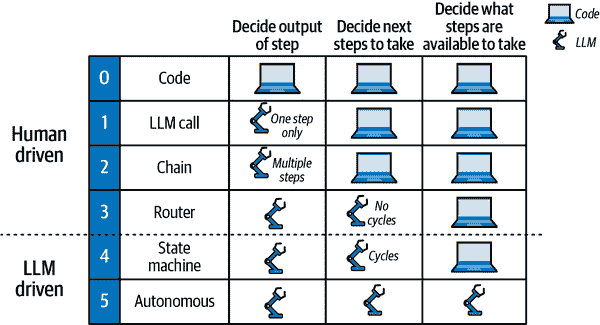
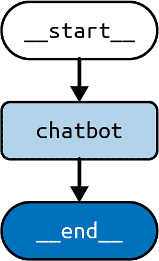

# 第五章。使用 LangGraph 的认知架构

到目前为止，我们已经了解了 LLM 应用程序最常见的特点：

+   在序言和第一章中介绍了一些提示技巧。

+   在第二章和第三章中介绍了 RAG。

+   第四章中的记忆

下一个问题应该是：我们如何将这些部分组合成一个连贯的应用程序，以实现我们设定的目标？为了与砖石建筑的领域进行类比，游泳池和一层的房子虽然由相同的材料建造，但显然服务于非常不同的目的。使它们各自适合其不同目的的是这些材料组合的计划——即它们的建筑。在构建 LLM 应用程序时也是如此。你必须做出的最重要的决定是如何将你拥有的不同组件（如 RAG、提示技巧、记忆）组合成实现你目的的东西。

在我们查看具体的架构之前，让我们通过一个例子来了解一下。你可能会构建的任何 LLM 应用程序都将从一个目的开始：应用程序被设计来做什么。假设你想构建一个电子邮件助手——一个 LLM 应用程序，它在你之前阅读你的电子邮件，并旨在减少你需要查看的电子邮件数量。应用程序可能通过存档一些不感兴趣的邮件，直接回复一些邮件，并将其他邮件标记为稍后需要你注意的邮件来实现这一点。

你可能还希望应用程序在行动上受到一些约束。列出这些约束非常有帮助，因为它们将有助于指导对正确架构的搜索。第八章更详细地介绍了这些约束以及如何处理它们。对于这个假设的电子邮件助手，假设我们希望它执行以下操作：

+   最小化它打扰你的次数（毕竟，整个目的就是节省时间）。

+   避免让你的电子邮件联系人收到你永远不会自己发送的回复。

这暗示了在构建 LLM 应用程序时经常面临的关键权衡：在*自主性*（或自主行动的能力）和*可靠性*（或你可以信任其输出的程度）之间的权衡。直观地说，如果电子邮件助手在没有你参与的情况下采取更多行动，它将更有用，但如果你做得太过分，它不可避免地会发送你希望它没有发送的电子邮件。

描述 LLM 应用程序自主程度的一种方法是通过评估应用程序的行为中有多少是由 LLM（而不是代码）决定的：

+   让 LLM 决定一个步骤的输出（例如，写一封电子邮件的草稿回复）。

+   让 LLM 决定下一步要采取的行动（例如，对于一封新邮件，决定它可以在邮件上执行的三种操作：存档、回复或标记为审阅）。

+   让 LLM 决定可以采取哪些步骤（例如，让 LLM 编写执行你未预先编程到应用程序中的动态操作的代码）。

我们可以根据它们在这个自主性谱系中的位置对构建 LLM 应用的许多流行**食谱**进行分类，即哪些任务由 LLM 处理，哪些仍然掌握在开发者或用户手中。这些食谱可以被称为**认知架构**。在人工智能领域，**认知架构**这个术语长期以来一直用来表示人类推理模型（及其在计算机中的实现）。一个 LLM 认知架构（据我们所知，这个术语最初应用于 LLM，在一篇论文中提出）可以被定义为 LLM 应用要采取步骤的食谱（见图 5-1）。例如，“步骤”可以是检索相关文档（RAG），或者使用思维链提示调用 LLM。



###### 图 5-1\. LLM 应用的认知架构

现在我们来看看你可以用来构建应用程序的每个主要架构或食谱（如图图 5-1 所示）：

0: 代码

这不是一个 LLM 认知架构（因此我们将其编号为**0**），因为它根本不使用 LLM。你可以将其视为你习惯编写的常规软件。对于这本书来说，第一个有趣的架构实际上是下一个。

1: LLM 调用

这是我们在这本书中迄今为止看到的绝大多数例子，只有一个 LLM 调用。这主要用于当它是实现特定任务（如翻译或总结一段文本）的更大应用程序的一部分时。

2: 链

次一级的是，使用预定义序列中的多个 LLM 调用。例如，一个文本到 SQL 的应用程序（它从用户那里接收一个自然语言描述，描述对数据库进行某些计算的操作）可以连续使用两个 LLM 调用：

一个 LLM 调用，根据用户提供的自然语言查询和开发者提供的数据库内容描述，生成一个 SQL 查询。

另一个 LLM 调用，根据前一个调用生成的查询，为非技术用户编写一个适当的查询解释。这可以用来使用户能够检查生成的查询是否符合他的要求。

3: 路由器

下一步是由 LLM 定义要采取的步骤序列。也就是说，链式架构总是执行由开发者确定的静态步骤序列（无论多少），而路由架构的特点是使用 LLM 在预定义的某些步骤之间进行选择。一个例子是一个具有来自不同领域多个文档索引的 RAG 应用，以下步骤如下：

1.  一个 LLM 调用，用于根据用户提供的查询和开发者提供的索引描述来选择要使用的可用索引。

1.  一个检索步骤，查询所选索引以获取用户查询的最相关文档。

1.  另一个 LLM 调用，根据用户提供的查询和从索引中检索到的相关文档列表生成答案。

这就是本章我们将讨论的内容。我们将依次讨论这些架构。下一章将讨论代理架构，这些架构更多地使用了 LLM。但首先让我们谈谈一些更好的工具，以帮助我们在这个旅程中。

# 架构#1：LLM 调用

作为 LLM 调用架构的示例，我们将回到我们在第四章中创建的聊天机器人。这个聊天机器人将直接响应用户消息。

首先创建一个`StateGraph`，我们将添加一个节点来表示 LLM 调用：

*Python*

```py
from typing import Annotated, TypedDict

from langgraph.graph import StateGraph, START, END
from langgraph.graph.message import add_messages
from langchain_openai import ChatOpenAI

model = ChatOpenAI()

class State(TypedDict):
    # Messages have the type "list". The `add_messages` 
    # function in the annotation defines how this state should 
    # be updated (in this case, it appends new messages to the 
    # list, rather than replacing the previous messages)
    messages: Annotated[list, add_messages]

def chatbot(state: State):
    answer = model.invoke(state["messages"])
    return {"messages": [answer]}

builder = StateGraph(State)
builder.add_node("chatbot", chatbot)
builder.add_edge(START, 'chatbot')
builder.add_edge('chatbot', END)

graph = builder.compile()
```

*JavaScript*

```py
import {
  StateGraph,
  Annotation,
  messagesStateReducer,
  START, END
} from '@langchain/langgraph'
import {ChatOpenAI} from '@langchain/openai'

const model = new ChatOpenAI()

const State = {
  /**
 * The State defines three things:
 * 1\. The structure of the graph's state (which "channels" are available to 
 * read/write)
 * 2\. The default values for the state's channels
 * 3\. The reducers for the state's channels. Reducers are functions that 
 * determine how to apply updates to the state. Below, new messages are 
 * appended to the messages array.
 */
  messages: Annotation({
    reducer: messagesStateReducer,
    default: () => []
  }),
}

async function chatbot(state) {
  const answer = await model.invoke(state.messages)
  return {"messages": answer}
}

const builder = new StateGraph(State)
  .addNode('chatbot', chatbot)
  .addEdge(START, 'chatbot')
  .addEdge('chatbot', END)

const graph = builder.compile()
```

我们还可以绘制图表的视觉表示：

*Python*

```py
graph.get_graph().draw_mermaid_png()
```

*JavaScript*

```py
await graph.getGraph().drawMermaidPng()
```

我们刚才制作的图表看起来像图 5-2。



###### 图 5-2. LLM 调用架构

你可以用在前面章节中看到的熟悉`stream()`方法来运行它：

*Python*

```py
input = {"messages": [HumanMessage('hi!)]} `for` `chunk` `in` `graph``.``stream``(``input``):`
    `print``(``chunk``)`
```
