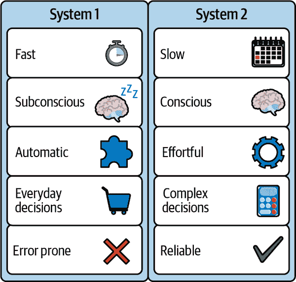
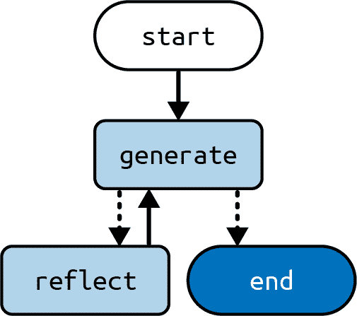
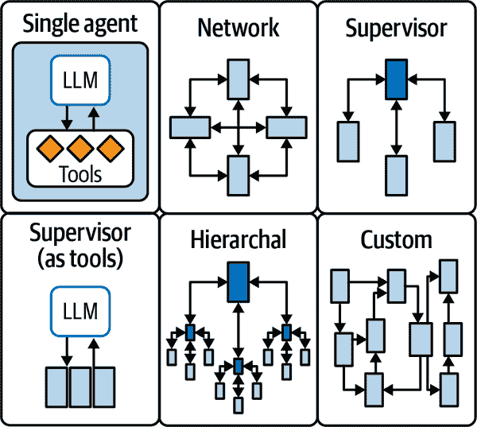

# 第七章\. 代理 II

第六章 介绍了*代理*架构，这是我们迄今为止看到的 LLM 架构中最强大的。这种组合——思维链提示、工具使用和循环——的潜力难以估量。

本章讨论了两种扩展代理架构的方法，这些方法可以提高某些用例的性能：

反思

从人类思维模式的手册中再取一页，这是关于给你的 LLM 应用程序提供机会分析其过去的输出和选择，以及记住过去迭代中的反思的能力。

多代理

与团队可以完成比单个人更多的事情一样，有些问题最好由 LLM 代理团队来解决。

让我们从反思开始。

# 反思

我们还没有介绍的一种提示技术是*反思*（也称为*自我批评*）。*反思*是在创作者提示和修订者提示之间创建一个循环。这反映了许多人类创造物的创作过程，例如你现在正在阅读的章节，它是作者、审稿人和编辑之间来回修改的结果，直到所有人都对最终产品感到满意。

与我们迄今为止看到的许多提示技术一样，反思可以与其他技术结合使用，例如思维链和工具调用。在本节中，我们将单独查看反思。

可以将这种模式与人类思维模式中的*系统 1*（反应性或本能）和*系统 2*（系统性和反思性）相类比，这是丹尼尔·卡尼曼在其著作《思考，快与慢》（Farrar, Straus and Giroux, 2011）中首次提出的。当正确应用时，自我批评可以帮助 LLM 应用程序更接近类似系统 2 行为的东西（图 7-1）。



###### 图 7-1\. 系统 1 和系统 2 思维

我们将实现反思作为一个包含两个节点：`generate` 和 `reflect` 的图。这个图将负责撰写三段式文章，`generate` 节点撰写或修改文章草稿，而 `reflect` 节点撰写评论以指导下一次修订。我们将运行固定次数的循环，但这个技术的变体可以是让 `reflect` 节点决定何时结束。让我们看看它是什么样子：

*Python*

```py
from typing import Annotated, TypedDict

from langchain_core.messages import (
    AIMessage,
    BaseMessage,
    HumanMessage,
    SystemMessage,
)
from langchain_openai import ChatOpenAI

from langgraph.graph import END, START, StateGraph
from langgraph.graph.message import add_messages

model = ChatOpenAI()

class State(TypedDict):
    messages: Annotated[list[BaseMessage], add_messages]

generate_prompt = SystemMessage(
    """You are an essay assistant tasked with writing excellent 3-paragraph 
 essays."""
    "Generate the best essay possible for the user's request."
    """If the user provides critique, respond with a revised version of your 
 previous attempts."""
)

def generate(state: State) -> State:
    answer = model.invoke([generate_prompt] + state["messages"])
    return {"messages": [answer]}

reflection_prompt = SystemMessage(
    """You are a teacher grading an essay submission. Generate critique and 
 recommendations for the user's submission."""
    """Provide detailed recommendations, including requests for length, depth, 
 style, etc."""
)

def reflect(state: State) -> State:
    # Invert the messages to get the LLM to reflect on its own output
    cls_map = {AIMessage: HumanMessage, HumanMessage: AIMessage}
    # First message is the original user request. 
    # We hold it the same for all nodes
    translated = [reflection_prompt, state["messages"][0]] + 
        cls_map[msg.__class__ 
            for msg in state["messages"][1:]
    ]
    answer = model.invoke(translated)
    # We treat the output of this as human feedback for the generator
    return {"messages": [HumanMessage(content=answer.content)]}

def should_continue(state: State):
    if len(state["messages"]) > 6:
        # End after 3 iterations, each with 2 messages
        return END
    else:
        return "reflect"

builder = StateGraph(State)
builder.add_node("generate", generate)
builder.add_node("reflect", reflect)
builder.add_edge(START, "generate")
builder.add_conditional_edges("generate", should_continue)
builder.add_edge("reflect", "generate")

graph = builder.compile()
```

*JavaScript*

```py
import {
  AIMessage,
  BaseMessage,
  SystemMessage,
  HumanMessage,
} from "@langchain/core/messages";
import { ChatOpenAI } from "@langchain/openai";
import {
  StateGraph,
  Annotation,
  messagesStateReducer,
  START,
  END,
} from "@langchain/langgraph";

const model = new ChatOpenAI();

const annotation = Annotation.Root({
  messages: Annotation({ reducer: messagesStateReducer, default: () => [] }),
});

// fix multiline string
const generatePrompt = new SystemMessage(
  `You are an essay assistant tasked with writing excellent 3-paragraph essays.
 Generate the best essay possible for the user's request.
 If the user provides critique, respond with a revised version of your 
 previous attempts.`
);

async function generate(state) {
  const answer = await model.invoke([generatePrompt, ...state.messages]);
  return { messages: [answer] };
}

const reflectionPrompt = new SystemMessage(
  `You are a teacher grading an essay submission. Generate critique and 
 recommendations for the user's submission.
 Provide detailed recommendations, including requests for length, depth, 
 style, etc.`
);

async function reflect(state) {
  // Invert the messages to get the LLM to reflect on its own output
  const clsMap: { [key: string]: new (content: string) => BaseMessage } = {
    ai: HumanMessage,
    human: AIMessage,
  };
  // First message is the original user request. 
  // We hold it the same for all nodes
  const translated = [
    reflectionPrompt,
    state.messages[0],
    ...state.messages
      .slice(1)
      .map((msg) => new clsMapmsg._getType()),
  ];
  const answer = await model.invoke(translated);
  // We treat the output of this as human feedback for the generator
  return { messages: [new HumanMessage({ content: answer.content })] };
}

function shouldContinue(state) {
  if (state.messages.length > 6) {
    // End after 3 iterations, each with 2 messages
    return END;
  } else {
    return "reflect";
  }
}

const builder = new StateGraph(annotation)
  .addNode("generate", generate)
  .addNode("reflect", reflect)
  .addEdge(START, "generate")
  .addConditionalEdges("generate", shouldContinue)
  .addEdge("reflect", "generate");

const graph = builder.compile();
```

图的视觉表示如图 7-2 所示（图 7-2）。



###### 图 7-2\. 反思架构

注意`reflect`节点如何欺骗 LLM（大型语言模型）认为它正在批评用户撰写的文章。同时，`generate`节点被设计成认为批评来自用户。这种诡计是必要的，因为对话调优的 LLM 是在人类-人工智能消息对上训练的，因此来自同一参与者的许多消息序列会导致性能下降。

另一件事需要注意：你可能会首先期望在修订步骤之后结束，但在这个架构中，我们有固定次数的`generate-reflect`循环迭代；因此，我们在`generate`之后终止（这样就可以处理最后一组请求的修订）。这种架构的变体将使`reflect`步骤做出结束过程的决策（一旦没有更多评论）。

让我们看看一个批评示例看起来像什么：

```py
{
    'messages': [
        HumanMessage(content='Your essay on the topicality of "The Little Prince" 
            and its message in modern life is well-written and insightful. You 
            have effectively highlighted the enduring relevance of the book\'s 
            themes and its importance in today\'s society. However, there are a 
            few areas where you could enhance your essay:\n\n1\. **Depth**: 
            While you touch upon the themes of cherishing simple joys, 
            nurturing connections, and understanding human relationships, 
            consider delving deeper into each of these themes. Provide specific 
            examples from the book to support your points and explore how these 
            themes manifest in contemporary life.\n\n2\. **Analysis**: Consider 
            analyzing how the book\'s messages can be applied to current 
            societal issues or personal experiences. For instance, you could 
            discuss how the Little Prince\'s perspective on materialism relates 
            to consumer culture or explore how his approach to relationships 
            can inform interpersonal dynamics in the digital age.\n\n3\. 
            **Length**: Expand on your ideas by adding more examples, 
            discussing counterarguments, or exploring the cultural impact of 
            "The Little Prince" in different parts of the world. This will 
            enrich the depth of your analysis and provide a more comprehensive 
            understanding of the book\'s relevance.\n\n4\. **Style**: Your essay 
            is clear and well-structured. To enhance the engagement of your 
            readers, consider incorporating quotes from the book to illustrate 
            key points or including anecdotes to personalize your analysis.
            \n\n5\. **Conclusion**: Conclude your essay by summarizing the 
            enduring significance of "The Little Prince" and how its messages 
            can inspire positive change in modern society. Reflect on the 
            broader implications of the book\'s themes and leave the reader 
            with a lasting impression.\n\nBy expanding on your analysis, 
            incorporating more examples, and deepening your exploration of the 
            book\'s messages, you can create a more comprehensive and 
            compelling essay on the topicality of "The Little Prince" in modern 
            life. Well done on your thoughtful analysis, and keep up the good 
            work!', id='70c22b1d-ec96-4dc3-9fd0-d2c6463f9e2c'),
    ],
}
```

最终输出：

```py
{
    'messages': [
        AIMessage(content='"The Little Prince" by Antoine de Saint-Exupéry 
            stands as a timeless masterpiece that continues to offer profound 
            insights into human relationships and values, resonating with 
            readers across generations. The narrative of the Little Prince\'s 
            travels and encounters with a myriad of characters serves as a rich 
            tapestry of allegorical representations, ....', response_metadata=
            {'token_usage': {'completion_tokens': 420, 'prompt_tokens': 2501, 
            'total_tokens': 2921}, 'model_name': 'gpt-3.5-turbo', 
            'system_fingerprint': None, 'finish_reason': 'stop', 'logprobs': 
            None}, id='run-2e8f9f13-f625-4820-9c8b-b64e1c23daa2-0', 
            usage_metadata={'input_tokens': 2501, 'output_tokens': 420, 
            'total_tokens': 2921}),
    ],
}
```

这种简单的反思类型有时可以通过让 LLM 多次尝试改进其输出，并允许反思节点在批评输出时采用不同的角色来提高性能。

这种架构有几种可能的变体。例如，我们可以将反思步骤与第六章中讨论的智能体架构结合，将其作为发送输出到用户之前的最后一个节点添加。这将使批评看起来像来自用户，并给应用程序一个机会在不直接干预用户的情况下改进其最终输出。显然，这种方法将以更高的延迟为代价。

在某些用例中，使用外部信息来具体化批评可能很有帮助。例如，如果你正在编写一个代码生成代理，你可以在`reflect`之前添加一个步骤，该步骤将代码通过代码检查器或编译器运行，并将任何错误作为`reflect`的输入。

###### 小贴士

当这种方法可行时，我们强烈建议尝试它，因为它很可能会提高最终输出的质量。

# LangGraph 中的子图

在我们深入探讨多智能体架构之前，让我们看看 LangGraph 中的一个重要技术概念，它使得多智能体架构成为可能。*子图*是作为另一个图的一部分使用的图。以下是子图的一些用例：

+   构建多智能体系统（下一节讨论）。

+   当你想要在多个图中重用一组节点时，你可以在子图中定义一次，然后在使用时在多个父图中调用它们。

+   当你希望不同的团队独立地工作在图的各个部分时，你可以将每个部分定义为子图，只要尊重子图接口（输入和输出模式），父图就可以构建，而不需要了解子图的任何细节。

向父图中添加子图节点有两种方式：

添加一个直接调用子图的节点

当父图和子图共享状态键，并且你不需要在输入或输出过程中转换状态时，这很有用。

添加一个调用子图的功能节点

当父图和子图具有不同的状态模式，并且需要在调用子图之前或之后转换状态时，这很有用。

让我们逐一看看。

## 直接调用子图

创建子图节点最简单的方法是将子图直接作为节点附加。在这种情况下，重要的是父图和子图共享状态键，因为那些共享键将被用于通信。（如果你的图和子图没有共享任何键，请参阅下一节。）

###### 备注

如果你向子图节点传递额外的键（即除了共享键之外），子图节点将忽略它们。同样，如果你从子图返回额外的键，父图也会忽略它们。

让我们看看它在实际操作中的样子：

*Python*

```py
from langgraph.graph import START, StateGraph
from typing import TypedDict

class State(TypedDict):
    foo: str # this key is shared with the subgraph

class SubgraphState(TypedDict):
    foo: str # this key is shared with the parent graph
    bar: str

# Define subgraph
def subgraph_node(state: SubgraphState):
    # note that this subgraph node can communicate with the parent graph 
    # via the shared "foo" key
    return {"foo": state["foo"] + "bar"}

subgraph_builder = StateGraph(SubgraphState)
subgraph_builder.add_node(subgraph_node)
...
subgraph = subgraph_builder.compile()

# Define parent graph
builder = StateGraph(State)
builder.add_node("subgraph", subgraph)
...
graph = builder.compile()
```

*JavaScript*

```py
import { StateGraph, Annotation, START } from "@langchain/langgraph";

const StateAnnotation = Annotation.Root({
  foo: Annotation(),
});

const SubgraphStateAnnotation = Annotation.Root({
  // note that this key is shared with the parent graph state
  foo: Annotation(), 
  bar: Annotation(),
});

// Define subgraph
const subgraphNode = async (state) => {
  // note that this subgraph node can communicate with
  // the parent graph via the shared "foo" key
  return { foo: state.foo + "bar" };
};

const subgraph = new StateGraph(SubgraphStateAnnotation)
  .addNode("subgraph", subgraphNode);
  ...
  .compile();

// Define parent graph
const parentGraph = new StateGraph(StateAnnotation)
  .addNode("subgraph", subgraph)
  .addEdge(START, "subgraph")
  // Additional parent graph setup would go here
  .compile();
```

## 使用函数调用子图

你可能想定义一个具有完全不同模式的子图。在这种情况下，你可以创建一个调用子图的功能节点。这个函数需要在调用子图之前将输入（父图）状态转换为子图状态，并在返回节点状态更新之前将结果转换回父图状态。

让我们看看它是什么样子：

*Python*

```py
class State(TypedDict):
    foo: str

class SubgraphState(TypedDict):
    # none of these keys are shared with the parent graph state
    bar: str
    baz: str

# Define subgraph
def subgraph_node(state: SubgraphState):
    return {"bar": state["bar"] + "baz"}

subgraph_builder = StateGraph(SubgraphState)
subgraph_builder.add_node(subgraph_node)
...
subgraph = subgraph_builder.compile()

# Define parent graph
def node(state: State):
    # transform the state to the subgraph state
    response = subgraph.invoke({"bar": state["foo"]})
    # transform response back to the parent state
    return {"foo": response["bar"]}

builder = StateGraph(State)
# note that we are using `node` function instead of a compiled subgraph
builder.add_node(node)
...
graph = builder.compile()
```

*JavaScript*

```py
import { StateGraph, START, Annotation } from "@langchain/langgraph";

const StateAnnotation = Annotation.Root({
  foo: Annotation(),
});

const SubgraphStateAnnotation = Annotation.Root({
  // note that none of these keys are shared with the parent graph state
  bar: Annotation(),
  baz: Annotation(),
});

// Define subgraph
const subgraphNode = async (state) => {
  return { bar: state.bar + "baz" };
};

const subgraph = new StateGraph(SubgraphStateAnnotation)
  .addNode("subgraph", subgraphNode);
  ...
  .compile();

// Define parent graph
const subgraphWrapperNode = async (state) => {
  // transform the state to the subgraph state
  const response = await subgraph.invoke({
    bar: state.foo,
  });
  // transform response back to the parent state
  return {
    foo: response.bar,
  };
}

const parentGraph = new StateGraph(StateAnnotation)
  .addNode("subgraph", subgraphWrapperNode)
  .addEdge(START, "subgraph")
  // Additional parent graph setup would go here
  .compile();
```

现在我们已经知道了如何使用子图，让我们来看看它们的其中一个主要用途：多智能体架构。

# 多智能体架构

随着 LLM 智能体在规模、范围或复杂性方面的增长，可能会出现几个问题并影响其性能，例如以下问题：

+   智能体被赋予了太多的工具可供选择，并且对下一个要调用的工具做出了糟糕的决定（第六章讨论了一些解决这个问题的方法）。

+   环境变得过于复杂，单个智能体难以跟踪；也就是说，提示的大小和它们提到的内容数量超出了你使用的模型的能力。

+   你可能想为特定领域使用专门的子系统，例如，规划、研究、解决数学问题等。

为了解决这些问题，你可能需要考虑将你的应用程序分解成多个更小、独立的智能体，并将它们组合成一个多智能体系统。这些独立的智能体可以像提示和 LLM 调用那样简单，也可以像在第六章中介绍的 ReAct 智能体（introduced in Chapter 6）那样复杂。图 7-3 展示了在多智能体系统中连接智能体的几种方式。



###### 图 7-3\. 协调多个智能体的多种策略

让我们更详细地看看图 7-3：

网络

每个智能体都可以与其他所有智能体进行通信。任何智能体都可以决定下一个要执行的智能体是哪一个。

管理员

每个代理与一个称为监督者的单个代理进行通信。监督者代理决定下一个应该调用哪个代理（或代理组）。这种架构的特殊情况将监督者代理实现为一个带有工具的 LLM 调用，如第六章（ch06.html#ch06_agent_architecture_1736545671750341）所述。

层次结构

您可以使用具有监督者监督者的多代理系统。这是监督者架构的推广，允许更复杂的控制流。

自定义多代理工作流程

每个代理只与代理子集进行通信。流程的一部分是确定性的，只有选择性的代理可以决定下一个调用哪个代理。

下一节将更深入地探讨监督者架构，我们认为它在功能和易用性之间取得了良好的平衡。

## 监督者架构

在这个架构中，我们将每个代理作为节点添加到图中，并添加一个监督者节点，该节点决定下一个应该调用哪个代理。我们使用条件边根据监督者的决策将执行路由到适当的代理节点。请参阅第五章以了解 LangGraph 的介绍，其中介绍了节点、边等概念。

让我们先看看监督者节点是什么样的：

*Python*

```py
from typing import Literal
from langchain_openai import ChatOpenAI
from pydantic import BaseModel

class SupervisorDecision(BaseModel):
    next: Literal["researcher", "coder", "FINISH"]

model = ChatOpenAI(model="gpt-4o", temperature=0)
model = model.with_structured_output(SupervisorDecision)

agents = ["researcher", "coder"]

system_prompt_part_1 = f"""You are a supervisor tasked with managing a 
conversation between the following workers: {agents}. Given the following user 
request, respond with the worker to act next. Each worker will perform a
task and respond with their results and status. When finished,
respond with FINISH."""

system_prompt_part_2 = f"""Given the conversation above, who should act next? Or 
 should we FINISH? Select one of: {', '.join(agents)}, FINISH"""

def supervisor(state):
    messages = [
        ("system", system_prompt_part_1),
        *state["messages"],
        ("system", 	system_prompt_part_2)
    ]
    return model.invoke(messages)
```

*JavaScript*

```py
import { ChatOpenAI } from 'langchain-openai';
import { z } from 'zod';

const SupervisorDecision = z.object({
  next: z.enum(['researcher', 'coder', 'FINISH']),
});

const model = new ChatOpenAI({ model: 'gpt-4o', temperature: 0 });
const modelWithStructuredOutput = model.withStructuredOutput(SupervisorDecision);

const agents = ['researcher', 'coder'];

const systemPromptPart1 = `You are a supervisor tasked with managing a 
 conversation between the following workers: ${agents.join(', ')}. Given the 
 following user request, respond with the worker to act next. Each worker 
 will perform a task and respond with their results and status. When 
 finished, respond with FINISH.`;

const systemPromptPart2 = `Given the conversation above, who should act next? Or 
 should we FINISH? Select one of: ${agents.join(', ')}, FINISH`;

const supervisor = async (state) => {
  const messages = [
    { role: 'system', content: systemPromptPart1 },
    ...state.messages,
    { role: 'system', content: systemPromptPart2 }
  ];

  return await modelWithStructuredOutput.invoke({ messages });
};
```

###### 注意

提示中的代码要求您的子代理名称具有自解释性和独特性。例如，如果它们只是简单地称为`agent_1`和`agent_2`，LLM 将没有信息来决定哪个适合每个任务。如果需要，您可以修改提示以添加每个代理的描述，这可以帮助 LLM 为每个查询选择代理。

现在我们来看看如何将这个监督节点整合到一个更大的图中，这个图包括另外两个子代理，我们将它们称为研究员和程序员。我们使用这个图的整体目标是处理可以由研究员单独回答或程序员单独回答，或者甚至两者依次回答的查询。这个例子不包括研究员或程序员的实现——关键思想是它们可以是任何其他 LangGraph 图或节点：

*Python*

```py
from typing import Literal
from langchain_openai import ChatOpenAI
from langgraph.graph import StateGraph, MessagesState, START

model = ChatOpenAI()

class AgentState(BaseModel):
    next: Literal["researcher", "coder", "FINISH"]

def researcher(state: AgentState):
    response = model.invoke(...)
    return {"messages": [response]}

def coder(state: AgentState):
    response = model.invoke(...)
    return {"messages": [response]}

builder = StateGraph(AgentState)
builder.add_node(supervisor)
builder.add_node(researcher)
builder.add_node(coder)

builder.add_edge(START, "supervisor")
# route to one of the agents or exit based on the supervisor's decision
builder.add_conditional_edges("supervisor", lambda state: state["next"])
builder.add_edge("researcher", "supervisor")
builder.add_edge("coder", "supervisor")

supervisor = builder.compile()
```

*JavaScript*

```py
import {
  StateGraph,
  Annotation,
  MessagesAnnotation,
  START,
  END,
} from "@langchain/langgraph";
import { ChatOpenAI } from "@langchain/openai";

const model = new ChatOpenAI({
  model: "gpt-4o",
});

const StateAnnotation = Annotation.Root({
  ...MessagesAnnotation.spec,
  next: Annotation(),
});

const researcher = async (state) => {
  const response = await model.invoke(...);
  return { messages: [response] };
};

const coder = async (state) => {
  const response = await model.invoke(...);
  return { messages: [response] };
};

const graph = new StateGraph(StateAnnotation)
  .addNode("supervisor", supervisor)
  .addNode("researcher", researcher)
  .addNode("coder", coder)
  .addEdge(START, "supervisor")
  // route to one of the agents or exit based on the supervisor's decision
  .addConditionalEdges("supervisor", async (state) => 
    state.next === 'FINISH' ? END : state.next)
  .addEdge("researcher", "supervisor")
  .addEdge("coder", "supervisor")
  .compile();
```

有几点需要注意：在这个例子中，两个子代理（研究员和程序员）都可以看到对方的工作，因为所有进度都记录在消息列表中。这不是组织这种结构的唯一方式。每个子代理可能更复杂。例如，一个子代理可能是一个维护内部状态的自己的图，并且只输出它所做工作的摘要。

在每个代理执行完毕后，我们返回到管理节点，该节点决定是否还有更多工作要做，如果有，则将任务委托给哪个代理。这种路由对于这种架构并不是一个硬性要求；我们可以让每个子代理决定其输出是否应该直接返回给用户。为此，我们需要用条件边替换，比如说，研究员和管理员之间的硬边（该条件边将读取由研究员更新的某些状态键）。

# 摘要

本章介绍了对代理架构的两个重要扩展：反思和多代理架构。本章还探讨了如何在 LangGraph 中处理子图，这些子图是多代理系统的一个关键构建块。

这些扩展增强了 LLM 代理架构的功能，但在创建新代理时，它们不应该是您首先考虑的事情。通常，从我们在第六章中讨论的直接架构开始是最好的选择。

第八章 回顾了可靠性和自主性之间的权衡，这是今天构建 LLM 应用时的关键设计决策。当使用代理或多代理架构时，这一点尤为重要，因为如果不加以控制，它们的强大功能是以可靠性为代价的。在深入探讨这种权衡存在的原因之后，第八章 将介绍您可利用的最重要技术来导航这一决策，并最终改善您的 LLM 应用和代理。
