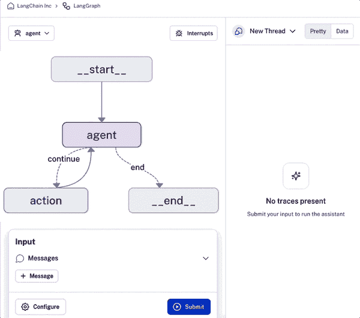
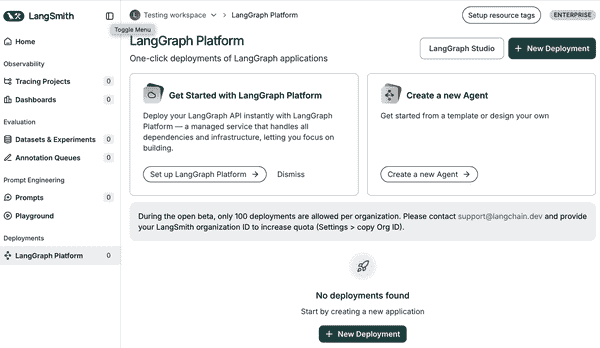
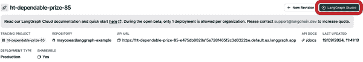
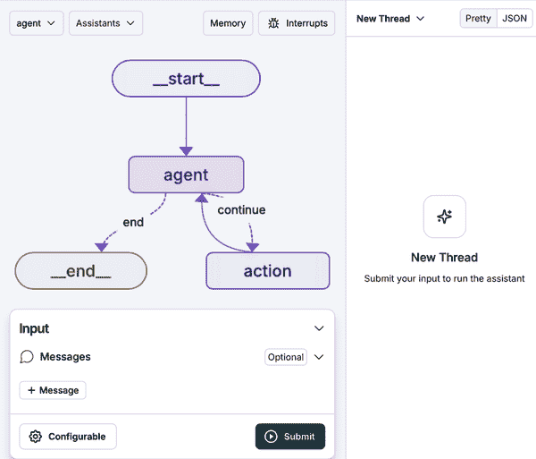
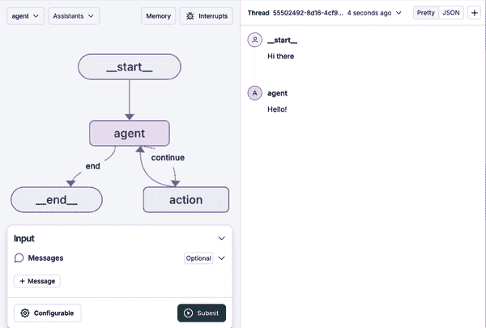

# 第九章\. 部署：将您的 AI 应用程序投入生产

到目前为止，我们已经探讨了帮助您构建 AI 应用程序核心功能的关键概念、思想和工具。您已经学习了如何利用 LangChain 和 LangGraph 生成 LLM 输出、索引和检索数据，以及启用记忆和代理。

但您的应用程序仅限于您的本地环境，因此外部用户还不能访问其功能。

在本章中，您将学习将您的 AI 应用程序部署到生产环境中的最佳实践。我们还将探索各种工具来调试、协作、测试和监控您的 LLM 应用程序。

让我们开始吧。

# 前提条件

为了有效地部署您的 AI 应用程序，您需要利用各种服务来托管您的应用程序、存储和检索数据，以及监控您的应用程序。在本章的部署示例中，我们将包含以下服务：

向量存储

Supabase

监控和调试

LangSmith

后端 API

LangGraph 平台

我们将深入了解这些组件和服务，并了解如何根据您的用例进行适配。但首先，让我们安装必要的依赖项并设置环境变量。

如果您想跟随示例，请将此[LangChain 模板](https://oreil.ly/brqVm)分叉到您的 GitHub 账户。此存储库包含基于检索代理的 AI 应用程序的完整逻辑。

## 安装依赖项

首先，按照[*README.md*文件](https://oreil.ly/N5eqe)中的说明安装项目依赖项。

如果您不使用模板，您可以从相应的*pyproject.toml*或*package.json*文件中单独安装依赖项。

第二，创建一个 *.env* 文件并存储以下变量：

```py
OPENAI_API_KEY=
SUPABASE_URL=
SUPABASE_SERVICE_ROLE_KEY=

# for tracing
LANGCHAIN_TRACING_V2=true
LANGCHAIN_ENDPOINT="https://api.smith.langchain.com"
LANGCHAIN_API_KEY=
```

接下来，我们将逐步介绍检索这些变量值的过程。

## 大型语言模型

LLM 负责根据给定的查询生成输出。LangChain 提供了访问流行的 LLM 提供商，包括 OpenAI、Anthropic、Google 和 Cohere。

在本部署示例中，我们将通过检索[API 密钥](https://oreil.ly/MIpY5)来利用 OpenAI，如图 9-1 所示。一旦您检索到您的 API 密钥，请在您的*.env*文件中将值输入为`OPENAI_API_KEY`。


###### 图 9-1\. OpenAI API 密钥仪表板

## 向量存储

如前几章所述，向量存储是一个特殊的数据库，负责存储和管理您数据的向量表示——换句话说，嵌入。向量存储使相似性搜索和上下文检索成为可能，以帮助 LLM 根据用户的查询生成准确的答案。

对于我们的部署，我们将使用 Supabase——一个 PostgreSQL 数据库——作为向量存储。Supabase 使用`pgvector`扩展来存储嵌入和查询向量以进行相似性搜索。

如果您还没有这样做，请创建一个[Supabase 账户](https://oreil.ly/CXDsx)。一旦您创建了账户，点击仪表板页面上的“新建项目”。按照步骤操作，并在创建后保存数据库密码，如图图 9-2 所示。


###### 图 9-2. Supabase 项目创建仪表板

一旦您的 Supabase 项目创建完成，导航到项目设置选项卡，并在配置下选择 API。在这个新标签页下，您将看到项目 URL 和项目 API 密钥。

在您的*.env*文件中，将项目 URL 复制并粘贴到`SUPABASE_URL`的值，将`service_role`秘密 API 密钥作为`SUPABASE_SERVICE_ROLE_KEY`的值。

在 Supabase 菜单中导航到 SQL 编辑器，并运行以下 SQL 脚本。首先，让我们启用`pgvector`：

```py
## Enable the pgvector extension to work with embedding vectors
create extension vector;
```

现在创建一个名为`documents`的表来存储您数据中的向量：

```py
## Create a table to store your documents

create table documents (
  id bigserial primary key,
  content text, -- corresponds to Document.pageContent
  metadata jsonb, -- corresponds to Document.metadata
  embedding vector(1536) -- 1536 works for OpenAI embeddings, change if needed
);
```

现在，你应该能在 Supabase 数据库中看到`documents`表。

现在，您可以创建一个脚本来生成您数据的嵌入，存储它们，并从数据库中进行查询。再次打开 Supabase SQL 编辑器，并运行以下脚本：

```py
## Create a function to search for documents
create function match_documents (
  query_embedding vector(1536),
  match_count int DEFAULT null,
  filter jsonb DEFAULT '{}'
) returns table (
  id bigint,
  content text,
  metadata jsonb,
  embedding jsonb,
  similarity float
)
language plpgsql
as $$
#variable_conflict use_column
begin
  return query
  select
    id,
    content,
    metadata,
    (embedding::text)::jsonb as embedding,
    1 - (documents.embedding <=> query_embedding) as similarity
  from documents
  where metadata @> filter
  order by documents.embedding <=> query_embedding
  limit match_count;
end;
$$;
```

`match_documents` 数据库函数接受一个 `query_embedding` 向量，并使用余弦相似度将其与 `documents` 表中的嵌入进行比较。它为每个文档计算一个相似度分数（1 - (`documents.embedding` <=> `query_embedding`))，然后返回最相似的匹配项。结果如下：

1.  首先根据过滤器参数中指定的元数据标准进行过滤（使用 JSON 包含@>）。

1.  按相似度分数排序（从高到低）。

1.  限制在`match_count`中指定的匹配数量。

一旦生成了向量相似度函数，您可以通过导入类并提供必要的参数将 Supabase 用作向量存储。以下是如何工作的一个示例：

*Python*

```py
import os

from langchain_community.vectorstores import SupabaseVectorStore
from langchain_openai import OpenAIEmbeddings
from supabase.client import Client, create_client

supabase_url = os.environ.get("SUPABASE_URL")
supabase_key = os.environ.get("SUPABASE_SERVICE_ROLE_KEY")
supabase: Client = create_client(supabase_url, supabase_key)

embeddings = OpenAIEmbeddings()

## Assuming you've already generated embeddings of your data

vector_store = SupabaseVectorStore(
    embedding=embeddings,
    client=supabase,
    table_name="documents",
    query_name="match_documents",
)

## Test that similarity search is working

query = "What is this document about?"
matched_docs = vector_store.similarity_search(query)

print(matched_docs[0].page_content)
```

*JavaScript*

```py
import {
  SupabaseVectorStore
} from "@langchain/community/vectorstores/supabase";
import { OpenAIEmbeddings } from "@langchain/openai";

import { createClient } from "@supabase/supabase-js";

const embeddings = new OpenAIEmbeddings();

const supabaseClient = createClient(
  process.env.SUPABASE_URL,
  process.env.SUPABASE_SERVICE_ROLE_KEY
);

const vectorStore = new SupabaseVectorStore(embeddings, {
  client: supabaseClient,
  tableName: "documents",
  queryName: "match_documents",
});

// Example documents structure of your data

const document1: Document = {
  pageContent: "The powerhouse of the cell is the mitochondria",
  metadata: { source: "https://example.com" },
};

const document2: Document = {
  pageContent: "Buildings are made out of brick",
  metadata: { source: "https://example.com" },
};

const documents = [document1, document2]

//Embed and store the data in the database

await vectorStore.addDocuments(documents, { ids: ["1", "2"] });

// Query the Vector Store

const filter = { source: "https://example.com" };

const similaritySearchResults = await vectorStore.similaritySearch(
  "biology",
  2,
  filter
);

for (const doc of similaritySearchResults) {
  console.log(`* ${doc.pageContent} [${JSON.stringify(doc.metadata, null)}]`);
}

```

*输出：*

```py
The powerhouse of the cell is the mitochondria [{"source":"https://example.com"}]

```

您可以在之前提到的 Github LangChain 模板中查看 Supabase 向量存储实现的完整逻辑。

## 后端 API

如前几章所述，LangGraph 是一个用于构建由 LLMs 驱动的复杂智能系统的低级开源框架。LangGraph 允许您对应用程序的流程和状态进行细粒度控制，内置持久性，以及高级人机交互和记忆功能。图 9-3 展示了 LangGraph 的控制流。


###### 图 9-3. LangGraph API 控制流示例

要部署一个利用 LangGraph 的 AI 应用程序，我们将使用 LangGraph 平台。LangGraph 平台是一个托管服务，用于大规模部署和托管 LangGraph 代理。

随着你的代理用例获得关注，代理之间不均匀的任务分配可能导致系统过载，从而导致停机。LangGraph 平台管理水平扩展的任务队列、服务器和一个强大的 Postgres 检查点，以处理许多并发用户并有效地存储大型状态和线程。这确保了容错可伸缩性。

LangGraph 平台旨在支持现实世界的交互模式。除了流式传输和人工干预功能外，LangGraph 平台还支持以下功能：

+   双重文本处理以处理持续图线程上的新用户输入

+   异步后台作业用于处理长时间运行的任务

+   Cron 作业用于按计划运行常见任务

LangGraph 平台还提供了一种集成解决方案，用于协作、部署和监控代理 AI 应用程序。它包括 [LangGraph Studio](https://oreil.ly/2Now-)——一个用于调试、编辑和测试代理的可视化游乐场。LangGraph Studio 还允许你与团队成员共享你的 LangGraph 代理，以获得协作反馈和快速迭代，如图 图 9-4 所示。



###### 图 9-4\. LangGraph Studio UI 快照

此外，LangGraph 平台通过实现一键提交，简化了代理部署。

## 创建 LangSmith 账户

LangSmith 是一个一站式开发者平台，它使你能够调试、协作、测试和监控你的 LLM 应用程序。LangGraph 平台与 LangSmith 无缝集成，并可在 LangSmith UI 中访问。

要在 LangGraph 平台上部署你的应用程序，你需要创建一个 [LangSmith 账户](https://oreil.ly/2WVCn)。登录仪表板后，导航到设置页面，然后滚动到 API 密钥部分并点击创建 API 密钥。你应该看到一个类似于 图 9-5 的用户界面。


###### 图 9-5\. 创建 LangSmith API 密钥 UI

将 API 密钥值复制到你的 *.env* 文件中的 `LANGCHAIN_API_KEY`。

导航到“使用和计费”并设置你的计费详情。然后点击“计划和计费”选项卡和“升级到 Plus”按钮，以获取过渡到 LangSmith Plus 计划的说明，这将启用 LangGraph 平台的使用。如果你更喜欢使用免费的自行托管部署，可以按照 [此处说明](https://oreil.ly/TBgSQ) 进行操作。请注意，此选项需要管理基础设施，包括设置和维护所需的数据库和 Redis 实例。

# 理解 LangGraph 平台 API

在 LangGraph 平台上部署你的 AI 应用程序之前，了解 LangGraph API 的每个组件如何工作非常重要。这些组件通常可以分为数据模型和功能。

## 数据模型

LangGraph 平台 API 包含几个核心数据模型：

+   助手

+   线程

+   运行

+   定时任务

### 助手

一个*助手*是`CompiledGraph`的配置实例。它抽象了图的认知架构，并包含实例特定的配置和元数据。多个助手可以引用相同的图，但可以包含不同的配置和元数据——这可能会区分助手的操作。助手（即图）作为运行的一部分被调用。

LangGraph 平台 API 提供了一些端点用于创建和管理助手。

### 线程

一个*线程*包含了一组运行的累积状态。如果一个运行在一个线程上执行，那么助手的底层图的状态将被持久化到线程中。可以检索线程的当前和历史状态。为了持久化状态，必须在执行运行之前创建线程。特定时间点的线程状态称为*检查点*。

LangGraph 平台 API 提供了一些端点用于创建和管理线程及其状态。

### 运行

一个*运行*是对助手的调用。每个运行可能有自己的输入、配置和元数据——这可能会影响底层图的执行和输出。运行可以选择在线程上执行。

LangGraph 平台 API 提供了一些端点用于创建和管理运行。

### 定时任务

LangGraph 平台支持*定时任务*，这允许图按照用户定义的日程运行。用户指定一个日程、一个助手和一个输入。然后 LangGraph 平台创建一个新的线程，并使用指定的助手将指定的输入发送到该线程。

## 功能

LangGraph 平台 API 还提供了一些支持复杂代理架构的功能，包括以下内容：

+   流式传输

+   人工介入

+   双重发送

+   无状态运行

+   Webhooks

### 流式传输

流式传输对于确保 LLM 应用对最终用户感觉响应至关重要。在创建流式传输运行时，流式传输模式决定了哪些数据被流式传输回 API 客户端。LangGraph 平台 API 支持五种流式传输模式：

值

在每个超级步骤执行后流式传输图的完整状态。

消息

流式传输完整的消息（节点执行结束时）以及节点内部生成的任何消息的令牌。此模式主要用于支持聊天应用。这仅在你图包含`messages`键时才是一个选项。

更新

在每个节点执行后流式传输图的状态更新。

事件

流式传输图执行期间发生的所有事件（包括图的状态）。这可以用于为 LLM 进行按令牌流式传输。

调试

在图执行过程中流式传输调试事件。

### 人工介入

如果让其自主运行，复杂的代理可能会采取意外的行动，导致灾难性的应用程序结果。为了防止这种情况，建议进行人工干预，尤其是在涉及调用某些工具或访问特定文档的应用程序逻辑检查点处。LangGraph 平台使你能够插入这种人工干预行为，以确保你的图不会产生不希望的结果。

### 双重短信

图执行可能比预期更长，并且用户可能会发送一条消息，然后在图运行完成之前再发送第二条消息。这被称为*双重短信*。例如，用户可能会注意到他们原始请求中的一个错误，并编辑提示并重新发送。在这种情况下，防止你的图以意外的方式行为并确保良好的用户体验非常重要。LangGraph 平台提供了四种不同的解决方案来处理双重短信：

拒绝

这将拒绝任何后续运行，并且不允许双重短信。

入队

此选项将继续第一次运行，直到它完成整个运行，然后发送新的输入作为单独的运行。

中断

此选项中断当前执行但保存到该点为止所做的所有工作。然后插入用户输入并从那里继续。如果你启用此选项，你的图应该能够处理可能出现的奇怪边缘情况。

回滚

此选项回滚到该点为止所做的所有工作。然后发送用户输入，就像它刚刚跟随原始运行输入一样。

### 无状态运行

所有运行都使用内置的检查点器来存储运行的检查点。然而，有时只需启动一个运行而不必担心显式创建线程并保留这些检查点器可能非常有用。*无状态*运行允许你通过暴露一个端点来完成这些事情：

+   接收用户输入

+   创建线程

+   运行代理，但跳过所有检查点步骤

+   之后清理线程

无状态运行会在保持内存完整的情况下重试。然而，在无状态后台运行的情况下，如果任务工作进程在中间死亡，整个运行将从头开始重试。

### Webhooks

LangGraph 平台还支持完成 *webhooks*。提供一个 webhook URL，当运行完成时通知你的应用程序。

# 在 LangGraph 平台上部署您的 AI 应用程序

到目前为止，你已经为推荐的服务创建了账户，在你的 *.env* 文件中填写了所有必要的环境变量的值，并完成了你的 AI 应用程序的核心逻辑。接下来，我们将采取必要的步骤来有效地部署你的应用程序。

## 创建 LangGraph API 配置

在部署之前，你需要使用一个名为 [LangGraph API 配置文件 *langgraph.json*](https://oreil.ly/aVDhd) 来配置你的应用程序。以下是在 Python 仓库中该文件的一个示例：

*Python*

```py
{
    "dependencies": ["./my_agent"],
    "graphs": {
        "agent": "./my_agent/agent.py:graph"
    },
    "env": ".env"
}
```

以下是一个示例仓库结构：

```py
my-app/
├── my_agent # all project code lies within here
│   ├── utils # utilities for your graph
│   │   ├── __init__.py
│   │   ├── tools.py # tools for your graph
│   │   ├── nodes.py # node functions for you graph
│   │   └── state.py # state definition of your graph
│   ├── requirements.txt # package dependencies
│   ├── __init__.py
│   └── agent.py # code for constructing your graph
├── .env # environment variables
└── langgraph.json # configuration file for LangGraph
```

注意，*langgraph.json* 文件放置在与包含编译后的图和关联依赖项的文件相同的级别或更高。

此外，依赖项在 *requirements.txt* 文件中指定。但它们也可以在 *pyproject.toml*、*setup.py* 或 *package.json* 文件中指定。

这里是每个属性的含义：

依赖项

LangGraph 平台 API 服务器依赖项数组

图

从图 ID 到定义编译后的图或创建图的函数的路径的映射

环境

到你的 *.env* 文件或环境变量到其值的映射（你可以在[这里](https://oreil.ly/bPA0W)了解更多关于 `langgraph.json` 文件配置的信息）

## 本地测试 LangGraph 应用

在部署之前在本地测试你的应用程序确保没有错误或依赖项冲突。为此，我们将利用 LangGraph CLI，它包括运行具有热重载和调试功能的本地开发服务器的命令。

对于 Python，安装 Python `langgraph-cli` 包（注意：这需要 Python 3.11 或更高版本）：

```py
pip install -U "langgraph-cli[inmem]"
```

或者对于 JavaScript，按照以下方式安装包：

```py
npm i @langchain/langgraph-cli

```

一旦 CLI 安装完成，运行以下命令以启动 API：

```py
langgraph dev
```

这将启动 LangGraph API 服务器本地。如果运行成功，你应该看到类似以下内容：

```py
Ready!
API: http://localhost:2024
Docs: http://localhost:2024/docs
```

LangGraph 平台 API 参考文档在每个部署的 */docs* 路径下可用 (*http://localhost:2024/docs*)。

与本地 API 服务器交互的最简单方法是使用自动启动的 LangGraph Studio UI。或者，你可以像这个示例中那样使用 cURL 与本地 API 服务器交互：

```py
curl --request POST \
    --url http://localhost:8123/runs/stream \
    --header 'Content-Type: application/json' \
    --data '{
    "assistant_id": "agent",
    "input": {
        "messages": [
            {
                "role": "user",
                "content": "How are you?"
            }
        ]
    },
    "metadata": {},
    "config": {
        "configurable": {}
    },
    "multitask_strategy": "reject",
    "stream_mode": [
        "values"
    ]
}'
```

如果你收到一个有效的响应，那么你的应用程序运行良好。接下来，我们可以使用 LangGraph SDK 与服务器交互。

这里有一个初始化 SDK 客户端和调用图的示例：

*Python*

```py
from langgraph_sdk import get_client

# only pass the url argument to get_client() if you changed the default port 
# when calling langgraph up
client = get_client()
# Using the graph deployed with the name "agent"
assistant_id = "agent"
thread = await client.threads.create()

input = {"messages": [{"role": "user", "content": "what's the weather in sf"}]}
async for chunk in client.runs.stream(
    thread["thread_id"],
    assistant_id,
    input=input,
    stream_mode="updates",
):
    print(f"Receiving new event of type: {chunk.event}...")
    print(chunk.data)
    print("\n\n")
```

*JavaScript*

```py
import { Client } from "@langchain/langgraph-sdk";

// only set the apiUrl if you changed the default port when calling langgraph up
const client = new Client();
// Using the graph deployed with the name "agent"
const assistantId = "agent";
const thread = await client.threads.create();

const input = {
  messages: [{ "role": "user", "content": "what's the weather in sf"}]
}

const streamResponse = client.runs.stream(
  thread["thread_id"],
  assistantId,
  {
    input: input,
    streamMode: "updates",
  }
);
for await (const chunk of streamResponse) {
  console.log(`Receiving new event of type: ${chunk.event}...`);
  console.log(chunk.data);
  console.log("\n\n");
}
```

如果你的 LangGraph 应用程序运行正确，你应该在控制台看到你的图输出。

## 从 LangSmith UI 部署

到目前为止，你应该已经完成了所有先决步骤，并且你的 LangGraph API 应该在本地运行。你的下一步是导航到你的 LangSmith 控制面板并点击部署选项卡。你应该看到一个类似于 图 9-6 的用户界面。



###### 图 9-6\. LangGraph 平台部署用户界面页面

接下来，点击页面右上角的“新建部署”按钮。

###### 注意

如果你没有看到带有“新建部署”按钮的页面，那么很可能是你还没有根据“使用和计费”设置中的说明升级到 LangSmith Plus 计划。

现在，你应该会看到一个包含三个表单字段的页面来完成。

### 部署详情

1.  选择“通过 GitHub 导入”并遵循 GitHub OAuth 工作流程来安装和授权 LangChain 的托管 langserve GitHub 应用程序以访问所选存储库。安装完成后，返回“创建新部署”面板，并从下拉菜单中选择要部署的 GitHub 仓库。

1.  为部署指定一个名称和 LangGraph API 配置文件的完整路径，包括文件名。例如，如果文件 *langgraph.json* 在存储库的根目录中，只需指定 *langgraph.json*。

1.  指定您要部署的存储库的所需 `git` 引用（分支名称）。

### 开发类型

从下拉菜单中选择生产环境。这将启用一个可以每秒处理高达 500 个请求的生产部署，并配备了高可用存储和自动备份。

### 环境变量

在此处提供 *.env* 中的属性和值。对于敏感值，如您的 `OPENAI_API_KEY`，在输入值之前确保勾选“秘密”框。

完成字段后，点击按钮提交部署，并等待几秒钟以完成构建。您应该会看到一个与部署相关的新版本。

由于 LangGraph 平台集成在 LangSmith 中，您可以在生产环境中更深入地了解您的应用程序，并跟踪和监控使用情况、错误、性能和成本。图 9-7 展示了一个可视化的跟踪计数摘要图表，显示了在给定时间段内的成功、挂起和错误跟踪。您还可以通过点击“所有图表”按钮查看您服务器的所有监控信息。


###### 图 9-7\. 仪表板上的部署版本和跟踪计数

要查看构建和部署日志，请从“版本”选项卡中选择所需的版本，然后选择“部署”选项卡以查看完整的部署日志历史记录。您还可以调整日期和时间范围。

要创建新的部署，请点击导航栏中的“新建版本”按钮。填写必要的字段，包括 LangGraph API 配置文件路径、git 引用和环境变量，如之前所做的那样。

最后，您可以通过点击 API 文档链接来访问 API 文档，该链接应显示与 图 9-8 中显示的 UI 类似的页面。


###### 图 9-8\. LangGraph API 文档

## 启动 LangGraph Studio

LangGraph Studio 提供了一个专门的代理 IDE，用于可视化、交互和调试复杂的代理应用程序。它允许开发者在代理轨迹中途修改代理结果（或特定节点的底层逻辑）。通过让您在该时间点交互和操作状态，这创建了一个迭代过程。

部署您的 AI 应用后，点击部署仪表板右上角的 LangGraph Studio 按钮，如图图 9-9 所示。



###### 图 9-9\. LangGraph 部署 UI

点击按钮后，您应该看到 LangGraph Studio UI（例如，参见图 9-10）。



###### 图 9-10\. LangGraph Studio UI

要调用一个图并启动一个新的运行，请按照以下步骤操作：

1.  在左侧窗格顶部左角的下拉菜单中选择一个图。图 9-10 中的图被称为*代理*。

1.  在输入部分，点击“+消息”图标并输入一个*人类*消息，但输入将根据您的应用程序状态定义而变化。

1.  点击提交以调用所选图。

1.  在右侧窗格中查看调用的输出。

您调用的图输出应类似于图 9-11。



###### 图 9-11\. LangGraph Studio 调用输出

除了调用之外，LangGraph Studio 还允许您更改运行配置、创建和编辑线程、中断您的图、编辑图代码，并启用人机交互干预。您可以阅读[完整指南](https://oreil.ly/xUU37)以了解更多信息。

###### 注意

LangGraph Studio 也作为桌面应用程序（适用于 Apple 硅芯片）提供，这使您能够本地测试您的 AI 应用。

如果您已按照 GitHub 模板中的安装指南进行操作并成功部署了您的 AI 应用，它现在可用于生产使用。但在您向外部用户分享或在使用现有应用程序中的后端 API 之前，了解关键安全考虑因素非常重要。

# 安全

尽管 AI 应用功能强大，但它们容易受到可能导致数据损坏或丢失、未经授权访问机密信息以及性能受损的多种安全风险的影响。这些风险可能带来不利的法律、声誉和财务后果。

为了减轻这些风险，建议遵循一般的应用程序安全最佳实践，包括以下内容：

限制权限

根据应用程序的需求范围权限。授予过于宽泛或过度的权限可能会引入重大的安全漏洞。为了避免此类漏洞，考虑使用只读凭证、禁止访问敏感资源，并使用沙箱技术（例如在容器内运行）。

预测潜在滥用

总是假设任何系统访问或凭证可能会以它们被分配的任何方式使用。例如，如果一对数据库凭证允许删除数据，那么最安全的假设是任何能够使用这些凭证的 LLM 实际上可能会删除数据。

多层防御

通常最好结合多种分层安全方法，而不是依赖任何单一防御层来确保安全。例如，使用只读权限和沙箱化，以确保 LLM 只能访问明确为其使用而设计的特定数据。

这里是三个实施这些缓解策略的示例场景：

文件访问

用户可能会要求一个可以访问文件系统的代理删除不应删除的文件或读取包含敏感信息的文件内容。为了减轻这种风险，限制代理只能使用特定的目录，并且只允许它读取或写入安全读取或写入的文件。考虑通过在容器中运行代理进一步沙箱化代理。

API 访问

用户可能会要求一个具有对外部 API 写入访问权限的代理向 API 写入恶意数据或从该 API 删除数据。为了减轻风险，给代理只读 API 密钥，或者限制它只能使用已经对这种滥用具有抵抗力的端点。

数据库访问

用户可能会要求一个可以访问数据库的代理删除表或修改模式。为了减轻风险，将凭证范围限制在代理需要访问的表上，并考虑发放只读凭证。

除了前面的安全措施之外，您还可以采取进一步措施来减轻对您的 AI 应用的滥用。由于对外部 LLM API 提供商（如 OpenAI）的依赖，运行您的应用会产生直接成本。为了防止滥用您的 API 和指数级成本，您可以实施以下措施：

账户创建验证

这通常包括一种形式的身份验证登录，例如电子邮件或电话号码验证。

速率限制

在应用程序的中间件中实施速率限制机制，以防止用户在短时间内发出过多请求。这应该检查用户在最后 X 分钟内发出的请求数量，如果滥用严重，则“超时”或“禁止”用户。

实施提示注入防护措施

当恶意用户注入提示以试图欺骗 LLM 以不期望的方式行事时，会发生*提示注入*。这通常包括提取机密数据或生成不相关的输出。为了减轻这种风险，您应该确保 LLM 具有适当的权限范围，并且应用程序的提示具体且严格，以符合期望的结果。

# 摘要

在本章中，您已经学习了部署您的 AI 应用和启用用户与之交互的最佳实践。我们探讨了在生产环境中处理应用程序各种关键组件的推荐服务，包括 LLM、向量存储和后端 API。

我们还讨论了将 LangGraph 平台作为一个托管服务来大规模部署和托管 LangGraph 代理，与 LangGraph Studio 结合使用，以可视化、交互和调试你的应用。

最后，我们简要探讨了各种安全最佳实践，以减轻与人工智能应用相关的数据泄露风险。

在第十章，你将学习如何有效地评估、监控、基准测试和改进你的人工智能应用性能。
