# 1 深度学习概述

本章涵盖了

+   初识机器学习与深度学习

+   一个简单的机器学习模型：猫脑

+   理解深度神经网络

深度学习已经改变了计算机视觉、自然语言和语音处理，特别是人工智能。从一袋半和谐的技巧中，没有哪一个在现实生活中的问题上有满意的效果，人工智能已经变成了一个强大的工具，可以解决工业界面临的实际问题，并且规模很大。这在我们鼻子底下发生的一场革命。要领先这场革命的曲线，理解其背后的原理和抽象概念比简单地记住某些实践指南的“如何做”步骤至关重要。这正是数学发挥作用的地方。

在第一章中，我们概述了深度学习。这需要我们使用后续章节中解释的一些概念。如果在这一章的结尾有一些未解决的问题，请不要担心：它的目的是引导你的思维向这个困难的主题靠拢。随着后续章节中个别概念变得更加清晰，你应该考虑回来重新阅读这一章。

## 1.1 初识机器/深度学习：计算范式转变

做出决定和/或预测是生活的基本要求。这样做本质上涉及到接收一系列感官或知识输入并处理它们以生成决策或估计。

例如，猫的大脑经常在以下选项之间做出选择：

+   *逃离*它前面的物体

+   *忽略*它前面的物体

+   *接近*它前面的物体并发出咕噜声。

猫的大脑通过处理如它感知到的物体前面的*硬度*、物体的*尖锐度*等感官输入来做出这个决定。这是一个*分类*问题的例子，其中输出是可能的一组类别中的一个。

生活中的一些其他分类问题例子如下：

+   *买入*、*持有*还是*卖出*某种股票，基于如该股票的*价格历史*和该股票在最近时期的*价格变动*等输入。

+   物体识别（来自图像）：

    +   这是一个汽车还是长颈鹿？

    +   这是一个人类还是非人类？

    +   这是一个无生命物体还是生命物体？

    +   面部识别——这是汤姆、迪克、玛丽、爱因斯坦还是梅西？

+   从视频中识别动作：

    +   这个人是在跑还是在没跑？

    +   这个人是在拿起东西还是没在拿起？

    +   这个人是在做暴力行为还是没在做？

+   自然语言处理（NLP）来自数字文档：

    +   这篇新闻文章属于政治领域还是体育领域？

    +   这个查询短语是否与存档中的特定文章匹配？

有时候生活需要的是*定量*估计而不是分类。狮子的大脑需要估计跳多远才能落在猎物顶部，通过处理如下输入：

另一个定量估计的例子是根据房屋所有者的当前收入、社区犯罪统计数据等因素来估算房屋的价格。制造这种定量估计器的机器被称为*回归器*。

这里有一些日常生活中需要的定量估计的例子：

+   从图像中定位对象：识别包围对象位置的矩形

+   从历史股价和其他世界事件中预测股价

+   两份文档之间的相似度得分

有时候，可以从定量估计中生成分类输出。例如，前面描述的猫脑可以将输入（硬度、尖锐度等）组合起来生成一个定量威胁分数。如果这个威胁分数很高，猫就会逃跑。如果威胁分数接近零，猫就会忽略它面前的物体。如果威胁分数是负数，猫就会走向物体并发出咕噜声。

许多这些例子都在图 1.1 中展示。在每个实例中，一个机器——即大脑——将感官或知识输入转换为决策或定量估计。机器学习的目标是模仿这种机器。

注意，机器学习在达到与人类大脑相当的水平之前还有很长的路要走。人类大脑可以独立处理成千上万个这样的问题。另一方面，在目前的开发状态下，机器学习几乎无法创造一个能够做出广泛决策和估计的通用机器。我们主要是在尝试制造单独的机器来解决单个任务（如股票选择器或汽车识别器）。

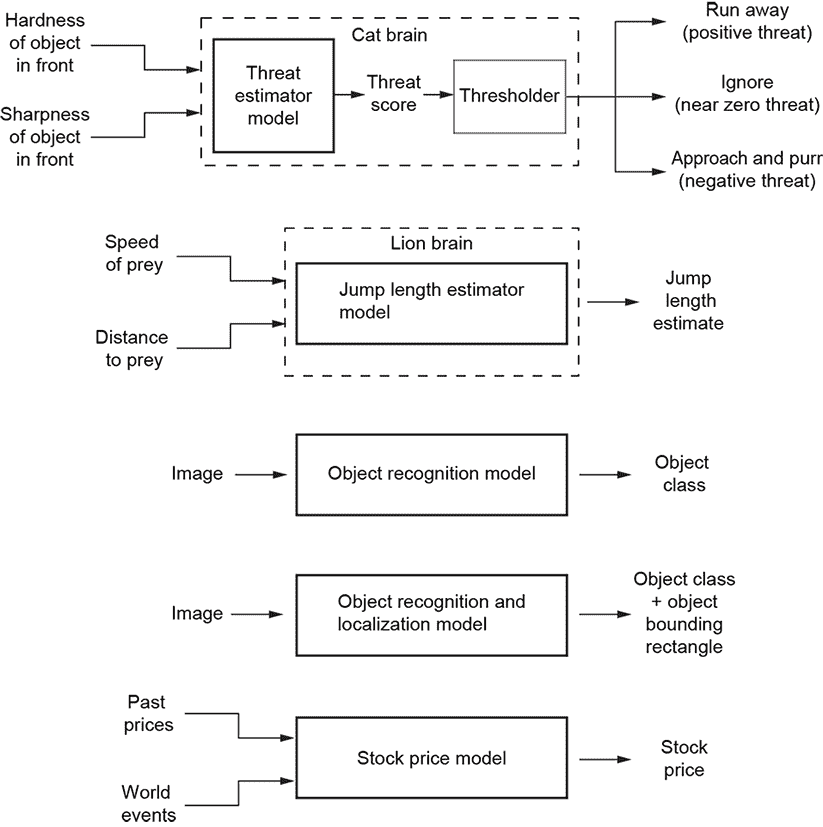

图 1.1 生活中决策和定量估计的例子

在这个阶段，你可能会有疑问，“等等：将输入转换为输出——这难道不就是计算机在过去 30 年或更长时间里一直在做的事情吗？我听说的这种范式转变究竟是什么？”答案是，这确实是一种范式转变，因为我们并没有为机器提供一个逐步的指令集——也就是说，一个程序——来将输入转换为输出。相反，我们为问题开发了一个数学模型。

让我们用一个例子来说明这个想法。为了简单和具体，我们将考虑一个假设的猫脑，它一生中只需要做出一个决定：是*从它面前逃跑*、*忽略物体*还是*靠近并咕噜咕噜叫*。这个决定，然后，就是我们将讨论的模型的输出。在这个玩具例子中，决策是基于仅有的两个定量输入（即特征）：物体的感知硬度和锐度（如图 1.1 所示）。我们*不*提供任何逐步指令，例如“如果锐度大于某个阈值，则逃跑。”相反，我们试图识别一个*参数化*的函数，该函数接受输入并将其转换为所需的决策或估计。最简单的此类函数是*输入的加权求和*：

*y*(*硬度*, *锐度*) = *w*[0] × *硬度* + *w*[1] × *锐度* + *b*

权重 *w*[0]、*w*[1] 和偏差 *b* 是函数的参数。输出 *y* 可以解释为威胁分数。如果威胁分数超过阈值，猫就会逃跑。如果它接近 0，猫就会忽略物体。如果威胁分数为负，猫就会靠近并咕噜咕噜叫。对于更复杂的任务，我们将使用更复杂的函数。

注意，一开始权重是未知的；我们需要通过一个称为*模型训练*的过程来估计它们。

总体而言，通过机器学习解决问题有以下阶段：

+   我们设计一个参数化模型函数（例如，加权求和）带有未知参数（权重）。这构成了*模型架构*。选择正确的模型架构是机器学习工程师专业知识发挥作用的领域。

+   然后我们通过模型训练来估计权重。

+   一旦估计了权重，我们就有一个完整的*模型*。这个模型可以接受任意输入，不一定之前见过，并生成输出。一个训练好的模型处理任意现实生活输入并发出输出的过程称为*推理*。

在最流行的机器学习类型中，称为*监督学习*，我们在开始训练之前准备训练数据。训练数据包括*示例输入项，每个都有其对应的期望输出*。¹ 训练数据通常是通过人工创建的：一个人检查每个输入项并产生期望的输出（即目标输出）。这通常是机器学习中最艰巨的部分。

例如，在我们的假设猫脑例子中，一些可能的训练数据项如下

输入：*硬度* = 0.01，*锐度* = 0.02 → 威胁 = -0.90 → *决策*：“靠近并咕噜咕噜叫”

输入：*硬度* = 0.50，*锐度* = 0.60 → 威胁 = 0.01 → *决策*：“忽略”

输入：*硬度* = 0.99，*锐度* = 0.97 → 威胁 = 0.90 → *决策*：“逃跑”

假设硬度和锐度的输入值介于 0 和 1 之间。

训练过程中究竟发生了什么？回答：我们迭代处理输入的训练数据项。对于每个输入项，我们知道期望的（即目标）输出。在每次迭代中，我们调整模型权重值，以便模型函数在该特定输入项上的输出至少接近相应的目标输出。例如，假设在给定的一次迭代中，权重值是 *w*[0] = 20 和 *w*[1] = 10，以及 *b* = 50。在输入（*硬度* = 0.01，*锐度* = 0.02）下，我们得到输出威胁分数 *y* = 50.3，这与期望的 *y* = −0.9 相差甚远。我们将调整权重：例如，减少偏差，使 *w*[0] = 20，*w*[1] = 10，以及 *b* = 40。相应的威胁分数 *y* = 40.3 仍然远远达不到期望值，但它已经接近了。在我们对许多训练数据项进行这样的操作后，权重将开始接近其理想值。请注意，如何确定权重值的调整方法在这里没有讨论；它需要一些更深入的数学知识，将在以后讨论。

如前所述，这种迭代调谐权重的过程被称为*训练*或*学习*。在学习开始时，权重具有随机值，因此机器的输出通常不符合期望的输出。但随着时间的推移，更多的训练迭代发生，机器“学习”生成正确的输出。那时，模型就准备好在现实世界中部署了。给定任意输入，模型将在推理过程中（希望）输出接近期望的输出。

想想看，这可能就是活脑工作的方式。它们包含各种任务的数学模型等效物。在这里，权重是大脑中不同神经元之间连接（即突触）的强度。一开始，参数未调谐；大脑会反复犯错误。例如，婴儿的大脑在识别可食用物体时经常犯错误——任何有孩子的父母都知道我们在说什么。但每个例子都会调谐参数（吃带有$符号的绿色和白色矩形东西会招来很多责备——将来不应该吃它们等）。最终，这个机器调谐其参数以产生更好的结果。

在这里有一个需要注意的微妙之处。在训练过程中，机器正在调整其参数，以便只在其训练数据输入上产生预期的结果——*仅限于训练数据输入*。当然，在训练过程中，它只能看到所有可能输入的一小部分——我们*不是*在从已知输入到已知输出的查找表中构建。因此，当这台机器被发布到世界上时，它主要运行的是它以前从未见过的输入数据。我们有什么保证它能对从未见过的数据进行正确的输出呢？坦白说，没有保证。只是在大多数现实生活中的问题中，输入并不是真正随机的。它们有一个模式。希望机器在训练过程中能看到足够的输入来捕捉这个模式。然后，它在未见输入上的输出将接近预期的值。训练数据的分布越接近现实生活，这种情况就越有可能发生。

## 1.2 机器学习的函数逼近视角：模型及其训练

如第 1.1 节所述，为了创建一个像大脑一样的机器来进行分类或估计，我们必须找到一个数学函数（模型），它将输入转换为相应的期望输出。然而，遗憾的是，在典型的现实生活情况中，我们并不知道这个转换函数。例如，我们不知道一个函数，它接受过去的股价、世界事件等等，并估计股票的未来价格——这阻止了我们构建股价估计器并致富。我们拥有的只是训练数据——一组已知输出的输入。那么我们该怎么办呢？答案是：我们将尝试模拟未知函数。这意味着我们将创建一个函数，它将是未知函数的代理或替代品。从这个角度来看，机器学习不过是函数逼近——我们只是在尝试逼近未知的分类或估计函数。

让我们简要回顾一下上一节的主要思想。在机器学习中，我们试图解决那些可以抽象地看作是将一组输入转换为输出的问题。输出要么是一个类别，要么是一个估计值。由于我们不知道真正的转换函数，我们试图提出一个模型函数。我们首先通过使用我们对问题的物理理解来设计一个具有可调参数值的模型函数，它可以作为真实函数的代理。这就是*模型架构*，可调参数也被称为*权重*。最简单的模型架构是输出是输入值的加权总和。确定模型架构并不完全确定模型——我们还需要确定实际的参数值（权重）。这就是*训练*的作用所在。在训练过程中，我们找到一组最优的权重，将训练输入转换为尽可能接近相应训练输出的输出。然后我们将这个机器部署到世界上：其权重被估计，函数被完全确定，因此对于任何输入，它只需应用函数并生成输出。这被称为*推理*。当然，训练输入只是所有可能输入的一小部分，因此无法保证推理会在所有实际输入上产生期望的结果。模型的成功取决于所选模型架构的适当性和训练数据的质量和数量。

获取训练数据

在掌握机器学习之后，最大的挑战竟然是训练数据的获取。当从业者能够承担得起时，通常的做法是使用人类手动生成与训练数据输入相对应的输出（这些目标输出有时被称为*真实值*）。这个过程被称为*人工标注*或*人工整理*，涉及一群人类查看大量的训练数据输入并生成相应的真实值输出。对于一些经过深入研究的问题，我们可能足够幸运，可以从互联网上获得训练数据；否则，这变成了一项艰巨的挑战。关于这一点，我们稍后再详细讨论。

现在，让我们通过一个具体的例子来研究模型构建的过程：图 1.1 中所示的猫脑机器。

## 1.3 一个简单的机器学习模型：猫脑

为了简单和具体，我们将处理一个假设的猫，这只猫在一生中只需要做出一个决定：是否要从它面前的东西逃跑，忽略它，或者走近并咕噜咕噜叫。它根据它面前的东西的两个定量输入（如图 1.1 所示）来做出这个决定。

注意：本章是对机器/深度学习的一个轻量级概述。因此，它依赖于我们稍后将要介绍的一些数学概念。尽管如此，我们鼓励你现在阅读这一章，也许在消化了关于矢量和矩阵的章节后再重新阅读。

### 1.3.1 输入特征

输入特征是 *x*[0]，表示 *硬度*，和 *x*[1]，表示 *尖锐度*。不失一般性，我们可以 *归一化* 输入。这是一个相当流行的技巧，其中输入值在最小可能值 *v[min]* 和最大可能值 *v[max]* 之间变换为介于 0 和 1 之间的值。要将任意输入值 *v* 转换为归一化值 *v[norm]*，我们使用以下公式

方程式 1.1

用数学术语来说，通过方程式 1.1，*v* ∈ [*v[min]*, *v[max]*] → *v[norm]* ∈ [0,1] 将值 *v* 从输入域 [*v[min]*, *v[max]*] 映射到输出值 *v[norm]* 在范围 [0,1] 内。

一个两元素向量 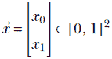 简洁地表示一个单个输入实例。

### 1.3.2 输出决策

最终输出是多类别的，可以取三个可能值之一：*0*，表示猫避开前面的物体；*1*，表示忽略物体；*2*，表示接近物体并发出咕噜声。在机器学习中，可以直接计算类别。然而，在这个例子中，我们将让我们的模型估计一个 *威胁分数*。它的解释如下：威胁高度正值 = 逃跑，威胁接近零 = 忽略，威胁高度负值 = 接近并咕噜（负威胁是有吸引力的）。

我们可以根据威胁分数，通过将威胁分数 *y* 与阈值 *δ* 进行比较，来做出最终的运行/忽略/接近决策：

方程式 1.2

### 1.3.3 模型估计

现在是至关重要的步骤：我们需要估计将输入向量转换为输出的函数。为了稍微滥用术语，我们将这个函数以及输出表示为 *y*。用数学符号表示，我们想要估计 *y*()。

当然，我们不知道理想函数。我们将尝试从训练数据中估计这个未知函数。这是通过两个步骤完成的：

1.  *模型架构选择*—设计一个参数化的函数，我们期望它是未知理想函数的良好代理或替代品

1.  *训练*—估计所选函数的参数，使得在训练输入上的输出尽可能接近相应的输出

### 1.3.4 模型架构选择

这是各种机器学习算法彼此不同的步骤。在这个玩具猫脑的例子中，我们将使用最简单的模型。我们的模型有三个参数，*w*[0]，*w*[1]，*b*。它们可以用一个单元素的两个元素向量 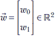 和一个常数偏置 *b* ∈ ℝ（在这里，ℝ 表示所有实数的集合，ℝ² 表示所有元素为实的二维向量的集合，等等）来紧凑地表示。它产生威胁分数，*y*，其计算如下

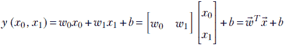

方程式 1.3

注意，*b* 是一个稍微特殊的参数。它是一个常数，不与任何输入相乘。在机器学习中，通常将其称为 *偏置*；其他参数作为权重与输入相乘。

### 1.3.5 模型训练

一旦选择了模型架构，我们就知道将要使用精确的参数函数来模拟未知函数 *y*()，该函数将输入转换为输出。我们仍然需要估计该函数的参数。因此，我们有一个具有未知参数的函数，并且这些参数需要从一组具有已知输出的输入（训练数据）中估计。我们将选择参数，使得在训练数据输入上的输出尽可能接近相应的输出。

迭代训练

这个问题已经被数学家研究，在数学上被称为 *函数拟合* 问题。然而，随着机器学习的出现，发生了变化的是规模。在机器学习中，我们处理包含数百万个项目的训练数据。这改变了解决方案的哲学。数学家使用 *闭式解*，其中参数通过直接解决涉及 *所有* 训练数据项目的方程来估计。在机器学习中，我们寻求迭代解决方案，一次处理 *少量* 训练数据项目（或者可能只有一个）。在迭代解决方案中，没有必要将所有训练数据都保存在计算机的内存中。我们只需一次加载一小部分，并处理那一部分。我们将用我们的猫脑例子来举例说明。

具体来说，训练过程的目标是估计参数 *w*[0]，*w*[1]，*b* 或者等价地，从方程 1.3 估计向量  以及常数 *b*，以便在训练数据输入 (*x*[0]，*x*[1]) 上的输出 *y*(*x*[0]，*x*[1]) 尽可能地匹配相应的已知训练数据输出（即真实值 [GT]）。

让训练数据由 *N* + 1 个输入 ^((0))，^((1))，⋯ ^((*N*)) 组成。在这里，每个 ^((*i*)) 是一个表示单个训练数据输入实例的 2 × 1 向量。相应的期望威胁值（输出）是 *y**[gt]*^((0))，*y**[gt]*^((1))，⋯ *y[gt]*^((*N*))，例如（在这里，下标 *gt* 表示真实值）。等价地，我们可以说训练数据由 *N* + 1 个（输入，输出）对组成：

(^((0)), *y**[gt]*^((0))), (^((1)), *y**[gt]*^((1)))⋯(^((*N*)), *y**[gt]*^((*N*)))

假设  表示模型（尚未知的）最优参数。然后，给定一个任意的输入 ，机器将估计威胁值 *y**[predicted]* = *^T* + *b*。在 *i[th]* 训练数据对（(^((*i*)), *y**[gt]*^((*i*)))），机器将估计

*y**[predicted]*^((*i*)) = *^T*^((*i*)) + *b*

while the desired output is *y[gt]*^((*i*)). Thus the squared error (aka loss) made by the machine on the *i[th]* training data instance is ²

*e[i]*² = (*y**[predicted]*^((*i*))−*y**[gt]*^((*i*)))²

The overall loss on the entire training data set is obtained by adding the loss from each individual training data instance:

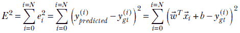

训练的目的是找到一组模型参数（即权重），，以最小化总误差 *E*。我们如何做到这一点将在后面描述。

在大多数情况下，不可能为最优的 ，*b* 提出一个封闭形式的解。相反，我们采取算法 1.1 中描述的迭代方法。

算法 1.1 训练监督模型

使用随机值初始化参数 ，*b*

⊳ 当误差不够小的时候继续迭代

**while** (*E*[2] = Σ[*i* = 0]^(i=*N*) (*^T*[i] ¸ *b* — *y[gt]*^((*i*)))² > *threshold*) **do**

⊳ 遍历所有训练数据实例

**for** ∀*[i]* ∈ 2 [0, *N*] **do**

⊳ 在引入梯度后，3.3 节中提供了详细信息

调整 ，*b* 以减少 *E*²

**end** **for**

**end** **while**

⊳ 记录最终参数值作为最优值

[*]← , *b*[*]← *b*

在这个算法中，我们从一个随机的参数值开始，并不断调整参数，使得总误差至少减少一点。我们一直这样做，直到误差足够小。

在纯粹数学的意义上，我们继续迭代直到误差最小。但在实践中，我们通常在结果足够准确以解决问题时停止。值得再次强调的是，这里的 *误差* 仅指训练数据上的误差。

### 1.3.6 推断

最后，一个经过训练的机器（具有最优参数 [*]，*b*[*]）被部署到世界中。它将接收新的输入  并推断 *y**[预测]*() = [*]*^T* + *b*[*]。分类将通过阈值 *y**[预测]* 来实现，如方程 1.2 所示。

## 1.4 机器学习的几何视图

猫脑模型每个输入都是一个包含两个数字的数组：*x*[0]（表示物体的硬度），*x*[1]（表示物体的锋利度）或者，等价地，一个 2 × 1 的向量 。一个很好的心理图像是将输入视为高维空间中的一个点。输入空间通常被称为 *特征空间*——一个模型要检查的所有特征都表示在这个空间中。在这种情况下，特征空间的维度是两个，但在现实生活中的问题中，它将是几百或几千或更多。输入的精确维度会随着问题而变化，但它是点的直觉仍然存在。

输出 *y* 也应该被视为另一个高维空间中的一个点。在这个玩具问题中，输出空间的维度是一维的，但在现实问题中，它将更高。然而，通常输出维度的数量远小于输入维度的数量。

从几何学的角度来看，机器学习模型本质上是将特征空间中的一个点映射到输出空间中的一个点。预期模型要执行的分类或估计工作在输出空间中比在特征空间中更容易。特别是，*对于分类工作，属于不同类别的输入点预期将映射到输出空间中的不同簇*。

让我们继续使用我们的猫脑模型来阐述这个想法。如前所述，我们的特征空间是二维的，有两个坐标轴 *X*[0] 表示硬度，*X*[1] 表示锋利度。³ 这个二维空间中的单个点用坐标值 (*x*[0]，*x*[1]) 的小写表示（见图 1.2）。如图所示，建模威胁分数的一个好方法是从线 *x*[0] + *x*[1] = 1 的距离进行测量。

图 1.2 猫脑模型的 2D 输入点空间。左下角显示硬度低和锋利度低的物体（–），而右上角显示硬度高和锋利度高的物体（+）。中间值接近对角线（$）。

从坐标几何学来看，在一个具有坐标轴 *X*[0] 和 *X*[1] 的二维空间中，点 (*a*, *b*) 到直线 *x*[0] + *x*[1] = 1 的有向距离为 *y* = (*a*+*b*–1)/√2。通过检查 *y* 的符号，我们可以确定输入点属于分隔线的哪一侧。在图 1.2 所示的简单情况下，观察告诉我们威胁分数可以用从对角线 *x*[0] + *x*[1] – 1 = 0 的有向距离 *y* 来代理。我们可以通过阈值化 *y* 来做出运行/忽略/接近的决策。接近零的值意味着忽略，正值意味着逃跑，负值意味着接近并咕噜。从高中几何学来看，任意输入点 (*x*[0]=*a*, *x*[1]=*b*) 到直线 *x*[0] + *x*[1] – 1 = 0 的距离是 (*a*+*b*–1)/√2。因此，函数 *y*(*x*[0], *x*[1]) = (*x*[0] + *x*[1]–1)/√2 是猫脑威胁估计函数的一个可能模型。训练应该收敛到 *w*[0] = 1/√2, *w*[1] = 1/√2 和 *b* = –1/√2。

因此，我们简化的猫脑威胁分数模型是

方程 1.4

它将二维输入点，表示猫面前物体的硬度和尖锐度，映射到一个对应于从分隔线有向距离的 1D 值。这个距离，在物理上可以解释为威胁分数，使得通过阈值化可以分离出类别（负威胁、中性、正威胁），如图 1.2 所示。不同的类别在输出空间中形成不同的簇，由输出空间中的 +, –, 和 $ 符号表示。输入的低值产生负威胁（猫会接近并咕噜）：例如，*y*(0, 0) = –1/√2。输入的高值产生高威胁（猫会逃跑）：例如，*y*(1, 1) = 1/√2。输入的中值产生接近零的威胁（猫会忽略物体）：例如，*y*(0.5, 0.5) = 0。当然，因为问题如此简单，我们可以通过简单的观察得出模型参数。在现实生活中的情况下，这将需要训练。

几何视图在更高维的情况下也成立。一般来说，一个 *n*-维输入向量  被映射到一个 *m*-维输出向量（通常 *m* < *n*），这样问题在输出空间中就变得简单得多。一个 3D 特征空间的例子如图 1.3 所示。

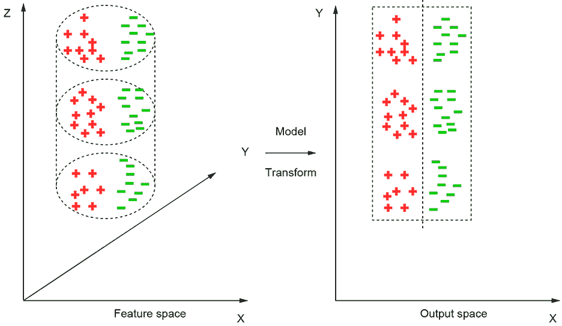

图 1.3 一个模型将输入（特征）空间中的点映射到一个输出空间，在那里更容易分离类别。例如，在这个图中，属于两个类别（红色 (+) 和绿色 (–)）的输入特征点在 3D 特征空间的圆柱体体积中分布。模型将圆柱体展开成矩形。特征点被映射到一个二维平面输出空间，在那里可以通过简单的线性分隔器来区分两个类别。

图 1.4 两个类别（由浅色和深色阴影表示）不能通过一条线来分离。需要一个曲线分离器。在 3D 中，这相当于说没有平面可以分离表面；需要一个曲面。在更高维度的空间中，这相当于说没有超平面可以分离类别；需要一个曲线。

## 1.5 机器学习中的回归与分类

如在 1.1 节中简要概述的，有两种类型的机器学习模型：*回归器* 和 *分类器*。

在 *回归器* 中，模型试图在给定特定输入的情况下发出一个期望的值。例如，1.3 节中猫脑模型的第一阶段（威胁评分估计器）是一个回归器模型。

另一方面，分类器有一组预定义的类别。给定一个特定的输入，它们试图发出输入所属的 *类别*。例如，完整的猫脑模型有三个类别：1) 逃跑，(2) 忽视，和 (3) 接近并咕噜。因此，它接受一个输入（硬度和尖锐度值）并发出一个输出决策（即类别）。

在这个例子中，我们通过阈值化回归器的输出（见方程式 1.2）将回归器转换为分类器。也有可能创建直接输出类别而不需要中间回归器的模型。

## 1.6 线性与非线性模型

在图 1.2 中，我们遇到了一个相当简单的情况，其中类别可以通过一条线（在更高维度的表面上是一个超平面）来分离。这种情况在现实生活中并不常见。如果属于不同类别的点如图 1.4 所示，会怎样呢？在这种情况下，我们的模型架构不应再是一个简单的加权组合。它是一个非线性函数。例如，检查图 1.4 中的曲线分离器。从函数逼近的角度来看，非线性模型也是有意义的。最终，我们的目标是逼近非常复杂且高度非线性的函数，这些函数可以模拟生活所要求的分类或估计过程。直观上看，使用 *非线性函数* 来模拟它们似乎更好。

机器学习中一个非常流行的非线性函数是 *sigmoid* 函数，之所以这样命名是因为它看起来像字母 *S*。sigmoid 函数通常用希腊字母 *σ* 表示。它定义为

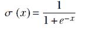

方程式 1.5

双曲正切函数的图形如图 1.5 所示。因此，我们可以使用以下流行的模型架构（仍然相当简单），它采用没有参数的 sigmoid 函数的加权输入总和：

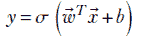

方程式 1.6

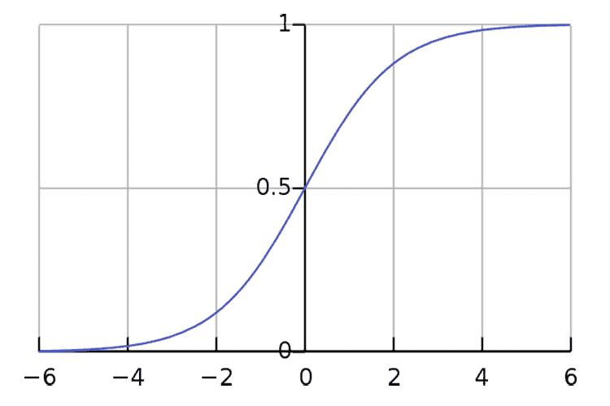

图 1.5 双曲正切函数图形

Sigmoid 函数引入了非线性。这种架构可以处理比仅加权求和更复杂的分类任务。事实上，方程 1.6 描述了神经网络的基本构建块。

## 1.7 通过多个非线性层提高表达能力：深度神经网络

在第 1.6 节中，我们提到，将非线性添加到基本加权和中产生了一个能够处理更复杂任务的模型架构。在机器学习的术语中，非线性模型具有更多的 *表达能力*。

现在考虑一个现实生活中的问题：比如，构建一个狗识别器。输入空间包括像素位置和像素颜色（*x*，*y*，*r*，*g*，*b*，其中 *r*，*g*，*b* 表示像素颜色的红色、绿色和蓝色分量）。输入维度很大（与图像中的像素数量成正比）。图 1.6 给出了典型深度学习系统（如狗图像识别器）必须处理的背景和前景可能变化的简要一瞥。

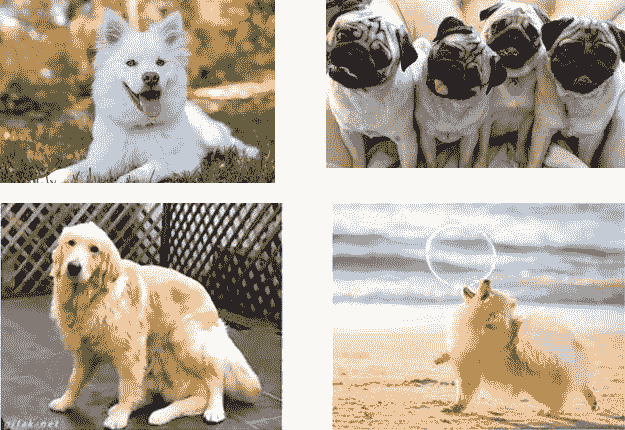

图 1.6 深度学习系统（此处为狗图像识别器）必须处理的背景和前景变化的简要概述

在这里我们需要一台具有真正高表达能力的机器。我们如何以原则性的方式创建这样的机器？

我们不是一次性从输入生成输出，而是采取级联的方法如何？我们将从输入生成一系列中间或隐藏输出，其中每个隐藏输出本质上是一个单个逻辑回归单元。然后我们添加另一个层，该层以前一层的输出作为输入，依此类推。最后，我们将最外层隐藏层的输出组合成最终输出。

我们以下列方程描述该系统。请注意，我们已对权重添加了上标以标识层（层 0 最接近输入；层 *L* 是最后一层，最远离输入）。我们还使下标成为二维的（因此给定层的权重成为一个矩阵）。第一个下标标识目标节点，第二个下标标识源节点（参见图 1.7）。

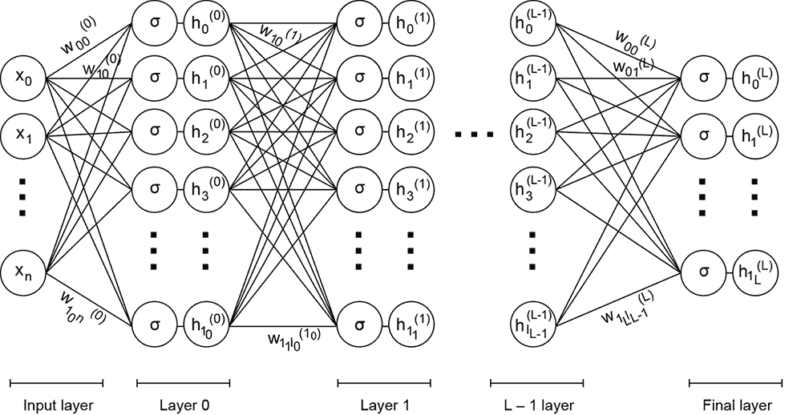

图 1.7 多层神经网络

聪明的读者可能会注意到以下方程没有显式的偏差项。这是因为，为了符号的简洁性，我们将它滚入权重集中，并假设其中一个输入（例如，*x*[0] = 1）和相应的权重（例如，*w*[0]）是偏差。

层 0：从 *n* + 1 个输入生成 *n* 个隐藏输出

方程式 1.7

层 1：从层 0 的 *n*[0] 个隐藏输出生成 *n*[1] 个隐藏输出

方程式 1.8

最终层 (*L*)：从 *n*[*L* − 1] 个前一层隐藏输出生成 *m* + 1 个可见输出

方程式 1.9

这些方程式在图 1.7 中展示。图 1.7 中描述的机器可以非常强大，具有巨大的表达能力。我们可以系统地调整其表达能力以适应手头的问题。这样它就变成了一个神经网络。我们将用本书的其余部分来研究这一点。

## 摘要

在本章中，我们概述了机器学习，一直谈到深度学习。用玩具猫脑的例子说明了这些思想。本章中使用了某些数学概念（例如，向量），但没有适当介绍，鼓励你在介绍了向量和矩阵之后重新阅读本章。

我们希望本章能给你留下以下心理图像：

+   机器学习是一种与传统的计算范式根本不同的计算范式。在传统计算中，我们向计算机提供一系列逐步的指令序列，告诉它要做什么。在机器学习中，我们构建一个数学模型，试图逼近从输入中生成分类或估计的未知函数。

+   模型函数的数学性质是由分类或估计任务的物理性质和复杂性规定的。模型有参数。参数值是从训练数据中估计的——具有已知输出的输入。参数值被优化，以便模型在训练输入上的输出尽可能接近训练输出。

+   机器的另一种几何视图是将多维输入空间中的点映射到输出空间中的一个点的变换。

+   分类/估计任务越复杂，逼近函数就越复杂。在机器学习的术语中，复杂任务需要具有更大表达能力的机器。更高的表达能力来自非线性（例如，Sigmoid 函数；参见方程式 1.5）和更简单机器的分层组合。这把我们带到了深度学习，它不过是一个多层非线性机器。

+   复杂的模型函数通常是通过组合更简单的基函数来构建的。

系好你的安全带：乐趣即将变得更加刺激。

* * *

¹  如果你有一些机器学习的经验，你会意识到我们在这里谈论的是“监督”学习。还有不需要已知输出就能学习的机器——所谓的“无监督”机器——我们稍后会讨论它们。↩

²  在这个背景下，请注意，将误差/损失平方以使其符号独立是一个常见的做法。如果我们希望输出为 10，那么输出为 9.5 或 10.5，我们同样高兴或不高兴。因此，+5 或-5 的误差实际上是相同的；因此，我们使误差符号独立。↩

³  我们使用 *X*[0]，*X*[1] 作为坐标符号，而不是更常见的 *X*，*Y*，这样在进入更高维空间时不会用完符号。↩

⁴  在数学中，向量可以拥有无限多个元素。这样的向量不能表示为数组——但在这本书中我们主要会忽略它们。↩
