# 2 机器学习中的向量、矩阵和张量

本章涵盖

+   向量和矩阵及其在数据科学中的作用

+   使用特征值和特征向量工作

+   寻找超椭圆的轴

在本质上，机器学习，以及所有计算机软件，都是关于数字处理的。我们将一组数字输入到机器中，并得到一组不同的数字作为输出。然而，这不能是随机的。适当地组织这些数字并将它们分组成有意义的对象，这些对象进入并从机器中出来，这是非常重要的。这就是向量矩阵发挥作用的地方。这些是数学家使用了几百年的概念——我们只是在机器学习中重新使用它们。

在本章中，我们将从机器学习角度研究向量和矩阵，从基础知识开始，迅速过渡到高级概念，限制 ourselves 到与机器学习相关的主题。

我们为本书及本章讨论的大部分概念提供了基于 Jupyter Notebook 的 Python 实现。完整的、功能齐全的代码（在安装 Python 和 Jupyter Notebook 后）可以下载并执行，地址为 [`mng.bz/KMQ4`](http://mng.bz/KMQ4)。本章相关的代码可以在 [`mng.bz/d4nz`](http://mng.bz/d4nz) 找到。

## 2.1 向量和它们在机器学习中的作用

让我们回顾一下第 1.3 节中介绍的猫脑机器学习模型。它接受两个数字作为输入，代表猫面前物体的硬度和锋利度。猫脑处理输入并生成一个输出威胁分数，这将导致决定 *逃跑*、*忽略* 或 *靠近并咕噜咕噜叫*。这两个输入数字通常一起出现，将它们组合成一个单一对象将非常方便。这个对象将是两个数字的有序序列，第一个代表硬度，第二个代表锋利度。这样的对象是向量的一个完美例子。

因此，可以将 *向量* 理解为两个或更多数字的有序序列，也称为数字的 *数组*。¹ 向量构成了一种紧凑的方式来表示一组数字，这些数字共同代表某个实体。在本书中，向量用带顶箭头的低字母表示，数组用方括号表示。例如，第 1.3 节中猫脑模型的输入是一个向量 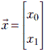，其中 *x*[0] 代表硬度，*x*[1] 代表锋利度。

机器学习模型的输出也常常表示为向量。例如，考虑一个以图像为输入并输出一系列数字的对象识别模型，这些数字表示图像包含狗、人类或猫的概率。这种模型的输出是一个三元素向量 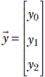，其中数字 *y*[0] 表示图像包含狗的概率，*y*[1] 表示图像包含人类的概率，*y*[2] 表示图像包含猫的概率。图 2.1 显示了可能的输入图像和相应的输出向量。

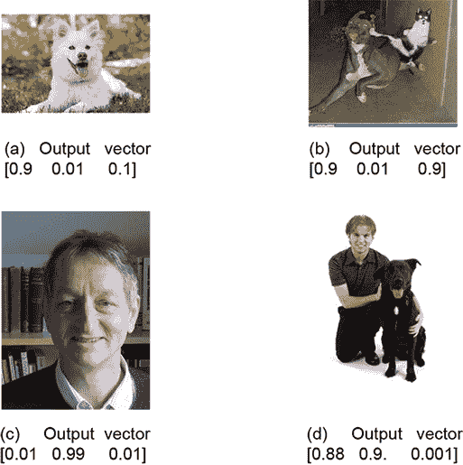

图 2.1 输入图像及其对应的输出向量，表示图像包含狗、人类和/或猫的概率。显示了示例输出向量。

在像神经网络这样的多层机器中，层的输入和输出可以是向量。我们通常也将模型函数的参数（参见第 1.3 节）表示为向量。这一点在第 2.3 节中有说明。

表 2.1 玩具文档及其对应的描述它们的特征向量。适合特征向量的单词是粗体的。特征向量的第一个元素表示单词**枪**出现的次数，第二个元素是**暴力**。

| Docid | 文档 | 特征向量 |
| --- | --- | --- |
| *d*[0] | 玫瑰很漂亮。没有人讨厌玫瑰。 | [0 0] |
| *d*[1] | **枪支暴力**在美国已经达到了流行病的比例。 | [1 1] |
| *d*[2] | **枪支暴力**的问题实际上被过度炒作。可以找到许多涉及**暴力**的例子，但没有**枪支**。 | [2 2] |
| *d*[3] | **枪支**是为**暴力**倾向的人准备的。**暴力**滋生**枪支**。**枪支**滋生**暴力**。 | [3 3] |
| *d*[4] | 我喜欢**枪支**但讨厌**暴力**。我从未参与过**暴力**。但我拥有许多**枪支**。**枪支暴力**对我来说是无法理解的。我确实相信**枪支**拥有者是地球上最反**暴力**的人。从不使用**枪支**的人容易陷入无意义的**暴力**。 | [5 5] |
| *d*[5] | 昨晚旧金山发生了一起武装抢劫，使用了**枪支**。 | [1 0] |
| *d*[6] | **暴力**行为通常涉及武器。 | [0 1] |

在机器学习和数据科学中，一个特别重要的概念是 *特征向量* 的概念。这本质上是一个向量，它描述了在特定机器学习问题中处理的对象的各种属性。我们将通过自然语言处理（NLP）领域的一个例子来说明这个概念。假设我们有一组文档。我们想要创建一个文档检索系统，其中，给定一个新的文档，我们必须检索系统中相似的文档。这本质上归结为以定量方式估计文档之间的相似性。我们将在稍后详细研究这个问题，但现在，我们想要指出，处理这个问题的最自然的方法是为每个文档创建特征向量，这些向量定量描述了文档。在 2.5.6 节中，我们将看到如何测量这些向量之间的相似性；在这里，让我们专注于简单地为文档创建描述向量。做这件事的一个流行方法是选择一组有趣的词（我们通常排除像“and”、“if”和“to”这样的词，这些词在所有文档中都存在），计算每个文档中这些有趣词的出现次数，并创建一个包含这些值的向量。表 2.1 展示了一个包含六个文档及其相应特征向量的玩具示例。为了简单起见，我们只考虑了可能的一组单词中的两个：*枪* 和 *暴力*，无论是复数还是单数，大写还是小写。

作为另一个例子，图像中的像素序列也可以被视为一个特征向量。在计算机视觉任务中，神经网络通常期望这个特征向量。

### 2.1.1 向量的几何视角及其在机器学习中的重要性

向量也可以从几何学的角度来理解。最简单的例子是一个二维向量 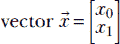。它的两个元素可以被认为是 *x* 和 *y*，这是二维空间中的笛卡尔坐标，在这种情况下，向量对应于该空间中的一个点。*具有 n 个元素的向量代表 n 维空间中的点*。将机器学习模型的输入和输出视为点的能力使我们能够将模型本身视为一种几何变换，它将输入点映射到某些高维空间中的输出点。我们已经在 1.4 节中看到了这一点。这是一个我们将在整本书中使用的极其强大的概念。

向量表示空间中的一个点。此外，一个坐标值数组，例如 ，描述了在给定坐标系中一个点的位置 *in a given coordinate system*。因此，一个坐标值数组（的集合）可以被视为向量的定量表示。参见图 2.2 以获得对此的直观理解。


图 2.2 描述点 P 相对于点 O 的位置的向量。基本的思维图是一个带箭头的线。这与你在高中可能学过的向量的定义一致：向量有一个大小（箭头线的长度）和方向（由箭头指示）。在平面上，这相当于有序对数字 *x*，*y*，其中 *x* 和 *y* 的几何解释如图所示。在此背景下，值得注意的是，只有点 O 和 P 的相对位置才是重要的。如果两个点都移动，保持它们的关系不变，向量不会改变。

对于一个现实生活中的例子，考虑这本书的一页的平面。假设我们想从左下角到达页面的右上角。让我们称左下角为 *O*，右上角为 *P*。我们可以向右移动宽度（8.5 英寸）到达左下角，然后向上移动高度（11 英寸）到达右上角。因此，如果我们选择一个以左下角为原点，*X*轴沿着宽度，*Y*轴沿着高度的坐标系，点 *P* 对应于数组表示 。但我们也可能沿着对角线从左下角到右上角移动到达 *P*。无论哪种方式，我们最终都会到达同一个点 *P*。

这导致了一个难题。向量  代表了抽象的几何概念“*P*相对于*O*的位置”，与我们选择的坐标轴无关。另一方面，数组表示依赖于坐标系的选择。例如，数组  仅在特定的坐标轴选择（与页面边缘平行）和参考点（左下角）下表示右上角点 *P*。理想情况下，为了明确，我们应该指定坐标系以及数组表示。为什么在机器学习中我们从不这样做呢？因为在机器学习中，只要我们坚持任何固定的坐标系，坐标系统的具体选择并不重要。机器学习是关于最小化损失函数（我们将在后面学习）。因此，点的绝对位置无关紧要，只有相对位置才是重要的。

存在明确的规则（我们将在后面学习），这些规则说明了当坐标系改变时向量如何变换。在需要时我们将调用这些规则。在机器学习计算中使用的所有向量必须始终使用相同的坐标系或适当地进行变换。

另一点：平面空间，例如本书所写的纸张平面，是二维的（2D）。我们生活的机械世界是三维的（3D）。人类的想象力通常无法看到更高维度。在机器学习和数据科学中，我们经常谈论具有数千维度的空间。你可能无法在心中看到这些空间，但这并不是一个致命的限制。你可以在心中使用三维类比。它们在许多情况下都有效。然而，重要的是要记住，这并不总是正确的。稍后将会展示一些在更高维度中低维直觉失效的例子。

## 2.2 使用 PyTorch 进行向量操作代码

PyTorch 是由 Facebook 的人工智能团队开发的开源机器学习库。它是目前开发深度学习应用中最优雅的实用工具之一。在本书中，我们旨在使你熟悉 PyTorch 以及类似的编程范式，同时介绍相关的数学知识。假设你具备 Python 基础知识。强烈建议你尝试本书中的所有代码片段（在安装了适当的包，如 PyTorch 之后）。

本书中的所有 Python 代码都是通过 Jupyter Notebook 生成的。在代码片段之前提供了所展示的理论材料的摘要。

### 2.2.1 使用 PyTorch 的向量介绍代码

列表 2.1 展示了如何使用 PyTorch 创建和访问向量和子向量，以及如何切片和切块向量。

注意：一个完全功能的代码示例，展示如何创建向量及其元素访问，可通过 Jupyter Notebook 执行，可以在[`mng.bz/xm8q`](http://mng.bz/xm8q)找到。

列表 2.1 通过 PyTorch 介绍向量

```py
v = torch.tensor([0.11, 0.01, 0.98, 0.12, 0.98,  ①
                ,0.85, 0.03, 0.55, 0.49, 0.99,
                0.02, 0.31, 0.55, 0.87, 0.63],
                dtype=torch.float64)             ②

first_element = v[0]
third_element = v[2]                             ③

last_element = v[-1]
second_last_element = v[-2]                      ④

second_to_fifth_elements = v[1:4]                ⑤

first_to_third_elements = v[:2]
last_two_elements = v[-2:]                       ⑥

num_elements_in_v = len(v)

u = np.array([0.11, 0.01, 0.98, 0.12, 0.98, 0.85, 0.03,
              0.55, 0.49, 0.99, 0.02, 0.31, 0.55, 0.87,
              0.63])

u = torch.from_numpy(u)                          ⑦

diff = v.sub(u)                                  ⑧

u1 = u.numpy()                                   ⑨
```

① `torch.tensor` 表示一个多维数组。向量是一个一维张量，可以通过直接指定值来初始化。

② 默认情况下，张量元素是浮点数。我们可以强制张量成为其他类型，如 float64（双精度）。

③ 方括号运算符让我们能够访问单个向量元素。

④ 负索引从数组的末尾开始计数。-1 表示最后一个元素。-2 表示倒数第二个元素。

⑤ 冒号运算符从向量中切片掉一系列元素。

⑥ 冒号之前的内容表示数组的开始。冒号之后的内容表示数组的结束。

⑦ 火炬张量可以从 NumPy 数组初始化。

⑧ 火炬张量与其 NumPy 版本之间的差异为零。

⑨ 火炬张量可以转换为 NumPy 数组。

## 2.3 矩阵及其在机器学习中的作用

有时候，将一组数字分组成一个向量是不够的。我们必须将几个向量收集到另一个组中。例如，考虑训练机器学习模型的输入。在这里，我们有几个输入实例，每个实例由一系列数字组成。如第 2.1 节所述，单个输入实例的数字序列可以分组成一个向量。我们如何表示整个输入实例集合？这就是数学世界中矩阵概念派上用场的地方。一个 *矩阵* 可以看作是按固定行数和列数排列的数字的矩形数组。矩阵的每一行是一个向量，每一列也是一个向量。因此，矩阵可以被视为行向量的集合。它也可以被视为列向量的集合。我们可以将构成机器学习模型训练输入的整个数字集合表示为一个矩阵，其中每一行向量对应一个单独的训练实例。

再次考虑我们熟悉的猫脑问题。如前所述，机器的单个输入实例是一个向量 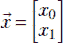，其中 *x*[0] 描述了猫面前物体的硬度。现在考虑一个包含许多此类输入实例的训练数据集，每个实例都有一个已知的输出威胁分数。你可能还记得第 1.1 节中提到的，机器学习的目标是创建一个函数，以尽可能少的总体误差将这些输入映射到相应的输出。我们的训练数据可能看起来像表 2.2 所示（注意，在实际问题中，训练数据集通常很大——经常是数百万个输入输出对，但在这个玩具问题中，我们将有 8 个训练数据实例）。

表 2.2 我们玩具机器学习猫脑的示例训练数据集

|  | 输入值：硬度 | 输入值：锋利度 | 输出：威胁分数 |
| --- | --- | --- | --- |
| 0 | 0.11 | 0.09 | −0.8 |
| 1 | 0.01 | 0.02 | −0.97 |
| 2 | 0.98 | 0.91 | 0.89 |
| 3 | 0.12 | 0.21 | −0.68 |
| 4 | 0.98 | 0.99 | 0.95 |
| 5 | 0.85 | 0.87 | 0.74 |
| 6 | 0.03 | 0.14 | −0.88 |
| 7 | 0.55 | 0.45 | 0.00 |

从表 2.2 中，我们可以将对应硬度和锋利的列收集到一个矩阵中，如图 2.1 所示——这是该问题的训练数据集的紧凑表示。²


方程 2.1

矩阵 *X* 的每一行是特定的输入实例。不同的行代表不同的输入实例。另一方面，不同的列代表不同的特征元素。例如，矩阵 *X* 的第 0 行是向量 [*x*[00]    *x*[01]]，代表第 0 个输入实例。其元素 *x*[00] 和 *x*[01] 代表不同的特征元素，分别是第 0 个训练输入实例的硬度和锐度。

### 2.3.1 数字图像的矩阵表示

数字图像也经常表示为矩阵。在这里，每个元素代表图像在特定像素位置（*x*，*y*坐标）的亮度。通常，亮度值被归一化到 0 到 255 的整数范围内。0 是黑色，255 是白色，128 是灰色。³以下是一个小图像的例子，宽度为 9 像素，高度为 4 像素：


公式 2.2

亮度从左到右和从上到下逐渐增加。*I*[00] 代表左上角的像素，是黑色。*I*[3, 8] 代表右下角的像素，是白色。中间的像素是介于黑白之间的各种灰度。实际图像显示在图 2.2 中。


图 2.3 公式 2.2 中矩阵 *I*[4, 9] 对应的图像

## 2.4 使用 PyTorch 介绍矩阵、张量和图像的 Python 代码

为了编程目的，你可以将张量视为多维数组。标量是零维张量。向量是一维张量。矩阵是二维张量。RGB 图像是三维张量（*颜色通道* × *高度* × *宽度*）。64 张图像的一批是四维张量（64 × *颜色通道* × *高度* × *宽度*）。

列表 2.2 使用 PyTorch 介绍矩阵

```py
X = torch.tensor(                                      ①
     [
        [0.11, 0.09], [0.01, 0.02], [0.98, 0.91],
        [0.12, 0.21], [0.98, 0.99], [0.85, 0.87],
        [0.03, 0.14], [0.55, 0.45]                     ②
     ]
 )

print("Shape of the matrix is: {}".format(X.shape))    ③

first_element = X[0, 0]                                ④

row_0 = X[0, :]                                        ⑤
row_1 = X[1, 0:2]                                      ⑥

column_0 = X[:, 0]                                     ⑦
column_1 = X[:, 1]                                     ⑧
```

① 矩阵是一个数字的二维数组：即，一个二维张量。一个机器学习模型的整个训练数据输入集可以被视为一个矩阵。每个输入实例是一行。行数 ≡ 训练示例数，列数 ≡ 训练实例大小

② 猫脑训练数据输入：8 个示例，每个示例有两个值（硬度，锐度）。通过指定值创建了一个 8 × 2 的张量。

③ 张量的形状是一个列表。对于一个矩阵，第一个列表元素是行数；第二个列表元素是列数。

④ 方括号提取单个矩阵元素。

⑤ 独立的冒号运算符表示所有可能的索引。

⑥ 冒号运算符表示索引的范围。

⑦ 第 0 列

⑧ 第 1 列

列表 2.3 矩阵的切片和切块

```py
first_3_training_examples = X[:3, ]               ①
                                                  ②
print("Sharpness of 5-7 training examples is: {}"
       .format(X[5:8, 1]))                        ③
```

① 可以通过冒号运算符指定行和列的范围来切片（提取）子矩阵。

② 提取前三个训练示例（行）

③ 提取第 5 到第 7 个训练示例的锐度特征

列表 2.4 PyTorch 中的张量和图像

```py
tensor = torch.rand((5, 5, 3))                                  ①
                                                                ②
I49 = torch.tensor([[0, 8, 16, 24, 32, 40, 48,  56,  64],       ③
               [64,   72,  80,  88,  96, 104, 112, 120, 128],
                [128, 136, 144, 152, 160, 168, 176, 184, 192],
                [192, 200, 208, 216, 224, 232, 240, 248, 255]],
               )                                                ④

img = torch.tensor(cv2.imread('../../Figures/dog3.jpg'))        ⑤
img_b = img[:, :, 0]                                            ⑥
img_g = img[:, :, 1]                                            ⑥
img_r = img[:, :, 2]                                            ⑥
img_cropped = img[0:100, 0:100, :]                              ⑦
```

① PyTorch 张量可以用来表示张量。一个向量是一个 1-张量，一个矩阵是一个 2-张量，一个标量是一个 0-张量。

② 创建一个指定维度的随机张量

③ 所有图像都是张量。高度为 H、宽度为 W 的 RGB 图像是一个形状为 [3, H, W] 的 3-张量。

④ 图 2.3 中显示的 4 × 9 单通道图像

⑤ 从磁盘读取 199 × 256 × 3 的图像

⑥ 常规的切片切割操作有效。提取图像中如图 2.4 所示的红、绿、蓝通道。

⑦ 裁剪出如图 2.5 所示的 100 × 100 子图像。


图 2.4 PyTorch 中的张量和图像

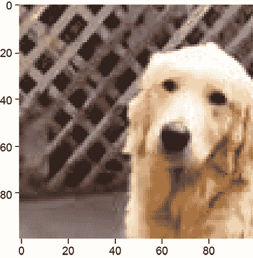

图 2.5 狗的裁剪图像

## 2.5 机器学习中的基本向量和矩阵运算

在本节中，我们介绍了几个基本的向量和矩阵运算及其在图像处理、计算机视觉和机器学习中的重要性，并通过示例进行演示。本节旨在提供一个以应用为中心的线性代数入门。但并非旨在对矩阵和向量运算进行全面回顾，对于这些内容，请参考线性代数教科书。

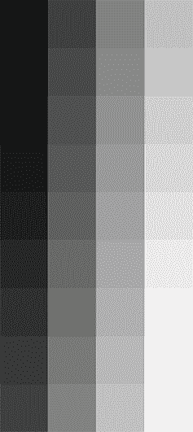

图 2.6 方程 2.3 中显示的矩阵 *I*[4, 9] 的转置对应的图像。这相当于将图像旋转 90°。

### 2.5.1 矩阵和向量转置

在方程 2.2 中，我们遇到了表示微小图像的矩阵 *I*[4, 9]。假设我们想要将图像旋转 90°，使其看起来像图 2.5。原始矩阵 *I*[4, 9] 和其转置 *I*[4,]*^T*[9] = *I*[9, 4] 如下所示：

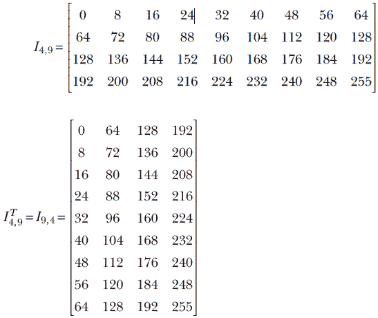

方程 2.3

通过比较方程 2.2 和方程 2.3，你可以很容易地看出，一个可以通过交换行和列索引从另一个获得。这种操作通常被称为 *矩阵转置*。

形式上，一个具有 *m* 行和 *n* 列的矩阵 *A[m, n]* 的转置是一个具有 *n* 行和 *m* 列的另一个矩阵。这个转置矩阵，表示为 *A[n,]^T[m]*，满足 *A^T*[*i*, *j*] = *A*[*j*, *i*]。例如，矩阵 *I*[4, 9] 中第 0 行第 6 列的值是 48；在转置矩阵中，相同的值出现在第 6 行和第 0 列。在矩阵术语中，*I*[4, 9][0,6] = *I*[9,]*^T*[4][6,0] = 48。

向量转置是矩阵转置的特殊情况（因为所有向量都是矩阵——一个具有 *n* 个元素的列向量是一个 *n* × 1 的矩阵）。例如，一个任意向量及其转置如下所示：


方程 2.4

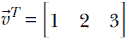

方程 2.5

### 2.5.2 两个向量的点积及其在机器学习中的作用

在 1.3 节中，我们看到了最简单的机器学习模型，其中输出是通过取输入的加权总和（然后添加一个常数偏置值）来生成的。这个模型/机器的特征是权重 *w*[0]、*w*[1] 和偏置 *b*。以表 2.2 的行为例。例如，对于第 0 行，输入值是接近物体的硬度=0.11 和柔软度=0.09。相应的模型输出将是 *y* = *w*[0] × 0.11 + *w*[1] × 0.09 + *b*。实际上，训练的目标是选择 *w*[0]、*w*[1] 和 *b*，使得模型输出尽可能接近已知的输出；也就是说，*y* = *w*[0] × 0.11 + *w*[1] × 0.09 + *b* 应尽可能接近 -0.8，*y* = *w*[0] × 0.01 + *w*[1] × 0.02 + *b* 应尽可能接近 -0.97，也就是说，一般来说，给定一个输入实例 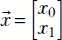，模型输出是 *y* = *x*[0]*w*[0] + *x*[1]*w*[1] + *b*。

我们将在本章中反复回到这个模型。但首先，让我们考虑一个不同的问题。在这个玩具示例中，我们只有三个模型参数：两个权重，*w*[0] 和 *w*[1]，以及一个偏置 *b*。因此，将模型输出直接写成 *y* = *x*[0]*w*[0] + *x*[1]*w*[1] + *b* 并不是很混乱。但是，对于更长的特征向量（即更多的权重），它将变得难以处理。对于特定的输入实例，有没有一种紧凑的方式来表示模型输出，而不论输入的大小如何？

结果是肯定的——我们可以使用来自数学世界的称为“点积”的操作。我们已经在 2.1 节中看到，模型输入的单个实例可以简洁地表示为一个向量，例如 （它可以有任意数量的输入值）。我们也可以将权重集合表示为向量 ——它将具有与输入向量相同数量的项。点积是两个向量  和  的逐元素乘积。形式上，给定两个向量  和 ，两个向量的点积定义为


方程式 2.6

换句话说，两个向量对应元素的乘积之和是两个向量的点积，表示为  ⋅ 。

注意：点积符号可以简洁地表示模型输出为 *y* =  ⋅  + *b*。即使输入和权重的数量很大，这种表示法的大小也不会增加。

再次考虑我们（现在已经很熟悉的）猫脑示例。假设权重向量是  且偏置值 *b* = 5。那么从表 2.2 中 0 号输入实例的模型输出将是 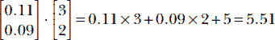。这些权重和偏置参数的选择并不理想，因为模型输出 5.51 与期望的输出 -0.89 相去甚远。我们很快就会看到如何获得更好的参数值。现在，我们只需注意点积提供了一种简洁的方式来表示简单的加权求和模型输出。

注意：点积仅在向量具有相同维度时才定义。

有时点积也被称为 *内积*，表示为 ⟨, ⟩。严格来说，短语“内积”更为通用；它也适用于无限维向量。在这本书中，我们将经常互换使用这些术语，牺牲数学严谨性以增强理解。

### 2.5.3 矩阵乘法和机器学习

向量是矩阵的特殊情况。因此，矩阵-向量乘法是矩阵-矩阵乘法的特殊情况。我们将从这里开始。

矩阵-向量乘法

在 2.5.2 节中，我们看到了给定一个权重向量，比如 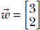，以及偏置值 *b* = 5，单个输入实例上的加权求和模型输出可以通过向量-向量点积 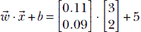 表示。如方程 2.1 所示，在训练过程中，我们同时处理许多训练数据实例。在现实生活中，我们通常处理成千上万的输入实例，每个实例有数百个值。有没有一种方法可以紧凑地表示整个训练数据集的模型输出，使其独立于输入实例的数量和大小？

答案是肯定的。我们可以从数学世界的矩阵-向量乘法中借用这个想法。矩阵 *X* 和列向量  的乘积是另一个向量，表示为 *X*。其元素是 *X* 的行向量与列向量  之间的点积。例如，给定模型权重向量  和偏置值 *b* = 5，我们熟悉的猫脑模型（方程 2.1）在玩具训练数据集上的输出可以通过以下步骤获得：


方程 2.7

添加偏置值 5，玩具训练数据集上的模型输出为

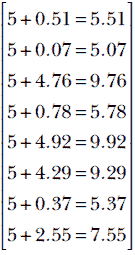

方程 2.8

通常，我们简单模型的输出（输入元素的偏置加权求和）可以紧凑地表示为 = *X* + 。

矩阵-矩阵乘法

将矩阵乘以向量的概念推广后，我们可以定义矩阵乘以矩阵。一个有*m*行和*p*列的矩阵，例如*A[m, p]*，可以与另一个有*p*行和*n*列的矩阵相乘，例如*B[p, n]*，生成一个有*m*行和*n*列的矩阵，例如*C[m, n]*：例如，*C[m, n]* = *A[m, p]* *B[p, n]*。注意，左矩阵的列数必须与右矩阵的行数相匹配。结果矩阵的元素*i, j*，即*C[i, j]*，是通过*A*的第*i*行向量的元素与*B*的第*j*列向量的元素逐点相乘得到的。以下示例说明了这个概念：

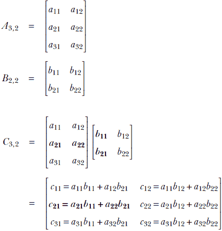

通过加粗的方式举例说明了*C*[2, 1]的计算。

注意：矩阵乘法不是交换的。一般来说，*AB* ≠ *BA*。

在这一点上，敏锐的读者可能已经注意到了点积是矩阵乘法的一种特殊情况。例如，两个向量和的点积等价于将其中一个向量转置后，再与另一个向量进行矩阵乘法。换句话说，


这个想法在更高维的情况下也适用。一般来说，给定两个向量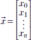和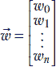，这两个向量的点积定义为


方程 2.9

矩阵乘法的另一个特殊情况是行向量矩阵乘法。例如，*^TA* = 或者

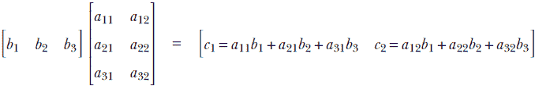

矩阵乘积的转置

给定两个矩阵*A*和*B*，其中*A*的列数与*B*的行数相匹配（也就是说，可以相乘），它们的乘积的转置是各自转置的乘积，顺序相反。这个规则也适用于矩阵-向量乘法。以下方程捕捉了这个规则：


方程 2.10

### 2.5.4 向量的长度（L2 范数）：模型误差

假设一个机器学习模型应该输出一个目标值*ȳ*，但它输出*y*。我们感兴趣的是模型犯的*错误*。错误是目标值与实际输出之间的差异。

平方误差

当发生计算错误时，我们只关心计算值与理想值之间的差距。我们并不关心计算值是大于还是小于理想值。例如，如果目标（理想）值是 2，那么计算值 1.5 和 2.5 的误差是相同的——我们对这两个值都同样满意或不满意。因此，通常的做法是将误差值进行平方。例如，如果目标值是 2，计算值是 1.5，那么误差是 (1.5 − 2)² = 0.25。如果目标值是 2.5，误差是 (2.5 − 2)² = 0.25。平方操作本质上消除了误差值的符号。然后我们可以跟一个平方根，但也可以不这样做。

你可能会问，“但是等等：平方改变了数量的值。我们难道不在乎误差的精确值吗？” 答案是，我们通常不在乎；我们只关心误差的 *相对* 值。如果目标是 2，我们希望输出值为 2.1 的误差小于输出值为 2.5 的误差；误差的精确值并不重要。

让我们将这种平方的思想应用到机器学习模型误差中。如前文第 2.5.3 节所述，给定一个模型权重向量，比如 ，以及偏差值 *b* = 5，单个输入实例的加权求和模型输出，比如 ，是 。相应的目标（理想）输出，来自表 2.2，是 −0.8。平方误差 *e*² = (−0.8−5.51)² = 39.82 给出了模型参数 3, 2, 5 的好坏程度。例如，如果我们改用一个权重向量 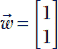 和偏差值 −1，我们得到模型输出 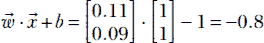。输出与目标完全相同。相应的平方误差 *e*² = (−0.8−(−0.8))² = 0。这个（零误差）立即告诉我们，1, 1, −1 作为模型参数的选择比 3, 2, 5 要好得多。

通常情况下，一个有偏重的加权求和模型所犯的错误可以表示如下。如果用  表示权重向量，用  表示偏差，则对应于输入实例  的输出可以表示为 *y* =  ⋅  + *b*。用 *ȳ* 表示相应的目标（真实值）。那么错误被定义为 *e* = (*y*−*ȳ*)²。

因此，我们看到我们可以通过取模型输出和真实值之间的差异并对其进行平方来计算单个训练实例的误差。我们如何将这个概念扩展到整个训练数据集？对应于整个训练输入集的输出集可以表示为输出向量 *y* = *X* + 。相应的目标输出向量，由整个真实值集组成，可以表示为。整个训练集中目标和模型输出之间的差异可以表示为另一个向量 - 。在我们的特定例子中：

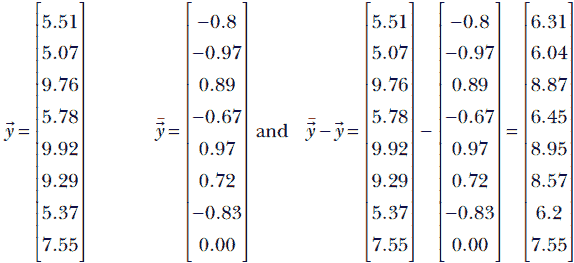

因此，整个训练数据集的总误差是通过取输出和真实向量之间的差异，平方其元素并将它们相加来获得的。回忆方程 2.9，这正是如果我们取差异向量的*点积*会发生的事情。这恰好是向量的*平方模*或*长度*或*L2 范数*的定义：向量与自身的点积。在先前的例子中，整体训练（平方）误差是：


形式上，向量的长度，表示为||||，定义为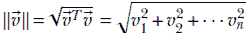。这个量有时被称为向量的 L2 范数。

特别是，给定一个输出向量为的机器学习模型和一个目标向量为的向量，错误等于差异向量的模或 L2 范数


### 2.5.5 向量长度的几何直觉

对于一个二维向量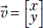，如图 2.2 所示，L2 范数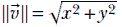不过是直角三角形的斜边，其边是向量的元素。在更高维的情况下，这种直觉同样适用。

一个*单位向量*是一个长度为 1 的向量。对于任何向量，相应的单位向量可以通过将该向量的每个元素除以该向量的长度来获得。例如，给定，长度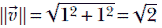和相应的单位向量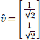。单位向量通常表示一个方向。

注意：单位向量通常用帽子符号表示，而不是小箭头，如*û^Tû* = 1。

在机器学习中，训练的目标通常是使错误向量（模型输出向量与目标真实向量之间的差异）的长度最小化。

### 2.5.6 点积的几何直觉：特征相似度

再次考虑表 2.1 中描述的文档检索问题。我们有一组文档，每个文档都由其自身的特征向量描述。给定这样一对文档，我们必须找到它们的相似度。这本质上归结为估计两个特征向量之间的相似度。在本节中，我们将看到一对向量的点积可以用作它们之间相似度的度量。

例如，考虑表 2.1 中对应于 *d*[5] 和 *d*[6] 的特征向量。它们是 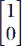 和 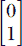。它们之间的点积是 1 × 0 + 0 × 1 = 0。这是很低的，与我们直觉认为它们之间没有共同的感兴趣词汇相符，因此文档非常不相似。另一方面，*d*[3] 和 *d*[4] 的特征向量之间的点积是 。这是很高的，与我们直觉认为它们在感兴趣词汇上有许多共同之处，是相似文档相符。因此，我们得到了一个重要概念的初步认识。简单来说，*相似的向量有较大的点积，不相似的向量有接近零的点积*。

我们将不断回顾这个估计特征向量之间相似度的问题，并使用越来越巧妙的方法来解决它。作为一个初步尝试，我们现在将更详细地研究点积如何衡量向量之间的相似度。首先，我们将证明一个向量在另一个向量上的分量是由点积产生的。利用这一点，我们将展示一对向量的“相似度/一致性”可以通过它们之间的点积来估计。特别是，我们将看到如果向量指向大致相同的方向，它们的点积将高于当向量相互垂直时的情况。如果向量指向相反的方向，它们的点积将是负数。

点积衡量一个向量在另一个向量上的分量

首先考察一个特殊情况：向量在坐标轴上的分量。这可以通过将向量的长度与向量与相关坐标轴之间的角度的余弦值相乘来获得。如图 2.7a 所示，一个向量  可以沿 *X* 和 *Y* 轴分解为两个分量，如下


注意向量长度的保持：

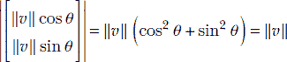

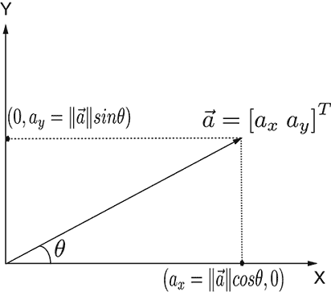

(a) 2D 向量在坐标轴上的分量。注意 |||| 是斜边的长度。

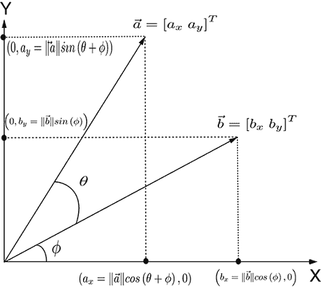

(b) 点积作为另一个向量上的一个向量的分量  ⋅  = *^T* = *a[x]b[x]* + *a[y]b[y]* = |||| ||||*cos*(*θ*)。

图 2.7 向量分量和点积

现在我们来研究一个向量在另一个任意向量方向上的分量的一般情况（见图 2.7b）。一个向量  在另一个向量  上的分量是  ⋅  = *^T*。这相当于 |||| ||||*cos*(*θ*)，其中 *θ* 是向量  和  之间的角度。（这已在附录中讨论的二维情况 A.1 中得到证明。如果您想获得更深的直觉，可以阅读它。）

点积衡量两个向量之间的协议

点积可以用向量之间角度的余弦来表示。给定两个向量  和 ，如果 *θ* 是它们之间的角度，我们得到（见图 2.7b）

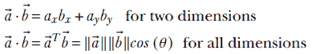

方程 2.11

使用余弦表达点积使其更容易看出它衡量的是两个向量之间的*协议*（也称为*相关性*）。如果向量具有相同的方向，它们之间的角度是 0，余弦是 1，这意味着最大协议。随着向量之间角度的增加，余弦值逐渐减小，直到两个向量相互垂直且余弦值为零，这意味着没有相关性——向量相互独立。如果它们之间的角度是 180°，余弦值为-1，这意味着向量是反相关的。因此，两个向量的点积与它们的方向协议成正比。

在所有这些中，向量长度扮演什么角色？两个向量的点积也正比于向量的长度。这意味着较大向量之间的同意度得分更高（美国总统和德国总理之间的协议比您和我之间的协议更重要）。

如果您想让协议得分对向量长度保持中性，您可以使用沿相同方向单位长度的向量的归一化点积：

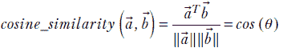

点积和两个单位向量之间的差异

要深入了解点积如何指示两个方向之间的共识或相关性，考虑两个单位向量 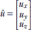 和 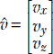。它们之间的差异是 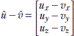。

注意，由于它们是单位向量，。差异向量的长度

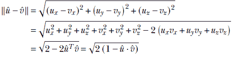

从最后一个等式可以看出，较大的点积意味着较小的差异：也就是说，向量之间有更多的共识。

## 2.6 向量的正交性及其物理意义

尝试将物体移动到与您推的方向垂直的方向。你会发现这是不可能的。角度越大，你的力向量变得越不有效（最终在 90° 角时完全无效）。这就是为什么在水平面上行走很容易（你是在与重力吸引方向垂直的方向上移动，所以重力向量无效），但在向上倾斜的表面上行走则更难（重力向量对你产生了一些反作用）。

这些物理概念在点积的概念中被数学化地捕捉。两个向量 （例如，推力向量）和 （例如，被推物体的位移向量）的点积是 |||| ||||*cosθ*，其中 *θ* 是两个向量之间的角度。当 *θ* 为 0（两个向量对齐）时，*cosθ* = 1，是 *cosθ* 的最大可能值，因此推力是最有效的。随着 *θ* 的增加，*cosθ* 减少，推力变得越来越不有效。最后，当 *θ* = 90° 时，*cosθ* = 0，推力变得完全无效。

如果两个向量的点积为零，则这两个向量是正交的。从几何上看，这意味着向量彼此垂直。从物理上看，这意味着两个向量是独立的：一个不能影响另一个。你可以这样说，正交向量之间没有共同之处。例如，*d*[5] 的特征向量是 ，而 *d*[6] 的特征向量是 （见表 2.1）。这些是正交的（点积为零），你可以很容易地看到，两个文档中都没有共同的特征词（*枪*，*暴力*）。

## 2.7 Python 代码：通过 PyTorch 的基本向量和矩阵运算

在本节中，我们使用 Python PyTorch 代码来阐述前面讨论的许多概念。

NOTE 完整功能的代码可在 Jupyter Notebook 中执行，可在[`mng.bz/ryzE`](https://github.com/krishnonwork/mathematical-methods-in-deep-learning-ipython/blob/master/python/ch2/2.7-transpose-dot-matmul.ipynb)找到。

### 2.7.1 矩阵转置的 PyTorch 代码

以下列表显示了矩阵转置的 PyTorch 代码。

列表 2.5 转置

```py
I49 = torch.stack([torch.arange(0, 72, 8), torch.arange(64, 136, 8),   ①
                torch.arange(128, 200, 8), torch.arange(192, 264, 8)])

I49_t = torch.transpose(I49, 0, 1)                                     ②

for i in range(0, I49.shape[0]):
    for j in range(0, I49.shape[1]):
        assert I49[i][j] == I49_t[j][i]                                ③

assert torch.allclose(I49_t, I49.T, 1e-5)                              ④
```

① torch.arange 函数创建一个元素从 *start* 到 *stop* 以 *step* 为增量的向量。这里我们创建一个 4 × 9 的图像，对应于方程 2.2 中的 *I*[4,9]，如图 2.3 所示。

② 转置运算符交换行和列。4 × 9 的图像变为 9 × 4 的图像（见图 2.6。位置 (*i, j*) 的元素与位置 (*j, i*) 的元素交换。

③ 原始矩阵和转置矩阵的交换元素相等。

④ .T 运算符检索数组的转置。

### 2.7.2 PyTorch 点积的代码

两个向量  和  的点积表示一个向量沿另一个向量的分量。考虑两个向量  = [*a*[1] *a*[2] *a*[3]] 和  = [*b*[1] *b*[2] *b*[3]]。那么 . = *a*[1]*b*[1] + *a*[2]*b*[2] + *a*[3]*b*[3]。

列表 2.6 点积

```py
a = torch.tensor([1, 2, 3])
b = torch.tensor([4, 5, 6])
a_dot_b = torch.dot(a, b)
print("Dot product of these two vectors is: "
              "{}".format(a_dot_b))               ①

# Dot product of perpendicular vectors is zero
vx = torch.tensor([1, 0]) # a vector along X-axis
vy = torch.tensor([0, 1]) # a vector along Y-axis
print("Example dot product of orthogonal vectors:"
              " {}".format(torch.dot(vx, vy)))    ②
```

① 输出 32：1 ∗ 4 + 2 ∗ 5 + 3 ∗ 6

② 输出 0：1 ∗ 0 + 0 ∗ 1

### 2.7.3 PyTorch 矩阵-向量乘法的代码

考虑一个具有 *m* 行和 *n* 列的矩阵 *A[m, n]*，它与一个具有 *n* 个元素的向量 *[n]* 相乘。结果是 *m* 个元素的列向量 *[m]*。在以下示例中，*m* = 3，*n* = 2。

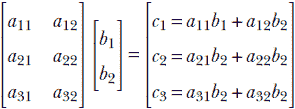

一般而言，

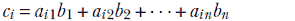

列表 2.7 矩阵-向量乘法

```py
X = torch.tensor([[0.11, 0.09], [0.01, 0.02], [0.98, 0.91], [0.12, 0.21], ①
              [0.98, 0.99], [0.85, 0.87], [0.03, 0.14], [0.55, 0.45],
              [0.49, 0.51], [0.99, 0.01], [0.02, 0.89], [0.31, 0.47],
              [0.55, 0.29], [0.87, 0.76], [0.63, 0.24]])                  ②

w = torch.rand((2, 1))                                                    ③
b = 5.0
  = torch.matmul(X, w) + b                                                ④
```

① 线性模型由权重向量  和偏置 *b* 组成。对于每个训练数据实例 *[i]*，模型输出 *y**[i]* = *[i]^T* + *b*。对于训练数据矩阵 *X*（其行是训练数据实例），模型输出 *X* +  = 

② Cat-brain 15 × 2 训练数据矩阵（方程 2.7）

③ 权重向量的随机初始化

④ 模型训练输出： = *X* + *b*。标量 *b* 会自动复制以创建一个向量。

### 2.7.4 PyTorch 矩阵-矩阵乘法的代码

考虑一个具有 *m* 行和 *p* 列的矩阵 *A[m, p]*。让我们用另一个具有 *p* 行和 *n* 列的矩阵 *B[p, n]* 相乘。结果矩阵 *C[m, n]* 包含 *m* 行和 *n* 列。请注意，左矩阵 *A* 的列数应与右矩阵 *B* 的行数相匹配：


一般而言，


列表 2.8 矩阵-矩阵乘法

```py
A = torch.tensor([[1, 2], [3, 4], [5, 6]])
B = torch.tensor([[7, 8], [9, 10]])

C = torch.matmul(A, B)                              ①
                                                    ②
  w = torch.tensor([1, 2, 3])
  x = torch.tensor([4, 5, 6])
  assert torch.dot(w, x) == torch.matmul(w.T, x)    ③
```

① *C* = *AB* ⟹ *C*[*i*, *j*] 是 *A* 的第 *i* 行与 *B* 的第 *j* 列的点积。

② 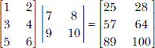

③ 点积可以看作是一个行矩阵乘以一个列矩阵。

### 2.7.5 PyTorch 中矩阵乘积转置的代码

给定两个矩阵 *A* 和 *B*，其中 *A* 的列数与 *B* 的行数相匹配，它们的乘积的转置是各自转置的乘积（顺序相反）：(*AB*)*^T* = *B^TA^T*。

列表 2.9 矩阵乘积的转置

```py
assert torch.all(torch.matmul(A, B).T == torch.matmul(B.T, A.T))  ①

assert torch.all(torch.matmul(A.T, x).T == torch.matmul(x.T, A))  ②
```

① 声明 (*AB*)*^T* 和 *B^TA^T* 相等

② 也适用于矩阵-向量乘法：(*A^T*)*^T* = *^TA*

## 2.8 多维直线和平面方程与机器学习

从几何学的角度来看，机器学习分类器实际上做什么？我们在第 1.4 节中提供了答案的概要。请回顾该内容，特别是图 1.2 和 1.3。我们在这里将简要总结。

分类器的输入是特征向量。这些向量可以看作是多维特征空间中的点。分类的任务就是将属于不同类的点分开。这些点可能在输入空间中杂乱无章。这是模型的工作，将它们转换到不同的（输出）空间中，在那里更容易分开类。这种转换的视觉示例已在图 1.3 中提供。

分离器的几何性质是什么？在非常简单的情况下，例如图 1.2 所示的情况，分离器是二维空间中的一条线。在现实生活中的情况下，分离器通常是高维空间中的一条线或一个平面。在更复杂的情况下，分离器是一个曲面，如图 1.4 所示。

在本节中，我们将研究高维空间中两种类型分离器（直线和平面，也称为超线和超平面）背后的数学和几何。

### 2.8.1 多维直线方程

在高中几何中，我们学习了 *y* = *mx* + *c* 作为直线的方程。但这并不容易应用于更高维度。在这里，我们将研究一种更好的直线表示方法，它对任何有限维空间都同样有效。

如图 2.8 所示，连接向量  和  的直线可以看作是我们将遇到的点的集合，如果我们

+   从点  开始

+   沿着方向  −  移动


图 2.8 在连接两个向量  和  的直线上，任意点  可以表示为  =  + *α*(−)。

通过旅行不同的距离，可以得到线上的不同点。用 *α* 表示这个任意距离，连接向量  和  的直线方程可以表示为

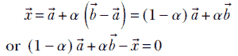

方程式 2.12

方程式 2.12 表示，连接  和  的直线上的任意点都可以表示为  和  的加权组合，权重为 *α* 和 1 − *α*。通过改变 *α*，我们可以得到直线上的不同点。不同的 *α* 值范围产生直线上的不同线段。如图 2.8 所示，*α* 在 0 和 1 之间的值产生在  和  之间的点。*α* 的负值产生在  的左侧。*α* 大于 1 的值产生在  的右侧。这个直线方程适用于任何维度，而不仅仅是二维。

### 2.8.2 多维平面及其在机器学习中的作用

在 1.5 节中，我们遇到了分类器。让我们再看看它们。假设我们想要创建一个分类器，帮助我们根据仅有的三个输入变量：1) *动量*，即股价变化的速率（正动量意味着股价在上升，反之亦然）；2) 上个季度支付的 *股息*；以及 3) *波动性*，即股价在上个季度的波动幅度。让我们在特征空间中绘制所有训练点，坐标轴对应于变量 *动量*、*股息*、*波动性*。图 2.9 显示，类别可以通过三维特征空间中的一个平面来分离。

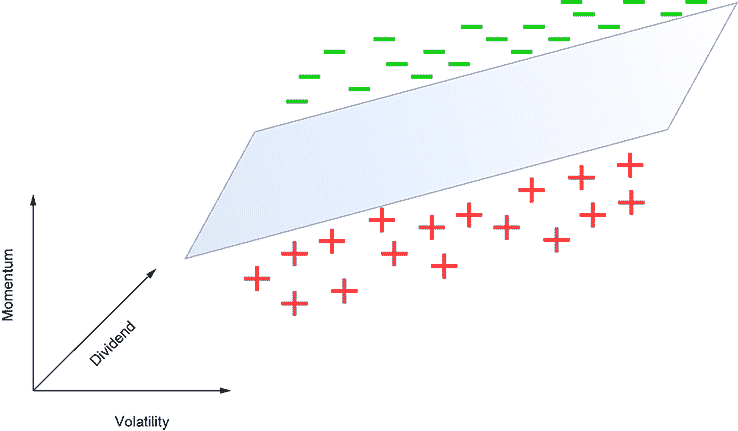

图 2.9 一个玩具机器学习分类器，用于股票买入与不买入决策。加号 (+) 表示不买入，减号 (-) 表示买入。决策是基于三个输入变量：动量、股息和波动性。

从几何学的角度来看，我们的模型简单地对应于这个平面。位于平面之上的输入点表示买入决策（破折号 [-]），而位于平面之下的输入点表示不买入决策（加号 [+])。一般来说，你想要买入高动量股票，因此动量轴较高端的点更有可能被标记为 *买入*。然而，这并不是唯一的指标。对于更波动的股票，我们要求更高的 *动量* 来从 *不买入* 切换到 *买入*。这就是为什么随着我们向右移动（波动性更高），平面向上倾斜（动量更高）。此外，对于股息率更高的股票，我们要求更低的 *动量*。这就是为什么随着我们向更高的 *股息率* 移动，平面向下倾斜（动量更低）。

实际问题通常有更多的维度（因为决策中涉及更多的输入），分隔符变成超平面。此外，在实际问题中，点在输入空间中通常交织得太紧密，以至于任何分隔符都无法工作。我们首先必须应用一个变换，将点映射到一个更容易分离的输出空间。鉴于它们在机器学习中的类别分隔符的重要性，我们将在本节中研究超平面。

在高中三维几何中，我们学习了 *ax* + *by* + *cz* + *d* = 0 作为平面的方程。现在我们将研究它在更高维度上工作的版本。

从几何学的角度来看，给定一个平面（在任何维度上），我们可以找到一个称为 *法线方向* 的方向，表示为 *n̂*，使得

+   如果我们在平面上取任意一对点，比如说 [0] 和 ， …

+   连接  和 [0] 的线，即向量  − [0]，与 *n̂* 正交。

因此，如果我们知道平面上的一个固定点，比如说 [0]，那么平面上的所有点都将满足

*n̂* · ( − [0]) = 0

或者

*n̂^T*( − [0]) = 0

因此，我们可以将平面的方程表示为

*n̂^T* − *n̂^T*[0] = 0

方程 2.13

方程 2.13 在图 2.10 中以图形方式表示。

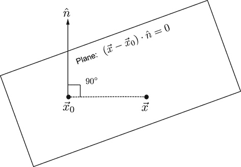

图 2.10 平面上的法线在平面的所有点上都是相同的。这是平面的基本性质。*n̂* 表示法线方向。设 [0] 为平面上的一个点。平面上所有其他点，表示为 ，都将满足方程 (−[0]) ⋅ *n̂* = 0。这从物理上说明，连接平面上的已知点 [0] 和平面上的任意其他任意点  的直线与法线 *n̂* 成直角。这种表述适用于任何维度。

在 1.3 节中，我们遇到了最简单的机器学习模型：输入的加权和以及偏差。将输入表示为 ，权重表示为 ，偏差表示为 *b*，该模型被描述为

*^T* + *b* = 0

方程 2.14

比较方程 2.13 和 2.14，我们得到几何意义：方程 1.3 的简单模型实际上是一个平面分离器。其权重向量  对应于平面的方向（法线）。偏差 *b* 对应于平面的位置（平面上的一个固定点）。在训练过程中，我们正在学习权重和偏差——这本质上是在学习将训练输入分开的最优平面的方向和位置。为了与机器学习范式保持一致，从现在起我们将超平面的方程写作方程 2.14，其中包含某个常数  和 *b*。

注意， 不一定是单位长度的向量。由于右侧为零，如果需要，我们可以将两边都除以 |||| 来转换为类似于方程 2.13 的形式。

表达式 *^T* + *b* 的符号具有特殊意义。对于所有满足 *^T* + *b* < 0 的点 ，它们位于超平面的同一侧。对于所有满足 *^T* + *b* > 0 的点 ，它们位于超平面的另一侧。当然，对于所有满足 *^T* + *b* = 0 的点 ，它们位于超平面上。

应该注意的是，三维方程 *ax* + *by* + *cz* + *d* = 0 是方程 2.14 的一个特例，因为 *ax* + *by* + *cz* + *d* = 0 可以重写为

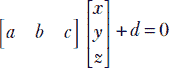

这与 *^T* + *b* = 0 相同，其中 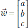 和 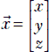。顺便提一下，这告诉我们，在三维空间中，平面 *ax* + *by* + *cz* + *d* = 0 的法向量是 。

## 2.9 线性组合，向量张成，基向量，和共线性保持

到目前为止，应该很清楚，机器学习和数据科学都是关于高维空间中的点。因此，我们有必要对这些空间有一个相当的了解。例如，给定一个空间，我们可能需要问，“是否可以用一组少数几个向量来表示空间中的所有点？我们真正需要多少个向量才能达到这个目的？”本节致力于研究这些问题。

### 2.9.1 线性相关

考虑图 2.11 中显示的向量（点）。在 2D 中的对应向量是

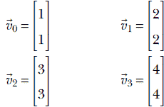

我们可以找到四个标量 *α*[0] = 2, *α*[1] = 2, *α*[2] = 2, 和 *α*[3] = −3，使得

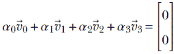

如果我们能找到这样的标量，它们不全为零，我们说向量 [0], [1], [2], 和 [3] 是 *线性相关* 的。需要记住的几何图像是，对应于线性相关向量的点位于包含它们的单一直线上。

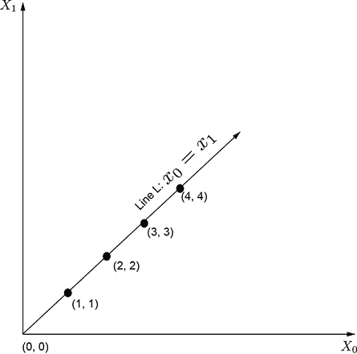

图 2.11 2D 平面中的线性相关点

共线性意味着线性相关

证明：设 ,  和  是三个共线向量。根据方程 2.12，存在某个 *α* ∈ ℝ，使得

 = (1−*α*) + *α*

这个方程可以重写为

*α*[1] + *α*[2] + *α*[3] = 0

其中 *α*[1] = (1−*α*), *α*[2] = *α* 和 *α*[3] = −1。因此，我们已经证明了三个共线的向量 , , 和  也必须是线性相关的。

线性组合

给定一组向量 [1], [2], …. *[n]* 和一组标量权重 *α*[1], *α*[2], …*α[n]*，它们的加权求和 *α*[1][1] + *α*[2][2] + + … *α**[n]**[n]* 被称为 *线性组合*。

线性相关的多维定义

一组向量 [1]、[2]、…… *[n]* 如果存在一组权重 *α*[1]、*α*[2]、…… *α[n]*（不全为零），使得 *α*[1][1] + *α*[2][2] + + … *α**[n]**[n]* = 0，则称这些向量**线性相关**。例如，行向量 [1   1] 和 [2   2] 是线性相关的，因为 –2[1   1] + [2   2] = 0。

### 2.9.2 向量集合的张量积

给定一组向量 [1]、[2]、…… *[n]*，它们的**张量积**定义为所有可以由原始集合的线性组合构成的向量集合。这包括原始向量。

例如，考虑两个向量  和 。这两个向量的张量积是包含这两个向量的整个平面。任何向量，例如向量 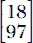，都可以表示为加权求和 18[*x*⊥] + 97[*y*⊥]。

你可能已经认出  和  是熟悉的二维平面中的笛卡尔坐标轴（*X*-轴和*Y*-轴，分别）。

### 2.9.3 向量空间、基向量和封闭性

我们一直在非正式地讨论向量空间。现在是时候更精确地定义它们了。

向量空间

在 *n* 维度中的向量（点）集合形成一个**向量空间**，当且仅当该集合上定义了**加法**和**标量乘法**运算。特别是，这意味着可以取向量空间成员的线性组合。

基向量

给定一个向量空间，一组张量积空间中的向量被称为该空间的**基**。例如，对于空间ℝ²，两个向量  和  是基向量。这本质上意味着ℝ²中的任何向量都可以表示为这两个向量的线性组合。这个概念可以扩展到更高维度。对于ℝ*^n*，向量  构成一个基。

警觉的读者可能已经猜到了，基向量与坐标轴有关。事实上，上面描述的基向量构成了笛卡尔坐标轴。

到目前为止，我们只看到了基向量的例子，这些向量是相互正交的，例如前面展示的ℝ²中的两个基向量的点积：。然而，基向量不必是正交的。任何一对线性无关的向量在ℝ²中形成一个基。因此，基向量绝不是唯一的。尽管如此，正交向量是最方便的，我们将在后面看到。

最小和完备基

需要**n**个向量来张成具有**n**维度的空间。这意味着空间的基集合将至少包含与空间维度一样多的元素。那么多的基向量也足以形成一个基。例如，需要恰好**n**个向量来形成（即张成）ℝ*^n*的基。

一个相关的事实是，在ℝ*^n*中，任何包含*m*个向量且*m* > *n*的集合将是线性相关的。换句话说，在*n*-维空间中，线性无关向量集合的最大大小是*n*。

封闭性

如果一个向量集合中的任意一对向量的线性组合也属于该集合，则称该向量集合在**线性组合**下是**封闭**的。考虑向量集合ℝ²。回想一下，这是包含两个实数元素的向量的集合。取ℝ²中的任意一对向量  和 ：例如， 和 。这两个向量的任意线性组合也将包含两个实数——也就是说，将属于ℝ²。我们称ℝ²是一个**向量空间**，因为它在**线性组合**下是**封闭**的。

考虑空间ℝ²。从几何上讲，这代表一个二维平面。让我们在这个平面上取两个点  和 。 和  的线性组合在几何上对应于连接它们的直线上的点。我们知道，如果两个点位于一个平面上，那么整个直线也将位于该平面上。因此，在二维中，平面在**线性组合**下是封闭的。这是向量空间中**封闭性**概念的几何直觉。它可以扩展到任意维度。

另一方面，球面上点的集合在**线性组合**下**不是**封闭的，因为连接该集合中任意一对点的直线不会完全位于该球面的表面上。

## 2.10 线性变换：几何和代数解释

机器学习或数据科学系统的输入通常是特征向量（在第 2.1 节中介绍），它们位于高维空间中。特征向量的每个单独维度对应于输入的一个特定属性。因此，特征向量是特定输入实例的描述符。它可以被视为特征空间中的一个点。我们通常将点转换到更容易进行我们试图进行的分析的空间中。例如，如果我们正在构建一个分类器，我们试图将输入转换到不同类别的点更加分离的空间中（参见一般性的第 1.3 节和特定的图 1.3）。有时我们进行变换以简化数据，消除数据中变化很少的轴。鉴于它们在机器学习中的重要性，在本节中，我们将研究变换的基本知识。

非正式地说，变换是一种将一组点（向量）映射到另一组点的操作。给定一个由 *n* × 1 向量组成的集合 *S*，任何 *m* × *n* 矩阵 *T* 都可以被视为一个变换。如果  属于集合 *S*，则与矩阵 *T* 的乘法将（变换） 映射到向量 *T*。我们稍后将会看到，矩阵乘法是保持共线性的变换的一个子类——变换前位于直线上的点在变换后将继续位于（可能不同的）直线上。例如，考虑以下矩阵


在第 2.14 节中，我们将看到这是一种称为旋转矩阵的特殊类型的矩阵；现在，只需将其视为矩阵的一个例子。*R* 是一个变换算子，它将二维平面上的一个点映射到同一平面上的另一个点。用数学符号表示，*R* : ℝ² → ℝ²。实际上，如图 2.14 所示，这种变换（通过矩阵 *R* 的乘法）将二维平面上的一个点的位置向量旋转了 45°。

在这种变换中，输出点和输入点可能属于不同的空间。例如，考虑以下矩阵


很容易看出，这个矩阵将三维点投影到二维 X-Y 平面上：


因此，这种变换（通过矩阵 *P* 的乘法）将点从三维投影到二维。在数学术语中，*P* : ℝ³ → ℝ²。

变换 *R* 和 *P* 具有共同属性：*它们保持共线性*。这意味着一组原本位于直线上的向量（点）、、、⋯ 在变换后仍然保持直线。

让我们检查一下在 2.9 节中的例子中的旋转变换。在那里我们看到了四个向量：


这些向量都位于一条直线上 *L* : *x* = *y*。这些向量的旋转变换版本是


很容易看出，变换后的向量也位于一条（不同的）直线上。事实上，^′, ^′, ^′, ^′ 位于 *Y* 轴上，这是原始直线 *y* = *x* 的 45° 旋转版本。

很容易看出，变换后的向量也位于一条（不同的）直线上。事实上，^′, ^′, ^′, ^′ 位于 *Y* 轴上，这是原始直线 *y* = *x* 的 45° 旋转版本。

由矩阵 *P* 表示的投影变换也保持共线性。考虑三维空间中的四个共线向量：


对应的变换向量


也位于二维空间中的一条直线上。

保持共线性的变换类被称为 *线性变换*。它们总是可以表示为矩阵乘法。相反，所有的矩阵乘法都代表线性变换。稍后提供更正式的定义。

### 2.10.1 线性变换的多维通用定义

一个函数 *ϕ* 是线性变换当且仅当它满足

*ϕ*(*α* + *β*) = *αϕ*() + *βϕ*() ∀ *α*, *β* ∈ ℝ

方程 2.15

换句话说，*一个变换是线性的当且仅当两个向量的线性组合的变换与单个向量的变换的线性组合（具有相同的权重）相同*。（这可以记住为：*线性变换意味着线性组合的变换与变换的线性组合相同*。）与旋转或投影矩阵（前面已展示）的乘法是一个线性变换。

### 2.10.2 所有矩阵-向量乘法都是线性变换

让我们验证矩阵乘法是否满足线性映射的定义（方程 2.15）。设 ,  ∈ ℝ*^n* 是两个任意的 *n*-维向量，*A[m, n]* 是一个任意的具有 *n* 列的矩阵。然后按照矩阵-向量乘法的标准规则，

*A*(*α* + *β*) = *α*(*A*) + *β*(*A*)

它模仿了方程 2.15，其中 *ϕ* 被矩阵 *A* 替换。因此，我们已经证明了所有矩阵乘法都是线性变换。反之则不成立。特别是，作用在无限维向量上的线性变换不是矩阵。但所有作用在有限维向量上的线性变换都可以表示为矩阵。（证明稍微复杂一些，将省略。）

因此，在有限维度中，矩阵乘法和线性变换是同一件事。在 2.3 节中，我们看到了矩阵的数组视图。相应的几何视图，即所有矩阵都表示线性变换，在本节中已经介绍。

让我们通过研究一个 *不是* 线性的变换的例子来结束本节。考虑以下函数

*ϕ*() = ||||

对于  ∈ ℝ*^n*。这个函数 *ϕ* 将 *n* 维向量映射到一个标量，即向量的长度，*ϕ* : ℝ*^n* → ℝ。我们将检查它是否满足方程 2.15 中 *α*[1] = *α*[2] = 1 的条件。对于两个特定的向量 ， ∈ ℝ*^n*，


现在


和


显然，这两个不相等；因此，我们违反了方程 2.15：*ϕ* 是一个非线性映射。

## 2.11 多维数组、多元线性变换和张量

我们经常在机器学习的背景下听到 *张量* 这个词。谷歌著名的机器学习平台被命名为 *TensorFlow*。在本节中，我们将向您介绍张量的概念。

### 2.11.1 数组视图：数字的多维数组

张量可以被视为一个广义的 *n* 维数组——尽管严格来说，并非所有多维数组都是张量。当我们学习多元线性变换时，我们将了解更多关于多维数组和张量之间区别的信息。现在，我们不必过于担心这种区别。一个向量可以被视为一个 1 维张量，一个矩阵是一个 2 维张量，而一个标量是一个 0 维张量。

在 2.3 节中，我们了解到数字图像被表示为二维数组（矩阵）。一个彩色图像——其中每个像素由三种颜色，R、G 和 B（红色、绿色和蓝色）表示——是一个多维数组或张量的例子。这是因为它可以被视为三个图像的组合：R、G 和 B 图像，分别。

神经网络中每一层的输入和输出也是张量。

## 2.12 线性系统和矩阵逆

今天的机器学习通常是一个迭代过程。给定一组训练数据，你希望估计一组机器参数，这些参数将在训练输入上产生目标值（或接近它们的近似值）。训练输入的数量和参数集的大小通常非常大。这使得我们无法有一个闭式解，其中我们一次性求解未知参数。解决方案通常是迭代的。我们从参数的猜测值集合开始，通过处理训练数据来迭代地改进猜测。

话虽如此，在现实生活中，我们经常遇到更小的问题。我们最好使用更传统的闭式技术，因为它们要快得多，也更准确。本节致力于对这些技术进行一些了解。

让我们回到我们熟悉的猫脑问题，并参考其训练数据表 2.2。和之前一样，我们仍在讨论一个具有三个参数的加权求和模型：权重 *w*[0]、*w*[1] 和偏置 *b*。让我们专注于表中的前三行，为了方便起见，这里再次以表 2.2 的形式呈现。

表 2.3 基于玩具机器学习的猫脑示例训练数据集

|  | 输入值：硬度 | 输入值：锋利度 | 输出：威胁分数 |
| --- | --- | --- | --- |
| 0 | 0.11 | 0.09 | −0.8 |
| 1 | 0.01 | 0.02 | −0.97 |
| 2 | 0.98 | 0.91 | 0.89 |

训练数据表明，当硬度值为 0.11 且锋利度值为 0.09 时，我们期望系统的输出与目标值 -0.8 匹配或接近，等等。换句话说，我们估计的参数 *w*[0]、*w*[1]、*b* 的值应理想地满足

0.11*w*[0] + 0.09*w*[1] + b = –0.8

0.01*w*[0] + 0.02*w*[1] + b = –0.97

0.98*w*[0] + 0.91 *w*[1] + b = 0.89

我们可以通过矩阵乘法表达如下方程：


我们如何获得使这个方程成立的 *w*[0]、*w*[1]、*b* 的值？也就是说，我们如何解这个方程？有正式的方法（稍后讨论）可以直接解这类方程，以求解 *w*[0]、*w*[1] 和 *b*（在这个非常简单的例子中，你可能“看到”*w*[0] = 1、*w*[1] = 1、*b* = −1 可以解这个方程，但我们需要一个通用方法）。

这个方程是称为线性系统的一类方程的例子。在 *n* 个未知数 *x*[1]、*x*[2]、*x*[3]、⋯、*x[n]* 中的线性系统，

*a*[11]*x*[1] + *a*[12]*x*[2] + *a*[13]*x*[3] + … + *a*[1*n*]*x[n]* = *b*[1]

*a*[21]*x*[1] + *a*[22]*x*[2] + *a*[23]*x*[3] + … + *a*[2*n*]*x[n]* = *b*[2]

⁞

*a*[*n*1]*x*[1] + *a*[*n*2]*x*[2] + *a*[*n*3]*x*[3] + … + *a[nn]**x[n]* = *b[n]*

可以通过矩阵和向量表示为

*A* = 

其中


虽然等价，但矩阵表示更紧凑且与维度无关。在机器学习中，我们通常有很多变量（数千个），这种紧凑性产生了显著差异。此外，*A* =  看起来与我们非常熟悉的单变量方程相似：*ax* = *b*。事实上，许多直觉可以从一维转移到高维。

一维方程的解是什么？你可能在上五年级时就学过了：*ax* = *b* 的解是 *x* = *a*^(−1)*b*，其中 *a*^(−1) = 1/*a*，*a* ≠ 0。

我们可以在所有维度中使用相同的符号。*A* =  的解是  = *A*^(−1)，其中 *A*^(−1) 是矩阵的逆。逆矩阵 *A*^(−1) 有矩阵的行列式，1/*det*(*A*), 作为因子。我们不会在这里讨论行列式和逆矩阵的计算——你可以在任何标准的线性代数教科书中找到这些——但会陈述一些有助于理解行列式和逆矩阵的事实：

+   逆矩阵 *A*^(−1) 与矩阵 *A* 的关系与标量 *a*^(−1) 与标量 *a* 的关系相同。*a*^(−1) 存在当且仅当 *a* ≠ 0。类似地，*A*^(−1) 存在当 *det*(*A*) ≠ 0，其中 *det*(*A*) 指的是矩阵的行列式。

+   标量 *a* 和其逆 *a*^(−1) 的乘积是 1。类似地，*AA*^(−1) = *A*^(−1)*A* = **I**，其中 **I** 表示单位矩阵，它是标量算术中 1 的高维类似物。它是一个对角线项为 1，其他项为 0 的矩阵。*n*-维单位矩阵如下：


当没有下标时，可以从上下文中推断出维度。对于任何矩阵 *A*，**I***A* = *A***I** = *A*。对于任何向量 ，**I** = *^T***I** = 。这些可以通过矩阵乘法的规则轻松验证。

计算行列式和矩阵逆有完全精确但繁琐的规则。尽管这个概念很重要，但在生活中我们很少需要计算它们，因为所有线性代数软件包都提供了执行此操作的例程。此外，计算矩阵逆不是好的编程实践，因为它在数值上是不稳定的。我们不会在这里讨论行列式或矩阵逆的直接计算（除了附录 A.2 中，我们展示了如何计算 2 × 2 矩阵的行列式）。我们将讨论伪逆，这在机器学习中具有更重要的意义。

### 2.12.1 行列式为零或接近零的线性系统，以及病态系统

我们之前看到，线性系统 *A* =  的解是  = *A*^(−1)。但 *A*^(−1) 有 1/*det*(*A*) 作为因子。如果行列式为零怎么办？

简短的回答：当行列式为零时，线性系统无法精确求解。我们仍然可以尝试找到一个近似答案（见第 2.12.3 节），但精确解是不可能的。

让我们借助一个例子更仔细地考察一下这种情况。考虑以下方程组：

*  x*[1] + *x*[2]   = 2

2*x*[1] + 2*x*[2]  = 4

它可以重写为一个具有方阵的线性系统：


但你可以很快看出，这个方程组无法求解。第二个方程实际上与第一个方程相同。事实上，我们可以通过将第一个方程乘以一个标量，2，来得到第二个方程。因此，我们实际上只有一个方程，而不是两个，所以这个方程组无法求解。现在考察矩阵 *A* 的行向量。它们是 [1   1] 和 [2   2]。它们是线性相关的，因为 −2[1   1] + [2   2] = 0。现在考察矩阵 *A* 的行列式（附录 A.2 展示了如何计算 2 × 2 矩阵的行列式）。它是 2 × 1 − 1 × 2 = 0。这些结果不是巧合。任何一个都意味着另一个。事实上，以下关于线性系统 *A* = （对于方阵）的陈述是等价的：

+   矩阵 *A* 有一个行/列可以表示为其他行的加权求和。

+   矩阵 *A* 的行或列线性相关。

+   矩阵 *A* 的行列式为零（这样的矩阵被称为 *奇异矩阵*）。

+   矩阵 *A* 的逆（即 *A*^(−1)）不存在。*A* 被称为 *奇异的*。

+   这个线性系统无法求解。

系统试图告诉你，你拥有的方程比你想的少，你无法求解这个方程组。

有时行列式不是正好为零，而是接近于零。虽然理论上可以求解，但这样的系统是 *数值不稳定的*。输入的微小变化会导致结果发生剧烈变化。例如，考虑这个几乎奇异的矩阵：


方程 2.16

它的行列式是 0.002，接近于零。设  为一个向量。


方程 2.17

（注意* A^(-1) *的元素有多大。这是由于除以一个非常小的行列式，进而导致下文所示的不稳定性。）方程的解为 。但如果我们将稍微改变一下，使其变为，解就会变成一个截然不同的。这是固有的不稳定性，并源于矩阵* A *的近奇异性。这样的线性系统被称为*病态的*。

### 2.12.2 矩阵的逆、行列式和奇异性测试的 PyTorch 代码

通过线性代数包 linalg 的单个函数调用即可求逆矩阵和计算行列式。

列表 2.10 可逆矩阵的矩阵逆（非零行列式）

```py
def determinant(A):
    return torch.linalg.det(A)

def inverse(A):
    return torch.linalg.inv(A)

A = torch.tensor([[2, 3], [2, 2]], dtype=torch.float    ①

A_inv = inverse(A)                                      ②

I = torch.eye(2)                                        ③

assert torch.all(torch.matmul(A, A_inv) == I)           ④
assert torch.all(torch.matmul(A_inv, A) == I)

assert torch.all(torch.matmul(I, A) ==  A)
assert torch.all(A == torch.matmul(A,I))                ⑤
```

① 

② 

③ PyTorch 函数*torch.eye(* n *)生成一个大小为* n *的单位矩阵* I *

④ 验证

⑤ ** I **就像 1。验证*A**I = **I**A = * A *

奇异矩阵是指行列式为零的矩阵。这样的矩阵是不可逆的。具有奇异矩阵的线性方程组无法求解。

列表 2.11 奇异矩阵

```py
B = torch.tensor([[1, 1], [2, 2]], dtype=torch.float)   ①
try:

    B_inv = inverse(B)                                  ②

except RuntimeError as e:
    print("B cannot be inverted: {}".format(B, e))
```

① 

② 行列式 = 1 × 2 - 2 × 1 = 0。奇异矩阵；尝试计算逆矩阵会导致运行时错误。

### 2.12.3 机器学习中的超定和欠定线性系统

如果矩阵* A *不是方阵呢？这意味着方程的数量不等于未知数的数量。这样的系统有意义吗？出人意料的是，它是有意义的。一般来说，机器学习系统属于这一类：方程的数量对应于收集的训练数据实例的数量，而未知数的数量是模型中权重的函数，这是特定模型家族选择来表示系统的函数。这些是相互独立的。如前所述，我们通常迭代地解决这些系统。然而，了解非方阵的线性系统* A *是很重要的，以获得洞察。

假设矩阵* A *是* m * × * n *（* m *行和* n *列），有两种可能的情况：

+   情况 1：* m * > * n *（方程多于未知数；超定系统）

+   情况 2：* m * < * n *（方程少于未知数；欠定系统）

例如，表 2.2 导致一个超定线性系统。让我们写下方程组：

0.11 * w*[0] + 0.09 * w*[1] + b = –0.8

0.01 * w*[0] + 0.02 * w*[1] + b = –0.97

0.98 * w*[0] + 0.91 * w*[1] + b = 0.89

0.12 * w*[0] + 0.21 * w*[1] + b = –0.68

0.98 * w*[0] + 0.99 * w*[1] + b = 0.95

0.85 * w*[0] + 0.87 * w*[1] + b = 0.74

0.03 * w*[0] + 0.14 * w*[1] + b = –0.88

0.55 * w*[0] + 0.45 * w*[1] + b = 0.00

这会产生以下超定线性系统：


方程式 2.18

这是一个非方阵的 15 × 3 线性系统。只有 3 个未知数需要求解 (*w*[0], *w*[1], *b*)，而方程有 15 个。这非常冗余：我们只需要三个方程，就可以通过线性系统求解技术（第 2.12 节）来解决这个问题。但重要的是要注意这一点：*方程并不完全一致*。没有一组单一的未知数值可以满足所有方程。换句话说，训练数据是嘈杂的——这是现实生活中的机器学习系统的一个几乎普遍现象。因此，我们必须找到一个解决方案，在整个方程中都是最优的（尽可能减少错误）。

我们希望求解它，使得整体误差 ||*A* − || 最小化。换句话说，我们正在寻找 ，使得 *A* 尽可能接近 。这种闭式（即非迭代）方法是机器学习和数据科学的一个极其重要的先导。我们将在多个地方重新讨论这个问题，特别是在第 2.12.4 节和 4.5 节。

### 2.12.4 矩阵的摩尔-彭若斯伪逆

伪逆是一种解决超定或欠定线性系统的便捷技术。假设我们有一个超定系统，其非必要方阵 *m* × *n* 矩阵 *A*：

*A* = 

由于 *A* 不保证是方阵，我们通常不能取其行列式或逆。所以，通常的 *A*^(−1) 是不工作的。在这个时候，我们注意到，尽管不能取逆，但矩阵转置总是可能的。让我们将方程的两边乘以 *A^T*：

*A* =  ⇔ *A^TA* = *A^T*

注意到 *A^TA* 是一个方阵：其维度是 (*m*×*n*) × (*n*×*m*) = *m* × *m*。暂时不进行证明，我们假设它是可逆的。那么

*A* =  ⇔ *A^TA* = *A^T* ⇔  = (*A^TA*)^(−1)*A^T*

嗯嗯，还不错；我们似乎找到了一些东西。事实上，我们刚刚推导出了矩阵 *A* 的 *伪逆*，表示为 *A* ^+ = (*A^TA*)^(−1)*A^T*。与逆矩阵不同，伪逆不需要矩阵是方阵且行线性无关。与常规线性系统类似，我们得到（可能非方阵）方程组的解为 *A* =  ⇔  = *A* ^+ 。

基于伪逆的解实际上最小化了误差 ||*A* − ||。我们将在第 2.12.5 节中提供一个直观的证明。同时，鼓励你编写 Python 代码来评估 (*A^TA*)^(−1)*A^T* 并验证它大约给出了方程 2.18 预期的答案 。

### 2.12.5 矩阵的伪逆：一种美丽的几何直觉

矩阵 *A*[*m* × *n*] 可以用其列向量表示为 ![[1], [2], … *[n]*]，其中 [1] … *[n]* 都是 *m*-维向量。然后如果 ，我们得到 *A* = *x*[1][1] + *x*[2][2] + ⋯ *x[n]**[n]*。换句话说，*A* 只是 *A* 的列向量的线性组合，其中  的元素作为权重（鼓励你写出一个小的 3 × 3 系统并验证这一点）。所有形式为 *A* 的向量空间（即 *A* 的列向量的线性空间）被称为 *A* 的 *列空间*。

线性方程组 *A* =  的解可以看作是寻找 ，使其最小化 *A* 和  之间的差异：即最小化 ||*A* − ||。这意味着我们正在尝试找到一个点，该点在 *A* 的列空间中，并且离点  最近的。请注意，这种解释并不假设矩阵 *A* 是方阵。它也不假设行列式不为零。在友好的情况下，当矩阵 *A* 是方阵且可逆时，我们可以找到一个向量 ，使得 *A* 完全等于 ，这使得 ||*A* − || = 0。如果 *A* 不是方阵，我们将尝试找到一个 ，使得 *A* 比任何其他在 *A* 的列空间中的向量更接近 。从数学上讲，⁴


方程 2.19

从几何学上，我们直观地知道，在 *A* 的列空间中，离  最近的点是通过对  从垂直于 *A* 的列空间（见图 2.12）进行投影得到的。这个垂直线与列空间的交点被称为  在 *A* 的列空间上的 *投影*。我们正在寻找的方程 2.19 的解向量  应该对应于  在 *A* 的列空间上的投影。这反过来意味着  − *A* 与 *A* 的列空间中的所有向量正交（垂直）。我们用 *A* 表示 *A* 的列空间中的任意向量，对于任意的 。因此，对于所有这样的 ，


为了使前一个方程对所有向量  都成立，我们必须有 *A^T*(−*A*) = 0。

因此，我们有


这正是摩尔-彭罗斯伪逆。


图 2.12 解线性系统 *A* =  等价于找到 *A* 的列空间中与  最近的点。这意味着我们必须从  向 *A* 的列空间引一条垂线。如果 *A* 表示该垂线与列空间的交点（即投影），则差向量  − *A* 对应于连接  和其投影 *A* 的线。这条线将与 *A* 的列空间中的所有向量垂直。等价地，它对于任意  都与 *A* 垂直。

对于一个以机器学习为中心的示例，考虑本章前面提到的猫脑对应超定系统。有 15 个训练示例，每个示例都指定了输入和期望输出。

我们的目标是确定三个未知数 *w*[0]、*w*[1] 和 *b*，使得对于每个训练输入 ，模型输出


方程 2.20

尽可能接近期望输出（即真实值）*ȳ[i]*。

注意：在这里我们使用了一个巧妙的方法：我们在输入的右侧添加了 1，这使得我们可以用一个紧凑的矩阵-向量乘法来表示整个系统（包括偏差）。我们称之为*增广*——我们在输入行向量右侧添加一个额外的 1。

将所有训练示例整理在一起，我们得到


方程 2.21

这可以紧凑地表示为

*X* = 

其中 *X* 是右侧列全为 1 的增广输入矩阵。目标是使 || – || 最小化。为此，我们构建了超定线性系统

*X* = 

注意，*这并不是一个经典的方程组——方程的数量多于未知数*。我们不能通过矩阵求逆来解这个方程组。然而，我们可以使用伪逆机制来解它。得到的解提供了“最佳拟合”或“最佳努力”解，它最小化了所有训练示例的总误差。

精确的数值系统（为方便参考在此重复）如下


方程 2.22

我们使用伪逆公式求解  = (*X^TX*)^(–1)*X^T*

### 2.12.6 使用 PyTorch 代码解决超定系统

注意：本节的完整功能代码，可通过 Jupyter Notebook 执行，可在[`mng.bz/PPJ2`](http://mng.bz/PPJ2)找到。

列表 2.12 使用伪逆求解超定系统

```py
def pseudo_inverse(A):
    return torch.matmul(torch.linalg.inv(torch.matmul(A.T, A)), A.T)

①
X = torch.column_stack((X, torch.ones(15))) ②

③
w = torch.matmul(pseudo_inverse(X), y)      ④

print("The solution is {}".format(w))       ⑤
```

① X 是方程 2.22 中的增广数据矩阵

② Pytorch 列堆叠操作符

向矩阵中添加一列。在这里，添加的列全是 1

③ 容易验证方程 2.22 的解大致为 *w*[0] = 1, *w*[1] = 1, *b* = −1。但方程并不一致：没有一个解能完美地适应所有这些方程。伪逆找到“最佳拟合”解：它最小化了所有方程的总误差。

④ 预期解接近 [1, 1, −1]

⑤ 解为 [1.08, 0.90, −0.96]

## 2.13 特征值和特征向量：机器学习的瑞士军刀

机器学习和数据科学都是关于在大量高维数据中寻找模式。输入是第 2.1 节中介绍的高维空间中的特征向量。每个特征向量可以看作是输入实例的特征空间描述符中的一个点。有时我们会转换这些特征向量——将特征点映射到一个更友好的空间——通过降低维度来简化数据。这是通过消除数据中变化很少的轴来实现的。特征值和特征向量是机器学习工程师或数据科学家在简化数据和寻找大量多维数据中的广泛模式时的宝贵工具。在第四章中，我们将研究如何使用这些工具来简化数据和在大量多维数据中寻找广泛模式。

让我们先非正式地看看特征向量。它们是方阵的性质。如前所述，矩阵可以看作是线性变换，它将一个空间中的向量（点）映射到相同或不同空间中的不同向量（点）。但典型的线性变换会留下一些空间中的点（几乎）不受影响。这些点被称为 *特征向量*。它们是变换的重要物理方面。让我们看一个简单的例子。假设我们在 3D 空间中围绕 *Z*-轴（见图 2.13）旋转点。*Z*-轴上的点在旋转后仍将保持在原地。一般来说，旋转轴上的点在旋转后不会移动。旋转轴是旋转变换的特征向量。


图 2.13 在旋转过程中，旋转轴上的点位置不变。

将这个想法扩展，当用矩阵 *A* 对向量  进行 *变换* 时，是否存在不改变（至少在方向上）的向量？结果是肯定的。这些就是所谓的 *特征向量*——当通过矩阵 *A* 进行线性变换时，它们不会改变方向。为了更精确，如果  是方阵 *A* 的特征向量，⁵ 则有

*A* = *λ*

因此，线性变换（即，矩阵 *A* 的乘法）改变了  的长度，但没有改变其方向，因为 *λ* 与  平行。

我们如何获得 *λ* 和 ？嗯，

*A* = *λ* 

⇔ *A* - *λ* = 

⇔ (*A* - *λ* **I**) = 

其中 **I** 表示单位矩阵。

当然，我们只对非平凡解感兴趣，其中  ≠ 。在这种情况下，*A* – *λ***I** 不能是可逆的，因为如果是的话，我们可以得到矛盾的解  = (*A* – *λ* **I**)^(–1)  = 。因此，(*A* − *λ***I**) 是不可逆的，这意味着行列式

*det*(*A* − *λ***I**) = 0

对于一个 *n* × *n* 矩阵 *A*，这会产生一个 *n* 次的多项式方程，对于未知数 *λ* 有 *n* 个解。*因此，一个 *n* × *n* 矩阵有 n 个特征值，不一定都是不同的*。

让我们计算一个 3 × 3 矩阵的特征值和特征向量，只是为了好玩。我们使用的矩阵是精心选择的，这一点很快就会变得明显。但就现在而言，把它看作是一个任意矩阵：


方程 2.23

我们将计算矩阵 *A* 的特征值和特征向量：


因此，


这里，*i* = √–1。如果需要，鼓励您从高中代数中复习一下虚数和复数的知识。

因此，我们找到了（正如预期的那样）三个特征值：1，*e*^(*i* *π*/4)，和 *e*^(–*i* *π*/4)。每个都会产生一个特征向量。以下是一个例子，让我们计算对应于特征值 1 的特征向量：


因此， 是矩阵 A 对应于特征值 1 的一个特征向量。同样，对于任何实数 *k*， 也是。实际上，如果 *λ*， 是矩阵 *A* 的一个特征值，特征向量对，那么

*A* = *λ* ⇔ *A*(*k*) = *λ*(*k*)

即，*λ*，(*k*) 也是一个矩阵 *A* 的特征值，特征向量对。换句话说，我们只能确定特征向量到一个固定比例因子。我们可以将特征向量取为单位长度（*^T* = 1），这样不失一般性。

我们示例矩阵的特征向量实际上是 *Z*-轴。这不是一个巧合。我们的矩阵 *A* 实际上是在 *Z*-轴上的旋转。*旋转矩阵的特征值总是 1。相应的特征向量将是旋转轴。在 3D 中，其他两个特征值将是复数，产生旋转角度。* 这在 2.14 节中有详细说明。

### 2.13.1 特征向量和线性无关

对应于不等特征值的矩阵的特征向量是线性无关的。让我们来证明这一点以获得一些洞察。设 *λ*[1]，[1] 和 *λ*[2]，[2] 是矩阵 *A* 的特征值，特征向量对，其中 *λ*[1] ≠ *λ*[2]。那么

*A*[1] = *λ*[1][1]

*A*[2] = *λ*[2][2]

如果可能的话，让存在两个常数 *α*[1] 和 *α*[2] 使得

*α*[1][1] + *α*[2][2] = 0

方程式 2.24

换句话说，假设两个特征向量是线性相关的。我们将证明这个假设会导致不可能的情况。

将方程 2.24 乘以 *A*，我们得到

*α*[1]*A*[1] + *α*[2]*A*[2]  = 0

⇔ *α*[1]*λ*[1][1] + *α*[2]*λ*[2][2]  = 0

此外，我们还可以将方程 2.24 乘以 *λ*[2]。因此我们得到

*α*[1]*λ*[1][1] + *α*[2]*λ*[2][2] = 0

*α*[1]*λ*[2][1] + *α*[2]*λ*[2][2] = 0

相减，我们得到

*α*1[1] = 0

根据假设，*α*[1] ≠ 0，*λ*[1] ≠ *λ*[2] 并且 [1] 不是全零。因此，它们的乘积不可能为零。我们的原始假设（两个特征向量线性相关）一定是错误的。

### 2.13.2 对称矩阵和正交特征向量

对称矩阵的两个对应于不同特征值的特征向量是互相正交的。让我们来证明这一点以获得更多的洞察。一个矩阵 *A* 是对称的当且仅当 *A^T* = *A*。如果 *λ*[1]，[1] 和 *λ*[2]，[2] 是对称矩阵 *A* 的特征值，特征向量对，那么

*A*[1] = *λ*[1][1]

方程式 2.25

*A*[2] = *λ*[2][2]

方程式 2.26

对方程 2.25 进行转置，

[1]*^T A^T* = *λ*[1][1]^T

从右乘以 [2]，我们得到

[1]^T *A^T*[2] = *λ*[1][1]*^T *[2]

⇔ [1]^T *A*[2  ] = *λ*[1][1]*^T *[2]

其中最后一个等式来源于矩阵的对称性。此外，将方程 2.26 左乘以 [1]*^T*，我们得到

[1]*^T A*[2] = *λ*[2][1]*^T *[2]

因此

[1]*^T A*[2] = *λ*[1][1]*^T *[2]

[1]*^T A*[2] = *λ*[2][1]^T [2]

相减得到

0 = (*λ*[1] - *λ*[2]) [1]*^T *[2]

由于 *λ*[1] ≠ *λ*[2]，我们必须有 [1]*^T *[2] = 0，这意味着这两个特征向量是正交的。因此，如果 *A* 是一个 *n* × *n* 的对称矩阵，其特征向量为 [1]，[2]，… *[n]*，那么 *[i]^T[j]* = 0 对于所有满足 *λ[i]* ≠ *λ[j]* 的 *i*，*j*。

### 2.13.3 计算特征向量和特征值的 PyTorch 代码

注意：本节的完整功能代码，可通过 Jupyter Notebook 执行，可在 [`mng.bz/1rEZ`](http://mng.bz/1rEZ) 找到。

列表 2.13 特征值和向量

```py
from torch import linalg as LA

A = torch.tensor([[0.707, 0.707, 0],
       [-0.707, 0.707, 0], [0, 0, 1]])    ①

l, e = LA.eig(A)                          ②

print("Eigen values are {}".format(l))
print("Eigen vectors are {}".format(e.T)) ③
```

①  在三维空间中绕 *Z* 轴旋转点。

旋转轴是 *Z* 轴：[0  0  1]*^T*

② torch.linalg 包中的 eig() 函数计算特征值和向量。

③ 特征值或向量可能包含涉及 *j* = √-1 的复数

## 2.14 正交（旋转）矩阵及其特征值和特征向量

在所有变换中，旋转变换由于其机械世界中的高度可观察行为而具有特殊的直观吸引力。此外，它们在开发和分析多个机器学习工具中发挥着重要作用。在本节中，我们概述了旋转（即正交）矩阵。（本节的 Jupyter Notebook 的完整功能代码可在 [`mng.bz/2eNN`](http://mng.bz/2eNN) 找到。）

### 2.14.1 旋转矩阵

图 2.14 显示了一个点 (*x*, *y*) 围绕原点以角度 *θ* 旋转。原始点的位置向量与 *X*-轴形成角度 *α*。旋转后，点的新的坐标是 (*x*^′, *y*^′)。请注意，根据定义，旋转不会改变旋转中心的距离；这正是圆圈所表示的。


图 2.14 在原点周围平面的旋转。根据定义，旋转不会改变旋转中心（由圆圈指示）的距离。

一些著名的旋转矩阵如下：

+   **围绕原点以角度 *θ* 进行平面旋转**（见图 2.14）：


方程 2.27

+   **在 3D 空间中围绕 *Z*-轴以角度 *θ* 进行旋转**：


方程 2.28

注意，*z* 坐标在此旋转中不受影响：


这个旋转矩阵有一个特征值为 1，对应的特征向量是 *Z*-轴——你应该验证这一点。这意味着当通过前面的矩阵（旋转）变换时，*Z*-轴上的点映射到自身，这与 *z* 坐标在此旋转中保持不变的属性相一致。

+   **在 3D 空间中围绕 *X*-轴以角度 *θ* 进行旋转**：


方程 2.29

注意，*X* 坐标在此旋转中不受影响，*X*-轴是该矩阵的特征向量：


+   **在 3D 空间中围绕 *Y*-轴以角度 *θ* 进行旋转**：


方程 2.30

注意，*Y* 坐标在此旋转中不受影响，*Y*-轴是该矩阵的特征向量：


列表 2.14 旋转矩阵

```py
def rotation_matrix_2d(theta):                                            ①
     return torch.tensor([[cos(radians(theta)), -sin(radians(theta))],
                      [sin(radians(theta)), cos(radians(theta))]])

def rotation_matrix_3d(theta, axis):                                      ②
     if axis == 0:                                                        ③
       return torch.tensor([[1, 0, 0],
                        [0, cos(radians(theta)),-sin(radians(theta))],
                        [0, sin(radians(theta)),cos(radians(theta))]])
     elif axis == 1:                                                      ④
       return torch.tensor([[cos(radians(theta)),0,-sin(radians(theta))],
                        [0, 1, 0],
                        [sin(radians(theta)),0,cos(radians(theta))]])
     elif axis == 2:                                                      ⑤
       return torch.tensor([[cos(radians(theta)),-sin(radians(theta)),0],
                        [sin(radians(theta)),cos(radians(theta)),0],
                        [0, 0, 1]])
```

① 返回在原点周围以角度 theta 进行的平面 2D 旋转的矩阵。因此，与该矩阵的乘法将点移动到新位置。原始点和新点位置向量之间的角度是 theta（见图 2.14）。

② 返回一个矩阵，该矩阵将点在 3D 空间中围绕所选轴旋转 theta 度。旋转轴可以是 0、1 或 2，分别对应于 X-、Y- 或 Z-轴。

③ *R*[3*dx*] 来自方程 2.29

④ *R*[3*dy*] 来自方程 2.30

⑤ *R*[3*dz*] 来自方程 2.28

列表 2.15 应用旋转矩阵

```py
u = torch.tensor.array([1, 1, 1], dtype=torch.float)  ①

R3dz = rotation_matrix_3d(45, 2)                      ②
v = torch.matmul(R3dz, u_row)                         ③

R3dx = rotation_matrix_3d(45, 0)                      ④
w = torch.matmul(R3dx, u_row)                         ⑤
```

① 创建向量 （见图 2.15）

② *R*[3*dz*] 来自方程 2.28，45°关于 *Z*-轴

③ （见图 2.15）是通过 *R*[3*dz*] 旋转的 。

④ *R*[3*dx*] 来自方程 2.28，45°关于 *X*-轴

⑤ （见图 2.15）是通过 *R*[3*dx*] 旋转  得到的。


图 2.15 旋转可视化。在这里，原始向量 u 首先绕 Z 轴旋转 45 度得到向量 v，然后再次绕 X 轴旋转 45 度得到向量 w。

### 2.14.2 旋转矩阵的正交性

一个矩阵 *R* 是 *正交的* 当且仅当它的转置也是它的逆：即，*R^TR* = *RR^T* = **I**。*所有旋转矩阵都是正交矩阵。所有正交矩阵都表示某种旋转。* 例如：


鼓励您同样验证，这里显示的所有旋转矩阵都是正交的。

正交性和长度保持

正交性意味着旋转保持长度。给定任意向量  和旋转矩阵 *R*，令  = *R* 为旋转后的向量。由于很容易看出这两个向量的长度（大小）相等，因此 ， 相等。

|||| = *^T* = (*R*)*^T*(*R*) = *^TR^TR* = *^T***I** = *^T* = ||||

从基本的矩阵理论中，我们知道

(*AB*)*^T* = *B^TA^T*

取消旋转角度

取消旋转角度相当于反转旋转矩阵，这相当于转置旋转矩阵。例如，考虑平面内的旋转。假设一个点  通过矩阵 *R* 绕原点旋转到向量 。因此


现在，我们可以通过旋转 −*θ* 从  回到 。相应的旋转矩阵是


换句话说，*R^T* 反转了旋转：即，以负角度旋转。

### 2.14.3 PyTorch 代码用于旋转矩阵的正交性

让我们通过在 PyTorch 中创建一个旋转矩阵，给它一个转置，并验证原始矩阵和转置的乘积是单位矩阵来验证旋转矩阵的正交性。

列表 2.16 旋转矩阵的正交性

```py
R_30 = rotation_matrix_2d(30)                      ①

assert torch.allclose(
    torch.linalg.inv(R_30),
    R_30.T

    )                                              ②

assert torch.allclose(
    torch.matmul(R_30, R_30.T),
    torch.eye(2)                                   ③
    )

u = torch.tensor([[4],[0]], dtype=torch.float)

v = torch.matmul(R_30, u)                          ④

assert torch.linalg.norm(u) ==torch.linalg.norm(v)  ⑤

R_neg30 = rotation_matrix_2d(-30)
w = torch.matmul(R_neg30, v)                       ⑥
assert torch.all(w == u)

assert torch.allclose(R_30, R_neg30.T)
assert torch.allclose(
    torch.matmul(R_30, R_neg30),
    torch.eye(2))                                  ⑦
```

① 创建一个旋转矩阵，*R*[30]

② 旋转矩阵的逆矩阵与它的转置相同。

③ 乘以旋转矩阵及其逆矩阵得到单位矩阵。

④ 一个向量被矩阵*R*[30]旋转以得到向量，*R*[30] = .

⑤ 向量的范数与它的长度相同。旋转保持向量的长度 ||*R*|| = ||||.

⑥ 先旋转一个角度，然后旋转该角度的负值，将向量带回到其原始位置。负角度的旋转等同于逆旋转。

⑦ 旋转一个角度的矩阵是旋转相同角度负值的矩阵的逆。

### 2.14.4 旋转矩阵的特征值和特征向量：寻找旋转轴

设*λ*，为旋转矩阵*R*的一个特征值，特征向量对。那么*R* = *λ*

对等式的两边进行转置，

*^TR^T* = *λ*

分别将等式的左右两边乘以等价的实体*R*和*λ*，我们得到

*^TR^T*(*R*) = *λ*(*λ*) ⇔ *^T(R^TR*) = *λ*²*^T ⇔ ^T*(**I**)!矩阵转置 = *λ*²*^T

⇔ ^T = *λ*²^T ⇔ *λ*² = 1 ⇔ *λ* = 1

（负解*λ* = −1 对应于反射。）因此，所有旋转矩阵都有一个特征值 1。相应的特征向量满足*R* = 。这是旋转轴：旋转后保持原位的点的集合。

### 2.14.5 旋转矩阵的特征值和向量的 PyTorch 代码

以下列表显示了旋转轴的代码。

列表 2.17 旋转轴

```py
R = torch.tensor([[0.7071, 0.7071, 0],
             [-0.7071, 0.7071, 0],                      ①
             [0, 0, 1]])

l, e = LA.eig(R)                                        ②

③
axis_of_rotation = e[:, torch.where(l == 1.0)]          ④

axis_of_rotation = torch.squeeze(axis_of_rotation)

assert torch.allclose(
    axis_of_rotation.real,
    torch.tensor([0, 0, 1], dtype=torch.float)          ⑤
)

p = torch.randint(0, 10, (1,)) * axis_of_rotation
assert torch.allclose(torch.matmul(R, p.real), p.real)  ⑥
```

① 

关于*Z*轴旋转。所有旋转矩阵都将有一个特征值 1。相应的特征向量

是旋转轴（在这里，是*Z*轴）。

② PyTorch 函数 eig()计算特征值和特征向量。

③ PyTorch 函数 where()返回指定条件为真的索引。

④ 获取特征值 1 的特征向量

⑤ 旋转轴是*Z*轴。

⑥ 取一个随机点

在这个轴上并对此点应用旋转；其位置不改变。

## 2.15 矩阵对角化

在 2.12 节中，我们研究了线性系统及其在机器学习中的重要性。我们还指出，通过矩阵求逆解决线性系统的标准数学过程从机器学习的角度来看并不理想。在本节中，我们将看到一种不通过矩阵求逆解决线性系统的方法。此外，本节将帮助我们发展理解二次型以及最终主成分分析（PCA）所必需的洞察力，PCA 是数据科学中最重要工具之一。

考虑一个 *n* × *n* 矩阵 *A*，它具有 *n* 个线性无关的特征向量。设 *S* 是一个矩阵，其列由这些特征向量组成。也就是说，


和


然后


其中


是一个对角矩阵，其对角线上的元素是 *A* 的特征值，其余位置都是 0。

因此，我们有

*AS* = *S*Λ

这导致

*A* = *S*Λ*S*^(−1)

和

Λ = *S*^(−1)*AS*

如果 *A* 是对称的，那么它的特征向量是正交的。那么 *S^TS* = *SS^T* = **I** ⇔ *S*^(−1) = *S^T*，我们得到 *A* 的对角化：*A* = *S*Λ*S^T* 注意，对角化不是唯一的：一个给定的矩阵可能以多种方式对角化。

### 2.15.1 矩阵对角化的 PyTorch 代码

现在我们将研究 PyTorch 对 2.15 节中我们所学数学的实现。像往常一样，我们在这里只展示直接相关的代码部分。

注意：本节完全功能的代码，可通过 Jupyter Notebook 执行，可在[`mng.bz/RXJn`](http://mng.bz/RXJn)找到。

列表 2.18 矩阵的对角化

```py
def diagonalize(matrix):                              ①

    try:
        l, e = torch.linalg.eig(matrix)               ②

        sigma = torch.diag(l)                         ③

        return e, torch.diag(l), torch.linalg.inv(e)  ④
    except np.linalg.LinAlgError:
        print("Cannot diagonalize matrix!")

A = torch.tensor([[0.7071, 0.7071, 0],
              [-0.7071, 0.7071, 0],                   ⑤
              [0, 0, 1]])

S, sigma, S_inv = diagonalize(A)

A1 = torch.matmul(S, torch.matmul(sigma, S_inv))      ⑥

assert torch.allclose(A, A1.real)                     ⑦
```

① 对角化是将矩阵 *A* = *SΣS*^(−1) 分解。*S* 是一个矩阵，其列由 *A* 的特征向量组成。Σ 是一个对角矩阵，其对角线上的元素是 *A* 的特征值。

② PyTorch 函数 eig() 返回特征值和向量。

③ PyTorch 函数 diag() 创建一个给定值的对角矩阵。

④ 返回三个因子

⑤ 创建矩阵 *A*

⑥ 从其因子重建 *A*

⑦ 验证重建的矩阵与原始矩阵相同

### 2.15.2 通过对角化解决线性系统而不进行求逆

对角化有许多实际应用。现在让我们研究一个。一般来说，矩阵求逆（即计算 *A*^(−1)）是一个非常复杂的过程，数值上不稳定。因此，当可能时，应避免通过  = *A*^(−1) 解决 *A* = 。在具有 *n* 个不同特征值的平方对称矩阵的情况下，对角化可以提供帮助。我们可以分多步解决这个问题。我们首先对 *A* 进行对角化：

*A* = *S*Λ*S^T*

然后

*A* = 

可以表示为：

*S*Λ*S^T* = 

其中 *S* 是以 *A* 的特征向量为列的矩阵：

*S* = ![[1]   [2]   … *[n]*]

（由于 *A* 是对称的，这些特征向量是正交的。因此 *S^TS* = *SS^T* = **I**。）解可以通过一系列非常简单的步骤获得：


首先解决

*S*[1] = 

as

[1] = *S^T* 

注意，转置和矩阵-向量乘法都是简单且数值稳定的操作，与矩阵求逆不同。然后我们得到

Λ(*S^T*) = [1]

现在解决

Λ[2] = [1]

as

[2] = Λ^(–1)[1]

注意，由于 Λ 是对角矩阵，求逆是平凡的：


方程 2.31

作为最后一步，解决

*S^T* = [2]

as

 = *S*[2]

因此，我们没有经过任何复杂的或不稳定的步骤就获得了 。

### 2.15.3 使用对角化解决线性系统的 PyTorch 代码

让我们尝试解决以下方程组：

*x* +   *y* +   *z* = 8

2*x* + 2*y* + 3*z* = 15

*x* + 3*y* + 3*z* = 16

这可以用矩阵和向量表示为

*A* = 

其中


注意，*A* 是对称矩阵。它有正交的特征向量。以 *A* 的特征向量为列的矩阵是正交的。它的转置和逆是相同的。

列表 2.19 使用对角化解决线性系统

```py
A = torch.tensor([[1, 2, 1], [2, 2, 3], [1, 3, 3]],
                        dtype=torch.float)         ①
assert torch.all(A == A.T)                         ②
b = torch.tensor([8, 15, 16], dtype=torch.cfloat)  ③

x_0 = torch.matmul(torch.linalg.inv(A),
                                b.real)            ④

w, S = torch.linalg.eig(A)                         ⑤

 1 = torch.matmul(S.T, b)                          ⑥

 2 = torch.matmul(torch.diag(1/ w), y1)            ⑦

x_1 = torch.matmul(S, y2)                          ⑧

assert torch.allclose(x_0, x_1.real)               ⑨
```

① 创建一个对称矩阵 *A*

② 声明 *A* 可能是对称的

③ 创建一个向量 

④ 使用矩阵求逆解决 *A* = ， = *A*^(−1)。

注意：矩阵求逆是数值不稳定的。

⑤ 通过对角化解决 *A* = 。*A* = *S*Σ*S^T*。

.

⑥ 1. 解决：*S*[1] =  作为 [1] = *S^T* （无需矩阵求逆）

⑦ 2. 解决：Λ [2] = [1] 作为 [2] = Λ^(-1)[1]（对角矩阵求逆很容易；见方程 2.31。）

⑧ 3. 解：*S^T* = [2] 作为  = *S*[2]（无需矩阵求逆）

⑨ 验证两个解相同

⑨ 验证两个解相同

### 2.15.4 使用对角化计算矩阵幂

如果矩阵 *A* 可以对角化，那么


对于对角矩阵


第 *n* 次幂简单地是


如果我们需要在不同时间计算矩阵 A 的各种幂，我们应该预先计算矩阵 S，然后只需进行 *O*(*m*) 次操作即可计算任何幂——与原始计算所需的 (*nm*³) 次操作相比。

## 2.16 对称矩阵的谱分解

我们在 2.15 节中看到，具有不同特征值的平方对称矩阵可以分解为

*A* = *S*Λ*S^T*

其中

*A* = ![图片[1] [2] … [n]]

因此，


这个方程可以重写为

*A* = *λ*[1][1][1]^T + *λ*[2][2][2]*^T* + … + *λ[n][n]**[n]^T*

方程 2.32

因此，一个平方对称矩阵可以用其特征值和特征向量来表示。这是谱分解定理。

### 2.16.1 矩阵谱分解的 PyTorch 代码

以下列表显示了本节的相关代码。

列表 2.20 矩阵的谱分解

```py
def spectral_decomposition(A):
  assert len(A.shape) == 2                                    ①

     and A.shape[0] == A.shape[1]                             ②

     and torch.all(A == A.T)                                  ③

  l, e = torch.linalg.eig(A)                                  ④

  assert len(torch.unique(l.real)) == A.shape[0],
         ``Eigen values are not distinct!"

  C = torch.zeros((A.shape[0],
                          A.shape[0],                         ⑤
                          A.shape[0]))

  for i, lambda_i in enumerate(l):
      e_i = e[:, i]
      e_i = e_i.reshape((3, 1))
      C[i, :, :] = (lambda_i * torch.matmul(e_i, e_i.T)).real ⑥
  return C

A = torch.tensor([[1, 2, 1], [2, 2, 3], [1, 3, 3]]).float()
C = spectral_decomposition(A)

A1 = C.sum(axis=0)                                            ⑦

assert torch.allclose(A, A1)                                  ⑧
```

① 断言 A 是一个二维张量（即，矩阵）

② A 是平方的：即，*A*.*shape*[0]（行数）≜ *A*.*shape*[1]（列数）

③ 断言 A 是对称的：即，*A* = = *A^T*

④ PyTorch 函数 eig() 返回特征向量和值。

⑤ 定义一个形状为 *n* × *n* × *n* 的三维张量 *C* 来存储方程 2.32 中的 *n* 个分量。每个项 *λ[i][i]**^T* 是一个 *n* × *n* 矩阵。这里有 *n* 个这样的项，所有这些项都紧凑地存储在张量 *C* 中。

⑥ 计算 *C*[*i*] = *λ[i][i]**^T*

⑦ 通过添加存储在 *C* 中的分量来重建 *A*

⑧ 验证从谱分量重建的矩阵与原始矩阵匹配

## 2.17 与机器学习相关的一个应用：寻找超椭圆的轴

在机器学习中，高维空间中椭圆的概念（也称为超椭圆）以各种形式不断出现。在这里，我们将对这些概念进行初步回顾。我们稍后还会重新审视这些概念。

回想一下高中数学中椭圆的方程：


这是一个相当简单的椭圆：它是二维的，以原点为中心，其主轴和副轴与坐标轴对齐。将  表示为位置向量，相同的方程可以写成

*^TΛ* = 1

其中  是一个对角矩阵。写成这种形式，方程可以扩展到二维以上的 *n*-维轴对齐椭圆，以原点为中心。现在让我们对轴应用一个旋转 *R*。然后每个向量  都会变换为 *R*。在新（旋转）坐标系中椭圆的方程是

(*R^T Λ* (*R*) = 1

⇔ ^T (*R^T ΛR*)  = 1

其中

*A* = (*R^TΛR*).

椭圆的广义方程是

*^TA* = 1

注意以下内容：

+   椭圆不再是轴对齐的。

+   矩阵 *A* 不再是对角的。

+   *A* 是对称的。我们可以很容易地验证 *A^T* = (*R^T*Λ*R*)*^T* = *R^T*Λ*^TR* = *R^T*Λ*R*（记住，对角矩阵的转置是其本身）。

如果我们还想摆脱“以原点为中心”的假设，我们得到

(−*μ*)*^TA*(−*μ*) = 1

方程 2.33

现在，让我们反过来思考这个问题。假设我们有一个通用的 *n*-维椭圆。我们如何计算其轴的方向？

显然，如果我们能旋转坐标系，使得中间的矩阵是对角的，我们就完成了。对角化（见第 2.15 节）是答案。具体来说，我们找到具有 *A* 的特征向量的矩阵 *S* 作为其列。这是一个旋转矩阵（因为 *A* 是对称的）。我们通过应用这个矩阵来旋转坐标系。在这个新的坐标系中，椭圆是轴对齐的。换句话说，新的坐标轴——这些是 *A* 的特征向量——给出了椭圆的轴。

### 2.17.1 用于超椭圆的 PyTorch 代码

让我们尝试找到由方程 5*x*² + 6*xy* + 5*y*² = 20 描述的超椭圆的轴。请注意，我们用作示例的实际椭圆是二维的（以便于可视化），但我们开发的代码将是通用的，并可以扩展到多个维度。

椭圆方程可以用矩阵和向量表示为 *^TA* = 1，其中


要找到超椭圆的轴，我们需要变换坐标系，使得中间的矩阵变为对角矩阵。以下是实现方法：如果我们把 *A* 对角化成 *S*Σ*S*^(−1)，那么椭圆方程变为 *^TS*Σ*S*^(−1) = 1，其中 Σ 是对角矩阵。由于 *A* 是对称的，其特征向量是正交的。因此，包含这些特征向量作为列的矩阵是正交的：即，*S*^(−1) = *S^T*.换句话说，*S* 是一个旋转矩阵。因此，椭圆方程变为 *^TS*Σ*S^T* = 1 或 (*^TS*)Σ(*S^T*) = 1 或 *^T*Σ = 1，其中  = *S^T*。由于 Σ 是对角矩阵，这是期望的形式。记住，*S* 是一个旋转矩阵。因此，通过 *S* 旋转坐标系，坐标轴与椭圆轴对齐。

列表 2.21 超椭圆的轴

```py
ellipse_eq = sy.Eq(5*x**2 + 5*y**2 +
                      6*x*y, 20)                   ①

A = torch.tensor([[5, 3], [3, 5]]).float()

l, S = torch.linalg.eig(A)

x_axis_vec = torch.zeros((A.shape[0]))             ②

first_eigen_vec = S[:, 0]                          ③

dot_prod = torch.dot(x_axis_vec, first_eigen_vec)  ④

theta = math.acos(dot_prod)
theta = math.degrees(theta)                        ⑤
```

① 椭圆的方程：5*x*² + 6*x**y* + 5*y*² = 20 或 *^TA* = 20，其中 

② X 轴向量

③ 椭圆的主轴

④ 两个向量之间的点积是它们之间角度的余弦值。

⑤ 椭圆主轴与 X 轴之间的角度：45°（见图 2.16）


图 2.16 注意到椭圆的主轴与 X 轴形成 45 度的角度。通过这个角度旋转坐标系，将椭圆轴与坐标轴对齐。随后，第一个主向量也将沿着这个方向。

## 概述

+   在机器学习中，向量是一维数字数组，矩阵是二维数字数组。机器学习模型的输入和输出通常表示为向量或矩阵。在多层模型中，每个单独层的输入和输出也以向量或矩阵的形式表示。图像是表示像素颜色值的二维数字数组。因此，它们以矩阵的形式表示。

+   一个 *n*-维向量可以看作是 ℝ*^n* 空间中的一个点。所有模型都可以看作是从输入空间映射到输出空间的函数。模型设计得使得在输出空间中解决感兴趣的问题更容易。

+   两个向量  = [*x*[1]    *x*[2]   …   *x[n]*] 和  = [*y*[1]    *y*[2]   …   *y[n]*] 的点积是一个标量量  ⋅  = *x*[1]*y*[1] + *x*[2]*y*[2] + ⋯ + *x[n]**y**[n]*。它是衡量向量相似程度的一个指标。点积在机器学习中得到了广泛的应用。例如，在监督机器学习中，我们训练模型，使其输出尽可能接近已知输出，这些已知输出是针对一组已知输入点（称为训练数据）的。在这里，点积的某种变体通常用于衡量模型输出和已知输出的相似度。如果两个向量的点积为零，则这两个向量是正交的。这意味着向量之间没有相似性，彼此独立。

    一个向量与其自身的点积是向量的模长或长度的平方  ⋅  = ||||² = *x*[1]*x*[1] + *x*[2]*x*[2] + ⋯ + *x[n]x[n]*。

+   给定一组向量 [1], [2], ⋯, *[n]*，其加权求和 *a*[1][1] + *a*[2][2] + ⋯ + *a[n]**[n]*（其中 *a*[1], *a*[2], ⋯, *a[n]* 是任意标量）被称为线性组合。特别是，如果系数 *a*[1], *a*[2], ⋯, *a[n]* 非负且它们的和为 1，则这种线性组合被称为 *凸* 组合。

    如果可以找到一组系数 *a*[1], *a*[2], ⋯, *a[n]*（不全为零），使得线性组合是一个零向量（意味着所有元素都是零），则称向量 [1], [2], ⋯, *[n]* 是 *线性相关* 的。另一方面，如果唯一获得零向量线性组合的方法是使所有系数为零，则称这些向量是 *线性无关* 的。

+   矩阵和向量的一个重要应用是解线性方程组。这样的系统可以用矩阵向量形式表示为 *A* = ，其中我们求解满足该方程的未知向量 。当且仅当 *A* 可逆时，该系统有精确解。这意味着 *A* 是一个方阵（行数等于列数）且行向量线性无关。如果行向量线性无关，则列向量也线性无关，反之亦然。如果行和列线性无关，则 *A* 的行列式保证不为零。因此，行/列的线性无关性和非零行列式是等价条件。如果满足其中任何一个条件，线性系统就有精确且唯一的解。

    在实践中，这种要求往往不满足，我们得到的是一个超定或欠定系统。在这种情况下，Moore-Penrose 逆导出一种最佳逼近形式。从几何上看，Moore-Penrose 方法得到的是在由 *A* 的列向量张成的向量空间中，最接近  的点。等价地，Moore-Penrose 解 [*] 得到的是在由 *A* 的列向量张成的向量空间中，最接近  的点。

+   对于一个方阵 *A*，如果且仅如果 *Aê* = *λê*，我们称 *λ* 为 *A* 的特征值（一个标量），*ê* 为 *A* 的特征向量（一个单位向量）。在物理上，特征向量 *ê* 是一个单位向量，其方向在矩阵 *A* 变换时不会改变。变换可以通过标量尺度因子 *λ*（即特征值）放大其长度。

    一个 *n* × *n* 的矩阵 *A* 有 *n* 个特征值/特征向量对。特征值不一定都是唯一的。对应于不同特征值的特征向量是线性无关的。如果矩阵 *A* 是对称的，满足 *A^T* = *A*，则对应于不同特征值的特征向量是正交的。旋转矩阵是一个行向量彼此正交且列向量也彼此正交的矩阵。这样的矩阵也被称为正交矩阵。一个正交矩阵 *R* 满足方程 *R^TR* = **I**，其中 **I** 是单位矩阵。在矩阵 *A* 是旋转矩阵 *R* 的特殊情况下，一个特征值总是 1。对应的特征向量是旋转轴。一个具有 *n* 个线性无关特征向量的矩阵 *A* 可以分解为 *A* = *S*Λ*S*^(−1)，其中 *S* = ![[1]   [2]   …   *[n]*] 是以 *A* 的特征向量作为其列的矩阵，Λ 是对角矩阵，其对角线上的元素是 *A* 的特征值。这种分解称为矩阵对角化，并导致求解线性系统的一种数值稳定方法。

+   一个平方对称矩阵 *A* 可以用其特征向量和特征值来表示，即 *A* = *λ*[1][1][1]*^T* + *λ*[2][2][2]*^T* + ... + *λ[n][n]**[n]^T*。这被称为矩阵 *A* 的谱分解。

* * *

¹  在数学中，向量可以有无穷多个元素。这样的向量不能表示为数组——但在这本书中我们主要会忽略它们。↩

²  我们通常使用大写字母来表示矩阵。↩

³  在数字计算机中，范围在 0..255 之间的数字可以用一个字节的存储来表示；因此选择了这种方案。↩

⁴  数学符号∀代表“对所有”。因此，∀ ∈ ℜ*^n* 表示“*n*-维空间中的所有向量 y”。↩

⁵  你只能计算方阵的特征向量和特征值。↩
