# 3 分类器和向量微积分

我们在 1.3 节中首次了解了机器学习的核心概念。然后，在 2.8.2 节中，我们考察了分类器作为一个特殊情况。但到目前为止，我们还没有涉及误差最小化的主题：给定一个或多个训练示例，我们如何调整权重和偏差，使机器更接近理想的期望？我们将通过讨论梯度的概念来研究这个主题。

注意：本章的完整 PyTorch 代码以完全功能性和可执行的 Jupyter 笔记本的形式，可在[`mng.bz`](http://mng.bz/4Zya) [/4Zya](http://mng.bz/4Zya)找到。

## 3.1 图像分类的几何视图

为了固定我们的想法，考虑一个机器，它能够分类图像是否包含汽车或长颈鹿。这样的分类器，只有两个类别，被称为*二元分类器*。第一个问题是如何表示输入。

### 3.1.1 输入表示

汽车与长颈鹿的场景属于我们分析视觉场景的特殊问题类别。在这里，输入是 3D 场景中各个点的亮度级别，这些点被投影到二维图像平面上。图像的每个元素代表实际场景中的一个点，被称为*像素*。图像是表示在给定时间点像素值的二维数组。它通常被缩放到固定大小，例如 224 × 224。因此，图像可以被视为一个矩阵：

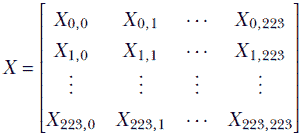

矩阵的每个元素，*X[i, j]*，是像素颜色值，范围在[0,255]之间。

图像光栅化

在前面的章节中，我们总是将*向量*视为机器学习系统的输入。输入的向量表示使我们能够将其视为高维空间中的一个点。这导致了关于分类的许多几何洞察。但在这里，我们的输入是一个图像，它更像是*矩阵*而不是向量。我们能否将图像（矩阵）表示为向量？

答案是肯定的。矩阵总可以通过称为*光栅化*的过程转换为向量。在光栅化过程中，我们从左到右和从上到下迭代矩阵的元素，将连续遇到的元素存储到一个向量中。结果是光栅化的向量。它具有与原始矩阵相同的元素，但它们的组织方式不同。光栅化向量的长度等于矩阵的行数和列数的乘积。早期矩阵*X*的光栅化向量有 224 × 224 = 50176 个元素


其中 *x[i]* ∈ [0,255] 是图像像素的值。因此，一个 224 × 224 的输入图像可以被视为一个 50,176 维空间中的向量（等价地，一个点）。

### 3.1.2 分类器作为决策边界

我们可以看到，输入图像可以通过光栅化转换为向量。每个向量可以看作是高维空间中的一个点。但是，对应于任何给定对象或类别的点，比如 *长颈鹿* 或 *汽车*，并不是在整个空间中随机分布的。相反，它们占据输入高维空间中一个小的子空间。这是因为类别的成员之间总是存在固有的共性。例如，所有的长颈鹿主要是黄色，带有一点黑色，而汽车有相对固定的形状。这导致包含相同对象的图像中的像素值有某种相似性。总的来说，这意味着属于一个类别的点松散地形成一个 *簇*。

备注：从几何学的角度来看，分类器是一个超曲面，它将我们想要识别的类别的点簇分开。这个表面形成了一个 *决策边界*——关于特定输入点属于哪个类别的决策是通过查看点属于表面的哪一侧来做出的。


(a) 汽车与长颈鹿分类器


(b) 马与斑马分类器

图 3.1 分类问题的几何描述。在多维输入空间中，每个数据实例对应一个点。在图 3.1a 中，标记为 *c* 的点表示汽车，标记为 *g* 的点表示长颈鹿。这是一个简单的情况：点形成合理的不同簇，因此可以使用相对简单的表面，即超平面进行分类。超平面的精确参数——方向和位置——是通过训练确定的。在图 3.1b 中，标记为 *h* 的点表示马，标记为 *z* 的点表示斑马。这个情况稍微复杂一些：分类需要使用曲线（非平面）的表面，即超球面。超球面的参数——半径和中心——是通过训练确定的。

图 3.1a 展示了长颈鹿和汽车分类问题的光栅化空间示例。对应于长颈鹿的点被标记为 *g*，对应于汽车的点被标记为 *c*。这是一个简单的情况。在这里，将对应于 *汽车* 的点簇与对应于 *长颈鹿* 的点簇分开的分类表面（也称为决策边界）是一个超平面，如图 3.1a 所示。

备注：在超过三维的情况下，我们通常将表面称为 *超曲面*，将平面称为 *超平面*。

图 3.1b 展示了一个更复杂的例子：图像中的马和斑马分类。在这里，对应于马的点被标记为 *h*，而对应于斑马的点被标记为 *z*。在这个例子中，我们需要一个非线性（曲线）的表面（例如超球面）来分离这两个类别。

### 3.1.3 简要建模

很不幸，在典型场景中，我们并不知道分离表面。实际上，我们甚至不知道属于一个感兴趣类别的所有点。我们所知道的就是一组*采样*的输入集 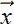*[i]*（训练输入）以及相应的类别 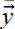*[i]*（真实标签）。包含所有训练输入和真实标签的完整集合——{*[i], [i]*} 对于一个大的*i*值集合——被称为*训练数据*。当我们想要教一个婴儿识别汽车时，我们会给婴儿展示几辆汽车样品，并说“这是一辆汽车。”对于神经网络来说，训练数据扮演着同样的角色。

从仅有的这个训练数据集{*[i], [i]*} ∀*[i] ∈* [1, *n*]，我们必须找到一个足够好的分类表面的近似，当呈现一个随机场景时，我们可以将其映射到一个输入点 ，检查该点位于表面的哪一侧，并识别类别（汽车或长颈鹿）。这个过程是开发一个最佳猜测，以形成一个决策边界，该边界区分各种感兴趣类别，被称为*建模分类器*。

注意：训练图像 *[i]* 的真实标签 (*[i]*) 通常是通过人工创建的。为训练图像手动生成标签的过程是机器学习中最痛苦的部分之一，目前正在进行大量研究工作以减轻这一问题。

如 1.3 节所述，建模有两个步骤：

1.  *模型架构选择*：选择参数化模型函数 *ϕ*(; 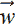, *b*)。这个函数接受一个输入向量  并输出类别 *y*。它有一组参数 , *b*，最初是未知的。这个函数通常从一系列经过验证和测试的已知函数中选择；对于简单问题，我们可能选择线性模型，而对于更复杂的问题，我们选择非线性模型。模型设计者根据他们对问题的理解做出选择。记住，在这个阶段，参数仍然是未知的——我们只是决定了模型的*函数族*。

1.  *模型训练*：估计参数 , *b*，使得 *ϕ* 在训练数据输入上产生已知的正确输出（尽可能接近）。这通常通过迭代过程来完成。对于每个训练数据实例 [i]，我们评估 *y**[i]* = *ϕ*(*[i ]*;, *b*). 这个产生的输出与相应的已知输出 *ȳ[i]* 进行比较。它们的差值，*e[i]* = ||*y**[i]* − *ȳ[i]*||，被称为 *训练误差*。所有训练数据上的训练误差之和是总训练误差。我们迭代调整参数 , *b*，使得总训练误差持续下降。这意味着在每次迭代中，我们调整参数，使得模型输出 *y**[i]* 对于所有 *i* 都稍微接近目标输出 *ȳ[i]*。如何调整参数以减少误差构成了本章的主要内容，将在第 3.3 节中介绍。

函数 *ϕ*(; , *b*) 代表决策边界超曲面。例如，在图 3.1 所示的二值分类问题中，*ϕ*(; , *b*) 可能代表一个平面（由虚线表示）。平面一侧的点被分类为汽车，而另一侧的点被分类为长颈鹿。在这里，

*ϕ*(; , *b*) = *^T* + *b*

从方程 2.14 我们知道这个方程代表一个平面。

在图 3.1b 中，不存在良好的平面分离——我们需要一个非线性分离器，如用虚线表示的球形分离器。在这里，


这个方程代表一个球面。

应该注意的是，在典型的现实生活案例中，分离表面不对应于任何已知的几何表面（参见图 3.2）。但在本章中，我们将继续使用简单的例子来阐述基本概念。

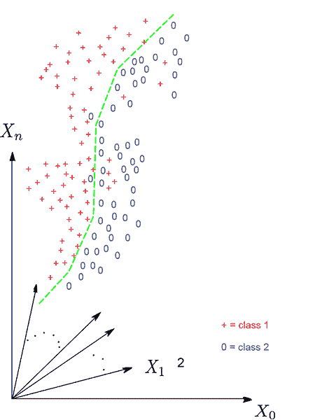

图 3.2 在现实生活中的问题中，表面通常不是像平面或球面这样的已知表面。而且，分类通常并不完美——一些点落在分离器的错误一侧。

### 3.1.4 二元分类中超曲面函数的符号

在二元分类器的特殊情况中，表示决策边界的表达式 *ϕ*(;, *b*) 的 *符号* 具有特殊的意义。为了理解这一点，考虑一个对应于以下方程的二维平面上的直线

*y* + 2*x* + 1 = 0

线上的所有点都满足这个方程的 *x*, *y* 坐标值。这条线将二维平面分为两个半平面。一个半平面上的所有点的 *x*, *y* 值使得 *y* + 2*x* + 1 为负。另一个半平面上的所有点的 *x*, *y* 值使得 *y* + 2*x* + 1 为正。这如图 3.3 所示。这个想法可以扩展到其他表面和更高维度。因此，在二元分类中，一旦我们估计了一个最优决策表面 *ϕ*(; , *b*)，对于任何输入向量 ，我们可以计算 *ϕ*(; , *b*) 的符号来预测类别。

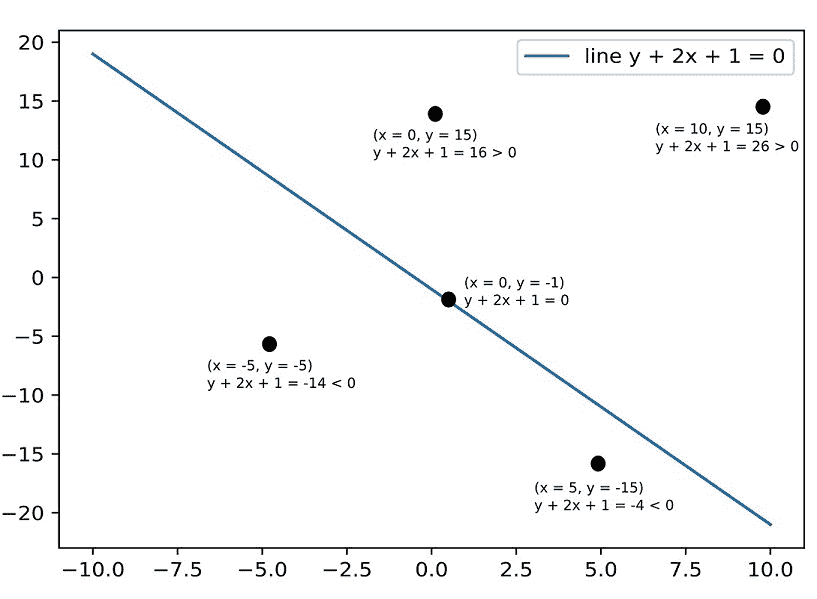

图 3.3 给定点 (*x*[0], *y*[0]) 和分隔线 *y* + 2*x* + 1 = 0，我们可以根据 *y*[0] + 2*x*[0] + 1 的符号来判断点位于分隔线的哪一侧。

## 3.2 错误，即损失函数

如前所述，在训练过程中，我们调整参数 , *b*，以便误差持续下降。让我们推导出这个误差，即损失函数的定量表达式。稍后，我们将看到如何最小化它。

总体而言，训练数据由一组标记的输入（训练数据实例与已知的真实值配对）组成：

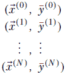

现在我们定义一个*损失函数*。在特定的训练数据实例上，损失函数实际上衡量了机器在该特定训练数据——输入-目标对 (^((*i*)), *y*^((*i*))) 上犯的错误。尽管有许多更适合此问题的复杂错误函数，但为了简单起见，我们现在使用平方误差函数（在 2.5.4 节中介绍过）。第 *i* 个训练数据元素的平方误差是模型输出的平方与期望或目标输出的平方差：

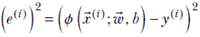

方程 3.1

训练过程中的总损失（即平方误差）为


方程 3.2

注意，这个总误差不是任何特定训练数据实例的函数。相反，它是整个训练数据集的*总体误差*。这是我们通过调整  和 *b* 来最小化的。更准确地说，我们估计  和 *b*，以最小化 *L*(, *b*)。

## 3.3 最小化损失函数：梯度向量

训练的目标是估计权重和偏差参数 , *b*，这些参数将最小化 *L*。这通常通过迭代过程来完成。我们以 , *b* 的随机值开始，并调整这些值，使得损失 *L*(, *b*) = *E*²(, *b*) 迅速下降。这样做多次可能使我们接近 , *b* 的最优值。这是训练模型过程背后的基本思想。重要的是要注意，我们是在最小化总误差：这防止我们对任何特定的训练实例过度依赖。如果训练数据是一个良好采样的集合，那么在训练数据集上最小化损失的参数 , *b* 也会在推理过程中表现良好。

我们如何“调整” , *b* 以使损失 *L* = *E*² 的值下降？这正是梯度发挥作用的地方。对于任何函数 *L*(, *b*)，相对于 , *b* 的梯度——即 ∇![, *b*]*L*(, *b*)——指示了 *L* 发生最大变化的方向。梯度是一维微积分中导数的类似物。直观上，沿着函数梯度的方向下降似乎是使函数值最小化的最佳策略。

从几何角度来说，如果我们从对应于 *L*(, *b*) 的任意表面点开始，沿着梯度 ∇![, *b*]*L*(, *b*) 的方向移动，我们将以最快的速度走向最小值（这一点将在本节的其余部分详细讨论）。因此，在训练过程中，我们通过沿着 ∇![, *b*]*L*(, *b*) 移动步子来迭代地走向最小值。请注意，*梯度是相对于权重，而不是输入的*。整体算法在算法 3.2 中展示。

算法 3.2 训练监督模型（总体思路）

使用随机值初始化 , *b*。

**while** *L*(, *b*) > *threshold* **do**

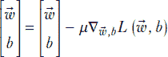

在新的 , *b* 上重新计算 *L*。

**end** **while**

[*] ← , *b*[*] ← *b*

注意以下要点：

+   在每次迭代中，我们沿着误差函数的梯度调整 , *b*。我们将在第 3.3 节中看到，这是 *L* 的最大变化方向。因此，*L* 以最大速率减少。

+   *μ* 是学习率：较大的值意味着更长的步长，而较小的值意味着更短的步长。在算法 3.2 中概述的最简单方法，在所有地方都采取等大小的步长。在后面的章节中，我们将研究更复杂的方法，其中我们试图感知我们距离最小值有多近，并相应地调整步长：

    +   当远离最小值时，我们采取更长的步长，以快速进步。

    +   当接近最小值时，我们采取更短的步长，以避免超过最小值。

+   从数学上讲，我们应该持续迭代，直到损失最小化（即损失的梯度为零）。但在实践中，我们只需迭代到准确度足够好，以满足当前目的。

### 3.3.1 梯度：以机器学习为中心的介绍

在机器学习中，我们将输出建模为输入的参数函数。我们定义一个损失函数，该函数量化了模型输出与训练输入集上已知理想输出之间的差异。然后我们尝试获得最小化这个损失的参数值。这实际上确定了那些将在训练输入集上使模型函数输出尽可能接近理想的参数。

损失函数取决于 （模型输入），*ȳ*（训练数据上的已知理想输出，即真实值），以及 （参数）。在这里，我们只对损失函数相对于参数的行为感兴趣，所以我们忽略了其他所有内容，并将损失函数表示为参数的函数，即 *L*()。

注意：为了简洁起见，在这里我们使用符号 *w* 来表示所有参数——权重以及偏差。

我们试图回答的核心问题是这样的：给定一个损失 *L*() 和当前的参数值 ，参数  的最佳变化是什么，以最大限度地减少损失？等价地，我们希望确定 ，使得 *δL* = *L*( + ) - *L*() 尽可能地负。为了达到这个目标，我们将研究损失函数 *L*(*w*) 和参数值变化  在越来越复杂的几种场景中的关系。¹


(a) 直线：*L*(*w*) = 2*w* + 1, *dL*/*dw* = *m*

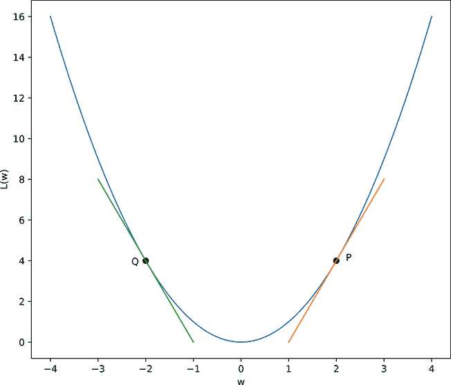

(b) 抛物线：*L*(*w*) = *w*², *dL*/*dw* = 2*w*

图 3.4 一维中 *δL* 与 *δw* 的关系，用两条示例曲线表示：一条直线和一个抛物线。一般来说，*δL* = (*dL*/*dw)* *δw*。为了减少损失，*δw* 必须与导数 *dL*/*dw* 具有相反的符号。在 (a) 中，这意味着我们总是必须向左移动（减少 *w*）以减少 *L*。在 (b) 中，如果我们处于左侧（例如，点 Q），导数是负的，我们必须向右移动以减少 *L*。但如果我们处于右侧，导数是正的，我们必须向左移动以减少 *L*。从几何上看，这相当于沿着切线“向下”移动。

一维损失函数

为了简化，我们首先在一维中考察这个主题——这意味着有一个单个参数 *w*。我们将研究的第一个例子是最简单的情况：一个一维的线性损失函数，如图 3.5 所示。一维的线性损失函数可以表示为 *L*(*w*) = *mw* + *c*。如果我们通过一个小的量 *δw* 改变参数 *w*，损失 *δL* 的相应变化是多少？我们有 *δL* = *L*(*w* + *δw*) − *L*(*w*) = (*m*(*w* + *δw*)+*c*) − (*m*(*w*)+*c*) = *m* *δw*，这给出了 *δL*/*δw* = *m*，一个常数。根据定义，导数 *dL*/*dw* = lim[*δw*→0] *δL*/*δw*，这导致 *dL*/*dw* = *m*。因此，对于直线 *L*(*w*) = *mw* + *c*，*L* 相对于 *w* 的变化率在每处都是常数，并且等于斜率 *m*。将这些放在一起，我们得到 *δL* = *m δw* = *dL*/*dw* *δw*。

现在我们来研究一个稍微复杂一些、非线性但仍为一维的情况——一个抛物线损失函数，如图 3.4 所示。这个抛物线可以表示为 *L*(*w*) = *w*²。如果我们通过一个小的量 *δw* 改变参数 *w*，损失 *δL* 的相应变化是多少？我们有 *δL* = *L*(*w* + *δw*) − *L*(*w*) = (*w* + *δw*)² − *w*² = (2*wδw* + *δw*²)。对于无限小的 *δw*，*δw*² 变得可以忽略不计，我们得到 lim[*δw*→0] *δL* = lim[*δw*→0] (2*wδw* + *δw*²) = 2*wδw* 和 *dL*/*dw* = lim[*δw*→0] *δL*/*δw* = 2w。结合所有这些，我们得到与线性情况相同的方程 *δL* = *dL*/*dw* *δw*。当然，在直线的情况下，这个表达式对所有 *δw* 都成立，而在非线性曲线上，这个表达式只在小的 *δw* 下成立。

*δL* 和 *δw*

通常，对于所有一维损失函数 *L*(*w*)，参数变化 *δw* 引起的改变 *δL* 可以表示如下：

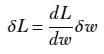

方程 3.3

为了减少 *L*，*δL* 必须是负的。从方程 3.3 中，我们可以看出这需要 *δw*（*w* 的变化）和 *dL*/*dw*（导数）具有相反的符号。

从几何角度来说，损失函数表示一条曲线，其中损失 *L*(*w*) 沿着 *Y* 轴绘制，与参数 *w* 沿着 *X* 轴绘制（见图 3.4 中的示例）。任何点的切线可以看作是该点无限小邻域内曲线本身的局部近似。任何点的导数代表该点处曲线切线的斜率。

注意：方程 3.3 基本上告诉我们，为了减少损失值，我们必须沿着切线移动，如果导数是负的，则向右（即正 *δw*）移动；如果导数是正的，则向左（即负 *δw*）移动。

多维损失函数

如果有多个可调参数，我们的损失函数将是多个变量的函数，这意味着我们有一个高维向量  和一个损失函数 *L*()。我们的目标是计算由小向量位移  引起的 *L*() 的变化 *δL*。

我们立即注意到与一维情况的一个基本区别：参数变化是一个向量，，它不仅有一个表示 |||| 的大小，还有一个表示单位向量 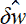 的方向。我们可以在 *w* 空间中迈出相同大小的步伐，而 *L*() 的变化将因方向不同而不同。这种情况在图 3.5 中得到说明，该图展示了示例损失函数 *L*() ≡ *L*(*w*[0], *w*[1]) = 2*w*[0]² + 3*w*[1]²，其中 *w*[0] 和 *w*[1] 是两个独立变量。让我们通过几个具体的例子来考察这个损失函数是如何变化的。

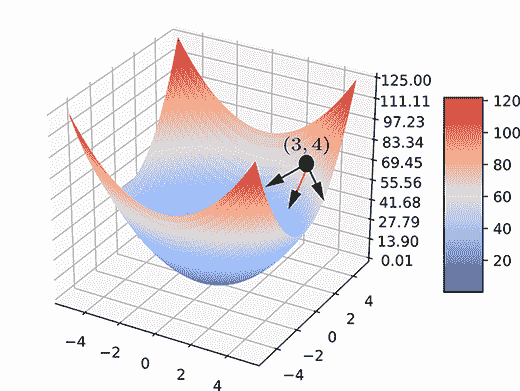

图 3.5 展示了表面 *L*() ≡ *L*(*w*[0], *w*[1]) = 2*w*[0]² + 3*w*[1]² 对  ≡ (*w*[0], *w*[1]) 的绘图。从表面上的一个示例点 *P* ≡ (*w*[0]=3, *w*[1]=4, *L* = 66) 出发，我们可以向许多方向移动以减少 *L*。其中一些方向用箭头表示。最大减少发生在我们沿着深色箭头移动时：这发生在  沿着  = [-12, -24]*^T* 变化时，这是 *P* 点处 *L*() 的负梯度。

假设我们处于 。*L*() 的对应值是 2 ∗ 3² + 3 ∗ 4² = 66。现在，假设我们从这一点进行一个小位移：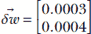。新的值是 *L*( + ) = *L*(3.0003, 4.0004) = 2 ∗ 3.0003² + 3 ∗ 4.0004² ≈ 66.0132066。因此，这个位移向量  导致 *L* 的变化 *δL* = 66.01320066 – 66 = 0.01320066。

另一方面，如果位移是 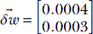，我们得到 *L*( + ) = *L*(3.0004, 4.0003) = 2 ∗ 3.0004² + 3 ∗ 4.0003² ≈ 66.0120006。因此，这个位移导致 *L* 的变化 *δL* = 66.0120006 − 66 = 0.0120006。位移向量  和  有相同的长度 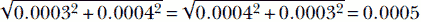 但不同的方向。它们对函数值造成的变化是不同的。这证明了我们的论点：在多变量损失函数中，损失函数的变化不仅取决于位移在参数空间中的大小，还取决于位移的方向。

参数空间中位移向量  与损失函数 *L*() 的整体变化之间有什么一般关系？为了考察这个问题，我们需要知道什么是偏导数。

偏导数

函数 *L*(*w*) 的导数 *dL*/*dw* 表示函数相对于 *w* 的变化率。但如果 *L* 是多个变量的函数，当只有一个变量变化时，它会如何变化？这个问题引出了偏导数的概念。

多变量函数的偏导数是相对于恰好一个变量的导数，将其他变量视为常数。例如，给定 *L*() ≡ *L*(*w*[0], *w*[1]) = 2*w*[0]² + 3*w*[1]²，相对于 *w*[0] 和 *w*[1] 的偏导数是

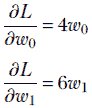

多维函数的总变化

偏导数估计在只有一个变量变化而其他变量保持不变的情况下函数的变化。如果我们想估计所有变量同时变化时函数值的改变，我们应该如何估计？

总变化可以通过对偏导数的加权组合来估计。令  和  分别表示点和位移向量：


然后


公式 3.4

方程 3.4 实际上说明，*L* 的总变化是通过将各个变量位移引起的变化相加得到的。*L* 相对于 *w[i]* 变化的变化率是 *∂L*/*∂w[i]*。变量 *w[i]* 的位移是 *δw[i]*。因此，位移的第 *i* 个元素引起的变化是 *∂L*/*∂w[i]* *δw[i]*——这可以从方程 3.3 得出。总变化是通过将位移向量的各个元素引起的变化相加得到的：即对所有 *i* 从 0 到 *n* 进行求和。这导致了方程 3.4。因此，方程 3.4 只是方程 3.3 的多维版本。

梯度

能够紧凑地表示方程 3.4 会很好。为了做到这一点，我们定义了一个称为 *梯度* 的量：所有偏导数的向量。

给定一个 *n* 维函数 *L*()，其梯度定义为


公式 3.5

使用梯度，我们可以将方程 3.4 重新写为

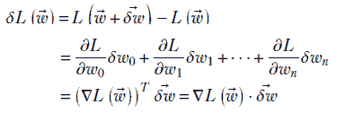

公式 3.6

方程 3.6 告诉我们，由参数空间中从  到  的位移  引起的 *L*() 的总变化 *δL*，是梯度向量 ∇*L*() 和位移向量  的点积。这是方程 3.3 的精确多维类似物。

回想一下，从第 2.5.6.2 节中，两个向量（固定大小）的点积在向量方向对齐时达到最大值。这为梯度向量提供了一个物理解释：其方向是参数空间中多维函数变化最快的方向。它是导数的多维对应物。这就是为什么在机器学习中，当我们想要最小化损失函数时，我们会沿着损失函数梯度向量的方向改变参数值。

梯度在最小值处为零

函数的任何 *最优值*（即最大值或最小值）都是拐点。这意味着函数在最优值点转折。换句话说，最优值一侧的梯度方向与另一侧相反。如果我们试图平滑地从正值过渡到负值，我们必须在中间某处穿过零。因此，梯度在精确的拐点最大值或最小值处为零）。这在二维中最容易看出，如图 3.6 所示。然而，这个想法是通用的：它也适用于更高维的情况。梯度在最优值处变为零的事实常被用来代数计算最优值。以下例子说明了这一点。

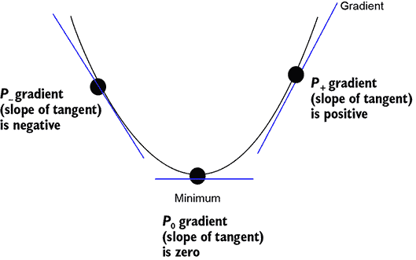

图 3.6 最小值总是拐点，意味着函数在该点转折。如果我们考虑最小值两侧的任意两点 *P*[−] 和 *P* [+]，则梯度在一侧为正，在另一侧为负。假设梯度变化平滑，那么在最小值之间必须为零。

考虑简单的示例函数 *L*(*w*[0], *w*[1]) = √*w*[0]² + *w*[1]²。其最优值出现在梯度为零时：

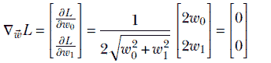

解为 *w*[0] = 0, *w*[1] = 0 函数在其原点达到最小值，这与我们的直觉相符。

### 3.3.2 水平面表示和损失最小化

在图 3.5 中，我们绘制了损失函数 *L*() 与参数值  的关系。在本节中，我们研究了一种不同的可视化损失表面的方法。这将进一步揭示梯度和最小化的见解。

我们将继续使用上一个小节中的简单示例函数。考虑一个场 *L*(*w*[0], *w*[1]) = √(*w*[0]² + *w*[1]²)。其定义域是由轴 *W*[0] 和 *W*[1] 定义的无限二维平面。请注意，该函数在以原点为中心的同心圆上具有常数值。例如，在圆 *w*[0]² + *w*[1]² = 1 的所有点上，函数具有常数函数值 1。在圆 *w*[0]² + *w*[1]² = 25 的所有点上，函数具有常数函数值 5。这种定义域上的常数函数值曲线在二维中称为 *等高线*。这如图 3.7 中的热图所示。等高线的概念可以推广到更高维度，其中我们具有等高面或等高超曲面。请注意，虽然图 3.5 中的 ，*L*() 在 (*n*+1)-维空间中（其中 *n* 是  的维度），但等高面/等高线表示是在 *n*-维空间中。在定义域上的任何一点，沿着哪个方向函数值的变化最大？答案是 *沿着梯度的方向*。变化的幅度对应于梯度的幅度。在当前示例中，假设我们位于点 (*w*[0], *w*[1])。通过此点存在一个等高线：以原点为中心通过 (*w*[0], *w*[1]) 的圆。如果我们沿着这个圆的周长移动——即沿着这个圆的切线——函数值不会改变。换句话说，在任何一点，通过该点的等高线的切线是 *最小变化*的方向。另一方面，*如果我们垂直于切线移动，函数值的变化最大*。切线的垂线称为 *法线*。这是梯度的方向。*在定义域上的任何一点，梯度总是垂直于通过该点的等高线，指示函数值最大变化的方向*。在图 3.7 中，梯度都与同心圆的半径平行。

回想一下，在训练机器学习模型时，我们本质上是在一组可调参数的术语下定义一个损失函数，并通过调整（微调）参数来最小化损失。我们从随机点开始，迭代地向最小值前进。从几何上看，这可以看作是从定义域上的任意一点开始，并继续沿着最小化函数值的方向移动。当然，我们希望尽可能少地进行迭代，以到达函数值的最低点。在图 3.7 中，最小值在原点，这也是所有同心圆的中心。无论我们从哪里开始，我们都需要始终沿着径向向内移动，以达到函数√(w*[0]² + w*[1]²)的最小值（0,0）。

在更高维的情况下，等高线变为等高面。给定任何函数*L*()，其中] ∈ ℝ*^n*，我们定义等高面为*L*() = *constant*。如果我们沿着等高面移动，L()的变化是最小的（0）。函数在任意点的梯度是穿过该点的等高面的法线。这是函数值变化最快的方向。沿着梯度移动，我们从一个等高面过渡到另一个等高面，如图 3.8 所示。在这里，函数是 3D 的：*L*() = *L*(w*[0], w*[1], w*[2]) = w*[0]² + w*[1]² + w*[2]²。对于各种常数值，等高面*w*[0]² + w*[1]² + w*[2]² = *constant*是同心球面，以原点为中心。任意点的梯度向量沿着通过该点的球面向外辐射的半径方向。

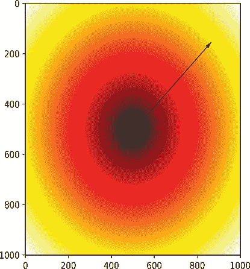

图 3.7 展示了函数*L*(w*[0], w*[1]) = √(w*[0]² + w*[1]²)的定义域，以函数值的热图形式呈现。梯度方向向外辐射，如箭头线所示。热图强度沿梯度（即半径）变化最快。这是快速达到热图所表示函数的较低值的方向。


图 3.8 3D 中的梯度示例：函数 *L*(*w*[0], *w*[1], *w*[2]) = *L*() = *w*[0]² + *w*[1]² + *w*[2]². 等值面 *L*() = *constant* 是以原点为中心的同心球体。图中部分展示了这样一个表面。∇*L*() = *k*[*w*[0] *w*[1] *w*[2]]*^T*—梯度指向径向外。沿着梯度移动，我们从一级表面移动到另一级表面，对应于 *L*() 的最大变化。沿着与梯度垂直的任何方向移动，我们保持在同一级表面（球体）上，这对应于函数值的变化为零。*D[θ]*() 表示沿着与梯度成 *θ* 角的位移方向的偏导数。如果 *l̂* 表示这个位移方向，*D[θ]*() = ∇*L*() ⋅ *l̂*。

另一个例子如图 3.9 所示。这里函数是 3D 的：*L*() = *f*(*w*[0], *w*[1], *w*[2]) = *w*[0]² + *w*[1]². 对于常数的各种值，等值面 *w*[0]² + *w*[1]² = *constant* 是以 *w*[2] 为轴的同轴圆柱体。图中部分展示了这样一个表面。在任意点的梯度向量沿着属于该点的圆柱体的平面圆的向外指向的半径。沿着梯度移动，我们从一级表面移动到另一级表面，对应于 *L*() 的最大变化。沿着与梯度垂直的任何方向移动，我们保持在同一级表面（圆柱体）上，这对应于函数值的变化为零。*D[θ]*() 表示沿着与梯度成 *θ* 角的位移方向的偏导数。如果 *l̂* 表示这个位移方向，*D[θ]*() = ∇*L*() ⋅ *l̂*。

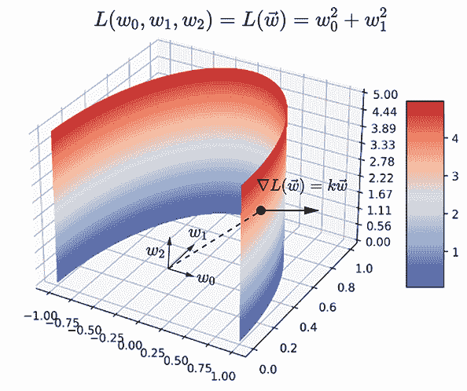

图 3.9 3D 中的梯度示例：函数 *L*(*w*[0], *w*[1], *w*[2]) = *L*() = *w*[0]² + *w*[1]². 等值面 *f*() = *constant* 是同轴的圆柱体。图中部分展示了这样一个表面：∇*L*() = *k*[*w*[0] *w*[1] 0]*^T*. 梯度垂直于圆柱体的曲面，沿着圆的向外半径。沿着梯度移动，我们从一级表面移动到另一级表面，对应于 *L*() 的最大变化。沿着与梯度垂直的任何方向移动，我们保持在同一级表面（圆柱体）上，这对应于函数值的变化为零。

到目前为止，我们已经研究了参数空间中无限小位移引起的损失值的变化。在实践中，训练过程中参数更新时程序性位移是小的，但不是无限小的。在这些情况下，有没有什么方法可以改进近似？这将在下一节中讨论。

## 3.4 损失函数的局部近似

方程 3.6 表达了参数空间中位移  对应的损失值变化 *δL*。当损失函数是线性的或位移的幅度无限小的时候，方程是完全正确的。在实践中，我们通过小量（但不是无限小量）调整参数值。在这种情况下，方程 3.6 只是大致正确的：|||| 的幅度越大，近似越差。

泰勒级数提供了一种方法，通过在参数空间中的位移来近似任何点的局部邻域中的多维函数。它是一个无限级数，这意味着方程只有在我们将无限多个项相加时才是完全正确的（零近似）。当然，我们无法用计算机程序添加无限多个项。但我们可以通过包括越来越多的项来尽可能提高近似的精度。在实践中，我们最多包括到第二项。任何超过这一项的都是多余的，因为改进太小，无法通过当前计算机的浮点系统实现。首先，我们将研究一维的泰勒级数。

### 3.4.1 1*D* 泰勒级数回顾

假设我们试图描述特定点 *w* 附近的曲线 *L*(*w*)。如果我们无限接近于 *w*，那么，如第 3.3 节所述，我们可以用直线来近似曲线：


但在一般情况下，如果我们描述的是特定点附近的连续（光滑）函数，我们使用泰勒级数。泰勒级数允许我们用函数在该点的值及其导数来描述该点附近的函数。在 1D 中这样做相对简单：

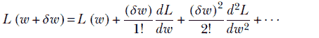

方程 3.7

注意，项会逐渐变小（因为它们涉及到越来越小的数 *δw* 的高次幂）。因此，尽管级数延伸到无穷大，但在实践中，我们通过省略高阶项来忽略可忽略的精度损失。我们通常使用一阶近似（或者最多二阶）。方程 3.7 可以重写为


注意，第二项包含 (*δw*)² 作为因子，在位移 *δw* 很小的时候几乎为零。所以，对于非常小的 *δw*，我们只包括第一项。然后我们得到 *δL* = (*δw*/1!) (*dL*/*dw)*，这与方程 3.3 相同。如果 *δw* 稍大，并且我们想要更高的精度，我们可以包括二阶项。在实践中，如前所述，这种情况几乎从未发生过。

泰勒级数的一个实用例子是指数函数*e^x*在*x* = 0 附近的展开

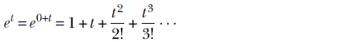

其中我们使用了以下事实：*d^n*/*dx^n* (*e^x*)|[*x* = 0] = *e^x*|[*x* = 0] = 1 对所有*n*成立。

### 3.4.2 多维泰勒级数和 Hessian 矩阵

在方程 3.7 中，我们用导数在点附近的小邻域内表示一个单变量函数。在更高维度中，我们能做类似的事情吗？是的。我们只需将一阶导数替换为梯度。我们将二阶导数替换为其多维对应物：Hessian 矩阵。多维泰勒级数如下

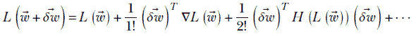

方程 3.8

其中*H*(*L*())，称为 Hessian 矩阵，定义为


方程 3.9

Hessian 矩阵是对称的，因为。此外，请注意，泰勒展开假设函数在邻域内是连续的。

方程 3.8 允许我们在参数空间中点附近的小邻域内计算*L*的值。如果我们从通过向量移动，我们到达 + 。那里的损失是*L*( + )，它通过方程 3.8 以原始点的损失*L*()和位移来表示。

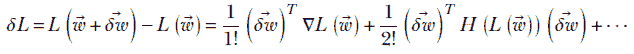

方程 3.10

注意，第一项与方程 3.6 相同，第二项是位移的平方。由于小量的平方更小，对于非常小的位移，第二项消失，我们本质上又回到了方程 3.6。这被称为一阶近似。对于稍微大一点的位移，我们可以包括涉及 Hessian 的二阶项，以改进近似。如前所述，这在实践中几乎从未做过。

## 3.5 梯度下降、误差最小化和模型训练的 PyTorch 代码

在本节中，我们研究 PyTorch 示例，其中模型通过最小化误差通过梯度下降进行训练。在我们展示代码之前，我们从实际的角度简要回顾一下主要思想。本节的完整代码可以在[`mng.bz/4Zya`](http://mng.bz/4Zya)找到。

### 3.5.1 线性模型的 PyTorch 代码

如果我们试图预测的真实基础函数非常简单，线性模型就足够了。否则，我们需要非线性模型。在这里，我们将研究线性模型。在机器学习中，我们确定与手头问题相关的输入和输出变量，并将问题表述为从输入变量生成输出。所有输入都由向量  一起表示。有时有多个输出，有时只有一个输出。相应地，我们有一个输出向量 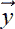 或输出标量 *y*。让我们用 *f* 表示从输入向量生成输出的函数：即，*y* = *f*()。

在现实生活中的问题中，我们不知道 *f*。机器学习的核心是从一组观察到的输入 *[i]* 和它们相应的输出 *y[i]* 中估计 *f*。每个观察结果可以表示为一个对 ⟨*[i]*, *y[i]*⟩。我们用已知函数 *ϕ* 来建模未知函数 *f*。*ϕ* 是一个参数化函数。尽管 *ϕ* 的性质是已知的，但其参数值是未知的。这些参数值通过训练“学习”得到。这意味着我们估计参数值，以使观察的整体误差最小化。

如果 ，*b* 表示当前的参数集（权重，偏差），那么模型将在观察到的输入 *[i]* 上输出 *ϕ*(*[i]*, , *b*)。因此，这个 *i* 次观察的误差是 *e[i]*² = (*ϕ*(*[i]*, , *b*)−*y[i]*)²。我们可以批量处理几个观察结果，并将误差加起来得到批量误差 *L* = Σ[*i* = 0]^(*i* = *N*) (*e^((i))*)²。

误差是参数集  的函数。问题是，我们如何调整  以使误差 *e[i]*² 减少？我们知道函数的值在沿着参数梯度的方向移动时变化最大。因此，我们调整参数 ，*b* 如下：


每次调整都会减少误差。从一组随机的参数值开始，并足够多次地这样做，可以得到期望的模型。

一个简单且流行的模型*ϕ*是线性函数（预测值是输入向量和参数向量之间的点积加上偏置）：*ỹ[i]* = *ϕ*(*[i]*, , *b*) = *^T* + *b* = ∑*[j]w[j]x[j]* + *b*. 我们最初的实现（列表 3.1）只是简单地模仿了这个公式。对于更复杂的模型*ϕ*（具有数百万个参数和非线性），我们无法获得这样的闭合形式梯度。在这种情况下，我们使用一种称为自动微分（自动梯度计算）的技术，它不需要闭合形式梯度。这将在下一节中讨论。

备注：在现实世界的问题中，我们不会知道将输入映射到输出的真实底层函数。但在这里，为了获得洞察力，我们将假设已知的输出函数，并通过添加噪声来使它们稍微更真实。

列表 3.1 PyTorch 线性模型（需要闭合形式的梯度公式）

```py
x = 10 * torch.randn(N)                              ①
  = 1.5 * x + 2.73 _obs = y + (0.5 * torch.randn(N)) ②

for step in range(num_steps):
    y_pred = w*x + b                                 ③
    mean_squared_error = torch.mean(
            (y_pred - y_obs) ** 2)                   ④

    w_grad = torch.mean(2 * ((y_pred - y_obs)* x))
    b_grad = torch.mean(2 * (y_pred - y_obs))        ⑤

    w = w - learning_rate * w_grad
    b = b - learning_rate * b_grad                   ⑥

print("True function: y = 1.5*x + 2.73")
print("Learned function: y_pred = {}*x + {}".format(w[0], b[0]))
```

① 生成随机输入值

② 通过将一个简单的已知函数应用于输入并添加噪声来生成输出值。让我们看看我们学习到的函数是否与已知的底层函数相匹配。

③ 我们用任意参数值初始化的模型

④ 模型误差是观测值与预测值之间的（平方）差。

⑤ 使用微积分计算误差的梯度。仅适用于此类简单模型。

⑥ 沿着误差梯度调整权重和偏置

输出如下：

```py
True function: y = 1.5*x + 2.73
Learned function: y_pred = 1.50059*x + 2.746823
```

### 3.5.2 Autograd：PyTorch 自动梯度计算

在列表 3.1 中的 PyTorch 代码，对于这个特定的模型架构，我们使用了微积分来计算梯度。这种方法不适用于具有数百万个权重和可能非线性复杂函数的更复杂模型。为了可扩展性，我们使用像 PyTorch Autograd 这样的自动微分软件库。库的用户无需担心如何计算梯度——他们只需构建模型函数。一旦函数被指定，PyTorch 就会通过 Autograd 技术找出如何计算其梯度。

要使用 Autograd，我们明确告诉 PyTorch 在创建变量时跟踪该变量的梯度，通过设置`requires_grad = True`。PyTorch 会记住一个计算图，每次我们使用跟踪变量创建表达式时，该图都会更新。图 3.10 展示了计算图的一个示例。

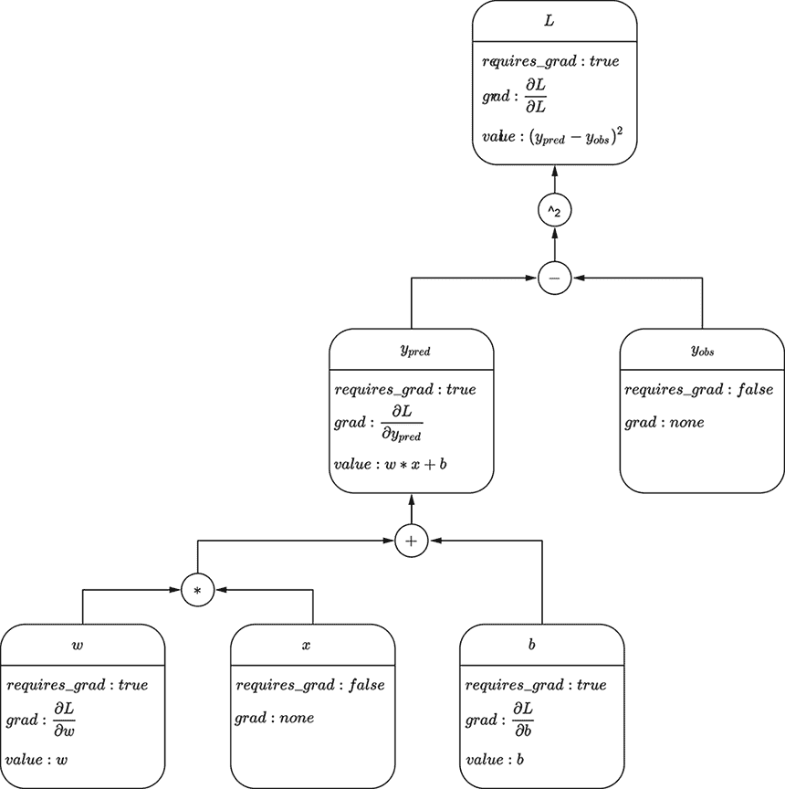

图 3.10 Autograd 分析

以下列表，实现了 PyTorch 中的线性模型，依赖于 PyTorch 的 Autograd 进行梯度计算。请注意，此方法不需要闭合形式的梯度。

列表 3.2 使用 PyTorch 进行线性建模

```py
def update_parameters(params, learning_rate):            ①

  with torch.no_grad():                                  ②
    for i, p in enumerate(params):
      params[i] = p - learning_rate * p.grad

    for i in range(len(params)):
      params[i].requires_grad = True                     ③

x = 10 * torch.randn(N)                                  ④
y  = 1.5 * x + 2.73

y_obs = y + (0.5 * torch.randn(N))                       ⑤

w = torch.randn(1, requires_grad=True)
b = torch.randn(1, requires_grad=True)
params = [b, w]                                          ⑥

for step in range(num_steps):
  y_pred = params[0] + params[1] * x

  mean_squared_error = torch.mean((y_pred - y_obs) ** 2) ⑦

  mean_squared_error.backward()                          ⑧

  update_parameters(params, learning_rate)               ⑨

print("True function: y = 1.5*x + 2.73")
print("Learned function: y_pred = {}*x + {}"
      .format(params[1].data[0], params[0].data.[0]))
```

① 更新参数：沿着误差梯度调整权重和偏置

② 在参数更新期间不跟踪梯度

③ 恢复梯度跟踪

④ 生成随机训练输入

⑤ 生成训练输出：将简单的已知函数应用于输入，然后添加噪声。让我们看看我们学习到的函数是否与已知的底层函数匹配。

⑥ 我们的模型，使用任意参数值初始化

⑦ 模型误差是（平方的）误差相对于

之间。

⑧ 反向传播：计算偏导数

误差相对于每个变量的导数

每个变量之间的观察值和预测值之间的偏导数，并将它们存储在变量的“grad”字段中

⑨ 使用这些偏导数更新参数

输出如下：

```py
True function: y = 1.5*x + 2.73 
Learned function: y_pred = 1.50059*x + 2.74783
```

### 3.5.3 PyTorch 中的非线性模型

在 3.1 和 3.2 列表中，我们将线性模型拟合到已知为线性的数据分布。从输出中，我们可以看到这些模型收敛到了底层输出函数的良好近似。这也在图 3.11 中以图形方式展示。但如果底层输出函数是非线性的呢？

首先，3.3 列表尝试在非线性数据分布上使用线性模型。正如预期（并通过输出以及图 3.12 所展示），这个模型表现不佳，因为我们使用了不合适的模型架构。进一步的训练将不会有所帮助。


图 3.11 线性数据的线性近似。到第 1,000 步，模型已经或多或少收敛到真实的潜在函数。

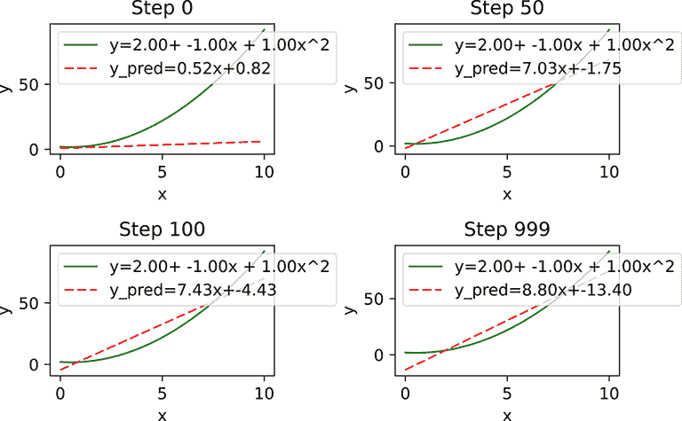

图 3.12 非线性数据的线性近似。显然，模型并没有收敛到接近期望/真实函数的任何东西。我们的模型架构是不充分的。

列表 3.3 非线性数据的线性近似

```py
x = 10 * torch.rand(N, 1)                    ①

y = x**2 - x + 2.0 
y_obs = y + (0.5 * torch.rand(N, 1) - 0.25)  ②

w = torch.rand(1, requires_grad=True)
b = torch.rand(1, requires_grad=True)
params = [b, w]
for step in range(num_steps):
  y_pred = params[0] + params[1] * x         ③
  mean_squared_error = torch.mean((y_pred - y_obs) ** 2)
  mean_squared_error.backward()
  update_parameters(params, learning_rate)

print("True function: y = 1.5*x + 2.73")
print("Learned function: y_pred = {}*x + {}"
      .format(params[1].data[0], params[0].data[0]))
```

① 生成随机输入训练数据

② 生成训练输出：将已知的非线性函数应用于输入，然后添加噪声

③ 按照列表 3.2 的方式训练线性模型

这里是输出：

```py
True function: y=x² -x + 2 
Learned function: y_pred = 8.79633331299*x + -13.4027605057
```

接下来，3.4 列表尝试使用非线性模型。正如预期（并通过输出以及图 3.13 所展示），非线性模型表现良好。在现实生活中的问题中，我们通常假设非线性，并相应地选择模型架构。

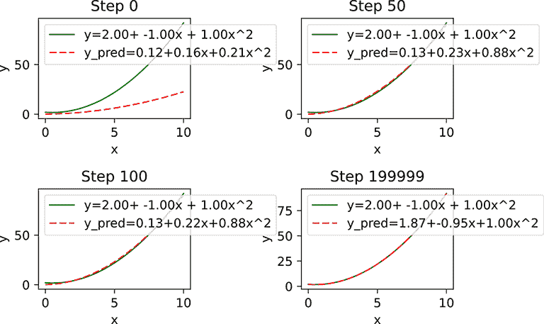

图 3.13 如果我们使用非线性模型，它或多或少会收敛到真实的潜在函数。

列表 3.4 使用 PyTorch 进行非线性建模

```py
params = [w0, w1, w2]
for step in range(num_steps):
    y_pred = params[0] + params[1] * x + params[2] * (x**2)
    mean_squared_error = torch.mean((y_pred -y_obs) ** 2)
    mean_squared_error.backward()
    update_parameters(params, learning_rate)

print("True function: y= 2 - x + x²")
print("Learned function: y_pred = {} + {}*x + {}*x²"
      .format(params[0].data[0],
              params[1].data[0],
              params[2].data[0]))
```

这里是输出：

```py
True function: y= 2 - x + x² 
Learned function: y_pred = 1.87116754055+-0.953767299652*x+0.996278882027*x²
```

### 3.5.4 PyTorch 中猫脑的线性模型

在 2.12.5 节中，我们通过伪逆直接解决了猫脑问题。现在，让我们在相同的数据集上训练一个 PyTorch 模型。正如预期，模型参数将收敛到一个接近伪逆技术获得的解（这是一个简单的训练数据集）；但在下面的列表中，我们展示了我们的第一个相对复杂的 PyTorch 模型。

列表 3.5 我们第一个现实的 PyTorch 模型（解决猫脑问题）

```py
X = torch.tensor([[0.11, 0.09], ... [0.63, 0.24]])       ①

X = torch.column_stack((X, torch.ones(15)))              ①
    ②
y = torch.tensor([-0.8, ... 0.37])                       ①

class LinearModel(torch.nn.Module):
    def __init__(self, num_features):
        super(LinearModel, self).__init__()

        self.w = torch.nn.Parameter(                     ③
            torch.randn(num_features, 1))

    def forward(self, X):
        y_pred  = torch.mm(X, self.w)                    ④
        return y_pred

model =  LinearModel(num_features=num_unknowns)

loss_fn = torch.nn.MSELoss(reduction='sum')              ⑤

optimizer = torch.optim.SGD(model.parameters(), lr=1e-2) ⑥

for step in range(num_steps):
    y_pred = model(X)
    loss = loss_fn(y_pred, y)
    optimizer.zero_grad()                                ⑦
    loss.backward()                                      ⑧

    optimizer.step()                                     ⑨

solution_gd = torch.squeeze(model.w.data)
print("The solution via gradient descent is {}".format(solution_gd))
```

① *X*，根据方程 2.22 创建（见第 2.12.3 节），它很容易验证方程 2.22 的解大致为 *w*[0] = 1，*w*[1] = 1，*b* = −1。但是方程不一致：没有一种解能完美地适合所有这些。我们期望学习到的模型接近 *y* = *x*[0] + *x*[1] − 1。

② 向数据矩阵 *X* 添加一列全 1 的列以增强数据矩阵

③ 参数是 Torch Tensor 的类型（子类），适用于模型参数（权重+偏置）

④ 线性模型： = *X*（*X* 被增强，且  包含偏置）

⑤ 预制类用于计算平方误差损失

⑥ 预制类用于使用误差梯度更新权重

⑦ 将所有偏导数置为零

⑧ 通过自动微分计算偏导数

⑨ 使用 backward() 步骤中计算的梯度更新参数

输出如下：

```py
The solution via gradient descent is [ 1.0766 0.8976 -0.9581]
```

## 3.6 凸和非凸函数，以及全局和局部最小值

凸表面（见图 3.14）有一个唯一的最佳点（最大值/最小值）：全局最佳点。² 在这样的表面上，无论我们处于何处，如果我们沿着参数空间中的梯度移动，我们最终会达到全局最小值。另一方面，在非凸表面上，我们可能会陷入局部最小值。例如，在图 3.14b 中，如果我们从箭头线标记的梯度点开始，沿着梯度向下移动，我们将到达一个局部最小值。在最小值处，梯度为零，我们将永远不会从这个点移动出去。


(a) 凸函数

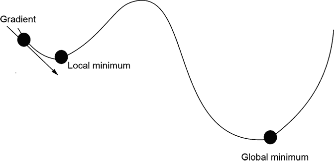

(b) 非凸函数

图 3.14 凸与非凸函数。凸函数只有一个全局最佳点（最小值或最大值），没有局部最佳点。沿着梯度向下移动可以保证达到全局最小值。友好的误差函数是凸的。非凸函数有一个或多个局部最佳点。沿着梯度移动可能会达到局部最小值，并且永远发现不了全局最小值。不友好的误差函数是非凸的。

曾经有一段时间，研究人员投入大量精力试图避免局部最小值。为此开发了特殊技术（如模拟退火）来避免它们。然而，神经网络通常不会做任何特别的事情来处理局部最小值和非凸函数。通常，局部最小值已经足够好。或者我们可以从不同的随机点重新训练，这可能会帮助我们逃离局部最小值。

## 3.7 凸集和函数

在第 3.6 节中，我们简要介绍了凸函数以及凸性如何告诉我们函数是否有局部极小值。在本节中，我们将更详细地研究凸函数。特别是，我们学习如何判断给定的函数是否是凸函数。我们还讨论了一些凸函数的重要性质，这些性质将在以后很有用——例如，当我们研究概率和统计中的 Jensen 不等式时，在附录中。我们将主要在二维空间中阐述这些思想，但它们可以很容易地扩展到更高维。

### 3.7.1 凸集

不正式地说，一个点集被称为凸集，当且仅当连接该集中任意两点之间的直线完全位于该集内。例如，如果我们用直线连接图 3.15 左侧阴影区域内的任意一对点，那么该直线上的所有点也将位于阴影区域内。这如图中的点 A 和 B 所示。任何此类区域中的所有点集构成一个凸集。

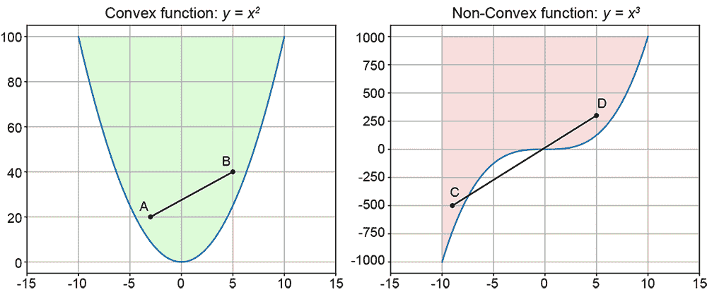

图 3.15 凸集和非凸集。左侧阴影区域中的点构成一个凸集。连接该阴影区域内任意一对点的直线完全位于阴影区域内：例如，AB。右侧阴影区域中的点构成一个非凸集。例如，连接点 C 和 D 的直线穿过非阴影区域，尽管两个端点都属于阴影区域。

相反，如果一个点集包含至少一对点，它们的连接线包含不属于该集的点，则该点集是非凸的。例如，图 3.15 右侧的阴影区域包含一对点 C 和 D，它们的连接线穿过不属于阴影区域的点。

凸集的边界总是凸曲线。

### 3.7.2 凸曲线和曲面

考虑一个函数 *g*(*x*). 让我们选取曲线 *y* = *g*(*x*) 上的任意两点：*A* ≡ (*x*[1], *y*[1] = *g*(*x*[1])) 和 *B* ≡ (*x*[2], *y*[2] = *g*(*x*[2])). 现在考虑连接 *A* 和 *B* 的线段 *L*. 从第 2.8.1 节（方程 2.12 和图 2.8），我们知道线段 *L* 上的所有点 *C* 可以表示为 *A* 和 *B* 坐标的加权平均，权重之和为 1。因此，*C* ≡ (*α*[1]*x*[1] + *α*[2]*x*[2], *α*[1]*y*[1] + *α*[2]*y*[2])，其中 *α*[1] + *α*[2] = 1。比较 *C* 与其在曲线上的对应点 *D*，它具有相同的 *X* 坐标：

*D* ≡ (*α*[1]*x*[1] + *α*[2]*x*[2], *g*(*α*[1]*x*[1] + *α*[2]*x*[2])).

只有当 *g*(*x*) 是凸函数时，*C* 才会始终位于 *D* 上，或者

*α*[1]*y*[1] + *α*[2]*y*[2] = *α*[1]*g*(*x*[1]) + *α*[2]*g*(*x*[2]) ≥ *g*(*α*[1]*x*[1] + *α*[2]*x*[2])

从连接曲线上一对点的割线上的任何一点向 *X*-轴引垂线，这条垂线将在曲线的较低点（即在 *Y*-坐标上较小）处截断曲线。

这在图 3.19 的左侧得到了说明，其中函数 *g*(*x*) = *x*²（已知是凸函数）和 *A* ≡ (−3,9) 以及 *B* ≡ (5,25)，*α*[1] = 0.3，*α*[2] = 0.7。可以看出，线上的加权平均点 *C* 位于曲线对应点 *D* 的上方。右侧说明了非凸函数 *g*(*x*) = *x*³，其中 *A* ≡ (−8,−512) 和 *B* ≡ (5,125)，*α*[1] = 0.3，*α*[2] = 0.7。图中显示了连接曲线上的点 *A* 和 *B* 的线上的一个加权平均点 (*C*)：*C* 位于曲线上的点 *D* 下方，该点的 *X*-坐标相同。

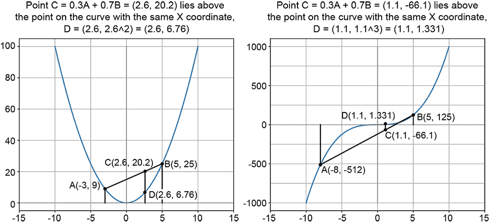

图 3.16 凸和非凸曲线。*A* 和 *B* 是曲线上的一个点对。*C* = 0.3*A* + 0.7*B* 是 A 和 B 坐标的加权平均，权重之和为 1。*C* 位于连接 *A* 和 *B* 的线上。左侧的曲线是凸的：*C* 位于对应的曲线点 *D* 之上。右侧的曲线是非凸的：*C* 位于对应的曲线点 *D* 之下。

我们不必限制自己只考虑两个点。我们可以对曲线上任意数量的点进行加权平均，权重之和为 1。对应于加权平均的点将位于曲线之上（即位于具有相同 *X*-坐标的曲线上点之上）。这一思想也扩展到更高维度，如以下所述。

定义 1

一般而言，一个多维函数 *g*() 是凸的，当且仅当

+   给定函数表面（如果函数是一维的，则为曲线）上的任意一组点（([1]，*g*([1]))，（[2]，*g*([2]))，⋯，（*[n]*，*g*(*[n]*))，

+   给定一个任意权重集 *α*[1]，*α*[2]，⋯，*α[n]*，它们的和为 1（即，Σ*[i]^n*[= 1] *α[i]* = 1），

+   *函数输出的加权总和超过或等于加权总和的函数输出*：

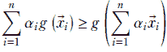

方程式 3.11

仔细思考可以发现，定义 1 意味着凸曲线始终向上和/或向右卷曲。这导致凸性的另一个等价定义。

定义 2

一般而言，一个多维函数 *g*() 是凸的，当且仅当

+   一维函数 *g*(*x*) 是凸的，当且仅当它在任何地方都具有正曲率：


方程式 3.12

+   一个多维函数 *g*() 是凸的，当且仅当其 Hessian 矩阵（见 3.4.2，方程 3.9）是正半定的，即 Hessian 矩阵的所有特征值都大于或等于零。这正是方程 3.12 的多维类似物。

需要注意的一个微妙之处是，如果二阶导数在所有地方都是负的，或者 Hessian 矩阵是负半定的，则曲线或表面被称为*凹的*。这与非凸曲线不同，在非凸曲线中，二阶导数在某些地方是正的，在其他地方是负的。凹函数的负值是凸函数。但非凸函数的负值仍然是非凸的。

在任何地方都向上弯曲的函数始终位于其切线之上。这导致凸函数的另一个等价定义。

定义 3

通常，一个多维函数 *g*() 是凸的，当且仅当

+   一个函数 *g*(*x*) 是凸的，当且仅当曲线 *S* ≡ (*x*, *g*(*x*)) 上的所有点在任何点 *A* 处都位于切线 *T* 之上，且 *S* 仅在 *A* 处接触 *T*。

+   一个函数 *g*() 是凸的，当且仅当表面 *S* ≡ (, *g*()) 上的所有点在任何点 *A* 处都位于切平面 *T* 之上，且 *S* 仅在 *A* 处接触 *T*。

这在图 3.17 中得到了说明。

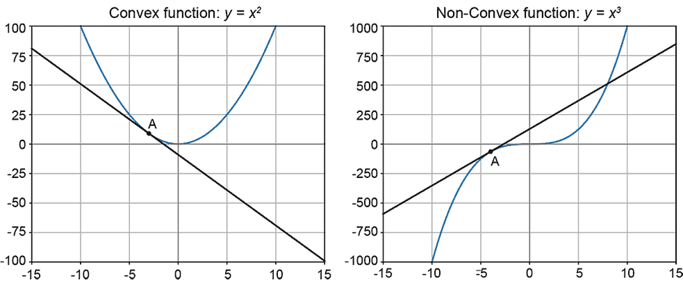

图 3.17 左侧的曲线是凸的。如果我们曲线上的任何点 *A* 处画一条切线，整个曲线都位于切线之上，仅在 *A* 处接触切线。右侧的曲线是非凸的：曲线的一部分位于切线之上，另一部分位于切线之下。

### 3.7.3 凸性与泰勒级数

在 3.4.1 节中，方程 3.7，我们看到了函数在点 *x* 附近的单变量泰勒展开。如果我们只保留泰勒展开中的直到一阶导数的项，并忽略所有后续项，那么这相当于用 *x* 处的切线来近似 *x* 处的函数（见图 3.17）。这是曲线的线性近似。如果我们保留一个额外的项（即，直到二阶导数），我们得到曲线的二次近似。如果函数的二阶导数始终为正（如凸函数），则函数的二次近似将始终大于或等于线性近似。换句话说，局部地，曲线将弯曲，使其位于切线之上。这将二阶导数定义（定义 2）与切线定义（定义 3）的凸性联系起来。

### 3.7.4 凸函数的例子

函数 *g*(*x*) = *x*² 是凸函数。验证这一点最简单的方法是计算 *d*²*g*/*dx*² = *d*2*x*/*dx* = 2，这始终是正的。事实上，任何偶数次幂的 *x*，例如 *x*⁴ 或 *x*⁶，都是凸函数。*g*(*x*) = *e^x* 也是凸函数。这可以通过计算其二阶导数来轻松验证。*g*(*x*) = *logx* 是凹函数。因此，*g*(*x*) = −*logx* 是凸函数。

乘以正标量保持凸性。凸函数的和也是一个凸函数。

## 摘要

我们希望您能从本章留下以下心理图像：

+   机器学习问题的输入可以被视为向量，或者等价地，是高维特征空间中的点。分类不过是将属于单个类别的点簇在这个空间中分离出来。

+   一个分类器可以从几何上视为高维特征空间中的超曲面（也称为决策边界），它将对应于单个类别的点簇分开。在训练过程中，我们收集具有已知类别的样本输入并识别最佳分离相应点的表面。在推理过程中，给定一个未知输入，我们确定这个点位于决策边界的哪一侧——这告诉我们类别。

+   对于二分类器（也称为二元分类器），如果我们把点代入分类器超平面的函数中，相应输出的符号就给出了类别。

+   为了计算最佳分离训练数据的超曲面决策边界，我们首先选择一个参数函数族来模拟这个表面（例如，对于简单问题，使用超平面）。然后我们估计最佳参数值，以最佳方式分离训练数据，通常以迭代的方式进行。

+   为了估计最佳分离训练数据的参数值，我们定义一个损失函数来衡量模型输出与整个训练数据集中已知期望输出之间的差异。然后，从随机初始值开始，我们迭代调整参数值，使损失值逐渐降低。

+   在每次迭代中，通过计算损失函数的梯度来估计最优减少损失的参数值的调整。

+   多维函数的梯度确定了参数空间中对应函数最大变化的方向。因此，损失函数的梯度确定了我们可以调整参数以最大程度减少损失的方向。

+   函数的最大值或最小值处的梯度为零，这始终是一个拐点。这可以用来识别我们何时达到最小值。然而，在实践中，在机器学习中，我们经常进行早期停止：当损失足够低时终止训练迭代。

+   多维泰勒级数可用于在一点邻域内创建对光滑函数的局部近似。该函数用从该点的位移、一阶导数（梯度）、二阶导数（海森矩阵）等来表示。这可以用来对参数空间中位移引起的损失值变化进行更高精度的近似。

+   损失函数可以是*凸的*或*非凸的*。在凸函数中，没有局部最小值，只有一个全局最小值。因此，梯度下降法保证收敛到全局最小值。非凸函数可以同时具有局部和全局最小值。所以，基于梯度的下降法可能会陷入局部最小值。

* * *

¹  如果某个量如 *w* 的变化极小，我们使用符号 *dw* 来表示该变化。如果变化小但不是极小的，我们使用符号 *δw*。↩

²  虽然该理论适用于最优、最大或最小值，但为了简洁起见，这里我们只谈论最小值↩
