# 第四章：机器学习中的线性代数工具

本章节涵盖

+   二次型

+   在数据科学中应用主成分分析（PCA）

+   使用机器学习应用检索文档

在大量高维数据中寻找模式是机器学习和数据科学中的关键。数据通常以大型矩阵的形式出现（例如，在 2.3 节中展示的一个玩具示例，以及方程 2.1 中），数据矩阵的行代表单个输入实例的特征向量。因此，行数与观察到的输入实例数量相匹配，列数与特征向量的大小相匹配——即特征空间中的维度数。从几何学的角度来看，每个特征向量（即数据矩阵的行）代表特征空间中的一个点。这些点在空间中不是均匀分布的。相反，属于特定类别的点集占据该空间的一个小子区域。这导致数据矩阵中存在某些结构。线性代数为我们提供了研究矩阵结构所需工具。

在本章中，我们研究线性代数工具来分析矩阵结构。本章展示了某些复杂的数学，我们鼓励您坚持不懈地学习，包括定理证明。对证明的直观理解将使您对本章的其余部分有更深刻的洞察。

注意：本章节的完整 PyTorch 代码以完全功能化和可执行的 Jupyter 笔记本形式，可在[`mng.bz/aoYz`](http://mng.bz/aoYz)找到。

## 4.1 特征数据点的分布和真实维度

例如，考虑确定文档之间相似度的问题。这对于像谷歌这样的文档搜索公司来说是一个重要问题。给定一个查询文档，系统需要从存档中检索与查询文档匹配的文档，并按相似度排序。为此，我们通常为每个文档创建一个向量表示。然后，一对文档表示的向量的点积可以用作文档之间相似度的定量估计。因此，每个文档都由一个文档描述符向量表示，其中词汇表中的每个词都与向量中的一个固定索引相关联。该索引位置存储的值是该词在文档中的频率（出现次数）。

注意：通常省略介词和连词，使用单数形式；来自同一词根的复数和其他变体通常合并为一个词。

词汇表中的每个词在文档空间中都有自己的维度。如果一个词在文档中未出现，我们在该文档描述向量中该词的索引位置放置一个零。我们为存档中的每个文档存储一个描述向量。理论上，文档描述向量是一个极其长的向量：其长度与系统中文档词汇表的大小相匹配。但这个向量只存在于概念上。在实践中，我们并不明确存储描述向量的全部内容。我们为文档中出现的每个唯一词存储一个<词，频率>对——*但我们不明确存储未出现的词*。这是文档向量的*稀疏表示*。相应的*完整表示*可以在必要时从稀疏表示中构建。在文档中，某些词经常一起出现（例如，*迈克尔*和*杰克逊*，或*枪*和*暴力*）。例如，在给定的一组文档中，*枪*出现的次数与*暴力*出现的次数大致相等：如果一个出现，另一个也大多数时候出现。对于一个描述向量或，等价地，表示文档的特征空间中的一个点，对应于词*枪*的索引位置上的值将大致等于对应于词*暴力*的值。如果我们将这些点投影到由这些相关词的轴形成的超平面上，所有点都围绕一个 45 度直线（其方程为*x* = *y*）分布，如图 4.1 所示。


图 4.1 文档描述空间。词汇表中的每个词对应一个独立的维度。点表示文档特征向量在由术语*枪*和*暴力*对应的轴形成的平面上的投影。

在图 4.1 中，代表文档的所有点都集中在 45 度线附近，其余的平面都是空白的。我们能否将定义该平面的两个轴合并，并用围绕大多数数据集中的单一线替换它们？结果是，我们可以这样做。这样做减少了数据表示中的维度数——我们正在用一个维度替换一对相关维度——从而简化了表示。这导致存储成本降低，更重要的是，提供了额外的见解。我们实际上从文档中发现了一个新的主题，称为*枪支暴力*。

作为另一个例子，考虑一个由坐标 *X*，*Y*，*Z* 表示的 3D 点集。如果所有点的 *Z* 坐标都接近零，则数据集中在 *X*，*Y* 平面周围。我们可以（并且应该）通过将它们投影到 *Z* = 0 平面上来用二维表示这些点。这样做只会略微近似点的位置（它们被投影到一个它们最初就接近的平面上）。在更现实的例子中，数据点可能聚集在 3D 空间中的任意平面上（而不是 *Z* = 0 平面）。我们仍然可以通过在它们接近的平面上投影来将这些数据点的维度降低到 2D。

通常情况下，如果一组数据点在空间中分布，使得这些点围绕该空间中的一个低维子空间（如平面或直线）聚集，我们可以将这些点投影到子空间上，并对数据进行**降维**处理。我们有效地将子空间中的距离近似为零：因为这些距离按定义很小，所以近似并不太差。从另一个角度来看，我们消除了较小的**子空间内**的变异，并保留了较大的**子空间内**的变异。这种表示方式更加紧凑，并且更容易进行更好的分析和洞察，因为我们消除了不重要的扰动，并专注于主要模式。

这些思想构成了称为**主成分分析**（PCA）的技术的基础。它是数据科学家和机器学习实践者工具箱中最重要工具之一。这些思想也是文档检索技术**潜在语义分析**（LSA）的基础——这是解决机器学习中自然语言处理（NLP）问题的基本方法。本章致力于研究导致 PCA 和 LSA 的一系列方法。我们检查了一个基本的文档检索系统以及相应的 Python 代码。

## 4.2 二次型及其最小化

给定一个平方对称矩阵 *A*，标量量 *Q* = *^TA* 被称为**二次型**。这些在机器学习的各种情况下都可以看到。

例如，回想一下我们在高中学习的圆的方程

(*x*[0]−*α*[0])² + (*x*[1]−*α*[1])² = *r*²

其中圆心为 (*α*[0]，*α*[1])，半径为 *r*。这个方程可以重写为

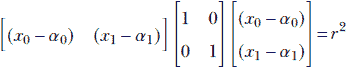

如果我们将位置向量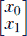表示为，并将圆心表示为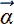，则前面的方程可以紧凑地表示为

(−)*^T***I**(−) = *r*²

注意，这个方程的左边是一个二次型。基于 *x*[0]，*x*[1] 的原始方程仅适用于二维。基于矩阵的方程是维度无关的：它表示任意维空间中的超球面。对于二维空间，两个方程变为相同。

现在，考虑椭圆的方程：


你可以验证这可以紧凑地写成矩阵形式


或者，等价地，

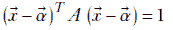

方程 4.1

其中 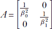。再次，矩阵表示是维度无关的。换句话说，方程 4.1 表示一个超椭球体。注意，如果椭圆轴与坐标轴对齐，矩阵 *A* 是对角的。如果我们旋转坐标系，每个位置向量都由正交矩阵 *R* 旋转。方程 4.1 的变换如下（我们使用了方程 2.10 中的矩阵乘积转置规则）：


将 *R^TAR* 替换为 *A*，我们得到与方程 4.1 相同的方程，但 *A* 不再是对角矩阵。

对于具有任意轴的通用椭球体，矩阵 *A* 具有非零的非对角项，但仍然是对称的。因此，多维超椭球体由一个二次型表示。超球面是这个特殊情况之一。

二次型也出现在方程 3.8 所示的多维泰勒展开的第二项中：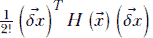 是 Hessian 矩阵中的二次型。二次型还有另一个巨大的应用，即 PCA，它如此重要，以至于我们专门用一节来介绍它 4.4)。

### 4.2.1 最小化二次型

一个重要的问题是，什么选择  可以最大化或最小化二次型？例如，因为二次型是多维泰勒级数的一部分，当我们想要确定最佳移动方向以最小化损失 *L*() 时，我们需要最小化二次型。稍后，我们将看到这个问题也是 PCA 计算的核心。

如果  是一个任意长度的向量，我们可以通过简单地改变  的长度来使 *Q* 随意变大或变小。因此，使用任意长度  优化 *Q* 并不是一个很有趣的问题：相反，我们想知道  的哪个 *方向* 优化 *Q*。在本节的其余部分，我们将讨论具有单位向量 *Q* = *x̂^TAx̂* 的二次型（记住 *x̂* 表示一个单位长度的向量，满足 *x̂^Tx̂* = ||*x̂*||² = 1）。等价地，我们可以使用不同的形式，*Q* = *^TA*/^T，但我们将在这里使用前者。我们实际上是在搜索所有可能的方向 *x̂*，检查哪个方向最小化 *Q* = *x̂^TAx̂*。

使用矩阵对角化（第 2.15 节），

*Q* = *x̂^TAx̂* = *x̂^TSΛS^Tx̂*

其中 *S* = ![[1]   [2]  …  *[n]*] 是以 *A* 的特征向量为列的矩阵，Λ 是一个对角矩阵，其对角线上的元素是 *A* 的特征值，其余位置都是 0。代入

*ŷ* = *S^Tx̂*

我们得到

*Q* = *x̂^TAx̂* = *x̂^TS*Λ*S^Tx̂* = *ŷ^T*Λ*ŷ*

方程 4.2

注意，由于 *A* 是对称的，其特征向量是正交的。这表明 *S* 是一个正交矩阵：即，*S^TS* = *SS^T* = **I**。回顾第 2.14.2.1 节，对于正交矩阵 *S*，变换 *S^Tx̂* 保持长度。因此，*ŷ* = *S^Tx̂* 是一个单位长度的向量。为了更精确，

||*ŷ*||² = ||*S^Tx̂*||² = (*S^Tx̂*)*^T*(*S^Tx̂*) = *x̂^TSS^Tx̂* = *x̂^Tx̂* = 1 因为 *SS^T* = **I**

因此，展开方程 4.2 的右侧，我们得到


方程 4.3

我们可以假设特征值按大小递减的顺序排列（如果不是，我们可以重新编号它们）。

考虑这个 *引理*（小证明）：当 Σ*[i]^n*[= 1] *y[i]*² = 1 且 *λ*[1] ≥ *λ*[2] ≥ ⋯ *λ[n]* 时，量 Σ*[i]^n*[= 1] *λ[i]* *y[i]*² 达到其最大值，其中 *y*[1] = 1，*y*[2] = ⋯ *y[n]* = 0。

以下是一个 *直观的证明*。如果可能，假设最大值出现在 *ŷ* 的某个其他值。我们受限于 *ŷ* 是一个单位向量，因此我们必须保持 Σ*[i]^n*[= 1] *y[i]*² = 1。

特别是，*ŷ* 的任何元素都不能超过 1。如果我们把第一个元素从 1 减少到一个更小的值，比如说 √1-*ϵ*，其他某个元素必须相应增加以补偿（即，保持单位长度属性）。相应地，假设最大化 *Q* 的假设 *ŷ* 是


其中 *δ* > 0。

如果我们将整个质量从后一项转移到第一项，会发生什么？


做这件事不会改变 *ŷ* 的长度，因为第一项和其他项的平方和仍然是 1 − *ϵ* + *δ*。但是，*Q* = Σ*[i]^n*[= 1] *λ[i]*² 的值在第二种情况下更高（其中 [1] 以牺牲另一个项为代价而增强），因为对于任何 *j* > 1（由于，*λ*[1] > *λ*[2]⋯ 的假设），*λ*1 > *λ*1 + *λ[j]δ*。因此，每当第一项小于 1 而其他某些项大于零时，我们可以通过将全部质量转移到第一项来增加 *Q*，而不会失去 *ŷ* 的单位长度属性。

这意味着为了最大化方程 4.3 的右侧，我们必须让单位向量 *ŷ* 的第一个元素（对应于最大特征值）为 1，其他地方都为 0。任何其他情况都会违反条件，即相应的二次型 *Q* = Σ*[i]^n*[= 1] *λ[i]*² 是一个最大值。

因此，我们已经证明了 *Q* 的最大值出现在 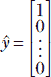。相应的 *x̂* = *Sŷ* = [1] - 对应于 *A* 的最大特征值的特征向量。

因此，当 *x̂* 沿着对应于 *A* 的最大特征值的特征向量时，二次型 *Q* = *x̂^TAx̂* 达到其最大值。相应的最大 *Q* 等于 *A* 的最大特征值。类似地，当 *x̂* 沿着对应于最小特征值的特征向量时，二次型的最小值出现。

如上所述，许多机器学习问题可以归结为最小化一个二次型。我们将在后面的章节中研究其中的一些。

### 4.2.2 对称正（半）定矩阵

一个对称的 *n* × *n* 矩阵 *A* 是正半定的，当且仅当

*^TA* ≥ 0 ∀ ∈ ℝ*^n*

换句话说，一个正半定矩阵产生一个非负的二次型，其中所有 *n* × 1 向量  都是非负的。如果我们不允许等式成立，我们得到对称正定矩阵。因此，一个对称的 *n* × *n* 矩阵 *A* 是正定的，当且仅当

*^TA* > 0 ∀ ∈ ℝ*^n*

从方程 4.2 和 4.3 可以看出，如果所有 *λ[i]* 都是正的或零，则 *Q* 是正的或零（因为 *[i]*²s 都是非负的）。因此，对称正（半）定性与矩阵的所有特征值都大于（或等于）零的条件等价。

## 4.3 矩阵的谱范数和 Frobenius 范数

向量是一个具有模和方向的实体。向量  的范数 |||| 表示其模。对于矩阵是否有等价的概念？答案是肯定的，我们将研究两个这样的想法。

### 4.3.1 特征范数

在第 2.5.4 节中，我们看到了向量的长度（也称为模） 是 |||| = *^T*. 对于矩阵 *A* 是否存在一个等价的模的概念？

好吧，一个矩阵可以被看作是一个向量的放大器。矩阵 *A* 将向量  放大到  = *A*。因此，我们可以取所有可能的  中 ||*A*|| 的最大可能值；这是 *A* 的模的一个度量。当然，如果我们考虑任意长度的向量，我们可以通过简单地缩放  来使  随意增大，对于任何 *A* 来说这都是无趣的。相反，我们想要检查  的哪个方向被放大得最多，以及放大了多少。

我们使用单位向量 *x̂* 来考察这个问题：||*Ax̂*|| 的最大（或最小）值是多少，以及 *x̂* 的哪个方向实现了它？这个量

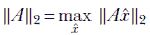

被称为矩阵 *A* 的 *谱范数*。请注意，*A* 是一个向量，||*A*||[2] 是它的长度。（我们有时会省略下标 2 并将谱范数表示为 ||*A*||。）

现在考虑向量 *Ax̂*。它的模是

||*Ax̂*|| = (*Ax̂*)*^T*(*Ax̂*) = *x̂^TA^TAx̂*

这是一个二次型。从第 4.2 节，我们知道当 *x̂* 与 *A^TA* 的最大（最小）特征值对齐时，它将被最大化（最小化）。因此，谱范数由 *A^TA* 的最大特征值给出

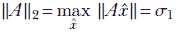

方程 4.4

其中 *σ*[1] 是 *A^TA* 的最大特征值。它也是 *A* 的最大奇异值（平方）。我们将在第 4.5 节再次看到 *σ*[1]，当我们研究奇异值分解（SVD）时。

### 4.3.2 Frobenius 范数

矩阵模的一个替代度量是 Frobenius 范数，定义为


方程 4.5

换句话说，它是所有矩阵元素的均方根。

可以证明 Frobenius 范数等于矩阵所有奇异值（*A^TA* 的特征值）之和的均方根


方程 4.6

## 4.4 主成分分析

假设我们有一组数字集合，*X* = {*x*^((0)), *x*^((1)),⋯, *x*^((*n*))}。我们想要了解这些点是如何紧密排列的。换句话说，我们想要测量这些数字的*分布范围*。图 4.2 展示了这样的分布。


图 4.2 点的 1D 分布。极端点之间的距离*不是*点分布范围的公平表示：分布不是均匀的，极端点与其他点相距甚远。大多数点都在一个更紧密排列的区域中。

注意，点不必均匀分布。特别是，极端点 (*x[max]*, *x[min]*) 可能与其他大多数点相距甚远（如图 4.2）。因此，(*x[max]*– *x[min]*)/(*n*+1) 并不是这里点平均分布范围的公平表示。大多数点都在一个更紧密排列的区域中。获取分布的统计合理方法是首先获得均值：


然后获得数字与均值的平均距离：

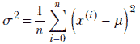

（如果我们愿意，我们可以取平方根并使用*σ*，但通常没有必要承担额外的计算负担）。这个标量量*σ*是衡量 1D 中点的平均排列密度或分布范围的好方法。你可能已经注意到，前面的方程不过是统计学中著名的方差公式。我们能否将这个概念扩展到高维数据？

让我们先在二维中考察这个想法。像往常一样，我们用 *X*[0]，*X*[1]，等等来命名坐标轴，而不是 *X*，*Y*，以便于扩展到多维度。一个单独的 2D 数据点表示为 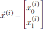。数据集是 {^((0)), ^((1)), ⋯, ^((*n*))}。

均值是直接的。我们有两个均值，而不是一个：


因此，我们现在有一个均值*向量*：


现在我们来做方差。我们面临的一个直接问题是，在二维平面上有无限多个可能的方向。我们可以沿着其中的任何一个测量方差，并且对于每个选择都会不同。当然，我们可以沿着 *X*[0] 和 *X*[1] 轴测量方差：

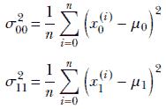

*σ*[00] 和 *σ*[11] 告诉我们沿着 *仅一个* 轴 *X*[0] 和 *X*[1] 的方差。但在一般情况下，两个轴上都会存在联合变化。为了处理联合变化，让我们引入一个交叉项：


这些方程可以用矩阵向量表示法简洁地写出：

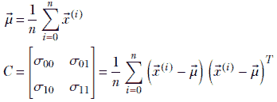

注意：在 *C* 的表达式中，我们并没有取向量的点积 (^((*i*))−) 和 (^((*i*))−)。点积将是 (^((*i*))−)*^T*(^((*i*))−)。在这里，乘积的第二元素被转置，而不是第一元素。因此，结果是矩阵。点积将产生一个标量。）

前面的方程式是通用的，这意味着它们可以扩展到任何维度。更准确地说，给定一组 *n* 维多维数据点 *X* = {^((0)), ^((1)),⋯, ^((*n*)))，我们可以定义


方程式 4.7


方程式 4.8

注意到均值已经变成了一个向量（对于一维数据，它是一个标量）并且一维的标量方差 *σ* 已经变成了一个矩阵 *C*。这个矩阵被称为 *协方差矩阵*。(*n*+1)-维均值和协方差矩阵也可以定义为

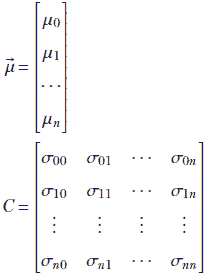

方程式 4.9

其中


方程式 4.10

对于 *i* = *j*，*σ[ii]* 实际上是数据沿 *i* 维的方差。因此，矩阵 *C* 的对角元素包含了沿坐标轴的方差。非对角元素对应于交叉协方差。

注意：方程式 4.8 和 4.9 是等价的。

### 4.4.1 最大扩展方向

最大扩展/方差的指向是什么？首先考虑一个由单位向量 *l̂* 指定的任意方向。回忆起任何向量沿一个方向的分量是由向量与单位方向向量的点积给出的，*l̂* 沿 *l̂* 的数据点的分量由

*X* ^′ = {*l̂* ^T^((0)), *l̂* ^T^((1)),⋯, *l̂* ^T^((*n*))}

注意：记住图 2.8b，它显示了另一个向量中一个向量的分量是由它们之间的点积给出的？*l̂* ^T^((*i*)) 是点积，因此是标量值。

沿方向 *l̂* 的扩展由 *X* ^′ 中标量值的方差给出。*X* ^′ 中值的均值由


以及方差为


注意到 *C* ^′ = *l̂* ^T*Cl̂* 是数据成分沿方向 *l̂* 的方差。因此，它代表了数据沿该方向的分布范围。沿着哪个方向 *l̂*，这种分布 *l̂* ^T*Cl̂* 达到最大？这是最大化 *C* ^′ = *l̂* ^T*Cl̂* 的方向 *l̂*。这个最大化方向可以通过我们讨论过的二次型优化技术来识别，即 4.2。应用该技术，我们得到以下结果：

+   当 *l̂* 沿着协方差矩阵 *C* 的最大特征值对应的特征向量时，方差达到最大。这个方向被称为多维数据的*第一主轴*。

+   沿着主轴的数据向量的分量被称为*第一主成分*。

+   沿着第一主轴的方差值，由协方差矩阵的对应特征值给出，被称为*第一主值*。

+   第二主轴是协方差矩阵对应于第二大的特征值的特征向量。第二主成分和值被定义为类似。

+   主轴彼此正交，因为它们是对称协方差矩阵的特征向量。

PCA 的实际意义是什么？为什么我们想知道点分布沿最大分布方向的方向？从 4.4.2 到 4.4.5 的章节致力于回答这个问题。

### 4.4.2 PCA 与降维

在 4.1 节中，我们看到了当数据点围绕一个低维子空间聚集时，将它们投影到子空间并降低数据表示的维度是有益的。降维后的数据可以更紧凑地表示，并且更容易得出见解和分析。在数据点围绕直线或超平面聚集的特定情况下，可以通过去除对应于相对较小的主成分值的主成分来使用 PCA 生成一个低维数据表示。这项技术对数据的维度没有限制。直线或超平面可以在空间中的任何位置，具有任意方向。


(a) 从 2D 到 1D 的降维


(b) 从 3D 到 2D 的降维

图 4.3 通过 PCA 进行降维。原始数据点用实心小圆圈表示，空心圆圈表示低维表示。

例如，考虑图 4.3a 中显示的二维分布。在这里，数据是二维的，并绘制在平面上，但数据的主要分布是沿着图中粗双箭头线所示的 1D 线。垂直于该线的方向（如图中数据点到线的短垂线所示）的分布非常小。主成分分析（PCA）揭示了这种内部结构。由于数据是二维的，有两个主成分值），但其中之一比另一个小得多：这表明降维是可能的。对应于较大主成分值的主轴沿着最大分布的线。沿着其他主轴的小扰动可以消除，而损失的信息很少。用每个数据点在第一个主成分轴上的投影来替换每个数据点，将二维数据集转换为 1D 数据集，揭示数据中的真实基本模式（直线），消除噪声（短垂线），并降低存储成本。

在图 4.3b 中，数据是三维的，但数据点在三维空间中的一个平面上聚集（如图中的矩形所示）。数据的主要分布是*沿着*这个平面，而垂直于该平面的方向（如图中从数据点到平面的短垂线所示）的分布很小。主成分分析（PCA）揭示了这一点：有三个主成分值（因为数据是三维的），但其中之一比其他两个小得多，表明降维是可能的。对应于小主成分值的主轴垂直于该平面。我们可以忽略这些扰动（图 4.3b 中的垂线）而损失的信息很少。这相当于将数据投影到由前两个主成分轴形成的平面上。这样做可以揭示数据的基本模式（平面），消除噪声（短垂线），并降低存储成本。

### 4.4.3 PyTorch 代码：PCA 和降维

在本节中，我们提供了一个 PyTorch 代码示例，用于列表 4.1 中的 PCA 计算。然后我们分别提供了应用于相关数据集和无相关数据集的 PyTorch 代码，列表 4.2 和 4.3。结果如图 4.4 所示。

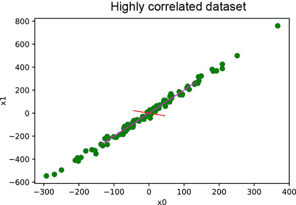

(a) 相关数据的 PCA

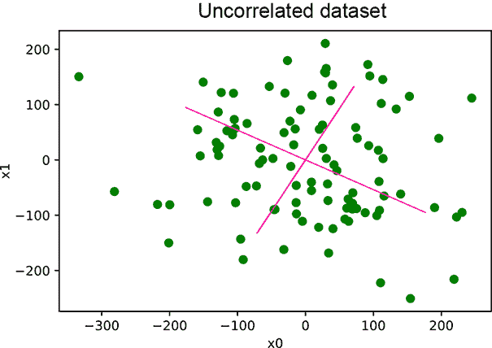

(b) 无相关数据的 PCA

图 4.4 PCA 结果。在(a)中，数据点围绕直线**y** = 2*x*分布。因此，一个主成分值比另一个大得多，表明降维将有效。在(b)中，两个主成分值都很大。降维将不会有效。

注意：本节完整的 PyTorch 代码以完全功能性和可执行的 Jupyter 笔记本形式，可在[`mng.bz/aoYz`](http://mng.bz/aoYz)找到。

列表 4.1 PCA 计算

```py
def pca(X):                                  ①
    covariance_matrix = torch.cov(X.T)
    l, e = torch.linalg.eig(covariance_matrix)
    return l, e
```

① 返回主值和向量

注意：列表 4.1 中 PCA 计算的完全功能代码可在[`mng.bz/DRYR`](http://mng.bz/DRYR)找到。

列表 4.2 对合成相关数据的 PCA

```py
x_0 = torch.normal(0, 100, (N,))              ①

x_1 = 2 * x_0 + torch.normal(0, 20, (N,))     ②

  ③
X = torch.column_stack((x_0, x_1))

  ④
principal_values, principal_vectors = pca(X)  ⑤

X_proj = torch.matmul(X, first_princpal_vec)  ⑥
```

① 随机特征向量

② 相关特征向量加少量噪声

③ 数据矩阵主要沿 y = 2x 方向扩展

④ 一个大主值和一个小主值

⑤ 沿 y = 2x 的第一主向量

⑥ 通过投影到第一个主向量进行降维

输出如下：

```py
Principal values are: [62.6133, 48991.0469]
First Principal Vector is: [-0.44, -0.89]
```

注意：列表 4.2 中 PCA 计算的完全功能代码可在[`mng.bz/gojl`](http://mng.bz/gojl)找到。

列表 4.3 对合成非相关数据的 PCA

```py
x_0 = torch.normal(0, 100, (N,))
x_1 = torch.normal(0, 100, (N,))             ①
X = torch.column_stack((x_0, x_1))

principal_values, principal_vectors = pca(X) ②
```

① 随机非相关特征向量对

② 主值彼此接近。数据点的分布在这两个方向上相当。

这里是输出：

```py
Principal values are [ 9736.4033, 7876.6592]
```

注意：列表 4.3 中 PCA 计算的完全功能代码可在[`mng.bz/e5Kz`](http://mng.bz/e5Kz)找到。

### 4.4.4 PCA 的局限性

PCA 假设潜在模式在本质上呈线性。当这并不成立时，PCA 将无法捕捉到正确的潜在模式。这通过图 4.5a 中的示意图和列表 4.3 中的实验结果来展示。图 4.5b 显示了运行列表 4.4 的结果，其中我们合成了非线性相关数据并执行了 PCA。底部直线表示第一个主轴。将数据投影到这个轴上会导致数据位置（信息损失）出现较大误差。线性 PCA 表现不佳。

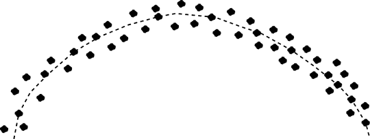

(a) 带有弯曲潜在模式的 2D 数据分布示意图


(b) 对合成（计算机生成）非线性相关数据的 PCA 结果。底部直线表示第一个主轴。

图 4.5 非线性相关数据。点分布在曲线周围，而不是直线周围。不可能找到一条直线，使得所有点都靠近它。

列表 4.4 对合成非线性相关数据的 PCA

```py
x_0 = torch.normal(0, 100, (N,))
x_1 = 2 * (x_0 ** 2) + torch.normal(0, 5, (N,))
X = torch.column_stack((x_0, x_1))

principal_values, principal_vectors = pca(X) ①
```

① 主向量未能捕捉到潜在分布

输出如下：

```py
Principal values are [9.3440e+03, 5.3373e+08] 
Mean loss in information: 68.0108526887 - high
```

### 4.4.5 PCA 与数据压缩

如果我们想在固定的字节数据预算内表示一个大型多维数据集，我们可以通过最小损失精度来丢弃哪些信息？显然，答案是较小的主值方向上的主成分——丢弃它们实际上是有帮助的，如第 4.4.2 节所述。为了压缩数据，我们通常执行 PCA，然后用数据点在第一个几个主轴上的投影来替换它们；这样做可以减少需要存储的数据分量数量。这是 JPEG 98 图像压缩技术背后的基本原理。

## 4.5 奇异值分解

奇异值分解（SVD）可能是机器学习中最重要的线性代数工具。在许多其他方面，PCA 和 LSA 的实现都是基于 SVD 构建的。我们将在本节中阐述基本思想。

注意：SVD 有几种稍微不同的形式。我们选择了看起来最直观的一种。

SVD 定理表明，任何矩阵 *A*，无论是奇异的还是非奇异的，矩形的还是方阵的，都可以分解为三个矩阵的乘积

*A* = *U*Σ*V^T*

方程式 4.11

其中（假设矩阵 *A* 是 *m* × *n*）

+   Σ 是一个 *m* × *n* 的对角矩阵。其对角元素包含 *A^TA* 的特征值的平方根。这些也被称为 *A* 的奇异值。奇异值按降序出现在Σ的对角线上。

+   *V* 是一个 *n* × *n* 的正交矩阵，其列包含 *A^TA* 的特征向量。

+   *U* 是一个 *m* × *m* 的正交矩阵，其列包含 *AA^T* 的特征向量。

### 4.5.1 SVD 定理的非正式证明

我们将通过一系列引理非正式地证明 SVD 定理。通过这些引理，我们将获得额外的见解。

引理 1

*A^TA* 是对称正定矩阵。它的特征值（也称为奇异值）是非负的。它的特征向量（也称为奇异向量）是正交的。

引理 1 的证明

假设 *A* 有 *m* 行和 *n* 列。那么 *A^TA* 是一个 *n* × *n* 的方阵

(*A^TA*)*^T* = *A^T*(*A^T*)*^T* = *A^TA*

这证明了 *A^TA* 是对称的。对于任何 ，

*^TA^TA* = (*A*)*^T*(*A*) = ||*A*||² > 0

这，根据第 4.2.2 节，证明了矩阵 *A^TA* 是对称和正半定的。因此，其特征值都是正的或零。

我们在第 2.13 节中证明了对称矩阵有正交的特征向量。这证明了奇异向量是正交的。

设 (*λ[i], v̂*[1])，对于 *i* ∈ [1, *n*] 是 *A^TA* 的特征值、特征向量对——也称为 *A* 的奇异值、奇异向量对。注意，不失一般性，我们可以假设 *λ*[1] ≥ *λ*[2] ≥ ⋯ *λ[n]*，因为如果不是这样，我们总是可以重新编号特征值和特征向量）。

现在，根据定义，

*A^TAv̂[i]* = *λ[i]v̂[i]* 对于所有*i* ∈ [1, *n*]

从引理 1，单向量是正交的，因此


方程 4.12

注意*v̂[i]*s 是单位向量（这就是为什么我们使用帽子符号而不是箭头）。如第 2.13 节所述，如果改变特征向量的长度，特征向量仍然是特征向量。我们可以自由选择任何长度的特征向量，只要我们一致选择。我们在这里选择单位长度的特征向量。

引理 2

*AA^T*是对称正半定的。它的特征值是非负的，特征向量是正交的。

引理 2 的证明

(*AA^T*)*^T* = (*A^T*)*^TA^T* = *AA^T*

此外，

*^TAA^T* = (*A^T*)*^T*(*A^T*) = ||(*A^T*)|| ≥ 0

以此类推。

引理 3

1/√*λ[i] ⋅ Av̂*[1]，对于所有*i* ∈ [1, *n*]是一个正交的单位向量集合。

引理 3 的证明

让我们取一对这些向量的点积：

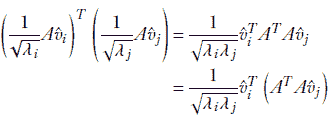

由于*λ[j]*, *v̂[j]*是*A^TA*的特征值，特征向量对，前面的方程可以重写为


这，使用方程 4.12，可以重写为

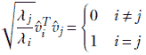

引理 4

如果(*λ[i]*, *v̂[i]*)是*A^TA*的特征值，特征向量对，那么*λ[i], û[i]* = 1/√*λ[i]* ⋅ *Av̂[i]*是*AA^T*的特征值，特征向量对。

引理 4 的证明

给定

*A^TAv̂[i]* = *λ[i]v̂[i]*

将等式的两边左乘以*A*，我们得到

*AA^T**Av̂[i]* = *λ[i]* *Av̂[i]*

*AA^T*(*Av̂[i]*) = *λ[i]* (*Av̂[i]*)

将*[i]* = *Av̂[i]*代入最后一个方程，我们得到

*AA^T[i]* = *λ[i][i]*

这证明了*[i]* = *Av̂[i]*是*AA^T*的一个特征向量，其对应的特征值为*λ[i]*。乘以 1/√*λ[i]*将其转换为根据引理 3 的单位向量。这完成了引理的证明。

### 4.5.2 SVD 定理的证明

现在，我们已经准备好检查 SVD 定理的证明。

情况 1：A 的行数多于列数

如果*m*，*A*的行数大于或等于*n*，*A*的列数，我们定义


注意以下内容：

+   从引理 1，我们知道*A^TA*的特征值是正的。这使得平方根，√*λ[i]*s，是实数。

+   *U* 是一个 *m* × *m* 的正交矩阵，其列是 *AA^T* 的特征向量。由于 *AA^T* 是 *m* × *m* 的，它有 *m* 个特征值和特征向量。其中前 *n* 个是 *û*[1] = 1/√*λ*[1] ⋅ *Av̂*[1]，*û*[2] = 1/√*λ*[2] ⋅ *Av̂*[2]，… ，*û[n]* = 1/√*λ[i]* ⋅ *Av̂[n]*（根据引理 4，我们知道这些是 *AA^T* 的特征向量）。在这种情况下，根据我们的初始假设，*n* < *m*。因此 *AA^T* 有 (*m* − *n*) 个更多的特征向量，*û*[*n* + 1]，⋯ *û[m]*。

+   *V* 是一个 *n* × *n* 的正交矩阵，其列是 *A^TA* 的特征向量，即 *v̂*[1]，*v̂*[2]，⋯ ，*v̂[n]*)。 

考虑矩阵乘积 *U*Σ。根据基本的矩阵乘法规则（第 2.5 节），我们可以看到

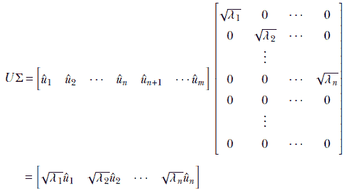

注意到 *U* 的最后几列，*û*[*n* + 1]，⋯ ，*û[m]*，在 Σ 中乘以所有零并消失。因此，

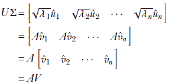

*U* 的后列——那些用 *u* 命名的列——未能幸存，因为它们乘以 Σ 底部的零。

因此，我们已经证明了

*AV* = *U*Σ

然后

*AVV^T* = *U*Σ*V^T*

由于 *V* 是正交的，*VV^T* = **I**。因此

*A* = *U*Σ*V^T*

这完成了奇异值定理的证明。

情况 2：A 的行数少于列数

如果 *m*，矩阵 *A* 的行数小于或等于 *n*，矩阵 *A* 的列数，我们有

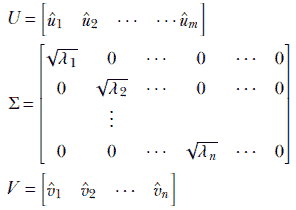

证明遵循类似的路线。

### 4.5.3 应用 SVD：PCA 计算

我们将首先用一个玩具数据集来说明这个想法。考虑一个包含五个点的 3D 数据集。我们使用上标来表示数据实例的索引，下标来表示分量。因此，第 *i* 个数据实例向量表示为 [*x*[0]^((*i*))   *x*[1]^((*i*))   *x*[2]^((*i*))]。我们用矩阵表示整个数据集，其中每个特征实例作为一个行向量出现。数据矩阵是

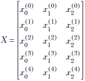

我们将假设数据已经减去了均值。现在检查矩阵乘积 *X^TX*，使用普通的矩阵乘法规则：


从方程 4.10 和 4.9，

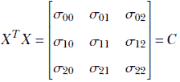

因此 *X^TX* 是数据集 *X* 的协方差矩阵。这对于任意维度和任意特征实例数量都成立。

如果我们创建一个数据矩阵 *X*，其中每个数据实例形成一个行，*X^TX* 得到数据集的协方差矩阵。这个矩阵的特征值和特征向量是主成分。因此，对 *X* 进行 SVD 得到数据的 PCA（假设先前的均值减法）。

### 4.5.4 应用 SVD：求解任意线性系统

线性系统是一组联立线性方程

*A* = 

我们第一次在 2.12 节中遇到了线性系统。可以使用矩阵求逆来解决这样的系统：

 = *A*^(-1)

然而，用矩阵求逆来解决线性系统是不理想的，原因有很多。首先，它是数值不稳定的。矩阵逆在其分母中包含矩阵的行列式。如果行列式接近零，逆矩阵将包含非常大的数。中的微小噪声将被这些大数相乘，导致计算解中的大误差。在这种情况下，基于逆的解可能非常不准确。此外，行列式可能为零：这发生在矩阵的一行是其他行的线性组合时，表明我们拥有的方程比我们想象的要少。那么，如果矩阵一开始就不是方阵呢？这发生在我们拥有的方程比未知数多（过定系统）或比未知数少（欠定系统）时。在这些情况下，逆是不可计算的，系统不能完全求解。

即使在这些情况下，我们也希望得到某种意义上的最佳近似解；在方阵的情况下，我们希望得到精确解。我们如何做到这一点？答案：我们使用奇异值分解（SVD）。步骤如下：

1.  *A* = 可以重写为*U*(Σ*V^T*) = 。然后我们解*U*[1] = 。这可以通过使用*U*的正交性轻松完成，因为[1] = *U^T*。

1.  现在，我们有Σ(*V^T*) = [1]。求解Σ[2] = [1]。这可以很容易地完成，因为对于任何对角矩阵，我们可以轻松地计算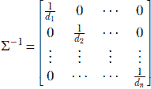

    因此，[2] = Σ^(−1)[1]。

1.  现在，我们有*V^T* = [2]。这也可以通过使用*V*的正交性轻松解决：

     = *V*[2]

因此，我们求解了而没有对矩阵*A*进行求逆：

+   对于可逆的方阵*A*，这种方法得到的解与基于矩阵逆的方法相同。

+   对于非方阵，这归结为摩尔-彭罗斯逆矩阵，并得到最佳努力解。

### 4.5.5 矩阵的秩

在第 2.12 节中，我们研究了线性方程组。这样的系统可以用矩阵-向量形式表示：

*A* = 

*A* 和  的每一行都贡献一个方程。如果我们有与未知数一样多的独立方程，则该方程组是可解的。这是最简单的情况；矩阵 *A* 是方阵且可逆。*det*(*A*) 非零，且 *A*^(−1) 存在。

有时情况会误导。考虑以下系统：

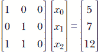

虽然有三个行和显然有三个方程，但这些方程并不独立。例如，第三个方程可以通过将前两个方程相加得到。我们实际上只有两个方程，而不是三个。我们说这个线性系统是 *退化的*。对于这样的系统 *A* =  的以下所有陈述都是正确的：

+   线性方程组是退化的。

+   *det*(*A*) = 0。

+   *A*^(−1) 不能计算，且 *A* 不可逆。

+   *A* 的行线性相关。存在一个行的线性组合，其和为零。例如，在前一个例子中，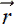[0] + [1] − [2] = 0。

+   至少 *A* 的一个奇异值（*A^TA* 的特征值）是零。线性无关行的数量等于非零特征值的数量。

矩阵中线性无关行的数量被称为其 *秩*。可以证明矩阵的非零奇异值与其秩一样多。也可以证明矩阵中线性无关列的数量与线性无关行的数量相匹配。因此，秩也可以定义为矩阵中线性无关列的数量。

一个具有 *m* 行和 *n* 列的非方矩形矩阵的秩 *r* = *min*(*m*, *n*)。这样的矩阵永远不可逆。我们通常求助于 SVD 来解它们。

一个具有 *n* 行和 *n* 列的方阵是可逆的（非零行列式）当且仅当它具有秩 *n*。这样的矩阵被称为满秩矩阵。满秩矩阵是可逆的。它们可以通过矩阵逆计算来求解，但逆计算并不总是数值稳定的。SVD 也可以在这里应用，具有良好的数值特性。

非满秩矩阵是退化的。因此，秩是矩阵非退化的度量。

### 4.5.6 使用 SVD 解线性方程组的 PyTorch 代码

本节中的列表展示了基于 PyTorch 的 SVD 实现，并演示了一个通过 SVD 解线性方程组的应用。

列表 4.5 使用矩阵求逆和 SVD 解可逆线性方程组

```py
A = torch.tensor([[1, 2, 1], [2, 2, 3], [1, 3, 3]]).float()
b = torch.tensor([8, 15, 16]).float()      ①

x_0 = torch.matmul(torch.linalg.inv(A), b) ②

U, S, V_t = torch.linalg.svd(A)            ③

y1 = torch.matmul(U.T, b)                  ④

S_inv = torch.diag(1 / S)

y2 = torch.matmul(S_inv, y1)               ⑤

x_1 = torch.matmul(V_t.T, y2)              ⑥

assert torch.allclose(x_0, x_1)            ⑦
```

① 简单的测试线性方程组

② 矩阵求逆在数值上是不稳定的；SVD 更好。

③ *A* = *USV^T* ⟹ *A* =  ≜ *USV^T* = 

④ 解 *U*[1] = . 记住 *U*^(−1) = *U^T* 因为 U 是正交的。

⑤ 解 *S*[2] = [1]。记住 *S*^(−1) 很容易，因为 *S* 是对角矩阵。

⑥ 解 *V^T*  = [2]。记住 *V^(−T)* = *V*，因为*V*是正交的。

⑦ 这两种解是相同的。

下面是输出：

```py
Solution via inverse: [1.0, 2.0, 3.0] 
Solution via SVD: [1.0, 2.0, 3.0]
```

列表 4.6 通过伪逆和 SVD 求解超定线性系统

```py
A = torch.tensor([[0.11, 0.09], [0.01, 0.02],
              [0.98, 0.91], [0.12, 0.21],
              [0.98, 0.99], [0.85, 0.87],
              [0.03, 0.14], [0.55, 0.45],
              [0.49, 0.51], [0.99, 0.01],
              [0.02, 0.89], [0.31, 0.47],
              [0.55, 0.29], [0.87, 0.76],
              [0.63, 0.24]])                         ①
A = torch.column_stack((A, torch.ones(15)))
b = torch.tensor([-0.8, -0.97, 0.89, -0.67,
              0.97, 0.72, -0.83, 0.00,
              0.00, 0.00, -0.09, -0.22,
              -0.16, 0.63, 0.37])

x_0 = torch.matmul(torch.linalg.pinv(A), b)          ②

U, S, V_t = torch.linalg.svd(A, full_matrices=False) ③

y1 = torch.matmul(U.T, b)
S_inv = torch.diag(1 / S)
y2 = torch.matmul(S_inv, y1)
x_1 = torch.matmul(V_t.T, y2)

assert torch.allclose(x_0, x_1)                      ④
```

① 猫脑数据集：非方阵

② 通过伪逆求解

③ 通过 SVD 求解

④ 这两种解是相同的。

输出如下：

```py
Solution via pseudo-inverse: [ 1.0766, 0.8976, -0.9582] 
Solution via SVD: [ 1.0766, 0.8976, -0.9582]
```

解决基于 SVD 的线性系统的完整代码可以在[`mng.bz/OERn`](http://mng.bz/OERn)找到。

### 4.5.7 使用 SVD 进行 PCA 计算的 PyTorch 代码

以下列表展示了使用 SVD 进行 PCA 计算。

列表 4.7 直接计算 PCA 和使用 SVD

```py
  ①                ②               ③
principal_values, principal_vectors = pca(X) ④

X_mean = X - torch.mean(X, axis=0)

  ⑤
U, S, V_t = torch.linalg.svd(X_mean)         ⑥

V = V_t.T                                    ⑦
```

① 协方差矩阵的特征值产生主值。

② 协方差矩阵的特征向量产生主向量。

③ 从协方差矩阵直接计算 PCA

④ 数据矩阵

⑤ 矩阵*S*的对角元素产生主值。

⑥ 从 SVD 进行 PCA

⑦ 矩阵*V*的列产生主向量。

输出如下：

```py
Principal components obtained via PCA: 
[[-0.44588404 -0.89509073]
 [-0.89509073 0.44588404]] 
Principal components obtained via SVD:
[[-0.44588404 0.89509073] 
 [-0.89509073 -0.44588404]]
```

### 4.5.8 应用 SVD：矩阵的最佳低秩逼近

给定一个秩为*p*的矩阵*A*，我们有时想用秩*r*的矩阵来逼近它，其中*r* < *p*。我们如何获得*A*的最佳秩*r*逼近？

动机

我们为什么要这样做呢？好吧，考虑一个如 4.5.3 节中所示的数据矩阵*X*。如 4.4.2 节中解释的那样，我们通常希望消除数据中的小方差（可能是由于噪声引起的），并获取底层的大变化模式。用低秩矩阵替换数据矩阵通常可以达到这个目的。然而，我们必须记住，当底层模式是非线性时（如图 4.5a 所示），这并不适用。

逼近误差

我们所说的*最佳逼近*是什么意思？我们可以将 Frobenius 范数视为矩阵的模。因此，给定一个矩阵*A*及其秩*r*的逼近*A[r]*，逼近误差是*e* = ||*A* − *A[r]*||*[F]*。

方法

为了巩固我们的想法，让我们考虑一个*m* × *n*的矩阵*A*。从 4.5 节中，我们知道它将会有*min*(*m*, *n*)个奇异值。设其秩为*p* ≤ *min*(*m*, *n*)。我们想要用秩*r*(<*p*)的矩阵来逼近这个矩阵。

让我们重写 SVD 表达式。我们将假设*m* > *n*。同样，通常情况下，我们按降序排列奇异值：*λ*[1] ≥ *λ*[2] ≥ *λ[n]*。我们将划分*U*，Σ，*V*：

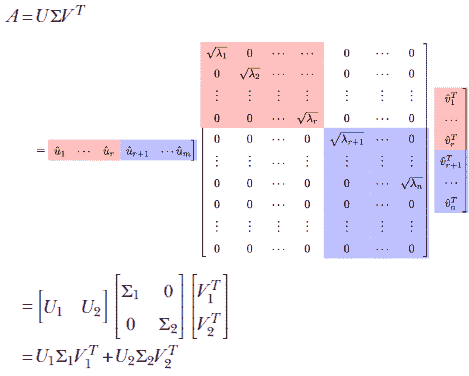

可以证明 *U*[1]Σ[1]*V*[1]*^T* 是一个秩*r*的矩阵。此外，它是*A*的最佳秩*r*逼近。

## 4.6 机器学习应用：文档检索

现在我们将本章中讨论的几个概念结合到一个说明性的玩具示例中：我们在第 2.1 节首次遇到的文档检索问题。简要回顾一下，我们有一组文档{*d*[0],⋯, *d*[6]*}。给定一个查询短语，我们必须检索与查询短语匹配的文档。我们将使用*词袋模型*：也就是说，我们的匹配方法不关注一个词在文档中的*位置*；它只关注词在文档中出现的*次数*。尽管这种技术不是最复杂的，但由于其概念简单，它很受欢迎。

我们的文档如下：

+   **d*[0]*: 玫瑰很美丽。没有人讨厌玫瑰。

+   **d*[1]*: 在美国，*枪* *暴力*已经达到流行病的规模。

+   **d*[2]*: *枪* *暴力*问题实际上被过度炒作。可以找到许多没有涉及*枪*的*暴力*实例。

+   **d*[3]*: *枪*是倾向*暴力*的人用的。*暴力*滋生*枪*。*枪*滋生*暴力*。

+   **d*[4]*: 我喜欢*枪*但讨厌*暴力*。我从未参与过*暴力*。但我拥有很多*枪*。对我来说，*枪支暴力*是无法理解的。我相信*枪*主是地球上最反*暴力*的人。从不使用*枪*的人容易陷入无意义的*暴力*。

+   **d*[5]*: 昨晚旧金山发生了一起武装抢劫，使用了*枪*。

+   **d*[6]*: *暴力*行为通常涉及武器。

### 4.6.1 使用 TF-IDF 和余弦相似度

在讨论 PCA 之前，让我们看看一些更基础的文档检索技术。这些技术基于词频-逆文档频率（TF-IDF）和余弦相似度。

词频

*词频*（TF）定义为文档中特定词的出现次数。（在此上下文中，请注意，在这本书中，我们使用*词*和*词*有些互换。）在略微宽松的定义中，任何与词出现次数成比例的量也称为词频。例如，*枪*在*d*[0]，*d*[6]中的 TF 为 0，在*d*[1]中为 1，在*d*[3]中为 3，等等。请注意，我们是不区分大小写的。此外，单复数（*枪*和*guns*）以及来自同一词根的各种词形（如*violence*和*violent*）通常映射到相同的词。

逆文档频率

某些词，如*the*，几乎出现在所有文档中。在文档检索过程中应该忽略这些词。我们如何降低它们的权重？

IDF 是通过取所有包含该词的文档的分数的倒数，然后取绝对值得到的。对于在大多数文档中出现的词，IDF 权重非常低。对于相对冷门的专业术语，IDF 权重很高。

文档特征向量

每个文档都由一个文档特征向量表示。它有与词汇表大小一样多的元素（即，所有文档中不同单词的数量）。每个单词在向量中都有一个固定的索引位置。给定一个特定的文档，对应特定单词的索引位置上的值包含该单词的 TF 乘以该单词的 IDF。因此，每个文档都是在一个具有与词汇表大小一样多维度的空间中的一个点。沿着特定维度的坐标值与单词在文档中重复的次数成正比，对于常见单词有一个降权因子。

对于像 Google 这样的现实生活中的文档检索系统，这个向量非常长。但不用担心：这个向量是概念性的——它永远不会明确存储在计算机的内存中。我们存储文档特征向量的稀疏版本：一个包含唯一单词及其 TF×IDF 得分的列表。

余弦相似度

在 2.5.6.2 节中，我们看到了两个向量之间的点积衡量了它们之间的协议。给定两个向量和，我们知道 ⋅  = |||| ||||*cos*(*θ*)，其中运算符|| ⋅ ||表示向量的长度，*θ*是两个向量之间的角度（见图 2.7b)。当向量指向同一方向且它们之间的角度为零时，余弦值达到最大可能值，即 1。随着向量之间角度的增加，余弦值逐渐减小，直到两个向量相互垂直且余弦值为零，这意味着没有相关性：向量相互独立。

点积的大小也与两个向量的长度成正比。我们不希望使用完整的点积作为衡量向量之间相似度的标准，因为即使两个长向量方向不一致，它们也会有一个很高的相似度得分。相反，我们希望使用余弦值，其定义为


方程式 4.13

文档向量之间的余弦相似度是衡量文档之间术语共享程度的一种原则性方法。如果两个文档之间共享许多重复的单词，则余弦相似度更高。

### 4.6.2 隐含语义分析

余弦相似度以及类似的技术存在一个显著的缺点。为了看到这一点，检查*d*[5]和*d*[6]之间的余弦相似度。它是零。但人类显然可以看出这两个文档是相似的。

发生了什么问题？答案：我们只测量文档中术语之间的直接重叠。*枪*和*暴力*这两个词在许多其他文档中也一起出现，表明它们之间存在某种程度的相似性。因此，只包含*枪*的文档与只包含*暴力*的文档有一些相似性——但文档向量的余弦相似度并没有考虑这种次级证据。这是 LSA 试图克服的盲点。

*词语的意义是通过它们所伴随的词语来认识的*。也就是说，如果某些术语在许多文档中一起出现（如前例中的*枪*和*暴力*），它们很可能具有一些语义相似性。这些术语应该被分组到一个共同的语义相似术语库中。这样的库被称为*主题*。文档相似度应该从共同主题的角度来衡量，而不是从显式的共同术语来衡量。我们特别感兴趣的是那些能够区分我们语料库中文档的主题：也就是说，不同文档对主题的订阅程度应该有很大的差异。

几何上，一个主题是文档特征空间中的一个子空间。在经典潜在语义分析中，我们只考虑线性子空间，一个主题可以被视为文档特征空间中的一个方向或方向的线性组合（超平面）。特别是，空间中的任何方向线都是一个主题：它是一个表示坐标轴方向加权组合的子空间，这意味着它是词汇术语的加权组合。我们当然对具有高变异性的主题感兴趣。这些对应于文档向量分布良好的方向，这意味着文档向量在这个主题上得到了很好的区分。我们通常会对主题集进行剪枝，消除那些变异不足的主题。

通过这次讨论，*主题*的数学定义开始显现。主题是文档向量矩阵的主成分，其中每个文档描述向量沿着其行排列。以主题来衡量文档相似度的优点是，两个文档可能没有许多共同的精确单词，但它们可能仍然有一个共同的主题。这种情况发生在它们共享属于同一主题的单词时。本质上，它们共享了许多在其他文档中一起出现的单词。因此，即使共同单词的数量很少，我们也可以有很高的文档相似度。


图 4.6 展示了我们的玩具数据集*d*[0]，⋯ *d*[6]的文档向量。词汇表中的每个词对应一个单独的维度。点表示文档特征向量在由术语*枪(s)*和*暴力*对应的轴形成的平面上的投影。

例如，在我们的玩具文档语料库中，*枪* 和 *暴力* 非常相关（两者或两者都不太可能在文档中出现）。*枪-暴力* 作为主题出现。如果我们用这个主题而不是单个单词来表达文档向量，我们会看到其他情况下可能忽略的相似性。也就是说，我们看到了 *潜在语义* 相似性。例如，*d*[5] 和 *d*[6] 之间的余弦相似度不为零。这是潜在语义分析的核心思想，如图 4.6 所示。

基于主题提取，让我们重新审视我们的文档检索示例。文档矩阵（以文档向量为行）看起来像表 4.1。行对应文档，列对应术语。每个单元格包含术语频率。术语 *枪* 和 *暴力* 在大多数文档中出现的次数相等，表明存在明显的相关性。因此，*枪-暴力* 是一个主题。主成分（右特征向量）识别主题。通常，我们省略了介词、连词、逗号等。整体步骤如下（Python 代码请见列表 4.8）：

1.  创建一个文档-术语 *m* × *n* 矩阵。其行对应文档（*m* 个文档），其列对应术语（*n* 个术语）。

1.  对矩阵执行奇异值分解。这会产生 *U*、*S* 和 *V* 矩阵。*V* 是一个 *n* × *n* 的正交矩阵，而 *S* 是一个对角矩阵。

1.  矩阵 *V* 的列产生主题。这些是 *X* 的行的主向量：即 *X^TX* 的特征向量，或者等价地，*X* 的协方差矩阵。

1.  每个主题向量（矩阵 *V* 中的列）的连续元素告诉我们对应术语对该主题的贡献。每个列是 *n* × 1，描述了系统中 *n* 个术语的贡献。

1.  *S* 的对角元素告诉我们对应主题的权重（重要性）。这些是 *X^TX* 的特征值：即 *X* 的行向量的主值。

1.  检查权重，并选择一个截止值。所有低于该权重的主题都被丢弃——相应的 *V* 的列被丢弃。这产生了一个具有较少列但行数相同的矩阵 *V*；这些是我们感兴趣的主题向量。我们已经降低了问题的维度。如果保留的主题数量是 *t*，则减少的 *V* 是 *m* × *t*。

1.  通过（乘以）原始文档术语矩阵 *X* 到这个新矩阵 *V*，我们得到一个 *m* × *t* 的文档主题矩阵（它具有与 *X* 相同的行数但较少的列）。这是 *X* 到主题空间的投影：即文档向量的基于主题的表示。

1.  从此以后，文档主题矩阵的行将被视为文档表示。文档相似度将通过计算这些行的余弦相似度来计算，而不是原始文档词矩阵的行。这种在主题空间中的余弦相似度将捕获许多在原始输入空间中不可见的间接连接。

表 4.1 玩具示例数据集的文档矩阵

|  | 暴力 | 枪 | 美国 | ⋯ | 玫瑰 |
| --- | --- | --- | --- | --- | --- |
| **d**[0] | 0 | 0 | 0 | ⋯ | 2 |
| **d**[1] | 1 | 1 | 1 | ⋯ | 0 |
| **d**[2] | 2 | 2 | 0 | ⋯ | 0 |
| **d**[3] | 3 | 3 | 0 | ⋯ | 0 |
| **d**[4] | 5 | 5 | 0 | ⋯ | 0 |
| **d**[5] | 0 | 1 | 0 | ⋯ | 0 |
| **d**[6] | 1 | 0 | 0 | ⋯ | 0 |

### 4.6.3 执行 LSA 的 PyTorch 代码

以下列表演示了如何从表 4.1 计算我们的玩具数据集的 LSA。本节的完整功能代码可在 [`mng.bz/E2Gd`](http://mng.bz/E2Gd) 找到。

列表 4.8 计算 LSA

```py
terms = ["violence", "gun", "america", "roses"]         ①
X = torch.tensor([[0, 0, 0, 2],
              [1, 1, 1, 0],
              [2, 2, 0, 0],
              [3, 3, 0, 0],
              [5, 5, 0, 0],
              [0, 1, 0, 0],
              [1, 0, 0, 0]]).float()                    ②

U, S, V_t = torch.linalg.svd(X)                         ③

V = V_t.T

rank = 1
U = U[:, :rank]
V = V[:, :rank]                                         ④

topic0_term_weights = list(zip(terms, V[:, 0]))         ⑤

def cosine_similarity(vec_1, vec_2):
    vec_1_norm = torch.linalg.norm(vec_1)
    vec_2_norm = torch.linalg.norm(vec_2)
    return torch.dot(vec_1, vec_2) / (vec_1_norm * vec_2_norm)

d5_d6_cosine_similarity = cosine_similarity(X[5], X[6]) ⑥

doc_topic_projection = torch.dot(X, V)
d5_d6_lsa_similarity = cosine_similarity(doc_topic_projection[5],
                                         doc_topic_projection[6])
```

① 为了简单起见，仅考虑四个术语

② 文档词矩阵。每一行描述一个文档。每一列包含一个术语的 TF 分数。为了简单起见，忽略了 IDF。

③ 对文档词矩阵执行 SVD。结果矩阵 *V* 的列对应于主题。这些是 *X^TX* 的特征向量：文档词矩阵的主向量。一个主题对应于文档特征空间中最大方差的方向。

④ *S* 表示主值对角矩阵。这些表示主题权重（重要性）。我们选择一个截止值并丢弃所有低于该权重的主题（降维）。仅保留 *V* 的前几列。此数据集的主值（主题权重）显示在输出中。本例中仅保留一个主题。

⑤ 主题向量的元素表示对应术语对主题的贡献。

⑥ 在特征空间中的余弦相似度无法捕获 d, d6 相似度。LSA 成功。

输出如下：

```py
Principal Values from S matrix: 8.89, 2.00, 1.00, 0.99
(Topic 0 has disproportionately high weight. We discard others)

topic0_term_weights (Topic zero is about "gun" and "violence"):
[
 ('violence', -0.706990662151775)
 ('gun', -0.7069906621517749)
 ('america', -0.018122010384881156)
 ('roses', 2.9413274625621952e-18)
]
Document 5, document 6 Cosine similarity in original space: 0.0
Document 5, document 6 Cosine similarity in topic space: 1.0
```

### 4.6.4 在大型数据集上计算 LSA 和 SVD 的 PyTorch 代码

假设我们有一个包含 500 个文档的词汇表，词汇表包含 3 个术语。这是一个不切实际的短词汇表，但它使我们能够轻松地可视化文档向量空间。每个文档向量是一个 3 × 1 向量，共有 500 个这样的向量。它们共同构成一个 500 × 3 的数据矩阵 *X*。在此数据集中，术语 *x*0 和 *x*1 是相关的：*x*0 在文档中随机出现 0 到 100 次，而 *x*1 的出现次数是 *x*0 的两倍，除了小的随机波动。第三个术语的频率在 0 到 5 之间。从第 4.6 节中，我们知道 *x*0 和 *x*1 一起形成一个主题，而 *x*2 单独形成另一个主题。我们期望每个主题都有一个主成分。

列表 4.9 创建数据集，计算奇异值分解（SVD），绘制数据集，并显示前两个主成分。第三个奇异值相对于第一个来说很小。我们可以忽略这个维度——它对应于*x*0 − *x*1 主题中的小随机变化。奇异值被打印出来，并在图 4.7 中与数据点一起以图形方式展示。

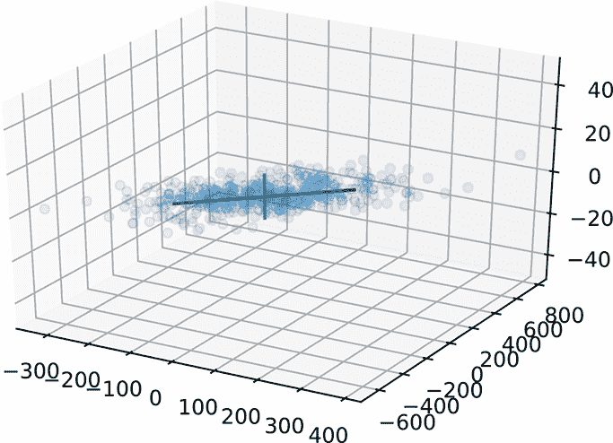

图 4.7 潜在语义分析。请注意，垂直轴线实际上比图中看起来要小得多。

列表 4.9 使用 SVD 的 LSA

```py
num_examples = 500
x0 = torch.normal(0, 100, (num_examples,)).round()
random_noise = torch.normal(0, 2, (num_examples,)).round()
x1 = 2*x0 + random_noise
x2 = torch.normal(0, 5, (num_examples,)).round()
X = torch.column_stack((x0, x1, x2))                       ①

                ②
U, S, V_t = torch.linalg.svd(X)                            ③
V = V_t.T                                                  ③
```

① 3D 数据集：前两个轴是线性相关的；第三个轴有小的接近零的随机值。

② 第三个奇异值相对较小；我们忽略它

③ 前两个主向量代表主题。将数据点投影到它们上，可以得到两个主题的文档描述符。

这里是输出：

```py
Singular values are: 4867.56982, 118.05858, 19.68604
```

## 摘要

在本章中，我们研究了机器学习和数据科学中使用的几个线性代数工具：

+   使二次型*x̂^TAx̂*最大（最小）的方向（单位向量）是矩阵*A*对应于最大（最小）特征值的特征向量。当*x̂*沿着这些方向时，二次型的幅度是*A*的最大（最小）特征值。

+   给定一个在*n* + 1 维空间中的点集*X* = {^((0)), ^((1)), ^((2)), ⋯, ^((*n*))}，我们可以定义均值向量和协方差矩阵为


沿任意方向（单位向量）*l̂*的方差是*l̂* ^T*Cl̂*。这是一个二次型。因此，多维空间中一组数据点的最大（最小）方差发生在协方差矩阵对应于最大（最小）特征值的特征向量上。这个方向被称为数据的第一主轴。后续的特征向量，按特征值递减的顺序排序，是相互正交（垂直）的，并产生后续的最大方差方向。这种技术被称为主成分分析（PCA）。

+   在许多实际情况下，较大的方差对应于数据的真实潜在模式，而较小的方差对应于噪声（如测量误差）。将数据投影到对应于较大特征值的协方差矩阵的特征轴上，可以得到相对无噪声的较低维数据。投影的数据点也与真实潜在模式更接近，从而获得更好的洞察。这被称为降维。

+   单值分解（SVD）允许我们将任意 *m* × *n* 矩阵 *A* 分解为三个矩阵的乘积：*A* = *U*Σ*V^T*，其中 *U* 和 *V* 是正交矩阵，Σ 是对角矩阵。矩阵 *V* 的列是 *A^TA* 的特征向量。*U* 的列是 *AA^T* 的特征向量。Σ 的对角线元素是按降序排列的 *A^TA* 的特征值。

+   SVD 提供了一种数值稳定的线性方程组 *A* =  的解法。特别是，对于非方阵，它提供了最接近的近似：即 *A*，它最小化了 ||*A* − ||。

+   给定一个数据集 *X*，其中行对应于个体实例的数据向量，列对应于特征值，*X^TX* 得到协方差矩阵。因此，*X^TX* 的特征向量是数据的主成分。由于 *X* 的奇异值分解的列向量是 *X^TX* 的特征向量，因此奇异值分解是计算主成分分析（PCA）的有效方法。

+   当使用机器学习数据科学进行文档检索时，词袋模型用包含文档中每个术语的词频（出现次数）的文档向量来表示文档。

+   TF-IDF 是一种用于文档匹配和检索的余弦相似度技术。

+   潜在语义分析（LSA）进行主题建模：我们对文档向量进行主成分分析以识别主题。将文档向量投影到主题轴上，使得 LSA 能够看到超越直接术语重叠的潜在（间接）相似性。
