# 第五章：机器学习中的概率分布

本章涵盖

+   概率分布 在机器学习中的作用

+   使用二项式、多项式、分类、伯努利、贝塔和狄利克雷分布

+   熵和交叉熵在机器学习中的重要性

生活中常常需要我们估计事件发生的概率或在不确定的情况下做出决策。概率和统计学是这种情况下常用的工具箱。在机器学习中，我们将大特征向量作为输入。如前所述，我们可以将这些特征向量视为高维空间中的点。例如，尺寸为 224 × 224 的灰度图像可以视为 50,176 维空间中的点，每个像素对应一个特定的维度。具有共同特征（如动物图像）的输入将对应于该空间中点的一个簇。概率分布为分析这种在任意高维空间中松散结构化的点分布提供了有效工具。我们不仅可以简单地开发一个给定输入输出类别的机器，还可以将概率分布拟合到满足某些感兴趣特性的输入点簇（或它们的变换版本）。这通常能为我们试图解决的问题提供更多见解。

例如，假设我们正在尝试设计一个推荐系统。我们可以设计一个或多个分类器，它们会发出是否向人 Y 推荐产品 X 的是/否决策。另一方面，我们可以将概率分布拟合到特定的人群。这样做可能会导致代表不同群体的点簇之间出现显著的重叠——例如，喝黑咖啡的人和初创公司创始人。我们可能不知道解释，甚至不知道因果关系（如果有的话）的方向。但我们看到了相关性，并可能利用它设计一个更好的推荐系统。

在机器学习中，概率模型被用于处理涉及大量（可能无限多）类别的问题时。例如，假设我们正在创建一个机器，它不仅能在图像中识别猫，还能为每个像素标记其属于或不属于猫。实际上，机器将图像像素分割为前景与背景。这被称为*语义分割*。将这个问题视为一个分类问题是很困难的：我们通常设计一个系统，为每个像素输出一个前景的概率。

概率模型也用于无监督学习和最小监督学习：例如，在*变分自编码器*（VAEs）中，我们将在第十四章节中讨论。

本章介绍了概率的基本概念，并从机器学习的角度讨论了概率分布（包括多元分布），并提供了具体示例。像往常一样，我们强调多元统计的几何视图。本章的另一个同样重要的目标是使您熟悉 PyTorch `distributions`，这是我们在整本书中使用的 PyTorch 统计包。所有讨论的分布都附有 PyTorch `distributions`的代码片段。

注意：本章的完整 PyTorch 代码以完全功能性和可执行的 Jupyter 笔记本形式，可在[`mng`](http://mng.bz/8NVg) [.bz/8NVg](http://mng.bz/8NVg)找到。

## 5.1 概率：经典频率主义观点

考虑一个虚构的城市 Statsville。假设我们随机选择 Statsville 的一个成年居民。这个人的身高超过 6 英尺的概率是多少？小于 3 英尺的概率是多少？在 5 英尺 5 英寸到 6 英尺之间吗？这个人的体重在 50 到 70 公斤之间的概率是多少？（物理学家可能会在这里使用*质量*这个词，但我们选择坚持使用更常见的*体重*这个词）？大于 100 公斤的概率是多少？这个人的家距离市中心正好 6 公里的概率是多少？这个人的体重在 50 到 70 公斤范围内*并且*他们的身高在 5 英尺 5 英寸到 6 英尺范围内的概率是多少？这个人的体重大于 90 公斤*并且*他们的家在市中心 5 公里范围内的概率是多少？

所有这些问题都可以通过采用以下方法在频率主义范式中得到解答：

计算满足感兴趣事件标准或标准的人口规模：例如，Statsville 成年人中身高超过 6 英尺的人数。将这个数字除以总人口规模（在这里，Statsville 的成年人数量）。这就是满足该标准/标准的概率（机会）。

形式上，

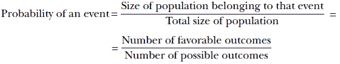

公式 5.1

例如，假设这个城市有 10 万名成年人。其中，有 25,000 人身高 6 英尺或更高。那么满足感兴趣事件（即有利结果的数量）的人口规模是 25,000。总人口规模（即可能结果的数量）是 100,000。因此，


由于总人口总是任何事件所属人群的超集，所以分母总是大于或等于分子。因此，*概率总是小于或等于 1*。

### 5.1.1 随机变量

当我们谈论概率时，一个相关的问题是，“概率是什么的概率？”最简单的答案是，“事件发生的概率。”例如，在前一小节中，我们讨论了成年人 Statsville 居民身高小于 6 英尺的事件的概率。稍加思考就可以发现，事件总是对应于一个感兴趣的数值实体取特定值或位于特定值范围内的数值。这个实体被称为*随机变量*。例如，Statsville 成年人的身高可以是一个随机变量，我们可以谈论它小于 6 英尺的概率；Statsville 成年人的体重也可以是一个随机变量，我们可以谈论它小于 60 公斤的概率。在预测股市表现时，道琼斯指数可能是一个随机变量：我们可以谈论这个随机变量超过 19,000 点的概率。在讨论病毒的传播时，感染人数的总量可能是一个随机变量，我们可以谈论它小于 2,000 人的概率，等等。

随机变量的定义特征是每个允许的值（或值的范围）都与一个概率相关联（即随机变量取该值或值范围的概率）。例如，对于 Statsville 的成年人，我们可以允许只有三个体重范围：*S*[1]，小于 60 公斤；*S*[2]，介于 60 至 90 公斤之间；和*S*[3]，大于 90 公斤。然后我们可以有一个相应的随机变量 *X* 来表示量化体重。它可以取三个值之一：*X* = 1（对应于 *S*[1] 中的体重），*X* = 2（对应于 *S*[2] 中的体重），或 *X* = 3（对应于 *S*[3] 中的体重）。每个值都伴随着一个固定的概率：例如，在 5.1 节 5.1 的例子中，*p*(*X* = 1) = 0.25，*p*(*X* = 2) = 0.5，*p*(*X* = 3) = 0.25，分别。这样的随机变量，其值来自可数集合，被称为*离散*随机变量。

随机变量也可以是*连续的*。对于连续随机变量 *X*，我们将其值在一个无限小的范围内与一个概率相关联，*p*(*x* ≤ *X* < *x* + *δx*)，其中 *δx* → 0。这被称为*概率密度*，在 5.6 节 5.6 中有更详细的解释。

注意：在这本书中，我们总是使用大写字母来表示随机变量。通常，相同的小写字母表示随机变量的一个特定值：例如，*p*(*X* = *x*)表示随机变量 *X* 取值 *x* 的概率，而 *p*(*X*∈{*x*, *x* + *δx*}) 表示随机变量 *X* 取值在 *x* 和 *x* + *δx* 之间的概率。此外，请注意，有时我们使用字母 *X* 来表示一个数据集。这种流行但容易混淆的惯例在文献中很常见——通常，从上下文中可以明显看出其用法。

### 5.1.2 总体直方图

直方图帮助我们可视化离散随机变量。让我们继续以 Statsville 为例。我们只对 Statsville 成年人的三个体重范围感兴趣：*S*[1]: 低于 60 公斤；*S*[2]: 介于 60 至 90 公斤之间；以及*S*[3]: 超过 90 公斤。假设 Statsville 成年人这些体重范围内的数量如表 5.1 所示。

表 5.1 Statsville 城市成年人重量的频率表

| *S*[1]: 低于 60 公斤 | *S*[2]: 介于 60 至 90 公斤之间 | *S*[3]: 超过 90 公斤 |
| --- | --- | --- |
| 25,000 | 50,000 | 25,000 |

同样的信息可以通过图 5.1 所示的直方图来可视化。直方图的 X 轴对应于第 5.1.1 节中离散随机变量的可能值。Y 轴显示了相应体重范围内的总体规模。有 25,000 人在 S[1]范围内，50,000 人在 S[2]范围内，25,000 人在 S[3]范围内。这些类别共同构成了 Statsville 的整个成年人口——每个成年人属于一个或另一个类别。这可以通过将所有类别的 Y 轴值相加来验证：25,000 + 50,000 + 25,000 = 100,000，这是 Statsville 的成年人口。

## 5.2 概率分布

图 5.1 及其等价表格 5.1 可以很容易地转换为概率，如表 5.2 所示。该表显示了代表随机选择的 Statsville 成年居民量化体重的离散随机变量 X 的允许值的概率。表 5.2 代表形式上所知的*概率分布*：一个数学函数，它接受一个随机变量作为输入，并输出它取任何允许值的概率。它必须在随机变量的所有可能值上定义。

注意，集合{S[1]，S[2]，S[3]}是穷尽的，因为在某种意义上，所有可能的 X 值都属于其中一个范围——我们不可能有一个不属于这些范围的权重。在集合论术语中，这些范围的并集，S[1] ∪ S[2] ∪ S[3]，覆盖了一个包含整个总体（所有可能的 X 值）的空间。


图 5.1 描述 Statsville 成年人重量的直方图，对应表 5.1

表 5.2 Statsville 成年人量化体重的概率分布

| *S*[1]: 低于 60 公斤 | *S*[2]: 介于 60 至 90 公斤之间 | *S*[3]: 超过 90 公斤 |
| --- | --- | --- |
| *p*(*X* = 1) = 25,000/100,000 = 0.25 | *p*(*X* = 2) = 50,000/100,000 = 0.5 | *p*(*X* = 3) = 25,000/100,000 = 0.25 |

备注：集合论运算符∪表示集合的并。

范围也是互斥的，因为任何给定的 *X* 观测只能属于一个范围，永远不可能更多。在集合论术语中，任何一对范围的交集为零：*S*[1] ∩ *S*[2] = *S*[1] ∩ *S*[3] = *S*[2] ∩ *S*[3] = *ϕ*。

备注：集合论运算符∩表示集合交集。

对于一组穷尽且互斥的事件，给出这些事件概率的函数称为概率分布。例如，我们这个微小例子中的概率分布包括三个概率：*P*(*X* = 1) = 0.25，*P*(*X* = 2) = 0.5，和 *P*(*X* = 3) = 0.25。这如图 5.2 所示，这是一个三点图。


图 5.2 Statsville 成年人重量的概率分布图，对应于表 5.2。事件 *E*[1] ≡ *X* = 1 ⟹ 重量在 *S*[1] 范围内，事件 *E*[2] ≡ *X* = 2 ⟹ 重量在 *S*[2] 范围内，事件 *E*[3] ≡ *x* = 3 ⟹ 重量在 *S*[3] 范围内。

## 5.3 概率论的基本概念

在本节中，我们简要地涉及了不可能事件和必然事件；穷尽且互斥事件的概率之和；以及独立事件。

### 5.3.1 不可能事件和必然事件的概率

不可能事件的概率为零（例如，太阳从西边升起的概率）。必然发生的事件的概率为 1（例如，太阳从东边升起的概率）。像作者在网球比赛中击败罗杰·费德勒这样的不可能事件具有低但非零的概率，例如 0.001。高度可能的事件（例如罗杰·费德勒在网球比赛中击败作者）的概率接近但并不完全等于 1，例如 0.999。

### 5.3.2 穷尽且互斥事件

考虑事件 *E*[1]、*E*[2]、*E*[3]，它们对应于 Statsville 成年人从 5.2 节中量化的体重，分别属于 *S*[1]、*S*[2]、或 *S*[3] 范围，或者说，*E*[1] 是对应于 *X* = 1 的事件，*E*[2] 是对应于 *X* = 2 的事件，*E*[3] 是对应于 *X* = 3 的事件。这些事件是穷尽的：它们的并集覆盖了整个总体空间。这意味着 Statsville 成年人的所有量化体重都属于 *S*[1]、*S*[2]、或 *S*[3] 中的一个范围。这些事件也是互斥的：它们的交集为零，意味着总体中的任何成员不能属于多个范围。例如，如果一个重量属于 *S*[1]，它就不能属于 *S*[2] 或 *S*[3]。对于这类事件，以下成立：

互斥事件的概率之和给出了它们中任何一个发生的概率。

例如，对于事件 *E*[1]、*E*[2]、*E*[3]，

*p*(*E*[1] 或 *E*[2]) = *p*(*E*[1]) + *p*(*E*[2])

方程式 5.2

**求和法则**指出，

穷尽且互斥事件概率之和总是 1。

例如，

*p*(*E*[1]) + *p*(*E*[2]) + *p*(*E*[3]) = *p*(*E*[1] or *E*[2] or *E*[3]) = 1

这在直观上是显而易见的。我们只是在说，*我们可以肯定地说，*E*[1] 或 *E*[2] 或 *E*[3] 中至少有一个会发生*。

一般而言，给定一组穷尽且互斥的事件 *E*[1], *E*[2], ⋯, *E[n]*，

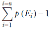

方程 5.3

### 5.3.3 独立事件

考虑两个事件 *E*[1] ≡ “Statsville 成年居民的体重小于 60 公斤” 和 *G*[1] ≡ “Statsville 成年居民的住宅距离市中心 5 公里以内”。这些事件之间没有任何影响。知道人口中某个成员体重小于 60 公斤并不能揭示他们住宅距离市中心的距离，反之亦然。我们说 *E*[1] 和 *G*[1] 是 *独立事件*。正式地，

如果一个事件的发生不影响另一个事件发生的概率，那么这组事件是独立的。

## 5.4 联合概率及其分布

给定一个 Statsville 的成年居民，让 *E*[1] 仍然是他们体重小于 60 公斤的事件。相应概率是 *p*(*E*[1])。同样，让 *G*[1] 是他们住宅距离市中心小于 5 公里的事件。相应概率是 *p*(*G*[1])。现在考虑一个居民体重小于 60 公斤且住宅距离市中心小于 5 公里的概率。这个概率，表示为 *p*(*E*[1], *G*[1])，被称为联合概率。正式地，

一组事件的联合概率是所有这些事件同时发生的概率。

乘法法则指出，独立事件的联合概率可以通过乘以它们的单个概率来获得。因此，对于当前示例，*p*(*E*[1], *G*[1]) = *p*(*E*[1])*p*(*G*[1])。

让我们用一个稍微更复杂的例子继续我们的联合概率讨论。为了方便查阅，我们将权重类别、对应人口和概率分布汇总在表 5.3 中。同样，我们将居民住宅距离市中心距离量化为三个范围：*D*[1] ≡ 小于 5 公里，*D*[2] ≡ 5 到 15 公里之间，*D*[3] ≡ 大于 15 公里。表 5.4 显示了相应的人口和概率分布。事件 {*E*[1], *E*[2], *E*[3]} 和 {*G*[1], *G*[2], *G*[3]} 的联合概率分布显示在表 5.5 中。

表 5.3 Statsville 成年居民体重的人口概率分布表。*E*[1]，*E*[2]，*E*[3] 是穷尽且互斥的事件，*p*(*E*[1]) + *p*(*E*[2]) + *p*(*E*[3]) = 1。

| 低于 60 公斤（范围 *S*[1]） | 60 到 90 公斤（范围 *S*[2]） | 高于 90 公斤（范围 *S*[3]） |
| --- | --- | --- |
| 事件 *E*[1] ≡ *重量* ∈ *S*[1] | 事件 *E*[2] ≡ *重量* ∈ *S*[2] | 事件 *E*[3] ≡ *重量* ∈ *S*[3] |
| 人口规模 = 25,000 | 人口规模 = 50,000 | 人口规模 = 25,000 |
| *p*(*S*[1]) = 25,000/100,000 = 0.25 | *p*(*S*[2]) = 50,000/100,000 = 0.5 | *p*(*S*[3]) = 25,000/100,000 = 0.25 |

表 5.4 统计城居民家庭距离市中心距离的人口概率分布表。*G*[1]，*G*[2]，*G*[3] 是穷尽且互斥的事件，*p*(*G*[1]) + *p*(*G*[2]) + *p*(*G*[3]) = 1。

| 小于 5 公里（范围 *D*[1]） | 5 至 15 公里（范围 *D*[2]） | 大于 15 公里（范围 *D*[3]） |
| --- | --- | --- |
| 事件 *G*[1] ≡ *距离* ∈ *D*[1] | 事件 *G*[2] ≡ *距离* ∈ *D*[2] | 事件 *G*[3] ≡ *距离* ∈ *D*[3] |
| 人口规模 = 20,000 | 人口规模 = 60,000 | 人口规模 = 20,000 |
| *p*(*G*[1]) = 20,000/100,000 = 0.20 | *p*(*G*[1]) = 60,000/100,000 = 0.6 | *p*(*G*[1]) = 20,000/100,000 = 0.20 |

表 5.5 独立事件的联合概率分布。表中所有元素的总和为 1。

|  | 小于 60 公斤 (*E*[1]) | 60 至 90 公斤 (*E*[2]) | 超过 90 公斤 (*E*[3]) |
| --- | --- | --- | --- |
| --- | --- | --- |  |
| **小于 5 公里** (*G*[1]) | *p*(*E*[1], *G*[1])= 0.25 × 0.2= 0.05 | *p*(*E*[2], *G*[1])= 0.5 × 0.2= 0.1 | *p*(*E*[3], *G*[1])= 0.25 × 0.2= 0.05 |
| **5 至 15 公里之间** (*G*[2]) | *p*(*E*[1], *G*[2])= 0.25 × 0.6= 0.15 | *p*(*E*[2], *G*[2])= 0.5 × 0.6= 0.3 | *p*(*E*[3], *G*[2])= 0.25 × 0.6= 0.15 |
| **超过 15 公里** (*G*[3]) | *p*(*E*[1], *G*[3])= 0.25 × 0.2= 0.05 | *p*(*E*[2], *G*[3])= 0.5 × 0.2= 0.1 | *p*(*E*[3], *G*[3])= 0.25 × 0.2= 0.05 |

关于表 5.5 我们可以做出以下陈述：

+   表 5.5 中所有元素的总和为 1。换句话说，*p*(*E[i]*, *G[j]*) 是一个合适的概率分布，表示事件 *E[i]* 和事件 *G[j]* 同时发生的概率：在这里，(*i*, *j*) ∈ {1,2,3} × {1,2,3}。

+   *p*(*E[i]*, *G[j]*) = *p*(*E[i]*)*p*(*G[j]*) ∀(*i*, *j*) ∈ {1,2,3} × {1,2,3}。这是因为事件是独立的。

注意：符号 × 表示 *笛卡尔积*。集合 {1,2,3} × {1,2,3} 的笛卡尔积是集合 {(1,1),(1,2),(1,3),(2,1),(2,2),(2,3),(3,1),(3,2),(3,3)}。符号 ∀ 表示“对于所有”。读作 ∀(*i*, *j*) ∈ {1,2,3} × {1,2,3}，即对于笛卡尔积中的所有对 (*i*, *j*)。

通常，给定一组独立事件 *E*[1]，*E*[2]，⋯，*E[n]*，所有事件同时发生的联合概率 *p*(*E*[1], *E*[2],⋯, *E[n]*) 是它们各自发生概率的乘积：

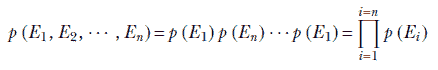

方程式 5.4

注意：符号 ∏ 表示“乘积”。

### 5.4.1 边缘概率

假设我们没有个体概率 *p*(*E[i]*) 和 *p*(*G[j]*)。我们拥有的只是联合概率分布：即表 5.5。我们能从这些中找到个体概率吗？如果能，那么如何？

为了回答这个问题，考虑表 5.5 中的特定行或列——比如说，最上面的行。在这一行中，*E* 的值遍历所有可能性（*E* 的整个空间），但 *G* 固定在 *G*[1]。如果 *G*[1] 要发生，只有三种可能性：它与 *E*[1]，*E*[2]，或 *E*[3] 同时发生。相应的联合概率是 *p*(*E*[1], *G*[1])，*p*(*E*[2], *G*[1])，和 *p*(*E*[3], *G*[1])。如果我们把它们加起来，我们得到 *G*[1] 与 *E*[1] 或 *E*[2] 或 *E*[3] 同时发生的概率：即事件 (*E*[1], *G*[1]) 或 (*E*[2], *G*[1]) 或 (*E*[3], *G*[1])。因此，我们已经考虑了 *G*[1] 可以发生的所有情况。总和代表了事件 *G*[1] 发生的概率。因此，*p*(*G*[1]) 可以通过将对应于 *G*[1] 的行的所有概率相加，并在边缘写下它来获得（这就是为什么它被称为边缘概率）。同样，通过将中间列的所有概率相加，我们获得 *p*(*E*[2]) 的概率，等等。表 5.6 显示了带有边缘概率的更新后的表 5.5。

表 5.6 显示边缘概率的联合概率分布

|  | 小于 60 公斤 (*E*[1]) | 60 至 90 公斤之间 (*E*[2]) | 超过 90 公斤 (*E*[3]) | G 的边缘概率 |
| --- | --- | --- | --- | --- |
| **小于 5 公里** (*G*[1]) | *p*(*E*[1], *G*[1])= 0.25 × 0.2= 0.05 | *p*(*E*[2], *G*[1])= 0.5 × 0.2= 0.1 | *p*(*E*[3], *G*[1])= 0.25 × 0.2= 0.05 | *p*(*G*[1])= 0.05 + 0.1 + 0.05= 0.2 |
| **5 至 15 公里之间** (*G*[2]) | *p*(*E*[1], *G*[2])= 0.25 × 0.6= 0.15 | *p*(*E*[2], *G*[2])= 0.5 × 0.6= 0.3 | *p*(*E*[3], *G*[2])= 0.25 × 0.6= 0.15 | *p*(*G*[2])= 0.15 + 0.3 + 0.15= 0.6 |
| **超过 15 公里** (*G*[3]) | *p*(*E*[1], *G*[3])= 0.25 × 0.2= 0.05 | *p*(*E*[2], *G*[3])= 0.5 × 0.2= 0.1 | *p*(*E*[3], *G*[3])= 0.25 × 0.2= 0.05 | *p*(*G*[3])= 0.05 + 0.1 + 0.05= 0.2 |
| **E 的边缘概率** | *p*(*E*[1])= 0.05 + 0.15 + 0.05= 0.25 | *p*(*E*[2])= 0.1 + 0.3 + 0.1= 0.5 | *p*(*E*[3])= 0.05 + 0.15 += 0.25 |  |

通常，给定一组穷尽且互斥的事件 *E*[1]，*E*[2]，⋯，*E[n]*，另一个事件 *G*，以及联合概率 *p*(*E*[1], *G*), *p*(*E*[2], *G*), ⋯, *p*(*E[n]*, *G*),


方程式 5.5

通过对所有可能的 *E[i]* 值求和，我们消除了 *E*。这是因为 *E* 是互斥且穷尽的；对它们的求和会导致一个被消去的特定事件（记住，特定事件的概率是 1）。

### 5.4.2 依赖事件及其联合概率分布

到目前为止，我们共同考虑的事件是“体重”和“居民家离市中心距离”。它们是相互独立的——它们的联合是各自概率的乘积。现在，让我们讨论一个不同的情况，其中变量是相互关联的，知道一个变量的值确实有助于我们预测另一个变量。例如，Statsville 成年居民的体重和身高不是独立的：通常，身高较高的人体重较重，反之亦然。

如同往常，我们用一个玩具例子来理解这个概念。我们将身高量化为三个范围，*H*[1] ≡ 低于 5 英尺 5 英寸，*H*[2] ≡ 介于 5 英尺 5 英寸和 6 英尺之间，以及 *H*[3] ≡ 超过 6 英尺。令 *z* 为对应身高的随机变量。关于身高，我们有三种可能的事件：*F*[1] ≡ *z* ∈ *H*[1]，*F*[2] ≡ *z* ∈ *H*[2]，和 *F*[3] ≡ *z* ∈ *H*[3]。身高和体重的联合概率分布显示在表 5.7 中。

表 5.7 相关事件的联合概率分布

|  | 低于 60 公斤 (*E*[1]) | 60 至 90 公斤 (*E*[2]) | 超过 90 公斤 (*E*[3]) |
| --- | --- | --- | --- |
| **低于 5 英尺 5 英寸** (*F*[1])** | *p*(*E*[1], *F*[1]) = 0.25 | *p*(*E*[2], *F*[1]) = 0 | *p*(*E*[3], *F*[1]) = 0 |
| **介于 5 英尺 5 英寸和 6 英尺之间** (*F*[2]) | *p*(*E*[1], *F*[2]) = 0. | *p*(*E*[2], *F*[2]) = 0.5 | *p*(*E*[3], *F*[2]) = 0 |
| **超过 6 英尺** (*F*[3]). | *p*(*E*[1], *F*[3]) = 0 | *p*(*E*[2], *F*[3]) = 0 | *p*(*E*[3], *F*[3]) = 0.25 |

注意以下关于表 5.7 的内容：

+   表 5.7 中所有元素的总和为 1。换句话说，*p*(*E[i]*, *F[j]*) 是一个合适的概率分布，表示事件 *E[i]* 和事件 *F[j]* 同时发生的概率。这里 (*i*, *j*) ∈ {1,2,3} × {1,2,3}。

+   *p*(*E[i]*, *F[j]*) = 0 *if* *i* ≠ *j* ∀(*i*, *j*) ∈ {1,2,3} × {1,2,3}。这实际上意味着事件是完全相关的：*E*[1] 的发生意味着 *F*[1] 的发生，反之亦然，*E*[2] 的发生意味着 *F*[2] 的发生，反之亦然，*E*[3] 的发生意味着 *F*[3] 的发生，反之亦然。换句话说，Statsville 每个体重低于 60 公斤的成年居民身高也低于 5 英尺 5 英寸，等等。（在现实生活中，这种完美的相关性很少存在；但 Statsville 是一个神话般的小镇。）

## 5.5 几何视图：相关变量和独立变量的样本点分布

让我们看看与表 5.5 和 5.7 对应的点分布的图形视图。独立变量和相关变量的点分布看起来有根本性的不同；这与主成分分析 (PCA) 和降维有关，我们已在第 4.4 节中讨论过。

我们使用基于矩形桶的技术来可视化二维离散事件的联合。例如，我们有三个与权重相关的事件，*E*[1]、*E*[2]、*E*[3]，以及三个与距离相关的事件，*G*[1]、*G*[2]、*G*[3]。因此，联合分布有 3 × 3 = 9 种可能的事件（*E[i]*，*G[j]*），∀(*i*, *j*) ∈ {1,2,3} × {1,2,3}，如表 5.5 所示。这九个事件中的每一个都由一个小矩形（联合事件的桶）表示；总共，我们有一个 3 × 3 的矩形桶网格。为了可视化样本点分布，我们从联合分布中抽取了 1,000 个样本。联合事件样本放置在其桶内的随机位置（即，桶内的所有点被选中的概率相等）。请注意，点在概率高的桶内集中，反之亦然。


(a)

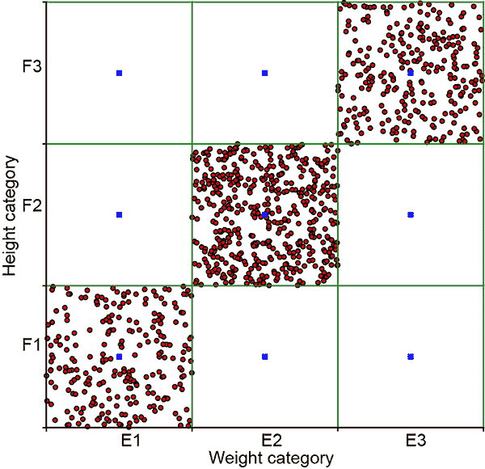

(b)

图 5.3 联合概率分布的图形可视化。矩形代表不同离散事件的桶。（a）来自表 5.5 的独立事件）。所有九个事件的概率都不是微不足道的，所有九个矩形都有相对较高的样本点集中度。不适合 PCA。（b）来自表 5.7（非独立事件）。事件(*E*[1]，*F*[1])、(*E*[2]，*F*[2])和(*E*[3]，*F*[3])的概率非常高，而其他事件的概率可以忽略不计。样本点集中在对角线上的矩形上。适合 PCA。

独立表 5.5 和非独立表 5.7 的联合变量对的点分布图分别显示在图 5.3a 和 5.3b 中。我们看到，独立事件的样本点分布在整个域上分布得相对对称，而相关事件的样本点分布则围绕特定的线条（在这种情况下，对角线）较窄。这在一般情况下以及更高维的情况下都成立。你应该对独立与非独立点分布有这种心理图景。如果我们采样独立事件（不相关），所有可能的事件组合（如{*E*[1], *G*[1]}，{*E*[1], *G*[2]}，{*E*[1], *G*[3]}，⋯，{*E*[3], *G*[3]}）都有非微不足道的发生概率（见表 5.5），这相当于说，没有任何事件有非常高的发生概率记住，概率总和为 1，所以如果某些事件有非常低的概率[接近零]，其他事件必须有高概率[接近一]来补偿）。这阻止了点在空间的小区域内集中。所有桶都将有许多点。换句话说，独立事件的联合概率样本在整个种群空间中扩散（例如，见图 5.3a）。

另一方面，如果事件是相关的，联合概率样本将集中在联合空间中某些高概率区域。例如，在表 5.7 中，事件(*E*[1], *F*[1])，(*E*[2], *F*[2])，(*E*[3], *F*[3])比其他组合更有可能。因此，样本点集中在相应的对角线上（见图 5.3b）。

如果这没有让你想起 PCA（第 4.4 节），你应该重新阅读那一节。如图 5.3a 所示的相关事件是降维的良好候选：两个维度本质上携带相同的信息，如果我们知道其中一个，我们就可以推导出另一个。我们可以去掉一个高度相关的维度，而不会丢失显著的信息。

## 5.6 连续随机变量和概率密度

到目前为止，我们已经将随机变量量化并使其离散化。例如，体重已经被量化为三个区间——小于 60 公斤、60 至 90 公斤之间，以及大于 90 公斤——并且每个区间都分配了概率。如果我们想了解更细粒度的概率，比如 0 至 10 公斤、10 至 20 公斤、20 至 30 公斤等等，怎么办？嗯，我们必须创建更多的区间。每个区间覆盖的值范围更窄（人口空间中更小的一部分），但数量更多。在所有情况下，遵循频率主义方法，我们计算每个区间中成年 Statsville 人的数量，将其除以总人口规模，并将这个值称为属于该区间的概率。

如果我们想要更细的粒度呢？我们创建更多的区间，每个区间覆盖的人口空间部分更小。在极限情况下，我们有一个无限多的区间，每个区间覆盖的人口空间部分无限小。它们共同覆盖了人口空间——大量非常小的部分可以覆盖任意区域。在这个极限情况下，概率分布函数被称为*概率密度函数*。正式地，

对于连续随机变量 *X* 的概率密度函数 *p*(*x*) 定义为 *X* 位于 *x* 和 *x* + *δx* 之间的概率，其中 *δx* → 0

*p*(*x*) = lim[*δx*→0] *概率*(*x* ≤ *X* < *x* + *δx*)

备注：有一点遗憾的是，随机变量 *X* 的典型符号与数据集（数据向量的集合）的符号也相同，即 *X*。但通常情况下，上下文足以区分它们。

这里有一点理论上的细微差别。我们说的是 *p*(*x*) 是随机变量 *X* 位于 *x* 和 *x* + *δx* 之间的概率。这并不完全等同于说 *p*(*x*) 是 *X* 等于 *x* 的概率。但由于 *δx* 无穷小，它们实际上是相同的东西。

考虑事件集 *E* = lim[*δx*→0] {*x* ≤ *X* < *x* + *δx*} 对所有可能的 *x* 值。所有可能的 *x* 值范围从负无穷大到无穷大：*x* ∈ [−∞,∞]。存在无限多个这样的事件，每个事件都非常窄，但共同覆盖了整个域 *x* ∈ [−∞,∞]。换句话说，它们是穷尽的。它们也是互斥的，因为 *x* 不能同时属于它们中的多个。它们是之前看到的离散事件 *E*[1]、*E*[2]、*E*[3] 的连续对应物。

在连续空间中，事件集 *E* = lim[*δx* → 0]{*x* ≤ *X* < *x* + *δx*} 的穷尽性和互斥性意味着我们可以应用方程式 5.3，但求和将被积分所取代，因为变量是连续的。

连续域中的求和规则表示为

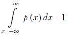

方程式 5.6

方程 5.6 是方程 5.3 的连续对应物。在物理上意味着我们可以肯定地说 *x* 位于区间 −∞ 到 ∞ 的某个地方。

随机变量也可以是多维的（即，一个向量）。那么概率密度函数表示为 *p*()。

连续多维概率密度函数的求和法则为


方程 5.7

其中 *D* 是  的定义域——即包含向量  所有可能值的空间。

例如，二维向量 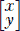 的定义域是 *XY* 平面。请注意，方程 5.7 中的积分是一个 *多维* 积分（例如，对于二维 ，它是 ∬![∈*D*] *p*() *d* = 1）。

注意：为了符号的简洁性，我们通常用一个单独的积分符号来表示多维积分。定义域中的向量符号（例如， ∈ *D*），以及 *d* 中的向量符号，都表示多个维度。

你可能还记得从初等积分微积分中，方程 5.6 对应于 *p*(*x*)（或 *p*()) 曲线下的面积。在更高维的情况下，方程 5.7 对应于 *p*() 超曲面下的体积。因此，*单变量概率密度曲线下的总面积总是 1*。在更高维的情况下，*多变量概率密度函数的超曲面下的体积总是 1*。

## 5.7 分布的性质：期望值、方差和协方差

在本章的开头，我们提到生成式机器学习模型通常是通过将一个已知家族的分布拟合到可用训练数据来开发的。因此，我们从已知家族中假设一个参数化分布，并估计最适合训练数据的精确参数。大多数分布家族都是用诸如均值、方差等直观属性来参数化的。理解这些概念及其几何意义对于理解基于它们的模型至关重要。

在本节中，我们解释了所有分布都通用的几个属性/参数。稍后，当我们讨论单个分布时，我们将它们与这些分布的参数联系起来。我们还展示了如何通过 PyTorch `distributions` 包编程地获取每个单个分布的这些值。

### 5.7.1 期望值（又称均值）

如果我们多次从给定的分布中抽取随机变量并取抽样值的平均值，我们期望得到什么值？平均值将更接近概率较高的值（因为这些在抽样中出现得更频繁）。如果我们抽样足够多次，对于给定的概率分布，这个平均值总是稳定到一个固定值，即该分布的*期望值*。

形式上，

给定一个离散分布 *D*，其中离散随机变量 *X* 可以从集合 {*x*[1], *x*[2],⋯, *x[n]*} 中取任何值，相应的概率为 {*p*(*x*[1]), *p*(*x*[2])⋯, *p*(*x[n]*)}，期望值由以下公式给出

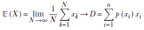

公式 5.8

其中 *x[k]* → *D* 表示从分布 *D* 中抽取的第 *k* 个样本。总体而言，方程 5.8 表示“从分布中抽取的大量样本的平均值或期望值趋近于所有可能样本值的概率加权和”。当我们抽样时，高概率值比低概率值出现得更频繁，所以大量样本的平均值被拉向高概率值。

对于多维随机变量：

给定一个离散分布，其中离散的多维随机变量 *X* 可以从集合 {[1], [2],⋯, *[n]*} 中取任何值，相应的概率为 {*p*([1]), *p*([2]),⋯, *p*(*[n]*)}，期望值由以下公式给出


公式 5.9

对于连续随机变量（注意求和被替换为积分）：

对于取值从 −∞ 到 ∞ 的连续随机变量 *X* 的期望值是

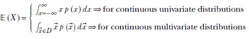

公式 5.10

物理学中的期望值和质心

在物理学中，我们有质量中心或形心的概念。如果我们有一组具有质量的点，整个点集可以被一个单独的点所代替。这个点被称为*形心*。形心的位置是各个点位置的加权平均值，权重为它们的各自质量。如果我们把单个点的概率视为质量，那么统计学中的期望值概念对应于物理学中的形心概念。

随机变量任意函数的期望值

到目前为止，我们已经看到了随机变量本身的期望值。这个概念可以扩展到随机变量的函数。

随机变量函数的期望值是该函数在随机变量所有可能值处的概率加权和。形式上，

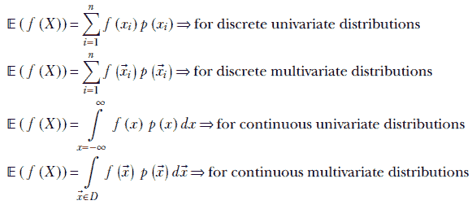

方程 5.11

期望值和点积

在方程 2.6 中，我们研究了两个向量之间的点积。进一步地，在第 2.5.6.2 节中，我们看到两个向量之间的点积衡量了这两个向量之间的协议。如果它们指向同一方向，点积就更大。在本节中，我们展示了随机变量的函数期望值可以看作是表示概率的向量和表示函数本身的向量的点积。

首先，让我们考虑离散情况。我们的随机变量可以取值 *x[i]*，*i* ∈ {1, *n*}。现在，想象一个向量 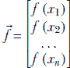 和一个向量 。从方程 5.11 中，我们看到随机变量 *X* 的函数期望值 𝔼(*f*(*X*)) 与 *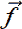^T* = ** ⋅  相同。当  和  对齐时，这个值会很高；因此，当随机变量的高函数值与高概率相一致时，随机变量的函数期望值就很高，反之亦然。在连续情况下，这些向量有无限多个分量，求和被积分所取代，但基本思想保持不变。

随机变量线性组合的期望值

期望值是一个线性算子。这意味着随机变量线性组合的期望值是随机变量期望值的线性组合（具有相同的权重）。形式上，

𝔼(*α*[1]*X*[1] + *α*[2]*X*[2] ⋯ *α[n]X[n]*) = *α*[1]𝔼(*X*[1]) + *α*[2]𝔼(*X*[2]) + ⋯ *α[n]*𝔼(*X[n]*)

方程 5.12

### 5.7.2 方差、协方差和标准差

当我们从给定的点分布中抽取大量样本时，我们通常想知道点集的分布范围。分布范围不仅仅是测量分布中两点之间最大距离的问题。相反，我们想知道点是如何紧密排列的。如果大多数点都适合在一个非常小的球内，那么即使一个或两个点离球很远，我们也称之为 *小分布* 或 *高包装密度*。

这在机器学习中为什么很重要？让我们从几个非正式的例子开始。如果我们发现点在单个点周围的一个小区域内紧密排列，我们可能想要用那个点替换整个分布，而不会造成很大的误差。或者如果点围绕一条直线紧密排列，我们可以用那条直线替换整个分布。这样做给我们提供了一个更简单的低维表示，并且通常会导致对数据的理解更加容易把握整体。这是因为围绕特定点或方向的微小变化通常是由噪声引起的，而大的变化是由有意义的事物引起的。通过消除小的变化并关注大的变化，我们捕捉到了主要的信息内容。（这可能是为什么老年人倾向于更好地形成整体观点的原因：也许他们头部的神经元太少，无法保留他们多年来积累的大量记忆数据。他们的大脑执行降维。）这是主成分分析（PCA）和降维的基本思想，我们在第 4.4 节中看到了这一点。

方差——或者其平方根，标准差——衡量分布中的点围绕期望值的密集程度：即点分布的分散程度。形式上，概率分布的方差定义为如下：

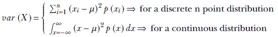

方程 5.13

通过比较方程 5.13 与方程 5.10 和 5.11，我们看到方差是样本点*x*与均值*μ*的距离(*x* − *μ*)²的期望值。所以如果更可能的（更频繁出现的）样本点位于均值附近的一个短距离内，方差就小，反之亦然。也就是说，方差衡量了点围绕均值的密集程度。

协方差：高维度的方差

将期望值的观念从单变量情况扩展到多变量情况是直接的。在单变量情况下，我们取一个标量量*ξ*的概率加权平均值。得到的期望值是一个标量，*μ* = ∫[*ξ* = −∞]^∞ *ξ* *p*(*ξ*)*d*ξ。在多变量情况下，我们取一个向量量的概率加权平均值。得到的期望值是一个向量， = ∫![∈*D*]  *p*()*d*.

将方差的观念扩展到多元情况并不简单。这是因为我们可以以无限多种可能的方向遍历多维随机向量的域（向量定义的空间）——想想在二维平面上我们可以走多少种可能的方向——并且每个方向上的分布或包装密度可能不同。例如，在图 5.3b 中，沿主对角线的分布范围远大于垂直方向的分布范围。

多维点分布的协方差是一个矩阵，它使我们能够轻松地测量任何所需方向上的分布或包装密度。它还使我们能够轻松地找出最大分布发生方向及其分布情况。

考虑一个取向量值的多元随机变量 *X*，其值为 。设 *l̂* 为一个任意方向（如往常一样，我们使用顶部的帽子表示表示方向的单位长度向量）来测量 *X* 的包装密度。我们在第 2.5.2 节和 2.5.6 节中讨论了在方向 *l̂* 上  的点积（即 *^Tl̂*) 是 *x* 沿 *l̂* 的投影或分量（有效值）。因此，随机向量  在方向 *l̂* 上的分布或包装密度与点积（也称为分量或投影）*l̂^T* 的分布相同。这个投影 *l̂^T* 是一个标量量：我们可以使用单变量公式来测量其方差。

注意：在此上下文中，我们可以将 *^Tl̂* 和 *l̂^T* 互换使用。点积是对称的。

投影的期望值是

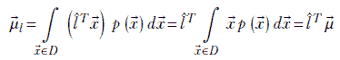

方差由


现在，由于标量的转置与标量本身相同，我们可以将积分内的平方项写成标量 *l̂^T*( - ) 和其转置的乘积：


使用方程 2.10，


由于


其中


方程 5.14

为了简化，我们省略括号中的 *X*，并简单地写成 ℂ(*X*) 为 ℂ。将一个取向量值的 *d*-维随机变量 *X* 的协方差矩阵视为如下是等效的：

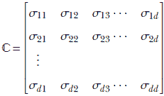

方程 5.15

其中

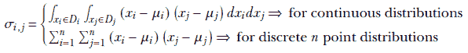

是随机向量  的第 *i* 个和第 *j* 个维度的协方差。

ℂ(*X*) 或 ℂ 是随机变量 *X* 的 *协方差矩阵*。稍加思考就可以发现方程 5.14 和 5.15 是等价的。

以下事项值得关注：

+   从方程 5.14 可以看出，ℂ 是由 *d* × 1 向量 (−) 和它们的转置 (−)*^T*，1 × *d* 向量的乘积之和。因此，ℂ 是一个 *d* × *d* 矩阵。

+   这个矩阵与我们在测量方差或扩散方向 *l̂* 无关。我们可以预先计算 ℂ；当我们需要测量任何方向 *l̂* 的方差时，我们可以评估二次型 *l̂^T* ℂ*l̂* 来获得该方向的方差。因此，ℂ 是分布的通用属性，就像 。ℂ 被称为分布的 *协方差*。

+   协方差是多变量方差的单变量对应物。

通过比较方程 5.13 和 5.14 的表达式，可以明显看出协方差是多变量方差的类比。

方差和期望值

如前所述，方差是样本点 *x* 与均值 *μ* 的距离 (*x* − *μ*)² 的期望值。通过比较方程 5.13，5.10 和 5.11，可以很容易地看出这一点，并导致以下公式（我们使用线性组合期望值原理）：

*var*(*X*) = 𝔼((*X* − *μ*)²) = 𝔼(*X*²) − 𝔼(2*μX*) + 𝔼(*μ*²)

由于 *μ* 是一个常数，我们可以将其从期望值中提取出来（这是线性组合期望值原理的一个特例）。因此，我们得到

*var*(*X*) = 𝔼(*X*²) − 2*μ*𝔼(*X*) + *μ*²𝔼(1)

但 *μ* = 𝔼(*X*). 此外，常数的期望值就是该常数。因此，𝔼(1) = 1。

因此，

*var*(*X*) = 𝔼(*X*²) − 2*μ*² + *μ*²𝔼(1) = 𝔼(*X*²) − *μ*²

或者

*var*(*X*) = 𝔼(*X*²) − 𝔼(*X*)²

方程 5.16

## 5.8 从分布中进行抽样

从随机变量的概率分布中抽取样本得到的是可能值集合中的一个任意值。如果我们抽取许多样本，高概率值出现的次数会比低概率值多。抽取的点在可能值的域中形成一个云，概率较高的区域比低概率区域更密集。换句话说，在样本点云中，高概率值被过度表示。因此，一组样本点通常被称为*样本点云*。当然，我们希望样本点云是整个群体的良好表示，这样分析云中的点就能对整个群体有洞察。在单变量情况下，样本值是一个标量，在数轴上表示为一个点。在多变量情况下，样本值是一个向量，在更高维度的空间中表示为一个点。

计算汇总统计量（如均值和方差）通常很有用，以描述群体。如果我们知道一个分布，我们可以使用闭式表达式来获得这些属性。许多标准分布及其均值和方差的闭式方程在 5.9 节中讨论。但通常，我们不知道潜在的分布。在这种情况下，可以使用样本均值和样本方差。给定一组*n*个样本*X* = [1]，[2]⋯*[n]*来自任何分布，样本均值和方差的计算如下


在某些情况下，例如高斯分布（我们将在稍后讨论），可以从理论上证明样本均值和方差是最佳的（给定样本数据对真实均值和方差的最好猜测）。此外，随着样本数量的增加，样本均值接近真实均值，并且随着样本数量的增加，我们得到对真实均值的良好近似。在下一小节中，我们将了解更多关于“足够”是多少的信息。

大数定律：需要多少样本才算足够？

非正式地说，大数定律表明，如果我们从一个概率分布中抽取大量样本值，它们的平均值应该接近分布的期望值。在极限情况下，无限多个样本的平均值将匹配均值。

在实践中，我们无法抽取无限数量的样本，因此不能保证样本均值会与期望值（真实均值）在现实生活中的抽样中一致。但如果样本数量很大，它们不会相差太远。这不仅仅是一个理论问题。赌场设计游戏，其中赌场赢得赌注的概率略高于客人赢得赌注的概率。结果的期望值是赌场赢而不是客人。在赌场进行的非常大量的赌注中，这正是发生的事情——这也是为什么赌场总体上赚钱，尽管他们可能会输掉个别赌注。

“大量样本”是多少个样本？这并没有一个精确的定义。但有一点是明确的：如果方差较大，就需要抽取更多的样本来使大数定律适用。

让我们用一个例子来说明这一点。考虑一个赌注游戏。假设著名的足球俱乐部巴塞罗那，出于未知的原因，同意与硅谷的机器学习专家足球俱乐部进行大量比赛。我们可以对一支球队下注 100 美元。如果该队获胜，我们将收回 200 美元：也就是说，我们赚了 100 美元。如果该队输掉比赛，我们将输掉赌注：也就是说，我们亏了 100 美元。这个赌注游戏发生在一个没有人了解这些俱乐部声誉的国家。一个赌徒在第一场比赛中下注巴塞罗那并赢得了 100 美元。基于这一观察，赌徒能否说通过下注巴塞罗那，他们每次都期望赢得 100 美元？显然不能。

但假设赌徒下了 100 次赌注，赢了 99 次 100 美元，输了 1 次 100 美元。现在赌徒可以有些信心地预期，通过下注巴塞罗那，他们将赢得 100 美元（或接近这个数字）。基于这些观察，对巴塞罗那投注的样本平均收益为 0.99 × (100) + 0.01 × (−100) = 98。样本标准差为√(.99 × (98 - 100)² + 0.01 × (98 - (-100))²) = 19.8997。相对于样本均值，样本标准差为 19.8997/98 = 0.203。

接下来，考虑同样的比赛，但现在巴塞罗那足球俱乐部正在对阵皇家马德里足球俱乐部。由于两队实力相当（巴塞罗那的理论胜率为 0.5），结果不再是单方面的。假设经过 100 场比赛，巴塞罗那赢得了 60 场，皇家马德里赢得了 40 场。对巴塞罗那投注的样本平均收益为 0.6 × (100) + 0.4 × (−100) = 20。样本标准差为√(.6 × (20 - 100)² + 0.4 × (20 - (-100))²) = 97.9795。相对于样本均值，样本标准差为 97.9795/20 = 4.89897。这个数字比之前的 0.203 大得多。在这种情况下，即使经过 100 次试验，赌徒也不能非常自信地预测预期的胜利是样本均值，即 20。

整体直觉如下：

如果我们取足够大的样本数量，它们的平均值将接近期望值。构成“足够大的”样本数量的确切定义尚不清楚。然而，方差（相对于均值）越大，所需的样本数量就越多。

## 5.9 一些著名的概率分布

在本节中，我们介绍了一些在深度学习中经常使用的概率分布和密度函数。我们将使用 PyTorch 代码片段来演示如何为每个分布设置、采样以及计算期望值、方差/协方差等属性。请注意以下内容：

+   在代码片段中，对于每个分布，我们使用

    +   PyTorch `distributions` 函数调用

    +   从公式中直接评估（为了理解数学）

    这两者应该得到相同的结果。在实际应用中，你应该使用 PyTorch 的 `distributions` 函数调用而不是原始公式。

+   在代码片段中，对于每个分布，

    +   我们使用 PyTorch 的 `distributions` 函数调用评估理论均值和方差。

    +   我们评估样本均值和方差。

    当样本集足够大时，样本均值和理论均值应该很接近。方差也是如此。

注意：这些分布的完整功能代码，可通过 Jupyter Notebook 执行，可以在 [`mng.bz/8NVg`](http://mng.bz/8NVg) 找到。

另一点需要记住的是：在机器学习中，我们经常处理概率的对数。由于流行的分布是指数分布，这导致计算更加简单。有了这个，让我们深入了解概率分布。

### 5.9.1 均匀随机分布

考虑一个连续随机变量 *x*，它可以取一个固定紧凑范围内的任何值，例如 [*a*，*b*]，*以相等的概率，而 x 取值在范围之外的几率是零*。相应的 *p*(*x*) 是一个均匀概率分布。形式上表述为，

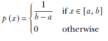

方程式 5.17

方程式 5.17 表示 *p*(*x*) 是常数，为 1/(b-a)，当 *x* 在 *a* 和 *b* 之间时，对于其他 *x* 的值则为零。注意常数的选择是如何巧妙地使得曲线下的总面积为 1。此方程在图 5.4 中以图形方式表示，列表 5.1 展示了 PyTorch 代码用于计算单变量均匀随机分布的对数概率。

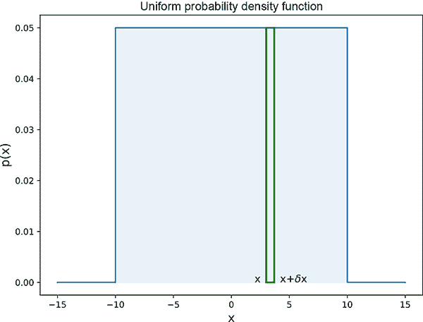

图 5.4 单变量（单变量）均匀随机概率密度函数。概率 *p*(*x*) 在区间 [−10,10] 内是常数，0.05，在其他所有地方都是零。因此，它描绘了方程 5.17 中 *b* = 10，*a* = −10 的情况。曲线下的面积是宽度为 20、高度为 0.05 的阴影矩形的面积，20 × 0.05 = 1。细长的矩形表示对应于事件 *E* = {*x* ≤ *X* < *x* + *δx*} 的无穷小区间。如果我们从这个分布中抽取一个随机样本 *x*，那么样本值在 4 和 4 + *δx* 之间的概率，当 *δx* → 0 时，是 *p*(4) = 0.05。样本值在 15 和 15 + *δx* 之间的概率，当 *δx* → 0 时，是 *p*(15) = 0。

列表 5.1 单变量均匀随机分布的对数概率

```py
from torch.distributions import Uniform                      ①

a = torch.tensor([1.0], dtype=torch.float)                   ②
b = torch.tensor([5.0], dtype=torch.float) 

ufm_dist = Uniform(a, b)                                     ③

X = torch.tensor([2.0], dtype=torch.float)                   ④

def raw_eval(X, a, b):
    return torch.log(1 / (b - a))

log_prob = ufm_dist.log_prob(X)                              ⑤

raw_eval_log_prob = raw_eval(X, a, b)                        ⑥

assert torch.isclose(log_prob, raw_eval_log_prob, atol=1e-4) ⑦
```

① 导入 PyTorch 均匀分布

② 设置分布参数

③ 实例化一个均匀分布对象

④ 实例化一个单点测试数据集

⑤ 使用 PyTorch 评估概率

⑥ 使用公式评估概率

⑦ 断言概率匹配

注意：完全功能的均匀分布代码，可通过 Jupyter Notebook 执行，可在[`mng.bz/E2Jr`](http://mng.bz/E2Jr)找到。

均匀分布的期望值

我们这样做是为了单变量情况，尽管计算可以很容易地扩展到多变量情况。将方程 5.17 中的概率密度函数代入连续变量的期望值表达式，方程 5.10，

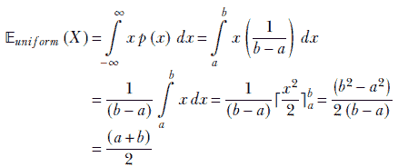

方程 5.18

注意：积分的极限改变了，因为 *p*(*x*) 在区间 [*a*, *b*] 外部为零。

总体而言，方程 5.18 与我们的直觉相符。期望值正好位于均匀区间的中间，如图 5.5 所示。

均匀分布的方差

如果我们看图 5.5，直观上很明显，样本的填充密度与矩形的宽度有关。宽度越小，填充越紧密，方差越小，反之亦然。让我们看看数学是否支持这种直觉：


方程 5.19


图 5.5 单变量（单变量）均匀随机概率密度函数。中间的实线表示期望值。交互式可视化（您可以更改参数并观察图形如何随之变化）可在[`mng.bz/E2Jr`](http://mng.bz/E2Jr)找到。

图 5.5 显示，方程 5.19 中的方差与矩形的宽度平方成正比：即，(*b* − *a*)²。

这里是 PyTorch 代码，用于计算均匀随机分布的均值和方差。

列表 5.2 均匀随机分布的均值和方差

```py
num_samples = 100000                              ①

    ②
samples  = ufm_dist.sample([num_samples])         ③

sample_mean = samples.mean()                      ④
dist_mean = ufm_dist.mean                         ⑤
assert torch.isclose(sample_mean, dist_mean, atol=0.2)

sample_var = ufm_dist.sample([num_samples]).var() ⑥
dist_var = ufm_dist.variance                      ⑦
assert torch.isclose(sample_var, dist_var, atol=0.2)
```

① 样本点数量

② 100000 × 1

③ 从在列表 5.1 中实例化的 ufm_dist 获取样本

④ 样本均值

⑤ 通过 PyTorch 函数计算均值

⑥ 样本方差

⑦ 通过 PyTorch 函数计算方差

多元均匀分布

均匀分布也可以是多元的。在这种情况下，随机变量是一个向量， 而不是一个单一值，而是一系列值）。其域是一个多维体积，而不是 *X* 轴，并且图形具有超过两个维度。例如，这是一个双变量均匀随机分布：


方程 5.20

在这里，(*x*, ) ∈ [*a*[1], *b*[1]] × [*a*[2], *b*[2]] 表示在二维 *XY* 平面上的一个矩形区域，其中 *x* 在 *a*[1] 和 *b*[1] 之间，而  在 *a*[2] 和 *b*[2] 之间。方程 5.20 在图 5.6 中以图形方式展示。在一般的多维情况下，：

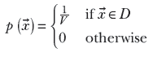

方程 5.21


图 5.6 双变量均匀随机概率密度 在域 (*x*, *y*) ∈ [−10,10] × [−10,10] 内，概率 *p*(*x*, *y*) 是常数，0.0025，而在区间之外的所有地方都是零。宽度为 20 × 20、高度为 0.0025 的盒子的体积为 20 * 20 * 0.0025 = 1。

在这里，*V* 是以 *D* 为底的超维盒子的体积。方程 5.21 表示 *p*() 在域 *D* 内对  是常数，而对于其他 *x* 的值则是零。当不为零时，它有一个常数值，即体积 *V* 的倒数：这使得密度函数下的总体积为 1。

### 5.9.2 高斯（正态）分布

这可能是世界上最著名的分布。让我们再次考虑 Statsville 成年居民的体重。如果 Statsville 像真正的城市一样，最可能的体重是大约 75 公斤：最大比例的人口将会有这个体重。接近这个值（比如 70 或 80 公斤）的体重也很可能，尽管比 75 公斤的可能性略低。远离 75 公斤的体重仍然不太可能，以此类推。我们离 75 公斤越远，具有该体重的百分比人口就越低。像 40 和 110 公斤这样的*异常值*不太可能。非正式地说，高斯概率密度函数看起来像一条*钟形曲线*。中心值具有最高的概率。当我们远离中心时，概率逐渐下降。然而，在理论上，它永远不会完全消失（函数*p*(*x*)永远不会等于 0），尽管对于所有实际目的来说，它几乎为零。这种行为在数学上被描述为*渐近趋于零*。图 5.7 显示了高斯概率密度函数。正式地，


方程式 5.22

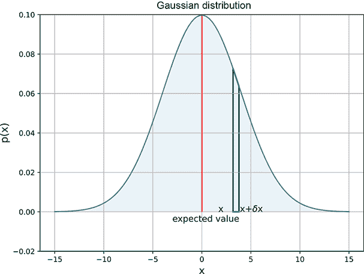

图 5.7 一元高斯随机概率密度函数，*μ* = 0 和 *σ* = 4。钟形曲线在中心最高，当我们远离中心时，曲线越来越低，渐近接近零。*x* = 0 的值具有最高的概率，对应于概率密度函数的中心。请注意，曲线是对称的。因此，例如，随机样本在-5 附近的概率与 5 的概率相同（0.04）：即*p*（-5）= *p*（5）= 0.04。一个交互式可视化（您可以更改参数并观察图形如何因此变化）可以在[`mng.bz/NYJX`](http://mng.bz/NYJX)找到。

在这里，*μ*和*σ*是参数；*μ*对应于中心（例如，在图 5.7 中，*μ* = 0）。参数*σ*控制钟形的宽度。较大的*σ*意味着当我们远离中心时，*p*(*x*)下降得更慢。

高斯（正态）概率密度函数非常流行，以至于我们有一个特殊的符号表示它：𝒩(*x*, *μ*, *σ*²)。可以证明（但这非常繁琐，所以我们在这里省略证明）：


这确立了𝒩(*x*;*μ*, *σ*²)是一个真正的概率（满足方程 5.7 中的求和规则）。

列表 5.3 一元正态分布的对数概率

```py
from torch.distributions import Normal        ①

mu = torch.tensor([0.0], dtype=torch.float)   ②
sigma = torch.tensor([5.0], dtype=torch.float)

uvn_dist = Normal(mu, sigma)                  ③

X = torch.tensor([0.0], dtype=torch.float)    ④

def raw_eval(X, mu, sigma):
    K = 1 / (math.sqrt(2 * math.pi) * sigma)
    E = math.exp( -1 * (X - mu) ** 2 * (1 / (2 * sigma ** 2)))
    return math.log(K * E)

log_prob = uvn_dist.log_prob(X)               ⑤
raw_eval_log_prob = raw_eval(X, mu, sigma)    ⑥
assert log_prob == raw_eval_log_prob          ⑦
```

① 导入 PyTorch 一元正态分布

② 设置分布参数

③ 实例化一个一元正态分布对象

④ 实例化一个单点测试数据集

⑤ 使用 PyTorch 评估概率

⑥ 使用公式评估概率

⑦ 断言概率匹配

注意：此正态分布的完整功能代码，可通过 Jupyter Notebook 执行，可在 [`mng.bz/NYJX`](http://mng.bz/NYJX) 找到。

多变量高斯

高斯分布也可以是多变量的。然后随机变量 *x* 是一个向量 ，如通常情况。参数 *μ* 也变成一个向量 ，参数 *σ* 变成矩阵 Σ。与单变量情况一样，这些参数与期望值和方差相关。高斯多变量概率分布函数是


方程式 5.23

方程 5.23 描述了随机向量  落在以点  为中心、尺寸为 *δ* 的无穷小体积内的概率密度函数。（想象一个边长为 *δ* 的微小长方体，其顶点在 。）向量  和矩阵 Σ 是参数。与单变量情况一样， 对应于随机向量的最可能值。图 5.8 展示了三维空间中两个变量的高斯正态分布）的形状由参数 Σ 控制。

列表 5.4 多变量正态分布的对数概率

```py
from torch.distributions import MultivariateNormal ①

mu = torch.tensor([0.0, 0.0], dtype=torch.float)   ②
C = torch.tensor([[5.0, 0.0], [0.0, 5.0]], dtype=torch.float)

mvn_dist = MultivariateNormal(mu, C)               ③

X = torch.tensor([0.0, 0.0], dtype=torch.float)    ④

def raw_eval(X, mu, C):
    K = (1 / (2 * math.pi * math.sqrt(C.det())))
    X_minus_mu = (X - mu).reshape(-1, 1)
    E1 = torch.matmul(X_minus_mu.T, C.inverse())
    E = math.exp(-1 / 2\. * torch.matmul(E1, X_minus_mu))
    return math.log(K * E)

log_prob = mvn_dist.log_prob(X)                    ⑤
raw_eval_log_prob = raw_eval(X, mu, C)             ⑥
assert log_prob == raw_eval_log_prob               ⑦
```

① 导入 PyTorch 多变量正态分布

② 设置分布参数

③ 实例化一个多变量正态分布对象

④ 实例化一个单点测试数据集

⑤ 使用 PyTorch 评估概率

⑥ 使用公式评估概率

⑦ 断言概率匹配

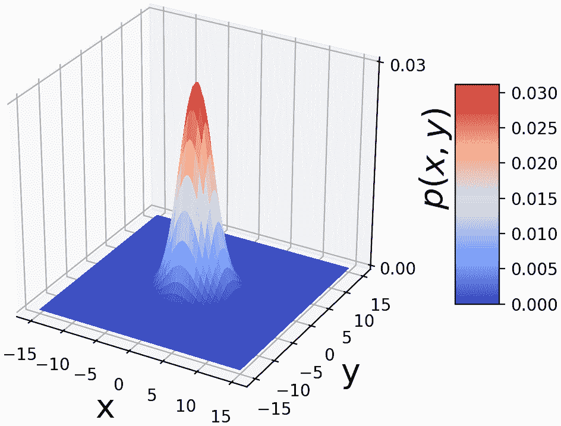

图 5.8 双变量高斯随机概率密度函数。它是一个钟形表面：在中心最高，随着我们远离中心而降低，趋于零。*x* = 0， = 0 的概率最高，对应于概率密度函数的中心。钟形有一个圆形底部，Σ 矩阵是单位矩阵 𝕀 的标量倍。一个交互式可视化（你可以更改参数并观察图形如何随之变化）可在 [`mng.bz/NYJX`](http://mng.bz/NYJX) 找到。

高斯分布的期望值

将方程 5.22 中的概率密度函数代入连续变量的期望值表达式，即方程 5.10，我们得到


代入 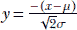


将 *u* = *y*² 和方程 5.6 代入

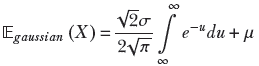

注意到第一个项中的积分的极限是相同的。这是因为无论 *y* → ∞ 还是 *y* → −∞，*u* = *y*² →∞。但是具有相同上下限的积分是零。因此，第一个项是零。因此，

𝔼*[高斯]*(*X*) = *μ*

方程 5.24

直观上看，这是完全合理的。概率密度  在 *x* = *μ* 处达到峰值（最大化）。在这个 *x* 处，指数变为零，使得  达到其最大可能值 1。这正好在钟形曲线的中间，如图 5.10 所示。当然，如果密度是对称的并且在中间达到峰值，期望值与中间值相同。类似地，在多元情况下，多维高斯随机变量 *X* 在 *d*-维域 ℝ*^d*（即  ∈ ℝ*^d*）中取向量值 ，其期望值为

𝔼*[高斯]*(*X*) = 

方程 5.25

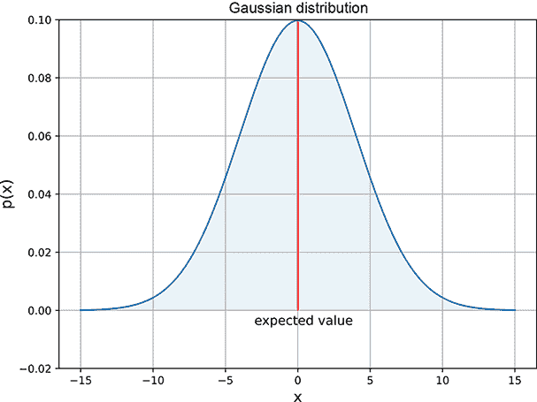

图 5.9 单变量（单变量）正态（高斯）随机概率密度函数，*μ* = 0 和 *σ* = 4。中间的实线表示期望值。

高斯分布的方差

通过将方程 5.22 代入方程 5.13 的积分形式来获得高斯分布的方差。数学推导在书的附录中展示；这里我们只陈述结果。

高斯分布的概率密度函数 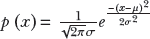 的方差是 *σ*²，标准差是它的平方根（*σ*）。这在直观上是合理的。*σ* 出现在概率密度函数 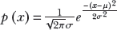 表达式中的负指数的分母中。因此，*p*(*x*) 是 *σ* 的增函数：也就是说，对于给定的 *x* 和 *μ*，较大的 *σ* 意味着较大的 *p*(*x*)。换句话说，较大的 *σ* 意味着当我们远离中心时，概率衰减得更慢：更宽的钟形曲线，更大的分散，因此更大的方差。图 5.10 展示了这一点。


(a) 不同的 *μ* 但相同的 *σ*。


(b) 相同的 *μ* 但不同的 *σ*。

图 5.10 变化的 *μ* 和 *σ* 的高斯密度。改变 *μ* 会移动曲线的中心。较大的 *σ*（方差）意味着更宽的钟形曲线⇒更分散。请注意，由于曲线下的总面积必须为 1，因此较宽的曲线高度较小。

列表 5.5 单变量高斯的均值和方差

```py
num_samples = 100000                              ①

    ②
samples  = uvn_dist.sample([num_samples])         ③

sample_mean = samples.mean()                      ④
dist_mean = uvn_dist.mean                         ⑤
assert torch.isclose(sample_mean, dist_mean, atol=0.1)

sample_var = uvn_dist.sample([num_samples]).var() ⑥
dist_var = uvn_dist.variance                      ⑦
assert torch.isclose(sample_var, dist_var, atol=0.1)
```

① 样本点数量

② 100000 × 1

③ 从 uvn_dist 获取样本

在列表 5.3 中实例化

④ 样本均值

⑤ 通过 PyTorch 函数计算均值

⑥ 样本方差

⑦ 通过 PyTorch 函数计算方差

多元高斯分布的协方差和钟形表面的几何形状

将单变量高斯概率密度方程 5.22 与多元高斯概率密度方程 5.23 进行比较，我们直观地感觉到矩阵 Σ 是单变量方差 *σ*² 的多元对应物。确实如此。形式上，对于在方程 5.23 中给出的多元高斯随机变量概率分布，协方差矩阵由以下方程给出

ℂ*[gaussian]*(*X*) = **Σ**

方程 5.26

如表 5.11 所示，Σ 规定了钟形概率密度函数底部的形状。

很容易看出，方程 5.23 中的指数是一个二次型（在第 4.2 节中介绍）。因此，它定义了一个超椭圆，如图 5.11 和第 2.17 节所示。所有二次型和超椭圆的性质都适用于这里。

列表 5.6 多元正态分布的均值和方差

```py
num_samples = 100000                              ①

    ②
samples  = mvn_dist.sample([num_samples])         ③

sample_mean = samples.mean()                      ④
dist_mean = mvn_dist.mean                         ⑤
assert torch.allclose(sample_mean, dist_mean, atol=1e-1)

sample_var = mvn_dist.sample([num_samples]).var() ⑥
dist_var = mvn_dist.variance                      ⑦
assert torch.allclose(sample_var, dist_var, atol=1e-1)
```

① 样本点数量

② 100000 × 1

③ 从 uvn_dist 获取样本

在列表 5.4 中实例化

④ 样本均值

⑤ 通过 PyTorch 函数计算均值

⑥ 样本方差

⑦ 通过 PyTorch 函数计算方差

让我们看看高斯协方差矩阵 Σ 的几何性质。考虑方程 5.23 的二维版本。我们重写 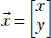 和 ——两个二维向量。还有 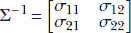——一个 2 × 2 矩阵。方程 5.23 的概率密度函数变为


方程 5.27

（使用你在第三章中学到的知识，让自己确信方程 5.27 是方程 5.23 的二维类似物。）

如果我们将表面 *p*(*x*, *y*) 对 (*x*, *y*) 进行绘图，在三维空间中看起来像一个钟形。钟形底部的形状，在 (*x*, *y*) 平面上，由 2 × 2 矩阵 Σ 控制。特别是，

+   如果 Σ 是一个对角矩阵，其对角线元素相等，那么钟形在所有方向上都是对称的，其底部是圆形的。

+   如果 Σ 是一个对角矩阵，其对角线元素不相等，那么钟形曲线的底部是椭圆形的。椭圆的轴与坐标轴对齐。

+   对于一个一般的 Σ 矩阵，钟形底部的形状是椭圆形的。椭圆的轴不一定与坐标轴对齐。

+   Σ 的特征向量给出了钟形表面椭圆底部的轴线。

现在，如果我们从方程 5.27 中采样分布，我们将在图 5.8 所示表面的基平面上得到一组点 (*x*, *y*)。表面在点 (*x*, *y*) 处的 *z* 坐标（表示 *p*(*x*, *y*)）越高，它被选中的概率就越大。如果我们绘制大量样本，相应的点云将或多或少地类似于钟形表面的底部。

图 5.11 展示了由不同协方差矩阵 Σ 生成的各种点云。将其与图 5.10 进行比较。

样本点云的几何：协方差和最大或最小分散度的方向

我们已经看到，如果一个多元分布有一个协方差矩阵 ℂ，它在任何特定方向 *l̂* 上的方差（分散度）是 *l̂^T* ℂ*l̂*。那么最大分散度的方向是什么？

提出这个问题等同于问“哪个方向 *l̂* 最大化了二次型 *l̂^T* ℂ*l̂*？”在 4.2 节中，我们了解到，当方向 *l̂* 与矩阵 ℂ 的最大或最小特征值对应的特征向量对齐时，这种二次型会被最大化或最小化。因此，*分布的最大分散度发生在协方差矩阵对应最大特征值的特征向量上*。这导致了 4.4 节中的 PCA 技术。

接下来，我们将讨论高斯分布的协方差以及由多次采样多元高斯分布形成的点云的几何形状。你可能想看看图 5.11，它展示了由不同协方差矩阵 Σ 生成的各种点云。


(a) 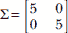


(b) 

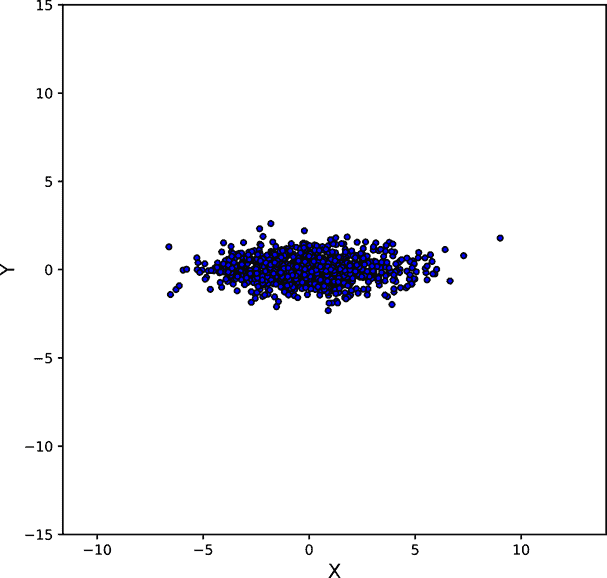

(c) 


(d) 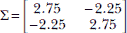

图 5.11 由具有相同的 = [0,0]*^T*但不同的Σs 采样的多元高斯分布形成的点云。这些点云对应于多元高斯概率密度的钟形曲线的底部。除了(a)之外的所有点云在旋转后可以替换为一个一元高斯分布，以使坐标轴与Σ的特征向量对齐（降维）。有关详细信息，请参阅第 4.4、4.5 和 4.6 节。可以在[`mng.bz/NYJX`](http://mng.bz/NYJX)找到钟形曲线底部的交互式等高线图。

多元高斯点云和超椭圆

方程 5.23 中指数项的分子 (−)*^T***Σ**^(−1)(−)，正如我们在第 4.2 节中讨论的那样，是一个二次型。这也应该让你想起我们在第 2.17 节中看到的超椭圆，方程 2.33 和方程 4.1。

现在考虑*p*()与的图像。这是*n* + 1 维空间中的一个超曲面，其中随机变量是*n*-维的。例如，如果随机高斯变量是 2D 的，那么(, *p*())在 3D 中的图像如图 5.8 所示。这是一个钟形表面。方程 5.23 中概率密度函数分子对应的二次型决定了这个钟形底部的形状和大小。

如果矩阵Σ是对角线（具有相等的对角线元素），则底部是*圆形*的——这是图 5.8 中显示的特殊情况。否则，钟形的底部是椭圆形的。协方差矩阵Σ的特征向量对应于椭圆形底部的轴的方向。特征值对应于轴的长度。

### 5.9.3 二项分布

假设我们有一个包含人物照片的数据库。此外，假设我们知道其中 20%的照片包含名人，而剩余的 80%则不包含。如果我们从这个数据库中随机选取三张照片，那么其中两张包含名人的概率是多少？这正是二项分布所处理的问题类型。

在以计算机视觉为中心的机器学习设置中，我们可能会检查选定的照片并尝试预测它们是否包含名人。但到目前为止，让我们将注意力限制在更简单的任务上，即盲目地从汇总统计数据中预测概率。

如果我们选择一张照片，它包含名人的概率是*π* = 0.2。

NOTE 这与表示圆周与直径比的自然数*π*无关。我们只是遵循流行惯例重新使用符号*π*。

照片不包含名人的概率是 1 − *π* = 0.8。从那可以计算出，例如，前两张样本照片包含名人但最后一张包含非名人的概率：即事件{*S*, *S*, *F*}（其中 S 表示找到名人的成功，F 表示找到名人的失败）。使用方程 5.4，事件{*S*, *S*, *F*}的概率是*π* × *π* × (1−*π*) = 0.2 × 0.2 × 0.8。然而，还有许多其他可能的组合。

在三次试验中可能出现的所有组合都显示在表 5.8 中。在表中，事件 ID 3、5 和 6 对应于两次成功和一次失败。它们发生的概率分别为 0.8 × 0.2 × 0.2、0.2 × 0.8 × 0.2 和 0.2 × 0.2 × 0.8。如果其中任何一个发生，我们在三次试验中就有两张名人照片。因此，使用方程 5.3，在三次试验中选出两张名人照片的整体概率是这些事件概率的总和：0.8 × 0.2 × 0.2 + 0.2 × 0.8 × 0.2 + 0.2 × 0.2 × 0.8 = 0.096。

表 5.8 三次试验的所有可能组合

| 事件 ID | 事件 | 概率 |
| --- | --- | --- |
| 0 | {*F*, *F*, *F*} | (1−*π*) × (1−*π*) × (1−*π*) = 0.8 × 0.8 × 0.8 |
| 1 | {*F*, *F*, *S*} | (1−*π*) × (1−*π*) × *π* = 0.8 × 0.8 × 0.2 |
| 2 | {*F*, *S*, *F*} | (1−*π*) × *π* × (1−*π*) = 0.8 × 0.2 × 0.8 |
| 3 | {*F*, *S*, *S*} | (1−*π*) × *π* × *π* = 0.8 × 0.2 × 0.2 |
| 4 | {*S*, *F*, *F*} | *π* × (1−*π*) × (1−*π*) = 0.2 × 0.8 × 0.8 |
| 5 | {*S*, *F*, *S*} | *π* × (1−*π*) × *π* = 0.2 × 0.8 × 0.2 |
| 6 | {*S*, *S*, *F*} | *π* × *π* × (1−*π*) = 0.2 × 0.2 × 0.8 |
| 7 | {*S*, *S*, *S*} | *π* × *π* × *π* = 0.2 × 0.2 × 0.2 |

在一般情况下，当试验次数超过三次时，列举所有可能的*成功*和*失败*组合将变得极其繁琐，这些组合可能发生在一组*n*次试验中。幸运的是，我们可以推导出一个公式。但在做那之前，让我们用更广泛的方式来表述二项分布的任务：

给定一个过程，在任意一次试验中都有二元结果（成功或失败），并且给定成功的概率在试验中是一个已知的常数（比如说，*π*），二项分布处理的是在*n*次试验中观察到*k*次成功的概率。

想象有 *n* 个连续事件，其中每个单独的事件可以是 *S* 或 *F*。表 5.8 显示了 *n* = 3 的此类事件。每个项目有两个可能值 (*S* 或 *F*)，并且有 *n* 个项目。因此，总共可以有 2 × 2 × ⋯2 = 2*^n* 个可能的事件。

我们只对发生 *k* 次事件 *S*（因此发生 (*n* − *k*) 次事件 *F*）的事件感兴趣。在 *n* 个事件中有多少是这样的？好吧，问这个问题等同于问有多少种方式可以从总共 *n* 个可能的槽位中选择 *k* 个槽位。以另一种方式提出相同的问题可以是，“有多少种不同的 *n* 个项目的排列方式，其中每个项目是 *S* 或 *F*，且 *S* 的总数是 *k*？” 从组合理论中，答案是

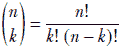

每个事件都有 *π^k* × (1−*π*)^(*n* − *k*) 的概率。因此，在 *n* 次试验中成功 *k* 次的整体概率是 。

形式上，如果 *X* 是一个表示 *n* 次试验中成功次数的随机变量，且每次试验成功的概率是某个常数 *π*，

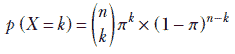

方程 5.28

*k* 可以取哪些值？当然，在 *n* 次试验中，我们不可能有超过 *n* 次的成功；因此，*k* 的最大可能值是 *n*。所有介于 0 和 *n* 之间的整数值都是可能的：


右侧是 (*a* + *b*)*^n* 的著名二项式展开的通项公式，其中 *a* = *π*，*b* = 1 − *π*。因此，我们得到


方程 5.29

这与直觉相符，因为给定 *n*，*k* 只能取 0，1，⋯，*n* 的值；方程 5.29 左侧概率之和对应于某个概率为 1 的特定事件。

此外，将 *n* = 3，*k* = 2，和 *π* = 0.2 代入方程 5.28 得到 3!/2!1! (0.2)², (0.8)^(3-2) = 0.096：这正是我们从显式枚举中得到的结果。

列表 5.7 二项式分布的对数概率

```py
from torch.distributions import Binomial                     ①

num_trials = 3                                               ②
p = torch.tensor([0.2], dtype=torch.float)

binom_dist = Binomial(num_trials, probs=p)                   ③

X = torch.tensor([1], dtype=torch.float)                     ④

def nCk(n, k):
    f = math.factorial
    return f(n) * 1\. / (f(k) * f(n-k))

def raw_eval(X, n, p):
    result = nCk(n, X) * (p ** X) * (1 - p) ** (n - X)
    return torch.log(result)

log_prob = binom_dist.log_prob(X)                            ⑤
raw_eval_log_prob = raw_eval(X, num_trials, p)               ⑥
assert torch.isclose(log_prob, raw_eval_log_prob, atol=1e-4) ⑦
```

导入 PyTorch 二项式分布

设置分布参数

实例化一个二项式分布对象

实例化一个单点测试数据集

使用 PyTorch 评估概率

使用公式评估概率

断言概率匹配

注意：二项式分布的完整功能代码，可通过 Jupyter Notebook 执行，可在 [`mng.bz/DRJ0`](http://mng.bz/DRJ0) 找到。

二项式分布的期望值

我们已经看到，二项式分布处理一个随机变量 *X*，它描述了 *n* 次试验中的成功次数，其中每次试验成功的概率是一个常数 *π*（再次强调，这与表示圆周与直径比值的 *π* 没有关系）。这个 *X* 可以取任何介于 0 到 *n* 之间的整数值。因此，

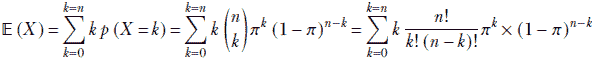

我们可以省略第一个项，它有乘数 *k* = 0。因此我们得到

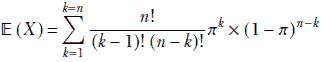

我们可以分解 *n*! = *n*(*n* − 1)! 和 *π^k* = *π* *π*^(*k* − 1)。同时，*n* − *k* = (*n* − 1) − (*k* − 1)。这给我们

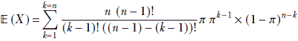

用 *j* 替换 *k* - 1，用 *m* 替换 *n* - 1，我们得到

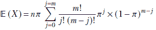

方程式 5.30

求和式中的量与方程 5.29 中的量类似（应求和为 1）。这使我们得到

𝔼*[binomial]* (*X*) = *nπ*

方程式 5.31

方程式 5.31 表示，如果 *π* 是单次试验成功的概率，那么在 *n* 次试验中成功的期望次数是 *n**π*。例如，如果单次试验成功的概率是 0.2，那么 100 次试验中成功的期望次数是 20——这几乎是直观的。

二项分布的方差

描述在 *n* 次试验中成功的次数的二项随机变量的方差，其中每次试验成功的概率是一个常数 *π* 是

*var[binomial]* = *nπ* (1 − *π*)

方程式 5.32

证明遵循与期望值相同的步骤。

列表 5.8 二项分布的均值和方差

```py
num_samples = 100000                                ①

   ②
samples  = binom_dist.sample([num_samples])         ③

sample_mean = samples.mean()                        ④
dist_mean = binom_dist.mean                         ⑤
assert torch.isclose(sample_mean, dist_mean, atol=0.2)

sample_var = binom_dist.sample([num_samples]).var() ⑥
dist_var = binom_dist.variance                      ⑦
assert torch.isclose(sample_var, dist_var, atol=0.2)
```

① 样本点数量

② 100000 × 1

③ 从在列表 5.7 中实例化的 ufm_dist 获取样本

④ 样本均值

⑤ 通过 PyTorch 函数计算均值

⑥ 样本方差

⑦ 通过 PyTorch 函数计算方差

### 5.9.4 多项分布

再次考虑我们在 5.9.3 节中讨论的例子问题。我们有一个人的照片数据库。但不是两个类别，名人和非名人，我们有四个类别：

+   阿尔伯特·爱因斯坦的照片（第 1 类）：照片的 10%

+   居里夫人的照片（第 2 类）：照片的 42%

+   高斯的照片（第 3 类）：照片的 4%

+   其他照片（第 4 类）：照片的 44%

如果我们从数据库中随机选择一张照片（即进行随机试验），

+   选择第 1 类（选择爱因斯坦照片）的概率是 *π*[1] = 0.1。

+   选择第 2 类（选择居里夫人照片）的概率是 *π*[2] = 0.42。

+   选择第 3 类（选择高斯照片）的概率是 *π*[3] = 0.04。

+   选择第 4 类（选择上述任一照片）的概率是 *π*[4] = 0.44。

注意到 *π*[1] + *π*[2] + *π*[3] + *π*[4] = 1。这是因为这些类别是相互排斥且穷尽的，所以每个试验中恰好有一个这样的类别发生。

基于所有这些，让我们提出问题：“在 10 次随机试验中，第 1 类发生 1 次，第 2 类发生 2 次，第 3 类发生 1 次，第 4 类发生剩余的 6 次，这种概率是多少？”这就是多项分布处理的问题。

形式上，

+   设 *C*[1]，*C*[2]，⋯，*C[m]* 是一组 *m* 个类别，使得在任何随机试验中，恰好选择这些类别中的一个，相应的概率为 *π*[1]，*π*[2]，⋯，*π[m]*。

+   设 *X*[1]，*X*[2]，⋯，*X[m]* 为一组随机变量。*X[i]* 对应于在 *n* 次试验中类别 *C[i]* 发生的次数。

+   然后是描述选择类别 *C*[1] 被选中 *k*[1] 次，类别 *C*[2] 被选中 *k*[2] 次，类别 *C*[3] 被选中 *k[m]* 次的多项式概率函数是

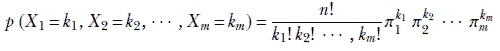

方程 5.33

其中


我们可以验证，对于 *m* = 2，这变成了二项分布（方程 5.28）。一个值得注意的点是，如果我们单独查看 *m* 个变量 *X*[1]，*X*[2]，⋯，*X[m]* 中的任何一个，它的分布是二项分布。

让我们计算我们开始时的示例的最终概率：在一个包含 10 次随机试验的集合中，类别 1 发生 1 次，类别 2 发生 2 次，类别 3 发生 1 次，类别 4 发生剩余的 6 次。这是

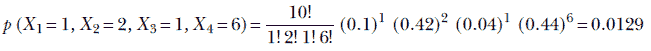

列表 5.9 多项分布的对数概率

```py
from torch.distributions import Multinomial                  ①

num_trials = 10                                              ②
P = torch.tensor([0.1, 0.42, 0.04, 0.44], dtype=torch.float)

multinom_dist = Multinomial(num_trials, probs=P)             ③

X = torch.tensor([1, 2, 1, 6], dtype=torch.float)            ④

def raw_eval(X, n, P):
    f = math.factorial
    result = f(n)
    for p, x in zip(P, X):
        result *= (p ** x) / f(x)
    return math.log(result)

log_prob = multinom_dist.log_prob(X)                         ⑤
raw_eval_log_prob = raw_eval(X, num_trials, P)               ⑥
assert torch.isclose(log_prob, raw_eval_log_prob, atol=1e-4) ⑦
```

① 导入 PyTorch 多项分布

② 设置分布参数

③ 实例化多项分布对象

④ 实例化单个测试数据集

⑤ 使用 PyTorch 评估概率

⑥ 使用公式评估概率

⑦ 断言概率匹配

注意：完全功能的关于多项分布的代码，可通过 Jupyter Notebook 执行，可以在 [`mng.bz/l1gz`](http://mng.bz/l1gz) 找到。

多项分布的期望值

每个随机变量 *X*[1]，*X*[2]，⋯，*X[m]* 分别服从二项分布。因此，根据方程 5.31 中的二项分布期望值公式，

𝔼*[multinomial]*(*X[i]*) = *nπ[i]*

方程 5.34

多项分布的方差

随机变量 *X*[1]，*X*[2]，⋯，*X[m]* 的变化，根据方程 5.32 中的二项分布方差公式，是

*var[multinomial]*(*X[i]*) = *nπ[i]*(1−*π[i]*)

方程 5.35

如果每个 *X*[1]，*X*[2]，⋯，*X[m]* 是一个标量，那么我们可以将一个随机向量  考虑在内。这样一个随机变量的期望值是


并且协方差是


方程 5.36

其中对角线项类似于二项方差 *σ[ii]* = *nπ[i]*(1−*π[i]*) ∀*i* ∈ [1, *m*] 和非对角线项是 *σ[ij]* = −*nπ[i]π[j]* ∀(*i*, *j*) ∈ [1, *m*] × [1, *m*]。对角线中的交叉协方差项是负的，因为一个元素的增加意味着其他元素的减少。

列表 5.10 多项分布的均值和方差

```py
num_samples = 100000                                         ①

   ②
samples = multinom_dist.sample([num_samples])                ③

sample_mean = samples.mean(axis=0)                           ④
dist_mean = multinom_dist.mean                               ⑤
assert torch.allclose(sample_mean, dist_mean, atol=0.2)

sample_var = multinom_dist.sample([num_samples]).var(axis=0) ⑥
dist_var = multinom_dist.variance                            ⑦
assert torch.allclose(sample_var, dist_var, atol=0.2)
```

① 样本点数

② 100000 × 1

③ 从列表 5.9 中实例化的 ufm_dist 获取样本

④ 样本均值

⑤ 通过 PyTorch 函数计算均值

⑥ 样本方差

⑦ 通过 PyTorch 函数计算方差

### 5.9.5 伯努利分布

伯努利分布是二项分布的一种特殊情况，其中 *n* = 1：也就是说，只进行一次成功或失败试验。成功的概率是 *π*，失败的概率是 1 − *π*。

换句话说，让 *X* 是一个离散随机变量，以概率 *π* 取值为 1（成功），以概率 1 − *π* 取值为 0（失败）。*X* 的分布是伯努利分布：

*p*(*X* = 1) = *π*

*p*(*X* = 0) = 1 - *π*

列表 5.11 伯努利分布的对数概率

```py
from torch.distributions import Bernoulli                    ①

p = torch.tensor([0.3], dtype=torch.float)                   ②

bern_dist = Bernoulli(p)                                     ③
X = torch.tensor([1], dtype=torch.float)                     ④
def raw_eval(X, p):
    prob = p if X == 1 else 1-p
    return math.log(prob)

log_prob = bern_dist.log_prob(X)                             ⑤
raw_eval_log_prob = raw_eval(X, p)                           ⑥
assert torch.isclose(log_prob, raw_eval_log_prob, atol=1e-4) ⑦
```

① 导入 PyTorch 伯努利分布

② 设置分布参数

③ 实例化伯努利分布对象

④ 实例化一个单点测试数据集

⑤ 使用 PyTorch 计算概率

⑥ 使用公式计算概率

⑦ 断言概率匹配

注意：完全功能的伯努利分布代码，可通过 Jupyter Notebook 执行，可以在 [`mng.bz/BRwq`](http://mng.bz/BRwq) 找到。

伯努利分布的期望值

如果只有两个类别，*成功* 和 *失败*，我们无法直接谈论期望值。如果我们进行，比如说，100 次试验，得到 30 *成功* 和 70 *失败*，平均是 0.3 *成功*，这不是一个有效结果。在这个二元系统中，我们不能有分数的 *成功* 或 *失败*。

然而，如果我们引入一个人工构造，我们仍然可以讨论伯努利分布的期望值。我们给这些二元实体分配数值：*成功* = 1 和 *失败* = 0。那么 *X* 的期望值是

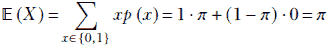

方程式 5.37

伯努利分布的方差

同样，如果我们给这些二元实体分配数值—*成功* = 1 和 *失败* = 0—伯努利分布的方差是


方程式 5.38

列表 5.12 伯努利分布的均值和方差

```py
num_samples = 100000                               ①

   ②
samples = bern_dist.sample([num_samples])          ③

sample_mean = samples.mean()                       ④
dist_mean = bern_dist.mean                         ⑤
assert torch.isclose(sample_mean, dist_mean, atol=0.2)

sample_var = bern_dist.sample([num_samples]).var() ⑥
dist_var = bern_dist.variance                      ⑦
assert torch.isclose(sample_var, dist_var, atol=0.2)
```

① 样本点数量

② 100000 × 1

③ 从列表 5.11 中实例化的 ufm_dist 获取样本

④ 样本均值

⑤ 通过 PyTorch 函数计算均值

⑥ 样本方差

⑦ 通过 PyTorch 函数计算方差

### 5.9.6 分类分布和 one-hot 向量

再次考虑第 5.9.4 节中引入的示例问题。我们有一个包含四个类别照片的数据库：

+   阿尔伯特·爱因斯坦的照片（类别 1）：10%

+   玛丽·居里的照片（类别 2）：42%

+   卡尔·弗里德里希·高斯的照片（类别 3）：4%

+   其他照片（类别 4）：44%

如果我们从数据库中随机选择一张照片，

+   选择类别 1 的概率是 *π*[1] = 0.1。

+   选择类别 2 的概率是 *π*[2] = 0.42。

+   选择类别 3 的概率是 *π*[3] = 0.04。

+   选择类别 4 的概率是 *π*[4] = 0.44。

如前所述，*π*[1] + *π*[2] + *π*[3] + *π*[4] = 1，因为类别是互斥且穷尽的，所以每个试验中恰好只有一个类别发生。

在多项分布中，我们进行了*n*次试验，询问每个特定类别会发生多少次。如果我们只进行一次试验呢？那么我们就得到了类别分布。

类别分布是多项分布的特殊情况（试验次数*n* = 1）。它也是伯努利分布的扩展，其中我们不仅仅有两个类别，即*成功*和*失败*，我们可以有任意数量的类别。

形式上，

+   设 *C*[1], *C*[2], ⋯, *C[m]* 是一组*m*个类别，在任意随机试验中，恰好选择这些类别中的一个，相应的概率为*π*[1], *π*[2], ⋯, *π[m]*。我们有时将所有类别的概率一起称为向量 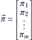

+   设 *X*[1], *X*[2], ⋯, *X[m]* 是一组随机变量。*X[i]*对应于在*n*次试验中类别*C[i]*出现的次数。

+   然后，类别概率函数描述了在单次试验中每个类别*C*[1], *C*[2]，等等的概率。

独热向量

我们可以使用独热向量紧凑地表达类别分布的单次试验结果。这是一个有*m*个元素的向量。恰好有一个元素是 1；所有其他元素都是 0。1 表示在特定试验中发生了*m*个可能类别中的哪一个。例如，在照片数据库的例子中，如果某个特定的试验中出现了一张玛丽·居里的照片，相应的独热向量是 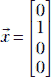。

类别分布的概率

我们可以将独热向量*X*视为具有类别分布的随机变量。请注意，每个单独的类别遵循伯努利分布。类别*C[i]*在任意给定试验中发生的概率是

*p*(*C[i]*) = *π[i]*

我们可以紧凑地表达所有类别的概率分布

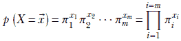

方程式 5.39

其中  是一个独热向量。请注意，方程式 5.39 中的所有幂次除了一个都是 0；因此相应的因子评估为 1。剩余的幂次是 1。因此，整体概率总是评估为*π[i]*，其中*i*是试验中发生的类别的索引。

类别分布的期望值

由于我们正在讨论类别，期望值和方差在这个上下文中没有意义。我们遇到了类似的情况，即伯努利分布。我们为每个类别分配了数值，并人为地定义了期望值和方差。类似的思路也可以应用在这里：我们可以讨论独热向量的期望值和方差（该向量由数值 0 和 1 组成）。但这仍然是一个人为的结构。

给定一个随机变量 *X*，其实例是遵循具有 *m* 个类别及其相应概率 *π*[1]、*π*[2]、⋯、*π[m]* 的分类分布的单热向量 ，

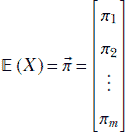

方程 5.40

我们省略了分类分布的方差。

## 摘要

在本章中，我们首先从机器学习的角度探讨了概率和统计学。我们还介绍了 PyTorch `distributions` 包，并在数学之后立即用 PyTorch `distributions` 代码示例说明了每个概念。

+   特定事件类型的概率被定义为所有可能事件总体中该特定类型事件所占的比例。

+   随机变量是一个可以取预定义的可能值范围内的任何值的变量。随机变量可以是离散的或连续的。与离散随机变量取特定值相关联的概率。与连续随机变量在特定值附近的无限小范围内的值相关联的概率，称为该值的概率密度。

+   概率的加法法则表明，一组互斥事件的概率之和是其中一个或另一个事件发生的概率。如果事件集是穷尽的（即，它们覆盖了所有可能事件的整个空间），那么它们的和是 1，因为其中一个或另一个事件必须发生。对于连续随机变量，对可能值域上的概率密度函数进行积分得到 1。

+   一组事件的联合概率是所有这些事件同时发生的概率。如果事件是独立的，联合概率是它们各自概率的乘积。

+   从随机变量的概率分布中抽取样本返回可能值集中的任意值。如果我们抽取许多样本，高概率值出现的频率高于低概率值。样本点占据可能值域中的一个区域（称为样本点云）。在样本点云中，概率较高的区域比低概率区域更密集。

+   随机变量的期望值是大量（接近无穷大）样本云中点的值的平均值。它等于随机变量所有可能值的加权总和，其中每个值的权重是其发生的概率。对于连续随机变量，这归结为对随机变量的值和概率密度乘积在可能值域上的积分。期望值的物理意义在于，它是整个分布的单点表示。

+   随机变量的方差是样本点值从平均值到平均值的平均平方距离的平方根，在非常大的样本云中（接近无穷大）。它等于所有可能的随机变量值从平均值到平方距离的加权总和。每个值的权重是其发生的概率。对于连续随机变量，这归结为积分——在可能值的域上——随机变量值与平均值的平方距离的乘积和概率密度。从物理上讲，方差是分布中点围绕其平均值的扩散程度的度量。在多变量情况下，这种扩散取决于方向。由于在二维或更多维度的空间中有无限可能的方向，我们不能谈论一个单一的方差值。相反，我们计算一个协方差矩阵，用它来计算沿任何指定方向的扩散。与这个协方差矩阵对应的最大特征值的特征向量给出了最大扩散的方向。那个特征值给出了最大扩散。与下一个最大特征值对应的特征向量给出了下一个最高扩散的正交方向，依此类推。

+   主成分分析（PCA）是多变量统计学中的一种技术，用于识别数据最大扩散的方向。它使用协方差矩阵的特征向量和特征值。

+   高斯分布是最重要的概率分布。高斯随机变量有一个值，其发生的概率最高。随着与该最高概率值的距离增加，概率会平滑地降低。概率密度函数是连续的，看起来像钟形表面。钟形的中心是最高概率值，这也恰好是高斯随机变量的期望值。协方差矩阵决定了钟形表面的底部形状。当协方差矩阵对角线时，它是圆形的，对角线上的值相等；通常情况下，它是椭圆形的，椭圆的轴沿着协方差矩阵的特征向量。

    高斯分布的样本点云是椭圆形的。它对应于钟形概率密度函数的底部。最长的扩散对应于椭圆的主轴，这对应于协方差矩阵对应于最大特征值的特征向量。在 GitHub 仓库中，我们提供了一个交互式可视化工具，可以观察在改变参数值时一维和二维高斯分布的形状。请查看交互式可视化部分，[`mng.bz/NYJX`](http://mng.bz/NYJX)。
