# 7 函数近似：神经网络如何模拟世界

本章涵盖

+   将现实世界问题表达为数学函数

+   理解神经网络的基本构建块

+   通过神经网络近似函数

迄今为止，计算一直由冯·诺伊曼架构主导，其中处理器和程序是分开的。程序存储在内存中，由处理器取回并执行。这种方法的优点是，可以加载内存中解决不同问题的不同程序，并且相同的处理器可以执行它们。但神经网络具有根本不同的架构。没有独立的处理器和程序；相反，有一个单一的实体，称为神经网络，它可以在专用硬件或冯·诺伊曼计算机上运行。在本章中，我们将详细讨论这一范式。

注意：本章的完整 PyTorch 代码以功能齐全和可执行的 Jupyter 笔记本形式，可在[`mng.bz/K4zj`](http://mng.bz/K4zj)找到。

## 7.1 神经网络：从 10,000 英尺的高度看

在 1.7 节中，我们概述了神经网络。 (此时，你可能想快速复习一下 1 章。) 我们指出，人类执行的大多数智能任务都可以用我们称之为*目标函数*的数学函数来表示。因此，为了开发执行智能任务的机器，我们需要拥有能够模拟目标函数的机器。虽然这让我们对开发自动化解决方案抱有希望，但我们面临着两个严重的困难：

+   除了任意复杂外，各种现实生活问题的底层目标函数彼此完全不同。几乎没有任何共同模式。

+   对于大多数问题，我们*不知道*其底层的目标函数。

尽管如此，我们仍希望为执行现实生活中的智能任务找到一个机械化的可重复解决方案。我们不想从头开始，为每个这样的问题设计底层功能。这正是神经网络发挥作用的地方：

神经网络提供了一个统一的框架来模拟极其广泛的任意复杂函数。

虽然整体神经网络模拟了一个复杂的函数，但其构建块是一个相当基本的单元，称为*神经元*。神经元代表一个相对简单的函数。完整的神经网络由许多神经元组成，它们之间有加权连接。通过操纵神经元的数量、它们之间的连接性和连接权重，可以使其近似任何特定问题的任意目标函数。

神经网络可以表示的函数的多样性和复杂性被称为其**表达能力**。表达能力随着神经网络中神经元数量的增加以及它们之间连接数量的增加而增加。目标函数越复杂，神经网络建模所需的表达能力就越多。我们如何使神经网络模型/近似/表达与特定感兴趣问题的特定目标函数相对应？答案：我们可以调整神经网络的以下两个方面：

+   **架构**——神经元数量以及它们之间的连接

+   **参数值**——神经元之间连接的权重

架构通常是根据问题的性质来选择的。一些流行的架构被频繁地重用，神经网络工程师通常会选择一个历史上已知对类似当前问题的有效架构。我们将在本书的后面部分查看几个流行的架构——例如，在第十一章节中。

神经网络可以分为两大类：**监督学习**和**无监督学习**。在监督神经网络中，我们为试图解决的问题中一组采样输入值识别所需的输出值。这些采样输入的期望输出通常通过称为**标记**（又称**人工标注**或**人工整理**）的过程手动选择。一组<采样输入，期望输出>对构成了**监督训练数据**。训练数据输入的期望输出集有时被统称为**真实值**或**目标输出**。

在训练过程中，参数值（又称权重）被调整，以便网络在训练输入上的输出尽可能接近相应的真实值。如果一切顺利，在训练结束时，我们将得到一个神经网络，其在训练输入上的输出接近真实值。这个**训练好的**神经网络随后被部署到现实世界，在那里它执行**推理**——它对从未见过的输入生成输出。如果我们选择了具有足够表达能力的架构，并且用足够的训练数据正确训练了网络，那么在推理过程中它应该会发出准确的结果。请注意，我们无法**保证**推理过程中的正确结果；我们只能做出概率性陈述，即我们的输出有*p*的概率是正确的。

无监督神经网络不需要手动标记的地面真实数据——它们只需在训练输入上工作。标记训练数据的劳动成本高昂且麻烦。因此，相当多的研究工作投入到无监督、半监督（训练数据中的一部分是手动标记的）或自监督（标记的训练数据是通过程序而不是手动创建的）神经网络中。然而，在撰写本文时，无监督和半监督神经网络技术还不够成熟，使用它们达到期望的准确度水平更困难。本书后面我们将探讨无监督方法，包括*变分自编码器*（第十四章）。但就目前而言，我们主要讨论监督方法。

重要的是要注意，在架构选择或训练过程中，我们不需要被逼近的函数（目标函数）或逼近函数（建模函数）的封闭形式表示。这是非常重要的。在大多数情况下，我们无法知道目标函数——我们只知道样本输入和真实值对（训练数据）。至于建模函数，即使我们知道建模神经网络的架构，它所表示的整体函数如此复杂，以至于几乎无法处理。因此，我们不需要知道目标或建模函数的封闭形式，这使得这项技术变得实用。

## 7.2 表达现实世界问题：目标函数

考虑经典的投资者问题：是否卖出股票。问题输入可能包括购买价格、当前价格、投资者是否喜欢专家建议卖出或不出售等。可以通过一个函数来解决该问题，该函数接受这些输入并输出 0（不卖）或 1（卖）。如果我们能够模拟这个函数，我们就会有一个解决这个现实世界问题的机械解决方案。

就像这个例子一样，大多数现实世界问题都可以表达为目标函数。我们收集所有可能影响结果的可量化变量：这些构成了*输入变量*。输入变量以数值实体表示：标量、向量、矩阵等。输出也以称为*输出变量*的数值变量表示。给定一个特定的输入（例如，购买价格和当前价格的特定值），我们的模型函数会输出一个输出（0 或 1 表示不卖或卖），这是针对该特定输入的问题解决方案。

我们通常用符号 *x* 表示输入变量；一系列输入变量通常表示为一个向量 。输出变量用符号 *y* 表示。整体目标函数通常表示为 *y* = *f*()。我们经常使用下标来表示向量的各种元素 (*x*[0]，*x*[1]，⋯，*x[i]*)，并使用上标来表示输入实例，如 *y*^((0)) = *f*(^((0))), *y*^((1)) = *f*(^((1))), ⋯, *y*^((*i*)) = *f*(^((*i*)))。但在某些情况下，我们将使用下标来表示训练数据的不同项。具体用法应从上下文中明显看出。

数值量可以以两种不同的形式出现：连续和分类。*连续变量*可以取给定范围内的无限多个实数值。例如，在我们“卖或不卖股票”的问题中，股票价格可以取任何大于零的值。*分类变量*可以取一组有限允许值中的一个，其中值代表一个类别。一个特殊的分类情况是二元变量，其中只有两个类别。例如，在我们股票销售问题中的专家建议只能取两个值：0 或 1，分别对应建议的两个类别，“不卖”和“卖”。

在本节中，我们讨论三种不同的目标函数家族：逻辑函数、通用函数和分类器。

### 7.2.1 实际问题中的逻辑函数

这些是输入和输出都是二元变量的函数：只能取两个值，0（即“否”或“不触发”）和 1（即“是”或“触发”）。模拟逻辑函数的机器通常被添加到执行其他任务的独立机器之上，以下例子将清楚地说明这一点：

+   *逻辑或*—要了解逻辑或函数，让我们回顾一下第一章中讨论过的那个神话中的猫。假设我们正在尝试构建一台机器，帮助这只可怜的生物做出二进制决策：是逃跑还是接近面前的事物并发出咕噜声。由于非常胆小，这只猫会避开任何看起来坚硬或尖锐的东西。只有当面前的事物既不坚硬也不尖锐时，它才会靠近并发出咕噜声。让我们假设有一个独立的机器输出一个二进制决策 0（不坚硬）或 1（坚硬）。另一个机器输出一个二进制决策 0（不尖锐）或 1（尖锐）。逻辑或机器将两个独立机器的二元决策结合起来，如图 7.1a 所示。

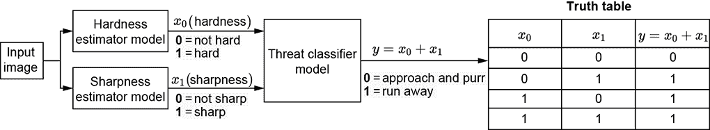

(a) 逻辑或：一只胆小的猫，如果面前的事物硬度超过阈值 *t*[0] **或**尖锐度超过阈值 *t*[1] 就会逃跑

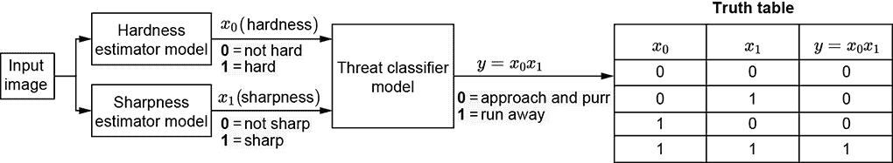

(b) 逻辑与：一只不那么胆小的猫，它会避开硬度超过阈值*t*[0] **且**尖锐度超过阈值*t*[1]的东西


(c) 多输入逻辑或：如果自动驾驶汽车看到前方有行人、车辆或道路弯曲，它就会刹车

图 7.1 逻辑运算符（或、与）在现实生活中的例子

+   *逻辑与*—我们也在猫脑的例子中展示了这一点。想象一只稍微不那么胆小的猫，它会避开又硬又尖的东西。但它不仅仅害怕硬和尖。它的脑部可以被图 7.1b 中显示的机器系统所模拟。

+   *逻辑非*—考虑一个机器，如果它看到任何未经授权的人进入受限区域，就会发出警报。假设我们还有一个独立的机器：一个面部识别器，它可以识别所有授权人员的面孔。它会发出一个二进制决策 1（识别到的面孔）或 0（未识别到的面孔）。整个系统接收面部识别器的输出，并对其执行逻辑非操作。

+   *多输入逻辑或*—想象一个机器，它决定自动驾驶汽车是否需要刹车。假设有三个独立的探测器，如果汽车前方看到人、车辆或道路弯曲，它们分别发出 1。如果这些独立的探测器中的任何一个发出 1，就必须刹车。这如图 7.3 所示。

+   *多输入逻辑与*—考虑一个帮助风险投资家决定是否投资初创企业的机器。假设有三个独立的机器，当以下条件满足时，它们会发出 1：（1）CEO 有成功的记录，（2）产品引起了目标客户的兴趣，（3）产品足够新颖。如果所有三个独立的机器都发出 1，机器将决定投资。因此，当条件（1）满足且条件（2）满足且条件（3）满足时，机器输出 1。这是一个三输入与的例子。

+   *逻辑异或*—假设我们正在构建一个社交媒体网站。假设我们有一个独立的探测器，对于任何一个人，如果他们喜欢摇滚音乐，就发出 1，否则发出 0。使用关于两个人的这些信息，问题是要决定他们是否应该被推荐为彼此的朋友。如果他们两人都喜欢摇滚音乐或都讨厌它，那么友谊潜力就很高。但如果一个人喜欢摇滚而另一个人不喜欢，他们可能不是好朋友。因此，条件 1 是第一个人对摇滚音乐的亲和力高，条件 2 是第二个人对摇滚音乐的亲和力高。当其中一个条件为真而另一个不为真时，这两个条件的异或为 1。这个机器在异或的非为真时输出 1，这意味着两个人都不喜欢摇滚音乐或两个人都喜欢摇滚音乐。图 7.4 描述了这一点。

+   *m-out-of-n 触发器*——想象我们正在尝试创建一个人脸检测器。我们已经有鼻子、眼睛、嘴唇和耳朵的独立部分检测器。如果我们检测到，比如说，这些部分中的任意两个一起，我们就足够自信地宣布检测到人脸。在计算机视觉中，我们经常遇到*遮挡*问题，其中一个重要对象因为另一个对象挡住了摄像机的视线而变得对摄像机不可见。计算机视觉算法总是试图对遮挡具有鲁棒性，这意味着即使在遮挡发生时，它们也希望输出正确的结果。这就是为什么我们不希望强制所有部分检测器都发出正信号；我们希望在部分遮挡的情况下也能检测到人脸。因此，当，比如说，检测到*n*个部分（如眼睛和嘴唇）中的两个时，我们的机器输出 1。


图 7.2 逻辑非和异或在实际问题中的应用示例。一个社交媒体系统只有在 A 和 B 两人都喜欢或都不喜欢摇滚音乐时，才会向他们推荐友谊。友谊 = ¬ (A 的摇滚音乐亲和力 ⊕ B 的摇滚音乐亲和力)，其中 ¬ 表示逻辑非，⊕ 表示逻辑异或。

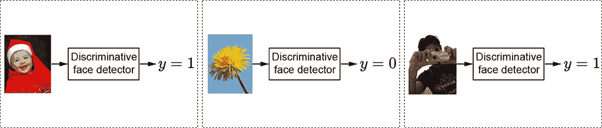

(a) 判别式人脸检测器分类器）。输出是分类的（人脸或非人脸）。


(b) 生成式人脸检测器。输出是连续的（图像包含人脸的概率）。

图 7.3 人脸检测器以图像为输入，输出一个分类的或连续的变量。

### 7.2.2 实际问题中的分类函数

分类器是一个输出为分类的函数。输入可以是连续的或分类的。因此，给定一个输入，函数会选择一个类别（即类）或另一个类别。例如，人脸检测器可以是一个分类器。它的输入是一个图像，它的输出是一个分类的（二元）变量，可以取两个可能的值之一：1（人脸）或 0（非人脸）。这如图 7.3a 所示。正如我们在第 2.3 节中看到的，任何图像都可以表示为一个向量。因此，人脸检测器的分类函数可以写成如下函数

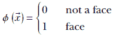

如何设计函数*ϕ*()是本章的主要话题之一。

几何上，每个标量输入变量在输入空间中形成一个单独的维度。所有这些标量输入变量的所有可能组合共同形成一个多维空间，称为*输入空间*（或特征空间）。每个特定的输入值组合是这个空间中的一个点（由输入向量表示）。

例如，在图像中，每个像素可以被视为一个单独的输入标量变量，它可以取任何介于 RGB = 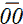, ,  (十六进制) (黑色) 和 RGB = 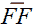, ,  (十六进制) (白色) 之间的 3 字节像素颜色值。输入的维度与图像中的像素数量相同。例如，一个 224 × 224 的图像形成一个 50, 176 维的输入空间。每个特定的图像是这个空间中的一个点。面分类函数 *ϕ*() 将该点映射到 0（非面部）或 1（面部）。

对于一个更简单的例子，考虑我们熟悉的来自第 1.4 节的猫脑示例。有两个输入变量：*x*[0]，表示 *硬度*；和 *x*[1]，表示 *尖锐度*。整体输入空间是二维的，其中特定的输入组合由 2D 向量 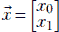 表示。我们的目标是构建一个机器，给定任何硬度与尖锐度的输入组合，将其分类为 *威胁性* 或 *非威胁性*。这相当于设计一个函数，将任意输入向量  ∈ ℝ² 映射到 0 或 1：


分类器的几何视图：决策边界

从几何学的角度来看，分类器将特征空间划分为不同的区域，每个区域对应一个类别。例如，考虑第 1.4 节中的简单猫脑模型。有两个输入变量，硬度 (*x*[0]) 和尖锐度 (*x*[1])。因此，我们有一个二维的输入特征空间，在几何上对应于一个平面。硬度与尖锐度的每一种组合都由一个特定的向量  = [*x*[0], *x*[1]] 表示，对应于平面上的一个 *点*。请注意，与图 7.1a 和 7.1b 中显示的机器不同，这里我们谈论的是一个以硬度与尖锐度——即二维特征平面上的一个点——作为输入的机器，并将其映射到对应于 *威胁* 与 *非威胁* 的分类决策的离散空间。这如图 7.4a 所示。

实线将 *威胁* 和 *非威胁* 区域分开。这种将属于不同类别的输入空间中的区域分开的曲线称为 *决策边界*。估计决策边界实际上等同于构建分类器。


(a) 猫脑威胁模型决策边界。实线曲线对应于分隔*威胁*和*非威胁*区域的真实决策边界。虚线代表一个近似的线性决策边界：它正确分类了大多数点，但错误地将实线和虚线之间的点分类。

在实践中，我们通过手动标记从每个区域获取一些样本点。

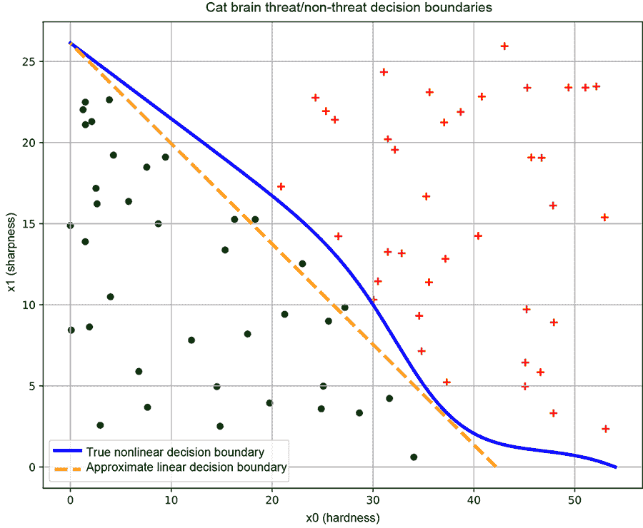

(b) 好的训练数据。来自每个类别的样本点大致覆盖了属于该类别的输入空间区域。这导致了一个良好的决策边界（实线）。


(c) 坏的训练数据。来自单个类别的样本点没有覆盖属于该类别的输入空间区域。这导致了一个不良的决策边界（虚线）。

图 7.4 分类器、决策边界和训练数据。来自不同类别的数据点用不同的符号（加号和点）标记。

虚线代表一个近似的线性决策边界，它粗略地完成了工作，但错误地将实线和虚线之间的点分类。（线性决策边界更容易用神经网络表示，但它们对于复杂问题是不够的。）

让我们简要地看一下图 7.4a 中的实线曲线。在硬度值较低时，尖锐度阈值较高（如果猫前面的物体不是很硬，它必须非常尖锐才能被认定为威胁）。从*x*[0] = 0 增加到*x*[0] = 20，这个阈值（作为威胁所需的尖锐度）大致线性下降。超过*x*[0] = 20，阈值以更快的速度下降——如果猫前面的物体足够硬，它不需要非常尖锐就能构成威胁。超过*x*[0] = 52 左右，尖锐度就不再重要了：足够硬的物体即使不尖锐也是威胁。这本质上是一个非线性情况。

为了简化神经网络实现，我们可能想要用直线来近似实线曲线——虚线并不是一个太差的近似，但这样做会引入误差。如图 7.4a 所示，真实曲线和近似曲线之间的区域将被错误分类。

图 7.4a 只是一个示意图。在现实中，我们并不知道输入空间中与感兴趣类别相对应的确切区域。我们通过人工标注识别了一些输入空间上的样本点，以及它们的正确类别（即真实情况）。这样的样本集，即 <输入点，正确输出也称为真实情况> 对，被称为 *训练数据*。猫脑问题的示例训练数据集如图 7.4b 所示（来自不同类别的真实情况训练数据点用不同的符号标记：加号和点）。我们通过训练神经网络创建的决策边界被优化以尽可能好地分类训练数据点（仅此而已）。如果训练数据点的分布是真实分布的合理反映——也就是说，每个类别的样本点大致覆盖了输入空间中对应类别的整个区域——那么在该数据集上训练得到的决策边界将是好的。但如果，如图 7.4c 所示，训练数据没有反映输入空间中类别的真实分布，那么在该数据上训练得到的决策边界可能是不好的。

与猫脑示例不同，大多数现实生活中的输入空间有数百甚至数千个维度。决策边界作为超曲面的想法在更高维度中仍然成立。对于更高维度的输入空间，超平面充当线性分离器。在更高维输入空间的简单问题中，这样的线性分离器就足够了。在更复杂的情况下，我们可以有其他曲线超曲面作为非线性分离器。我们可能无法在脑海中可视化超空间，但我们可以用三维类似物来形成心理图像。图 7.5 显示了三维输入空间中的一些平面决策边界。


(a) 训练数据。来自每个类别的输入空间区域的样本点

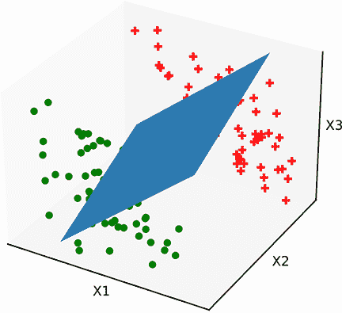

(b) 差的决策边界。平面方向错误。 需要修正。

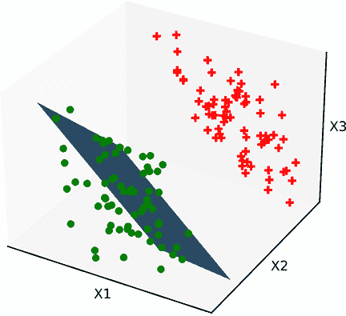

(c) 差的决策边界。平面有正确的方向但位置错误。*b* 需要修正。

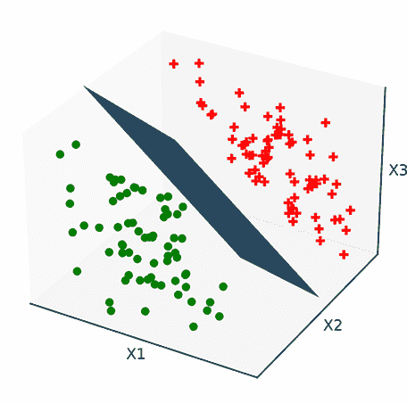

(d) 最佳决策边界。平面有正确的 ，*b*。适当训练。

图 7.5 具有线性决策边界超平面的分类器）。这种决策边界是通过第 7.3.3 节中介绍的感知器创建的。来自不同类别的数据点用不同的符号标记（加号和点）。

图 7.5a 展示了输入向量的三维空间以及一组训练数据点。任务是将其分类为两个类别。在这种情况下，训练点可以通过超平面决策边界进行划分。图 7.5b 和 7.5c 展示了一些划分训练数据不佳的平面，而图 7.5d 展示了一个最优的平面分离器。这些平面之间的唯一区别是  和 *b* 的值。这表明存在  和 *b* 的值，这些值可以最优地划分训练数据。这些最优值是通过称为 *训练* 的过程确定的，我们将在下一章详细讨论。

符号的重要性：决策边界的数学表达式

在输入向量  的空间中，*ϕ*() = 0 的方程代表一个表面。如果空间是二维的，表面就变成了一条曲线。例如，图 7.4b 中的实线虚线可以看作是 *ϕ*() ≡ *^T* + *b* = 0 的特殊情况，在这种情况下变为


那是，


在三维空间中，我们有平面和球面等表面。在超过三个维度的情况下，我们有超平面、超球面等等。例如，图 7.6 中的平面对应于

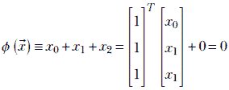

方程 7.1

那是，


在 3.1.4 节中，我们了解到，对于空间中的任意点 ，*ϕ*() 的符号告诉我们点  属于 *ϕ*() = 0 的表面哪一侧。因此，如果我们估计与决策边界对应的表面，给定任意点，我们可以确定该点属于哪个划分。换句话说，我们可以对点进行分类。估计决策边界等同于构建分类器。例如，图 7.4b 中的线对应于 0.62*x*[0] + *x*[1] − 26.14 = 0。0.62*x*[0] + *x*[1] − 26.14 < 0 的点位于一侧，并用点表示。0.62*x*[0] + *x*[1] − 26.14 > 0 的点位于另一侧，并用加号（+）表示。

这个想法可以扩展到更高维度。图 7.6 展示了在 3D 输入空间中的相同概念。平面对应于方程*x*[0] + *x*[1] + *x*[2] = 0。*x*[0] + *x*[1] + *x*[2] < 0 的点位于一个侧面（如图 7.6 中的-所示），而*x*[0] + *x*[1] + *x*[2] > 0 的点位于另一侧面（如图 7.6 中的+所示）。


图 7.6 *ϕ*()的符号意义 ≡ *^T* + *b*。注意，*ϕ*() = 0 意味着位于平面上，*ϕ*()为负意味着平面的一个侧面，*ϕ*()为正意味着平面的另一侧面。

### 7.2.3 现实世界问题中的通用函数

存在一些问题，分类输出变量不足以解决问题，需要连续输出变量：例如，估计自动驾驶车辆应该行驶的速度。使用诸如正在穿越的道路的速度限制、相邻车辆的速度等信息作为输入，我们需要估计自动驾驶车辆应该行驶多快。

另一个需要注意的情况是，当我们需要将输出变量建模为连续变量而不是分类变量时，例如，当我们建模某个事件发生的概率时。例如，再次考虑人脸检测器。给定一个图像作为输入，人脸分类函数输出 0 表示“不是人脸”，输出 1 表示“是人脸”。这样的函数被称为“判别函数”。我们也可以有一个输出图像包含人脸概率的函数。这样的函数被称为“生成函数”，一个例子如图 7.6 所示。

## 7.3 基本构建块或神经元：感知器

在 7.2 节中，我们了解到大多数现实世界问题都可以表示为函数。这是一个好消息，但坏消息是，这些函数通常是未知的，而且各种问题背后的函数彼此之间差异很大。虽然可能估计它们，但如果我们不采用通用框架而单独攻击它们，几乎没有希望开发出可重复的解决方案。

神经网络提供了一个有效的框架，可以机械地模拟极其广泛的复杂函数。此外，目标函数不必是封闭形式的——样本输入输出对就足够了。它们可以通过连接相当简单的构建块实例（不出所料地称为*神经元*）来表示（建模）非常复杂的函数。换句话说，完整的神经网络可以具有巨大的*表达能力*，尽管单个神经元非常简单。稍后，在第 7.3.4、7.4、7.5 等节中，我们将讨论神经网络如何模拟越来越复杂的函数。但首先，在本节中，我们检查构建块：神经元。

### 7.3.1 海维塞德阶跃函数

海维塞德阶跃函数，通常简称为*阶跃函数*，是一个对于负数参数取值为 0，对于正数参数取值为 1 的函数：


方程 7.2

方程 7.2 等价于以下算法。图 7.7 显示了此方程的图形。

算法 7.4 海维塞德阶跃函数作为算法

**if** *x* < 0 **then**

返回 0

**else**

返回 1

**结束** **if**


图 7.7 海维塞德阶跃函数图

### 7.3.2 超平面

在第 2.8 节中，我们讨论了超平面。它们由方程 2.14 表示。在第 2.9 节的图中，我们看到了超平面在分类器中的作用；我们在这里简要回顾这个概念。

在第 2.1.1 节中，我们看到了*d*-元素向量是*d*-维空间中点的几何类比。用  表示输入向量空间中的向量（或等价地，点）。对于固定的向量  和固定的标量 *b*，该空间中超平面的方程是

*^T* + *b* = 0

（意味着满足此方程的所有点  都位于平面上）。向量  是平面的法线。当我们观察到如果我们取平面上的任意两点，比如说 [0] 和 [1]，那么

*^T*[0] + *b* = 0

*^T*[1] + *b* = 0

相减，我们得到

*^T*([1] - [0]) = 0

但 ([1] - [0]) 是连接平面上两个任意点的向量。这意味着连接平面上任何一对点的线垂直于 *（在第 2.5.2 节中，我们讨论了点积，在第 2.6 节中，我们看到了如果两个向量的点积为零，则这两个向量是正交的——相互垂直）。因此， 垂直于平面上的所有线。换句话说， 垂直于平面。

超平面 *^T* + *b* = 0 将空间划分为两个区域，这两个区域的 *^T* + *b* 表达式的符号不同。也就是说，超平面可以作为决策边界，如图 7.6 所示。不仅超平面，任何超曲面都可以以这种方式划分空间。这对于任何维度的  都成立：

+   如果表达式 *^T* + *b* 的值为 *零*，则点  位于 *超平面* *^T* + *b* = 0 上。

+   如果表达式 *^T* + *b* 的符号为 *负*，则点  位于 *超平面* 的 *一侧*。

+   如果表达式 *^T* + *b* 的符号为 *正*，则点  位于 *超平面* 的 *另一侧*。

### 7.3.3 感知器和分类

感知器将步进函数和超平面结合成一个单一函数。它表示的函数

*P*() ≡ *ϕ*(*^T* + *b*)

方程 7.3

其中 *ϕ* 是来自方程 7.2 的 Heaviside 步进函数。结合我们在第 7.3.1 和 7.3.2 节中的见解，我们可以看到感知器函数将 (, *b*) 平面一侧的所有点映射到零，并将同一平面另一侧的所有点映射到 1。换句话说，它作为一个线性分类器，将 (, *b*) 平面作为决策边界。图 7.8 绘制了 2D 输入空间的感知器函数（该图本身是在 3D 空间中的：它将决策边界一侧的点映射到 *Z* = 0 平面，并将另一侧的点映射到 *Z* = 1 平面）。


图 7.8 虽然输入空间是 2D 的，但感知器图是 3D 的。决策边界由长对角线直线表示。它将决策边界一侧的点映射到 *Z* = 0 平面，另一侧的点映射到 *Z* = 1 平面。

当然，在现实生活中，我们不知道与类别对应的精确区域。相反，我们采样了带有手动标记类别的输入点作为训练数据。决策表面必须仅基于此训练数据构建。在图 7.4 中，我们看到了一个二维示例决策边界和一些好的和坏的训练数据集。为了在更高维度的采样训练数据集中获得心理图像，请再次查看图 7.5a。在这种情况下，单个超平面决策边界足以划分训练点。这意味着单个基于感知器的神经网络就足以作为分类器。图 7.5b 和 7.5c 描述了一些（具有特定 (, *b*) 值的感知器）划分训练数据不佳的平面。图 7.5d 显示了一个最优感知器（平面分离器）。这告诉我们，存在最优的  和 *b* 值，可以最优地划分训练数据，以及不良的值。如前所述，好的值是通过训练确定的，我们将在第八章中介绍。

感知器有效地使用 *平面* 决策表面进行划分。这仅在简单问题中有效。对于平面决策表面将 *不会* 适用的情形，请参见图 7.9。它描述了一个问题，其中一个类别映射到两个平面之间的点集（标记为 +），另一个类别映射到输入空间中的其余点。使用单个平面无法实现所需的划分，因此无法用单个感知器来模拟这种决策边界。稍后我们将看到如何使用多个感知器来模拟这种复杂的决策边界。

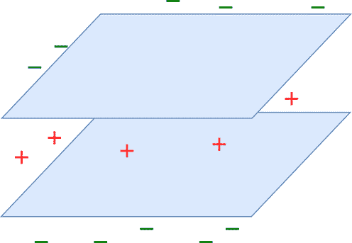

图 7.9 多平面决策边界。一个类别对应于两个平面之间的区域中的点（标记为 +）。其余的点对应于其他类别（标记为 –）。这种决策边界 **不能** 用单个平面表示。

注意：感知器的完整功能代码，可通过 Jupyter Notebook 执行，可在 [`mng.bz/9Ne7`](http://mng.bz/9Ne7) 找到。

以下列表展示了感知器的 PyTorch 代码。

列表 7.1 感知器

```py
def fully_connected_layer(X, w,  b):                         ①

    X = torch.cat((X, torch.ones(
             [X.shape[0], 1], dtype=torch.float32)), dim=1)  ②

    W = torch.cat((W, b.unsqueeze(dim=1)), dim=1)            ③

    y = torch.matmul(W, X.transpose(0, 1))                   ④

    y = torch.heaviside(y, torch.tensor(1.0))                ⑤

    return y.transpose(0, 1)

def Perceptron(X, W, b):                                     ⑥
    return fully_connected_layer(X, W, b)
```

① *X* : *n* × *d* 张量；每一行是一个大小为 d 的输入向量。*w* : *m* × *d* 张量。

② 添加一列 1。*X* ↦ *n* × (*d*+1) 张量。

③ 结合权重和偏差

④ X 和 W 的矩阵乘法

⑤ 应用 Heaviside 阶跃函数

⑥ 单个感知器

### 7.3.4 使用感知器建模常见逻辑门

神经网络通过连接称为感知器的简单构建块的重复实例（通过加权边连接）提供了一种结构化的方式来建模复杂函数。在本节中，我们探讨了通过感知器进行函数建模的想法。我们首先从使用单个感知器表示的极其简单的逻辑函数（与、或、非、投票）建模开始。然后我们来看 XOR 函数，这是不能使用单个感知器表示的简单函数之一；我们看到它可以用*多个*感知器来建模。接下来我们讨论 Cybenko 定理，该定理表明，大多数感兴趣的函数可以通过感知器以我们想要的任何精度进行建模，输入和输出之间有一个隐藏层。不幸的是，这比听起来要少一些实际应用：关键在于，尽管任何函数都可以建模到任何精度，但建模所需的感知器数量没有限制。目标函数越复杂，所需的感知器就越多。在实践中，我们通常使用多层而不是一层。

感知器用于逻辑与

图 7.18 展示了这个感知器。它接受两个输入，*x*[0]和*x*[1]，分别用*w*[0] = 1 和*w*[1] = 1 加权；偏置为-1.5（实际上，广泛的偏置值都可以）。总的来说，感知器实现了函数*ϕ*(*x*[0] + *x*[1]−1.5)。当*x*[0] + *x*[1] − 1.5 ≥ 0 时，该函数发出 1：也就是说，*x*[0] + *x*[1] ≥ 1.5。由于变量是二元的（意味着它们只能取 0 或 1 的值），这只有在两个输入都是 1 的情况下才会发生。如果其中一个是零，它们的和就小于 1.5，*y*就是 0。


(a) 逻辑与函数的感知器：*y* = *x*[0] ∨ *x*[1]

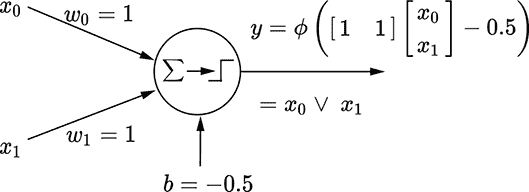

(b) 逻辑或函数的感知器：*y* = *x*[0] ∧ *x*[1]


(c) 逻辑非函数的感知器：*y* = ¬*x*[0]

图 7.10 中的函数是二元的，意味着它们可以是 0 或 1。

这种情况在图 7.11a 中用几何方式表示。粗对角线对应于*x*[0] + *x*[1] ≥ 1.5。它将平面分为无阴影和阴影部分。无阴影半平面的所有点输出值*y* = 0，阴影半平面的所有点输出值*y* = 1。只有四个可能的输入点：(*x*[0] = 1, *x*[1] = 1)，(*x*[0] = 1, *x*[1] = 1)，(*x*[0] = 1, *x*[1] = 1)，(*x*[0]=1, *x*[1] = 1)。点(*x*[0]=1, *x*[1] = 1)位于阴影侧，其他点位于无阴影侧——这正是逻辑与函数。


(a) 逻辑与决策边界：*x*[0] + *x*[1] = 1.5


(b) 逻辑或决策边界：*x*[0] + *x*[1] = 0.5


(c) 逻辑非决策边界：*x*[0] = 0.5

图 7.11 展示了图 7.10 中的感知器的几何视图。每个点代表一个输入点（[*x*[0] *x*[1]] 矢量）。阴影点映射到输出值为 1，无阴影点映射到输出值为 0。粗线表示决策边界。

逻辑或感知器

图 7.10b 展示了该感知器。它接受两个输入，*x*[0] 和 *x*[1]，分别乘以 *w*[0] = 1 和 *w*[1] = 1，偏置为 −0.5。总体而言，感知器实现了函数 *ϕ*(*x*[0] + *x*[1]−0.5)。当 *x*[0] + *x*[1] − 0.5 ≥ 0 时，该函数输出 1：即 *x*[0] + *x*[1] ≥ 0.5。由于变量是二进制（0 或 1），这只有在输入为 1 或两个输入都为 1 时才会发生。只有当两者都为零时，它们的和为零（小于 0.5），并且 *y* 为 0。

这种情况在图 7.11b 中以几何方式表示。粗线对应于 *x*[0] + *x*[1] ≥ 0.5，将输入平面分为无阴影的半平面（该半平面上的所有点输出 *y* = 0）和有阴影的半平面输出 *y* = 1。在四个可能的输入点中，（0,0）位于无阴影的一侧（*y* = 1），其余三个位于阴影一侧（*y* = 1），这正是逻辑或函数。

逻辑非感知器

该感知器在图 7.10c 和 7.11c 中展示，现在应该已经很直观了。

注意：使用感知器建模各种逻辑门的全功能代码，可通过 Jupyter Notebook 执行，可在 [`mng.bz/jBRr`](http://mng.bz/jBRr) 找到。

列表 7.2 使用感知器建模逻辑门

```py
# Logical AND
X = torch.tensor([[0., 0.],                               ①
                 [0., 1.],
                 [1., 0.],
                 [1., 1.]], dtype=torch.float32) 
W = torch.tensor([[1.0, 1.0]], dtype=torch.float32)       ②
b = torch.tensor([-1.5])                                  ③
Y = Perceptron(X=X, W=W, b=b, activation=torch.heaviside) ④

# Logical OR
X = torch.tensor([[0., 0.],
                 [0., 1.],
                 [1., 0.],
                 [1., 1.]], dtype=torch.float32)
W = torch.tensor([[1.0, 1.0]], dtype=torch.float32)
b = torch.tensor([-1.5])
Y = Perceptron(X=X, W=W, b=b, activation=torch.heaviside)

# Logical NOT
X = torch.tensor([[0],
                 [1.]
                 ], dtype=torch.float32)
W = torch.tensor([[-1.0]], dtype=torch.float32)
b = torch.tensor([0.5])
Y = Perceptron(X=X, W=W, b=b, activation=torch.heaviside)
```

① 输入数据点

② 实例化权重

③ 实例化偏置

④ 输出

## 7.4 向更强大的表达力：多层感知器（MLPs）

有一个非常简单的逻辑函数，出人意料的是，不能用单个感知器来建模：异或。我们现在来讨论它。


(a) 逻辑异或感知器的几何视图。决策边界有 *两条* 线，因此使用单个感知器是不可能的。


(b) 逻辑异或函数的 MLP。注意，权重和偏置在括号中有上标，表示层索引。这是一个两层网络。层 0 是隐藏层。

图 7.12 逻辑异或：几何和感知器视图

### 7.4.1 逻辑异或的 MLP

图 7.12a 显示了平面上可能的四个输入点以及如何划分平面以建模 XOR 函数。点(0,0)、(1,1)（未着色）都映射到输出 0，应该在决策边界的同一侧，而点(0,1)、(1,0)（着色）映射到输出值 1，应该在决策边界的另一侧。

很容易看出，在这个平面上不可能画一条直线，使得着色点在一侧，未着色点在另一侧。记住，感知器本质上引入了一个线性决策边界。因此，不可能有一个单独的感知器来模拟这个函数。

然而，通过多个感知器可以建模逻辑 XOR 函数。其中一个这样的模型在图 7.12b 中展示。

## 7.5 感知器的分层网络：MLP 或神经网络

XOR 示例告诉我们，我们无法仅用单个感知器做很多事情。我们必须将多个感知器连接成一个网络来解决实际问题。这是一个**神经网络**。我们如何组织这样一个连接的感知器网络？

### 7.5.1 分层

**分层**是将感知器组织成神经网络的流行方式。图 7.12b 是我们第一个 MLP 的例子——本书的其余部分大部分都在讨论 MLP。

注意 XOR 网络（图 7.12b）中的感知器是如何组织的：

+   层从输入到输出用递增的整数编号。

+   层*i*中感知器的输出仅作为输入提供给层*i* + 1 中的感知器。不允许其他连接。这使网络易于管理，并便于通过称为**反向传播**的技术在训练期间更新权重，我们将在下一章讨论这一技术。

+   除了最后一层之外的所有层的输出都是不可见的（不直接贡献于输出）。这样的层被称为**隐藏层**。在图 7.12b 中，层 0 是隐藏的。

+   每个权重和偏置元素只属于一个层。在本书中，我们用括号内的上标表示权重或偏置元素的层索引。

+   具有两个或更多隐藏层的 MLP 可以称为**深度神经网络**。这是“深度学习”中“深度”一词的起源。

### 7.5.2 使用 MLP 建模逻辑函数

任何逻辑函数都可以表示为真值表。因此，如果我们能证明所有真值表都可以通过 MLP 实现，我们就完成了。这是我们采取的方法。

注意：在以下讨论中，两个变量之间的符号（如乘法）不表示逻辑与，而加号表示逻辑或。

表 7.1 逻辑函数*y* = *x̄*[0]*x*[1] ¸ *x*[0]*x̄*[1]的真值表

| *x*[0] | *x*[1] | *y*   |
| --- | --- | --- |
| 0 | 0 | 0 |
| 0 | 1 | 1 |
| 1 | 0 | 1 |
| 1 | 1 | 0 |

让我们从简单的二维逻辑函数 *y* = *x̄*[0]*x*[1] + *x*[0]*x̄*[1] 开始。表 7.1 展示了相应的真值表。为了创建等效的 MLP，我们必须选择对应于 *y* = 1 的行。每一行都可以表示为输入变量或其补码的 AND。例如，行 *x*[0] = 0 和 *x*[1] = 1，*y* = 1 对应于 *x̄*[0]*x*[1]——我们试图实现的函数的第一个项——可以通过图 7.13a 中显示的感知器实现。行 *x*[0] = 1 和 *x*[1] = 0，*y* = 1 对应于 *x*[0]*x̄*[1]——我们试图实现的函数的第二个项——可以通过图 7.13b 中显示的感知器实现。我们已经实现了函数的各个项；剩下的只是将它们 OR 到一起形成一个最终的 MLP，如图 7.13c 所示。这个逻辑函数是我们熟悉的逻辑 XOR，图 7.13 中的整体函数与图 7.12 相同。以这种方式，可以使用 MLP 对任意数量的变量中的任意逻辑表达式进行建模。


(a) 对于 *x̄*[0]*x*[1] 的感知器

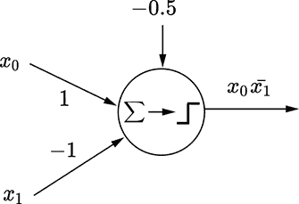

(b) 对于 *x*[0]*x̄*[1] 的感知器


(c) 对于 *x̄*[0]*x*[1] + *x*[0]*x̄*[1] 的 MLP

图 7.13 对应于表 7.1 的逻辑函数的 MLP

列表 7.3 多层感知器 (MLP)

```py
def MLP(X, W0, W1, b0, b1): ①
    y0 = fully_connected_layer(X=X, W=W0, b=b0)
    return fully_connected_layer(X=y0, W=W1, b=b1)
```

① MLP

### 7.5.3 Cybenko 的通用近似定理

任何在区间 *x* ∈ (*a*, *b*) 上连续的函数 *y* = *f*(*x*) 都可以用该区间内的一组塔（垂直矩形）来近似。这是微积分中积分平均值定理的直接结果。这一想法在图 7.14 中得到展示，其中复杂函数（由曲线表示）被一系列不同高度的塔近似。塔越细，塔的数量越多，近似就越准确。


图 7.14 使用塔近似复杂函数

在 7.5.3.1 节中，我们展示了任何塔（具有任意高度和位置）都可以用 MLP 构建出来。通过将这些 MLP 相加，我们可以近似整个函数。这就是 Cybenko 定理的精髓。

注意：尽管 Cybenko 定理保证了任何连续函数都可以使用具有单个隐藏层的 MLP 进行建模，但该 MLP 中的感知器数量可能变得任意大而不切实际。这就是为什么在现实生活中，我们很少尝试用单个隐藏层来近似复杂函数。我们稍后会看到，额外的层可以帮助我们减少所需的感知器数量。

特别是，任何决策边界都可以用这种方式进行建模。当然，对于许多问题，所需的感知器数量可能变得无法实现，使得这种模型实际上无法实现。


(a) *ϕ*(*x*)：正*w*产生正常步进


(b) 正常步进的感知器


(c) *ϕ*(−*x*)：负*w*产生横向翻转步进


(d) 翻转步进的感知器

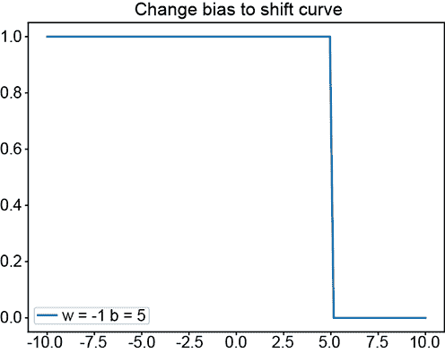

(e) *ϕ*(−*x*+5)：改变偏置将步进向左或向右移动


(f) 横向移动的步进感知器


(g) (*ϕ*(*x*+5)+*ϕ*(−*x*+5)−1.5)：将左移的步进与翻转的右移步进进行 AND 操作得到一个塔

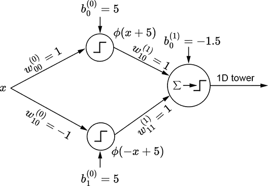

(h) 1D 塔的 MLP

图 7.15 使用感知器生成 1D 塔


(a) 沿*x*[0] (x)方向的 2D 步进函数

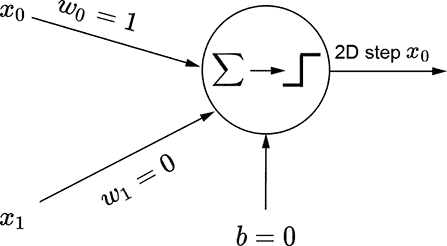

(b) 沿*x*[0] (x)方向的 2D 步进函数感知器


(c) 沿*x*[0] (x)方向的 2D 步进函数方程


(d) 沿*x*[0] (x)方向的翻转 2D 步进


(e) 沿*x*[0] (x)方向的翻转 2D 步进感知器

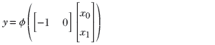

(f) 沿*x*[0] (x)方向的翻转 2D 步进方程

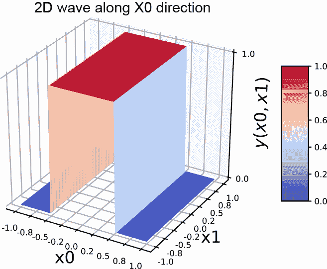

(g) 沿*x*[0] (x)方向的 2D 波

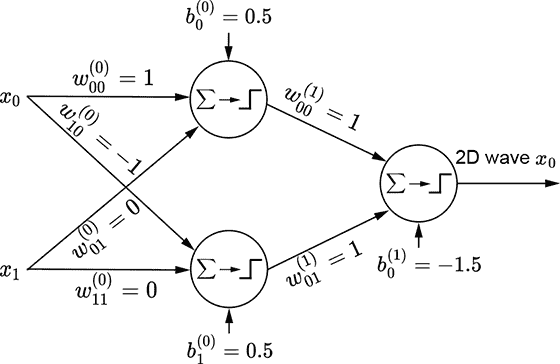

(h) 沿*x*[0] (x)方向的 2D 波 MLP

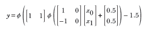

(i) 沿*x*[0] (x)方向的 2D 波方程


(j) 沿*x*[1] (y)方向的 2D 波


(k) 沿*x*[1] (y)方向的 2D 波 MLP

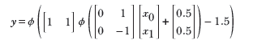

(l) 沿*x*[1] (y)方向的 2D 波 MLP

图 7.16 使用感知器生成 2D 步进和波

使用 MLP 生成塔

基本思想在图 7.15 中展示。我们可以明显地通过实现 *y* = *ϕ*(*x*) 的感知器生成一个规则的步长。相应的图示在图 7.15a 中。通过赋予一个偏置 5，我们可以将这个步长向左移动。相应的函数是 *y* = *ϕ*(*x*+5)。此外，使用负权重可以在水平方向上翻转步长。相应的函数是 *y* = *ϕ*(−*x*)，其图示在图 7.15c 中。通过赋予一个偏置 5，我们可以将翻转的步长向右移动。图 7.15e 展示了翻转并右移的步长，对应于函数 *y* = *ϕ*(−*x*+5)，其感知器在图 7.15f 中展示。逻辑与一个左移的步长与一个翻转并右移的步长在 1D 中产生一个塔。这对应于函数 *y* = *ϕ*(*ϕ*(*x*+5)+*ϕ*(−*x*+5)−1.5)，其图示在图 7.15g 中。

同样的思想也适用于更高维度的输入。我们可以使用方程 7.4 生成一个沿 *x*[0] 方向对齐的两个变量（2D 步长）。这个方程的图示在图 7.16a 中，实现该方程的感知器在图 7.16b 中展示。相同步长的翻转版本可以通过方程 7.5 生成。这个方程的图示在图 7.16d 中，感知器的实现展示在图 7.16e 中。

在 1D 情况下，我们通过结合一个规则的步长及其翻转和移位的版本来生成一个塔。在 2D 中，这个过程稍微复杂一些。在这里，通过将一个特定坐标轴上的步长与其翻转和移位的版本结合，可以生成该轴上的波函数。因此，每个维度都有单独的波。沿 *x*[0] 轴的波对应于方程 7.6；其图示在图 7.16g 中。它由图 7.16h 中的 MLP 实现。同样，沿 *x*[1] 轴的 2D 波可以通过方程 7.7 生成，并在图 7.16j 中绘制。相应的 MLP 在图 7.16k 中展示。

要创建一个塔，我们必须在两个独立的维度上对一对波进行逻辑与操作。最终的塔函数在方程 7.8 中展示；相应的塔图示在图 7.17a 中；MLP 在图 7.17b 中展示。任何连续的 2D 表面都可以通过组合这样的 2D 塔来近似到任意精度：

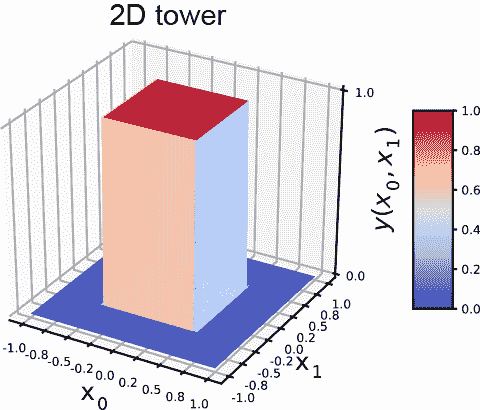

(a) 2D 塔


(b) 2D 塔的 MLP（方程 7.8）

图 7.17 使用感知器生成 2D 塔


方程 7.4

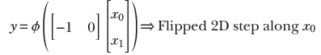

方程式 7.5


方程式 7.6


方程式 7.7

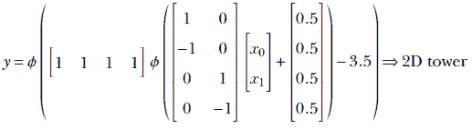

方程式 7.8

注意：使用感知器近似表面的完整功能代码，可通过 Jupyter Notebook 执行，可在 [`mng.bz/WrKa`](http://mng.bz/WrKa) 找到。

列表 7.4 1D 中的感知器和 MLP

```py
x = torch.linspace(start=-10, end=10, steps=100) ①

# 1D S curves - positive weight                  ②
w = torch.tensor([1.0], dtype=torch.float32)
b = torch.tensor([0.0])
y = Perceptron(X=x.unsqueeze(dim=1), W=w.unsqueeze(dim=1), b=b) 

# 1D S curves - negative weight + shift\quad     ③
w = torch.tensor([-1.0], dtype=torch.float32)
b = torch.tensor([5.0])
y = Perceptron(X=x.unsqueeze(dim=1), W=w.unsqueeze(dim=1), b=b) 

# 1D towers (Cybenko) - various W0\quad          ④
W0 = torch.tensor([[1.0], [-1.0]], dtype=torch.float32)
b0 = torch.tensor([5.0, 5.0])
W1 = torch.tensor([[1.0, 1.0]], dtype=torch.float32)
b1 = torch.tensor([0.0])
y = MLP(X=x.unsqueeze(dim=1), W0=W0, W1=W1, b0=b0, b1=b1)
```

① 100D 数组

② 参见图 7.15a 和 7.15b。

③ 参见图 7.15e 和 7.15f。

④ 参见图 7.15g 和 7.15h。

列表 7.5 2D 中的感知器和 MLP

```py
X = torch.linspace(start=-1, end=1, steps=100)      ①
Y = torch.linspace(start=-1, end=1, steps=100)      ①

gridX, gridY = torch.meshgrid(X, Y)                 ②
X = torch.tensor([(y, x) for y, x in
         zip(gridY.reshape(-1), gridX.reshape(-1))) ③

# 2D Step function in X-direction                   ④
W = torch.tensor([[1.0, 0.0]], dtype=torch.float32)
b = torch.tensor([0.0], dtype=torch.float32)
Z = Perceptron(X=X, W=W, b=b)

# 2D Flipped Step function along X-direction        ⑤
W = torch.tensor([[-1.0, 0.0]], dtype=torch.float32)
b = torch.tensor([0.0], dtype=torch.float32)
Z = Perceptron(X=X, W=W, b=b)

# 2D wave along X-direction                         ⑥
W0 = torch.tensor([[1.0, 0.0],
                   [-1.0, 0.0]], dtype=torch.float32)
b0 = torch.tensor([0.5, 0.5], dtype=torch.float32)
W1 = torch.tensor([[1.0, 1.0]], dtype=torch.float32)
b1 = torch.tensor([-1.0])
Z = MLP(X=X, W0=W0, W1=W1, b0=b0, b1=b1) 

# 2D wave along Y-direction                          ⑦
W0 = torch.tensor([[0.0, 1.0],
                   [0.0, -1.0]], dtype=torch.float32)
b0 = torch.tensor([0.5, 0.5], dtype=torch.float32)
W1 = torch.tensor([[1.0, 1.0]], dtype=torch.float32)
b1 = torch.tensor([-1.0])
Z = MLP(X=X, W0=W0, W1=W1, b0=b0, b1=b1)

# 2D Tower                                           ⑧
W0 = torch.tensor([[1.0, 0.0],
                   [-1.0, 0.0],
                   [0.0, 1.0],
                   [0.0, -1.0]], dtype=torch.float32)
b0 = torch.tensor([0.5, 0.5, 0.5, 0.5], dtype=torch.float32)
W1 = torch.tensor([[1.0, 1.0, 1.0, 1.0]], dtype=torch.float32)
b1 = torch.tensor([-3.5])
Z = MLP(X=X, W0=W0, W1=W1, b0=b0, b1=b1)
```

① 100D 数组

② 100 × 100 矩阵

③ 10,000 × 1 矩阵

④ 参见方程式 7.4 和图 7.16a 以及 7.16b。

⑤ 参见方程式 7.5 和图 7.16d 以及 7.16e。

⑥ 参见方程式 7.6 和图 7.16g 以及 7.16h。

⑦ 参见方程式 7.7 和图 7.16j 以及 7.16k。

⑧ 参见方程式 7.8 和图 7.17a 以及 7.17b。

### 7.5.4 多边形决策边界的 MLP

我们已经看到，分类器是神经网络的一个重要用例。在第 7.2.2.1 节中，我们还看到分类器本质上是在高维特征空间中建模决策边界。在本节中，我们通过一个固定多边形界定的简单类别来建模，以理解这个过程。

图 7.18a 显示了一个特征空间，其中要识别的类别对应于由四条直线界定的矩形区域（阴影部分）：

*x*[0] = –5      *x*[0] = 5

*x*[1] = –2      *x*[1] = 2

这些线中的每一行都将特征空间划分为两个半平面，如图 7.18a 中的负号和正号所示。包含感兴趣类别特征点的区域由所有正号表示。


(a) 包围感兴趣类别的决策边界的示例特征空间（阴影部分）

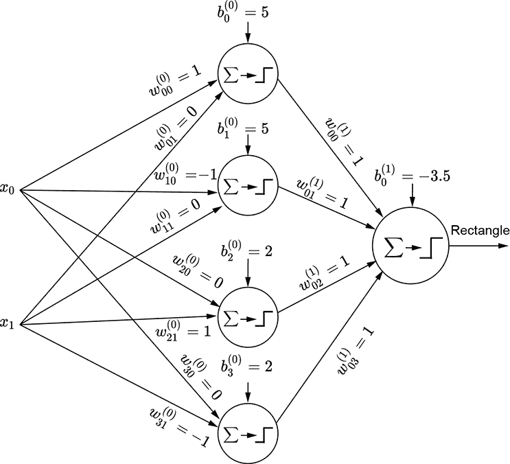

(b) 仅在阴影区域内的点触发的 MLP

图 7.18 使用 MLP 建模矩形决策区域

对应于感兴趣类别的阴影区域是满足 *x*[0] ≥ − 5 AND *x*[0] ≤ 5 AND *x*[1] ≥ − 2 AND *x*[1] ≤ 2 的区域。现在考虑感知器 *ϕ*(*x*[0]+5)。它在 *x*[0] ≥ − 5 的区域触发（输出 1）。同样，感知器 *ϕ*（- *x*[0]+5）、*ϕ*（*x*[1]+2）和 *ϕ*（- *x*[1]+2）分别在 *x*[0] ≤ 5、*x*[1] ≥ − 2 和 *x*[1] ≤ 2 的区域触发。因此，通过逻辑上 AND 这些感知器的输出，我们得到一个只在感兴趣阴影区域触发的多层感知器（MLP）。图 7.53 展示了此 MLP。它实现了以下函数：

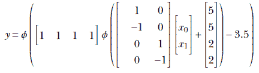

平面上的所有形状都可以用多边形来近似。因此，给定足够的感知器，平面上的任何形状都可以以任意精度描绘出来。

## 摘要

在本章中，我们概述了如何将各种现实世界问题建模为函数评估：

+   任何智能任务都可以通过一个函数来建模。特别值得注意的是分类任务，在这种任务中，给定一个输入，我们从预定的可能类别列表中估计输入所属的类别。例如，二元分类器可以将输入图像分为两类：包含人脸的和不包含人脸的。分类任务可以通过具有分类输出的函数来近似。

+   神经网络提供了一种结构化的方法来近似任意函数（包括分类函数）。这就是它们模仿智能的方式。

+   神经网络是通过组合一个称为感知器的基本构建块来创建的。感知器是一个简单的函数，它返回对输入加权总和（加上偏差）应用步进函数的结果。感知器实际上是一个线性分类器，它通过超平面将空间分为两个半空间。感知器的权重和偏差对应于超平面的方向和位置——它们可以被调整到尽可能多地分离对应于单个类别的区域。

+   单个感知器只能近似相对简单的函数，例如可以通过超平面分离特征点的分类器。感知器不能近似更复杂的函数，例如需要用曲面分离输入区域的分类器。多层感知器（MLP）是感知器的组合，其中一层感知器的输出作为下一层感知器的输入。神经网络本质上是一个 MLP，可以近似这样的任意复杂函数。

+   简单的逻辑函数，如 AND、OR 和 NOT，可以用单个感知器来模拟。逻辑 XOR 不能。对于 XOR 和其他复杂的逻辑函数，我们需要 MLPs。有一种机械的方法可以构建任何逻辑函数的 MLP。逻辑函数总是可以用真值表来表示。真值表的每一行可以看作是输入的逻辑 AND 函数，最终输出是输入的逻辑 OR。由于 AND 和 OR 可以用感知器来模拟，任何真值表都可以模拟为感知器的组合（一个 MLP）。

+   MLP 表示任意函数的能力被称为其表达能力。感知器数量和/或连接数量越多，神经网络的表达能力就越强。

+   Cybenko 定理证明了神经网络是一个通用逼近器（意味着它可以逼近任何函数）。基本思想是任何函数都可以被逼近到任意程度的精度，作为矩形（塔）的总和。该定理表明，可以使用 MLPs 在任何维度的空间中构建塔。

+   神经网络可以逼近平面上任何形状到任意精度。这是因为所有形状都可以用矩形逼近，并且我们可以用 MLPs 在平面上逼近矩形。

+   在现实生活中的问题中，对应于类别的区域是未知的，但我们会手动标记样本输入点带有期望的输出（真实值）来创建监督训练数据。我们调整权重和偏差，尽可能逼近训练数据。这个过程被称为训练。如果训练数据集不能很好地代表真实数据集，即使经过训练，神经网络也可能不准确。
