# 8 训练神经网络：前向传播和后向传播

本章涵盖

+   Sigmoid 函数作为 Heaviside 步函数的微分替代

+   神经网络中的分层：将线性层表示为矩阵-向量乘法

+   回归损失、前向和后向传播及其数学

到目前为止，我们已经看到神经网络通过用数学函数建模决策过程来做出复杂的现实生活决策。这些函数可以变得非常复杂，但幸运的是，我们有一个简单的构建块，称为 *感知器*，可以系统地重复以建模任何任意函数。我们甚至不需要显式地知道正在建模的函数的闭式形式。我们需要的只是一个合理大小的样本输入集和相应的正确输出。这个输入和输出对的集合被称为 *训练数据*。有了这个训练数据，我们可以 *训练* 一个多层感知器（MLP，也称为神经网络），使其在从未见过的输入上产生合理的正确输出。

这种需要我们知道训练数据集中每个输入的输出的神经网络被称为 *监督* 神经网络。训练输入的正确输出通常是通过一种称为 *标注* 的手动过程生成的。标注既昂贵又耗时。许多研究正在进行中，旨在开发无监督、半监督和自监督网络，以消除或最小化标注过程。但到目前为止，无监督和自监督网络在一般情况下的准确性并不匹配监督网络。在本章中，我们专注于监督神经网络。在第十四章中，我们将研究无监督网络。

这个“训练”神经网络的过程是什么？它本质上估计了使网络在训练输入上发出尽可能接近已知正确输出的参数值。在本章中，我们将讨论这是如何完成的。但在那之前，我们必须学习一些其他的东西。

注意：本章的完整 PyTorch 代码以完全功能性和可执行的 Jupyter 笔记本形式，可在 [`mng.bz/YAXa`](http://mng.bz/YAXa) 获取。

## 8.1 可微的类似步骤函数

在方程 7.3 中，我们将感知器表示为 Heaviside 步函数 *ϕ* 和仿射变换 *^T* + *b* 的组合。这是我们贯穿第七章所使用的感知器，并且我们能够表达（建模）几乎所有感兴趣的功能。

尽管 Heaviside 步进函数具有强大的表达能力，但它有一个缺点：它在 *x* = 0 处有间断，并且不可微分。为什么可微性很重要？正如我们将在第八章（并在第 3.3 节中略见一斑）中看到的那样，神经网络的优化训练需要评估损失函数相对于权重的梯度向量。由于梯度实际上是一个偏导数的向量，因此可微性对于训练是必需的。

在本节中，我们讨论一些可微分的函数，同时可以模拟 Heaviside 步进函数。其中最重要的是 S 形函数。

### 8.1.1 S 形函数

S 形函数以其特征的 S 形曲线图而命名 8.1)。相应的方程是


方程 8.1

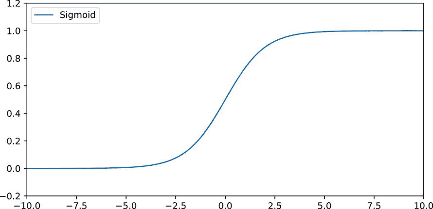

图 8.1 1D S 形函数的图像

参数化 S 形函数

我们可以将方程 1.5 参数化为

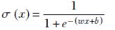

方程 8.2

这使我们能够

+   通过改变 *w* 调整 S 曲线线性部分的陡峭程度

+   通过改变 *b* 调整曲线的位置

图 8.2 展示了参数化的 S 形曲线如何随着参数 *w* 和 *b* 的不同值而变化。特别是，请注意，对于大的 *w* 值，参数化的 S 形函数几乎与 Heaviside 步进函数无法区分（比较图 8.2a 中的虚线曲线与图 7.7），尽管它仍然是可微分的。这正是我们在神经网络中所期望的。

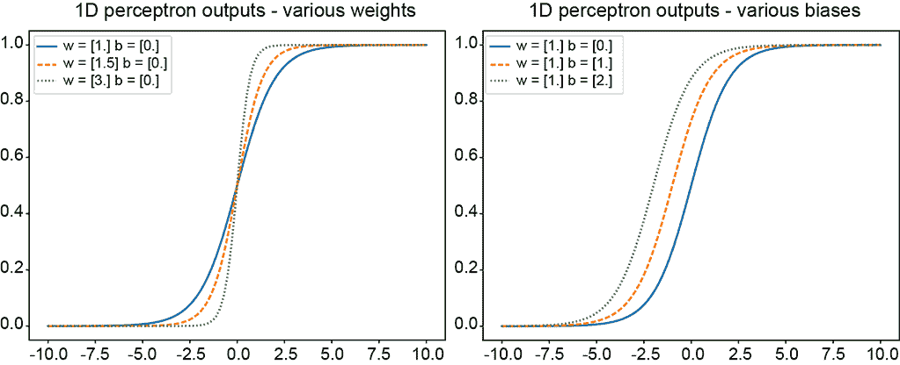

图 8.2 方程 8.2 中对应于各种参数值的 S 形曲线

S 形函数的一些性质

S 形函数有几个有趣的性质，其中一些性质在此列出，并附有证明概要。

+   *正 x 的表达式*：

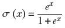

方程 8.3

通过将方程 1.5 的分子和分母都乘以 *e[x]*，可以轻松证明这个表达式。

+   *负 x 的 S 形函数*：

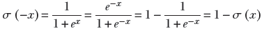

方程 8.4

+   *S 形函数的导数*：

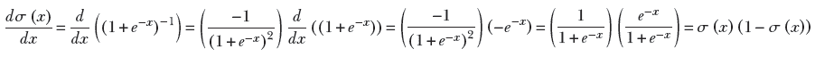

方程 8.5

图 8.3 显示了 S 形函数的导数图像叠加在 S 形函数图像本身上。正如预期的那样，导数在 S 形曲线的中间（S 形函数大致线性上升的地方）达到最大值，在两端（S 形函数饱和和平坦，几乎不变化的地方）接近零。


图 8.3 1D sigmoid 函数（实线）及其导数（虚线）的图

### 8.1.2 双曲正切函数


图 8.4 1D tanh 函数的图

sigmoid 函数的另一种选择是*双曲正切*函数 tanh，如图 8.4 所示。它与 sigmoid 函数非常相似，但输出值的范围是从[−1,1]，而不是[0,1]。本质上，它是将 sigmoid 函数拉伸并平移，使其以 0 为中心。tanh 函数的方程式如下


方程式 8.6

为什么 tanh 比 sigmoid 更受欢迎？为了理解这一点，请考虑图 8.5。它比较了 sigmoid 和 tanh 函数的导数。如图所示，函数在*x* = 0 附近的导数（梯度）比 sigmoid 函数的导数要高得多。更强的梯度意味着收敛速度更快，因为权重更新是以更大的步骤发生的。请注意，这主要适用于数据集中在 0 附近的情况：在大多数预处理步骤中，我们在将其输入神经网络之前对数据进行标准化（使其均值为 0）。

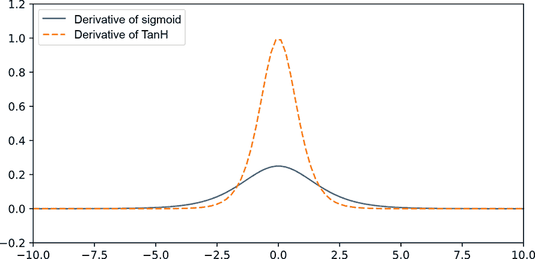

图 8.5 1D sigmoid 和 tanh 函数的导数图

## 8.2 为什么分层？

在第 7.5 节中，我们遇到了将*分层*作为组织多个感知器首选方法的想法。分层网络的主要特性是任何层的神经元只从前一层的输出中获取输入。这意味着只存在连续层之间的连接。在多层感知器（MLP）中不存在其他连接，这极大地简化了网络的评估和训练，这一点在我们讨论前向传播和反向传播时将变得明显。

为什么要有层？我们已经看到，多个感知器使我们能够模拟单一生成器无法解决的问题（例如第 7.4.1 节中讨论的 XOR 问题）。从理论上讲，使用组织在单个隐藏层中的神经元可以模拟所有数学函数（因此解决所有可量化的问题）（参见第 7.5.3 节中 Cybenko 的定理和证明）。然而，这并不意味着单个隐藏层是进行所有建模的最*有效*方式。如果我们将它们组织在多个层中，我们通常可以用更少的感知器来模拟复杂问题。

为什么额外的层有帮助？主要原因是额外的非线性。每一层都引入它自己的非线性函数（例如 sigmoid）。通过适当的参数化，非线性函数可以模拟更复杂的函数。因此，模型中非线性函数的数量越多，通常意味着表达力越强。

## 8.3 线性层

在流行的神经网络架构中使用了各种类型的层。在随后的章节中，我们将探讨不同类型的层，例如卷积层。但在这个部分，我们检查最简单和最基本的层类型：*线性层*。在这里，前一层的每个感知器都与下一层的每个感知器相连。这样的层也被称为*全连接层*。因此，如果前一层有 *m* 个神经元，下一层有 *n* 个神经元，那么就有 *mn* 个连接，每个连接都有自己的权重。

注意：我们交替使用“神经元”和“感知器”这两个词。

图 8.6 显示了一个线性层，它是更大的 MLP 的一部分。图 8.7 显示了一个带有线性层的更大的 MLP。与前面的章节一致，我们使用上标表示层 ID，下标表示源和目标 ID。

从层 (*l* − 1) 的第 *k* 个神经元到层 *l* 的第 *j* 个神经元的连接权重表示为 *w[jk]*^((*l*)）。这里下标顺序是目标 (*j*) 后跟源 (*k*）。这稍微有些反直觉，但普遍遵循，因为它简化了矩阵表示（稍后描述）。注意以下几点：

+   我们将单个感知器（加权求和后跟 sigmoid）拆分为两个独立的层，加权求和和 sigmoid。

+   我们使用 sigmoid 函数而不是 Heaviside 函数作为非线性函数。

### 8.3.1 线性层表示为矩阵-向量乘法

让我们在 MLP 的背景下回顾一下感知器。正如我们在方程 7.3 中看到的，单个感知器对其输入进行加权求和，然后对结果执行阶跃函数。在 MLP 中，第 *l* 层中任何感知器的输入来自前一层：(*l* − 1)层。


图 8.6 线性层输出层 *l* 来自层 (*l* − 1)。权重矩阵的第 1 行（来自所有输入神经元，层 (*l* − 1)，它们相加形成输出神经元 1）的权重以粗体显示。

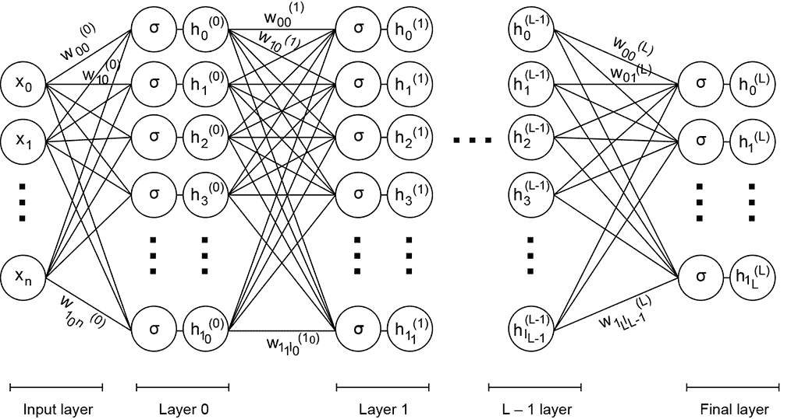

图 8.7 多层神经网络：这是一个完整的深度神经网络，其中一部分如图 8.6 所示。

令 *a*[0]^((*l* − 1))，*a*[1]^((*l* − 1))，⋯，*a[m]*^((*l* − 1)) 表示层 (*l* − 1) 中 *m* 个神经元的输出（图 8.6 中节点的最左侧输入列）。令 *a*[0]^((*l*))，*a*[1]^((*l*))，⋯，*a[n]*^((*l*))) 表示层 *l* 中 *n* 个神经元的输出。请注意，我们通常使用符号 *a*，代表激活，来表示单个神经元的输出。现在考虑层 *l* 中的第 *j* 个神经元。例如，检查图 8.6 中的 *z*[1]^((*l*))：注意进入它的权重和它们的源激活。其输出是 *a[j]*^((*l*))，其中

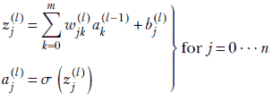

我们可以将这些方程中的求和重写为权重向量和激活向量之间的点积：


所有 *j* 的完整方程集可以用矩阵-向量乘法以超级紧凑的方式写出，

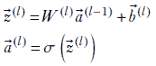

方程式 8.7

其中

+   *W*^((*l*)) 是一个 *n* × *m* 矩阵，表示从层 *l* − 1 到层 l* 的 *所有连接* 的权重：

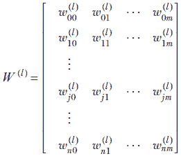

方程式 8.8

+   ^((*l*)) 表示层 *l* 的激活。将 Sigmoid 函数应用于向量等同于将其逐个应用于向量的每个元素：


矩阵-向量表示法通过以全局方式处理所有权重、偏置、激活等，使我们免于处理下标。

### 8.3.2 线性层 MLP 的正向传播和全局输出函数

方程式 8.7 描述了单个线性层的正向传播。具有全连接（即线性）层 0⋯*L* 的 MLP 在输入  上的最终输出可以通过重复应用此方程获得：

*MLP*() = ^((*L*)) = *y* = *σ*(*W*^((*L*))…*σ*(*W*^((1))*σ*(*W*^((0)) + ^((0)))+^((1)))⋯+^((*L*)))

方程式 8.9

在计算机实现中，这个表达式通过重复应用线性层逐步评估：

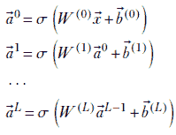

方程式 8.10

很容易看出方程式 8.10 是方程式 8.7 的重述。

仔细检查这些方程揭示了一个美丽的特性。复杂的方程式 8.9 永远不会被明确评估。相反，我们按照方程式 8.10 逐层评估连续层的输出，一次评估一层。每一层都可以通过将前一层的输出作为输入来评估。不需要其他输入。也就是说，我们可以直接从输入  评估 ^((0))，然后从 ^((0)) 评估 ^((1))，从 ^((1)) 评估 ^((2))，以此类推，直到 ^((*L*))（这是 MLP 的全局输出）。在评估过程中，我们只需要在任何给定时间内存中保留前一层和当前层。这个过程极大地简化了实现以及概念化，被称为 *正向传播*。

列表 8.1 PyTorch 代码用于正向传播

```py
def Z(x, W_l, b_l):                    ①
    return torch.matmul(W_l, x) + b_l

def A(z_l):                            ②
    return torch.sigmoid(z_l)

def forward(x, W, b):                  ③
    L = len(W) - 1
    a_l = x
    for l in range(0, L + 1):          ④
        z_l = Z(a_l, W[l], b[l])       ⑤
        a_l = A(z_l)                   ⑥
    return a_l
```

① x: 层 l-1 的激活（1 维向量） *W[l]*: 层 l 的权重矩阵 *b[l]*: 层 l 的偏差向量

② Sigmoid 激活函数（非线性层）

③ x: 1 维输入向量 W: 从层 0 到 L 的矩阵列表 b: 从层 0 到 L 的向量列表

④ 遍历层 0 到 L

⑤ 计算 Z

⑥ 计算激活

## 8.4 训练和反向传播

在整本书中，我们一直在讨论这个过程的点点滴滴。在第 1.1 节和第 3.3 节（特别是算法 3.1），我们看到了训练监督模型的过程概述（如果需要，请重新阅读）。训练是一个迭代过程，通过这个过程估计神经网络的参数。目标是估计参数（权重和偏差），使得在训练输入上，神经网络的输出尽可能接近已知的真实输出。

通常，迭代过程会逐渐改善（接近目标）。在每次迭代中，我们对参数进行小的调整。在这里，“参数”指的是 MLP 的权重和偏差，即第 8.2 节中的*w[jk]*^((*l*))s 和*b[j]*^((*l*))s。我们不断调整参数，使得在每次迭代中，训练数据输入上的输出越来越接近真实值（GT）。最终，经过多次迭代，我们希望收敛到最优值。请注意，没有保证迭代过程会收敛到最佳可能的参数值。训练可能会完全偏离轨道或陷入局部最小值。（局部最小值在第 3.6 节中解释；如果需要，请重新阅读。）没有好的方法知道我们是否已经达到了权重和偏差的最优值（全局最小值）。我们通常在测试数据上运行神经网络，如果结果令人满意，我们就停止训练。测试数据应该在训练期间保留，这意味着我们永远不应该使用测试数据来训练。在不幸的情况下，网络没有达到所需的准确度水平，我们通常会添加更多的训练数据，或者尝试修改损失函数和/或不同的架构。简单地从不同的随机起点重新训练网络也可能有效。这是一个充满试验和错误的实验科学。

我们如何知道如何在每次迭代中调整参数值？我们定义一个损失（也称为误差）函数。有许多流行的损失函数公式，我们稍后会回顾其中许多，但它们的共同特性是当神经网络输出与已知输出（GT）更一致时，损失会降低，反之亦然。因此，如果 *y* 表示神经网络的输出，而 *ȳ* 是 GT，则损失的一个合理表达式是*均方误差*（MSE）函数 (*y* − *ȳ*)²。现在，我们使用 MSE 损失作为我们的代表性损失函数。稍后我们将讨论其他函数。

一旦损失函数被定义，我们就有了神经网络训练目标的清晰、定量定义。目标是使整个训练数据集的总损失最小化。请注意条款“整个训练数据集”：我们不希望在损失其他数据的情况下，只在少数几个输入实例上表现良好。如果我们必须在所有 100 个训练输入实例上产生 10%的错误与在 50 个训练输入实例上产生 0%的错误但在剩余的 50 个实例上产生 40%的错误之间做出选择，我们更倾向于前者。

多层感知器（MLP）中的每个权重 *w[jk]*^((*l*）) 都通过一个与 *δw[jk]*^((*l*)）成比例的量进行调整。同样，每个偏置 *b[j]*^((*l*)）也通过一个与 *δb[j]*^((*l*)）成比例的量进行调整。我们可以通过说我们有一个权重向量  和偏置向量  来简洁地表示所有这些。在每次迭代中，我们通过改变  的量 *δ* 和  的量 *δ* 来改变它们，以便它们的新值是  − *rδ* 和  − *rδ*，其中 *r* 是一个称为*学习率*的常数，需要在训练开始时设置）。在这个上下文中，值得注意的是，在 8.3.1 节中，我们用矩阵表示了 MLP 中的权重集合，而在这里我们用向量来指代同一事物。这些并不矛盾，因为我们总是可以将矩阵的元素（即从上到下和从左到右遍历矩阵的元素）转换成一个向量。

我们如何估计调整量 *δ* 和 *δ*？这就是梯度概念发挥作用的地方。这些内容在 3.3.1、3.3.2 和 3.5 节中已有详细讨论（再次提醒，如有必要，请重新阅读）。一般来说，如果损失 𝕃 表示为参数的函数，例如 𝕃(, )，那么使损失最优降低的参数变化由损失相对于参数的梯度 ∇![MLP, *b*]𝕃(, *b*) 得出。本章稍后将在算法 3.2 中描述高级过程。这里我们来看看其核心内容。

### 8.4.1 损失及其最小化：训练目标

给定一个训练数据集 𝕃，它是一组 <输入，GT 输出> 对 𝕃 = {⟨, *ȳ*⟩}，损失可以表示为

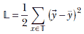

方程 8.11

其中

 = *MLP*()

如方程 8.9 所示。

现在再次考虑方程 8.7。我们可以将每一层的权重矩阵 *W*^((*l*)) 转换为一个向量，然后将这些从连续层中依次连接的向量组合成一个巨大的权重向量 ，即 MLP 中所有权重的向量：

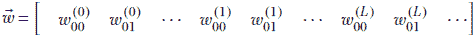

同样，我们可以形成一个包含 MLP 中所有偏差的巨大向量：

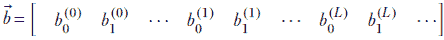

训练的最终目标是找到  和 ，它们将最小化损失 𝕃。在第三章中，我们了解到我们可以通过设置梯度 ∇![MLP]𝕃 = 0 和 ∇![MLP]𝕃 = 0 来求解最小值。从方程 8.9 和 8.11 的组合中计算损失梯度是不可行的。相反，我们采用迭代解法：在损失表面上进行 *梯度下降*，如下一节所述。

列表 8.2 用于 MSE 损失的 PyTorch 代码

```py
def mse_loss(a_L, y):                      ①
    return 1./ 2 * torch.pow((a_L - y), 2) ②
```

① a: 层 L 的激活（1D 向量）: 真实值（1D 向量）

② 见方程 8.11。

### 8.4.2 损失表面和梯度下降

几何上，损失函数 𝕃(, ) 可以看作是在高维空间中的一个曲面。这个空间的域对应于  中的所有维度加上  中的所有维度。这如图 8.8 中的二维域所示。在第三章中，我们也看到了，给定一个函数 𝕃(, )，向最小值前进的最佳方式是沿着负梯度在参数空间中行走。我们采用这种方法来最小化损失。我们计算损失函数相对于权重和偏差的梯度，并通过与这些梯度的（负）成比例的量来更新权重和偏差向量。重复这样做可以使我们接近最小值。在图 8.8 中，梯度下降路径用实线箭头表示，而到最小值的任意非最优路径用虚线箭头表示。

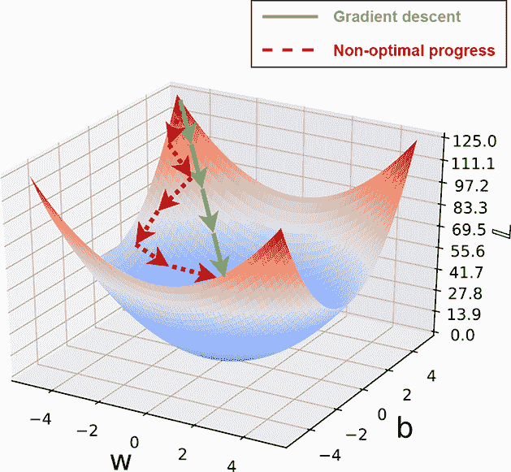

图 8.8 一个代表性的损失 𝕃(*w*, *b*)。注意， 和  都已经在这个图中被简化为 1D。

因此，梯度下降中更新权重和偏差的方程是


方程 8.12

其中 *r* 是一个常数。在这里


方程 8.13

向量更新方程 8.12 可以用标量分量表示为

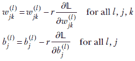

方程 8.14

注意，我们必须在每次迭代中重新评估这些偏导数，因为它们的值会在每次迭代中改变。

### 8.4.3 为什么梯度提供了下降的最佳方向

为什么沿着梯度更新可以最优地减少函数？这在第三章中有详细讨论。在这里，我们简要回顾一下这个想法。使用多维泰勒展开，我们可以在已知点的邻域内评估一个函数。例如，我们可以评估 𝕃( + *δ*)，其中 *δ* 是从  出发的小偏移量，如下所示


方程 8.15

其中 *H*，称为 *海森矩阵*，其定义如方程 3.9。由于我们没有离开  太远，||*δ*|| 很小。这意味着二次和更高阶的项可以忽略不计，我们可以将它们省略（当 ||*δ*|| → 0 时，近似是完美的）：

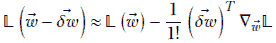

但我们知道点积 ()*^T* ▽𝕃将在两个向量指向同一方向时达到其最大值：也就是说，


对于某个比例常数 *r*。

在实现中，*r* 被称为 *学习率*。较高的学习率会导致优化过程更快地进展，但也存在超过最小值的危险。我们将在后面更详细地了解这些内容。现在，只需注意*r*是系统的*可调超参数*。

因此，从𝕃()到𝕃( – )的最大值减少发生在*δ*沿着负梯度方向时。这就是为什么我们在梯度下降中朝着负梯度移动：这是达到最小值最快的方式。图 8.8 中的直线箭头说明了梯度的方向。虚线箭头显示了一个任意的非梯度路径以供比较。

我们可以类似地处理偏置向量 。

### 8.4.4 梯度下降和局部最小值

我们应该注意，梯度下降可能会陷入一个 *局部最小值*。图 8.9 展示了这一点。

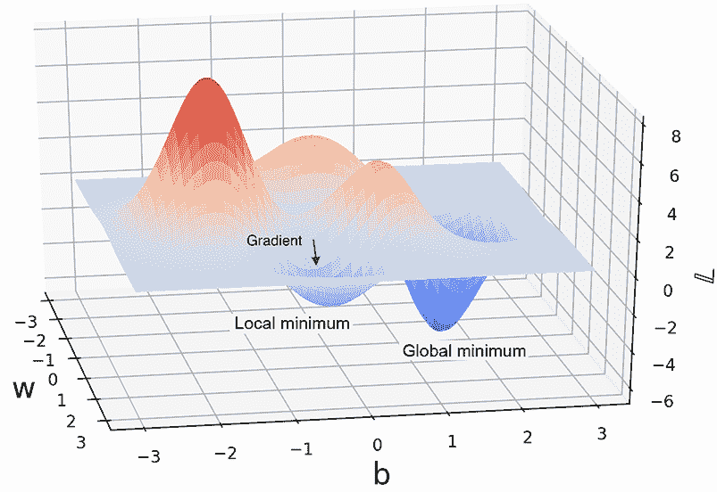

图 8.9 具有局部和全局最小值的非凸函数。根据点，梯度下降可能会带我们到其中一个。

在早期时代，优化技术努力避免局部最小值并收敛到全局最小值。像模拟退火和隧道这样的技术被精心设计来避免局部最小值。现代神经网络采取了不同的态度：它们并不非常努力地避免局部最小值。有时局部最小值是一个可接受的（足够准确）解。否则，我们可以重新训练神经网络：它将从随机位置开始，所以这次它可能达到更好的最小值。


图 8.10 层 0, …, *L*的 MLP，每层一个神经元。再次强调，我们将每一层都分解为一个加权求和和一个 sigmoid 函数。

### 8.4.5 反向传播算法

我们已经看到，梯度下降通过反复更新权重和偏置（方程 8.12）来进展。这相当于通过方程 8.14 反复使用单个偏导数更新单个权重和偏置。

从方程 8.9 和 8.11 获得梯度 ∇![]𝕃(, ), ∇![]𝕃(, ) 的闭式解，或者，等价地，获得偏导数 *∂*𝕃/*∂w[jk]*^((*l*)), *∂*𝕃/*∂b[j]*^((*l*)) 的闭式解，是非常困难的。反向传播是一种算法，允许我们像前向传播（方程 8.10）一样逐层评估梯度并更新权重和偏置。

简单网络的反向传播算法

我们首先讨论一个简单的 MLP 的反向传播，该 MLP 每层只有一个神经元。由此产生的主要简化是，单个权重和偏置不再需要下标，在连续两层之间只有一个权重和一个偏置。然而，它们仍然需要上标来表示层 ID。图 8.10 显示了这个 MLP。我们使用 MSE 损失（方程 8.11），但我们只在一个输入输出对 *x[i]*, *y[i]* 上工作。通过重复相同的步骤，可以很容易地推导出总损失（对所有训练数据实例求和）。

我们首先定义一个辅助变量：

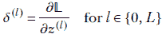

δ^((*l*)) 的物理意义是它表示损失相对于层 l 的（预激活）输出的变化率（记住，在这个网络中，层 l 有一个神经元）。

让我们为图 8.10 中的 MLP 建立几个重要方程：

+   *任意层 l 的前向传播* *l* ∈ {0, *L*}

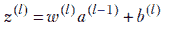

方程 8.16


方程 8.17

+   *损失*—在这里我们处理单个训练数据实例，*x[i]*，其 GT 输出为 *ȳ[i]*：

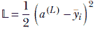

+   *损失相对于权重和偏置的偏导数，以最后一层辅助变量 L 为条件*—使用偏导数的链式法则，

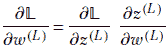

检查右侧的项，我们看到

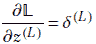

（层 *L* 的辅助变量）。并且使用前向传播方程，


一起，它们导致


同样，

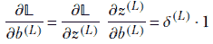

因此，我们得到以下一对方程，分别表示损失相对于权重和偏置的偏导数，以最后一层的辅助变量为条件：

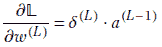

方程 8.18

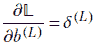

方程 8.19

+   *最后一层的辅助变量 L*—使用偏导数的链式法则，


使用方程 8.5 对 Sigmoid 函数的导数进行计算，我们得到

*δ*^((*L*)) = (*a*^((*L*))−*ȳ[i]*) *σ*(*z*^((*L*)))(1−*σ*(*z*^((*L*))))

使用方程 8.17，这导致

*δ*^((*L*)) = (*a*^((*L*))−*ȳ[i]*) *a*^((*L*))(1−*a*^((*L*)))

方程 8.20

+   *关于任意层 l* 的辅助变量，损失相对于权重和偏置的偏导数——使用偏导数的链式法则，


使用辅助变量的定义和前向传播方程 8.16，这导致

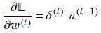

方程 8.21

类似地，

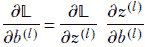

使用辅助变量的定义和前向传播方程 8.16，这导致


方程 8.22

+   *任意层 l* 的辅助变量——使用偏导数的链式法则，


使用辅助变量的定义和前向传播方程 8.16，这导致


这将得到

*δ*^((*l*)) = *δ*^((*l*+1)) *w*^((*l*+1)) *a*^((*l*))(1−*a*^((*l*)))

方程 8.23

我们首次遇到逐层处理属性是在第 8.3.2 节中，与前向传播方程相关。让我们在训练简单网络的情况下回顾一下这一点。考虑方程 8.16 和 8.17。我们使用一些权重 *w*^((*l*)) 和偏置 *b*^((*l*)) 的值初始化系统。使用这些值，我们可以评估第 0 层的输出。首先，我们可以轻松地评估 *z*^((0)) 和 *a*^((0))（因为所有输入都是已知的）：


一旦我们有了 *z*^((0)) 和 *a*^((0))，我们可以使用它们通过方程 8.16 和 8.17 来评估 *z*^((1)) 和 *a*^((1))。但如果我们有 *z*^((1)) 和 *a*^((1))，我们再次可以通过方程 8.16 和 8.17 使用它们来评估 *z*^((2)) 和 *a*^((2))。以此类推，我们可以一直进行到层 *L*，以获得 *a*^((*L*))，这是多层感知器 (MLP) 的最终输出。换句话说，我们可以迭代地评估连续层的输出，只使用前一层的输出。不需要知道其他层。在任何给定迭代中，我们只需要记住前一层的输出：我们可以从那里构建当前层。将方程 8.16 和 8.17 应用于层 0 到 *L* 的单个序列被称为 *前向传播*。

可以应用类似的技巧来评估辅助变量，但我们需要进行*反向计算*。我们可以通过方程 8.20 评估最后一层的辅助变量，*δ*^((*L*))。但是一旦我们有了 *δ*^((*L*))，我们可以通过方程 8.23 评估 *δ*^((*L* − 1))。从那里，我们可以评估 *δ*^((*L* − 2))。我们可以以此类推，一直计算到层 0，依次评估 *δ*^((*L*))，*δ*^((*L* − 1))，⋯，*δ*^((0))。每次评估一个 *δ*^((*l*))，我们也可以通过方程 8.21 和 8.22 分别评估同一层的 *∂*𝕃**/***∂w*^((*l*)) 和 *∂*𝕃**/***∂b*^((*l*))。我们还可以使用刚刚估计的偏导数立即更新该层的权重和偏置，因为当前值在训练过程中将不再需要。因此，从最后一层开始，我们可以以这种方式更新所有层的权重和偏置，直到层 0。这就是*反向传播*。

当然，我们必须同时进行：一次前向传播，为层 0 到 *L* 设置 *z* 和 *a* 的值，然后是层 *L* 到 0 的反向传播层。重复这些步骤，直到收敛。

注意：前向传播、均方误差损失和反向传播的完整代码，可通过 Jupyter Notebook 执行，可以在 [`mng.bz/pJrw`](http://mng.bz/pJrw) 找到。

列表 8.3 PyTorch 代码用于前向和反向传播

```py
def forward_backward(x, y, W, b):
    L = len(W) - 1
    a = []
    for l in range(0, L+1):
        a_prev = x if l == 0 else a[l-1]              ①
        z_l = Z(a_prev, W[l], b[l])
        a_l = A(z_l)
        a.append(a_l)

    loss = mse_loss(a[L], y)                          ②

    deltas = [None for _ in range(L + 1)]
    W_grads = [None for _ in range(L + 1)]            ③
    b_grads = [None for _ in range(L + 1)]

    a_L = a[L]                                        ④
    deltas[L] = (a_L - y) * a_L * (1 - a_L)
    W_grads[L] = torch.matmul(deltas[L], a[L - 1].T)  ⑤
    b_grads[L] = deltas[L]

    for l in range(L-1, -1, -1):                      ⑥
        a_l = a[l]
        deltas[l] =  torch.matmul(W[l+1].T, deltas[l + 1]) * a_l * (1 - a_l)
        W_grads[l] = torch.matmul(deltas[l], a[l - 1].T)
        b_grads[l] = deltas[l]

    return loss, W_grads, b_grads
```

① 前向传播

② 计算均方误差损失

③ 存储层 0 到 *L* 的 *δ*^((*l*))，*∂*𝕃**/***∂w*^((*l*))，*∂*𝕃**/***∂b*^((*l*)) 的数组

④ 激活最后一层 - *a*^((*L*))

⑤ 计算层 *L* 的 *δ* 和梯度

⑥ 计算层 0 到 *L* − 1 的 *δ* 和梯度

在任意线性层网络上的反向传播算法

在 8.4.5.1 节中，我们看到了一个只有每层一个神经元的简单网络。只有一个连接，因此每层只有一个权重、一个激活和一个辅助变量。因此，我们可以省略所有这些变量的下标（尽管我们必须保留表示层的上标）。现在我们考察一个更通用的网络，由线性层 0，⋯，*L* 组成。这个网络的任意切片如图 8.6 所示。

最终目标是评估损失相对于权重和偏置的偏导数。使用它们，我们可以更新当前的权重和偏置，以最优地减少损失。

我们的整体策略如下。我们再次使用辅助变量。我们首先推导出允许我们计算最后一层辅助变量的表达式。然后我们推导出一个表达式，允许我们在给定层 *l* + 1 的辅助变量的情况下，计算任意层 *l* 的辅助变量。由于我们可以直接计算最后一层 *L* 的辅助变量，我们可以使用这个表达式来计算倒数第二层 *L* − 1 的辅助变量。但是一旦我们有了它们，我们就可以计算层 *L* − 2 的辅助变量。我们就这样一直进行下去，直到达到层 0。因此我们可以计算所有的辅助变量。我们还推导出允许我们从辅助变量中计算损失相对于权重和偏差的偏导数的表达式。这给了我们所需的一切。由于我们首先计算与最后一层相关的事物，然后迭代地朝向初始层进行，这个过程被称为 *反向传播*。

你将注意到接下来推导的表达式与为单神经元每层网络推导的表达式之间的相似性。差异如下解释：

+   *前向传播（任意层 l）*—通过这个网络的前向传播已在第 8.3.1 节中描述，可以用方程 8.7 简要表示，此处重复以方便参考）。左侧是针对单个神经元的标量方程；右侧是针对整个层的向量方程。它们是等价的：


方程 8.24

索引 *j* 和 *k* 遍历相关层中的所有神经元。按照惯例，我们总是用这些变量表示层中的任意神经元。变量 *l* 用于索引层。在索引权重时，我们通常用 *j* 表示目标，用 *k* 表示源——记住权重是按（目标，源）意外地索引的，以简化数学。通常，向量对应整个层。单个向量元素对应特定的神经元，并由 *j* 或 *k* 索引。

+   *损失*—与简单的网络不同，在这里，最终的 *L* 层可以包含多个神经元。因此，损失函数变为

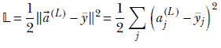

方程 8.25

其中求和发生在最后一层的所有神经元上。注意，^((*L*))是 MLP 的输出，即^((*L*)) =  = *MLP*()对于训练输入（见方程式 8.10）。对应于的 GT 输出是常数向量*ȳ*。越接近*ȳ*，损失越小。注意，我们需要在整个训练数据集上平均损失。这里我们展示了单个训练数据实例的损失计算。计算只需为每个训练数据实例复制，然后取平均值。

+   *辅助变量*——由于一个层有多个神经元，我们为每个神经元有一个辅助变量。因此，辅助变量有一个下标来标识该层中的特定神经元。它继续有一个上标来表示其层。我们定义

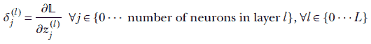

+   *最后一层的辅助变量*


使用方程式 8.25 并观察，由于*a[j]*s 彼此独立，因此在相对于*a[j]*^((*L*))的微分过程中，求和中只有一个项——第*j*项会幸存，我们得到

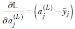

此外，使用 8.24 中的左下方程和方程式 8.5，我们得到

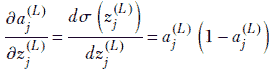

结合这些，我们得到

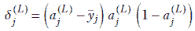

方程式 8.26


方程式 8.27

在这里，∘ 表示两个向量之间的 Hadamard 积。它基本上是一个元素级对应向量元素乘积的向量。因此，

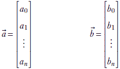

方程式 8.28


方程式 8.29

方程式 8.26 和 8.27 是相同的。前者是一个表示最后一层单个辅助变量的标量方程。后者是一个表示最后一层所有辅助变量的向量方程。如果我们已经执行了前向传递并有了其结果，包括*a[j]*^((*L*))s 以及训练数据的 GT，我们可以直接计算这些方程。

+   *任意层的辅助变量*—这比每层只有一个神经元的情形显著不同且更难以理解。我们试图评估在一般情况下的 *δ[j]*^((*l*)) = *∂*𝕃**/***∂z[j]*^((*l*))：即对于任意层 *l*。损失并不*直接*依赖于内部层变量 *z[j]*^((*l*)）。损失直接依赖于仅最后一层的激活，这些激活依赖于前一层，依此类推。任何一层中的 *z* 形成一个*完整*的依赖集，对于损失 𝕃，这意味着损失可以用这些变量来表示，而无需其他变量。特别是，我们可以将损失表示为 𝕃(*z*[0]^((*l*+1)), *z*[1]^((*l*+1)), *z*[2]^((*l*+1)),⋯)。你可以形成一个心理图像，*z[j]*^((*l*)) 通过下一层的所有 *z* 扩散到 𝕃，即 *z*[0]^((*l*+1)), *z*[1]^((*l*+1)), *z*[2]^((*l*+1))，等等。然后，使用偏导数的链式法则，

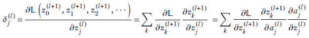

现在，根据定义，


并且使用方程 8.24，

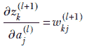

而

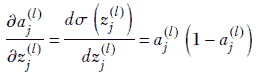

将所有这些结合起来，我们得到单个辅助变量的标量表达式。它及其整个层的等价向量方程在此处展示：

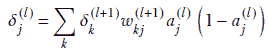

方程 8.30


方程 8.31

这里，∘ 表示前面解释过的 Hadamard 乘法，*W*^((+1*l*)) 是表示从层 *l* 到层 (*l*+1)* 的所有连接的矩阵（参见方程 8.8）。方程 8.30 和 8.31 允许我们在前向传播的结果 (*a*s) 可用的情况下，从 *δ*^((*l*+1))s 评估 *δ*^((*l*))s。我们已经表明，最后一层的辅助变量可以直接从该层的激活中计算出来。因此，我们可以评估所有层的辅助变量。

+   *关于辅助变量的损失相对于权重和偏差的导数*—我们已经看到了如何计算辅助变量。现在我们将关于权重和偏差的损失的偏导数用这些变量来表示。这将为我们提供沿着负梯度更新权重和偏差所需的梯度，这是最小化损失的最优移动：

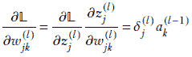

方程 8.32

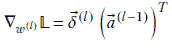

方程 8.33

方程 8.32 和 8.33 是等价的。第一个是标量，与层 *l* 中的单个权重相关，第二个描述了整个层。同样，方程 8.34 和 8.35 也是等价的：

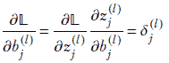

方程式 8.34


方程式 8.35

第一个是标量，与层 *l* 中的单个偏差有关，第二个描述了整个层。

### 8.4.6 将所有内容组合起来：整体训练算法

之前，我们讨论了前向传播：将输入向量  通过一系列线性层传递并生成输出预测。我们学习了 MSE 损失，𝕃，它计算输出预测与 GT，*y* 的偏差。我们还学习了如何使用反向传播计算 𝕃 对参数 *W* 和 *b* 的梯度。在以下算法中，我们描述了这些组件如何在训练过程中结合：

算法 8.5 训练神经网络

使用随机值初始化 , *b*

**while** 𝕃 > *threshold* **do**

⊳ 前向传播

**for** *l* ← 0 to *L* **do**

^((*l*)) = *W*^((*l*)) ^((*l*–1)) + ^((*l*))

^((*l*)) = *σ*(^((*l*)))

**end** **for**

⊳ 损失

𝕃 = 1/2 ||^((*L*)) – *ȳ*||²

⊳ 最后一层的梯度

 ^((*L*)) = (^((*L*)) – *ȳ*) ∘ ^((*L*)) ∘ (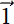 – ^((*L*)))

▽*W*^((*L*))𝕃 =  ^((*L*))(^((*L*–1)))^T

▽*b*^((*L*))𝕃 =  ^((*L*))

⊳ 剩余层的梯度

**for** *l* ← *L* – 1 to 0 **do**

 ^((*l*)) = ((*W*^((*l*+1)))*^T* ^((*l*+1))) ^((*l*)) ∘ ( – ^((*l*)))

▽*W*^((*l*))𝕃 =  ^((*l*)) (^((*l*–1)))^T

▽*b*^((*l*))𝕃 =  ^((*l*))

**end** **for**

⊳ 参数更新

*W* = *W* – *r*▽*[W]*𝕃

*b* = *b* – *r*▽*[b]*𝕃

**end** **while**

## 8.5 使用 PyTorch 训练神经网络

现在我们已经了解了训练过程是如何工作的，让我们看看如何在 PyTorch 中实现它。为此，让我们看以下示例。考虑一家试图解决需求预测问题的电子商务公司：该公司希望估计即将到来的周内将售出的手机数量，以便相应地管理其库存。我们的目标是开发一个可以进行此类预测的模型。让我们假设特定周的销量是三个变量的函数：(a)上周售出的手机数量，(b)提供的折扣，以及(c)到下一个假期的周数。我们将这些变量分别称为`prev_week_sales`、`discount_fraction`和`weeks_to_next_holidays`。这个例子可以建模为一个回归问题，其中我们从一个形式为`[prev_week_sales, discount_fraction, weeks_to_next_holidays]`的输入向量中预测即将到来的周内售出的手机数量。

备注：本节完全功能的代码，可通过 Jupyter Notebook 执行，可在[`mng.bz/O1Ra`](http://mng.bz/O1Ra)找到。

从历史数据中，我们生成一个包含过去*N*周三个变量值的大数据集`X`。`X`表示为一个*N* x 3 的矩阵，其中每一行代表一个单独的训练数据实例，而*N*是可用的数据点的总数。我们还有一个长度为*N*的 GT 向量*ȳ*，其中包含训练数据集中每周的实际手机销量。表 8.1 显示了我们的训练集的样本数据点。

表 8.1 需求预测的样本训练数据

| 上周销量 | 折扣比例 (%) | 到下一个假期的周数 | 销售单位数 |
| --- | --- | --- | --- |
| 76,440 | 63 | 2 | 94,182 |
| 41,512 | 50 | 3 | 51,531 |
| 77,395 | 77 | 9 | 95,938 |
| … | … | … | … |
| 21,532 | 70 | 4 | 28,559 |

备注：在本节中，`X`和*ȳ*指的是整个批次的训练数据实例。由于数据集很大，这在实际设置中可能不可行。为了解决这个问题，我们通常使用`X`和*ȳ*的迷你批次。我们将在下一章正式介绍迷你批次的概念。

关于数据集的一个重要观点是，每个特征的值域完全不同。例如，上周的销售量以数万个单位的数字表示，而折扣分数是一个介于 0 和 100 之间的百分比数字。在机器学习中，将所有值归一化到共同尺度是一个好的实践，因为这样做可以帮助提高训练速度并减少陷入局部最小值的机会。对于我们的例子，让我们使用最小-最大归一化将所有特征缩放到 0-1 范围。以下代码片段展示了如何在 PyTorch 中执行最小-最大归一化。在接下来的讨论中，我们假设我们正在处理归一化后的数据：

```py
def min_max_norm(X, y):
    X, y = X.clone(), y.clone()              ①
    X_min, X_max = torch.min(X, dim=0)[0], 
            torch.max(X, dim=0)[0]           ②
    X = (X - X_min) / (X_max - X_min)        ③
    y_min, y_max = torch.min(y, dim=0)[0], 
            torch.max(y, dim=0)[0]           ④
    y = (y - y_min) / (y_max - y_min)        ⑤
    return X, y
```

① 复制数据，以免损坏原始数据

② 计算*X*每一列的最小值和最大值

③ 归一化*X*

④ 计算最小值和最大值*y*

⑤ 归一化*y*

为了解决回归问题，我们首先定义一个两层神经网络模型，它可以接受形式为[`prev_week_sales`，`discount_fraction`，`is_holidays_ongoing`]的 3D 输入向量，并生成输出预测。以下代码片段给出了 PyTorch 实现：

```py
class TwoLayeredNN(torch.nn.Module):
    def __init__(self, input_size, hidden1_size, hidden2_size, output_size):
        super(TwoLayeredNN, self).__init__()

        self.model = torch.nn.Sequential(                  ①

            torch.nn.Linear(input_size, hidden1_size),     ②
            torch.nn.Sigmoid(),

            torch.nn.Linear(hidden1_size, hidden2_size),   ③
            torch.nn.Sigmoid(),

            torch.nn.Linear(hidden2_size, output_size)     ④
        )

    def forward(self, X):                                  ⑤
        return self.model(X)

nn = TwoLayeredNN(input_size=X.shape[-1], hidden1_size=10,
                                  hidden2_size=5, output_size=1)
```

① 将网络定义为一系列线性层和 sigmoid 层

② 第一个隐藏层，权重矩阵大小为 input_size × hidden1_size）

③ 第二个隐藏层，权重矩阵大小为 hidden1_size × hidden2_size）

④ 输出层，权重矩阵大小为 hidden2_size × output_size）

⑤ *X*是一个*N* × 3 的矩阵。每一行是一个（3D 向量），代表一个单独的数据点。

PyTorch 中的神经网络模型应该继承自`torch.nn.Module`并实现`forward`方法。我们的两层神经网络包含两个线性层，每个线性层后面跟着一个 sigmoid（非线性）激活层。最后，我们有一个将最终激活转换为输出预测的线性层。这些层通过`torch.nn.Sequential`类链接在一起，形成两层神经网络。每次我们使用`nn(X)`调用模型时，都会调用`forward`方法，并将输入`X`传递到各个层以获得最终输出。

现在我们已经定义了神经网络及其前向传递，我们需要定义损失函数。我们可以使用方程 8.11 中定义的均方误差损失。损失函数本质上比较神经网络模型预测的需求与 GT 的实际需求，当差异较大时返回较大的值，当差异较小时返回较小的值。均方误差损失在 PyTorch 中通过`torch.nn.MSELoss`类提供。以下代码片段展示了示例调用：

```py
loss = torch.nn.MSELoss() ①

loss(y_pred, y_gt)        ②
```

① 实例化损失函数

② 计算损失 _pred：神经网络的输出 _gt：真实值

最后，我们需要一种方法来计算损失相对于模型参数的梯度，这样我们就可以开始训练过程。幸运的是，我们不需要显式地计算梯度，因为 PyTorch 会自动使用自动微分（autograd）为我们完成这项工作。（有关 autograd 的更多详细信息，请参阅第 3.1 节。）对于我们的当前示例，我们可以通过调用 `loss.backward()` 来指示 PyTorch 运行反向传播并计算梯度。有了这个，我们就准备好开始训练了。训练神经网络的 PyTorch 代码如下所示。

列表 8.4 训练神经网络

```py
nn = TwoLayeredNN(input_size=X.shape[-1],             ①
                  hidden1_size=10,
                  hidden2_size=5,
                  output_size=1)
loss = torch.nn.MSELoss()                             ②
optimizer = torch.optim.SGD(nn.parameters(), lr=0.2,  ③
                            momentum=0.9)
num_iters = 1000

for i in range(num_iters):                            ④
    y_out = nn(X)                                     ⑤
    mse_loss = loss(y_out, y)                         ⑥
    optimizer.zero_grad()                             ⑦
    mse_loss.backward()                               ⑧
    optimizer.step()                                  ⑨
```

① 实例化神经网络

② 实例化损失函数

③ 实例化优化器

④ 训练循环

⑤ 前向传播

⑥ 计算损失

⑦ 清除梯度并防止上一步的梯度累积

⑧ 运行反向传播（计算梯度）

⑨ 更新权重

在训练循环中，我们迭代地运行前向传播，计算损失，计算梯度，并更新权重。神经网络以随机权重初始化，因此在训练循环的早期迭代中做出任意预测。这导致初始损失值很高。然而，随着训练的进行，权重被更新以最小化损失值，预测的需求更接近实际 GT。为了更新权重，我们使用所谓的 *优化器*。在训练过程中，通过在 `loss` 对象上调用 `backward()` 函数来计算梯度。随后，`optimizer.step` 调用更新权重和偏差。在这个例子中，我们使用了基于随机梯度下降的优化器，可以使用 `torch.optim.SGD` 来调用。PyTorch 提供了各种优化器，如 Adam、AdaGrad 等，这些将在下一章中详细讨论。我们通常运行训练循环，直到损失达到足够低的值，以被接受。一旦训练循环完成，我们就拥有了一个可以轻松接受新数据点并生成输出预测的模型。

## 摘要

+   Sigmoid 函数 *σ*(*x*) = 1/(1+*e^(–x*)* 有一个 S 形的图像，是 Heaviside 步函数的微分形式，因此被用于感知器中。因此，感知器函数整体变为 *P*() ≡ *σ*(*^T* + *b*)。它由  和 *b* 参数化，分别控制 S 形曲线的斜率和位置。

+   神经网络通过近似解决特定问题的函数来解决需要智能的现实生活中问题。它们由多个通过加权边相互连接的感知器组成。我们不是随意连接感知器，而是将它们连接成层。在分层网络中，一个感知器仅与前一层的感知器连接。不允许存在层内和其他连接。

+   监督神经网络为输入值样本集手动生成输出（真实值）。这个由输入和已知输出组成的数据集称为训练数据集。

+   损失被定义为神经网络在训练数据输入上生成的真实值与实际输出之间的不匹配。计算损失的最简单方法是计算神经网络生成的输出和真实向量之间的欧几里得距离。这被称为均方误差（MSE）损失。从数学上讲，给定一个训练数据集 𝕜，它是一组<input, GT 输出>对 𝕜 = {⟨, *ȳ*⟩}，损失可以表示为

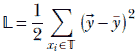

其中输出为*[i]* = *MLP*(*[i]*).

+   训练是优化特定神经网络连接权重和偏置的过程，以使损失最小。注意，在推理过程中，神经网络通常看到它在训练期间从未见过的数据。推理输出只有在训练输入的分布大致匹配整体输入分布时才是好的。

+   我们通过迭代调整权重和偏置来最小化损失。到达多元函数最近最小值的最快方式是遵循梯度。因此，我们根据损失函数的梯度调整权重和偏置。从数学上讲，

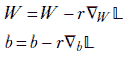

+   前向传播是使用神经网络从输入生成输出的过程：更具体地说，是一个多层感知器（MLP）。因此，MLP 通过前向传播进行推理。分层网络的一个美丽特性是我们可以一次处理一层，从层 0（最接近输入层）迭代到输出层。从数学上讲，


其中 *W*^((*l*)), ^((*l*)) 代表层 *l* 的权重和偏置，而 ^((*l*)) 代表层 *l* 的激活输出，这同时也是层 *l* + 1 的输入。

+   反向传递是一个生成所有权重和偏置相对于损失函数梯度的过程。它依赖于前一个正向传递的结果，并从输出层向输入层进行。它使用辅助变量 ^((*l*))，这些变量可以通过从最后一个（最接近输出层）层反向迭代到第一个（最接近输入层）层来计算——因此得名*反向传播*——并且所有所需的梯度都可以从这些辅助变量中计算出来。数学上，

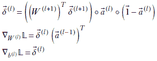

+   训练过程通过在训练数据集上交替进行正向和反向传递来推进。
