# 第十章：神经网络中的 10 种卷积

本章涵盖

+   神经网络的图形和代数视图

+   带自定义权重的二维和三维卷积

+   向神经网络添加卷积层

图像分析通常涉及识别*局部*模式。例如，为了进行面部识别，我们需要分析眼睛、鼻子和耳朵对应的相邻像素的局部模式。照片的主题可能站在海滩上，面对着大海，但涉及沙子和水的整体画面是不相关的。

卷积是一种特殊的操作，它检查输入信号中的局部模式。这些操作通常用于分析图像：即输入是一个像素的二维数组。为了说明这一点，我们考察了一些特殊用途的卷积操作示例，这些操作检测图像中像素小邻域的边缘、角落和平均光照。一旦我们检测到这些局部属性，我们就可以将它们组合起来，识别更高层次的模式，如耳朵、鼻子和眼睛。我们可以依次将它们组合起来，以检测更高层次的结构，如面部。系统自然地适合多层卷积神经网络

网络——最低层（最接近输入）检测边缘和角落，下一层检测耳朵、眼睛、鼻子等等。

在第 8.3 节中，我们讨论了*线性*神经网络层（也称为*全连接*层）。在那里，每个输出都与*所有*输入相连。这意味着输出是通过取所有输入值的加权线性组合得到的。换句话说，输出是从输入的*全局*视角得到的。卷积层不同。这些层的特点是：

+   *局部连接*—只有一小部分相邻的输入值与一个输出值相连。因此，每个输出值只是少量相邻输入值的加权线性组合。结果，只有输入中的局部模式被捕捉到。

+   *共享权重*—相同的权重在整个输入上滑动。因此，

    +   权重的数量大大减少。由于卷积通常用于图像上，输入大小是大量像素），全连接层成本过高。卷积在输入上重复（通常是小的）数量的权重，从而保持权重的数量可管理。

    +   提取的局部模式在输入的整个区域都是固定的。如果卷积是一个边缘检测器，它将在整个输入中提取边缘。我们不能在输入的一个区域有边缘检测器，而在另一个区域有角点检测器，例如。当然，在多层网络中，我们可以使用不同的卷积层来捕捉不同的局部模式。特别是，连续的层可以捕捉输入局部模式中的局部模式，依此类推，从而在网络的更高层捕捉到越来越复杂和越来越全局的模式。

捕捉到的确切局部模式取决于卷积算子的权重。我们不知道要捕捉输入的哪些局部模式来识别感兴趣的特定高级结构（例如人脸）。这意味着我们不想*指定*卷积的权重。神经网络的全部目的就是避免这种定制特征工程。相反，我们希望通过第八章中描述的训练过程*学习*卷积层的权重。损失可以通过卷积像通过全连接层一样进行反向传播。

就像全连接层一样，卷积层可以表示为矩阵-向量乘法。权重矩阵的结构是方程 8.8 的特殊情况，但本质上它是一个矩阵。因此，前向传播方程 8.7 和反向传播方程 8.31 以及 8.33 仍然适用。通过卷积进行的前向传播和反向传播（训练）过程与全连接层完全相同。

由于卷积是在神经网络中学习得到的——而不是预先指定的——我们无法预测这样的层将学习提取哪些局部模式（尽管在实践中，初始层通常学会识别边缘和角点）。我们所知道的是，给定层中的每个输出仅来自前一层中空间相邻的*一小部分*输入值。最终输出是从对输入的分层局部检查中得到的。

注意：第十章的完整功能代码，可通过 Jupyter Notebook 运行，可在我们的公共 GitHub 仓库中找到，网址为[`mng.bz/M2lW`](http://mng.bz/M2lW)。

## 10.1 一维卷积：图形和代数视图

像往常一样，我们通过一系列示例来检验卷积的过程。我们检验了一维、二维和三维的卷积，但为了便于理解，我们首先从一维开始。

最直观地可视化一维卷积的方法是想象一根被拉伸、拉直的绳子（输入数组），在其上滑动一个测量尺（核）。

+   在图 10.1，10.2，和 10.3 中，尺子核以阴影框的形式显示，而绳子（输入数组）以一系列白色框的形式显示。图中的连续步骤代表滑动尺子的连续位置（也称为滑动停止点）。请注意，阴影部分在每个步骤中占据不同的位置。

+   在滑动过程中，连续位置的尺子可以重叠。在图 10.1，10.2，和 10.3 中，它们以不同的量重叠。

+   在现实中，绳子和尺子是离散的 1D 数组。在每个滑动停止点，尺子数组的元素位于绳子数组元素的一个子集上。

+   我们将每个输入数组元素与其上的核元素相乘，并将乘积相加。这相当于对落在当前核（尺子）位置下的输入（绳子）元素进行加权求和，其中核元素作为权重。这个加权求和作为一个单独的输出元素发出。每个瓷砖的滑动停止点产生一个输出元素。当尺子从左到右在整个绳子上滑动时，生成一个 1D 输出数组。

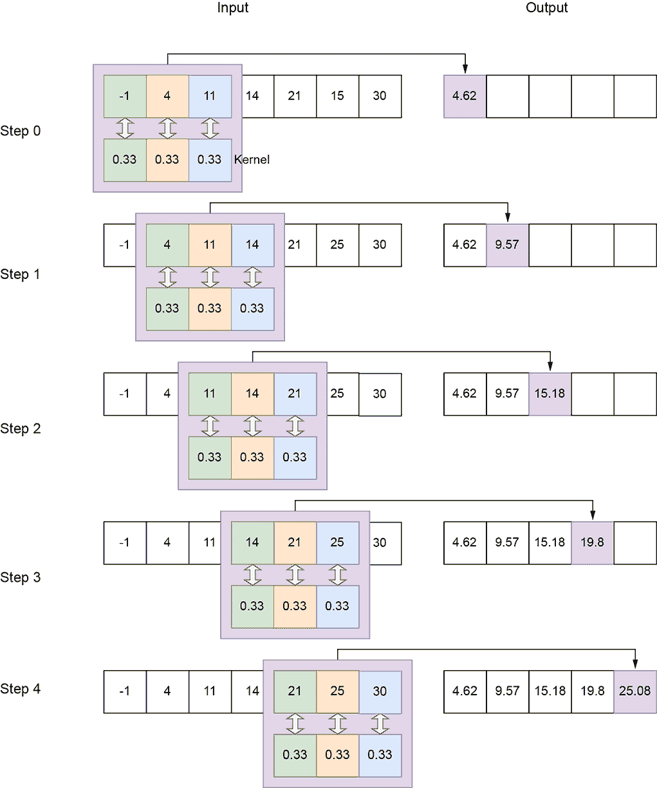

图 10.1 大小为 3 的*局部平均核*的 1D 卷积，步长为 1，有效填充，在大小为 7 的输入数组上


图 10.2 大小为 3 的*局部平均核*的 1D 卷积，步长为 2，有效填充


图 10.3 大小为 2 的*边缘检测核*的 1D 卷积，步长为 1，有效填充。并非所有滑动停止点（即步骤）都显示出来。

以下实体用于 1D 卷积：

+   *输入*——一个一维数组。在 1D 卷积中，我们通常用符号*n*来表示输入数组长度。在图 10.1 中，*n* = 7。

+   *输出*——一个一维数组。在 1D 卷积中，我们通常用符号*o*来表示输出数组长度。在图 10.1 中，*o* = 5。第 10.2 节展示了如何从独立参数计算输出大小。

+   *核*——一个权重的小数组，其大小是卷积的参数。在 1D 卷积中，我们通常用符号*k*来表示核大小。在图 10.1 中，*k* = 3；在图 10.3 中，*k* = 2。

+   *步长*—在完成单步之后，内核在输入元素上滑动的数量。我们通常用符号 *s* 来表示一维卷积中的步长。这是卷积的一个参数。在图 10.1 中，*s* = 1；在图 10.2 中，步长为 2。步长为 1 意味着在输入的每个后续元素处都有一个滑动停止。因此，输出元素的数量大致与输入相同（它们可能不完全相等，因为接下来会解释的填充）。步长为 2 意味着在每隔一个输入元素处都有一个滑动停止。因此，输出大小大致是输入大小的一半。步长为 3 意味着输出大小大致是输入大小的三分之一。

+   *填充*—当内核向输入数组的末端滑动时，其部分可能超出输入数组。换句话说，内核的一部分落在幽灵输入元素上。图 10.4 展示了这种情况：幽灵输入数组元素用虚线框表示。有多种策略来处理这种情况：

    +   *有效填充*—每当内核的任何元素超出输入数组时，我们就停止滑动。没有涉及幽灵输入元素；内核的 *整个* 总是落在有效的输入元素上（因此得名 *valid*）。请注意，这暗示我们将有比输入更少的输出。如果我们尝试生成与，比如说，最后一个输入元素对应的输出，除了第一个内核元素外，所有内核元素都将落在幽灵元素上的输入之外。因此，我们必须在最右侧的内核元素落在最右侧的输入元素上时停止（参见图 10.1、10.2 和 10.3）。此时，最左侧的内核元素落在第 (*N* − *k*) 个输入元素上。我们不生成最后 *k* 个输入的输出。因此，即使对于有效填充的步长为 1，输出也略小于输入。

    +   *相同（零）填充*—在这里，我们不希望提前停止。如果步长为 1，输出大小与输入大小匹配（因此得名 *same*）。我们继续滑动内核，直到其左端落在最右侧的输入上。此时，除了最左侧的内核元素外，所有元素都落在幽灵输入元素上。我们假设这些幽灵输入元素具有 0（*零填充*）的值。

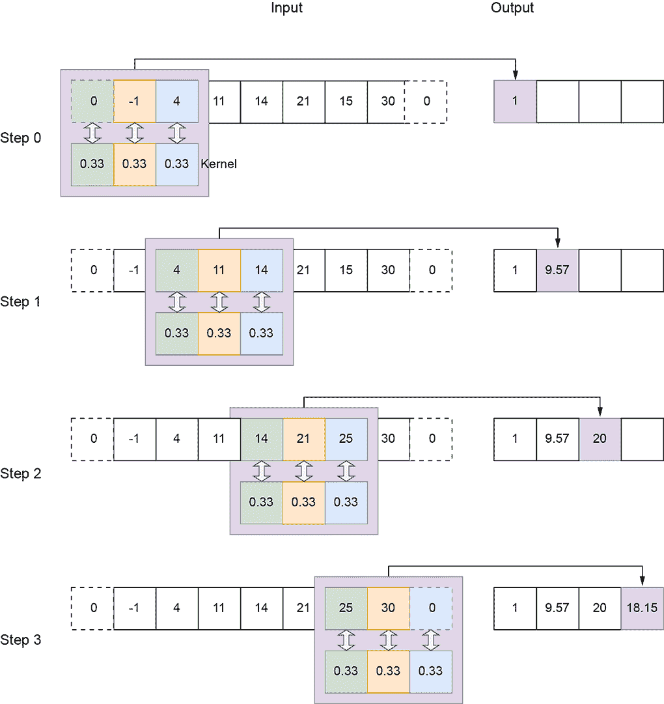

图 10.4 3x 大小、步长 2、零填充的 1D 卷积

让我们用 *S* 来表示输入数组的域。它是一个一维网格：

*S* = [0, *W* − 1]

*S* 中的每一个点都与一个值 *X[x]* 相关联。这些值共同构成了输入 *X*。在这个输入点网格上，我们定义了一个输出点子网格 *S[o]*。*S[o]* 通过在输入上应用基于步长的跳跃从 *S* 中获得。假设 *s* = [*s[W]*] 表示步长，第一个滑动停止点的绳索左上角在 (*x* = 0)。下一个滑动停止点在 (*x* = *s[W]*)，然后是 (*x* = 2*s[W]*)，以此类推。当我们到达右侧时，我们停止。总的来说，输出网格由核（尺子）在输入体积上扫过时其左上角所停的滑动停止点组成：即 *S[o]* = {(*x* = 0), (*x* = *s[W]*)⋯,}。*S[o]* 中的每个点都有一个输出。

方程式 10.1 展示了在 1D 卷积中单个输出值的生成过程。*X* 表示输入，*Y* 表示输出，而 *W* 表示核权重：


方程式 10.1

注意，当尺寸为 *k[W]*（尺子）的核在其原点 *x* 上时，它覆盖了域 [*x*..(*x* + *k[W]*)] 内的所有输入像素。这些是参与方程 10.1 的像素。每个输入像素都乘以覆盖它的核元素。将方程 10.1 与图 10.1、10.2 和 10.3 进行匹配。

### 10.1.1 通过 1D 卷积进行曲线平滑

在本节中，我们从物理和代数角度探讨如何通过卷积进行局部平均，以获得全面的理解。权重向量为 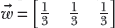 的 1D 核（如图 10.1 所示）本质上是对连续的三组输入值进行移动平均。因此，它是一个局部平均（也称为平滑）算子。如果我们检查原始输入向量与通过核卷积的输入向量的图（图 10.5），这一点就会变得明显。输入（实线）上下波动，而输出则是一条通过输入平均位置的平滑曲线（虚线）。一般来说，通过具有所有相等权重的核（权重必须归一化，即权重的总和为 1）卷积产生的输出是输入的平滑（局部平均）版本。我们为什么要平滑输入向量呢？因为它捕捉了输入数据中的广泛趋势，同时消除了短期波动（通常由噪声引起）。如果你熟悉傅里叶变换和频域，你可以看到这本质上是一个低通滤波器，消除短期、高频噪声，并捕捉输入数据数组中的长期、低频变化。

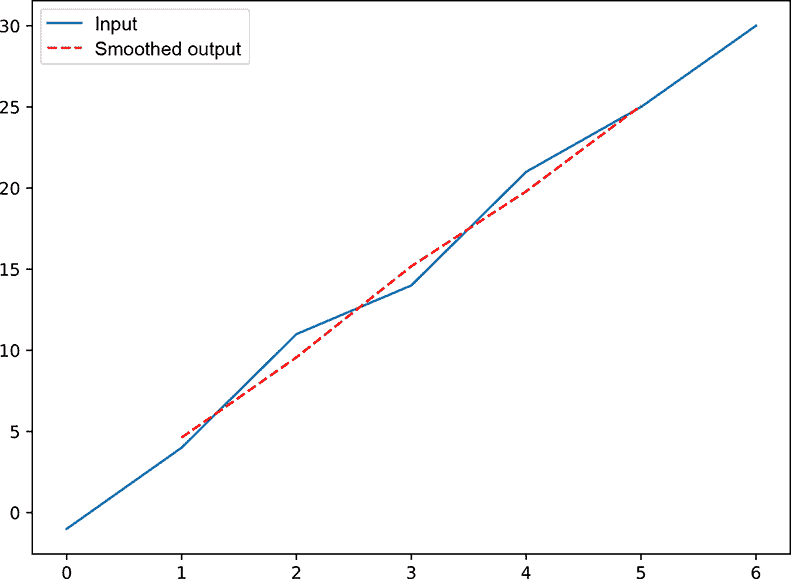

图 10.5 从图 10.1 中输入数组（实线）和输出数组（虚线）的图形。注意这是输入的平均值版本。这种局部平滑通过消除高频（短期）噪声来捕捉函数的低频（长期）广泛趋势。

### 10.1.2 通过 1D 卷积进行曲线边缘检测

如前所述，卷积对输入数组的影响在卷积核的权重上发生了根本性的变化。现在让我们检查一个完全不同的核，它可以检测输入数据中的边缘。

一个*边缘*被定义为输入数组中值的急剧变化。例如，如果输入数组中连续的两个元素在值上有很大的绝对差异，那么这就是一个边缘。如果我们绘制输入数组（即在*y*轴上绘制输入数组值与数组索引的关系图），则图中将出现边缘。例如，考虑图 10.3 中的输入数组（如图 10.6 所示）。在索引 0 到 3 之间，我们有值在 10 的附近。在索引 4 处，值跳到 51。我们说在索引 3 和 4 之间存在边缘。然后这些值在索引 4 到 7 之间保持在 50 的附近。然后它们在剩余的索引中跳回到 10 的附近。我们说在索引 7 和 8 之间存在另一个边缘。我们在这里检查的卷积将在跳跃的索引 3 和 7 处产生高响应（输出值），在其他索引处产生低响应。这是一个边缘检测卷积（滤波器）。我们为什么要检测边缘呢？因为边缘对于理解图像很重要。信号快速变化的地点比平坦均匀区域提供了更多的语义线索。对人类视觉皮层的实验表明，人类比平坦区域更关注颜色或阴影快速变化的地点。


图 10.6 从图 10.3 中输入数组（实线）和输出数组（虚线）的图形。输出是输入。边缘提供了理解信号的重要线索。

### 10.1.3 一维卷积作为矩阵乘法

从代数上讲，大小为 3、步长为 1、有效填充的卷积可以用以下方式表示。设输入数组为

 = [*x*[0] x*[1] x*[2] x*[3] x*[4] … x*[*n*-3] x*[*n*-2] x*[*n*-1]]

卷积核是一个大小为 3 的权重矩阵；让我们称它为

 = [*w*[0] w*[1] w*[2]]

如图 10.1 所示，在卷积的步骤 0 中，我们将这个核放在输入*x*[0]的 0 号元素上。因此，*w*[0]落在*x*[0]上，*w*[1]落在*x*[1]上，*w*[2]落在*x*[2]上：

[**x[0] x[1] x[2]** x*[3] x*[4] … x*[*n*-3] x*[*n*-2] x*[*n*-1]]

其中粗体字样标识了与核权重对齐的输入元素。我们在对应位置乘以元素并将它们相加，得到输出 *y*[0] 的第 0 个元素 = *w*[0]*x*[0] + *w*[1]*x*[1] + *w*[2]*x*[2]。然后我们将核向右移动一个位置（假设步长为 1；如果步长为 2，我们将核移动两个位置，依此类推）。因此 *w*[0] 落在 *x*[1] 上，*w*[1] 落在 *x*[2] 上，*w*[2] 落在 *x*[3] 上：

[*x*[0]   **x[1]   x[2]   x[3]   x[4]**  …  *x*[*n*–3]   *x*[*n*–2]   *x*[*n*-1]]

再次，我们在对应位置乘以元素并将它们相加，得到输出 *y*[1] 的第一个元素 = *w*[0]*x*[1] + *w*[1]*x*[2] + *w*[2]*x*[2]。同样，在下一步中，我们将核向右移动一个位置：

[*x*[0]   *x*[1]   **x[2]   x[3]   x[4]**  …  *x[n]*]

相应的输出是 *y*[2] = *w*[0]*x*[2] + *w*[1]*x*[3] + *w*[2]*x*[4]。总体而言，步长 1，有效填充卷积的向量  与权重核  产生输出


你能看出发生了什么吗？我们实际上在这里正在取连续的 *核* _ 大小 _ 的线性组合（参见第 2.9 节），即 3 个输入元素。换句话说，输出是输入数组元素的 *移动加权局部和*。根据实际的权重，我们正在提取输入的局部特性。

对于 *有效* 填充，最后一个输出由

[*x*[0]   *x*[1]   *x*[2]   *x*[3]   *x*[4]  …  **x[n–3]   x[n–2]   x[n-1]**]

生成输出

*y*[*n* − 3] = *w*[0]*x*[*n* − 3] + *w*[1]*x*[*n* − 2] + *w*[2]*x*[*n* − 1]

对于 *相同* 的零填充，最后一个输出由

[*x*[0]   *x*[1]   *x*[2]   *x*[3]   *x*[4]  …   **x[n-1]   0**   **0**]

生成输出

*y*[*n*−1] = *w*[0] ⋅ *x*[*n*−1] + *w*[1] ⋅ 0 + *w*[2] ⋅ 0

在第 8.3.1 节中，我们看到了全连接层（也称为线性层）可以表示为输入向量与权重矩阵的乘积。现在，我们将卷积表示为矩阵-向量乘积。权重矩阵具有分块对角结构，如方程式 10.2 所示。它是方程式 8.8 的一个特例。因此，前向传播方程式 8.7 和反向传播方程式 8.31 以及 8.33 仍然适用。因此，通过卷积进行的前向传播和反向传播训练与 FC 层完全相同。

方程式 10.2 表达了 *核* _ 大小 _ 3，步长 1，有效填充卷积作为权重矩阵 *W* 与输入向量  的乘积：


方程式 10.2

注意方程式 10.2 中权重矩阵的 *稀疏*、*块对角*性质。这是卷积权重矩阵的特征。每一行包含所有在连续位置的核权重。核的大小通常远小于输入向量的大小。当然，为了进行矩阵乘法，权重矩阵的列数必须与输入向量的大小相匹配。因此，除了占据核权重的位置外，还有许多空位。我们用零填充这些空位。因此，权重矩阵的每一行都有所有核权重在某个连续位置出现，其余行则用零填充。*核权重的位置随着每一行的连续而向右移动*。这就是给权重矩阵带来块对角外观的原因。它也模拟了卷积所需的核滑动。每一行代表一个特定的滑动停止点，并生成输出向量中的一个元素。由于核位于行的固定位置，而其他行元素都是零，因此只有与核位置对应的输入元素被选中。其他输入元素乘以零：即，它们被忽略。

方程式 10.2 描述了步长为 1。例如，如果步长为 2，核权重将在连续行中移动两个位置。这显示在方程式 10.3 中：

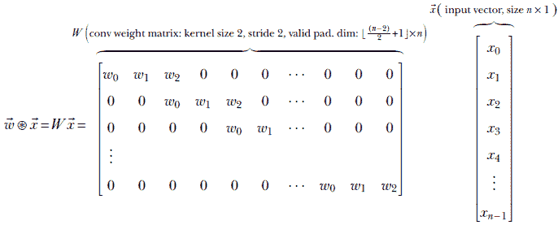

方程式 10.3

注意，虽然方程式 10.3 提供了卷积的概念矩阵乘法视图，但这并不是实现卷积的最高效方式。PyTorch 和其他深度学习软件都有非常高效的卷积实现方式。

### 10.1.4 PyTorch - 使用自定义权重的单维卷积

我们已经讨论了 1D 输入向量与两个特定 1D 核的卷积。我们看到了，具有均匀权重的核，例如 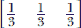，会导致输入向量的局部平滑，而具有反对称权重的核，例如 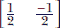，会导致输出向量在输入向量的边缘位置出现峰值。现在我们将看到如何在 PyTorch 中设置 1D 核的权重，并使用该核进行 1D 卷积。

备注：这不是典型的 PyTorch 操作。更典型的操作是创建一个具有卷积层（我们指定大小、步长和填充，但不指定权重）的神经网络，然后训练网络以便学习权重。我们通常不关心学习到的权重的确切值。那么我们为什么要讨论在 PyTorch 中如何设置核的权重呢？主要是为了展示卷积在 PyTorch 中的工作方式，卷积对象的各个参数等等。

列表 10.1 PyTorch 1D 局部平均卷积的代码

```py
import torch

x = torch.tensor(                                          ①
        [-1.,  4., 11., 14., 21., 25., 30.])

w = torch.tensor([0.33, 0.33, 0.33])                       ②

x = x.unsqueeze(0).unsqueeze(0)
w = w.unsqueeze(0).unsqueeze(0)                            ③

conv1d = torch.nn.Conv1d(1, 1, kernel_size=3,              ④
            stride=1, padding=[0], bias=False)

conv1d.weight = torch.nn.Parameter(w, requires_grad=False) ⑤

with torch.no_grad():                                      ⑥

    y = conv1d(x)                                          ⑦
```

① 实例化一个带噪声的输入向量。遵循方程 *y* = 5*x*

② 实例化卷积核的权重

③ PyTorch 预期输入和权重为 *N* × *C* × *L* 的形式，其中 *N* 是批大小，*C* 是通道数，*L* 是序列长度。在这里，*N* 和 *C* 是 1。torch.unsqueeze 将我们的 *L*-长度向量转换为 1 × 1 × *L* 张量。

④ 实例化平滑核

⑤ 设置核权重

⑥ 指示 PyTorch 不计算梯度，因为我们目前不需要它们

⑦ 执行卷积

列表 10.2 PyTorch 1D 边缘检测的代码

```py
import torch

x = torch.tensor(                                           ①
        [10.,  11., 9., 10., 101., 99.,
         100., 101., 9., 10., 11., 10.])

w = torch.tensor([0.5, -0.5])                               ②

x = x.unsqueeze(0).unsqueeze(0)                             ③
w = w.unsqueeze(0).unsqueeze(0) 

conv1d = torch.nn.Conv1d(1, 1, kernel_size=3,               ④
            stride=1, padding=[0], bias=False)

conv1d.weight = torch.nn.Parameter(w, requires_grad=False)  ⑤

with torch.no_grad():                                       ⑥

    y = conv1d(x)                                           ⑦
```

① 实例化带有边缘的输入向量

② 实例化边缘检测核的权重

③ 将输入和权重转换为 1 × 1 × *L*

④ 实例化边缘检测核

⑤ 设置核权重

⑥ 指示 PyTorch 不计算梯度，因为我们目前不需要它们

⑦ 执行卷积

这些列表展示了如何在 PyTorch 中使用 `torch.nn.Conv1d` 类执行 1D 卷积。这通常用于更大的神经网络，如后续章节中的那些。我们还可以使用 `torch.nn.functional.conv1d` 直接调用数学卷积操作。这需要输入和权重张量，并返回卷积输出张量，如列表 10.3 所示。

列表 10.3 直接调用卷积函数的 PyTorch 代码

```py
import torch

x = torch.tensor(                              ①
        [10.,  11., 9., 10., 101., 99.,
         100., 101., 9., 10., 11., 10.])

w = torch.tensor([0.5, -0.5])                  ②

x = x.unsqueeze(0).unsqueeze(0)                ③
w = w.unsqueeze(0).unsqueeze(0)

y = torch.nn.functional.conv1d(x, w, stride=1) ④
```

① 实例化输入张量

② 实例化权重张量

③ 将输入和权重转换为 1 × 1 × *L*

④ 执行卷积

## 10.2 卷积输出大小

考虑一个大小为 *k* 的核在大小为 *n* 的输入上滑动，步长为 *s*。给定一个大小为 *k* 的核，如果左端在索引 *l*，则右端在索引 *l* + (*k* − 1)。每次平移将核的左端（以及右端）向前移动 *s*。如果核的初始位置在索引 0，那么经过 *m* 次平移后，左端在 *ms*。相应地，右端在 *ms* + (*k* − 1)。假设有效填充，这个右端位置必须小于或等于 (*n* − 1)（输入数组的最后一个有效位置）。

我们可以平移多少次，直到核溢出输入？换句话说，*m* 的最大可能值是多少，使得

*ms* + (*k* − 1) ≤ (*n* − 1)

答案是

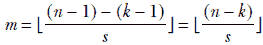

但每次平移都产生一个输出值。卷积的有效填充输出大小 *o* 是 *m* + 1（加一是为了考虑到初始位置）。因此，


如果我们在输入的每侧填充 *p* 个零，则输入大小变为 *n* + 2*p*。相应的输出大小是


方程式 10.4

这可以通过对每个维度重复执行来扩展到任意数量的维度。

## 10.3 二维卷积：图形和代数视图

人们常说，一张图片胜过千言万语。那么什么是图片呢？就深度学习而言，它是一个离散的二维实体——一个描述固定时间场景的像素值二维数组。每个像素代表一个颜色强度值。颜色值可以是一个表示灰度的单元素，也可以是三维的，对应于 R(红)、G(绿)、B(蓝)强度值。（在继续之前，你可能需要回顾第 2.3 节。）


图 10.7 2D 卷积使用大小为[3,3]，步长为[1,1]，有效填充的局部平均核。每个像素以一个小矩形表示，矩形中写有像素的灰度值。阴影顺序。连续步骤表示滑动停止。对于被核覆盖的每个像素，落在其上的核元素的权重以小字体写出。

在撰写本文时，图像分析是卷积最流行的应用。这些应用使用卷积来提取局部模式。我们是如何做到这一点的呢？特别是，我们能否将图像光栅化（从而将其转换为矢量）并使用一维卷积？

答案是*不*。要了解原因，请查看图 10.7。像素在位置(*x* = 0, *y* = 0)的空间邻域是什么？如果我们定义像素的*邻域*为包含该像素在左上角的曼哈顿距离为[2,2]的像素集合，那么(*x* = 0, *y* = 0)的邻域由图 10.7 中阴影矩形覆盖的像素集合组成，步骤 0。但这些像素*不会是图像光栅化数组表示中的相邻元素*。例如，像素(*x* = 0, *y* =1)，其值为 6，是光栅化数组中的第五个元素，因此*不会*被视为(*x* = 0, *y* = 0)的邻居，(*x* = 0, *y* = 0)是光栅化数组中的第 0 个元素。二维邻域在光栅化过程中*不会*被保留。因此，二维卷积必须是一个超越仅仅将 2D 数组光栅化到 1D 并应用 1D 卷积的专门操作。

欧几里得距离和曼哈顿距离

欧几里得距离衡量两点之间的直线距离，而曼哈顿距离衡量两点之间的距离，但有一个约束，即你只能沿着轴平行行走，就像在曼哈顿的街道上一样）。让我们看看一个例子。

考虑两个点 A (3, 3)和 B (6, 7)。A 和 B 之间的欧几里得距离是线段 AB 的长度，可以计算为√((6 - 3)² + (7 - 3)²) = 5。A 和 B 之间的曼哈顿距离是(6−3) + (7−3) = 3 + 4 = 7。在本章中，我们用[3, 4]表示曼哈顿距离，以分别捕捉每个轴上的距离。

可视化二维卷积的最佳方式是想象一块墙（输入图像）上滑过一个瓦片（核）：

+   在图 10.7、10.8 和 10.9 中，阴影矩形表示瓦片（核），而包含它的较大白色矩形表示墙（输入图像）。图中的连续步骤代表滑动瓦片的连续位置（也称为滑动停止）。请注意，阴影矩形在每个步骤中都占据不同的位置。

+   在滑动过程中，连续位置的瓦片可以重叠。在图 10.7、10.8 和 10.9 中，它们重叠的程度不同。

+   在现实中，墙和瓦片是离散的二维数组。在每个滑动停止时，瓦片数组元素位于墙数组元素的一个子集上。

+   我们将每个输入数组元素与其上方的核元素相乘，并将乘积相加。这相当于对输入（墙）元素进行加权求和，这些元素落在当前核（瓦片）的位置下，核元素作为权重。这个加权求和作为一个单独的输出元素发出。每个瓦片滑动停止都会产生一个输出元素。当瓦片在整面墙上从左到右、从上到下滑动时，就生成了一个二维输出数组。

在二维卷积中，输入数组、核大小和步长都是二维向量。正如在 1D 卷积中一样，以下实体在二维卷积中定义：


图 10.8 使用大小为 [3,3]、步长为 [2,2] 的 *局部平均核* 的二维卷积

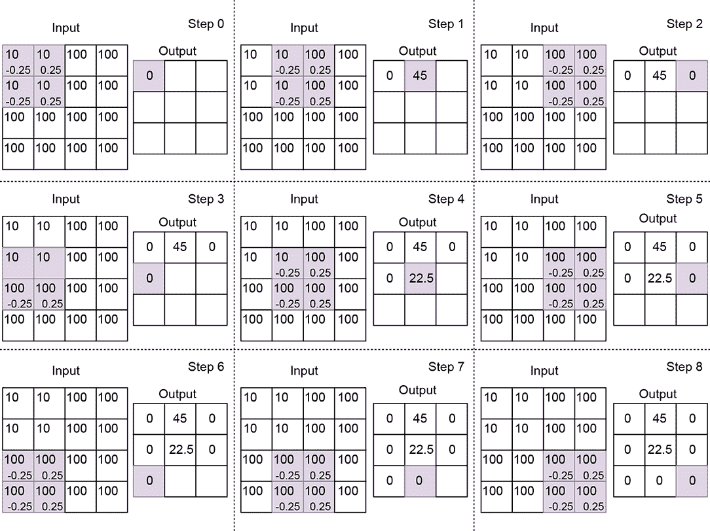

图 10.9 使用大小为 2 的 *边缘检测核*、步长 1 和有效填充的二维卷积。并非所有滑动停止（即步数）都显示出来。注意输出在均匀位置为零，但在核的一半落在低值而另一半落在高值时会出现峰值。

+   *输入*—一个二维数组。我们通常使用符号 [*H*, *W*]（分别表示数组的高度和宽度）来表示二维卷积中输入数组的大小。在图 10.7 中，*H* = 5，*W* = 5。

+   *输出*—一个二维数组。我们通常使用符号  = [*o[H]*, *o[W]*] 来表示二维卷积中输出数组的维度。例如，在图 10.7 中， = [3,3]。在 10.2 节中，我们看到了如何计算单维度的输出大小。我们必须对每个维度重复该计算一次，以获得高维度的输出大小。

+   *内核*—一个小的二维权重数组，其大小是卷积的一个参数。我们通常使用符号 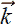 = [*k[H]*, *k[W]*] 来表示二维卷积中的内核大小（高度，宽度）。如果 (*x*, *y*) 表示二维内核左上角当前的位置，则右下角位于 (*x* + *k[W]* − 1, *y* + *k[H]* − 1)。在图 10.7 中， = [3,3]；在图 10.9 中， = [2,2]。

+   *步长*—内核在完成单步滑动后覆盖的输入元素数量。我们通常使用符号  = [*s[H]*, *s[W]*] 来表示二维卷积中的步长大小（高度，宽度）。如果 (*x*, *y*) 表示二维内核左上角当前的位置，则下一次移动将使内核的左上角位于 (*x* + *s[W]*, *y*)。例如，在图 10.7 中，从步骤 0 到步骤 1 或步骤 1 到步骤 2 的转换。如果这种转换导致瓦片的部分超出墙壁——即 *x* + *s[W]* ≥ *W*——我们将下一次滑动位置设置为内核的左上角落在 (0, *y* + 1) 上。例如，在图 10.7 中，从步骤 2 到步骤 3 或步骤 5 到步骤 6 的转换。如果 *y* + *s[H]* ≥ *H*，我们停止滑动。步长大小是卷积的一个参数。在图 10.7 中， = [1,1]；在图 10.8 中，步长是  = [2,2]。与一维情况一样，步长  = [1,1] 表示在输入的每个连续元素处都有一个滑动停止。因此，输出元素的数量大致与输入相同（它们可能不完全相等，因为填充）。步长  = [2,2] 表示输入的每一行将产生一半行大小的输出元素，每一列将产生一半列大小的输出元素。因此，输出大小大致是输入大小的四分之一。总的来说，输入到输出大小的减少因子大致等于步长向量中元素的乘积。

+   *填充*—当内核沿着宽度或高度滑动到输入数组的边缘时，其部分可能超出输入数组。换句话说，内核的一部分覆盖了幽灵输入元素。与一维情况一样，我们通过填充来处理这种情况。二维卷积中的填充策略是一维的简单扩展：

    +   *有效填充*—每当内核的任何元素超出输入数组时（无论是宽度还是高度），我们就停止滑动。没有涉及幽灵输入元素；内核的*整个*部分始终落在有效输入元素上（因此得名*有效*）。

    +   *相同（零）填充*——在这里，我们不想提前停止。只要内核的左上角落在有效的输入位置上，我们就继续滑动。所以，如果步长是 1，1，输出大小将与输入大小匹配（因此得名*same*）。当我们接近输入行的末尾（输入的右端点）时，内核的最右侧列将超出输入范围。同样，当我们向输入的底部滑动时，内核的底部行将超出范围。如果我们接近输入的右下角，最右侧的列和最底部的行都将超出输入范围。规则是，所有在输入数组真实边界之外的幽灵输入值都被零替换。

让我们用*S*表示输入图像域。它是一个二维网格，其域是

*S* = [0, *H* − 1] × [0, *W* − 1]

*S*中的每个点都是一个具有颜色值（可以是标量——灰度值或三个值的向量，R、G、B）的像素。在这个输入点网格上，我们定义了一个输出点子网格*S[o]*。*S[o]*是通过在输入上应用基于步长的移动从*S*获得的。假设 = [*s[H]*, *s[W]*]表示 2D 步长向量，第一个滑动停止点在[0] ≡ (*y* = 0, *x* = 0)。下一个滑动停止点在[1] ≡ (*y* = 0, *x* = *s[W]*)，下一个是[2] ≡ (*y* = 0, *x* = 2*s[W]*)。当我们到达右侧时，我们增加*y*。总的来说，输出网格由内核（砖块）在输入体积上滑动时其左上角停留的滑动停止点组成：*S[o]* = {[0], [1], … }。*S[o]*中的每个点都有一个输出。

内核也有两个维度（实际上，它对应于输入通道和批次的两个额外维度——为了简单起见，我们现在忽略它们——如第 10.3.3 节所述）。方程 10.5 展示了如何在二维卷积中生成单个输出值。*X*表示输入，*Y*表示输出，*W*表示内核权重：

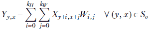

方程 10.5

注意，内核（瓦片）的起点在*X*[*y*, *x*]。其维度是(*k[H]*, *k[W]*)。因此，它覆盖了域[*y*..(*y* + *k[H]*)] × [*x*..(*x* + *k[W]*)]中的所有输入像素。这些是参与方程 10.5 的像素。每个输入像素都乘以覆盖它的内核元素。将方程 10.5 与图 10.7、10.8 和 10.9 进行匹配。

### 10.3.1 通过二维卷积进行图像平滑

在 10.1.1 节中，我们讨论了一维局部平滑。我们观察到它如何消除局部波动，以便更清晰地识别长期模式。在二维中也会发生同样的事情。图 10.10 显示了一幅在带有盐和胡椒噪声的背景上写有文字的图像。噪声没有语义意义；需要分析的是文字（可能通过光学字符识别）。我们可以通过使用具有均匀权重的核（如）进行二维卷积来消除噪声。


结果的去噪/平滑图像显示在图 10.11 中。均匀核的作用是什么？为了了解这一点，请看图 10.8。很明显，核使得每个输出像素成为相邻 3 × 3 输入像素的加权局部平均值。

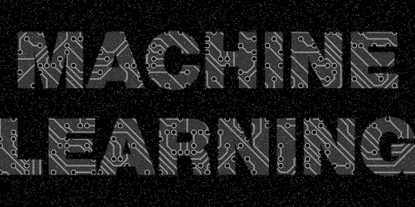

(a) 输入图像


(b) 平滑/去噪输出图像

图 10.10 通过应用 2D 卷积 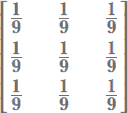 到图 10.11a 来去噪/平滑噪声图像

注意：完全功能的图像平滑代码，可通过 Jupyter Notebook 执行，可在[`mng.bz/aDM7`](http://mng.bz/aDM7)找到。

### 10.3.2 通过二维卷积进行图像边缘检测

图像中的不是所有像素都具有相同的语义重要性。想象一下一张人站在白色墙前的照片。墙上的像素颜色均匀且无趣。提供最多语义线索的像素属于轮廓：边缘像素。这与人类视觉科学相一致，正如我们之前提到的，实验表明，人类大脑更关注颜色变化明显的区域。人类对待声音的方式也非常相似，忽略均匀的嗡嗡声（这种声音往往会导致睡眠）但会变得警觉，当声音的音量或频率发生变化时。因此，识别图像中的边缘对于图像理解至关重要。

边缘是局部现象。因此，可以通过使用特别选择的核进行二维卷积来识别它们。例如，图 10.11b 中的垂直边缘是通过在图 10.11a 中的图像上使用核


同样，图 10.11c 中的垂直边缘是通过在图 10.11a 中的图像上使用核

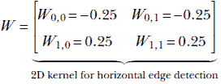


(a) 输入图像

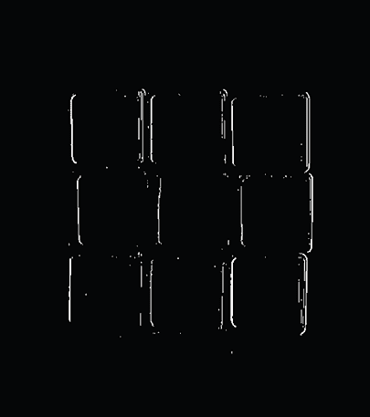

(b) 通过对图 10.11a 应用二维卷积  检测到的垂直边缘


(c) 通过对图 10.11a 应用二维卷积  检测到的水平边缘

图 10.11 的图像经常帮助我们分析图像。

这些核如何识别边缘？为了了解这一点，请看图 10.9。在一个具有相等像素值的邻域（例如，平坦的墙壁），图 10.11b 中的核将产生零（正负核元素落在相等值上，它们的加权总和为零）。因此，这个核抑制了均匀区域。另一方面，如果颜色有急剧的变化（核的负半部和正半部落在非常不同的值上，加权总和是一个大的负数或大的正数），它会有很高的响应。

注意：完全功能的边缘检测代码，可通过 Jupyter Notebook 执行，可以在 [`mng.bz/g4JV`](http://mng.bz/g4JV) 找到。

### 10.3.3 PyTorch- 使用自定义权重进行二维卷积

我们已经讨论了二维输入数组与两个特定二维核的卷积。我们注意到，具有均匀权重的核，例如 ，会导致输入数组的局部平滑，而具有反对称权重的核，例如 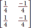，会导致输出数组在输入数组的边缘位置出现峰值。现在我们将看到如何在 PyTorch 中设置二维核的权重并使用该核进行二维卷积。

注意：这不是典型的 PyTorch 操作。更典型的操作是创建一个具有卷积层的神经网络（我们指定大小、步长和填充，但不指定权重），然后训练网络以便学习权重。我们通常不关心学习到的权重的确切值。一个具有二维卷积层的示例神经网络可以在第 10.6 节中看到。

列表 10.4 展示了二维局部平均卷积。虽然我们在章节中看到输入数组是形状为 *H* × *W* 的二维张量，但 PyTorch 的卷积接口期望输入为形状为 *N* × *C* × *H* × *W* 的四维张量：

+   第一个维度，*N*，代表批大小。在真实的神经网络中，输入是以小批量而不是单个输入实例的方式提供的（这是为了效率原因，如第 9.2.2 节所述）。*N* 代表小批量中包含的输入图像数量。

+   第二维，*C*，代表通道数。对于整个神经网络的输入，在 RGB 图像的情况下，我们有三个通道 R（红色）、G（绿色）和 B（蓝色）；在灰度图像的情况下，我们只有一个通道。对于其他层，通道数可以是任何东西，这取决于神经网络的架构。通常，离输入更远、离输出更近的层有更多的通道。只有在大输入处的通道具有固定的、明显可辨别的物理意义（如 R、G、B）。连续层输入处的通道则没有。

+   第三维，*H*，代表高度。

+   第四维，*W*，代表宽度。

PyTorch 的`Conv2D`对象的权重张量必须是一个 4D 张量。列表显示了一个大小为 5 × 5 的单色图像作为输入。因此，*N* = 1，*C* = 1，*H* = 5，*W* = 5。*x*被实例化为一个 5 × 5 的二维张量。为了将其转换为 4D 张量，我们使用`torch.unsqueeze()`函数，它向输入添加一个额外的维度。

列表 10.4 PyTorch 2D 局部平均卷积代码

```py
import torch

x = load_img()                                             ①

w = torch.tensor(                                          ②
    [
        [0.11, 0.11, 0.11],
        [0.11, 0.11, 0.11],
        [0.11, 0.11, 0.11]
    ]
)

x = x.unsqueeze(0).unsqueeze(0)                            ③
w = w.unsqueeze(0).unsqueeze(0)

conv2d = torch.nn.Conv2d(1, 1, kernel_size=2,
                    stride=1, bias=False)                  ④

conv2d.weight = torch.nn.Parameter(w, requires_grad=False) ⑤

with torch.no_grad():                                      ⑥

    y = conv2d(x)                                          ⑦
```

① 加载带有噪声的灰度输入图像

② 实例化卷积核的权重

③ PyTorch 期望输入和权重以*N* × *C* × *H* × *W*的形式存在，其中*N*是批量大小，*C*是通道数，*H*是高度，*W*是宽度。在这里，*N* = 1，因为我们只有一个图像。*C* = 1，因为我们考虑的是灰度图像。*H*和*W*都是 5，因为输入是一个 5 × 5 的数组。unsqueeze 将我们的 5 × 5 张量转换为 1 × 1 × 5 × 5 张量。

④ 实例化 2D 平滑核

⑤ 设置内核权重

⑥ 指示 PyTorch 不计算梯度，因为我们目前不需要它们

⑦ 运行卷积

列表 10.5 PyTorch 2D 边缘检测代码

```py
import torch

x = load_img()                                             ①

w = torch.tensor(                                          ②
        [[-0.25, 0.25],
        [-0.25, 0.25]]
    )

x = x.unsqueeze(0).unsqueeze(0)                            ③
w = w.unsqueeze(0).unsqueeze(0)

conv2d = torch.nn.Conv2d(1, 1, kernel_size=2,              ④
                    stride=1, bias=False)

conv2d.weight = torch.nn.Parameter(w, requires_grad=False) ⑤

with torch.no_grad():                                      ⑥

    y = conv2d(x)                                          ⑦
```

① 加载带有边缘的灰度输入图像

② 实例化卷积核的权重

③ 将输入转换为 1 × 1 × 4 × 4

④ 实例化一个 2D 边缘检测核

⑤ 设置内核权重

⑥ 指示 PyTorch 不计算梯度，因为我们目前不需要它们

⑦ 运行卷积操作

### 10.3.4 二维卷积作为矩阵乘法

在 10.1.3 节中，我们看到了如何将 1D 卷积视为通过一个分块对角矩阵（如方程 10.3 所示）乘以输入向量。这个想法可以扩展到更高维度，尽管权重矩阵变得显著更复杂。尽管如此，了解这个矩阵的直观形象是很重要的。在众多事情中，它将帮助我们更好地理解转置卷积。在这个以矩阵乘法为导向的二维卷积视图中，输入图像被表示为一个光栅化的 1D 向量。因此，一个大小为*m* × *n*的输入矩阵变成一个*m*n*-大小的向量。相应的权重矩阵有长度为*m*n*的行。每一行对应一个特定的滑动停止点。

为了便于理解，让我们考虑一个 [*H*, *W*] = [4,4] 的输入图像（不必在意这个图像是不切实际的很小）。在这张图像上，我们正在执行 [*k[H]*, *k[W]*] = [2,2] 的内核和步长 [*s[H]*, *s[W]*] = [1,1] 的 2D 卷积。情况正好如图 10.9 所示。大小为 *H* = 4, *W* = 4 的输入图像 *X*


光栅化到长度为 4 * 4 = 16 的输入向量 。设内核权重为 。考虑连续的滑动停止（图 10.9 中的步骤）。下面显示了在特定步骤中乘以内核权重的光栅化输入向量的确切元素——这些对应于图 10.9 中相同步骤的阴影项：图像 *X* 和内核 *W* 之间的 2D 卷积，记为 *Y* = *W* ⊛ *X*，在输入图像 [*H*, *W*] = [4,4] 的特殊情况下。对于此图像，使用 [*k[H]*, *k[W]*] = [2,2] 的内核和步长 [*s[H]*, *s[W]*] = [1,1] 的有效填充的 2D 卷积可以表示为以下矩阵乘法：


这可以表示为

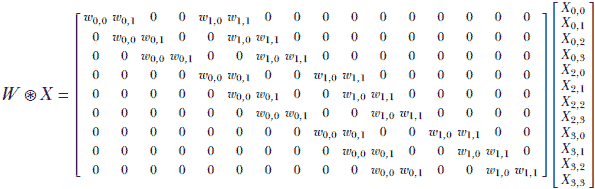

方程式 10.6

注意以下内容：

+   方程式 10.6 中所示的 2D 卷积权重矩阵是特殊情况，但它说明了一般原理。

+   2D 卷积权重矩阵是块对角线形式，就像 1D 版本一样。内核权重被精确放置以模拟图 10.9。

+   卷积权重矩阵有 9 行和 16 列。因此，它接受一个从 4 × 4 输入图像光栅化的输入向量，并生成一个输出矩阵（可以折叠成一个 3 × 3 卷积输出图像）。

## 10.4 三维卷积

如果一张图片值千言万语，那么一段视频就值一万言。视频是关于动态现实场景的丰富信息来源。随着基于深度学习的图像分析（2D 卷积）越来越成功，在撰写本文时，视频分析已成为下一个需要征服的研究前沿。

视频本质上是一个三维实体。在所有三个维度上，其表示是*离散*的。这三个维度对应于*空间*，它是二维的，具有*高度*和*宽度*，以及*时间*。视频由一系列*帧*组成。每一帧是一个图像：一个离散的 2D 像素数组。一帧代表特定（采样）点的整个视频场景。帧中的一个像素代表场景在帧对应的时间点上的一个采样空间位置的颜色。因此，视频是一系列帧，代表在空间和时间的一组离散点（像素）上的动态场景。视频跨越一个*时空体积*（也称为*ST 体积*），可以想象为一个长方体。每个横截面是一个代表帧的矩形。这如图 10.12 所示。


图 10.12 一个时空体积光阴影长方体（代表视频）。在这个时空体积中，视频的单独帧是横截面矩形。一个单独的帧也以较暗的阴影显示。

为了分析视频，我们需要从这个 3D 体积中提取局部模式。我们能否通过重复的 2D 卷积来实现？

答案是*不*。当我们一起查看连续的帧时，会有额外的信息，而当我们逐个查看帧时，这些信息是不存在的。例如，想象你被展示了一个半开的门的图片。从这张单独的图片中，你能确定门是*打开*还是*关闭*的吗？不能。为了做出这个判断，我们需要看到几个连续的帧。换句话说，逐帧分析视频剥夺了我们一个重要的信息模态：*运动*，这只有在分析多个连续帧时才能理解。这就是为什么我们需要 3D 卷积。

最直观地可视化 3D 卷积的方式是想象一个*砖块*在整个*房间*的体积上滑动。房间对应于卷积的视频输入的时空体积。砖块对应于核。在滑动过程中，砖块会停在连续的位置；我们称之为滑块停止。图 10.13 显示了不同位置的四个滑块停止。每个滑块停止发出一个输出点。当砖块扫过整个输入时空体积时，生成一个输出时空体积。在每个滑块停止处，我们将每个输入像素值乘以覆盖它的核元素，并对这些乘积求和。这实际上是对所有被核（砖块）覆盖的输入（房间）元素的有效加权求和，覆盖的核元素作为权重。


(a) 滑块停止 *x* = 0, *y* = 0, *t* = 0。


(b) 滑块停止 *x* = 0, *y* = 0, *t* = 0。


(c) 滑块停止 *x* = 0, *y* = 0, *t* = 0。


(d) 滑动停止 *x* = 0, *y* = 0, *t* = 0。

图 10.13 3D 卷积的空间时间视图。每个图左侧较大的浅色长方体代表输入 ST 体积（房间）。房间内部的小深色长方体代表核砖块。砖块在整个房间内部体积上滑动。砖块的相邻位置可能在体积上重叠。砖块的每个位置代表一个滑动停止点；对房间（输入点）上所有被砖块覆盖的点进行加权求和。覆盖每个输入点的核点值（核值）作为权重。显示了四个不同的滑动停止点。每个滑动停止点生成一个单独的输出点。当砖块扫过输入体积时，生成一个输出 ST 体积（较小的浅色长方体）。

让我们用 *S* 表示输入 ST 体积。它是一个三维网格，其域为

*S* = [0, *T* − 1] × [0, *H* − 1] × [0, *W* − 1]

*S* 中的每个点都是一个具有颜色值（可以是标量——灰度值或三个值的向量，R、G、B）的像素。在这个输入点网格上，我们定义了一个输出点子网格 *S[o]*。*S[o]* 通过对输入应用基于步长的步进从 *S* 中获得。假设  = [*s^T*, *s[K]*, *s[W]*] 表示 3D 步长向量，第一个滑动停止点在 [0] ≡ (*t* = 0, *y* = 0, *x* = 0)。下一个滑动停止点在 [1] ≡ (*t* = 0, *y* = 0, *x* = *s[W]*)，下一个是 [2] ≡ (*t* = 0, *y* = 0, *x* = 2*s[W]*)。当我们到达右侧时，我们增加 *y*。当我们到达底部时，我们增加 *t*。当我们到达房间的尽头时，我们停止。*S[o]* = {[0], [1] … } 是核（砖块）的左上角在扫过输入体积时的位置。每个 *S[o]* 中的点都有一个输出。核也有三个维度（实际上，它还有两个额外的维度对应于输入通道和批量——我们为了简单起见忽略它们，如第 10.4.2.1 节所述）。

方程式 10.7 展示了在 3D 卷积中单个输出值的生成过程。*X* 表示输入，*Y* 表示输出，*W* 表示核权重：


方程式 10.7

注意，核（砖块）的起点在 *X[t]*, *y*, *x* 上。其尺寸为 (*k^T*, *k[H]*, *k[W]*)。因此，它覆盖了域 [*t*..(*t* + *k^T*)] × [*y*..(*y* + *k[H]*)] × [*x*..(*x* + *k[W]*)] 中的所有输入像素。这些是参与方程 10.7 的像素。每个这些输入像素都乘以覆盖它的核元素。将方程 10.7 与图 10.13 对比。

### 10.4.1 通过 3D 卷积进行视频运动检测

在动态场景中，移动物体从一个视频帧移动到另一个视频帧。因此，在运动边界处像素被覆盖或暴露。在一个帧中属于背景的像素可能在后续帧中被物体覆盖，反之亦然。如果背景颜色与物体不同，这将在不同时间相同空间位置的像素之间引起颜色差异，如图 10.14 所示。对 ST 体积应用卷积的输出是另一个 ST 体积。图 10.15 显示了将我们的视频运动检测器应用于图 10.14 中所示输入的输出结果。

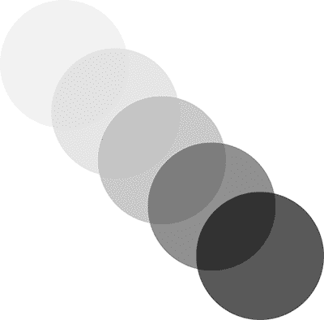

图 10.14 移动球合成视频的连续帧，为说明目的以叠加方式显示，并逐渐增加不透明度

内核是如何从一系列连续帧中提取运动信息的？如前所述，运动会导致连续帧中相同位置的像素具有不同的颜色。然而，由于噪声，单个孤立的像素对可能具有不同的颜色——我们不能从这个中得出任何结论。如果我们在一个帧的小邻域内平均像素值，并在后续帧的相同邻域内平均像素值，并且这两个平均值不同，那么这是一种更可靠的估计运动的方法。以下是一个 2 × 3 × 3 的三维核，正是为了做到这一点——在两个连续帧的 3 × 3 空间邻域内平均像素值，并从其中一个减去另一个：


减法的结果在运动区域较高，在无运动区域较低。在此背景下，值得注意的是，由于物体颜色均匀，物体内部的像素是不可区分的。因此，在物体的中心没有观察到运动；只有在边界处观察到运动。图 10.15 显示了此 3D 卷积结果的几个帧。

注意：完全功能的视频运动检测代码，可通过 Jupyter Notebook 执行，可以在[`mng.bz/enJQ`](http://mng.bz/enJQ)找到。


(a) 输出帧 0

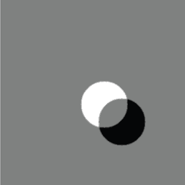

(b) 输出帧 1


(c) 输出帧 2

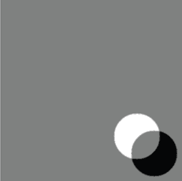

(d) 输出帧 3

图 10.15 将 3D 卷积运动检测器应用于移动球合成视频的结果。灰色表示“无运动”；大部分输出帧都是灰色。白色和黑色表示运动。

### 10.4.2 PyTorch- 使用自定义权重的三维卷积

在第 10.4.1 节中，我们看到了如何使用 3D 卷积在输入图像序列中检测运动。在本节中，我们将看到如何在 PyTorch 中实现这一点。PyTorch 对 3D 卷积的接口期望输入张量是 5 维的，形式为*N* × *C* × *D* × *H* × *W*。除了第 10.4 节中讨论的维度外，还有一个额外的输入通道维度。因此，每个输入通道都有一个单独的砖块。我们正在将它们全部组合（取它们的加权总和）：

+   如同在 2D 卷积的案例中讨论的那样（第 10.3.3 节），第一个维度*N*代表批量大小（为了效率，将批量的小批量输入到实际神经网络中，而不是单个输入实例），而*C*代表输入通道数。

+   *D*代表序列长度。在我们的运动检测器示例中，*D*代表输入到 3D 卷积层的连续图像帧的数量。

+   第三个维度*H*代表高度，第四个维度*W*代表宽度。

在我们的运动检测器示例中，我们有一个由五个灰度图像组成的序列作为输入，每个图像的高度为 320，宽度为 320。由于我们只考虑单个图像序列，*N* = 1。所有图像都是灰度的，这意味着*C* = 1。序列长度*D*等于 5。*H*和*W*都是 320。

PyTorch 期望 3D 核的形式为*C[out]* × *C[in]* × *k[T]* × *k[H]* × *k[W]*：

+   第一个维度*C[out]*代表输出通道数。你可以将卷积核视为一个 3D 滤波器库，其中每个滤波器产生一个输出通道。*C[out]*是库中 3D 滤波器的数量。

+   第二个维度*C[in]*代表输入通道数。这取决于输入张量中的通道数。当我们处理灰度图像时，在顶层输入中*C[in]*为 1。对于 RGB 图像，在顶层输入中*C[in]*为 3。对于输入层之后的层，*C[in]*等于输入到该层的张量中的通道数。

+   第三、第四和第五维度*k[T]*、*k[H]*和*k[W]*分别代表沿*T*、*H*和*W*维度的核大小

在我们的运动检测器示例中，我们有一个单个核，*k[T]*=2，*k[H]*=3，*k[W]* = 3。由于我们只有一个核，*C[out]* = 1。并且由于我们处理的是灰度图像，*C[in]*也是 1。

列表 10.6 PyTorch 3D 卷积的代码

```py
import torch

images = load_images()                            ①

x = torch.tensor(images)                          ②

w_2d_smoothing = torch.tensor(                    ③
        [[0.11, 0.11, 0.11],
         [0.11, 0.11, 0.11],
         [0.11, 0.11, 0.11]]).unsqueeze(0)

w = torch.cat(
        [-w_2d_smoothing, w_2d_smoothing])        ④

x = x.unsqueeze(0).unsqueeze(0)                   ⑤

w = w.unsqueeze(0).unsqueeze(0)                   ⑥

conv3d = nn.Conv3d(1, 1, kernel_size=[2, 3, 3],   ⑦
                stride=1, padding=0, bias=False)
conv3d.weight = torch.nn.Parameter(w, requires_grad=False)

with torch.no_grad():                             ⑧

    y = conv3d(x)                                 ⑨
```

① 加载五个形状为 320 × 320 的灰度图像序列

② 转换为形状为*T* × *H* × *W* = 5 × 320 × 320 的张量

③ 实例化一个形状为 3 × 3 的 2D 平滑核。添加一个额外的维度，以便可以将两个 2D 核堆叠在一起形成一个 3D 核。

④ 沿着第一个维度将 2D 平滑核及其反转版本连接起来，形成一个形状为 2 × 3 × 3 的 3D 核

⑤ 将输入张量转换为*N* × *C* × *T* × *H* × *W* = 1 × 1 × 5 × 320 × 320

将 3D 核转换为 *C[out]* × *C[in]* × *k[T]* × *k[H]* × *k[W]* = 1 × 1 × 2 × 3 × 3

⑦ 实例化并设置 Conv3d 层的权重

⑧ 指示 PyTorch 不计算梯度，因为我们目前不需要它们

⑨ 执行卷积操作

## 10.5 转置卷积或分数步长卷积

如往常一样，我们通过一个例子来探讨这个主题。考虑一个大小为 3 的核  = [*w*[0]   *w*[1]   *w*[2]] 的 1D 卷积，使用有效填充。让我们考虑一个特殊情况，其中输入大小 *n* 为 5。根据方程 10.2，这个卷积可以表示为从权重向量  构造的块对角矩阵 *W* 与输入向量  的乘积，如下所示：


如果我们将输出向量  乘以转置矩阵 *W^T*，会发生什么？

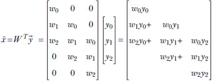

以下是一些观察结果：

+   我们并没有完全从  中恢复 ，但我们已经生成了一个与  大小相同的向量，*x̃*。通过乘以卷积权重矩阵的转置执行一种上采样，撤销正向卷积产生的下采样。

+   从  中恢复  是不可能的。这是因为当我们从  构造  时，我们乘以 *W* 并将具有五个独立元素的向量转换为具有三个独立元素的向量——一些信息已经无法恢复。这种直觉与事实一致，即 5 × 3 矩阵 *W* 是 *不可逆的*：没有 *W*^(−1)，因此无法得到  = *W*^(−1)。

+   在转置卷积过程中，我们将的元素以与进行正向卷积时相同的比例分配回*x̃*中的元素（参见图 10.16）。这应该会让你想起第八章中的反向传播。在那里，在方程 8.24 的右侧，我们看到了对于线性层，正向传播相当于乘以一个任意的权重矩阵*W*（如方程 8.8 所示）。反向传播涉及乘以相同的权重矩阵的转置（方程 8.31）。反向传播进行的是*成比例的责任分配*——损失以与它们在创建输出中的贡献成比例的比例分配回输入。这里发生的情况也是一样。因此，乘以转置权重矩阵通常以与它对输出贡献相同的比例分配输出。

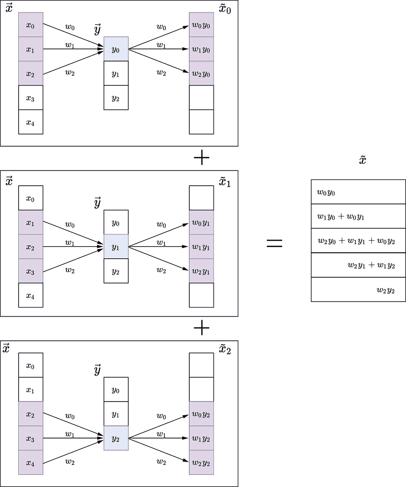

图 10.16 1D 卷积及其转置

这种思想可以扩展到更高维度。图 10.17 说明了 2D 转置卷积操作。

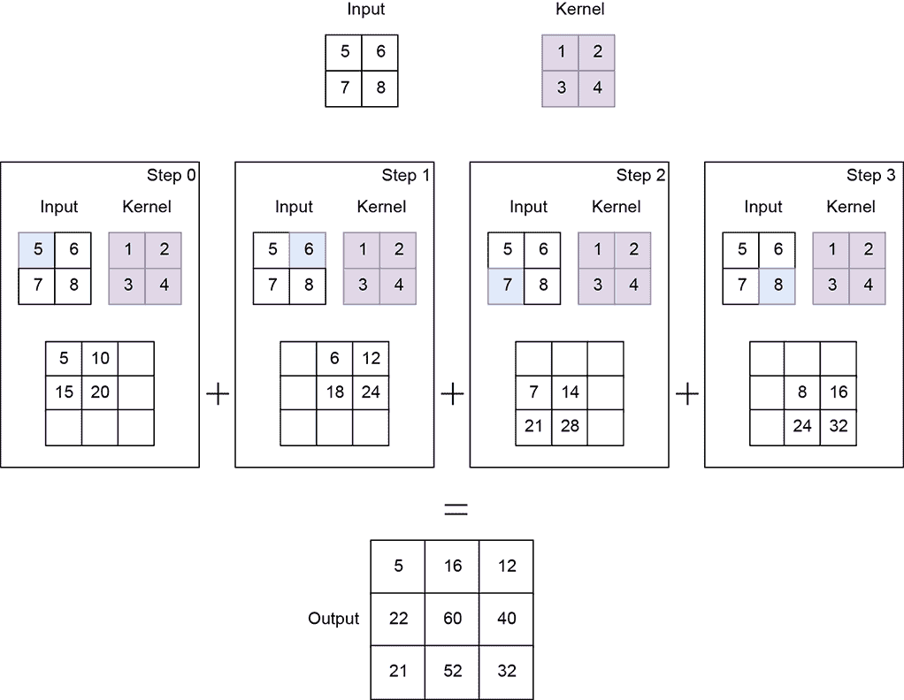

图 10.17 2D 卷积及其转置

### 10.5.1 转置卷积的应用：自编码器和嵌入

转置卷积通常在自编码器中是必需的。在此处，我们简要概述自编码器，以解释为什么它们需要转置卷积。到目前为止，我们查看的大多数神经网络都是监督分类器的例子，它们接收输入并直接输出输入所属的类别。这不是唯一可能的范式。如第 6.9 节所暗示，我们还可以将输入映射到一个向量，通常称为*嵌入*，也称为*描述向量*，它捕捉感兴趣类别的本质方面，并丢弃可变方面。例如，如果感兴趣的类别是人类，那么给定一个图像，嵌入将只捕获识别图像中人类的特征，而忽略背景（天空、海洋、森林、建筑等）。

从输入到嵌入的映射是通过一个称为*编码器*的神经网络完成的。如果输入是图像，编码器通常包含一系列卷积层。

我们如何训练这个神经网络？我们如何定义它的损失？好吧，一种可能性是嵌入必须保持对原始输入的忠实度：也就是说，我们应该能够从嵌入中重建（至少是近似地）输入。记住，嵌入的大小（自由度较少）比输入小，因此完美的重建是不可能的。尽管如此，我们可以定义损失为原始输入和重建输入之间的差异（例如，欧几里得距离或二值交叉熵损失）。

我们如何从嵌入中重建输入？这就是转置卷积发挥作用的地方。记住，我们在编码器中进行了卷积（可能多次）以生成嵌入。我们可以在嵌入上执行一系列转置卷积以生成与输入相同大小的张量。执行此重建的网络称为*解码器*。解码器生成我们的重建输入。

我们定义损失为原始输入和重建输入之间的差异。我们可以训练以最小化损失并学习编码器和解码器的权重。这被称为*端到端学习*，编码器-解码器对被称为*自动编码器*。

我们使用许多数据实例来训练自动编码器，所有这些实例都属于感兴趣的类别。由于它没有记住整个图像的奢侈（嵌入的大小比输入小），它被迫学习如何保留所有训练图像的共同特征：即描述感兴趣类别的特征。在我们的例子中，自动编码器将学习保留识别人类的特征并丢弃背景。请注意，这也可能导致一种非常有效的*压缩技术*——嵌入是图像的紧凑表示，其中只保留了感兴趣的物体。

### 10.5.2 转置卷积输出大小

通过反转方程式 10.8 可以获得转置卷积的输出大小：

*o*^′ = (*n*^′−1)*s* + *k* − 2*p*

方程式 10.8

例如，在大小为 *n*^′ = 3 的  上使用步长 *s* = 1 的转置卷积（有效填充 *p* = 0）和一个大小为 *k* = 3 的内核，会创建一个大小为 *o*^′ = 5 的输出 *x̃*。

### 10.5.3 通过转置卷积进行上采样

在上一节中，我们简要讨论了自动编码器，其中编码器网络将输入图像映射到嵌入，解码器网络试图从嵌入中重建输入图像。编码器网络通过一系列卷积和池化层将高分辨率输入转换为低分辨率嵌入（我们将在下一章详细讨论池化层）。试图从嵌入中重建原始图像的解码器网络必须将低分辨率输入上采样/上采样到高分辨率输出。

许多插值技术，如最近邻、双线性插值和双三次插值，可以用于执行此上采样操作。这些技术通常使用预定义的数学函数将低分辨率输入映射到高分辨率输出。然而，执行上采样的更优方式是通过转置卷积，其中映射函数是在训练过程中学习的，而不是预先定义的。神经网络将学习最佳方式将输入元素分布到更高分辨率的输出图中，以便最终重建误差最小化（即最终输出尽可能接近原始输入图像）。在本章中，我们不深入讨论自动编码器的训练细节；然而，我们展示了如何使用转置卷积对输入图像进行上采样：

+   输入数组被转换为形状为 *N* × *C[in]* × *H* × *W* 的 4D 张量，其中 *N* 是批处理大小，*C[in]* 是输入通道数，*H* 是高度，*W* 是宽度。

+   核是一个形状为 *C[in]* × *C[out]* × *k[H]* × *k[W]* 的 4D 张量，其中 *C[in]* 是输入通道数，*C[out]* 是输出通道数，*k[H]* 是核高度，*k[W]* 是核宽度。注意这与常规 2D 卷积核不同，常规 2D 卷积核的形状应为 *C[out]* × *C[in]* × *k[H]* × *k[W]*。本质上，输入和输出通道维度是互换的。

图 10.18 展示了一个输入形状为 1 × 1 × 2 × 2 的示例。卷积核的形状为 1 × 1 × 2 × 2。步长为 2 的转置卷积会产生一个形状为 1 × 1 × 4 × 4 的输出。

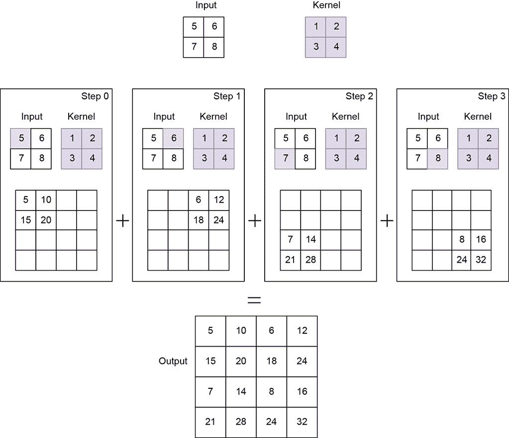

图 10.18 使用步长 2 的 2D 转置卷积进行上采样

注意：完全功能的转置卷积代码，可通过 Jupyter Notebook 执行，可在 [`mng.bz/radD`](http://mng.bz/radD) 找到。

列表 10.7 使用转置卷积进行上采样的 PyTorch 代码

```py
import torch

x = torch.tensor([                               ①
        [5., 6.],
        [7., 8.]
    ])

w = torch.tensor([                               ②
        [1., 2.],
        [3., 4.]
    ])

x = x.unsqueeze(0).unsqueeze(0)                  ③

w = w.unsqueeze(0).unsqueeze(0)                  ④

transpose_conv2d = torch.nn.ConvTranspose2d(     ⑤
    1, 1, kernel_size=2, stride=2, bias=False)

transpose_conv2d.weight = torch.nn.Parameter(w,  ⑥
                requires_grad=False)

with torch.no_grad():                            ⑦

    y = transpose_conv2d(x)                      ⑧
```

① 实例化输入张量

② 实例化核权重

③ 将输入张量转换为 *N* × *C[in]* × *H* × *W* = 1 × 1 × 2 × 2

④ 将核转换为 *C[in]* × *C[out]* × *k[H]* × *k[W]* = 1 × 1 × 2 × 2

⑤ 实例化转置卷积层

⑥ 设置核权重

⑦ 指示 PyTorch 不计算梯度，因为我们目前不需要它们

⑧ 执行转置卷积。*y* 的形状为 4 × 4。

## 10.6 将卷积层添加到神经网络中

到目前为止，我们一直在讨论具有自定义权重的卷积层，这些权重是我们设置的。虽然这让我们对卷积的工作原理有了概念性的理解，但在实际的神经网络中，我们**并不**自己设置卷积权重。相反，我们期望权重通过反向传播中的损失最小化来学习，正如第八章和第九章所描述的。我们将在下一章中查看流行的神经网络架构。但从编程的角度来看，最重要的学习内容是如何将卷积层添加到神经网络中。这就是我们在下一节要学习的内容。

在设置神经网络的过程中，我们指定其维度但不指定权重。我们还初始化权重值。权重值在反向传播（`loss.backward()`调用）过程中稍后更新（尽管 PyTorch 允许我们选择查看它们的值）。

### 10.6.1 在 PyTorch 中向神经网络添加卷积层

让我们看看如何在 PyTorch（完整的神经网络架构将在下一章中详细讨论）中将卷积层作为更大神经网络的一部分来实现：

+   神经网络通常子类化`torch.nn.Module`基类并实现`forward()`方法。神经网络的层在`__init__()`函数中实例化。

+   使用`torch.nn.Sequential`将多个层依次连接起来。第一层的输出被馈送到第二层，依此类推。

+   每个`torch.nn.Conv2d()`代表一个单独的卷积层。我们的代码片段实例化了三个这样的卷积层，层之间有其他层（详细信息将在下一章中介绍）。

列表 10.8 PyTorch 示例卷积神经网络的代码

```py
import torch

class SampleCNN(torch.nn.Module):
    def __init__(self, num_classes):
        super(LeNet, self).__init__()
        self.nn = torch.nn.Sequential(           ①

            torch.nn.Conv2d(
                in_channels=1, out_channels=6,
                kernel_size=5, stride=1),        ②

                         ... 

            torch.nn.Conv2d(
                in_channels=6, out_channels=16,
                kernel_size=5, stride=1),

                         ...

            torch.nn.Conv2d(
                in_channels=16, out_channels=120,
                kernel_size=5, stride=1),        ③

                        ...
        )

    def forward(self, x):                        ④
        out = self.nn(x)
        return out
```

① 使用`torch.nn.Sequential`将一系列层连接起来。

② 实例化卷积层

③ 实现前向传播

④ 执行卷积

## 10.7 池化

到目前为止，我们已经看到了卷积层如何在输入图像上滑动并生成包含描述图像的重要特征的输出特征图。我们在 1D、2D 和 3D 设置中探讨了这一点。（我们将在下一章中更多地讨论这一点。）卷积层的一个主要缺点是它对输入中特征的定位非常敏感。输入特征位置的微小变化可能导致不同的输出特征图。这种变化可能由于相机角度变化、旋转、裁剪、物体以不同距离从相机存在等原因在现实世界中发生。我们如何处理这种变化并使神经网络更加鲁棒？

一种实现方式是通过下采样。特征图的一个低分辨率版本仍然包含重要的特征，但精度/粒度较低。因此，即使重要特征在高分辨率特征图中位于略微不同的位置，它们在低分辨率特征图中也大致位于相同的位置。这也被称为*局部平移不变性*。

在卷积神经网络中，下采样操作是通过*池化*层来执行的。池化层本质上是在整个图像上滑动一个小滤波器。在每个滤波器位置，它们使用池化操作捕获局部补丁的摘要。以下是最流行的两种池化操作类型：

+   *最大池化*—计算每个补丁的最大值

+   *平均池化*—计算每个补丁的平均值

图 10.19 详细说明了这一点。输出特征图的大小取决于核大小和池化层的步长。例如，如果我们使用 2 × 2 核和步长为 2，如图 10.19 和 10.20 所示，输出特征图变为输入特征图大小的一半。同样，使用 3 × 3 核和步长= 3 使得输出特征图大小为输入特征图的三分之一。

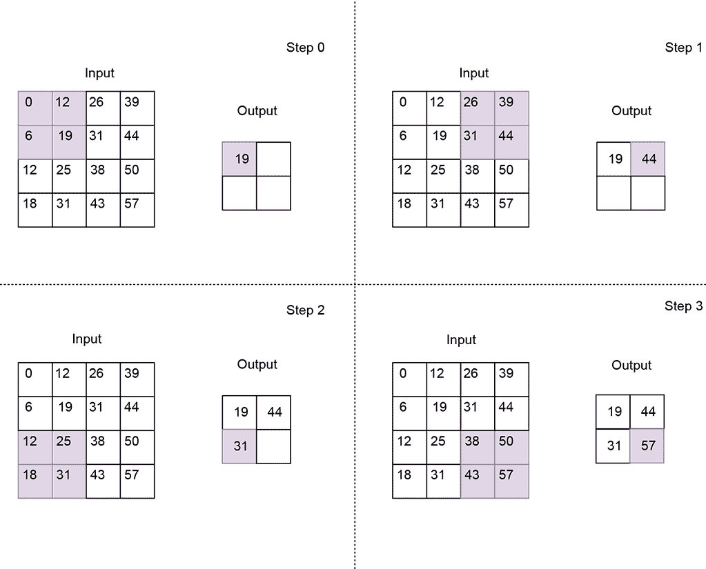

图 10.19 使用 2 × 2 核和步长 2 的最大池化。结果输出特征图是输入特征图大小的一半。输出特征图中的每个值是输入特征图中相应局部补丁的最大值。

列表 10.9 PyTorch 代码用于最大池化和平均池化

```py
import torch

X = torch.tensor([                ①
    [0, 12, 26, 39],
    [6, 19, 31, 44],
    [12, 25, 38, 50],
    [18, 31, 43, 57]
], dtype=torch.float32).unsqueeze(0).unsqueeze(0)

max_pool_2d = torch.nn.MaxPool2d( ②
    kernel_size=2, stride=2)

out_max_pool = max_pool_2d(X)     ③

avg_pool_2d = torch.nn.AvgPool2d( ④
    kernel_size=2, stride=2)

out_avg_pool = avg_pool_2d(X)     ⑤
```

① 实例化一个 4 × 4 输入张量

② 实例化一个步长为 2 的 2 × 2 最大池化层

③ 输出特征图大小为 2 × 2

④ 实例化一个步长为 2 的 2 × 2 平均池化层

⑤ 输出特征图大小为 2 × 2


图 10.20 使用 2 × 2 核和步长 2 的平均池化。结果输出特征图对应于输入特征图中的局部补丁。

## 摘要

在本章中，我们深入探讨了 1D、2D 和 3D 卷积及其在图像和视频分析中的应用：

+   卷积层有助于捕捉输入数据中的局部模式，因为它们只将一小组相邻的输入值连接到输出值。这与前几章中讨论的完全连接层（也称为线性层）不同，其中所有输入都连接到每个输出值。

+   卷积操作涉及在输入数组上滑动一个核。虽然从概念上可以将其视为矩阵乘法，但由于效率原因，实际上并不是这样实现的。核大小、步长和填充会影响输出的大小。

+   核在完成单步滑动后覆盖的输入元素数量称为*步长*。

+   当内核达到输入数组的末端时，其部分可能超出数组范围。为了处理这种情况，可以应用多种*填充*策略。在*有效填充*中，当内核的任何一个元素超出输入数组时，卷积操作就会停止。在*相同（零）填充*中，假设所有超出输入数组的内核元素输入值为零。

+   从概念上讲，1D 卷积可以看作是将测量尺（1D 内核）在拉直的绳索（1D 输入数组）上滑动。1D 卷积的实际应用包括曲线中的平滑和边缘检测。

+   从概念上讲，2D 卷积可以看作是将瓦片（2D 内核）在整个墙壁（2D 输入数组）的表面积上滑动。2D 卷积的实际应用包括图像中的平滑和边缘检测。

+   从概念上讲，3D 卷积可以看作是将砖块（3D 内核）在整个房间 3D 输入数组的整个体积上滑动。3D 卷积的实际应用包括图像序列中的运动检测。

+   在转置卷积中，输入数组元素与内核权重相乘，然后分布到输出数组中。转置卷积的实际应用包括上采样，将低分辨率输入转换为高分辨率输出。自动编码器使用转置卷积从嵌入中重建图像。

+   池化层本质上是在输入上滑动内核，捕获每个内核位置的局部区域的摘要。它们有助于提高卷积神经网络对输入特征微小变化的鲁棒性。最流行的两种池化操作是最大池化（计算局部区域的最大值）和平均池化（计算局部区域的平均值）。池化层导致输入数组下采样。输出大小取决于池化内核的大小和步长。
