# 第十一章：用于图像分类和物体检测的神经网络

本章涵盖

+   使用更深的神经网络进行图像分类和物体检测

+   理解卷积神经网络和其他深度神经网络架构

+   纠正神经网络中的不平衡

如果人类看到图 11.1 中的图像，他们可以立即识别其中的物体，将它们分类为鸟类、飞机和超人。在图像分类中，我们希望赋予计算机这种能力——在图像中识别物体并将它们分类到一个或多个已知和预定的类别中。除了识别物体类别外，我们还可以识别图像中物体的位置。物体的位置可以用一个 *边界框* 来描述：一个边与坐标轴平行的矩形。边界框通常由四个参数指定：[(*xtl*, *ytl*),(*xbr*, *ybr*)]，其中 (*xtl*, *y**tl*) 是边界框左上角的 xy 坐标，(*xbr*, *ybr*) 是边界框右下角的 xy 坐标。

如果我们还想识别它们在图像中的位置，这被称为 *物体检测*。图像分类和物体检测是计算机视觉中最基本的问题之一。虽然人脑几乎可以直观地对图像中的物体进行分类和定位，但我们如何训练机器来做这件事呢？在深度学习之前，计算机视觉技术涉及手动制作图像特征（以编码颜色、边缘和形状）并在这些特征之上设计规则来分类/定位物体。然而，这不是一个可扩展的方法，因为图像极其复杂且多样化。想想一个简单的物体，比如汽车。它可以有各种大小、形状和颜色。它可以从远处或近处（尺度）看到，从不同的视角（视角），在阴天或晴天（光照条件）。汽车可以停在繁忙的街道或山路上（背景）。几乎不可能设计出可以处理所有这些变化的特征和规则。


图 11.1 是鸟吗？是飞机吗？是超人吗？

在过去的 10 年中，一类新的算法出现了：卷积神经网络（CNNs）。它们不依赖于手工设计的特征，而是从 *数据* 中 *学习* 相关特征。这些模型在多个计算机视觉任务中取得了巨大的成功，实现了（有时甚至超过了）人类水平的准确性。它们在工业界的应用越来越广泛，从医疗诊断到电子商务再到制造业。在本章中，我们详细介绍了用于图像分类和目标检测的一些最流行的深度神经网络架构。我们探讨了它们的显著特征，深入研究了架构细节，以了解它们是如何以及为什么能工作的，并将它们应用于实际问题。

注意：本章的完整功能代码，可通过 Jupyter Notebook 执行，可在 [`mng.bz/vojq`](http://mng.bz/vojq) 找到。

## 11.1 用于图像分类的 CNN：LeNet

在第十章中，我们讨论了 1D、2D 和 3D 场景下的卷积操作。我们还看到了如何将单个卷积层作为更大神经网络的一部分来实现。本节展示了如何使用具有多个卷积层的神经网络进行图像分类。（如果需要，鼓励您回顾第十章。）为此，让我们考虑 MNIST 数据集，这是一个包含大量手写数字（0 到 9）的大集合。它包含 60,000 张图像的训练集和 10,000 张图像的测试集。每个图像大小为 28 × 28，包含单个数字的中心裁剪。图 11.2 显示了 MNIST 数据集的样本图像。


图 11.2 MNIST 数据集的样本图像。（来源：“应用于文档识别的基于梯度的学习”；[`mng.bz/Wz0a.`](http://vision.stanford.edu/cs598_spring07/papers/Lecun98.pdf))

我们希望构建一个分类器，该分类器接受 28 × 28 的图像作为输入，并根据图像中包含的数字输出 0 到 9 的标签。为此任务最流行的神经网络架构之一是 LeNet，它由 LeCun 等人在 1998 年发表的论文“应用于文档识别的基于梯度的学习”中提出（[`mng.bz/Wz0a`](http://mng.bz/Wz0a)）。LeNet 架构如图 11.3 所示（LeNet 预期输入图像大小为 32 × 32，因此将 28 × 28 的 MNIST 图像调整为 32 × 32 大小后再输入网络）：

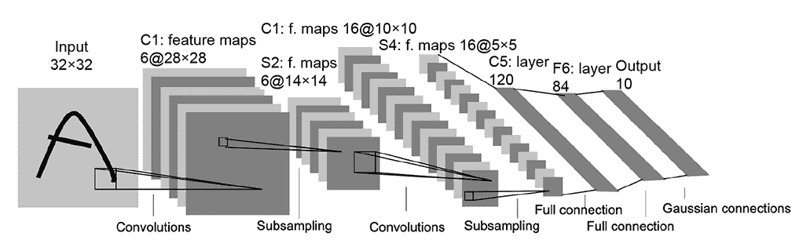

图 11.3 LeNet。（来源：“应用于文档识别的基于梯度的学习”；[`mng.bz/Wz0a.`](http://vision.stanford.edu/cs598_spring07/papers/Lecun98.pdf))

+   它由三个具有 5 × 5 内核的卷积层组成，步长为 1。第一个卷积层生成 6 个大小为 28 × 28 的特征图。

    第二个卷积层产生 16 个大小为 10 × 10 的特征图，第三个卷积层产生 120 个大小为 1 × 1 的特征图，这些特征图被展平成一个 120 维的向量）

+   前两个卷积层后面跟着下采样（也称为池化）层，这些层对特征图进行局部平均和下采样，从而降低特征图的分辨率和输出对输入中位移和畸变的敏感性。应用了一个大小为 2 × 2 的池化核，将特征图大小减少到原来的一半。有关池化的更多信息，请参阅 10.7 节。

+   每个特征图后面都跟着一个 tanh 激活层。这向网络引入了非线性，增加了其表达能力，因为它现在可以将输出建模为输入的非线性组合。如果我们没有非线性激活函数，无论我们有多少层，神经网络仍然会像单一线性层网络一样表现，因为多个线性层的组合只是另一个线性层。虽然原始的 LeNet 论文使用了 tanh 作为激活函数，但也可以使用几个其他激活函数，如 ReLU 和 sigmoid。ReLU 在 11.2.1.1 节中进行了详细讨论。sigmoid 和 tanh 的详细讨论可以在 8.1 和 8.1.2 节中找到。

+   输出特征图通过两个全连接（FC，也称为线性）层，最终产生一个代表每个类得分的 10 维*logits*向量。使用 softmax 层将 logits 得分转换为概率。

+   `CrossEntropyLoss`，在 6.3 节中讨论，用于计算预测概率和真实值之间的差异。

注意：*特征图*是一个与每个点关联固定大小向量的二维数组（即网格）。图像是特征图的一个例子，每个点是一个像素，关联的向量表示像素的颜色。卷积层将输入特征图转换为输出特征图。输出特征图通常具有更小的宽度和高度，但每个点的向量更长。

LeNet 在 MNIST 数据集上表现非常好，测试准确率超过 99%。接下来将展示 LeNet 的 PyTorch 实现。

### 11.1.1 使用 PyTorch 在 MNIST 上实现 LeNet 进行图像分类

注意：用于训练 LeNet 的完整功能代码，可通过 Jupyter Notebook 执行，可以在[`mng.bz/q2gz`](http://mng.bz/q2gz)找到。

列表 11.1 LeNet 的 PyTorch 代码

```py
import torch

class LeNet(torch.nn.Module):
    def __init__(self, num_classes):
        super(LeNet, self).__init__()
        self.conv1 = torch.nn.Sequential(
                        torch.nn.Conv2d(
                            in_channels=1, out_channels=6,     ①
                            kernel_size=5, stride=1),
                        torch.nn.Tanh(),                       ②
                        torch.nn.AvgPool2d(kernel_size=2))     ③
        self.conv2 = torch.nn.Sequential(
                        torch.nn.Conv2d(
                            in_channels=6, out_channels=16,
                            kernel_size=5, stride=1),
                        torch.nn.Tanh(),
                        torch.nn.AvgPool2d(kernel_size=2))
        self.conv3 = torch.nn.Sequential(
                        torch.nn.Conv2d(
                            in_channels=16, out_channels=120,
                            kernel_size=5, stride=1),
                        torch.nn.Tanh())
        self.fc1 = torch.nn.Sequential(
                        torch.nn.Linear(
                            in_features=120, out_features=84), ④
                        torch.nn.Tanh())
        self.fc2 = torch.nn.Linear(
            in_features=84, out_features=num_classes)          ⑤

    def forward(self, X):                                      ⑥
        conv_out = self.conv3(self.conv2(self.conv1(X)))
        batch_size = conv_out.shape[0]
        conv_out = conv_out.reshape(batch_size, -1)            ⑦
        logits = self.fc2(self.fc1(conv_out))                  ⑧
        return logits

    def predict(self, X):
        logits = self.forward(X)
        probs = torch.softmax(logits, dim=1)                   ⑨
        return torch.argmax(probs, 1)
```

① 5 × 5 卷积

② Tanh 激活

③ 2 × 2 平均池化

④ 第一个全连接层

⑤ 第二个全连接层

⑥ X.shape: N × 3 × 32 × 32。N 是批处理大小。

⑦ conv_out.shape: N × 120 × 1 × 1

⑧ logits.shape: N × 10

⑨ 使用 softmax 计算概率

## 11.2 向更深层的神经网络迈进

LeNet 模型并不是一个非常深的网络，因为它只有三个卷积层。虽然这对于在像 MNIST 这样的简单数据集上实现准确的结果是足够的，但它并不适用于现实世界的图像分类问题，因为它没有足够的表达能力来模拟复杂图像。因此，我们通常选择具有多个卷积层的更深层的神经网络。增加更多层可以实现以下功能：

+   *由于额外的非线性而带来额外的表达能力*——由于每一层都带来一组新的可学习参数和额外的非线性，深层网络可以模拟输入数据元素之间更复杂的关系。底层通常学习物体的简单特征，如线条和边缘，而高层学习物体的更抽象特征，如形状或线条集合。

+   *以更少的参数达到相同的范围*——让我们通过一个例子来检验这一点。考虑两个输出特征图，一个是由输入上的单个 5 × 5 卷积产生的，另一个是由输入上连续应用的两个 3 × 3 卷积产生的。假设步长为 1，相同的（零）填充。图 11.4 说明了这种情况。考虑输出特征图中的一个网格点。在两种情况下，网格点的输出值都是来自输入中的 5 × 5 块。我们称这个指示的 5 × 5 输入块是输出网格点的*感受野*。因此，在两种情况下，输出网格点是对相同输入的摘要：即，它表达了相同的信息。然而，在更深层的网络中，参数更少。单个 5 × 5 滤波器的参数数量是 25，而两个 3 × 3 滤波器的参数数量是 2 × 9 = 18（假设单通道输入图像）。这是一个 38%的差异。同样，如果我们比较一个 7 × 7 滤波器与三个 3 × 3 滤波器，它们具有相同的感觉野，但 7 × 7 滤波器的参数比 3 × 3 滤波器多 81%。


图 11.4 单个 5 × 5 卷积层与两个 3 × 3 卷积层的比较

现在，让我们看看一些用于图像分类的最流行的深度卷积网络。第一个重新点燃深度学习革命的是*AlexNet*，它由 Krizhevsky 等人于 2012 年发表。它在 ImageNet 大规模视觉识别挑战（ILSVRC）上显著优于所有之前的最佳算法，这是一个包含 130 万张图片的复杂数据集，跨越 1000 个类别。自从 AlexNet 以来，几个深度网络在之前的状态上取得了进步，如 GoogleNet、VGG 和 ResNet。在本章中，我们讨论了使每个网络工作的关键概念。为了详细了解它们的架构、训练方法和最终结果，我们鼓励您阅读每个部分中链接的原始论文。

### 11.2.1 VGG（视觉几何组）网络

VGG 系列网络是由牛津大学视觉几何组创建的([`arxiv.org/pdf/1409.1556.pdf`](https://arxiv.org/pdf/1409.1556.pdf))。他们的主要贡献是对使用非常小的（3 × 3）卷积核的深度网络进行了彻底评估。他们证明了通过使用 3 × 3 卷积和具有 16-19 个权重层的网络，他们可以在 ILSVRC-2014 挑战赛上超越之前的最先进结果。与之前的工作相比，VGG 网络有两个主要区别：

+   *使用较小的（3 × 3）卷积核*——之前的网络通常在第一层卷积层使用 7 × 7 或 11 × 11 的大核。VGG 则在整个网络中只使用 3 × 3 核。如第 11.2 节所述，三个 3 × 3 滤波器具有与单个 7 × 7 滤波器相同的感受野。那么用三个较小的滤波器替换 7 × 7 滤波器能带来什么好处？

    +   由于在每个卷积层末尾应用了 ReLU 激活函数，因此具有更多的非线性，从而具有更强的表达能力。

    +   参数更少（49*C*²比 27*C*²），这意味着学习速度更快，对过拟合的鲁棒性更强。

+   *移除局部响应归一化（LRN）层*——LRN 最初是在 AlexNet 架构中引入的。它的目的是双重的：限制 ReLU 层的输出，ReLU 层是一个无界函数，其输出可以大到训练允许的程度；并鼓励*侧抑制*，其中神经元可以抑制其邻居的活动（这实际上起到了正则化的作用）。VGG 论文表明，添加 LRN 层并没有提高准确率，因此 VGG 选择从其架构中移除它们。

VGG 系列网络有五种不同的配置，这些配置主要区别在于层数（VGG-11、VGG-13、VGG-16 和 VGG-19）。无论具体配置如何，VGG 系列网络都遵循一个共同的结构。在这里，我们讨论这些共同点（详细差异描述可以在原始论文中找到）：

+   所有架构都针对 224 × 224 输入图像。

+   所有架构都有五个卷积块（conv blocks）：

    +   每个块可以包含多个卷积层，并在末尾跟一个最大池化层。

    +   所有单独的卷积层都使用 3 × 3 核，步长为 1，填充为 same，因此它们不会改变输出特征图的空间分辨率。

    +   单个卷积块内的所有卷积层都有相同大小的输出特征图。

    +   每个卷积层后面都跟着一个 ReLU 层，增加非线性。

    +   每个卷积块的末尾都有一个最大池化层，将空间分辨率降低到一半。

+   由于每个卷积块通过 2 倍下采样，输入特征图被减少了 2⁵（32）次，从而得到 7 × 7 大小的输出特征图。此外，在每个卷积块中，特征图的数量翻倍。

+   所有架构都以三个 FC 层结束：

    +   第一个将 51,277 大小的输入转换为 4,096 维输出。

    +   第二个将得到的 4,096 维输出转换为另一个 4,096 维输出。

    +   最后一个将得到的 4,096 维输出转换为 *C* 维输出，其中 *C* 代表类别数。在 ImageNet 分类的情况下，*C* 是 1,000。

VGG-11 的架构图显示在图 11.5 中。左侧的列表示每个层的输入张量的形状。右侧的列表示每个层的输出张量的形状。


图 11.5 VGG-11 架构图。所有形状都是 N × C × H × W 的形式，其中 N 是批量大小，C 是通道数，H 是高度，W 是宽度。

ReLU 非线性

正如我们之前讨论的，非线性层赋予了深度神经网络更多的表达能力来模拟复杂的数学函数。在第八章节中，我们研究了两个非线性函数：sigmoid 和 tanh。然而，VGG 网络（如 AlexNet）由一个不同的非线性层称为修正线性单元（ReLU）组成。为了理解这种选择的合理性，让我们回顾一下 sigmoid 函数并看看它的一些缺点。

图 11.6 绘制了 sigmoid 函数及其导数。如图所示，当输入为 0 时，梯度（导数）最大，随着输入的增加/减少，它迅速减小到 0。这对于 tanh 激活函数也是正确的。这意味着当 sigmoid 层之前神经元的输出要么很高要么很低时，梯度变得很小。虽然这可能在浅层网络中不是问题，但在大型网络中会成为一个问题，因为梯度可能太小，无法有效地进行训练。神经网络的梯度是通过反向传播计算的。根据链式法则，每一层的导数沿着网络相乘，从最终层开始，移动到初始层。如果每一层的梯度都很小，一个小的数乘以另一个小的数会得到一个更小的数。因此，初始层的梯度非常接近 0，使得训练无效。这被称为 *梯度消失* 问题。


图 11.6 1D sigmoid 函数（虚线曲线）及其导数（实线曲线）的图形

ReLU 函数解决了这个问题。图 11.7 展示了 ReLU 函数的图形。其方程如下

*ReLU*(*x*) = *max*(0, *x*)

方程 11.1

当 x 大于 0 时，ReLU 的导数是 1（常数），在其他地方都是 0。因此，它不会受到梯度消失问题的影响。今天的大多数深度网络都使用 ReLU 作为它们的激活函数。AlexNet 论文表明，使用 ReLU 非线性可以显著加快训练速度，因为它有助于更快地收敛。


图 11.7 ReLU 函数的图

PyTorch- VGG

现在我们来看看如何在 PyTorch 中实现 VGG 网络。首先，让我们实现单个卷积块，这是 VGG 网络的核心组件。这个卷积块将被多次重复，以形成整个 VGG 网络。

注意：VGG 网络的完整功能代码，可通过 Jupyter Notebook 执行，可以在 [`mng.bz/7WE4`](http://mng.bz/7WE4) 找到。

列表 11.2 卷积块的 PyTorch 代码

```py
class ConvBlock(nn.Module):
    def __init__(self, in_channels, num_conv_layers, num_features):
        super(ConvBlock, self).__init__()

        modules = []

        for i in range(num_conv_layers):
            modules.extend([
                nn.Conv2d(
                    in_channels, num_features,      ①
                    kernel_size=3, padding=1),      ②
                nn.ReLU(inplace=True)
            ])

            in_channels = num_features
        modules.append(nn.MaxPool2d(kernel_size=2)) ③
        self.conv_block = nn.Sequential(*modules)

    def forward(self, x):
        return self.conv_block(x)
```

① 3 × 3 卷积

② ReLU 非线性

③ 2 × 2 最大池化

接下来，让我们实现卷积骨干（conv backbone）构建器，它允许我们通过简单的配置更改创建不同的 VGG 架构。

列表 11.3 卷积骨干的 PyTorch 代码

```py
class ConvBackbone(nn.Module):
    def __init__(self, cfg):                        ①

        super(ConvBackbone, self).__init__()

        self.cfg = cfg

        self.validate_config(cfg)

        modules = []
        for block_cfg in cfg:                       ②
            in_channels, num_conv_layers, num_features = block_cfg 
            modules.append(ConvBlock(               ③
            in_channels, num_conv_layers, num_features))
        self.features = nn.Sequential(*modules)

    def validate_config(self, cfg):
        assert len(cfg) == 5 # 5  conv blocks
        for i, block_cfg in enumerate(cfg):
            assert type(block_cfg) == tuple and len(block_cfg) == 3
            if i == 0:
                assert block_cfg[0] == 3            ④
            else:
                assert block_cfg[0] == cfg[i-1][-1] ⑤

    def forward(self, x):
        return self.features(x)
```

① Cfg: [(in_channels, num_conv_layers, num_features),] 通过传递正确的 cfg，可以创建不同的 VGG 网络，而无需重复代码。

② 遍历卷积块配置

③ 实例化列表 11.2 中定义的卷积块

④ 必须有三个输入通道。

⑤ 前一个块的 out_Features 应等于当前块的 in_features。

使用包含每个卷积块配置列表的配置实例化卷积骨干。VGG-11 的配置包含较少的层，而 VGG-19 的配置包含更多的层。卷积骨干的输出被送入分类器，该分类器由三个全连接层组成。卷积骨干和分类器共同构成了 VGG 模块。

列表 11.4 VGG 网络的 PyTorch 代码

```py
class VGG(nn.Module):
    def __init__(self, conv_backbone, num_classes):
        super(VGG, self).__init__()
        self.conv_backbone = conv_backbone   ①
        self.classifier = nn.Sequential(
            nn.Linear(512 * 7 * 7, 4096),
            nn.ReLU(True),
            nn.Dropout(),
            nn.Linear(4096, 4096),           ②
            nn.ReLU(True),
            nn.Dropout(),
            nn.Linear(4096, num_classes)
        )

    def forward(self, x):
        conv_features = self.conv_backbone(x)

        logits = self.classifier(
            conv_features.view(
                conv_features.shape[0], -1)) ③
        return logits
```

① 列表 11.3 中定义的骨干网络

② 分类器由三个线性层组成。前两个层后面跟着 ReLU 非线性。

③ 在传递给分类器之前将卷积特征展平

VGG-11 网络可以如下实例化。

列表 11.5 从特定配置实例化 VGG 网络的 PyTorch 代码

```py
vgg11_cfg = [                             ①
    (3, 1, 64),
    (64, 1, 128),
    (128, 2, 256),
    (256, 2, 512),
    (512, 2, 512)
]

vgg11_backbone = ConvBackbone(vgg11_cfg)  ①
num_classes = 1000
vgg11 = VGG(vgg11_backbone, num_classes)  ①
```

① 创建 VGG-11 的 cfg

② 实例化卷积骨干

③ 实例化 VGG 网络

虽然我们已经讨论了如何在 PyTorch 中实现 VGG，但在实践中我们并不这样做，因为 `torchvision` 包已经实现了 VGG 网络，以及几个其他流行的深度网络。建议您使用此处所示的 `torchvision` 实现：

```py
import torchvision
vgg11 = torchvision.models.vgg11()
```

### 11.2.2 Inception：网络内网络范式

之前，我们看到了如何通过增加神经网络的深度——即层数——来提高准确率，因为这样可以增加网络的表达能力。或者，我们也可以通过增加网络的宽度——即每一层的单元数量——来提高准确率。然而，这两种方法都存在两个主要缺点。首先，盲目地增加网络的大小可能导致过拟合，即网络会记住训练数据中某些模式，而这些模式在测试数据中并不适用。其次，在训练和推理过程中都需要更多的计算资源。Szegedy 等人在其论文《通过卷积加深网络》中介绍了 Inception 架构([`arxiv.org/pdf/1409.4842v1.pdf`](https://arxiv.org/pdf/1409.4842v1.pdf))，旨在解决这两个问题。Inception 架构在保持计算预算不变的情况下，增加了网络的深度和宽度。在本节中，我们将探讨 Inception 架构背后的主要思想。尽管 Inception_v2、Inception_v3、Inception_ResNet 等对其进行了多次改进，但我们讨论的是原始的：Inception_v1。

之前的深度学习架构通常按顺序堆叠卷积滤波器：每一层应用一组相同大小的卷积滤波器，并将其传递到下一层。每一层的滤波器核大小取决于架构。但是，在这种架构下，我们如何知道我们为每一层选择了正确的核大小？如果我们正在检测一辆车，比如说，车在图像中占据的图像区域（即像素数）在近距离拍摄的图像中与从远处拍摄的图像中是不同的。我们说车这个物体的*尺度*在这两个图像中是不同的。因此，在不同尺度上识别汽车所需的像素数将不同。较大的核更适合处理较大尺度的信息，反之亦然。被迫选择一个核大小的架构可能不是最优的。Inception 模块通过在每一层使用多个不同大小的核来解决这个问题，并取输出结果的加权组合。网络可以学会更重视适当的核，而不是其他核。Inception 模块的简单实现使用三种核大小在输入上进行卷积：1 × 1、3 × 3 和 5 × 5。还执行了最大池化操作，使用 3 × 3 核，步长为 1，填充为 1（以保持输出和输入大小相同）。输出结果被连接起来，并送入下一个 Inception 模块。参见图 11.8 以获取详细信息。


图 11.8 Inception_v1 架构

这个简单的 Inception 模块存在一个主要缺陷。使用少量 5 × 5 过滤器就会极大地增加参数数量。当我们添加池化层，其中输出过滤器的数量等于前一阶段的过滤器数量时，这变得更加昂贵。因此，将池化层的输出与卷积层的输出连接起来会导致输出特征数量的不可避免增加。为了解决这个问题，Inception 模块在 3 × 3 和 5 × 5 过滤器之前使用 1 × 1 卷积层来减少输入通道数。这极大地减少了 3 × 3 和 5 × 5 卷积的参数数量。虽然这看起来可能有些反直觉，但 1 × 1 卷积比 3 × 3 和 5 × 5 卷积便宜得多。此外，1 × 1 卷积在池化之后应用，见图 11.8。

使用维度降低的 Inception 模块构建了一个神经网络架构，这广为人知为 GoogLeNet。GoogLeNet 有九个这样的 Inception 模块线性堆叠。它有 22 层深（包括池化层为 27 层）。它在最后一个 Inception 模块之后使用全局平均池化。对于如此深的网络，总是存在梯度消失问题；为了防止网络中间部分“死亡”，论文中引入了两个辅助分类器。这是通过对两个中间 Inception 模块的输出应用 softmax 并计算辅助损失在真实值上完成的。总损失函数是辅助损失和真实损失的加权总和。我们鼓励您阅读原始论文以了解细节。

PyTorch- Inception 模块

让我们看看如何在 PyTorch 中实现 Inception 模块。在实践中，我们通常不会这样做，因为包含 Inception 模块的端到端深度网络架构已经在 `torchvision` 包中实现。然而，我们从头开始实现 Inception 模块以了解其细节。

注意：Inception 模块的全功能代码，可通过 Jupyter Notebook 执行，可在 [`mng.bz/mxn0`](http://mng.bz/mxn0) 找到。

列表 11.6 用于简单 Inception 模块的 PyTorch 代码

```py
class NaiveInceptionModule(nn.Module):
    def __init__(self, in_channels, num_features=64):
        super(NaiveInceptionModule, self).__init__()

        self.branch1x1 = torch.nn.Sequential(                   ①
                        nn.Conv2d(
                            in_channels, num_features,
                            kernel_size=1, bias=False),
                        nn.BatchNorm2d(num_features, eps=0.001),
                        nn.ReLU(inplace=True))

        self.branch3x3 = torch.nn.Sequential( 
                        nn.Conv2d(                              ②
                            in_channels, num_features,
                            kernel_size=3, padding=1, bias=False),
                        nn.BatchNorm2d(num_features, eps=0.001),
                        nn.ReLU(inplace=True))

        self.branch5x5 = torch.nn.Sequential(                   ③
                        nn.Conv2d(
                            in_channels, num_features,
                            kernel_size=5, padding=2, bias=False),
                        nn.BatchNorm2d(num_features, eps=0.001),
                        nn.ReLU(inplace=True))

        self.pool = torch.nn.MaxPool2d(                         ④
            kernel_size=3, stride=1, padding=1)

    def forward(self, x):
        conv1x1 = self.branch1x1(x)
        conv3x3 = self.branch3x3(x)
        conv5x5 = self.branch5x5(x)
        pool_out = self.pool(x)
        out = torch.cat(                                        ⑤
            [conv1x1, conv3x3, conv5x5, pool_out], 1)
        return out
```

① 1 × 1 分支

② 3 × 3 分支

③ 5 × 5 分支

④ 3 × 3 池化

⑤ 连接并行分支的输出

列表 11.7 用于维度降低 Inception 模块的 PyTorch 代码

```py
class Inceptionv1Module(nn.Module):
    def __init__(self, in_channels, num_1x1=64,
                 reduce_3x3=96, num_3x3=128,
                 reduce_5x5=16, num_5x5=32,
                 pool_proj=32):
        super(Inceptionv1Module, self).__init__()

        self.branch1x1 = torch.nn.Sequential(
                        nn.Conv2d(               ①
                            in_channels, num_1x1,
                            kernel_size=1, bias=False),
                        nn.BatchNorm2d(num_1x1, eps=0.001),
                        nn.ReLU(inplace=True))

        self.branch3x3_1 = torch.nn.Sequential( ②
                        nn.Conv2d(
                            in_channels, reduce_3x3,
                            kernel_size=1, bias=False),
                        nn.BatchNorm2d(reduce_3x3, eps=0.001),
                        nn.ReLU(inplace=True))

        self.branch3x3_2 = torch.nn.Sequential(  ③
                        nn.Conv2d(
                            reduce_3x3, num_3x3,
                            kernel_size=3, padding=1, bias=False),
                        nn.BatchNorm2d(num_3x3, eps=0.001),
                        nn.ReLU(inplace=True))

        self.branch5x5_1 = torch.nn.Sequential(  ④
                        nn.Conv2d(
                            in_channels, reduce_5x5,
                            kernel_size=5, padding=2, bias=False),
                        nn.BatchNorm2d(reduce_5x5, eps=0.001),
                        nn.ReLU(inplace=True))
        self.branch5x5_2 = torch.nn.Sequential(  ⑤
                        nn.Conv2d(
                            reduce_5x5, num_5x5,
                            kernel_size=5, padding=2, bias=False),
                        nn.BatchNorm2d(num_5x5, eps=0.001),
                        nn.ReLU(inplace=True))

        self.pool = torch.nn.Sequential(         ⑥
                        torch.nn.MaxPool2d(
                            kernel_size=3, stride=1, padding=1),
                        nn.Conv2d(
                            in_channels, pool_proj,
                            kernel_size=1, bias=False),
                        nn.BatchNorm2d(pool_proj, eps=0.001),
                        nn.ReLU(inplace=True))

    def forward(self, x):
        conv1x1 = self.branch1x1(x)
        conv3x3 = self.branch3x3_2(self.branch3x3_1((x)))
        conv5x5 = self.branch5x5_2(self.branch5x5_1((x)))
        pool_out = self.pool(x)
        out = torch.cat(                         ⑦
            [conv1x1, conv3x3, conv5x5, pool_out], 1)
        return out
```

① 1 × 1 分支

② 3 × 3 分支中的 1 × 1 卷积

③ 3 × 3 分支中的 3 × 3 卷积

④ 5 × 5 分支中的 1 × 1 卷积

⑤ 5 × 5 分支中的 5 × 5 卷积

⑥ 先进行最大池化，然后是 1 × 1 卷积

⑦ 连接并行分支的输出

### 11.2.3 ResNet：为什么堆叠层以增加深度并不总是可扩展的

我们从一个基本问题开始：学习更好的网络是否像堆叠多个层一样简单？考虑图 11.9 中的图表。


图 11.9 展示了在 CIFAR-10 数据集上 20 层和 56 层网络的训练错误（左）和测试错误（右）。(来源：“用于图像识别的深度残差学习”；[`arxiv.org/pdf/1512.03385.pdf`](https://arxiv.org/pdf/1512.03385.pdf)。)

这张图片来自 ResNet 论文“用于图像识别的深度残差学习”（[`arxiv.org/pdf/1512.03385.pdf`](https://arxiv.org/pdf/1512.03385.pdf)），展示了两个网络在 CIFAR-10 数据集上的训练和测试错误率：一个有 20 层的较浅网络和一个有 56 层的较深网络。令人惊讶的是，较深（56 层）网络的训练和测试错误率更高。这个结果极其反直觉，因为我们预期更深层的网络应该具有更强的表达能力，从而比其较浅的对应网络有更高的准确率/更低的错误率。这种现象被称为*退化*问题：随着网络深度的增加，准确率变得饱和并迅速下降。我们可能会将其归因于过拟合，但事实并非如此，因为即使是较深网络的训练错误率也更高。另一个可能的原因是梯度消失/爆炸。然而，ResNet 论文的作者调查了每一层的梯度，并确定它们是健康的（没有消失/爆炸）。那么，是什么导致了退化问题，我们该如何解决它？

让我们考虑一个具有*n*层的较浅架构及其更深的对应架构，后者增加了更多层(*n* + *m*层)。较深的架构应该能够实现的损失不高于较浅架构。直观地说，一个简单的解决方案是学习较浅架构的精确*n*层和额外的*m*层的恒等函数。实际上这种情况并未发生表明神经网络层很难学习恒等函数。因此，论文提出了“快捷/跳过连接”，使得层能够轻松地学习恒等函数。这种“恒等快捷连接”是 ResNet 的核心思想。让我们看看一个数学类比。设*h*(*x*)是我们试图通过一层层（不一定是整个网络）来建模（学习）的函数。我们合理地预期函数*g*(*x*) = *h*(*x*) − *x*比*h*(*x*)简单，因此更容易学习。但我们已经在输入处有了*x*。所以如果我们学习*g*(*x*)并将其加到*x*上以获得*h*(*x*)，我们就有效地通过学习更简单的*g*(*x*)函数来建模*h*(*x*)。名称*residual*来自*g*(*x*) = *h*(*x*) − *x*。图 11.10 详细展示了这一点。

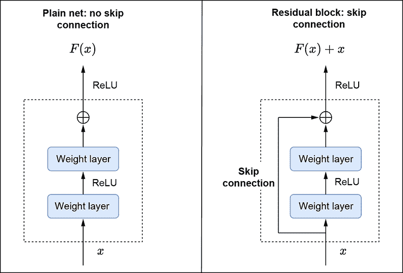

图 11.10 列展示了具有跳过连接的残差块。

现在让我们回顾一下之前的问题，即退化问题。我们提出，普通的神经网络层通常难以学习恒等函数。在残差学习的情况下，为了学习恒等函数，*h*(*x*) = *x*，层需要学习 *g*(*x*)=0。这可以通过将所有层的权重驱动到 0 来轻松实现。这里还有另一种思考方式：如果我们初始化常规神经网络权重和偏差为 0，那么每个层都从“零”函数开始：*g*(*x*) = 0。因此，每个带有跳跃连接的层堆栈的输出，*h*(*x*) = *g*(*x*) + *x*，已经是恒等函数：当 *g*(*x*) = 0 时，*h*(*x*) = *x*。

在实际情况下，需要注意的是，恒等映射不太可能是最优的：网络层将想要学习实际特征。在这种情况下，这种重新表述并没有阻止网络层学习其他函数，就像常规层堆栈一样。我们可以将这种重新表述视为预条件，如果需要，它使得学习恒等函数更容易。此外，通过添加跳跃连接，我们允许梯度直接从层流向层：深层层有直接路径到 *x*。这允许更好的学习，因为来自底层的信息可以直接传递到高层。

ResNet 架构

现在我们已经看到了基本构建块——一个带有跳跃连接的卷积层堆栈，让我们更深入地了解 ResNet 的架构。ResNet 架构是通过将多个构建块堆叠在一起来构建的。它们遵循与 VGG 相同的理念：

+   卷积层主要使用 3 × 3 的过滤器。

+   对于给定的输出特征图大小，层具有相同数量的过滤器。

+   如果特征图大小减半，则过滤器数量加倍以保持每层的时序复杂度。

与 VGG 使用多个最大池化层不同，ResNet 使用步长为 2 的卷积层进行下采样。其核心架构由以下组件组成：

+   *五个卷积层块*——第一个卷积层块由一个 7 × 7 的核组成，`stride=2`，`padding=3`，`num_features=64`，随后是一个 3 × 3 核的最大池化层，`stride=2`，`padding=1`。特征图大小从(224, 224)减少到(56, 56)。其余的卷积层（`ResidualConvBlock`）是通过堆叠多个基本快捷块来构建的。每个基本块使用 3 × 3 的过滤器，如上所述。

+   *分类器*——在卷积块输出之上运行的平均池化块，随后是一个 FC 层，用于分类。

鼓励您查看原始论文中的图表以了解细节。现在，让我们看看如何在 PyTorch 中实现 ResNet。

PyTorch-ResNet

在本节中，我们讨论如何从头开始实现 ResNet-34。请注意，在实践中很少这样做。`torchvision` 包为所有 ResNet 架构提供了现成的实现。然而，通过从头开始构建网络，我们可以更深入地理解架构。首先，让我们实现一个基本的跳转连接块（`BasicBlock`）来了解快捷连接是如何工作的。

注意：ResNet 的完整功能代码，可通过 Jupyter Notebook 执行，可在 [`mng.bz/5K9q`](http://mng.bz/5K9q) 找到。

列表 11.8 `BasicBlock` 的 PyTorch 代码

```py
class BasicBlock(nn.Module):
    def __init__(self, in_channels, num_features, stride=1, downsample=None):
        super(BasicBlock, self).__init__()
        self.conv1 = nn.Sequential(                        ①

                        nn.Conv2d(
                            in_channels, num_features,
                            kernel_size=3, stride=stride, padding=1, bias=False),
                        nn.BatchNorm2d(num_features, eps=0.001),
                        nn.ReLU(inplace=True))
        self.conv2 = nn.Sequential(
                        nn.Conv2d(
                            num_features, num_features,
                            kernel_size=3, stride=1, padding=1, bias=False),
                        nn.BatchNorm2d(num_features, eps=0.001))

        self.downsample = downsample                       ②

        self.relu = nn.ReLU(inplace=True)

    def forward(self, x):
        conv_out = self.conv2(self.conv1(x))
        identity = x
        if self.downsample is not None:
            identity = self.downsample(x)
        assert identity.shape == conv_out.shape,
            f"Identity {identity.shape} and conv out {conv_out.shape} have different shapes"

        out = self.relu(conv_out + identity)               ③
        return out
```

① 实例化两个 3 × 3 大小的卷积层

② 当输入和输出特征图大小不同时，使用 1 × 1 卷积层对输入特征图进行下采样。

③ 创建跳转连接

注意残差块输出是卷积层输入和输出的函数：`ReLU(conv_out+x)`。这假设 *x* 和 *conv_out* 具有相同的形状。（稍后我们将讨论当这种情况不成立时应该怎么做。）此外，添加跳转连接不会增加参数数量。快捷连接是无参数的。这使得从计算角度来看，解决方案成本低，这是快捷连接的一个魅力。

接下来，让我们实现一个由多个基本块堆叠而成的残差卷积块。在处理基本块时，我们必须处理两种情况：

+   *情况 1*—输出特征图空间分辨率 = 输入特征图空间分辨率 且 输出特征数量 = 输入特征数量。这是最常见的情况。由于特征数量或特征图的空间分辨率没有变化，我们可以通过快捷连接轻松地将输入和输出相加。

+   *情况 2*—输出特征图空间分辨率 = 输入特征图空间分辨率的一半 且 输出特征数量 = 输入特征数量的两倍。记住 ResNet 使用步长为 2 的卷积层进行下采样。特征数量也加倍。这是通过每个卷积块（除了第二个卷积块）的第一个基本块来实现的。在这种情况下，输入和输出大小不同。那么我们如何将它们作为跳转连接的一部分相加呢？1 × 1 卷积是答案。通过使用 `stride=2` 和 `num_features=2 * num_input_features` 的 1 × 1 卷积，输入特征图的空间分辨率减半，输入特征数量通过加倍。

列表 11.9 `ResidualConvBlock` 的 PyTorch 代码

```py
class ResidualConvBlock(nn.Module):
    def __init__(self, in_channels, num_blocks, reduce_fm_size=True):
        super(ResidualConvBlock, self).__init__()

        num_features = in_channels * 2 if reduce_fm_size else in_channels
        modules = []

        for i in range(num_blocks):                          ①
            if i == 0 and reduce_fm_size:
                stride = 2
                downsample = nn.Sequential( 
                    nn.Conv2d(                               ②
                        in_channels, num_features,
                        kernel_size=1, stride=stride, bias=False),
                    nn.BatchNorm2d(num_features, eps=0.001),
                )
                basic_block = BasicBlock(
                    in_channels=in_channels, num_features=num_features,
                    stride=stride, downsample=downsample)
            else:
                basic_block = BasicBlock(
                    in_channels=num_features, num_features=num_features, stride=1)
            modules.append(basic_block)

        self.conv_block = nn.Sequential(*modules)

    def forward(self, x):
        return self.conv_block(x)
```

① 残差块是基本块的堆叠

② 1 × 1 卷积用于下采样输入特征图

这样，我们就准备好实现 ResNet-34。

列表 11.10 ResNet-34 的 PyTorch 代码

```py
class ResNet34(nn.Module):
    def __init__(self, num_basic_blocks, num_classes):
        super(ResNet, self).__init__()
        conv1 = nn.Sequential(                       ①
            nn.Conv2d(3, 64, kernel_size=7,
                stride=2, padding=3, bias=False),
            nn.BatchNorm2d(64, eps=0.001),
            nn.ReLU(inplace=True),
            nn.MaxPool2d(
                kernel_size=3, stride=2, padding=1)
        )

        assert len(num_basic_blocks) == 4            ②

        conv2 = ResidualConvBlock(                   ③
            in_channels=64, num_blocks=num_basic_blocks[0], reduce_fm_size=False)
        conv3 = ResidualConvBlock(
            in_channels=64, num_blocks=num_basic_blocks[1], reduce_fm_size=True)
        conv4 = ResidualConvBlock(
            in_channels=128, num_blocks=num_basic_blocks[2], reduce_fm_size=True)
        conv5 = ResidualConvBlock(
            in_channels=256, num_blocks=num_basic_blocks[3], reduce_fm_size=True)

        self.conv_backbone = nn.Sequential(*[conv1, conv2, conv3, conv4, conv5])

        self.avg_pool = nn.AdaptiveAvgPool2d((1, 1))
        self.classifier = nn.Linear(512, num_classes)

    def forward(self, x):
        conv_out = self.conv_backbone(x)
        conv_out = self.avg_pool(conv_out)
        logits = self.classifier(                    ④
            conv_out.view(conv_out.shape[0], -1))
        return logits
```

① 实例化第一个卷积层

② 大小为 4 的列表，指定每个 `ResidualConvBlock` 的基本块数量

③ 实例化四个残差块

④ 在传递给分类器之前对卷积特征进行展平

如前所述，我们通常不会实现自己的 ResNet。相反，我们使用来自 *torchvision* 包的现成实现，如下所示：

```py
import torchvision
resnet34 = torchvision.models.resnet34()  ①
```

① 从 torchvision 包中实例化 resnet34

当我们查看 ResNet-34 时，还有更深层次的 ResNet 架构，如 ResNet-50、ResNet-101 和 ResNet-151，它们使用一个名为 `BottleneckLayer` 的不同版本的 `BasicBlock`。同样，还有许多受 ResNet 启发的其他变体，如 ResNext、Wide ResNet 等。在这本书中，我们不讨论这些个别变体，因为它们背后的核心思想是相同的。我们鼓励您阅读原始论文，以更深入地了解该主题。

### 11.2.4 PyTorch Lightning

让我们回顾一下之前讨论的数字分类问题。我们主要讨论了 LeNet 架构，并在 PyTorch 中实现了它。现在，让我们实现训练 LeNet 模型的端到端代码。我们不是使用普通的 PyTorch 来做这件事，而是使用 Lightning 框架，因为它显著简化了模型开发和训练过程。

虽然 PyTorch 有我们训练模型所需的一切，但深度学习远不止于附加层。当涉及到实际训练时，我们需要编写大量的样板代码，正如我们在之前的例子中所看到的。这包括将数据从 CPU 转移到 GPU、实现训练驱动程序等。此外，如果我们需要在多个设备/机器上扩展训练/推理，通常还需要完成另一套集成。

PyTorch Lightning 是一个提供构建模型、数据集等所需 API 的解决方案。它提供了干净的接口和要实现的钩子。底层 Lightning 框架在训练过程中的适当点调用这些钩子。其理念是 Lightning 将研究逻辑留给我们，而自动处理其余的样板代码。此外，Lightning 还带来了多 GPU 训练、16 位浮点数和无需代码更改即可在 TPU 上训练等特性。有关 PyTorch Lightning 的更多详细信息，请参阅 [`www.pytorchlightning.ai/tutorials`](https://www.pytorchlightning.ai/tutorials)。

使用 PyTorch Lightning 训练模型涉及三个主要组件：`DataModule`、`LightningModule` 和 `Trainer`。让我们看看每个组件的作用。

数据模块

`DataModule` 是一个可共享、可重用的类，它封装了处理数据所需的所有步骤。所有数据模块都必须继承自 `LightningDataModule`，它提供了可覆盖的方法。在这种情况下，我们将实现 MNIST 作为数据模块。现在，这个数据模块可以在跨越各种模型和架构的多个实验中使用。

列表 11.11 PyTorch 中 MNIST 数据模块的代码

```py
class MNISTDataModule(LightningDataModule):
    DATASET_DIR = "datasets"

    def __init__(self, transform=None, batch_size=100):
        super(MNISTDataModule, self).__init__()
        if transform is None:
            transform = transforms.Compose(
                [transforms.Resize((32, 32)),
                transforms.ToTensor()])
        self.transform = transform
        self.batch_size = batch_size

    def prepare_data(self):                                  ①
        datasets.MNIST(root = MNISTDataModule.DATASET_DIR,
            train=True, download=True)
        datasets.MNIST(root=MNISTDataModule.DATASET_DIR,
            train=False, download=True)

    def setup(self, stage=None):
        train_dataset = datasets.MNIST(
            root = MNISTDataModule.DATASET_DIR, train=True,
            download=False, transform=self.transform)
        self.train_dataset, self.val_dataset = random_split( ②
            train_dataset, [55000, 5000])

        self.test_dataset = datasets.MNIST(
            root = MNISTDataModule.DATASET_DIR, train = False,
            download = False, transform=self.transform)

    def train_dataloader(self):                              ③
        return DataLoader(
            self.train_dataset, batch_size=self.batch_size,
            shuffle=True, num_workers=0)

    def val_dataloader(self):                                ④
        return DataLoader(
            self.val_dataset, batch_size=self.batch_size,
            shuffle=False, num_workers=0)

    def test_dataloader(self):                               ⑤
        return DataLoader(
            self.test_dataset, batch_size=self.batch_size,
            shuffle=False, num_workers=0)

    @property
    def num_classes(self):                                   ⑥
        return 10
```

① 下载、标记并准备原始数据

② 将训练数据集分为训练集和验证集

③ 创建训练数据加载器，它提供了一个干净的接口来迭代数据集。它处理批处理、洗牌以及通过多进程获取数据，所有这些都在幕后完成。

④ 创建验证数据加载器

⑤ 创建测试数据加载器

⑥ 数据集中对象类别的数量

LightningModule

`LightningModule`本质上将所有研究代码组合成一个单一模块，使其自包含。注意`DataModule`和`LightningModule`之间的清晰分离——这使得在不同的数据集上训练/评估相同的模型变得容易。同样，不同的模型也可以轻松地在相同的数据集上训练/评估。

Lightning 模块由以下内容组成：

+   在`init`方法中定义的模型或模型系统

+   在`training_step`中定义的训练循环

+   在`validation_step`中定义的验证循环

+   在`testing_step`中定义的测试循环

+   在`configure_optimizers`中定义的优化器和调度器

让我们看看如何将 LeNet 分类器定义为 Lightning 模块。

列出 11.12 作为 Lightning 模块的 LeNet 的 PyTorch 代码

```py
class LeNetClassifier(LightningModule):

    def __init__(self, num_classes):                 ①

        super(LeNetClassifier, self).__init__()
        self.save_hyperparameters()

        self.conv1 = torch.nn.Sequential(
                        torch.nn.Conv2d(
                            in_channels=1, out_channels=6,
                            kernel_size=5, stride=1),
                        torch.nn.Tanh(),

                        torch.nn.AvgPool2d(kernel_size=2))
        self.conv2 = torch.nn.Sequential(
                        torch.nn.Conv2d(
                            in_channels=6, out_channels=16,
                            kernel_size=5, stride=1),
                        torch.nn.Tanh(),
                        torch.nn.AvgPool2d(kernel_size=2))
        self.conv3 = torch.nn.Sequential(
                        torch.nn.Conv2d(
                            in_channels=16, out_channels=120,
                            kernel_size=5, stride=1),
                        torch.nn.Tanh())
        self.fc1 = torch.nn.Sequential(
                        torch.nn.Linear(in_features=120, out_features=84),
                        torch.nn.Tanh())
        self.fc2 = torch.nn.Linear(in_features=84,
            out_features=num_classes)

        self.criterion = torch.nn.CrossEntropyLoss() ②

        self.accuracy = torchmetrics.Accuracy()

    def forward(self, X):                            ③
        conv_out = self.conv3(
            self.conv2(self.conv1(X)))
        batch_size = conv_out.shape[0]
        conv_out = conv_out.reshape(
            batch_size, -1)
        logits = self.fc2(self.fc1(conv_out))
        return logits                                ④

    def predict(self, X):                            ⑤
        logits = self.forward(X)
        probs = torch.softmax(logits, dim=1)
        return torch.argmax(probs, 1)

    def core_step(self, batch):                      ⑥
        X, y_true = batch
        y_pred_logits = self.forward(X)
        loss = self.criterion(y_pred_logits, y_true)
        accuracy = self.accuracy(y_pred_logits, y_true)
        return loss, accuracy

    def training_step(self, batch, batch_idx):       ⑦

        loss, accuracy = self.core_step(batch)
        if self.global_step \% 100 == 0:
            self.log("train_loss", loss, on_step=True, on_epoch=True)
            self.log("train_accuracy", accuracy, on_step=True, on_epoch=True)
        return loss

    def validation_step(self, batch,
        batch_idx, dataset_idx=None):                ⑧
        return self.core_step(batch)

    def validation_epoch_end(self, outputs):         ⑨
        avg_loss = torch.tensor([x[0] for x in outputs]).mean()
        avg_accuracy = torch.tensor([x[1] for x in outputs]).mean()
        self.log("val_loss", avg_loss)
        self.log("val_accuracy", avg_accuracy)
        print(f"Epoch {self.current_epoch},
            Val loss: {avg_loss:0.2f}, Accuracy: {avg_accuracy:0.2f}")
        return avg_loss

    def configure_optimizers(self):                  ⑩
        return torch.optim.SGD(model.parameters(), lr=0.01,
                      momentum=0.9)

    def checkpoint_callback(self):                   ⑪
        return ModelCheckpoint(monitor="val_accuracy", mode="max", save_top_k=1)
```

① 在`init`方法中，我们通常定义模型、准则以及训练模型所需的任何其他设置步骤。

② 实例化交叉熵损失

③ 实现模型的正向传递。在这种情况下，输入是一批图像，输出是 logits。X.shape: [batch_size, C, H, W]。

④ Logits.shape: [batch_size, num_classes]

⑤ 运行前向传递，执行 softmax 将结果 logits 转换为概率，并返回概率最高的类别

⑥ 抽象出训练和测试循环之间的共同功能，包括运行前向传递、计算损失和准确率

⑦ 实现基本训练步骤：运行前向传递、计算损失和准确率。记录任何必要的值并返回总损失。

⑧ 在每个 epoch 的测试步骤结束时调用。每个测试步骤的输出都可通过 outputs 获取。在这里，我们通过平均所有测试批次来计算平均测试损失和准确率。

⑨ 实现基本验证步骤：运行前向传递、计算损失和准确率，并返回它们。

⑩ 配置 SGD 优化器

⑪ 实现了保存模型的逻辑。我们使用最佳验证准确率保存模型。

模型与数据独立。这使我们能够在不进行任何代码更改的情况下，在其它数据模块上运行`LeNetClassifier`模型。注意，我们并没有执行以下步骤：

1.  将数据移动到设备上

1.  调用`loss.backward`

1.  调用`optimizer.backward`

1.  设置`model.train()`或`eval()`

1.  重置梯度

1.  实现训练循环

所有这些都由 PyTorch Lightning 处理，从而消除了大量的样板代码。

Trainer

我们准备好训练我们的模型，可以使用`Trainer`类来完成。这种抽象实现了以下功能：

+   我们通过 PyTorch 代码维护对所有方面的控制，而不需要额外的抽象。

+   训练器使用了来自顶级人工智能实验室的贡献者和用户的最佳实践。

+   训练器允许我们覆盖任何我们不希望自动化的关键部分。

列表 11.13 用于 `Trainer` 的 PyTorch 代码

```py
dm = MNISTDataModule()                               ①
model = LeNetClassifier(num_classes=dm.num_classes)  ②
exp_dir = "/tmp/mnist"
trainer = Trainer(                                   ③
        default_root_dir=exp_dir,
        callbacks=[model.checkpoint_callback()],
        gpus=torch.cuda.device_count(), # Number of GPUs to run on
        max_epochs=10,
        num_sanity_val_steps=0
    )
trainer.fit(model, dm)                               ④
```

① 实例化数据集

② 实例化模型

③ 实例化训练器

④ 训练模型

注意，我们不需要编写训练器循环：我们只需调用 `trainer.fit` 来训练模型。此外，日志自动使我们能够通过 TensorBoard 查看损失和准确度曲线。

列表 11.14 用于模型推理的 PyTorch 代码

```py
X, y_true = (iter(dm.test_dataloader())).next()
with torch.no_grad():
    y_pred = model.predict(X) ①
```

① 运行 model.predict()

要使用训练好的模型进行推理，我们在输入上运行 `model.predict`。

## 11.3 物体检测：简史

到目前为止，我们讨论了分类问题，其中我们将图像分类为 *N* 个对象类别之一。但在许多情况下，这不足以真正描述图像。考虑图 11.11——一个非常逼真的图像，四只动物叠在一起，对着相机摆姿势。知道每只动物的对象类别及其在图像中的位置（边界框坐标）将是有用的。这被称为物体检测/定位问题。那么，我们如何在图像中定位物体呢？

假设我们能够从图像中提取区域，使得每个区域只包含一个对象。然后我们可以运行一个图像分类深度神经网络（我们之前已经讨论过）来分类每个区域，并选择置信度最高的区域。这是第一个基于深度学习的物体检测器之一，基于区域的卷积神经网络（R-CNN；[`arxiv.org/pdf/1311.2524.pdf`](https://arxiv.org/pdf/1311.2524.pdf)）采用的方法。让我们更详细地看看这个方法。

### 11.3.1 R-CNN

R-CNN 的物体检测方法包括三个主要阶段：

+   *选择性搜索以识别感兴趣的区域*——这一步使用一种基于计算机视觉的算法，能够提取候选区域。我们不深入选择性搜索的细节；我们鼓励您阅读原始论文以了解细节。选择性搜索为每张图像生成大约 2,000 个区域建议。

+   *特征提取*——深度卷积神经网络从每个感兴趣区域中提取特征。由于深度神经网络通常需要固定大小的输入，因此区域（可能具有任意大小）在输入深度神经网络之前被扭曲成固定大小。

+   *分类/定位*——在提取的特征上训练一个特定类别的支持向量机（SVM）来分类区域。此外，添加边界框回归器以微调对象在区域内的位置。在训练过程中，每个区域根据其与 GT 框的重叠情况分配一个基于真实情况的（GT）类别。如果重叠度高，则分配正标签，否则分配负标签。

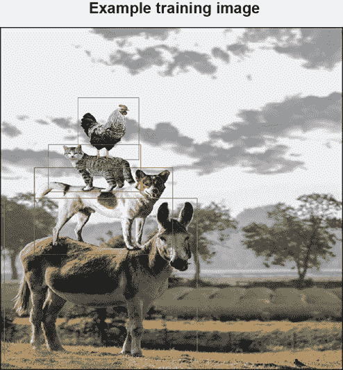

图 11.11 一个包含不同形状和大小的多个物体的图像

### 11.3.2 Fast R-CNN

基于 R-CNN 的方法最大的缺点之一是我们必须独立地为每个区域提议提取特征。因此，如果我们为单个图像生成 2,000 个提议，我们就必须运行 2,000 次前向传递来提取区域特征。这是非常昂贵且极其缓慢的（在训练和推理过程中）。此外，训练是一个多阶段管道——选择性搜索、深度网络、特征上的 SVMs 以及边界框回归器——这使得训练和推理都变得繁琐。为了解决这些问题，R-CNN 的作者引入了一种称为 Fast R-CNN 的新技术[`arxiv.org/pdf/1504.08083.pdf`](https://arxiv.org/pdf/1504.08083.pdf))。它显著提高了速度：在训练时比 R-CNN 快 9 倍，在测试时快 213 倍。此外，它还提高了目标检测的质量。

Fast R-CNN 做出了两个主要贡献：

+   *兴趣区域（RoI）池化*——如前所述，R-CNN 的一个基本问题是需要多次前向传递来提取单个图像区域提议的特征。那么，我们能否一次性提取特征呢？这个问题通过 RoI 池化得到解决。Fast R-CNN 使用整个图像作为 CNN 的输入，而不是单个区域提议。然后，在 CNN 输出上使用 RoIs（区域提议边界框）来一次性提取区域特征。我们将在 Faster R-CNN 讨论中详细介绍 RoI 池化的细节。

+   *多任务损失*——Fast R-CNN 消除了使用 SVMs 的需求。相反，深度神经网络同时进行分类和边界框回归。与仅使用深度网络进行特征提取的 R-CNN 不同，Fast R-CNN 更加端到端。它是一个用于区域提议特征提取、分类和回归的单个架构。

高级算法如下：

1.  使用选择性搜索为每张图像生成 2,000 个区域提议/RoIs。

1.  在 Fast R-CNN 的单次传递中，使用 RoI 池化一次性提取所有 RoI 特征，然后使用分类和回归头进行对象分类和定位。

由于所有区域提议的特征提取都在一次传递中完成，这种方法比 R-CNN 快得多，在 R-CNN 中每个提议都需要单独的前向传递。此外，由于神经网络是端到端训练的——即被要求进行分类和回归——目标检测的准确性也得到了提高。

### 11.3.3 Faster R-CNN

当我们可以更快时，为什么还要满足于快速？Fast R-CNN 比 R-CNN 快得多。然而，它仍然需要运行选择性搜索来获取区域提议。选择性搜索算法只能在 CPU 上运行。此外，该算法速度慢且耗时。因此，它成为了一个瓶颈。有没有办法摆脱选择性搜索？

考虑到的明显想法是使用深度网络来生成区域提议。这是 Faster R-CNN（FRCNN；[`arxiv.org/pdf/1506.01497.pdf`](https://arxiv.org/pdf/1506.01497.pdf)）的核心思想：它消除了选择性搜索的需求，并允许深度网络学习区域提议。它是最早的近实时对象检测器之一。由于我们使用深度网络来学习区域提议，区域提议也因此变得更好。因此，整体架构的结果精度也大大提高。

我们可以将 FRCNN 视为由两个核心模块组成：

+   *区域提议网络（RPN）*——这是负责生成区域提议的模块。RPN 被设计为高效地预测具有广泛尺度和宽高比的区域提议。

+   *R-CNN 模块*——这与 Fast R-CNN 相同。它接收一系列区域提议，并执行 RoI 池化，随后进行分类和回归。

另一个需要注意的重要事项是，区域提议网络（RPN）和 R-CNN 模块共享相同的卷积层：权重是共享的，而不是学习两个独立的网络。在下一节中，我们将详细讨论 Faster R-CNN。

## 11.4 Faster R-CNN：深入探讨

图 11.12 显示了 FRCNN 的高级架构。卷积层（我们也称其为卷积主干）从输入图像中提取特征图。RPN 在这些特征图上操作，并发出候选区域提议。RoI 池化层为每个感兴趣区域生成一个固定大小的特征向量，并将其传递给一组全连接层，这些全连接层发出关于*K*个对象类别的 softmax 概率估计（加上一个“背景”类的通配符）以及代表每个*K*个类别的边界框坐标的四个数字。让我们更详细地看看每个组件。


图 11.12 架构。（来源：“Faster R-CNN：迈向实时提议网络”；[`arxiv.org/abs/1506.01497`](https://arxiv.org/abs/1506.01497)）

### 11.4.1 卷积主干

在原始实现中，FRCNN 使用了 VGG-16 的卷积层作为 RPN 和 R-CNN 模块的卷积骨干。有一个小的修改：在第五个卷积层（conv5）之后的最后一个池化层被移除。正如我们之前讨论 VGG 架构时提到的，VGG 通过最大池化在每个卷积块中将特征图的空间尺寸减少 2。由于移除了最后一个池化层，空间尺寸减少了 2⁴ = 16 的因子。因此，一个 224 × 224 的图像在输出时被缩减到 14 × 14 的特征图。同样，一个 800 × 800 的图像将被缩减到 50 × 50 的特征图。

### 11.4.2 区域提议网络

RPN 以任意大小的图像作为输入，并输出一组可能包含对象的矩形提议。RPN 在最后共享卷积层输出的卷积特征图上操作。使用 VGG 骨干网络时，输入图像的大小（h, w）缩小到（h/16, w/16）。因此，输入图像中的每个 16 × 16 空间区域被缩减为卷积特征图上的一个单独的点。因此，输出卷积特征图中的每个点代表输入图像中的一个 16 × 16 补丁。RPN 就在这个特征图上操作。另一个需要注意的微妙之处是，虽然卷积特征图中的每个点都选择对应一个 16 × 16 补丁，但它有一个显著更大的感受野（输入特征图中受特定输出特征影响的区域）。因此，特征图上每个点的嵌入实际上是大感受野的摘要。

锚点

物体检测问题的关键方面是物体的大小和形状的多样性。物体可以从非常小（猫）到非常大的大象）。此外，物体可以有不同的长宽比。一些物体可能很宽，一些可能很高，等等。一个简单的解决方案是拥有一个单一的神经网络检测头，能够识别和识别各种大小和形状的物体。正如你可以想象的那样，这将使神经网络检测器的任务变得极其复杂。一个更简单的解决方案是拥有多种神经网络检测头，每个头负责解决一个更简单的问题。例如，一个头只关注大而高的物体，并且只有在图像中存在这样的物体时才会触发。其他头将关注其他大小和长宽比。我们可以将每个头视为负责完成一个单一简单的工作。这种设置极大地帮助并促进了学习。

这就是引入*锚点*背后的直觉。锚点类似于形状和大小各异的参考框。所有提议都是相对于锚点提出的。每个锚点都由其大小和宽高比唯一表征，并负责检测图像中形状相似的对象。在每次滑动窗口位置，我们都有多个跨越不同大小和宽高比的锚点。原始 FRCNN 架构支持九种锚点配置，涵盖三种大小和三种宽高比，从而支持广泛的形状。这些对应于尺度（8, 16, 32）和宽高比（0.5, 1.0 和 2.0）的锚点框（参见图 11.13）。锚点现在在目标检测器中无处不在。

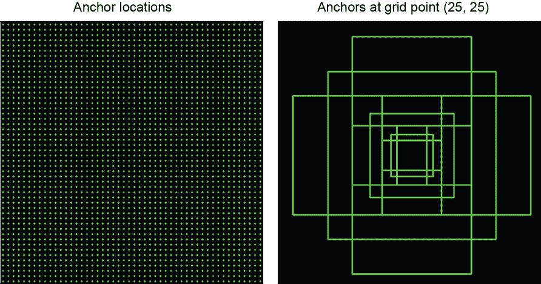

图 11.13 左列显示了输出卷积特征原始实现中不同大小和宽高比的各种网格点位置。右列显示了特定网格点上的各种锚点。

注意：用于生成锚点的完整功能代码，可通过 Jupyter Notebook 执行，可在[`mng.bz/nY48`](http://mng.bz/nY48)找到。

列表 11.15 在特定网格点生成锚点的 PyTorch 代码

```py
def generate_anchors_at_grid_point(
    ctr_x, ctr_y, subsample, scales, aspect_ratios):
    anchors = torch.zeros(
        (len(aspect_ratios) * len(scales), 4), dtype=torch.float)

    for i, scale in enumerate(scales):
        for j, aspect_ratio in enumerate(aspect_ratios): ①

            w = subsample * scale * torch.sqrt(aspect_ratio)
            h = subsample * scale * torch.sqrt(1 / aspect_ratio)

            xtl = ctr_x - w / 2                          ②
            ytl = ctr_y - h / 2
            xbr = ctr_x + w / 2
            ybr = ctr_y + h / 2

            index = i * len(aspect_ratios) + j
            anchors[index] = torch.tensor([xtl, ytl, xbr, ybr])
    return anchors
```

① 为不同的尺度和宽高比生成高度和宽度

② 在(ctr_x, ctr_y)周围生成一个宽度为 w，高度为 h 的边界框

列表 11.16 生成给定图像所有锚点的 PyTorch 代码

```py
 def generate_all_anchors(                       ①

     input_img_size, subsample, scales, aspect_ratios):

    _, h, w = input_img_size

    conv_feature_map_size = (h//subsample, w//subsample)

    all_anchors = []                             ②

    ctr_x = torch.arange(
        subsample/2, conv_feature_map_size[1]*subsample+1, subsample)
    ctr_y = torch.arange(
        subsample/2, conv_feature_map_size[0]*subsample+1, subsample)

    for y in ctr_y:
        for x in ctr_x:
            all_anchors.append(
                generate_anchors_at_grid_point(  ③
                    x, y, subsample, scales, aspect_ratios))

    all_anchors = torch.cat(all_anchors)
    return all_anchors

input_img_size = (3, 800, 800)                   ④
c, height, width = input_img_size
scales = torch.tensor([8, 16, 32], dtype=torch.float)
aspect_ratios = torch.tensor([0.5, 1, 2])
subsample = 16
anchors = generate_all_anchors(input_img_size, subsample, scales, aspect_ratios)
```

① 这不是生成锚点最有效的方法。我们编写了简单的代码以简化理解。

② 在卷积特征图中的每个点上生成锚点框，这对应于输入中的 16 × 16（子采样，子采样）区域

③ 使用列表 11.15 中定义的函数

④ 定义配置参数并生成锚点

RPN 在输出卷积特征图上滑动一个小型网络。这个小型网络在卷积特征图的 *n* × *n* 空间窗口上操作。在每个滑动窗口的位置，它生成一个低维特征向量（VGG 为 512 维），并将其输入到盒子回归层（reg）和盒子分类层（cls）。对于每个以滑动窗口位置为中心的锚框，分类器预测 *objectness*：一个从 0 到 1 的值，其中 1 表示存在物体，回归器预测相对于锚框的区域提议。这种架构自然地通过一个 *n* × *n* 卷积层实现，后面跟着两个兄弟 1 × 1 卷积层（用于 reg 和 cls）。FRCNN 论文中原始实现使用 *n* = 3，当使用 VGG 背骨时，这导致有效感受野为 228 像素。图 11.14 详细说明了这一点。请注意，这个网络只由卷积层组成。这样的架构被称为 *全卷积网络* FCN。FCN 没有输入尺寸限制。因为它们只由卷积层组成，它们可以与任意大小的输入一起工作。在 FCN 中，*n* × *n* 和 1 × 1 层的组合相当于在每个卷积特征图的每个点应用 FC 层。此外，因为我们是在特征图上卷积一个卷积网络以生成回归和分类分数，所以卷积权重在特征图的不同位置上是公共/共享的。这使得该方法具有平移不变性。如果图像顶部和底部的猫大小相似，它们将被相同的锚配置（尺度、纵横比）捕获。

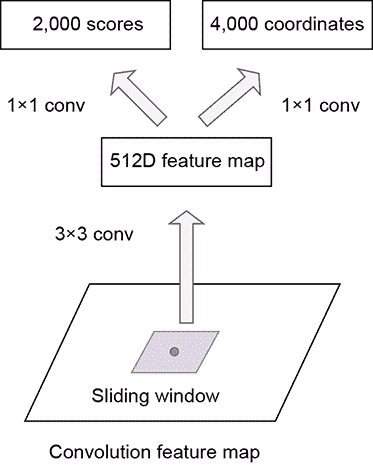

图 11.14 RPN 架构。使用 3 × 3 卷积从每个滑动窗口生成一个 512 维特征向量。一个 1 × 1 卷积层（分类器）从 512 维特征中提取，同样，另一个 1 × 1 卷积层（回归器）从 512 维特征向量生成 4*k* 箱体坐标。

仅由卷积层组成，它们可以与任意大小的输入一起工作。在 FCN 中，*n* × *n* 和 1 × 1 层的组合相当于在每个卷积特征图的每个点应用 FC 层。此外，因为我们是在特征图上卷积一个卷积网络以生成回归和分类分数，所以卷积权重在特征图的不同位置上是公共/共享的。这使得该方法具有平移不变性。如果图像顶部和底部的猫大小相似，它们将被相同的锚配置（尺度、纵横比）捕获。

注意：RPN 的全卷积网络完整功能的代码，可通过 Jupyter Notebook 执行，可在 [`mng.bz/nY48`](http://mng.bz/nY48) 找到。

列表 11.17 PyTorch 代码为 RPN 的 FCN

```py
class RPN_FCN(nn.Module):

    def __init__(self, k, in_channels=512):  ①
        super(RPN_FCN, self).__init__()
        self.conv = nn.Sequential(
            nn.Conv2d(
                in_channels, 512, kernel_size=3,
                stride=1, padding=1),
            nn.ReLU(True))
        self.cls = nn.Conv2d(512, 2*k, kernel_size=1)
        self.reg = nn.Conv2d(512, 4*k, kernel_size=1)

    def forward(self, x):
        out = self.conv(x)                   ②

        rpn_cls_scores = self.cls(out).view( ③
            x.shape[0], -1, 2)
        rpn_loc = self.reg(out).view(        ④
            x.shape[0], -1, 4)

        ⑤
       return rpn_cls_scores       ,rpn_loc  ⑥
```

① 实例化在输出卷积特征图上卷积的小型网络。它由一个 3 × 3 卷积层组成，后面跟着一个用于分类的 1 × 1 卷积层和一个用于回归的另一个 1 × 1 卷积层。

② 背骨输出：大小为 (batch_size, in_channels, h, w) 的卷积特征图

③ 将 (batch_size, h, w, 2k) 转换为 batch_size, h*w*k, 2)

④ 将 (batch_size, h, w, 4k) 转换为 batch_size, h*w*k, 4)

⑤ 表示每个锚框分类分数的 (batch_size, num_anchors, 2) 张量

⑥ （batch_size, num_anchors, 4）表示相对于锚框的框坐标的张量

为 RPN 生成 GT

到目前为止，我们已经生成了许多锚框边界框和一个能够为每个锚框生成分类和回归偏移量的神经网络。在训练 RPN 时，我们需要为每个锚框提供一个目标 GT（分类器和回归器都应该预测的目标），为此，我们需要查看图像中的对象并将它们分配给包含对象的相应锚点。思路如下：在数千个锚点中，*包含大部分对象的锚点应该尝试预测和定位对象。* 我们之前看到，创建锚点的直觉是为了确保每个锚点负责一种特定的对象形状、宽高比。因此，只有包含对象的锚点负责对其进行分类是有意义的。

要测量对象是否位于锚框内，我们依赖于交集与并集（IoU）分数。两个边界框之间的 IoU 定义为（重叠面积）/（并集面积）。因此，如果两个边界框非常相似，它们的重叠区域很大，它们的并集接近重叠区域，从而产生一个高的 IoU。如果两个边界框差异很大，那么它们的重叠区域最小，导致 IoU 很低（见图 11.15）。

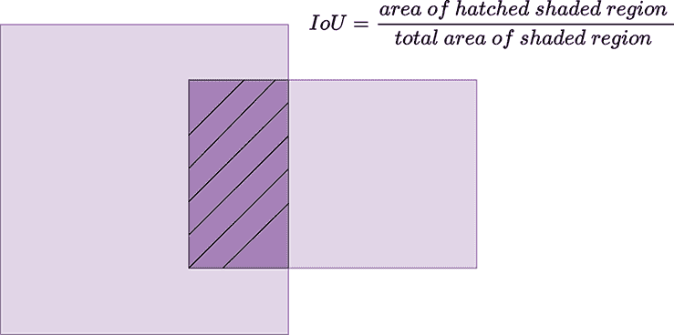

图 11.15 部分，两个区域被它们的并集分割。

FRCNN 为分配锚框标签提供了一些指导方针：

+   我们将正标签 1（表示锚框中存在对象）分配给两种类型的锚点：

    +   与 GT 框 IoU 重叠最大的锚点

    +   与 GT 框 IoU 重叠大于 0.7 的锚点

+   我们将一个非正锚点分配一个负标签 0（这表示锚框中没有对象存在，意味着它只包含背景），如果其 IoU 比率对所有 GT 框都小于 0.3。

+   既不是正标签也不是负标签的锚点不会对训练目标做出贡献。

注意，一个单独的 GT 对象可能将正标签分配给多个锚点。这些输出必须在稍后抑制，以防止重复检测（我们将在后续章节中讨论这一点）。此外，任何部分位于图像之外的锚框都被忽略。

注意：分配锚框 GT 标签的完整功能代码，可通过 Jupyter Notebook 执行，可以在[`mng.bz/nY48`](http://mng.bz/nY48)找到。

列出 11.18 PyTorch 代码为每个锚框分配 GT 标签

```py
valid_indices = torch.where(
    (anchors[:, 0] >=0) &
    (anchors[:, 1] >=0) &
    (anchors[:, 2] <=width) &                         ①
    (anchors[:, 3] <=height))[0]

rpn_valid_labels = -1 * torch.ones_like(              ②
    valid_indices, dtype=torch.int)

valid_anchor_bboxes = anchors[valid_indices]          ③

ious = torchvision.ops.box_iou(                       ④
    gt_bboxes, valid_anchor_bboxes)

assert ious.shape == torch.Size(
    [gt_bboxes.shape[0], valid_anchor_bboxes.shape[0]])

gt_ious_max = torch.max(ious, dim=1)[0]               ⑤

# Find all the indices where the IOU = highest GT IOU 
gt_ious_argmax = torch.where(                         ⑥
    gt_ious_max.unsqueeze(1).repeat(1, gt_ious_max.shape[1]) == ious)[1]

anchor_ious_argmax = torch.argmax(ious, dim=0)        ⑦
anchor_ious = ious[anchor_ious_argmax, torch.arange(len(anchor_ious_argmax))]

pos_iou_threshold  = 0.7
neg_iou_threshold = 0.3

rpn_valid_labels[anchor_ious < neg_iou_threshold] = 0 ⑧

rpn_valid_labels[anchor_ious > pos_iou_threshold] = 1 ⑨

rpn_valid_labels[gt_ious_argmax] = 1                  ⑩
```

① 找到完全位于图像内的有效锚点

② 为每个有效锚点分配 s 标签为-1（不属于任何类别）

③ 获取有效锚框

④ 形状为（num_gt_bboxes, num_valid_anchor_bboxes）的张量，表示 GT 和锚点之间的 IoU

⑤ 找到每个 GT 边界框的最高 IoU

⑥ 找到所有 IOU = 最高 GT IOU 的索引

⑦ 为每个锚框找到最高的 IoU

⑧ 当 IoU < 0.3 时，为负锚点分配 0（背景）

⑨ 当 IoU > 0.7 时，为正锚点分配 1（对象性）

对于每个 GT 框，将具有最高 IoU 的锚点分配为正锚点

处理不平衡

根据我们为锚点分配标签的策略，请注意，负锚点的数量显著多于正锚点的数量。例如，对于示例图像，我们只获得了 24 个正锚点，而负锚点有 7,439 个。如果我们直接在这样一个不平衡的数据集上训练，神经网络通常可以通过将每个锚点分类为负锚点来学习一个局部最小值。在我们的示例中，如果我们预测每个锚点都是负锚点，我们的准确率将是 7439/(7439+22): 99.7%。然而，结果神经网络实际上是无用的，因为它没有学习到任何东西。换句话说，不平衡会导致对主导类的偏差。为了处理这种不平衡，通常有三种策略：

+   *欠采样*—减少主导类的样本数量。

+   *过采样*—增加较少主导类的样本数量。

+   *加权损失*—将误分类较少主导类的成本设置得远高于主导类。

FRCNN 利用欠采样的想法。对于单张图像，存在多个正负锚点。从这些数千个锚点中，我们在图像中随机采样 256 个锚点来计算损失函数，其中采样的正负锚点比例高达 1:1。如果图像中的正样本少于 128 个，我们将使用负样本填充 mini-batch。

为锚框分配目标

我们已经看到了如何采样和分配标签给锚点。接下来要问的问题是，如何确定回归目标：

+   *情况 1: 标签 = −1*—未采样/无效锚点。这些不会对训练目标做出贡献，因此回归目标无关紧要。

+   *情况 2: 标签 = 0*—背景锚点。这些锚点不包含任何对象，因此它们也不应该对回归做出贡献。

+   *情况 3: 标签 = 1*—正锚点。这些锚点包含对象。我们需要为这些锚点生成回归目标。

让我们只考虑正锚点的情况。这里的关键直觉是*锚点已经包含大多数对象*。否则，它们就不会成为正锚点。因此，锚点和问题对象之间已经存在显著的重叠。因此，从锚框边界框到对象边界框的学习偏移是有意义的。回归器负责学习这个偏移：即，我们必须对锚框边界框进行多少调整才能使其成为对象边界框。FRCNN 采用了以下参数化：

*t[x]* = (*x* - *x[a]*)/*w[a]*

*t[y]* = (*y* - *y[a]*)/*h[a]*

*t[w]* = *log*(*w*/*w[a]*)

*t[h]* = *log*(*h*/*h[a]*)

方程 11.2

其中 *x*、*y*、*w* 和 *h* 表示 GT 边界框的中心坐标及其宽度和高度，而 *x[a]*、*y[a]*、*w[a]* 和 *h[a]* 表示锚边界框的中心坐标及其宽度和高度。*t[x]*、*t[y]*、*t[w]* 和 *t[h]* 是回归目标。回归器实际上是在学习预测锚边界框和 GT 边界框之间的差值。

注意：将回归目标分配给锚框的完整功能代码，可通过 Jupyter Notebook 执行，可在[`mng.bz/nY48`](http://mng.bz/nY48)找到。

列表 11.19 使用 PyTorch 为每个锚框分配回归目标的代码

```py
def transform_bboxes(bboxes):                      ①
    height = bboxes[:, 3] - bboxes[:, 1]
    width = bboxes[:, 2] - bboxes[:, 0]
    x_ctr = bboxes[:, 0] + width / 2
    y_ctr = bboxes[:, 1] +  height /2 
    return torch.stack(                            ②
        [x_ctr, y_ctr, width, height], dim=1)

def get_regression_targets(roi_bboxes, gt_bboxes): ③

    assert roi_bboxes.shape == gt_bboxes.shape
    roi_bboxes_t = transform_bboxes(roi_bboxes)
    gt_bboxes_t = transform_bboxes(gt_bboxes)
    tx = (gt_bboxes_t[:, 0] - roi_bboxes_t[:, 0]) / roi_bboxes_t[:, 2]
    ty = (gt_bboxes_t[:, 1] - roi_bboxes_t[:, 1]) / roi_bboxes_t[:, 3]
    tw = torch.log(gt_bboxes_t[:, 2] / roi_bboxes_t[:, 2])
    th = torch.log(gt_bboxes_t[:, 3] / roi_bboxes_t[:, 3])

    return  torch.stack([tx, ty, tw, th], dim=1)   ④
```

① (n, 4) 张量，格式为 (xtl, ytl, xbr, br)

② (n, 4 张量)，格式为 (x, y, w, h)

③ 分别表示感兴趣区域和 GT 的边界框的 (n, 4) 张量

④ 包含回归目标的 (n, 4) 张量

RPN 损失函数

我们已经定义了 RPN 全卷积网络以及如何为 RPN FCN 的输出生成标签和回归目标。现在我们需要讨论使我们能够训练 RPN 的损失函数。正如你所期望的，有两个损失项：

+   *分类损失*—适用于正负锚框。我们使用任何标准分类器中使用的标准交叉熵损失。

+   *回归损失*—仅适用于正锚框。在这里，我们使用平滑 L1 损失，其定义为

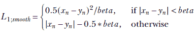

方程 11.3

我们可以将平滑 L1 损失视为 L1 和 L2 损失的组合。如果值小于 beta，它表现得像 L2 损失（均方误差 [MSE]）。否则，它表现得像 L1 损失。在 FRCNN 中，beta 设置为 1。背后的直觉很简单。如果我们使用纯 L2 损失（MSE），则由于损失的二次性质，高损失项会对指数损失产生贡献。这可能导致一个偏差，即通过关注高值项来降低损失。相反，如果我们使用纯 L1 损失，高损失项仍然会贡献更多的损失，但效果是线性的而不是二次的。这仍然对高损失项有轻微的偏差。通过在损失值较小时使用 L2 损失，在损失值较大时使用 L1 损失，我们得到了两者的最佳结合。当损失值较小时，因为我们使用 L2 损失，其贡献是指数/二次的。而当损失值较高时，它仍然通过 L1 损失线性地贡献。因此，网络被激励关注低损失和高损失项。

图像的整体损失可以定义为以下：

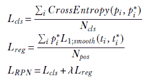

方程 11.4

其中，*p[i]* 是锚点 *i* 的预测对象概率。*p[i]*^* 是锚点 *i* 的真实对象标签。如果锚点是正的，则为 1；如果锚点是负的，则为 0。*t[i]* = (*t[x]*, *t[y]*, *t[w]*, *t[h]*) 是锚点 *i* 的回归预测，*t[i]*^* = (*t[x]*^*, *t[y]*^*, *t[w]*^*, *t[h]*^*) 是锚点 *i* 的回归目标，*N[cls]* 是锚点的数量，*N[pos]* 是正锚点的数量。

注意：RPN 损失函数的完全功能代码，可通过 Jupyter Notebook 执行，可在[`mng.bz/nY48`](http://mng.bz/nY48)找到。

列表 11.20 RPN 损失函数的 PyTorch 代码

```py
def rpn_loss(
    rpn_cls_scores, rpn_loc, rpn_labels,
    rpn_loc_targets, lambda_ = 10):                  ①

    classification_criterion = nn.CrossEntropyLoss( 
        ignore_index=-1)                             ②
    reg_criterion = nn.SmoothL1Loss(reduction="sum")

    cls_loss = classification_criterion(rpn_cls_scores, rpn_labels)

    positive_indices = torch.where(rpn_labels==1)[0] ③
    pred_positive_anchor_offsets = rpn_loc[positive_indices]
    gt_positive_loc_targets = rpn_loc_targets[positive_indices]
    reg_loss = reg_criterion(
        pred_positive_anchor_offsets,
        gt_positive_loc_targets) / len(positive_indices)
    return {
        "rpn_cls_loss": cls_loss,
        "rpn_reg_loss": reg_loss,
        "rpn_total_loss": cls_loss + lambda_* reg_loss

    }
```

① rpn_cls_scores: (num_anchors, 2) 张量，表示每个锚点的 RPN 分类器得分。rpn_loc: (num_anchors, 4) 张量，表示每个锚点的 RPN 回归器预测。rpn_labels: (num_anchors) 表示每个锚点的类别（-1, 0, 1）。rpn_loc_targets: (num_anchors, 4) 张量，表示每个锚点的 RPN 回归器目标。

② 忽略 -1，因为它们没有被采样

③ 找到正锚点

生成区域提议

我们已经讨论了 RPN 的工作原理。RPN 预测每个锚点的对象概率和回归偏移量。下一个任务是生成好的区域 ROI，并用于训练 R-CNN 模块。由于我们对每个锚点都发出对象概率和回归偏移量，因此我们有数千个预测。我们不能使用它们全部作为 ROI。我们需要从这些分数和偏移量中生成最好的 ROI 来训练我们的 R-CNN。一个明显的方法是依赖于对象概率分数：对象概率分数越高，包含对象的概率就越大，因此它是一个好的 ROI。在我们到达那里之前，我们必须做一些基本的处理步骤：

1\.  将预测的偏移量转换为边界框。这是通过反转变换序列来完成的

*x*^∗ = *t[x]*^∗ ∗ *w[a]* + *x[a]*

*y*^∗ = *t[y]*^∗ ∗ *h[a]* + *y[a]*

*w*^∗ = *e*^(*t[w]*^∗) ∗ *w[a]*

*h*^∗ = *e*^(*t[h]*^∗) ∗ *h[a]*

方程 11.5

其中，*x*^*, *y*^*, *w*^*, 和 *h*^* 表示预测边界框的中心坐标及其宽度和高度，*t[x]*^*, *t[y]*^*, *t[w]*^*, 和 *t[h]*^* 是 RPN 的定位预测。然后，将边界框转换回 `xtl`, `ytl`, `xbr`, `ybr` 格式。

2\.  预测的边界框可能部分位于图像之外。我们将所有预测的边界框裁剪到图像内部。

3\.  移除任何高度或宽度小于 `min_roi_threshold` 的预测边界框。

一旦完成这些处理步骤，我们将预测的边界框按对象概率分数排序，并选择 *N* 个候选框。训练期间 *N* = 12000，测试期间 *N* = 6000。

注意：完全功能的从 RPN 输出生成区域提议的代码，可通过 Jupyter Notebook 执行，可在[`mng.bz/nY48`](http://mng.bz/nY48)找到。

列表 11.21 从 RPN 输出生成区域提议的 PyTorch 代码

```py
rois = generate_bboxes_from_offset(rpn_loc, anchors)

rois = rois.clamp(min=0, max=width)       ①

roi_heights = rois[:, 3] - rois[:, 1]     ②
roi_widths = rois[:, 2] - rois[:, 0]
min_roi_threshold = 16

valid_idxes = torch.where((roi_heights > min_roi_threshold) &
    (roi_widths > min_roi_threshold))[0]
rois = rois[valid_idxes]
valid_cls_scores = rpn_loc[valid_idxes]

objectness_scores = valid_cls_scores[:, 1]

sorted_idx = torch.argsort(               ③
    objectness_scores, descending=True)
n_train_pre_nms = 12000
n_val_pre_nms = 300

rois = rois[sorted_idx][:n_train_pre_nms] ④

objectness_scores = objectness_scores[ 
    sorted_idx][:n_train_pre_nms]         ⑤
```

① 裁剪 ROI

② 基于 min_roi_threshold 的阈值

③ 根据物体性进行排序

④ 选择最感兴趣的区域。形状：(n_train_pre_nms, 4)。

⑤ 选择最高的物体性分数。形状：(n_train_pre_nms,)。

非极大值抑制（NMS）

许多提议将重叠。我们实际上是以 16 像素的步长选择锚点。因此，即使是合理大小的对象也会被多个锚点选中，每个锚点都会尝试独立地预测对象。当我们查看图 11.16 中的正锚点时，我们可以看到这种重叠的性质。我们希望选择最有效的 ROI 集。但很明显，选择所有相似的提议并不能构成一个好的 ROI 集，因为它们携带了冗余信息。

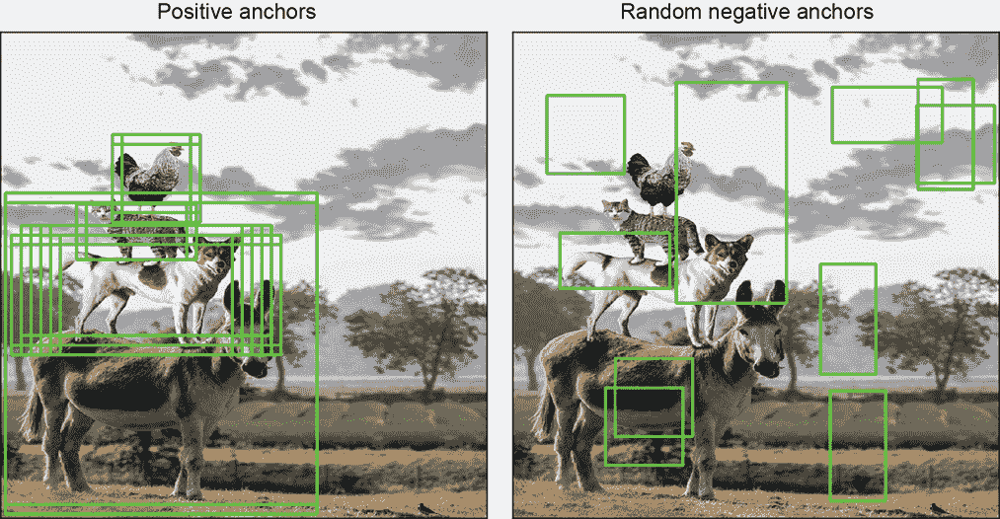

图 11.16 最小值，其中每个锚点都被分类为负。为了防止这种情况，FRCNN 在训练之前对负锚点进行下采样。

为了解决这个问题，我们使用一种称为*非极大值抑制*（NMS）的技术。NMS 是一种抑制高度重叠边界框的算法。该算法接受边界框和分数，并按以下方式工作。

算法 11.6 非极大值抑制

输入：一个边界框列表 B，相应的分数 S，以及重叠阈值 N

输出：一个过滤后的边界框列表 D

**while** 概率在增加 **do**

选择置信度分数最高的边界框

从 B 中移除它并将其添加到最终列表 D 中

使用 IoU 比较所选边界框与 B 中剩余的框

从 B 中移除所有 IoU 大于阈值的边界框

**end** **while**

返回 D

我们使用 0.7 阈值的 NMS 来抑制高度重叠的 ROI，并在 NMS 后选择前*N*个 ROI 来训练 R-CNN。*N*在训练期间为 2000，在测试期间为 300。图 11.17 显示了在 NMS 之前和之后的样本图像上的边界框。


图 11.17 左侧列显示了 NMS 之前的边界框（24）。右侧列显示了 NMS 之后的边界框（4）。

注意：完全功能的 NMS 代码，可通过 Jupyter Notebook 执行，可以在[`mng.bz/nY48`](http://mng.bz/nY48)找到。

列表 11.22 PyTorch 代码用于 ROI 的 NMS

```py
n_train_post_nms = 2000
n_val_post_nms = 300
nms_threshold = 0.7

post_nms_indices = torchvision.ops.nms(     ①
    rois, objectness_scores, nms_threshold)

post_nms_rois = rois[post_nms_indices[:n_train_post_nms]]
```

① 调用由 torchvision 实现的 NMS

### 11.4.3 快速 R-CNN

在上一节中，我们看到了 RPN 网络如何接受输入图像并输出一组可能包含对象的感兴趣区域。现在让我们讨论 FRCNN 架构的第二部分，它接受 ROI 并生成图像中每个对象的类别概率和边界框坐标。我们之前简要讨论了这一点。在这里，我们更详细地回顾一下。

我们给定了一组 RoI（其中一些包含对象）。我们的任务是训练一个能够定位对象的物体检测器。为此，我们需要提取每个 RoI 对应的特征，并通过一个神经网络（分类器和回归器）传递，该神经网络学习预测类别和回归目标。R-CNN 以一种简单的方式解决了这个问题：它一次提取每个 RoI，将其扭曲成固定大小，并通过深度 CNN 提取 RoI 对应的特征。每个 RoI 都需要单独的前向传递，这使得方法非常慢。问题，一如既往，是：我们能做得更好吗？

RoI 池化

让我们考虑卷积骨干。它通过几个卷积和最大池化层处理整个图像，以生成卷积特征图。我们也看到了 16 的子采样因子：即输入图像中的 16 × 16 像素在特征图中被减少到一个点。还要记住，特征图上每个网格点的嵌入是输入图像中区域的表示/摘要。

*关键思想 1*是每个 RoI 对应的特征已经存在于卷积特征图中，我们可以通过特征图来提取它们。例如，假设我们的 RoI 是(0, 0, 256, 256)。我们知道输入图像中的(0, 0, 256, 256)区域由 0, 0, 256/16, 256/16)表示：即卷积特征图中的(0, 0, 16, 16)区域。由于卷积特征图中每个点的嵌入是感受野的摘要，我们可以直接使用这些特征作为 RoI 的特征。因此，为了获得(0, 0, 256, 256) RoI 的特征，我们取卷积特征图中(0, 0, 16, 16)区域的所有嵌入。由于我们是在整个图像上直接对卷积特征图进行特征提取，我们可以通过单次前向传递获得所有 RoI 的 RoI 特征。这消除了需要多次前向传递的需求。

*关键思想 2*如下。我们讨论了一种提取每个 RoI 对应特征的方法，并希望使用这些特征来训练我们的分类器和回归器。然而，存在一个问题。众所周知，RoI 的大小不同。不同大小的 RoI 会导致不同的特征嵌入大小。例如，如果我们的 RoI 是(0, 0, 256, 256)，我们的 RoI 特征嵌入是(16, 16, 512)：也就是说，所有大小为 512 的嵌入都在卷积特征图的(0, 0, 16, 16)区域。如果我们的 RoI 是(0, 0, 128, 128)，那么我们的 RoI 特征嵌入是(8, 8, 512)：卷积特征图的(0, 0, 8, 8)区域的所有嵌入。我们知道神经网络通常需要相同大小的输入。那么我们如何处理不同大小的输入嵌入呢？答案是*RoI 池化*。

让我们固定输入 ROI 特征图的大小，该特征图进入神经网络。我们的任务是减少可变大小的 RoI 特征图到固定大小。如果固定的特征图大小设置为 *H*，*W*，并且我们的 RoI 在卷积特征图中对应于 (*r*，*c*，*h*，*w*)，我们将 *h* 和 *w* 分别划分为大小为 *h*/*H* 和 *w*/*W* 的相等大小的块，并对这些块应用最大池化以获得 *H*，*W* 特征图。回到我们的例子，让我们固定 *H* = *W* = 4。我们期望的固定特征图大小是 (4,4,512)。因此，当我们的 RoI 是 (0, 0, 256, 256) 时，我们的 RoI 特征嵌入是 (16, 16, 512)：*h* = *w* = 16。我们将 16 × 16 区域划分为四个 (16/4, 16/4) 区域，并对每个区域执行最大池化以获得固定大小的 (4,4,512) 特征。同样，当我们的 RoI 是 (0, 0, 128, 128) 时，*h* = *w* = 8。我们将 8 × 8 区域划分为四个 (8/4, 8/4) 区域，并对这些区域执行最大池化以获得固定大小的 (4,4,512) 特征。

精明的读者会注意到，我们已仔细选择 RoI，使其是 *H* 和 *W* 的倍数，从而 *h*/*H* 和 *w*/*W* 分别得到整数值。但在现实中，这种情况很少发生。*h*/*H* 和 *w*/*W* 往往是浮点数。在这种情况下我们该怎么办？答案是*量化*：也就是说，我们选择最接近 *h*/*H* 和 *w*/*W* 的整数（在原始实现中为 floor 操作）。ROIAlign 已经改进了这一点，它使用双线性插值而不是量化。我们在这里不深入探讨 ROIAlign 的细节。

实际上，如果我们有一个大的 RoI，我们将特征图划分为一定数量的较大区域并执行最大池化。当我们有一个小的 RoI 时，我们将特征图划分为一定数量的较小区域并执行最大池化。用于池化的区域大小可以改变，但输出大小保持固定。RoI 池化输出的维度不依赖于输入特征图的大小或 RoI 的大小：它仅由我们将 RoI 划分的部分数量决定—*H* 和 *W*（见图 11.18）。

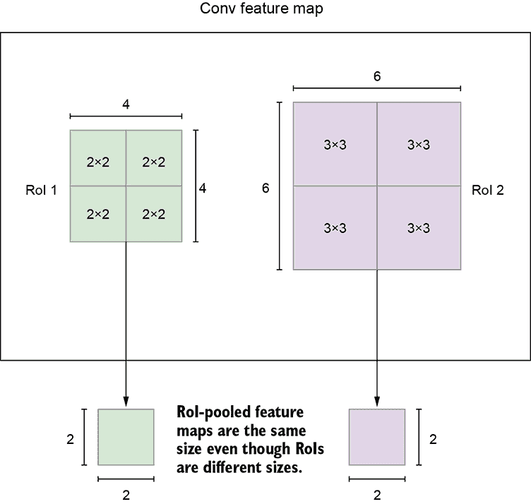

图 11.18 一个具有两个不同大小感兴趣区域的卷积特征图。RoI 池化通过最大池化在单个过程中从每个 RoI 中提取固定大小的输出特征图（在此图像中为 2 × 2）。这使得我们能够为每个 RoI 提取固定大小的代表性特征向量，然后将其输入到进一步的分类器和回归层中进行分类和定位。

因此，RoI 池化的目的是对非均匀大小的输入执行最大池化以获得固定大小的特征图。Fast R-CNN 和 Faster R-CNN 使用 7 × 7 作为固定特征图大小。

Fast R-CNN 架构

给定卷积特征图和一组 RoI，我们已经看到 RoI 池化层如何从特征图中提取固定长度的特征向量。每个特征向量被输入到一系列 FC 层中，最终分支成两个兄弟输出层：一个分类器，它为*K*个对象类别加上一个“背景”类别产生 softmax 概率估计，另一个回归器为*K*个对象类别中的每一个产生四个实数值。

为 Fast R-CNN 生成 GT

对于每张图像，我们有一个由 RPN 生成的 RoI 列表和一个 GT 边界框列表。我们如何为每个 RoI 生成 GT 和回归目标？想法与我们的 RPN 相同：我们使用 IoU 分数。算法如下：

1.  计算所有 RoI 和 GT 框之间的 IoU。

1.  对于每个 RoI，确定具有最高 IoU 的 GT 边界框。

1.  如果最高的 IoU 大于一个阈值（0.5），则将相应的 GT 标签分配给 RoI。

1.  如果 IoU 在[0.1, 0.5]之间，则分配背景标签。使用 0.1 的下限确保某些与 GT 有较小交集的 RoI 被选为背景。这有助于选择背景的困难示例；这是一种困难负样本挖掘的形式。

注意：完整的 Fast R-CNN RoI 头部的功能代码，可通过 Jupyter Notebook 执行，可在[`mng.bz/nY48`](http://mng.bz/nY48)找到。

列出 11.23 PyTorch 代码用于 Fast R-CNN RoI 头部

```py
class Fast_RCNN_ROI_Head(nn.Module):
    def __init__(self, num_classes, H, W, subsample=16, embedding_size=512):

        super(Fast_RCNN_ROI_Head, self).__init__()

        self.num_classes = num_classes
        self.H = H
        self.W = W
        self.embedding_size = embedding_size
        self.subsample = 16

        self.roi_head_classifier = nn.Sequential(
            nn.Linear(H*W*embedding_size, 4096),
            nn.ReLU(True),
            nn.Linear(4096, 4096),
            nn.ReLU(True),
        )
        self.cls = torch.nn.Linear(4096, num_classes+1) ①
        self.reg = torch.nn.Linear(4096, (num_classes+1)*4)

    def forward(self, x, rois):                         ②
        assert x.shape[0] == 1 # This code only supports batch size of 1
        roi_pooled_features = torchvision.ops.roi_pool(
            x, [rois], output_size=(self.H, self.W), spatial_scale=1/subsample)
        roi_pooled_features = roi_pooled_features.view(
            -1, self.H*self.W*self.embedding_size)
        fc_out = self.roi_head_classifier(roi_pooled_features)
        roi_cls_scores = self.cls(fc_out)
        roi_loc = self.reg(fc_out)

        return roi_cls_scores, roi_loc                  ③
```

① num_classes + background

② x : (1, c, h, w)张量，表示卷积特征图。rois: (n, 4)张量，表示 RoI 的边界框

③ roi_cls_scores: (n, num_classes+1)张量，表示每个 RoI 的分类得分。roi_loc: (n, (num_classes + 1) * 4)张量，表示每个 RoI 的回归得分

训练 Fast R-CNN

RPN 为每张图像生成大约 2,000 个 RoI。由于计算限制，我们无法使用所有*N*个 RoI。相反，我们从中采样一个子集。训练 minibatch 是分层采样的，首先采样*K*个图像，然后从每个图像中采样*R*/*K*个 RoI。在 FRCNN 中，*R*设置为 128。对于这次讨论，我们假设*K* = 1：也就是说，每个 minibatch 只有一个图像。那么，对于单个图像的 RoI，我们如何从中采样 128 个 RoI 呢？

一个简单的解决方案是随机采样 128 个 RoI。然而，这会遇到我们之前讨论过的相同数据不平衡问题：我们最终采样背景的频率远高于类别。为了解决这个问题，我们采用与之前类似的采样策略。特别是，对于单个图像，我们采样 128 个 RoI，使得背景与对象的比率为 0.75:0.25。如果少于 32 个 RoI 包含对象，我们将使用更多的背景 RoI 填充 minibatch。

分配目标到 RoI 框

正如 RPN 的情况一样，我们为包含对象的全部 RoI 生成回归目标，即 GT 框相对于感兴趣区域的偏移量。对于所有背景 RoI，回归目标不适用。

Fast R-CNN 损失函数

我们已经定义了 Fast R-CNN 网络以及如何为其输出生成标签和回归目标。我们需要讨论使我们能够训练 Fast R-CNN 的损失函数。正如预期的那样，有两个损失项：

+   *分类损失*—我们使用任何标准分类器中使用的标准交叉熵损失。

+   *回归损失*—回归损失仅适用于对象 RoI：背景 RoI 不参与回归。这里我们使用与 RPN 中相同的平滑 L1 损失。

因此，单个 RoI 的整体损失可以定义为以下：

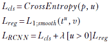

方程 11.6

其中 *p* 是 RoI 的预测标签，*u* 是 RoI 的真实标签，*t[u]* = (*t[x]*, *t[y]*, *t[w]*, *t[h]*) 是类别 *u* 的回归预测，*v* = (*v[x]*, *v[y]*, *v[w]*, *v[h]*) 是 RoI 的回归目标。因此，整体损失可以定义为


方程 11.7

其中 *p[i]* 是 RoI *i* 的预测概率，*p[i]*^* 是 RoI *i* 的真实标签；*t[i]* = (*t[x]*, *t[y]*, *t[w]*, *t[h]*) 是对应于类别 *p[i]*^* 的 RoI *i* 的回归预测，*t[i]*^* = (*t[x]*^*, *t[y]*^*, *t[w]*^*, *t[h]*^*) 是 RoI *i* 的回归目标，*t[i]*^* = (*t[x]*^*, *t[y]*^*, *t[w]*^*, *t[h]*^*) 是 RoI *i* 的回归目标，*N[pos]* 是对象 RoI（非背景 RoI）的数量。

注意：完整的 Fast R-CNN 损失函数的代码，可通过 Jupyter Notebook 执行，可以在[`mng.bz/nY48`](http://mng.bz/nY48)找到。

列表 11.24 PyTorch 代码用于 Fast R-CNN 损失函数

```py
def rcnn_loss(
    roi_cls_scores,                              ①
    roi_loc,                                     ②
    roi_labels,                                  ③
    rcnn_loc_targets,                            ④
    lambda_ = 1):

    classification_criterion = nn.CrossEntropyLoss()
    reg_criterion = nn.SmoothL1Loss(reduction="sum")

    cls_loss = classification_criterion(roi_cls_scores, roi_labels)

    pos_roi_idxes = torch.where(roi_labels>0)[0] ⑤
    pred_all_offsets = roi_loc[pos_roi_idxes]

    num_pos_rois = len(pos_roi_idxes)
    pred_all_offsets = pred_all_offsets.view(    ⑥
        num_pos_rois, -1, 4)

    pred_cls_offsets = pred_all_offsets[
        torch.arange(num_pos_rois) , roi_labels[pos_roi_idxes]]

    gt_offsets = rcnn_loc_targets[pos_roi_idxes]

    reg_loss = reg_criterion(pred_cls_offsets, gt_offsets) / num_pos_rois
    return {
        "rcnn_cls_loss": cls_loss,
        "rcnn_reg_loss": reg_loss,
        "rcnn_total_loss": cls_loss + lambda_* reg_loss

    }
```

① (128, num_classes) 张量：每个 RoI 的 RCNN 分类器得分

② (128, num_classes*4) 张量：每个类别、RoI 的 RCNN 回归器预测

③ (128,) 张量：每个 RoI 的真实类别

④ (128, 4) 张量：每个 RoI 的 RoI 回归器目标

⑤找到正 RoI

⑥ (n, num_classes*4) 到 n, num_classes, 4)

Fast R-CNN 推理

我们已经讨论了如何训练 Fast R-CNN 模块。一旦模型训练完成，下一个问题是如何使用该模型生成输出类别和边界框。

Fast R-CNN 模型为每个 RoI 输出一个分类得分和回归偏移量。我们可以安全地忽略背景 RoI。对于其余的 RoI，选择概率最高的类别作为输出标签，并选择相应的偏移量。我们应用与 RPN 类似的后续处理步骤：

1.  我们使用 RoI 将偏移量转换回(`xtl`, `ytl`, `xbr`, `ybr`)格式。

1.  我们将输出边界框裁剪到图像边界内

我们面临一个与之前类似的问题：输出可能包含多个与同一对象对应的边界框。我们以相同的方式处理它，即使用 NMS。然而，有一个区别。在 RPN 的情况下，我们在所有由 RPN 预测的边界框上应用了全局 NMS。这里，NMS 仅应用于属于同一类的边界框。这是对所有类进行的，这在直观上应该是合理的：如果边界框代表不同的类，那么抑制高度重叠的边界框是没有意义的。

注意：完整的 Fast R-CNN 推理代码，可通过 Jupyter Notebook 执行，可在[`mng.bz/nY48`](http://mng.bz/nY48)找到。

列表 11.25 PyTorch 代码用于 Fast R-CNN 推理

```py
def fast_rcnn_inference(
    frcnn_roi_head,                                      ①
    rois,                                                ②
    conv_feature_map,                                    ③
    nms_threshold=0.7):

    frcnn_roi_head.eval()                                ④
    roi_cls_scores, roi_loc = frcnn_roi_head(conv_feature_map, rois)

    output_labels = torch.argmax(                        ⑤
        roi_cls_scores, dim=1)

    output_probs = nn.functional.softmax(
        roi_cls_scores, dim=1)[torch.arange(             ⑥
            rois.shape[0]), output_labels]

    output_offsets = roi_loc.view(                       ⑦
        rois.shape[0], -1, 4)

    output_offsets = output_offsets[                     ⑧
        torch.arange(rois.shape[0]), output_labels]

    assert output_offsets.shape == torch.Size(           ⑨
        [rois.shape[0], 4])

    output_bboxes = generate_bboxes_from_offset(         ⑩
        output_offsets, rois)

    rois = output_bboxes.clamp(min=0, max=width)         ⑪

    post_nms_labels, post_nms_probs, post_nms_boxes = [], [], []

    for cls in range(1, frcnn_roi_head.num_classes+1):   ⑫

        cls_idxes = torch.where(output_labels == cls)[0] ⑬
        cls_labels = output_labels[cls_idxes]
        cls_bboxes = output_bboxes[cls_idxes]
        cls_probs = output_probs[cls_idxes]
        keep_indices = torchvision.ops.nms(
            cls_bboxes, cls_probs, nms_threshold)

        post_nms_labels.append(cls_labels[keep_indices])
        post_nms_probs.append(cls_probs[keep_indices])
        post_nms_boxes.append(cls_bboxes[keep_indices])

    return {
        "labels": torch.cat(post_nms_labels),
        "probs": torch.cat(post_nms_probs),
        "bboxes": torch.cat(post_nms_boxes)
    }
```

①Fast_RCNN_ROI_Head 的训练实例

②ROI 到推理

③ (n, c, h, w)卷积特征图

④设置评估模式

⑤预测的类别是得分最高的类别。

⑥通过 softmax 获得预测概率。选择最高概率作为此预测的概率分数。

⑦将 locs 从(n, num_classes*4)转换为(n, num_classes, 4)

⑧选择对应于预测标签的偏移量

⑨断言我们为每个 ROI 有输出

⑩将偏移量转换为 xtl, ytl, xbr, ybr)

⑪将边界框裁剪到图像内

⑫0 是背景，因此被忽略

⑬对每个类别执行 NMS

### 11.4.4 训练 Faster R-CNN

如我们所见，FRCNN 由两个子网络组成：

+   一个负责生成包含对象的良好区域提议的 RPN

+   一个 Fast R-CNN，负责从 ROI 列表中进行目标分类和检测

因此，FRCNN 是一个两阶段目标检测器。我们有一个阶段生成良好的区域提议，另一个阶段则对区域提议进行检测，以识别图像中的对象。那么我们如何训练 FRCNN 呢？

一个简单的方法是训练两个独立的网络（RPN 和 Fast R-CNN）。然而，我们不想这样做，因为这很昂贵。此外，如果我们这样做，每个网络将以自己的方式修改卷积层。如前所述，我们希望 RPN 和 Fast R-CNN 模块之间共享卷积层。这确保了效率（只有一个卷积主干，而不是两个独立的骨干）。此外，RPN 和 FRCNN 都在执行类似的任务，所以直观上应该共享相同的卷积特征集。因此，我们需要开发一种技术，允许在两个网络之间共享卷积层，而不是学习两个单独的网络。原始的 FRCNN 论文提出了两种训练模型的技术：

+   *交替优化（AltOpt）*——我们首先训练 RPN，并使用提议来训练 Fast R-CNN。然后，由 Fast R-CNN 调整的网络被用来初始化 RPN，这个过程是迭代的。这涉及到在训练 RPN 和 Fast R-CNN 之间交替的多个训练轮次。

+   *近似联合训练*—在训练过程中，RPN 和 Fast R-CNN 网络合并为一个网络。在每个 SGD 迭代中，正向传递生成区域提议，在训练 Fast R-CNN 检测器时，这些提议被当作固定的、预先计算的提议来处理。我们将 RPN 和 Fast R-CNN 损失合并，并按常规进行反向传播。由于我们端到端地一起训练这两个网络，这种训练显著更快。然而，由于我们将 RPN 生成的提议视为固定的，而实际上它们是 RPN 的函数，因此这种优化是近似的。所以我们忽略了一个导数。

这两种技术提供了相似的精度。因此，联合训练，其速度显著更快，是首选的。

### 11.4.5 其他目标检测范式

到目前为止，我们已经详细介绍了 FRCNN，并讨论了几个对其成功有贡献的关键思想。还开发了几种其他的目标检测范式。其中一些受到了 FRCNN 的启发，借鉴并/或改进了 FRCNN 建立的思想。在本节中，我们将简要地看看其中的一些。

你只需看一次（YOLO）

FRCNN 是一个两阶段检测器：一个 RPN 后跟 Fast R-CNN，它在 RPN 生成的区域提议上运行。YOLO ([`arxiv.org/pdf/1506.02640`](https://arxiv.org/pdf/1506.02640.pdf)[.pdf](https://arxiv.org/pdf/1506.02640.pdf))，正如其名所示，是一个单阶段目标检测器。单个卷积网络一次同时预测多个边界框及其类别的概率。YOLO 的一些显著特点如下：

+   YOLO 由于其结构简单得多，速度显著更快（比 FRCNN 快 10 倍），甚至可以用于实时目标检测。

+   与 FRCNN 不同，FRCNN 中的 R-CNN 模块只查看区域提议，YOLO 在训练和测试期间直接查看完整图像。

+   YOLO 的速度是以精度为代价的。虽然 YOLO 速度显著，但其精度不如 FRCNN。

在 YOLO 的基础上进行了几项改进，以提高精度，同时试图保持简单、快速的架构。这些包括 YOLO v2、YOLO v3 等。

多边界框单次检测器 SSD)

SSD ([`arxiv.org/pdf/1512.02325.pdf`](https://arxiv.org/pdf/1512.02325.pdf))试图在速度和精度之间取得良好的平衡。它是一个类似于 YOLO 的单阶段网络：也就是说，它消除了提议生成（RPN）和随后的特征重采样阶段。它还借鉴了 FRCNN 中的锚点思想：在特征图上应用卷积网络，以相对于一组固定的边界框进行预测。

因此，单个深度网络使用应用于特征图的小卷积滤波器，对一组固定的默认边界框预测类别得分和边界框偏移。为了实现高检测精度，使用不同尺度的特征图在不同尺度上进行预测。

SSD 比 YOLO 更准确；然而，它仍然不如 FRCNN（特别是对于小物体）准确。

特征金字塔网络（FPN）

卷积网络生成的特征图是金字塔式的：随着我们深入，特征图的空间分辨率不断降低，我们期望特征图所表示的语义信息更有意义。高分辨率图具有低级特征，而低分辨率图具有更多语义特征。

在 FRCNN 的情况下，我们只在最后一个卷积图上应用了对象检测。SSD 表明，使用其他特征图进行预测是有用的。但是，SSD 在网络的较高层（超过 VGG 的第四个卷积层[conv4]）构建这个金字塔。它特别避免使用底层特征。因此，它错过了重用特征层次中更高分辨率图的机会。FPN 表明，这些特征很重要，特别是在检测小物体时。 

FPN([`arxiv.org/pdf/1612.03144.pdf`](https://arxiv.org/pdf/1612.03144.pdf))依赖于一种架构，该架构通过自上而下的路径和横向连接将低分辨率、语义强大的特征与高分辨率、语义弱的特征相结合。自下而上的路径是卷积层的正向传递。在自上而下的路径中，存在一个从低分辨率到高分辨率的简单上采样回连（它通过 1 × 1 卷积与自下而上的特征图合并）。这个合并的特征图在每一层都被用来学习和做出预测。

FPN 最初是在 FRCNN 之上实现的。它的准确度更高，但比 YOLO/SSD 风格的方案慢得多。

我们只是简要地提到了其他一些突出的检测范式。它们背后的基本原理是相同的。我们鼓励您阅读论文，以获得更深层次和更好的理解。

## 摘要

在本章中，我们深入探讨了各种用于对象分类和定位的深度学习技术：

+   LeNet 是一个简单的神经网络，可以从 MNIST 数据集中对手写数字进行分类。

+   简单的网络如 LeNet 不能很好地扩展到更真实的图像分类问题。因此，需要更深层的神经网络，它们具有更强的表达能力。

+   VGG 网络是最受欢迎的深度卷积神经网络之一。它通过使用更多的小 3 × 3)滤波器卷积层来改进先前的最先进深度神经网络。这种架构有两个优点：（1）由于堆叠更多层而增加的非线性，因此具有更强的表达能力；（2）参数数量减少。三个 3 × 3 滤波器有 27*C*²个参数，而单个 7 × 7 滤波器（覆盖相同感受野）有 49*C*²个参数（多 81%）。

+   VGG（和 AlexNet）使用 ReLU 非线性层而不是 sigmoid 层，因为它们不受梯度消失问题的影响。使用 ReLUs 加速了训练，从而实现了更快的收敛。

+   Inception 模块提供了一种有效的方法来增加神经网络的深度和宽度，同时保持计算预算不变。在每个卷积层使用多尺度滤波器来学习不同大小的模式，并使用 1 × 1 卷积进行降维（这减少了所需的参数数量，从而提高了计算效率）。

+   ResNet 是另一种流行的卷积神经网络。ResNet 架构的灵感来源于这样一个事实：简单地堆叠层超过一定点并不会有所帮助，甚至会导致训练准确度下降。这是一个反直觉的结果，因为我们预期更深层的网络至少可以学习到与较浅层网络一样多的知识。ResNet 论文的作者们展示了这种情况可能发生，因为神经网络难以学习恒等函数。为了解决这个问题，他们提出了快捷/跳过连接来简化神经网络的学习目标。这是 ResNet 的关键思想，使得训练更深层的神经网络成为可能。

+   Faster R-CNN 是最受欢迎的目标检测器之一。它是一个两阶段网络，包括（1）一个区域提议网络（RPN），负责预测可能包含物体的感兴趣区域；（2）一个 R-CNN 模块，它接收区域提议作为输入，并高效地输出类别得分和边界框。

+   RPN 模块使用多个锚框（在每个卷积特征图上的每个点）来处理不同大小和宽高比的对象。它在卷积特征图上卷积一个小型网络，以在每个滑动窗口位置对物体存在性和边界框进行预测。记住，这个小网络是一个完全卷积网络（FCN），由 3 × 3 卷积后跟 1 × 1 卷积组成，这使得这种方法能够处理任意大小的输入，并使其具有平移不变性。

+   RoI 池化提供了一种有效的方法，可以从不同大小的区域提议中提取固定大小的特征向量，这一切都在一次遍历中完成。这些特征向量被输入到分类器和回归器中，分别用于分类和定位。

+   非极大值抑制（NMS）是一种去除重叠边界框的技术。

+   FRCNN 可以使用两种方法进行训练：替代优化（AltOpt）和近似联合训练。这两种方法都能达到相似的准确度，但近似联合训练的速度要快得多。

+   你只看一次（YOLO）、单次检测器 SSD 和特征金字塔网络（FPN）是其他一些流行的目标检测器。
