# 第十二章：流形、同胚性和神经网络

本章涵盖

+   流形的介绍

+   同胚性的介绍

+   流形和同胚性在神经网络中的作用

这是一章简短的章节，简要介绍了（几乎触及不到表面）一个可能填满整个数学教科书的主题。对流形的严格或甚至全面处理超出了本书的范围。相反，本章主要关注深度学习所需的几何直觉。

## 12.1 流形

一个**流形**是曲线、曲面和体积概念的推广，它是一个在任意维度中起作用的统一概念。在机器学习中，输入空间可以被视为一个流形。通常，输入流形对分类并不十分有利。我们需要将这个流形转换（映射）到另一个对当前分类问题更友好的流形上。这正是神经网络所做的事情。

在多层神经网络中，每一层都从一维流形转换（映射）到另一维流形。对于分类问题，期望的最终流形是一个其中类别可以通过线性表面（超平面）分离的流形。最后一层提供这个线性分离器。图 12.1 提供了一个将转换到分类更容易的空间的例子。

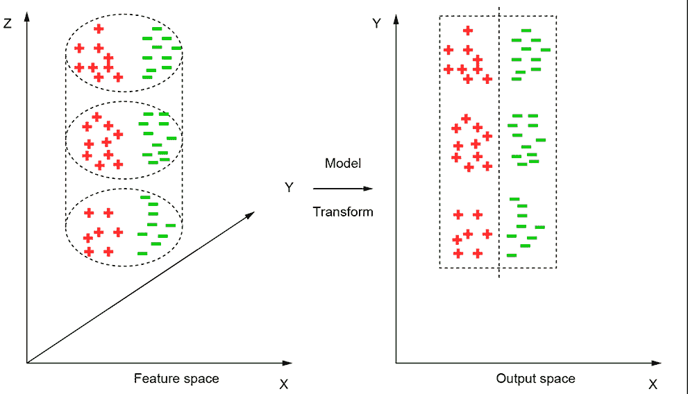

图 12.1 输入点位于一个圆柱形流形（表面）上。在这里，两个输入类别（分别用+和-表示）**不能**通过线性方式分离。如果我们展开（映射）圆柱表面到一个平面上，这两个类别**可以**通过线性方式分离。

与我们在日常生活中看到和触摸的物理表面不同，流形并不局限于三维。人类的想象力可能在可视化高维流形时失败，但我们可以通常使用三维类比作为替代——它们通常有效，尽管并不总是如此。一个神经网络层或一系列层可以被视为将点从一个流形映射到另一个流形。

流形是局部欧几里得的。为了直观理解这一点，想象一个用非常细的绳子绕着的圆圈。现在，取圆圈上的任意一点，并取包含该点的小圆弧。如果我们切断对应该段落的绳子部分，我们可以将那小段绳子拉直，而不会扭曲或撕裂它。换句话说，所选点周围的圆圈上的小邻域与一条线段有 1:1 的映射。圆圈上的所有点都满足这个性质。这样的曲线被称为*局部欧几里得*。这个概念可以扩展到更高维度。考虑球面的表面（这是一个二维流形的例子）。想象一个紧密贴合球面的橡皮片。取一个任意点和包含该点的球面小片（见图 12.2c）。如果我们切断对应该片状的橡皮片，它可以被展平成一个平面，而不会扭曲或撕裂。因此，球面是局部欧几里得的。环面表面（甜甜圈形状的物体）是二维流形的另一个例子。一般来说，*d*-维流形是一个空间（点的集合），其中每个点都有一个包含该点的小邻域，并且可以 1:1 映射到ℝ^d，而不会扭曲或撕裂。例如，一个圆是 1 维流形，它上面的每个点都有一个可以映射到一条线（ℝ¹）的容器弧。球面是一个二维流形，它的每个点都有一个可以 1:1 映射到一个平面（ℝ²）的包含片。我们说流形是局部欧几里得的。图 12.2 说明了这个概念。

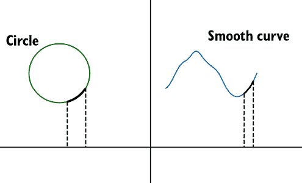

(a) 任何任意连续曲线（例如，一个圆）是一个 1 维流形。

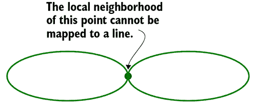

(b) 8 曲线是一个非流形。标记点的χ形邻域不能 1:1 映射到一条线段。

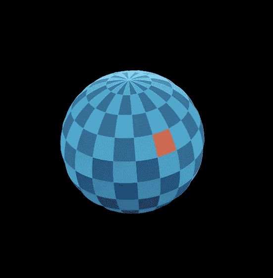

(c) 球体是二维流形的一个例子。

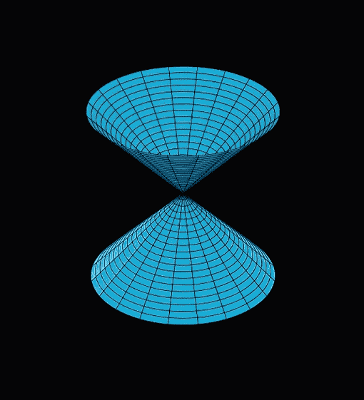

(d) 沙漏是一个二维非流形表面的例子。

图 12.2 1 维和 2 维中的流形和非流形

仔细思考一下，你会发现局部欧几里得性质使得微积分成为可能。例如，我们如何计算曲线下方的面积，即区间 *x* = *a* 和 *x* = *b* 上的 *f*(*x*)？公式是 *∫[x=a]^(x=b)* *f*(*x*) *dx*。我们取曲线的无限小段，并假设它们是直线，可以投影到 *X* 轴上的一个很小的线段上。得到的窄四边形可以近似为一个边平行于 *X* 和 *Y* 轴的矩形。我们求和（积分）覆盖我们正在计算的相同面积的所有的很小的矩形的面积（见图 12.3）。这个方案依赖于将曲线的微小段表示为直线的可能性。关于计算曲线段的长度，可以提出一个类似的案例。在更高维的情况下，同样的想法适用：微积分依赖于将曲线或表面局部地近似为平面的可能性。任何**连续**的向量函数的图像  = *f*()，其中  是 ℝ*^n* 的任意开子集——即  ∈ 𝕌 ⊂ ℝ*^n* 且 *f*() ∈ ℝ*^m*——在 ℝ*^m* × ℝ*^n* 中产生一个 (, ) 流形。

图 12.3 曲线下方的面积是通过局部地用很小的直线段来近似曲线段来计算的——需要局部欧几里得性质

在这个背景下，请注意，整个球面**不能**映射到一个平面上（试着将球面展开到平面上）。这就是为什么不可能在一张纸上绘制出全球的完美地图，使得所有区域都按比例绘制。通常，极地地区在纸地图上占据不成比例的大面积。但球面表面上的小片区域可以映射到平面上，这足以称这个表面为流形。因此，局部欧几里得中的“局部”一词。

### 12.1.1 Hausdorff 性质

流形通常还具有另一个性质，称为 Hausdorff 性质。如果我们取流形上的任意一对点——无论它们有多接近——我们都可以找到围绕各自点的由流形上的点组成的**不相交**邻域对。通俗地说，这意味着如果我们取流形上的任意一对点，我们可以在它们之间找到无限多个点，所有这些点都属于流形。这在图 12.4 中得到了说明。很容易看出这一点对于实数线（ℝ¹）是成立的：取任意一对点，它们之间有足够的点来创建一个以每个点为中心的不相交邻域对。

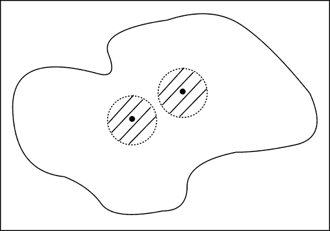

图 12.4 对于任意一对点，我们可以找到一个包含相应点且由流形上的点组成的**不相交**邻域对。

### 12.1.2 第二可数性质

流形是第二可数的。为了解释这一点，我们首先简要概述几个概念。（免责声明：以下解释倾向于易于理解，而不是数学上的严谨。）

开集、闭集和边界

考虑属于区间 *A* ≡ 0 < *x* < 1 的点集（你可以想象它为实线的一段）。取这个集合 *A* 中的任意一点，比如 *x* = 0.93。你可以找到它左侧的点（比如，0.92）和右侧的点（比如，0.94），这两个点都在同一个集合 *A* 中。在某种意义上，这个点被属于同一集合的点所包围。因此，它是一个 *内部* 点。有趣的是，在这个集合中，*所有点都是内部点*。相比之下，考虑集合 *A[c]* ≡ 0 ≤ *x* ≤ 1。这个集合包括之前的集合 *A* 以及边界点 *x* = 0 和 *x* = 1。注意，边界点可以从集合 *A* 的内部和外部接近。如果我们取边界上任意一点的微小邻域，由所有距离为 *ϵ* 的点组成，那么在这个邻域内既有在 *A* 内的点，也有在 *A* 外的点。*A* 是一个开集。如果我们将其边界添加到自身，它就变成了闭集 *A[c]*。

这个概念可以扩展到更高维度。例如，属于单位圆 *S* ≡ *x*² + *y*² < 1 的二维点集是一个开集。如果我们添加边界——圆 *S[c]* ≡ *x*² + *y*² = 1，我们得到一个闭集。所有这些都在图 12.5 中得到了说明。

图 12.5 显示了灰色为开集，无边界；黑色为边界。灰色加黑色为闭集。

有界、紧致和预紧致集合

如果一个集合的所有点都位于彼此固定的距离之内，那么这个集合被认为是 *有界* 的。之前讨论的集合 *A*、*A[c]*、*S* 和 *S[c]* 都是 *有界* 的。一个 *紧致* 集合既是 *有界* 的也是 *闭* 的。集合 *A[c]* 和 *S[c]* 是紧致的。如果一个集合可以通过添加其边界来转换成一个紧致集合，那么这个集合是 *预紧致* 的（例如，*A* 和 *S*）。请注意，并非所有开集都是预紧致的：例如，−∞ < *x* < ∞ 是开集但不是预紧致的。然而，所有预紧致集合都是开集。

流形可能包含边界，也可能不包含边界。圆盘是一个带有边界的二维流形。它的边界是圆的周长，这是一个一维流形。三维球体是一个带有边界的三维流形。其边界是球面的表面，这是一个二维流形。圆盘上不带边界的点的开集也是一个二维流形。一个正方形区域是一个带有边界的二维流形，其边界是正方形，这是一个一维流形。三维立方体是一个带有边界的三维流形，其边界是立方体的表面，这是一个二维流形。一般来说，带有边界的 *d*-维流形的边界是一个 *d* − 1 维流形。

现在，让我们回到流形的第二可数性质。流形的第二可数性质意味着每个流形都有一个开集的基。这意味着对于每个流形 *M*，存在一个可数的集合 *U* ≡ {*U[i]*}，其中 *U[i]* 是 *M* 的紧致子集，并且 *M* 的任何开子集都可以表示为 *U* 的元素的并集。这如图 12.6 所示。

图 12.6 显示了球面内包含的区域。

## 12.2 同胚性

我们一直在谈论圆弧与线段之间的一一对应映射。如果我们把一根绳子紧紧地套在圆弧上，我们只需要抓住绳子的两端并拉出来，就可以得到相应的直线——我们不需要进行任何扭曲或撕裂（见图 12.2 中的黑色弧线）。同样，球面表面上的一个区域可以通过简单地拉伸覆盖在该区域上的一个想象中的橡皮片来一一对应地映射到一个平面上（见图 12.2c 中的区域）。这些都是称为 *同胚性* 的一般映射类别的例子。形式上，同胚映射包含两个函数 *f* 和 *f*^(−1)，它们在两个点集 *X* 和 *Y* 之间，使得

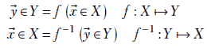

其中

+   *f* 是一一对应的：它将每个  映射到一个 *唯一的* ，并且不同的  被映射到不同的 。

+   *f*^(−1) 是一一对应的：它将每个  映射到一个 *唯一的* ，并且不同的  被映射到不同的 。

+   *f* 是一个连续函数：它将  的邻近值映射到  的邻近值。

+   *f*^(−1) 是一个连续函数：它将  的邻近值映射到  的邻近值。

可视化同胚性的直观方法是，它通过拉伸或压缩将一个流形转换成另一个流形，但从不通过切割、断裂或折叠。同胚性保持路径连通性。如果任意两点之间都存在一条路径，包括属于该集合的点，则称该点集是路径连通的。

## 12.3 神经网络与流形之间的同胚性

考虑在实数线上定义的两个类 *A* 和 *B*：

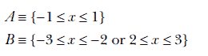

与这些类别相对应的 1-流形在其原始空间中并不容易区分（见图 12.7a），因为类别 A 被类别 B“包围”。但如果我们挤压原点并将其向上拉——换句话说，执行特定的同胚变换——将其转换，如图 12.7c 所示，就有可能用一条直线区分转换后的流形。同样，图 12.7b 显示了两个类别*A*和*B*：

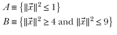

这些是难以在其原始空间中区分的 2-流形，因为，同样，类别 B 包围了类别 A。但如果我们挤压并拉扯原点以创建图 12.7d 所示的流形，它们就可以通过平面进行区分（见图 12.7d)。

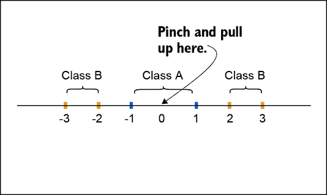

(a) 线性分类器不能区分直线上的点。

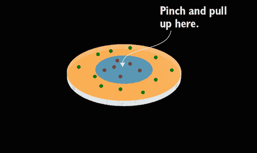

(b) 线性分类器不能区分圆盘上的点。

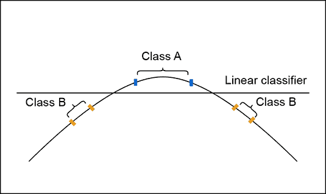

(c) 将直线转换成弯曲形状后，可以使用线性分类器（直线）进行分类。

(d) 将圆盘转换成 3D 钟形形状后，可以使用线性分类器（平面）进行分类。

图 12.7 将同胚变换到更友好的流形有助于分类。

神经网络的线性层执行以下转换，这在方程 8.7 中有详细讨论）：

注意，所有这些操作，包括与权重矩阵*W*相乘、通过进行平移和 sigmoid 非线性都是连续可逆函数。因此，它们是同胚。将这些操作按顺序应用时的复合操作又是另一个同胚。（严格来说，*权重矩阵的乘法只有在权重矩阵* *W* *是方阵且行列式非零时才是可逆的。如果权重矩阵的行列式为零，该层实际上执行的是降维。）

观察多层神经网络的一种方式是，连续的层通过同胚变换输入流形，使其更容易区分类别。最后一层可能是一个简单的线性分离器（如图 12.7 所示）。

## 摘要

+   流形是一个超维点的集合空间，它满足三个性质：局部欧几里得、豪斯多夫和第二可数。

+   一个*d*-流形是一个空间，其中每个点都有一个小的邻域包含该点，并且可以 1:1 地映射到ℝ*^d*的一个子区域，而不需要折叠、扭曲或撕裂。换句话说，流形上任何一点的局部邻域都可以近似为某种平坦的东西。例如，三维空间中的连续曲线是一个 1-流形：如果我们把曲线想象成一根绳子，任何局部邻域都是一段绳子，可以被拉直成一条直线。三维空间中的任何连续表面都是一个 2-流形：如果我们把表面想象成一块橡皮膜，任何局部邻域都可以被拉平和拉伸成一块平坦的平面区域。这种性质（能够假装曲线或表面可以被局部替换为线性部分）使我们能够进行微积分。

+   同胚性是一种特殊的变换类别，它通过拉伸/压缩而不撕裂、断裂或折叠将一个流形映射到另一个流形。

+   同胚性保持路径连通性。

+   大致来说，神经网络层可以被视为一种同胚变换，它将输入流形上的点映射到一个（希望）更适合最终目标的输出流形。整个多层感知器（神经网络）可以被视为一系列同胚变换，通过一系列步骤将输入流形转换为一个使最终目标更容易实现的流形。特别是，分类神经网络将输入流形映射到一个输出流形，其中属于不同类别的点被很好地分隔开。
