# 13 全贝叶斯模型参数估计

本章涵盖

+   无监督建模的全贝叶斯参数估计

+   将先验信念注入参数估计

+   使用已知或未知均值和精度的高斯似然参数估计

+   正态-伽马和 Wishart 分布

假设我们有一个感兴趣的数据集：比如说，所有包含猫的图像。如果我们把图像表示为高维特征空间中的点，那么我们感兴趣的数据集就构成了该特征空间的一个子空间。现在我们想要为我们的数据集创建一个*无监督*模型。这意味着我们想要识别一个概率密度函数 *p*()，其样本云（通过多次重复采样概率分布而获得的点的集合）与我们的感兴趣子空间大致重叠。当然，我们不知道感兴趣的子空间的确切位置，但我们已经从感兴趣的数据集中收集了一组样本 *X*：即训练数据。我们可以使用 *X* 的点云作为未知感兴趣子空间的一个替代。因此，我们本质上是在尝试识别一个概率密度函数 *p*()，其样本云大致与 *X* 重叠。

一旦我们有了模型 *p*()，我们就可以用它来生成更多的数据样本；这些将是计算机生成的猫图像。这是生成模型。此外，给定一个新图像 ，我们可以通过评估 *p*() 来估计它成为猫图像的概率。

## 13.1 全贝叶斯估计：非正式介绍

让我们回顾贝叶斯定理：


方程式 13.1

在这里，*X* = {[1], [2],⋯} 表示训练数据集。我们的最终目标是识别似然函数 *p*(|*θ*). 估计似然函数有两个方面：选择函数族和估计参数。我们通常根据对问题的了解预先选择函数族，然后估计模型参数。例如，我们模型似然函数的函数族可能是高斯分布：*p*(|*θ*) = 𝒩(; , **Σ**)，正如之前所述，分号将模型变量与模型参数分开）。然后 *θ* = {, **Σ**} 是需要估计的模型参数。我们估计 *θ* 以使整体似然 *p*(*X*|*θ*) = ∏*[i ]p*(*[i]*|*θ*) 最好地拟合训练数据 *X*。

我们想再次强调*最佳拟合*意味着似然函数的样本云（从*p*(|*θ*)重复抽取的样本）与训练数据集*X*大体重叠。对于高斯情况，这意味着均值应该落在训练数据点非常集中的地方，协方差矩阵Σ应该是这样的，即似然函数的椭圆底部尽可能紧密地包含尽可能多的训练数据点。

### 13.1.1 参数估计和信念注入

参数估计有各种可能的方法。最简单的方法是*最大似然参数估计*（MLE），在第 6.6.2 节中介绍。在 MLE 中，我们选择最大化观察到的训练数据集似然*p*(*X*|*θ*)的参数值。这有些道理。毕竟，我们知道唯一真实的事情是输入数据集*X*已经被观察到了——由于这是无监督数据，我们不知道其他任何事情。选择最大化已知真相概率的参数是合理的。如果训练数据集很大，MLE 估计效果良好。

然而，在没有足够大量的训练数据的情况下，将我们对系统的先验知识注入到估计中通常是有帮助的——先验知识可以弥补数据不足。这种将猜测/信念注入系统的过程是通过先验概率密度完成的。为此，我们不能再最大化似然，因为似然忽略了先验。我们必须进行最大后验（MAP）估计，它最大化后验概率。后验概率是似然（依赖于数据）和先验（不依赖于数据；我们将使其反映我们的先验信念）的乘积。

有两种可能的 MAP 范式。我们在第 6.6.3 节中看到了其中之一，在那里我们注入了我们的信念，即未知参数的幅度必须*小*，并将*p*(*θ*) ∝ *e*^(−||*θ*||²)作为*正则化器*。系统被激励选择相对较小的参数值。在本章中，我们研究一个不同的范式；让我们用一个例子来说明它。

假设我们将似然函数建模为高斯分布：*p*(|*θ*) = 𝒩(; , **Σ**). 我们必须从训练数据 *X* 中估计参数 *θ* = {, **Σ**}，为此我们必须最大化后验概率。为了计算后验概率，我们需要先验概率。此外，我们还必须以某种方式注入常数值作为我们对参数值的信念（缺乏观察数据）。那么，将先验概率建模为参数空间中的高斯概率密度函数如何？为了简化起见，我们忽略协方差矩阵参数，可以将均值参数的概率密度建模为 *p*() = 𝒩(; [0], **Σ**[0])。我们实际上是在说，我们相信参数  很可能具有接近 [0] 的值，并且具有 **Σ**[0] 的置信度。换句话说，我们正在将一个常数值作为对参数  的信念注入其中。我们可以类似地处理协方差。后来，我们证明在这个范式下，在训练数据量较少的情况下，先验概率占主导地位。一旦消化了足够多的训练数据，先验概率的影响就会减弱，解决方案就会越来越接近最大似然估计（MLE）。这就是简而言之的完全贝叶斯参数估计技术。

在本章中，我们讨论了一系列越来越复杂的场景中高斯似然函数参数的贝叶斯估计。在第 13.3 节中，我们处理了要估计的参数方差已知（常数）但均值未知的情况，因此均值被表示为一个（高斯）随机变量。然后，在第 13.6 节中，我们考察了均值已知（常数）但方差未知的情况。最后，在第 13.7 节中，我们考察了两者都未知的情况。对于每个场景，都处理了单变量和多变量情况。

注意：本章的完整功能代码，可通过 Jupyter Notebook 执行，可以在 [`mng.bz/woYW`](http://mng.bz/woYW) 找到。

## 13.2 高斯参数值的最大似然估计（MLE）回顾）

我们已经在第 6.8 节中讨论了这一细节。在这里，我们回顾一下主要结果。假设我们有一个数据集 *X* = {*x*^((1)), *x*^((2)),⋯, *x*^((*n*))}。我们决定将数据分布建模为高斯分布 𝒩(*x*;*μ*, *σ*)—我们想要估计参数 *μ*, *σ*，以最好地“解释”或“拟合”观察到的数据集 *X*。最大似然估计是解决此问题的一种简单方法。在这里，我们估计参数，使得 *训练过程中观察到的数据的似然性最大化*。这可以粗略地理解为估计一个概率密度函数，其峰值与输入空间中训练数据密集区域相吻合。我们在第 6.8 节中讨论了最大似然估计。在这里，我们只是重新陈述了这些表达式。

让我们用 *μ* 和 *σ* 表示数据分布的（尚未知的）均值和方差。然后从方程 5.22 中，我们得到


最大化对数似然 *p*(*X*|*μ*, *σ*) 有一个闭式解：

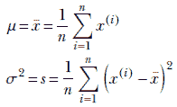

方程 13.2

因此，最大似然估计的均值和方差本质上就是训练数据样本的均值和方差（参见第 6.6 节中这些表达式的推导）。

多变量高斯最大似然估计的对应表达式是


方程 13.3

这些最大似然估计参数值用于评估 *p*(*x*) = 𝒩(*x*;*μ*, *σ*)—即未知数据点 *x* 来自由训练数据集 *X* 表示的分布的概率。

## 13.3 完全贝叶斯参数估计：高斯分布，未知均值，已知精度

当可用数据集较小（即，数据集 *X* 的大小 *n* 较小）时，最大似然估计（MLE）可能并不那么准确。在许多问题中，我们对数据集的均值和标准差有一个先验的想法。不幸的是，MLE 提供了没有将这种先验信念融入估计的方法。完全贝叶斯参数估计技术试图解决这个问题：在这里，我们不仅仅是最大化观察数据的似然性。相反，我们最大化估计参数的后验概率。这个后验概率涉及到似然性和先验概率的乘积（见方程 13.1）。似然项捕捉了训练数据的影响——仅最大化它是 MLE，但它不捕捉先验信念的影响。另一方面，先验项不依赖于数据。这就是我们将我们的信念、猜测或先验知识关于数据分布嵌入的地方。因此，我们对数据分布参数的估计将考虑数据和先验猜测。我们将很快看到，这种估计是随着数据集的大小（*n*，*X* 的长度）增加，先验项的影响减小，似然项的影响增加。在极限情况下，在数据可用性无限的情况下，贝叶斯推理产生 MLE。在另一个极端情况下，当没有数据可用（*n* = 0）时，完全贝叶斯参数估计与先验估计相同。

让我们考察贝叶斯参数估计。首先，我们处理一个相对简单的情况，即我们有一个具有已知（常数）方差但未知且已建模的均值的高斯数据分布。数据分布是高斯分布（通常，𝒩(*x*;*μ[n]*, *σ*) 中的分号将变量与参数分开）：


训练数据集表示为 *X* = {*x*^((1)), *x*^((2)),⋯, *x*^((*n*))}，其整体似然性为

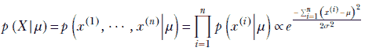

假设方差是已知的——因此它被视为一个常数而不是随机变量。均值 *μ* 是未知的，被视为一个具有均值 *μ*[0] 和方差 *σ*[0]（不要与 *μ* 和 *σ* 混淆，它们是数据本身的均值和方差）的高斯随机变量。因此，先验是


未知参数 *μ* 的后验概率是两个高斯分布的乘积，这本身也是一个高斯分布。让我们用 *μ[n]* 和 *σ[n]* 表示这个乘积高斯分布的尚未知的均值和方差。在这里，下标 *n* 是为了提醒我们，后验是通过处理 *X* = {*x*^((1)), *x*^((2)),⋯, *x*^((*n*))} 中的 *n* 个数据实例来获得的。因此，高斯后验可以表示为


使用贝叶斯定理，


通过比较左右两侧指数上的 *μ*² 和 *μ* 的系数，我们确定后验分布的未知参数：


方程 13.4

应该清楚地理解各种名称相近的变量的意义：

+   *μ* 和 *σ* 是数据分布 *p*(*x*) 的均值和方差——假设为高斯分布。最终目标是估计 *μ* 和 *σ*，以最佳地拟合数据集 *X*。另一方面，*μ*[0] 和 *σ*[0] 是参数分布 *p*(*μ*) 的均值和方差，它捕捉了我们关于数据均值 *μ* 的先验信念（记住，根据假设，数据均值也是一个高斯随机变量）。*μ[n]* 和 *σ[n]* 是从 *n* 个数据点样本计算出的后验分布 *p*(*μ*|*X*) 的均值和方差。因为它是由两个高斯分布的乘积，所以它是一个高斯随机变量。

+   未知均值参数的后验分布 *p*(*μ*|*X*) 是一个以 *μ[n]* 为均值的正态分布。因此，当 *μ* = *μ[n]* 时，它将达到最大值。换句话说，未知均值 *μ* 的 MAP 估计为 *μ*[MAP] = *μ[n]*。

+   尽管 *μ[n]* 是 *μ* 的最佳估计，但 *σ[n]* 并没有近似数据的 *σ*，在这种情况下，*σ* 是通过假设而知的。在这里，*σ[n]* 是后验分布的方差，反映了我们对 *μ* 估计的不确定性。这就是为什么，当数据实例的数量变得非常大时，*σ[n]* 趋近于 0（表示我们对均值估计没有不确定性或完全有信心）。

我们数据分布的估计为 *p*(*x*) = 𝒩(*x*;*μ[n]*, *σ*)，其中 *μ[n]* 由方程 13.4 给出。请注意，它是 MLE *x̄* 和先验猜测 *μ*[0] 的组合。使用这个，对于任何任意数据实例 *x*，我们可以推断 *x* 属于训练数据集 *X* 的类的概率。

注意：完全功能的贝叶斯估计代码，具有未知均值和已知方差，可通过 Jupyter Notebook 执行，可以在 [`mng.bz`](http://mng.bz/ZA75) [/ZA75](http://mng.bz/ZA75) 找到。

列表 13.1 PyTorch- 带有未知均值和已知方差的贝叶斯估计

```py
import torch

def inference_unknown_mean(X, prior_dist, sigma_known):
    mu_mle = X.mean()
    n = X.shape[0]

    mu_0 = prior_dist.mean
    sigma_0 = prior_dist.scale                             ①

    mu_n = mu_mle / (1 + sigma_known**2 / (n * sigma_0**2)) +
             mu_0 / (1 + n * sigma_0**2 / sigma_known**2)  ②

    sigma_n = math.sqrt(
        (sigma_0**2 * sigma_known**2) /
        (n*sigma_0**2+sigma_known**2))                     ③

    posterior_dist = torch.Normal(mu_n, sigma_n)
    return posterior_dist
```

① 先验参数

② 后验均值，根据方程 13.4

③ 后验标准差，根据方程 13.4

## 13.4 小量和大量的训练数据，以及强和弱的先验

让我们考察方程 13.4 在 *n* = 0（无数据）和 *n* → ∞（大量数据）时的行为：


这与我们关于少量数据时后验主要由先验决定，而大量数据时后验主要由似然决定的观念相符。在大量数据的情况下，参数的方差为零（我们可以说我们有**完全的确定性**，即均值的最优值是数据的样本均值，也就是均值的 MLE 估计）。一般来说，随着训练数据的增加（即*n*的值增大），后验会越来越接近似然。这可以通过分析方程 13.4 来看到。这与我们的直觉相符，即少量数据时，我们试图用我们预先存在的（先验）关于参数值的信念来补偿。随着训练数据实例数量的增加，先验的影响减小，似然（它是数据的函数）开始占主导地位。

先验的方差低（即小的*σ*[0]）本质上意味着我们对先验信念的不确定性低（记住，高斯熵/不确定性与其方差成正比）。这样的高置信度先验抵抗被数据淹没，被称为**强先验**。另一方面，大的*σ*[0]意味着对先验均值值的信心低。这是一个**弱先验**，容易被数据淹没。我们可以在方程 13.4 中均值的最终权衡表达式中看到这一点：在第二项的分母中我们有*nσ*[0]²/*σ*²。一般来说，随着*n*的增大，第二项消失，从而消除了先验*μ*[0]的影响，使得后验均值与 MLE 均值相一致。但是，*σ*[0]越小，需要更大的*n*来实现这一点，反之亦然。

## 13.5 共轭先验

在 13.3 节中，给定高斯似然，选择高斯先验使得后验也属于高斯家族。这大大简化了问题。如果先验来自另一个家族，那么后验——似然和先验的乘积——可能不属于简单或甚至已知的分布家族。

因此，具有高斯先验的高斯似然导致均值后验也是高斯。这样的先验被称为**共轭**。形式上，对于特定的似然家族，选择使得后验属于与先验相同家族的先验被称为共轭先验。例如，均值的正态分布（已知方差）与正态似然是共轭的。很快我们就会看到，对于正态似然，精度的伽马分布（方差的倒数）导致伽马后验。换句话说，精度的伽马先验与正态似然是共轭的。在多元情况下，我们用 Wishart 分布作为共轭先验。

## 13.6 完全贝叶斯参数估计：高斯，未知精度，已知均值

在第 13.3 节中，我们讨论了在假设我们以某种方式知道方差 *σ* 并且只想估计均值 *μ* 的条件下，完全贝叶斯参数估计。现在我们考察均值已知但方差未知且表示为随机变量的情况。如果我们使用精度 *λ* 而不是方差 *σ*，计算将变得简单。它们通过表达式 1/*σ*² 相关联。因此，我们有一个数据集 *X*，它被假定为从具有常数均值 *μ* 的高斯分布中抽取的，而精度 *λ* 是具有伽马分布的随机变量。因此，数据的概率密度函数是 *p*(*x*|*μ*, *λ*) = 𝒩(*x*; *μ*, 1/√*λ*)。

我们用伽马分布来建模精度的先验随机变量。似然函数是高斯分布，由于高斯和伽马的乘积仍然是伽马（由于伽马分布的共轭先验性质），因此得到的结果后验是伽马分布。后验的伽马函数参数可以通过系数比较推导出来。后验的最大值是我们对参数的估计。

伽马分布

伽马分布在附录中介绍；如有必要，请先阅读。这里我们陈述相关的性质。具有伽马分布的随机变量 *λ* 的概率密度函数是具有两个参数 *α*，*β* 的函数：


方程式 13.5

伽马分布的最大值

为了最大化伽马概率密度函数 *p*(*λ*|*X*) = *λ*^((*α[n]* − 1))*e*^(−*β[n]λ*) 对于随机变量 *λ*，我们对它求导并令其等于零：

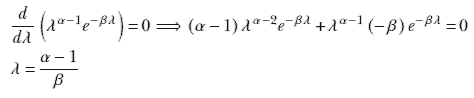

### 13.6.1 估计精度参数

让我们回到当均值已知时对精度参数的完全贝叶斯估计。我们用高斯分布来建模数据分布：*p*(*x*|*μ*, *λ*) = 𝒩(*x*; *μ*, 1/√*λ*)（我们已经用精度 *λ* 表达了这种高斯分布，而 *λ* 与方差 *σ* 相关，*λ* = 1/*σ* ²）。训练数据集是 *X* = {*x*^((1)), *x*^((2)),⋯, *x*^((*n*))}，其整体似然函数是

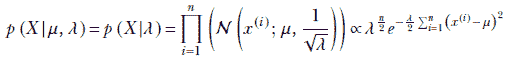

我们用参数 *α*[0]，*β*[0] 的伽马分布来建模精度的先验：

*p*(*λ*) = *γ*(*λ*;*α*[0], *β*[0]) ∝ *λ*^((*α*[0]−1))*e*^(−*β*[0]*λ*)

我们知道相应的后验——高斯和伽马分布的乘积——是伽马分布（由于伽马分布的共轭先验性质）。让我们将后验表示为

*p*(*λ*|*X*) = *γ*(*λ*;*α[n]*, *β[n]*)

从贝叶斯定理，


代入


并比较 *λ* 和 *e* 的幂，我们得到

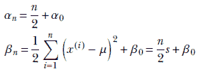

方程式 13.6

注意，与之前一样，在 *n* 较低时，后验被先验主导，但随着 *n* 的增加，后验越来越接近似然估计。换句话说，在没有足够数据的情况下，我们让我们的信念主导估计；但如果数据可用，估计则由基于数据的实体似然主导。

给定数据集 *X*，参数 *λ* 的 MAP 点估计是通过最大化这个后验分布 *p*(*λ*|*X*) = *γ*(*λ*;*α[n]*, *β[n]*)，得到 *λ[MAP]* = 1/*σ[MAP]*² = (*α[n]*–1/*β[n]*)。 (附录 A.5 展示了如何获得伽马分布的最大值。) 因此，我们对训练数据分布的估计是 *p*(*x*) = 𝒩(*x*; *μ*, *σ*[MAP])，其中 1/*σ[MAP]*² = (*α[n]*–1/*β[n]*)。

给予大量数据，未知精度/方差的 MAP 估计与 MLE 估计相同（证明概要如下）：

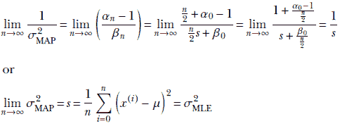

另一方面，在没有数据的情况下，未知精度/方差的 MAP 估计完全由先验决定（证明概要如下）：


注意：具有已知均值和未知方差的贝叶斯估计的完整功能代码，可通过 Jupyter Notebook 执行，可在 [`mng.bz`](http://mng.bz/2nZ9) [/2nZ9](http://mng.bz/2nZ9) 找到。

列表 13.2 PyTorch- 具有未知方差和已知均值的贝叶斯估计

```py
import torch

def inference_unknown_variance(X, prior_dist):
    sigma_mle = torch.std(X)
    n = X.shape[0]

    alpha_0 = prior_dist.concentration
    beta_0 = prior_dist.rate                 ①

    alpha_n = n / 2 + alpha_0
    beta_n = n / 2 * sigma_mle ** 2 + beta_0 ②

    posterior_dist = torch.Gamma(alpha_n, beta_n)
    return posterior_dist
```

① 先验参数

② 后验参数

## 13.7 完全贝叶斯参数估计：高斯，未知均值，未知精度

在第 13.3 节中，我们看到了如果方差已知，均值的共轭先验是高斯分布（也称为正态分布）。同样，当均值已知时，精度的共轭先验是伽马分布。如果两者都未知，我们最终得到正态-伽马分布。

### 13.7.1 正态-伽马分布

正态-伽马是两个随机变量，例如 *μ* 和 *λ* 的概率分布，其密度由四个参数 *μ*^′，*λ*^′，*α*^′，和 *β*^′ 定义，如下所示：

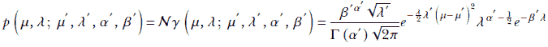

尽管看起来很复杂，但记住它的简单方法是它是正态分布和伽马分布的乘积。

正态-伽马分布达到最大值在

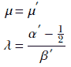

### 13.7.2 估计均值和精度参数

与之前一样，我们用高斯分布建模数据分布：*p*(*x*|*μ* , *λ*) = 𝒩(*x*; *μ*, 1/√*λ*)，我们用精度 *λ* 表达了这个高斯分布，它与方差 *σ* 相关，*λ* = 1/*σ*²）。训练数据集是 *X* = {*x*^((1)), *x*^((2)),⋯, *x*^((*n*))}，其整体似然为

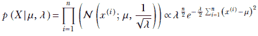

我们将先验的均值建模为均值 *μ*[0] 和精度 *λ*[0]*λ* 的高斯分布：

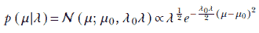

我们将先验的精度建模为参数 *α*[0]，*β*[0] 的伽马分布：

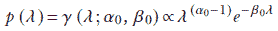

均值和精度参数的整体先验概率是两者的乘积，即参数 *μ*⁰, *λ*⁰, *α*⁰, *β*⁰ 的正态-伽马分布：

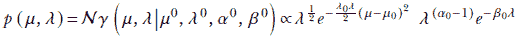

均值和精度参数的后验概率是似然和先验的联合（即乘积）。因此，我们知道它又是另一个正态-伽马分布（由于正态-伽马分布的共轭先验性质）：


使用贝叶斯定理，

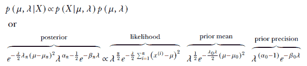

代入


通过比较系数，可以确定后验分布的未知参数：

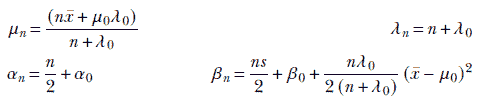

方程 13.7

为了获得完全的贝叶斯参数估计，我们取正态-伽马后验概率密度函数的最大值：

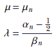

因此，数据的最终概率密度函数为

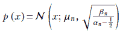

注意：完全功能的贝叶斯估计代码，用于未知均值和未知方差，可通过 Jupyter Notebook 执行，可在[`mng.bz/1oQy`](http://mng.bz/1oQy)找到。

列表 13.3 PyTorch 代码：正态-伽马分布

```py
import torch

class NormalGamma():                            ①

    def __init__(self, mu_, lambda_, alpha_, beta_):
        self.mu_ = mu_
        self.lambda_ = lambda_
        self.alpha_ = alpha_
        self.beta_ = beta_

    @property
    def mean(self):
        return self.mu_, self.alpha_/ self.beta_

    @property
    def mode(self):
        return self.mu_, (self.alpha_-0.5)/ self.beta_
```

① 由于 PyTorch 没有实现正态-伽马分布，我们实现了一个简化的版本。

列表 13.4 PyTorch：具有未知均值和未知方差的贝叶斯估计

```py
import torch

def inference_unknown_mean_variance(X, prior_dist):
    mu_mle = X.mean()
    sigma_mle = X.std()
    n = X.shape[0]

    mu_0 = prior_dist.mu_
    lambda_0 = prior_dist.lambda_
    alpha_0 = prior_dist.alpha_
    beta_0 = prior_dist.beta_                   ①

    mu_n = (n * mu_mle + mu_0 * lambda_0) / (lambda_0 + n)
    lambda_n = n + lambda_0
    alpha_n = n / 2 + alpha_0
    beta_n = n / 2 * sigma_mle ** 2 + beta_0 +
             0.5* n * lambda_0/ (n + lambda_0) *
             (mu_mle - mu_0) ** 2               ②

    posterior_dist = NormalGamma(mu_n, lambda_n, alpha_n, beta_n)

    return posterior_dist
```

① 先验参数

② 后验参数

## 13.8 示例：完全贝叶斯推理

让我们回顾一下第 6.8 节中讨论的问题，即根据身高预测 Statsville 居民是否为女性。为此，我们已经收集了 Statsville 成年女性居民的身高样本。不幸的是，由于不可预见的情况，我们收集的样本非常小。凭借我们对贝叶斯推理的了解，我们不想因此放弃尝试构建模型。根据物理考虑，我们可以假设身高的分布是高斯分布。我们的目标是估计这个高斯分布的参数 (*μ*, *σ*)。

注意：此例的完全功能代码，可通过 Jupyter Notebook 执行，可在[`mng.bz/Pn4g`](http://mng.bz/Pn4g)找到。

首先，让我们通过从具有 *μ* = 152 和 *σ* = 8 的高斯分布中采样五个点来创建数据集。在现实场景中，我们不知道真实分布的均值和标准差。但为了这个例子，让我们假设平均身高为 152 厘米，标准差为 8 厘米。我们的数据矩阵，*X*，如下所示：


### 13.8.1 最大似然估计

如果我们依赖 MLE，我们的方法将是计算数据集的均值和标准差，并使用这个正态分布作为我们的模型。我们使用以下方程来计算正态分布的均值和标准差：


均值，*μ*，计算结果为 149.68，标准差，*σ*，为 11.52。这与真实的均值（152）和标准差（8）有显著差异，因为数据点的数量很少。在这种情况下，最大似然估计并不可靠。

### 13.8.2 贝叶斯推理

我们能否比 MLE 做得更好？一种潜在的方法是使用具有良好先验的贝叶斯推理。我们如何选择一个好的先验？好吧，让我们假设我们知道从一项旧调查中，邻镇 Neighborville 成年女性居民的身高平均值和标准差分别为 150 厘米和 9 厘米。此外，我们没有理由相信 Statsville 的身高分布与邻镇有显著差异。因此，我们可以使用这些信息来“初始化”我们的先验。先验分布编码了我们关于参数值的信念。

由于我们处理的是未知均值和未知方差，我们将先验模型设为正态伽马分布：

*p*(*θ*) = 𝒩*γ*(*μ*[0], *λ*[0], *α*[0], *β*[0])

我们选择*p*(*θ*)，使得*μ*[0] = 150，*λ*[0] = 100，*α*[0] = 10.5，和*β*[0] = 810。这意味着

*p*(*θ*) = 𝒩*γ*(150, 100, 10.5, 810)

*p*(*θ*|*X*)是一个正态伽马分布，其参数可以使用 13.7 节中描述的方程计算。下面展示了计算后验的 PyTorch 代码。

列表 13.5 PyTorch- 使用贝叶斯推理计算后验概率

```py
prior_dist = NormalGamma(150, 100, 10.5, 810)                   ①

posterior_dist = inference_unknown_mean_variance(X, prior_dist) ②

map_mu, map_precision =  posterior_dist.mode                    ③

map_std = math.sqrt(1 / map_precision)                          ④

map_dist = Normal(map_mu, map_std)                              ⑤
```

① 初始化正态伽马分布

② 计算后验概率

③ 分布的模指的是具有最高概率密度的参数值。

④ 使用精度计算标准差

⑤ map_mu 和 map_std 指的是最大化后验分布的参数值。

使用贝叶斯推理获得的*μ*和*σ*的 MAP 估计值分别为 149.98 和 9.56，分别优于 MLE 估计值 149.68 和 11.52（真实的*μ*和*σ*分别为 152 和 9）。

现在我们已经估计了参数，我们可以使用公式找出样本落在某个范围内的概率

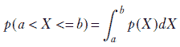

有关此内容的详细信息，请参阅 6.8 节。

## 13.9 完全贝叶斯参数估计：多元高斯分布，未知均值，已知精度

这是多元情况；一元版本在 13.3 节中讨论。计算方法与一元情况类似。

我们将数据分布建模为高斯分布 *p*(|, **Λ**) = 𝒩(; , **Λ**^(−1))，其中我们用精度矩阵 **Λ** 而不是协方差矩阵 **Σ** 来表示高斯分布，其中 **Λ** = **Σ**^(−1)。训练数据集是 *X* ≡ {^((1)), ^((2)), ⋯, ^((*i*)), ⋯, ^((*n*))}，其整体似然为

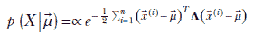

我们将均值的前验建模为高斯分布：

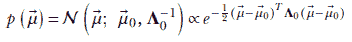

后验概率密度是一个高斯分布（因为它是由两个高斯分布的乘积）。让我们用以下符号表示它


使用贝叶斯定理，


让我们检查最右边表达式的指数。


我们忽略了最后一个常数项，因为它们将被合并到整体比例常数中。因此


比较系数：


后验概率在 *[n]* 处最大化。因此 *[MAP]* = *[n]*

是多元高斯数据分布均值参数的 MAP 估计：*p*() = 𝒩(; *[n]*, **Λ**^(-1))。

注意以下内容：

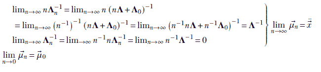

在数据量较大的情况下，估计的均值参数 *[MAP]* = *[n]* 接近 MLE *[MLE]* = 。

在数据量较少的情况下，估计的后验均值参数 *[MAP]* = *[n]* 接近先验 [0]。

注意：完全功能的多元贝叶斯推断高斯似然均值（已知精度）的代码，可通过 Jupyter Notebook 执行，可在 [`mng.bz/J2AP`](http://mng.bz/J2AP) 找到。

列表 13.6 PyTorch- 多元贝叶斯推断，未知均值

```py
def inference_known_precision(X, prior_dist, precision_known):
    mu_mle = X.mean(dim=0)
    n = X.shape[0]

    mu_0 = prior_dist.mean
    precision_0 = prior_dist.precision_matrix       ①

    precision_n = n * precision_known + precision_0 ②
    mu_n = torch.matmul(
        n * torch.matmul(
            mu_mle.unsqueeze(0), precision_known) + torch.matmul(
                mu_0.unsqueeze(0), precision_0),
        torch.inverse(precision_n)
     )

    posterior_dist = MultivariateNormal(
        mu_n, precision_matrix=precision_n)
    return posterior_dist
```

① 先验参数

② 后验参数

## 13.10 完全贝叶斯参数估计：多元，未知精度，已知均值

在第 13.6 节中，我们讨论了单变量情况，现在我们来考察多元情况。对于单变量情况，我们必须查看伽马分布。对于多元情况，我们必须查看威沙特分布。

### 13.10.1 威沙特分布

假设我们有一个高斯随机数据向量  ，其概率密度函数为 𝒩(; , **Σ**). 再次，我们使用 *精度矩阵* Λ 而不是协方差矩阵 Σ，其中 **Λ** = **Σ**^(−1). 考虑我们已知均值  但想估计精度 Λ 的情况。我们如何表达先验？请注意，*p*(**Λ**) 是一个 *矩阵* 的概率密度函数。到目前为止，我们遇到了标量和向量的概率分布，而不是矩阵。此外，这也不是一个任意的矩阵。我们谈论的是一个 *对称、非负定* 的矩阵（所有协方差和精度矩阵都属于这一类）。因此，我们寻找的分布不是所有 *d*² 矩阵元素的联合分布 *d* 表示数据的维度：即所有  和  向量都是 *d* × 1）。而是矩阵中 (*d*(*d* + 1))/2 个元素的联合分布——对角线及其上或下的元素（对角线上的元素上下相同，因为矩阵是对称的）。

这样的矩阵空间被称为 *Wishart 系统集*。一个大小为 *d* × *d* 的随机精度矩阵 Λ 的概率可以表示为 Wishart 分布。这个分布有两个参数：

+   *ν*，一个满足 *ν* > *d* − 1 的标量

+   W，一个 *d* × *d* 的对称非负定矩阵

概率密度函数是


其中

+   𝒲 表示 Wishart。

+   |**W**|, |**Λ**| 分别表示矩阵 W 和 Λ 的行列式。

+   *Tr*(*A*) 表示矩阵 *A* 的迹（对角线元素之和）。

+   *Γ* 表示多元伽马函数

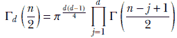

Wishart 是伽马分布的多变量版本。其期望值是

𝔼(**Λ**) = *ν***W**

其最大值出现在

**Λ** = (*ν* − *d* − 1)**W** 对于 *ν* ≥ *d* + 1

### 13.10.2 估计精度

如前所述，我们将数据分布建模为高斯分布 *p*(|, **Λ**) = 𝒩(; , **Λ**^(−1))，其中我们用 *精度矩阵* Λ 而不是协方差矩阵 Σ 来表示高斯分布，其中 **Λ** = **Σ**^(−1)。

训练数据集是 *X* ≡ {^((1)), ^((2)),⋯, ^((*i*)),⋯, ^((*n*))}，其整体似然函数是

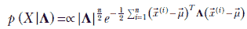

我们将精度矩阵的先验概率建模为 Wishart 分布。因此，


后验分布是另一个 Wishart 分布（归功于 Wishart 共轭先验性质）：


使用贝叶斯定理对训练数据集*X*进行估计，

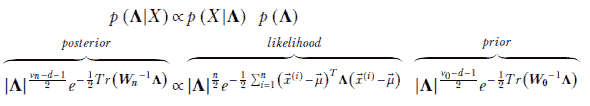

让我们研究一对有用的简单引理。


其中*Tr*指的是矩阵的迹（对角元素之和）。

+   第一个引理几乎是显而易见的——二次型*^TA*是一个标量，所以当然它与它的迹是相同的。

+   第二个引理直接来自迹的矩阵属性：*Tr*(*BC*) = *Tr*(*CB*).

使用引理，似然项的指数为

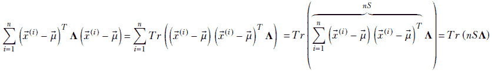

其中


因此，后验密度为

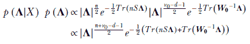

由于*Tr*(*A*) + *Tr*(*B*) = *Tr*(*A* + *B*),

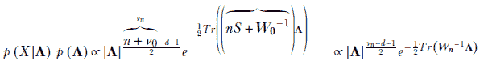

通过比较系数，我们确定后验分布的未知参数：

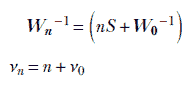

其中

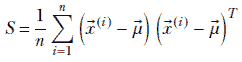

后验密度函数的最大值，**𝒲**(**Λ**;*ν[n]*, **W**[n])，给出了数据分布精度参数的估计：**Λ** = (*ν[n]* − *d* − 1)**W**[n] 对于 *ν[n]* ≥ *d* + 1，即，

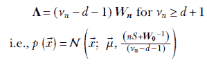

## 摘要

+   一个能够模拟底层数据分布的生成模型可能比一个黑盒判别模型更强大。一旦我们选择了一个模型族，我们需要估计模型参数，*θ*。我们可以使用贝叶斯定理从训练数据*X*中估计*θ*的最佳值。

+   后验分布*p*(*θ*|*X*)是似然率*p*(*X*|*θ*)和先验*p*(*θ*)的乘积的函数。先验表达了我们对参数值的信念。对于小数据集，后验主要由先验决定，对于大数据集，后验主要由似然率决定。通过一个好的先验分布注入信念，在训练数据非常少的情况下可能是有帮助的。

+   最大似然估计仅依赖于数据，与最大后验估计（MAP）相对，后者既依赖于数据也依赖于先验信息。

+   当方差已知时，我们可以使用贝叶斯估计高斯似然率的均值。当似然率是高斯分布*p*(*X*) ∼ *N*(*μ*, *σ*), 我们将先验模型建模为正态分布*p*(*μ*) ∼ *N*(*μ*[0], *σ*[0])。后验分布也是一个正态分布*p*(*μ*|*X*) ∼ *N*(*μ[n]*, *σ[n]*)，其中和。我们还可以使用估计的参数对新数据实例进行预测。

+   弱先验意味着我们对先验信念的不确定性程度高/信心低，并且很容易被数据所淹没。相比之下，强先验意味着我们对先验信念的不确定性程度低/信心高，并且能够抵抗数据过载。

+   对于特定的似然族，导致后验属于与先验相同族的先验选择被称为共轭先验。

+   伽马函数是 ，伽马分布是 。伽马分布随 *α* 和 *β* 的不同值而变化。

+   在已知均值的情况下，对高斯似然精度的贝叶斯估计中，精度 *λ* 是方差的倒数。我们可以将先验模型化为一个伽马分布 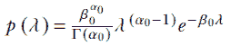。后验分布也是一个伽马分布，，其中 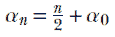 和 。

+   在对高斯似然的均值和精度进行贝叶斯估计的情况下，我们将先验模型化为一个正态-伽马分布。后验也是一个正态-伽马分布。后验分布可以用来预测新的数据实例。

+   高斯似然均值的多变量贝叶斯推断被称为精度。我们可以将先验模型化为一个多元正态分布；后验也是一个多元正态分布。

+   Wishart 分布是伽马分布的多变量版本。在已知均值的情况下，使用多元贝叶斯推断高斯似然精度的精度，我们可以将先验模型化为一个 Wishart 分布。相应地，后验也是一个 Wishart 分布。
