# 14 潜空间和生成建模、自编码器以及变分自编码器

本章涵盖

+   使用潜向量表示输入

+   潜空间的几何视图、平滑性、连续性和正则化

+   主成分分析（PCA）和线性潜空间

+   自编码器和重建损失

+   变分自编码器（VAEs）和正则化潜空间

将输入向量映射到转换空间在机器学习中通常是有益的。转换向量被称为*潜向量*——潜的，因为它不是直接可观察的——而输入是基础的*观测向量*。潜向量（也称为嵌入）是输入向量的简化表示，其中只包含有助于实现最终目标（例如，估计输入的概率）的特征。

（属于特定类别）被保留，其他特征被遗忘。通常，潜表示的维度少于输入：即，将输入编码到潜向量中会导致*维度降低*。

从输入到潜空间（反之亦然）的映射通常是通过学习得到的——我们训练一个机器，例如神经网络，来完成这个任务。潜向量需要尽可能忠实地表示分配给它的输入维度内的输入。因此，神经网络被激励去最小化由转换引起的信息损失。后来，我们看到在自编码器中，这是通过从潜向量重建输入并尝试最小化实际输入和重建输入之间的差异来实现的。然而，由于维度的减少，网络没有保留输入中所有内容的奢侈。它必须学习对最终目标至关重要的内容，并仅保留那些内容。因此，嵌入是输入的紧凑表示，它被精简以达到最终目标。

## 14.1 潜空间几何视图

考虑所有高度为*H*、宽度为*W*的数字图像空间，每个像素代表一个 24 位 RGB 颜色值。这是一个巨大的空间，有(2²⁴)*^(HW)*个点。这个空间中的每一个可能的 RGB × *H* × *W*图像都是一个点。但如果一个图像是自然图像，相邻的点往往具有相似的颜色。这意味着对应于自然图像的点相关：它们不是均匀分布在可能图像的空间中。此外，如果图像具有共同属性（例如，它们都是长颈鹿），相应的点在(2²⁴)*^(HW)*大小的输入空间中形成簇。在随机论中，具有共同属性的自然图像在可能图像空间中的概率分布高度非均匀（低熵）。

图 14.1a 展示了具有某些共同属性的点围绕平面流形聚集。类似地，图 14.1b 展示了具有某些共同属性的点围绕曲面流形聚集。这些点具有共同属性。目前，我们并不关心这个属性是什么，或者流形是平面还是曲面。我们只关心这些感兴趣的点分布在一个流形周围。流形捕捉了这种共同属性的精髓，无论它是什么。如果共同属性是，比如说，图像中存在长颈鹿，那么流形就捕捉了*长颈鹿特性*：流形上或附近的点都对应着有长颈鹿的图像。如果我们沿着流形移动，我们会遇到各种风格的长颈鹿照片。如果我们远离流形——即沿着垂直于流形的方向移动一段距离——那么点代表有长颈鹿照片的概率就低。


(a) 平面潜在子空间


(b) 曲面潜在子空间

图 14.1 展示了两个潜在子空间的例子，分别对应平面和曲面的流形。实线表示潜在向量，虚线代表投影到潜在子空间所丢失的信息。

给定由感兴趣点的样本（如许多长颈鹿照片）组成的训练数据，我们可以训练一个神经网络来学习这个流形——这是使所有训练数据点到流形的平均距离最小化的最优流形。然后，在推理时间，给定一个任意的输入点，我们可以估计它到流形的距离，这给了我们该输入满足流形所表示属性的概率。

因此，输入向量可以被分解为一个在流形内的分量（图 14.1 中的实线）和一个垂直于流形的分量（图 14.1 中的虚线）。潜在空间建模有效地消除了垂直分量，并保留了在流形内的分量作为潜在向量（也称为嵌入）。等价地，我们是在将输入向量投影到流形上。这是潜在空间建模的核心思想——我们学习一个表示感兴趣属性的流形，并通过潜在向量表示所有输入，这是输入点到该流形上的投影。潜在向量是输入的更紧凑表示，其中只保留了与感兴趣属性相关的信息。

潜在空间建模概述

在潜在空间建模中，我们训练一个神经网络来表示一个流形，输入点满足感兴趣属性分布在这个流形周围。感兴趣的属性可能是属于特定类别，例如包含长颈鹿的图像。因此，学习到的流形是一组满足该属性的点。输入点被投影到这个流形上，以获得输入的潜在向量表示（也称为嵌入）。这相当于丢弃了与流形正交的输入向量分量。被消除的分量与流形正交，因此与感兴趣属性无关（可能代表图像的背景像素），所以投影引起的信息损失不会造成伤害。我们创建了一个更少噪声、更紧凑的输入表示，专注于我们关心的事情。

训练数据由一组采样数据输入组成，所有这些输入都满足感兴趣的属性。系统本质上学习的是流形，该流形位于最优位置以最小化其与所有训练数据点的平均距离。在推理过程中，给定一个任意输入点，其与流形的距离是该输入满足感兴趣属性的概率的指示器。

一个微妙之处在于，潜在向量是原始点位置向量的流形内分量。通过切换到潜在向量表示，我们失去了点在原始高维输入空间中的位置。我们可以通过提供丢失的正交分量的流形位置来回到高维空间，但这样做并不能恢复原始点：它只能恢复原始点在子空间上的投影。我们用流形的位置（一个聚合实体）替换了单个正交分量，但并不能恢复原始点。在投影过程中，一些信息不可避免地丢失了。

潜在空间表示的一个特殊情况是主成分分析（PCA），在第 4.4 节中介绍（第 14.4 节提供了 PCA 的上下文回顾）。它将输入点投影到最优的平面潜在子空间（如图 14.1a）。但除了某些幸运的特殊情况外，最佳的潜在子空间不是一个超平面。它是一个复杂的曲面（见图 14.1b）。神经网络，如自动编码器，可以学习这种非线性投影。

## 14.2 生成分类器

在推理过程中，我们在前几章中遇到的监督分类器通常会输出输入所属的类别，可能还会附带一个边界框。这种行为有点像黑盒。我们不知道分类器是否很好地掌握了空间，除非通过量化的最终结果。这样的分类器被称为*判别分类器*。另一方面，潜在空间模型将任意输入点映射到属于感兴趣类别的概率。这样的模型被称为*生成模型*，它们具有一些理想的特性：

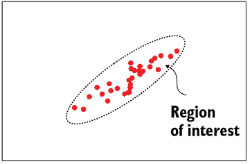

(a) 一个好的判别分类器——平滑的决策边界


(b) 一个不好的判别分类器——不规则的决策边界


(c) 生成模型——没有决策边界（热图表示概率密度）

图 14.2 实心圆表示训练数据点（所有属于感兴趣类别）。虚线曲线表示将感兴趣类别与非感兴趣类别分开的决策边界。在生成模型中，没有决策边界。空间中的每个点都与属于感兴趣类别的概率相关联（如图 14.2c 中的热图所示）

备注：我们可以通过在概率上设置阈值，总是从生成分类器创建一个判别分类器。

+   *更平滑、更密集的流形*——判别模型学习在输入空间中分离感兴趣数据点和非感兴趣数据点的决策边界。另一方面，生成模型试图使用平滑的概率密度函数来模拟输入空间中感兴趣数据点的分布。因此，生成模型不能学习到一个非常不规则形状的函数，该函数过度拟合训练数据。这如图 14.2 所示，而判别模型可能会收敛到一个与训练数据弯曲和角落过于接近的流形（过度拟合），如图~\ref{fig-discriminative-bad-model}所示。当我们拥有的训练数据较少时，这种判别分类器和生成分类器之间的差异变得特别显著。我们可以通过在概率上设置阈值，总是从生成分类器创建一个判别分类器。

+   *额外洞察*—生成模型对模型的内部运作提供了更多的洞察。考虑一个识别马匹的模型。假设我们向模型提供一些马匹图像，并且它将它们识别为马（好的）。然后我们向模型提供一些斑马图像，它也将它们识别为马（坏的）。我们是否有一个将所有东西都称为马的无效模型？如果它是一个判别模型，我们必须用完全不同的图像（比如鸟类图像）来测试它以获得答案。但是如果我们有一个生成模型，它说真实马匹图像的概率是，比如说，0.9 以上，而斑马图像的概率大约是 0.7。我们开始看到模型的行为是合理的，并且确实意识到斑马比真正的马“马性”要少。

+   *新类实例*—生成模型学习属于该类的输入点的*分布*。与学习分布相关的一个优点是，我们可以采样分布以生成该类的新成员（例如，生成人工马匹图像）。这导致了“生成”模型的名字。如果我们用莎士比亚的作品训练一个生成模型，它将发出类似莎士比亚的文本片段。信不信由你，这已经尝试过并且取得了一些成功。

## 14.3 潜在空间建模的好处和应用

让我们简要回顾一下为什么我们想要进行潜在空间建模：

+   *生成模型通常基于潜在空间模型*—第 14.2 节中概述的生成模型的所有好处也适用于潜在空间建模。

+   *关注重要事项*—不贡献于最终目标的冗余信息被消除，系统专注于真正有区分性的信息。为了可视化这一点，想象一个由站在相同背景前的人的警察肖像组成的数据集。通常用于识别人的潜在空间建模会从表示中消除共同背景，并专注于照片的主题（人）。

+   *数据简化表示*—潜在向量是输入向量的更紧凑表示（减少了维度，因此更小），没有丢失任何有意义的信息。

+   *噪声消除*—潜在空间建模消除了数据中与潜在子空间正交的低方差成分。这部分数据大多对感兴趣的问题没有帮助，因此是噪声。

+   *转换到对最终目标更友好的流形*—我们之前已经看到过这个概念，但在这里让我们看看一个有趣的简单例子。考虑一组在笛卡尔坐标系中的二维点（*x*，*y*）。假设我们想要将点分类到两个集合中：那些位于圆内*x*² + *y*² = *a*²的点以及那些位于圆外的点。在原始的笛卡尔空间中，决策边界不是线性的（它是圆形的）。但如果我们将笛卡尔输入点转换到极坐标的潜在空间中——也就是说，每个(*x*，*y*)被映射到(*r*，*θ*)，使得*x* = *rcos*(*θ*)，*y* = *rsin*(*θ*)——圆在潜在空间中变成了线*r* = *a*。在潜在空间中一个简单的线性分类器*r* = *a*可以实现所需的分类。

潜在空间建模的一些应用如下：

+   生成人工图像或文本（如生成模型中的解释所述）。

+   *输入之间的相似度估计*—如果我们将输入映射到潜在向量，我们可以通过计算潜在向量之间的欧几里得距离来评估输入之间的相似度。为什么这比计算输入向量之间的欧几里得距离更好？假设我们正在构建一个推荐引擎，该引擎建议其他与潜在买家当前浏览的服装项目“相似”的服装项目。我们希望检索看起来相似但并非完全相同的其他服装项目。但相似性是一个主观概念，不能通过输入像素颜色的相似性来衡量。考虑一件在白色底色上有黑色竖条纹的衬衫。如果我们交换条纹颜色和底色颜色，我们得到一件在黑色底色上有白色竖条纹的衬衫。如果我们进行像素到像素的颜色匹配，这些衬衫非常不同，但人类认为它们是相似的。对于这个问题，我们必须训练潜在空间模型，创建神经网络，使得人类感知为相似的图像映射到潜在空间中彼此靠近的点。例如，白色底色上的黑色条纹衬衫和黑色底色上的白色条纹衬衫应该在潜在空间中映射到彼此靠近的潜在向量，尽管它们在输入空间中相距甚远。

+   *图像或其他数据压缩*—潜在向量用一个尽可能忠实于原始向量的较小维度的向量来近似数据。因此，潜在向量是输入的损失压缩表示。

+   *降噪*—潜在向量消除了输入信息中的非有意义部分，即噪声。

注意：本章的完整功能代码，可通过 Jupyter Notebook 执行，可在[`mng.bz/6XG6`](http://mng.bz/6XG6)找到。

## 14.4 线性潜在空间流形和 PCA

PCA（我们在第 4.4 节中讨论过）将输入数据投影到线性超平面流形上。重新审视这个主题将为本章的其余部分设定正确的背景。考虑一组围绕 *X*[0] = *X*[2] 平面紧密聚集的 3D 输入数据点，如图 14.3 所示。

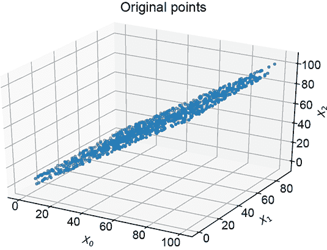

(a) 原始 3D 数据


(b) 通过将第三个主值设为零获得的低维二维表示

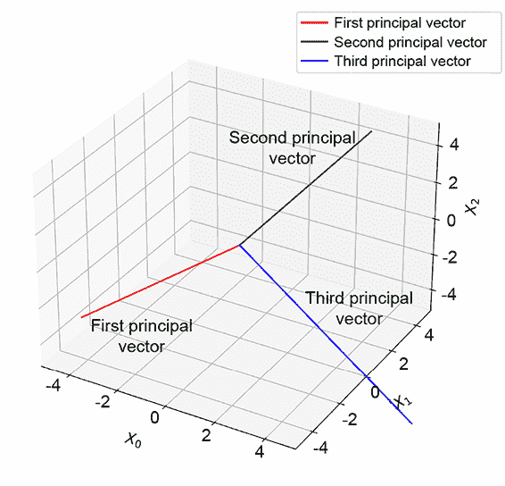

(c) 原始数据的主向量。第三个主向量垂直于 *X*[0] = *X*[2] 平面；其他两个在平面内。

图 14.3 图 14.3a 中的原始 3D 数据显示高度相关性：点围绕 *X*[0] = *X*[2] 平面聚集。第一个主成分对应于最大方差的方向。最后一个（第三个）主成分被简化为二维潜在向量。

注意：我们用 *X*[0]、*X*[1]、*X*[2] 表示连续的轴（维度），而不是更传统的 *X*、*Y*、*Z*，以便于扩展到更高维度。

使用 PCA，我们可以识别出数据在某些维度上的变化很小。当我们进行 PCA 时，我们得到主值和主向量对。最大的主值对应于数据中最大方差的方向。对应的主向量给出该方向，而该主值表示该方向上方差的大小。下一个主值、主向量对是具有下一个最高方差的正交方向，依此类推。例如，在图 14.3 中，对应于较大两个主值的主向量位于 *X*[0] = *X*[2] 平面上，而最小的主值对应于垂直于平面的向量。第三个主值显著小于其他值。这告诉我们该轴上的方差很低，并且沿该轴的分量可以相对少地丢失信息：即低重建损失。小主值轴上的变化很可能是噪声，因此消除它们可以清理数据。在图 14.3 中，这实际上将数据投影到 *X*[0] = *X*[2] 平面上。

维度降低

PCA 实质上是将输入投影到训练数据的最佳拟合平面。假设所有训练数据点都是具有共同属性的样本，这个平面代表了这种共同属性。通过投影，我们消除了这种共同属性，只保留了数据的判别方面。消除的信息被近似地保存在平面的参数中，并在重建（也称为解码）过程中提供，以将我们映射回与输入相同的维度（但不是完全相同的点）。这是 PCA 降维的本质。

下面是 PCA 基于的降维步骤。这在第 4.5 节中已详细描述，并附有证明；这里我们回顾主要步骤而不进行证明。

注意：这种处理与第 4.5 节中的处理类似，但并不完全相同。在这里，我们将变量 *m* 和 *n* 交换，以与我们的使用习惯一致，即用 *n* 表示数据实例的数量。我们还采用了稍微不同的 SVD 表达方式。

1.  将数据表示为矩阵 *X*，其中每一行是一个单独的数据实例。行数 *n* 是数据集的大小。列数 *d* 是数据的原始（输入）维度。因此 *X* 是一个 *n* × *d* 矩阵。

1.  计算均值数据向量

    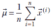

    其中 ^((*i*)) 对于 *i* = 1 到 *i* = *n* 表示训练数据向量实例（这些实例构成了矩阵 *X* 的行）。

1.  将坐标系的原点平移到均值处，通过从每个数据向量中减去均值向量来实现：

    ^((*i*)) = ^((*i*)) –  对于所有 *i*

    数据矩阵 *X* 现在的行是减去均值的数据实例。

1.  矩阵 *X^TX*（其中 *X* 是减去均值的数据矩阵）是协方差矩阵（如第 5.7.2 节中详细讨论的）。矩阵 *X^TX* 的特征值和特征向量对被称为主值和主向量（统称为主成分）。由于 *X^TX* 是一个 *d* × *d* 矩阵，因此有 *d* 个标量特征值和 *d* 个特征向量，每个特征向量的维度为 *d* × 1。让我们将主成分表示为 (*λ*[1]，[1])，(*λ*[2]，[2])，⋯，(*λ[dm]*，*[d]*)。

1.  如果有必要，我们可以假设 *λ*[1] ≥ *λ*[2] ≥ ⋯ ≥ *λ[d]*。如果需要，我们可以通过重新编号主成分来实现这一点）。第一个主成分对应于数据中最大方差的方向（带有几何直觉的证明可以在第 5.7.2 节找到）。对应的主值给出了实际的方差。下一个主值对应于第二高的方差（在第一个主方向正交的方向中），以此类推。对于每个成分，主值给出了实际的方差，而主向量给出了方向。

1.  考虑主向量的矩阵：

    *V* = ![[1] [2] … *[d]*]

    如果我们希望数据是一个具有 *m* 维度的空间，并且信息损失最小，我们应该丢弃 *V* 的最后 *m* 个向量。这消除了 *m* 个最小方差维度。从 *V* 中丢弃最后 *m* 个向量得到一个矩阵

    *V[d–m]* = ![[1] [2] … *[d–m]*]

    注意，获取 *V* 矩阵的最佳方式是对减去均值的 *X* 执行奇异值分解（见第 4.5 节）。

1.  预乘截断的主向量矩阵 *V[d−m]* 与原始数据矩阵 *X* 相乘，将数据投影到对应于前 *d* − *m* 个主成分的空间。因此，要从 *d*-维数据创建 *d* − *m*-维线性编码的潜在向量，

    *X[d−m]* = *XV[d−m]*

    *X[d−m]* 是降维后的数据集。其维度是 *n* × (*d*−*m*).

    可以证明：

    *XV[d−m]* = *UΣ[d−m]*

    其中 *U* 来自奇异值分解（见第 4.5 节），而 *Σ[d−m]* 是奇异值分解中Σ对角矩阵的截断版本，其最小的 *m* 个元素被截掉。这为基于 PCA 的降维提供了一种替代方法。

1.  我们如何重建？换句话说，解码器是什么？好吧，为了重建，我们需要保存原始的主向量：即 *V* 矩阵。如果我们有那个，我们可以在 *X[d−m]* 的每一行的右侧引入 *m* 个零，使其再次成为 *n* × *d* 矩阵。然后我们后乘以 *V^T*，这会将坐标系从以主向量为轴的坐标系旋转回以原始输入轴为轴的坐标系。最后，我们将均值  添加到每一行，将原点移回到其原始位置，从而得到重建的数据矩阵 *X̃*。重建损失是 ||*X* − *X̃*||²。请注意，实际上，*X̃* 是 *UΣV^T*，其中Σ的最后一个 *m* 个对角元素被设置为零。

1.  重构的数据 *X̃* 与原始数据并不相同。我们在降维过程中丢失的信息（尽管是微小的）是永久丢失的。尽管如此，这种删除信息的原则性方法确保了重建损失在某种意义上是最小的，至少在所有与 *X* 线性相关的 *X̃* 中。

### 14.4.1 使用 PCA 进行降维的 PyTorch 代码

现在，让我们在 PyTorch 中实现降维。设 *X* 为表示围绕 *X*[0] = *X*[2] 平面聚类的数据矩阵。*X* 的形状为 [1000,3]，其中 *X* 的每一行代表一个三维数据点。以下列表展示了如何以最小信息损失将 *X* 投影到低维空间，同时也展示了如何从低维表示中重建原始数据点。请注意，由于我们在降维过程中丢失了信息（尽管是微小的），重建是近似的。

注意：使用 PCA 进行降维的完整功能代码，可通过 Jupyter Notebook 执行，可在[`mng.bz/7yJg`](http://mng.bz/7yJg)找到。

列表 14.1 PyTorch- PCA 回顾

```py
import torch

X = get_data()                                      ①

X_mean = X.mean(axis=0)                             ②

X = X - X_mean                                      ③

U, S, Vh = torch.linalg.svd(X, full_matrices=False) ④

V = Vh.T                                            ⑤

V_trimmed =  V[:, 0: 2]                             ⑥

X_proj = torch.matmul(X, V_trimmed)                 ⑦

X_proj = torch.cat([X_proj,                         ⑧
              torch.zeros((X_proj.shape[0], 1))], axis=1)

X_recon = torch.matmul(X_proj, Vh)                  ⑨

X_recon = X_recon + X_mean                          ⑩
```

① 数据矩阵的形状为（1000，3）

② 存储均值，以便我们稍后重建原始数据点

③ 在执行 SVD 之前减去均值

④ 执行 SVD

⑤ V 的列是主向量。

⑥ 移除最后一个主向量。这是沿着垂直于 *X*[0] = *X*[2] 平面的最小方差方向。

⑦ 将输入数据点投影到低维空间

⑧ 用零填充以形成一个 *n* × *d* 矩阵

⑨ 后乘以 *V^T* 以将数据投影回原始空间

⑩ 添加均值

## 14.5 自动编码器

自编码器是经过训练以生成对应于指定输入的潜在空间表示的神经网络系统。它们可以进行非线性投影，因此比 PCA 系统更强大，见图 14.4)。将输入向量映射到潜在向量的神经网络称为 *编码器*。我们还训练了一个称为 *解码器* 的神经网络，它将潜在向量映射回输入空间。解码器的输出是从潜在向量重构的输入。重构输入（即解码器的输出）永远不会与原始输入完全匹配——在编码过程中丢失了信息，无法恢复——但我们可以在系统的约束条件下尽量确保它们尽可能接近。重构损失是原始输入和重构输入之间差异的度量。编码器-解码器对从头到尾训练以最小化重构损失（可能还有其他损失）。这是一个 *表示学习* 的例子，其中我们学习用较小的潜在向量来表示输入向量，以尽可能接近在规定的尺寸预算内表示输入。潜在空间的预算大小是一个超参数。


图 14.4 具有弯曲潜在模式的 2 维数据分布。不可能找到一个直线或向量，使得所有点都靠近它。PCA 将表现不佳。

注意：超参数是一个 *未学习* 的神经网络参数。其值基于我们对系统的了解设置，并在训练过程中保持不变。

在自编码器中，期望的输出是隐含已知的：它是输入。因此，不需要人工标记来训练自编码器；它们是 *无监督的*。自编码器在图 14.5 中以示意图的形式展示。

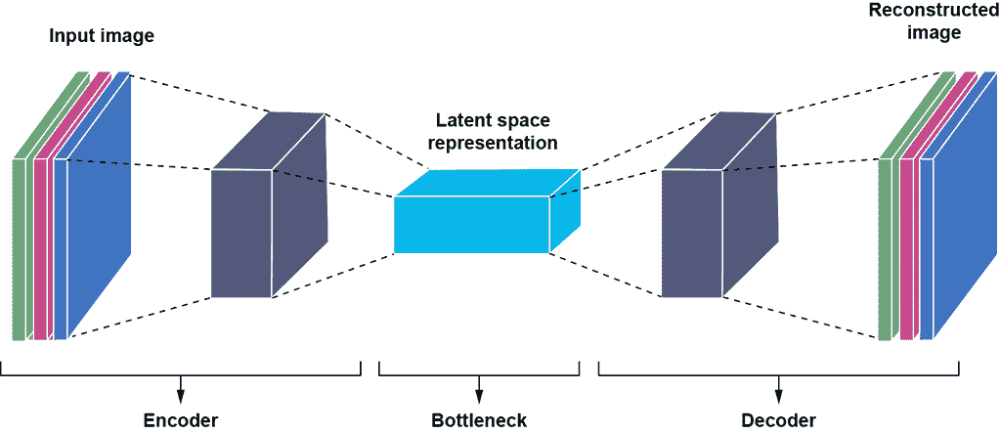

图 14.5 自编码器的示意图。编码器将输入转换为一个潜在向量。解码器将潜在向量转换回重构输入。我们最小化重构损失——重构输入和原始输入之间的距离。

+   编码器接收一个输入  并将其映射到一个低维潜在向量 。一个用于图像输入的编码神经网络示例在列表 14.2 中展示。注意图像的高度和宽度在每次连续的卷积、ReLU 和最大池化层之后都会逐渐减小。

+   解码器是一个神经网络，它从潜在向量  生成重构图像 。列表 14.3 展示了一个解码器神经网络的示例。注意转置卷积以及图像的高度和宽度如何随着每个连续的转置卷积、批量归一化和 ReLU 序列而不断增加。转置卷积在第 10.5 节中讨论。解码器本质上记得——不是完全准确，但平均意义上——编码过程中丢弃的信息。等价地，它记得潜在空间流形在整体输入空间中的位置。将这一点加回到潜在空间表示中，使我们回到与输入向量相同的维度，但不是相同的输入点。

+   系统最小化编码（重构损失）的信息损失。我们确保对于每个输入，编码器产生的对应潜在向量可以通过解码器映射回一个重构值，该值尽可能接近输入。等价地，每个潜在向量是输入的忠实表示，输入和潜在向量之间存在 1:1 的映射。

+   编码器和解码器不必是对称的。

数学上，

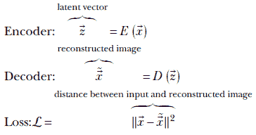

端到端系统被训练以最小化损失 ℒ。

注意：完全功能的自动编码器代码，可通过 Jupyter Notebook 执行，可在 [`mng.bz/mOzM`](http://mng.bz/mOzM) 找到。

列表 14.2 PyTorch- 自动编码器编码器

```py
from torch import nn
nz = 10
input_image_size = (1, 32, 32)            ①
conv_encoder = nn.Sequential(
            nn.Conv2d(in_channels, 32, kernel_size=3, stride=1, padding=1),
            nn.BatchNorm2d(32),
            nn.ReLU(),
            nn.MaxPool2d(kernel_size=2),  ②
            nn.Conv2d(32, 128, kernel_size=3, stride=1, padding=1),
            nn.BatchNorm2d(128),
            nn.ReLU(),
            nn.MaxPool2d(kernel_size=2),  ③
            nn.Conv2d(128, 256, kernel_size=3, stride=1, padding=1),
            nn.BatchNorm2d(256),
            nn.ReLU(),
            nn.MaxPool2d(kernel_size=2),  ④

            nn.Flatten()                  ⑤
        )
fc = nn.Linear(4096, nz)                  ⑥
```

① 以 (c, h, w) 格式输入图像大小

② 减少到 (32, 16, 16)-大小的张量

③ 减少到 (128, 8, 8)-大小的张量

④ 减少到 (256, 4, 4)-大小的张量

⑤ 展平为 4096 大小的张量

⑥ 将 4096 大小的张量减少到 nz 大小的张量

列表 14.3 PyTorch- 自动编码器解码器

```py
from torch import nn
decoder = nn.Sequential(
            nn.ConvTranspose2d(self.nz, out_channels=256,
             kernel_size=4, stride=1,
             padding=0, bias=False),            ①

            nn.BatchNorm2d(256),
            nn.ReLU(True),
            nn.ConvTranspose2d(256, 128, kernel_size=2,
              stride=2, padding=0, bias=False), ②
            nn.BatchNorm2d(128),
            nn.ReLU(True),
            nn.ConvTranspose2d(128, 32, kernel_size=2,
              stride=2, padding=0, bias=False), ③
            nn.BatchNorm2d(32),
            nn.ReLU(True),
            nn.ConvTranspose2d(32, in_channels, kernel_size=2,
              stride=2, padding=0, bias=False), ④
            nn.Sigmoid()
        )
```

① 将 (nz, 1, 1) 转换为 256, 4, 4)-大小的张量

② 增加到 128, 8, 8)-大小的张量

③ 增加到 32, 16, 16)-大小的张量

④ 增加到 1, 32, 32)-大小的张量

列表 14.4 PyTorch- 自动编码器训练

```py
from torch import nn
from torch.nn import functional as F

conv_out = conv_encoder(X)     ①

z =  fc(conv_out)              ②
Xr = decoder(z)                ③

recon_loss = F.mse_loss(Xr, X) ④
```

① 将输入图像通过卷积编码器传递

② 减少到 nz 维度

③ 通过解码器使用 z 重构图像

④ 计算重构损失

### 14.5.1 自动编码器和 PCA

重要的是要认识到，自动编码器执行的降维比 PCA 更强大。PCA 是一个线性过程；它只能将数据点投影到最佳拟合超平面。自动编码器可以将任意复杂的非线性超曲面拟合到数据中，仅受编码器-解码器对的表达能力限制。如果编码器和解码器只有一个线性层（没有 ReLU 或其他非线性），那么自动编码器将数据点投影到超平面，类似于 PCA，但不一定是同一个超平面）。

## 14.6 潜在空间的平滑性、连续性和正则化

最小化重建损失并不产生唯一解。例如，图 14.6 展示了将 2D 输入转换为 1D 潜在空间表示的两个示例，分别是线性和曲线的。经过正则化的实线（solid line）和非正则化的锯齿形流形（dashed line）都很好地拟合了训练数据，具有低重建误差。但前者更平滑，更令人满意。

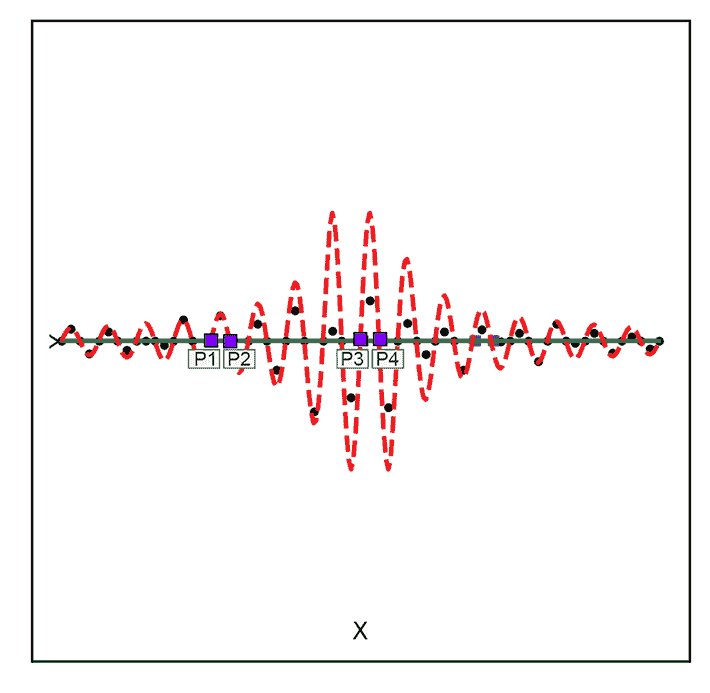

(a) 线性潜在空间


(b) 曲线潜在空间

图 14.6 从 2D 输入空间映射到 1D 潜在空间的两个示例。两者都显示了正则化（实线）与非正则化（虚线）的潜在空间流形。实心小圆表示训练数据点。

注意标记为*p*[1]、*p*[2]和*p*[3]、*p*[4]（正方形标记）的点对。在输入空间中，它们之间的距离大致相同。但当投影到虚线曲线（非正则化潜在空间）上时，它们的距离（沿曲线测量）变得相当不同。这是不希望的，并且在正则化潜在空间中不会发生（在这里，距离是沿实线测量的）。在高维情况下，这种情况变得更加明显。

包含训练数据集的锯齿形曲线段比平滑的曲线段更长。一个好的潜在流形通常有更少的扭曲和转弯（更平滑），因此在某种意义上“长度”是最小的。这让人想起了我们在第 9.3.1 节中讨论的最小描述符长度（MDL）原则。

我们如何确保选择最平滑的潜在空间，而不是其他也能最小化重建损失的潜在空间？通过在无处不在的重建损失之上添加额外的约束（损失）。回想一下我们在第 6.6.3 和 9.3 节中讨论的正则化概念。在那里，我们引入了一个显式的损失，它惩罚较长的解（这与最大化参数值的后验概率而不是似然性相当）。在本章中，我们探索的一个相关方法是，将潜在空间建模为属于已知家族（例如高斯）的概率分布，并最小化此估计分布与零均值单变量高斯分布之间的差异（KL 散度）。编码器-解码器神经网络对从头到尾训练以最小化一个损失，它是重建损失和此 KL 散度的加权总和。试图保持接近零均值单位方差高斯分布惩罚了从紧凑性和平滑性中偏离。这是变分自编码器（VAEs）的基本思想）。

正则化的总体效果是创建一个更紧凑的潜在空间。如果我们只最小化重建损失，系统可以通过将点映射得非常远（空间是无限的）来实现这一点。正则化对抗这种情况，并激励系统不要将训练点映射得太远。它试图限制对应于训练输入的点在潜在空间中占据的总体积。

## 14.7 变分自编码器

VAEs 是自编码器的一种特殊情况。它们具有相同的架构：一对神经网络分别对输入向量进行编码和解码。它们也有重建损失项。但它们还有一个额外的损失项，称为 KL 散度损失，我们将在下面简要解释。

注意：在本章中，我们用  表示潜在变量，用  表示输入变量。

### 14.7.1 VAEs 的几何概述

图 14.7 尝试提供 VAE 潜在空间建模的几何视图。在训练过程中，给定一个输入 ，编码器不会直接发出相应的潜在空间表示 。相反，编码器发出来自预先选择的分布族的一组参数。例如，如果预先选择的族是高斯分布，编码器会发出一对参数值 (), **Σ**()。这些是特定高斯分布 𝒩(; (), **Σ**()) 在潜在空间中的均值和协方差矩阵。与输入  对应的潜在空间表示  是通过采样编码器发出的这个分布获得的。因此，在高斯情况下，我们有  ∼ 𝒩(; (), **Σ**())。

注意：符号 ∼ 表示从分布中进行采样。


图 14.7 VAE 潜在空间建模分布的几何描述

这个分布，我们称之为输入  的 *潜在空间映射*，在图 14.7 中用带有深色边框的空心圆表示。这种映射称为 *随机映射*。

潜在空间映射分布应该具有狭窄的单峰概率密度函数（例如，方差很小的高斯分布：即小的||**Σ**||）。概率密度函数的狭窄峰度意味着样本点云形成一个紧密的小簇——从该分布中随机抽取的任何样本很可能接近均值。因此，从这样的分布中采样与从到 = ()的确定性映射没有太大区别。这种采样以获得潜在向量仅在训练期间进行。在推理期间，我们直接使用编码器发出的均值作为输入的潜在空间表示：即， = ()。

解码器将潜在向量表示映射回输入空间中的一个点，例如*x̃*。这是输入向量的重建版本（在图 14.7 中由一个带有黑色边框的小白方块表示）。因此，解码器是根据潜在向量估计（重建）输入的。

### 14.7.2 VAE 训练、损失和推理

训练包括以下步骤：

1.  为*q*( | )选择一个简单的分布族。高斯是一个流行的选择。

1.  每个输入映射到一个单独的分布。编码器神经网络发出该分布的参数。对于高斯情况，编码器发出*μ*()，Σ()。潜在向量是从该发出的分布中采样的。

1.  解码器神经网络以作为输入并发出重建输入*x̃*。

给定输入、重建输入和潜在向量，我们可以计算以下描述的重建损失和 KL 散度损失。训练过程的目的是迭代最小化这些损失。因此，变分自编码器（VAE）被训练以在每个输入批次上最小化以下两个损失项的加权总和。

+   *重建损失*——正如在自编码器中一样，在适当训练的 VAE 中，重建*x̃*应该接近原始输入。因此，重建损失是

    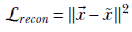

+   *KL 散度损失*—在变分自编码器（VAE）中，我们还有一个与编码器发出的分布与零均值单位方差高斯分布之间的 KL 散度成比例的损失项。KL 散度衡量了两个概率分布之间的差异，并在第 6.4 节中进行了详细讨论。在此，我们声明（根据方程 6.13），VAE 的 KL 散度损失为

    

    其中 *q*(|) 表示潜在空间映射概率分布，而 *p*() 是一个固定的目标分布。我们希望我们的潜在向量全局分布能够模仿目标分布。目标通常被选为紧凑分布，以便全局潜在向量分布也是紧凑的。

    预先选择的分布族中流行的选择是高斯分布，而对于固定分布则是零均值单位协方差矩阵的高斯分布：

    

    应该注意的是，对于上述先验选择，我们可以通过第 14.7.7 节中描述的闭式公式来评估 KLD 损失。

    最小化ℒ*[kld]*实际上要求 *q*(|) 很高——即接近一——在 *p*() 很高的  值处（参见图 14.8），因为那时它们的比率接近一，对数接近零。在 *q*(|) 很低（接近零）的地方的 *p*() 的值并不重要，因为 *q*(|) 作为ℒ*[kld]*中的一个因子出现——这些项对损失的贡献无论如何都接近零。

    因此，KL 损失本质上试图确保 *q*(|）的大多数样本点云落在 *p*(）样本点云的密集区域。从几何上看，这意味着黑色边界的细小空心圆云与目标分布有大量的重叠质量。如果每个训练数据点都像这样，潜在向量整体全局云也将与目标分布有显著的重叠。由于目标分布通常选择为紧凑型，这反过来又确保了整体潜在向量分布（图 14.7 中的深色填充圆圈）是紧凑的。例如，当目标分布是零均值的单位协方差矩阵高斯𝒩(; , **I**）时，潜在向量的大部分质量都包含在单位半径球内。如果没有 KL 散度项，潜在向量将在潜在空间中扩散。简而言之，KL 损失 *正则化潜在空间*。

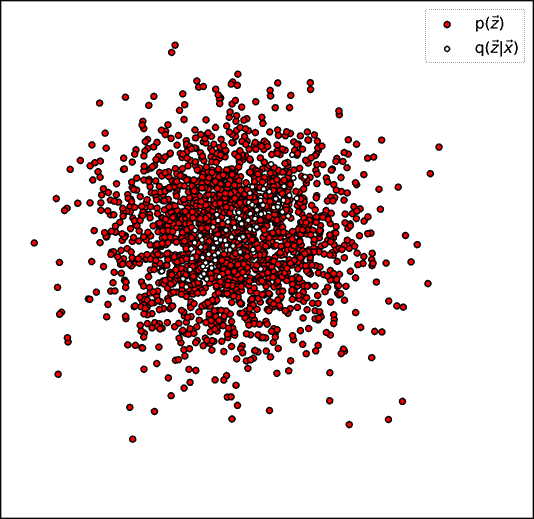

(a) 低 KL 散度损失（高 *q*(|）与高 *p*(）相一致


(b) 高 KL 散度损失（高 *q*(|）与低 *p*(）相一致

图 14.8 展示了编码器生成的分布（𝒩(; (), **Σ**())）与目标分布 *p*(）（此处 *p*() ≡ 𝒩(; , **I**)）或，等价地，它们之间低的 KL 散度。

神经网络的编码器-解码器对是端到端训练以最小化重建损失和 KL 损失的加权总和。特别是，编码器学习发出 *q*(|）分布的参数。

在推理过程中，只使用编码器。编码器接收输入  并输出 () 和 **Σ**()。我们在这里不进行采样。相反，我们直接使用均值作为输入的潜在空间表示。

注意到每个输入点  映射到一个单独的高斯分布 *q*(| = *N*(; (), ∑()). 所有这些共同建模的总体分布 *p*() 可以非常复杂。然而，这种复杂性并不影响我们的计算，我们的计算只涉及 *q*(*z*|*x*) 和 *p*(*z*)。这正是这种方法强大的原因。

### 14.7.3 VAEs 和贝叶斯定理

在训练过程中，编码器神经网络随机地将特定的输入数据实例，输入空间中的一个点 ，映射到潜在空间中的点  ~ 𝒩(; (), **∑**()). 因此，潜在空间映射有效地建模了后验概率 *p*(|)。请注意，我们使用符号 *q*(|) 来表示编码器实际发出的分布，而使用符号 *p*(|) 来表示真正的（未知的）后验概率分布。当然，我们希望这两个分布尽可能接近：也就是说，我们希望它们之间的 KL 散度最小。在本节的后面部分，我们将看到如何最小化 *q*(|) 和 *p*(|) 之间的 KL 散度，从而得到整个 VAE 算法。

解码器将潜在空间中的这个点 () 映射回输入空间中的点 *x̃*。因此，它建模了概率分布 *p*(|)。

潜在向量  的全局分布有效地建模了 *p*()（如图 14.7 中用深色阴影填充的小圆圈所示）。这些概率通过我们熟悉的老朋友，贝叶斯定理相连接：


### 14.7.4 随机映射导致潜在空间平滑

从狭窄分布中采样编码器的输出与确定性映射相似，但又不完全相同。它相对于直接编码有一个相当意外的优势。每次在训练过程中遇到特定的输入点时，都会将其映射到潜在空间中的不同点——所有这些点都必须解码回输入空间中的相同区域。这强制潜在空间具有整体平滑性：附近的  值都对应于附近的  值。

### 14.7.5 直接最小化后验概率需要非常昂贵的归一化

第 14.7.3 节中 VAE 的贝叶斯定理表达式给我们一个想法。为什么不训练神经网络直接最大化后验概率 *p*(|)，其中 *X* 表示训练数据集？这从理论上来说是合理的；我们选择的是给定训练数据后验概率最大的潜在空间。当然，我们必须一次优化一个批次，就像我们总是用神经网络做的那样。

我们如何评估后验概率？公式如下：

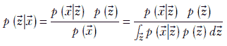

分母包含对所有值  的求和。记住，每次迭代时，神经网络权重都会改变，所有之前计算出的潜在向量都变得无效。这意味着我们必须在每次迭代中重新计算所有潜在向量，这是不可行的。每次迭代的复杂度是 𝒪(*n*)，每个 epoch 的复杂度是 𝒪(*n*²)，其中 *n* 是训练数据实例的数量（可能是数百万）。我们必须寻找其他方法。这带我们来到了 *证据下界* (ELBO) 类型的解决方案。

### 14.7.6 ELBO 和 VAEs

我们不知道真实的概率分布 *p*(|)。让我们尝试学习一个尽可能接近 *p*(|) 的近似概率分布 *q*(|)。换句话说，我们希望最小化两者之间的 KL 散度（KL 散度在第 6.4 节中介绍）。这个 KL 散度是


我们可以将其展开为

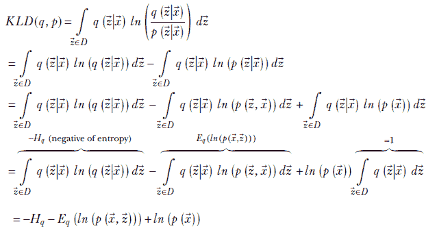

其中 *D* 是  的域：即潜在空间，*H[q]* 是概率分布的熵（熵在第 6.2 节中介绍），*E[q]*(*ln*(*p*(, ))) 是在概率密度 *q*(|) 下 *ln*(*p*(, )) 的期望值。重新排列项，我们得到

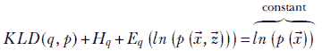

其中，右侧是常数，因为它属于数据的属性，在优化过程中不能调整。将证据下界（ELBO）定义为

*ELBO* = *H[q]* + *E[q]*(*ln*(*p*(, )))

我们得到

*KLD*(*q*, *p*) + *ELBO* = *常数*

因此，*最小化* *p*(|) 和其近似 *q*(|) 之间的 KL 散度相当于*最大化* ELBO。我们很快就会看到这导致了一种优化变分自编码器的方法。

ELBO 名称的意义

我们为什么称之为*证据下界*？嗯，答案隐藏在关系 *KLD*(*q*, *p*) + *ELBO* = *ln*(*p*()) 中。右侧是证据对数似然。记住，KL 散度始终是非负的。所以，当 KL 散度为零时，*ln*(*p*()) = *ELBO*。这意味着证据对数似然不能低于 ELBO 值。因此，ELBO 是证据对数似然的下界；简而言之，它就是证据下界。

ELBO 的物理意义

让我们看看 ELBO 优化的物理意义：

*ELBO* = *H[q]* + *E[q]*(*ln*(*p*(, )))

第一项是熵。正如我们在第 6.2 节中看到的，这是分布扩散程度的度量。如果点在分布中均匀分布——概率密度平坦，没有高峰值——熵就高。当分布有少数高峰值和低值时，熵就低（记住，对于概率密度，高峰值意味着其他地方的低值，因为函数下的总体积是常数：一个）。因此，最大化 ELBO 意味着我们正在寻找一个扩散的分布 *q*(|)。这反过来又鼓励潜在空间中的平滑性，因为我们实际上是在说一个输入点  可以以几乎相等的概率映射到均值 ()（由编码器发出）周围的任何点。请注意，这与每个输入应映射到潜在空间中唯一点的概念有些冲突。解决方案试图在这两种冲突的要求之间进行优化。

另一个术语——在概率密度 *q*(|) 下对联合密度 *p*(, ) 的对数的期望——实际上衡量了这两个之间的重叠程度。最大化它等同于说 *q*(|) 必须在 *p*(, ) 高的地方也高。这从直觉上看似乎是正确的。联合密度 *p*(, ) = *p*(|)*p*()。它在后验 *p*(|) 和先验 *p*() 都高的时候高。如果 *q*(|) 近似后验，那么它应该在联合密度高的地方也高。

让我们继续探索 ELBO。随着 VAE 优化的算法的出现，将出现更多的物理意义：

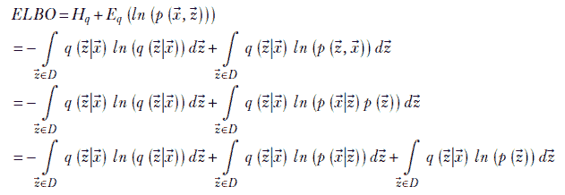

重新排列项并简化

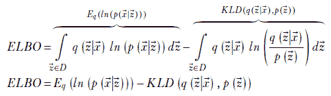

最后的表达式提供了更多的物理解释，并导致了 VAE 算法。让我们详细检查最终 ELBO 表达式中最后的两个项。第一个项是 *E[q]*(*ln*(*p*(|))). 当在相同的  值上 *q*(|) 和 *p*(|) 都高时，这个值是高的。对于给定的 ，*q*(|) 在那些可能是输入  的编码输出（即，潜在表示）的  值上是高的。在这些相同的  位置上高 *p*(|) 意味着从这些  位置解码回相同的  值的概率很高。因此，这个项基本上是说如果  以高概率 *编码* 到 ，那么  也应该以高概率 *解码* 回 。换句话说，从输入到潜在空间再到输入空间的往返不应该使我们远离原始输入。在图 14.7 中，这意味着标记为  的输入点靠近标记为  的输出点。换句话说，*最小化重建损失导致 ELBO 最大化*。

现在考虑第二个项。它带有一个负号。最大化这个项等价于最小化*q*(|)和*p*()之间的 KL 散度。这是正则化项。从另一个角度来看，这是我们将对潜在空间基本组织结构的信念注入系统的项。记住，KL 散度*KLD*(*q*(|), *p*())对*q*(|)的小值贡献很少。它主要由*q*(|)的大值主导。从图 14.7 的角度来看，最小化这个 KL 散度基本上确保了大多数空心圆圈落在充满圆圈的高密度区域内。

因此，总的来说，最大化 ELBO 等价于最小化重建损失，并通过最小化从特定先验分布的 KL 散度来实现正则化。这就是我们在 VAEs 中做的事情。在每一次迭代中，我们最小化重建损失（就像在普通的 AE 中一样）以及最小化与已知（或猜测的）先验的散度。请注意，这并不要求我们每次迭代都编码所有训练输入。这种方法是**增量式**的——一次一个输入或输入批次——就像任何其他神经网络的优化一样。此外，尽管我们最初是从寻找对*p*(|)的近似开始的，但最终的表达式中并没有这一点。只有一个先验*p*()，我们可以使用一些合适的固定分布。

### 14.7.7 先验选择：零均值、单位协方差高斯分布

对于已知的先验，流行的选择是零均值、单位协方差矩阵高斯分布，𝒩(, **I**)，其中 I 是*d* × *d*的单位矩阵，*d*是潜在空间的维度，是所有零的*d* × 1 向量。请注意，最小化从𝒩(, **I**)的 KL 散度等价于将大部分质量限制在单位球（以原点为中心，半径为 1 的超球体）内。换句话说，这个 KL 散度项限制了潜在向量不要扩散到ℜ*[d]*上，而主要保持在单位球内。记住，一个紧凑的潜在向量集在某种意义上对应于输入向量的最简单（最小描述符长度）表示：也就是说，正则化后的潜在空间（第 14.6 节）。

高斯分布的 KL 散度有一个封闭形式的表达式，我们在第 6.4.1 节中推导。我们首先重复方程 6.14 以获得两个高斯分布之间的 KL 散度，然后得到一个特殊情况的公式，其中一个高斯分布是零均值、单位协方差高斯分布：

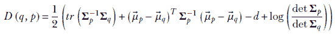

方程 14.1

其中运算符 *tr* 表示矩阵的迹（对角线元素之和），运算符 *det* 表示行列式。根据假设，*p*() = 𝒩(, **I**)：也就是说，*[p]* =  和 **Σ***[p]* = **I**。因此，


在这一点上，我们引入另一个简化的假设：*协方差矩阵 **Σ***[q]* 是一个对角矩阵*。这意味着矩阵可以紧凑地表示为

**Σ***[q]* = *[q]*

其中 *[q]* 包含主对角线上的元素，并且我们没有在非对角线元素中重复表达零。请注意，这不是一个离奇的假设。我们正在用轴不相关的高斯 *q*(|) 来近似 *p*(|)。

由于这个假设，

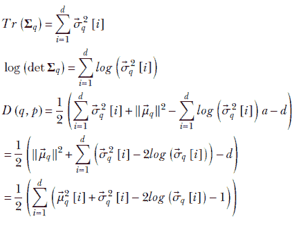

很容易看出，表达式 (*[q]*²[*i*] − 2*log*(*[q]*[*i*])) 在 *[q]*[*i*] = 1 时达到最小值。因此，总的来说，当均值在原点且方差均为 1 时，与零均值、单位协方差高斯分布的 KL 散度最小化。这相当于最小化了以原点为中心、半径为 1 的球外的潜在向量的分散程度。

另一个先验的选择是具有与已知类别数量一样多的组件的高斯混合模型。我们在这里不讨论这个。

### 14.7.8 重参数化技巧

我们到目前为止已经避免讨论一个棘手的问题。我们说在 VAEs 中，编码器发出概率密度函数 *p*(|) 的均值和方差，从这个概率密度函数中我们 *采样* 编码器的输出。然而，有一个问题。编码器-解码器对是神经网络，通过反向传播进行学习。这是基于微分的。采样是不可微分的。我们如何处理这个问题？

我们可以使用一个巧妙的方法：所谓的 *重参数化技巧*。让我们首先在单变量情况下解释它。从高斯分布 𝒩(*μ*, *σ*) 中采样可以看作是以下两个步骤的组合：

1.  从 *x* 中随机抽取一个样本，来自 𝒩(0,1)。请注意，这里没有可学习的参数；这是一个来自常数密度函数的样本。

1.  将样本（添加*μ*）缩放（乘以*σ*）。

这实际上将采样部分从反向传播路径中移除。编码器发出*μ*和*σ*，这些是我们学习的可微分实体。采样是从一个常数密度函数中单独进行的。

这个想法可以扩展到多元高斯。从𝒩(, **Σ**)中抽取样本可以分解为从𝒩(, **I**)中抽取样本，并通过乘以矩阵Σ和通过进行平移来缩放向量。因此，我们有一个可以通过反向传播学习的多元编码器。

注意：完整的 VAE 代码，可通过 Jupyter Notebook 执行，可以在[`mng.bz/5QYD`](http://mng.bz/5QYD)找到。

列表 14.5 PyTorch- 重参数化技巧

```py
def reparameterize(mu, log_var):
        std = torch.exp(0.5 * log_var) ①

        eps = torch.randn_like(std)    ②

        return mu + eps * std          ③
```

① 将对数方差转换为标准差

② 从𝒩(, **I**)中抽取样本

③ 通过乘以Σ进行缩放，并通过进行平移

列表 14.6 PyTorch- VAE

```py
from torch import nn
nz = 10
input_image_size = (1, 32, 32)            ①
conv_encoder = nn.Sequential(
            nn.Conv2d(in_channels, 32, kernel_size=3, stride=1, padding=1),
            nn.BatchNorm2d(32),
            nn.ReLU(),
            nn.MaxPool2d(kernel_size=2),  ②
            nn.Conv2d(32, 128, kernel_size=3, stride=1, padding=1),
            nn.BatchNorm2d(128),
            nn.ReLU(),
            nn.MaxPool2d(kernel_size=2),  ③
            nn.Conv2d(128, 256, kernel_size=3, stride=1, padding=1),
            nn.BatchNorm2d(256),
            nn.ReLU(),
            nn.MaxPool2d(kernel_size=2),  ④

            nn.Flatten()                  ⑤
        )
mu_fc = nn.Linear(4096, nz)               ⑥
logvar_fc = nn.Linear(4096, nz)           ⑦
```

① 以(c, h, w)格式输入图像大小

② 减少到 32, 16, 16 大小的张量

③ 减少到 128, 8, 8 大小的张量

④ 减少到 256, 4, 4 大小的张量

⑤ 展平为 4096 大小的张量

⑥ 将 4096 大小的张量减少到 nz 大小的*μ*张量

⑦ 将 4096 大小的张量减少到 nz 大小的*log*(*σ*²)张量

列表 14.7 PyTorch- VAE 解码器

```py
from torch import nn
decoder = nn.Sequential(
            nn.ConvTranspose2d(self.nz, out_channels=256,
             kernel_size=4, stride=1,
             padding=0, bias=False),            ①
            nn.BatchNorm2d(256),
            nn.ReLU(True),
            nn.ConvTranspose2d(256, 128, kernel_size=2,
              stride=2, padding=0, bias=False), ②
            nn.BatchNorm2d(128),
            nn.ReLU(True),
            nn.ConvTranspose2d(128, 32, kernel_size=2,
              stride=2, padding=0, bias=False), ③
            nn.BatchNorm2d(32),
            nn.ReLU(True),
            nn.ConvTranspose2d(32, in_channels, kernel_size=2,
              stride=2, padding=0, bias=False), ④
            nn.Sigmoid()
        )
```

① 将(nz, 1, 1)转换为 256, 4, 4 大小的张量

② 增加到 128, 8, 8 大小的张量

③ 增加到 32, 16, 16 大小的张量

④ 增加到 1, 32, 32 大小的张量

列表 14.8 PyTorch- VAE 损失

```py
recon_loss = F.binary_cross_entropy(Xr, X,
                     reduction="sum")                     ①

kld_loss = -0.5 * torch.sum(1 + log_var
                             - mu.pow(2) - log_var.exp()) ②

total_loss = recon_loss + beta * kld_loss                 ③
```

① 二元交叉熵损失

② *KLD*(*q*(|), *p*()) 其中 ~ 𝒩(, **I**)

③ 计算总损失

列表 14.9 PyTorch- VAE 训练

```py
conv_out = conv_encoder(X)                ①

mu = mu_fc(conv_out)                      ②
log_var = logvar_fc(conv_out)             ③

z = reparameterize(mu, log_var)           ④

Xr = self.decoder(z)                      ⑤

total_loss = recon_loss + beta * kld_loss ⑥
```

① 将输入图像通过卷积编码器传递

② 计算一个 nz 维度的*μ*张量

③ 计算一个 nz 维度的张量*log*(*σ*²)

④ 通过重参数化技巧抽取*z*

⑤ 通过解码器使用 z 重建图像

⑥ 计算总损失

自动编码器与 VAE

让我们回顾一下熟悉的 MNIST 数字数据集。它包含一个包含 60,000 个图像的训练集和一个包含 10,000 个图像的测试集。每个图像大小为 28 × 28，包含单个数字的中心裁剪。

之前，我们使用这个数据集进行分类。这里，我们以无监督的方式进行：在训练/测试期间忽略标签。我们在这个数据集上从头到尾训练自动编码器和 VAE，并查看结果（见图 14.9 和 14.10)。

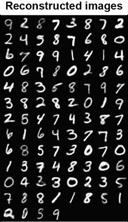

(a) 自动编码器重建图像


(b) VAE 重建图像

图 14.9 比较自编码器和端到端训练的 VAE 在测试集上重建的图像。自编码器和 VAE 在从测试集重建图像方面做得相当不错。

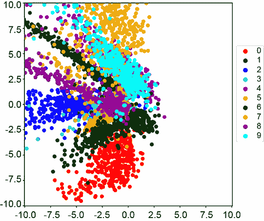

(a) 自编码器潜在空间 nz=2)


(b) VAE 潜在空间 (nz=2)

图 14.10 自编码器和 VAE 学习到的潜在空间之间的差异。我们在 MNIST 上使用*nz* = 2 训练自编码器和 VAE，并绘制测试集的潜在空间。自编码器仅最小化重建损失，因此只要重建损失低，任何潜在空间都是可接受的。正如预期的那样，学习到的潜在空间是稀疏的，并且具有非常高的分散度。相比之下，VAE 通过正则化最小化重建损失。这是通过最小化学习到的潜在空间与已知先验分布 𝒩(, **I**) 之间的 KL 散度来实现的。添加这个正则化项确保潜在空间被约束在单位球内。这可以在图 14.10b 中看到，其中学习到的潜在空间要紧凑得多。

自编码器被训练以最小化输入图像和重建图像之间的 MSE。潜在空间没有其他限制。

VAE 被训练以最大化 ELBO。正如我们在上一节中看到的，我们可以通过以最小化 KL 散度的形式进行正则化来最大化 ELBO，即 VAE 的情况下的 𝒩(, **I**)。因此，网络被激励确保学习到的潜在空间被约束在单位球内。

一个需要注意的微小实现细节是我们使用二元交叉熵而不是 MSE 来训练 VAE。在实践中，这导致更好的收敛。

## 摘要

+   在潜在空间建模中，我们将输入数据点映射到一个低维潜在空间。潜在空间通常是包含具有共同感兴趣属性的点的流形。感兴趣的属性可以是属于特定类别，例如所有由莎士比亚写的段落。潜在向量是输入数据的更简单、更紧凑的表示，其中只保留与感兴趣属性相关的信息，其他信息被消除。

+   在潜在空间建模中，所有训练数据输入都满足感兴趣的属性。例如，我们可以在莎士比亚写的段落上训练一个潜在空间模型。然后，学习到的流形包含对应于各种类似莎士比亚段落的点。远离流形的点不太像莎士比亚。通过检查这个距离，我们可以估计一个段落被莎士比亚写的概率。通过采样概率分布，我们甚至可能能够生成伪莎士比亚段落。

+   从几何角度来说，我们将输入点投影到流形上。PCA 执行一种特殊的潜在空间建模，其中流形是训练数据的最佳拟合超平面。

+   自编码器可以执行比 PCA 更强大的降维。自编码器由一个编码器（E），它将输入数据点映射到低维空间，和一个解码器（D），它将低维表示映射回输入空间。它被训练以最小化重建损失：即输入和重建（编码后解码）向量之间的距离。

+   变分自编码器（VAEs）将潜在空间建模为概率分布，以施加额外的约束（超过重建损失），这样我们就可以生成更正则化的潜在空间。

    +   在 VAEs 中，编码器通过一个随机过程（而不是确定性过程）将输入映射到潜在表示。它发出 *p*(|)，而不是直接发出 。 通过从 *p*(|) 中采样获得。解码器将潜在空间中的一个点  映射回输入空间。它也被建模为概率分布 *p*(|)。

    +   VAE 学习到的潜在空间比自编码器学习到的潜在空间更紧凑、更平滑（因此更受欢迎）。
