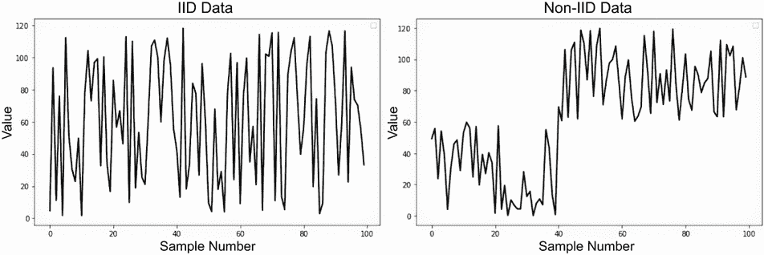
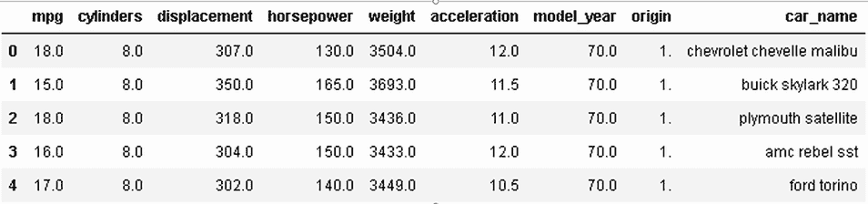
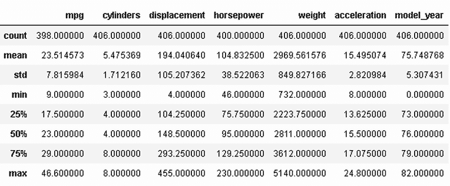
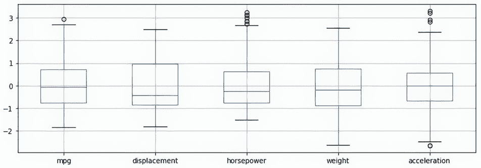
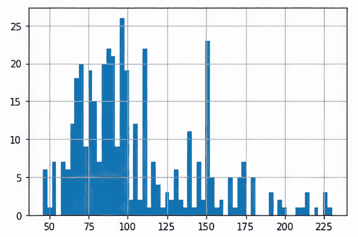
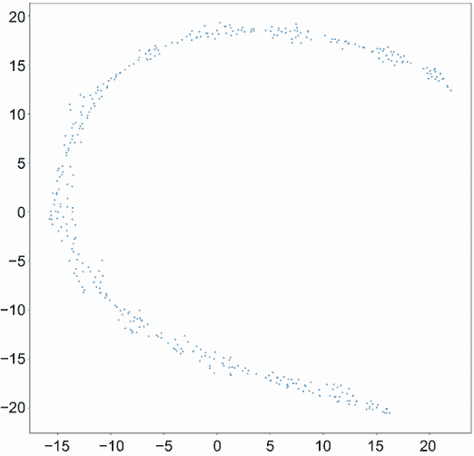

# 2 探索表格数据集

本章涵盖

+   表格数据集中的行和列特征

+   表格数据集的可能病理和补救措施

+   在互联网上和机构内部寻找表格数据

+   探索数据以解决表格数据中的常见问题

表格数据可能包含几乎所有内容——从低级科学研究到网站上的消费者行为，再到你幻想体育联盟中的统计数据。然而，最终，表格数据中的共性胜过差异，你只需应用标准方法和工具，即使没有太多的领域专业知识，也能完成大部分数据分析工作。

在本章中，我们将探讨如何收集和准备表格数据集。我们还将进行一项实际的数据分析探索，展示你可以采取的步骤来从不同的视角查看数据：按行、按列、在特征之间关系的背景下，以及考虑它们在数据集中的整体分布。为此示例，我们将使用一个简单的玩具数据集，即汽车燃油效率数据集（Auto MPG Data Set），这是一个在 UCI 机器学习网站上免费可用的数据集（[`archive.ics.uci.edu/dataset/9/auto+mpg`](https://archive.ics.uci.edu/dataset/9/auto+mpg)）。

## 2.1 行和列特征

根据领域不同，你会在表格数据中发现多么丰富的多样性，这真是令人难以置信。这是因为表格数据在数据世界中是规则而非例外，这种情况从一开始就是如此。数千年来，表格数据被收集到表格和记录中，从古埃及的谷物会计到中世纪欧洲的教区出生、婚礼和死亡记录，一直到我们现代国家的官僚机构。直到 20 世纪 60 年代，我们才开始在计算机化的数据库中收集数据，这给“表格”这个词赋予了更多的电子含义。自 20 世纪 70 年代以来，关系数据库的广泛应用普及了表格数据，使其无处不在，并用于各种可能的应用。在关系数据库中，可以通过作为连接键的特定列的值来组合数据表。这种创新使得计算机能够在更少的磁盘空间中存储更多信息，保证了技术的成功和广泛传播。

你可以查看公开数据存储库或数据科学竞赛，例如 Kaggle，它通常会举办表格数据竞赛，以给你一个关于当前表格数据多样性的概念。例如，在过去的两年中，Kaggle 组织了表格游乐场系列赛（[`mng.bz/pK2z`](https://mng.bz/pK2z)），这是一系列受最常见的机器学习问题启发的竞赛，这些问题涉及表格数据集和由生成式 AI 设计的合成数据，我们将在本章后面进一步讨论。尽管表格游乐场竞赛使用生成数据，但它们从中汲取灵感的例子和原始数据是从现实世界的例子中精选出来的，例如

+   保险索赔的概率和金额

+   银行领域的贷款违约

+   产品测试

+   电子商务销售

+   环境传感器数据

+   生物和基因组数据

+   生态测量

然而，尽管有各种各样的现实应用和潜在的知识领域，每个表格数据集都共享相同的结构，即行和列的矩阵，其中包含数值、时间和日期以及文本形式的数据。这适用于所有表格数据集，无论它们的特征如何。虽然领域知识对于设计预测算法的最佳特征工程至关重要，但表格数据的基本结构在所有领域都是一致的。这种普遍性证明了编写关于表格数据书籍的必要性，因为示例和技术可以轻松地在领域之间转移。

深入细节，在一个数据表中，也称为数据集，你有值行，每一行代表你的分析单位，在统计学上，这可以称为统计单位或观察。例如，如果你正在分析 DNA 样本，那么你表中的每一行代表一个样本。如果你正在分析工业产品，每一行将代表一个产品。原则是相同的，而所代表单位的性质可以显著不同。

### 2.1.1 表格行的理想标准

在表格数据集中，你需要记住的唯一限制是，除非你正在处理时间预测（时间序列分析）或其他与时间相关的问题，否则示例应该是独立的。这就是你可能之前听说过的 IID 原则。IID 是“独立且同分布”的缩写，意味着你的样本应该是独立抽取的，其中每一次抽取都不影响或携带后续抽取的信息。同样，这意味着你总是以相同的方式从相同的数据分布中抽取。

让我们考虑一个简单的 IID 例子：抛硬币。每次我们抛硬币，结果都与所有之前的抛掷无关，每次抛掷得到正面或反面的概率都是相同的。换句话说，硬币抛掷是同分布的，根据伯努利分布。如果我们通过反复抛掷同一枚硬币来生成数据集，那么得到的数据将是 IID。同分布的性质允许我们简化数据的建模和分析。例如，它允许我们在创建交叉验证折时随机采样数据。它允许我们假设预测算法不会记住并复制呈现的数据的顺序。非 IID 的典型例子包括来自多个商店的销售数据，其中同一商店的销售往往高度相关，并且不一定与其他商店的动态相关，或者学校调查数据，由于共同的兴趣或经验，每个班级都表现出相似的特征，这会将非 IID 特征引入数据中。在这些情况下，数据表现出与独立同分布假设相偏离的独特特征，因为样本来自特定的群体（商店或学校班级），但在数据分层组织时，当你处理重复测量时（基本上是多次以不同但相关的方式测量相同的例子），或者当存在任何时间依赖性时，例如典型的时间序列，其中非 IID 不是一个问题。

在图 2.1 中，我们比较了在将分布作为绘制的序列进行比较时，非 IID 和 IID 情况如何不同。你可以在左面板上观察到 IID 行为：它基于随机组合骰子滚动和抛硬币。在右面板上，你可以检查非 IID 行为：只需注意在一定的样本数之后出现的跳跃，这表明在生成分布或采样其值的方式上发生了变化。



图 2.1 IID 和非 IID 数据序列的比较。左图显示了 IID 数据，而右图说明了非 IID 数据，突出了序列相关性模式。

即使我们对从其抽取的分布的细节一无所知，这可以安全地想象为某种未知过程的结果，为了得到独立同分布（IID）数据，我们始终应该选择彼此无关的例子，以及我们认为来自相同情境或过程的例子。非独立同分布（Non-IID）数据可以以不同的方式影响你的分析。特别是，它可能会影响

+   *重采样（Bootstrapping）*，即从样本中重复采样，直到我们获得与原始样本相同大小的新样本，以及*子采样（subsampling）*，即从样本中无重复地采样，直到获得所需大小的新样本。这两种采样过程都会受到影响，因为你可能会过度采样或扭曲某些数据信号，依赖结构也会被打乱。我们将在第四章讨论的一些学习算法中再次回到这样的采样过程，因为这些算法使用了重采样或子采样。

+   *你的模型是如何学习的*，因为它可能会选择在预测时间无用的样本之间的不必要关系，当测试样本与训练样本不同且与它们无关时。例如，所有基于随机梯度下降（SGD）和迷你批梯度下降的学习算法，包括深度学习，都会受到你向算法展示样本顺序的影响。考虑一下非独立同分布数据，它具有内在的、隐藏的顺序，可能会如何影响类似算法的结果。

+   *交叉验证（Cross-validation）*，这是验证你的机器学习模型的最有效测试方法，当数据是非独立同分布时，可能会提供夸大的估计，因为你的算法可能会学会根据它们在训练集中的特定关系来聚类案例。

可以通过分析数据生成过程和探索来检测非独立同分布的数据。

+   在非独立同分布（non-IID）数据中，每个样本很可能与同一数据集中至少另一个样本存在某种形式的关联。这种情况通常发生是因为你在思考分析不同的单元，但实际上这些单元是相同的。例如，在医学分析中，你可能正在分析多个医疗记录，并认为你的分析单元是这些记录本身，它们是不同的。实际上，你正在分析来自同一患者在不同时间的健康数据：实际的分析单元应该是患者，而不是记录。安德鲁·吴教授的团队也遇到了一个非常类似的情况（详情见[`mng.bz/OBGE`](https://mng.bz/OBGE)），当他们准备一篇论文的数据时，使用了来自 30,000 名患者的 10 万张 X 光片的数据集，在分割数据以分离训练集和测试集时，他们没有考虑到同一患者的 X 光片可能会同时出现在训练集和测试集中，从而夸大了所有结果并扭曲了从分析中得出的所有见解。

+   您数据中的度量代表异质分布。这种情况通常随着时间推移及其在多个层面上反映出的变化而发生。例如，在分析不同公司的资产负债表时，重要的是要注意，即使公司不同，如果它们来自不同的年份，它们可能不代表相同的分布。这是因为宏观经济状况是可变的，并且随着时间的推移可以改变公司及其行业的特征（即您想要表示的分布的特征）。

由于每次分析都是基于一些预期的分布假设，因此数据是独立同分布（IID）对于统计和回归分析中的正确估计至关重要。在机器学习中，即使方法是数据驱动和非参数的，但强烈建议使用 IID 数据，尽管在实践中，在现实世界的数据集中几乎找不到。机器学习算法的一个基本限制是它们知道特征与目标之间的关系，但无法找出行与行之间的关系。机器学习算法是列感知但不是行感知的。因此，有必要充分提供补充特征以支持机器学习算法的工作。因此，如果两个特征相关，算法将期望这种相关性源于它们之间的关系，而不是其他特征的干扰，不是由于时间或由于影响抽样的另一个隐藏特征。换句话说，当数据不是 IID 时，学习算法将根据时间或样本之间的关系学习模式，就像它们是某种基于特征的关系一样。

时间序列和代表随时间推移的现象的任何类型的纵向数据通常不是 IID。在时间序列中，每个观测值都是自相关的，这意味着每个目标值都与前一个值以及可以解释目标的特征（在统计学中称为协变量）相关。鉴于您的业务数据问题和您收集或组装数据的方式，您必须了解时间如何影响您的观测值，并尝试使用基于时间的特征来控制其影响。多亏了基于时间的特征，您的模型可以确定时间如何影响其他特征和您的目标值。通常，一个时间特征和基于时间的时间滞后特征将解决这种情况。本质上，您在这里可以有两种情况：

+   每一行都有一个日期或时间间隔。您可以使用它作为特征，经过适当的转换后——例如，将日期转换为 Unix 时间，一个连续的数值特征。在这种情况下，您正在进行时间序列分析，需要使用适当的时间序列交叉验证策略。

+   你将涉及不同时间的多行数据旋转，创建基于时间的特征。例如，你可以有特征在不同时间点的值，并为这样的每个时刻创建一个单独的特征（例如，sales_month_1、sales_month_2 等）。在这种情况下，你只是回到了具有 IID 数据的情况，可以继续分析而无需更多的正式性。

横截面数据，通常以表格形式呈现，即使是从同一时期抽取，也可能不是自然独立的同分布（IID）。这是因为分析单元之间的相互作用以及它们在特定群体中的成员资格可能会在观测值之间产生微妙的依赖关系，通常称为“信息泄露”。这种泄露可能导致在训练过程中，从特征到目标的不预期的预测信息传输，并且在预测时，当表示的情况不同时，可能不会以相同的方式工作。为了解决这个问题，有必要创建显式捕捉行之间不同成员资格及其关系的特征。例如，如果你正在处理来自不同公司的数据，未能提供关于它们的起源国或运营以及它们所属行业的信息，可能会为你的机器学习算法造成泄露，该算法可能会学习并利用数据中隐含的顺序，而这种顺序在预测时是不可复制的。此外，即使你可以在训练数据中为示例贴上正确的标签，如果你不能在测试数据中复制同样的情况，那么在交叉验证中隔离群体就很重要，以确保每个群体只出现在训练或验证折中。未能这样做可能会导致预测交叉验证估计值膨胀，因为机器学习算法可以利用组内的自相关性。

当使用横截面数据比较不同的时间段时，即使单元和群体之间的相互作用不存在，数据也可能不是独立的。在这种情况下，观测值的顺序很重要，我们需要考虑观测值之间的时序依赖关系。这意味着数据是非 IID 的，通常的独立性假设可能不成立。为了处理这种情况，我们可以使用时序模型来处理观测值之间的时序依赖关系。时序模型认为在不同时间点进行的观测值很可能是相关的，并且它们可以利用这种相关性来做出更好的预测。使用适当的时间序列模型和技术，我们可以在处理非 IID 数据时获得准确的预测。

作为关于如何从行角度准备你的数据的最后一条一般性建议，考虑以下内容：

+   验证时间如何影响你的数据。考虑在分析中使用时间特征并对时间进行建模，使用滞后和移动平均，如时间序列分析中通常所做的那样，以控制仅由时间引起的变化。

+   注意你在行中代表的内容，因为组和它们之间的关系可能会影响你的模型在训练、验证和测试中的结果。

+   如果你的数据中存在隐藏的组，请在特征中明确表示任何分组变量。

+   在交叉验证中，如果你的数据包含组，则优先选择组交叉验证，这样它们就不会在训练和验证折之间分割（[`mng.bz/YDgA`](https://mng.bz/YDgA)）。

+   如果时间是你的模型中的一个决定因素，请使用基于时间的验证（[`mng.bz/GeGO`](https://mng.bz/GeGO)）。

在下一节中，我们将讨论应该表征表格列的理想标准以及每种数据类型在数据处理方面的含义。

### 2.1.2 表格列的理想标准

如果按行排列的案例采样存在一些挑战，请记住它位于你的数据表列中，这些列也称为特征，其中大部分信息都驻留于此，并且你接下来应该集中注意力的地方。一列的特点是携带与其所代表的行相关的同质信息。例如，如果你正在构建一个房地产评估数据集，并且你的行代表房屋，则列可能与房屋的面积相关（即，由最近的销售价格表示的平方米和市场评估）。由于同质性，你可以预期这些列将只携带它们指定的信息。例如，你不应该在面积列中找到销售价格或其他信息。此外，你还应预期列值与每一行所代表的单位唯一相关。

然而，在深入研究适合处理行和列的数组的结构之前，你需要首先识别可以填充列的五种数据类型以及处理每种类型的最佳方式（见表 2.1）。

表 2.1 表格数据集中的数据类型

| 类型 | 描述 |
| --- | --- |
| 数值特征 | 用于计数数据的整数，例如按日列举产品的销售额：[105, 122, 91, … 124]用于测量的浮点数，例如按日列举产品的销售额：[1000.50, 1230.00, 950.80, …, 1200.00 ] |
| 序数特征 | 用于排名或有序级别的整数（或无小数的浮点数）：[0, 1, 2, 3, …, 999]有时序数特征可以用字符串表达，并带有某种有序效果，例如使用类似 Likert 的同意或偏好量表：[“强烈不同意”，“不同意”，“既不同意也不反对”，“同意”，“强烈同意”] |
| 低级分类特征 | 由于它们表达了一种质量，它们可以是字符串（称为“标签”）或与原始标签关联的整数；在这种情况下，你有一个转换字典可用：{0: “红色”，1:”绿色”，2: “蓝色”} |
| 高级分类特征 | 与低级分类特征相同，但具有大量标签（例如，美国区号或邮政编码：[`postal-codes.net/united-states`](https://postal-codes.net/united-states)） |
| 日期 | 它们可以是字符串，也可以是已经编码在数据格式中的，例如“2022-03-04”、“Feb 15, 1957 11:45 PM”或“6/12/2022”（存在许多日期标准和惯例） |

了解每一种都是构建数据集和正确处理数据以便输入机器学习算法的基本步骤。每种算法都需要对每种类型的数据进行特殊准备，以便其最佳理解和后续的预测性能。

当你的数据以浮点数或表示某些值计数的整数表示时，你就有*数值特征*。根据统计学，表示为浮点数的特征通常被区分成比例尺度或区间尺度。区别在于比例尺度，代表对某个真实事物的测量，如单位销售或金钱，有一个绝对的真实零点，并且只有正值。区间尺度则是抽象或任意的测量；它们的单位可以代表任何事物。在区间尺度中，零值是任意的，值可以是负数。例如，区间尺度是华氏度或摄氏度温度的测量。你可以通过简单的转换，如减去平均值（这是一个中心化操作）和除以标准差（这是一个标准化操作），将比例尺度转换为区间尺度。以这种方式，你使零值以及尺度变得任意。

整数数字，当特征是数值时，仅是比例尺度。然而，整数也可以用于顺序特征甚至分类特征。如果你需要更多关于用整数表示的数值特征含义的澄清，开始检查这些数字是否不连续，以及是否存在许多不同的值。当这些条件得到满足时，你几乎可以确信你正在处理一个数值特征。数值特征不需要太多处理，对于机器学习目的而言，你不会太在意它们是比例尺度还是区间尺度。你必须考虑的是，它们代表了一种单一的测量类型。例如，如果你在你的数据集中测量货币价值，你不能创建一个列来表示美元、欧元和英镑：为了你的数值特征可使用，你需要为每个列提供一个测量类型。此外，你需要确认你的数值特征中缺失的数字不多，并且它们的值变化足够大，以便有用。你应该避免数据中的低方差或恒定特征。

*序数特征*总是由整数组成，通常表示排名、评分或分数。例如，作为一个序数特征的例子，只需考虑电子商务平台上产品的星级评分。作为数字，序数特征与数值非常相似，但它们需要不同的处理方式，你不能以完全相同的方式处理它们。首先，如果数值是一个每个值与下一个和前一个值等距离的刻度，那么在序数刻度中，值点之间的距离并不总是恒定的。例如，在长跑比赛中，第一名和第二名可能只差几秒。然而，第二名和第三名可能相差几分钟。

同样地，在一个表示某些潜在数值测量的序数刻度中，一些相邻点在数值上可能非常接近，而其他点可能非常遥远。序数刻度只是告诉你关于一个顺序，这意味着一个值在下一个值之前，在之前一个值之后。因此，不进行重大近似，你不能像处理纯数值一样处理它，例如，通过计算平均值和标准差。从某个角度来看，你可以将序数视为具有有意义排序的分类特征。

*分类特征*是由标签构成的特性：分类特征中的每个唯一值代表示例中提到的某种质量。我们可以将这些标签表示为字符串，在这种情况下，我们明确地处理的是分类特征，或者作为整数，在这种情况下，我们不应将其误认为是序数。即使是缺失值也可以被视为其他标签之一。因此，在分类特征中处理缺失值更为容易。我们根据列中找到的唯一值的数量区分*低基数*和*高基数*分类特征。这种区分是有帮助的，因为高基数分类特征对于深度学习和机器学习算法来说处理起来更具挑战性，并且需要比低基数特征更复杂的处理。没有明确的阈值来分类分类特征为低基数或高基数。然而，拥有超过十个唯一值通常会给分析师带来挑战。在整本书中，我们将讨论处理分类特征的专门策略，称为编码。目前，只需记住一种特殊的分类特征——只有一个标签且值表示标签的存在或不存在，通常用 0 表示不存在，用 1 表示存在该质量。这些特征被称为二元特征，或者使用更统计学的术语，称为二项变量。

*日期*在许多商业数据和数据库中非常常见，因为时间是确保业务正常运作和资源有效利用的关键信息。日期也变化很大，因为多种日期格式取决于国家、业务应用类型或特定标准的采用。因此，已经做出了一些努力来标准化日期——例如，提出 ISO 8601 标准([`mng.bz/zZQQ`](https://mng.bz/zZQQ))，但我们离一个共同的标准还有很长的路要走。重要的是要知道，日期可能作为列报告，因为它们已经被处理，以便更清晰地包含它们的周期性成分，如日、月、小时、星期几，以及非周期性成分——例如，年份。它们也可以转换为表示时间流的数值连续值；Unix 时间是最佳例子，表示自 1970 年 1 月 1 日 00:00:00 UTC 以来经过的秒数，不包括闰秒。最后，日期需要了解用于处理缺失信息的约定，因为在某些应用中，避免空或空值是惯例，而更倾向于应用一个遥远的过去或未来的日期来表示时间值缺失或未知。

### 2.1.3 表示行和列

在组织表格数据集时，确保每一行可识别并使用适当的数据类型对于数值、序数、分类和日期值非常重要，这些数据类型可能包括浮点数、整数、字符串、日期时间，有时甚至包括布尔值用于二进制特征。为了有效地处理这种数据类型的混合，pandas DataFrame 是 Python 中最好的数据结构。它是一个有序的列集合，提供了一种灵活且高效的方式来管理和操作表格数据。您可以在[`mng.bz/0Qw6`](https://mng.bz/0Qw6)了解更多关于 pandas DataFrame 的信息。

在列表 2.1 中，我们从头开始创建一个包含四行的小型表格数据集，代表四个个体，以及四列，代表描述他们的数值和分类特征，使用数据字典。我们还定义了一个包含他们名字的列表，用作访问他们信息的参考。然后我们使用 pandas 将字典转换为 DataFrame，这是一个类似二维表的复杂数据结构，并分配标签。

列表 2.1 创建一个简单的表格数据集

```py
import pandas as pd
data = {'gender': ['male', 'female', 'male', 'female'],
        'age': [25, 30, 27, 29],
        'education_level': ['Bachelor', 'Master', 'Bachelor', 'PhD'],
        'income': [50000, 60000, 55000, 70000]}              ①
index = [ 'Bob ', 'Alice', 'Charlie', 'Emily']               ②
df = pd.DataFrame(data, index=index)                         ③
print(df)
print(df.iloc[1])                                            ④
print(df.loc['Alice'])                                       ⑤
```

创建一个数据字典

创建一个行索引

从字典创建一个 pandas DataFrame

打印第 1 行

打印标签为 Alice 的行

`print(df)`命令的输出应如下所示：

```py
         gender  age education_level  income
Bob        male   25        Bachelor   50000
Alice    female   30          Master   60000
Charlie    male   27        Bachelor   55000
Emily    female   29             PhD   70000
```

注意，行用示例名称标记，列用特征名称标记。你可以通过它们的标签或索引号（从零开始）访问行和列。因此，我们可以通过其行索引（1）或其名称标签来访问爱丽丝的信息：

```py
gender             female
age                    30
education_level    Master
income              60000
Name: Alice, type: object
```

这是由 pandas ([`pandas.pydata.org/`](https://pandas.pydata.org/)) 实现的，这是一个专门用于数据处理的 Python 包，它允许你快速而顺畅地从多个来源加载数据；基于列或行或同时基于两者进行切片（这种操作称为 *dicing*）；处理缺失值；添加、重命名、计算、分组和聚合特征；以及旋转、重塑并最终可视化处理后的数据。除了其超级有用的数据处理功能外，它还因其数据结构（Series 和 DataFrame）而特别闻名，这些是 Python 中处理表格数据最广泛使用的格式。

在 pandas DataFrame 中，除了数据表之外，你还有一个用于列的索引，这样你可以给它们命名，以及用于行的索引，这有助于你在识别和过滤操作中。此外，你可以高效地进行选择和多种操作，例如合并列或替换缺失值。最近，甚至流行的机器学习包 Scikit-learn，它长期以来一直接受 pandas DataFrame 作为其算法的输入，也采取了步骤来在整个管道中维护这种数据结构。现在，所有输出，而不是将转换后的数据转换为类型同质的 Numpy 数组，都可以保持为 pandas DataFrame。有关如何实现以及它如何影响你使用该包的方式的更多详细信息，请参阅[`mng.bz/nR54`](https://mng.bz/nR54)。pandas DataFrame 作为表格数据的事实标准，将在整本书中得到广泛使用，我们将展示如何应用更有用的转换来处理常见的表格数据特性和问题。

在讨论表格数据集中行和列的理想特性之后，下一节将探讨可能出错的情况以及其影响和补救措施。

## 2.2 病态与补救措施

作为一条一般规则，你必须始终努力避免你特征中的一些条件，无论它们的类型如何，我们在讨论数据集中可能具有的每种类型的列时简要提到了这些条件。

数据科学竞赛的先前数据可以帮助我们了解表格数据集可能出什么问题。例如，Madelon 数据集([`archive.ics.uci.edu/ml/datasets/Madelon`](https://archive.ics.uci.edu/ml/datasets/Madelon))，由于其特定的特性使得预测变得困难，因此多年后仍然被记住作为一个非常具有挑战性的数据问题。Madelon 数据集是一个使用由 Isabel Guyon([`guyon.chalearn.org/`](https://guyon.chalearn.org/))开发的专门算法生成的合成数据集，她于 2022 年加入谷歌大脑担任总监。这些数据在 2003 年 NIPS 会议（第七届神经信息处理系统年会）的比赛中展出。她通过翻转部分标签将错误数据以随机噪声和目标的形式呈现，添加了冗余和高度相关的特征，在五维超立方的顶点处聚类观察结果而不提供信息，并最终插入无关信息。这使得许多数据科学家当时都努力去理解这个问题。如果您对合成数据集的生成过程感兴趣，请参阅[`mng.bz/ga4V`](https://mng.bz/ga4V)以获取更多详细信息。

最近，Kaggle 竞赛如 Don’t Overfit([`www.kaggle.com/competitions/overfitting`](https://www.kaggle.com/competitions/overfitting))、Don’t Overfit II([`www.kaggle.com/competitions/dont-overfit-ii`](https://www.kaggle.com/competitions/dont-overfit-ii))、Categorical Feature Encoding Challenge I and II([`www.kaggle.com/competitions/cat-in-the-dat`](https://www.kaggle.com/competitions/cat-in-the-dat) 和 [`mng.bz/jpyP`](https://mng.bz/jpyP))，将问题扩展到类别特征和缺失数据，证明了当数据中存在太多问题时，即使是最强大的机器学习算法也几乎无能为力。

从这样的实际例子开始，一般来说，在表格数据中你必须最关心的条件是

+   避免常数或准常数列

+   避免重复或高度相关的列

+   避免无关特征，并优先考虑具有高预测力的特征

+   处理稀有类别或具有过多标签的类别

+   查找不一致性、错位、翻转或扭曲的值

+   避免列中有太多缺失值，并处理现有的缺失值

+   排除泄漏特征

让我们从一个理论和实践的角度，使用一些人工数据来逐一分析这些内容。在章节结尾的段落中，我们将通过示例展示如何检测和解决此类条件的一些真实世界示例和命令。对于每一个都提供示例或找到一个包含所有这些不良数据示例的单一真实世界数据集（实际上，这样的例子在私人存储库中很丰富）是非常具有挑战性的。公共数据集通常已经足够精心制作，大多数这样的数据陷阱已经清除。

### 2.2.1 常数或准常数列

避免常数或准常数列。作为一个经验法则，对于数值特征，方差不应该接近零，对于分类特征，多数类不应该超过 99.9%。所有这些都是至关重要的，因为机器学习算法只能从您的目标相对于特征的实证条件期望的变化中学习。特征的任何变化都意味着没有条件变化，从而无法从中学习。常数特征会导致学习算法背后的数值过程处理起来更加繁琐，而准常数特征甚至可能导致一些过拟合，因为最小非常数部分可能与某些目标输出确定性相关联。解决方案是删除常数或准常数列。

列表 2.2 删除零方差特征

```py
import pandas as pd
from sklearn.preprocessing import OrdinalEncoder
from sklearn.feature_selection import VarianceThreshold

data = pd.DataFrame({"feature_1":['A' for i in range(15)],
                     "feature_2":['B' if i%2==0 else 'C' 
                                  for i in range(15)],
                     "feature_3":[i**2 for i in range(15)]})
ord_enc = OrdinalEncoder()                                  ①
data[data.columns] = ord_enc.fit_transform(data)
var_threshold = VarianceThreshold(threshold=0)              ②

clean_data = var_threshold.fit_transform(data)
print(var_threshold.variances_)                             ③
print(clean_data.shape)
```

① 有序编码器会将您的数据从字符串标签转换为有序数值。

② VarianceThreshold 类将过滤掉所有方差等于或低于所选阈值的特征。

③ 您可以通过 .variances_ 属性来表示所有特征的方差，

### 2.2.2 重复和高度相关的特征

避免重复或高度相关的列是有帮助的，因为如果信息冗余使您的学习更加鲁棒，也有一些注意事项。最重要的是，它使得学习更加复杂和计算成本更高。首先，重复的特征作为常数是无用的，应该立即丢弃，因为它们只是浪费内存空间和计算时间。对于高度相关的特征，情况不同。无论我们是在谈论数值特征，其中您通过相关性来衡量共线性，还是分类特征，其中您通过基于卡方统计的关联度量来衡量共线性，当一组特征非常强地相关时，这是因为

+   一个是另一个的因果特征。例如，在一个与学术成绩相关的数据集中，学习时间和考试成绩高度相关，因为学习时间是良好考试成绩的一个决定因素，正如许多研究已经确定的。

+   它们都反映了导致或影响它们的潜在特征。例如，在一个关于汽车的数据库中，性能和排放部分由使用的燃料类型决定。即使燃料的特性没有记录在数据中，它们之间的关系也不明显，性能和排放特征将强烈相关。

在第一种情况下，解决方案很简单，因为你只需要保留因果特征并丢弃所有其他特征。数据本身不会告诉你哪个是因果特征，你基本上只能通过领域知识、理论推导或因果分析来找出它是哪一个，这需要额外的建模和实验。后一种情况稍微复杂一些，因为即使你能找出因果特征，它可能不在你的数据中，你必须决定保留哪个特征。再次强调，领域知识可以帮助你做出决定。数据分析也可以通过基于目标与特征之间的关联以及手头特征的 数据质量来提供提示，使用更少的错误、更少的缺失数据和更少的异常值。只保留与目标最相关的特征或质量最高的特征是最好的选择。

列表 2.3 寻找多重共线性数值特征

```py
import numpy as np
from sklearn.datasets import make_classification
from statsmodels.stats.outliers_influence import variance_inflation_factor

np.random.seed(0)                                                   ①
X, _ = make_classification(n_redundant=0,
                           n_repeated=0,
                           random_state=0)                          ②
X = np.hstack([X, X[:,:5] + np.random.random((X.shape[0],5))])      ③

vif = [variance_inflation_factor(X, i) for i in range(X.shape[1])]  ④
print(np.round(vif,2))

for a in range(X.shape[1]):                                         ⑤
    for b in range(X.shape[1]):
        if a < b:
            r = np.corrcoef(X[:, a], X[:, b])[0][1]                 ⑥
            if np.abs(r) > 0.90:                                    ⑦
                print(f"feature {a} and {b} have r={r:0.3f}")
```

① 设置随机种子以确保可重复性

② 创建一个合成数据集：make_classification 命令将创建一个包含二十个略微相关的特征的样本数据集（见[`mng.bz/eynQ`](https://mng.bz/eynQ)）

③ 向数据集中添加更多相关特征：我们选择前五个特征，并在添加了一些噪声后，将它们复制到数据集的末尾，这样它们就与原始特征不同了。

④ 计算方差膨胀因子以识别贡献最少的特征

⑤ 通过迭代相关矩阵来检查相关特征，我们只计算矩阵下三角的相关系数。

⑥ 使用 NumPy 函数 np.corcoef 计算相关系数（见[`mng.bz/8Olw`](https://mng.bz/8Olw)）。

⑦ 报告共线性的阈值按绝对值评估（如果特征被反转，相关系数将是负值）。此外，根据分析阶段的不同，你可以将其设置为 0.90、0.95 或甚至 0.99。

在前面的例子中，我们处理了一个合成数据集中高度相关的数值特征。我们采用了两种方法：方差膨胀因子和皮尔逊相关系数。方差膨胀因子（VIF）是线性模型准备分析的典型方法，线性模型是一系列将在第四章讨论的模型，其目的是量化一个特征的信息含量实际上在其它特征中可以找到的程度。因此，VIF 的范围比相关系数更广泛，相关系数是一种双变量分析，即一次分析两个变量。相反，VIF 试图分析一个特征相对于所有其他特征的作用。VIF 在突出可能贡献较小的特征方面非常强大。然而，它们不会揭示哪些特征与其它特征相关或哪些必须删除。VIF 的值越高，从 1 开始到无穷大，考虑的特征的多重共线性就越高。在我们的例子中，由于较高的 VIF 值表明特征贡献的独特性较低，我们可以迅速发现数据集的前五个和最后五个特征更有问题：

```py
[14.98 13.64 11.85 13.12 15.75  1.2   1.41  1.19  1.46  1.31  1.38  1.3  1.19  1.24  1.63  1.28  1.45  1.23  1.15  1.16 18.86 16.79 15.39 16.45 17.82]
```

然而，你需要通过相关性分析逐一比较，以确定你可以缩小问题的特征。通过将阈值设置为 0.99，你将只能发现几乎完全相同的功能。通过将标准降低到 0.90 或 0.95，你将揭示那些独特贡献最小的特征：

```py
feature 0 and 20 have r=0.966
feature 1 and 21 have r=0.963
feature 2 and 22 have r=0.947
feature 3 and 23 have r=0.958
feature 4 and 24 have r=0.964
```

到目前为止，你需要评估在两个高度相关的特征之间保留哪个特征。在任何情况下，即使你必须根据共线性来决定要删除哪些特征，基于质量选择特征始终是你考虑的，以便以后只处理有用的特征。一般来说，当面对无法纠正的多个错误，如记录或测量错误、大量缺失数据和异常值时，只有当特征显示出与目标有趣的独特关联时，才应保留该特征。

### 2.2.3 无关特征

对于与问题无关的特征，它们对你的问题意义不大，并且与目标几乎没有或没有关联。在这个阶段，你只需要排除那些根据领域知识或简单的单变量统计测试（如相关分析或卡方分析）可知不会对你的问题提供任何信息的可能性较大的特征，正如我们将在本章的后续部分所展示的。

在训练过程中选择特征已被广泛用于减少计算需求，有助于拥有更可解释的模型，并提高测试数据上的预测性能，因为无关特征会为机器学习算法（包括经典和神经网络）产生虚假信号和干扰。本书的第六章将深入讨论特征选择，并介绍适合选择初始特征子集的工具。

我们将特别关注基于测试特征重新排列或随机化（通过随机替换其值）行为的工具。想法是为你的问题构建一个模型，然后对每个特征进行随机化以检查结果是否变化太大，预测性能是否下降。那些随机化不会影响模型性能的特征，很可能是无关的或携带其他特征中可用的冗余信息。因此，它们可以安全地删除，从而提高内存处理和训练/预测时间。

### 2.2.4 缺失数据

缺失数据是一个必须考虑的关键因素，因为它可能影响任何数据源，并为许多学习算法带来麻烦。深度学习模型和许多机器学习算法不能直接处理缺失数据。然而，某些专门的机器学习算法，如 XGBoost 和 LightGBM，可以在不要求任何干预的情况下合理地管理缺失信息。这些算法在遇到缺失值时，会假设在类似情况下被认为更有用的值。有关更多信息，请参阅[`mng.bz/EaxO`](https://mng.bz/EaxO)。

除了这些专门的算法之外，缺失值通常通过一个称为插补的过程来解决。这涉及到使用同一列中存在的（简单单变量插补）或所有其他可用列中的信息来确定一个合理的替代值或类别。对于 XGBoost 和 LightGBM 算法，多变量插补有时甚至更有效。我们将在本书的第六章中更详细地讨论多变量插补。

请注意，如果在数据准备的早期阶段处理缺失数据，缺失性本身可能是一条信息。例如，如果你使用关系数据库查询，并且进行左连接或右连接（或全外连接）表，当案例不匹配时，你会产生缺失案例。在这种情况下，缺失案例意味着与某个数据库表中表达的条件不匹配，这可能是一条宝贵的信息。

在其他情况下，缺失的案例将相对于数据生成方式具有特定的含义，例如在人口普查数据中，如果回答者过于富有或贫穷，那么你将无法得到关于收入问题的答案，因为社会可接受性的必要性影响了回答。创建一个表示值是否缺失的二进制特征可以帮助跟踪这种模式。有关此类处理的更多详细信息，请参阅 Scikit-learn 包中的 MissingIndicator：[`mng.bz/EaxO`](https://mng.bz/EaxO)。

### 2.2.5 稀有类别

在分类变量的方面，处理一个特征中的太多标签或稀少类别是必须尽快解决的问题，可能在提取时解决。我们已经在本章中提到了高基数分类特征。相反，在分类变量的上下文中，当特定类别在数据集中出现频率很低或实例很少时，你会有稀少类别。

稀少类别在训练时增加了过拟合的可能性，通常可以通过聚合它们来处理，从而形成一个更大的类别。领域知识可能指导这样的聚合，建议将相似的稀少类别聚合到更大的类别中。

当问题相反，即存在太多的类别时，最合适的解决方案是目标编码，这对于梯度提升法通常非常有效，或者使用嵌入，这对于深度学习方法效果最好。我们将在第六章和第七章中讨论这些方法的工作原理以及如何有效地实现它们。

### 2.2.6 数据错误

发现不一致、放置不当、翻转或扭曲的值实际上是一个独立的话题，因为解决这个问题主要取决于你对应用领域和数据记录程序的了解。当在现实世界中观察到某种现象并将其记录在数据中时，可能会发生许多错误。错误可能从由于我们使用的仪器和传感器而产生的不可避免的测量误差，到可能使记录完全不可靠的广泛可能的错误、低估和过度估计的目录。除了这里和那里的单个错误之外，你应该寻找系统性的错误。这些错误几乎总是在某些情况下发生，并偏颇部分信息。了解数据模式和你要处理的数据的含义是解决此类问题的唯一合理的补救措施。这听起来可能非常普遍和模糊，因为实际上就是这样，但你只能尽力理解你的数据，不要对任何东西视而不见。不要相信机器学习算法是鲁棒的，可以修复数据中的所有错误：系统性的错误可能会限制你模型泛化的能力，并提供可靠的预测。

### 2.2.7 泄漏特征

最后，你应该处理的最后一个关注点是泄漏特征的存在。当你有一些不应该参与模型训练的预测信息暂时夸大结果时，就会发生泄漏，导致后续预测时间结果不佳。泄漏可能发生在行和特征级别。我们已经讨论了处理非-IID 行时的行泄漏，这发生在一些样本由于时间中介或某些其他特征的中介而与其他样本相关联时。现在，是时候讨论特征级别的泄漏了，这在从业务数据库提取数据时比预期的更常见。

关键原则是确保用于建模的特征在时间上的一致性。理想情况下，特征应该与目标变量在时间上保持一致或先于目标变量。在最佳情况下，不应在目标变量的时间点之后创建或生成任何特征。这种时间上的对齐有助于避免潜在的数据泄露，并确保模型是基于预测时可能可用的信息进行预测。你需要一个能够预测现在或未来的模型，但如果你训练模型所必需的特征是在预测本身之后的时间点产生的，那么你就无法做到这一点。

在训练过程中，很容易打破这个约束，因为你正在从过去获取一切，而你用于构建训练数据的信息源可能没有正确记录创建或修改时间。以一个使用机器学习算法提供贷款的商业为例，了解支付延迟可能会在训练时提供一个非常强大的预测特征，但推理这样一个特征在批准贷款或拒绝贷款时将不可用——因为它是一种接近目标变量定义时间点的未来行为——由于未来泄露，这使得它成为一个无用且具有误导性的特征。作为这个问题的解决方案，我们建议尽可能密切地验证特征和目标变量的生成时间，并检查目标是否在特征之后或反之亦然。通常，这种信息很容易获得，这取决于你公司中数据存储的组织方式。例如，你的数据可能具有特定的元数据，显示插入或更新发生的日期和时间，或者数据库管理员可能已经设置了一个特定的时间戳字段来快照某些变化发生的时刻。

在下一节中，在讨论表格数据的理想条件以及当这些条件不满足时可能发生的情况之后，我们将通过讨论如何在互联网和你的组织中找到表格数据，来更接近现实世界的数据。

## 2.3 寻找外部和内部数据

假设你需要为机器学习项目找到一些数据集。按照本节中的说明，如果你需要的数据集在互联网上可用且可访问，你一定能找到它。事实上，随着时间的推移，数据仓库的数量和质量都在增加，现在我们有了新的搜索和聚合工具，如 Google Dataset Search 和 Kaggle Datasets，这些工具允许我们具体说明我们正在寻找的内容，并获得一个可供选择的列表。但让我们从最基本的地方开始。

找到所需数据总是在定义项目和其目的之后。无论您的目标是商业相关还是学术相关，只有当您明确地设定了目标后，您才能决定需要收集哪种类型的数据。这个过程不是线性的，因为您通常需要在目标、数据和可用资源之间多次迭代。尽管如此，数据总是在明确目的之后，在构建管道（从数据存储库到计算执行的序列数据处理步骤）或任何进一步的建模行动之前。必然的是，在提供数据和处理数据之间，存在数据理解阶段，这是我们章节的最后一个主题。

由于机器学习模型需要一个目标——即预测的内容，比如回归问题中的一个数字或分类问题中的一个类别或标签——您首先需要关注的是为您的问题找到一个或多个输出。然后，所有机器学习模型都需要一些其他信息——一组称为预测器的预测因子或特征——用于预测您的目标输出。这是一个将一些数据（预测器）映射到其他数据（输出）的过程。由于没有目标，您甚至无法开始项目，而在另一端，您可能从一个不完整的预测器集合开始，并在过程中增加它们，因此始终首先定位您的目标，然后再关注您的预测器。

为您的机器学习模型找到合适的数据，并在数据准备和数据管道阶段正确处理它，是数据科学家花费更多时间和精力的活动之一——实际上也是他们最常遇到瓶颈的地方。在这个时候，您需要投入精力来获取数据，这些数据存储在您已经了解其组织方式（数据架构）以及如何将其全部整合成一个可用于您项目的单一数据集的方式。

### 2.3.1 使用 pandas 访问数据存储

通常，你可以在同一个数据存储中找到目标和预测变量，如果不是在同一个表格或文件中。然而，有时你可能发现所有必要的数据都散布在各个地方，在它们被使用之前需要适当组装。你可能会在组织内部或外部找到这样的数据。在组织内部定位数据资源的一个常见场景是在 Excel 文件中找到它们，这些文件以数据仓库（DWH）中的*规范化形式*存储，或者在不管理的数据流中留下。至于 DWH，信息被组织到多个表格中，以最小化冗余并提高数据完整性、可扩展性、性能和维护的简便性。这种情况被称为*规范化模式*，其中信息已被分解成包含单一主题区域或实体的更小、更专注的表格。通常，在这种情况下，你可以找到三种类型的表格需要组装：

+   *事件表（事务表或事实表）* 设计用于存储特定业务事件在特定时刻的记录。此类事件的例子可能包括在电子商务平台上下的订单、银行中的信用卡交易、医疗保健中的医生访问或互联网上的用户点击流。这些表格的形式可能因业务类型和跟踪的具体事件而异。

+   *项目表*（也称为产品表）是 DWH 中的一种表格，提供有关特定业务产品或事件的详细信息。例如，项目表可能包含有关单个产品项目的描述、价格和库存水平等信息，这些产品项目是客户订单的一部分，或者在患者-医生访问期间出现的药物处方问题。项目表的目的在于提供更深入的数据，用于分析和决策。

+   *维度表* 存储额外的描述性信息，以增加对其他表中数据的上下文，例如一个人的出生日期或地点，或一个产品的类别。在使用维度表时，必须谨慎，因为其信息可能随着时间的推移而改变或更新。数据更新可以通过两种方式发生：通过维护更改的历史记录，为每次修改创建一个新的记录并附上日期，或者简单地用新数据覆盖旧数据。在后一种情况下，你可能会使用那些可以充当模型噪声的数据，因为其行在时间上是不对齐的，或者它可能会泄露未来的信息，影响模型正确预测的能力。

类似地，当处理 Excel 文件时，你经常会遇到分散和非规范化的数据。在这种情况下，就像在 DWH 中一样，你面临着处理类似表和将它们合并成一个连贯结构的挑战。对于事件表、项目表和维度表之间的这种组装任务，市场上有很多不同的工具可用——其中一些甚至是零代码类型的，例如，你无需编写脚本，而是使用图标和点击操作来操作。从历史上看，SQL 一直是程序员收集和组合多个数据源的首选工具。然而，当所有数据都驻留在关系型数据库中时，SQL 仍然是最佳选择。它可以帮助你构建一系列查询和临时表，直到你到达一个最终的数据表以下载或直接输入到机器学习算法中。然而，当存在多个来源并且我们需要检查和可视化中间结果时，我们首先选择用于处理多种数据类型的 pandas 工具，再次是我们建议掌握的工具。Pandas 有很多功能模仿并扩展了 SQL 查询的功能。选择、过滤、聚合、排序和处理在 pandas 上与在关系型数据库上一样简单，尽管有时基于不同的术语。例如，DataFrames 中的索引可以与关系型数据库中的主键相提并论。此外，pandas DataFrames 还呈现了使它们比 SQL 在数据科学任务上更灵活和强大的进一步特征：

+   一个与其他工具通用的 API 使得从专为单核 CPU 使用而创建的 pandas 切换到多进程或分布式计算变得容易。

+   你可以同时实现处理和数据分析。特别是，绘制你准备好的数据非常简单，正如我们在本章末尾将看到的。

+   你对所有的更改和应该在数据上发生的必要操作步骤有更多的控制，这也意味着更容易出错，允许你存储中间结果并保留一些数据特征，如数据类型和数据排序，这在 SQL 中有时很难实现。

让我们想象在一个数据仓库中有三张表，每张表都包含关于公司产品不同信息。这些表需要被连接起来以创建分析或训练机器学习模型，如图 2.2 所示。

这是一个相当简单的示例，需要 SQL 查询来返回一个结合这三个表的组合数据集：

```py
SELECT df1.product_id, df1.product_name, df1.price, 
df2.product_description, df2.category, df3.manufacturer, df3.weight
FROM df1
JOIN df2 ON df1.product_id = df2.product_id
JOIN df3 ON df1.product_id = df3.product_id;
```


图 2.2 描述产品特征的三个简单表

然而，使用 pandas 的 merge 函数同样可以轻松实现这一点，同时保持对数据合并各个阶段的控制，并使其准备好进行进一步的转换以适应机器学习。

列表 2.4 在 pandas 中合并数据集

```py
import pandas as pd
df1 = pd.DataFrame({'product_id': [1, 2, 3, 4],
                    'product_name': ['Product A', 
                                     'Product B', 
                                     'Product C', 
                                     'Product D'],
                    'price': [10.99, 20.99, 15.99, 8.99]})           ①
df2 = pd.DataFrame({'product_id': [1, 2, 3, 4],
                 'product_description': ['A great product', 
                                         'A high-quality product', 
                                         'A reliable product', 
                                         'An affordable product'],
                 'category': ['Category A', 'Category B', 
                              'Category C', 'Category D']})          ②
df3 = pd.DataFrame({'product_id': [1, 2, 3, 4],
                    'manufacturer': ['Manufacturer A', 'Manufacturer B', 
                                     'Manufacturer C', 'Manufacturer D'],
                    'weight': [1.5, 2.0, 1.8, 1.2]})                 ③
merged_df = pd.merge(df1, df2, on='product_id')                      ④
merged_df = pd.merge(merged_df, df3, on='product_id')                ⑤
print(merged_df)
```

① 包含价格的第一个表格

② 包含描述的第二个表格

③ 包含制造商和特性的第三个表格

④ 合并前两个表格

⑤ 将前两个已连接的表格与第三个表格合并

在 pandas 中进行此类操作的局限性之一是计算效率，因为该包运行较慢。例如，请参阅以下 Stack Overflow 答案：[`mng.bz/N1x1`](https://mng.bz/N1x1)。由于 pandas 无法处理比计算机可用内存更大的数据，因此也存在可扩展性问题。这些限制存在是因为该包在设计时考虑了功能，而不是性能。因此，pandas 上大多数功能都是用纯 Python 编写的，并且它们很少访问优化编译例程——主要是 Fortran 和 C++ 编写的例程，例如 NumPy，另一个流行的矩阵和数组操作包。然而，由于其流行的 API，您可以使用 pandas 学习并开始您的项目，然后扩展到更强大的工具。正如前一点所述，不同的产品与 pandas 的兼容性或多或少：

+   Dask ([`www.dask.org/`](https://www.dask.org/)) 是一个开源的 Python 库，为用户提供低级和高级接口。它设计用于在计算机集群上运行。Dask 还可以在多个 CPU 处理器上以多进程模式工作，并且可以轻松处理离核任务。在这些任务中，您通过在磁盘上工作的数据块处理比 RAM 可以处理更多的数据。这种数据结构复制了 pandas DataFrame API，但能够处理更多的行。

+   Ray ([`www.ray.io/`](https://www.ray.io/)) 是一个低级框架，可以在处理器或集群之间并行化 Python 代码。它非常适合作为其他高端解决方案的后端，例如 Modin。

+   Modin ([`github.com/modin-project/modin`](https://github.com/modin-project/modin)) 可能是与 Pandas API 最兼容的工具。它只需简单的替换即可工作，例如 `import modin.pandas` `as` `pd`，并且以 Ray 作为后端时表现最佳。

+   Vaex ([`vaex.io/`](https://vaex.io/)) 是一个用于懒加载离核 DataFrame 的 Python 库（类似于 pandas）。您还可以在您的独立机器或服务器上可视化和探索大型表格数据集。由于其懒加载特性，它可以优化其操作，达到每秒处理高达十亿个对象/行的性能。

+   RAPIDS ([`rapids.ai/`](https://rapids.ai/)) 是一组用于在大型矩阵上使用 GPU 计算能力的库。它提供了 cuDF，这是 pandas 的部分替代品。数据处理可以提高效率（计算时间），而不是可扩展性，因为 GPU 必须访问您的内存以确定要计算的内容。

+   Spark ([`spark.apache.org/`](https://spark.apache.org/)) 是一种用于 map-reduce 的解决方案，这是一种大数据处理技术，适用于图算法、流数据以及单节点机器或集群上的 SQL 查询。它提供了各种包和一个类似于 pandas 的 DataFrame 数据结构。它是处理大量表格数据最合适的解决方案。

+   Polars ([`www.pola.rs/`](https://www.pola.rs/)) 被设计为一个高性能的 DataFrame 库。它是用 Rust 编写的，这使得执行速度更快，与 C/C++ 相当，并且可以进行分布式计算。Polars 还具有更好的内存管理和处理大数据集的能力，并使用列式存储格式。列式存储格式在存储和访问密集型数据时更为高效，这是表格数据最常见的类型。相比之下，基于行的存储格式在存储和访问主要是稀疏数据时更为高效（pandas 使用基于行的存储格式）。Polars 和 pandas 具有相似的 API。然而，它们之间也存在差异，因为 Polars 可以在即时执行模式（命令立即执行）或懒执行模式（命令在特定命令下执行）下运行。尽管仍在开发中，Polars 正在迅速获得数据科学社区的青睐。

根据您对 pandas 的使用以及您表格数据的维度，您可能会发现这些项目中的每一个都很有趣。作为一个一般性的建议，我们建议您检查之前提到的每个产品是否都提供了您需要的 pandas 函数，这样您就不必重构您的代码，然后评估最适合您数据规模的解决方案。

### 2.3.2 互联网数据

现在我们已经为您从各种数据存储源（如关系数据库、DWH 和数据湖）获取和组装数据制定了计划，我们需要向您提供指导，告诉您在哪里可以找到互联网上的更多信息来源。这些来源将帮助您应用本书中概述的深度学习和机器学习算法，并允许您在不同的数据集上测试这些算法，甚至基准测试您的模型。换句话说，我们将帮助您找到可以用来增加和增强您已经获取的数据的在线资源。

关于寻找数据来源的地方，有一些专门网站收集并定期由研究人员和实践者使用表格数据。最好的例子是 UCI 机器学习仓库([`archive.ics.uci.edu/`](https://archive.ics.uci.edu/))。机器学习社区长期以来一直使用这个网站进行机器学习算法的教育和研究。我们还可以引用 OpenML([`www.openml.org/`](https://www.openml.org/))，Scikit-learn 使用的仓库，作为其示例的来源。它由一个非营利组织 Open Machine Learning Foundation 支持，其使命是使机器学习变得简单、易于访问、协作和开放。它还由像亚马逊这样的私营公司和大学赞助。在 UCI 和 OpenML 的两种情况下，您可以根据提供的说明或直接访问数据的 URL 下载每个数据集。当我们使用这些来源的数据集时，我们将提供 Python 代码片段，以便您可以直接下载并工作。

除了这些公开的仓库之外，许多其他网站提供了更短的开源数据选择——这些数据免费提供给学术、科学甚至商业使用（但您必须检查它们附带的使用许可）。政府、科学界有时甚至私营公司会将此类数据授予公众。通过咨询哈佛大学数据仓库免费数据仓库[`dataverse.harvard.edu/`](https://dataverse.harvard.edu/)或浏览 Dataset 子版块[`www.reddit.com/r/datasets/`](https://www.reddit.com/r/datasets/)，您可能会幸运地找到一些有趣的数据集用于您的工作。在两种情况下，这都是偶然发现有趣事物的好方法，但如果您寻求特定的数据并需要帮助找到它，可能会感到失望。假设您的搜索围绕与公众或宏观经济领域相关的数据，例如交通、能源、政治参与、商业、工业生产、消费等，在这种情况下，开源数据门户应提供有关查找开源数据集的提示。两个最好的门户网站是数据门户([`dataportals.org/`](http://dataportals.org/))，它覆盖全球，以及开放数据监控器([`opendatamonitor.eu/`](https://opendatamonitor.eu/))，它专注于欧洲地区。另一个好来源是国家统计局。您可以在美国人口普查局提供的这个综合列表中浏览特定国家([`mng.bz/eynQ`](https://mng.bz/eynQ))。

除了这些具体的例子，无疑通过 Google 提供的数据集搜索引擎接触到你搜索的开放数据类型是最佳方式，该搜索引擎可以在[`datasetsearch.research.google.com/`](https://datasetsearch.research.google.com/)找到。Google 数据集搜索，包含许多可能的来源和分散的存储库，应该可以通过其搜索结果为你提供所需的内容。

图 2.3 显示了 Google 数据集搜索的结果，我们请求了与信用评分数据相关的数据集。


图 2.3 Google 数据集搜索返回的信用评分数据。搜索输入框（页面顶部）：在这里输入你的搜索字符串，就像在搜索引擎中做的那样。结果显示面板（左侧面板）：在这里你可以浏览搜索引擎找到的结果。结果显示（页面中心右侧）：在这里显示数据集的关键信息。你将提供链接以访问数据。

当你的系统中没有可用的相似数据，或者想要尝试一些想法或机器学习模型时，寻找外部数据来启动一个项目并不罕见。例如，假设你需要为你的项目寻找外部的信用评分数据，以便从头开始基于外部数据构建模型。信用评分是对个人或企业信用价值的计算量化。构建信用评分模型可以帮助你成功运营任何业务，例如抵押贷款、汽车贷款、信用卡和私人贷款，在这些业务中，你必须提供、扩展或拒绝信用。信用评分可以用于基于风险的定价——也就是说，在考虑到不偿还的风险的情况下，为信用设定一个公平的价格。

例如，像在 Google 搜索引擎中搜索信用评分数据一样，将在浏览器左侧打开一个面板，列出一系列可能满足你要求的数据集。你可以通过数据的最新程度、格式、许可（如果你想要商业用途，这是一个需要解决的问题）、成本和感兴趣的分类来过滤结果。在右侧面板中，将出现所选数据集关键特征的描述，以及一个链接，允许你访问存储和记录数据的原始存储库。要下载数据，请遵循你将被引导到的每个着陆页上的说明。

据我们所知，Google Dataset Search 是寻找您所需或正在寻找的数据的最佳工具。此外，我们还想指出谷歌通过 Kaggle 提供的一项其他资源，Kaggle 是一家专注于数据科学竞赛的公司，于 2017 年被谷歌收购。您肯定会注意到，搜索引擎经常使用 Google Dataset Search 返回托管在 Kaggle 平台上的数据集。除了提供竞赛平台外，Kaggle 还提供了一种名为 Kaggle 数据集的数据集托管服务，位于[`www.kaggle.com/datasets`](https://www.kaggle.com/datasets)。

Kaggle 数据集是提供给平台用户的一项服务的一部分，允许他们免费下载数据（有时因为它们是开源的），以换取 Kaggle 游戏化系统中的积分和排名。游戏化公式也推动数据尽快上传。因此，您会发现最新的数据，并且可以期待它们经常更新。结果是令人印象深刻的数据集集合，这些数据集在其他地方并不容易找到，从经济统计数据到有助于从头开始构建推荐系统的交易集合。

如果您能找到您想要的东西，您可以在注册网站后，使用图 2.4 中显示的下载按钮直接从 Kaggle 数据集下载数据。注册还允许您安装和使用`kaggle-api`命令（[`github.com/Kaggle/kaggle-api`](https://github.com/Kaggle/kaggle-api)）从 shell 中下载数据集。例如，安装后，您可以通过以下命令下载德国信用风险数据：

```py
kaggle datasets download -d uciml/german-credit
```


图 2.4 Kaggle 数据集页面上的德国信用风险选项（右侧菜单）。您可以通过从上到下的菜单使用 Kaggle API 命令轻松下载整个数据集。您可以通过在页面关联的菜单中直接要求它来找到该命令，如图所示。

### 2.3.3 合成数据

在您已经成功获取了一些数据集但需要增加可用的表格数据的情况下，我们必须提到合成数据生成，这不会从头创建任何数据，但可以有效地增加和改进您手头可用的现有数据集，使得运行需要更多示例才能正常工作的机器学习和深度学习模型成为可能。合成数据生成是一个生成式 AI 应用，并且是一个不断发展的领域，因为它可以

+   通过增加可用的表格示例数量来克服数据稀缺问题

+   通过增强数据的一部分来提供数据多样性，例如在不平衡分类问题中的少数类情况

+   生成边缘情况，以便它可以为你提供你不太可能遇到的数据示例，你可以使用这些示例来测试你设计的系统

+   保护隐私，因为它有助于生成具有与原始数据相同特征但无隐私问题的表格数据，因为所有表示的数据都是虚构的

近年来，数据生成取得了巨大进步，这得益于与生成对抗网络（GANs）和变分自编码器（VAEs）的第一批生成性 AI 实验，这两种深度学习架构几年前是生成性 AI 的先锋。

GANs 由 Ian Goodfellow 及其同事在 2014 年提出。它们由一对深度神经网络组成——即生成器和判别器——同时训练并相互交互，通过挑战判别器猜测生成器对原始示例的生成工作。尽管这是一个无监督过程。给定足够的时间和计算，生成器和判别器之间的持续比较应该使生成器模仿判别器用于比较的原始示例的真实世界分布。如果你考虑到生成器从未看到任何它应该相似的数据实例，因为它从纯随机噪声中构建其作品，这个过程确实既聪明又神奇。这个过程对于图像和表格数据都工作得非常好。

VAEs 由编码器和解码器组成。它们的功能是使用编码器将输入数据压缩到一个称为潜在空间的状态，其中数据信息高度浓缩。随后，解码器以高保真度解压缩数据并重建原始数据。其基本思想是，如果压缩-解压缩过程有效，那么潜在空间封装了数据的核心分布信息，从而能够生成新的数据。VAEs 的架构设计使得输入被编码器接收并通过一系列层传递，这些层可能包含相同数量的神经元或递减的数量，直到达到代表潜在空间的层。这一层作为解码器的起点。

这些深度学习方法如何生成优质数据，可以通过像 Kaggle 这样的数据科学竞赛平台如何使用合成数据来证明其竞赛。由于缺乏表格数据竞赛，Kaggle 最近推出了一系列基于合成数据的竞赛，这些竞赛与传统基于精选原始数据的竞赛相比，没有任何可羡慕之处。表格游乐场系列是 Kaggle 过去两年的一个特色，至今仍在继续（[`www.kaggle.com/competitions`](https://www.kaggle.com/competitions)）。

在列表 2.5 中，我们使用 sdv 包从原始的德国信用风险数据集生成 10,000 个额外的示例，该数据集由我们在上一节中展示的 1,000 个样本组成。要在您的系统上安装 sdv 包，请使用以下 shell 命令：

```py
pip install sdv
```

sdv 包是由麻省理工学院发起的一个开源工具集，旨在帮助个人和企业从某些原始数据生成合成数据。这些工具使用经典统计方法，如高斯 Copulas，可以同时复制多个变量的分布，以及深度学习。深度学习工具基于 GAN 和 VAE。在我们的例子中，我们发现 VAE 架构可以更好地、更简单地模拟手头的数据。您可以在项目的 GitHub 页面（[`github.com/sdv-dev/SDV`](https://github.com/sdv-dev/SDV)）上找到有关 sdv 包的更多信息，或者通过阅读说明该方法的参考论文：Neha Patki，Roy Wedge，Kalyan Veeramachaneni，“合成数据宝库”，IEEE DSAA 2016 ([`mng.bz/ga4V`](https://mng.bz/ga4V))。

列表 2.5 生成合成数据集

```py
import pandas as pd
from sdv.metadata import SingleTableMetadata                       ①
from sdv.single_table import TVAESynthesizer                       ②

data = pd.read_csv("./german_credit_data.csv", index_col=0)        ③
data = data.reset_index()
print(data.shape)
print(data.head)

metadata = SingleTableMetadata()                                   ④
metadata.detect_from_dataframe(data)                               ⑤
print(metadata.to_dict())                                          ⑥
metadata.update_column(column_name="Saving accounts", 
                       sdtype="categorical")                       ⑦
synthesizer = TVAESynthesizer(metadata, epochs=10_000)             ⑧
synthesizer.fit(data)                                              ⑨
synthetic_data = synthesizer.sample(num_rows=10_000)               ⑩
synthetic_data.head()
```

① 从 sdv 导入生成元数据的函数

② 从 sdv 导入 VAE 以生成合成数据

③ 加载德国信用风险数据集

④ 实例化元数据检测器

⑤ 从原始数据中检测元数据

⑥ 检查每列的元数据是否已正确检测

⑦ 修正“储蓄账户”列的元数据

⑧ 实例化 VAE 模型并指示其训练 10,000 个周期

⑨ 使用原始数据拟合 VAE 模型

⑩ 生成包含 10,000 个示例的新合成数据集

脚本需要一段时间才能完成，因为 VAE 需要一定次数的原始数据迭代来发展出对原始数据特征和分布的良好潜在表示。一旦完成，从新合成数据中抽取的示例与原始数据的样本相似，但如果您需要更正式的证明，您必须求助于对抗验证评估，其中机器学习算法被挑战区分原始数据和生成数据。机器学习算法更擅长检测数据中的微妙模式；因此，如果它在区分原始和生成数据时被混淆，则假定生成数据质量良好。在下面的列表中，我们展示了如何为从德国信用风险数据派生的合成数据设置对抗验证。

列表 2.6 使用对抗验证测试合成数据集

```py
from sklearn.ensemble import RandomForestClassifier
from sklearn.model_selection import cross_val_predict
from sklearn.metrics import roc_auc_score

X = pd.concat([synthetic_data, data])                               ①
categorical_columns = [
    "Sex", "Housing", "Saving accounts",
    "Checking account", "Purpose"]
X_encoded = pd.get_dummies(X, columns=categorical_columns)          ②
X= X.drop("index", axis="columns") 
y = [0] * len(synthetic_data) + [1] * len(data)

model = RandomForestClassifier()
cv_preds = cross_val_predict(
    model,                                                          ③
    X_encoded,                                                      ③
    y,                                                              ③
    cv=5,                                                           ③
    n_jobs=-1,                                                      ③
    method="predict_proba"                                          ③
)                                                                   ③
roc_adv_score = roc_auc_score(y_true=y, y_score=cv_preds[:, 1])     ④
print(f"roc auc adv score: {roc_adv_score:0.3f}")
```

① 将原始数据和合成数据合并在一起

② 将分类特征编码为虚拟变量

③ 判断示例是原始的还是合成的

④ 计算分类的 ROC AUC 分数

接收器操作特征（ROC AUC）分数下的面积，也称为曲线下的面积（AUC），是用于评估机器学习算法在二元分类问题中性能的指标。它衡量算法根据分配给每个观察值的预测概率区分正例和负例的能力。得分为 1 表示完美的分类器，而得分为 0.5 则表明模型的表现不如随机猜测。你可以通过查阅[`mlu-explain.github.io/roc-auc/`](https://mlu-explain.github.io/roc-auc/)（机器学习大学的一部分，是亚马逊的一项教育倡议，旨在教授机器学习理论）来了解更多关于这个指标的信息。

在这种情况下，ROC AUC 分数大约为 0.567，这表明合成数据几乎与原始数据无法区分。

在下一节中，我们将通过探索从 UCI 机器学习仓库和 Kaggle 数据集检索到的表格数据集，来完成我们对表格数据的概述。在我们分析数据的过程中，许多在前几段中提到的 问题将会被发现，并且一些补救措施将会被实施。

## 2.4 探索性数据分析

将数据集组装成按行和列排列的数据矩阵只是更长过程的开端。然后，数据将被检查、探索、转换，并最终输入到模型中。研究和探索数据是这个过程的关键阶段，因为它们能让你了解在组装阶段可能遗漏了什么，以及针对你特定的预测问题可以做什么。*探索性数据分析*（EDA）通常与特征工程阶段联系更为紧密——在表格数据中使用经典机器学习方法时更是如此。通常，当使用深度学习时，EDA 几乎完全被忽视。我们想强调的是，EDA 不应该仅限于帮助创建特征。它是一个整体探索过程，旨在发现数据如何被最佳地使用。

EDA 确实带有统计学的味道，因为它是 20 世纪最杰出的统计学家之一，约翰·W·图基在 1977 年的杰作《探索性数据分析》中提出的。在他的工作中，图基声称统计工作并不仅仅来自基于理论假设的建模和假设检验。根据图基的说法，通过 EDA 的数据也可以告诉您在科学和工程问题中可能发生的事情，并提示您整理数据的最佳方式。没有预定义的 EDA 蓝图。然而，智能使用统计描述和测试以及特征及其相互关系的图形表示可以告诉您如何对数据进行操作。一般来说，首先，使用描述性统计和图表，您检查每个单独的特征，这在统计学中被称为单变量方法。然后，您检查特征之间的关系，这被称为双变量方法。最后，您尝试使用多元技术和降维技术，如 t-SNE 和 UMAP，来一瞥所有特征。

在这个阶段，在将您的数据组装成表格矩阵之后，EDA 可以执行以下操作：

+   通知您有关数据特征的信息，例如数值、有序、高/低类别和日期特征。

+   给您每个特征的值以及它们如何分布的印象。这在与神经网络一起工作时特别有用，因为值尺度很重要。

+   告诉您是否存在缺失值，因为神经网络和一些机器学习算法被认为在存在缺失数据的情况下会失败。

+   定位由于提取和组装中的错误和错误导致的异常值和值簇。

+   查找可以消除或合并的罕见类别。

我们将向您展示如何使用简单的 pandas 命令来实现这种探索，因为我们认为由分析师的推理完全指导的 EDA 流程比自动化的流程更有效。然而，如果您需要探索大量特征并节省时间，您也可以使用自动数据探索工具。稍后，您可以集成自动 EDA 与特定和专注的定制数据探索。在自动 EDA 的开源软件包中，有一些值得推荐的，我们希望您尝试，它们都是易于学习和使用的有效解决方案：

+   AutoViz ([`github.com/AutoViML/AutoViz`](https://github.com/AutoViML/AutoViz))

+   Sweetviz ([`github.com/fbdesignpro/sweetviz`](https://github.com/fbdesignpro/sweetviz))

+   Pandas Profiling ([`mng.bz/DMxw`](https://mng.bz/DMxw))

在以下章节中，我们将重新审视 EDA，以进一步探索您可能需要的全景，这取决于您想要应用于数据以进行预测目的的技术（机器学习或深度学习）。

### 2.4.1  加载 Auto MPG 示例数据集

现在，作为一个简单的 EDA 如何提示进一步处理您的数据以及适应您想要使用的模型时采取必要的补救步骤的例子，我们可以选择 Auto MPG 数据集，这是一个在 UCI 机器学习存储库上免费可用的数据集([`archive.ics.uci.edu/ml/datasets/auto+mpg`](https://archive.ics.uci.edu/ml/datasets/auto+mpg))。该数据集由 Ernesto Ramos 和 David Donoho 汇编，源自卡内基梅隆大学维护的 StatLib 库。之前，它曾在 1983 年美国统计协会展览([`mng.bz/lYa8`](https://mng.bz/lYa8))和 Ross Quinlan 的作品中展出。Ross Quinlan 是决策树算法发展的主要贡献者，也是 C4.5 ID3 算法的创造者。他在 1993 年的论文“结合实例学习和基于模型学习”([`mng.bz/BXx8`](https://mng.bz/BXx8))中引用了此数据集，这是一篇关于机器学习中回归问题的真正里程碑论文。对于我们来说，由于它具有混合的特征集和一些需要处理在每加仑油耗和马力特征中的缺失数据，它是一个简单、易于管理的例子。

以下是在数据集中可用的功能列表：

+   每加仑油耗：连续

+   气缸数：多值离散

+   排量：连续

+   马力：连续

+   重量：连续

+   加速：连续

+   模型年份：多值离散

+   原产地：多值离散

+   车辆名称：字符串（每个示例都是唯一的，可以用作 pandas DataFrame 中的索引）

在我们的示例中，列表很短，但在大多数复杂的表格数据集中，可用的功能可能长达数十页。

要上传我们的示例数据集，我们可以参考以下列表中的代码，该代码将连接到 UCI 存储库，并将数据导入 pandas DataFrame。

列表 2.7 从 UCI 存储库下载 Auto MPG 数据集

```py
from io import StringIO                                             ①
import requests                                                     ②
import pandas as pd

url = "https://archive.ics.uci.edu/ml/machine-learning-databases/auto-mpg/"
data = "auto-mpg.data-original"
columns = ["mpg", "cylinders", "displacement", "horsepower", "weight", 
           "acceleration", "model_year", "origin", "car_name"]      ③

colspecs = [(0, 4), (6, 9), (12, 17), (23, 28), (34, 39), 
            (45, 49), (52, 55), (57, 59), (61, -2)]                 ④

data_ingestion = StringIO
(requests.get(url + data).text)                                     ⑤

data = pd.read_fwf(data_ingestion, 
colspecs=colspecs, 
names=columns)                                                      ⑥
```

① StringIO 读取和写入内存中的字符串缓冲区。

② Requests 是一个 HTTP 库，可以帮助您从网络中恢复数据。

③ 该文档来源于 UCI 机器学习存储库的文档

④ 固定宽度数据需要为每个特征提供其在输入中的起始和结束位置。

⑤ 数据集通过 requests.get()从网络读取，然后转换为字符串缓冲区。

⑥ pd.read_fwf 将固定宽度的格式化行表读入 DataFrame。

Auto MPG 数据集存储在一个固定宽度的文本文件中，其中值位于同一行，由一定数量的空格或制表符分隔。行尾的回车符表示示例的结束。以下是从 UCI 机器学习存储库中请求库为我们重试的文本文件的样本：

```py
18.0  8\.  307.0  130.0  3504\.  12.0  70\.  1\.  "chevrolet chevelle malibu"
15.0  8\.  350.0  165.0  3693\.  11.5  70\.  1\.  "buick skylark 320"
18.0  8\.  318.0  150.0  3436\.  11.0  70\.  1\.  "plymouth satellite"
…
31.0  4\.  119.0  82.00  2720\.  19.4  82\.  1\.  "chevy s-10"
```

这解释了为什么我们必须使用固定宽度的读取器，如 pandas `read_fwf`，并指定我们期望每个值开始和结束的字符位置。更常见的是，你可以找到其他以 CSV 文件组织的数据集。如果相同的数据集以 CSV 格式存储，它将看起来像以下这样：

```py
"mpg","cylinders","displacement","horsepower","weight","acceleration",
"model_year","origin","car_name"
18.0,8.0,307.0,130.0,3504.0,12.0,70.0,1.,"chevrolet chevelle malibu"
15.0,8.0,350.0,165.0,3693.0,11.5,70.0,1.,"buick skylark 320"
18.0,8.0,318.0,150.0,3436.0,11.0,70.0,1.,"plymouth satellite"
…
31.0,4.0,119.0,82.0,2720.0,19.4,82.0,1.,"chevy s-10"
```

在 CSV 文件中，特征的值不是放在行的固定位置；它们的位置变化，但顺序不变，你之所以能找到它们，是因为有一个称为分隔符的特殊字符。在我们的例子中，它是逗号。请注意，文本数据，如字符串或日期，通常用引号分隔，以避免文本包含分隔符时的混淆。

在这种情况下，你必须使用 pandas 的 `read_csv` 读取器，它可以处理 CSV 文件。根据情况，你的数据可能存储为 JSON 文件或 XML 文件，但在 pandas 中也有针对这些格式的读取器（见表 2.2）。

表 2.2 pandas 中常见的数据读取方法

| 函数 | 描述 |
| --- | --- |
| `read_csv`  | 从文件、URL 或类似文件的对象中加载分隔数据，默认分隔符为逗号 |
| `read_json`  | 从 JSON 字符串表示形式中读取数据 |
| `read_xml`  | 将浅 XML 文档导入为 DataFrame |
| `read_html`  | 读取给定 HTML 文档中找到的所有表格 |
| `read_excel`  | 从 Excel XLS 或 XLSX 文件中读取表格数据 |

### 2.4.2  检查标签、值、分布

你需要做的就是理解你正在从互联网或本地磁盘读取什么类型的数据，并使用 pandas 提供的适当读取器：每个都会由适当的函数自动处理。

由于我们已经有数据集的数据手册（只需阅读 [`archive.ics.uci.edu/ml/datasets/Auto%2BMPG`](https://archive.ics.uci.edu/ml/datasets/Auto%2BMPG) 上的“属性信息”），我们可以在特定变量中立即注意哪些特征是数值的、序数的和分类的：

```py
numeric_feats = ["mpg", "displacement", "horsepower", "weight", "acceleration"]
ordinal_feats = ["cylinders", "model_year"]
categorical_feats = ["origin", "car_name"]
```

在其他数据集的不同情况下，你必须通过数据探索来发现此类信息。变量将由你的发现来填充。因此，如果我们不知道特征的特征，我们应该通过首先进行数据探索来发现它们，这可以通过一些手动 pandas 命令和一些推理快速完成。例如，我们可以请求前几行的样本，并立即了解我们正在处理的数据。我们使用 `.head(n)` 方法只获取前五行：

```py
data.head(5)
```

结果显示在图 2.5 中。



图 2.5 `data.head(5)` 命令的结果

在这个例子中，许多特征都是没有小数部分的浮点数，这表明它们可能是整数。整数也可能表示数值、序数或分类特征。在我们的例子中，要求每个特征的唯一值数量是第二步：

```py
data.nunique()
```

返回的结果是

```py
mpg             129
cylinders         5
displacement     84
horsepower       92
weight          356
acceleration     96
model_year       14
origin            4
car_name        312
dtype: int64
```

使用少数几个不同的数字，圆柱体和原点特征可以被当作分类变量处理。因此，它们可以被嵌入，这是一个将它们转换为连续数值特征的过程，或者通过独热编码将每个值转换为二进制。领域知识可以帮助我们将圆柱体分类为有序特征，因为不同车型中的圆柱体可能有不同的体积，而且通常来说，圆柱体数量越多，发动机功率也越大。同样，与年份相关的特征也可以被视为表示时间进程的有序特征。

另一个基于检查每个数值特征标准差的快速探索性检查，可以帮助你进一步了解你的数据，甚至选择它：

```py
data[numeric_feats].std()
```

返回的结果是

```py
mpg               7.815984
displacement    105.207362
horsepower       38.522063
weight          849.827166
acceleration      2.820984
dtype: float64
```

通过这样做，你可以了解数据中的常数或准常数特征。排除缺失值后，如果一个特征被设置为零或方差太低，可以安全地从数据中排除，因为它可能不会带来任何实质性的优势来进一步处理。然而，如果存在大量缺失值，你可能想创建一个指示变量来跟踪该特征的缺失模式，因为它们可能是预测性的。考虑使用命令检查缺失案例的数量：

```py
(data.isna()
     .sum(axis=0)         
)                   
```

`.isna()` 方法将返回一个布尔值，告诉我们是否有任何特征样本缺失。我们可以通过计算一个特征中缺失样本的数量来统计缺失样本的数量。True 值等于 1，False 等于 0。得到的结果是

```py
mpg             8
cylinders       0
displacement    0
horsepower      6
weight          0
acceleration    0
model_year      0
origin          0
car_name        0
dtype: int64
```

`.isna` 方法可以帮助你跟踪特征中的 NaN 值。正如讨论的那样，具有大量缺失数字的特征可能隐藏一些有趣的预测模式，并且可能被转换为缺失的二进制指示变量。你可以使用 Scikit-learn 中的 MissingIndicator 来实现这个目的：[`mng.bz/dXoO`](https://mng.bz/dXoO)。此外，根据你的预测算法，你总是需要处理缺失值，无论是大量还是只有少数几个。如果你使用深度学习解决方案，你必须用数值来填充缺失值。通常，你使用平均值、中位数或众数作为缺失值的替代。然而，更复杂的方法也基于对最佳替代值的迭代估计。Scikit-learn 中的 IterativeImputer 就是这样一个例子：[`mng.bz/rKaD`](https://mng.bz/rKaD)。

记住，用零值填充缺失值是当你的数值特征标准化（移除均值并除以标准差）时，对于神经网络和广义线性模型的一种好策略：在这种情况下，零值对应于所有数值特征的均值。对于大多数机器学习算法来说也是如此，但对于最先进的梯度提升实现（如 XGBoost 和 LightGBM）来说，方法不同。这样的算法可以适当地处理缺失数据，而无需你进行任何进一步的操作。

有时在表格数据集中使用传统的数字（如-999）。如果你知道某个值表示缺失值，你必须修改你的命令来考虑这种信息：

```py
(data[numeric_feats]==-999).sum(axis=0)
```

在之前的代码片段中，你将所有数值特征与值-999 进行比较，-999 是一个表示缺失数据的标记。基本上，任何数字都可以用作标记，你必须事先知道你的数据中使用了什么来设置缺失值。虽然是一个数字，但在训练模型时不会引起任何错误，但它会严重误导其学习。因此，缺失标记应该始终被视为 NaN 缺失值，以防止深度学习模型和某些机器学习算法的潜在误解。基于树的模型，如梯度提升或随机森林模型，更能处理这种情况，尤其是在标记位于特征数据分布的极端端时。

在检查了缺失数据和标准差之后，你现在开始检查特征的分布，以发现其他有用的信息，这些信息可以指导你对数据集的处理：

```py
data.describe()
```

图 2.6 显示了 describe 方法的输出。



图 2.6 `data.describe()`命令的结果

pandas 的 describe 方法允许你表示所有数值特征的基礎描述性統計。请注意，缺失数据被忽略。在检查缺失值和方差或标准差后，你应该关注与平均值相关的最小值和最大值。过大或过小的值应该引起你对异常值（数据分布中的极端值）或过于倾斜的分布的注意。异常值和倾斜分布在数据分析中并不罕见，有时它们需要被移除。有时，它们应该被当作原始值，而不采取任何纠正措施，这取决于你分析的目的。在这个阶段，异常值和倾斜分布可能表明数据收集和组装中存在问题，纠正措施意味着移除或纠正它们。例如，一个异常值是由于数据错误造成的。此外，使用不同方法记录的堆叠数据可能会产生倾斜分布。例如，在一个表格中，你的测量值是以米为单位的，而在另一个表格中，它们被表示为厘米。

数据中所有此类错误的原因各不相同，建议你使用描述性统计和图表仔细检查你的数据，然后找出纠正错误的方法。此类错误不仅限于数值特征，但在分类特征中也很容易找到。现在，让我们通过分割其元素来检查可用的唯一字符串特征，即`car_name`：

```py
words = (data.car_name
             .apply(lambda x: x.split()) 
             .explode()
             .value_counts()  
        )
words.head(15)
```

在`apply`函数中的 lambda 函数会将`car_name`实例分割成单个单词。由于结果将是一系列列表，使用`.explore()`方法，我们将所有列表展开成一个单一的特征。通过计算这个新特征中的单个值，我们得到每个单词的频率结果：

```py
ford          53
chevrolet     44
plymouth      32
(sw)          32
amc           29
dodge         28
toyota        25
datsun        23
custom        18
buick         17
pontiac       16
volkswagen    16
honda         13
mercury       11
brougham      10
Name: car_name, dtype: int64
```

初看似乎没问题，因为大多数实例包含品牌名称和一些关于车型类型的信息。然而，在最常见的标签中，你注意到一些不一致的信息，例如`"(sw)"`，它代表运动旅行车，而`custom`则指代汽车中的定制配件。在更仔细的检查中，你最终注意到，即使在经过筛选的数据集中，也存在问题，因为许多品牌被拼写错误：

```py
(words.index
      .sort_values()
)[-50:]
```

返回的结果是

```py
Index(['seville', 'sj', 'skyhawk', 'skylark', 'special', 'spirit', 'sport',
'sportabout', 'squire', 'sst', 'st.', 'stanza', 'starfire', 'starlet',
'strada', 'subaru', 'suburb', 'sunbird', 'super', 'supreme', 'sx', 'tc',
'tc3', 'tercel', 'thunderbird', 'torino', 'town', 'toyota', 'toyouta',
'tr7', 'triumph', 'turbo', 'type', 'v6', 'v8', 'valiant', 'vega',
'ventura', 'vista', 'vokswagen', 'volare', 'volkswagen', 'volvo', 'vw',
'wagon', 'woody', 'x1.9', 'xe', 'yorker', 'zephyr'], dtype='object')
```

在包含组成分类特征的单词的数据切片中，我们注意到一些品牌被拼写错误（例如，Toyota 和 Toyouta，Volkswagen 和 Vokswagen，但还有 VW 作为缩写）。拼写错误会将与真实类别（在这个例子中是 Volkswagen 和 Toyota）相关的示例分割成多个类别，使你的模型面临收集噪声证据或丢弃较弱信号的风险。同样，其他呈现错误额外类别的分类和有序特征也会发生这种情况：

```py
(data.origin
     .value_counts()
)
```

数据来源的返回结果是

```py
1\.    253
3\.     79
2\.     73
.       1
Name: origin, dtype: int64
```

让我们对`model_year`也进行相同的操作，根据年份对结果进行排序：

```py
(data.model_year
     .value_counts()
     .reset_index()
     .rename(columns={'index':'model_year', 
                      'model_year':'counts'})
     .sort_values(by="model_year")
)
```

图 2.7 展示了`model_year`的有序值结果将如何显示。


图 2.7 有序值计数

并非所有这些单独的数据问题都会对结果产生很大影响。然而，当你的数据集由数十个具有小问题的特征组成时，它们的共同存在可能会以明显的方式影响你的模型性能。补救措施很简单：只需移除具有错误类别标签的案例，除非你可以合理地纠正它们或将它们视为缺失案例并进行插补。由于它们需要对每个特征进行审查和推理，这些行动可能需要相当的时间和精力。尽管如此，你进行 EDA 正是为了这个目的，而且后来，一个在预测中更有信心且表现更好的模型将完全回报你的努力。与深度学习处理的无结构数据相比，表格数据对数据清洁度的要求更强，尤其是在应用经典机器学习模型时，通常期望的比无结构数据要高，在深度学习中，错误有时被认为是有用的噪声，有助于避免过拟合。

在检查了分类特征之后，现在应该检查数值特征，以寻找更多数据错误。在这里，箱线图和直方图取代了类别计数，关注的焦点也从单个特征（所谓的统计单变量方法）扩展到更多特征。一个示例的特征中的每个值本身可能并不错误。然而，如果将这些值综合考虑，你可能会意识到它们的组合非常不可能，如果不是某些错误的结果。你开始通过箱线图检查分布。箱线图，也称为箱线和须线图，使用箱子的边界绘制分布的关键特征：你可以看到第一四分位数（Q1）和第三四分位数（Q3）作为箱子的顶部和底部边缘（中位数，Q2，表示在箱子内部）。它的须线代表两个方向上最远的点，不超过 Q3 + 1.5 × IQR 和 Q1 – 1.5 × IQR（作为一个提醒，IQR 是 Q3 和 Q1 之间的差值）。超出这些边界的异常观测值被绘制为单独的点，你可以立即发现是否存在任何异常以及有多少个。由于箱线图缩放到你表示的特征的单位度量，如果你要比较多个箱线图以比较数值特征的分布，你需要首先通过减去平均值并除以标准差来标准化它们： 

```py
standardized = ((data[numeric_feats] - data[numeric_feats].mean()) 
                / data[numeric_feats].std())
standardized.boxplot(column=numeric_feats, figsize= (12, 4))
```

图 2.8 展示了图表输出。



图 2.8 Auto MPG 数据集的数值特征的箱线图

目的是确定数据是否因为你的收集或聚合过程出现错误。具有异常值（如 mpg、马力和加速度）的特征需要通过直方图进行更仔细的检查，以排除存在无关或错误值的情况：

```py
data.horsepower.round().hist(bins=64)
```

图 2.9 显示了结果的 64 个桶直方图。



图 2.9：马力的特征直方图

对于马力特征，似乎没有其他相关内容，除了在约 150 值附近的奇特峰值：由于财政原因导致的一些示例的集中。实际上，由于拥有超过一定马力阈值的汽车需要支付更多的税款，许多汽车的发动机设计者只是保持在那个阈值以下，以便使他们的汽车更具市场竞争力。

对于加速度特征，一切正常。只是两侧都有长尾：

```py
data.acceleration.hist(bins=24)
```

图 2.10 显示了结果的 24 个桶直方图。


图 2.10：加速度特征的直方图

直方图，作为值桶频率的条形图，适用于数值变量。对于有序和分类变量，简单的值计数条形图可以获得相同的信息：

```py
(data.cylinders
     .value_counts()
     .reset_index()
     .rename(columns={'index':'counts'})
     .sort_values(by="counts")
     .plot.bar(x="counts")
)
```

图 2.11 显示了结果的条形图。


图 2.11：气缸特征的条形图

在这里，你应该寻找较少见的类别，因为它们可能存在错误或异常的罕见观测值，你必须决定是否保留。领域知识应该帮助你做出这些决定。在我们的气缸例子中，我们实际上应该保留三缸和五缸类别，即使它们很少见，因为快速检查可以揭示我们有三缸汽车的数量很少——安装这种类型发动机的汽车较小，并且往往比更常见的四缸车辆市场份额要小得多。此外，汽车设计师对五缸布局的使用不足，类似于其他奇数布局，因为它具有与六缸布局相似的成本，但在许多工程方面却意味着更多的复杂性，并且在性能方面存在更多的不足。

### 2.4.3 探索双变量和多变量关系

通过使用直方图和条形图来检查值的分布情况，将为你提供捕捉可能影响你工作的错误信息。即使每个特征的错误可能只有最小的影响，但你将使用到的所有特征上的错误总和可能会对你的预测算法产生显著影响。一旦你完成了对单个特征的错误识别，就需要检查它们之间的关系。特征如何与你的目标相关联，以及你如何排除其中的一部分，而不会修改或甚至改善你的结果，这是我们将在讨论特征选择时讨论的话题。目前你的首要任务是避免在数据集中出现冗余特征。对于冗余特征，我们指的是重复的特征或极其相似的特征：

+   不同名称的重复特征。

+   高度相关的数值特征。

+   类似的分类特征，表面上由于级别聚合或使用的标签不同而显得不同。

+   相似的数值和分类特征，它们都来自同一来源。例如，在金融领域，当你有一个违约概率和相应的违约评级时，这些通常用 AAA 或 BB 等字母标签表示。

我们开始探讨如何发现数值特征中的重复和高共线性。我们用于这项调查的有利工具是二元相关性：特征之间的相关性。当数值特征的二元相关性以对称矩阵的形式排列时，我们就有了相关性矩阵，如果特征不多，可以立即将其可视化为一个图表，用于发现共线性：

```py
import seaborn as sns
corr = data[numeric_feats].corr()
sns.heatmap(corr, cmap="Blues",annot=True)
```

结果图如图 2.12 所示。


图 2.12 相关性热图

在我们的例子中，我们只涉及少数几个特征，矩阵的可读性很高。当特征数量较多时，最好只列出超过一定阈值的二元相关性。在两种情况下，都必须注意超过 0.98 到 0.99 绝对值的关联性。此外，相关性可能是负的，接近负一的负相关性是另一种共线性的情况。当你有特征之间如此高的相关性时，你必须试图理解原因，然后决定保留哪一个。删除一些共线性的特征将减少你的数据集，并避免使用所用的特征选择方法或学习算法时可能出现的后续问题。实际上，在共线性或多重共线性中，如果涉及两个以上的特征，你可能会在数据集的收敛、导致次优结果以及解决方案的可解释性方面遇到问题。

共线性，尽管与相关性相关，但也影响分类特征，有时甚至需要在分类和数值特征之间找到它。在这种情况下，你不能使用相关性。即使为了这个目的相关性相当稳健，即使你在比较有序和二元特征时，当处理分类特征时，你必须使用称为标签编码的程序将它们转换为数字，该程序意味着为类别分配任意数字。由于标签编码基于任意值分配，如果你的编码应用于同一特征的方式不同，甚至不能使用相关性来建立相同编码的分类特征的同一性。

在类似情况下，当相关性不适用时，我们可以求助于基于卡方统计或克拉美尔 V 测量的关联度量。克拉美尔 V 是一种基于比较特征标签数量的卡方值统计量。此操作将特征上的记录值进行归一化，使其在整个数据集特征中具有可比性。结果的平方根范围从 0 到 1，提供关系强度的度量，但不提供方向性。就强度而言，接近 0 的克拉美尔 V 值表示特征之间无关，而接近 1 的值表示特征之间存在高度关联和共线性。

如果您之前使用基于十分位数的转换将数值特征离散化为分类特征，则可以应用克拉美尔 V，通过比较分类特征和数值特征。列表 2.8 是我们示例数据集中两个特征的比较。在示例中，我们首先创建一个函数来从表格的卡方分数计算`cramerV`。在将数值特征使用十分位数离散化后，我们将其应用于分类特征和数值特征的比较。

列表 2.8 使用克拉美尔 V 检测关联

```py
from scipy.stats import chi2_contingency                       ①

def cramerV(chi2, table):                                      ②

    n = table.values.sum()                                     ③
    minimum_dimension = min(table.shape)-1                     ④

    result = ((chi2 / n) / minimum_dimension)**0.5             ⑤
    return result

deciles = pd.qcut(data.mpg, q=10, labels=False)                ⑥

table = pd.crosstab(data.model_year, deciles)                  ⑦

chi2, p, dof, expected = chi2_contingency(observed=table)      ⑧
print(cramerV(chi2, table))                                    ⑨
```

① 从 Scipy 导入计算卡方独立性检验的函数

② 准备一个函数，该函数以卡方独立性检验的分数和由此得到的表格作为输入来计算克拉美尔 V

③ 计算表格中的所有元素数量

④ 确定表格的最小维度

⑤ 结果是卡方分数除以表格中的元素数量及其最小维度

⑥ 将数值特征 mpg 转换为十分位数，以便它们可以适应表格

⑦ 在模型年份和 mpg 十分位数之间创建表格以估计它们之间的关联

⑧ 返回基于边缘概率的分数、p 值、自由度和期望表格

⑨ 打印结果中的克拉美尔 V

在代码中，通过提供卡方分数和表格本身，我们调用克拉美尔 V 函数，得到比较 MPGs 和模型年份的克拉美尔 V 值为 0.855。克拉美尔 V 是一种互反度量，用于识别在预测中具有相似角色的特征。与方向性度量不同，克拉美尔 V 对特征交换不敏感。这一特性允许识别可以从中移除的分析的高度相关特征。特征之间非常高的正或负相关性可能表明冗余，其中两个特征之一可以被删除。

在你的探索性数据分析（EDA）处理了单变量和双变量探索之后，正如我们指出的，你需要从多变量的角度检查你的数据集：这将帮助你检测是否存在任何不适合数据的数据块。再次强调，你进行这种检查不是为了找到更精确地拟合你的模型的方法，而是作为一个初步操作来验证你的表格数据是否适合你想要表示的问题。多变量方法要求所有特征都是数值型的，正如之前在 Cramer 的 V 中看到的；你可以为了这个目的对数值特征进行离散化，并将所有数据投影到低维，无论其多么复杂，从而可以可视化它并轻松地发现异常值。

该过程包括将你的数据简化为几个综合性的总结特征维度，并在图表上绘制它们，以直观地发现模式和孤立的数据点集群，这些可能是异常值。常见的用于获得低维投影的多变量方法有：

+   主成分分析（PCA）和奇异值分解（SVD）: [`mng.bz/VVl0`](https://mng.bz/VVl0)

+   T 分布随机邻域嵌入（t-SNE）: [`lvdmaaten.github.io/tsne/`](https://lvdmaaten.github.io/tsne/)

+   均匀流形近似和投影（UMAP）: [`github.com/lmcinnes/umap`](https://github.com/lmcinnes/umap)

PCA 和 SVD 的根源在于统计分析，PCA 在用于 EDA 目的方面有着悠久的历史。然而，它们都是基于特征线性组合的方法（你的减少的总结维度是你的数据的加权求和），因此，它们只在某些情况下适合捕捉在现实世界数据中经常发现的非线性模式。较新的 t-SNE 和 UMAP 是能够非常有效地降低数据维度的方法，允许你绘制出可靠的数据表示，其中原始数据特征得到保留。尽管如此，也有一些注意事项，因为调整这两种方法的超参数可能会导致从相同数据中产生完全不同的投影。这是由于数据从多个特征传递到几个可能产生不同结果的特征时信息丢失所导致的——一些更，一些更少地代表数据本身。此外，生成的图表可能只在某些情况下容易解释，特别是当数据点很多或数据高度聚集时。话虽如此，t-SNE 和 UMAP 是数据探索和可视化的宝贵工具，因为它们可以帮助识别复杂数据集中通过其他方法可能不易察觉的模式和集群。当然，EDA 的一个核心原则并不唯一地依赖于它们，而是将它们的输出与其他多变量、双变量和单变量方法进行比较，如图所示。

在开始使用这些方法之前，阅读像“如何有效地使用 t-SNE”（[`distill.pub/2016/misread-tsne/`](https://distill.pub/2016/misread-tsne/))）或“理解 UMAP”（[`mng.bz/AQxK`](https://mng.bz/AQxK)）这样的文章，这些文章将为你提供在使用方法时采取适当预防措施所需的额外信心。另一个注意事项是，这两种方法都是计算密集型的，从大型和复杂的数据集中获得降维可能需要相当长的时间。然而，最近，NVIDIA 还基于 CUDA 和 GPU 技术开发了其 RAPIDS 套件（[`developer.nvidia.com/rapids`](https://developer.nvidia.com/rapids)），这可以显著减少从 UMAP 和 t-SNE 获得结果所需的时间，使它们在密集的 EDA 探索中更加有效。列表 2.9 展示了使用 Scikit-learn 包中的 t-SNE 实现分析示例数据集的代码。我们将在本书的后面部分介绍 NVIDIA RAPIDS 的实现，以及它们用于处理表格数据的其他工具。

列表 2.9 绘制数据集的 t-SNE 低维投影

```py
from sklearn.manifold import TSNE                           ①
import matplotlib.pyplot as plt                             ②

tsne = TSNE(n_components=2, 
            perplexity=30., 
            init="random", 
            learning_rate="auto",
            random_state=42)                                ③

X = data[numeric_feats + ordinal_feats].fillna(
            data[numeric_feats + ordinal_feats].mean())     ④
projection_2D = tsne.fit_transform(X)                       ⑤

plt.figure(figsize=(15, 15))
plt.scatter(projection_2D[:, 0], projection_2D[:, 1],
            edgecolor='none', 
            alpha=0.80, 
            s=10) 
plt.show()                                                  ⑥
```

① 导入 Scikit-learn 中可用的 t-SNE 类

② 导入 matplotlib 的 pyplot 用于图表绘制

③ 将 t-SNE 设置为在二维投影结果；其他参数保持默认设置。

④ 仅使用数值和有序特征；缺失值用均值替换，因为 t-SNE 类需要完整的输入数据矩阵。

⑤ 通过 fit_transform，投影基于提供的数据创建，并应用于数据本身。

⑥ 将 t-SNE 变换后的数据绘制为二维散点图。

图 2.13 展示了 t-SNE 变换后的数据结果图。



图 2.13 t-SNE 二维变换后的点分布

代码片段仅适用于数值特征，在所有缺失值被均值替换后（t-SNE 和 UMAP 都不能处理缺失数据），将数据压缩成散点图可以绘制的二维表示。在这个数据集中，结果看起来非常规律，如果我们认为这是为特定目的收集的精选示例集合，那么就不会有太多惊喜：所有数据点最终都排列在一个曲线云中，整体给人一种根据特定标准逐步、规律选择示例的印象。

这标志着我们对 Auto MPG 数据集的探索结束。下一章将讨论机器学习算法，并探讨通常应用于表格数据集的基本经典模型。通过举例，我们将指出每个算法在数据以及你可能在项目中遇到的特征方面的优势和劣势。

## 摘要

+   尽管在领域和组织之间存在巨大差异，但表格数据集中的共同特征使得可以概述最佳的数据处理和建模实践。

+   表格数据集中的行关联所表示的单位，当它们不是独立同分布（non-IID）时，会有局限性和机会需要注意。非独立同分布数据可能会影响数据科学中常用的程序，如自助法、子采样和交叉验证。

+   在列中可以找到不同类型的数据：数值型（包括浮点数和整数）、序数型（整数）、分类型（低和高基数，即具有低或高数量的不同标签），以及日期：每种类型都需要不同的数据处理和分析方法。我们建议掌握 pandas 包（及其 DataFrame 数据结构）来处理表格数据中发现的这些不同类型的特征。

+   不同的数据异常与列中数据的类型有关：常数或准常数特征、重复或高度共线性特征、无关特征、稀有类别和其他不一致性、缺失数据和信息泄露。对于这些中的每一个，都有特定的补救措施。

+   如果您寻找公开存储库（如 UCI 机器学习存储库或 Kaggle 数据集）或咨询 Google 数据集搜索引擎，找到和获取表格数据相对容易。

+   探索性数据分析（EDA）在帮助您清理组织内部或从网络收集的数据方面发挥着重要作用。您可以使用值计数和描述、直方图、箱线图、相关矩阵和低维投影（如 t-SNE）来揭示数据的结构和问题。
